# Day 105 · 🌍 AQI Analysis Agent

> 볼륨 7 🚀 Advanced AI Agents · 난이도 ★★☆ · 예상 소요 120분(앱은 266줄이지만 Step마다 확인 명령을 돌리고, 가짜 서버와 확인 스크립트 둘을 직접 만들어 한 번 끝까지 돌려 보고, gradio판 확인까지 하는 손 시간이 읽는 시간만큼 듭니다) · API 비용 대략 질문 1건에 OpenAI 약 $0.01 + Firecrawl 추출 크레딧 — `gpt-4o`는 입력 $2.5·출력 $10(1M 토큰당, https://developers.openai.com/api/docs/models/gpt-4o, 2026-10-05 확인)이고 프롬프트가 738자라 입력은 200토큰 안팎, 출력은 `max_tokens` 제한이 없는 네 항목 답이라 500~1,000토큰으로 어림했으며 키가 없어 실제 토큰 수는 확인하지 못함. Firecrawl은 `extract`를 15토큰당 1크레딧으로 센다고 문서가 적고(https://docs.firecrawl.dev/features/extract, 같은 날 확인) 무료 플랜은 월 1,000크레딧(https://www.firecrawl.dev/pricing, 같은 날 확인)이지만 이 앱의 한 번이 몇 토큰인지는 확인하지 못함. 이 문서의 가짜 서버 실험은 무료 · 원본 앱: `advanced_ai_agents/multi_agent_apps/ai_aqi_analysis_agent`

## 오늘 만들 것

도시와 건강 상태, 계획한 활동을 적고 버튼을 누르면 그 도시의 실시간 대기질 수치를 가져와 `gpt-4o`가 활동해도 괜찮은지 알려 주는 앱입니다. 수치는 앱이 직접 긁지 않습니다. `aqi.in` 대시보드 주소를 문자열로 만들어 Firecrawl의 `extract`에 JSON 스키마와 함께 넘기면 Firecrawl 쪽이 페이지를 읽어 숫자 일곱 개를 돌려주고, 앱은 그 숫자를 프롬프트 한 장에 끼워 agno `Agent`에게 묻습니다. 앱 폴더에는 클래스를 복사해 가진 UI 파일이 둘입니다. 오늘은 `ai_aqi_analysis_agent_streamlit.py`(편집기 기준 266줄, 마지막 줄에 개행이 없어 `wc -l`은 265로 셉니다)를 따라가고 `ai_aqi_analysis_agent_gradio.py`(273줄)는 Step 7에서 비교합니다. 까닭은 셋입니다. gradio 파일은 마지막 줄 `demo.launch(share=True)`가 띄우는 순간 `gradio.live` 공개 주소를 여는 반면 Streamlit 파일은 `--server.address localhost`로 내 PC 안에서만 돌릴 수 있고, 데이터 모양·추천 클래스와 수집 클래스의 생성자·URL 만들기가 두 파일에서 글자까지 같고 수집 메서드 `fetch_aqi_data`만 화면 호출 때문에 달라서 하나를 배우면 둘을 배운 셈이며(Step 7), 화면 동작을 키 없이 `AppTest`로 확인할 수 있습니다. 반대로 앱 README는 gradio 파일만 안내하고 `requirements.txt`에는 `streamlit`이 없습니다(Step 1).

직접 돌려 보고 알게 된 특이점이 넷 있습니다. 폴더 이름(`multi_agent_apps`)과 달리 LLM `Agent`는 하나뿐입니다(Step 4). Firecrawl 호출이 실패하면 오류를 띄우고도 측정값 일곱 개를 0으로 채워 모델에 그대로 묻습니다(Step 3·6). 모델 키가 틀리면 오류 문장이 추천 자리에 일반 글자로 나옵니다(Step 6). `firecrawl-py==1.9.0` 고정은 풀면 4.46.2가 설치되어 앱의 `extract` 호출이 맞지 않기 때문입니다(Step 1).

키가 없어도 Step 1~7의 확인이 모두 됩니다. 화면은 `AppTest`로 확인하고, Firecrawl SDK와 OpenAI SDK가 읽는 환경변수(`FIRECRAWL_API_URL`, `OPENAI_BASE_URL`)를 내 PC의 가짜 서버로 돌려 두 서비스를 흉내 냅니다. 이 문서를 만들며 Firecrawl·OpenAI·`aqi.in`에 닿은 요청은 한 건도 없습니다. 그래서 문서의 추천 문장은 가짜 서버의 고정 응답일 뿐 어떤 건강 판단의 근거도 아니고, 가짜 Firecrawl 응답의 모양은 SDK와 앱 코드가 읽는 필드에 맞춘 것이라 실제 서비스가 같은 모양으로 답하는지는 확인하지 못했습니다. 아래는 완성된 아키텍처입니다.

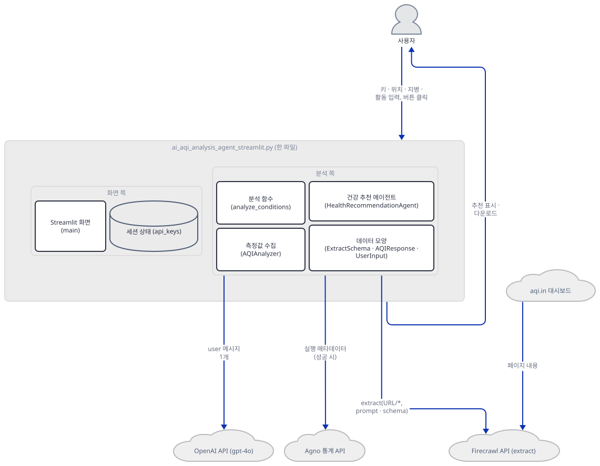

## 사전 준비

| 서비스/도구 | 용도 | 발급·설치 |
|---|---|---|
| uv | 가상환경 생성과 패키지 설치 | [공통 사전 준비](../README.md#공통-사전-준비-한-번만) 절 참고 |
| Python | 이 저장소의 기준은 3.11~3.13이다. 이 문서는 3.13.3으로 확인했다 | 공통 사전 준비와 같음 |
| OpenAI API 키 | `gpt-4o` 호출 인증. 화면 사이드바의 비밀번호 칸에 붙여넣는다(환경변수가 아님, `advanced_ai_agents/multi_agent_apps/ai_aqi_analysis_agent/ai_aqi_analysis_agent_streamlit.py:184-189`). 키 없이 따라 하려면 Step 6의 가짜 서버를 쓴다 | https://platform.openai.com/api-keys |
| Firecrawl API 키 | `extract` 호출 인증. 같은 사이드바의 비밀번호 칸(`advanced_ai_agents/multi_agent_apps/ai_aqi_analysis_agent/ai_aqi_analysis_agent_streamlit.py:178-183`) | https://www.firecrawl.dev/app/api-keys (앱 README의 안내) |
| 인터넷 연결 | PyPI 설치. 앱을 실제로 쓸 때는 Firecrawl API, OpenAI API, agno 사용 통계 서버(`os-api.agno.com`)에 접속하고 Firecrawl 서버가 `aqi.in`을 읽는다. 브라우저가 화면을 열 때 Streamlit의 사용 통계도 나간다(Day 054가 소스로 확인했고, 서버가 시작하며 찍는 안내문대로 `--browser.gatherUsageStats false`로 끈다) | 별도 설치 없음 |

이 문서의 확인 스크립트는 프롬프트의 `µ`(마이크로 기호) 같은 글자를 출력합니다. 한국어 Windows에서 출력을 파이프나 파일로 받으면 기본 인코딩(`cp949`)이 이 글자를 못 써서 죽으니(직접 확인, 문제 해결 둘째 행) 셸을 먼저 이렇게 맞춰 두세요.

```bash
export PYTHONIOENCODING=utf-8
```

```powershell
$env:PYTHONIOENCODING = "utf-8"
```

## 아키텍처 한눈에 보기

| 컴포넌트 | 역할 | 코드 위치 |
|---|---|---|
| 사용자 | 브라우저에서 키 둘, 도시·주·나라, 지병, 활동을 적고 버튼을 누른다 | 코드 없음 (브라우저) |
| Streamlit 화면 (`main`·`render_sidebar`·`render_main_content`) | 사이드바의 키 두 칸, 본문의 입력 다섯 칸, 필수 칸·키 검사, 버튼, 결과와 다운로드 | `advanced_ai_agents/multi_agent_apps/ai_aqi_analysis_agent/ai_aqi_analysis_agent_streamlit.py:163-226`, `advanced_ai_agents/multi_agent_apps/ai_aqi_analysis_agent/ai_aqi_analysis_agent_streamlit.py:228-263` |
| 세션 상태 (`st.session_state.api_keys`) | 두 키를 보관한다. 둘 다 채워졌을 때만 저장된다 | `advanced_ai_agents/multi_agent_apps/ai_aqi_analysis_agent/ai_aqi_analysis_agent_streamlit.py:156-161`, `advanced_ai_agents/multi_agent_apps/ai_aqi_analysis_agent/ai_aqi_analysis_agent_streamlit.py:191-198` |
| 분석 함수 (`analyze_conditions`) | 객체 둘을 만들고 수집 → 추천 순으로 부른다 | `advanced_ai_agents/multi_agent_apps/ai_aqi_analysis_agent/ai_aqi_analysis_agent_streamlit.py:141-154` |
| 측정값 수집 (`AQIAnalyzer`) | URL을 만들고 Firecrawl `extract`를 부르고 응답을 검증하며, 실패하면 0 값을 돌려준다 | `advanced_ai_agents/multi_agent_apps/ai_aqi_analysis_agent/ai_aqi_analysis_agent_streamlit.py:33-96` |
| 데이터 모양 (`ExtractSchema`·`AQIResponse`·`UserInput`) | Firecrawl에 요구하는 일곱 칸 스키마, 응답 검증 모양, 입력 묶음 | `advanced_ai_agents/multi_agent_apps/ai_aqi_analysis_agent/ai_aqi_analysis_agent_streamlit.py:10-31` |
| 건강 추천 에이전트 (`HealthRecommendationAgent`) | 도구도 지시문도 없는 agno `Agent` 하나와 프롬프트 만들기 | `advanced_ai_agents/multi_agent_apps/ai_aqi_analysis_agent/ai_aqi_analysis_agent_streamlit.py:98-139` |
| Firecrawl API | `POST /v1/extract`와 상태 폴링. SDK는 `firecrawl-py` 1.9.0 | 코드 없음 (외부 서비스) |
| aqi.in 대시보드 | Firecrawl 서버가 읽는 페이지. 앱은 주소 문자열만 만든다 | `advanced_ai_agents/multi_agent_apps/ai_aqi_analysis_agent/ai_aqi_analysis_agent_streamlit.py:38-47` |
| OpenAI API (`gpt-4o`) | 추천 문장을 만든다 | `advanced_ai_agents/multi_agent_apps/ai_aqi_analysis_agent/ai_aqi_analysis_agent_streamlit.py:102-106` |
| Agno 통계 API | 성공한 `run` 뒤에 agno가 익명 메타데이터를 보내려 한다 | 코드 없음 (agno 내부) |
| gradio 파일 | 클래스의 복사본(수집 메서드만 다름)에 `gr.Blocks` 화면과 `launch(share=True)`를 얹은 두 번째 UI | `advanced_ai_agents/multi_agent_apps/ai_aqi_analysis_agent/ai_aqi_analysis_agent_gradio.py:1-273` |

위 그림은 한 파일을 화면 쪽과 분석 쪽으로 나눠 묶었고 묶음 안의 호출은 뺐습니다. 함수 호출을 층층이 이으면 그림이 세로로 길어져 읽히지 않기 때문입니다. 화살표는 라벨에 적은 데이터가 가는 방향이고, 이 그림에는 앱에서 나가는 요청과 `aqi.in`에서 Firecrawl로 들어가는 페이지 내용만 있습니다. 뒤 화살표는 앱이 아니라 Firecrawl 서버가 그 페이지를 읽는다는 뜻입니다. 앱이 하는 일은 주소 문자열을 만드는 것뿐이고(소스로 확인) Firecrawl 서버가 실제로 어떻게 읽는지는 보지 못했습니다. 빼 둔 호출과 외부 서비스에서 돌아오는 측정값·추천 텍스트는 아래 그림 둘에 있고, 함수의 반환값은 뒤의 "요청 한 건이 흐르는 과정" 시퀀스에 있습니다. 첫째 그림에서 화면이 `UserInput`을 만들어 분석 함수에 넘기고, 분석 함수가 두 객체를 만들어 부르며, 외부 서비스로 나가는 선은 `AQIAnalyzer`(Firecrawl)와 `HealthRecommendationAgent`(OpenAI와 agno 통계) 둘에서만 나옵니다.

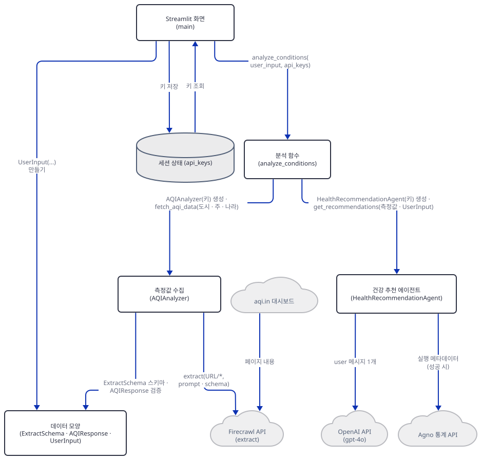

둘째 그림은 수집 클래스가 화면 함수도 직접 부른다는 것입니다. Step 3에서 볼 `fetch_aqi_data`는 호출 전에 `st.info`로 접속할 URL을, 성공하면 `st.expander`·`st.json`·`st.warning`으로 원본 데이터를, 실패하면 `st.error`로 오류 문장을 띄웁니다.

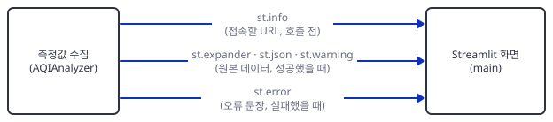

## 단계별 진행

### Step 1. 환경 만들기 — `requirements.txt`에 `streamlit`이 없습니다

**목적.** 앱 폴더에 독립 가상환경을 만들고 의존성을 설치한 뒤, 오늘 풀리는 버전에서 두 파일이 컴파일·임포트되는지 확인합니다.

**할 일.** 저장소 루트에서 시작합니다.

```bash
cd advanced_ai_agents/multi_agent_apps/ai_aqi_analysis_agent
uv venv
uv pip install -r requirements.txt
```

(pip 대안: bash는 `python -m venv .venv && source .venv/bin/activate && pip install -r requirements.txt`입니다. PowerShell 5.1은 `&&`를 받지 않으므로(PowerShell 7부터 지원) 세 줄로 `python -m venv .venv`, `.venv\Scripts\Activate.ps1`, `pip install -r requirements.txt`를 차례로 씁니다. 실행해 보지 못했습니다.) 이후 `uv run`에는 모두 `--no-project`를 붙입니다. 이유는 [공통 사전 준비](../README.md#공통-사전-준비-한-번만)에 있습니다. 앱 README의 1단계는 `git clone` 바로 뒤에 이 `cd`를 적지만(`advanced_ai_agents/multi_agent_apps/ai_aqi_analysis_agent/README.md:43-44`) clone은 저장소 이름의 새 폴더를 만드므로 그 폴더로 먼저 들어가야 맞습니다(소스로 확인).

`advanced_ai_agents/multi_agent_apps/ai_aqi_analysis_agent/requirements.txt:1-5`

```text
agno>=2.2.10
openai
firecrawl-py==1.9.0
gradio==5.9.1
pydantic
```

다섯 줄에 `streamlit`이 없습니다. 앱 README에도 `streamlit`이라는 낱말이 한 번도 나오지 않아(직접 확인) 이 파일은 gradio 파일을 위한 것입니다. 상한이 없는 `agno`·`openai`·`pydantic`은 오늘(2026-10-05) Python 3.13.3에서 agno 3.1.1, openai 3.24.0, pydantic 2.13.5로 풀렸고 패키지 75개가 깔렸습니다(직접 확인). Streamlit 파일을 그대로 임포트하면 이렇게 됩니다.

```bash
uv run --no-project python -c "import ai_aqi_analysis_agent_streamlit"
```

직접 확인한 출력(traceback의 마지막 두 줄):

```
    import streamlit as st
ModuleNotFoundError: No module named 'streamlit'
```

1~7행의 `agno`·`firecrawl`·`pydantic` 임포트는 통과하고 8행에서 멈춥니다. 이 문서는 두 파일을 모두 쓰니 하나를 더 설치합니다.

```bash
uv pip install streamlit
```

(pip 대안: `pip install streamlit`.) 오늘은 streamlit 1.65.0이 받아졌습니다(직접 확인). `firecrawl-py==1.9.0` 고정은 군더더기가 아닙니다. 같은 날 별도 환경에서 고정 없이 설치하니 4.46.2가 깔렸고 그 `extract`는 `params`를 받지 않았습니다(`inspect.signature`로 직접 확인. 버전별 모양은 어제 Day 104 Step 5의 표에 있습니다). 앱의 `extract(urls=..., params=...)` 호출은 요청을 만들기 전에 `TypeError: FirecrawlClient.extract() got an unexpected keyword argument 'params'`로 끝나고(직접 확인), 이 오류도 Step 3의 `except`가 삼켜 0 값으로 바꿉니다(소스로 확인).

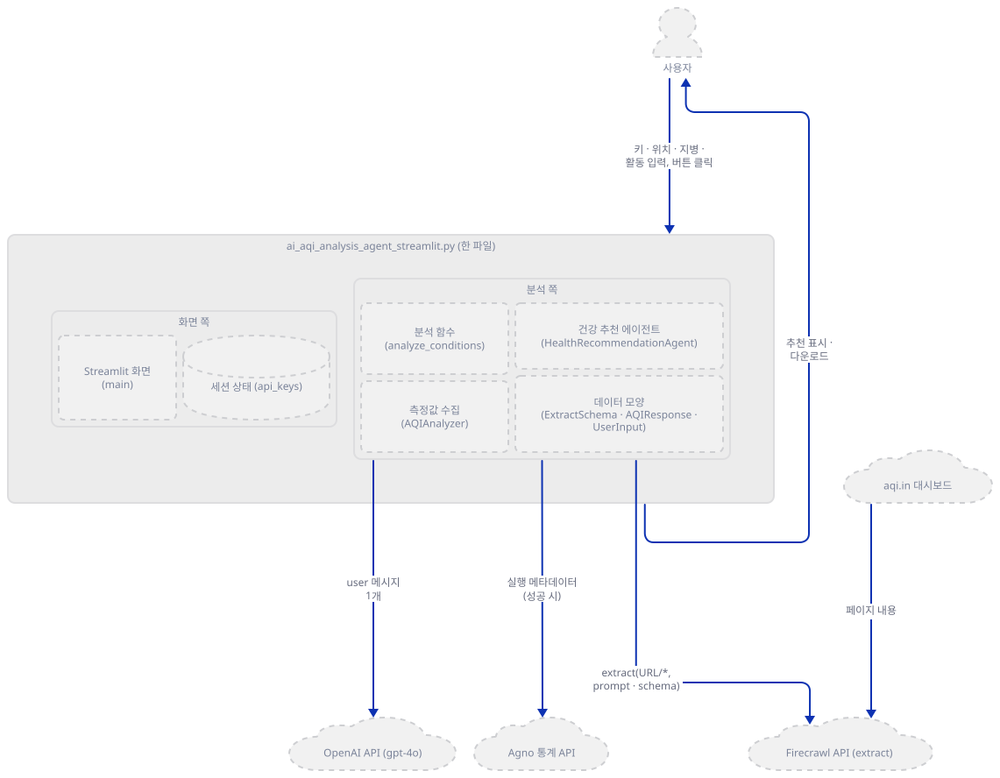

**확인.** 앱 폴더에서 실행합니다. 이 문서의 여러 줄 `python -c "..."` 명령은 안쪽에 작은따옴표만 써서 PowerShell에서도 같은 형태로 쓸 수 있습니다(실행해 보지 못했습니다).

```bash
uv run --no-project python -c "
import sys
from importlib.metadata import version
print(sys.version.split()[0])
for name in ('agno', 'streamlit', 'gradio', 'firecrawl-py', 'openai', 'pydantic'):
    print(name, version(name))
"
```

직접 확인한 출력(버전은 설치하는 날의 최신입니다):

```
3.13.3
agno 3.1.1
streamlit 1.65.0
gradio 5.9.1
firecrawl-py 1.9.0
openai 3.24.0
pydantic 2.13.5
```

```bash
uv run --no-project python -m py_compile ai_aqi_analysis_agent_streamlit.py ai_aqi_analysis_agent_gradio.py && echo compiled
uv run --no-project python -c "
import os
os.environ['GRADIO_ANALYTICS_ENABLED'] = 'False'
import ai_aqi_analysis_agent_streamlit, ai_aqi_analysis_agent_gradio
print('both import ok')
"
uv run --no-project python -c "
import inspect
from firecrawl import FirecrawlApp
print(inspect.signature(FirecrawlApp.extract))
"
```

직접 확인한 출력:

```
compiled
both import ok
(self, urls: List[str], params: Optional[firecrawl.firecrawl.FirecrawlApp.ExtractParams] = None) -> Any
```

둘째 명령이 임포트 전에 `GRADIO_ANALYTICS_ENABLED`를 끄는 까닭은 Step 7에 있습니다. 셋째 명령의 시그니처가 앱이 부르는 `extract(urls, params)`와 맞는 모양입니다.

### Step 2. 데이터의 모양 — 스키마 일곱 칸, 응답 검증, 입력 묶음

**목적.** 앱이 Firecrawl에 요구하는 모양(`ExtractSchema`), 돌려받은 응답을 검증하는 모양(`AQIResponse`), 화면 입력을 묶는 모양(`UserInput`)을 확인합니다.

**할 일.**

`advanced_ai_agents/multi_agent_apps/ai_aqi_analysis_agent/ai_aqi_analysis_agent_streamlit.py:10-31`

```python
class AQIResponse(BaseModel):
    success: bool
    data: Dict[str, float]
    status: str
    expiresAt: str

class ExtractSchema(BaseModel):
    aqi: float = Field(description="Air Quality Index")
    temperature: float = Field(description="Temperature in degrees Celsius")
    humidity: float = Field(description="Humidity percentage")
    wind_speed: float = Field(description="Wind speed in kilometers per hour")
    pm25: float = Field(description="Particulate Matter 2.5 micrometers")
    pm10: float = Field(description="Particulate Matter 10 micrometers")
    co: float = Field(description="Carbon Monoxide level")

@dataclass
class UserInput:
    city: str
    state: str
    country: str
    medical_conditions: Optional[str]
    planned_activity: str
```

`ExtractSchema`는 pydantic 모델이고 Step 3이 `model_json_schema()`로 JSON Schema를 뽑아 Firecrawl에 보냅니다. 일곱 칸이 모두 필수 숫자입니다. `AQIResponse`는 Firecrawl의 응답을 받는 모양입니다. `data`는 키 이름을 가리지 않는 `Dict[str, float]`라서 일곱 키가 다 있는지는 보지 않고, 값이 숫자가 아니면 검증이 실패합니다. 다음 스텝에서 보듯 추출 프롬프트는 데이터의 타임스탬프도 뽑으라고 하는데 스키마에는 그 칸이 없고, `data`에 문자열이 하나라도 섞이면 응답 전체가 거부됩니다. `UserInput`은 검증 없는 평범한 `dataclass`입니다. Day 003이 `FirecrawlTools`로 같은 서비스를 에이전트의 도구로 연결한 것(Day 003 Step 4)과 달리, 이 앱은 어제 Day 104와 같은 방식입니다. 에이전트가 아니라 일반 코드가 SDK의 `FirecrawlApp`을 직접 불러 응답을 딕셔너리로 받고, 그 모양도 코드가 검사합니다.

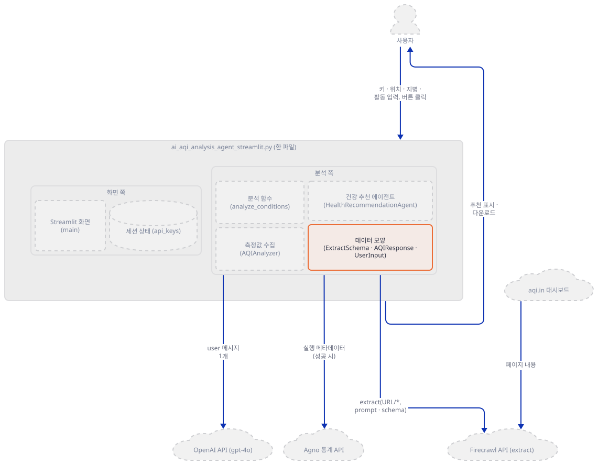

**확인.** 스키마와 검증 결과를 찍습니다.

```bash
uv run --no-project python -c "
from ai_aqi_analysis_agent_streamlit import ExtractSchema
schema = ExtractSchema.model_json_schema()
print(list(schema['properties']))
print(schema['required'] == list(schema['properties']))
print(schema['properties']['co'])
"
```

직접 확인한 출력:

```
['aqi', 'temperature', 'humidity', 'wind_speed', 'pm25', 'pm10', 'co']
True
{'description': 'Carbon Monoxide level', 'title': 'Co', 'type': 'number'}
```

```bash
uv run --no-project python -c "
from pydantic import ValidationError
from ai_aqi_analysis_agent_streamlit import AQIResponse
good = {'success': True, 'status': 'completed', 'expiresAt': '2026-10-06T00:00:00.000Z', 'data': {'aqi': 156, 'temperature': 31, 'humidity': 62, 'wind_speed': 9, 'pm25': 71.5, 'pm10': 120, 'co': 400}}
print(AQIResponse(**good).data)
cases = [('timestamp string', dict(good['data'], timestamp='2026-10-05T11:00:00Z')), ('co is None', dict(good['data'], co=None)), ('co missing', {k: v for k, v in good['data'].items() if k != 'co'})]
for label, data in cases:
    try:
        print(label, '-> accepted, keys:', sorted(AQIResponse(**dict(good, data=data)).data))
    except ValidationError as e:
        print(label, '->', e.errors()[0]['loc'], e.errors()[0]['msg'])
"
```

직접 확인한 출력(`good`의 값은 내가 지어낸 것입니다):

```
{'aqi': 156.0, 'temperature': 31.0, 'humidity': 62.0, 'wind_speed': 9.0, 'pm25': 71.5, 'pm10': 120.0, 'co': 400.0}
timestamp string -> ('data', 'timestamp') Input should be a valid number, unable to parse string as a number
co is None -> ('data', 'co') Input should be a valid number
co missing -> accepted, keys: ['aqi', 'humidity', 'pm10', 'pm25', 'temperature', 'wind_speed']
```

일곱 키 중 하나가 빠진 응답은 이 단계에서 걸러지지 않고 통과합니다. 빠진 키는 Step 4에서 다른 곳에서 터집니다.

### Step 3. 측정값 수집 — URL, `extract`, 그리고 실패하면 0

**목적.** `AQIAnalyzer`가 도시를 URL로 바꾸고, Firecrawl의 `extract`를 부르고, 응답을 검증하고, 실패를 어떻게 처리하는지 확인합니다.

**할 일.** 먼저 생성자와 URL 만들기입니다.

`advanced_ai_agents/multi_agent_apps/ai_aqi_analysis_agent/ai_aqi_analysis_agent_streamlit.py:33-47`

```python
class AQIAnalyzer:
    
    def __init__(self, firecrawl_key: str) -> None:
        self.firecrawl = FirecrawlApp(api_key=firecrawl_key)
    
    def _format_url(self, country: str, state: str, city: str) -> str:
        """Format URL based on location, handling cases with and without state"""
        country_clean = country.lower().replace(' ', '-')
        city_clean = city.lower().replace(' ', '-')
        
        if not state or state.lower() == 'none':
            return f"https://www.aqi.in/dashboard/{country_clean}/{city_clean}"
        
        state_clean = state.lower().replace(' ', '-')
        return f"https://www.aqi.in/dashboard/{country_clean}/{state_clean}/{city_clean}"
```

소문자로 바꾸고 공백을 하이픈으로 바꿀 뿐 앞뒤 공백 정리도 URL 인코딩도 없습니다. 주가 비었거나 문자열 `none`이면 주를 뺍니다. 이 문서는 `aqi.in`에 접속하지 않아 이렇게 만든 주소가 실제로 있는지는 확인하지 못했습니다. 다음은 `extract` 호출과 검증입니다.

`advanced_ai_agents/multi_agent_apps/ai_aqi_analysis_agent/ai_aqi_analysis_agent_streamlit.py:49-65`

```python
    def fetch_aqi_data(self, city: str, state: str, country: str) -> Dict[str, float]:
        """Fetch AQI data using Firecrawl"""
        try:
            url = self._format_url(country, state, city)
            st.info(f"Accessing URL: {url}")  # Display URL being accessed
            
            response = self.firecrawl.extract(
                urls=[f"{url}/*"],
                params={
                    'prompt': 'Extract the current real-time AQI, temperature, humidity, wind speed, PM2.5, PM10, and CO levels from the page. Also extract the timestamp of the data.',
                    'schema': ExtractSchema.model_json_schema()
                }
            )
            
            aqi_response = AQIResponse(**response)
            if not aqi_response.success:
                raise ValueError(f"Failed to fetch AQI data: {aqi_response.status}")
```

주소 뒤에 `/*`를 붙여 넘깁니다. 공식 문서는 `/*`를 그 도메인에서 찾을 수 있는 모든 URL을 크롤링해 파싱한 뒤 요청한 데이터를 뽑는 실험적 기능이라고 적고, `/extract`의 후속으로 `/agent`를 소개합니다(2026-10-05 확인, 조회 도구의 요약이라 원문과 한 글자씩 대조하지는 못했습니다). SDK 1.9.0의 `extract`는 본문을 `POST /v1/extract`로 보낸 뒤 돌려받은 `id`로 `GET /v1/extract/{id}`를 `completed`·`failed`·`cancelled`가 나올 때까지 2초 간격으로 묻는데, 반복에 시간 제한이 없습니다. 모든 예외는 `ValueError(str(e), 500)`로 다시 던져 메시지가 `('문장', 500)` 튜플 꼴이 됩니다(소스로 확인, firecrawl-py 1.9.0의 `firecrawl/firecrawl.py` 514~585행). 성공하면 원본 데이터를 화면에 보여 줍니다.

`advanced_ai_agents/multi_agent_apps/ai_aqi_analysis_agent/ai_aqi_analysis_agent_streamlit.py:67-72`

```python
            with st.expander("📦 Raw AQI Data", expanded=True):
                st.json({
                    "url_accessed": url,
                    "timestamp": aqi_response.expiresAt,
                    "data": aqi_response.data
                })
```

화면의 `timestamp`는 측정 시각이 아니라 응답의 `expiresAt`입니다. 공식 문서의 추출 상태 응답 설명에는 이 필드의 뜻이 적혀 있지 않았고(2026-10-05 확인, 조회 도구의 요약), firecrawl-py 1.9.0의 crawl·batch 상태 docstring은 "데이터가 만료되는 시각"이라고 적습니다(소스로 확인). 측정 시각이라는 근거는 찾지 못했습니다. 마지막은 실패 처리입니다.

`advanced_ai_agents/multi_agent_apps/ai_aqi_analysis_agent/ai_aqi_analysis_agent_streamlit.py:84-96`

```python
            return aqi_response.data
            
        except Exception as e:
            st.error(f"Error fetching AQI data: {str(e)}")
            return {
                'aqi': 0,
                'temperature': 0,
                'humidity': 0,
                'wind_speed': 0,
                'pm25': 0,
                'pm10': 0,
                'co': 0
            }
```

`try` 안의 어떤 실패든(키 오류, 네트워크, 검증 실패, 버전 불일치) 오류 문장을 화면에 띄운 뒤 값 일곱 개가 모두 0인 딕셔너리를 돌려줍니다. 호출한 쪽은 이것이 실패인지 실제 0인지 구별할 수 없고, 다음 스텝의 분석 함수는 구별하려 하지도 않습니다.

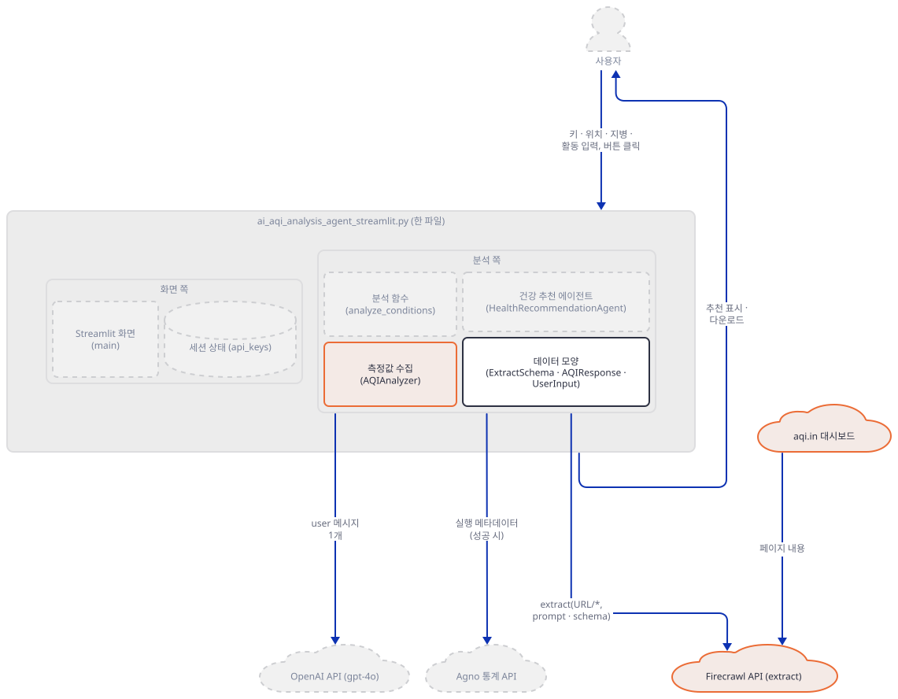

**확인.** URL 만들기는 순수 함수라 서비스 없이 확인됩니다.

```bash
uv run --no-project python -c "
from ai_aqi_analysis_agent_streamlit import AQIAnalyzer
a = AQIAnalyzer('fc-test')
for args in [('India', 'Maharashtra', 'Mumbai'), ('India', '', 'Delhi'), ('United States', '', 'New York'), ('India', 'None', 'Delhi'), ('', '', 'Mumbai')]:
    print(args, '->', a._format_url(*args))
"
```

직접 확인한 출력(인자는 나라·주·도시 순서입니다):

```
('India', 'Maharashtra', 'Mumbai') -> https://www.aqi.in/dashboard/india/maharashtra/mumbai
('India', '', 'Delhi') -> https://www.aqi.in/dashboard/india/delhi
('United States', '', 'New York') -> https://www.aqi.in/dashboard/united-states/new-york
('India', 'None', 'Delhi') -> https://www.aqi.in/dashboard/india/delhi
('', '', 'Mumbai') -> https://www.aqi.in/dashboard//mumbai
```

나라를 비우면 `dashboard//mumbai`가 됩니다. Step 5에서 보듯 화면의 검사는 나라 칸을 보지 않습니다. 이 앱이 쓰는 `FirecrawlApp(api_key=...)`는 생성할 때 키를 확인하고 네트워크는 쓰지 않습니다. 아래 명령은 `FIRECRAWL_API_KEY` 환경변수가 없는 셸에서 돌립니다. 있으면 빈 키 대신 그 값이 쓰입니다(소스로 확인).

```bash
uv run --no-project python -c "
from firecrawl import FirecrawlApp
try:
    FirecrawlApp(api_key='')
except ValueError as e:
    print('empty key ->', e)
print(FirecrawlApp(api_key='fc-test').api_url)
"
```

직접 확인한 출력:

```
empty key -> No API key provided
https://api.firecrawl.dev
```

기본 주소는 소스에서 환경변수 `FIRECRAWL_API_URL`로 바꿀 수 있고(소스로 확인), Step 6이 이 점을 이용합니다. 마지막으로 `extract`가 예외를 던지게 만들어 0 값을 확인합니다.

```bash
uv run --no-project python -c "
from unittest.mock import MagicMock
from ai_aqi_analysis_agent_streamlit import AQIAnalyzer
a = AQIAnalyzer('fc-test')
a.firecrawl = MagicMock()
a.firecrawl.extract.side_effect = ValueError('boom', 500)
print(a.fetch_aqi_data('Mumbai', 'Maharashtra', 'India'))
"
```

직접 확인한 출력(맨 위의 Streamlit 경고 여러 줄은 `streamlit run` 없이 `st.error`를 부를 때의 안내라 뺐습니다):

```
{'aqi': 0, 'temperature': 0, 'humidity': 0, 'wind_speed': 0, 'pm25': 0, 'pm10': 0, 'co': 0}
```

### Step 4. 건강 추천 에이전트와 분석 함수 — 에이전트는 하나, 0도 그대로 넘어갑니다

**목적.** 추천을 만드는 객체의 구성과 프롬프트를 보고, `analyze_conditions`가 두 단계를 어떻게 잇는지 확인합니다.

**할 일.**

`advanced_ai_agents/multi_agent_apps/ai_aqi_analysis_agent/ai_aqi_analysis_agent_streamlit.py:98-107`

```python
class HealthRecommendationAgent:
    
    def __init__(self, openai_key: str) -> None:
        self.agent = Agent(
            model=OpenAIChat(
                id="gpt-4o",
                name="Health Recommendation Agent",
                api_key=openai_key
            )
        )
```

`Agent`에는 모델 하나뿐이고 `tools`·`instructions`·`role`이 없습니다. "Health Recommendation Agent"라는 이름표도 에이전트가 아니라 `OpenAIChat`의 `name`에 붙어서 `agent.name`은 `None`입니다(직접 확인). 앱 README는 이 앱을 "AQI Analyzer"와 "Health Recommendation Agent"의 멀티 에이전트라고 소개하지만(`advanced_ai_agents/multi_agent_apps/ai_aqi_analysis_agent/README.md:11-13`) 두 파일에서 `= Agent(`는 한 곳씩입니다(직접 확인). 수집 쪽의 추출은 Firecrawl 서버가 하고(공식 문서가 `/extract`를 "LLM-powered extraction"이라고 설명합니다. 2026-10-05 확인) 이 앱의 코드에는 모델이 하나뿐입니다.

`advanced_ai_agents/multi_agent_apps/ai_aqi_analysis_agent/ai_aqi_analysis_agent_streamlit.py:109-116`

```python
    def get_recommendations(
        self,
        aqi_data: Dict[str, float],
        user_input: UserInput
    ) -> str:
        prompt = self._create_prompt(aqi_data, user_input)
        response: RunOutput = self.agent.run(prompt)
        return response.content
```

`run`에 프롬프트 문자열 하나를 줄 뿐이라 모델에는 `user` 메시지 하나가 갑니다(Step 6에서 요청 본문으로 확인). 프롬프트는 이 함수가 만듭니다.

`advanced_ai_agents/multi_agent_apps/ai_aqi_analysis_agent/ai_aqi_analysis_agent_streamlit.py:118-139`

```python
    def _create_prompt(self, aqi_data: Dict[str, float], user_input: UserInput) -> str:
        return f"""
        Based on the following air quality conditions in {user_input.city}, {user_input.state}, {user_input.country}:
        - Overall AQI: {aqi_data['aqi']}
        - PM2.5 Level: {aqi_data['pm25']} µg/m³
        - PM10 Level: {aqi_data['pm10']} µg/m³
        - CO Level: {aqi_data['co']} ppb
        
        Weather conditions:
        - Temperature: {aqi_data['temperature']}°C
        - Humidity: {aqi_data['humidity']}%
        - Wind Speed: {aqi_data['wind_speed']} km/h
        
        User's Context:
        - Medical Conditions: {user_input.medical_conditions or 'None'}
        - Planned Activity: {user_input.planned_activity}
        **Comprehensive Health Recommendations:**
        1. **Impact of Current Air Quality on Health:**
        2. **Necessary Safety Precautions for Planned Activity:**
        3. **Advisability of Planned Activity:**
        4. **Best Time to Conduct the Activity:**
        """
```

CO의 단위 `ppb`는 프롬프트가 붙인 것이고 스키마의 설명("Carbon Monoxide level")에는 단위가 없어서, 추출 값이 ppb라는 근거는 코드에 없습니다. 주가 비면 "Delhi, , India"처럼 쉼표가 겹칩니다. 지병이 비면 `None`이라는 글자가 들어갑니다. 일곱 키는 `aqi_data[...]`로 읽으니 하나라도 없으면 `KeyError`입니다. 두 단계를 잇는 함수는 이것입니다.

`advanced_ai_agents/multi_agent_apps/ai_aqi_analysis_agent/ai_aqi_analysis_agent_streamlit.py:141-154`

```python
def analyze_conditions(
    user_input: UserInput,
    api_keys: Dict[str, str]
) -> str:
    aqi_analyzer = AQIAnalyzer(firecrawl_key=api_keys['firecrawl'])
    health_agent = HealthRecommendationAgent(openai_key=api_keys['openai'])
    
    aqi_data = aqi_analyzer.fetch_aqi_data(
        city=user_input.city,
        state=user_input.state,
        country=user_input.country
    )
    
    return health_agent.get_recommendations(aqi_data, user_input)
```

두 객체를 먼저 다 만들고(Firecrawl 키 확인은 이 생성에서 일어납니다) 수집 → 추천 순으로 부릅니다. 수집이 0 값을 돌려줘도 막는 줄이 없어서, 실패한 측정은 "AQI 0, PM2.5 0"이라는 프롬프트가 되어 모델에 갑니다. 아래 그림이 실패가 모델 요청에 이르는 길이고 실제 실행은 Step 6에서 봅니다. 성공한 `run` 뒤의 agno 통계 전송은 Day 047 Step 5가 다룬 것과 같습니다.

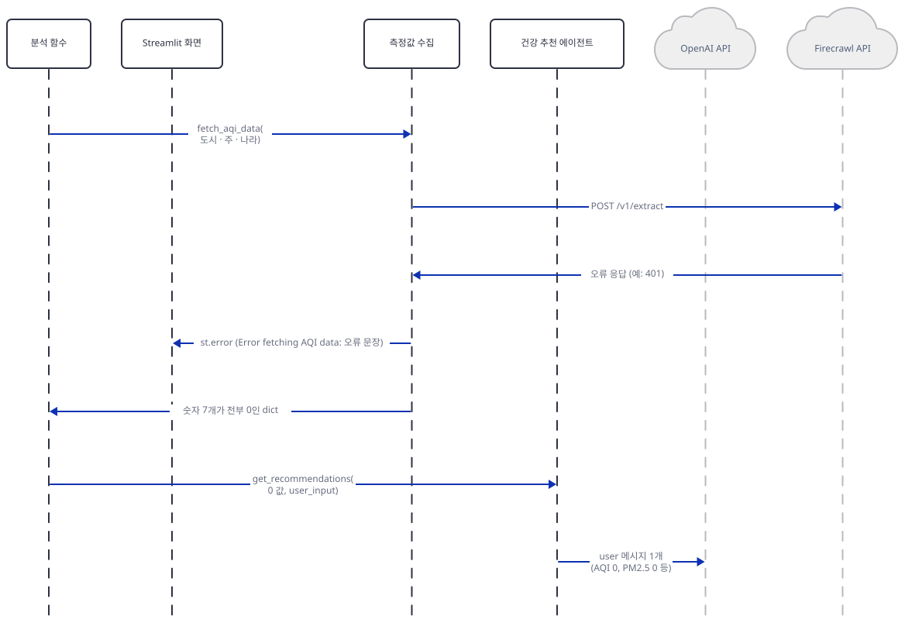

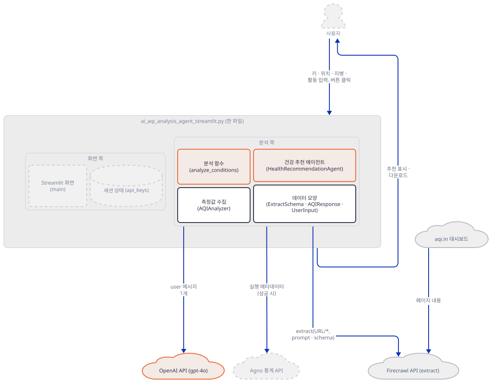

**확인.** 에이전트의 구성과 프롬프트를 서비스 없이 확인합니다.

```bash
uv run --no-project python -c "
from ai_aqi_analysis_agent_streamlit import HealthRecommendationAgent
a = HealthRecommendationAgent('sk-test').agent
print(type(a).__name__, '| name:', a.name, '| tools:', a.tools, '| instructions:', a.instructions)
print(type(a.model).__name__, '| id:', a.model.id, '| name:', a.model.name)
"
grep -n "= Agent(" ai_aqi_analysis_agent_streamlit.py ai_aqi_analysis_agent_gradio.py
```

(PowerShell: 둘째 줄은 `Select-String "= Agent\(" ai_aqi_analysis_agent_streamlit.py, ai_aqi_analysis_agent_gradio.py`. 실행해 보지 못했습니다.)

직접 확인한 출력:

```
Agent | name: None | tools: [] | instructions: None
OpenAIChat | id: gpt-4o | name: Health Recommendation Agent
ai_aqi_analysis_agent_streamlit.py:101:        self.agent = Agent(
ai_aqi_analysis_agent_gradio.py:85:        self.agent = Agent(
```

```bash
uv run --no-project python -c "
from ai_aqi_analysis_agent_streamlit import HealthRecommendationAgent, UserInput
data = {'aqi': 156.0, 'temperature': 31.0, 'humidity': 62.0, 'wind_speed': 9.0, 'pm25': 71.5, 'pm10': 120.0, 'co': 400.0}
h = HealthRecommendationAgent('sk-test')
print(h._create_prompt(data, UserInput('Delhi', '', 'India', '', 'morning jog for 2 hours')))
del data['co']
try:
    h._create_prompt(data, UserInput('Delhi', '', 'India', '', 'morning jog for 2 hours'))
except KeyError as e:
    print('KeyError', e)
"
```

직접 확인한 출력(프롬프트는 앞쪽 빈 줄과 8칸 들여쓰기까지 그대로입니다):

```

        Based on the following air quality conditions in Delhi, , India:
        - Overall AQI: 156.0
        - PM2.5 Level: 71.5 µg/m³
        - PM10 Level: 120.0 µg/m³
        - CO Level: 400.0 ppb
        
        Weather conditions:
        - Temperature: 31.0°C
        - Humidity: 62.0%
        - Wind Speed: 9.0 km/h
        
        User's Context:
        - Medical Conditions: None
        - Planned Activity: morning jog for 2 hours
        **Comprehensive Health Recommendations:**
        1. **Impact of Current Air Quality on Health:**
        2. **Necessary Safety Precautions for Planned Activity:**
        3. **Advisability of Planned Activity:**
        4. **Best Time to Conduct the Activity:**
        
KeyError 'co'
```

### Step 5. 화면 — 키 두 칸, 입력 다섯 칸, 두 개의 문

**목적.** 화면이 키를 모으고, 입력을 검사하고, 분석 함수를 부르고, 결과를 보여 주는 흐름을 키 없이 `AppTest`로 확인합니다.

**할 일.** 키는 환경변수가 아니라 사이드바의 비밀번호 칸 둘에서 받습니다.

`advanced_ai_agents/multi_agent_apps/ai_aqi_analysis_agent/ai_aqi_analysis_agent_streamlit.py:173-198`

```python
def render_sidebar():
    """Render sidebar with API configuration"""
    with st.sidebar:
        st.header("🔑 API Configuration")
        
        new_firecrawl_key = st.text_input(
            "Firecrawl API Key",
            type="password",
            value=st.session_state.api_keys['firecrawl'],
            help="Enter your Firecrawl API key"
        )
        new_openai_key = st.text_input(
            "OpenAI API Key",
            type="password",
            value=st.session_state.api_keys['openai'],
            help="Enter your OpenAI API key"
        )
        
        if (new_firecrawl_key and new_openai_key and
            (new_firecrawl_key != st.session_state.api_keys['firecrawl'] or 
             new_openai_key != st.session_state.api_keys['openai'])):
            st.session_state.api_keys.update({
                'firecrawl': new_firecrawl_key,
                'openai': new_openai_key
            })
            st.success("✅ API keys updated!")
```

키는 둘 다 채워졌고 하나라도 바뀌었을 때만 `st.session_state.api_keys`에 저장됩니다. 한 칸만 채우면 저장되지 않습니다(아래에서 확인). 본문의 입력은 City·State·Country(기본값 "India")와 Medical Conditions·Planned Activity 두 `text_area`이고 `UserInput`으로 묶여 나옵니다(`advanced_ai_agents/multi_agent_apps/ai_aqi_analysis_agent/ai_aqi_analysis_agent_streamlit.py:200-226`). 버튼 이후는 `main`입니다.

`advanced_ai_agents/multi_agent_apps/ai_aqi_analysis_agent/ai_aqi_analysis_agent_streamlit.py:228-263`

```python
def main():
    """Main application entry point"""
    initialize_session_state()
    setup_page()
    render_sidebar()
    user_input = render_main_content()
    
    result = None
    
    if st.button("🔍 Analyze & Get Recommendations"):
        if not all([user_input.city, user_input.planned_activity]):
            st.error("Please fill in all required fields (state and medical conditions are optional)")
        elif not all(st.session_state.api_keys.values()):
            st.error("Please provide both API keys in the sidebar")
        else:
            try:
                with st.spinner("🔄 Analyzing conditions..."):
                    result = analyze_conditions(
                        user_input=user_input,
                        api_keys=st.session_state.api_keys
                    )
                    st.success("✅ Analysis completed!")
            
            except Exception as e:
                st.error(f"❌ Error: {str(e)}")

    if result:
        st.markdown("### 📦 Recommendations")
        st.markdown(result)
        
        st.download_button(
            "💾 Download Recommendations",
            data=result,
            file_name=f"aqi_recommendations_{user_input.city}_{user_input.state}.txt",
            mime="text/plain"
        )
```

문이 둘입니다. 첫째는 도시와 활동이 비지 않았는지(주·지병은 선택이고 나라 칸은 검사하지 않습니다), 둘째는 키 둘이 모두 저장돼 있는지입니다. `analyze_conditions`가 던진 예외는 `main`이 `❌ Error:`로 보여 주고, Step 3의 `except`가 삼킨 실패는 이 `except`에 닿지 않아 "Analysis completed!"가 뜹니다. 결과는 `main`의 지역 변수 `result`에만 있어서 Streamlit이 상호작용마다 스크립트를 처음부터 다시 실행하면 사라집니다(Day 012 Step 2가 설명한 리런 모델이고, 그쪽 앱은 일정을 `st.session_state`에 넣어 유지합니다).

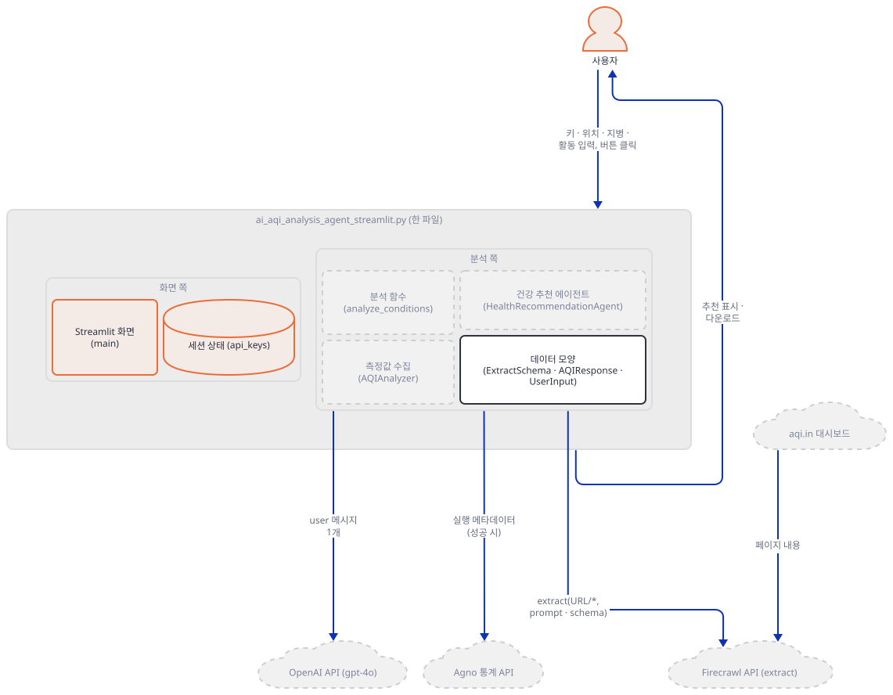

**확인.** 앱을 브라우저로 띄우는 명령은 이렇습니다.

```bash
uv run --no-project streamlit run ai_aqi_analysis_agent_streamlit.py
```

이 문서는 브라우저 대신 `AppTest`(브라우저 없이 스크립트를 실행하고 위젯을 코드로 조작하게 해 주는 Streamlit의 도구)로 화면을 확인했습니다. 앱 폴더에서 실행합니다.

```bash
uv run --no-project python -c "
from streamlit.proto.TextInput_pb2 import TextInput
from streamlit.testing.v1 import AppTest
at = AppTest.from_file('ai_aqi_analysis_agent_streamlit.py', default_timeout=60)
at.run()
print([(t.label, TextInput.Type.Name(t.proto.type)) for t in at.sidebar.text_input])
print([(t.label, t.value) for t in at.main.text_input])
print([t.label for t in at.main.text_area], [b.label for b in at.button])
at.button[0].click().run()
print('click, nothing typed:', [e.value for e in at.error])
at.main.text_input[0].set_value('Mumbai')
at.main.text_area[1].set_value('morning jog for 2 hours')
at.button[0].click().run()
print('city + activity, no keys:', [e.value for e in at.error])
at.sidebar.text_input[0].set_value('fc-test')
at.run()
print('one key:', at.session_state['api_keys'])
at.sidebar.text_input[1].set_value('sk-test')
at.run()
print('two keys:', at.session_state['api_keys'], [s.value for s in at.success])
"
```

직접 확인한 출력(맨 위에 `missing ScriptRunContext!` 경고가 한 줄 나오지만 `streamlit run` 없이 돌릴 때의 안내라 결과와 무관합니다):

```
[('Firecrawl API Key', 'PASSWORD'), ('OpenAI API Key', 'PASSWORD')]
[('City', ''), ('State', ''), ('Country', 'India')]
['Medical Conditions (optional)', 'Planned Activity'] ['🔍 Analyze & Get Recommendations']
click, nothing typed: ['Please fill in all required fields (state and medical conditions are optional)']
city + activity, no keys: ['Please provide both API keys in the sidebar']
one key: {'firecrawl': '', 'openai': ''}
two keys: {'firecrawl': 'fc-test', 'openai': 'sk-test'} ['API keys updated!']
```

Streamlit이 `st.success`·`st.error` 본문 앞의 이모지를 아이콘 칸으로 옮기므로 `AppTest`의 `value`에는 이모지가 없고 `proto.icon`에 들어 있습니다(소스로 확인, streamlit 1.65.0의 `elements/alert.py`. 직접 확인: `proto.icon`이 `✅`). 서버만 띄워 응답을 보려면 `--server.address localhost`를 붙입니다. 안 붙이면 Streamlit이 시작하며 외부 IP를 알아내려고 `checkip.amazonaws.com`에 접속합니다(Day 054와 Day 060이 확인한 사실입니다. 포트는 겹치지 않는 아무 높은 번호입니다).

```bash
uv run --no-project streamlit run ai_aqi_analysis_agent_streamlit.py --server.headless true --server.address localhost --server.port 57482
```

직접 확인한 출력(시각은 실행마다 다릅니다):

```
Collecting usage statistics. To deactivate, set browser.gatherUsageStats to false.

2026-10-05 12:28:10.450 Uvicorn server started on localhost:57482

  You can now view your Streamlit app in your browser.

  URL: http://localhost:57482
```

다른 터미널에서:

```bash
curl -s -o /dev/null -w "%{http_code}\n" http://localhost:57482
curl -s http://localhost:57482/_stcore/health
```

```
200
ok
```

(PowerShell이면 `curl` 대신 `(Invoke-WebRequest -Uri http://localhost:57482 -UseBasicParsing).StatusCode`와 `(Invoke-WebRequest -Uri http://localhost:57482/_stcore/health -UseBasicParsing).Content`를 씁니다. Windows PowerShell 5.1에서 `curl`은 `Invoke-WebRequest`의 별칭이라 `-s` 같은 curl 옵션이 통하지 않습니다. 문법 규칙으로 판단한 것이고 실행해 보지 못했습니다.) 서버는 `Ctrl+C`로 멈춥니다.

### Step 6. 가짜 서비스 둘로 끝까지 — 요청 본문과 실패 둘

**목적.** Firecrawl과 OpenAI 쪽을 내 PC의 가짜 서버로 받아, 버튼 한 번이 서비스로 보내는 요청의 실제 모양과 실패 둘의 모양을 확인합니다.

**할 일.** `FIRECRAWL_API_URL`은 firecrawl-py가, `OPENAI_BASE_URL`은 `openai` 패키지가 읽는 환경변수라서 둘을 같은 가짜 서버로 돌리면 한 프로세스가 두 서비스를 흉내 냅니다(경로가 `/v1/extract`와 `/v1/chat/completions`로 겹치지 않습니다). 앱 폴더에 파일 둘을 편집기로 만듭니다. `AppTest.from_file`은 상대 경로를 스크립트가 있는 폴더 기준으로 풀어서 앱과 같은 폴더여야 합니다. 첫째는 받은 요청을 찍는 가짜 서버로, Firecrawl 쪽은 첫 폴링에 `processing`을 돌려주고 둘째 폴링에 값을 주며, 키가 `fc-bad`(Firecrawl)나 `sk-bad`(OpenAI)면 401을 돌려줍니다. 응답의 모양과 숫자는 SDK와 앱이 읽는 필드에 맞춰 내가 지어낸 것입니다.

`fake_services.py`

```python
import json
import sys
from http.server import BaseHTTPRequestHandler, ThreadingHTTPServer

sys.stdout.reconfigure(encoding="utf-8")
PORT = int(sys.argv[1])
polls = {}


class Handler(BaseHTTPRequestHandler):
    def log_message(self, *args):
        pass

    def reply(self, status, body):
        data = json.dumps(body).encode()
        self.send_response(status)
        self.send_header("content-type", "application/json")
        self.send_header("content-length", str(len(data)))
        self.end_headers()
        self.wfile.write(data)

    def do_POST(self):
        body = json.loads(self.rfile.read(int(self.headers["content-length"])))
        auth = self.headers["authorization"]
        if self.path == "/v1/extract":
            print("POST", self.path, "|", auth, "| keys:", sorted(body), flush=True)
            print("  urls  :", body["urls"], flush=True)
            print("  prompt:", body["prompt"], flush=True)
            print("  schema:", sorted(body["schema"]["properties"]), flush=True)
            if auth == "Bearer fc-bad":
                self.reply(401, {"success": False, "error": "fake server: invalid Firecrawl key"})
            else:
                job = f"job-{len(polls) + 1}"
                polls[job] = 0
                self.reply(200, {"success": True, "id": job})
        elif self.path == "/v1/chat/completions":
            print("POST", self.path, "|", auth, "| model:", body["model"], "| keys:", sorted(body), flush=True)
            for m in body["messages"]:
                print(f"  [{m['role']}]", m["content"], flush=True)
            if auth == "Bearer sk-bad":
                self.reply(401, {"error": {"message": "fake server: invalid OpenAI key", "type": "invalid_request_error", "param": None, "code": "invalid_api_key"}})
            else:
                self.reply(200, {
                    "id": "chatcmpl-fake", "object": "chat.completion", "created": 0, "model": body["model"],
                    "choices": [{"index": 0, "finish_reason": "stop", "message": {"role": "assistant", "content": "FAKE RECOMMENDATIONS"}}],
                    "usage": {"prompt_tokens": 1, "completion_tokens": 1, "total_tokens": 2},
                })

    def do_GET(self):
        job = self.path.rsplit("/", 1)[-1]
        polls[job] += 1
        print("GET ", self.path, "| poll", polls[job], flush=True)
        if polls[job] == 1:
            self.reply(200, {"success": True, "status": "processing", "data": []})
        else:
            self.reply(200, {
                "success": True, "status": "completed", "expiresAt": "2026-10-06T00:00:00.000Z",
                "data": {"aqi": 156, "temperature": 31, "humidity": 62, "wind_speed": 9, "pm25": 71.5, "pm10": 120, "co": 400},
            })


ThreadingHTTPServer(("127.0.0.1", PORT), Handler).serve_forever()
```

둘째는 앱을 `AppTest`로 세 번 돌려 버튼을 누르는 확인 스크립트입니다. 정상 키, 틀린 Firecrawl 키, 틀린 OpenAI 키입니다. `Agent.run` 호출을 세고, agno의 통계 전송 함수는 보내는 대신 모아 둡니다(agno 3.1.1의 내부 함수라 다른 버전에서는 안 먹을 수 있습니다). 마지막에는 결과가 뜬 뒤 도시 칸을 고쳐 화면이 어떻게 되는지 봅니다.

`check_flow.py`

```python
import os

os.environ["OPENAI_BASE_URL"] = "http://127.0.0.1:57481/v1"
os.environ["FIRECRAWL_API_URL"] = "http://127.0.0.1:57481"

from agno.agent import Agent
from agno.api.api import Api
from streamlit.testing.v1 import AppTest

runs, posts = [], []
original_run = Agent.run


def spy_run(self, *args, **kwargs):
    runs.append(self.model.name)
    return original_run(self, *args, **kwargs)


Agent.run = spy_run
Api.post_in_background = lambda self, route, payload: posts.append((route, payload["data"]))


def click(firecrawl_key, openai_key):
    at = AppTest.from_file("ai_aqi_analysis_agent_streamlit.py", default_timeout=60)
    at.run()
    at.sidebar.text_input[0].set_value(firecrawl_key)
    at.sidebar.text_input[1].set_value(openai_key)
    at.main.text_input[0].set_value("Mumbai")
    at.main.text_input[1].set_value("Maharashtra")
    at.main.text_area[0].set_value("asthma")
    at.main.text_area[1].set_value("morning jog for 2 hours")
    at.button[0].click().run()
    return at


cases = [("both keys ok", ("fc-ok", "sk-ok")), ("wrong Firecrawl key", ("fc-bad", "sk-ok")), ("wrong OpenAI key", ("fc-ok", "sk-bad"))]
for label, keys in cases:
    runs.clear()
    posts.clear()
    at = click(*keys)
    print("---", label)
    print("Agent.run calls:", runs)
    print("error   :", [e.value for e in at.error])
    print("success :", [s.value for s in at.success if s.value != "API keys updated!"])
    print("json    :", [j.value for j in at.json])
    print("page    :", at.markdown[-1].value)
    sent = " ".join(str(data) for _, data in posts)
    print("telemetry:", [route for route, _ in posts], "| mentions city or keys:", any(w in sent for w in ("Mumbai", "asthma", "fc-", "sk-")))

at = click("fc-ok", "sk-ok")
buttons = at.get("download_button")
print("--- after the result")
print("download buttons:", len(buttons), "| ignore_rerun:", [b.proto.ignore_rerun for b in buttons])
at.main.text_input[0].set_value("Delhi")
at.run()
print("after editing City: markdown", [m.value for m in at.markdown], "| download buttons:", len(at.get("download_button")))
```

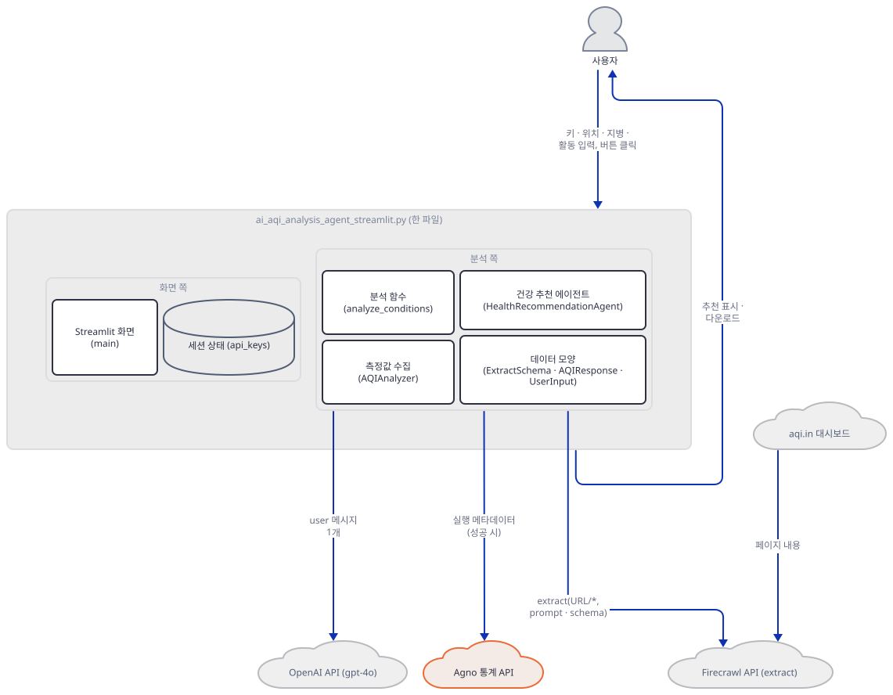

**확인.** 첫 터미널(앱 폴더)에서 가짜 서버를 띄웁니다. 포트는 두 파일에서 같게 맞추면 어떤 높은 번호여도 됩니다.

```bash
uv run --no-project python fake_services.py 57481
```

둘째 터미널(앱 폴더)에서 확인 스크립트를 돌립니다.

```bash
uv run --no-project python check_flow.py
```

직접 확인한 출력(맨 위의 `missing ScriptRunContext!` 경고 셋은 뺐고, 세 번째 사례 앞의 `ERROR` 세 줄은 agno가 가짜 서버의 401을 로그로 남긴 것입니다):

```
--- both keys ok
Agent.run calls: ['Health Recommendation Agent']
error   : []
success : ['Analysis completed!']
json    : ['{"url_accessed": "https://www.aqi.in/dashboard/india/maharashtra/mumbai", "timestamp": "2026-10-06T00:00:00.000Z", "data": {"aqi": 156.0, "temperature": 31.0, "humidity": 62.0, "wind_speed": 9.0, "pm25": 71.5, "pm10": 120.0, "co": 400.0}}']
page    : FAKE RECOMMENDATIONS
telemetry: ['/telemetry/runs'] | mentions city or keys: False
--- wrong Firecrawl key
Agent.run calls: ['Health Recommendation Agent']
error   : ["Error fetching AQI data: ('Unexpected error during extract: Status code 401. fake server: invalid Firecrawl key - No additional error details provided.', 500)"]
success : ['Analysis completed!']
json    : []
page    : FAKE RECOMMENDATIONS
telemetry: ['/telemetry/runs'] | mentions city or keys: False
ERROR   API status error from OpenAI API: Error code: 401 - {'error': {'message': 'fake server: invalid OpenAI key', 'type': 'invalid_request_error', 'param': None, 'code': 'invalid_api_key'}}
ERROR   Non-retryable model provider error: fake server: invalid OpenAI key
ERROR   Error in Agent run: fake server: invalid OpenAI key
--- wrong OpenAI key
Agent.run calls: ['Health Recommendation Agent']
error   : []
success : ['Analysis completed!']
json    : ['{"url_accessed": "https://www.aqi.in/dashboard/india/maharashtra/mumbai", "timestamp": "2026-10-06T00:00:00.000Z", "data": {"aqi": 156.0, "temperature": 31.0, "humidity": 62.0, "wind_speed": 9.0, "pm25": 71.5, "pm10": 120.0, "co": 400.0}}']
page    : fake server: invalid OpenAI key
telemetry: [] | mentions city or keys: False
--- after the result
download buttons: 1 | ignore_rerun: [False]
after editing City: markdown [] | download buttons: 0
```

첫 터미널(가짜 서버)에는 정상 키 사례의 요청이 이렇게 찍힙니다.

```
POST /v1/extract | Bearer fc-ok | keys: ['allowExternalLinks', 'origin', 'prompt', 'schema', 'urls']
  urls  : ['https://www.aqi.in/dashboard/india/maharashtra/mumbai/*']
  prompt: Extract the current real-time AQI, temperature, humidity, wind speed, PM2.5, PM10, and CO levels from the page. Also extract the timestamp of the data.
  schema: ['aqi', 'co', 'humidity', 'pm10', 'pm25', 'temperature', 'wind_speed']
GET  /v1/extract/job-1 | poll 1
GET  /v1/extract/job-1 | poll 2
POST /v1/chat/completions | Bearer sk-ok | model: gpt-4o | keys: ['messages', 'model']
  [user] 
        Based on the following air quality conditions in Mumbai, Maharashtra, India:
        - Overall AQI: 156.0
        ...
```

(네 번째 줄 아래는 Step 4의 프롬프트와 같은 모양이라 줄였고, 지병과 활동 줄에는 `asthma`와 `morning jog for 2 hours`가 들어갑니다.) 틀린 Firecrawl 키 사례에서는 `POST /v1/extract | Bearer fc-bad` 한 줄 뒤에 폴링 없이 곧바로 `POST /v1/chat/completions`가 오고, 그 `user` 메시지의 값은 이렇습니다.

```
        - Overall AQI: 0
        - PM2.5 Level: 0 µg/m³
        - PM10 Level: 0 µg/m³
        - CO Level: 0 ppb
        ...
        - Temperature: 0°C
        - Humidity: 0%
        - Wind Speed: 0 km/h
```

읽을 것은 다섯입니다. 첫째, Firecrawl로 간 본문의 키는 `urls`, `prompt`, `schema`, `allowExternalLinks`, `origin`이고 주소 끝에 `/*`가 붙어 있으며, `GET`이 두 번 나가고 첫 응답이 `processing`이었으니 SDK가 폴링을 합니다. 둘째, 모델로 간 요청의 최상위 키는 `messages`와 `model`뿐이고 메시지는 `user` 하나라 도구도 시스템 메시지도 `max_tokens`도 없습니다. 이 에이전트는 모델 호출 하나를 감싼 껍데기입니다. 셋째, 틀린 Firecrawl 키에서 `('…', 500)` 튜플 꼴 오류 문장과 "Analysis completed!"가 함께 뜨고 모델은 값이 모두 0인 프롬프트에 답했습니다. 넷째, 틀린 OpenAI 키에서는 `st.error`가 아니라 서버의 오류 문장이 추천 자리에 일반 글자로 나옵니다. agno의 `Agent.run`이 모델 오류를 예외 대신 `content`에 담아 돌려주고 앱이 그 문자열을 `st.markdown`에 넘기기 때문입니다. 다섯째, 통계 전송은 성공한 실행마다 한 건이고 실패한 실행에는 없으며 담긴 값에 도시·지병·키는 없습니다. Day 047 Step 5가 소스로 확인한 `POST /telemetry/runs`와 같은 것입니다(그날은 agno 3.0.10, 오늘은 3.1.1). 연결을 막은 환경에서 `os-api.agno.com:443`으로 가는 시도가 잡혔고 `AGNO_TELEMETRY=false`를 걸면 0건이었습니다(직접 확인). 마지막 두 줄은 Step 5의 말을 확인합니다. 결과가 뜬 뒤 도시 칸을 고치면 추천과 다운로드 버튼이 사라지고, 다운로드 버튼도 누르면 스크립트를 다시 실행하게 설정되어 있어(`ignore_rerun`이 `False`) 같은 일이 일어날 것입니다(브라우저로 눌러 보지는 못했습니다). 서버는 Step 7에서 한 번 더 쓰니 켜 둡니다.

### Step 7. 복사된 클래스, 다른 껍데기 — gradio판은 띄우지 않고 읽습니다

**목적.** gradio 파일이 Streamlit 파일과 무엇이 같고 다른지, 마지막 줄의 `share=True`가 무슨 일을 하는지를 띄우지 않고 확인합니다.

**할 일.** 먼저 파일의 맨 끝입니다.

`advanced_ai_agents/multi_agent_apps/ai_aqi_analysis_agent/ai_aqi_analysis_agent_gradio.py:271-273`

```python
if __name__ == "__main__":
    demo = create_demo()
    demo.launch(share=True)
```

앱 README의 실행 방법은 이 파일을 `python`으로 직접 돌리는 것이고(`advanced_ai_agents/multi_agent_apps/ai_aqi_analysis_agent/README.md:56-59`) 터미널에 `gradio.live` 공개 주소가 뜬다고 안내합니다(같은 파일 64행). gradio 5.9.1에서 `launch`의 `share` 기본값은 `None`이고 Colab·Kaggle이 아니면 `False`가 되지만 환경변수 `GRADIO_SHARE`가 `true`면 켜집니다(소스로 확인, `gradio/blocks.py`). 이 파일은 `True`를 직접 줍니다. 그러면 `api.gradio.app`에서 공유 서버 주소를 받고 작업 폴더에 `.gradio/certificate.pem`을 쓰며, `cdn-media.huggingface.co`에서 `frpc` 실행 파일을 받아 gradio 패키지 폴더에 저장하고 실행해 터널을 엽니다(소스로 확인, `gradio/networking.py`·`gradio/tunneling.py`). 주소는 72시간 뒤 만료된다고 gradio가 안내하고(`gradio/strings.py`), 앱이 `auth`(기본값 `None`)를 주지 않으니 주소를 아는 사람은 누구나 이 앱의 화면에 들어옵니다. 이 문서는 gradio 파일을 띄우지 않았습니다. 터널이 열리는 순간 앱이 인터넷에 공개되기 때문입니다.

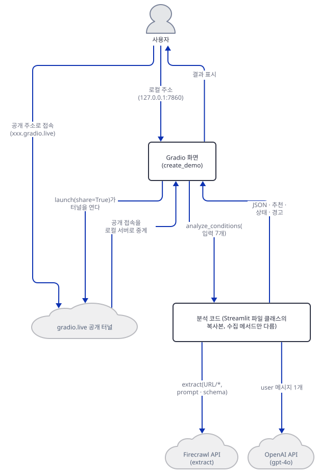

화면 쪽은 Streamlit과 다르게 짜여 있습니다.

`advanced_ai_agents/multi_agent_apps/ai_aqi_analysis_agent/ai_aqi_analysis_agent_gradio.py:238-256`

```python
        # Output Areas
        aqi_data_json = gr.JSON(label="📊 Current Air Quality Data")
        recommendations = gr.Markdown(label="🏥 Health Recommendations")
        
        # Analyze Button
        analyze_btn = gr.Button("🔍 Analyze & Get Recommendations", variant="primary")
        analyze_btn.click(
            fn=analyze_conditions,
            inputs=[
                city,
                state,
                country,
                medical_conditions,
                planned_activity,
                firecrawl_key,
                openai_key
            ],
            outputs=[aqi_data_json, recommendations, info_box, warning_box]
        )
```

입력 일곱 칸(키 둘 포함)이 한 함수 `analyze_conditions`로 들어가 출력 넷이 나옵니다. 이 함수는 키 검사도 필수 칸 검사도 없이 모든 것을 `try` 하나로 감싸고, 실패하면 `("", "Analysis failed", "Error occurred: …", "")`를 돌려줍니다. 예시 네 줄(`gr.Examples`)과 접힌 `Accordion`은 gradio 파일에만 있고, 다운로드 버튼은 Streamlit 파일에만 있습니다(소스로 확인). 앱 README가 말하는 "Real-time data visualization"은 두 파일 모두 JSON 출력이 전부이고 차트 호출이 없습니다(소스로 확인).


**확인.** 두 파일의 클래스가 어디까지 줄 단위로 같은지 비교합니다. 파이썬으로 하면 셸에 상관없이 됩니다.

```bash
uv run --no-project python -c "
s = open('ai_aqi_analysis_agent_streamlit.py', encoding='utf-8').read().splitlines()
g = open('ai_aqi_analysis_agent_gradio.py', encoding='utf-8').read().splitlines()
print('models and UserInput  :', s[9:31] == g[10:32])
print('AQIAnalyzer init, url :', s[32:47] == g[33:48])
print('HealthRecommendation  :', s[97:139] == g[81:123])
print('fetch_aqi_data        :', s[48:96] == g[49:80])
"
```

직접 확인한 출력:

```
models and UserInput  : True
AQIAnalyzer init, url : True
HealthRecommendation  : True
fetch_aqi_data        : False
```

`fetch_aqi_data`만 다릅니다. gradio판은 `st.info`·`st.expander`·`st.json`·`st.warning`·`st.error` 대신 `(데이터, 상태 문장)` 튜플을 돌려주고 나머지(`extract` 호출, 검증, 0 값 반환)는 같습니다(소스로 확인). 수집 클래스가 화면 함수를 직접 부르는 결합(아키텍처 절의 둘째 그림)이 둘이 갈리는 곳입니다. 이제 화면을 만들되 `launch`는 부르지 않습니다.

```bash
uv run --no-project python -c "
import os
os.environ['GRADIO_ANALYTICS_ENABLED'] = 'False'
import ai_aqi_analysis_agent_gradio as g
demo = g.create_demo()
for fn in demo.fns.values():
    print(fn.fn.__name__, [type(c).__name__ for c in fn.inputs], '->', [type(c).__name__ for c in fn.outputs])
print(sorted(demo.get_api_info()['named_endpoints']))
"
```

직접 확인한 출력:

```
analyze_conditions ['Textbox', 'Textbox', 'Textbox', 'Textbox', 'Textbox', 'Textbox', 'Textbox'] -> ['JSON', 'Markdown', 'Textbox', 'Textbox']
load_example ['Dataset'] -> ['Textbox', 'Textbox', 'Textbox', 'Textbox', 'Textbox']
['/analyze_conditions']
```

`load_example`은 예시 줄을 누르면 다섯 칸을 채우는 gradio 쪽 이벤트입니다. 환경변수를 먼저 끄는 까닭은 기본 설정의 gradio가 임포트만으로 안내 문구를 받으려 `api.gradio.app`에 접속하고(`gradio/strings.py`가 임포트 때 시작하는 스레드), `create_demo()`(Blocks 생성)는 버전 확인과 사용 통계를, `launch()`는 사용 통계를 더 보내기 때문입니다(소스로 확인. 사용 통계는 huggingface_hub의 텔레메트리 도우미로 나갑니다). 연결을 막은 환경에서 기본 설정으로 임포트와 `create_demo()`를 하면 `api.gradio.app` 2건과 `huggingface.co` 2건의 접속 시도가 잡혔고 `GRADIO_ANALYTICS_ENABLED=False`면 0건이었습니다(직접 확인). 끝으로 gradio판의 분석 함수를 가짜 서버로 직접 부릅니다. Step 6의 가짜 서버가 떠 있어야 하고, 아래 파일은 앱 폴더에 만드는 셋째 파일입니다.

`check_gradio.py`

```python
import json
import os

os.environ["GRADIO_ANALYTICS_ENABLED"] = "False"
os.environ["OPENAI_BASE_URL"] = "http://127.0.0.1:57481/v1"
os.environ["FIRECRAWL_API_URL"] = "http://127.0.0.1:57481"

import ai_aqi_analysis_agent_gradio as g

args = ("Mumbai", "Maharashtra", "India", "asthma", "morning jog for 2 hours")
for label, keys in [("both keys ok", ("fc-ok", "sk-ok")), ("wrong Firecrawl key", ("fc-bad", "sk-ok"))]:
    aqi_json, recommendations, info_msg, warning_msg = g.analyze_conditions(*args, *keys)
    print("---", label)
    print("AQI shown      :", json.loads(aqi_json)["Air Quality Index (AQI)"])
    print("recommendations:", recommendations)
    print("status box     :", info_msg)
    print("warning box    :", "Note:" in warning_msg)
```

```bash
uv run --no-project python check_gradio.py
```

직접 확인한 출력:

```
--- both keys ok
AQI shown      : 156.0
recommendations: FAKE RECOMMENDATIONS
status box     : Accessing URL: https://www.aqi.in/dashboard/india/maharashtra/mumbai
warning box    : True
--- wrong Firecrawl key
AQI shown      : 0
recommendations: FAKE RECOMMENDATIONS
status box     : Error fetching AQI data: ('Unexpected error during extract: Status code 401. fake server: invalid Firecrawl key - No additional error details provided.', 500)
warning box    : True
```

Streamlit과 같은 일이 gradio에서도 일어납니다. 실패한 측정은 상태 칸에 문장으로만 남고 JSON 칸에는 0이, 추천 칸에는 모델의 답이 나옵니다. 확인이 끝나면 첫 터미널에서 서버를 `Ctrl+C`로 멈추고 `fake_services.py`·`check_flow.py`·`check_gradio.py`를 지웁니다.

## 요청 한 건이 흐르는 과정

버튼 한 번을 세 장으로 나눠 따라갑니다. 첫 장은 클릭에서 두 객체를 만들기까지입니다.

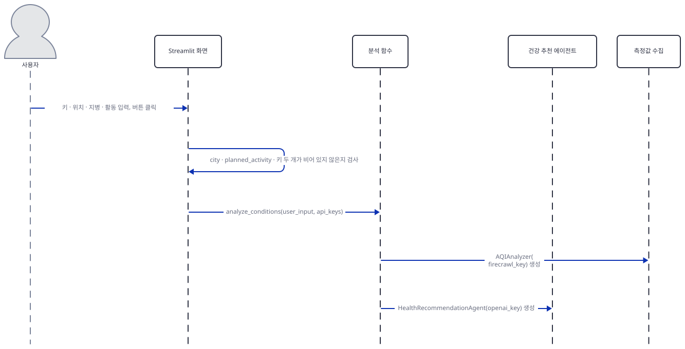

화면이 필수 칸과 키 둘을 검사하고 통과하면 `analyze_conditions`를 부릅니다. 이 함수는 `AQIAnalyzer`와 `HealthRecommendationAgent`를 먼저 다 만듭니다. Firecrawl 키가 비어 있으면 첫 객체를 만드는 순간 `ValueError`가 나는데 화면의 검사가 이를 막아 줍니다. 둘째 장은 측정값 수집입니다.

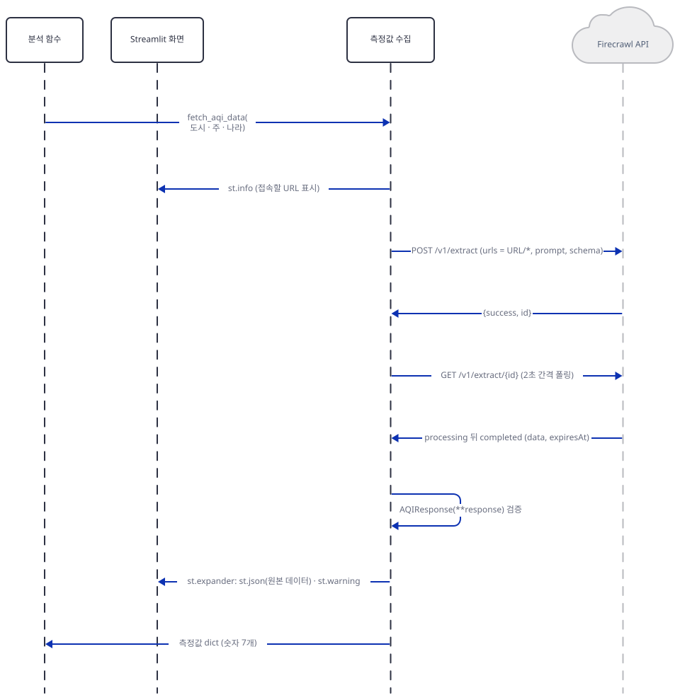

`fetch_aqi_data`가 화면에 접속할 URL을 먼저 띄우고 Firecrawl에 `POST`한 뒤 `GET`으로 결과를 기다립니다. 응답은 `AQIResponse`로 검증되고, 원본 데이터가 화면에 나오고, 숫자 일곱 개가 분석 함수로 돌아옵니다. 실패하면 오류 문장과 0 값이 이 자리를 대신합니다. 셋째 장은 추천입니다.

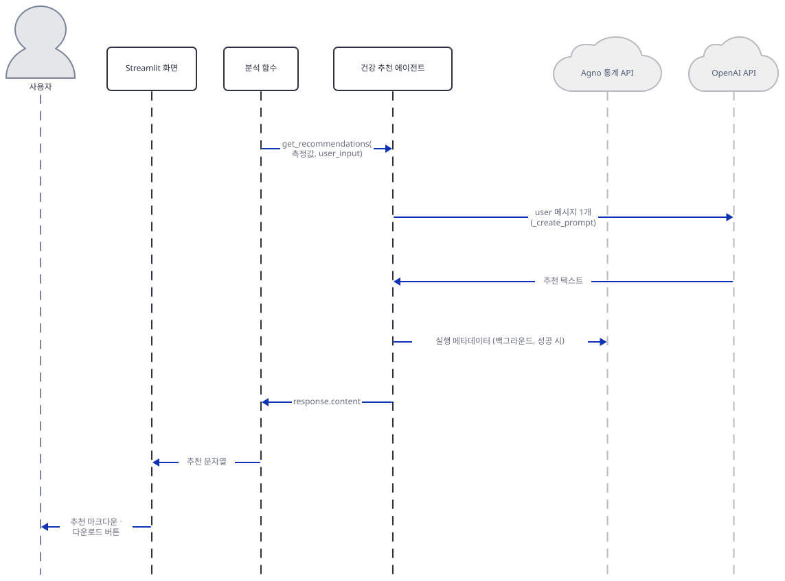

분석 함수가 `get_recommendations`를 부르면 에이전트가 프롬프트를 `user` 메시지 하나로 `gpt-4o`에 보내 추천 텍스트를 받습니다. 성공한 실행은 agno가 통계 전송을 백그라운드로 보내려 하고, `RunOutput.content`가 분석 함수를 거쳐 화면에 닿으면 화면이 먼저 `Analysis completed!`를 띄운 뒤 마크다운과 다운로드 버튼을 보여 줍니다. 이 시퀀스는 가짜 서버로 직접 돌려 본 것입니다. 실제 Firecrawl과 OpenAI의 응답, 그리고 Firecrawl 서버가 `aqi.in`을 읽는 구간은 확인하지 못했습니다.

## 실행 체크리스트

- [ ] `uv venv`와 `uv pip install -r requirements.txt`, `uv pip install streamlit`으로 환경을 만들고 `compiled`와 `both import ok`를 확인했다
- [ ] `streamlit`이 `requirements.txt`에 없어서 Streamlit 파일 임포트가 `ModuleNotFoundError`로 멈추는 것을 봤다
- [ ] 고정된 `firecrawl-py` 1.9.0의 `extract` 시그니처가 앱이 부르는 `(urls, params=None)`인 것을 확인했다
- [ ] `ExtractSchema`의 일곱 칸이 모두 필수이고 `AQIResponse`가 문자열·`None`을 거부하지만 빠진 키는 통과시키는 것을 봤다
- [ ] `_format_url`의 다섯 사례와 실패 시 0 값 딕셔너리를 확인했다
- [ ] 에이전트의 `name`이 `None`이고 `tools`가 비어 있으며 `= Agent(`가 파일마다 한 곳인 것을 봤다
- [ ] 키 한 칸만으로는 저장되지 않고 둘이 있어야 `API keys updated!`가 뜨는 것을 `AppTest`로 봤다
- [ ] 가짜 서버가 Firecrawl 요청 1건(주소 끝 `/*`)과 `user` 메시지 하나짜리 모델 요청 1건을 받은 것을 봤다
- [ ] 틀린 Firecrawl 키에서 오류 문장과 "Analysis completed!"가 함께 뜨고 모델이 0 값 프롬프트에 답한 것을 봤다
- [ ] 틀린 OpenAI 키의 오류 문장이 추천 자리에 일반 글자로 나오는 것을 봤다
- [ ] gradio 파일을 띄우지 않고 클래스 비교, `create_demo()` 구성, `analyze_conditions` 직접 호출을 확인했다

## 문제 해결

| 증상 | 원인 | 해결 |
|---|---|---|
| Streamlit 파일을 돌리자 `ModuleNotFoundError: No module named 'streamlit'` | `requirements.txt`에 `streamlit`이 없다(`advanced_ai_agents/multi_agent_apps/ai_aqi_analysis_agent/requirements.txt:1-5`). 앱 README도 이 파일을 안내하지 않는다(직접 확인) | `uv pip install streamlit`(직접 확인: 1.65.0) |
| 출력을 파이프나 파일로 받는 확인 명령이 `UnicodeEncodeError: 'cp949' codec can't encode character '\xb5'`로 죽음 | 프롬프트의 `µ`를 한국어 Windows의 기본 출력 인코딩 `cp949`가 못 쓴다(직접 확인: Step 4의 프롬프트 출력을 파이프로 받았을 때) | `PYTHONIOENCODING=utf-8`을 먼저 건다(사전 준비) |
| 화면에 `Error fetching AQI data: ('Unexpected error during extract: Status code 401. …', 500)`가 뜨는데 추천도 같이 나옴 | Firecrawl이 401을 돌려줬고(키 오류로 보인다) `except`가 0 값을 돌려줘 모델이 그 값으로 답했다(직접 확인: 가짜 서버의 401). 실제 서비스가 같은 문장을 쓰는지는 확인하지 못했다 | Firecrawl 키를 확인한다. 이 추천은 믿지 않는다. 막는 법은 더 해보기 |
| 같은 자리에 `Error fetching AQI data: ("HTTPSConnectionPool(host='api.firecrawl.dev', port=443): Max retries exceeded …", 500)` | 인터넷이 막힌 곳에서 SDK의 연결이 실패했다(직접 확인: 연결을 거부하는 프록시 뒤에서 `ProxyError … Tunnel connection failed: 403 Forbidden`) | 네트워크·프록시 설정을 확인한다 |
| 오류가 뜨지 않았는데 추천의 AQI·PM2.5가 모두 0이라고 말함 | 측정이 실패하면 `except`가 7개 값을 0으로 채워 모델에 보낸다(Step 3·4, 직접 확인: 요청 본문의 `Overall AQI: 0`) | 화면의 "Error fetching AQI data" 문장을 먼저 본다 |
| 추천 자리에 `fake server: invalid OpenAI key` 같은 오류 문장이 일반 글자로 나오고 "Analysis completed!"도 뜸 | `Agent.run`이 모델 오류를 예외로 던지지 않고 문장을 `content`에 담아 돌려주며 앱이 그대로 출력한다(직접 확인: 가짜 서버의 401) | OpenAI 키와 네트워크를 확인한다. 실제 서비스가 돌려주는 문장 모양은 확인하지 못했다 |
| `❌ Error: 'co'`처럼 키 이름 하나만 나옴 | Firecrawl의 `data`에 일곱 키 중 하나가 없다. `AQIResponse`는 통과시키고 `_create_prompt`의 `aqi_data['co']`가 `KeyError`를 던진다(직접 확인: `co`를 뺀 가짜 응답) | 스키마·URL을 확인한다. 이때는 모델 호출까지 가지 않는다 |
| 추천을 본 뒤 입력 칸을 고치면 추천과 다운로드 버튼이 사라짐 | 결과가 `main`의 지역 변수라 리런마다 지워진다(직접 확인: 도시 칸을 고친 뒤 `markdown []`) | 같은 입력으로 다시 누르면 요청이 또 나가 비용이 든다. 복사본에서 `st.session_state`에 저장한다(더 해보기) |
| 키 칸 하나만 채웠는데 아무 일도 없음 | 저장은 두 키가 모두 있고 하나라도 바뀌었을 때만 일어난다(직접 확인: `one key: {'firecrawl': '', 'openai': ''}`) | 두 칸을 모두 채운다 |
| `firecrawl-py`를 새로 설치한 뒤 모든 측정이 0이 되고 오류 문장에 `unexpected keyword argument 'params'` | 고정 없이 설치하면 4.x가 받아지고 그 `extract`는 `params`를 받지 않는다(직접 확인: 별도 환경에서 4.46.2의 시그니처와 `TypeError`. 화면 문장은 `except`로 소스 확인) | `uv pip install firecrawl-py==1.9.0` |
| `FileNotFoundError: AppTest script not found at ...` | `AppTest.from_file`의 상대 경로는 호출한 스크립트가 있는 폴더 기준으로 풀린다(직접 확인: 앱 폴더 밖에 둔 스크립트) | 확인 스크립트를 앱 파일과 같은 폴더에 만든다 |
| `AppTest`를 돌릴 때마다 `missing ScriptRunContext!` 경고 | `streamlit run` 없이 스크립트를 돌릴 때 Streamlit이 내는 안내다(직접 확인: 이 경고가 있어도 결과는 같다) | 무시한다 |

## 더 해보기

- 측정 실패가 추천으로 이어지지 않게 해 보세요. 복사본에서 `advanced_ai_agents/multi_agent_apps/ai_aqi_analysis_agent/ai_aqi_analysis_agent_streamlit.py:87-96`의 `except` 본문을 `raise` 한 줄로 바꾸고 `check_flow.py`가 복사본을 열게 하면, 틀린 Firecrawl 키에서 `Agent.run` 호출이 0번이고 화면에는 `Error: ('Unexpected error during extract: Status code 401. …', 500)` 한 줄만 남습니다(복사본에서 가짜 서버로 직접 확인).
- 결과가 입력을 고쳐도 남게 해 보세요. 복사본의 `advanced_ai_agents/multi_agent_apps/ai_aqi_analysis_agent/ai_aqi_analysis_agent_streamlit.py:254-263` 앞에서 `result`를 `st.session_state['result']`에 저장하고 다시 읽으면, 도시 칸을 고쳐도 추천이 남고 `Agent.run`은 늘지 않습니다(복사본에서 직접 확인).
- gradio 파일을 공개 터널 없이 띄워 보세요. `create_demo().launch()`만 부르면 `share`가 `None`이라 로컬 주소에서만 열려야 하지만 `GRADIO_SHARE`가 `true`면 켜지니 먼저 확인하세요. 터널이 없어도 기본 설정에서는 사용 통계가 나가므로 `GRADIO_ANALYTICS_ENABLED=False`도 함께 거세요(bash `export GRADIO_ANALYTICS_ENABLED=False`, PowerShell `$env:GRADIO_ANALYTICS_ENABLED = "False"`). 소스로 확인한 것이고 이 문서는 gradio 파일을 띄워 보지 않았으며 이 방법도 실행해 보지 못했습니다.

## 다음 날 예고

[Day 106 · ⚡ Codebase Migration & Refactor Planner (LangGraph)](../day106-ai-codebase-migration-agent/README.md) — LangGraph의 `StateGraph`에 검증·계획·사람 승인(`interrupt()`)·파일별 병렬 작업(`Send()`)·종합 노드를 이은 Streamlit 앱을 다룹니다(원본 앱 소스 기준).
