# Day 106 · ⚡ Codebase Migration & Refactor Planner (LangGraph)

> 볼륨 7 🚀 Advanced AI Agents · 난이도 ★★★ ⚠(오늘 설치 그대로는 승인 버튼이 "Please provide both a target repository…" 오류만 내고, 기본 모델 `gpt-5-mini`의 스냅샷은 2026-12-11 종료 예정) · 예상 소요 125분(앱은 972줄 한 파일이고 그래프 노드 다섯과 화면을 Step마다 가짜 서버로 직접 돌려 앞뒤를 비교하며, 시퀀스 그림 여덟을 따라가는 손 시간이 읽는 시간보다 더 듭니다) · API 비용 대략 한 번의 계획·실행에 $0.3 안팎 — 빠른 모델 `gpt-5-mini` 입력 $0.25·출력 $2, 프로 모델 `gpt-5.5` 입력 $5·출력 $30(모두 1M 토큰당, 2026-10-09에 받은 OpenAI 모델 페이지 원문의 "Text tokens" 표. 같은 표 머리에 "Batch API price"라는 말이 붙어 있어 표준 단가인지는 확인하지 못함)에 가정한 토큰 수(파일 4개 기준, 워커 호출마다 출력 약 3,000토큰, 집계 호출 입력 약 14,000·출력 약 6,000토큰)를 대입한 어림이고 키가 없어 실제 토큰 수는 확인하지 못함. 추론 토큰이 더해지면 더 커질 수 있음 · 원본 앱: `advanced_ai_agents/multi_agent_apps/ai_codebase_migration_agent`

## 오늘 만들 것

저장소 주소(또는 경로)와 이주 목표를 적으면 계획 담당 모델이 파일별 이주 계획과 위험도(`Low`·`Medium`·`High`·`Critical`)를 만들고, 사람이 그 계획을 승인하거나 고쳐 달라고 한 다음, 승인된 파일마다 워커가 하나씩 병렬로 달라붙어 diff와 테스트 제안을 쓰고, 마지막으로 집계 담당 모델이 보고서와 위험 차트를 합치는 Streamlit 앱입니다. 새로 배우는 것은 LangGraph입니다. `StateGraph`로 노드 다섯을 잇고, `interrupt()`로 그래프를 사람 앞에서 멈췄다가 `Command(resume=…)`로 이어 가고, `Send()`로 파일 수만큼 워커를 한꺼번에 띄우고, `MemorySaver`가 멈춘 상태를 붙들어 줍니다. 앞 날들의 Streamlit 앱은 에이전트 하나를 `run`으로 한 번 부르는 모양이었는데, 이 앱은 호출 순서가 그래프 자체에 들어 있습니다.

직접 돌려 보고 알게 된 사실이 셋 있습니다. 첫째, 저장소 주소는 문자열일 뿐입니다. 앱은 어떤 저장소도 내려받거나 읽지 않고, 계획 담당 모델은 이름만 보고 파일 경로를 지어냅니다(Step 3). 그래서 diff와 보고서는 코드를 본 결과가 아니라 모델의 추측입니다. 둘째, 오늘 설치 그대로는 승인 버튼이 동작하지 않습니다. Streamlit이 버튼을 누를 때마다 `app.py`를 처음부터 다시 실행해서 `MemorySaver`가 매번 새로 만들어지고, 멈춰 있던 계획이 사라진 그래프에 `resume`을 보내면 그래프가 처음부터 다시 시작해 검증 노드가 빈 입력을 거절합니다(Step 7). 앱 README의 "interrupts survive Streamlit reruns"와 반대입니다. 셋째, 연결 오류는 검증 노드에서 조용히 삼켜지고 계획 노드에서야 오류로 나옵니다(Step 3).

키가 없어도 Step 1~7의 확인이 모두 됩니다. 앱이 읽는 `LLM_BASE_URL`을 내 PC의 가짜 서버로 돌려 OpenAI 호환 엔드포인트를 흉내 내고, 화면은 `AppTest`로 확인합니다. 이 문서를 만들며 OpenAI에 닿은 요청은 한 건도 없습니다. 그래서 문서의 계획·diff·보고서 문장은 가짜 서버의 고정 응답일 뿐이고, 진짜 모델이 `json_object` 응답 형식과 도구 호출을 이 앱이 기대하는 모양으로 돌려주는지는 확인하지 못했습니다. 실제 브라우저에서 버튼을 눌러 보지도 못했습니다. 아래는 앱이 의도한 아키텍처입니다.

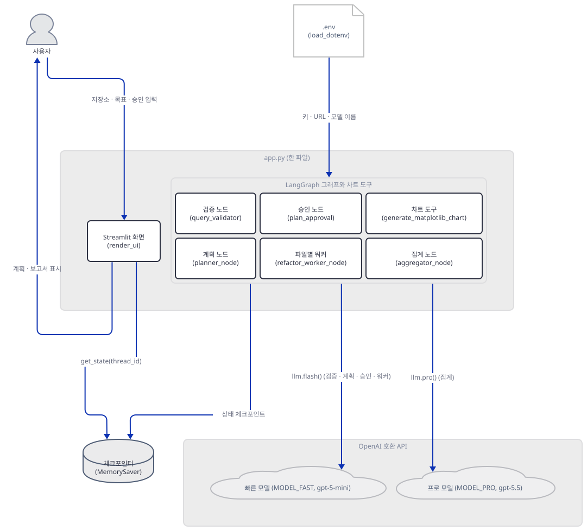

그림은 앱을 쪽으로 나눠 그렸고, 화면이 그래프를 부르는 길과 노드 사이 흐름은 보조 그림 셋(`extra-calls`, `extra-graph`, `extra-run`)이 화살표로 보여 줍니다. 화면이 그래프를 어떻게 부르는지는 Step 4·7에서, 노드 사이의 갈래는 Step 4·5에서 다시 만납니다.

## 사전 준비

| 서비스/도구 | 용도 | 발급·설치 |
|---|---|---|
| uv | 가상환경 생성과 패키지 설치 | [공통 사전 준비](../README.md#공통-사전-준비-한-번만) 절 참고 |
| Python | 이 문서는 3.13.3으로 확인했다. 저장소 기준은 3.11~3.13 | 공통 사전 준비와 같음 |
| OpenAI 호환 엔드포인트의 키 | `LLM_API_KEY` 또는 `OPENAI_API_KEY` 환경변수나 사이드바의 비밀번호 칸(`advanced_ai_agents/multi_agent_apps/ai_codebase_migration_agent/app.py:60`, `advanced_ai_agents/multi_agent_apps/ai_codebase_migration_agent/app.py:754-759`). 이 문서의 확인에는 필요 없다. 사이드바에 넣은 키는 Save Settings를 눌러야 반영된다(Step 7) | https://platform.openai.com/api-keys. 다른 제공자를 쓰려면 `LLM_BASE_URL`과 두 모델 이름을 함께 정한다(`.env.example`) |
| 모델 ⚠ | 기본값은 `gpt-5-mini`(검증·계획·승인 분류·워커)와 `gpt-5.5`(집계)다(`advanced_ai_agents/multi_agent_apps/ai_codebase_migration_agent/app.py:48-49`). OpenAI 폐기 표(https://developers.openai.com/api/docs/deprecations, 2026-10-09에 받은 원문)에는 `gpt-5-mini-2025-08-07`이 2026-12-11 종료, 대체 `gpt-5.6-terra`로 올라 있고, 모델 페이지는 `gpt-5-mini`가 가리키는 스냅샷에 Deprecated 표시를 붙였다. `gpt-5.5`는 폐기 표에 없다 | 종료 전에는 그대로 쓸 수 있다. 환경변수 `MODEL_FAST`를 다른 모델로 바꿔 둘 수 있다(Step 2) |
| 인터넷 연결 | PyPI 설치. 앱을 실제로 쓸 때는 설정한 LLM 엔드포인트에만 접속한다(이 문서가 확인한 요청은 가짜 서버로 간 것뿐이다). 브라우저로 열면 Streamlit의 사용 통계도 나간다(`--browser.gatherUsageStats false`로 끈다) | 별도 설치 없음 |

## 아키텍처 한눈에 보기

| 컴포넌트 | 역할 | 코드 위치 |
|---|---|---|
| 환경 파일 (`load_dotenv`) | 임포트할 때 `.env`를 찾아 환경변수로 올린다 | `advanced_ai_agents/multi_agent_apps/ai_codebase_migration_agent/app.py:28`, `advanced_ai_agents/multi_agent_apps/ai_codebase_migration_agent/app.py:39` |
| 모델 공급자 (`_LLMProvider`) | 환경변수로 `ChatOpenAI` 둘(빠른 것, 프로)을 늦게 만들어 캐시한다 | `advanced_ai_agents/multi_agent_apps/ai_codebase_migration_agent/app.py:46-97` |
| 상태 스키마 (`MigrationState`, `MigrationTask`) | 그래프가 노드 사이에 넘기는 값과 파일 작업 한 건의 모양 | `advanced_ai_agents/multi_agent_apps/ai_codebase_migration_agent/app.py:105-136` |
| 검증 노드 (`query_validator`) | 빈 입력을 거르고, 모델에게 요청이 유효·안전한지 묻는다 | `advanced_ai_agents/multi_agent_apps/ai_codebase_migration_agent/app.py:241-293` |
| 계획 노드 (`planner_node`) | 전략과 3~6개 파일 작업(위험도 포함)을 JSON으로 받는다 | `advanced_ai_agents/multi_agent_apps/ai_codebase_migration_agent/app.py:344-382` |
| 승인 노드 (`plan_approval`) | `interrupt()`로 멈추고, 이어질 때 사용자의 문장을 모델에게 분류시킨다 | `advanced_ai_agents/multi_agent_apps/ai_codebase_migration_agent/app.py:402-434` |
| 파일별 워커 (`refactor_worker_node`) | 파일 하나의 diff·깨질 수 있는 곳·테스트 제안을 쓴다. `Send()`로 파일마다 하나씩 병렬로 뜬다 | `advanced_ai_agents/multi_agent_apps/ai_codebase_migration_agent/app.py:440-445`, `advanced_ai_agents/multi_agent_apps/ai_codebase_migration_agent/app.py:471-514` |
| 집계 노드 (`aggregator_node`) | 프로 모델에게 보고서와 차트 도구 호출을 시킨다 | `advanced_ai_agents/multi_agent_apps/ai_codebase_migration_agent/app.py:541-631` |
| 차트 도구 (`generate_matplotlib_chart`) | 모델이 고른 데이터만 받아 Matplotlib 템플릿으로 PNG를 그린다 | `advanced_ai_agents/multi_agent_apps/ai_codebase_migration_agent/app.py:147-200` |
| 그래프 조립 (`build_migration_graph`, `get_graph`) | 노드와 갈래를 잇고 `MemorySaver`로 컴파일한다 | `advanced_ai_agents/multi_agent_apps/ai_codebase_migration_agent/app.py:639-691` |
| Streamlit 화면 (`render_ui`) | 사이드바 설정, 입력, 계획 검토·승인, 보고서와 다운로드 | `advanced_ai_agents/multi_agent_apps/ai_codebase_migration_agent/app.py:731-968` |
| 체크포인터 (`MemorySaver`) | `thread_id`별로 상태를 메모리에 붙든다 | `advanced_ai_agents/multi_agent_apps/ai_codebase_migration_agent/app.py:32`, `advanced_ai_agents/multi_agent_apps/ai_codebase_migration_agent/app.py:673` |
| OpenAI 호환 엔드포인트 | 빠른 모델 `gpt-5-mini`, 프로 모델 `gpt-5.5` | 코드 없음 (외부 서비스) |

## 단계별 진행

### Step 1. 환경 만들기 — `.env`와 키 없는 첫 실패

**목적.** 앱 폴더에 독립 가상환경을 만들고, 어떤 버전이 깔리는지, 파일이 컴파일되고 임포트되는지, 키가 없을 때 그래프가 어디서 어떻게 끝나는지 봅니다.

**할 일.** 저장소 루트에서 시작합니다.

```bash
cd advanced_ai_agents/multi_agent_apps/ai_codebase_migration_agent
uv venv
uv pip install -r requirements.txt
```

(pip 대안: bash는 `python -m venv .venv && source .venv/bin/activate && pip install -r requirements.txt`입니다. PowerShell 5.1은 `&&`를 받지 않으므로(PowerShell 7부터 지원) 세 줄로 `python -m venv .venv`, `.venv\Scripts\Activate.ps1`, `pip install -r requirements.txt`를 차례로 씁니다. 실행해 보지 못했습니다.) 이후 `uv run`에는 모두 `--no-project`를 붙입니다. 이유는 [공통 사전 준비](../README.md#공통-사전-준비-한-번만)에 있습니다.

`advanced_ai_agents/multi_agent_apps/ai_codebase_migration_agent/requirements.txt:1-9`

```text
langgraph>=1.2.6
langgraph-checkpoint>=4.1.1
langchain>=1.3.11
langchain-core>=1.4.8
langchain-openai>=1.3.3
pydantic>=2.13.4
python-dotenv>=1.2.2
streamlit
matplotlib
```

아홉 줄이고 모두 `>=`이거나 버전이 없습니다. 이 문서를 만들 때(2026-10-09)는 Python 3.13.3에서 langgraph 1.2.14, langgraph-checkpoint 4.2.0, langchain 1.4.4, langchain-core 1.6.9, langchain-openai 1.7.0, pydantic 2.14.0, python-dotenv 1.2.4, streamlit 1.65.0, matplotlib 3.11.2를 포함해 패키지 78개가 깔렸습니다(직접 확인). 앱 파일은 `openai` 패키지를 직접 임포트하지 않지만 `langchain-openai`가 끌어와 3.26.1이 깔렸습니다. 테스트에 쓰는 `pytest`는 목록에 없으니 Step 6에서 따로 깝니다.

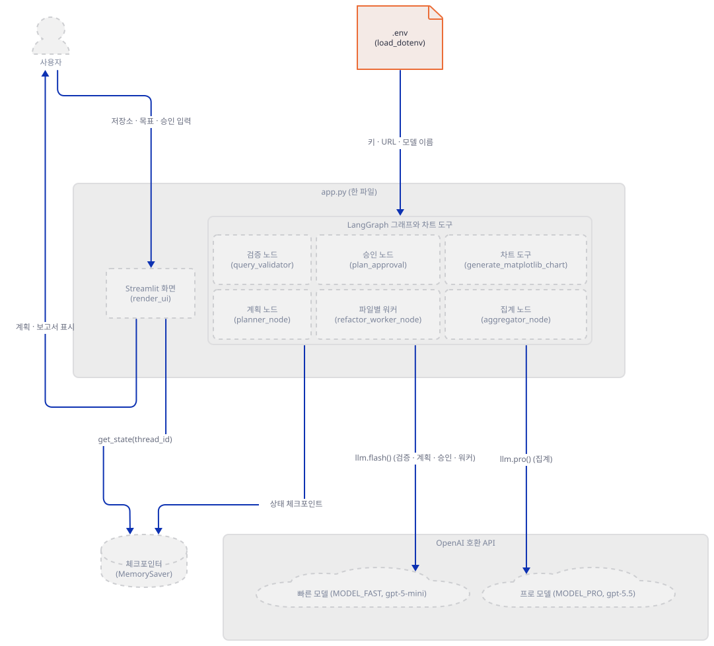

**확인.** 앱 폴더에서 실행합니다.

```bash
uv run --no-project python -m py_compile app.py && echo compiled
uv run --no-project python -c "import app; print('import OK', app.DEFAULT_MODEL_FAST, app.DEFAULT_MODEL_PRO, app.LLM_TIMEOUT)"
```

직접 확인한 출력:

```
compiled
import OK gpt-5-mini gpt-5.5 300
```

(여러 줄 `python -c "..."`와 `&&`가 낯선 PowerShell 5.1 독자는 줄을 나눠 씁니다. 실행해 보지 못했습니다. 이 문서는 확인용 파이썬 파일 여러 개를 앱 폴더에 만들어 `uv run --no-project python 파일.py`로 돌립니다. 다 쓰면 지웁니다.)

임포트만으로 일어나는 일이 하나 있습니다. 39행의 `load_dotenv()`는 인자가 없어서 `.env`를 `app.py`가 있는 폴더에서 시작해 위쪽 폴더로 올라가며 찾습니다.

`advanced_ai_agents/multi_agent_apps/ai_codebase_migration_agent/app.py:28`, `advanced_ai_agents/multi_agent_apps/ai_codebase_migration_agent/app.py:39`

```python
from dotenv import load_dotenv
...
load_dotenv()
```

두 폴더 위에 만든 `.env`의 `OPENAI_API_KEY`와 `MODEL_FAST`가 `import app` 직후 환경변수에 올라온 것을 직접 확인했습니다(작업 폴더를 다른 곳으로 해도 `app.py` 위치를 기준으로 찾아 같았습니다). 상위 폴더에 다른 프로젝트의 `.env`가 있으면 그 키가 이 앱에 들어옵니다. 이미 있는 환경변수를 덮어쓰지는 않는다는 점은 확인하지 못했습니다.

이제 키 없이 그래프를 끝까지 돌려 봅니다. 먼저 어디서 끝나는지 봅니다.

```python
import app

graph = app.get_graph()
config = {"configurable": {"thread_id": "nokey"}}
for event in graph.stream(
    {"repo_target": "github.com/acme/shop", "migration_goal": "Migrate Pydantic v1 to v2"},
    config=config,
):
    print(event)
state = graph.get_state(config)
print(state.values["status"], "|", state.values["error"], "| next:", state.next)
```

이 파일은 `step1_nokey.py`로 앱 폴더에 저장하고 실행합니다.

```bash
uv run --no-project python step1_nokey.py
```

직접 확인한 출력(맨 윗줄은 로그입니다. `logger.error`가 파이썬 로깅의 기본 처리기로 표준 오류에 찍힌 것이고, `logger.info` 줄은 설정이 없어 보이지 않습니다):

```
Error during query validation LLM call: LLM API Key is not set. Set it in the .env file or in the app sidebar.
{'query_validator': {'status': 'error', 'error': 'API key is missing or invalid. Open the sidebar to configure your API keys.'}}
error | API key is missing or invalid. Open the sidebar to configure your API keys. | next: ()
```

키가 없으면 `llm.flash()`가 `RuntimeError`를 던지고(Step 2), 검증 노드의 `except`가 메시지에 "api key"가 들어 있는 것을 알아보고 상태를 `error`로 바꿔 그래프를 끝냅니다. 네트워크 요청은 한 건도 나가지 않았습니다.

### Step 2. 모델 공급자와 가짜 서버 — 모델 둘, 주소 하나

**목적.** 앱이 모델을 만드는 곳을 읽고, 이후 모든 확인에 쓸 가짜 OpenAI 호환 서버를 띄워 앱이 무엇을 보내는지 봅니다.

**할 일.**

`advanced_ai_agents/multi_agent_apps/ai_codebase_migration_agent/app.py:46-50`

```python
# Defaults target the OpenAI API. Any OpenAI-compatible endpoint works by setting
# LLM_BASE_URL plus MODEL_FAST / MODEL_PRO (e.g. DeepSeek, Groq, Together, Ollama).
DEFAULT_MODEL_FAST = "gpt-5-mini"  # validation, planning, per-file refactor workers
DEFAULT_MODEL_PRO = "gpt-5.5"  # final report synthesis + chart generation
LLM_TIMEOUT = 300  # seconds for each provider request
```

`advanced_ai_agents/multi_agent_apps/ai_codebase_migration_agent/app.py:59-86`

```python
    def _create(self, model: str):
        api_key = os.getenv("LLM_API_KEY") or os.getenv("OPENAI_API_KEY")
        base_url = os.getenv("LLM_BASE_URL")

        if not api_key:
            raise RuntimeError(
                "LLM API Key is not set. Set it in the .env file or in the app sidebar."
            )

        # Passing base_url=None lets the OpenAI client use its own default endpoint.
        return ChatOpenAI(
            model=model,
            openai_api_key=api_key,
            openai_api_base=base_url or None,
            timeout=LLM_TIMEOUT,
        )

    def flash(self):
        if "flash" not in self._cache:
            model = os.getenv("MODEL_FAST") or DEFAULT_MODEL_FAST
            self._cache["flash"] = self._create(model)
        return self._cache["flash"]

    def pro(self):
        if "pro" not in self._cache:
            model = os.getenv("MODEL_PRO") or DEFAULT_MODEL_PRO
            self._cache["pro"] = self._create(model)
        return self._cache["pro"]
```

환경변수 네 개가 전부입니다. 키는 `LLM_API_KEY`가 `OPENAI_API_KEY`보다 먼저이고, `LLM_BASE_URL`이 비어 있으면 `None`을 넘겨 OpenAI 클라이언트의 기본 주소를 씁니다. 모델은 두 개이고(`flash`는 `MODEL_FAST`, `pro`는 `MODEL_PRO`) 처음 부를 때 한 번 만들어 `_cache`에 둡니다. 그래서 환경변수를 바꿔도 캐시를 비우는 `reset_clients()`(95~97행)를 부르기 전에는 이미 만든 클라이언트가 그대로 쓰입니다.

확인에 쓸 가짜 서버입니다. 요청을 읽어 어느 노드의 요청인지 지시문으로 알아보고 고정된 응답을 돌려주며, 받은 요청의 경로·모델·응답 형식 같은 요약을 `llm.jsonl`에 한 줄씩 남깁니다. 표준 라이브러리만 쓰므로 앱 환경의 파이썬으로 돌립니다. 이 파일은 앱 폴더 밖의 작업 폴더에 `fake_llm.py`로 저장합니다(원본 앱의 코드가 아니라 이 문서가 만든 도구입니다). 승인 분류 응답은 피드백이 `Approved`로 시작하는지로 정하므로 "모델이 승인으로 읽는다"는 것은 가짜의 판단이지 실제 모델이 본 것이 아닙니다.

```python
"""Fake OpenAI-compatible server for Day 106 (localhost only)."""
import json, sys, time, threading
from http.server import BaseHTTPRequestHandler, ThreadingHTTPServer

PORT = int(sys.argv[1])
LOG = sys.argv[2]
lock = threading.Lock()

def log(rec):
    with lock:
        with open(LOG, "a", encoding="utf-8") as f:
            f.write(json.dumps(rec, ensure_ascii=False) + "\n")

PLAN_V1 = {"strategy": "Migrate models first, then routes, then settings; keep v1 shims until tests pass.",
 "tasks": [
  {"file_path": "src/models/user.py", "action": "Replace @validator with @field_validator", "risk_level": "High", "risk_reasoning": "Core model used by the DB layer."},
  {"file_path": "api/routes.py", "action": "Switch .dict() to .model_dump()", "risk_level": "Medium", "risk_reasoning": "Many call sites."},
  {"file_path": "config/settings.py", "action": "Move BaseSettings to pydantic-settings", "risk_level": "Low", "risk_reasoning": "Isolated."}]}
PLAN_V2 = {"strategy": "Revised: settings file skipped, user model raised to Critical.",
 "tasks": [
  {"file_path": "src/models/user.py", "action": "Replace @validator with @field_validator", "risk_level": "Critical", "risk_reasoning": "Raised on request."},
  {"file_path": "api/routes.py", "action": "Switch .dict() to .model_dump()", "risk_level": "Medium", "risk_reasoning": "Many call sites."}]}

def reply(body):
    msgs = body.get("messages", [])
    sys_txt = next((m["content"] for m in msgs if m["role"] == "system"), "") or ""
    last_user = next((m["content"] for m in reversed(msgs) if m["role"] == "user"), "") or ""
    if isinstance(sys_txt, list): sys_txt = str(sys_txt)
    tools = body.get("tools")
    if "input validation assistant" in sys_txt:
        return "validator", {"content": json.dumps({"is_valid": True, "error_message": None})}
    if "Lead Software Architect" in sys_txt:
        revised = "User feedback on previous plan" in last_user
        return ("planner-revise" if revised else "planner"), {"content": json.dumps(PLAN_V2 if revised else PLAN_V1)}
    if "approval classifier" in sys_txt:
        fb = last_user.split("\n", 1)[0]
        ok = fb.lower().startswith("user feedback: approved")
        return ("approval-yes" if ok else "approval-no"), {"content": json.dumps({"plan_approved": ok})}
    if "expert code refactoring worker" in sys_txt:
        fp = last_user.split("File Path: ", 1)[1].split("\n", 1)[0] if "File Path: " in last_user else "?"
        return "worker", {"content": f"**Refactoring Breakdown** for {fp}\n```diff\n- old\n+ new\n```\n**Recommended Unit Tests**: test_{fp.split('/')[-1]}"}
    if "Principal Software Architect" in sys_txt:
        has_tool_msg = any(m["role"] == "tool" for m in msgs)
        if tools and not has_tool_msg:
            return "aggregator-r1", {"content": "# Codebase Migration Report\n\nRisk chart: <!--CHART_1-->\n", "tool_calls": [{"id": "call_1", "type": "function", "function": {"name": "generate_matplotlib_chart", "arguments": json.dumps({"chart_type": "bar", "labels": ["Low", "Medium", "High", "Critical"], "values": [1, 1, 1, 0], "title": "Risk", "y_label": "Files"})}}]}
        return "aggregator-r2", {"content": "\n## Verification\n- run tests\n"}
    return "unknown", {"content": "ok"}

class H(BaseHTTPRequestHandler):
    def log_message(self, *a): pass
    def do_POST(self):
        n = int(self.headers.get("content-length", 0))
        body = json.loads(self.rfile.read(n) or b"{}")
        kind, msg = reply(body)
        if kind == "worker": time.sleep(float(sys.argv[3]) if len(sys.argv) > 3 else 0)
        msg = {"role": "assistant", **msg}
        log({"t": time.time(), "path": self.path, "kind": kind, "model": body.get("model"),
             "auth": (self.headers.get("authorization") or "")[:14] + "...",
             "response_format": body.get("response_format"), "tools": [t["function"]["name"] for t in body.get("tools", [])] if body.get("tools") else None,
             "n_messages": len(body.get("messages", [])), "keys": sorted(body.keys()), "stream": body.get("stream")})
        out = {"id": "chatcmpl-fake", "object": "chat.completion", "created": 0, "model": body.get("model"),
               "choices": [{"index": 0, "message": msg, "finish_reason": "tool_calls" if msg.get("tool_calls") else "stop"}],
               "usage": {"prompt_tokens": 1, "completion_tokens": 1, "total_tokens": 2}}
        data = json.dumps(out).encode()
        self.send_response(200); self.send_header("content-type", "application/json"); self.send_header("content-length", str(len(data))); self.end_headers(); self.wfile.write(data)
    def do_GET(self):
        log({"path": self.path, "method": "GET"}); self.send_response(404); self.end_headers()

ThreadingHTTPServer(("127.0.0.1", PORT), H).serve_forever()
```

서버를 한 터미널에 띄웁니다. 포트는 겹치지 않는 아무 높은 번호입니다(이 문서는 53817).

```bash
uv run --no-project python fake_llm.py 53817 llm.jsonl
```

(PowerShell도 같은 형태입니다. 실행해 보지 못했습니다. 이 서버는 `127.0.0.1`에만 열립니다. 이 문서의 확인은 모두 환경변수로 `HTTP_PROXY` 같은 프록시를 막아 둔 채 돌렸는데, 독자가 따라 할 때 필요한 것은 아니므로 명령에는 넣지 않았습니다.) 다른 터미널에서 앱 폴더에 `step2_llm.py`를 만듭니다. 환경변수는 파이썬 안에서 `import app` 전에 정하므로 셸 문법이 달라도 같습니다.

```python
import os

os.environ["LLM_BASE_URL"] = "http://127.0.0.1:53817/v1"
os.environ["OPENAI_API_KEY"] = "sk-fake-not-real"
os.environ.pop("MODEL_FAST", None)
os.environ.pop("MODEL_PRO", None)
import app

fast, pro = app.llm.flash(), app.llm.pro()
print(type(fast).__name__, fast.model_name, fast.openai_api_base, fast.request_timeout)
print(type(pro).__name__, pro.model_name)
print(app.llm.flash() is fast)
app.reset_clients()
print(app.llm.flash() is fast)
print(fast.invoke("ping").content)
```

```bash
uv run --no-project python step2_llm.py
```

직접 확인한 출력:

```
ChatOpenAI gpt-5-mini http://127.0.0.1:53817/v1 300.0
ChatOpenAI gpt-5.5
True
False
ok
```

기본 모델 이름이 그대로 올라왔고 요청 제한 시간은 300초입니다. `llm.flash()`는 두 번 불러도 같은 객체이고(`True`), `reset_clients()` 뒤에는 새 객체입니다(`False`). 마지막 `ok`는 가짜 서버가 알아보지 못한 요청에 돌려주는 고정 응답입니다. 서버가 남긴 한 줄입니다.

```
{"t": 1791529824.0259206, "path": "/v1/chat/completions", "kind": "unknown", "model": "gpt-5-mini", "auth": "Bearer sk-fake...", "response_format": null, "tools": null, "n_messages": 1, "keys": ["messages", "model", "stream"], "stream": false}
```

(`t`는 서버가 받은 시각이라 실행마다 다릅니다.) 요청은 채팅 완성 경로(`/v1/chat/completions`)로 갔고 본문의 키는 `messages`·`model`·`stream` 셋뿐입니다. `temperature` 같은 값이 없으니 모델이 그것을 받아들이는지는 서버가 정할 일입니다. 이 문서는 `LLM_BASE_URL`에 `/v1`까지 적었고 그러자 요청 경로가 `/v1/chat/completions`가 되었습니다. 앱 사이드바의 안내 문구도 `https://api.openai.com/v1`입니다(`advanced_ai_agents/multi_agent_apps/ai_codebase_migration_agent/app.py:773`).

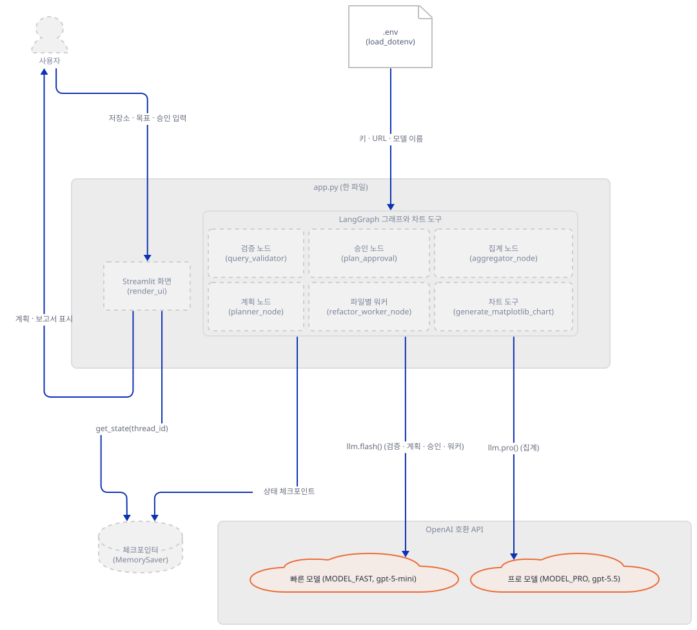

모델 이름을 바꿀 때는 `MODEL_FAST`·`MODEL_PRO` 환경변수를 씁니다. 앞서 본 대로 `gpt-5-mini`는 종료 예정이므로(사전 준비의 ⚠ 행) `MODEL_FAST`를 폐기 표가 권하는 대체 모델 이름으로 바꾸면 되지만, 그 모델로 호출해 보지는 못했습니다.

### Step 3. 상태 스키마, 검증 노드, 계획 노드 — 저장소는 읽지 않는다

**목적.** 그래프가 들고 다니는 값의 모양을 읽고, 검증 노드와 계획 노드가 무엇을 하는지(그리고 하지 않는지)를 확인합니다.

**할 일.**

`advanced_ai_agents/multi_agent_apps/ai_codebase_migration_agent/app.py:124-136`

```python
class MigrationState(TypedDict):
    repo_target: str
    migration_goal: str
    strategy: str
    plan: List[dict]
    plan_approved: bool
    user_feedback: Optional[str]
    status: Literal[
        "planning", "awaiting_approval", "refactoring", "completed", "error"
    ]
    results: Annotated[List[str], operator.add]
    final_answer: Optional[str]
    error: Optional[str]
```

`results`만 `Annotated[List[str], operator.add]`입니다. 같은 키를 여러 노드가 동시에 쓸 때 덮어쓰는 대신 이어 붙이라는 뜻이고, Step 5의 워커 병렬 실행이 이것에 기댑니다. 나머지 키는 쓰는 쪽이 마지막에 쓴 값이 남습니다. 파일 작업 한 건의 모양은 `MigrationTask`(105~121행)이고 `risk_level`은 `Low`·`Medium`·`High`·`Critical` 넷 중 하나로 제한됩니다.

`advanced_ai_agents/multi_agent_apps/ai_codebase_migration_agent/app.py:241-262`

```python
def query_validator(state: MigrationState) -> dict:
    repo = state.get("repo_target", "").strip()
    goal = state.get("migration_goal", "").strip()
    logger.info(f"Validating migration request - Repo: '{repo}', Goal: '{goal}'")

    if not repo or not goal:
        logger.warning("Query validation failed: Missing repo or migration goal.")
        return {
            "status": "error",
            "error": "Please provide both a target repository URL/path AND a clear migration goal.",
        }

    try:
        validator_llm = llm.flash().with_structured_output(
            QueryValidation, method="json_mode"
        )
        messages = [
            SystemMessage(content=VALIDATOR_SYSTEM_PROMPT),
            HumanMessage(content=f"Repository Target: {repo}\nMigration Goal: {goal}"),
        ]
        validation = validator_llm.invoke(messages)

```

검증 노드의 첫 관문은 모델이 아니라 빈 문자열 검사입니다. 둘 중 하나가 비면 모델을 부르지 않고 `error`를 채웁니다. 모델에게 묻는 부분의 끝이 중요합니다.

`advanced_ai_agents/multi_agent_apps/ai_codebase_migration_agent/app.py:271-292`

```python
    except Exception as e:
        error_msg = str(e).lower()
        logger.error(f"Error during query validation LLM call: {e}")
        if any(
            kw in error_msg
            for kw in [
                "api key",
                "authentication",
                "unauthorized",
                "401",
                "403",
                "invalid key",
                "missing credentials",
                "not set",
            ]
        ):
            return {
                "status": "error",
                "error": "API key is missing or invalid. Open the sidebar to configure your API keys.",
            }

    logger.info("Query validation successful.")
```

예외가 나면 메시지에 키 관련 낱말이 있을 때만 `error`를 돌려주고, 연결 오류 같은 나머지 예외는 로그만 남긴 채 통과합니다. 마지막 줄 `return {}`는 "검증 통과"입니다. 앱 폴더에 `step3_plan.py`를 만들어 가짜 서버(Step 2에서 띄운 것)로 먼저 정상 경로를 봅니다.

```python
import os

os.environ["LLM_BASE_URL"] = "http://127.0.0.1:53817/v1"
os.environ["OPENAI_API_KEY"] = "sk-fake-not-real"
import app

graph = app.get_graph()
config = {"configurable": {"thread_id": "plan"}}
for event in graph.stream(
    {"repo_target": "github.com/acme/shop", "migration_goal": "Migrate Pydantic v1 to v2"},
    config=config,
):
    print({k: (list(v) if isinstance(v, dict) else v) for k, v in event.items() if k != "__interrupt__"} or "INTERRUPT")
state = graph.get_state(config)
print("status:", state.values["status"], "| next:", state.next)
for task in state.values["plan"]:
    print(" ", task["risk_level"].ljust(8), task["file_path"])
```

```bash
uv run --no-project python step3_plan.py
```

직접 확인한 출력:

```
{'query_validator': None}
{'planner': ['strategy', 'plan', 'status']}
INTERRUPT
status: awaiting_approval | next: ('approval',)
  High     src/models/user.py
  Medium   api/routes.py
  Low      config/settings.py
```

검증 노드는 `{}`를 돌려줘서 이벤트 값이 `None`으로 나옵니다. 계획 노드가 `strategy`·`plan`·`status` 셋을 쓰고, 그래프는 승인 노드에 들어갔다가 멈춥니다(`INTERRUPT`, Step 4). 마지막 세 줄의 파일 경로는 가짜 서버가 고정으로 돌려준 것입니다. 이 앱의 계획 노드를 보면 진짜 모델도 같은 처지입니다.

`advanced_ai_agents/multi_agent_apps/ai_codebase_migration_agent/app.py:349-363`

```python
    user_content = (
        f"Repository: {state['repo_target']}\n"
        f"Migration Goal: {state['migration_goal']}\n"
    )
    if state.get("user_feedback"):
        user_content += (
            f"\nUser feedback on previous plan: {state['user_feedback']}\n"
            f"Previous Strategy: {state.get('strategy', '')}\n"
            f"Previous Plan: {json.dumps(state.get('plan', []), indent=2)}"
        )

    messages = [
        SystemMessage(content=PLANNER_SYSTEM_PROMPT),
        HumanMessage(content=user_content),
    ]
```

모델이 받는 것은 저장소 문자열 하나와 목표 문장 하나, 그리고 시스템 지시문뿐입니다. `repo_target`은 앱 전체에서 프롬프트에 끼워 넣는 줄(350·548행)과 입력 검사(242행)에서만 쓰이고, 파일을 열거나 내려받거나 네트워크로 가져오는 코드는 `app.py`에 없습니다(소스로 확인: `clone`·`requests`·`subprocess`·`open(`·`httpx` 검색 결과 없음). 214행의 `github.com/my-org/my-project`와 `https://github.com/fastapi/fastapi`는 검증 지시문 안의 유효한 입력 예시 문자열일 뿐입니다. `MigrationTask`의 `code_context`(118행)는 선택 필드인데 계획 지시문의 JSON 스키마에는 없고 값을 채우는 코드도 없습니다(소스로 확인). 그래서 진짜 모델이 돌려주는 `src/models/user.py` 같은 경로는 저장소 이름과 목표 문장을 보고 지어낸 것입니다.

앞에서 읽은 검증 노드의 "연결 오류는 통과" 부분을 직접 봅니다. 아무도 듣지 않는 포트(`53818`)를 가리키게 해서 가짜 서버 없이 돌립니다.

```python
import os

os.environ["LLM_BASE_URL"] = "http://127.0.0.1:53818/v1"
os.environ["OPENAI_API_KEY"] = "sk-fake-not-real"
import logging

logging.disable(logging.CRITICAL)
import time

import app

graph = app.get_graph()
config = {"configurable": {"thread_id": "closed"}}
start = time.time()
for event in graph.stream(
    {"repo_target": "github.com/acme/shop", "migration_goal": "Migrate Pydantic v1 to v2"},
    config=config,
):
    print(f"{time.time() - start:4.1f}초", event)
```

```bash
uv run --no-project python step3_closed.py
```

직접 확인한 출력(이 PC에서 53818은 닫혀 있었습니다):

```
 7.8초 {'query_validator': None}
15.3초 {'planner': {'status': 'error', 'error': 'Failed to generate migration plan: Connection error.'}}
```

검증 노드는 연결이 안 되는데도 `None`(통과)으로 끝났고, 오류는 계획 노드에서야 `Failed to generate migration plan: Connection error.`로 나왔습니다. 호출마다 7~8초가 걸린 것은 OpenAI SDK가 연결 실패를 기본 설정대로 재시도해서입니다. 계획 노드의 `except`(376~382행)는 `error`를 채우고, 그래프의 갈래(Step 4)가 `error`를 보고 `END`로 보냅니다.

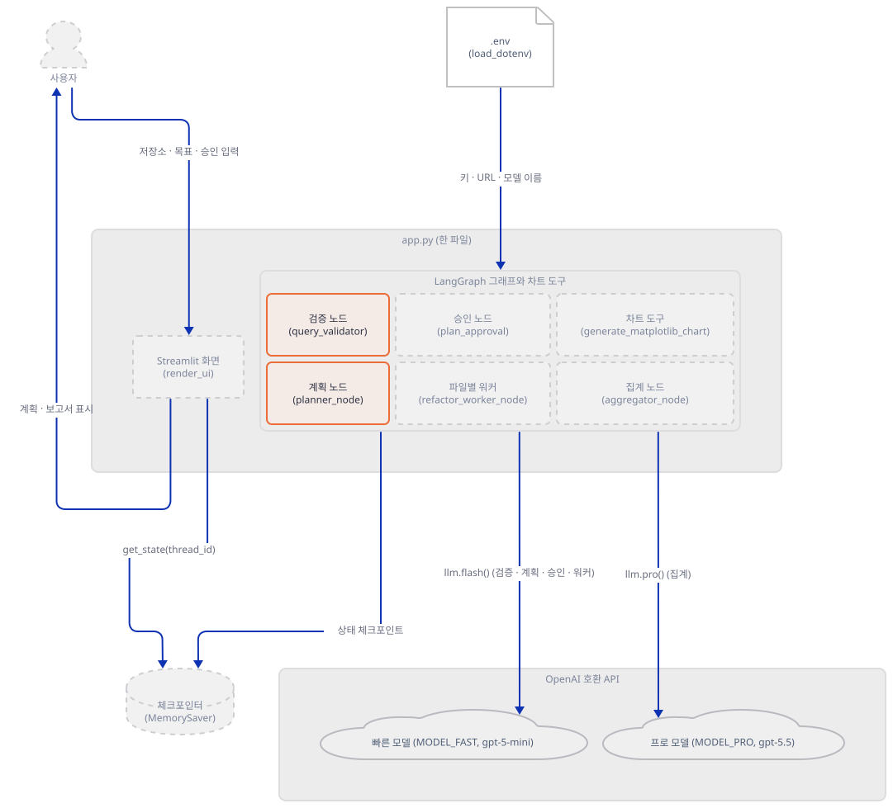

### Step 4. 승인 노드와 `interrupt` — 그래프를 사람 앞에서 멈춘다

**목적.** 그래프가 승인 노드에서 멈추고, 사용자의 문장으로 이어지고, 수정 요청이면 계획 노드로 되돌아가는 것을 확인합니다.

**할 일.**

`advanced_ai_agents/multi_agent_apps/ai_codebase_migration_agent/app.py:402-434`

```python
def plan_approval(state: MigrationState) -> dict:
    user_response = interrupt("Waiting for migration plan approval/feedback")

    feedback = (
        user_response.get("message", "")
        if isinstance(user_response, dict)
        else str(user_response)
    )

    approval_llm = llm.flash().with_structured_output(
        PlanApprovalState, method="json_mode"
    )

    user_content = (
        f"User feedback: {feedback}\n"
        f"Proposed Strategy: {state.get('strategy', '')}\n"
        f"Proposed Plan: {json.dumps(state.get('plan', []), indent=2)}"
    )

    messages = [
        SystemMessage(content=APPROVAL_SYSTEM_PROMPT),
        HumanMessage(content=user_content),
    ]
    result = approval_llm.invoke(messages)

    logger.info(f"Plan approval status: {result.plan_approved}, Feedback: '{feedback}'")

    status = "refactoring" if result.plan_approved else "planning"
    return {
        "plan_approved": result.plan_approved,
        "user_feedback": feedback,
        "status": status,
    }
```

`interrupt("…")`가 호출되면 그 자리에서 그래프가 멈추고 메시지가 바깥으로 전달됩니다. 이어질 때는 `Command(resume=…)`로 넘긴 값이 `interrupt()`의 반환값이 됩니다. 이 앱은 그 값에서 `message`를 꺼내 모델에게 "승인인가, 수정 요청인가"를 분류시키고(`json_mode`), 승인이면 `status="refactoring"`, 아니면 `"planning"`으로 둡니다. 멈춘 상태를 붙드는 것은 컴파일할 때 넘기는 체크포인터입니다.

`advanced_ai_agents/multi_agent_apps/ai_codebase_migration_agent/app.py:649-673`

```python
    def route_after_approval(state: MigrationState):
        # An approved-but-empty plan would fan out to zero workers and strand the
        # graph before the aggregator, so send it back to the planner instead.
        if state.get("plan_approved") and state.get("plan"):
            return dispatch_workers(state)
        return "planner"

    builder.add_edge(START, "query_validator")
    builder.add_conditional_edges(
        "query_validator",
        lambda state: END if state.get("error") else "planner",
        ["planner", END],
    )
    builder.add_conditional_edges(
        "planner",
        lambda state: END if state.get("error") else "approval",
        ["approval", END],
    )
    builder.add_conditional_edges(
        "approval", route_after_approval, ["refactor_worker", "planner"]
    )
    builder.add_edge("refactor_worker", "aggregator")
    builder.add_edge("aggregator", END)

    return builder.compile(checkpointer=MemorySaver())
```

`approval`에서는 `route_after_approval`이 `Send` 목록(승인됐고 계획이 비지 않았을 때)이나 `"planner"`를 돌려줍니다. 승인됐는데 계획이 비어 있으면 워커가 0개가 되어 그래프가 갇히니 계획 노드로 되돌린다는 주석이 붙어 있습니다. `planner`와 `query_validator`는 `error`가 있으면 `END`로 갑니다. 앱이 컴파일한 갈래를 그대로 뽑아 봅니다. `step4_edges.py`입니다.

```python
import app

for edge in app.get_graph().get_graph().edges:
    print(edge.source, "->", edge.target, "(조건부)" if edge.conditional else "")
```

```bash
uv run --no-project python step4_edges.py
```

직접 확인한 출력:

```
__start__ -> query_validator 
approval -> planner (조건부)
approval -> refactor_worker (조건부)
planner -> __end__ (조건부)
planner -> approval (조건부)
query_validator -> __end__ (조건부)
query_validator -> planner (조건부)
refactor_worker -> aggregator 
aggregator -> __end__ 
```

앱 파일 맨 위 주석이 그린 흐름(`START -> query_validator -> planner -> approval -> … -> aggregator -> END`, 3~5행)에 두 가지가 더 있습니다. 승인 노드에서 계획 노드로 되돌아가는 갈래와, 검증·계획 노드에서 `END`로 빠지는 갈래입니다. 아래 그림이 이 갈래들입니다(워커 이후는 Step 5).

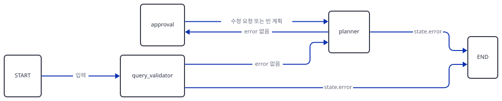

이제 멈추고 이어지는 것을 봅니다. 수정 요청을 한 번 보내 봅니다. `step4_approval.py`입니다.

```python
import os

os.environ["LLM_BASE_URL"] = "http://127.0.0.1:53817/v1"
os.environ["OPENAI_API_KEY"] = "sk-fake-not-real"
import app
from langgraph.types import Command

graph = app.get_graph()
config = {"configurable": {"thread_id": "approval"}}
for _ in graph.stream(
    {"repo_target": "github.com/acme/shop", "migration_goal": "Migrate Pydantic v1 to v2"},
    config=config,
):
    pass
state = graph.get_state(config)
print("멈춘 곳:", state.next, [i.value for t in state.tasks for i in t.interrupts])

print("== 수정 요청")
for event in graph.stream(
    Command(resume={"message": "mark models/user.py as Critical risk, skip config/settings.py"}),
    config=config,
):
    print({k: (list(v) if isinstance(v, dict) else "INTERRUPT") for k, v in event.items()})
state = graph.get_state(config)
print(state.values["plan_approved"], state.next, [(t["file_path"], t["risk_level"]) for t in state.values["plan"]])
```

```bash
uv run --no-project python step4_approval.py
```

직접 확인한 출력:

```
멈춘 곳: ('approval',) ['Waiting for migration plan approval/feedback']
== 수정 요청
{'approval': ['plan_approved', 'user_feedback', 'status']}
{'planner': ['strategy', 'plan', 'status']}
{'__interrupt__': 'INTERRUPT'}
False ('approval',) [('src/models/user.py', 'Critical'), ('api/routes.py', 'Medium')]
```

`state.next`가 `('approval',)`이고 멈춘 이유(`Waiting for…`)가 `tasks`의 `interrupts`에 들어 있습니다. 수정 문장을 `resume`으로 보내자 승인 노드가 `plan_approved=False`를 돌려주고, 그래프는 계획 노드를 다시 돈 뒤 승인 노드에서 다시 멈췄습니다. 새 계획에서 `src/models/user.py`가 `Critical`이 되고 설정 파일이 빠졌지만, 이것은 가짜 서버가 수정 요청에 돌려주는 고정 응답이고 진짜 모델이 문장대로 고치는지는 확인하지 못했습니다. 승인 분류도 모델 호출입니다. 화면의 Approve 버튼이 보내는 고정 문장(`"Approved. Proceed with codebase migration."`, 897행)조차 승인으로 읽을지는 모델에게 맡겨집니다.

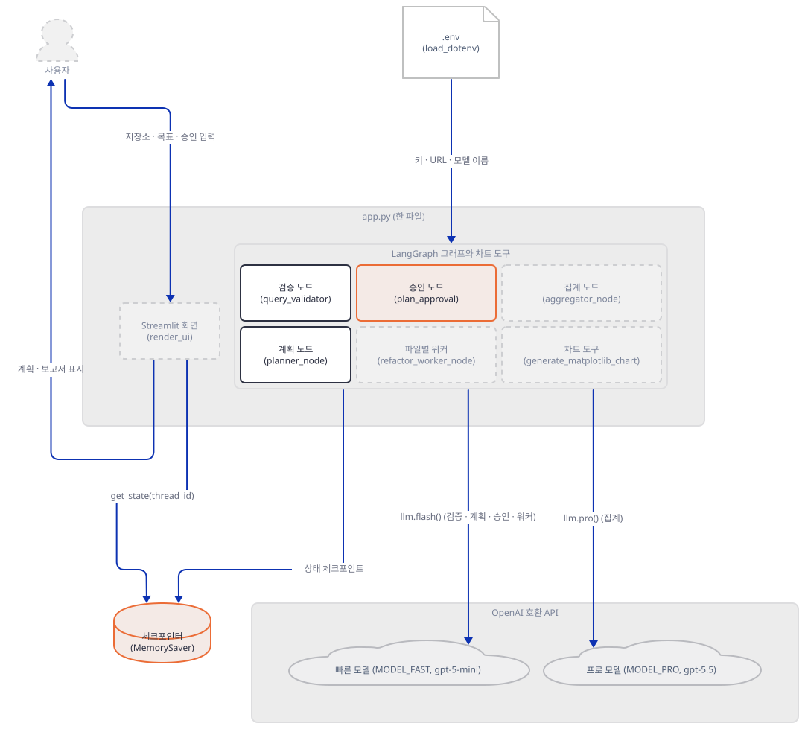

### Step 5. `Send`로 파일마다 워커 — 병렬 팬아웃

**목적.** 승인되면 계획의 파일 수만큼 워커가 동시에 뜨는 것, 각 워커가 하는 일, 워커가 실패하면 어떻게 되는지를 확인합니다.

**할 일.**

`advanced_ai_agents/multi_agent_apps/ai_codebase_migration_agent/app.py:440-445`

```python
def dispatch_workers(state: MigrationState) -> List[Send]:
    """Fan-out to one refactor worker per file in the approved migration plan."""
    return [
        Send("refactor_worker", {**state, "file_task": task})
        for task in state["plan"][:8]
    ]
```

계획의 파일마다 `Send("refactor_worker", …)` 하나입니다. 상태 전체에 그 파일 작업(`file_task`)을 얹어 보내고, 파일이 8개를 넘으면 앞 8개만 돕니다(계획 스키마도 `max_length=8`, 340행. 지시문은 3~6개를 요청, 308행).

`advanced_ai_agents/multi_agent_apps/ai_codebase_migration_agent/app.py:471-504`

```python
def refactor_worker_node(state: MigrationState) -> dict:
    file_task = state.get("file_task", {})
    file_path = file_task.get("file_path", "unknown_file")
    logger.info(f"Refactor worker starting for file: {file_path}")

    # Stagger worker execution to avoid API rate limit spikes
    stagger_time = random.uniform(0.3, 1.5)
    time.sleep(stagger_time)

    prompt_text = REFACTOR_WORKER_PROMPT.format(
        file_path=file_path,
        action=file_task.get("action", ""),
        risk_level=file_task.get("risk_level", "Medium"),
        risk_reasoning=file_task.get("risk_reasoning", ""),
        migration_goal=state.get("migration_goal", ""),
    )

    messages = [
        SystemMessage(
            content="You are an expert code refactoring worker producing clean diffs and migration code."
        ),
        HumanMessage(content=prompt_text),
    ]

    try:
        response = llm.flash().invoke(messages)
        diff_output = (
            f"### 📄 File: `{file_path}`\n"
            f"**Risk Level:** `{file_task.get('risk_level', 'Medium')}` | **Action:** {file_task.get('action', '')}\n\n"
            f"{response.content.strip()}\n\n"
            f"---"
        )
        logger.info(f"Refactor worker finished for {file_path}")
        return {"results": [diff_output]}
```

워커는 상태에서 `file_task`를 꺼내 지시문 틀에 끼우고(`REFACTOR_WORKER_PROMPT`, 450~468행) 빠른 모델을 한 번 부릅니다. 눈여겨볼 것이 둘입니다. 첫째, 워커가 받는 것은 파일 경로·행동·위험도·이유·목표뿐이고 파일 내용은 없으니, 모델이 써내는 "정확한 diff"는 존재하지 않는 코드에 대한 추측입니다(Step 3과 같은 이유). 둘째, 호출 전에 `time.sleep(random.uniform(0.3, 1.5))`로 시작을 엇갈립니다(477행). 속도 제한을 피하려는 것이라고 주석이 말합니다. 결과는 `{"results": [문자열 하나]}`이고 앞에서 본 `operator.add`가 그 문자열들을 한 목록으로 이어 붙입니다.

`advanced_ai_agents/multi_agent_apps/ai_codebase_migration_agent/app.py:505-514`

```python
    except Exception as e:
        logger.error(
            f"Error in refactor worker node for {file_path}: {e}", exc_info=True
        )
        return {
            "results": [
                f"### 📄 File: `{file_path}`\n"
                f"❌ **Refactoring Failed**: {str(e)}\n\n---"
            ]
        }
```

실패해도 예외가 아니라 `❌ **Refactoring Failed**` 문장이 결과 목록에 들어가고 그래프는 집계 노드까지 갑니다. 병렬이라는 것을 눈으로 봅니다. 가짜 서버를 워커 응답마다 6초 지연시키는 인자(세 번째)로 다시 띄웁니다.

```bash
uv run --no-project python fake_llm.py 53817 llm.jsonl 6
```

앞 터미널의 서버는 `Ctrl+C`로 끄고 이것으로 바꿉니다. `step5_workers.py`입니다.

```python
import os
import time

os.environ["LLM_BASE_URL"] = "http://127.0.0.1:53817/v1"
os.environ["OPENAI_API_KEY"] = "sk-fake-not-real"
import app
from langgraph.types import Command

graph = app.get_graph()
config = {"configurable": {"thread_id": "workers"}}
for _ in graph.stream(
    {"repo_target": "github.com/acme/shop", "migration_goal": "Migrate Pydantic v1 to v2"},
    config=config,
):
    pass
start = time.time()
for event in graph.stream(
    Command(resume={"message": "Approved. Proceed with codebase migration."}), config=config
):
    print(f"{time.time() - start:4.1f}s", list(event))
print("파일 수:", len(graph.get_state(config).values["plan"]))
```

```bash
uv run --no-project python step5_workers.py
```

직접 확인한 출력(시간은 실행마다 조금 다릅니다):

```
 0.0s ['approval']
 6.7s ['refactor_worker']
 6.7s ['refactor_worker']
 7.2s ['refactor_worker']
 7.4s ['aggregator']
파일 수: 3
```

워커 세 개가 한꺼번에 끝났습니다(6.7~7.2초). 하나씩 돌았다면 6초 지연이 세 번이라 18초를 넘었을 것입니다. 6.7초와 7.2초의 차이는 시작을 엇갈리는 0.3~1.5초 안에 듭니다. 서버의 요청 기록은 검증 1, 계획 1, 승인 분류 1, 워커 3, 집계 2건으로 모두 여덟 건이었습니다(직접 확인). 확인이 끝나면 서버를 지연 없는 판으로 다시 띄웁니다(`python fake_llm.py 53817 llm.jsonl`).

흐름을 그림으로 보면 이렇습니다.

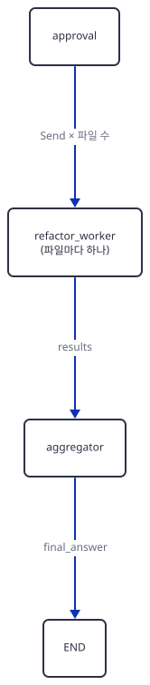

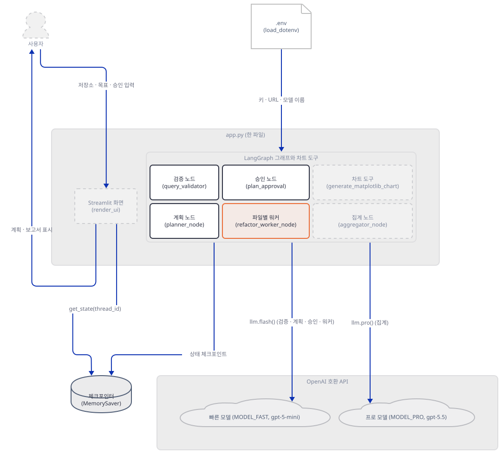

### Step 6. 집계 노드와 차트 도구 — 모델은 데이터만 고른다

**목적.** 집계 노드가 도구 호출을 주고받는 반복을 읽고, 차트 도구가 코드가 아니라 데이터만 받는다는 것을 확인합니다.

**할 일.**

`advanced_ai_agents/multi_agent_apps/ai_codebase_migration_agent/app.py:147-165`

```python
@tool
def generate_matplotlib_chart(
    chart_type: Literal["bar", "line"],
    labels: list[str],
    values: list[float],
    title: str = "Migration Risk Distribution",
    y_label: str = "Files",
) -> str:
    """Render a chart from validated data selected by the model.

    This tool accepts data only. It never executes model-generated Python,
    imports, or callables, so model output cannot access the host filesystem.
    """
    if chart_type not in {"bar", "line"}:
        return "Error rendering chart: chart_type must be 'bar' or 'line'."
    if not labels or len(labels) > MAX_CHART_POINTS:
        return f"Error rendering chart: provide 1-{MAX_CHART_POINTS} labels."
    if len(labels) != len(values):
        return "Error rendering chart: labels and values must have the same length."
```

도구의 인자는 `chart_type`·`labels`·`values`·`title`·`y_label` 다섯입니다. 파이썬 코드를 받는 인자가 없고(앱의 테스트도 같은 것을 지킵니다), 나머지 검증(166~179행)은 길이·유한한 수·글자 수를 봅니다. 성공하면 PNG를 base64 문자열로 바꿔 `data:image/png;base64` 주소를 단 마크다운 이미지 한 줄로 돌려줍니다.

`advanced_ai_agents/multi_agent_apps/ai_codebase_migration_agent/app.py:559-602`

```python
        llm_with_tools = llm.pro().bind_tools([generate_matplotlib_chart])
        messages_history = list(messages)
        chart_links = []

        for round_num in range(1, MAX_AGGREGATOR_ROUNDS + 1):
            try:
                response = llm_with_tools.invoke(messages_history)
            except TimeoutError:
                logger.error(f"Aggregator LLM request timed out on round {round_num}")
                break

            messages_history.append(response)

            if not response.tool_calls or round_num == MAX_AGGREGATOR_ROUNDS:
                break

            for tool_call in response.tool_calls:
                if tool_call["name"] == "generate_matplotlib_chart":
                    result = generate_matplotlib_chart.invoke(tool_call["args"])
                    if result.startswith("Error rendering chart"):
                        messages_history.append(
                            ToolMessage(
                                content=result[:300],
                                tool_call_id=tool_call["id"],
                                name=tool_call["name"],
                            )
                        )
                    else:
                        chart_links.append(result)
                        marker = f"<!--CHART_{len(chart_links)}-->"
                        messages_history.append(
                            ToolMessage(
                                content=marker,
                                tool_call_id=tool_call["id"],
                                name=tool_call["name"],
                            )
                        )
                else:
                    messages_history.append(
                        ToolMessage(
                            content=f"Unknown tool {tool_call['name']}",
                            tool_call_id=tool_call["id"],
                        )
                    )
```

집계 노드는 프로 모델에 도구를 묶어(`bind_tools`) 최대 6번(`MAX_AGGREGATOR_ROUNDS`, 538행) 돕니다. 모델이 도구를 부르면 차트를 실제로 그리고, 모델에게는 PNG 대신 `<!--CHART_1-->` 같은 표식만 돌려줍니다. 큰 이미지를 대화에 되먹이지 않는 것입니다. 이어서 모든 어시스턴트 발화를 이어 붙이고 표식을 실제 `data:` 링크로 바꿉니다(607~614행). 도구는 직접 부르는 것으로도 확인합니다. `step6_report.py`는 도구 세 가지 호출과 그래프 끝까지의 실행을 합칩니다(서버는 지연 없는 판).

```python
import os

os.environ["LLM_BASE_URL"] = "http://127.0.0.1:53817/v1"
os.environ["OPENAI_API_KEY"] = "sk-fake-not-real"
import app
from langgraph.types import Command

chart = app.generate_matplotlib_chart
print(sorted(chart.args_schema.model_json_schema()["properties"]))
ok = chart.invoke({"chart_type": "bar", "labels": ["Low", "High"], "values": [2, 1]})
print(ok[:40], "...", len(ok), "글자")
print(chart.invoke({"chart_type": "bar", "labels": ["Low"], "values": []}))
print(chart.invoke({"chart_type": "line", "labels": ["a"], "values": [float("nan")]}))

graph = app.get_graph()
config = {"configurable": {"thread_id": "report"}}
for _ in graph.stream(
    {"repo_target": "github.com/acme/shop", "migration_goal": "Migrate Pydantic v1 to v2"},
    config=config,
):
    pass
for _ in graph.stream(Command(resume={"message": "Approved. Proceed with codebase migration."}), config=config):
    pass
values = graph.get_state(config).values
print(values["status"], len(values["results"]), "개 결과")
print(values["final_answer"][:60].replace("\n", " | "))
print("차트 표식 남음:", "<!--CHART_1-->" in values["final_answer"], "| data URI 들어감:", "data:image/png;base64," in values["final_answer"])
```

```bash
uv run --no-project python step6_report.py
```

직접 확인한 출력(base64 길이는 그림이라 실행마다 조금 다를 수 있습니다):

```
['chart_type', 'labels', 'title', 'values', 'y_label']
을 검사합니다. `pytest`는 requirements에 없어서 따로 깝니다.

```bash
uv pip install pytest
uv run --no-project python -m pytest -q -p no:cacheprovider test_app_security.py
```

직접 확인한 출력(시간은 다릅니다. `-p no:cacheprovider`는 앱 폴더에 `.pytest_cache`가 생기지 않게 합니다):

```
...                                                                      [100%]
3 passed in 3.74s
```

집계 노드가 끝에 반환하는 것은 `final_answer`와 `status="completed"`입니다. 모델이 빈 내용을 돌려주면 `error` 상태가 됩니다(616~625행). 도구 호출과 응답이 오가는 순서는 아래 그림이고, 앞 그림(`extra-collect`)은 이 반복의 첫 호출까지를 보여 줍니다.

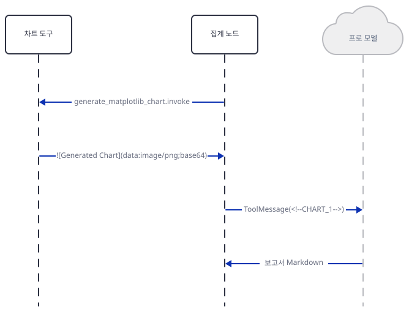

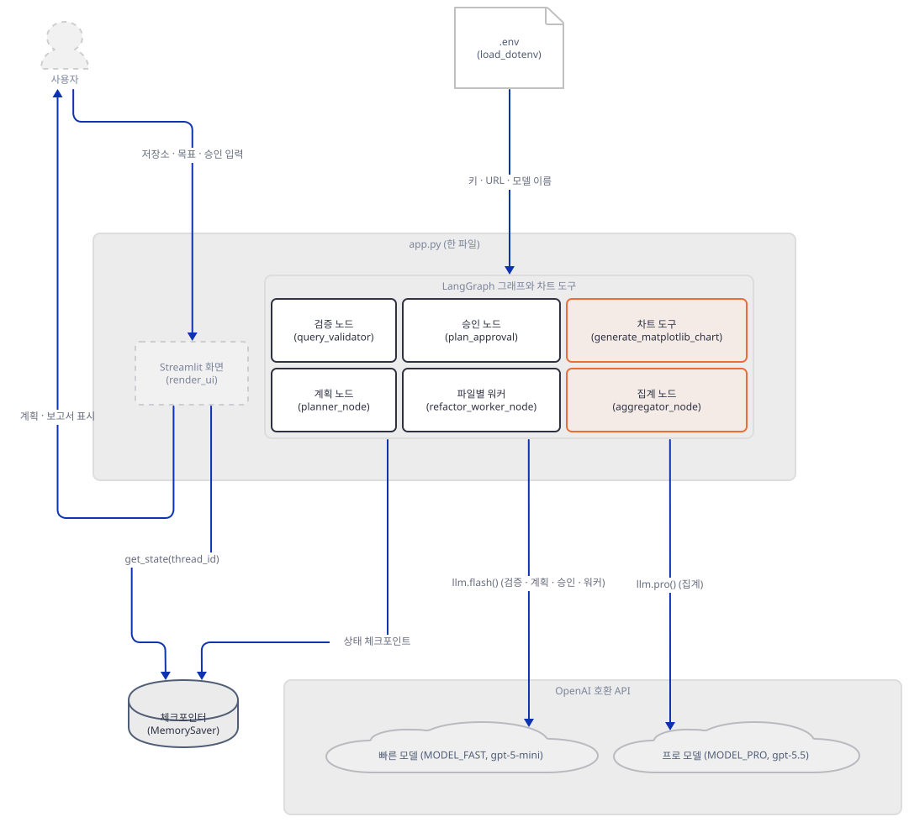

### Step 7. Streamlit 화면 — 다시 실행되는 스크립트와 사라지는 체크포인터

**목적.** 화면이 그래프를 부르는 길을 읽고, 앱을 띄운 뒤, 승인 버튼이 왜 동작하지 않는지 확인하고 고쳐 봅니다.

**할 일.**

`advanced_ai_agents/multi_agent_apps/ai_codebase_migration_agent/app.py:676-691`

```python
_graph_key = None
_graph = None


def get_graph():
    global _graph_key, _graph
    llm_key = os.getenv("LLM_API_KEY") or os.getenv("OPENAI_API_KEY") or ""
    base_url = os.getenv("LLM_BASE_URL") or ""
    model_fast = os.getenv("MODEL_FAST") or DEFAULT_MODEL_FAST
    model_pro = os.getenv("MODEL_PRO") or DEFAULT_MODEL_PRO

    key = (llm_key, base_url, model_fast, model_pro)
    if _graph is None or _graph_key != key:
        _graph_key = key
        _graph = build_migration_graph()
    return _graph
```

`get_graph()`는 모듈 전역 `_graph`에 그래프를 만들어 두고 키·주소·모델이 바뀌면 다시 만듭니다. 화면이 그래프를 부르는 곳은 둘입니다. 계획 버튼은 `graph.stream({…입력…})`으로 처음부터 시작하고(832~839행), 승인·수정 버튼은 같은 `thread_id`로 `graph.stream(Command(resume={"message": …}))`를 부릅니다(911~913행). 둘 다 끝나면 `graph.get_state(config)`로 상태를 읽어 화면에 반영합니다(844~848행, 930~934행). 그림이 이 길입니다.

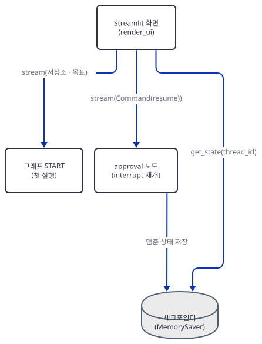

사이드바에서 키를 고르는 부분도 한 가지 알아 둘 것이 있습니다.

`advanced_ai_agents/multi_agent_apps/ai_codebase_migration_agent/app.py:694-704`

```python
def apply_api_keys(api_key: str, base_url: str, model_fast: str, model_pro: str):
    """Update runtime configuration and reset client cache."""
    if api_key:
        os.environ["LLM_API_KEY"] = api_key
    if base_url:
        os.environ["LLM_BASE_URL"] = base_url
    if model_fast:
        os.environ["MODEL_FAST"] = model_fast
    if model_pro:
        os.environ["MODEL_PRO"] = model_pro
    reset_clients()
```

사이드바 칸에 입력한 값은 Save Settings 버튼을 눌러야 `os.environ`에 올라갑니다(777~780행). 입력만 하고 Plan Migration을 누르면 환경변수에 키가 없어 Step 1의 오류가 납니다. `AppTest`로 이 순서를 돌려 봤습니다. `step7_save.py`입니다(`logging.disable`은 오류 로그 줄을 가리려는 것입니다).

```python
import os

os.environ.pop("OPENAI_API_KEY", None)
import logging

logging.disable(logging.CRITICAL)
from streamlit.testing.v1 import AppTest

at = AppTest.from_file("app.py", default_timeout=120)
at.run()


def plan():
    repo = [t for t in at.main.text_input if t.label.startswith("Target")][0]
    goal = [t for t in at.main.text_area if t.label.startswith("Migration Goal")][0]
    repo.set_value("github.com/acme/shop")
    goal.set_value("Migrate Pydantic v1 to v2")
    [b for b in at.button if b.label.startswith("🚀")][0].click()
    at.run()


box = {t.label: t for t in at.sidebar.text_input}
box["API Key"].set_value("sk-typed-in-sidebar")
box["Base URL (optional)"].set_value("http://127.0.0.1:53817/v1")
at.run()
plan()
print("1) 키만 입력 ->", at.session_state.status, [e.value for e in at.error], "| LLM_API_KEY:", os.environ.get("LLM_API_KEY"))
[b for b in at.sidebar.button if b.label == "Save Settings"][0].click()
at.run()
print("2) Save Settings 뒤 LLM_API_KEY:", os.environ.get("LLM_API_KEY"), "| LLM_BASE_URL:", os.environ.get("LLM_BASE_URL"))
plan()
print("3) 다시 계획 ->", at.session_state.status, [e.value for e in at.error])
```

```bash
uv run --no-project python step7_save.py
```

직접 확인한 출력:

```
1) 키만 입력 -> None ['API key is missing or invalid. Open the sidebar to configure your API keys.'] | LLM_API_KEY: None
2) Save Settings 뒤 LLM_API_KEY: sk-typed-in-sidebar | LLM_BASE_URL: http://127.0.0.1:53817/v1
3) 다시 계획 -> awaiting_approval []
```

`apply_api_keys`는 `os.environ`을 바꾸므로 같은 Streamlit 서버에 접속한 모든 세션이 그 키를 공유합니다(소스로 확인). 앱을 띄우는 명령은 이렇습니다.

```bash
uv run --no-project streamlit run app.py
```

이 문서는 서버만 띄워 응답을 봤습니다. 주소를 `localhost`로 지정하지 않으면 Streamlit이 시작하며 외부 IP를 알아내려고 `checkip.amazonaws.com`에 접속하므로(Day 054가 확인한 사실) 지정합니다.

```bash
uv run --no-project streamlit run app.py --server.headless true --server.address localhost --server.port 53827 --browser.gatherUsageStats false
```

```bash
curl -s -o /dev/null -w "%{http_code}\n" http://localhost:53827
curl -s http://localhost:53827/_stcore/health
```

직접 확인한 출력은 `200`과 `ok`였고, 서버 로그는 `Uvicorn server started on localhost:53827`과 `URL: http://localhost:53827`을 찍었습니다. 서버는 `Ctrl+C`로 멈춥니다. (사용 통계 동의를 묻는 "Collecting usage statistics" 안내는 `~/.streamlit/credentials.toml`이 없을 때만 나오는데, 이 문서는 `--browser.gatherUsageStats false`를 줬고 홈을 비운 환경이라 보지 않았습니다. PowerShell에서도 같은 명령입니다. 실행해 보지 못했습니다.)

이제 승인 버튼의 문제입니다. Streamlit은 위젯을 누를 때마다 메인 스크립트를 처음부터 다시 실행하고, 실행마다 새 `__main__` 모듈을 만들어 그 안에서 `exec`합니다(소스로 확인: Streamlit 1.65.0 `runtime/scriptrunner/script_runner.py` 764행의 `_new_module("__main__")`와 924행의 `exec(code, module.__dict__)`). `app.py`가 메인 스크립트이므로 676~677행의 `_graph = None`도, `build_migration_graph()` 안의 `MemorySaver()`도 매번 새것입니다. 눈으로 봅니다. `step7_probe.py`는 `app.py`를 그대로 실행한 뒤 화면에 현재 체크포인터의 객체 번호를 덧붙여 세 번 실행합니다.

```python
import os

os.environ["LLM_BASE_URL"] = "http://127.0.0.1:53817/v1"
os.environ["OPENAI_API_KEY"] = "sk-fake-not-real"
from streamlit.testing.v1 import AppTest

PROBE = '''
exec(compile(open("app.py", encoding="utf-8").read(), "app.py", "exec"))
import streamlit as st
st.sidebar.caption(f"PROBE saver={id(get_graph().checkpointer)}")
'''
at = AppTest.from_string(PROBE, default_timeout=60)
for n in (1, 2, 3):
    at.run()
    print("실행", n, [c.value for c in at.sidebar.caption if "PROBE" in c.value])
```

```bash
uv run --no-project python step7_probe.py
```

직접 확인한 출력(숫자는 실행마다 다르고 서로 다르기만 하면 됩니다):

```
실행 1 ['PROBE saver=2324564952128']
실행 2 ['PROBE saver=2324646228560']
실행 3 ['PROBE saver=2324565476688']
```

체크포인터가 실행마다 다른 객체입니다. 계획 버튼으로 멈춘 계획은 그 실행의 `MemorySaver`에만 있고, 다음 실행(승인 버튼)의 그래프는 그 `thread_id`를 모릅니다. 화면 전체를 `AppTest`로 돌려 봅니다. `step7_ui.py`는 입력 → Plan Migration → Approve를 누르고 결과를 찍습니다(서버는 지연 없는 판).

```python
import os
import sys

os.environ["LLM_BASE_URL"] = "http://127.0.0.1:53817/v1"
os.environ["OPENAI_API_KEY"] = "sk-fake-not-real"
from streamlit.testing.v1 import AppTest

at = AppTest.from_file(sys.argv[1] if len(sys.argv) > 1 else "app.py", default_timeout=120)
at.run()
print("title:", at.title[0].value, "| exception:", list(at.exception))

repo = [t for t in at.main.text_input if t.label.startswith("Target")][0]
goal = [t for t in at.main.text_area if t.label.startswith("Migration Goal")][0]
repo.set_value("github.com/acme/shop")
goal.set_value("Migrate Pydantic v1 to v2")
[b for b in at.button if b.label.startswith("🚀")][0].click()
at.run()
print("1) Plan Migration ->", at.session_state.status, "| 계획", len(at.session_state.plan), "개")

[b for b in at.button if "Approve" in b.label][0].click()
at.run()
print("2) Approve ->", at.session_state.status, "| 오류 상자:", [e.value for e in at.error])
print("   보고서 부제:", [s.value for s in at.subheader], "| 다운로드 버튼:", len(at.get("download_button")))
```

```bash
uv run --no-project python step7_ui.py
```

직접 확인한 출력(맨 윗줄은 로그):

```
Query validation failed: Missing repo or migration goal.
title: ⚡ Codebase Migration & Refactor Planner | exception: []
1) Plan Migration -> awaiting_approval | 계획 3 개
2) Approve -> None | 오류 상자: ['Please provide both a target repository URL/path AND a clear migration goal.']
   보고서 부제: [] | 다운로드 버튼: 0
```

계획까지는 되고(`awaiting_approval`, 3개), 승인은 `Please provide both a target repository URL/path AND a clear migration goal.` 오류 상자로 끝납니다. 새 그래프에 `Command(resume=…)`를 보내자 체크포인트가 없어 그래프가 처음(`START`)부터 시작했고, 입력이 없으니 검증 노드가 빈 `repo_target`을 거절한 것입니다(로그의 `Query validation failed: Missing repo or migration goal.`). 앱 README는 "Session state is persisted using LangGraph's in-memory `MemorySaver`, allowing execution interrupts to survive Streamlit reruns seamlessly."라고 적었지만(`advanced_ai_agents/multi_agent_apps/ai_codebase_migration_agent/README.md:55`) 오늘의 Streamlit에서는 그렇지 않습니다. 이 확인은 `AppTest`로 한 것이고 실제 브라우저에서 눌러 보지는 못했습니다. 같은 스크립트 러너를 쓰므로 같을 것으로 보지만 확인한 것은 아닙니다.

고치는 방법의 하나는 그래프를 스크립트 밖에서 살아남는 곳에 두는 것입니다. 복사본에서 `_graph`를 `st.cache_resource`가 돌려주는 딕셔너리로 바꿉니다. 앱 파일은 건드리지 않고 복사본을 만드는 `step7_patch.py`입니다.

```python
text = open("app.py", encoding="utf-8").read()
old_head = "_graph_key = None\n_graph = None\n\n\ndef get_graph():\n    global _graph_key, _graph\n"
old_tail = """    if _graph is None or _graph_key != key:
        _graph_key = key
        _graph = build_migration_graph()
    return _graph
"""
assert old_head in text and old_tail in text
text = text.replace(
    old_head,
    "import streamlit as st\n\n\n@st.cache_resource\ndef _holder():\n    return {\"key\": None, \"graph\": None}\n\n\ndef get_graph():\n    h = _holder()\n",
)
text = text.replace(
    old_tail,
    """    if h["graph"] is None or h["key"] != key:
        h["key"] = key
        h["graph"] = build_migration_graph()
    return h["graph"]
""",
)
open("app_cached.py", "w", encoding="utf-8").write(text)
print("app_cached.py written")
```

```bash
uv run --no-project python step7_patch.py
uv run --no-project python step7_ui.py app_cached.py
```

직접 확인한 출력:

```
app_cached.py written
title: ⚡ Codebase Migration & Refactor Planner | exception: []
1) Plan Migration -> awaiting_approval | 계획 3 개
2) Approve -> completed | 오류 상자: []
   보고서 부제: ['📄 Codebase Migration Report & Refactoring Guide'] | 다운로드 버튼: 1
```

같은 장면이 이번에는 `completed`이고 보고서 부제와 다운로드 버튼 하나가 나왔습니다. 이 고침은 키·주소·모델이 바뀌면 그래프를 새로 만드는 기존 동작을 `_holder()` 딕셔너리 안에서 그대로 지키지만, 서버를 쓰는 모든 세션이 같은 그래프와 `MemorySaver`를 공유하게 됩니다(`thread_id`가 세션마다 달라 상태는 섞이지 않습니다. 이 공유는 따로 확인하지 못했습니다).

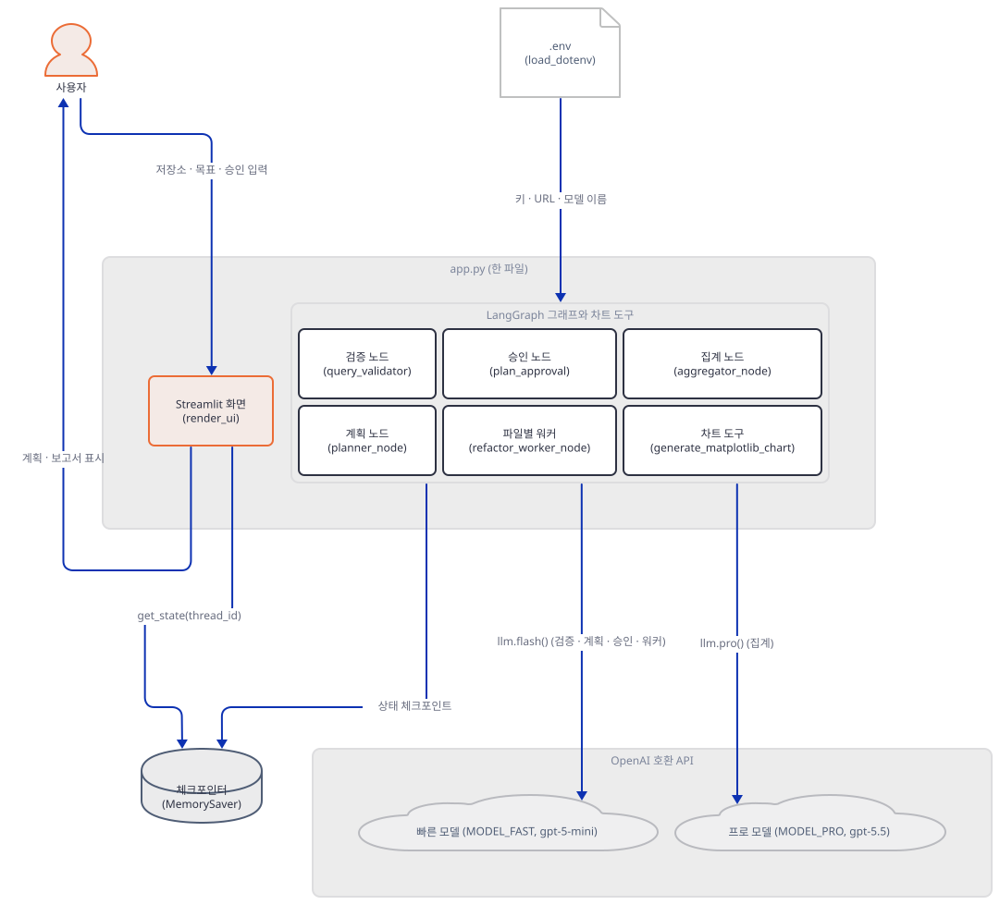

## 요청 한 건이 흐르는 과정

계획 요청 하나에서 보고서까지를 그림 여덟 장으로 나눠 그렸습니다. 한 그림에 넣으면 한 배우가 이웃 둘과 동시에 주고받는 메시지가 다른 배우의 수명선 위에 라벨을 놓게 됩니다(모든 배우 순서를 시험했지만 선이 글자를 지나지 않는 순서가 없었습니다). 그래서 한 배우가 이웃 둘만 갖는 곳에서 나눴고, 메시지는 하나도 지우지 않고 원래 순서 그대로 한 그림에 하나씩 있습니다. 이 흐름은 소스가 그리는 것이고 모델 응답은 가짜 서버로만 확인했습니다. 다만 Step 7에서 본 대로 오늘의 화면에서는 네 번째 그림의 첫 메시지(승인 클릭) 이후가 새 그래프로 가서 이어지지 않습니다.

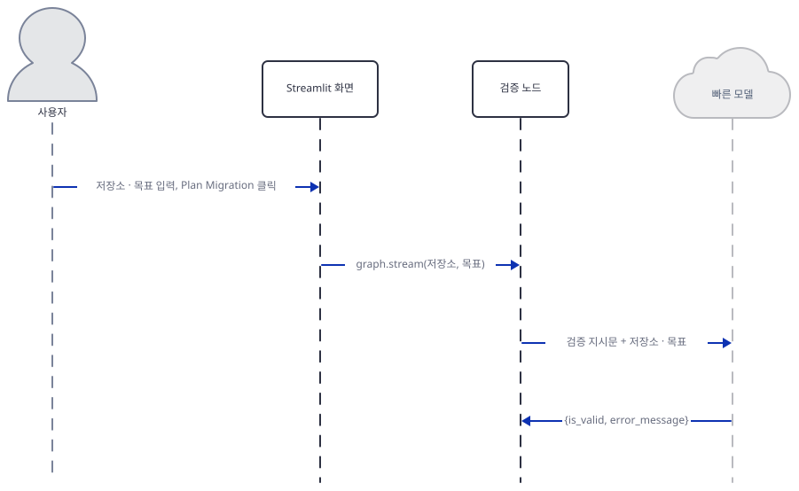

계획 버튼 한 번에 화면이 `graph.stream`으로 검증 노드를 부르고, 검증 노드가 빠른 모델에게 요청이 유효한지 묻습니다.

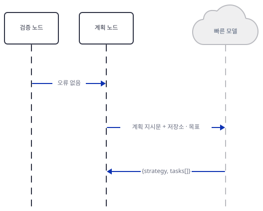

오류가 없으면 계획 노드가 같은 모델에게 저장소와 목표를 주고 전략과 파일 작업 목록을 JSON으로 받습니다.

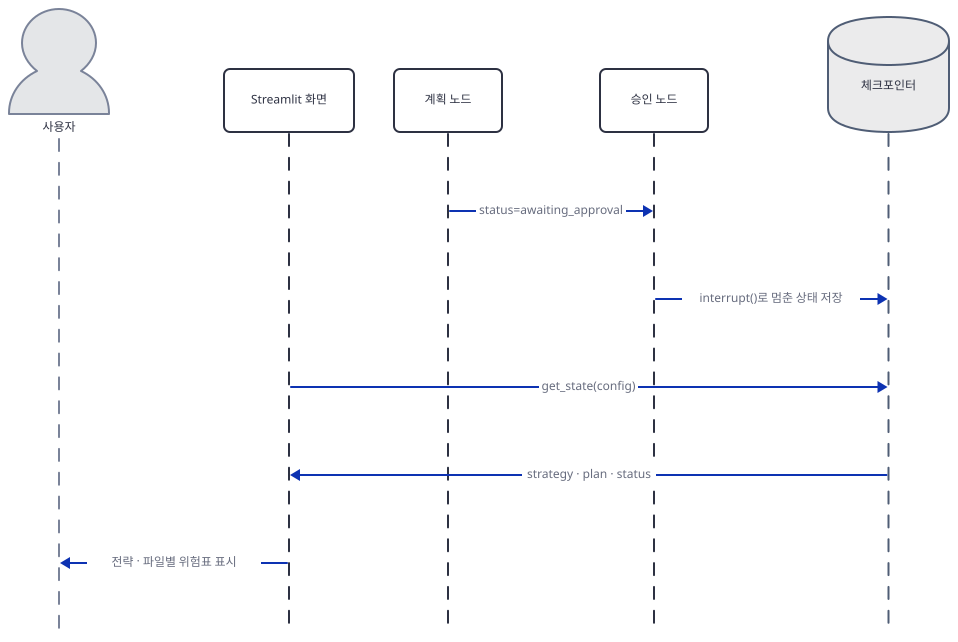

계획 노드가 `awaiting_approval` 상태를 넘기면 승인 노드가 `interrupt()`로 멈추고 상태가 체크포인터에 저장됩니다. 화면은 `get_state`로 전략과 계획을 읽어 위험표를 그립니다.

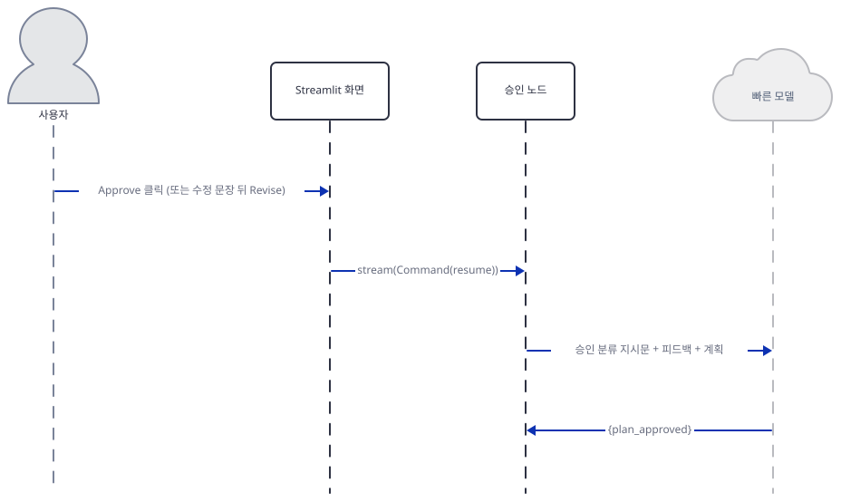

사용자의 승인(또는 수정 문장)이 `resume`으로 들어가 승인 노드가 빠른 모델에게 승인인지 수정 요청인지 분류시킵니다. 수정이면 Step 4의 그림처럼 계획 노드로 돌아갑니다.

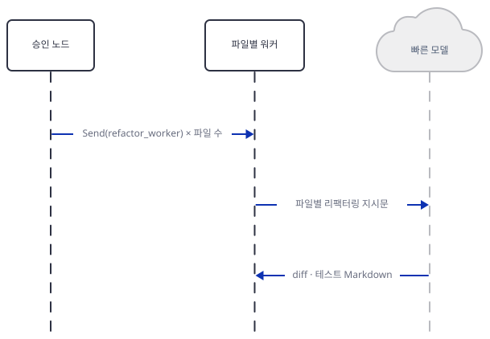

승인이면 `Send`가 파일 수만큼 워커를 뜨게 하고 워커들은 각자 빠른 모델을 한 번씩 부릅니다.

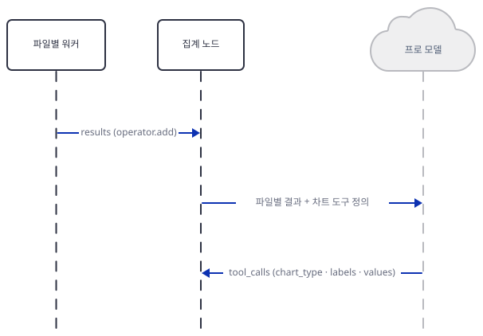

워커들의 결과가 `operator.add`로 합쳐져 집계 노드에 오고, 집계 노드가 프로 모델에게 결과와 차트 도구 정의를 주면 모델이 도구 호출을 돌려줍니다.


집계 노드가 차트 도구를 불러 데이터 URI를 받고, 모델에게는 표식만 돌려준 뒤 보고서 마크다운을 받습니다.

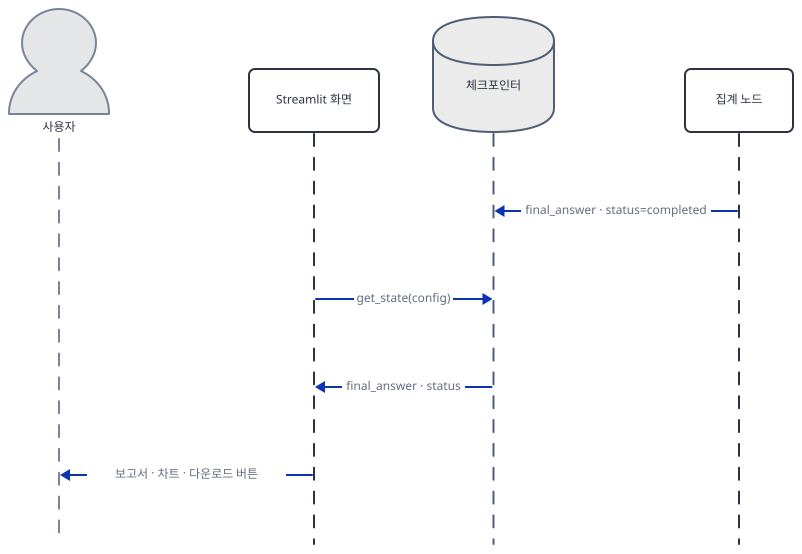

`final_answer`가 체크포인터에 저장되고, 화면은 `get_state`로 읽어 데이터 URI는 `st.image`로 그리며 마크다운 보고서와 다운로드 버튼을 보여 줍니다.

## 실행 체크리스트

- [ ] `uv venv`와 `uv pip install -r requirements.txt`로 앱 폴더에 환경을 만들고 패키지 78개가 깔리는 것을 확인했다
- [ ] `compiled`와 `import OK gpt-5-mini gpt-5.5 300`을 봤다
- [ ] 키 없이 돌리면 검증 노드가 `API key is missing or invalid…`로 그래프를 끝내는 것을 봤다
- [ ] 가짜 서버가 `gpt-5-mini`와 `gpt-5.5` 요청을 받고 `reset_clients()`가 캐시를 비우는 것을 확인했다
- [ ] 계획 노드가 `awaiting_approval`에서 멈추는 것과, 저장소를 읽는 코드가 소스에 없는 것을 확인했다
- [ ] 닫힌 포트에서 검증 노드는 통과하고 계획 노드에서 `Connection error.`가 나는 것을 봤다
- [ ] `interrupt`로 멈춘 그래프에 수정 문장을 보내면 계획 노드를 거쳐 다시 승인 노드에서 멈추는 것을 확인했다
- [ ] 워커 셋이 6초 지연에도 7.4초 안에 끝나 병렬로 도는 것을 확인했다
- [ ] 차트 도구가 데이터만 받고 잘못된 입력을 문자열로 거절하는 것과 테스트 3개 통과를 확인했다
- [ ] 사이드바 키는 Save Settings 뒤에 반영되는 것을 확인했다
- [ ] 스크립트를 다시 실행할 때마다 `MemorySaver`가 새로 만들어지고 승인 버튼이 오류로 끝나는 것을 `AppTest`로 확인했다
- [ ] `st.cache_resource` 복사본에서 같은 장면이 `completed`까지 가는 것을 확인했다

## 문제 해결

| 증상 | 원인 | 해결 |
|---|---|---|
| 계획까지는 뜨는데 Approve나 Revise를 누르면 `Please provide both a target repository URL/path AND a clear migration goal.` 오류 상자가 뜸(직접 확인: `AppTest`로) | 버튼마다 스크립트가 다시 실행되며 `MemorySaver`가 새로 만들어지고, 멈춰 있던 `thread_id`가 없는 그래프에 `resume`이 가서 그래프가 처음부터 시작해 빈 입력을 거절한다(Step 7) | 복사본에서 `get_graph`의 전역을 `st.cache_resource` 안으로 옮긴다(`step7_patch.py`). 실제 브라우저에서는 확인하지 못했다 |
| 사이드바에 키를 넣고 Plan Migration을 눌렀더니 `API key is missing or invalid. Open the sidebar to configure your API keys.` | 사이드바 값은 Save Settings를 눌러야 `os.environ`에 올라간다. 검증 노드는 환경변수만 읽는다(`advanced_ai_agents/multi_agent_apps/ai_codebase_migration_agent/app.py:60`, `advanced_ai_agents/multi_agent_apps/ai_codebase_migration_agent/app.py:694-704`. 직접 확인) | Save Settings를 먼저 누른다. 또는 `.env`나 셸 환경변수에 키를 둔다 |
| 키도 맞고 서버 주소도 맞는데 검증 단계는 지나고 `Failed to generate migration plan: Connection error.`가 뜸(직접 확인: 닫힌 포트로) | 검증 노드는 키 관련 낱말이 없는 예외를 삼키고 통과시킨다(`advanced_ai_agents/multi_agent_apps/ai_codebase_migration_agent/app.py:271-292`). 계획 노드가 처음 오류를 낸다. SDK 재시도로 한 호출에 7~8초가 걸린다 | 주소와 `LLM_BASE_URL`의 `/v1`, 서버 상태를 본다 |
| 같은 이름의 환경변수를 정하지 않았는데 키가 이미 들어 있음 | `load_dotenv()`가 `app.py`가 있는 폴더에서 위쪽으로 `.env`를 찾는다(`advanced_ai_agents/multi_agent_apps/ai_codebase_migration_agent/app.py:39`. 직접 확인: 두 폴더 위의 `.env`를 읽었다) | 위쪽 폴더의 `.env`를 확인한다 |
| 2026-12-11 이후 `gpt-5-mini` 호출이 거부될 것으로 예상됨(종료 뒤의 실제 오류는 볼 수 없어 직접 보지 못함) | `gpt-5-mini`가 가리키는 스냅샷 `gpt-5-mini-2025-08-07`이 OpenAI 폐기 표(https://developers.openai.com/api/docs/deprecations, 2026-10-09에 받은 원문)에 2026-12-11 종료로 올라 있다. 대체는 `gpt-5.6-terra`다 | `MODEL_FAST`를 다른 모델로 정한다(Step 2). 그 모델로 호출해 보지는 못했다 |
| 계획의 파일 경로가 내 저장소에 없는 이름임 | 앱은 저장소를 읽지 않는다. 모델이 저장소 이름과 목표 문장만 보고 지어낸다(Step 3. 소스로 확인) | 결과를 초안으로만 본다. 파일 내용을 프롬프트에 넣는 일은 더 해보기 |
| `No module named pytest` | `pytest`가 requirements에 없다 | `uv pip install pytest`(Step 6) |
| `import app` 대신 빈 모듈이 불러짐(`app has no attribute …`) | 현재 폴더에 `app`이라는 폴더가 있으면 파이썬이 그 폴더를 먼저 불러온다(직접 확인: 작업 폴더에 `app/` 폴더가 있을 때 `AttributeError: module 'app' has no attribute 'get_graph'`) | 확인용 파일을 `app.py`와 같은 폴더에서 실행하고 작업 폴더에 `app`이라는 이름의 폴더를 두지 않는다 |

## 더 해보기

- `st.cache_resource` 복사본(`app_cached.py`)에서 Revise를 눌러 수정 요청이 계획을 바꾸고 다시 멈추는지 `AppTest`로 확인해 보세요. 가짜 서버는 수정 요청에 `src/models/user.py`를 `Critical`로 올린 계획을 돌려주도록 되어 있습니다. 이 문서는 승인 경로만 화면에서 확인했고 수정 경로는 그래프 수준(Step 4)에서만 봤습니다.
- 계획 노드가 실제 파일을 보게 해 보세요. 복사본에서 `MigrationState`에 읽은 파일 내용을 넣고 `advanced_ai_agents/multi_agent_apps/ai_codebase_migration_agent/app.py:344-363`의 `user_content`에 이어 붙이면 `advanced_ai_agents/multi_agent_apps/ai_codebase_migration_agent/app.py:118`의 `code_context`가 처음으로 쓰입니다. 로컬 경로만 읽고 `./src/my_app`을 입력해 보되, 내려받기는 추가하지 않는 편이 안전합니다. 이 문서는 시도하지 못했습니다.
- 워커 수를 바꿔 보세요. `advanced_ai_agents/multi_agent_apps/ai_codebase_migration_agent/app.py:444`의 `[:8]`과 `advanced_ai_agents/multi_agent_apps/ai_codebase_migration_agent/app.py:340`의 `max_length`를 낮추고 Step 5의 시간 측정을 다시 하면 팬아웃이 시간에 얼마나 영향을 주는지 알 수 있습니다. 직접 해 보지는 않았습니다.

## 다음 날 예고

[Day 107 · 🔍 AI Domain Deep Research Agent](../day107-ai-domain-deep-research-agent/README.md) — Together AI의 `Qwen/Qwen3-235B-A22B-fp8-tput` 모델과 Composio의 도구(Tavily 검색, Perplexity 검색, Google Docs 문서 생성)로 주제 하나를 질문 생성·조사·보고서 순서로 파고드는 agno 에이전트 앱을 다룹니다. 오늘은 그래프가 순서를 정했지만 그 앱은 에이전트 셋의 실행 순서를 코드가 직접 이어 줍니다(원본 앱 소스 기준).
