# Day 107 · 🔍 AI Domain Deep Research Agent

> 볼륨 7 🚀 Advanced AI Agents · 난이도 ★★★ ⚠ · 예상 소요 120분(앱은 273줄이지만 Step마다 확인 명령이 있고, 이 앱은 오늘 그대로는 끝까지 돌지 않아 막히는 지점 셋을 하나씩 재현하고 고친 사본으로 한 바퀴를 다시 돌려 보는 시간이 읽는 시간만큼 듭니다) · API 비용 대략 확인하지 못함(Together AI가 이 앱의 모델 `Qwen/Qwen3-235B-A22B-fp8-tput`를 2026-02-06에 serverless에서 내렸다고 공식 문서가 적어 지금은 그 모델로 호출 자체가 되지 않을 것이고, Composio 요금과 키가 없어 실제 토큰 수도 보지 못했습니다. 이 문서의 가짜 서버 실험은 무료) · 원본 앱: `advanced_ai_agents/multi_agent_apps/ai_domain_deep_research_agent`

## 오늘 만들 것

주제와 분야를 적으면 Together AI의 Qwen3 235B 모델이 예/아니오로 답할 수 있는 연구 질문 5개를 만들고, 질문마다 Composio가 연결해 주는 검색 도구(Tavily, Perplexity)로 조사해 답을 받고, 마지막에 그 답들을 McKinsey 스타일 보고서로 엮어 Google Docs 문서까지 만드는 Streamlit 앱입니다. 한 파일(273줄, 마지막 줄까지 편집기와 같은 숫자입니다)에 agno `Agent`가 셋 나오고, 모델과 도구는 둘 다 외부 서비스입니다. 모델은 Together AI의 OpenAI 호환 주소로 가고, 도구는 Composio가 정의를 내려 주고 실행도 대신 해 줍니다. Day 083의 "AI Deep Research Agent"와 이름이 비슷하지만 다른 앱입니다. Day 083은 OpenAI Agents SDK와 Firecrawl을 쓰는, 에이전트 둘(조사·정교화)짜리 앱이고(그 날 README), 오늘은 agno와 Together, Composio입니다.

직접 돌려 보고 알게 된 것이 여섯입니다. 첫째, 이 앱의 모델은 공식 문서상 이미 내려갔습니다(사전 준비). 둘째, `requirements.txt`를 그대로 설치하면 `composio`와 `composio-core`가 같은 파일 12개를 설치해 섞이는 조합에서는 import가 깨질 수 있고, `openai`는 이 파일 어디에도 없는데 우연히 딸려 옵니다(Step 1). 셋째, 두 키를 채워 두면 화면이 다시 그려질 때마다 Composio 서버에 요청 몇 건을 보냅니다(Step 3). 넷째, "Start Research"는 오늘의 agno에서 `TypeError`로 멈추고, 그 탓에 "Compile Final Report" 버튼은 그려지지도 않습니다. `Agent.run()`을 입력 없이 부르기 때문이고, 조사만 고쳐도 보고서 단계에서 같은 오류가 납니다(Step 5·6). 다섯째, 그것을 고쳐도 `tools=[composio_tools]`가 목록 안의 목록이라 모델은 도구를 하나도 받지 못합니다(Step 5). 여섯째, 보고서 단계는 문서가 만들어졌는지 보지 않고 "Google Doc has been created" 문구를 보여 줍니다(Step 6).

키가 없어도 Step 1~7이 모두 됩니다. Together와 Composio의 주소를 내 PC의 가짜 서버로 돌리고 프록시를 막아 두 서비스를 흉내 냈고, 이 문서를 만들며 두 서비스에도 `os-api.agno.com`에도 닿은 요청은 없었습니다(막은 요청 목록은 Step 3·7). 그래서 문서의 질문·답·보고서 문장은 가짜 서버의 고정 응답이고, 가짜 Composio 응답의 모양은 SDK가 읽는 필드에 맞춘 것이라 실제 서비스가 같은 모양으로 답하는지는 확인하지 못했습니다. 아래는 완성된 아키텍처입니다.

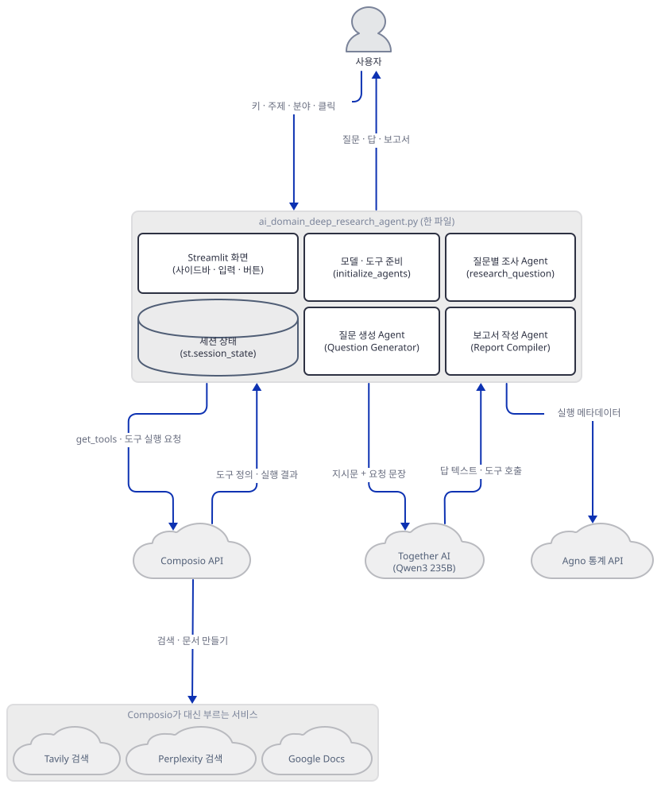

## 사전 준비

| 서비스/도구 | 용도 | 발급·설치 |
|---|---|---|
| uv | 가상환경 생성과 패키지 설치 | [공통 사전 준비](../README.md#공통-사전-준비-한-번만) 절 참고 |
| Python | 이 저장소의 기준은 3.11~3.13이다. 이 문서는 3.13.3으로 확인했다 | 공통 사전 준비와 같음 |
| Together AI API 키 | 모델 호출 인증. 화면 사이드바의 비밀번호 칸이나 `TOGETHER_API_KEY`(`advanced_ai_agents/multi_agent_apps/ai_domain_deep_research_agent/ai_domain_deep_research_agent.py:25-30`). ⚠ 앱이 쓰는 `Qwen/Qwen3-235B-A22B-fp8-tput`는 Together 공식 문서(https://docs.together.ai/docs/deprecations)의 "Inference deprecation history" 표에 2026-02-06 serverless 제거로 올라 있고("The table below lists all models removed from serverless inference"), "Supported by on-demand dedicated endpoints" 칸이 No라 전용 엔드포인트로도 쓸 수 없다("Models marked "No" are not available as on-demand endpoints", 2026-10-09 원문 확인. 표에 대체 모델 칸은 없다). 현재 serverless 목록에는 이 모델이 없고 다른 Qwen 모델(예: `Qwen/Qwen3.6-Plus`)이 있다. 실제로 쓰려면 68행의 모델 ID를 목록의 모델로 바꿔야 하고, 그러면 질문 속 `</think>` 처리가 맞는지도 다시 봐야 한다(Step 4) | https://api.together.ai (앱 안내는 https://together.ai) |
| Composio API 키 | 도구 정의를 받고 실행을 맡긴다(`advanced_ai_agents/multi_agent_apps/ai_domain_deep_research_agent/ai_domain_deep_research_agent.py:32-37`) | https://composio.ai (앱의 안내) |
| Composio 연결 계정 | Google Docs와 Perplexity는 계정 연결이 필요하다. 앱 README는 `composio add googledocs`와 `composio add perplexityai`를 시킨다. Tavily 검색(`COMPOSIO_SEARCH`)은 연결 목록에 없어도 통과했다(가짜 서버에서 `no_auth`로 둔 것이라 실제 서비스가 같은지는 확인하지 못했다) | `composio` 명령은 `composio-core` 패키지가 설치한다(Step 1). 실행해 보지 못했다 |
| 인터넷 연결 | PyPI 설치. 앱을 실제로 쓸 때는 Together AI, Composio API(그 뒤의 Tavily·Perplexity·Google Docs), agno 사용 통계 서버(`os-api.agno.com`)에 접속한다. `composio_agno`를 import만 해도 `backend.composio.dev`와 `pypi.org`에 접속하려 한다(Step 3). 브라우저가 화면을 열 때 Streamlit의 사용 통계도 나간다(Day 054가 소스로 확인했고, `--browser.gatherUsageStats false`로 끈다) | 별도 설치 없음 |

이 문서의 확인 명령은 `composio`가 홈에 만드는 캐시를 임시 폴더로 돌리려고 `COMPOSIO_CACHE_DIR`를 씁니다(Step 3). 셸에 먼저 한 번 걸어 두세요.

```bash
export COMPOSIO_CACHE_DIR="$(mktemp -d)"
```

```powershell
$env:COMPOSIO_CACHE_DIR = Join-Path $env:TEMP "composio-cache"
```

PowerShell 줄은 실행해 보지 못했습니다.

## 아키텍처 한눈에 보기

| 컴포넌트 | 역할 | 코드 위치 |
|---|---|---|
| 사용자 | 브라우저에서 키 둘, 주제, 분야를 적고 버튼 셋을 차례로 누른다 | 코드 없음 (브라우저) |
| Streamlit 화면 | 사이드바 키 칸 둘, 본문 입력 둘, 버튼 셋, 결과 표시, 키가 없을 때의 안내 | `advanced_ai_agents/multi_agent_apps/ai_domain_deep_research_agent/ai_domain_deep_research_agent.py:14-50`, `advanced_ai_agents/multi_agent_apps/ai_domain_deep_research_agent/ai_domain_deep_research_agent.py:164-273` |
| 세션 상태 (`st.session_state`) | 질문 목록, 답 목록, 보고서 본문, 완료 표시를 화면이 다시 그려져도 들고 있다 | `advanced_ai_agents/multi_agent_apps/ai_domain_deep_research_agent/ai_domain_deep_research_agent.py:52-60` |
| 모델·도구 준비 (`initialize_agents`) | `Together` 모델 객체와 Composio 도구 목록을 만든다 | `advanced_ai_agents/multi_agent_apps/ai_domain_deep_research_agent/ai_domain_deep_research_agent.py:65-78` |
| 질문 생성 Agent | 지시문만 있고 도구가 없는 `Agent`. 질문 5개를 번호 목록으로 달라고 한다 | `advanced_ai_agents/multi_agent_apps/ai_domain_deep_research_agent/ai_domain_deep_research_agent.py:80-115` |
| 질문별 조사 Agent | 지시문 한 덩어리와 도구 목록을 쥔 `Agent`. 질문마다 새로 만든다 | `advanced_ai_agents/multi_agent_apps/ai_domain_deep_research_agent/ai_domain_deep_research_agent.py:117-126` |
| 보고서 작성 Agent | 질문·답을 HTML 조각으로 엮어 지시문에 넣고 Google Docs 도구를 쓰라고 한다 | `advanced_ai_agents/multi_agent_apps/ai_domain_deep_research_agent/ai_domain_deep_research_agent.py:128-162` |
| Together AI | 세 Agent의 답을 만든다. agno의 `Together`는 OpenAI 호환 클라이언트로 `https://api.together.xyz/v1`에 간다 | `advanced_ai_agents/multi_agent_apps/ai_domain_deep_research_agent/ai_domain_deep_research_agent.py:68-68` |
| Composio API | 도구 정의를 내려 주고(`get_tools`) 도구 실행을 대신한다. 그 뒤에서 Tavily·Perplexity·Google Docs를 부른다 | `advanced_ai_agents/multi_agent_apps/ai_domain_deep_research_agent/ai_domain_deep_research_agent.py:71-76` |
| Agno 통계 API | 성공한 `run`마다 agno가 익명 메타데이터를 보내려 한다 | 코드 없음 (agno 내부) |

한 파일 안의 부품은 한 묶음으로 두고 묶음에서 나가는 화살표만 그렸습니다. 안쪽 호출은 다섯 장의 보조 그림에 있습니다. 첫째는 키로 모델과 도구를 만드는 준비 단계입니다.

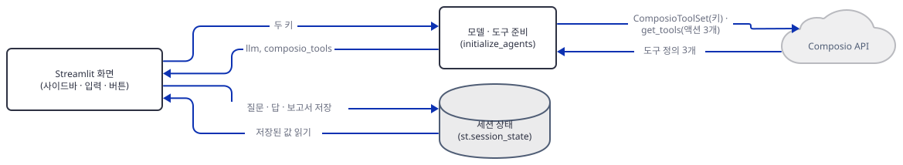

둘째는 세션 상태에 값을 쓰는 곳입니다. 질문 목록은 질문 생성 쪽(`advanced_ai_agents/multi_agent_apps/ai_domain_deep_research_agent/ai_domain_deep_research_agent.py:114-114`)이, 보고서 본문과 완료 표시는 보고서 작성 쪽(`advanced_ai_agents/multi_agent_apps/ai_domain_deep_research_agent/ai_domain_deep_research_agent.py:160-161`)이, 답 목록은 화면(`advanced_ai_agents/multi_agent_apps/ai_domain_deep_research_agent/ai_domain_deep_research_agent.py:217-217`)이 쓰고, 화면은 맨 위(`advanced_ai_agents/multi_agent_apps/ai_domain_deep_research_agent/ai_domain_deep_research_agent.py:52-60`)에서 네 값의 초기값도 씁니다.

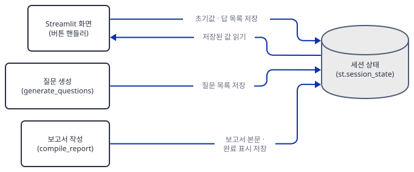

셋째는 화면의 버튼 핸들러가 Agent를 부르고 결과를 받는 호출이며, 실행이 끝날 때마다 agno 통계 서버로 가는 선이 함께 있습니다.

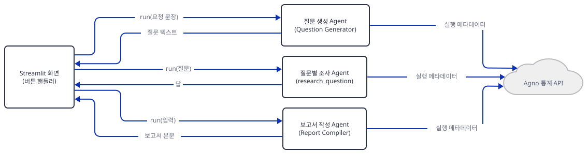

넷째는 세 Agent가 Together AI와 주고받는 것입니다. 도구 호출이 끼는 쪽은 조사와 보고서 Agent입니다.

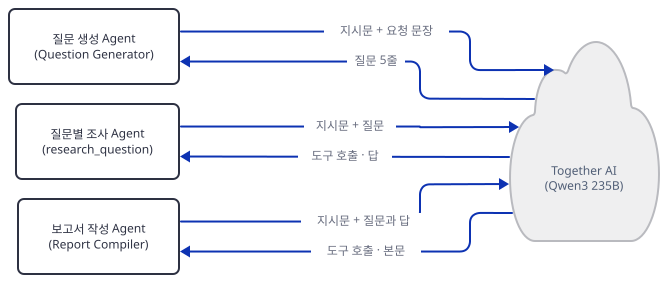

다섯째는 도구 호출이 Composio를 거쳐 세 서비스로 가는 길입니다.

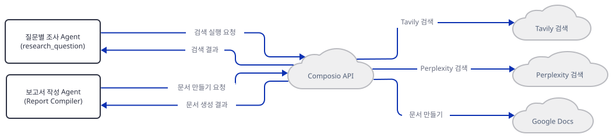

## 단계별 진행

### Step 1. 환경 만들기 — `requirements.txt`에는 `openai`가 없고, `composio`가 파일을 덮어쓸 수 있습니다

**목적.** 앱 폴더에 독립 가상환경을 만들고 의존성을 설치한 뒤, 오늘 풀리는 버전에서 앱이 import되는지 확인합니다.

**할 일.** 저장소 루트에서 시작합니다.

```bash
cd advanced_ai_agents/multi_agent_apps/ai_domain_deep_research_agent
uv venv
uv pip install -r requirements.txt
```

(pip 대안: bash는 `python -m venv .venv && source .venv/bin/activate && pip install -r requirements.txt`입니다. PowerShell 5.1은 `&&`를 받지 않으므로 세 줄로 `python -m venv .venv`, `.venv\Scripts\Activate.ps1`, `pip install -r requirements.txt`를 차례로 씁니다. 실행해 보지 못했습니다.) 이후 `uv run`에는 모두 `--no-project`를 붙입니다. 이유는 [공통 사전 준비](../README.md#공통-사전-준비-한-번만)에 있습니다.

`advanced_ai_agents/multi_agent_apps/ai_domain_deep_research_agent/requirements.txt:1-5`

```text
composio
agno>=2.2.10
streamlit
composio-agno
together
```

다섯 줄 가운데 버전을 못 박은 것은 `agno`의 하한뿐입니다. 오늘(2026-10-09) Python 3.13.3에서 패키지 106개가 깔렸고 agno 3.1.2, composio 0.22.0, composio-agno 0.7.20, composio-core 0.7.21, openai 3.26.1, together 2.36.0, streamlit 1.65.0이 풀렸습니다(직접 확인). 눈여겨볼 것이 셋입니다.

하나, `composio`(0.22.0)와 `composio-core`(0.7.21)가 둘 다 설치됩니다. `composio-agno` 0.7.20이 `composio_core>=0.7.0,<0.8.0`을 요구해서 옛 SDK가 따라오는데, 두 배포판이 같은 `composio/` 폴더에 같은 경로의 파일 12개(`__init__.py`, `__version__.py`, `client/__init__.py`, `core/__init__.py`, `exceptions.py`, `py.typed`, `utils/` 여섯 개)를 각자 설치합니다(두 `RECORD`의 교집합, `comm -12`로 확인). 어느 쪽 파일이 남느냐에 따라 섞이고, 섞이는 조합에 따라 오류 문구도 다릅니다. 같은 요구 파일로 새 가상환경을 일곱 번 만들었을 때 여섯 번은 import가 되고 처음(캐시가 비어 있던) 한 번이 아래처럼 깨졌습니다. 다른 환경에서 새로 만든 다섯 번은 모두 정상이었으니 결과는 설치마다, 환경마다 달랐습니다.

```
ImportError: cannot import name 'Composio' from 'composio.client'
```

`client/__init__.py`만 새 쪽이 남으면 `ImportError: cannot import name 'ComposioError' from 'composio.exceptions'`가 납니다(파일을 섞어 흉내 내어 확인했습니다). 고치는 법은 옛 SDK를 다시 설치하는 것이고, 깨진 환경에서 이 한 줄로 import가 살아나는 것을 확인했습니다.

```bash
uv pip install --reinstall composio-core
```

둘, 앱이 쓰는 것은 `composio_agno`가 끌어오는 옛 SDK(0.7.x)이고 새 `composio` 0.22.0은 필요 없습니다. 그런데 이 패키지를 요구 파일에서 빼면 오히려 깨집니다. agno의 `Together`는 `openai` 클라이언트 위에 얹히는데(`agno.models.together`가 `OpenAILike`를 상속하는 것을 소스로 확인했습니다) `openai`는 요구 파일 어디에도 없고, 새 `composio`가 `openai>=2.48.0`을 요구해서 우연히 따라오던 것이었습니다. `composio`를 뺀 환경에서 `Together`를 import하면 이렇게 멈춥니다(직접 확인).

```
ImportError: `openai` not installed. Please install using `pip install openai`
```

그래서 충돌 없는 대안은 필요한 것만 직접 적는 것입니다. 이 문서는 이 설치로 앱 파일 import까지 확인했습니다. 단, 아래 Step들은 요구 파일 그대로 만든 환경에서 확인했습니다.

```bash
uv pip install agno streamlit composio-agno openai
```

셋, `together` 패키지는 앱도 agno도 import하지 않습니다(agno 소스에서 `import together`가 없는 것을 확인했습니다). 설치만 되고 쓰이지 않습니다.

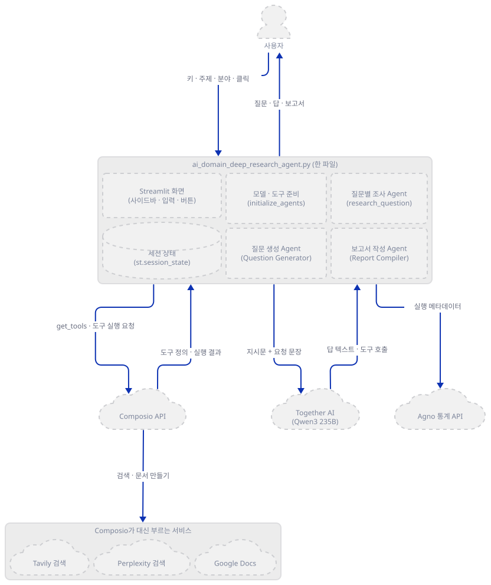

**확인.** 앱 폴더에서 실행합니다.

```bash
uv run --no-project python -m py_compile ai_domain_deep_research_agent.py && echo compiled
uv run --no-project python -c "from composio_agno import ComposioToolSet, Action; from agno.models.together import Together; print('import ok')"
```

직접 확인한 출력(맨 위에 `composio`의 INFO 줄이 섞일 수 있습니다):

```
compiled
import ok
```

`import ok` 대신 앞의 `ImportError`가 나오면 위 `--reinstall` 한 줄을 돌립니다. 두 번째 줄을 처음 돌릴 때는 시간이 걸립니다. `composio`가 import 때 네트워크에 접속하려 하기 때문입니다(Step 3).

### Step 2. 화면과 키 — 키가 둘 다 있어야 앱 본체가 그려집니다

**목적.** 키 입력과 세션 상태, 키가 없을 때의 첫 화면을 확인합니다.

**할 일.** 먼저 맨 위의 `.env` 읽기와 사이드바입니다.

`advanced_ai_agents/multi_agent_apps/ai_domain_deep_research_agent/ai_domain_deep_research_agent.py:10-11`

```python
# Load environment variables
load_dotenv()
```

`advanced_ai_agents/multi_agent_apps/ai_domain_deep_research_agent/ai_domain_deep_research_agent.py:24-37`

```python
# API key inputs
together_api_key = st.sidebar.text_input(
    "Together AI API Key", 
    value=os.getenv("TOGETHER_API_KEY", ""),
    type="password",
    help="Get your API key from https://together.ai"
)

composio_api_key = st.sidebar.text_input(
    "Composio API Key", 
    value=os.getenv("COMPOSIO_API_KEY", ""),
    type="password",
    help="Get your API key from https://composio.ai"
)
```

`load_dotenv()`는 인자 없이 불러서 `.env`를 찾는 규칙을 python-dotenv에 맡깁니다. 이 문서의 스크래치 폴더 위쪽에는 `.env`가 없음을 확인하고 돌렸습니다. 키 칸의 기본값이 환경변수라서 `TOGETHER_API_KEY`와 `COMPOSIO_API_KEY`가 셸에 있으면 첫 화면부터 두 칸이 채워지고, 그러면 아래 Step 3의 도구 준비가 페이지를 여는 순간 실행됩니다. 이어서 세션 상태와 갈림길입니다.

`advanced_ai_agents/multi_agent_apps/ai_domain_deep_research_agent/ai_domain_deep_research_agent.py:52-60`

```python
# Initialize session state
if 'questions' not in st.session_state:
    st.session_state.questions = []
if 'question_answers' not in st.session_state:
    st.session_state.question_answers = []
if 'report_content' not in st.session_state:
    st.session_state.report_content = ""
if 'research_complete' not in st.session_state:
    st.session_state.research_complete = False
```

`advanced_ai_agents/multi_agent_apps/ai_domain_deep_research_agent/ai_domain_deep_research_agent.py:164-167`

```python
# Main application flow
if together_api_key and composio_api_key:
    # Initialize agents
    llm, composio_tools = initialize_agents(together_api_key, composio_api_key)
```

`advanced_ai_agents/multi_agent_apps/ai_domain_deep_research_agent/ai_domain_deep_research_agent.py:255-257`

```python
else:
    # API keys not provided
    st.warning("⚠️ Please enter your Together AI and Composio API keys in the sidebar to get started.")
```

두 키가 모두 있으면 본체 전체를 그리고, 하나라도 없으면 경고와 안내 문구 셋만 보입니다. 갈림길이 맨 위에서 한 번 나뉘는 것이라 질문·조사·보고서 버튼은 모두 `if` 안쪽에 있습니다.

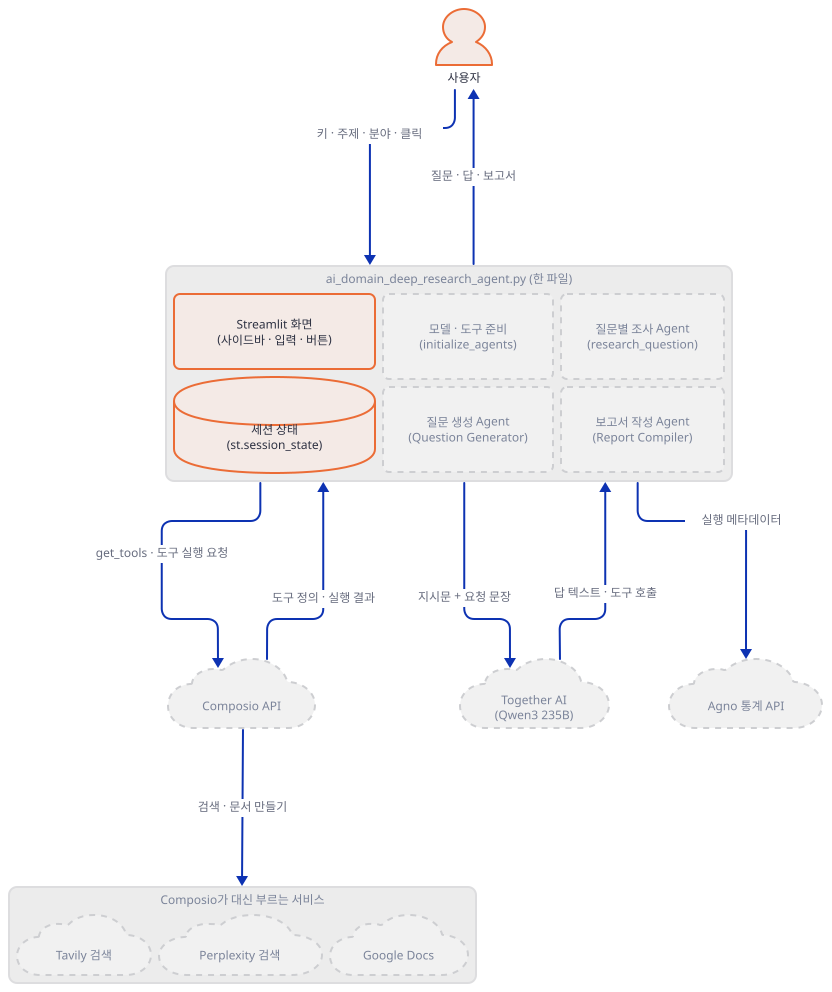

앱을 직접 띄우는 명령은 Step 7에 있습니다(원본은 `streamlit run ai_domain_deep_research_agent.py`에 같은 옵션). 이 단계에서는 브라우저 없이 화면 구성만 봅니다.

**확인.** 키 없이 화면을 `AppTest`로 한 번 그려 봅니다. 첫 실행은 import 때문에 느려서 시간 제한을 늘립니다. `TOGETHER_API_KEY`·`COMPOSIO_API_KEY` 환경변수가 없는 셸에서 돌립니다.

```bash
uv run --no-project python -c "
from streamlit.testing.v1 import AppTest
at = AppTest.from_file('ai_domain_deep_research_agent.py', default_timeout=60)
at.run()
print([t.label for t in at.sidebar.text_input])
print([w.value for w in at.warning])
print(len(at.exception))
"
```

직접 확인한 출력(앞에 `ScriptRunContext` 경고 줄이 섞일 수 있습니다. `warning` 값에 앱 소스의 ⚠️ 이모지는 보이지 않았습니다):

```
['Together AI API Key', 'Composio API Key']
['Please enter your Together AI and Composio API keys in the sidebar to get started.']
0
```

### Step 3. 모델과 도구 준비 — 화면이 다시 그려질 때마다 Composio를 부릅니다

**목적.** `initialize_agents`가 무엇을 만들고, 그 가운데 어디서 네트워크가 나가는지 봅니다.

**할 일.**

`advanced_ai_agents/multi_agent_apps/ai_domain_deep_research_agent/ai_domain_deep_research_agent.py:65-78`

```python
# Function to initialize the LLM and tools
def initialize_agents(together_key, composio_key):
    # Initialize Together AI LLM
    llm = Together(id="Qwen/Qwen3-235B-A22B-fp8-tput", api_key=together_key)
    
    # Set up Composio tools
    toolset = ComposioToolSet(api_key=composio_key)
    composio_tools = toolset.get_tools(actions=[
        Action.COMPOSIO_SEARCH_TAVILY_SEARCH, 
        Action.PERPLEXITYAI_PERPLEXITY_AI_SEARCH, 
        Action.GOOGLEDOCS_CREATE_DOCUMENT_MARKDOWN
    ])
    
    return llm, composio_tools
```

`Together(id=..., api_key=...)`는 객체를 만들 뿐 네트워크를 쓰지 않습니다. 아래 확인에서 기본 주소가 `https://api.together.xyz/v1`인 것을 봅니다. 문제는 모델 ID입니다. 사전 준비에서 말했듯 이 모델은 공식 문서상 내려갔으므로 키가 있어도 첫 호출(Step 4)에서 막힐 것입니다. 그 오류 문구는 키가 없어 보지 못했습니다.

도구 쪽은 두 줄이고 둘 다 서버를 부릅니다. 소스로 확인한 사슬은 이렇습니다. `ComposioToolSet(api_key=...)`는 만들어질 때 `client`를 열면서 키를 확인하고, 로컬 캐시가 비어 있으면 앱·액션·트리거 목록 전체를 내려받아 캐시에 씁니다. `get_tools(actions=[...])`는 액션 이름에서 앱 이름을 뽑아 서버에 스키마를 묻고, 앱마다 연결 계정이 있는지 서버에 또 묻습니다. 연결이 없으면 예외가 납니다. `Composio` SDK 코드(0.7.21)에서 `COMPOSIO_BASE_URL` 환경변수가 서버 주소를 바꾸므로, 가짜 서버를 이 주소로 돌려 요청을 기록했습니다. 처음 만들 때 서버에 간 요청은 이렇습니다(직접 확인, 가짜 서버가 기록한 경로와 쿼리).

```
GET /api/v1/client/auth/client_info
GET /api/v1/apps
GET /api/v2/actions
GET /api/v1/triggers
GET /api/v1/connectedAccounts   pageSize=99999999&user_uuid=default&showActiveOnly=true
GET /api/v2/actions             apps=GOOGLEDOCS,COMPOSIO_SEARCH,PERPLEXITYAI
GET /api/v1/connectedAccounts   pageSize=99999999
```

앞의 넷은 디스크 캐시를 채우는 요청입니다. 캐시가 비었거나 오래됐을 때만 나가서, 같은 캐시로 새 프로세스를 돌리면 `client_info`만 나가고 앱·액션·트리거 목록은 나가지 않았습니다. 다섯째(`showActiveOnly=true`)는 생성자의 연결 계정 확인이고, 뒤의 둘이 `get_tools`가 부른 스키마 요청과 연결 확인입니다. 여섯째 줄 `apps=`의 앱 순서는 실행마다 바뀌었습니다. 그런데 `initialize_agents`는 두 키가 있을 때 화면이 다시 그려질 때마다 불립니다(`advanced_ai_agents/multi_agent_apps/ai_domain_deep_research_agent/ai_domain_deep_research_agent.py:165-167`). 가짜 서버에서 버튼을 누르거나 칸을 채워 화면을 다시 그릴 때마다 생성자의 연결 확인과 뒤의 둘, 모두 셋이 다시 나갔습니다(직접 확인). 실제 서비스의 요청 수와 응답 시간은 확인하지 못했습니다.

import만으로 나가는 요청도 있습니다. `composio` 0.7.x는 import할 때 `https://backend.composio.dev/api/v1/cli/sentry-dns`에 접속하려 하고(`user_data.json`에 DSN이 저장되기 전까지는 `{}`가 이미 있어도 프로세스가 끝날 때마다 다시 시도합니다. `COMPOSIO_DISABLE_SENTRY=true`를 걸어도 같았습니다), 버전 확인으로 `pypi.org`에도 접속하려 합니다(소스로 확인하고, 프록시 자리에 세운 기록용 서버에서 두 호스트로의 접속 시도를 직접 확인했습니다. 막혀서 응답은 받지 못했습니다). 홈에는 `~/.composio/`가 생깁니다. 이 문서의 스크래치 홈에서는 import만 하면 `user_data.json`(내용 `{}`) 하나가, 가짜 서버로 `ComposioToolSet`을 만들면 앱·액션·태그·트리거 캐시 파일 86개가 생겼습니다(실제 카탈로그는 훨씬 클 텐데 크기는 보지 못했습니다). 그래서 `COMPOSIO_CACHE_DIR`로 위치를 돌립니다.

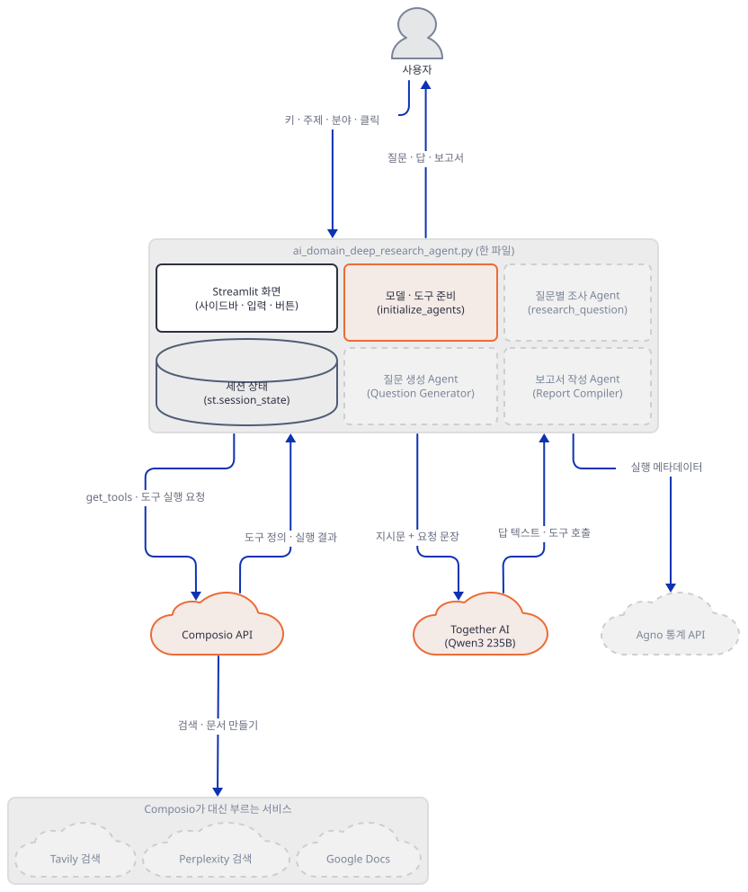

**확인.** 앞에서 걸어 둔 `COMPOSIO_CACHE_DIR`가 있는 셸에서, 네트워크 없이 되는 확인입니다.

```bash
uv run --no-project python -c "
from agno.models.together import Together
m = Together(id='Qwen/Qwen3-235B-A22B-fp8-tput', api_key='tg-test')
print(m.base_url)
from composio_agno import Action
print(Action.COMPOSIO_SEARCH_TAVILY_SEARCH, Action.PERPLEXITYAI_PERPLEXITY_AI_SEARCH, Action.GOOGLEDOCS_CREATE_DOCUMENT_MARKDOWN)
"
```

직접 확인한 출력(`COMPOSIO_CACHE_DIR`를 스크래치로 돌린 환경):

```
https://api.together.xyz/v1
COMPOSIO_SEARCH_TAVILY_SEARCH PERPLEXITYAI_PERPLEXITY_AI_SEARCH GOOGLEDOCS_CREATE_DOCUMENT_MARKDOWN
```

Google Docs 계정을 연결하지 않은 채 화면에서 키를 채우면 페이지 전체가 예외로 바뀌는 것도 확인했습니다. 가짜 서버의 연결 목록에서 `googledocs`를 뺀 상태입니다(직접 확인).

```
ConnectedAccountNotFoundError: No connected account found for app `GOOGLEDOCS`; Run `composio add googledocs` to fix this
```

### Step 4. 질문 만들기 — `</think>` 뒤만 쓰고, 질문 수는 세지 않습니다

**목적.** 질문 생성 Agent의 구성과 응답 정리를 읽고, 가짜 모델로 한 번 돌려 봅니다.

**할 일.**

`advanced_ai_agents/multi_agent_apps/ai_domain_deep_research_agent/ai_domain_deep_research_agent.py:81-93`

```python
def create_agents(llm, composio_tools):
    # Create the question generator agent
    question_generator = Agent(
        name="Question Generator",
        model=llm,
        instructions="""
        You are an expert at breaking down research topics into specific questions.
        Generate exactly 5 specific yes/no research questions about the given topic in the specified domain.
        Respond ONLY with the text of the 5 questions formatted as a numbered list, and NOTHING ELSE.
        """
    )
    
    return question_generator
```

`advanced_ai_agents/multi_agent_apps/ai_domain_deep_research_agent/ai_domain_deep_research_agent.py:95-115`

```python
# Function to extract questions after think tag
def extract_questions_after_think(text):
    if "</think>" in text:
        return text.split("</think>", 1)[1].strip()
    return text.strip()

# Function to generate research questions
def generate_questions(llm, composio_tools, topic, domain):
    question_generator = create_agents(llm, composio_tools)
    
    with st.spinner("🤖 Generating research questions..."):
        questions_task: RunOutput = question_generator.run(
            f"Generate exactly 5 specific yes/no research questions about the topic '{topic}' in the domain '{domain}'."
        )
        questions_text = questions_task.content
        questions_only = extract_questions_after_think(questions_text)
        
        # Extract questions into a list
        questions_list = [q.strip() for q in questions_only.split('\n') if q.strip()]
        st.session_state.questions = questions_list
        return questions_list
```

Agent는 `instructions`(시스템 메시지)에 "정확히 5개의 예/아니오 질문을 번호 목록으로만 답하라"를 담고 있고, 실제 요청 문장(106~108행)이 같은 말을 한 번 더 합니다. `create_agents`가 `composio_tools`를 받지만 쓰지 않는 것에서 보듯 질문 생성에는 도구가 없습니다. 응답은 두 단계로 가공됩니다. `</think>`가 있으면 그 뒤만 남기고(Qwen3 계열이 추론을 `<think>...</think>`로 내놓기 때문), 줄 단위로 나눠 빈 줄을 버립니다. 5개인지, 번호가 붙었는지, 질문이 아닌 머리말 한 줄이 끼지 않았는지는 보지 않습니다. 모델이 "Here are the questions:" 같은 줄을 먼저 쓰면 그 줄도 질문 한 개로 세어 아래 단계에 그대로 넘어갑니다(소스로 확인). 추론 블록이 없는 모델로 바꾸면 `else` 쪽으로 가서 같은 일을 합니다. 이 함수는 순수 함수라 서비스 없이 확인됩니다.

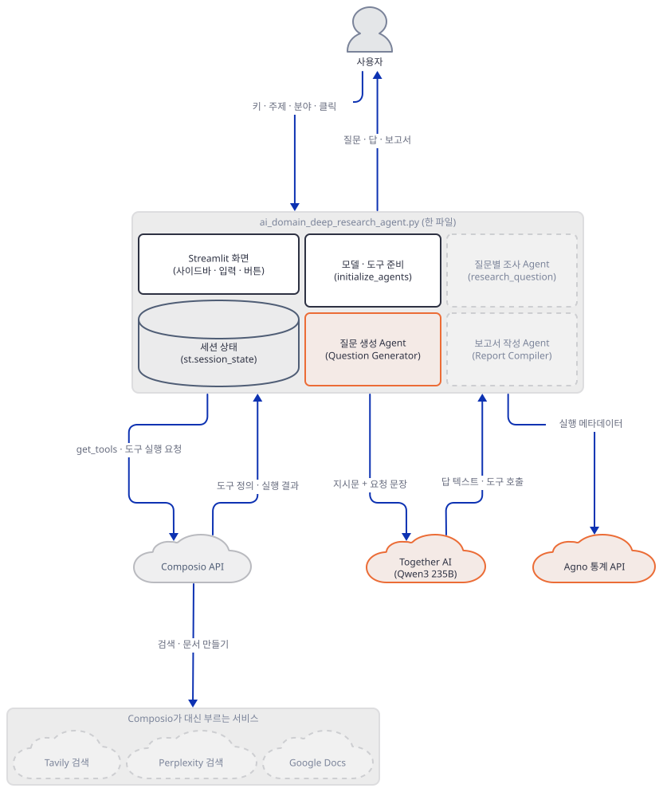

**확인.**

```bash
uv run --no-project python -c "
import ai_domain_deep_research_agent as m
print(repr(m.extract_questions_after_think('<think>x</think>\n\n1. A?\n2. B?')))
print(repr(m.extract_questions_after_think('1. A?')))
" 2>/dev/null
```

`2>/dev/null`은 Streamlit이 `streamlit run`을 쓰라고 안내하는 경고 여러 줄(표준 오류)을 버립니다. PowerShell에서는 `2>$null`이고 실행해 보지 못했습니다. 직접 확인한 출력:

```
'1. A?\n2. B?'
'1. A?'
```

가짜 Together 서버(OpenAI 호환 `chat/completions`)를 이 앱의 `Together`에 물려 화면 전체를 `AppTest`로 돌리면, 두 키와 주제·분야를 채우고 "Generate Research Questions"를 눌렀을 때 서버가 받은 메시지는 시스템 하나, 사용자 하나였고 `tools`는 비어 있었습니다. 서버가 `<think>` 블록과 질문 다섯 줄을 돌려주자 `st.session_state.questions`에 다섯 줄이 `['1. Is FAKE-Q1 true?', ...]` 꼴로 들어갔습니다(직접 확인). 앱이 모델 주소를 바꾸는 장치는 없어서, 이 실험은 `agno.models.together.Together`를 기본 주소만 다른 하위 클래스로 바꿔 끼우고 돌렸습니다.

### Step 5. 질문별 조사 — `run()`에는 입력이 없고, 도구는 목록 안의 목록입니다

**목적.** 조사 단계가 오늘의 agno에서 왜 멈추는지, 고쳐도 왜 도구가 쓰이지 않는지를 가려 냅니다.

**할 일.**

`advanced_ai_agents/multi_agent_apps/ai_domain_deep_research_agent/ai_domain_deep_research_agent.py:117-126`

```python
# Function to research a specific question
def research_question(llm, composio_tools, topic, domain, question):
    research_task = Agent(
        model=llm,
        tools=[composio_tools],
        instructions=f"You are a sophisticated research assistant. Answer the following research question about the topic '{topic}' in the domain '{domain}':\n\n{question}\n\nUse the PERPLEXITYAI_PERPLEXITY_AI_SEARCH and COMPOSIO_SEARCH_TAVILY_SEARCH tools to provide a concise, well-sourced answer."
    )
    
    research_result: RunOutput = research_task.run()
    return research_result.content
```

`advanced_ai_agents/multi_agent_apps/ai_domain_deep_research_agent/ai_domain_deep_research_agent.py:189-217`

```python
    # Research section - only show if we have questions
    if st.session_state.questions and st.button("Start Research", key="start_research"):
        st.header("Research Results")
        
        # Reset answers
        question_answers = []
        
        # Research each question
        progress_bar = st.progress(0)
        
        for i, question in enumerate(st.session_state.questions):
            # Update progress
            progress_bar.progress((i) / len(st.session_state.questions))
            
            # Research the question
            with st.spinner(f"🔍 Researching question {i+1}..."):
                answer = research_question(llm, composio_tools, topic, domain, question)
                question_answers.append({"question": question, "answer": answer})
            
            # Display the answer
            st.subheader(f"Question {i+1}:")
            st.markdown(f"**{question}**")
            st.markdown(answer)
            
            # Update progress again
            progress_bar.progress((i + 1) / len(st.session_state.questions))
        
        # Store the answers
        st.session_state.question_answers = question_answers
```

조사 지시문은 `PERPLEXITYAI_PERPLEXITY_AI_SEARCH`와 `COMPOSIO_SEARCH_TAVILY_SEARCH`를 쓰라고 합니다. 그런데 도구 이름은 지시문 안에만 있고, 질문 문장은 `run()`에 넘기지 않고 지시문 속에 박혀 있습니다. 두 가지가 문제입니다.

하나, `research_task.run()`은 인자가 없습니다. agno의 `Agent.run`은 `input`이 필수 인자입니다. 이 앱이 허용하는 가장 낮은 버전(2.2.10)과 오늘의 3.1.2 둘 다 `inspect.signature`로 확인했습니다. 그래서 "Start Research"를 누르는 순간 이렇게 끝납니다(가짜 서버를 물린 `AppTest`에서 직접 확인, `exception` 한 건).

```
TypeError: Agent.run() missing 1 required positional argument: 'input'
```

둘, `tools=[composio_tools]`입니다. `get_tools`는 이미 `Toolkit` 세 개의 목록을 돌려주는데(직접 확인, 액션당 하나) 한 번 더 목록으로 감쌌습니다. agno의 `Agent`는 목록의 원소가 딕셔너리, `Toolkit`, `Function`, 호출 가능한 객체일 때만 도구로 받고 목록은 어느 것에도 해당하지 않아 경고 없이 건너뜁니다(소스로 확인, agno 3.1.2의 `agno/agent/_tools.py`). 이것은 모델이 도구를 받았는지를 서버가 받은 요청의 `tools` 필드로 보면 바로 보입니다. 아래 스크립트는 가짜 OpenAI 호환 서버를 직접 띄우고(포트는 운영체제가 고르게 `0`을 줍니다) 평평한 목록과 이중 목록을 비교합니다. `Agent`가 성공한 실행마다 agno 통계 서버에 접속하려 하니 `AGNO_TELEMETRY=false`를 걸어 두면 조용합니다. 이 환경변수의 효과는 Day 047 Step 5가 소스로 확인했고, 이 문서의 `probe.py`로도 확인했습니다(아래). `probe.py`로 저장합니다.

```python
import json, threading
from http.server import BaseHTTPRequestHandler, HTTPServer
from agno.agent import Agent
from agno.models.together import Together

seen = []

class Fake(BaseHTTPRequestHandler):
    def do_POST(self):
        body = json.loads(self.rfile.read(int(self.headers["Content-Length"])))
        seen.append([t["function"]["name"] for t in body.get("tools", [])])
        out = json.dumps({"id": "x", "object": "chat.completion", "created": 0, "model": "m",
                          "choices": [{"index": 0, "message": {"role": "assistant", "content": "ok"}, "finish_reason": "stop"}],
                          "usage": {"prompt_tokens": 1, "completion_tokens": 1, "total_tokens": 2}}).encode()
        self.send_response(200)
        self.send_header("Content-Type", "application/json")
        self.send_header("Content-Length", str(len(out)))
        self.end_headers()
        self.wfile.write(out)

    def log_message(self, *args):
        pass

server = HTTPServer(("127.0.0.1", 0), Fake)
threading.Thread(target=server.serve_forever, daemon=True).start()

def hello(name: str) -> str:
    """Say hello."""
    return "hi " + name

llm = Together(id="any", api_key="fake", base_url=f"http://127.0.0.1:{server.server_port}/v1")
for label, tools in (("flat  ", [hello]), ("nested", [[hello]])):
    Agent(model=llm, tools=tools).run("hi")
    print(label, "tools sent to the model:", seen[-1])
try:
    Agent(model=llm).run()
except TypeError as e:
    print("TypeError:", e)
```

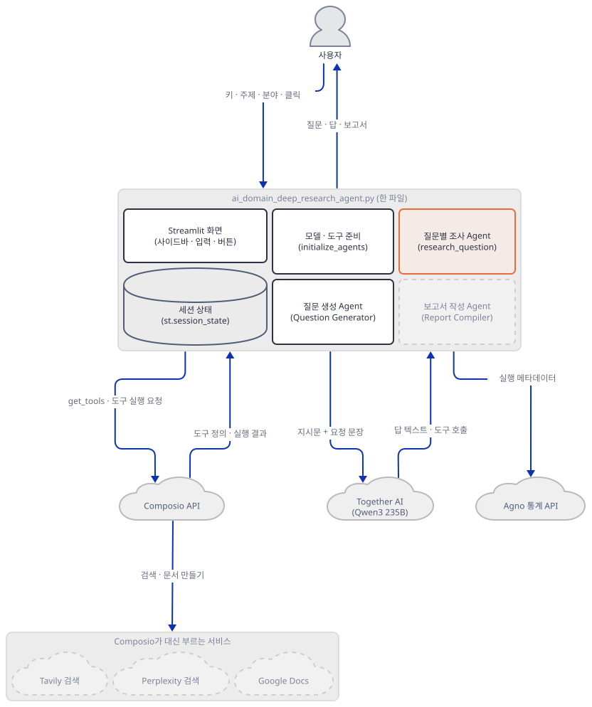

**확인.**

```bash
AGNO_TELEMETRY=false uv run --no-project python probe.py
```

```powershell
$env:AGNO_TELEMETRY = "false"
uv run --no-project python probe.py
```

PowerShell 줄은 실행해 보지 못했습니다. 직접 확인한 출력은 아래 둘입니다. 프록시를 막고 `AGNO_TELEMETRY`를 걸지 않으면 같은 출력에 `os-api.agno.com:443` 접속 시도 2건이 막혔고, 걸면 0건이었습니다(기록용 프록시로 직접 확인).

```
flat   tools sent to the model: ['hello']
nested tools sent to the model: []
TypeError: Agent.run() missing 1 required positional argument: 'input'
```

두 줄로 나란히 보입니다. 이중 목록이면 모델이 받는 도구가 비고, 입력 없이 부르면 `TypeError`입니다. 이 앱은 두 가지를 다 합니다.

### Step 6. 보고서 — 문서가 만들어졌는지는 보지 않습니다

**목적.** 마지막 Agent의 구성과, 결과 표시가 무엇을 근거로 하는지 읽습니다.

**할 일.** 보고서 Agent는 질문별 답을 HTML 조각으로 이어 붙여 지시문 속에 넣습니다.

`advanced_ai_agents/multi_agent_apps/ai_domain_deep_research_agent/ai_domain_deep_research_agent.py:129-139`

```python
def compile_report(llm, composio_tools, topic, domain, question_answers):
    with st.spinner("📝 Compiling final report and creating Google Doc..."):
        qa_sections = "\n".join(
            f"<h2>{idx+1}. {qa['question']}</h2>\n<p>{qa['answer']}</p>" 
            for idx, qa in enumerate(question_answers)
        )
        
        compile_report_task = Agent(
            name="Report Compiler",
            model=llm,
            tools=[composio_tools],
```

`advanced_ai_agents/multi_agent_apps/ai_domain_deep_research_agent/ai_domain_deep_research_agent.py:155-162`

```python
            Use the GOOGLEDOCS_CREATE_DOCUMENT_MARKDOWN tool to create a Google Doc with the report. The text should be in HTML format. You have to create the google document with all the compiled info. You have to do it.
            """
        )
        
        compile_result: RunOutput = compile_report_task.run()
        st.session_state.report_content = compile_result.content
        st.session_state.research_complete = True
        return compile_result.content
```

`advanced_ai_agents/multi_agent_apps/ai_domain_deep_research_agent/ai_domain_deep_research_agent.py:222-233`

```python
    if st.session_state.question_answers and st.button("Compile Final Report", key="compile_report"):
        report_content = compile_report(
            llm, composio_tools, topic, domain, st.session_state.question_answers
        )

        # Display the report content
        st.header("Final Report")
        st.success("Your report has been compiled and a Google Doc has been created.")

        # Show the full report content
        with st.expander("View Full Report Content", expanded=True):
            st.markdown(report_content)
```

`compile_report_task.run()`도 입력이 없어 같은 `TypeError`로 끝납니다. 다만 원본에서는 "Start Research"가 먼저 `TypeError`로 끝나 답 목록이 비므로 "Compile Final Report" 버튼이 222행의 조건 때문에 그려지지 않습니다(`AppTest`로 직접 확인). 조사만 고치면 보고서 단계에서 같은 오류가 납니다. 또 `tools=[composio_tools]`도 같은 이중 목록입니다. 눈여겨볼 곳은 표시입니다. 컴파일이 끝나면 `st.success`로 "Your report has been compiled and a Google Doc has been created."를 보이는데, 이 문구는 Google Docs 도구가 실제로 불렸는지도 모델의 답에 문서 정보가 있는지도 보지 않습니다. `run`이 끝나기만 하면 나옵니다. 게다가 같은 버튼 클릭 한 번에 아래 블록이 한 번 더 같은 "Final Report"와 같은 문구를 그립니다.

`advanced_ai_agents/multi_agent_apps/ai_domain_deep_research_agent/ai_domain_deep_research_agent.py:244-253`

```python
    # Display final report if available
    if st.session_state.research_complete and st.session_state.report_content:
        st.header("Final Report")
        
        # Display the report content
        st.success("Your report has been compiled and a Google Doc has been created.")
        
        # Show the full report content
        with st.expander("View Full Report Content", expanded=True):
            st.markdown(st.session_state.report_content)
```

그래서 한 번 누르면 헤더와 성공 문구가 두 번 보입니다(가짜 서버를 물린 `AppTest`에서 `st.success` 두 건으로 직접 확인). 도구가 하나도 쓰이지 않은 실행에서도 마찬가지였습니다. 즉 오늘 이 앱은 도구가 안 보이는 모델의 글 한 편을 "Google Doc이 만들어졌다"는 문구와 함께 보여 줍니다.

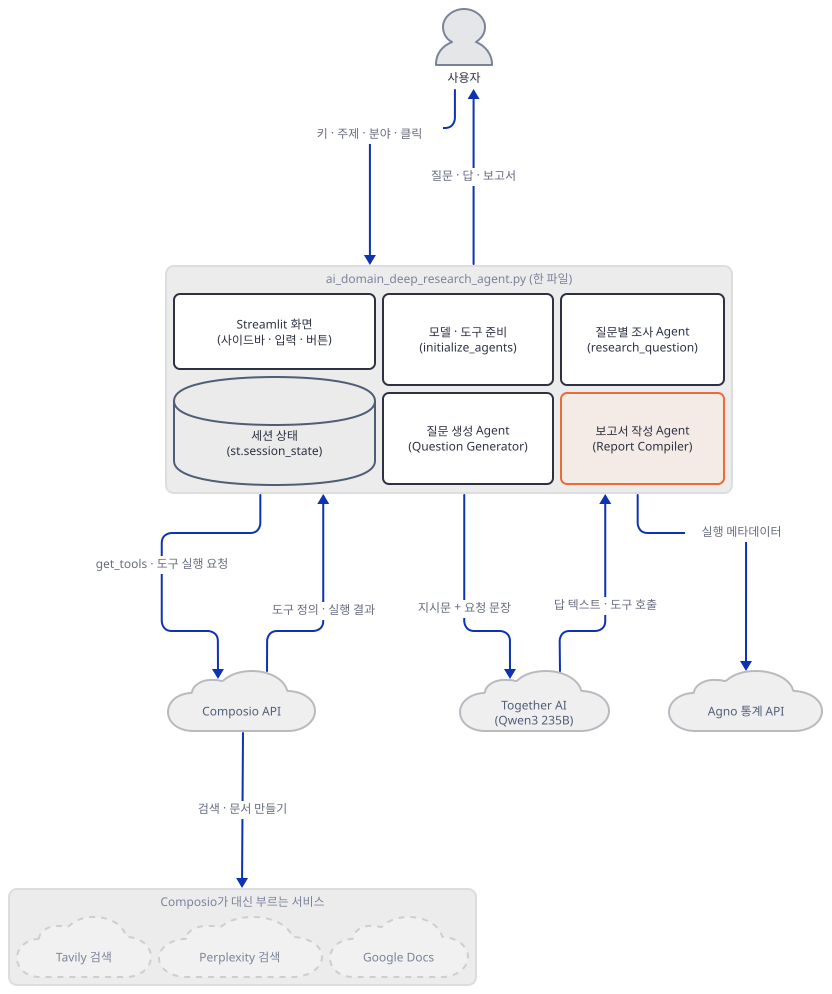

**확인.** 이 단계에서 서비스 없이 되는 확인은 앞의 `probe.py`로 충분합니다. 같은 줄을 읽는 것은 아래 명령입니다.

```bash
grep -n "\.run(\|tools=" ai_domain_deep_research_agent.py
```

직접 확인한 출력(탭 없이 `행번호:줄`):

```
106:        questions_task: RunOutput = question_generator.run(
121:        tools=[composio_tools],
125:    research_result: RunOutput = research_task.run()
139:            tools=[composio_tools],
159:        compile_result: RunOutput = compile_report_task.run()
```

### Step 7. 두 줄을 고친 사본으로 한 바퀴 — 가짜 서버로 끝까지

**목적.** 막히는 곳이 정말 이 둘뿐인지, 고치면 흐름이 끝까지 도는지 확인합니다.

**할 일.** 원본은 건드리지 않고 사본을 고칩니다. 고칠 곳은 `run` 호출 둘과 `tools=` 두 줄입니다(앱 파일이 있는 폴더에서).

```bash
cp ai_domain_deep_research_agent.py fixed_app.py
sed -i 's/research_task.run()/research_task.run(question)/' fixed_app.py
sed -i 's/compile_report_task.run()/compile_report_task.run("Compile the report now.")/' fixed_app.py
sed -i 's/tools=\[composio_tools\]/tools=composio_tools/' fixed_app.py
```

(`sed -i`는 macOS의 BSD sed에서는 `-i ''`처럼 인자가 필요합니다. PowerShell에는 `sed`가 없어 같은 일을 하는 줄은 쓰지 않았습니다.) 입력 문장은 이 문서가 정한 값입니다. 조사에는 질문 자체를 넘기고, 보고서는 지시문에 모든 재료가 있어 짧은 문장 하나를 넘겼습니다. 이 사본을 Together·Composio 가짜 서버를 물린 `AppTest`로 끝까지 돌렸더니 흐름이 모두 지나갔습니다(직접 확인).

- "Generate Research Questions": 모델 호출 1회, 도구 없음, 질문 5개 저장.
- "Start Research": 질문 5개 각각 모델 호출 2회(도구 호출 요청 → 도구 결과 뒤 답). 요청마다 `tools`에 `composio_search_tavily_search`, `googledocs_create_document_markdown`, `perplexityai_perplexity_ai_search` 셋이 실렸고, Composio 가짜 서버가 `POST /api/v2/actions/COMPOSIO_SEARCH_TAVILY_SEARCH/execute`를 5번 받았습니다.
- "Compile Final Report": 모델 호출 2회, `POST /api/v2/actions/GOOGLEDOCS_CREATE_DOCUMENT_MARKDOWN/execute` 1번(본문에 `connectedAccountId`와 모델이 넘긴 `title`, `markdown_text`).
- 에이전트를 만든 횟수는 7번(질문 1, 조사 5, 보고서 1)이었고, 기록용 프록시는 `os-api.agno.com:443` 접속 시도 7건을 받아 막았습니다. 성공한 실행마다 통계를 보내려 한다는 Day 047 Step 5의 사실과 맞습니다.

도구 이름은 지시문에는 대문자(`COMPOSIO_SEARCH_TAVILY_SEARCH`)로 적혀 있지만 모델이 받는 함수 이름은 소문자입니다. 가짜 모델은 서버가 받은 `tools` 이름에서 대소문자를 무시하고 골라 불렀습니다. 실제 모델이 같은 선택을 하는지는 확인하지 못했습니다.


위 결과는 이 문서를 만든 쪽의 가짜 Together·Composio 서버와 `AppTest` 스크립트에서 나왔고, 이 문서에는 싣지 않았으니 독자가 그대로 다시 볼 수는 없습니다. 독자가 서비스 없이 다시 볼 수 있는 확인은 아래 셋입니다. 고친 곳이 정확히 네 줄인지(`diff`), 사본이 컴파일되는지, 서버가 뜨는지입니다.

**확인.**

```bash
diff ai_domain_deep_research_agent.py fixed_app.py
uv run --no-project python -m py_compile fixed_app.py && echo compiled
```

직접 확인한 출력(`diff`는 바뀐 줄만, 맨 앞 `<`는 원본 `>`는 사본):

```
121c121
<         tools=[composio_tools],
---
>         tools=composio_tools,
125c125
<     research_result: RunOutput = research_task.run()
---
>     research_result: RunOutput = research_task.run(question)
139c139
<             tools=[composio_tools],
---
>             tools=composio_tools,
159c159
<         compile_result: RunOutput = compile_report_task.run()
---
>         compile_result: RunOutput = compile_report_task.run("Compile the report now.")
compiled
```

사본을 브라우저로 여는 명령은 이렇습니다(`--server.address localhost`와 `--browser.gatherUsageStats false`가 없으면 Streamlit이 시작하며 외부 주소를 알아내려 하고 사용 통계도 보낼 수 있습니다). 포트는 비어 있는 높은 번호면 됩니다.

```bash
uv run --no-project streamlit run fixed_app.py --server.headless true --server.address localhost --server.port 53418 --browser.gatherUsageStats false
curl --noproxy '*' http://localhost:53418/_stcore/health
```

두 번째 줄은 다른 터미널에서 돌리며, 직접 확인한 출력은 `ok`입니다(같은 명령, 포트 53418). 원본을 그대로 띄울 때는 `fixed_app.py` 자리에 `ai_domain_deep_research_agent.py`를 씁니다. 실제 키와 서비스가 있는 독자는 이 사본으로 Together 모델 ID만 바꿔 끝까지 돌릴 수 있을 것입니다. 이 문서는 그것을 실행해 보지 못했습니다.

## 요청 한 건이 흐르는 과정

한 번의 사용(키 입력부터 보고서까지)은 버튼 셋의 클릭이고, 클릭마다 스크립트가 처음부터 다시 실행되어 `initialize_agents`가 다시 불립니다. 아래 그림에서는 이 반복을 한 번만 그렸습니다. 메시지가 36개라 한 장에 담으면 배우가 많아 화살표 라벨 위로 수명선이 지나가므로 시간 경계에서 여섯 장으로 나눴고, 모든 메시지는 정확히 한 그림에 원래 순서로 있습니다. 그림마다 Agent는 하나씩 나옵니다. 코드에서 셋은 다른 객체이기 때문에(`advanced_ai_agents/multi_agent_apps/ai_domain_deep_research_agent/ai_domain_deep_research_agent.py:83-83`, `advanced_ai_agents/multi_agent_apps/ai_domain_deep_research_agent/ai_domain_deep_research_agent.py:119-119`, `advanced_ai_agents/multi_agent_apps/ai_domain_deep_research_agent/ai_domain_deep_research_agent.py:136-136`) 그림에서도 질문 생성·질문별 조사·보고서 작성 Agent를 각자의 수명선으로 그렸습니다. 그림은 두 곳을 고친 사본의 흐름입니다. 원본은 조사의 `run` 호출에서 `TypeError`로 끝나므로 그 뒤의 모델·도구 메시지가 없습니다. 첫 그림은 키 입력, 화면이 `initialize_agents`를 부르고 거기서 `ComposioToolSet`과 `get_tools`가 Composio 서버로 가는 요청입니다.

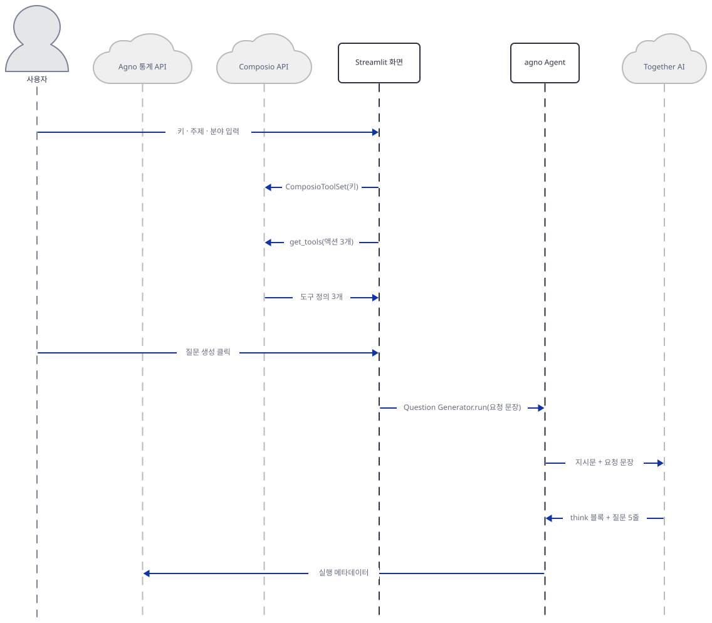

둘째 그림은 주제·분야를 입력하고(두 키가 있어야 그려지는 칸이라 도구 준비 뒤에 옵니다, Step 2) "질문 생성"을 눌러 질문 생성 Agent가 모델에 요청하고 응답을 받은 뒤 agno 통계 메시지를 보내는 부분입니다.

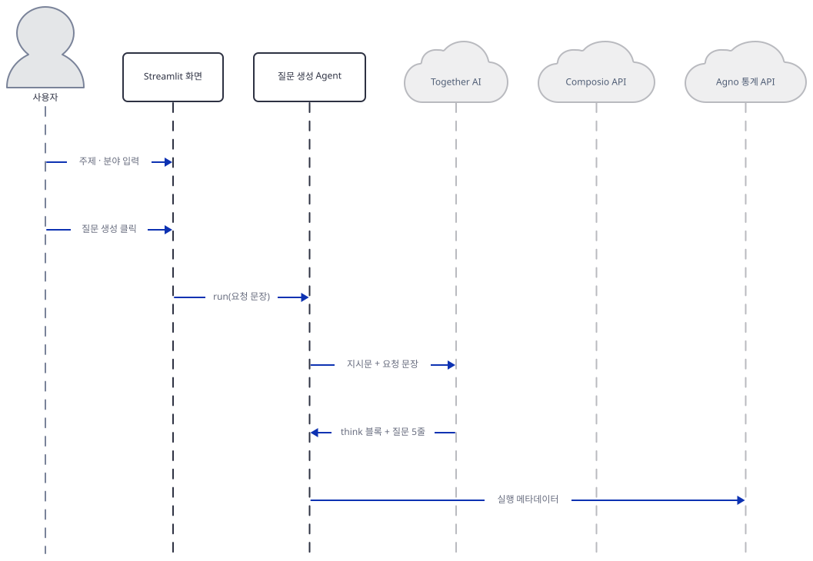

셋째 그림은 질문 생성 Agent가 질문 텍스트를 화면에 돌려주고 사용자에게 보인 뒤 "Start Research"를 눌러 질문별 조사 Agent가 첫 질문에 대해 모델의 도구 호출 요청을 받고 Composio가 검색 결과를 돌려주는 부분입니다. 모델이 도구 호출을 요청하면 agno가 Composio에 실행을 맡기고 결과를 받습니다.

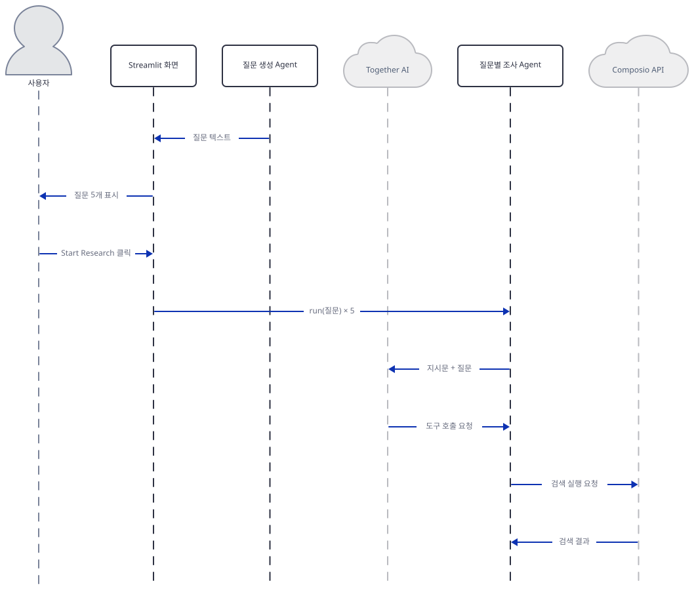

넷째는 조사 Agent가 도구 결과를 모델에 돌려주고 답을 받아 agno 통계 메시지를 보낸 뒤 질문별 답을 보이는 부분입니다. 질문이 다섯이라 셋째와 넷째 그림의 호출은 질문마다 한 번씩, 모두 다섯 번 반복되고 화면에는 질문마다 답이 이어서 나옵니다.

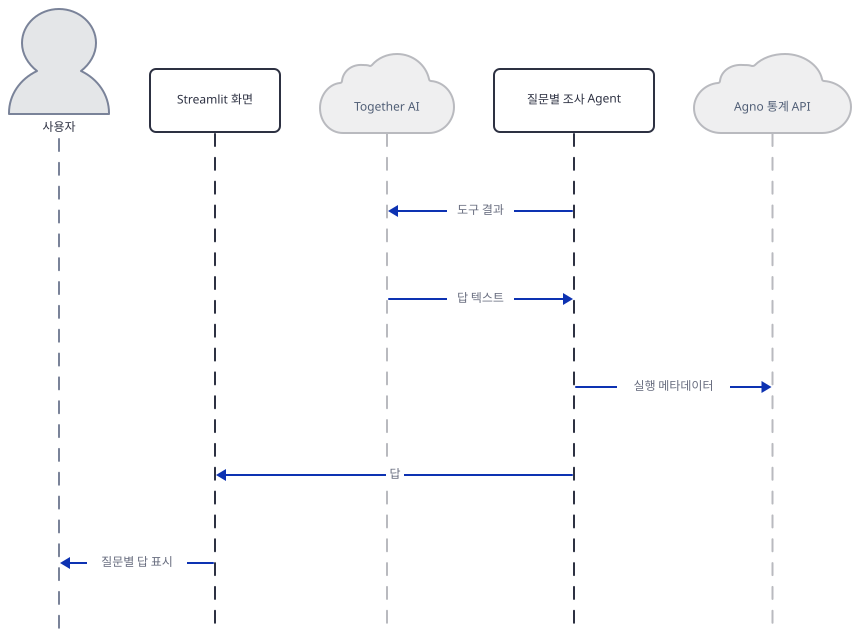

다섯째는 "Compile Final Report"를 눌러 보고서 작성 Agent가 모델에 지시문을 보내고, 모델의 도구 호출 요청에 따라 Google Docs 문서 만들기를 Composio에 요청해 결과를 받는 부분이고, 여섯째는 그 결과를 모델에 돌려주고 보고서 본문을 받아 agno 통계 메시지를 보낸 뒤 화면에 보이는 부분입니다.

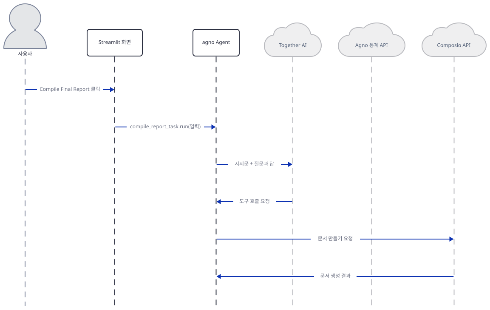

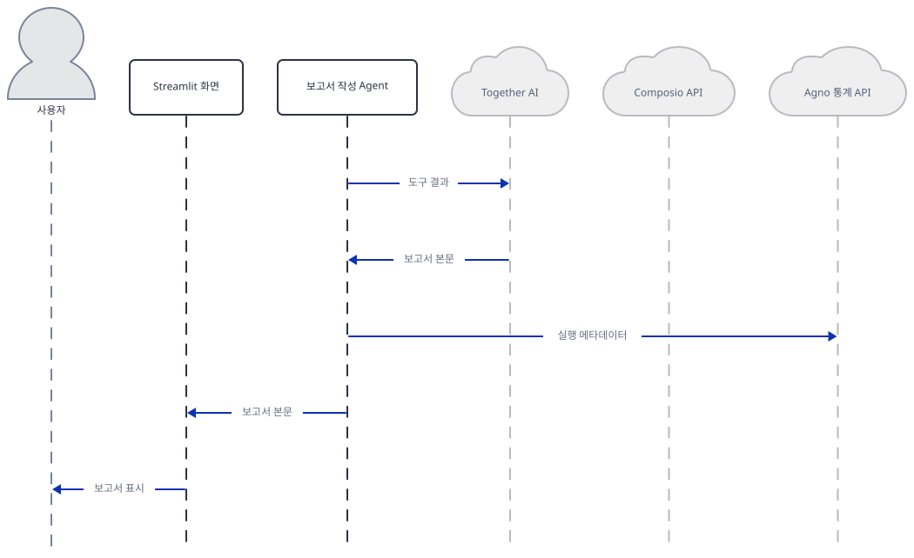

## 실행 체크리스트

- [ ] `uv pip install -r requirements.txt` 뒤 `uv run --no-project python -c "from composio_agno import ComposioToolSet, Action; from agno.models.together import Together; print('import ok')"`가 `import ok`를 찍는다(아니면 `uv pip install --reinstall composio-core`)
- [ ] 키 없이 `AppTest`로 화면을 그리면 키 칸 둘과 경고 한 줄이 나온다
- [ ] `Together(...).base_url`이 `https://api.together.xyz/v1`이고, `Action.COMPOSIO_SEARCH_TAVILY_SEARCH` 등이 import된다
- [ ] `extract_questions_after_think`가 `</think>` 뒤만 돌려준다
- [ ] `probe.py`가 이중 목록에서 `[]`, 평평한 목록에서 `['hello']`를 찍고 입력 없는 `run()`에서 `TypeError`를 찍는다
- [ ] 사본의 `run` 호출 둘과 `tools=` 두 줄을 고쳐 `diff`가 네 줄만 보이고 `py_compile`이 통과한다
- [ ] `streamlit run`으로 사본을 띄우고 `/_stcore/health`가 `ok`를 돌려준다(서버가 떴다는 뜻이고, 화면은 브라우저로 처음 접속할 때 그려진다)
- [ ] 실제로 돌릴 계획이면 Together 모델 ID를 현재 serverless 목록의 것으로 바꿨다

## 문제 해결

| 증상 | 원인 | 해결 |
|---|---|---|
| ImportError: cannot import name 'Composio' from 'composio.client'(또는 'ComposioError' from 'composio.exceptions') | `composio`와 `composio-core`가 같은 `composio/` 파일 12개를 설치해 섞임(조합에 따라 두 번째 문구가 나옴. 새 설치마다 결과가 달랐다: 7번 중 1번 깨짐, 다른 환경에서는 5번 모두 정상) | `uv pip install --reinstall composio-core`(직접 확인) |
| ImportError: openai not installed (agno의 안내 문구, 앞뒤에 역따옴표가 붙는다) | 요구 파일에 `openai`가 없고 `composio`를 뺐을 때 딸려 오지 않음 | `uv pip install openai`(직접 확인) |
| "Start Research"에서 `TypeError: Agent.run() missing 1 required positional argument: 'input'`. "Compile Final Report" 버튼은 보이지도 않는다 | `run()`을 입력 없이 부름(`research_task.run()`, `compile_report_task.run()`). 조사가 멈춰 답 목록이 비므로 보고서 버튼이 안 그려지고, 조사만 고치면 보고서에서 같은 오류 | 사본에서 `run(question)`처럼 입력을 넘긴다(Step 7) |
| 오류 없이 끝나는데 검색 결과나 Google Doc이 없다 | `tools=[composio_tools]`가 목록 안의 목록이라 모델이 도구를 받지 않고, 화면은 그래도 성공 문구를 보여 줌 | `tools=composio_tools`로 고친다(Step 5·7) |
| 키를 채우자마자 페이지가 ConnectedAccountNotFoundError(No connected account found for app GOOGLEDOCS; Run composio add googledocs to fix this)로 바뀐다(Step 3의 문구에서 앱 이름과 명령은 역따옴표로 감싸여 있다) | 필요한 앱의 계정을 Composio에 연결하지 않음 | `composio add googledocs`, `composio add perplexityai`(명령은 실행해 보지 못했고, 예외 문구는 가짜 서버에서 직접 확인) |
| Together가 모델을 찾지 못한다는 오류 | `Qwen/Qwen3-235B-A22B-fp8-tput`가 2026-02-06에 serverless에서 제거되고 전용 엔드포인트로도 쓸 수 없음(공식 문서) | 현재 목록의 모델 ID로 바꾸고 `</think>` 처리를 다시 본다. 실제 오류 문구는 확인하지 못했다 |
| 홈에 `~/.composio/`가 생기고 첫 실행이 느리다 | `composio`가 import와 `ComposioToolSet` 생성 때 캐시를 만들고 서버 목록을 내려받음 | `COMPOSIO_CACHE_DIR`로 위치를 바꾼다(직접 확인) |
| `AppTest script run timed out after 3(s)` | 첫 import가 느림(composio 네트워크 시도) | `AppTest.from_file(..., default_timeout=60)`(직접 확인) |

## 더 해보기

- 질문 목록 정리를 단단하게 만들어 보세요. 5개가 아닐 때와 번호 없는 줄이 끼었을 때를 `advanced_ai_agents/multi_agent_apps/ai_domain_deep_research_agent/ai_domain_deep_research_agent.py:101-115`에서 다루게 하고, 입력으로 질문이 아닌 머리말이 들어오는 경우를 `probe.py` 같은 가짜 서버로 재현해 봅니다.
- 보고서 단계가 문서 생성 성공을 근거로 문구를 정하게 해 보세요. 도구 실행 결과에서 문서 주소를 꺼낼 수 있는지 `Agent.run`이 돌려주는 `RunOutput`(`advanced_ai_agents/multi_agent_apps/ai_domain_deep_research_agent/ai_domain_deep_research_agent.py:159-162`)에서 찾아봅니다. 실제 Composio 응답 모양은 이 문서가 보지 못했습니다.
- `initialize_agents`를 `st.cache_resource` 같은 캐시로 감싸 화면이 다시 그려질 때마다 도구 정의를 받지 않게 하고, 요청이 몇 건 줄어드는지 가짜 서버 기록으로 세어 보세요.

## 다음 날 예고

[Day 108 · AI Email GTM Outreach Agent](../day108-ai-email-gtm-outreach-agent/README.md) — 원본의 `requirements.txt`가 agno, Exa 검색 클라이언트(`exa_py`), OpenAI를 쓰는 GTM(시장 진출) 아웃리치 메일 앱입니다. Day 108 README에 따르면 앱은 agno `Agent` 넷(기업 탐색·연락처·기업 조사·이메일 작성)을 차례로 부르고, 같은 SQLite 파일에 세션을 쌓습니다. 오늘의 에이전트 셋과 달리 서로 부르지 않고 단계 함수가 앞 답을 다음 프롬프트에 붙입니다.
