# Day 108 · AI Email GTM Outreach Agent

> 볼륨 7 🚀 Advanced AI Agents · 난이도 ★★★ ⚠(`requirements.txt` 그대로는 첫 import에서 막히고, 오늘 설치되는 agno 3에서는 에이전트를 만드는 순간 `TypeError`가 나며, 앱의 `gpt-5`는 기본 스냅숏이 2026-12-11 종료 예정) · 예상 소요 120분(가짜 OpenAI 서버를 직접 띄우고 도우미 스크립트 다섯 개를 저장해 돌리며 시퀀스 그림 아홉 장을 따라가는 손 시간이 읽는 시간만큼 듭니다) · API 비용 대략 확인 불가(키가 없어 토큰 수를 재지 못했습니다. 캠페인 한 번의 모델 호출은 에이전트 넷에 메모리 요청 넷을 더한 8번이 최소이고 — 직접 확인 — 요금은 1M 토큰당 `gpt-5` 입력 $1.25·출력 $10, `gpt-4o` 입력 $2.5·출력 $10입니다(2026-10-09에 받은 OpenAI 모델 페이지 원문). Exa 요금은 확인하지 못했습니다. 이 문서의 확인은 모두 가짜 서버로 돌아 무료입니다) · 원본 앱: `advanced_ai_agents/multi_agent_apps/ai_email_gtm_outreach_agent`

## 오늘 만들 것

회사를 찾고, 담당자를 찾고, 회사별 조사 거리를 모으고, 영업 메일 초안을 쓰는 네 에이전트를 차례로 부르는 Streamlit 앱입니다. 사용자는 목표 회사 설명과 제안, 회사 수, 메일 스타일을 넣고 버튼을 한 번 누릅니다. 에이전트 넷은 모두 agno의 평범한 `Agent`이고, 서로 부르지 않습니다. 단계 함수가 앞 에이전트의 답을 JSON으로 읽어 다음 에이전트의 프롬프트에 붙여 줄 뿐입니다. 앞 셋 가운데 기업 탐색·기업 조사 에이전트는 `gpt-5`, 연락처 에이전트는 `gpt-4o`를 쓰고, 셋 모두 Exa 검색 도구를 쥡니다. 이메일 작성 에이전트는 `gpt-5`에 도구가 없습니다. 네 에이전트가 같은 SQLite 파일에 세션을 쌓고 `enable_user_memories=True`로 기억도 만들게 되어 있다는 것이 오늘의 새로운 점입니다.

이름이 비슷한 Day 101(`single_agent_apps/ai_email_gtm_reachout_agent`)과는 다른 앱입니다. Day 101은 agno `Workflow` 한 클래스가 회사마다 루프를 돌며 `yield`했고, 에이전트 넷이 모두 `gpt-5`였고, 이메일 틀 사전과 입력 폼이 따로 있었고, `SqliteDb`는 만들기만 해서 DB 파일이 생기지 않았습니다(Day 101 Step 8). 이 앱은 `Workflow`도 `yield`도 없이 단계마다 에이전트를 한 번씩 부르고(회사 수와 무관하게 에이전트 실행은 4번), 모델이 둘이며, 에이전트가 실제로 DB에 실행을 기록합니다. 두 앱 모두 메일을 보내지 않습니다. `requirements.txt`가 `sqlalchemy`를 빠뜨리는 것도 같습니다(Day 101 Step 1).

오늘 설치하면 앱이 두 군데에서 막힙니다. 첫째는 `agno.db.sqlite`가 요구하는 `sqlalchemy`가 `requirements.txt`에 없는 것입니다(Step 1). 둘째가 더 큽니다. `agno>=2.2.10`은 3.1.2로 풀리는데 agno 3.0.0부터 `Agent`의 `enable_user_memories` 인자가 없어져서, 에이전트를 만드는 순간 `TypeError`입니다(Step 2, 직접 확인). 복사본에서 네 줄을 고치면 됩니다. 이 문서의 확인은 키가 없으므로 이 PC에서만 듣는 가짜 OpenAI 서버와 Exa 대역으로 돌렸고, 그래서 아래의 회사·연락처·이메일은 전부 가짜 서버가 내놓은 문장입니다. 진짜 `gpt-5`·`gpt-4o`·Exa가 무엇을 돌려주는지는 확인하지 못했습니다. 아래는 완성된 아키텍처입니다.

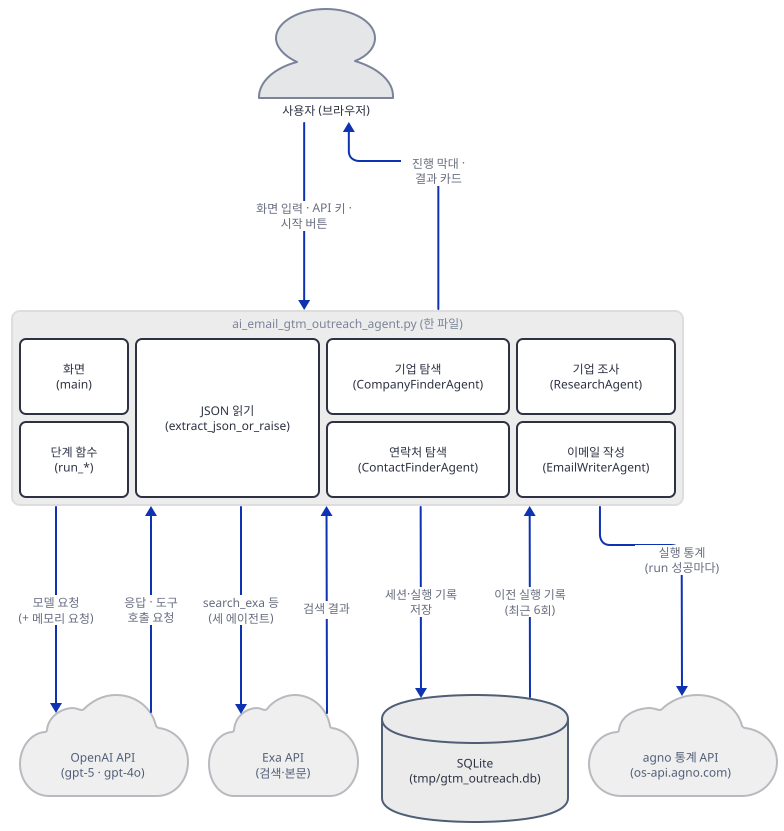

## 사전 준비

| 서비스/도구 | 용도 | 발급·설치 |
|---|---|---|
| uv, Python | 가상환경과 패키지 설치. 이 문서는 Python 3.13.3으로 확인했다 | [공통 사전 준비](../README.md#공통-사전-준비-한-번만) 참고 |
| OpenAI API 키 | 에이전트 넷이 `gpt-5`(셋)·`gpt-4o`(하나)를 부른다. 이 문서의 확인에는 필요 없다 | https://platform.openai.com/api-keys. `gpt-5`의 기본 스냅숏 `gpt-5-2025-08-07`이 OpenAI 폐기 표(https://developers.openai.com/api/docs/deprecations, 2026-10-09에 받은 원문)에 2026-12-11 종료로 올라 있다(대체는 `gpt-5.6-sol`). 표에는 스냅숏 이름만 있고 `gpt-5` 별칭이 그 스냅숏을 가리킨다고는 적혀 있지 않다. 모델 페이지는 그것을 기본 스냅숏이라 적는다. `gpt-4o`는 같은 표에 별칭도 기본 스냅숏(`gpt-4o-2024-08-06`)도 없고 `gpt-4o-2024-05-13`만 2026-10-23 종료다 |
| Exa API 키 | 세 에이전트의 `ExaTools`. 이 문서의 확인에는 필요 없다 | https://exa.ai |
| 빈 포트 셋 | 가짜 OpenAI 서버(57391), `streamlit run` 확인(57392), agno 통계 수신기(7070). 7070은 agno가 개발용 주소로 쓰는 값이라 바꿀 수 없다. 앞의 둘은 아무 높은 번호면 되고 겹치면 바꾼다 | 별도 설치 없음 |

## 아키텍처 한눈에 보기

| 컴포넌트 | 역할 | 코드 위치 |
|---|---|---|
| 사용자 (브라우저) | 키와 설명을 넣고 시작 버튼을 눌러 진행 막대와 결과를 본다 | 코드 없음 (Streamlit 화면) |
| 화면 (`main`) | 사이드바 키 입력, 입력 폼, 시작 버튼과 진행 막대, 결과 네 구역을 그린다 | `advanced_ai_agents/multi_agent_apps/ai_email_gtm_outreach_agent/ai_email_gtm_outreach_agent.py:199-354` |
| 단계 함수 (`run_*`) | 에이전트마다 프롬프트를 만들어 `.run()`을 부르고 응답을 JSON으로 읽어 돌려준다 | `advanced_ai_agents/multi_agent_apps/ai_email_gtm_outreach_agent/ai_email_gtm_outreach_agent.py:131-180` |
| JSON 읽기 (`extract_json_or_raise`) | 응답이 순수 JSON이 아니면 첫 `{`부터 마지막 `}`까지를 다시 읽는다 | `advanced_ai_agents/multi_agent_apps/ai_email_gtm_outreach_agent/ai_email_gtm_outreach_agent.py:117-128` |
| 에이전트 공장 함수 넷 | 기업 탐색·연락처 탐색·기업 조사·이메일 작성 에이전트를 만든다 | `advanced_ai_agents/multi_agent_apps/ai_email_gtm_outreach_agent/ai_email_gtm_outreach_agent.py:20-37`, `advanced_ai_agents/multi_agent_apps/ai_email_gtm_outreach_agent/ai_email_gtm_outreach_agent.py:40-59`, `advanced_ai_agents/multi_agent_apps/ai_email_gtm_outreach_agent/ai_email_gtm_outreach_agent.py:72-91`, `advanced_ai_agents/multi_agent_apps/ai_email_gtm_outreach_agent/ai_email_gtm_outreach_agent.py:94-114` |
| 이메일 스타일 | 스타일 이름 넷을 지시문 한 줄로 바꾼다 | `advanced_ai_agents/multi_agent_apps/ai_email_gtm_outreach_agent/ai_email_gtm_outreach_agent.py:62-69` |
| SQLite (`SqliteDb`) | 에이전트마다 `tmp/gtm_outreach.db`를 열어 세션과 실행을 기록한다 | 같은 파일 22·42·73·97행 |
| OpenAI API | 에이전트 넷의 모델과 메모리 요청 | 코드 없음 (agno `OpenAIChat`) |
| Exa API | 검색·본문·유사 페이지·답변 도구 | 코드 없음 (agno `ExaTools`) |
| agno 통계 API | 성공한 에이전트 실행마다 익명 통계 한 건 | 코드 없음 (agno 안, Step 7) |
| 쓰이지 않는 정의 | `require_env`, `run_pipeline`, `require_env`만 쓰는 `sys` import | `advanced_ai_agents/multi_agent_apps/ai_email_gtm_outreach_agent/ai_email_gtm_outreach_agent.py:14-17`, `advanced_ai_agents/multi_agent_apps/ai_email_gtm_outreach_agent/ai_email_gtm_outreach_agent.py:183-196` |

위 그림은 한 파일 안의 부품 사이 화살표를 모두 파일 밖으로 나가는 것만 남겨 그렸습니다. 파일 안의 호출은 아래 세 장이 보여 줍니다. 화면과 단계 함수와 JSON 읽기 사이입니다.

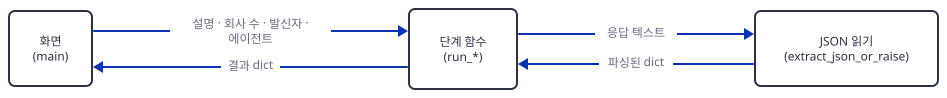

단계 함수와 에이전트 넷 사이는 호출과 반환뿐입니다. 에이전트끼리는 서로 부르지 않고 앞 응답은 단계 함수가 다음 프롬프트에 붙여 넘깁니다.

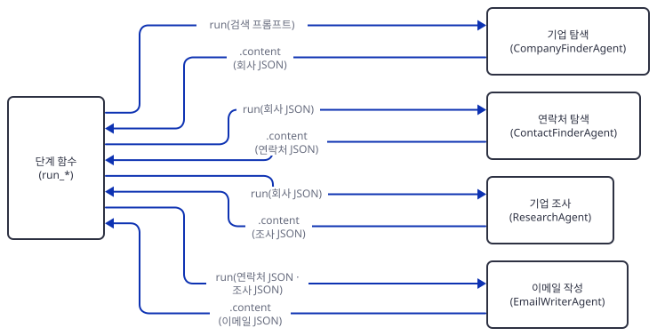

모델은 둘로 갈립니다. 연락처 에이전트만 `gpt-4o`입니다.

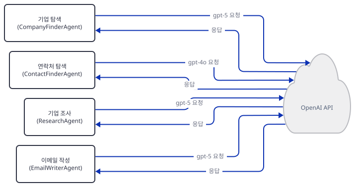

Exa를 쥔 것은 셋이고, 기업 탐색 에이전트만 `category="company"`를 줍니다.

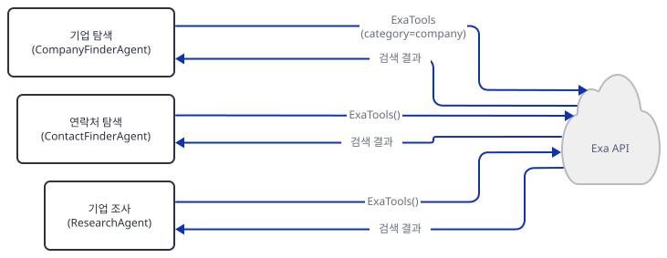

## 단계별 진행

### Step 1. 환경 만들기 — `requirements.txt`가 빠뜨린 패키지

**목적.** 원본 폴더를 건드리지 않도록 작업 폴더에 복사본과 독립 가상환경을 만들고, 파일이 import되는 데까지 패키지를 채웁니다.

**할 일.** `requirements.txt`는 다섯 줄입니다(마지막 줄에 개행이 없어 `wc -l`은 4로 셉니다).

`advanced_ai_agents/multi_agent_apps/ai_email_gtm_outreach_agent/requirements.txt:1-5`

```text
agno>=2.2.10
streamlit>=1.33.0
pydantic>=2.7.0
openai>=1.30.0
exa_py>=1.0.7
```

다섯 줄 모두 상한이 없어서 2026-10-09에는 agno 3.1.2, streamlit 1.65.0, pydantic 2.14.0, openai 3.26.1, exa-py 2.25.0이 풀렸습니다(직접 확인, 아래 첫 명령). 앱이 상대 경로(`tmp/`)에 파일을 만들기 때문에 저장소 안이 아닌 새 폴더에서 일합니다. 아래의 `<저장소>`는 이 저장소를 받은 경로입니다.

```bash
mkdir gtm-work
cd gtm-work
cp <저장소>/advanced_ai_agents/multi_agent_apps/ai_email_gtm_outreach_agent/ai_email_gtm_outreach_agent.py .
cp <저장소>/advanced_ai_agents/multi_agent_apps/ai_email_gtm_outreach_agent/requirements.txt .
uv venv
uv pip install -r requirements.txt
```

```powershell
mkdir gtm-work
cd gtm-work
Copy-Item <저장소>/advanced_ai_agents/multi_agent_apps/ai_email_gtm_outreach_agent/ai_email_gtm_outreach_agent.py .
Copy-Item <저장소>/advanced_ai_agents/multi_agent_apps/ai_email_gtm_outreach_agent/requirements.txt .
uv venv
uv pip install -r requirements.txt
```

(pip 대안: `python -m venv .venv`로 만들어 활성화한 뒤 `pip install -r requirements.txt`. 이후 모든 `uv run`에는 `--no-project`를 붙입니다. 이유는 [공통 사전 준비](../README.md#공통-사전-준비-한-번만)에 있습니다. 이 문서의 PowerShell 줄은 실행해 보지 못했습니다. bash 줄만 직접 확인했습니다.)

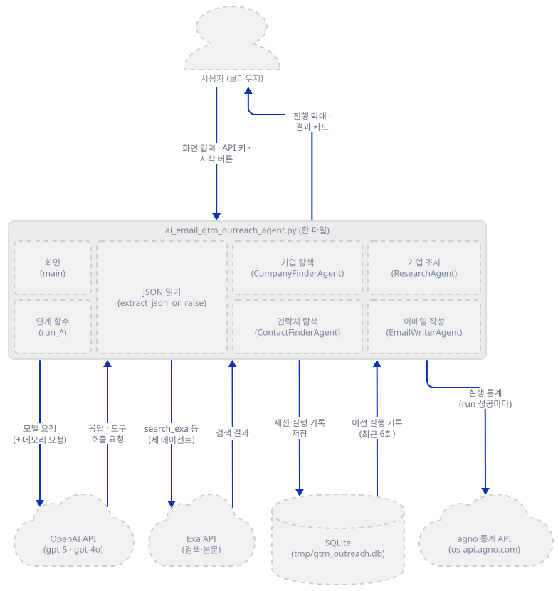

**확인.** 버전을 보고 파일을 컴파일한 다음 실제로 불러 봅니다.

```bash
uv run --no-project python -c "import sys, importlib.metadata as m; print(sys.version.split()[0], *(f'{p} {m.version(p)}' for p in ('agno', 'streamlit', 'pydantic', 'openai', 'exa_py')))"
uv run --no-project python -m py_compile ai_email_gtm_outreach_agent.py && echo compiled
uv run --no-project python -c "import logging; logging.disable(logging.WARNING); import ai_email_gtm_outreach_agent"
```

직접 확인한 출력입니다. 컴파일은 통과해도 불러오면 9행에서 멈춥니다. 마지막 줄이 트레이스백의 끝입니다.

```
3.13.3 agno 3.1.2 streamlit 1.65.0 pydantic 2.14.0 openai 3.26.1 exa_py 2.25.0
compiled
ModuleNotFoundError: No module named 'sqlalchemy'
```

`advanced_ai_agents/multi_agent_apps/ai_email_gtm_outreach_agent/ai_email_gtm_outreach_agent.py:7-11`

```python
from agno.agent import Agent
from agno.run.agent import RunOutput
from agno.db.sqlite import SqliteDb
from agno.models.openai import OpenAIChat
from agno.tools.exa import ExaTools
```

`sqlalchemy`는 agno의 `sqlite` extra에 있습니다(agno 3.1.2 메타데이터로 확인). `exa_py`는 `requirements.txt`에 있으니 이 앱은 Day 101보다 빠뜨린 것이 하나 적습니다.

```bash
uv pip install "agno[sqlite]"
uv run --no-project python -c "import logging; logging.disable(logging.WARNING); import ai_email_gtm_outreach_agent; print('import ok')"
```

설치되는 것은 셋(`aiosqlite==0.22.1`, `greenlet==3.5.6`, `sqlalchemy==2.1.4`)이고 두 번째 명령은 `import ok`를 찍습니다(직접 확인). 마지막으로 이 터미널에 가짜 키와 통계 끄기를 걸어 둡니다. 키 둘은 어디에도 인증되지 않는 가짜 값입니다.

```bash
export EXA_API_KEY=exa-fake OPENAI_API_KEY=sk-fake AGNO_TELEMETRY=false
```

```powershell
$env:EXA_API_KEY = "exa-fake"; $env:OPENAI_API_KEY = "sk-fake"; $env:AGNO_TELEMETRY = "false"
```

### Step 2. 에이전트 넷 — 공장 함수와 사라진 인자

**목적.** 에이전트가 무엇을 쥐고 만들어지는지 보고, agno 3에서 막히는 인자를 복사본에서 고칩니다.

**할 일.** 에이전트마다 공장 함수가 있습니다. 기업 탐색 에이전트입니다.

`advanced_ai_agents/multi_agent_apps/ai_email_gtm_outreach_agent/ai_email_gtm_outreach_agent.py:20-37`

```python
def create_company_finder_agent() -> Agent:
    exa_tools = ExaTools(category="company")
    db = SqliteDb(db_file="tmp/gtm_outreach.db")
    return Agent(
        model=OpenAIChat(id="gpt-5"),
        tools=[exa_tools],
        db=db,
        enable_user_memories=True,
        add_history_to_context=True,
        num_history_runs=6,
        session_id="gtm_outreach_company_finder",
        debug_mode=True,
        instructions=[
            "You are CompanyFinderAgent. Use ExaTools to search the web for companies that match the targeting criteria.",
            "Return ONLY valid JSON with key 'companies' as a list; respect the requested limit provided in the user prompt.",
            "Each item must have: name, website, why_fit (1-2 lines).",
        ],
    )
```

모델, 도구, SQLite, 기억, 이전 6회의 대화, 고정된 세션 이름, "JSON만 돌려 달라"는 지시문이 한 번에 들어 있습니다. 다른 셋도 같은 모양이고 모델·도구·`session_id`·지시문이 다릅니다. 이 문서 시점의 agno로 불러 보면 이 인자에서 막힙니다.

```bash
uv run --no-project python -c "import logging; logging.disable(logging.WARNING); import ai_email_gtm_outreach_agent as app; app.create_company_finder_agent()"
```

트레이스백 끝줄입니다(직접 확인).

```
TypeError: Agent.__init__() got an unexpected keyword argument 'enable_user_memories'
```

`enable_user_memories`는 agno 2.2.10과 2.9.0의 `Agent`에는 있었고(2.9.0 소스에 "Soon to be deprecated. Use update_memory_on_run"라는 주석과 함께) 3.0.0과 3.0.11에는 없습니다(네 버전을 각각 설치해 시그니처로 직접 확인). 새 이름 `update_memory_on_run`은 2.9.0에는 이미 있었고 2.2.10에는 없었습니다. 같은 일을 하는 이름이 바뀐 것이라서 복사본의 네 곳을 바꿉니다. 편집기로 해도 되고, 셸에 상관없이 파이썬으로 해도 됩니다.

```bash
uv run --no-project python -c "import pathlib; p = pathlib.Path('ai_email_gtm_outreach_agent.py'); s = p.read_text(encoding='utf-8'); print(s.count('enable_user_memories=True')); p.write_text(s.replace('enable_user_memories=True', 'update_memory_on_run=True'), encoding='utf-8')"
```

첫 줄에 `4`가 찍힙니다(직접 확인). 이제 에이전트 넷을 만들어 무엇을 쥐었는지 봅니다.

```bash
uv run --no-project python -c "import logging; logging.disable(logging.WARNING); import ai_email_gtm_outreach_agent as app; [print(a.session_id, a.model.id, [f for t in a.tools for f in t.functions], a.update_memory_on_run, a.num_history_runs, a.debug_mode, type(a.db).__name__) for a in (m() for m in (app.create_company_finder_agent, app.create_contact_finder_agent, app.create_research_agent, app.create_email_writer_agent))]"
```

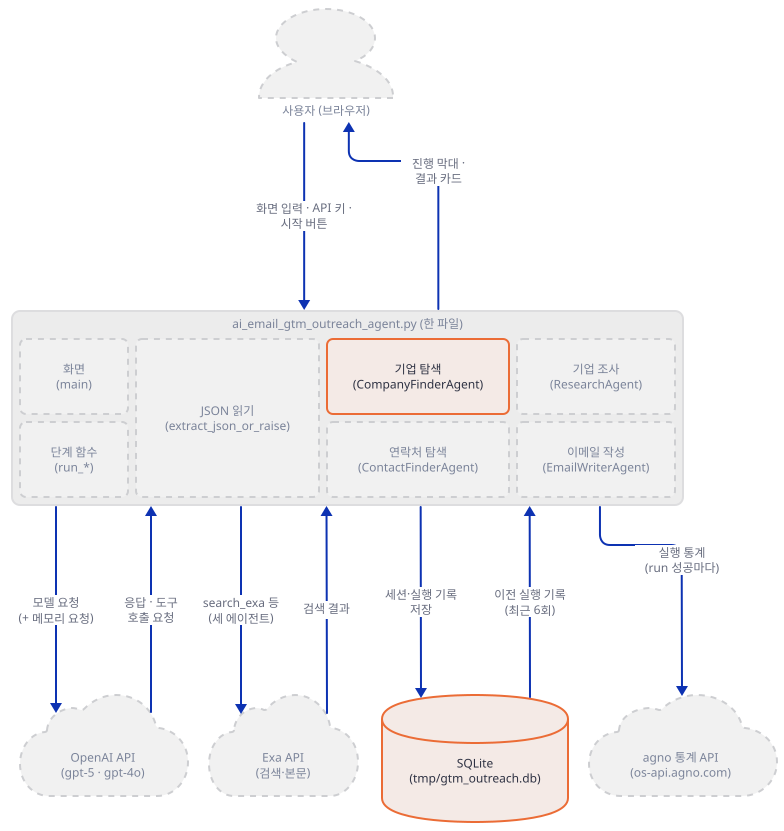

**확인.** 직접 확인한 출력입니다. 이 단계의 구성도는 기업 탐색 에이전트와 SQLite만 밝힙니다. 넷이 한꺼번에 만들어지지만 처음 불리는 것은 기업 탐색 에이전트이고 나머지는 Step 5·6에서 불립니다.

```
gtm_outreach_company_finder gpt-5 ['search_exa', 'get_contents', 'find_similar', 'exa_answer'] True 6 True SqliteDb
gtm_outreach_contact_finder gpt-4o ['search_exa', 'get_contents', 'find_similar', 'exa_answer'] True 6 True SqliteDb
gtm_outreach_researcher gpt-5 ['search_exa', 'get_contents', 'find_similar', 'exa_answer'] True 6 True SqliteDb
gtm_outreach_email_writer gpt-5 [] True 6 False SqliteDb
```

`gtm-work` 안에 빈 `tmp/` 폴더가 생겼습니다. `SqliteDb`는 만들 때 부모 폴더만 만들고 DB 파일은 첫 실행 때 만든다는 뜻입니다. 고치기 전의 실패한 호출도 `SqliteDb`를 먼저 만든 뒤에 `Agent`에서 터지므로 `tmp/`는 이미 생겨 있었습니다(직접 확인). agno 2.9.0을 고르면 복사본을 고치지 않아도 되지만 그 경로는 `greenlet`을 따로 깔아야 하는 함정이 있습니다(문제 해결).

### Step 3. 화면과 키 — 사이드바가 `os.environ`을 채운다

**목적.** 키가 어디서 들어와 어디에 쓰이는지, 입력 검사가 어떤 순서로 걸리는지 확인합니다.

**할 일.** 사이드바 입력칸 둘과 환경변수 갱신입니다.

`advanced_ai_agents/multi_agent_apps/ai_email_gtm_outreach_agent/ai_email_gtm_outreach_agent.py:202-212`

```python
    # Sidebar: API keys
    st.sidebar.header("API Configuration")
    openai_key = st.sidebar.text_input("OpenAI API Key", type="password", value=os.getenv("OPENAI_API_KEY", ""))
    exa_key = st.sidebar.text_input("Exa API Key", type="password", value=os.getenv("EXA_API_KEY", ""))
    if openai_key:
        os.environ["OPENAI_API_KEY"] = openai_key
    if exa_key:
        os.environ["EXA_API_KEY"] = exa_key

    if not openai_key or not exa_key:
        st.sidebar.warning("Enter both API keys to enable the app")
```

셸의 환경변수가 입력칸의 기본값이 되고, 칸에 값이 있으면 `os.environ`에 되씁니다. 에이전트는 시작 버튼의 `if` 블록 안에서(250~253행) 만들어지므로 그 시점의 `os.environ`을 읽습니다. 그래서 Day 101에서 본, 클래스가 만들어지는 순간 키가 비어 있던 문제는 여기에 없습니다(소스로 확인). 버튼을 누른 뒤의 검사는 키, 두 설명 칸 순서입니다(239~242행). 화면을 Streamlit 서버 없이 돌리는 `ui_check.py`를 저장합니다. `streamlit.testing`의 `AppTest`가 스크립트를 실제로 돌립니다.

```python
# ui_check.py - Streamlit 서버 없이 화면을 돌려 입력 검사와 키 흐름을 본다 (streamlit.testing의 AppTest)
import logging
import os

logging.disable(logging.WARNING)
from streamlit.testing.v1 import AppTest

at = AppTest.from_file("ai_email_gtm_outreach_agent.py", default_timeout=30).run()
print("처음 사이드바 경고:", [w.value for w in at.sidebar.warning])
at.button[0].click().run()
print("키 없이 클릭:", [e.value for e in at.error])
at.sidebar.text_input[0].set_value("sk-fake").run()
at.sidebar.text_input[1].set_value("exa-fake").run()
print("키 입력 뒤 사이드바 경고:", [w.value for w in at.sidebar.warning])
at.button[0].click().run()
print("키만 있고 빈 칸으로 클릭:", [e.value for e in at.error])
print("환경변수:", os.environ["OPENAI_API_KEY"], os.environ["EXA_API_KEY"])
print("기본값:", at.text_input[0].value, "|", at.text_input[1].value, "|", at.number_input[0].value, at.selectbox[0].options)
```

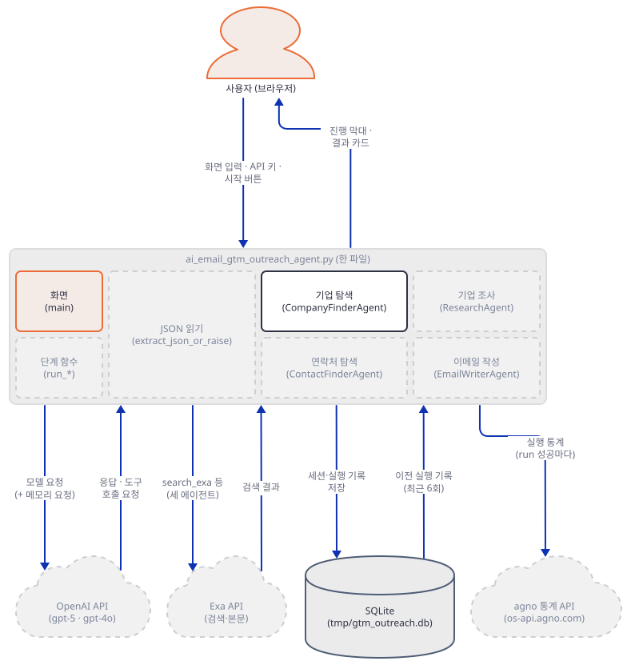

**확인.** 키 환경변수 없이 돌려야 첫 경고가 보이므로 이 명령만 두 변수를 뺍니다.

```bash
env -u OPENAI_API_KEY -u EXA_API_KEY uv run --no-project python ui_check.py
```

```powershell
Remove-Item Env:OPENAI_API_KEY, Env:EXA_API_KEY
uv run --no-project python ui_check.py
$env:EXA_API_KEY = "exa-fake"; $env:OPENAI_API_KEY = "sk-fake"
```

직접 확인한 출력입니다.

```
처음 사이드바 경고: ['Enter both API keys to enable the app']
키 없이 클릭: ['Please provide API keys in the sidebar']
키 입력 뒤 사이드바 경고: []
키만 있고 빈 칸으로 클릭: ['Please fill in target companies and offering']
환경변수: sk-fake exa-fake
기본값: Sales Team | Our Company | 5 ['Professional', 'Casual', 'Cold', 'Consultative']
```

서버로도 한 번 띄웁니다. 아래 명령은 이 앱을 실제로 여는 명령이기도 합니다. `--server.address localhost`를 붙이지 않으면 Streamlit이 시작할 때 외부 IP를 알아내려고 바깥에 요청을 보낸 적이 있어서, 이 시리즈는 확인용 실행에 항상 붙입니다. `--browser.gatherUsageStats false`는 Streamlit 자신의 통계 설정입니다(이 문서는 홈을 비운 환경에서 이 옵션을 건 채로만 띄웠습니다).

```bash
uv run --no-project streamlit run ai_email_gtm_outreach_agent.py --server.headless true --server.address localhost --server.port 57392 --browser.gatherUsageStats false
```

다른 터미널에서 `curl http://localhost:57392/_stcore/health`가 `ok`를 돌려줍니다(직접 확인, Windows PowerShell에서는 `curl.exe`). 확인이 끝나면 서버 터미널에서 Ctrl+C로 끕니다.

### Step 4. 기업 탐색 — 가짜 모델 서버와 JSON 읽기

**목적.** 첫 단계가 에이전트에 무엇을 보내고 응답을 어떻게 읽는지, 모델 호출을 이 PC의 가짜 서버로 돌려 요청 하나하나까지 확인합니다.

**할 일.** 첫 단계 함수와 JSON 읽기입니다.

`advanced_ai_agents/multi_agent_apps/ai_email_gtm_outreach_agent/ai_email_gtm_outreach_agent.py:117-141`

```python
def extract_json_or_raise(text: str) -> Dict[str, Any]:
    """Extract JSON from a model response. Assumes the response is pure JSON."""
    try:
        return json.loads(text)
    except Exception as e:
        # Try to locate a JSON block if extra text snuck in
        start = text.find("{")
        end = text.rfind("}")
        if start != -1 and end != -1 and end > start:
            candidate = text[start : end + 1]
            return json.loads(candidate)
        raise ValueError(f"Failed to parse JSON: {e}\nResponse was:\n{text}")


def run_company_finder(agent: Agent, target_desc: str, offering_desc: str, max_companies: int) -> List[Dict[str, str]]:
    prompt = (
        f"Find exactly {max_companies} companies that are a strong B2B fit given the user inputs.\n"
        f"Targeting: {target_desc}\n"
        f"Offering: {offering_desc}\n"
        "For each, provide: name, website, why_fit (1-2 lines)."
    )
    resp: RunOutput = agent.run(prompt)
    data = extract_json_or_raise(str(resp.content))
    companies = data.get("companies", [])
    return companies[: max(1, min(max_companies, 10))]
```

앞 함수는 모델이 JSON을 순수하게 돌려준다고 믿고, 안 그러면 첫 `{`와 마지막 `}` 사이를 다시 읽을 뿐입니다. 뒤 함수의 마지막 줄은 회사 수를 1~10으로 자릅니다. 가짜 서버를 `fake_openai.py`로 저장합니다. 표준 라이브러리만 쓰고 `127.0.0.1`에서만 듣습니다. 시스템 프롬프트에 든 에이전트 이름으로 누구의 요청인지 알아보고, 요청의 모양을 두어 줄 찍고, 그 에이전트의 JSON을 돌려줍니다. 도구 목록에 `add_memory`가 있으면 메모리 요청이라고 부릅니다(Step 7).

```python
# fake_openai.py - 이 PC에서만 듣는 가짜 OpenAI 호환 서버 (표준 라이브러리만 씀)
#   OPENAI_API_KEY 끝에 bad를 붙이면 401, tool을 붙이면 첫 요청에 search_exa 호출,
#   nocontacts를 붙이면 연락처 에이전트가 빈 목록을 돌려준다.
import json
from http.server import BaseHTTPRequestHandler, ThreadingHTTPServer

PORT = 57391                       # 아무 높은 포트나 괜찮다. 다른 프로그램과 겹치면 바꾼다.

REPLY = {                          # 시스템 프롬프트에 들어 있는 이름 -> 돌려줄 JSON
    "You are CompanyFinderAgent": {"companies": [
        {"name": "Northwind Metrics", "website": "https://northwind-metrics.example", "why_fit": "Sells usage analytics to SaaS teams."},
        {"name": "Bluefin Retail Cloud", "website": "https://bluefin-retail.example", "why_fit": "Retail SaaS growing fast."}]},
    "You are ContactFinderAgent": {"companies": [
        {"name": "Northwind Metrics", "contacts": [{"full_name": "Dana Okafor", "title": "VP of Growth", "email": "dana.okafor@northwind-metrics.example", "inferred": False}]},
        {"name": "Bluefin Retail Cloud", "contacts": [{"full_name": "Lee Park", "title": "Head of Partnerships", "email": "lee.park@bluefin-retail.example", "inferred": True}]}]},
    "You are ResearchAgent": {"companies": [
        {"name": "Northwind Metrics", "insights": ["Launched a self-serve tier.", "Reddit users ask about onboarding."]},
        {"name": "Bluefin Retail Cloud", "insights": ["Blog post on store-level forecasting."]}]},
    "You are EmailWriterAgent": {"emails": [
        {"company": "Northwind Metrics", "contact": "Dana Okafor", "subject": "Faster onboarding", "body": "Hi Dana,\nSaw your self-serve tier. Open to a short intro call?\nSarah"},
        {"company": "Bluefin Retail Cloud", "contact": "Lee Park", "subject": "Partnering on forecasts", "body": "Hi Lee,\nLoved your forecasting post.\nSarah"}]},
}


class Handler(BaseHTTPRequestHandler):
    def log_message(self, *args):
        pass

    def send_json(self, code, obj):
        data = json.dumps(obj).encode()
        self.send_response(code)
        self.send_header("content-type", "application/json")
        self.send_header("content-length", str(len(data)))
        self.end_headers()
        self.wfile.write(data)

    def do_POST(self):
        body = json.loads(self.rfile.read(int(self.headers["content-length"])))
        key = self.headers.get("authorization", "")             # "Bearer <OPENAI_API_KEY>"
        if key.endswith("bad"):                                  # 키가 bad로 끝나면 잘못된 키 흉내
            print("401: 키가 bad로 끝남", flush=True)
            return self.send_json(401, {"error": {"message": "Incorrect API key provided.", "type": "invalid_request_error", "param": None, "code": "invalid_api_key"}})
        messages = body["messages"]
        text = "\n".join(str(m.get("content")) for m in messages)
        tools = [t["function"]["name"] for t in body.get("tools", [])]
        who = "메모리 관리자" if "add_memory" in tools else next((k for k in REPLY if k in text), "그 밖의 요청")
        user = next(m["content"] for m in reversed(messages) if m["role"] == "user")
        print(f"{who.replace('You are ', '')} | model={body['model']} roles={[m['role'] for m in messages]} tools={tools}", flush=True)
        print("   user:", " ".join(str(user).split())[:100], flush=True)
        if who == "You are EmailWriterAgent":                    # 앞 단계 결과가 프롬프트에 실려 왔는지 본다
            print("   연락처 JSON 포함:", "Dana Okafor" in str(user), "| 조사 JSON 포함:", "self-serve tier" in str(user), flush=True)
        asks_search = key.endswith("tool") and who == "You are CompanyFinderAgent" and not any(m["role"] == "tool" for m in messages)
        if asks_search:                                          # 키가 tool로 끝나면 첫 요청에 search_exa 호출을 돌려준다
            call = {"id": "call_1", "type": "function", "function": {"name": "search_exa", "arguments": json.dumps({"query": "fast-growing SaaS analytics companies", "num_results": 2})}}
            message, finish = {"role": "assistant", "content": None, "tool_calls": [call]}, "tool_calls"
        else:
            content = json.dumps(REPLY[who]) if who in REPLY else "ok"
            if key.endswith("nocontacts") and who == "You are ContactFinderAgent":
                content = json.dumps({"companies": []})
            message, finish = {"role": "assistant", "content": content}, "stop"
        self.send_json(200, {"id": "chatcmpl-fake", "object": "chat.completion", "created": 0, "model": body["model"],
                             "choices": [{"index": 0, "message": message, "finish_reason": finish}],
                             "usage": {"prompt_tokens": 1, "completion_tokens": 1, "total_tokens": 2}})


print(f"가짜 서버: http://127.0.0.1:{PORT}/v1", flush=True)
ThreadingHTTPServer(("127.0.0.1", PORT), Handler).serve_forever()
```

모델 호출이 이 서버로 가게 하는 것은 환경변수 하나입니다. OpenAI SDK가 `OPENAI_BASE_URL`을 읽고 agno는 `base_url`을 따로 넘기지 않습니다(직접 확인: 이 변수만으로 요청이 가짜 서버에 닿았습니다). 두 번째 도우미 `stage_check.py`는 이 단계의 두 가지를 봅니다.

```python
# stage_check.py - 기업 탐색 단계의 두 가지를 본다.
#   python stage_check.py parse   -> extract_json_or_raise가 응답 모양별로 하는 일 (모델 호출 없음)
#   python stage_check.py clamp   -> run_company_finder가 회사 수를 자르는 모습 (가짜 서버 필요)
import logging
import sys

logging.disable(logging.WARNING)
import ai_email_gtm_outreach_agent as app

if sys.argv[1] == "parse":
    cases = {
        "순수 JSON": '{"companies": []}',
        "앞뒤 말 + 울타리": 'Here you go:\n```json\n{"companies": [{"name": "A"}]}\n```\nHope it helps!',
        "JSON 앞에 중괄호가 든 말": 'Use {braces} like so: {"companies": []}',
        "JSON 없는 말": "Sorry, I could not find any companies.",
        "잘린 JSON": '{"companies": [{"name": "A", "website": "https://a.example"',
        "JSON 배열": '[{"name": "A"}]',
    }
    for label, text in cases.items():
        try:
            print(f"{label}: {app.extract_json_or_raise(text)}")
        except Exception as e:
            print(f"{label}: {type(e).__name__}: {str(e).splitlines()[0][:90]}")
else:
    agent = app.create_company_finder_agent()
    for n in (1, 2, 50):
        found = app.run_company_finder(agent, "Seed-stage B2B SaaS", "data products", max_companies=n)
        print(n, "->", len(found), [c["name"] for c in found])
```

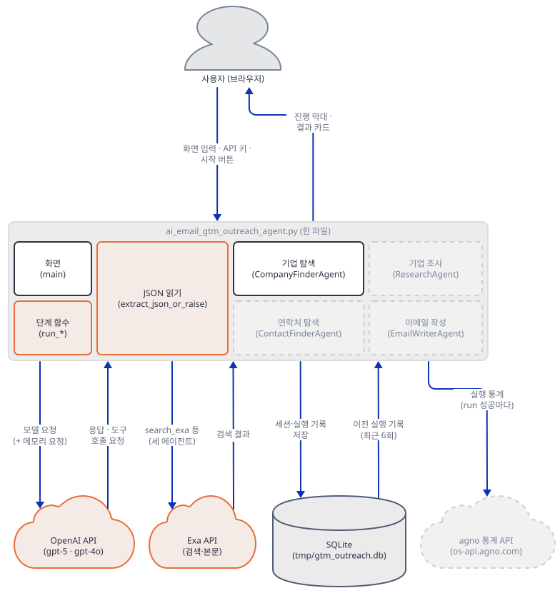

**확인.** 새 터미널(작업 폴더)에서 서버를 띄웁니다. 환경변수는 필요 없고 끝나면 Ctrl+C로 끕니다.

```bash
uv run --no-project python fake_openai.py
```

원래 터미널에서 먼저 모델 호출 없는 쪽을 봅니다.

```bash
uv run --no-project python stage_check.py parse
```

직접 확인한 출력입니다. 앞뒤에 말이 붙거나 울타리가 쳐진 JSON은 살아나지만, 앞쪽 말에 중괄호가 먼저 나오거나 JSON이 잘리면 예외입니다. 배열은 `dict`가 아닌 `list`로 읽히는데, 뒤의 `data.get(...)`은 `list`에 없는 메서드라 다른 오류가 됩니다(소스로 확인).

```
순수 JSON: {'companies': []}
앞뒤 말 + 울타리: {'companies': [{'name': 'A'}]}
JSON 앞에 중괄호가 든 말: JSONDecodeError: Expecting property name enclosed in double quotes: line 1 column 2 (char 1)
JSON 없는 말: ValueError: Failed to parse JSON: Expecting value: line 1 column 1 (char 0)
잘린 JSON: ValueError: Failed to parse JSON: Expecting ',' delimiter: line 1 column 60 (char 59)
JSON 배열: [{'name': 'A'}]
```

이제 모델 주소를 가짜 서버로 돌리고 에이전트를 실제로 부릅니다.

```bash
export OPENAI_BASE_URL=http://127.0.0.1:57391/v1
uv run --no-project python stage_check.py clamp
```

```powershell
$env:OPENAI_BASE_URL = "http://127.0.0.1:57391/v1"
uv run --no-project python stage_check.py clamp
```

직접 확인한 출력입니다. 가짜 서버는 늘 회사 둘을 돌려주므로 한 곳만 달라고 해도 둘이 오고, 앱이 하나로 자릅니다. 50곳을 달라고 해도 상한 10 안에서 받은 둘이 그대로입니다.

```
1 -> 1 ['Northwind Metrics']
2 -> 2 ['Northwind Metrics', 'Bluefin Retail Cloud']
50 -> 2 ['Northwind Metrics', 'Bluefin Retail Cloud']
```

서버 터미널에는 기업 탐색 에이전트의 요청 셋과 메모리 요청 셋이 찍힙니다(줄 순서는 실행마다 다릅니다. 메모리 요청은 Step 7). 기업 탐색 요청의 `roles`는 첫 번째가 `['developer', 'user']`, 두 번째가 `['developer', 'user', 'assistant', 'user']`, 세 번째가 `['developer', 'user', 'assistant', 'user', 'assistant', 'user']`입니다. `tools`는 모두 `['exa_answer', 'find_similar', 'get_contents', 'search_exa']`입니다(직접 확인). 같은 에이전트를 세 번 부르자 앞 호출의 대화가 다음 요청에 붙었습니다. `developer`는 agno가 시스템 메시지를 그렇게 내보내는 것입니다(agno 3.1.2 소스로 확인).

마지막으로 모델이 검색을 요청하는 경우입니다. 도우미 `drive.py`가 화면을 끝까지 돌리고, 세 에이전트의 Exa 클라이언트 호출을 로컬 대역으로 바꿔 진짜 Exa에는 아무것도 가지 않게 합니다. 키 끝에 `tool`을 붙이면 가짜 서버가 첫 요청에 `search_exa`를 부르라고 답합니다. 사이드바의 키가 `os.environ`을 덮으므로 키는 인자로 줍니다.

```python
# drive.py - Streamlit 서버 없이 화면을 끝까지 돌려 보는 AppTest 도우미. Exa 클라이언트는 로컬 대역으로 바꾼다.
#   python drive.py                   -> 정상 흐름
#   python drive.py key=sk-fake-bad   -> 인자: key(OpenAI 키) n(회사 수) style(이메일 스타일) wait(끝나고 기다릴 초)
import logging
import sys
import time

logging.disable(logging.WARNING)
import exa_py
from streamlit.testing.v1 import AppTest

args = dict(a.split("=", 1) for a in sys.argv[1:])


def stub_search(self, query, **kwargs):
    print("   [Exa 대역] search_and_contents", repr(query), kwargs, flush=True)
    page = type("Page", (), dict(url="https://northwind-metrics.example", title="Northwind Metrics", author="", published_date=None, text="stub page text"))()
    return type("Found", (), dict(results=[page]))()


exa_py.Exa.search_and_contents = stub_search     # 진짜 Exa에는 아무것도 보내지 않는다

at = AppTest.from_file("ai_email_gtm_outreach_agent.py", default_timeout=60).run()
at.sidebar.text_input[0].set_value(args.get("key", "sk-fake")).run()
at.sidebar.text_input[1].set_value("exa-fake").run()
at.text_area[0].set_value("Seed-stage B2B SaaS in the US").run()
at.text_area[1].set_value("We build data products").run()
at.number_input[0].set_value(int(args.get("n", 2))).run()
at.selectbox[0].set_value(args.get("style", "Professional")).run()
at.button[0].click().run()
print("예외:", [e.value for e in at.exception])
print("오류 상자:", [e.value for e in at.error])
print("소제목:", [s.value for s in at.subheader])
for e in at.expander:
    print("확장 상자:", e.label, "|", [t.value[:40] for t in e.text])
time.sleep(float(args.get("wait", 0)))           # 통계 전송 스레드가 끝날 때까지 기다린다
```

```bash
rm -rf tmp
uv run --no-project python drive.py key=sk-fake-tool
```

(`rm -rf tmp`는 이전 실행의 대화 기록을 지웁니다. 이유는 Step 7입니다. PowerShell은 `Remove-Item -Recurse -Force tmp`입니다.) 드라이버 쪽 첫 줄에 Exa 대역이 받은 호출이 찍힙니다(직접 확인).

```
   [Exa 대역] search_and_contents 'fast-growing SaaS analytics companies' {'text': True, 'summary': False, 'num_results': 2, 'category': 'company'}
```

서버에는 기업 탐색 요청이 둘 찍히고, 둘째의 `roles`에 `assistant`와 `tool`이 늘었습니다(`['developer', 'user', 'assistant', 'tool']`). `search_exa`가 Exa 클라이언트의 `search_and_contents(query, text=True, summary=False, num_results, category)`로 이어지고 `category="company"`는 공장 함수의 `ExaTools(category="company")`가 붙인 것입니다. 모델이 도구를 쓸지는 진짜 모델이 정하고 이 문서는 확인하지 못했습니다.

### Step 5. 연락처와 조사 — 앞 응답을 JSON으로 다음 프롬프트에 붙인다

**목적.** 둘째·셋째 단계가 앞 단계의 결과를 어떻게 받는지, 둘이 서로 독립인지 확인합니다.

**할 일.** 두 단계 함수입니다.

`advanced_ai_agents/multi_agent_apps/ai_email_gtm_outreach_agent/ai_email_gtm_outreach_agent.py:144-165`

```python
def run_contact_finder(agent: Agent, companies: List[Dict[str, str]], target_desc: str, offering_desc: str) -> List[Dict[str, Any]]:
    prompt = (
        "For each company below, find 2-3 relevant decision makers and emails (if available). Ensure at least 2 per company when possible, and cap at 3.\n"
        "If not available, infer likely email and mark inferred=true.\n"
        f"Targeting: {target_desc}\nOffering: {offering_desc}\n"
        f"Companies JSON: {json.dumps(companies, ensure_ascii=False)}\n"
        "Return JSON: {companies: [{name, contacts: [{full_name, title, email, inferred}]}]}"
    )
    resp: RunOutput = agent.run(prompt)
    data = extract_json_or_raise(str(resp.content))
    return data.get("companies", [])


def run_research(agent: Agent, companies: List[Dict[str, str]]) -> List[Dict[str, Any]]:
    prompt = (
        "For each company, gather 2-4 interesting insights from their website and Reddit that would help personalize outreach.\n"
        f"Companies JSON: {json.dumps(companies, ensure_ascii=False)}\n"
        "Return JSON: {companies: [{name, insights: [string, ...]}]}"
    )
    resp: RunOutput = agent.run(prompt)
    data = extract_json_or_raise(str(resp.content))
    return data.get("companies", [])
```

둘 다 회사 목록 전체를 JSON 문자열로 한 번에 붙이므로 에이전트 호출은 회사 수와 상관없이 한 번씩입니다. 조사 함수는 연락처 결과를 받지 않고 `companies`만 받습니다. 두 단계가 서로의 결과를 모르고, 둘이 만나는 곳은 이메일 단계입니다(Step 6). 프롬프트와 지시문은 서로 어긋나는 데가 있습니다. 프롬프트는 "2-3명, 최소 2명, 최대 3명"이고 에이전트의 지시문은 "1-2명"입니다(`ai_email_gtm_outreach_agent.py:146`과 53행, 소스로 확인). 화면은 앞 세 명까지만 보여 줍니다(330행). 어느 쪽을 따를지는 진짜 모델이 정하고 이 문서는 확인하지 못했습니다. 정상 흐름을 한 번 끝까지 돌립니다.

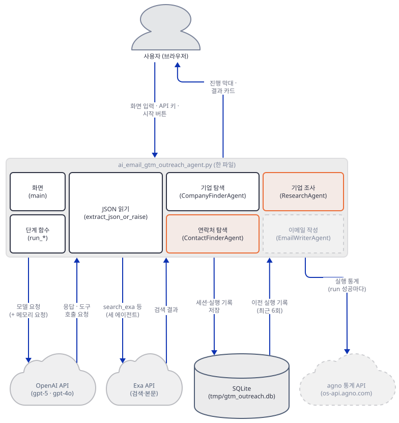

**확인.** 서버가 떠 있는 상태에서 새 캠페인을 돌립니다(`rm -rf tmp`는 Step 7에서 이유를 봅니다).

```bash
rm -rf tmp
uv run --no-project python drive.py
```

드라이버의 출력입니다(직접 확인).

```
예외: []
오류 상자: []
소제목: ['Top target companies', 'Contacts found', 'Research insights', 'Suggested Outreach Emails']
확장 상자: 1. Northwind Metrics → Dana Okafor | ['Hi Dana,\nSaw your self-serve tier. Open ']
확장 상자: 2. Bluefin Retail Cloud → Lee Park | ['Hi Lee,\nLoved your forecasting post.\nSar']
```

서버가 찍은 에이전트 요청 넷의 앞머리입니다(메모리 요청 줄은 뺐고, 줄 순서와 `user:` 줄 위치는 실행마다 조금 다릅니다).

```
CompanyFinderAgent | model=gpt-5 roles=['developer', 'user'] tools=['exa_answer', 'find_similar', 'get_contents', 'search_exa']
   user: Find exactly 2 companies that are a strong B2B fit given the user inputs. Targeting: Seed-stage B2B 
ContactFinderAgent | model=gpt-4o roles=['developer', 'user'] tools=['exa_answer', 'find_similar', 'get_contents', 'search_exa']
   user: For each company below, find 2-3 relevant decision makers and emails (if available). Ensure at least
ResearchAgent | model=gpt-5 roles=['developer', 'user'] tools=['exa_answer', 'find_similar', 'get_contents', 'search_exa']
   user: For each company, gather 2-4 interesting insights from their website and Reddit that would help pers
EmailWriterAgent | model=gpt-5 roles=['developer', 'user'] tools=[]
   user: Write personalized outreach emails for the following contacts. Sender: Sales Team at Our Company. Of
```

연락처 요청만 `gpt-4o`입니다. 앞 세 에이전트 모두 도구 넷을 싣고 이메일 작성 에이전트는 도구가 없습니다.

### Step 6. 이메일 작성 — 스타일과 한 번의 호출

**목적.** 이메일 에이전트가 무엇을 받고, 스타일이 어디로 들어가며, 어떤 조건에서 부르지 않는지 확인합니다.

**할 일.** 이메일 단계 함수와 스타일 사전입니다.

`advanced_ai_agents/multi_agent_apps/ai_email_gtm_outreach_agent/ai_email_gtm_outreach_agent.py:168-180`

```python
def run_email_writer(agent: Agent, contacts_data: List[Dict[str, Any]], research_data: List[Dict[str, Any]], offering_desc: str, sender_name: str, sender_company: str, calendar_link: Optional[str]) -> List[Dict[str, str]]:
    prompt = (
        "Write personalized outreach emails for the following contacts.\n"
        f"Sender: {sender_name} at {sender_company}.\n"
        f"Offering: {offering_desc}.\n"
        f"Calendar link: {calendar_link or 'N/A'}.\n"
        f"Contacts JSON: {json.dumps(contacts_data, ensure_ascii=False)}\n"
        f"Research JSON: {json.dumps(research_data, ensure_ascii=False)}\n"
        "Return JSON with key 'emails' as a list of {company, contact, subject, body}."
    )
    resp: RunOutput = agent.run(prompt)
    data = extract_json_or_raise(str(resp.content))
    return data.get("emails", [])
```

연락처 JSON과 조사 JSON이 한 프롬프트에 함께 들어가고, 모든 회사의 메일을 한 번의 호출로 한꺼번에 받습니다. 프롬프트가 연락처마다 메일을 요구하므로 회사 열 곳에 담당자가 셋씩이면 서른 명 몫이 한 응답에 담깁니다(소스로 확인. 진짜 모델이 그 길이를 한 번에 JSON으로 내는지는 확인하지 못했습니다). 스타일은 공장 함수가 지시문에 한 줄로 끼웁니다(62~69행, 72~91행). 호출 조건은 화면 쪽에 있습니다.

`advanced_ai_agents/multi_agent_apps/ai_email_gtm_outreach_agent/ai_email_gtm_outreach_agent.py:283-293`

```python
                # 4. Emails
                stage_msg.info("4/4 Writing personalized emails...")
                emails = run_email_writer(
                    email_agent,
                    contacts_data,
                    research_data,
                    offering_desc.strip(),
                    sender_name.strip() or "Sales Team",
                    sender_company.strip() or "Our Company",
                    calendar_link.strip() or None,
                ) if contacts_data else []
```

연락처가 하나도 없으면 이메일 에이전트는 아예 부르지 않습니다. 조사가 비어 있는 것은 상관없습니다.

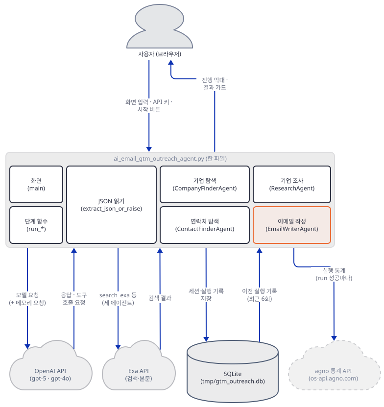

**확인.** 스타일 이름이 지시문에 닿는지 봅니다. 모르는 이름은 `Professional`로 떨어집니다.

```bash
uv run --no-project python -c "import logging; logging.disable(logging.WARNING); import ai_email_gtm_outreach_agent as app; [print(s, '->', app.create_email_writer_agent(s).instructions[1][:48]) for s in ('Cold', 'Casual', 'nope')]"
```

직접 확인한 출력입니다.

```
Cold -> Style: Cold email. Strong hook in opening 2 line
Casual -> Style: Casual. Friendly, approachable, first-nam
nope -> Style: Professional. Clear, respectful, and busi
```

앞 단계의 결과가 이메일 프롬프트에 실려 왔는지는 서버가 찍는 `연락처 JSON 포함: True | 조사 JSON 포함: True`로 확인됩니다(Step 5의 실행에서 직접 확인). 이제 연락처 에이전트가 빈 목록을 돌려주는 경우입니다. 키 끝에 `nocontacts`를 붙입니다.

```bash
rm -rf tmp
uv run --no-project python drive.py key=sk-fake-nocontacts
```

직접 확인한 출력은 이렇습니다. 오류 상자는 비어 있고 확장 상자가 없으며, 서버에는 `EmailWriterAgent` 요청이 찍히지 않습니다.

```
예외: []
오류 상자: []
소제목: ['Top target companies', 'Contacts found', 'Research insights', 'Suggested Outreach Emails']
```

소제목 넷은 그대로 나오고(결과 구역은 `results`가 있으면 그립니다) 이메일 칸은 "No emails generated" 안내가 됩니다(소스로 확인, 353~354행).

### Step 7. 기억과 기록 — 숨은 모델 호출, 대화 이어붙이기, 통계

**목적.** `enable_user_memories`·`add_history_to_context`·`SqliteDb`가 실제로 하는 일을 확인합니다. 이 앱의 가장 눈에 안 띄는 부분입니다.

**할 일.** 네 에이전트의 공통 인자를 다시 봅니다(Step 2의 발췌: `db=db`, 기억 켜기, `add_history_to_context=True`, `num_history_runs=6`, 고정 `session_id`). 이 인자들이 만드는 일은 소스와 실행으로 세 가지입니다. 첫째, 기억이 켜진 에이전트는 실행을 시작하면 배경 스레드에서 같은 입력 텍스트를 `add_memory`·`update_memory`·`delete_memory` 도구와 함께 모델에 따로 보냅니다(agno 3.1.2 `agno/agent/_run.py`, `_managers.start_memory_future`, 소스로 확인). 둘째, 세션은 `session_id`로 DB에 저장되고 `add_history_to_context`가 켜져 있어 같은 세션의 앞 6번 실행이 다음 요청의 `messages`에 붙습니다. 셋째, 에이전트가 성공할 때마다 agno가 익명 통계를 한 건 보냅니다.

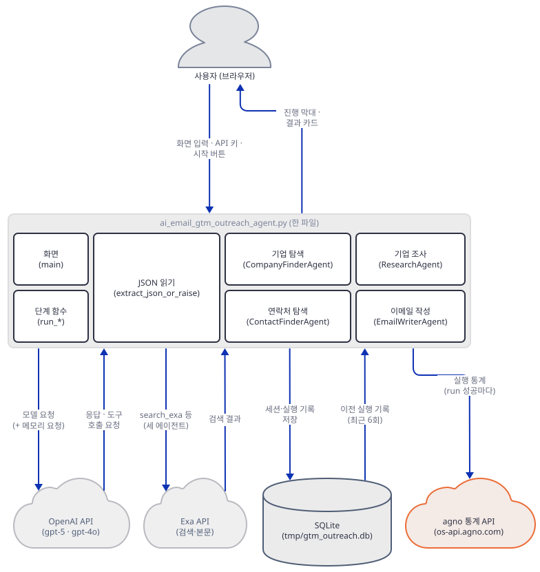

**확인.** 먼저 Step 5의 정상 실행에서 서버가 찍은 메모리 요청 줄을 세었습니다. 캠페인 한 번에 4건이었고(직접 확인) 모두 에이전트와 같은 모델이었습니다(`gpt-5` 셋, `gpt-4o` 하나). 한 줄은 이런 모양입니다.

```
메모리 관리자 | model=gpt-4o roles=['developer', 'user'] tools=['add_memory', 'delete_memory', 'update_memory']
```

가짜 서버는 도구를 부르지 않고 `ok`만 돌려주므로 기억이 저장되는 장면은 보지 못했습니다(DB에 기억 표도 안 생겼습니다, 직접 확인). 그러므로 캠페인 한 번의 모델 호출은 `4 + 4 = 8`번이 최소입니다. 둘째는 같은 작업 폴더에서 캠페인을 두 번 돌려 봅니다. 첫 실행 전에 `rm -rf tmp`를 했습니다.

```bash
rm -rf tmp
uv run --no-project python drive.py > /dev/null
uv run --no-project python drive.py > /dev/null
```

두 번째 실행에서 서버가 찍은 에이전트 요청 넷의 `roles`는 모두 `['developer', 'user', 'assistant', 'user']`였습니다(직접 확인). 첫 실행에서는 `['developer', 'user']`였습니다. 앞 캠페인의 프롬프트와 응답이 새 요청에 붙은 것이고, 프로세스가 달라도 DB 파일이 이어 줍니다. 작은 도우미 `db_check.py`로 DB를 봅니다.

```python
# db_check.py - tmp/gtm_outreach.db 안의 표와, 에이전트(세션)마다 쌓인 실행 수를 본다
import sqlite3

db = sqlite3.connect("tmp/gtm_outreach.db")
print([name for (name,) in db.execute("select name from sqlite_master where type = 'table'")])
for row in db.execute("select session_id, count(*) from agno_runs group by session_id order by session_id"):
    print(row)
```

```bash
uv run --no-project python db_check.py
```

직접 확인한 출력입니다(agno 3.1.2의 표 이름이고 버전이 달라지면 다를 수 있습니다).

```
['agno_sessions', 'agno_schema_versions', 'agno_runs']
('gtm_outreach_company_finder', 2)
('gtm_outreach_contact_finder', 2)
('gtm_outreach_email_writer', 2)
('gtm_outreach_researcher', 2)
```

`tmp/gtm_outreach.db`가 캠페인 사이에 이어지는 기록이라는 뜻입니다. 지우면(`rm -rf tmp`) 처음 상태입니다. 같은 폴더에서 계속 쓰면 요청이 점점 길어지고(최근 6번까지) 앞 캠페인의 회사 목록이 새 캠페인의 모델 입력에 들어갑니다. 반대로 Day 101의 `SqliteDb`는 만들기만 하고 DB 파일을 만들지 않았으니 같은 이름의 호출이지만 하는 일이 다릅니다. 셋째, 통계는 Day 047 Step 5가 다룬 그것과 같은 `POST /telemetry/runs`입니다. 이 앱에서 몇 건인지 로컬 수신기로 셉니다. agno는 `AGNO_API_RUNTIME=dev`가 있으면 통계 주소를 `http://localhost:7070`으로 바꿉니다(소스로 확인, `agno/api/settings.py`). 표준 라이브러리만 쓰는 수신기를 `recv.py`로 저장합니다.

```python
# recv.py - agno 통계 수신기: 받은 경로와 본문의 키만 찍는다 (표준 라이브러리만 씀)
import json
from http.server import BaseHTTPRequestHandler, ThreadingHTTPServer


class Handler(BaseHTTPRequestHandler):
    def log_message(self, *args):
        pass

    def do_POST(self):
        body = self.rfile.read(int(self.headers.get("content-length", 0)))
        print("받음:", self.command, self.path, list(json.loads(body)), flush=True)
        self.send_response(200)
        self.send_header("content-length", "2")
        self.end_headers()
        self.wfile.write(b"{}")


print("수신기: http://localhost:7070", flush=True)
ThreadingHTTPServer(("127.0.0.1", 7070), Handler).serve_forever()
```

새 터미널에서 `uv run --no-project python recv.py`를 띄우고, 통계를 끄지 않은 터미널에서 캠페인을 돌립니다. 통계 전송은 배경 스레드라서 끝나고 12초를 기다립니다(`wait=12`).

```bash
unset AGNO_TELEMETRY
rm -rf tmp
AGNO_API_RUNTIME=dev uv run --no-project python drive.py wait=12
```

```powershell
Remove-Item Env:AGNO_TELEMETRY
Remove-Item -Recurse -Force tmp
$env:AGNO_API_RUNTIME = "dev"; uv run --no-project python drive.py wait=12; Remove-Item Env:AGNO_API_RUNTIME
```

수신기 터미널에 같은 줄이 정확히 4건 찍혔습니다(직접 확인, `AGNO_TELEMETRY=false`를 걸고 같은 명령을 돌리면 0건).

```
받음: POST /telemetry/runs ['session_id', 'run_id', 'data', 'sdk_version', 'type']
```

에이전트 실행마다 한 건이지 회사 수에 따라 늘지 않습니다. 메모리 요청은 에이전트 실행이 아니라서 세지 않습니다. 확인이 끝나면 수신기를 끄고 `export AGNO_TELEMETRY=false`를 다시 겁니다. 그 밖에 기업 탐색·연락처·기업 조사 에이전트는 `debug_mode=True`입니다. 기업 탐색 에이전트를 한 번 부르자 터미널에 `DEBUG` 줄이 12개 찍혔고(직접 확인) 입력 텍스트 자체는 그 안에 없었습니다.

### Step 8. 보내지 않는다 — 발송 코드와 실패의 모양

**목적.** 이 앱이 메일을 보내는지, 실패가 화면에 어떻게 나타나는지 확인합니다.

**할 일.** 메일을 보낼 만한 모듈과 낱말을 파일에서 찾고, 쓰이지 않는 정의를 찾습니다. 앱 파일을 읽기만 합니다.

```bash
grep -n -i -E "smtp|sendmail|imap|requests|urllib|socket|subprocess|webbrowser|download|clipboard" ai_email_gtm_outreach_agent.py
grep -n -E "require_env|run_pipeline" ai_email_gtm_outreach_agent.py
```

```powershell
Select-String -Path ai_email_gtm_outreach_agent.py -Pattern "smtp|sendmail|imap|requests|urllib|socket|subprocess|webbrowser|download|clipboard"
Select-String -Path ai_email_gtm_outreach_agent.py -Pattern "require_env|run_pipeline"
```


**확인.** 첫 명령은 아무것도 찍지 않고 종료 코드 1입니다(직접 확인). 이 파일이 import하는 것은 `json`·`os`·`sys`·`typing`·`streamlit`·agno뿐이라(`ai_email_gtm_outreach_agent.py:1-11`) 메일은커녕 HTTP 요청을 직접 보내는 코드도 없습니다. 앱 README는 결과를 "download or copy"할 수 있다고 하지만 내려받기나 복사 코드가 없습니다(소스로 확인, 화면은 `st.write`·`st.text`·`st.expander`뿐). 둘째 명령은 이 두 줄만 찍습니다.

```
14:def require_env(var_name: str) -> None:
183:def run_pipeline(target_desc: str, offering_desc: str, sender_name: str, sender_company: str, calendar_link: Optional[str], num_companies: int):
```

둘 다 정의만 있고 부르는 곳이 없습니다. `require_env`는 키가 없으면 `sys.exit(1)`로 끝내는 함수이고 `run_pipeline`은 기업·연락처·조사 세 단계만 이어 부르고 `emails`는 빈 목록으로 돌려주는 함수인데, 화면은 단계를 직접 풀어 쓰고 이메일 단계도 거기서 합니다(소스로 확인). 실패의 모양은 틀린 키로 봅니다. 서버는 키가 `bad`로 끝나면 401을 돌려줍니다.

```bash
rm -rf tmp
uv run --no-project python drive.py key=sk-fake-bad
```

직접 확인한 출력입니다(터미널에 `ERROR` 줄도 나오지만 뺐습니다).

```
예외: []
오류 상자: ['Pipeline failed', 'Failed to parse JSON: Expecting value: line 1 column 1 (char 0)\nResponse was:\nIncorrect API key provided.']
소제목: []
```

agno의 `Agent.run()`이 모델 오류를 예외로 올리지 않고 오류 문장을 `.content`로 돌려주고, 앱은 그것을 JSON으로 읽으려다 실패합니다. 화면은 "Pipeline failed"와 함께 오류 문장이 낀 `ValueError`를 보여 줍니다(Day 101에서 본 것과 같은 agno 동작이지만, 이 앱은 응답을 JSON으로 읽기 때문에 "캠페인 완료"로 보이는 대신 실패로 드러납니다). 마지막으로 서버 터미널과 수신기를 끄고 `netstat`으로 57391·57392·7070이 비었는지 확인합니다.

## 요청 한 건이 흐르는 과정

버튼 한 번이 만드는 흐름을 아홉 장으로 나눠 그렸습니다. 한 장에 담으면 기업 탐색만 1,270px, 연락처·조사·이메일까지는 1,684px라 세로 상한 1,000px을 넘어(직접 렌더해 확인) 단계 경계에서 나눴습니다. 모델이 검색을 한 번 요청하는 경우를 그렸고, 진짜 모델이 그렇게 하는지는 키가 없어 보지 못했습니다. 기업 탐색(둘째~여섯째 장)은 에이전트 하나를 따라가고, 연락처·조사·이메일(일곱째~아홉째 장)은 검색 왕복을 뺀 모델 한 번의 경우만 그렸습니다. 기억·세션 저장·통계는 에이전트마다 기업 탐색과 같은 모양으로 따라붙습니다(Step 7).

1. **버튼을 누르면 `main`이 키와 두 설명을 검사하고, 빈 진행 막대를 그리고, 에이전트 넷을 만듭니다. 만들 때마다 `SqliteDb`가 한 번씩 생깁니다.**
   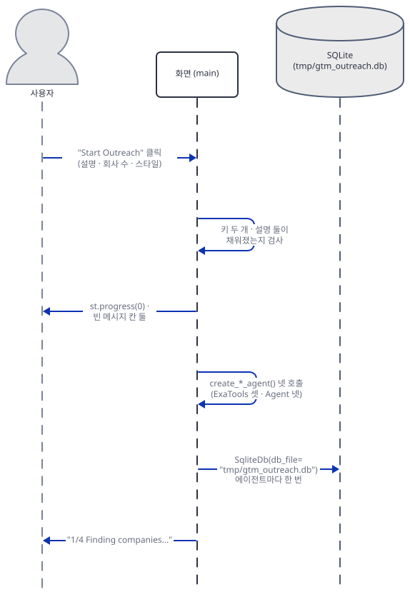
2. **`run_company_finder`가 기업 탐색 에이전트를 부르면 에이전트가 자기 세션을 DB에서 읽습니다.**
   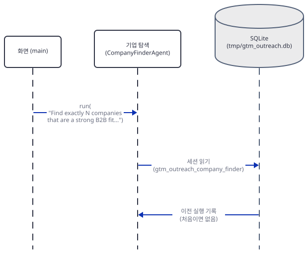
3. **에이전트가 메모리 요청을 배경 스레드로 보내고, 모델에 본 요청을 보내 검색 호출 요청을 받습니다.**
   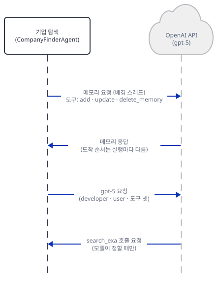
4. **에이전트가 Exa에서 검색합니다.**
   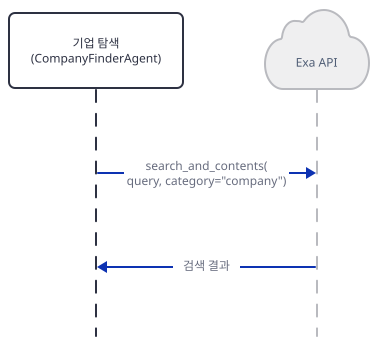
5. **검색 결과로 모델을 다시 불러 JSON 텍스트를 받습니다.**
   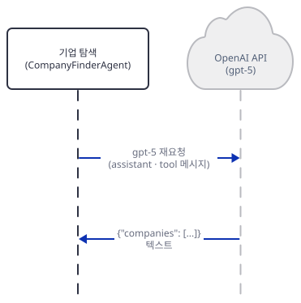
6. **에이전트가 세션을 저장하고 통계를 보내고, 응답이 `main`에 닿으면 JSON으로 읽어 회사 수를 자르고 진행 막대를 25%로 올립니다.**
   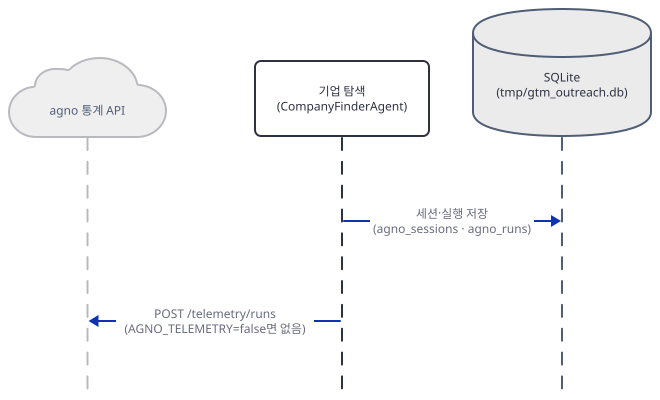
7. **연락처 에이전트가 `gpt-4o`로 연락처 JSON을 만들어 돌려주고 진행 막대가 50%가 됩니다.**
   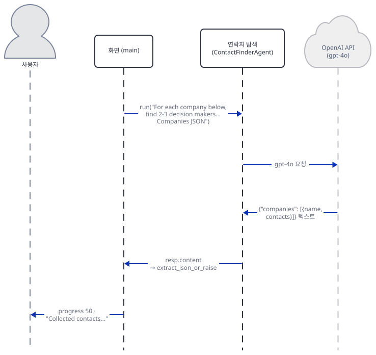
8. **기업 조사 에이전트가 조사 JSON을 만들어 돌려주고 75%가 됩니다.**
   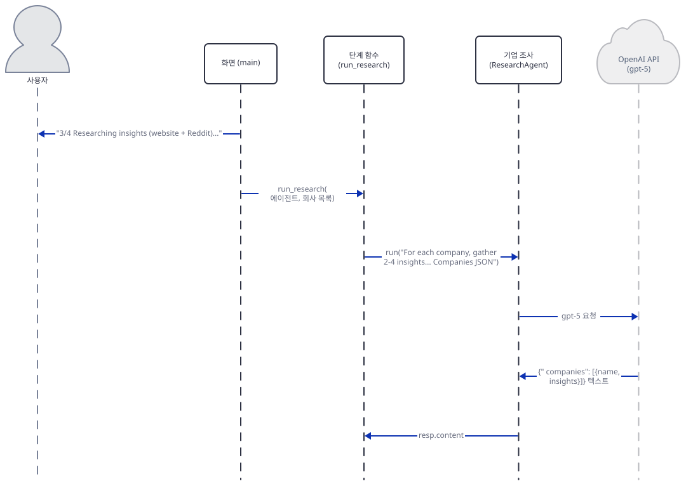
9. **이메일 작성 에이전트가 두 JSON을 한 프롬프트로 받아 메일 JSON을 돌려주고, 100%가 되며 결과 네 구역과 확장 상자가 그려집니다.**
   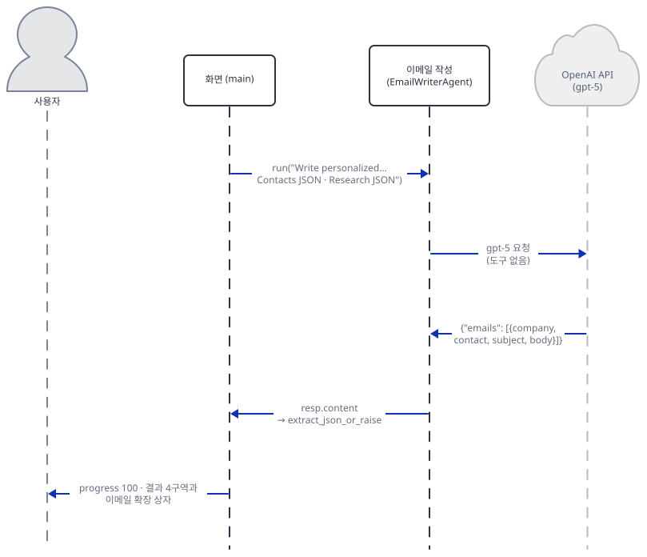

모델이 도구를 쓰지 않고 곧바로 답하면 3~5의 검색 왕복이 빠집니다. 그림에는 없지만 이 흐름과 별도로 에이전트 실행마다 통계 한 건이 나갑니다(Step 7).

## 실행 체크리스트

- [ ] `requirements.txt`만으로는 `sqlalchemy`가 없어 import가 막히고 `agno[sqlite]`를 더하면 통과한다는 것을 확인했다
- [ ] 원본 그대로는 에이전트를 만드는 순간 `enable_user_memories`에서 `TypeError`가 나고 복사본의 네 곳을 `update_memory_on_run`으로 바꾸면 에이전트 넷이 만들어진다는 것을 확인했다
- [ ] `ui_check.py`로 키 없이 누르면 키 오류, 키만 넣고 누르면 설명 오류가 난다는 것과 사이드바 키가 `os.environ`에 들어간다는 것을 확인했다
- [ ] `stage_check.py parse`로 앞뒤에 말이 붙은 JSON은 읽히고 앞쪽 중괄호나 잘린 JSON은 예외라는 것을 확인했다
- [ ] 한 곳만 달라고 해도 둘이 오면 하나로 잘린다는 것을 `stage_check.py clamp`로 확인했다
- [ ] 키 끝에 `tool`을 붙이면 `search_exa` 왕복이 일어나고 Exa 대역이 `category: 'company'`를 받는다는 것을 확인했다
- [ ] 정상 캠페인에서 에이전트 요청이 넷이고 연락처 요청만 `gpt-4o`라는 것, 이메일 요청에 두 JSON이 실렸다는 것을 확인했다
- [ ] 연락처가 비면 이메일 에이전트를 부르지 않는다는 것을 확인했다
- [ ] 캠페인 한 번에 메모리 요청이 4건 더 나가고, 두 번째 캠페인의 요청에 앞 대화가 붙으며, 통계는 4건이라는 것을 확인했다
- [ ] 메일 발송 코드가 없고 `require_env`·`run_pipeline`이 쓰이지 않는다는 것을 확인했다
- [ ] 틀린 키가 "Pipeline failed"와 오류 문장으로 드러나는 것을 확인했다
- [ ] 가짜 서버(57391), `streamlit run`(57392), 통계 수신기(7070)를 모두 껐다

## 문제 해결

| 증상 | 원인 | 해결 |
|---|---|---|
| 파일을 불러오는 순간 `ModuleNotFoundError: No module named 'sqlalchemy'` | 9행의 `agno.db.sqlite`가 `sqlalchemy`를 요구하는데 `requirements.txt`에 없다(직접 확인) | `uv pip install "agno[sqlite]"` |
| 에이전트를 만드는 순간 `TypeError: Agent.__init__() got an unexpected keyword argument 'enable_user_memories'` | agno 3.0.0부터 이 인자가 없다. `agno>=2.2.10`은 오늘 3.1.2로 풀린다(직접 확인) | 복사본의 네 곳(27·47·79·102행)을 `update_memory_on_run=True`로 바꾼다(Step 2) |
| agno를 3 미만으로 고정하면(`uv pip install "agno[sqlite]<3"`) 첫 에이전트 생성에서 `ImportError: The SQLAlchemy asyncio module requires that the Python 'greenlet' library is installed` | agno 2.9.0의 `sqlite` extra에는 `greenlet`이 없고 3.1.2의 extra는 `sqlalchemy[asyncio]`를 포함한다(2.9.0·3.1.2 메타데이터와 실행으로 직접 확인) | `uv pip install greenlet`을 더하면 원본 파일 그대로 캠페인이 끝까지 돈다(agno 2.9.0에서 직접 확인) |
| 화면 아래에 "Pipeline failed"와 `Failed to parse JSON: ... Response was: Incorrect API key provided.` | 키가 틀리면 agno가 오류 문장을 응답 내용으로 돌려주고 앱이 그것을 JSON으로 읽으려다 실패한다(가짜 서버의 401로 직접 확인) | 응답 문장을 읽어 원인을 본다. 키를 고친다 |
| "Pipeline failed"와 `JSONDecodeError: Expecting property name enclosed in double quotes` | 응답의 JSON 앞에 중괄호가 든 말이 먼저 나오면 첫 `{`부터 읽다 실패한다(`stage_check.py parse`로 직접 확인) | 진짜 모델에서는 같은 단계를 다시 돌린다. 앱 코드는 고치지 않는다 |
| 이메일 칸이 "No emails generated"이고 연락처도 비어 있다 | 연락처가 비면 이메일 에이전트를 부르지 않는다(268~293행, `nocontacts`로 직접 확인) | 대상 설명을 더 구체적으로 쓰고 다시 돌린다 |
| 두 번째 캠페인부터 요청이 길어지고 앞 캠페인의 회사가 모델 입력에 섞인다 | `SqliteDb`의 세션이 `tmp/gtm_outreach.db`에 남고 `add_history_to_context`가 앞 6번 실행을 붙인다(직접 확인) | 새 캠페인 전에 `tmp/`를 지운다. 실행한 폴더의 `tmp/`이므로 폴더를 바꾸면 기록도 바뀐다 |
| 캠페인 한 번에 OpenAI 호출이 에이전트 수의 두 배로 나간다 | 기억이 켜진 에이전트마다 메모리 요청이 따로 나간다(직접 확인: 4건) | 복사본에서 `update_memory_on_run`을 `False`로 바꾼다. 끄면 기억을 잃는다. 이 문서는 끈 채로 돌려 보지 않았다 |
| 앱 README가 결과를 내려받거나 복사할 수 있다고 한다 | 그런 코드가 없다(Step 8, 소스로 확인) | 화면에서 직접 선택해 복사한다 |
| `gpt-5` 호출이 2026-12-11 이후 막힐 수 있다 | 기본 스냅숏 `gpt-5-2025-08-07`이 OpenAI 폐기 표에 2026년 12월 11일 종료로 올라 있다. 별칭이 어느 스냅숏을 가리키는지는 표가 적지 않는다 | 복사본의 24·76·99행 모델 이름을 바꾼다(더 해보기). `gpt-5.6-sol`이 이 앱의 호출과 맞는지는 키가 없어 확인하지 못했다 |

## 더 해보기

- 복사본에서 기업 탐색 에이전트의 `add_history_to_context=True`(`advanced_ai_agents/multi_agent_apps/ai_email_gtm_outreach_agent/ai_email_gtm_outreach_agent.py:28`)를 `False`로 바꾸고 캠페인을 두 번 돌려, 두 번째 요청의 `roles`가 `['developer', 'user']`로 돌아오는지와 DB에 실행이 여전히 쌓이는지 보기
- `run_pipeline`(`advanced_ai_agents/multi_agent_apps/ai_email_gtm_outreach_agent/ai_email_gtm_outreach_agent.py:183-196`)은 세 단계를 묶어 부르고 이메일 단계는 빼고 `"emails": []`를 돌려줍니다. 복사본에서 그 함수를 이메일 단계까지 이어 붙이고 `main`의 단계 코드(`advanced_ai_agents/multi_agent_apps/ai_email_gtm_outreach_agent/ai_email_gtm_outreach_agent.py:250-302`)를 그 함수 호출 하나로 줄여, 진행 막대를 어디서 갱신할지 고민해 보기
- 복사본에서 `extract_json_or_raise`가 울타리 없이 앞쪽 중괄호가 든 응답도 읽도록 고치고(예: 마지막 `{`에서 거꾸로 후보를 시도), `stage_check.py parse`의 셋째 줄이 어떻게 달라지는지 보기

## 다음 날 예고

[Day 109 · AI Speech Trainer Agent](../day109-ai-speech-trainer-agent/README.md) — Streamlit 화면과 FastAPI 백엔드가 따로 도는 앱입니다. 발표 영상을 올리면 백엔드의 에이전트 다섯이 표정·음성·내용을 분석해 피드백을 돌려줍니다. 처음으로 화면과 백엔드를 두 프로세스로 나눠 읽습니다.
