# Day 109 · AI Speech Trainer Agent

> 볼륨 7 🚀 Advanced AI Agents · 난이도 ★★★ ⚠(앱이 쓰는 Together의 `meta-llama/Llama-3.3-70B-Instruct-Turbo-Free`는 2025-11-13에 내려갔고, 버전이 없는 `requirements.txt`는 오늘 `agno` 3.1.2와 `mediapipe` 1.1.0으로 풀려 코드가 import되지 않는다) · 예상 소요 120분(앱은 일곱 파일이지만 확인 스크립트 다섯을 만들어 돌리고, 텐서플로가 든 환경을 한 번 설치하고, 가짜 서버를 띄워 끝까지 한 번 돌려 보는 손 시간이 읽는 시간만큼 듭니다) · API 비용 대략 한 번에 $0.03 이하 — 유료 대체 모델 `Llama-3.3-70B-Instruct-Turbo`는 입력·출력 모두 $1.04/1M 토큰(https://www.together.ai/pricing, 2026-10-09 확인, 가격표에는 "Llama 3.3 70B"로 적혀 있음)이고, 요청 9건의 본문이 합쳐 52,625자(어림 입력 1.3만 토큰, 3초짜리 영상으로 가짜 서버가 받은 값)이며 출력 길이는 확인하지 못함. 이 문서의 가짜 서버 실험은 무료 · 원본 앱: `advanced_ai_agents/multi_agent_apps/ai_speech_trainer_agent`

## 오늘 만들 것

발표 연습을 찍은 mp4 한 개를 올리면 얼굴 표정, 목소리, 말 내용을 따로 분석해 점수와 조언을 보여 주는 발표 코치입니다. 프로세스가 둘입니다. Streamlit 화면(`frontend/`)이 영상을 임시 폴더에 저장하고 FastAPI 백엔드(`backend/`, 포트 8000)에 그 파일의 **경로**를 보냅니다. 백엔드는 agno `Team` 하나가 리더가 되어 멤버 에이전트 넷을 차례로 부립니다. 멤버 둘은 도구를 갖습니다. 얼굴 도구는 OpenCV로 프레임을 읽고 Mediapipe로 얼굴을 찾고 DeepFace로 감정을 맞히며, 음성 도구는 moviepy로 오디오를 뽑고 faster-whisper로 받아 적고 librosa로 속도·음높이·음량을 잽니다. 나머지 둘은 도구 없이 글만 쓰는 내용 분석과 채점 에이전트입니다. 다섯 모두 같은 Together 모델을 부르고, 결과는 JSON 7칸이 되어 화면으로 돌아옵니다.

직접 돌려 보고 알게 된 특이점이 다섯입니다. 첫째, 이 앱은 오늘 그대로는 import조차 되지 않습니다. 버전 없는 `agno`가 3.1.2로 풀리면 `show_tool_calls`·`RunResponse`가 없고, `mediapipe`가 1.1.0이나 0.10.35로 풀리면 도구가 부르는 `mp.solutions`가 없습니다(Step 1·2). 둘째, 모델 `meta-llama/Llama-3.3-70B-Instruct-Turbo-Free`는 Together의 공식 폐기 목록에 제거일 2025-11-13으로 올라 있어 실제 호출이 성공하리라고 보장할 수 없습니다(Step 4). 셋째, 음성 도구는 처음 부를 때 Hugging Face에서 484MB짜리 Whisper 모델을, 얼굴 도구는 처음 얼굴을 만났을 때 약 6MB의 DeepFace 가중치를 받습니다. 이 문서는 어느 쪽도 받지 않으며 오프라인 변수로 막은 채 실패하는 길을 봅니다(Step 2·3). 넷째, Whisper를 못 불러도 앱은 멈추지 않고 "Model failed to load…" 문장을 전사문 삼아 말 속도를 계산하고 그 위에 LLM 분석을 쌓습니다(Step 3). 다섯째, 업로드한 영상 사본은 임시 폴더에 남고(Step 6), 오디오가 없는 영상을 음성 도구에 주면 빈 `.mp3`가 남습니다(Step 3).

키가 없어도 Step 1~7이 모두 됩니다. 도구는 가짜 영상으로 직접 부르고, Together는 내 PC의 가짜 서버가 대신하며, 화면은 `AppTest`로 확인합니다. 이 문서를 만들며 Together·Hugging Face·GitHub·agno의 서버에 닿은 요청은 한 건도 없습니다. 그래서 문서에 나오는 점수와 조언은 가짜 서버의 고정 문장이고 어떤 평가의 근거도 아닙니다. 얼굴이 있는 영상으로 DeepFace가 감정을 맞히는 부분, 실제 Whisper 전사, 실제 Together 응답은 확인하지 못했습니다. 아래는 완성된 아키텍처입니다.

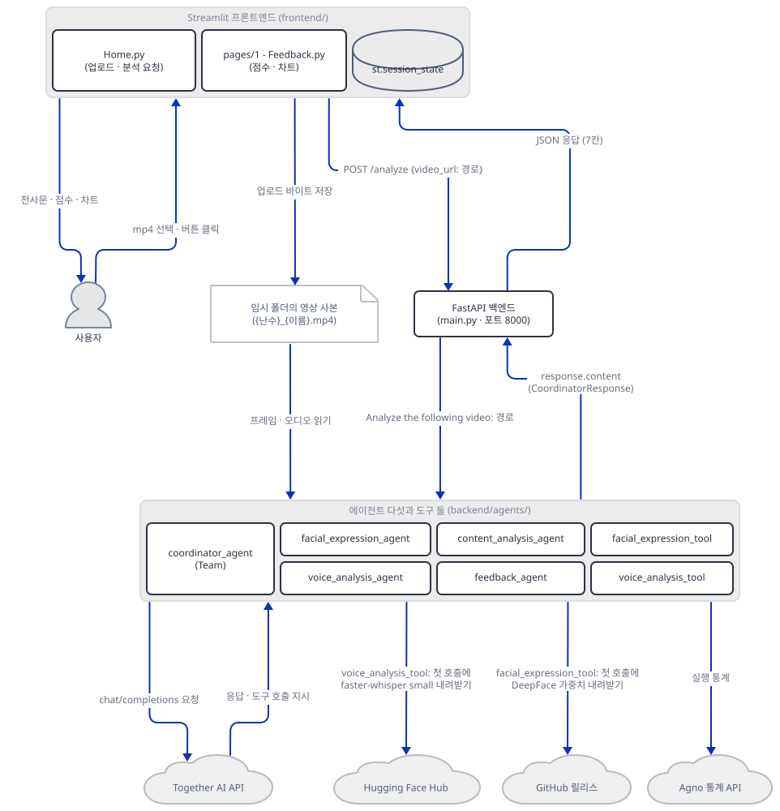

## 사전 준비

| 서비스/도구 | 용도 | 발급·설치 |
|---|---|---|
| uv | 가상환경 생성과 패키지 설치 | [공통 사전 준비](../README.md#공통-사전-준비-한-번만) 절 참고 |
| Python 3.12 | 이 저장소의 기준은 3.11~3.13이지만 오늘은 **3.12**를 씁니다. 코드가 부르는 `mediapipe.solutions`가 있는 `mediapipe==0.10.21`의 휠이 `cp39`~`cp312`뿐이라 3.13에서는 설치되지 않습니다(직접 확인: 3.13 환경에서 `--no-deps`로 시험하자 이 ABI 태그 목록과 함께 거부됨). 이 문서는 3.12.10으로 확인했습니다 | 공통 사전 준비와 같음. `uv venv --python 3.12`가 알아서 찾거나 받습니다 |
| 디스크 약 3GB | 가상환경이 텐서플로·OpenCV·ctranslate2 등 156개 패키지로 2.9GB입니다(직접 확인). 모델 캐시는 따로 없습니다 — 이 문서는 Whisper 484MB와 DeepFace 가중치를 받지 않습니다 | 별도 설치 없음 |
| Together API 키 | 원본 그대로 쓰려면 `TOGETHER_API_KEY`. 단, 앱의 무료 모델이 내려가 있어 유료 모델로 바꿔야 합니다(Step 4). 이 문서의 확인에는 필요 없습니다 | https://docs.together.ai 의 빠른 시작이 안내하는 API 키 화면(주소는 직접 열어 보지 못했음) |
| 인터넷 연결 | PyPI 설치. 앱을 실제로 쓸 때는 Together API(`api.together.xyz`), Hugging Face Hub(Whisper 모델), GitHub 릴리스(DeepFace 가중치), agno 통계 서버(`api.agno.com`)에 접속하고, 브라우저가 화면을 열 때 Streamlit 사용 통계가 나갑니다 | 별도 설치 없음 |
| 확인용 영상 | 이 문서는 스크립트로 3초짜리 회색 mp4 둘을 만듭니다. 얼굴이 없어서 DeepFace가 불리지 않습니다 | Step 2 |

이 문서의 스크립트는 한글을 출력하고 로그에 한글이 섞입니다. 한국어 Windows에서 출력을 파이프나 파일로 받으면 기본 인코딩(`cp949`)이 막힐 수 있으니 셸을 먼저 이렇게 맞춰 두세요(이 문서의 출력은 UTF-8로 받았습니다).

```bash
export PYTHONIOENCODING=utf-8
```

```powershell
$env:PYTHONIOENCODING = "utf-8"
```

## 아키텍처 한눈에 보기

| 컴포넌트 | 역할 | 코드 위치 |
|---|---|---|
| 사용자 (브라우저) | mp4를 고르고 버튼을 눌러 전사문·점수·차트를 본다 | 코드 없음 (외부 UI) |
| 홈 화면 (`Home.py`) | 업로드를 임시 폴더에 저장하고, 백엔드에 경로를 POST하고, 응답 네 칸을 세션에 담고, 전사문을 보여 준다 | `advanced_ai_agents/multi_agent_apps/ai_speech_trainer_agent/frontend/Home.py:45-143` |
| 피드백 화면 (`pages/1 - Feedback.py`) | 점수 다섯 막대·총점·평균·레이더 차트와 강점·약점·제안을 그린다 | `advanced_ai_agents/multi_agent_apps/ai_speech_trainer_agent/frontend/pages/1 - Feedback.py:8-127` |
| 세션 상태 (`st.session_state`) | `response`와 네 응답 문자열, `video_path`, `begin`, `upload_file` | `advanced_ai_agents/multi_agent_apps/ai_speech_trainer_agent/frontend/Home.py:12-42` |
| FastAPI 백엔드 (`main.py`) | `POST /analyze`가 `video_url` 문자열 하나를 받아 리더를 한 번 돌린다 | `advanced_ai_agents/multi_agent_apps/ai_speech_trainer_agent/backend/main.py:14-43` |
| 리더 (`coordinator_agent`) | agno `Team`(`mode="coordinate"`)으로 멤버 넷을 부리고 JSON 7칸(`CoordinatorResponse`)을 만든다 | `advanced_ai_agents/multi_agent_apps/ai_speech_trainer_agent/backend/agents/coordinator_agent.py:11-64` |
| 멤버 넷 | 얼굴·음성(도구 있음), 내용·채점(도구 없음) | `advanced_ai_agents/multi_agent_apps/ai_speech_trainer_agent/backend/agents/facial_expression_agent.py:11-41`, `advanced_ai_agents/multi_agent_apps/ai_speech_trainer_agent/backend/agents/voice_analysis_agent.py:12-36`, `advanced_ai_agents/multi_agent_apps/ai_speech_trainer_agent/backend/agents/content_analysis_agent.py:9-37`, `advanced_ai_agents/multi_agent_apps/ai_speech_trainer_agent/backend/agents/feedback_agent.py:9-52` |
| 얼굴 도구 | 프레임을 5개마다 하나 읽어 얼굴이 있으면 DeepFace 감정과 눈 뜸 정도를 센다 | `advanced_ai_agents/multi_agent_apps/ai_speech_trainer_agent/backend/agents/tools/facial_expression_tool.py:16-117` |
| 음성 도구 | 영상에서 오디오를 뽑아 전사하고 속도·음높이 변화·음량 일관성을 잰다 | `advanced_ai_agents/multi_agent_apps/ai_speech_trainer_agent/backend/agents/tools/voice_analysis_tool.py:13-135` |
| 임시 폴더의 영상 사본 | 홈 화면이 저장하고 두 도구가 읽는다. `Upload Video`를 누를 때만 지워진다 | `advanced_ai_agents/multi_agent_apps/ai_speech_trainer_agent/frontend/Home.py:66-81` |
| Together AI API | 다섯 에이전트가 같은 모델 ID로 `chat/completions`를 부른다 | `advanced_ai_agents/multi_agent_apps/ai_speech_trainer_agent/backend/agents/coordinator_agent.py:25` |
| Hugging Face Hub·GitHub 릴리스 | 음성 도구의 Whisper 모델, 얼굴 도구의 DeepFace 가중치를 처음 부를 때 받는다 | `advanced_ai_agents/multi_agent_apps/ai_speech_trainer_agent/backend/agents/tools/voice_analysis_tool.py:33`, `advanced_ai_agents/multi_agent_apps/ai_speech_trainer_agent/backend/agents/tools/facial_expression_tool.py:75` |
| Agno 통계 API | 에이전트·팀 실행이 끝날 때마다 익명 메타데이터를 보내려 한다 | 코드 없음 (agno 내부) |

위 그림은 에이전트 다섯과 도구 둘을 한 묶음으로 그렸습니다. 묶음 안의 호출을 하나하나 잇자 세로가 1,000px를 넘었기 때문입니다. 그 호출과 두 모델 내려받기가 누구에게서 나가는지는 아래 그림에 있습니다. 리더가 멤버에게 일을 넘기고 응답을 받으며, 얼굴·음성 에이전트만 자기 도구를 부르고, 영상 사본은 두 도구가 읽고, 모델 내려받기는 도구에서 나갑니다.

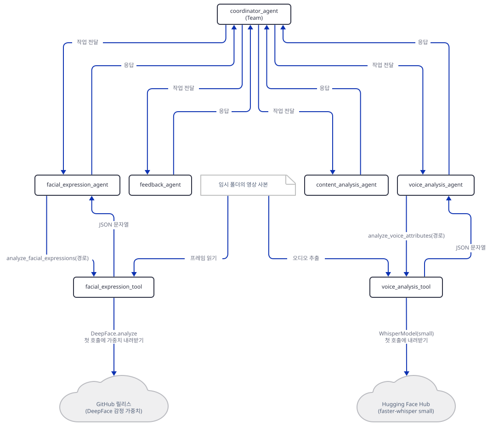

## 단계별 진행

### Step 1. 환경 만들기 — 버전 없는 `requirements.txt`가 오늘 깨뜨리는 것

**목적.** 앱 폴더에 독립 가상환경을 만들고, 코드가 import되는 버전으로 설치합니다.

**할 일.** 저장소 루트에서 시작합니다.

```bash
cd advanced_ai_agents/multi_agent_apps/ai_speech_trainer_agent
uv venv --python 3.12
uv pip install -r requirements.txt "agno<2" "mediapipe==0.10.21"
```

(pip 대안: bash는 `python3.12 -m venv .venv && source .venv/bin/activate && pip install -r requirements.txt "agno<2" "mediapipe==0.10.21"`입니다. PowerShell 5.1은 `&&`를 받지 않으므로(PowerShell 7부터 지원) 세 줄로 `py -3.12 -m venv .venv`, `.venv\Scripts\Activate.ps1`, `pip install -r requirements.txt "agno<2" "mediapipe==0.10.21"`를 차례로 씁니다. 실행해 보지 못했습니다.) 이후 `uv run`에는 모두 `--no-project`를 붙입니다. 이유는 [공통 사전 준비](../README.md#공통-사전-준비-한-번만)에 있습니다. 이 문서의 출력은 스크래치 가상환경의 `python`을 직접 불러 얻었고, 앱 폴더에서 `uv run --no-project python`이 그 폴더의 `.venv`를 집는 것은 따로 확인했습니다.

앱 폴더의 `requirements.txt`는 열여섯 줄이고 버전을 하나도 적지 않았습니다.

`advanced_ai_agents/multi_agent_apps/ai_speech_trainer_agent/requirements.txt:1-16`

```text
streamlit
pandas
plotly
opencv-python
tf-keras
deepface
mediapipe
agno
openai
requests
librosa
python-dotenv
moviepy
faster-whisper
fastapi
uvicorn
```

명령 끝의 두 제약이 필요한 까닭은 이렇습니다. 오늘(2026-10-09) Python 3.13.3에서 이 파일만으로 풀면 151개 패키지가 깔리고 `agno` 3.1.2, `mediapipe` 1.1.0, `streamlit` 1.65.0, `tensorflow` 2.21.0, `numpy` 2.5.3이 됩니다(직접 확인). 그 환경에서 백엔드를 import하면 에이전트 파일은 `TypeError: Agent.__init__() got an unexpected keyword argument 'show_tool_calls'`로, 리더 파일과 `main.py`는 `ImportError: cannot import name 'RunResponse' from 'agno.agent'`로 멈춥니다(직접 확인). 앱이 쓰던 인자와 클래스가 agno 2.0에서 바뀌었기 때문으로 보이며, 이 문서는 1.x 마지막인 1.8.4(`agno<2`)에서 코드가 그대로 import되는 것을 확인했습니다(직접 확인). `mediapipe`는 따로 문제입니다. 1.1.0과 0.10.35에는 `solutions`가 없어서 import는 되지만 도구가 불리는 순간 `AttributeError`가 납니다(Step 2). `solutions`가 있는 0.10.21이 3.12까지의 휠이라 파이썬도 3.12로 내립니다.

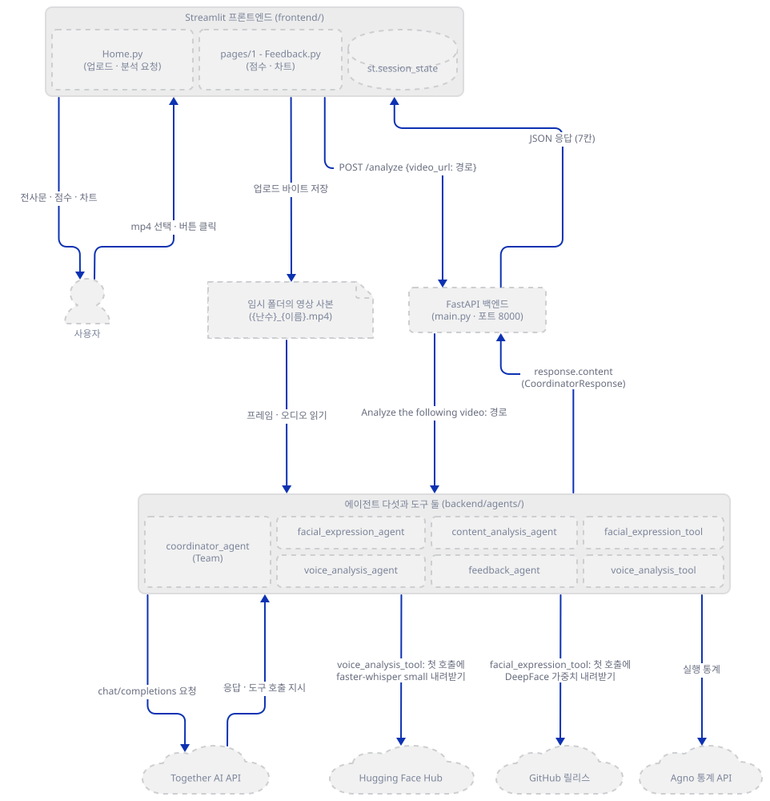

**확인.** 앱 폴더에서 설치된 버전을 봅니다.

```bash
uv pip list | grep -iE "^(agno|mediapipe|numpy|tensorflow|streamlit|fastapi|opencv-python|moviepy|faster-whisper|librosa|deepface) "
```

```powershell
uv pip list | Select-String -Pattern "^(agno|mediapipe|numpy|tensorflow|streamlit|fastapi|opencv-python|moviepy|faster-whisper|librosa|deepface)\s"
```

(PowerShell 줄은 실행해 보지 못했습니다.) 직접 확인한 출력은 이렇습니다. 열한 줄입니다.

```text
agno                      1.8.4
deepface                  0.0.101
fastapi                   0.143.0
faster-whisper            1.2.1
librosa                   0.11.0
mediapipe                 0.10.21
moviepy                   2.2.1
numpy                     1.26.4
opencv-python             4.11.0.86
streamlit                 1.60.0
tensorflow                2.19.1
```

(설치된 패키지는 모두 156개이고 가상환경은 2.9GB입니다. 내려받기를 포함한 첫 설치는 3.13 환경에서 이 PC 기준 56초였습니다.) 버전이 다르면 아래 출력도 조금 다를 수 있습니다.

### Step 2. 얼굴 도구 — 모델을 받기 전에 끝나는 길

**목적.** 얼굴 도구가 영상 **파일**을 읽는 방식과, 큰 가중치를 언제 받는지 확인합니다.

**할 일.** 도구는 agno의 `@tool` 데코레이터가 감싼 함수입니다.

`advanced_ai_agents/multi_agent_apps/ai_speech_trainer_agent/backend/agents/tools/facial_expression_tool.py:16-27`

```python
@tool(
    name="analyze_facial_expressions",              # Custom name for the tool (otherwise the function name is used)
    description="Analyzes facial expressions to detect emotions and engagement.",  # Custom description (otherwise the function docstring is used)
    show_result=True,                               # Show result after function call
    stop_after_tool_call=True,                      # Return the result immediately after the tool call and stop the agent
    pre_hook=log_before_call,                       # Hook to run before execution
    post_hook=log_after_call,                       # Hook to run after execution
    cache_results=False,                            # Enable caching of results
    cache_dir="/tmp/agno_cache",                    # Custom cache directory
    cache_ttl=3600                                  # Cache TTL in seconds (1 hour)
)
def analyze_facial_expressions(video_path: str) -> dict:
```

`stop_after_tool_call=True`는 도구가 부르면 모델에게 다시 묻지 않고 그 결과를 곧 에이전트의 응답으로 삼는다는 뜻입니다(Step 5에서 요청 수로 확인합니다). `cache_results=False`라서 `cache_dir`의 `/tmp/agno_cache`는 쓰이지 않습니다. 본문은 파일을 열어 프레임을 5개마다 하나씩 읽습니다.

`advanced_ai_agents/multi_agent_apps/ai_speech_trainer_agent/backend/agents/tools/facial_expression_tool.py:37-50`

```python
    mp_face_mesh = mp.solutions.face_mesh
    face_mesh = mp_face_mesh.FaceMesh(static_image_mode=False, max_num_faces=1)
    cap = cv2.VideoCapture(video_path)

    emotion_timeline = []
    eye_contact_count = 0
    smile_count = 0
    frame_count = 0
    fps = cap.get(cv2.CAP_PROP_FPS)

    # Process every nth frame for performance optimization
    frame_interval = 5

    while cap.isOpened():
```

`cv2.VideoCapture(video_path)`에 문자열 경로를 주므로 카메라 장치는 열지 않습니다. 감정은 얼굴이 **잡힌 프레임에서만** 구합니다.

`advanced_ai_agents/multi_agent_apps/ai_speech_trainer_agent/backend/agents/tools/facial_expression_tool.py:62-86`

```python
        results = face_mesh.process(rgb_frame)

        if results.multi_face_landmarks:
            for face_landmarks in results.multi_face_landmarks:
                # Extract landmarks
                landmarks = face_landmarks.landmark

                # Convert landmarks to pixel coordinates
                h, w, _ = frame.shape
                landmark_coords = [(int(lm.x * w), int(lm.y * h)) for lm in landmarks]

                # Emotion Detection using DeepFace & Smile Detection
                try:
                    analysis = DeepFace.analyze(frame, actions=['emotion'], enforce_detection=False)
                    emotion = analysis[0]['dominant_emotion']
                    if emotion == "happy":
                        smile_count += 1

                    timestamp = frame_count / fps
                    # convert timestamp into seconds
                    timestamp = round(timestamp, 2)
                    emotion_timeline.append({"timestamp": timestamp, "emotion": emotion})
                except Exception as e:
                    print(f"Error analyzing frame: {e}")
                    continue
```

`DeepFace.analyze`는 처음 부를 때 감정 모델의 가중치를 받습니다. 소스(deepface 0.0.101의 `deepface/models/demography/Emotion.py`와 `deepface/commons/weight_utils.py`)가 가리키는 곳은 GitHub 릴리스의 `facial_expression_model_weights.h5`이고 크기는 5,977,392바이트(GitHub 릴리스 API가 돌려준 값)이며 저장 위치는 `~/.deepface/weights/`입니다(`DEEPFACE_HOME`을 주면 그 아래). 그런데 `import deepface`만으로도 그 빈 폴더가 만들어지고, 텐서플로가 `~/.keras/keras.json`을 씁니다(직접 확인: 홈을 스크래치로 돌린 환경에서 두 경로가 생기고 `weights/` 안은 비어 있음). 눈 뜸 정도는 눈꺼풀 랜드마크 사이 거리가 5픽셀을 넘으면 시선이 맞은 것으로 치는 어림입니다(`advanced_ai_agents/multi_agent_apps/ai_speech_trainer_agent/backend/agents/tools/facial_expression_tool.py:88-102`).

확인용 영상을 만듭니다. 얼굴이 없는 회색 화면이라 Mediapipe가 얼굴을 못 찾고, 그래서 이 확인에서는 `DeepFace.analyze`가 한 번도 불리지 않습니다. 이 파일은 앱 폴더에 둡니다.

```python
# 확인용 mp4 둘을 만든다: 얼굴 없는 회색 화면. silent.mp4는 소리 없음, tone.mp4는 3초짜리 440 Hz 소리.
import sys
import numpy as np
import cv2
from moviepy import ColorClip, AudioArrayClip

out = sys.argv[1]
w = cv2.VideoWriter(f"{out}/silent.mp4", cv2.VideoWriter_fourcc(*"mp4v"), 10, (320, 240))
for _ in range(30):
    w.write(np.full((240, 320, 3), 128, np.uint8))
w.release()

sr = 16000
t = np.linspace(0, 3, 3 * sr, endpoint=False)
tone = (0.3 * np.sin(2 * np.pi * 440 * t)).astype(np.float32)
audio = AudioArrayClip(np.stack([tone, tone], axis=1), fps=sr)
clip = ColorClip((320, 240), color=(128, 128, 128), duration=3).with_fps(10).with_audio(audio)
clip.write_videofile(f"{out}/tone.mp4", codec="libx264", audio_codec="aac", logger=None)
print("done")
```

```bash
mkdir media
uv run --no-project python make_media.py media
```

```powershell
mkdir media
uv run --no-project python make_media.py media
```

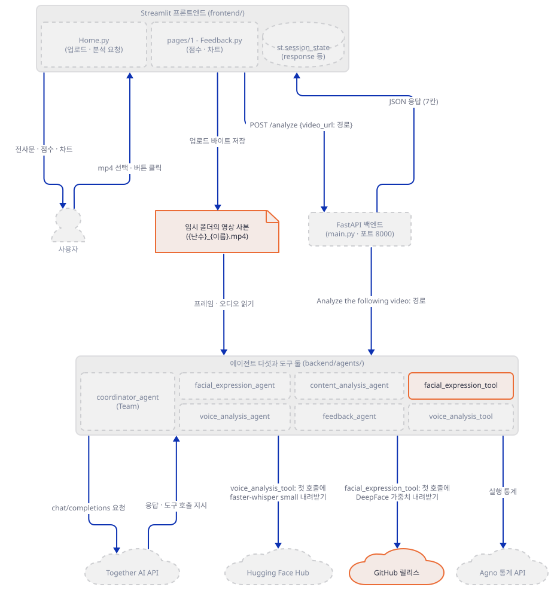

**확인.** 확인 스크립트는 `backend/`에 두고 `backend/`에서 돌립니다. `agents`를 import해야 하기 때문입니다. 첫 줄이 Hugging Face를 오프라인으로 못 박아 두므로 Step 3의 명령까지 같은 파일로 안전하게 돌 수 있습니다. 여기서는 얼굴 도구 부분만 봅니다.

```python
# backend/ 에 두고 backend/ 에서 실행한다. 도구 둘을 모델 내려받기 없이 돌려 본다.
import os
os.environ["HF_HUB_OFFLINE"] = "1"   # Hugging Face에서 모델을 받지 못하게 막는다
import sys
import tempfile
from agents.tools.facial_expression_tool import analyze_facial_expressions as facial
from agents.tools.voice_analysis_tool import analyze_voice_attributes as voice

media = sys.argv[1]
tmp = tempfile.gettempdir()
def mp3s():
    return {f for f in os.listdir(tmp) if f.endswith(".mp3")}

print("== 얼굴 도구, tone.mp4")
print(facial.entrypoint(f"{media}/tone.mp4"))

print("== 음성 도구, tone.mp4")
before = mp3s()
print(voice.entrypoint(f"{media}/tone.mp4"))
print("새로 남은 .mp3:", sorted(mp3s() - before))

print("== 음성 도구, silent.mp4 (오디오 트랙 없음)")
before = mp3s()
try:
    voice.entrypoint(f"{media}/silent.mp4")
except Exception as e:
    print("예외:", type(e).__name__, e)
left = sorted(mp3s() - before)
print("새로 남은 .mp3:", [(f, os.path.getsize(os.path.join(tmp, f))) for f in left])
print("원본 영상 둘이 그대로 있다:", sorted(os.listdir(media)))
```

```bash
cd backend
uv run --no-project python check_tools.py ../media
```

처음 돌 때는 텐서플로의 `oneDNN custom operations are on` 안내와 DeepFace의 `DEPRECATION WARNING` 상자가 먼저 나옵니다(직접 확인, 무해합니다). 얼굴 도구 줄은 이렇게 나옵니다. 위 스크립트의 나머지 출력은 Step 3에서 봅니다.

```text
== 얼굴 도구, tone.mp4
{"emotion_timeline": [], "engagement_metrics": {"eye_contact_frequency": 0.0, "smile_frequency": 0.0}}
```

빈 `emotion_timeline`과 0.0은 얼굴이 없는 영상에서 나온 값입니다. 얼굴이 있는 영상으로 감정이 채워지는 모습은 가중치를 받아야 해서 확인하지 못했습니다. 파이썬 3.13 환경(`mediapipe` 0.10.35)에서 같은 도구를 부르면 agno가 오류를 잡아 `ERROR Error in tool 'analyze_facial_expressions': AttributeError("module 'mediapipe' has no attribute 'solutions'")`를 찍고 도구가 실패합니다(직접 확인).

### Step 3. 음성 도구 — 484MB를 받지 못하면 어떻게 이어지는가

**목적.** 음성 도구가 영상에서 오디오를 뽑는 길, Whisper 모델을 받는 시점, 임시 파일을 지우는 규칙을 확인합니다.

**할 일.** 확장자가 `.mp4`면 오디오를 임시 `.mp3`로 뽑고, 아니면 받은 경로를 그대로 씁니다.

`advanced_ai_agents/multi_agent_apps/ai_speech_trainer_agent/backend/agents/tools/voice_analysis_tool.py:93-105`

```python
    # Determine file extension
    _, ext = os.path.splitext(file_path)
    ext = ext.lower()

    # If the file is a video, extract audio
    if ext in ['.mp4']:
        with tempfile.NamedTemporaryFile(suffix='.mp3', delete=False) as temp_audio_file:
            audio_path = extract_audio_from_video(file_path, temp_audio_file.name)
    else:
        audio_path = file_path

    # Transcribe audio
    transcription = transcribe_audio(audio_path)
```

`NamedTemporaryFile(..., delete=False)`는 파일을 만들어 두고 지우지 않습니다. 이 파일은 126~128행의 `os.remove(audio_path)`가 지우는데, 그 앞 어디선가 예외가 나면 거기에 이르지 못합니다. 전사는 이 함수가 부릅니다.

`advanced_ai_agents/multi_agent_apps/ai_speech_trainer_agent/backend/agents/tools/voice_analysis_tool.py:31-37`

```python
def load_whisper_model():
    try:
        model = WhisperModel("small", device="cpu", compute_type="int8")
        return model
    except Exception as e:
        print(f"Error loading Whisper model: {e}")
        return None
```

`WhisperModel("small", ...)`은 Hugging Face Hub의 `Systran/faster-whisper-small`을 받습니다(소스로 확인: faster-whisper 1.2.1의 모델 표). 그 저장소의 `model.bin`은 484MB이고 전체가 486MB입니다(Hugging Face 파일 목록의 표시값). 캐시는 `~/.cache/huggingface/hub`이며 `HF_HOME`으로 옮깁니다. 이 문서는 `HF_HUB_OFFLINE=1`로 받기를 막습니다. 받지 못하면 `except`가 오류를 찍고 `None`을 돌려주고, `transcribe_audio`는 그 `None`을 보고 오류 문장을 **전사문으로** 돌려줍니다.

`advanced_ai_agents/multi_agent_apps/ai_speech_trainer_agent/backend/agents/tools/voice_analysis_tool.py:46-51`

```python
    if not audio_file or not os.path.exists(audio_file):
        return "No audio file exists at the specified path."

    model = load_whisper_model()
    if not model:
        return "Model failed to load. Please check system resources or model path."
```

뒤의 코드는 이 문장을 진짜 전사문처럼 단어로 쪼개 속도를 셉니다. 아래 확인에서 이 일이 일어납니다. 끝으로 임시 파일을 지우는 곳입니다.

`advanced_ai_agents/multi_agent_apps/ai_speech_trainer_agent/backend/agents/tools/voice_analysis_tool.py:126-128`

```python
    # Clean up temporary audio file if created
    if ext in ['.mp4']:
        os.remove(audio_path)
```

앱 전체에서 파일을 지우는 줄은 이 한 줄과 홈 화면의 `os.remove`(Step 6) 둘뿐입니다(`grep`으로 직접 확인). 이 줄이 지우는 것은 `.mp4`일 때 만든 임시 `.mp3`이고 사용자의 영상이 아닙니다.

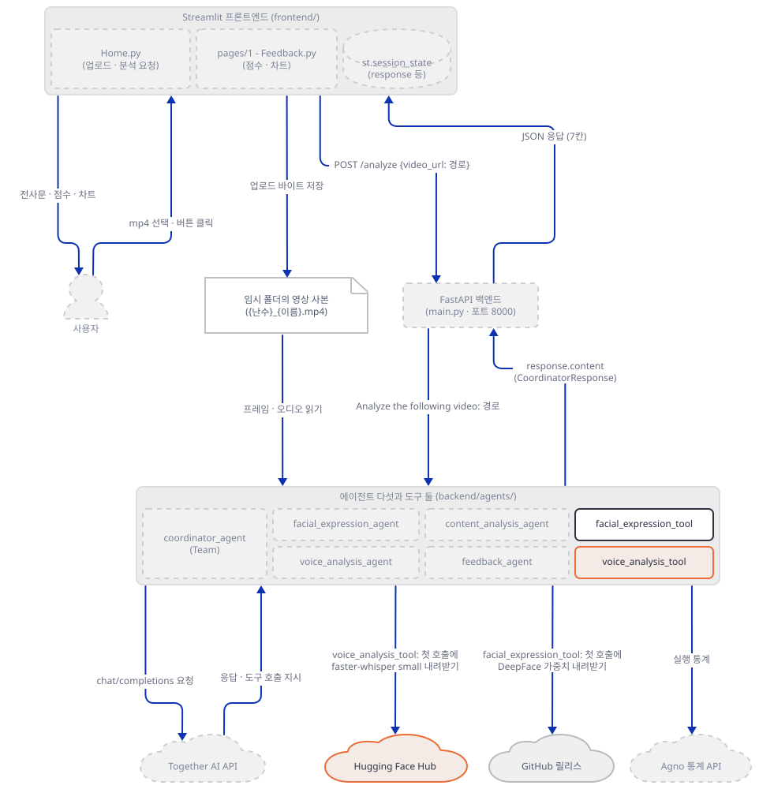

**확인.** Step 2의 같은 명령을 다시 보되 이번에는 나머지 줄을 봅니다. 출력은 직접 확인한 것입니다(경로와 임시 파일 이름은 매번 다릅니다).

```text
== 음성 도구, tone.mp4
MoviePy - Writing audio in C:\...\tmp25yzljb3.mp3
Error loading Whisper model: Cannot find an appropriate cached snapshot folder for the specified revision on the local disk and outgoing traffic has been disabled. To enable repo look-ups and downloads online, set 'HF_HUB_OFFLINE=0' as environment variable.
{"transcription": "Model failed to load. Please check system resources or model path.", "speech_rate_wpm": "220.0", "pitch_variation": "0.03", "volume_consistency": "0.0075"}
새로 남은 .mp3: []
```

전사문 자리에 오류 문장이 들어갔고, 그 열한 단어를 3초로 나눠 말 속도가 `220.0`이 되었습니다. 임시 `.mp3`는 정상 경로에서는 지워졌습니다. 이어지는 둘째 확인은 오디오 트랙이 없는 `silent.mp4`입니다.

```text
== 음성 도구, silent.mp4 (오디오 트랙 없음)
ERROR    Error in tool 'analyze_voice_attributes': AttributeError("'NoneType' object has no attribute 'write_audiofile'")
예외: AttributeError 'NoneType' object has no attribute 'write_audiofile'
새로 남은 .mp3: [('tmpuol5qggu.mp3', 0)]
```

임시 파일을 만든 직후 `extract_audio_from_video`가 `audio_clip = None`에서 죽어서 0바이트 `.mp3`가 임시 폴더에 남았습니다. 원본 영상 둘은 그대로입니다. agno는 이 예외를 잡아 위 `ERROR` 줄을 찍고 도구 호출을 실패로 처리합니다(로그에 `Could not run function`도 찍힘, 직접 확인). 그 뒤 모델에게 무엇이 전해지고 리더가 어떻게 이어 가는지는 가짜 서버로 만들어 보지 못했습니다. 이 누수를 막는 법은 더 해보기에 있습니다.

### Step 4. 에이전트 다섯과 Together 모델

**목적.** 에이전트 다섯의 구성, 모델 ID와 키가 들어가는 자리, 모델이 내려간 사실을 확인합니다.

**할 일.** 멤버 하나는 이렇게 만들어집니다. 도구를 가진 얼굴 에이전트입니다.

`advanced_ai_agents/multi_agent_apps/ai_speech_trainer_agent/backend/agents/facial_expression_agent.py:11-19`

```python
facial_expression_agent = Agent(
    name="facial-expression-agent",
    model=Together(id="meta-llama/Llama-3.3-70B-Instruct-Turbo-Free", api_key=os.getenv("TOGETHER_API_KEY")),
    tools=[facial_expression_tool],
    description=
    '''
        You are a facial expression agent that will analyze facial expressions in videos to detect emotions and engagement.
        You will return the emotion timeline and engagement metrics.
    ''',
```

`Together(id=..., api_key=os.getenv("TOGETHER_API_KEY"))`가 에이전트마다 따로 만들어집니다. 다섯 파일에 같은 모델 ID가 다섯 번 적혀 있습니다(`advanced_ai_agents/multi_agent_apps/ai_speech_trainer_agent/backend/agents/coordinator_agent.py:25`, `advanced_ai_agents/multi_agent_apps/ai_speech_trainer_agent/backend/agents/facial_expression_agent.py:13`, `advanced_ai_agents/multi_agent_apps/ai_speech_trainer_agent/backend/agents/voice_analysis_agent.py:14`, `advanced_ai_agents/multi_agent_apps/ai_speech_trainer_agent/backend/agents/content_analysis_agent.py:12`, `advanced_ai_agents/multi_agent_apps/ai_speech_trainer_agent/backend/agents/feedback_agent.py:12`). 리더는 `Team`입니다.

`advanced_ai_agents/multi_agent_apps/ai_speech_trainer_agent/backend/agents/coordinator_agent.py:22-27`

```python
coordinator_agent = Team(
    name="coordinator-agent",
    mode="coordinate",
    model=Together(id="meta-llama/Llama-3.3-70B-Instruct-Turbo-Free", api_key=os.getenv("TOGETHER_API_KEY")),
    members=[facial_expression_agent, voice_analysis_agent, content_analysis_agent, feedback_agent],
    description="You are a public speaking coach who helps individuals improve their presentation skills through feedback and analysis.",
```

`advanced_ai_agents/multi_agent_apps/ai_speech_trainer_agent/backend/agents/coordinator_agent.py:54-64`

```python
    add_datetime_to_instructions=True,
    add_member_tools_to_system_message=False,  # This can be tried to make the agent more consistently get the transfer tool call correct
    enable_agentic_context=True,  # Allow the agent to maintain a shared context and send that to members.
    share_member_interactions=True,  # Share all member responses with subsequent member requests.
    show_members_responses=True,
    response_model=CoordinatorResponse,
    use_json_mode=True,
    markdown=True,
    show_tool_calls=True,
    debug_mode=True
)
```

`response_model`과 `use_json_mode=True`가 리더의 마지막 답을 `CoordinatorResponse`(`advanced_ai_agents/multi_agent_apps/ai_speech_trainer_agent/backend/agents/coordinator_agent.py:12-19`)의 일곱 칸으로 만들게 합니다. `debug_mode=True`는 모든 요청과 응답을 로그에 찍습니다. 아래 두 사실은 agno 1.8.4의 소스로 확인했습니다. 첫째, `Together`의 `base_url`은 클래스 기본값 `https://api.together.xyz/v1`이고 환경변수로 바꾸는 길이 없습니다. 둘째, `api_key`가 비어 있으면 `OPENAI_API_KEY`를 대신 씁니다. 그래서 `TOGETHER_API_KEY` 없이 `OPENAI_API_KEY`만 있는 셸에서 앱을 띄우면 OpenAI 키가 Together 주소로 나갑니다. 가짜 키로 클라이언트 설정만 만들어 보면 됩니다. 요청은 보내지 않습니다.

```bash
OPENAI_API_KEY=sk-fake-not-a-key uv run --no-project python -c "from agno.models.together import Together; p = Together(id='x', api_key=None)._get_client_params(); print(p['base_url'], p['api_key'])"
```

```powershell
$env:OPENAI_API_KEY = "sk-fake-not-a-key"
uv run --no-project python -c "from agno.models.together import Together; p = Together(id='x', api_key=None)._get_client_params(); print(p['base_url'], p['api_key'])"
```

(PowerShell 줄은 실행해 보지 못했습니다. 끝나면 `Remove-Item Env:OPENAI_API_KEY`.) 직접 확인한 출력은 이렇습니다.

```text
https://api.together.xyz/v1 sk-fake-not-a-key
```

**모델이 내려갔습니다.** Together의 폐기 문서(https://docs.together.ai/docs/deprecations, 2026-10-09 확인)의 추론 표는 머리가 `| Removal date | Model | Supported by on-demand dedicated endpoints |`이고, 한 줄이 `| 2025-11-13 | meta-llama/Llama-3.3-70B-Instruct-Turbo-Free | No |`입니다. 같은 날 본 서버리스 모델 목록(https://docs.together.ai/docs/serverless-models)에는 `-Free`가 없고 `meta-llama/Llama-3.3-70B-Instruct-Turbo`가 있으며 폐기 표에는 이 유료 모델의 줄이 없습니다. 이 문서는 키가 없어 실제 호출이 어떤 오류를 돌려주는지는 보지 못했습니다. 쓰려면 다섯 파일의 ID에서 `-Free`를 지워 키를 넣어야 하고(더 해보기), 앱 README의 "small token limit" 한계 문구도 그 무료 모델 기준입니다.

agno의 익명 통계는 Day 047 Step 5가 3.0.10 기준으로 다뤘습니다. 이 앱의 1.8.4는 에이전트·팀 실행이 끝날 때마다 `https://api.agno.com`의 `/v1/telemetry/...`로 보내려 하고(소스로 확인: `agno/api/agent.py`, `agno/cli/settings.py`), `AGNO_TELEMETRY=false`가 이를 끕니다. 통계를 끄지 않고 프록시만 막아 둔 채 Step 5처럼 돌렸을 때 로그에 `Could not create Agent run`이 네 번, `Could not create Team run`이 한 번 찍혔습니다(직접 확인, 모두 연결 거부로 끝남). 아래 확인 스크립트들은 이 변수를 꺼 둡니다.

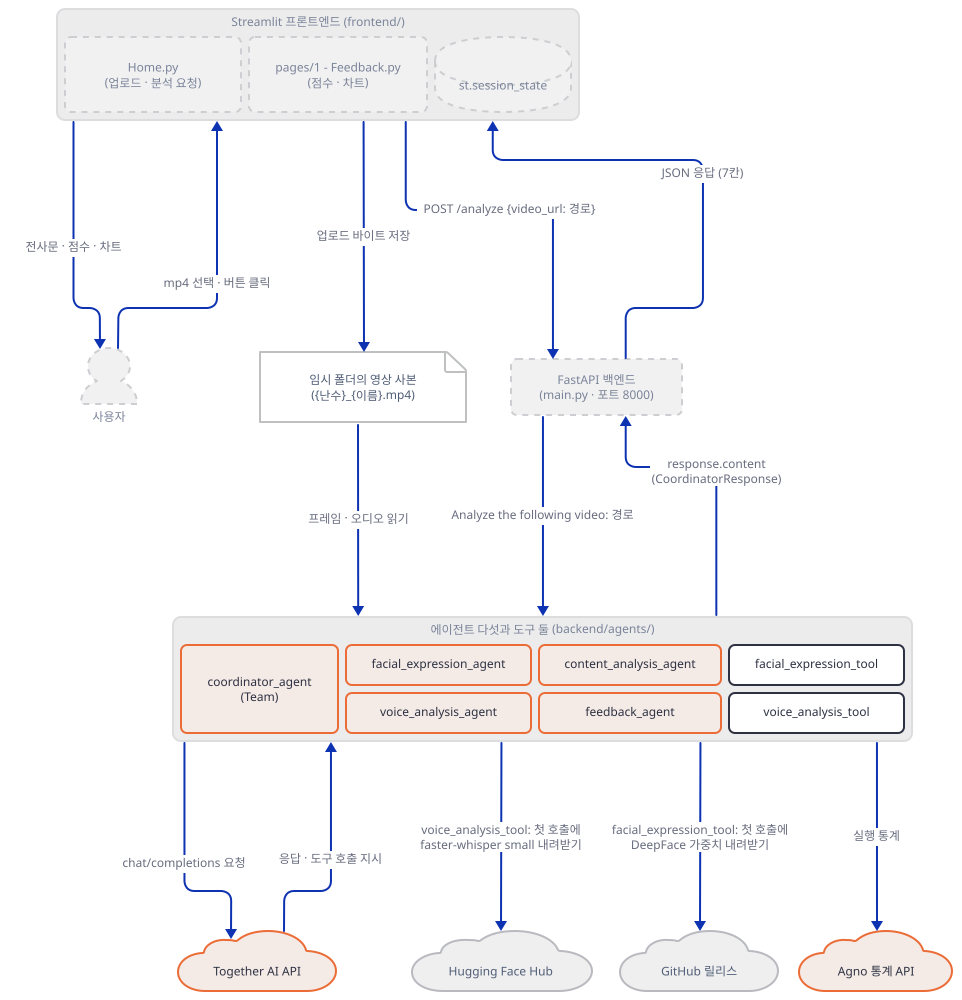

**확인.** `backend/`에 둡니다. 모델은 부르지 않고 구성만 읽습니다.

```python
# backend/ 에 두고 backend/ 에서 실행한다. 에이전트 다섯의 구성을 읽기만 한다(모델은 부르지 않는다).
import os
os.environ.setdefault("TOGETHER_API_KEY", "not-a-real-key")
from agents.coordinator_agent import coordinator_agent as team

for a in [team, *team.members]:
    print(type(a).__name__, "|", a.name, "|", a.model.id, "|", [t.name for t in (a.tools or [])])
print("mode:", team.mode, "| response_model:", team.response_model.__name__, "| use_json_mode:", team.use_json_mode)
print("base_url:", team.model.base_url)
```

```bash
uv run --no-project python check_agents.py
```

직접 확인한 출력입니다(앞의 안내 줄들은 뺐습니다).

```text
Team | coordinator-agent | meta-llama/Llama-3.3-70B-Instruct-Turbo-Free | []
Agent | facial-expression-agent | meta-llama/Llama-3.3-70B-Instruct-Turbo-Free | ['analyze_facial_expressions']
Agent | voice-analysis-agent | meta-llama/Llama-3.3-70B-Instruct-Turbo-Free | ['analyze_voice_attributes']
Agent | content-analysis-agent | meta-llama/Llama-3.3-70B-Instruct-Turbo-Free | []
Agent | feedback-agent | meta-llama/Llama-3.3-70B-Instruct-Turbo-Free | []
mode: coordinate | response_model: CoordinatorResponse | use_json_mode: True
base_url: https://api.together.xyz/v1
```

### Step 5. FastAPI 백엔드와 가짜 Together 서버

**목적.** `POST /analyze` 하나가 리더를 어떻게 돌리는지, 요청이 몇 번 나가는지 키 없이 끝까지 돌려 봅니다.

**할 일.** 백엔드는 마흔세 줄입니다.

`advanced_ai_agents/multi_agent_apps/ai_speech_trainer_agent/backend/main.py:26-43`

```python
class AnalysisRequest(BaseModel):
    video_url: str

# Define the entry point
@app.get("/")
async def root():
    return {"message": "Welcome to the video analysis API!"}

# Define the analysis endpoint
@app.post("/analyze")
async def analyze(request: AnalysisRequest):
    video_url = request.video_url
    prompt = f"Analyze the following video: {video_url}"
    response: RunResponse = coordinator_agent.run(prompt)

    # Assuming response.content is a Pydantic model or a dictionary
    json_compatible_response = jsonable_encoder(response.content)
    return JSONResponse(content=json_compatible_response)
```

받는 것은 `video_url`이라는 이름의 **로컬 파일 경로 문자열**입니다. 이름은 URL이지만 두 도구가 `cv2.VideoCapture`와 `VideoFileClip`에 그대로 넘기므로 백엔드가 그 파일을 읽을 수 있어야 하고, 그래서 화면과 백엔드는 같은 PC에서 돌아야 합니다. 경로를 검사하는 코드는 없고(소스로 확인) CORS는 모든 출처를 허용합니다(`advanced_ai_agents/multi_agent_apps/ai_speech_trainer_agent/backend/main.py:17-23`). `async def`인데 안에서 부르는 `run()`은 동기 함수라 분석이 끝날 때까지 서버가 그 요청에 묶입니다(소스로 읽은 것이고 따로 재지는 않았습니다). 원본 안내의 `uvicorn main:app --reload`는 uvicorn의 기본 주소 127.0.0.1:8000에 열립니다(uvicorn 0.54의 `Config` 시그니처 기본값으로 직접 확인했고, 이 문서는 아래 래퍼로 같은 주소에 띄웠습니다).

가짜 서버는 OpenAI 호환 `chat/completions` 요청에 정해진 답을 합니다. 리더가 도구 `transfer_task_to_member`를 가진 요청이면 멤버 넷에게 차례로 넘기게 하고, 넷의 결과가 쌓이면 그것을 JSON 7칸으로 묶어 돌려줍니다. 도구를 가진 멤버에게는 먼저 그 도구를 부르라고 하는데, 영상 경로는 리더가 받은 첫 질문(`Analyze the following video: …`)에서 읽어 둡니다. 그러면 얼굴·음성 도구가 **진짜로** 돌고, 오디오가 하는 일은 Step 3에서 본 그대로입니다.

```python
# Together AI 대신 localhost에서 답하는 가짜 서버(OpenAI 호환 /v1/chat/completions). 사용: python fake_together.py <포트> <로그 파일>
import json, re, sys, time
from http.server import BaseHTTPRequestHandler, ThreadingHTTPServer

PORT, LOG = int(sys.argv[1]), sys.argv[2]
MEMBERS = ["facial-expression-agent", "voice-analysis-agent", "content-analysis-agent", "feedback-agent"]
CONTENT = '{"grammar_corrections": [], "filler_words": {"um": 1}, "suggestions": ["Open with a clear agenda."]}'
FEEDBACK = ('{"scores": {"content_organization": 4, "delivery_vocal_quality": 3, "body_language_eye_contact": 3, '
            '"audience_engagement": 4, "language_clarity": 5}, "total_score": 19, "interpretation": "Proficient speaker", '
            '"feedback_summary": "Canned feedback from a fake server, not a real assessment."}')
VIDEO = [None]

class Handler(BaseHTTPRequestHandler):
    def log_message(self, *a):
        pass

    def do_POST(self):
        body = json.loads(self.rfile.read(int(self.headers.get("content-length", 0))))
        with open(LOG, "a", encoding="utf-8") as f:
            f.write(json.dumps({"path": self.path, "body": body}, ensure_ascii=False) + "\n")
        msgs = body["messages"]
        tools = [t["function"]["name"] for t in body.get("tools") or []]
        for m in msgs:                                    # 리더가 받은 첫 질문에서 영상 경로를 읽어 둔다
            g = re.search(r"Analyze the following video: (.+)", m["content"]) if isinstance(m.get("content"), str) else None
            if g:
                VIDEO[0] = g.group(1).strip()
        tool_msgs = [m.get("content") or "" for m in msgs if m["role"] == "tool"]
        system = " ".join(m["content"] for m in msgs if m["role"] == "system" and isinstance(m["content"], str)).lower()
        msg = {"role": "assistant", "content": None}
        if "transfer_task_to_member" in tools:            # 리더: 멤버 넷에게 차례로 넘기고, 마지막에 JSON 7칸
            n = len(tool_msgs)
            if n < 4:
                args = {"member_id": MEMBERS[n], "task_description": f"task {n}", "expected_output": "json"}
                msg["tool_calls"] = [{"id": f"call_{n}", "type": "function",
                                      "function": {"name": "transfer_task_to_member", "arguments": json.dumps(args)}}]
            else:
                msg["content"] = json.dumps({
                    "facial_expression_response": tool_msgs[0], "voice_analysis_response": tool_msgs[1],
                    "content_analysis_response": tool_msgs[2], "feedback_response": tool_msgs[3],
                    "strengths": ["Clear closing"], "weaknesses": ["Few pauses"], "suggestions": ["Slow down a little"]})
        else:                                             # 멤버
            own = [t for t in tools if t in ("analyze_facial_expressions", "analyze_voice_attributes")]
            if "you are a feedback agent" in system:
                msg["content"] = FEEDBACK
            elif "you are a content analysis agent" in system:
                msg["content"] = CONTENT
            else:                                         # 도구가 있는 멤버는 도구를 먼저 부르게 한다
                arg = "video_path" if own[0] == "analyze_facial_expressions" else "file_path"
                msg["tool_calls"] = [{"id": "call_t", "type": "function",
                                      "function": {"name": own[0], "arguments": json.dumps({arg: VIDEO[0]})}}]
        out = {"id": "fake", "object": "chat.completion", "created": int(time.time()), "model": body.get("model"),
               "choices": [{"index": 0, "message": msg, "finish_reason": "tool_calls" if msg.get("tool_calls") else "stop"}],
               "usage": {"prompt_tokens": 1, "completion_tokens": 1, "total_tokens": 2}}
        data = json.dumps(out).encode()
        self.send_response(200)
        self.send_header("content-type", "application/json")
        self.send_header("content-length", str(len(data)))
        self.end_headers()
        self.wfile.write(data)

ThreadingHTTPServer(("127.0.0.1", PORT), Handler).serve_forever()
```

앱 파일은 고치지 않습니다. 대신 `main`을 그대로 import한 뒤 다섯 모델의 `base_url`만 바꾸는 래퍼를 둡니다. 이 래퍼도 `backend/`에 둡니다.

```python
# backend/ 에 두고 backend/ 에서 실행한다. 사용: python run_backend.py http://127.0.0.1:<가짜 서버 포트>/v1
# main:app을 고치지 않고 가져와 다섯 모델의 주소만 가짜 서버로 바꾼 뒤 8000 포트에 띄운다.
import os
os.environ["HF_HUB_OFFLINE"] = "1"                  # 모델 내려받기 차단
os.environ["AGNO_TELEMETRY"] = "false"              # agno 익명 통계 끄기
os.environ.setdefault("TOGETHER_API_KEY", "not-a-real-key")
import sys
import uvicorn
import main
from agents.coordinator_agent import coordinator_agent

for agent in [coordinator_agent, *coordinator_agent.members]:
    agent.model.base_url = sys.argv[1]
uvicorn.run(main.app, host="127.0.0.1", port=8000)
```

8000 포트를 다른 프로세스가 쓰고 있지 않은지 먼저 봅니다. 아래 `netstat` 줄이 아무것도 안 내면 비어 있는 것입니다. 포트 58231은 예시이니 겹치면 다른 높은 번호를 쓰세요.

```bash
netstat -ano | grep -E ":(8000|58231) "
```

```powershell
netstat -ano | Select-String ":(8000|58231) "
```

(PowerShell 줄은 실행해 보지 못했습니다.) 터미널 둘에서 각각 띄웁니다. 둘 다 `backend/`에서입니다.

```bash
uv run --no-project python fake_together.py 58231 fake.log
```

```bash
uv run --no-project python run_backend.py http://127.0.0.1:58231/v1
```

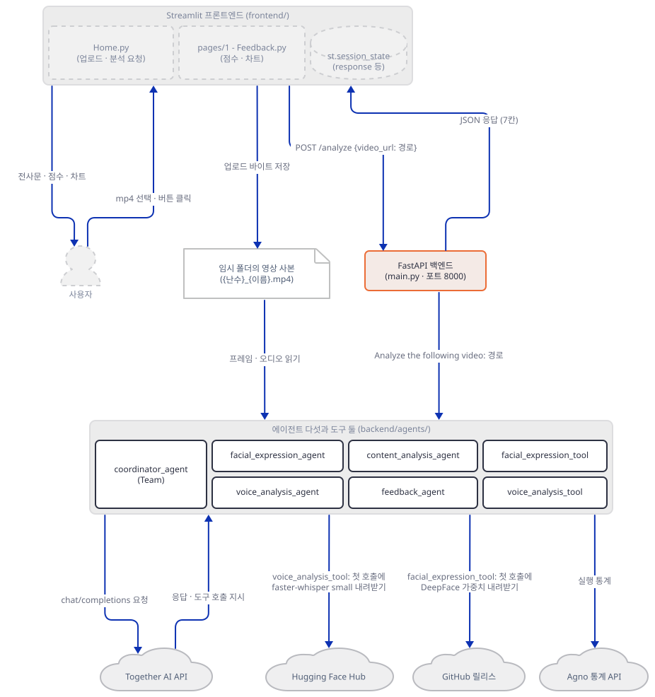

**확인.** 셋째 터미널에서 `GET /`로 살아 있는지 본 뒤, Step 2에서 만든 영상의 **절대 경로**를 넣어 `POST`합니다. Windows에서 Git Bash를 쓰면 `/c/…` 꼴 경로는 파이썬이 열지 못하니 `C:/…` 꼴로 줍니다(직접 확인: `/c/…` 경로를 주면 도구가 `'…' not found`로 실패함).

```bash
curl -s http://127.0.0.1:8000/
curl -s -X POST http://127.0.0.1:8000/analyze -H "content-type: application/json" -d '{"video_url": "<media/tone.mp4의 절대 경로>"}'
```

```powershell
curl.exe -s http://127.0.0.1:8000/
curl.exe -s -X POST http://127.0.0.1:8000/analyze -H "content-type: application/json" -d '{\"video_url\": \"<media\tone.mp4의 절대 경로>\"}'
```

(PowerShell 줄은 실행해 보지 못했습니다. 따옴표 이스케이프가 셸마다 달라 파일에 JSON을 적어 `-d @파일`로 주는 편이 안전합니다.) 직접 확인한 결과는 이렇습니다. 첫 줄이 `{"message":"Welcome to the video analysis API!"}`이고, 둘째 호출은 5.5초 만에 JSON 7칸을 돌려줬습니다. 칸마다 앞 100자만 보면 이렇습니다.

```text
facial_expression_response => {"emotion_timeline": [], "engagement_metrics": {"eye_contact_frequency": 0.0, "smile_frequency": 0.0
voice_analysis_response => {"transcription": "Model failed to load. Please check system resources or model path.", "speech_rate_wpm": "22
content_analysis_response => {"grammar_corrections": [], "filler_words": {"um": 1}, "suggestions": ["Open with a clear agenda."]}
feedback_response => {"scores": {"content_organization": 4, "delivery_vocal_quality": 3, "body_language_eye_contact": 3, 
strengths => ['Clear closing']
weaknesses => ['Few pauses']
suggestions => ['Slow down a little']
```

앞 둘은 진짜 도구가 만든 값이고 뒤 다섯은 가짜 서버의 고정 문장입니다. 가짜 서버가 받은 요청은 `fake.log`에 쌓입니다. 한 번의 `POST`에 요청이 **아홉 건**이었고(직접 확인) 순서와 도구 목록은 이렇습니다.

```text
1 리더       ['set_shared_context', 'transfer_task_to_member']  response_format=json_object
2 얼굴 멤버  ['analyze_facial_expressions']
3 리더       ['set_shared_context', 'transfer_task_to_member']
4 음성 멤버  ['analyze_voice_attributes']
5 리더
6 내용 멤버  []
7 리더
8 채점 멤버  []
9 리더
```

도구를 가진 얼굴·음성 멤버는 요청이 한 건씩뿐입니다. `stop_after_tool_call=True` 때문에 도구 결과가 곧 응답이 되어 모델에게 다시 묻지 않기 때문입니다. 요청 하나하나의 `model`은 모두 `meta-llama/Llama-3.3-70B-Instruct-Turbo-Free`였습니다. 확인을 마치면 두 프로세스를 `Ctrl+C`로 끝내고 포트가 비었는지 다시 봅니다.

### Step 6. Streamlit 홈 화면 — 업로드와 분석 요청

**목적.** 홈 화면이 영상을 어디에 저장하고, 무엇을 보내고, 무엇을 지우는지 확인합니다.

**할 일.** 업로드는 `mp4`만 받고 임시 폴더에 저장합니다.

`advanced_ai_agents/multi_agent_apps/ai_speech_trainer_agent/frontend/Home.py:66-81`

```python
    if st.session_state.get("upload_file"):
        uploaded_file = st.file_uploader("📤 Upload Video", type=["mp4"])

        if uploaded_file is not None:
            temp_dir = tempfile.gettempdir()
            # Use a random name to avoid reuse
            unique_name = f"{int(np.random.rand()*1e8)}_{uploaded_file.name}"
            file_path = os.path.join(temp_dir, unique_name)

            if not os.path.exists(file_path):
                with open(file_path, "wb") as f:
                    f.write(uploaded_file.read())

            st.session_state.video_path = file_path
            st.session_state.upload_file = False
            st.rerun()
```

파일 이름은 `{난수}_{원래 이름}`입니다. 사본은 업로드 직후 한 번 `rerun`으로 화면에 `st.video`로 나옵니다. 분석 버튼은 백엔드에 사본의 경로를 보냅니다.

`advanced_ai_agents/multi_agent_apps/ai_speech_trainer_agent/frontend/Home.py:98-118`

```python
    if st.session_state.video_path:
        st.video(st.session_state.video_path, autoplay=False)

        if not st.session_state.response:
            if st.button("▶️ Analyze Video"):
                with st.spinner("Analyzing video..."):
                    st.warning("⚠️ This process may take some time, so please be patient and wait for the analysis to complete.")
                    API_URL = "http://localhost:8000/analyze"
                    response = requests.post(API_URL, json={"video_url": st.session_state.video_path})

                    if response.status_code == 200:
                        st.success("Video analysis completed successfully.")
                        response = response.json()
                        st.session_state.response = response
                        st.session_state.facial_expression_response = response.get("facial_expression_response")
                        st.session_state.voice_analysis_response = response.get("voice_analysis_response")
                        st.session_state.content_analysis_response = response.get("content_analysis_response")
                        st.session_state.feedback_response = response.get("feedback_response")
                        st.rerun()
                    else:
                        st.error("🚨 Error during video analysis. Please try again.")
```

주소는 `http://localhost:8000/analyze`로 박혀 있고 `requests.post`에 `timeout`이 없어 응답이 올 때까지 기다립니다. 지우는 줄은 `Upload Video` 버튼의 `os.remove(st.session_state.video_path)`(`advanced_ai_agents/multi_agent_apps/ai_speech_trainer_agent/frontend/Home.py:57-63`)뿐입니다. `video_path`는 위 코드가 만든 임시 사본만 가리키므로 사용자의 원본 영상을 지우는 길은 없습니다. 거꾸로 이 버튼을 누르지 않으면 사본은 영영 남습니다.

화면 파일은 `frontend/`에서 돌려야 합니다. `page_congif.py`가 `open("style.css")`로 상대 경로를 열기 때문입니다. 앱 폴더에서 `frontend/Home.py`를 돌리면 `FileNotFoundError: [Errno 2] No such file or directory: 'style.css'`가 납니다(직접 확인). 앱 README의 폴더 구조가 `page_config.py`라 적은 것과 달리 실제 파일 이름은 `page_congif.py`입니다(오타, 직접 확인).

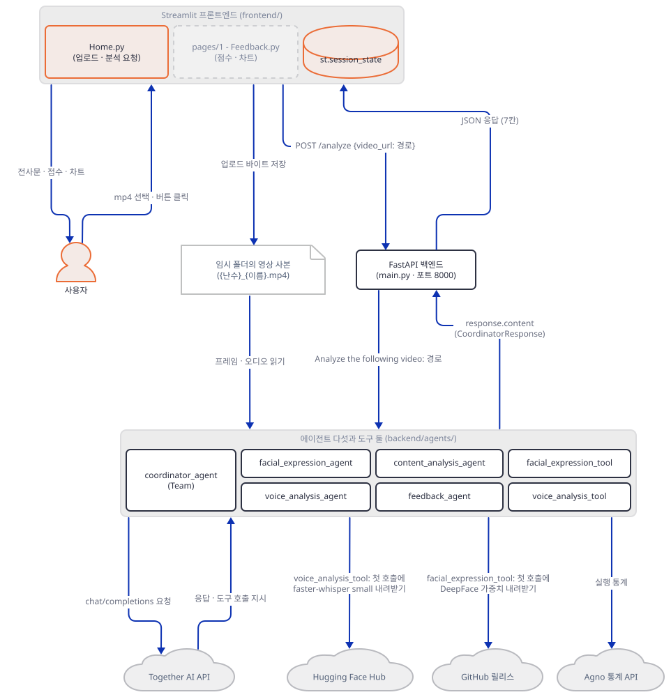

**확인.** 화면이 뜨는지 먼저 봅니다. 주소를 `localhost`로 지정하고 통계를 꺼야 Streamlit이 외부로 요청하지 않습니다.

```bash
cd ../frontend
uv run --no-project streamlit run Home.py --server.headless true --server.address localhost --server.port 58233 --browser.gatherUsageStats false
```

다른 터미널에서 `curl -s http://localhost:58233/_stcore/health`가 `ok`를 돌려주면 뜬 것입니다(직접 확인: streamlit 1.60.0). 확인을 마치면 `Ctrl+C`로 끝냅니다. 이 문서에는 브라우저로 직접 눌러 본 기록이 없고 업로드와 버튼 동작은 `AppTest`로 봅니다. 백엔드(8000)를 다시 Step 5처럼 띄운 채 `frontend/`에 둘 스크립트입니다.

```python
# frontend/ 에 두고 frontend/ 에서 실행한다. 사용: python check_home.py <tone.mp4 경로>. 백엔드(8000)가 떠 있어야 한다.
import os
import sys
import tempfile
from streamlit.testing.v1 import AppTest

video = open(sys.argv[1], "rb").read()
tmp = tempfile.gettempdir()
def mp4s():
    return {f for f in os.listdir(tmp) if f.endswith(".mp4")}

print("== 홈: 시작 -> 업로드 -> 분석")
at = AppTest.from_file("Home.py", default_timeout=120).run()
at.button[0].click().run()                    # Let's begin
at.button[0].click().run()                    # Upload Video
before = mp4s()
at.file_uploader[0].set_value(("my talk.mp4", video, "video/mp4")).run()
saved = sorted(mp4s() - before)
print("임시 폴더에 생긴 파일:", saved)
[b for b in at.button if "Analyze" in b.label][0].click().run()
print("오류:", [e.value for e in at.error], "| 예외:", [e.value for e in at.exception])
resp = at.session_state.response
print("응답 칸:", list(resp))
print("분석 뒤에도 임시 파일이 남아 있다:", all(os.path.exists(os.path.join(tmp, f)) for f in saved))
[b for b in at.button if "Upload Video" in b.label][0].click().run()
print("Upload Video를 누른 뒤 임시 파일:", [os.path.exists(os.path.join(tmp, f)) for f in saved], "| response:", at.session_state.response)

print("== 피드백 페이지, 분석 결과를 넣고")
fb = AppTest.from_file("pages/1 - Feedback.py", default_timeout=60)
fb.session_state["response"] = resp
fb.session_state["feedback_response"] = resp["feedback_response"]
fb.run()
print("예외:", [e.value for e in fb.exception])
print([m.value for m in fb.markdown if "Score" in m.value])
print("강점:", [x.value for x in fb.success], "| 약점:", [x.value for x in fb.error], "| 제안:", [x.value for x in fb.warning])

print("== 피드백 페이지를 홈보다 먼저 열면")
fb0 = AppTest.from_file("pages/1 - Feedback.py", default_timeout=60).run()
print("예외:", [e.value[:60] for e in fb0.exception])

print("== 홈에서 분석 없이 넘어오면(키는 있고 값은 None)")
fb1 = AppTest.from_file("pages/1 - Feedback.py", default_timeout=60)
fb1.session_state["response"] = None
fb1.session_state["feedback_response"] = None
fb1.run()
print("예외:", [e.value for e in fb1.exception], "| 경고:", [w.value for w in fb1.warning])

print("== 홈의 voice_analysis_response가 JSON이 아니면")
bad = AppTest.from_file("Home.py", default_timeout=60)
bad.session_state["response"] = {"voice_analysis_response": "Here is the JSON: {...}"}
bad.session_state["voice_analysis_response"] = "Here is the JSON: {...}"
bad.run()
print("예외:", [e.value for e in bad.exception])
```

```bash
uv run --no-project python check_home.py <media/tone.mp4의 절대 경로>
```

앞 절반이 홈 화면입니다. 직접 확인한 출력입니다(`use_container_width` 경고 세 줄은 Step 7에서 다룹니다).

```text
== 홈: 시작 -> 업로드 -> 분석
임시 폴더에 생긴 파일: ['26406698_my talk.mp4']
오류: [] | 예외: []
응답 칸: ['facial_expression_response', 'voice_analysis_response', 'content_analysis_response', 'feedback_response', 'strengths', 'weaknesses', 'suggestions']
분석 뒤에도 임시 파일이 남아 있다: True
Upload Video를 누른 뒤 임시 파일: [False] | response: None
```

업로드가 임시 폴더에 사본을 만들고, 분석이 끝나도 사본이 남고, `Upload Video`를 누르면 사본이 사라지며 응답도 비워집니다. 다음은 같은 스크립트의 마지막 장면입니다. 전사문 칸은 응답의 `voice_analysis_response`를 `json.loads`로 읽는데(`advanced_ai_agents/multi_agent_apps/ai_speech_trainer_agent/frontend/Home.py:125-126`), 모델이 앞뒤에 말을 붙이거나 코드 펜스를 두르면 JSON이 아니어서 화면 전체가 죽습니다.

```text
== 홈의 voice_analysis_response가 JSON이 아니면
JSONDecodeError: Expecting value: line 1 column 1 (char 0)
예외: ['Expecting value: line 1 column 1 (char 0)']
```

### Step 7. 피드백 화면과 끝까지

**목적.** 피드백 화면이 응답 칸을 어떻게 그리는지, 홈을 거치지 않고 열면 어떻게 되는지 확인합니다.

**할 일.** `Get Feedback` 버튼은 `st.switch_page("pages/1 - Feedback.py")`(`advanced_ai_agents/multi_agent_apps/ai_speech_trainer_agent/frontend/Home.py:142-143`)로 넘어갑니다. 피드백 화면은 세션의 `feedback_response`를 읽습니다.

`advanced_ai_agents/multi_agent_apps/ai_speech_trainer_agent/frontend/pages/1 - Feedback.py:8-26`

```python
# Get feedback response from session state
if st.session_state.feedback_response:
    feedback_response = json.loads(st.session_state.feedback_response)
    feedback_scores = feedback_response.get("scores")

    # Evaluation scores based on the public speaking rubric
    scores = {
        "Content & Organization": feedback_scores.get("content_organization"),
        "Delivery & Vocal Quality": feedback_scores.get("delivery_vocal_quality"),
        "Body Language & Eye Contact": feedback_scores.get("body_language_eye_contact"),
        "Audience Engagement": feedback_scores.get("audience_engagement"),
        "Language & Clarity": feedback_scores.get("language_clarity")
    }

    total_score = feedback_response.get("total_score")
    interpretation = feedback_response.get("interpretation")
    feedback_summary = feedback_response.get("feedback_summary")
else:
    st.warning("No feedback available! Please upload a video and analyze it first.")
```

점수 다섯 개는 채점 에이전트의 `scores`에서, 강점·약점·제안은 리더의 `response`에서 옵니다. 평균은 화면이 다섯 점수로 직접 계산합니다. 점수가 `None`이면 `sum`에서 `TypeError`가 날 텐데 이 경우는 만들어 보지 못했습니다.

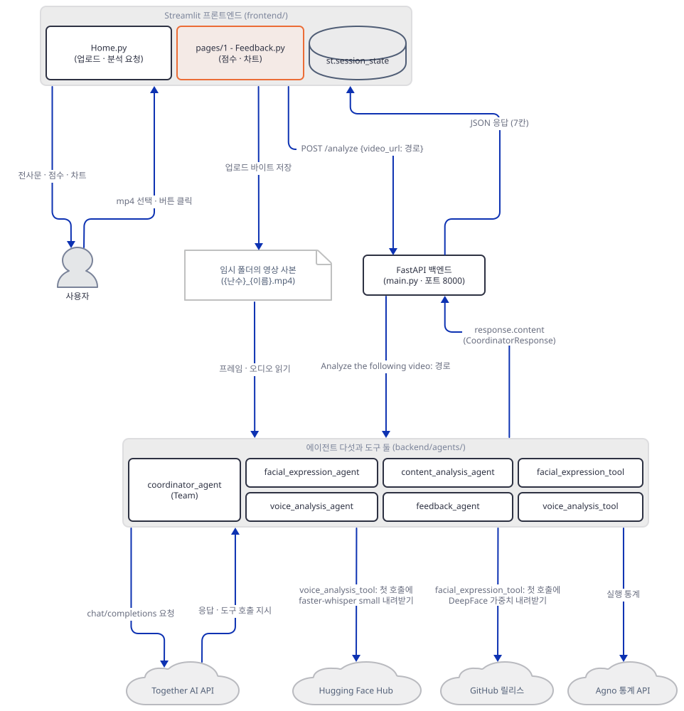

**확인.** Step 6의 같은 스크립트가 뒤 절반에서 피드백 화면을 `AppTest`로 엽니다. 직접 확인한 출력입니다. 분석 결과를 넣으면 총점과 평균, 세 상자가 나옵니다.

```text
== 피드백 페이지, 분석 결과를 넣고
예외: []
['#### 🏆 Total Score: 19 / 25', '#### 🎯 Average Score: 3.80 / 5']
강점: ['- Clear closing'] | 약점: ['- Few pauses'] | 제안: ['- Slow down a little']
```

가짜 서버가 준 19점과 다섯 점수의 평균 3.80입니다. 홈을 거치지 않고 이 화면을 먼저 열면 이렇게 됩니다. 세션 키 `feedback_response`는 홈 화면이 처음 열릴 때 만들어지는데(`advanced_ai_agents/multi_agent_apps/ai_speech_trainer_agent/frontend/Home.py:33-34`) 이 화면은 그 키를 `.get`이 아니라 속성으로 읽기 때문입니다.

```text
== 피드백 페이지를 홈보다 먼저 열면
예외: ['st.session_state has no attribute "feedback_response". Did y']
```

홈을 한 번 거치고 분석 없이 오면 두 키가 `None`이라 경고 `No feedback available! Please upload a video and analyze it first.`가 뜹니다(직접 확인). 레이더 차트의 `use_container_width=True`(`advanced_ai_agents/multi_agent_apps/ai_speech_trainer_agent/frontend/pages/1 - Feedback.py:125`)는 streamlit 1.60.0에서 "`use_container_width`는 2025-12-31 이후 제거된다"는 경고를 찍지만 화면은 그려졌습니다(직접 확인). 브라우저에서 `st.switch_page`로 실제로 화면이 넘어가는 것과 plotly 차트가 눈에 보이는 모양은 확인하지 못했습니다.

## 요청 한 건이 흐르는 과정

영상 한 개의 분석을 여섯 장으로 나눠 따라갑니다. 첫 장은 업로드에서 리더가 얼굴 멤버에게 일을 넘기기까지입니다.

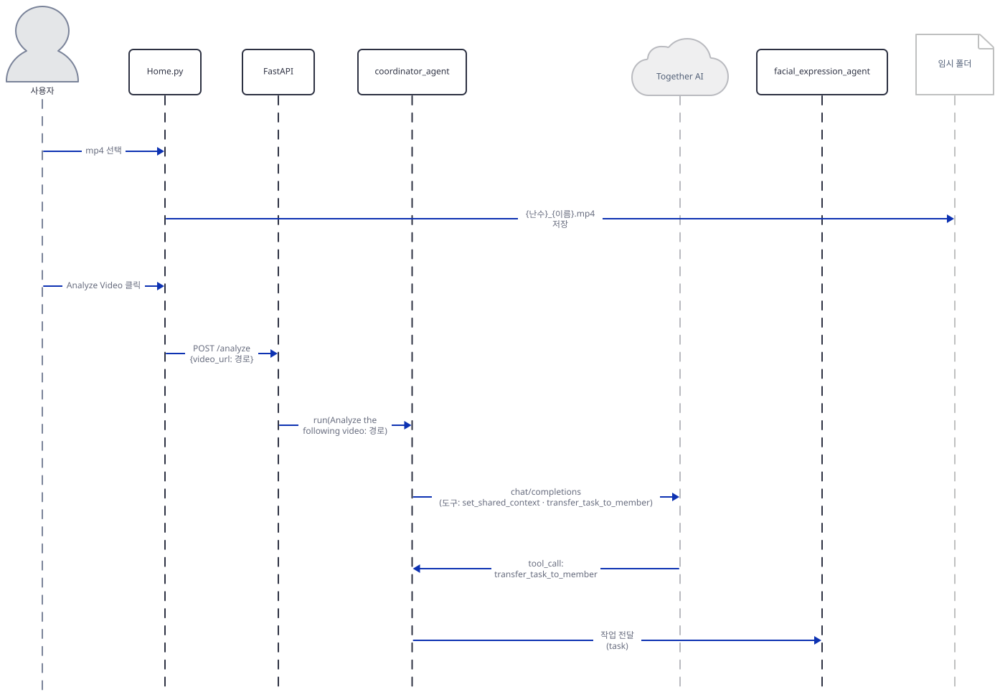

홈 화면이 업로드 바이트를 임시 폴더에 저장하고, 그 경로를 `POST /analyze`로 보냅니다. 백엔드는 `Analyze the following video: 경로`라는 문장 하나로 리더를 돌립니다. 리더는 Together에 묻고(도구는 `transfer_task_to_member` 등), 첫 멤버로 얼굴 에이전트를 지목하는 도구 호출을 받아 일을 넘깁니다. 리더는 멤버 하나를 지목할 때마다 Together에 한 번 묻고 마지막에 한 번 더 물어 모두 다섯 건입니다. 아래 그림들은 이 리더의 턴을 다시 그리지 않고 멤버 쪽만 그립니다. 둘째 장은 얼굴 멤버입니다.

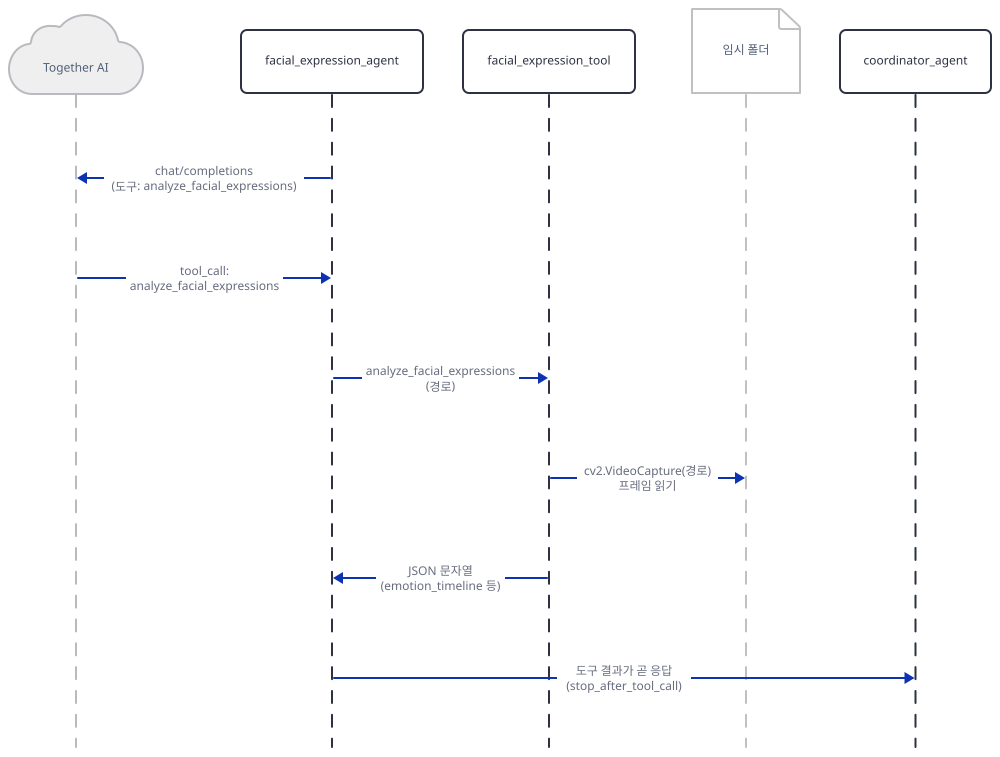

얼굴 에이전트가 Together에 물으면 `analyze_facial_expressions`를 부르라는 답이 오고, 도구는 임시 폴더의 파일을 프레임 단위로 읽어 JSON 문자열을 돌려줍니다. 그 결과가 곧 응답이라 얼굴 멤버는 요청이 한 건뿐입니다. 셋째 장은 음성 멤버입니다.

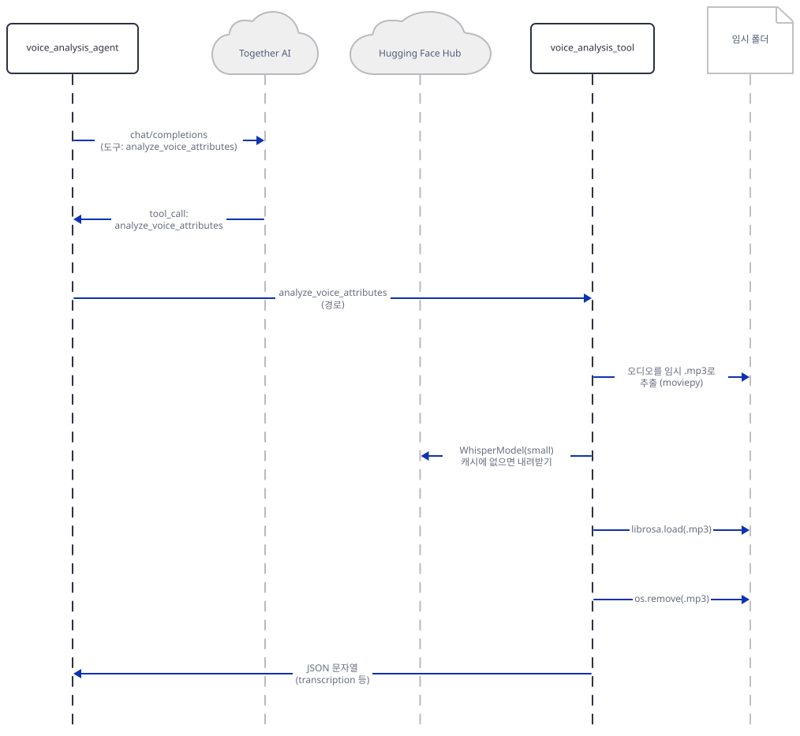

음성 멤버의 첫 두 메시지는 얼굴 멤버와 모양이 같고 도구 이름만 다릅니다. 도구는 오디오를 임시 `.mp3`로 뽑고, Whisper 모델을 부르는데 캐시에 없으면 Hugging Face에서 받으려 하며(이 문서는 오프라인으로 막아 실패했습니다), 오디오를 `librosa`로 읽고, 임시 파일을 지우고 JSON을 돌려줍니다. 넷째 장은 도구가 없는 두 멤버입니다.

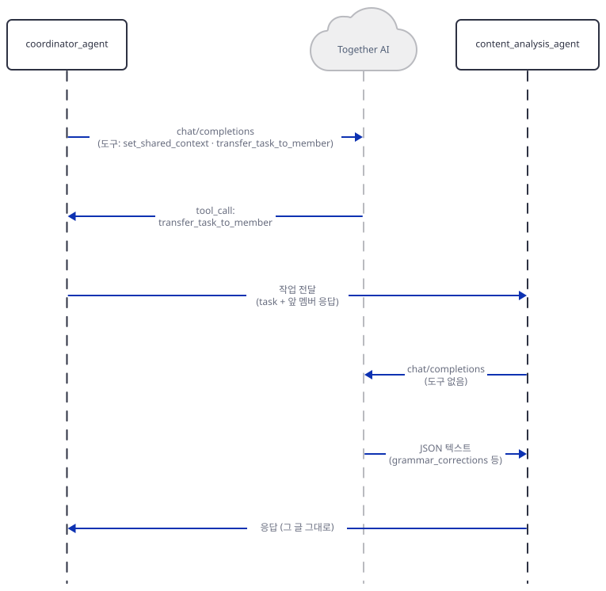

이 둘은 일을 받아 Together에 한 번 묻고 그 글을 그대로 응답으로 돌려줍니다. 리더가 그 글을 다음 멤버에게 넘겨 줘야 채점이 앞 결과를 보는데, 이 문서의 가짜 서버는 그것을 흉내 내지 않았으므로 실제 모델이 앞 결과를 제대로 넘기는지는 확인하지 못했습니다. 다섯째 장은 마무리입니다.

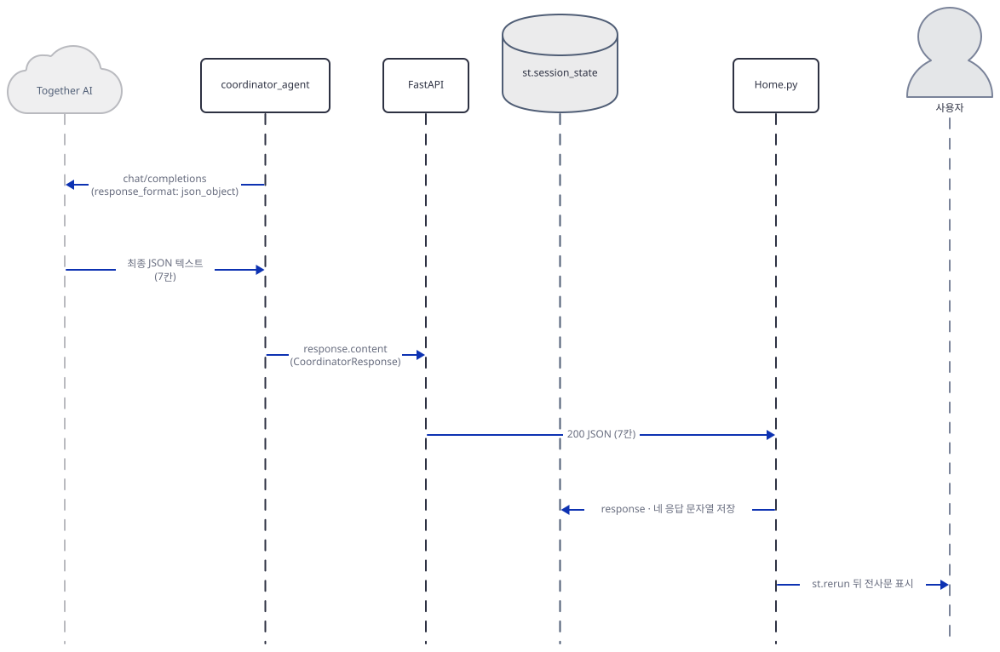

리더가 마지막으로 Together에 물어 멤버 넷의 결과를 7칸 JSON으로 묶습니다(리더의 요청은 모두 `response_format`이 `json_object`입니다, 직접 확인). 백엔드는 `response.content`를 JSON으로 바꿔 200으로 돌려줍니다. 홈 화면은 응답과 네 문자열을 세션에 담고 `st.rerun` 뒤 전사문을 보여 줍니다. 마지막 장은 피드백 화면입니다.

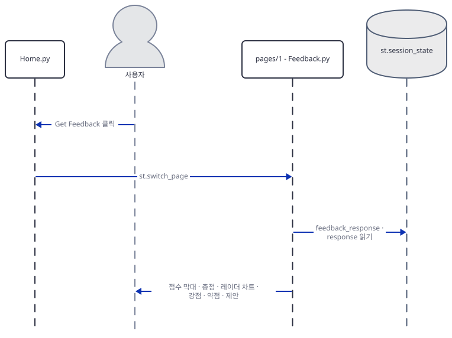

사용자가 `Get Feedback`을 누르면 `st.switch_page`로 피드백 화면이 열리고, 화면은 세션의 값을 읽어 막대·총점·레이더 차트와 세 상자를 그려 돌려줍니다. 이 여섯 장 가운데 도구 호출과 임시 파일 처리는 도구를 진짜로 돌려 본 것이고, Together의 응답과 마지막 두 장의 화면 내용은 가짜 서버와 `AppTest`로 본 것입니다.

## 실행 체크리스트

- [ ] Python 3.12 가상환경에 `requirements.txt`와 `agno<2`, `mediapipe==0.10.21`을 설치했고 `agno` 1.8.4와 `mediapipe` 0.10.21이 보인다
- [ ] 버전 없는 설치가 `show_tool_calls`·`RunResponse`·`mp.solutions`에서 막히는 까닭을 읽었다
- [ ] 얼굴이 없는 회색 영상에서 얼굴 도구가 빈 `emotion_timeline`을 돌려주고 `DeepFace.analyze`는 불리지 않는 것을 봤다
- [ ] `HF_HUB_OFFLINE=1`에서 Whisper 로드가 실패하고 오류 문장이 전사문이 되어 말 속도 `220.0`이 나오는 것을 봤다
- [ ] 오디오 없는 `silent.mp4`가 빈 `.mp3`를 남기는 것을 봤다
- [ ] 에이전트 다섯의 모델 ID와 도구, 리더의 `coordinate`·`CoordinatorResponse`를 확인했다
- [ ] Together의 폐기 표에서 `-Free` 모델의 제거일 2025-11-13을 읽었다
- [ ] 가짜 서버로 `POST /analyze`를 끝까지 돌려 요청 9건과 JSON 7칸을 봤다
- [ ] `check_home.py`로 업로드·분석·`Upload Video`가 임시 사본을 만들고 지우는 것을 봤다
- [ ] 피드백 화면이 총점 19, 평균 3.80을 그리고, 홈보다 먼저 열면 `AttributeError`가 나는 것을 봤다
- [ ] 띄운 서버를 모두 끝내고 8000·58231·58233 포트가 비었으며, 앱 폴더에 둔 확인용 파일을 지웠다

## 문제 해결

| 증상 | 원인 | 해결 |
|---|---|---|
| 에이전트 파일 import에서 `TypeError: Agent.__init__() got an unexpected keyword argument 'show_tool_calls'` | 버전 없는 `agno`가 3.x로 풀렸고 이 인자가 없다(직접 확인: 3.13 환경의 agno 3.1.2) | `uv pip install "agno<2"` (직접 확인: 1.8.4에서 import됨) |
| `main.py`나 리더 import에서 `ImportError: cannot import name 'RunResponse' from 'agno.agent'` | 같은 원인. 3.x에는 이 이름이 없다(직접 확인) | 같음 |
| 도구 로그에 `AttributeError: module 'mediapipe' has no attribute 'solutions'` | `mediapipe` 1.1.0·0.10.35에는 `solutions`가 없다(직접 확인: 3.13 환경). 코드는 `mp.solutions.face_mesh`를 부른다(`advanced_ai_agents/multi_agent_apps/ai_speech_trainer_agent/backend/agents/tools/facial_expression_tool.py:37`) | Python 3.12에서 `mediapipe==0.10.21`(직접 확인: `solutions`가 있고 `FaceMesh`가 만들어짐) |
| `mediapipe==0.10.21`을 3.13에서 설치하려 하자 `with the following Python ABI tags: cp39, cp310, cp311, cp312` | 그 버전의 휠이 3.12까지다(직접 확인) | 파이썬을 3.12로 |
| 도구가 `Model failed to load. Please check system resources or model path.`를 전사문으로 돌려줌 | Whisper 모델을 받지 못했다. 오프라인이거나 받는 중 실패했고, 앱은 이 문장을 전사문으로 쓴다(직접 확인) | 네트워크를 열고 `HF_HUB_OFFLINE`을 걸지 않은 채 처음 한 번 484MB를 받는다. 이 문서는 받지 않았다 |
| `ERROR OPENAI_API_KEY not set. Please set the OPENAI_API_KEY environment variable.` | `TOGETHER_API_KEY`가 비어 agno가 `OPENAI_API_KEY`로 폴백했다(소스로 확인, 가짜 키로 직접 확인) | `TOGETHER_API_KEY`를 건다. `OPENAI_API_KEY`가 있으면 그 키가 Together 주소로 나간다 |
| 오디오 없는 mp4에서 `AttributeError: 'NoneType' object has no attribute 'write_audiofile'`, 임시 폴더에 0바이트 `.mp3` | 임시 파일을 먼저 만들고 추출이 죽어 `os.remove`에 닿지 못한다(직접 확인) | 더 해보기 |
| 화면이 `FileNotFoundError: [Errno 2] No such file or directory: 'style.css'` | `frontend/`가 아닌 곳에서 돌렸다(직접 확인) | `frontend/`에서 `streamlit run Home.py` |
| 피드백 화면을 먼저 열자 `st.session_state has no attribute "feedback_response"` | 키가 홈 화면에서만 만들어진다(직접 확인) | 홈을 먼저 연다. 더 해보기 |
| 홈 화면이 `JSONDecodeError: Expecting value: line 1 column 1 (char 0)`로 죽음 | `voice_analysis_response`가 JSON이 아니다(직접 확인: 앞에 말이 붙은 문자열) | 모델 출력 형식을 확인한다. 앱 쪽 방어는 없다 |
| 처음 임포트할 때 `oneDNN custom operations are on` 안내와 DeepFace `DEPRECATION WARNING` 상자 | 텐서플로·DeepFace가 찍는 안내다(직접 확인, 동작에는 영향이 없었다) | 무시한다 |
| 피드백 화면에 `use_container_width` 경고 | `st.plotly_chart(..., use_container_width=True)`가 폐기 예정이다(직접 확인: streamlit 1.60.0) | 그려지는 데는 지장이 없다. `width='stretch'`로 바꿀 수 있다 |
| 분석이 아무 오류 없이 실패하거나 모델 관련 오류 | 앱의 `-Free` 모델이 2025-11-13에 제거됨(공식 폐기 표). 실제 오류 문장은 확인하지 못함 | 모델 ID를 `meta-llama/Llama-3.3-70B-Instruct-Turbo`로 바꾼다 |

## 더 해보기

- 모델을 유료 모델로 바꿔 보세요. 복사본에서 다섯 파일(`advanced_ai_agents/multi_agent_apps/ai_speech_trainer_agent/backend/agents/coordinator_agent.py:25`, `advanced_ai_agents/multi_agent_apps/ai_speech_trainer_agent/backend/agents/facial_expression_agent.py:13`, `advanced_ai_agents/multi_agent_apps/ai_speech_trainer_agent/backend/agents/voice_analysis_agent.py:14`, `advanced_ai_agents/multi_agent_apps/ai_speech_trainer_agent/backend/agents/content_analysis_agent.py:12`, `advanced_ai_agents/multi_agent_apps/ai_speech_trainer_agent/backend/agents/feedback_agent.py:12`)의 ID에서 `-Free`를 지우고 `TOGETHER_API_KEY`를 걸어 실제 키로 한 번 돌립니다. 문서의 가격 어림($0.03 이하)이 맞는지 Together의 사용량 화면과 견주세요. 이 문서는 키가 없어 하지 못했습니다.
- 음성 도구가 임시 `.mp3`를 흘리지 않게 해 보세요. 복사본에서 `advanced_ai_agents/multi_agent_apps/ai_speech_trainer_agent/backend/agents/tools/voice_analysis_tool.py:99-100`의 두 줄을 "`with`로 이름만 받아 두고 닫은 뒤 `try`에서 추출하고, `except`에서 `os.remove` 후 `raise`"로 바꾸면, `silent.mp4`를 부른 뒤 임시 폴더에 새 `.mp3`가 생기지 않았습니다(복사본에서 직접 확인. 열린 채로는 Windows가 지우지 못해 `with` 밖에서 지웁니다).
- 피드백 화면이 홈보다 먼저 열려도 죽지 않게 해 보세요. 복사본의 `advanced_ai_agents/multi_agent_apps/ai_speech_trainer_agent/frontend/pages/1 - Feedback.py:9`와 `advanced_ai_agents/multi_agent_apps/ai_speech_trainer_agent/frontend/pages/1 - Feedback.py:43`의 `st.session_state.feedback_response`·`.response`를 `st.session_state.get(...)`로 바꾸면 첫 화면에서 예외 없이 `No feedback available!` 경고가 떴습니다(복사본에서 `AppTest`로 직접 확인).

## 다음 날 예고

[Day 110 · 📰 Multi-Agent AI Researcher](../day110-multi-agent-researcher/README.md) — agno `Team`에 Hacker News·DuckDuckGo·기사 읽기 도구를 달아 주제를 조사하는 앱을 다룹니다. OpenAI `gpt-4o-mini` 파일과 Ollama `llama3.2` 파일이 하나씩 있습니다(원본 앱 소스 기준).
