# Day 110 · 📰 Multi-Agent AI Researcher

> 볼륨 7 🚀 Advanced AI Agents · 난이도 ★★★ · 예상 소요 120분(앱은 65줄이지만 Step 2·3·6·7에서 가짜 서버와 확인 스크립트를 직접 저장해 터미널 둘로 돌려 봐야 해서 읽는 시간보다 손으로 돌려 보는 시간이 더 걸립니다) · API 비용 대략 질문 1건에 $0.02 이하(가짜 서버 대본으로는 `gpt-4o-mini` 호출이 10번이었고(직접 확인) 진짜 모델은 위임을 한 차례에 묶으면 줄이고 도구를 여러 번 부르면 늘 수 있어 몇 번일지는 확인하지 못했습니다. 모델 페이지의 입력 $0.15·출력 $0.60(1M 토큰당, https://developers.openai.com/api/docs/models/gpt-4o-mini, 2026-10-09 확인)을 대입한 어림이며, 기사 원문 길이에 상한이 없어 입력 토큰은 기사에 따라 크게 달라지고 키가 없어 실제 토큰 수는 재지 못했습니다. Ollama판은 무료) · 원본 앱: `advanced_ai_agents/multi_agent_apps/multi_agent_researcher`

## 오늘 만들 것

질문을 적으면 에이전트 셋이 Hacker News 이야기를 찾고, 기사를 읽고, 웹을 검색한 뒤 글 하나로 요약해 주는 Streamlit 앱입니다. `research_agent.py` 한 파일(편집기 기준 65줄)에서 agno의 `Agent` 셋과 이를 묶는 `Team`을 만듭니다. 이 시리즈에서 `Team`은 Day 079가 처음 다뤘고 Day 081이 두 번째입니다. 오늘 구조는 Day 081의 Editor와 같은 coordinate 모드이고(Day 081 Step 5), Searcher·Writer 둘이던 멤버가 셋으로 늘어 HackerNews 도구, DuckDuckGo 검색, 기사 읽기 도구를 하나씩 나눠 쥡니다. SerpAPI 키가 없어 필요한 키는 OpenAI 하나뿐입니다.

원본 폴더에는 파일이 둘입니다. 오늘은 OpenAI판 `research_agent.py`를 중심으로 합니다. 이 파일만 의존성을 채우면 끝까지 돌아가고(Step 6), 앱 README와 `requirements.txt`가 가리키는 실행 대상도 이 파일이기 때문입니다. `research_agent_llama3.py`(편집기 기준 60줄)는 같은 구조에 `Ollama(id="llama3.2", max_tokens=1024)`만 바꾼 판인데, 오늘 설치되는 agno에서는 `max_tokens`가 `TypeError`를 일으켜 에이전트를 만드는 줄에서 멈춥니다. 최소 버전인 agno 2.2.10에서도 같았습니다(Step 7, 직접 확인).

그 밖에 짚을 점이 넷 있습니다. `requirements.txt`에는 검색 도구(`ddgs`)와 기사 도구(`newspaper4k`)가 없어 설치만으로는 import가 막힙니다(Step 1). 화면은 입력한 키를 `os.environ`에 쓰므로 브라우저 세션 둘이 서로의 키를 지웁니다(Step 2). HackerNews 도구에는 검색어를 받는 인자가 없어서 "질문에 맞는 이야기를 찾는다"는 지시문과 어긋납니다(Step 3). `show_members_responses=True`는 `run()`에서는 아무 일도 하지 않습니다(Step 4). 이 문서는 OpenAI·Hacker News·DuckDuckGo·기사 서버 어디에도 요청을 보내지 않고, 모델 서버와 HN·기사 서버를 내 PC의 가짜 서버로 대신해 돌렸습니다. 그래서 아래 글과 이야기는 전부 가짜 서버가 만든 문장이고, 진짜 `gpt-4o-mini`가 위임을 이렇게 하는지는 확인하지 못했습니다. 아래는 완성된 아키텍처입니다. 모델 호출과 통계 전송 화살표는 선이 너무 많아져 Step 6에서 따로 그렸습니다.

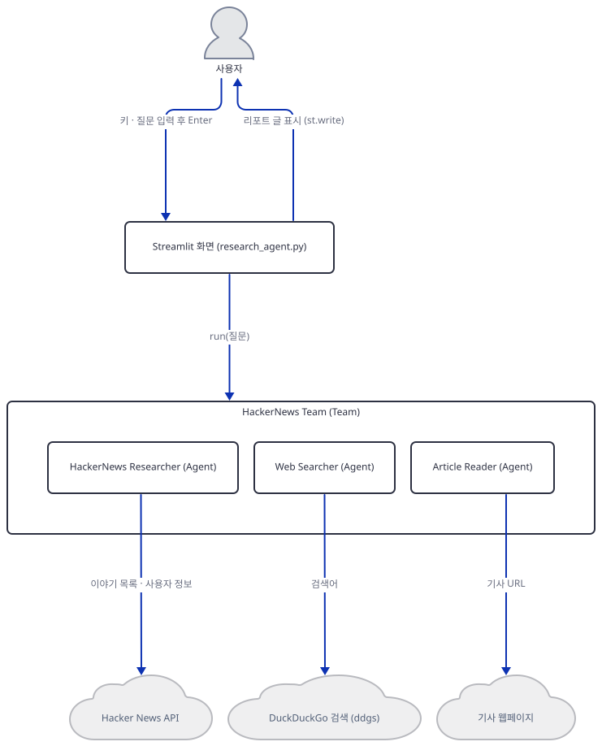

## 사전 준비

| 서비스/도구 | 용도 | 발급·설치 |
|---|---|---|
| uv, Python | 가상환경과 패키지 설치. 이 문서는 Python 3.13.3으로 확인했다 | [공통 사전 준비](../README.md#공통-사전-준비-한-번만) 참고 |
| OpenAI API 키 | 리더와 멤버 셋이 `gpt-4o-mini`를 부를 때의 인증. 화면의 비밀번호 칸에 붙여넣는다(`advanced_ai_agents/multi_agent_apps/multi_agent_researcher/research_agent.py:17`). 이 문서의 확인에는 필요 없다 | https://platform.openai.com/api-keys. `gpt-4o-mini`는 OpenAI 폐기 표(https://developers.openai.com/api/docs/deprecations, 2026-10-09에 받은 원문)에 종료 예정 모델로는 없고, 파인튜닝 모델 둘의 대체 모델로만 두 번 나온다 |
| Ollama (선택) | Step 7의 `research_agent_llama3.py`가 쓰는 로컬 모델 서버. 이 문서는 실제 Ollama를 쓰지 않고 가짜 서버로 확인했다 | https://ollama.com, 모델은 `ollama pull llama3.2`. 라이브러리 페이지(https://ollama.com/library/llama3.2, 2026-10-09 확인)에 `tools` 표시와 1b·3b 크기가 있다 |
| 인터넷 연결 | PyPI 설치. 앱을 실제로 쓸 때는 OpenAI API, Hacker News API(`hacker-news.firebaseio.com`), DuckDuckGo(`ddgs`), 모델이 고른 기사 주소, agno 사용 통계 서버(`os-api.agno.com`)에 접속하고, 기사를 처음 읽을 때는 공개 접미사 목록 서버도 부른다(Step 3). 브라우저로 열면 Streamlit의 사용 통계도 나간다(Day 063이 확인했고 `--browser.gatherUsageStats false`로 끈다) | 별도 설치 없음 |
| 빈 포트 | 이 문서는 가짜 OpenAI 서버에 62143, HN·기사 대역에 55731, 가짜 Ollama에 56402를 썼다. 겹치면 아무 높은 번호로 바꾼다 | 별도 설치 없음 |

## 아키텍처 한눈에 보기

| 컴포넌트 | 역할 | 코드 위치 |
|---|---|---|
| 사용자 | 키와 질문을 입력하고 결과 글을 읽는다 | 코드 없음 (브라우저) |
| Streamlit 화면 | 제목, 키 입력, 키가 있으면 에이전트와 팀을 만들고 질문 입력창과 실행·출력을 잇는다 | `advanced_ai_agents/multi_agent_apps/multi_agent_researcher/research_agent.py:12-20`, `advanced_ai_agents/multi_agent_apps/multi_agent_researcher/research_agent.py:59-65` |
| HackerNews Researcher | `HackerNewsTools`로 인기 이야기 목록과 사용자 정보를 가져온다 | `advanced_ai_agents/multi_agent_apps/multi_agent_researcher/research_agent.py:21-26` |
| Web Searcher | `DuckDuckGoTools`로 웹과 뉴스를 검색한다. 지시를 받을 때 현재 시각이 같이 간다 | `advanced_ai_agents/multi_agent_apps/multi_agent_researcher/research_agent.py:28-34` |
| Article Reader | `Newspaper4kTools`로 주소의 기사를 내려받아 제목·본문을 읽는다 | `advanced_ai_agents/multi_agent_apps/multi_agent_researcher/research_agent.py:36-41` |
| HackerNews Team | 세 멤버를 묶고 `delegate_task_to_member`로 일을 나눠 준 뒤 글 하나로 요약한다 | `advanced_ai_agents/multi_agent_apps/multi_agent_researcher/research_agent.py:43-57` |
| OpenAI API (`gpt-4o-mini`) | 리더와 멤버 셋이 각자 따로 만든 모델 객체로 호출한다 | `advanced_ai_agents/multi_agent_apps/multi_agent_researcher/research_agent.py:23`, `advanced_ai_agents/multi_agent_apps/multi_agent_researcher/research_agent.py:30`, `advanced_ai_agents/multi_agent_apps/multi_agent_researcher/research_agent.py:38`, `advanced_ai_agents/multi_agent_apps/multi_agent_researcher/research_agent.py:45` |
| Hacker News API · DuckDuckGo · 기사 웹페이지 | 멤버의 도구가 부르는 외부 서비스 | 코드 없음 (외부 서비스, agno 도구 내부) |
| Agno 사용 통계 API | 성공한 실행마다 익명 메타데이터를 받는다 | 코드 없음 (agno 내부) |
| Llama 3.2 (Ollama, 로컬) | Ollama판이 OpenAI 대신 쓰는 모델 | `advanced_ai_agents/multi_agent_apps/multi_agent_researcher/research_agent_llama3.py:9`, `advanced_ai_agents/multi_agent_apps/multi_agent_researcher/research_agent_llama3.py:18` |

## 단계별 진행

### Step 1. 환경 만들기 — 설치만으로는 import 셋이 막힙니다

**목적.** 앱 폴더에 독립 가상환경을 만들고, `requirements.txt`가 빠뜨린 패키지를 import 오류로 찾아 채웁니다.

**할 일.** 저장소 루트에서 시작합니다.

```bash
cd advanced_ai_agents/multi_agent_apps/multi_agent_researcher
uv venv
uv pip install -r requirements.txt
```

(pip 대안: bash는 `python -m venv .venv && source .venv/bin/activate && pip install -r requirements.txt`입니다. PowerShell 5.1은 `&&`를 받지 않으므로 `python -m venv .venv`, `.venv\Scripts\Activate.ps1`, `pip install -r requirements.txt`를 차례로 씁니다. 실행해 보지 못했습니다.) 이후 `uv run`에는 모두 `--no-project`를 붙입니다. 이유는 [공통 사전 준비](../README.md#공통-사전-준비-한-번만)에 있습니다.

`advanced_ai_agents/multi_agent_apps/multi_agent_researcher/requirements.txt:1-3`

```text
streamlit 
agno>=2.2.10
openai
```

세 줄이고 마지막 줄에 개행이 없어 `wc -l`은 2로 셉니다. 이 문서를 만들 때(2026-10-09)는 Python 3.13.3에서 agno 3.1.2, streamlit 1.65.0, openai 3.26.1을 포함해 패키지 69개가 깔렸습니다(직접 확인). 검색 도구, 기사 도구, Ollama 클라이언트는 목록에 없습니다. 어느 import가 막히는지 한 번에 봅니다. 확인 스크립트를 앱 폴더에 `imp.py`로 저장합니다.

`imp.py`

```python
import importlib

for m in ("agno.team", "agno.tools.hackernews", "agno.tools.duckduckgo", "agno.tools.newspaper4k", "agno.models.openai", "agno.models.ollama"):
    try:
        importlib.import_module(m)
        print("ok  ", m)
    except ImportError as e:
        print("FAIL", m, "|", e)
```

```bash
uv run --no-project python imp.py
```

직접 확인한 출력:

```
ok   agno.team
ok   agno.tools.hackernews
FAIL agno.tools.duckduckgo | `ddgs` not installed. Please install using `pip install ddgs`
FAIL agno.tools.newspaper4k | `newspaper4k` not installed. Please run `pip install newspaper4k lxml_html_clean`.
ok   agno.models.openai
FAIL agno.models.ollama | `ollama` not installed. Please install using `pip install ollama`
```

앞의 둘은 OpenAI판이 첫머리에서 가져오는 도구라 그대로면 화면이 뜨기 전에 멈춥니다. 마지막은 Ollama판만의 문제입니다. `DuckDuckGoTools`는 `ddgs`를 가져오는 `WebSearchTools`를 상속합니다(소스로 확인, agno 3.1.2의 `agno/tools/websearch.py` 8~10행. Day 103이 같은 원인을 확인했습니다). 오류 문구는 `lxml_html_clean`도 깔라고 하지만 `newspaper4k` 0.9.6이 그것을 함께 설치해서 둘만 깔면 됩니다(직접 확인). `HackerNewsTools`는 이미 깔린 `httpx`를 씁니다.

```bash
uv pip install ddgs newspaper4k
uv run --no-project python imp.py
```

두 번째 줄의 직접 확인한 출력은 `agno.models.ollama`만 `FAIL`이고 나머지는 `ok`입니다. `ddgs` 9.16.0과 `newspaper4k` 0.9.6이 깔렸고 `newspaper4k`를 import하면 `UserWarning: nltk is not installed.` 경고가 한 줄 나옵니다. 이 앱은 기사 요약 기능을 쓰지 않으므로 무시해도 됩니다(Day 081이 같은 경고를 짚었습니다). 컴파일도 확인합니다.

```bash
uv run --no-project python -m py_compile research_agent.py && echo compiled
```

(PowerShell 5.1에서는 `uv run --no-project python -m py_compile research_agent.py; if ($?) { echo compiled }`로 씁니다. 컴파일이 실패하면 `compiled`를 찍지 않습니다. 실행해 보지 못했습니다.) 직접 확인한 출력은 `compiled`입니다. Ollama판 컴파일도 통과합니다. 문법이 아니라 실행에서 멈추기 때문입니다(Step 7).

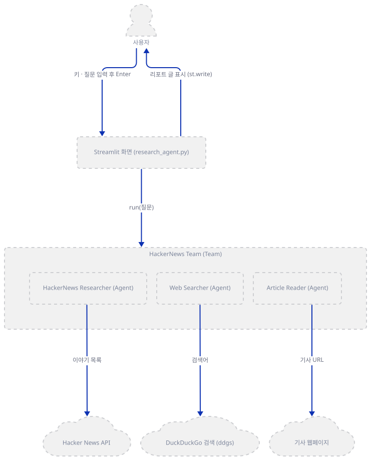

**확인.** `imp.py` 출력에서 `agno.tools.duckduckgo`와 `agno.tools.newspaper4k`가 `ok`이면 됩니다. 확인이 끝나면 `imp.py`를 지웁니다.

### Step 2. 화면 뼈대와 키 칸 — 키가 환경변수를 덮어씁니다

**목적.** 처음 화면에 무엇이 뜨는지와, 키 칸이 환경변수에 하는 일을 확인합니다.

**할 일.**

`advanced_ai_agents/multi_agent_apps/multi_agent_researcher/research_agent.py:12-20`

```python
# Set up the Streamlit app
st.title("Multi-Agent AI Researcher 🔍🤖")
st.caption("This app allows you to research top stories and users on HackerNews and write blogs, reports and social posts.")

# Get OpenAI API key from user
openai_api_key = st.text_input("OpenAI API Key", type="password")
os.environ["OPENAI_API_KEY"] = openai_api_key

if openai_api_key:
```

20행의 `if`가 21~65행 전부를 감싸므로 키가 비면 제목·캡션·키 칸만 그려집니다. 게이트 패턴은 Day 081 Step 2와 같고 리런은 Day 012 Step 2가 설명했습니다. 이 앱만의 특이점은 18행입니다. 키 칸이 비어 있어도 이 줄은 실행되므로 `OPENAI_API_KEY`가 빈 문자열로 덮어써집니다. agno의 `OpenAIChat`은 에이전트에 키를 넘기지 않으면 모델을 처음 부를 때 이 환경변수를 읽습니다(소스로 확인, agno 3.1.2의 `agno/models/openai/chat.py` 107~108행). 환경변수는 프로세스 하나에 하나뿐이라 서버를 같이 쓰는 모든 브라우저 세션이 공유합니다. 쉘에 `OPENAI_API_KEY`를 내보내 두었어도 화면을 여는 순간 지워집니다.

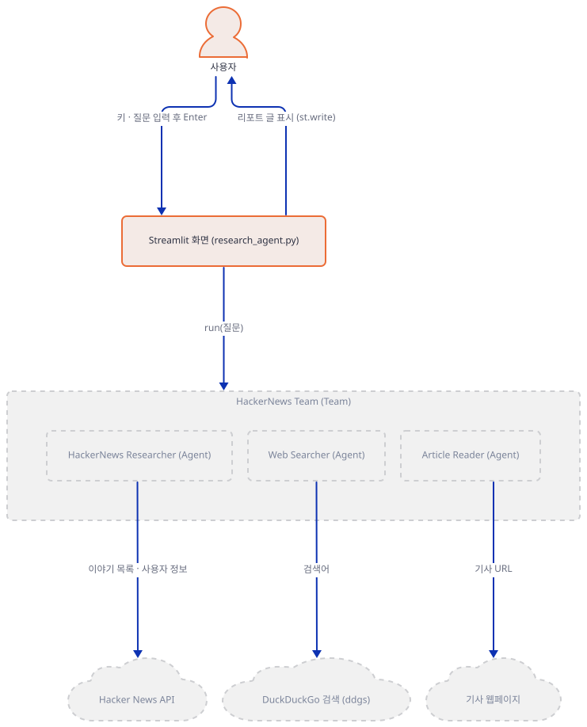

**확인.** 브라우저로 띄우는 명령은 이렇습니다.

```bash
uv run --no-project streamlit run research_agent.py
```

이 문서는 브라우저 대신 `AppTest`(Streamlit이 브라우저 없이 스크립트를 실행하고 위젯을 코드로 조작하게 해 주는 도구)로 같은 스크립트를 돌렸습니다. 앱 폴더에 `check_env.py`를 저장합니다. 쉘이 내보낸 키를 흉내 내려고 첫 줄에서 환경변수를 직접 채웁니다.

`check_env.py`

```python
import os

os.environ["OPENAI_API_KEY"] = "sk-from-shell"

from streamlit.testing.v1 import AppTest

print("start        :", repr(os.environ["OPENAI_API_KEY"]))
a = AppTest.from_file("research_agent.py", default_timeout=60)
a.run()
print("session A load:", repr(os.environ["OPENAI_API_KEY"]))
a.text_input[0].set_value("sk-typed-in-A")
a.run()
print("A typed key  :", repr(os.environ["OPENAI_API_KEY"]))
b = AppTest.from_file("research_agent.py", default_timeout=60)
b.run()
print("session B load:", repr(os.environ["OPENAI_API_KEY"]))
print("no key :", len(b.text_input), [t.label for t in b.text_input])
print("with key:", len(a.text_input), [t.label for t in a.text_input])
```

```bash
uv run --no-project python check_env.py
```

직접 확인한 출력(맨 위의 `missing ScriptRunContext!` 같은 경고는 뺐습니다):

```
start        : 'sk-from-shell'
session A load: ''
A typed key  : 'sk-typed-in-A'
session B load: ''
no key : 1 ['OpenAI API Key']
with key: 2 ['OpenAI API Key', 'Enter your report query']
```

화면을 연 것만으로 쉘의 키가 `''`가 되었고, 세션 A가 키를 넣은 뒤 새 세션 B가 열리자 A의 키도 지워졌습니다. 에이전트는 리런마다 새로 만들어지고 키는 모델을 처음 부를 때 읽히므로, A가 키를 넣은 뒤 질문을 보내기 전에 다른 세션이 열리면 A의 모델은 키를 못 찾습니다. 빈 키로 요청을 보내는 것이 아니라 요청 자체를 보내지 않고 `OPENAI_API_KEY not set` 오류로 끝납니다(소스로 확인, 같은 파일 109~113행. 아래 `check_empty.py`로 직접 확인). 리더가 그렇게 되면 화면에 그 문장이 글자로 뜨고, 멤버만 그렇게 되면 리더가 그 멤버의 결과 없이 요약을 쓸 수 있습니다(이 부분은 소스를 읽은 추정이고 돌려 보지 않았습니다). 반대로 한 세션이 넣은 키가 다른 세션의 요청에도 쓰일 수 있으니 여럿이 쓰는 서버에는 맞지 않는 구조입니다. 화면 상태는 마지막 두 줄처럼 키가 없을 때 입력 위젯 하나, 있을 때 둘이었습니다. 키가 빈 문자열이면 요청이 안 나간다는 것은 따로 확인합니다. 앱 폴더에 `check_empty.py`를 저장합니다.

`check_empty.py`

```python
import os

os.environ["AGNO_TELEMETRY"] = "false"
os.environ["OPENAI_BASE_URL"] = "http://127.0.0.1:62143/v1"
os.environ["OPENAI_API_KEY"] = ""

from agno.agent import Agent
from agno.models.openai import OpenAIChat

result = Agent(model=OpenAIChat(id="gpt-4o-mini")).run("hi")
print(result.status, "|", result.content)
```

```bash
uv run --no-project python check_empty.py
```

직접 확인한 출력(`ERROR` 로그 두 줄은 뺐습니다. 62143에 서버가 없는데도 `Connection error.`가 아니라 키 오류가 나왔고, 가짜 서버를 띄운 채 돌렸을 때도 서버에 들어온 요청은 0건이었습니다):

```
RunStatus.error | OPENAI_API_KEY not set. Please set the OPENAI_API_KEY environment variable.
```

서버만 띄워 응답을 보려면 `--server.address localhost`를 붙입니다. 안 붙이면 Streamlit이 시작하며 외부 IP를 알아내려고 `checkip.amazonaws.com`에 접속합니다(Day 054가 확인한 사실).

```bash
uv run --no-project streamlit run research_agent.py --server.headless true --server.address localhost --server.port 63517 --browser.gatherUsageStats false
```

다른 터미널에서 `curl -s -o /dev/null -w "%{http_code}\n" http://localhost:63517`을 부르면 `200`이, `curl -s http://localhost:63517/_stcore/health`는 `ok`가 나옵니다(직접 확인). PowerShell이면 `(Invoke-WebRequest -Uri http://localhost:63517 -UseBasicParsing).StatusCode`입니다(실행해 보지 못했습니다). 서버는 `Ctrl+C`로 멈춥니다.

### Step 3. 세 멤버와 도구 — 이야기 목록은 질문을 모릅니다

**목적.** 멤버 셋이 쥔 도구가 모델에 어떤 함수로 보이는지, 그 함수가 실제로 어디에 요청하는지 확인합니다.

**할 일.**

`advanced_ai_agents/multi_agent_apps/multi_agent_researcher/research_agent.py:21-41`

```python
    hn_researcher = Agent(
        name="HackerNews Researcher",
        model=OpenAIChat(id="gpt-4o-mini"),
        role="Gets top stories from hackernews.",
        tools=[HackerNewsTools()],
    )

    web_searcher = Agent(
        name="Web Searcher",
        model=OpenAIChat(id="gpt-4o-mini"),
        role="Searches the web for information on a topic",
        tools=[DuckDuckGoTools()],
        add_datetime_to_context=True,
    )

    article_reader = Agent(
        name="Article Reader",
        model=OpenAIChat(id="gpt-4o-mini"),
        role="Reads articles from URLs.",
        tools=[Newspaper4kTools()],
    )
```

세 에이전트는 이름, 역할, 도구가 다르고 모델은 같은 모양의 `OpenAIChat`을 각자 새로 만듭니다. `role`이 팀 리더의 멤버 명단에 들어간다는 것은 Day 081 Step 3가 확인했고, 여기서는 Step 6에서 실제 요청으로 봅니다. 도구가 모델에 보이는 함수 이름과, HackerNews 함수의 시그니처를 확인합니다.

```bash
uv run --no-project python -c "
import inspect
from agno.tools.hackernews import HackerNewsTools
from agno.tools.duckduckgo import DuckDuckGoTools
from agno.tools.newspaper4k import Newspaper4kTools
for t in (HackerNewsTools(), DuckDuckGoTools(), Newspaper4kTools()):
    print(type(t).__name__, sorted(t.functions))
print(inspect.signature(HackerNewsTools.get_top_hackernews_stories))
print(inspect.signature(DuckDuckGoTools.web_search))
"
```

직접 확인한 출력(`nltk` 경고는 뺐습니다):

```
HackerNewsTools ['get_top_hackernews_stories', 'get_user_details']
DuckDuckGoTools ['search_news', 'web_search']
Newspaper4kTools ['read_article']
(self, num_stories: int = 10) -> str
(self, query: str, max_results: int = 5) -> str
```

`HackerNewsTools`의 이야기 함수는 `num_stories` 하나만 받고 검색어가 없습니다. 소스를 보면 `https://hacker-news.firebaseio.com/v0/topstories.json`에서 인기 이야기 번호를 받아 앞에서 `num_stories`개를 `item/{번호}.json`으로 하나씩 내려받아 돌려줍니다(소스로 확인, agno 3.1.2의 `agno/tools/hackernews.py` 37~70행). 그래서 팀의 첫 지시문 "search hackernews for what the user is asking about"는 이 도구로는 실행할 수 없고, HackerNews 멤버는 질문과 상관없이 지금의 인기 이야기를 받습니다. 질문에 맞는 이야기는 이후 웹 검색에서 나올 수밖에 없습니다. 기사 도구는 `newspaper.article(url)`로 주소를 내려받아 제목·저자·본문·날짜를 JSON 글로 돌려주고(`agno/tools/newspaper4k.py` 50~91행), 실패하면 `Error reading article ...` 문장을 돌려줍니다. 길이 제한 인자 `article_length`의 기본값은 `None`이라 본문이 통째로 모델에 갑니다.

이 두 도구의 실제 코드를 외부에 나가지 않고 돌려 봅니다. `check_tools.py`가 내 PC에 가짜 HN 서버와 기사 페이지를 하나 띄우고, `httpx.get`이 `hacker-news.firebaseio.com`으로 가는 요청만 그쪽으로 돌립니다. 앱 폴더에 저장합니다.

`check_tools.py`

```python
import json
import os
import threading
from http.server import BaseHTTPRequestHandler, HTTPServer

os.environ["TLDEXTRACT_CACHE"] = "tldcache"

import httpx

PORT = 55731
requested = []

ARTICLE = b"<html><head><title>Rust 2.0 announced</title></head><body><article><h1>Rust 2.0 announced</h1><p>" + b"The Rust team announced a new edition today. " * 30 + b"</p></article></body></html>"


class Handler(BaseHTTPRequestHandler):
    def log_message(self, *args):
        pass

    def do_GET(self):
        requested.append(self.path)
        if self.path == "/v0/topstories.json":
            body, kind = json.dumps([101, 102, 103]).encode(), "application/json"
        elif self.path.startswith("/v0/item/"):
            story_id = int(self.path.split("/")[-1].split(".")[0])
            body, kind = json.dumps({"id": story_id, "by": "alice", "title": f"story {story_id}", "url": f"http://127.0.0.1:{PORT}/a/{story_id}"}).encode(), "application/json"
        else:
            body, kind = ARTICLE, "text/html"
        self.send_response(200)
        self.send_header("content-type", kind)
        self.send_header("content-length", str(len(body)))
        self.end_headers()
        self.wfile.write(body)


class Server(HTTPServer):
    allow_reuse_address = False


server = Server(("127.0.0.1", PORT), Handler)
threading.Thread(target=server.serve_forever, daemon=True).start()

original_get = httpx.get
httpx.get = lambda url, **kw: original_get(url.replace("https://hacker-news.firebaseio.com", f"http://127.0.0.1:{PORT}"), **kw)

from agno.tools.hackernews import HackerNewsTools
from agno.tools.newspaper4k import Newspaper4kTools

stories = json.loads(HackerNewsTools().get_top_hackernews_stories(2))
print("stories:", [(s["id"], s["username"], s["title"]) for s in stories])
print("requests:", requested)
article = json.loads(Newspaper4kTools().read_article(f"http://127.0.0.1:{PORT}/a/101"))
print("article keys:", sorted(article), "| title:", article["title"], "| text chars:", len(article["text"]))
server.shutdown()
```

```bash
uv run --no-project python check_tools.py
```

직접 확인한 출력(이 문서는 외부 접속을 막은 환경에서 돌려 아래 둘 앞에 공개 접미사 목록을 받지 못했다는 긴 오류 문구가 나왔고, 뺐습니다. 이유는 아래에 있습니다):

```
stories: [(101, 'alice', 'story 101'), (102, 'alice', 'story 102')]
requests: ['/v0/topstories.json', '/v0/item/101.json', '/v0/item/102.json']
article keys: ['text', 'title'] | title: Rust 2.0 announced | text chars: 1349
```

이야기 둘을 받는 데 요청이 3번(목록 1번에 이야기마다 1번)이고, 각 이야기에는 `by`를 복사한 `username`이 붙습니다(소스 37~70행의 `story["username"] = story.get("by", "unknown")`). 기사 도구는 가짜 페이지에서 제목과 본문을 뽑았고 저자·날짜가 없는 페이지라 그 키는 빠졌습니다. DuckDuckGo 도구는 외부 검색 서비스라 이 확인에서 부르지 않았고, `web_search`가 `ddgs`에 `backend="duckduckgo"`로 검색을 넘기는 것은 소스로만 확인했습니다(`agno/tools/websearch.py` 87~98행).

기사 도구를 처음 부르면 오류 문구가 길게 나오는 까닭은 `newspaper4k`가 주소의 도메인을 나누려고 쓰는 `tldextract` 패키지가 첫 사용 때 공개 접미사 목록을 `https://publicsuffix.org/list/public_suffix_list.dat`에서, 실패하면 `raw.githubusercontent.com`에서 받으려 하기 때문입니다(직접 확인: 접속을 막으면 두 주소를 모두 시도하고 `Exception reading Public Suffix List url ...`를 두 번 찍은 뒤 내장 사본으로 넘어갑니다). 결과는 캐시로 저장되는데, 위치는 `TLDEXTRACT_CACHE`가 있으면 그곳이고, 아니면 `XDG_CACHE_HOME`, 그것도 없고 `HOME`이 있으면 `~/.cache/python-tldextract/`이며, 셋 다 없으면(PowerShell 기본 환경이 보통 그렇습니다) 패키지 폴더 안의 `tldextract/.suffix_cache`입니다(소스로 확인, tldextract 5.4.0의 `tldextract/cache.py` 55~76행. 이 문서의 첫 실행이 홈에 그 폴더를 만들었고 지웠습니다). 그래서 아래 `check_tools.py`는 맨 위에서 `TLDEXTRACT_CACHE`를 앱 폴더의 `tldcache`로 돌립니다(`tldextract`를 import하기 전에 걸어야 합니다). 이 앱의 외부 서비스 목록에 공개 접미사 서버가 하나 더 있는 셈입니다. 홈에 캐시를 남기기 싫으면 `TLDEXTRACT_CACHE`를 다른 폴더로 돌립니다.

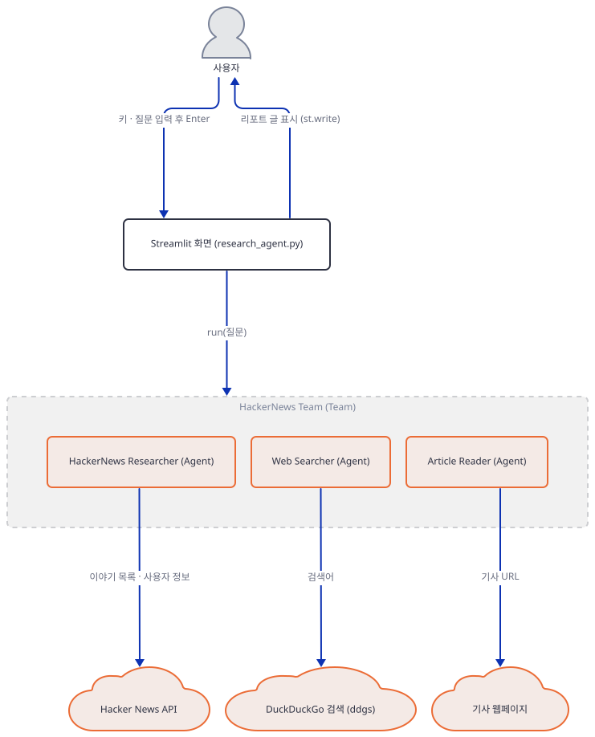

**확인.** 위 출력의 `requests:` 줄에서 이야기 둘에 요청 셋이 나갔는지 봅니다. 끝나면 `check_tools.py`와 `tldcache` 폴더를 지웁니다.

### Step 4. 팀 리더 — 지시문과 쓰이지 않는 인자

**목적.** `Team`이 어떻게 구성되는지, 그리고 두 인자 `debug_mode`와 `show_members_responses`가 무엇을 하는지 확인합니다.

**할 일.**

`advanced_ai_agents/multi_agent_apps/multi_agent_researcher/research_agent.py:43-57`

```python
    hackernews_team = Team(
        name="HackerNews Team",
        model=OpenAIChat(id="gpt-4o-mini"),
        members=[hn_researcher, web_searcher, article_reader],
        instructions=[
            "First, search hackernews for what the user is asking about.",
            "Then, ask the article reader to read the links for the stories to get more information.",
            "Important: you must provide the article reader with the links to read.",
            "Then, ask the web searcher to search for each story to get more information.",
            "Finally, provide a thoughtful and engaging summary.",
        ],
        markdown=True,
        debug_mode=True,
        show_members_responses=True,
    )
```

`mode`를 지정하지 않아 기본값 `coordinate`로 동작하고 위임이 리더 모델의 `delegate_task_to_member` 도구 호출로 일어나는 것은 Day 081 Step 5가 확인한 사실과 같습니다. 이 앱의 지시문 다섯 줄은 순서를 못 박습니다. 이야기를 찾고, 링크를 기사 읽기 멤버에게 주고, 웹 검색을 시키고, 요약합니다. Step 3에서 본 대로 첫 줄은 도구 능력과 어긋납니다. 이어지는 두 인자는 확인이 필요합니다.

```bash
uv run --no-project python -c "
from agno.agent import Agent
from agno.team import Team
from agno.models.openai import OpenAIChat
a = Agent(name='HackerNews Researcher', model=OpenAIChat(id='gpt-4o-mini', api_key='x'))
t = Team(name='HackerNews Team', model=OpenAIChat(id='gpt-4o-mini', api_key='x'), members=[a], show_members_responses=True, debug_mode=True)
print('mode:', t.mode, '| team debug:', t.debug_mode, '| member debug before init:', a.debug_mode)
t.initialize_team()
print('member debug after init:', a.debug_mode, '| id:', t.id, '| member id:', a.id)
"
```

직접 확인한 출력:

```
mode: TeamMode.coordinate | team debug: True | member debug before init: False
DEBUG   Team ID: hackernews-team
member debug after init: True | id: hackernews-team | member id: hackernews-researcher
```

`debug_mode=True`는 팀이 초기화될 때 멤버에게도 번집니다(소스로 확인, agno 3.1.2의 `agno/team/_init.py` 488~496행과 912행). 그 결과 질문 한 건에 DEBUG 로그가 169줄 나오고 모델에 가는 시스템 메시지와 도구 결과가 통째로 찍힙니다(직접 확인, 터미널 출력). 개인 질문이나 기사 본문이 서버 터미널에 남는다는 뜻입니다. `show_members_responses`는 agno 소스에서 팀의 `print_response` 화면 출력 함수(`agno/team/_cli.py` 97행·203행) 말고는 읽는 곳이 없어서, 이 앱이 부르는 `run()`에서는 아무 효과가 없습니다(소스로 확인, 저장 설정을 제외한 전체 검색). 멤버 id는 이름을 소문자와 하이픈으로 바꾼 값이고 리더는 이 id로 멤버를 부릅니다.

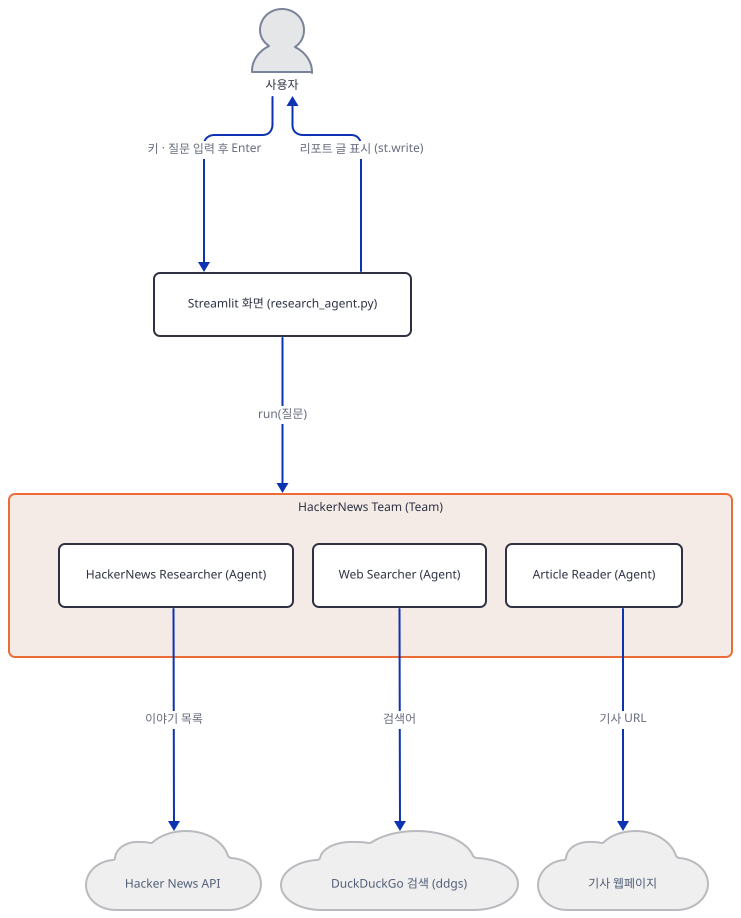

**확인.** 위 명령의 `mode:`와 `member debug after init:` 두 줄(사이에 `debug_mode`가 찍는 DEBUG 한 줄이 끼어 있습니다)이 그대로 나오는지 봅니다. 리더에게 가는 요청에 멤버 명단이 어떻게 들어가는지는 Step 6에서 봅니다.

### Step 5. 질문 입력과 실행 — 한 줄이 모델 호출 여러 번이 됩니다(대본으로는 10번)

**목적.** 질문이 들어와 `run()`이 불리고 결과가 화면에 그려지는 마지막 줄들을 읽습니다.

**할 일.**

`advanced_ai_agents/multi_agent_apps/multi_agent_researcher/research_agent.py:59-65`

```python
    # Input field for the report query
    query = st.text_input("Enter your report query")

    if query:
        # Get the response from the assistant
        response: RunOutput = hackernews_team.run(query, stream=False)
        st.write(response.content)
```

Day 081 Step 6과 같은 모양입니다. 버튼이 없어 `st.text_input`이 Enter나 포커스 아웃으로 값을 커밋하는 순간 `run`이 불립니다. 스피너가 없어 여러 번의 모델 호출이 끝날 때까지 화면에는 실행 중이라는 표시가 Streamlit의 기본 실행 표시뿐입니다. 응답을 다 기다리는 `stream=False`이고 `response.content`를 `st.write`로 찍습니다. 반환 타입 힌트 `RunOutput`은 에이전트용 타입이고 `Team.run()`은 `TeamRunOutput`을 돌려줍니다(Step 6에서 직접 확인). 둘 다 `.content`가 있어 동작합니다. 팀 에이전트 모두 리런마다 새로 만들어지고 대화 기록이 없으며, 모델 오류는 예외가 아니라 `content`의 문장이 되어 같은 줄로 그려집니다(직접 확인: 모델 서버가 응답하지 않자 화면에 `Connection error.`가 일반 글자로 나왔습니다).

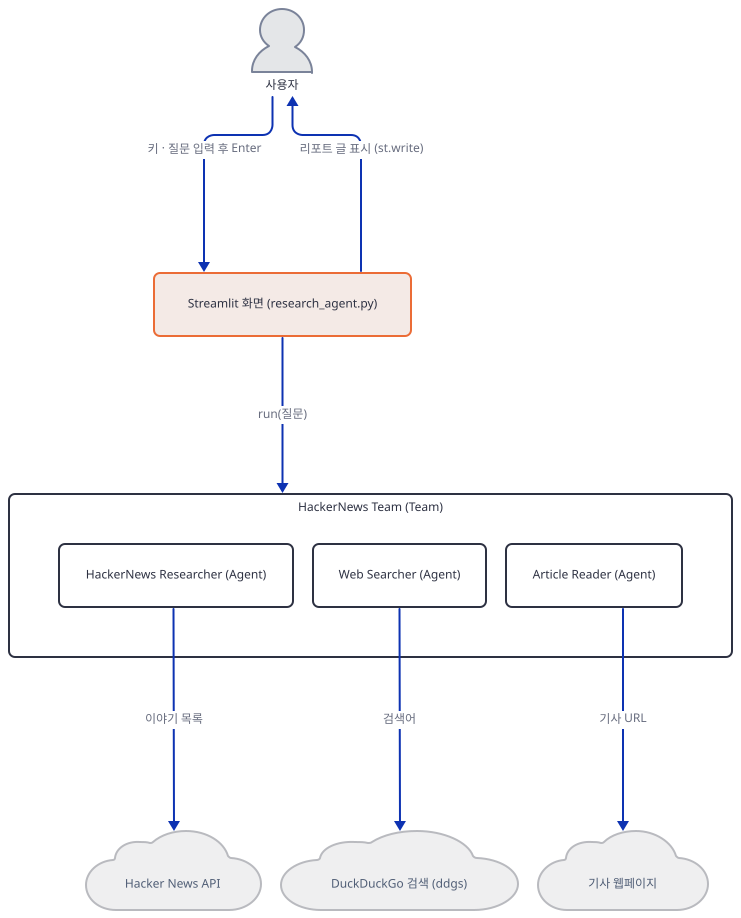

**확인.** 이 줄이 실제로 몇 번의 호출이 되는지는 다음 단계에서 셉니다.

### Step 6. 가짜 서버로 끝까지 — 호출 10번(대본), 도구 셋, 통계 넷

**목적.** OpenAI와 외부 서비스에 요청을 보내지 않고 질문 한 건의 흐름을 끝까지 돌려, 요청 수·멤버가 받는 내용·도구 호출·통계를 직접 셉니다.

**할 일.** `openai` 패키지는 환경변수 `OPENAI_BASE_URL`이 있으면 그 주소로 요청을 보냅니다. 앱 폴더에 파일 둘을 만듭니다. 첫째는 요청마다 한 줄을 찍는 가짜 모델 서버입니다. 리더가 멤버 셋을 차례로 부르게 하려고, 리더 요청에 들어 있는 `tool` 메시지 수에 따라 다음 위임 대상을 정합니다. 멤버는 도구가 있고 아직 결과를 못 받았으면 도구를 한 번 부르고, 결과를 받으면 짧은 글로 답합니다. `--verbose`를 주면 메시지 본문도 찍습니다. 포트가 이미 쓰이고 있어도 조용히 떠 버리는 일이 Windows에서 있어(문제 해결) 서버 클래스에서 `allow_reuse_address`를 끕니다.

`fake_openai.py`

```python
import json
import sys
from http.server import BaseHTTPRequestHandler, ThreadingHTTPServer

sys.stdout.reconfigure(encoding="utf-8")

# 리더가 부른 횟수(= 리더 요청에 들어 있는 tool 메시지 수)에 따라 다음 위임 대상을 정한다.
LEADER_PLAN = [
    ("hackernews-researcher", "Get the top 2 Hacker News stories about Rust."),
    ("article-reader", "Read the article at https://example.com/rust-story."),
    ("web-searcher", "Search the web for the Rust story."),
]


def tool_call(name, args):
    return {"role": "assistant", "content": None, "tool_calls": [
        {"id": "call_" + name, "type": "function", "function": {"name": name, "arguments": json.dumps(args)}}]}


def decide(tools, messages):
    tool_msgs = [m for m in messages if m["role"] == "tool"]
    if tools == ["delegate_task_to_member"]:  # 팀 리더
        if len(tool_msgs) < len(LEADER_PLAN):
            member, task = LEADER_PLAN[len(tool_msgs)]
            return tool_call("delegate_task_to_member", {"member_id": member, "task": task})
        return {"role": "assistant", "content": "FAKE SUMMARY"}
    if tool_msgs:  # 멤버: 도구 결과를 받았으면 글로 답한다
        return {"role": "assistant", "content": "FAKE MEMBER REPORT"}
    first = {"get_top_hackernews_stories": {"num_stories": 2}, "read_article": {"url": "https://example.com/rust-story"},
             "web_search": {"query": "Rust story", "max_results": 2}}
    for name, args in first.items():
        if name in tools:
            return tool_call(name, args)
    return {"role": "assistant", "content": "FAKE ANSWER"}


class Handler(BaseHTTPRequestHandler):
    def log_message(self, *args):
        pass

    def do_POST(self):
        body = json.loads(self.rfile.read(int(self.headers["content-length"])))
        tools = [t["function"]["name"] for t in body.get("tools", [])]
        print("POST", self.path, "| auth:", self.headers.get("authorization"), "| model:", body["model"], "| keys:", sorted(body), "| tools:", tools, flush=True)
        if "--verbose" in sys.argv:
            for m in body["messages"]:
                print(f"  [{m['role']}]", str(m.get("content"))[:1500], "| tool_calls:", m.get("tool_calls"), flush=True)
        message = decide(tools, body["messages"])
        reply = {
            "id": "chatcmpl-fake", "object": "chat.completion", "created": 0, "model": body["model"],
            "choices": [{"index": 0, "finish_reason": "tool_calls" if message.get("tool_calls") else "stop", "message": message}],
            "usage": {"prompt_tokens": 1, "completion_tokens": 1, "total_tokens": 2},
        }
        data = json.dumps(reply).encode()
        self.send_response(200)
        self.send_header("content-type", "application/json")
        self.send_header("content-length", str(len(data)))
        self.end_headers()
        self.wfile.write(data)


class Server(ThreadingHTTPServer):
    allow_reuse_address = False


Server(("127.0.0.1", int(sys.argv[1])), Handler).serve_forever()
```

둘째는 앱을 `AppTest`로 돌리는 확인 스크립트입니다. 세 도구는 부르는 대신 호출 인자만 모아 두고 고정 문자열을 돌려주는 대역으로 바꿉니다(`functools.wraps`로 함수 이름과 시그니처를 보존해야 모델에 가는 도구 스키마가 그대로입니다). agno의 통계 전송 함수는 보내는 대신 모아 둡니다(agno 3.1.2의 내부 함수라 다른 버전에서는 안 먹을 수 있습니다). 이 대역은 Step 3에서 도구 코드를 이미 돌려 본 것의 연장이고, 이 단계의 관심은 모델이 도구를 어떤 인자로 부르는가입니다.

`check_flow.py`

```python
import functools
import os

os.environ["OPENAI_BASE_URL"] = "http://127.0.0.1:62143/v1"

from agno.api.api import Api
from agno.team import Team
from agno.tools.duckduckgo import DuckDuckGoTools
from agno.tools.hackernews import HackerNewsTools
from agno.tools.newspaper4k import Newspaper4kTools
from streamlit.testing.v1 import AppTest

calls, posts = [], []


def stub(original, text):
    @functools.wraps(original)
    def run(self, *args, **kwargs):
        calls.append((original.__name__, args, kwargs))
        return text
    return run


HackerNewsTools.get_top_hackernews_stories = stub(HackerNewsTools.get_top_hackernews_stories, "STUB STORIES")
Newspaper4kTools.read_article = stub(Newspaper4kTools.read_article, "STUB ARTICLE")
DuckDuckGoTools.web_search = stub(DuckDuckGoTools.web_search, "STUB SEARCH")
outputs = []
original_team_run = Team.run


def spy_team_run(self, *args, **kwargs):
    result = original_team_run(self, *args, **kwargs)
    outputs.append(type(result).__name__)
    return result


Team.run = spy_team_run
Api.post_in_background = lambda self, route, payload: posts.append((route, payload["data"].get("team_id") or payload["data"].get("agent_id")))

at = AppTest.from_file("research_agent.py", default_timeout=120)
at.run()
at.text_input[0].set_value("sk-test")
at.run()
at.text_input[1].set_value("What is trending on Hacker News about Rust?")
at.run()
print("tool calls:", calls)
print("Team.run returned:", outputs)
print("page text:", [m.value for m in at.markdown])
print("telemetry:", posts)
```

첫 터미널(앱 폴더)에서 가짜 서버를 띄웁니다.

```bash
uv run --no-project python fake_openai.py 62143
```

둘째 터미널(앱 폴더)에서 확인 스크립트를 돌립니다.

```bash
uv run --no-project python check_flow.py
```

직접 확인한 출력(`debug_mode`가 찍는 DEBUG 169줄과 경고는 뺐습니다. 한국어 Windows 콘솔처럼 인코딩이 cp949이면 DEBUG를 파일로 받을 때 `--- Logging error ---` 오류 한 건이 같이 나왔고 문제 해결에 있습니다):

```
tool calls: [('get_top_hackernews_stories', (), {'num_stories': 2}), ('read_article', (), {'url': 'https://example.com/rust-story'}), ('web_search', (), {'query': 'Rust story', 'max_results': 2})]
Team.run returned: ['TeamRunOutput']
page text: ['FAKE SUMMARY']
telemetry: [('/telemetry/runs', 'hackernews-researcher'), ('/telemetry/runs', 'article-reader'), ('/telemetry/runs', 'web-searcher'), ('/telemetry/runs', 'hackernews-team')]
```

첫 터미널(가짜 서버)에는 요청이 열 줄 찍힙니다.

```
POST /v1/chat/completions | auth: Bearer sk-test | model: gpt-4o-mini | keys: ['messages', 'model', 'tools'] | tools: ['delegate_task_to_member']
POST /v1/chat/completions | auth: Bearer sk-test | model: gpt-4o-mini | keys: ['messages', 'model', 'tools'] | tools: ['get_top_hackernews_stories', 'get_user_details']
POST /v1/chat/completions | auth: Bearer sk-test | model: gpt-4o-mini | keys: ['messages', 'model', 'tools'] | tools: ['get_top_hackernews_stories', 'get_user_details']
POST /v1/chat/completions | auth: Bearer sk-test | model: gpt-4o-mini | keys: ['messages', 'model', 'tools'] | tools: ['delegate_task_to_member']
POST /v1/chat/completions | auth: Bearer sk-test | model: gpt-4o-mini | keys: ['messages', 'model', 'tools'] | tools: ['read_article']
POST /v1/chat/completions | auth: Bearer sk-test | model: gpt-4o-mini | keys: ['messages', 'model', 'tools'] | tools: ['read_article']
POST /v1/chat/completions | auth: Bearer sk-test | model: gpt-4o-mini | keys: ['messages', 'model', 'tools'] | tools: ['delegate_task_to_member']
POST /v1/chat/completions | auth: Bearer sk-test | model: gpt-4o-mini | keys: ['messages', 'model', 'tools'] | tools: ['search_news', 'web_search']
POST /v1/chat/completions | auth: Bearer sk-test | model: gpt-4o-mini | keys: ['messages', 'model', 'tools'] | tools: ['search_news', 'web_search']
POST /v1/chat/completions | auth: Bearer sk-test | model: gpt-4o-mini | keys: ['messages', 'model', 'tools'] | tools: ['delegate_task_to_member']
```

읽을 것은 다섯입니다. 첫째, 질문 한 건에 모델 요청이 10번입니다. 리더가 4번(위임 셋과 최종 요약), 멤버가 도구를 쓰는 데 2번씩 6번입니다. 도구가 없는 질문이면 줄어듭니다. 이 수는 이 가짜 서버가 짠 순서의 수이고 진짜 모델이 위임을 몇 번 하는지는 확인하지 못했습니다. 둘째, 최상위 키는 `messages`·`model`·`tools`뿐이고 키 `sk-test`는 화면에 붙여넣은 값이 `Authorization` 헤더로 갔습니다. 셋째, 도구 이름은 Step 3의 함수 이름 그대로 모델에 갑니다. 넷째, 멤버가 받는 내용입니다. `--verbose`로 서버를 띄우고 다시 돌리면 둘째 요청(HackerNews 멤버의 첫 요청)이 이렇게 찍힙니다.

```
  [developer] <your_role>
Gets top stories from hackernews.
</your_role> | tool_calls: None
  [user] Get the top 2 Hacker News stories about Rust. | tool_calls: None
```

멤버의 시스템 메시지는 `role` 한 덩어리뿐이고 사용자 메시지는 리더가 `task`에 적은 문장 하나입니다. 질문 원문도 대화 기록도 가지 않습니다. 그래서 리더가 링크와 맥락을 `task`에 실어 보내야 하고, 지시문의 "you must provide the article reader with the links"가 그 때문에 있습니다. Web Searcher의 요청에만 `<additional_information>`에 현재 시각이 붙습니다(`add_datetime_to_context=True`, 직접 확인). 리더의 첫 요청은 지시문 다섯 줄 뒤에 `<team_members>` 목록으로 `<member id="hackernews-researcher" name="HackerNews Researcher">`와 `Role: Gets top stories from hackernews.` 같은 항목이 셋 들어가고, 리더의 마지막 요청에는 질문, 위임 호출 셋, 멤버 보고서 셋이 쌓여 있습니다(직접 확인). 첫째 위임은 서버 대본이 정한 것이고 진짜 모델이 같은 순서를 고를지는 모릅니다. 다섯째, 통계는 4건입니다. 멤버 `Agent.run`이 성공할 때마다 1건씩 셋, 팀 `Team.run`이 성공해 1건입니다. 각 전송에는 id와 모델·기능 유무 표시만 들어가고 질문 내용은 없다는 것은 Day 102·Day 047이 확인한 같은 메커니즘이며 이 문서는 건수와 id만 직접 셌습니다. `AGNO_TELEMETRY=false`로 끕니다(Day 047 Step 5). 끝나면 첫 터미널에서 `Ctrl+C`로 서버를 멈추고 파일들을 지웁니다.

모델 호출과 통계 화살표는 구조 그림 둘로 따로 그렸습니다. 리더와 멤버 셋이 각자 모델 객체를 가지므로 화살표가 넷입니다.

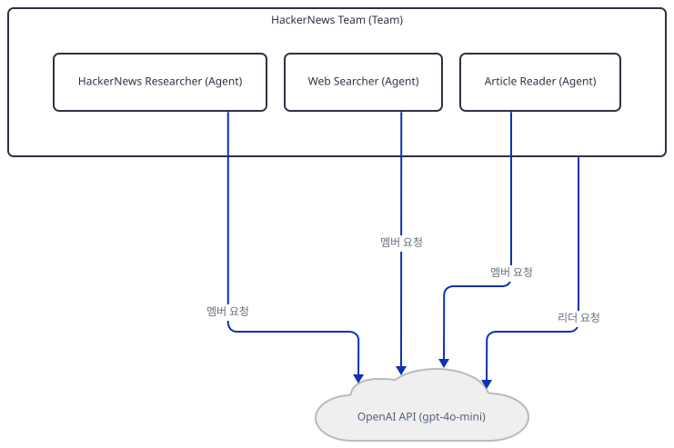

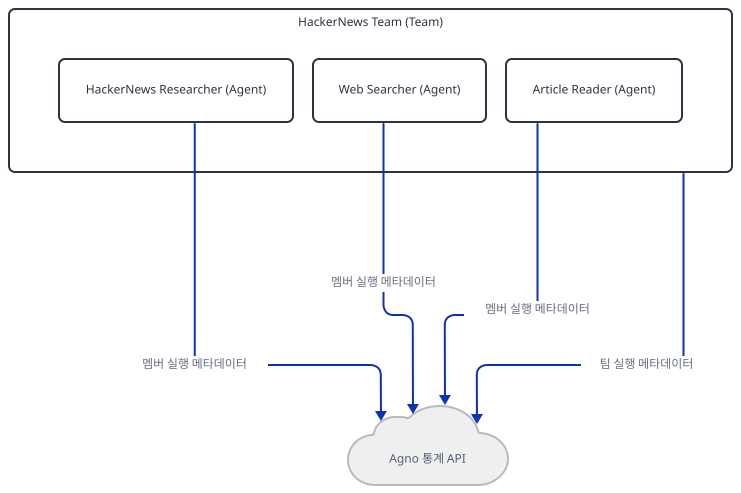

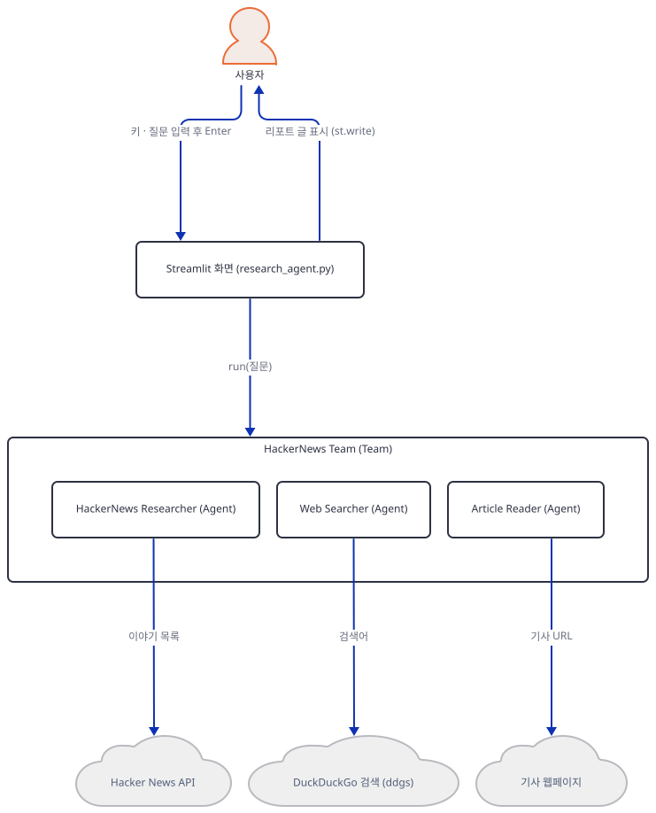

**확인.** 서버 터미널에 요청 열 줄이 찍히고 `check_flow.py`의 마지막 네 줄이 위와 같으면 됩니다.

### Step 7. Ollama판 — `max_tokens`가 에이전트를 만들지 못하게 합니다

**목적.** `research_agent_llama3.py`가 OpenAI판과 무엇이 다른지, 왜 오늘 그대로는 돌지 않는지, 한 줄을 고치면 어디로 요청이 가는지 확인합니다. 실제 Ollama에는 묻지 않습니다.

**할 일.** 두 파일의 차이는 모델뿐입니다. 앱 README에는 이 파일 설명이 없습니다. 파일 첫머리 `research_agent_llama3.py:9`에 `from agno.models.ollama import Ollama`가 있고 에이전트 셋과 팀 모두 같은 줄을 씁니다.

`advanced_ai_agents/multi_agent_apps/multi_agent_researcher/research_agent_llama3.py:15-21`

```python
# Create the specialized agents
hn_researcher = Agent(
    name="HackerNews Researcher",
    model=Ollama(id="llama3.2", max_tokens=1024),
    role="Gets top stories from hackernews.",
    tools=[HackerNewsTools()],
)
```

이 파일에는 키 게이트도 `if`도 없어서 에이전트와 팀이 import 시점에 만들어지고, `if query:`(57행)만 입력을 기다립니다. 그런데 agno의 `Ollama`는 `max_tokens`라는 인자가 없습니다. 필드는 `options`, `format`, `keep_alive`, `host` 등이고 응답 길이 제한은 Ollama가 부르는 이름인 `options={"num_predict": 1024}`로 넣어야 합니다(소스로 확인, agno 3.1.2의 `agno/models/ollama/chat.py` 40~49행). 서버 주소는 `host` 인자가 없으면 `ollama` 패키지가 환경변수 `OLLAMA_HOST`, 그것도 없으면 `http://127.0.0.1:11434`로 정합니다(소스로 확인, `ollama/_client.py` 117행). 한 가지 더, 환경변수 `OLLAMA_API_KEY`가 있으면 host가 비었을 때 `https://ollama.com`으로 바뀝니다(`chat.py` 56~66행). 이 문서의 확인은 모두 `OLLAMA_HOST`를 가짜 서버로 돌려 실제 Ollama를 건드리지 않았고, 이 PC에서는 `OLLAMA_API_KEY`가 비어 있었습니다.

앱 폴더에 가짜 Ollama 서버와 확인 스크립트를 저장합니다. 서버는 `/api/chat` 요청의 모델·옵션·스트리밍·도구를 찍고 고정 응답을 돌려줍니다.

`fake_ollama.py`

```python
import json
import sys
from http.server import BaseHTTPRequestHandler, ThreadingHTTPServer

sys.stdout.reconfigure(encoding="utf-8")


class Handler(BaseHTTPRequestHandler):
    def log_message(self, *args):
        pass

    def do_POST(self):
        body = json.loads(self.rfile.read(int(self.headers["content-length"])))
        tools = [t["function"]["name"] for t in body.get("tools", [])]
        print("POST", self.path, "| model:", body["model"], "| keys:", sorted(body), "| options:", body.get("options"),
              "| stream:", body.get("stream"), "| tools:", tools, flush=True)
        message = {"role": "assistant", "content": "FAKE LLAMA ANSWER"}
        reply = {"model": body["model"], "created_at": "2026-10-09T00:00:00Z", "message": message, "done": True, "done_reason": "stop"}
        data = json.dumps(reply).encode()
        self.send_response(200)
        self.send_header("content-type", "application/json")
        self.send_header("content-length", str(len(data)))
        self.end_headers()
        self.wfile.write(data)


class Server(ThreadingHTTPServer):
    allow_reuse_address = False


Server(("127.0.0.1", int(sys.argv[1])), Handler).serve_forever()
```

`check_llama.py` (성공한 팀 실행은 agno 통계를 `os-api.agno.com`에 보내므로 맨 위에서 꺼 둡니다. 직접 확인: 끄지 않고 고친 파일을 돌리면 통계 전송 시도가 1건 있었습니다)

```python
import os
import sys

os.environ["OLLAMA_HOST"] = "127.0.0.1:56402"
os.environ["AGNO_TELEMETRY"] = "false"

from streamlit.testing.v1 import AppTest

script = sys.argv[1]
at = AppTest.from_file(script, default_timeout=60)
at.run()
print(script, "| exceptions:", [(e.value[:90]) for e in at.exception])
print(script, "| widgets:", len(at.text_input), [t.label for t in at.text_input])
if len(at.text_input):
    at.text_input[0].set_value("What is trending on Hacker News about Rust?")
    at.run()
    print(script, "| page text:", [m.value for m in at.markdown])
```

고친 복사본은 원본 폴더를 건드리지 않게 `sed`로 만듭니다(PowerShell이면 편집기로 네 군데(18·25·33·40행, 에이전트 셋과 팀)의 `max_tokens=1024`를 `options={"num_predict": 1024}`로 바꿔도 됩니다).

```bash
sed 's/max_tokens=1024/options={"num_predict": 1024}/' research_agent_llama3.py > llama3_fixed.py
uv pip install ollama
```

첫 터미널에서 `uv run --no-project python fake_ollama.py 56402`로 서버를 띄우고, 둘째 터미널에서 두 파일을 차례로 돌립니다.

```bash
uv run --no-project python check_llama.py research_agent_llama3.py
uv run --no-project python check_llama.py llama3_fixed.py
```

직접 확인한 출력(경고는 뺐습니다):

```
research_agent_llama3.py | exceptions: ["Ollama.__init__() got an unexpected keyword argument 'max_tokens'"]
research_agent_llama3.py | widgets: 0 []
llama3_fixed.py | exceptions: []
llama3_fixed.py | widgets: 1 ['Enter your report query']
llama3_fixed.py | page text: ['FAKE LLAMA ANSWER']
```

첫 터미널에는 고친 파일의 요청이 한 줄 찍힙니다.

```
POST /api/chat | model: llama3.2 | keys: ['messages', 'model', 'options', 'stream', 'tools'] | options: {'num_predict': 1024} | stream: False | tools: ['delegate_task_to_member']
```

원본은 화면에 오류만 뜨고 입력창이 생기지 않았으며 가짜 서버에는 요청이 한 건도 오지 않았습니다. agno를 최소 버전 2.2.10으로 따로 깔아 같은 `Ollama(id="llama3.2", max_tokens=1024)`를 만들어도 같은 `TypeError`가 났습니다(직접 확인). 즉 이 파일은 확인한 최소 버전 2.2.10과 오늘 설치되는 3.1.2 모두에서 에이전트를 만들지 못합니다. 2.2.10 확인은 새 가상환경에 `uv pip install agno==2.2.10 ollama openai`를 하고 같은 `Ollama(id="llama3.2", max_tokens=1024)`와 `options={"num_predict": 1024}`를 만들어 본 것입니다(앞은 같은 `TypeError`, 뒤는 `{'num_predict': 1024}`로 만들어졌습니다). 고친 판은 요청이 `/api/chat`으로 가고 `options`에 `num_predict`가 실렸으며 스트리밍은 꺼져 있고 도구 목록은 리더의 `delegate_task_to_member`였습니다. 모델이 도구 호출을 지원해야 팀이 돌아가는데 `llama3.2`가 그렇다는 것은 Ollama 라이브러리 페이지의 `tools` 표시로만 확인했고 실제 Ollama로 돌려 보지는 않았습니다. 이 단계의 구조는 아래와 같습니다.

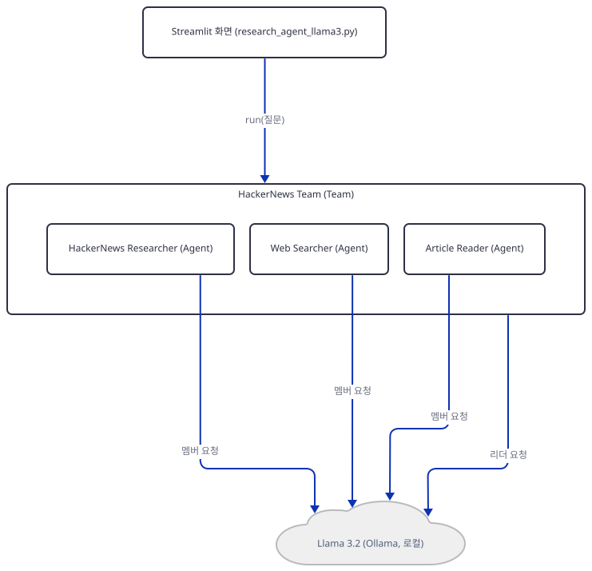


**확인.** 위 다섯 줄과 요청 한 줄이 나오는지 봅니다. 끝나면 서버를 멈추고 `fake_ollama.py`·`check_llama.py`·`llama3_fixed.py`를 지웁니다.

## 요청 한 건이 흐르는 과정

사용자가 질문을 적고 Enter를 누르면 리더가 멤버 셋을 차례로 부르는 흐름을 열 그림으로 나눠 따라갑니다. 배우가 많고 메시지가 40개를 넘어 한 그림에 다 넣으면 폭과 높이가 상한(1200×1000)을 넘으므로 앱의 시간 경계와 도구 호출 경계에서 나눴고, 메시지는 모두 원래 순서로 정확히 한 그림에 있습니다. 첫 그림을 뺀 아홉 장은 `extra-` 이름입니다.

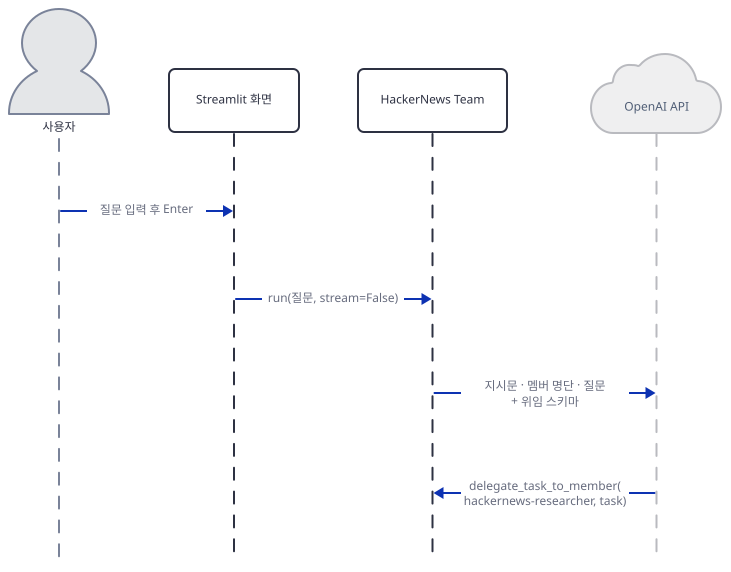

1단계는 화면이 `run`을 부르고, 리더가 지시문·멤버 명단·질문과 위임 도구 스키마를 모델에 보내 `delegate_task_to_member`를 받는 데까지입니다.

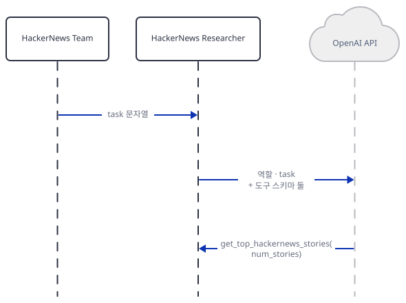

리더가 HackerNews 멤버에게 `task` 문자열만 넘깁니다. 멤버는 역할과 task에 도구 스키마 둘을 붙여 모델에 보내고 `get_top_hackernews_stories`를 요청받습니다.

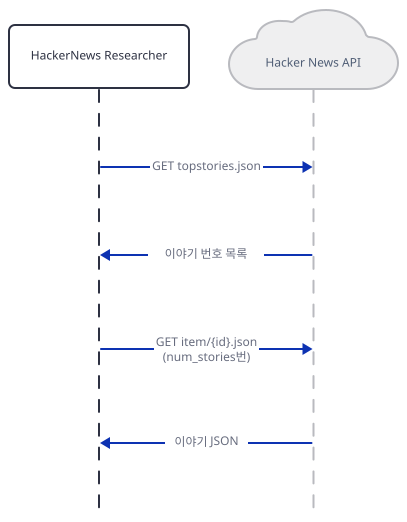

도구는 먼저 `topstories.json`으로 이야기 번호 목록을 받고, 그 번호 `num_stories`개마다 `item/{id}.json`을 따로 요청해 이야기 JSON을 받습니다(Step 3에서 요청 3건으로 확인).

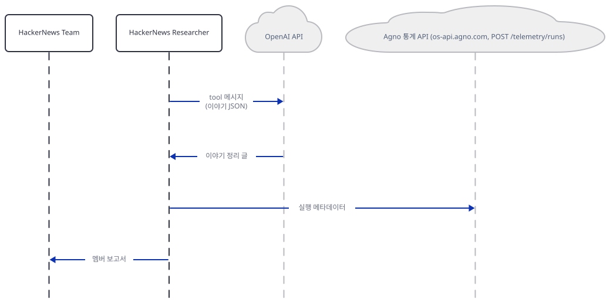

이야기 JSON이 `tool` 메시지로 모델에 가고, 정리 글을 받은 멤버가 통계 1건을 큐에 넣고 보고서를 리더에게 돌려줍니다.

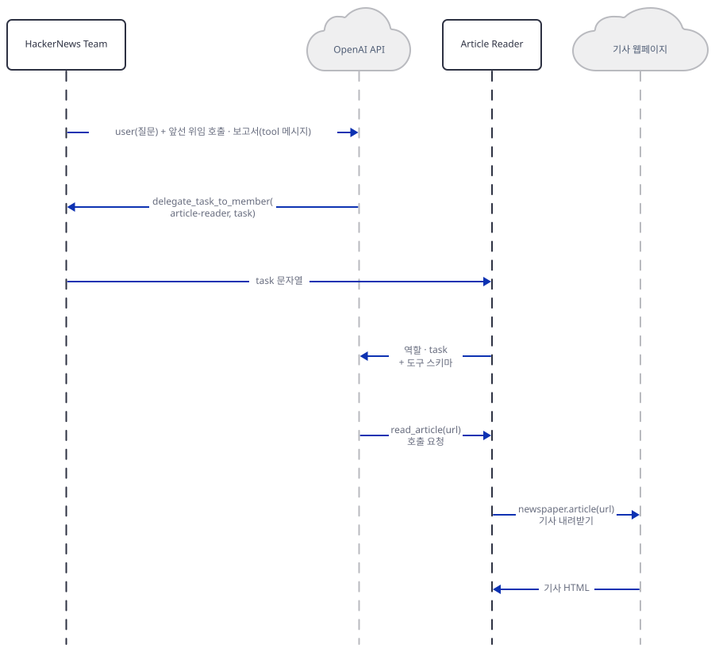

리더의 두 번째 요청에서 시작합니다. 그림의 "앞선 위임 호출·보고서"는 질문 뒤에 첫 위임 호출과 HN 멤버의 보고서가 `tool` 메시지로 쌓인 것입니다. 모델이 기사 읽기 멤버를 고르면 이 멤버가 `read_article`을 부르고 기사 서버에서 페이지를 받습니다.

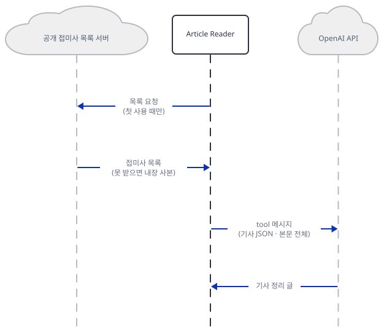

기사를 처음 읽을 때는 `tldextract`가 공개 접미사 목록 서버에도 요청합니다(Step 3, 직접 확인). 소스로 호출 시점을 정확히 가리지 않아 페이지를 받은 뒤로 그렸고, 못 받으면 내장 사본으로 넘어갑니다. 이어서 본문 전체가 든 기사 JSON이 `tool` 메시지로 모델에 가고 정리 글이 돌아옵니다. 기사 도구가 실패해도 오류 문장이 같은 길로 갑니다.

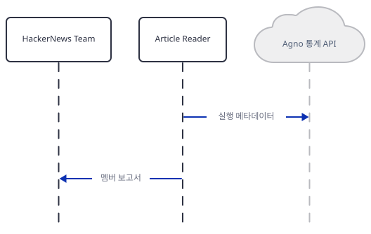

멤버가 통계 1건을 큐에 넣고 보고서를 리더에게 돌려줍니다.

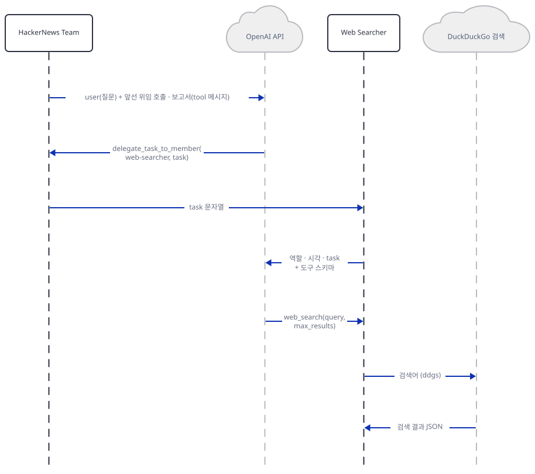

세 번째 위임입니다. 이 멤버의 요청에만 현재 시각이 붙고, `web_search`가 DuckDuckGo에서 제목·주소·본문 조각을 받습니다.

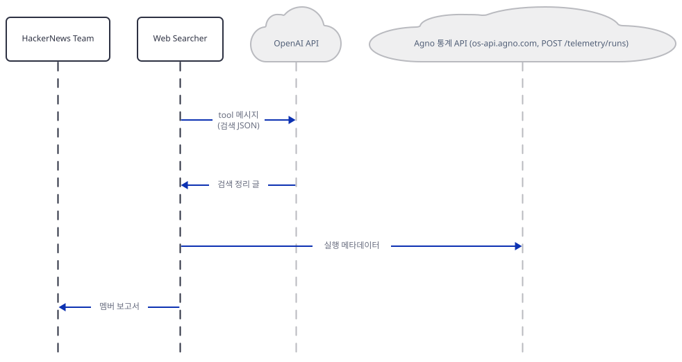

검색 JSON이 `tool` 메시지로 모델에 가고 정리 글을 받은 멤버가 통계 1건과 보고서를 보냅니다.

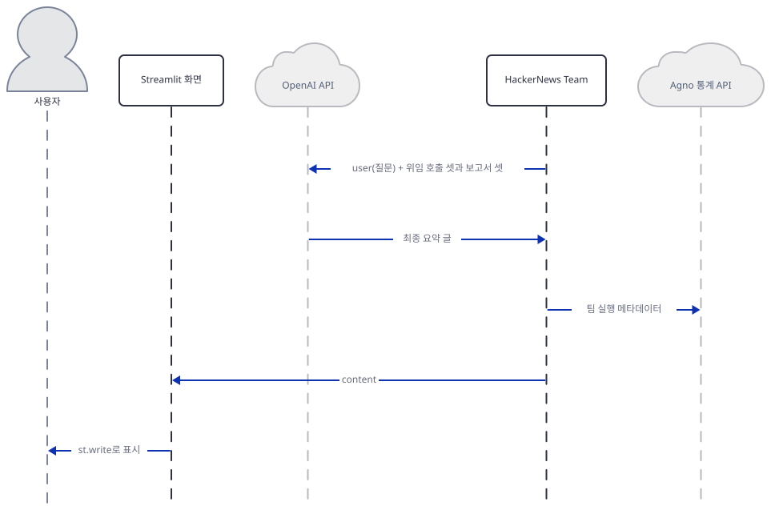

리더의 마지막 모델 요청입니다. 질문, 위임 호출 셋, 멤버 보고서 셋을 보고 요약 글을 받으면 팀의 통계 1건이 큐에 들어가고, 글이 `st.write`로 화면에 그려집니다. 이 시퀀스는 가짜 서버로 직접 돌려 본 것이고, 각 도구가 돌려주는 실제 내용과 진짜 모델의 위임 순서는 확인하지 못했습니다.

## 실행 체크리스트

- [ ] `uv venv`와 `uv pip install -r requirements.txt` 뒤 `imp.py`가 `ddgs`·`newspaper4k`·`ollama` 셋만 `FAIL`로 내는 것을 확인했다
- [ ] `uv pip install ddgs newspaper4k` 뒤 OpenAI판의 import가 모두 `ok`이고 `py_compile`이 `compiled`를 낸다
- [ ] 화면을 여는 것만으로 `OPENAI_API_KEY`가 `''`로 바뀐다는 것을 `check_env.py`로 봤다
- [ ] 이야기 도구가 검색어 없이 `num_stories`만 받고 이야기 둘에 요청 셋이 나가는 것을 `check_tools.py`로 봤다
- [ ] `show_members_responses`를 읽는 곳이 팀의 `print_response` 쪽뿐이고 `debug_mode`가 멤버에게 번지는 것을 확인했다
- [ ] 가짜 서버가 요청 10건을 받고 멤버 요청에는 `role`과 task만 있는 것을 봤다
- [ ] 도구 호출이 `get_top_hackernews_stories`·`read_article`·`web_search` 셋이고 통계가 4건인 것을 봤다
- [ ] `research_agent_llama3.py`가 `max_tokens` `TypeError`로 입력창도 만들지 못하고 `options={"num_predict": 1024}` 복사본은 `/api/chat`으로 가는 것을 봤다
- [ ] `check_tools.py`가 캐시를 앱 폴더의 `tldcache`로 보냈고, 끝나고 가짜 서버를 모두 멈췄다

## 문제 해결

| 증상 | 원인 | 해결 |
|---|---|---|
| ``ImportError: `ddgs` not installed. Please install using `pip install ddgs` `` (직접 확인) | `DuckDuckGoTools`가 `ddgs`를 가져오는데 `requirements.txt`에 없다 | `uv pip install ddgs` |
| ``ImportError: `newspaper4k` not installed. Please run `pip install newspaper4k lxml_html_clean`.`` (직접 확인) | 기사 도구용 패키지가 `requirements.txt`에 없다 | `uv pip install newspaper4k`(`lxml_html_clean`은 함께 깔린다, 직접 확인) |
| ``ImportError: `ollama` not installed. Please install using `pip install ollama` `` (직접 확인, Ollama판만) | Ollama 클라이언트가 `requirements.txt`에 없다 | `uv pip install ollama` |
| `TypeError: Ollama.__init__() got an unexpected keyword argument 'max_tokens'` (직접 확인) | agno의 `Ollama`에 `max_tokens`가 없다. agno 3.1.2와 2.2.10에서 모두 같았다 | 복사본에서 `options={"num_predict": 1024}`로 바꾼다(Step 7) |
| 질문을 넣었는데 글 대신 `Connection error.`가 일반 글자로 나옴 | 모델 서버에 닿지 못해도 `Team.run`이 예외 대신 오류 문장을 `content`에 담고 앱이 그대로 `st.write`한다(직접 확인) | 키·네트워크·`OPENAI_BASE_URL`을 확인한다 |
| 글 대신 `OPENAI_API_KEY not set. Please set the OPENAI_API_KEY environment variable.`이 나오거나, 요약에 멤버 결과가 빠지거나, 남의 세션 키가 쓰임 | 18행이 키를 프로세스 전체의 `os.environ`에 쓰고 모델이 첫 호출 때 읽는다(직접 확인: 두 세션을 열자 환경변수가 바뀌고, 빈 환경변수로는 요청이 나가지 않고 이 오류로 끝남) | 한 사람이 쓸 때만 쓴다. 복사본에서 `OpenAIChat(api_key=openai_api_key)`로 넘긴다 |
| 이야기가 질문과 상관없는 오늘의 인기 글 | `get_top_hackernews_stories`에 검색어 인자가 없다(직접 확인: 시그니처가 `num_stories`뿐) | 웹 검색 멤버의 결과로 맞춘다. 지시문을 현실에 맞게 고치는 것은 더 해보기 |
| 서버 터미널에 질문과 기사 본문이 길게 찍힘 | `debug_mode=True`가 멤버까지 퍼져 프롬프트와 도구 결과를 DEBUG로 찍는다(직접 확인: 질문 1건에 169줄) | 복사본에서 `debug_mode`를 지운다 |
| 터미널에 `--- Logging error ---`와 `UnicodeEncodeError: 'cp949' codec can't encode character '\u2014'` | 콘솔 인코딩이 cp949일 때 agno의 프롬프트에 든 `—`를 DEBUG 로그로 쓰다 난다(직접 확인: 출력을 파일로 돌릴 때 한 건. 앱 동작은 그대로) | `PYTHONUTF8=1`을 건다(PowerShell은 `$env:PYTHONUTF8 = "1"`, 실행해 보지 못했습니다. bash에서는 직접 확인: 사라짐) |
| 기사를 처음 읽을 때 `Exception reading Public Suffix List url ...` 오류가 길게 나옴 | `tldextract`가 공개 접미사 목록을 받으려다 못 받으면 내장 사본으로 넘어간다(직접 확인: 접속을 막은 환경) | 접속이 되면 목록을 받아 캐시한다. 캐시 위치는 `TLDEXTRACT_CACHE`로 정한다(없으면 `XDG_CACHE_HOME`, `~/.cache`, 패키지 폴더 순) |
| 가짜 서버를 띄웠는데 응답이 내가 만든 것이 아님 | 다른 프로세스가 이미 쓰는 포트에 두 번째 서버가 오류 없이 떴다. Windows에서 파이썬 서버의 기본 `allow_reuse_address`가 그렇게 한다(직접 확인: 이 문서를 만들다 한 번 겪었다) | `netstat -ano`로 포트를 먼저 보고 서버 클래스에서 `allow_reuse_address = False`로 둔다 |
| 가짜 서버가 `PermissionError: [WinError 10013]`로 뜨지 않음(Streamlit은 `Port ... is not available`) | Windows가 예약한 포트 범위에 들었다(직접 확인: 58917이 `netsh interface ipv4 show excludedportrange protocol=tcp`의 `58826 58925`에 들어 있었고, 이 문서를 만들 때 60731도 같은 이유로 쓸 수 없었다. 범위는 PC마다 다르다) | 위 `netsh` 명령으로 범위를 보고 그 밖의 번호로 바꾼다 |
| `AppTest`를 돌릴 때마다 `missing ScriptRunContext!` 경고 | `streamlit run` 없이 스크립트를 돌릴 때 Streamlit이 내는 안내다(직접 확인) | 무시한다 |

## 더 해보기

- `advanced_ai_agents/multi_agent_apps/multi_agent_researcher/research_agent.py:48`의 첫 지시문을 "Get the current top stories from hackernews (the tool cannot search by keyword)."처럼 현실에 맞게 고쳐, 리더가 HackerNews 멤버에게 같은 `task`를 보내는지 `check_flow.py`로 비교해 보세요. 가짜 서버는 대본대로만 움직이니 진짜 모델로 해야 결과가 의미 있습니다.
- `Newspaper4kTools(article_length=2000)`처럼 길이 제한을 걸어 Article Reader가 모델에 보내는 본문 길이가 어떻게 줄어드는지 Step 3의 `check_tools.py`로 재 보세요.
- Step 7의 고친 복사본에서 `Ollama(..., host="http://127.0.0.1:56402")`로 주소를 코드에 적어 `OLLAMA_HOST` 없이도 같은 요청이 가짜 서버에 오는지 확인하고, 실제 Ollama로 돌릴 때는 `llama3.2`가 위임 도구 호출을 제대로 내는지(작은 모델이라 어긋날 수 있습니다) 직접 보세요.

## 다음 날 예고

[Day 111 · 🤝 Multi-Agent Trust Layer - Secure Agent-to-Agent Communication](../day111-multi-agent-trust-layer/README.md) — 볼륨 7의 마지막 날입니다. 에이전트 등록, 신뢰 점수, 위임 체인, 정책 집행, 감사 기록을 한 파일 793줄(원본 앱 소스 기준)로 시연하는 앱이고, Day 111 문서가 소스로 확인한 대로 OpenAI를 부르는 코드가 없어 키가 필요 없습니다.
