# Day 111 · 🤝 Multi-Agent Trust Layer - Secure Agent-to-Agent Communication

> 볼륨 7 🚀 Advanced AI Agents · 난이도 ★☆☆ · 예상 소요 90분 · API 비용 $0(키가 필요 없습니다. 이 앱에는 OpenAI를 부르는 코드가 없습니다 — 소스로 확인, Step 1) · 원본 앱: `advanced_ai_agents/multi_agent_apps/multi_agent_trust_layer`

## 오늘 만들 것

Day 078에서 시작한 "🚀 Advanced AI Agents" 볼륨의 **마지막 날**(34일째)입니다. 오늘의 앱은 에이전트끼리 일을 맡기고 받을 때 "누가, 어떤 일을, 어디까지 해도 되는가"를 코드로 판정하는 신뢰 계층입니다. 793줄짜리 `multi_agent_trust_layer.py`(`wc -l` 기준, 마지막 줄에 개행 있음) 한 파일에 다섯 부품이 들어 있습니다. 신원 등록부, 0~1000점 신뢰 점수 엔진, 범위를 좁혀 가며 일을 맡기는 위임 관리자, 역할별 규칙을 묻는 정책 엔진, 판정마다 한 줄씩 쌓이는 감사 기록입니다. 이 다섯을 `TrustLayer` 창구 하나가 묶고, `GovernedAgent`가 모든 행동 전에 창구에 허락을 구합니다.

가장 먼저 알아 둘 것은 이 앱에 **LLM이 없다**는 점입니다. `from openai import OpenAI`(26행)가 있지만 파일 어디에서도 쓰지 않습니다. 에이전트가 하는 "행동"도 `f"Executed {action} with params {params}"` 문자열을 돌려주는 것이 전부입니다. 그래서 키도 네트워크도 필요 없고, 이 문서의 모든 확인은 설치만 하면 그대로 돌아갑니다.

비슷한 주제의 앞 날과는 이렇게 다릅니다. Day 090(신뢰 게이트 연구팀)은 에이전트마다 등록할 때 정한 0~100점을 임계값과 견주었고(신원 데이터클래스가 `frozen=True`, Day 090 Step 2), 임계값을 넘는 에이전트만 `gpt-4o-mini`를 부르는 파이프라인에 들였으며, 감사 로그는 SHA-256 해시체인이었습니다. Day 099(AI Agent Governance)는 도구 호출 직전에 파일 경로·도메인·분당 횟수·사람 승인 규칙으로 ALLOW·DENY·REQUIRE_APPROVAL을 냈고 `gpt-4`가 도구 호출 문장을 만들었으며 감사 기록은 메모리 리스트였습니다. 오늘 앱은 점수가 행동에 따라 오르내리고, 위임이 범위를 좁히며 이어지고, 규칙이 도구가 아니라 **역할**에 걸려 있다는 점이 새롭습니다. 대신 이 앱이 말로만 하고 실제로는 하지 않는 일이 꽤 있고, Step 7에서 하나씩 확인합니다.

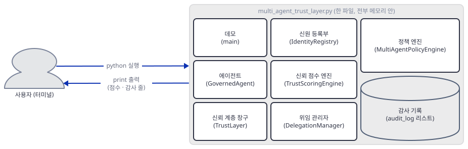

## 사전 준비

| 서비스/도구 | 용도 | 발급·설치 |
|---|---|---|
| uv, Python | 가상환경과 패키지 설치. 이 문서는 Python 3.13.3으로 확인했다. 코드의 `tuple[bool, str]`(402·519행)은 3.9 미만에서 정의 시점에 실패하므로 3.9 이상이 필요하다(소스로 확인, 3.8에서는 실행해 보지 못함. 앱 README는 3.8+라고 적었다) | [공통 사전 준비](../README.md#공통-사전-준비-한-번만) 참고 |
| API 키 | 필요 없다. 앱 README는 "OpenAI API key (or any LLM provider)"를 요구하지만 코드는 환경변수를 읽지 않는다(Step 1의 `grep`) | 해당 없음 |

모델을 부르지 않으므로 모델 종료 예정 여부는 확인할 대상이 없습니다(소스에 모델 이름이 없음, Step 1).

## 아키텍처 한눈에 보기

| 컴포넌트 | 역할 | 코드 위치 |
|---|---|---|
| 데모 (`main`) | 역할 정책 셋을 등록하고 에이전트 셋과 위임 하나를 만든 뒤 시험 행동 넷과 점수·감사 줄을 출력한다 | `multi_agent_trust_layer.py:656-790` |
| 에이전트 (`GovernedAgent`) | 행동 전에 창구에 허락을 구하고, 허락되면 문자열을 돌려준다 | `multi_agent_trust_layer.py:614-649` |
| 신뢰 계층 창구 (`TrustLayer`) | 부품 넷을 만들어 묶고, 등록·위임·허락 요청·점수 조회·감사 조회의 입구가 된다 | `multi_agent_trust_layer.py:447-607` |
| 신원 등록부 (`IdentityRegistry`) | 에이전트 신원과 사람 보증인을 메모리 딕셔너리에 둔다 | `multi_agent_trust_layer.py:183-212` |
| 신뢰 점수 엔진 (`TrustScoringEngine`) | 0~1000점과 등급을 쥐고 사건표대로 올리고 내린다 | `multi_agent_trust_layer.py:37-96`, `multi_agent_trust_layer.py:219-263` |
| 위임 관리자 (`DelegationManager`) | 위임을 만들고 좁히고 검증하고 철회한다 | `multi_agent_trust_layer.py:99-163`, `multi_agent_trust_layer.py:270-377` |
| 정책 엔진 (`MultiAgentPolicyEngine`) | 신뢰 등급·역할 규칙·위임을 차례로 물어 허락 여부와 이유를 낸다 | `multi_agent_trust_layer.py:384-440` |
| 감사 기록 (`audit_log`) | 허락 요청마다 `AuditEntry` 한 줄을 리스트에 더한다 | `multi_agent_trust_layer.py:166-176`, `multi_agent_trust_layer.py:570-607` |

한 파일 안의 부품 사이 호출은 아래 다섯 장이 보여 줍니다. 먼저 데모, 에이전트, 창구, 정책 엔진 사이입니다.

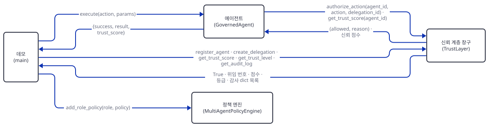

창구가 신원 등록부와 점수 엔진을 부르는 부분입니다.

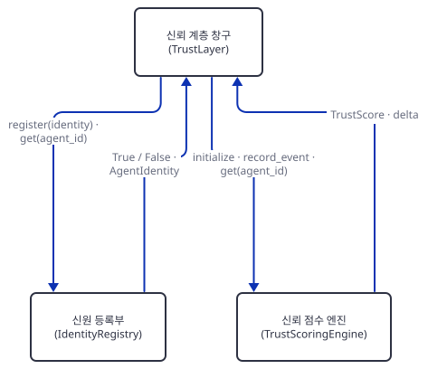

창구가 위임 관리자와 정책 엔진을 부르는 부분입니다.

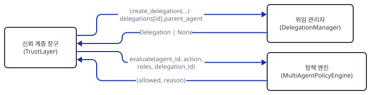

감사 기록은 창구만 쓰고 읽습니다.

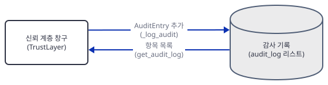

정책 엔진과 위임 관리자는 서로 부품을 부릅니다.

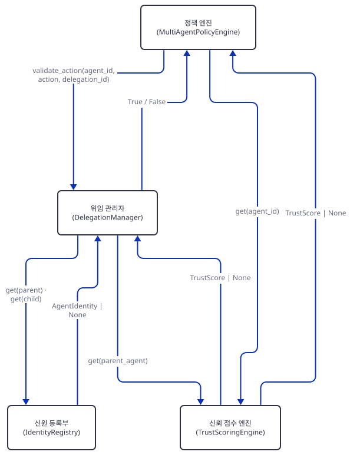

## 단계별 진행

### Step 1. 환경 만들기 — 쓰지 않는 `openai`가 필요한 이유

**목적.** 원본 폴더를 건드리지 않도록 작업 폴더에 복사본과 가상환경을 만들고, 키 없이 어디까지 되는지 봅니다.

**할 일.** `<저장소>`는 이 저장소를 받은 경로입니다.

```bash
mkdir trust-layer-work
cd trust-layer-work
cp <저장소>/advanced_ai_agents/multi_agent_apps/multi_agent_trust_layer/multi_agent_trust_layer.py .
cp <저장소>/advanced_ai_agents/multi_agent_apps/multi_agent_trust_layer/requirements.txt .
uv venv
uv pip install -r requirements.txt
```

(pip 대안: `python -m venv .venv`로 만들고 활성화한 뒤 `pip install -r requirements.txt`.) 아래 PowerShell 줄은 실행해 보지 못했습니다(이 문서를 쓴 하네스가 PowerShell 실행을 막습니다).

```powershell
mkdir trust-layer-work
cd trust-layer-work
Copy-Item <저장소>\advanced_ai_agents\multi_agent_apps\multi_agent_trust_layer\multi_agent_trust_layer.py .
Copy-Item <저장소>\advanced_ai_agents\multi_agent_apps\multi_agent_trust_layer\requirements.txt .
uv venv
uv pip install -r requirements.txt
```

이 저장소는 루트에 `pyproject.toml`이 있어 저장소 안에서 `uv run`은 루트 환경을 쓰려 하므로, 이후 `uv run`에는 모두 `--no-project`를 붙입니다.

`advanced_ai_agents/multi_agent_apps/multi_agent_trust_layer/requirements.txt:1`

```text
openai>=1.0.0
```

한 줄뿐인 이 파일이 오늘 가장 이상한 부분입니다. 설치 전에 `import multi_agent_trust_layer`를 하면 `ModuleNotFoundError: No module named 'openai'`로 멈춥니다(직접 확인) — 26행의 `from openai import OpenAI`가 파일을 읽는 순간 실행되기 때문입니다. 설치하면 `openai` 3.26.1과 의존 패키지 열세 개, 합쳐 열네 개가 깔립니다(2026-10-09, 직접 확인). 그런데 이 파일에서 OpenAI를 쓰는 곳은 그 import 한 줄이 전부입니다.

**확인.**

```bash
uv run --no-project python -m py_compile multi_agent_trust_layer.py && echo compiled
uv run --no-project python -c "import multi_agent_trust_layer; print('import ok')"
grep -n -i -E "openai|gpt|environ|getenv|socket|http|requests|open\(" multi_agent_trust_layer.py
```

(PowerShell 5.1에는 `&&`가 없으므로 첫 줄은 `uv run --no-project python -m py_compile multi_agent_trust_layer.py; if ($?) { echo compiled }`로 씁니다. 마지막 줄은 `Select-String -Pattern "openai|gpt|environ|getenv|socket|http|requests|open\(" multi_agent_trust_layer.py`입니다. 두 PowerShell 형태 모두 실행해 보지 못했습니다.)

직접 확인한 출력:

```text
compiled
import ok
26:from openai import OpenAI
```

모델 이름도, 환경변수 읽기도, 소켓·HTTP도, 파일 열기도 없습니다. 이 앱은 프로세스 안의 파이썬 객체만 다룹니다.

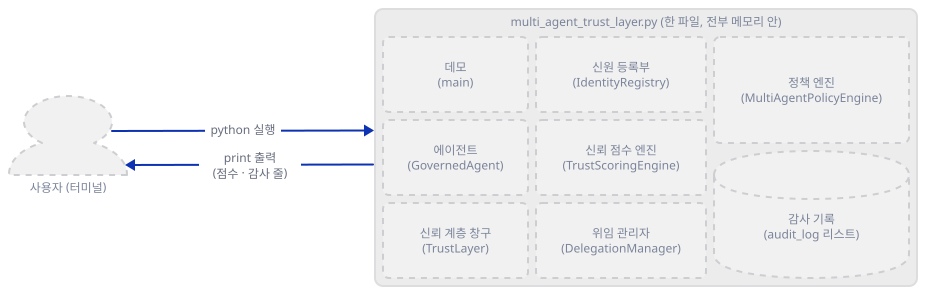

### Step 2. 신뢰 점수 — 등급, 사건표, 0점 버그

**목적.** 점수가 어떻게 등급이 되고 어떤 사건이 얼마를 움직이는지 보고, 한 줄짜리 버그를 확인합니다.

**할 일.** 등급 경계는 `TrustLevel.from_score`(`multi_agent_trust_layer.py:45-56`)가 900·700·500·300에서 가릅니다. 점수를 움직이는 사건표는 이렇습니다.

`multi_agent_trust_layer.py:223-233`

```python
    SCORE_ADJUSTMENTS = {
        "task_completed": +10,
        "stayed_in_scope": +5,
        "accurate_output": +2,
        "scope_violation_attempt": -50,
        "inaccurate_output": -30,
        "resource_exceeded": -20,
        "security_violation": -100,
        "delegation_success": +15,
        "delegation_failure": -25,
    }
```

아홉 가운데 실제로 불리는 것은 `stayed_in_scope`와 `scope_violation_attempt` 둘뿐입니다(`authorize_action`, 536-538행). `task_completed`·`delegation_success`·`delegation_failure`는 `record_task_result`(549-558행)가 쓰는데, 이 함수는 정의만 있고 파일 안에서 한 번도 호출되지 않습니다(`grep -n record_task_result`로 확인). 나머지 넷은 호출하는 코드가 없습니다. 점수는 `TrustScore.update`가 0~1000으로 자르고 등급을 다시 매깁니다(84-96행).

버그는 초기 점수에 있습니다.

`multi_agent_trust_layer.py:239-241`

```python
    def initialize(self, agent_id: str, initial_score: Optional[int] = None) -> TrustScore:
        """Initialize trust score for a new agent"""
        score = initial_score or self.initial_score
```

0은 거짓이라 `or`가 기본값 700으로 바꿉니다. `register_agent(initial_trust=0)`으로 0점 에이전트를 등록할 길이 없습니다.

`check2.py`로 저장해 실행합니다.

```python
import logging
from multi_agent_trust_layer import TrustLevel, TrustScore, TrustScoringEngine

logging.disable(logging.CRITICAL)

for s in (1000, 900, 899, 700, 699, 500, 499, 300, 299, 0):
    print(s, TrustLevel.from_score(s).value)

t = TrustScore("a", 990, TrustLevel.TRUSTED)
t.update(+50, "upper bound")
print("upper", t.score, t.level.value)
t.update(-2000, "lower bound")
print("lower", t.score, t.level.value, len(t.history))

e = TrustScoringEngine()
print("initialize(x, 0):", e.initialize("x", 0).score)
print("initialize(y, 1):", e.initialize("y", 1).score)
print("unknown event:", e.record_event("z", "no_such_event"), e.get("z").score)
print("custom_delta:", e.record_event("z", "no_such_event", custom_delta=-700), e.get("z").score)
```

(`logging.disable`은 앱이 import할 때 켜 두는 INFO 로그를 끄려는 것입니다.)

**확인.**

```bash
uv run --no-project python check2.py
```

직접 확인한 출력:

```text
1000 trusted
900 trusted
899 standard
700 standard
699 probation
500 probation
499 restricted
300 restricted
299 suspended
0 suspended
upper 1000 trusted
lower 0 suspended 2
initialize(x, 0): 700
initialize(y, 1): 1
unknown event: 0 700
custom_delta: -700 0
```

경계가 정확히 맞고, 한도에서 잘리고, 모르는 사건 이름은 조용히 0점이고(오타를 알려 주지 않습니다), 0을 요청하면 700이 되는 것(`initialize(x, 0)`)까지 한 번에 보입니다.

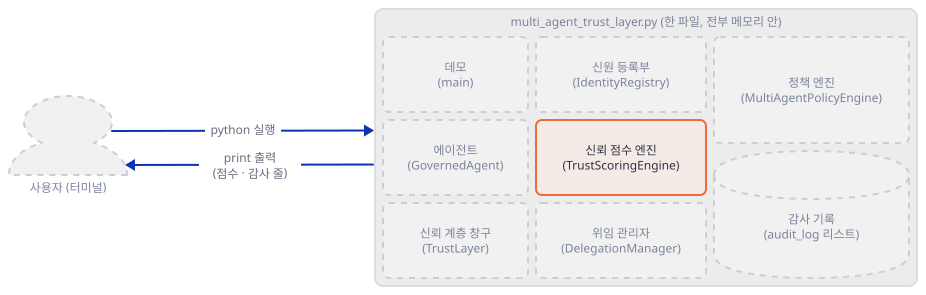

### Step 3. 신원 등록부와 창구 — 열쇠가 아닌 `public_key`

**목적.** `register_agent`가 신원과 점수를 함께 만드는 것을 보고, `public_key`와 `human_sponsor`가 실제로 무엇인지 확인합니다.

**할 일.** `TrustLayer.register_agent`(457-481행)는 `public_key`를 이렇게 만듭니다.

`multi_agent_trust_layer.py:467-468`

```python
        # Generate a key pair (simplified)
        public_key = hashlib.sha256(f"{agent_id}:{secrets.token_hex(16)}".encode()).hexdigest()
```

주석은 "key pair"라지만 개인 키는 만들어지지 않고, 이 값은 어디에서도 서명이나 검증에 쓰이지 않습니다. `human_sponsor`도 이메일 문자열을 `sponsor_to_agents` 딕셔너리에 모아 둘 뿐 검증하거나 점수에 반영하지 않습니다(`grep -n human_sponsor`로 확인: 정의·기록·로그 줄뿐). 같은 `agent_id`를 두 번 등록하면 `False`가 돌아오고 점수는 그대로입니다. `IdentityRegistry.revoke`(205-212행)는 신원과 보증인 목록에서 빼지만 `TrustLayer`에는 이를 부르는 메서드가 없어 `identity_registry.revoke`를 직접 불러야 하고, 점수와 이미 만든 위임은 그대로 남습니다.

`check3.py`로 저장해 실행합니다.

```python
import logging
from multi_agent_trust_layer import TrustLayer

logging.disable(logging.CRITICAL)

tl = TrustLayer()
print("register a-1:", tl.register_agent("a-1", "alice@x.com", "Acme", ["researcher"], initial_trust=800))
print("again a-1:", tl.register_agent("a-1", "alice@x.com", "Acme", ["researcher"]))
print("register a-2:", tl.register_agent("a-2", "alice@x.com", "Acme", ["writer"]))
ident = tl.identity_registry.get("a-1")
print("public_key length:", len(ident.public_key), "| roles:", ident.roles)
print("sponsor map:", dict(tl.identity_registry.sponsor_to_agents))
print("a-1:", tl.get_trust_score("a-1"), tl.get_trust_level("a-1").value, "| a-2:", tl.get_trust_score("a-2"))
print("revoke a-1:", tl.identity_registry.revoke("a-1", "test"))
print("sponsor map:", dict(tl.identity_registry.sponsor_to_agents), "| get:", tl.identity_registry.get("a-1"))
print("score kept:", tl.get_trust_score("a-1"))
print("authorize:", tl.authorize_action("a-1", "web_search"))
```

**확인.**

```bash
uv run --no-project python check3.py
```

직접 확인한 출력:

```text
register a-1: True
again a-1: False
register a-2: True
public_key length: 64 | roles: ['researcher']
sponsor map: {'alice@x.com': ['a-1', 'a-2']}
a-1: 800 standard | a-2: 700
revoke a-1: True
sponsor map: {'alice@x.com': ['a-2']} | get: None
score kept: 800
authorize: (False, 'Unknown agent')
```

철회된 에이전트의 점수는 800으로 남지만 허락 요청은 `Unknown agent`로 막힙니다.

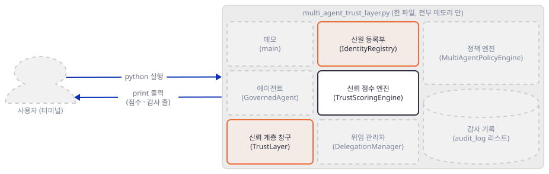

### Step 4. 위임 관리자 — 범위, 만료, 철회, 좁히기

**목적.** 위임이 무엇을 담고 언제 무효가 되는지, 자식에게 넘길 때 범위가 어떻게 좁아지는지, 그리고 철회가 어디까지 번지는지 봅니다.

**할 일.** 위임 하나는 `Delegation`(140-163행)이고 범위는 `DelegationScope`(99-137행)입니다. 중요한 약속은 `allowed_actions`가 `None`이면 "모든 행동 허용"이라는 것입니다(102·114행). 창구의 `create_delegation`은 빈 목록이나 빠진 값을 `None`으로 바꿉니다(496행). 그래서 범위를 `{}`로 주면 **열린** 위임이 됩니다. 위임은 `is_valid`(155-163행)에서 철회·만료·토큰 소진 셋으로 무효가 되고, 위임 번호는 `del-`에 16자리 16진수가 붙습니다(316행). 번호 없이 `validate_action`을 부르면 에이전트의 아무 유효한 위임이나 찾는 분기가 있습니다.

`multi_agent_trust_layer.py:355-361`

```python
        # Check if agent has any valid delegation allowing this action
        for del_id in self.agent_delegations.get(agent_id, []):
            delegation = self.delegations.get(del_id)
            if delegation and delegation.is_valid() and delegation.scope.allows_action(action):
                return True
        
        return False
```

다만 정책 엔진은 위임 번호가 있을 때만 이 메서드를 부르므로(432-434행), `GovernedAgent`를 거치면 이 분기에 닿지 않습니다.

자식에게 넘기는 것은 `DelegationScope.narrow`(118-137행)입니다. 행동은 교집합, 거부 목록은 합집합, 토큰·시간·재위임 횟수는 작은 쪽을 고릅니다. 이때 `parent_delegation_id`를 받는 쪽은 `DelegationManager.create_delegation`이고, `TrustLayer.create_delegation`에는 그 인자가 없습니다. 연쇄는 관리자를 직접 불러야 만들어집니다.

`check4.py`와 `check5.py`로 저장해 실행합니다. 먼저 유효성입니다.

```python
import logging
from datetime import timedelta
from multi_agent_trust_layer import TrustLayer

logging.disable(logging.CRITICAL)

tl = TrustLayer()
tl.register_agent("boss", "a@x.com", "Acme", ["orchestrator"], initial_trust=900)
tl.register_agent("res", "b@x.com", "Acme", ["researcher"], initial_trust=750)
tl.register_agent("wri", "c@x.com", "Acme", ["writer"], initial_trust=700)
dm = tl.delegation_manager

did = tl.create_delegation("boss", "res", {"allowed_actions": ["web_search", "summarize"]}, "t", 30)
d = dm.delegations[did]
print("id prefix / signature length / max_tokens / valid:", did.startswith("del-"), len(d.signature), d.scope.max_tokens, d.is_valid())
print("res web_search / read_document:", dm.validate_action("res", "web_search", did), dm.validate_action("res", "read_document", did))
print("wri uses res's delegation:", dm.validate_action("wri", "web_search", did))
print("no id given:", dm.validate_action("res", "web_search"))
print("unknown child:", tl.create_delegation("boss", "ghost", {}, "t"))
print("unknown parent:", tl.create_delegation("ghost", "res", {}, "t"))

d.expires_at = d.created_at - timedelta(seconds=1)
print("expired -> valid, validate:", d.is_valid(), dm.validate_action("res", "web_search", did))
d.expires_at = d.created_at + timedelta(minutes=30)
print("revoke -> ok, valid, validate:", dm.revoke_delegation(did, "test"), d.is_valid(), dm.validate_action("res", "web_search", did))

open_did = tl.create_delegation("boss", "res", {}, "open scope")
od = dm.delegations[open_did]
print("open scope:", od.scope.allowed_actions, od.scope.allows_action("anything"))
for _ in range(13):
    tl.trust_engine.record_event("boss", "scope_violation_attempt")
print("boss:", tl.get_trust_score("boss"), tl.get_trust_level("boss").value)
print("suspended parent:", tl.create_delegation("boss", "res", {}, "t"))
```

```bash
uv run --no-project python check4.py
```

직접 확인한 출력:

```text
id prefix / signature length / max_tokens / valid: True 16 10000 True
res web_search / read_document: True False
wri uses res's delegation: False
no id given: True
unknown child: None
unknown parent: None
expired -> valid, validate: False False
revoke -> ok, valid, validate: True False False
open scope: None True
boss: 250 suspended
suspended parent: None
```

다른 에이전트가 남의 위임 번호를 써도, 만료돼도, 철회돼도 `validate_action`은 똑같이 `False`입니다. 이유를 가르는 정보는 돌려주지 않습니다. 서명(`signature`)은 16자리 해시이고 만들어질 뿐 어디서도 검증되지 않으며, 해시에 들어간 시각을 저장하지 않으므로 나중에 다시 계산해 맞춰 볼 수도 없습니다(338-340행).

이제 좁히기와 연쇄입니다.

```python
import inspect
import logging
from multi_agent_trust_layer import TrustLayer, DelegationScope

logging.disable(logging.CRITICAL)

tl = TrustLayer()
for a, r in (("boss", "orchestrator"), ("mid", "researcher"), ("low", "researcher"), ("leaf", "researcher")):
    tl.register_agent(a, a + "@x.com", "Acme", [r], initial_trust=900)
dm = tl.delegation_manager


def minutes(d):
    return round((d.expires_at - d.created_at).total_seconds() / 60)


# TrustLayer.create_delegation에는 parent_delegation_id 인자가 없다
print(list(inspect.signature(tl.create_delegation).parameters))

parent = dm.create_delegation(
    "boss", "mid",
    DelegationScope(allowed_actions={"web_search", "summarize", "analyze"},
                    allowed_domains={"arxiv.org", "github.com"},
                    max_tokens=50000, time_limit_minutes=30, max_sub_delegations=1),
    "parent task", time_limit_minutes=30)
child = dm.create_delegation(
    "mid", "low",
    DelegationScope(allowed_actions={"summarize", "send_email"},
                    allowed_domains={"github.com", "evil.example"},
                    max_tokens=99999, time_limit_minutes=120, max_sub_delegations=5),
    "child task", parent_delegation_id=parent.delegation_id)
s = child.scope
print(sorted(s.allowed_actions), sorted(s.allowed_domains), s.max_tokens, s.time_limit_minutes,
      s.max_sub_delegations, minutes(child))

grand = dm.create_delegation("low", "leaf", DelegationScope(allowed_actions={"summarize"}),
                             "grandchild", parent_delegation_id=child.delegation_id)
print("grandchild:", grand.scope.max_sub_delegations)
print("great-grandchild:", dm.create_delegation("leaf", "mid", DelegationScope(), "g3",
                                                parent_delegation_id=grand.delegation_id))

p2 = dm.create_delegation("boss", "mid", DelegationScope(allowed_actions={"a"}, time_limit_minutes=30,
                                                         max_sub_delegations=1), "p2")
wide = DelegationScope(allowed_actions={"a"}, time_limit_minutes=120)
c_default = dm.create_delegation("mid", "low", wide, "c", parent_delegation_id=p2.delegation_id)
c_explicit = dm.create_delegation("mid", "low", wide, "c", time_limit_minutes=120,
                                  parent_delegation_id=p2.delegation_id)
print("minutes: default", minutes(c_default), "| explicit 120:", minutes(c_explicit))

c_empty = dm.create_delegation("mid", "low", DelegationScope(allowed_actions={"b"}), "c",
                               parent_delegation_id=p2.delegation_id)
print("disjoint:", c_empty.scope.allowed_actions, c_empty.scope.allows_action("a"), c_empty.scope.allows_action("b"))

dm.revoke_delegation(parent.delegation_id, "test")
print("parent valid:", parent.is_valid(), "| child valid:", child.is_valid(), "| child may summarize:",
      dm.validate_action("low", "summarize", child.delegation_id))
```

```bash
uv run --no-project python check5.py
```

직접 확인한 출력:

```text
['from_agent', 'to_agent', 'scope', 'task_description', 'time_limit_minutes']
['summarize'] ['github.com'] 50000 30 1 30
grandchild: 0
great-grandchild: None
minutes: default 30 | explicit 120: 120
disjoint: set() False False
parent valid: False | child valid: True | child may summarize: True
```

자식은 행동 `summarize`·`send_email`, 도메인 `github.com`·`evil.example`, 토큰 99999, 120분, 재위임 5회를 요구했지만 교집합과 최솟값인 `summarize`, `github.com`, 50000, 30분, 1회만 받았습니다. 손자는 재위임 0회를 받아 증손자는 `None`입니다. 두 가지는 좁히기를 우회합니다. 시간은 `time_limit_minutes`를 직접 주면(317행: `time_limit_minutes or scope.time_limit_minutes`) 좁힌 30분 대신 120분이 됩니다(`explicit 120: 120`). 그리고 부모를 철회해도 자식은 그대로 유효합니다(`child valid: True`). `is_valid`가 자기 플래그만 보고 철회가 아래로 번지지 않기 때문입니다. 행동 교집합이 비면 `set()`이 되고 이제는 "아무것도 허용 안 함"으로 읽힙니다(`disjoint: set() False False`). 이 부분은 코드 주석(120-122행)이 이전에 "전부 허용"으로 읽히던 버그를 고쳤다고 적어 둔 곳입니다.

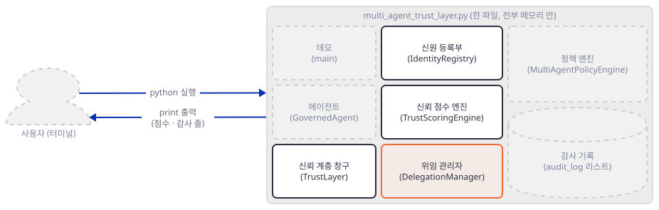

### Step 5. 정책 엔진과 `authorize_action` — 판정 순서와 감사 기록

**목적.** 정책 엔진이 무엇을 어떤 순서로 묻는지 보고, 거부가 점수를 깎아 에이전트를 정지시키는 흐름을 따라갑니다.

**할 일.** `evaluate`는 위에서부터 묻고 처음 걸리는 이유로 돌아옵니다.

`multi_agent_trust_layer.py:405-440`

```python
        # Check trust level
        trust = self.trust_engine.get(agent_id)
        if not trust:
            return False, "Agent has no trust score"
        
        if trust.level == TrustLevel.SUSPENDED:
            return False, "Agent is suspended"
        
        # Check role-based policies
        for role in roles:
            policy = self.role_policies.get(role, {})
            
            # Check base trust requirement
            min_trust = policy.get("base_trust_required", 0)
            if trust.score < min_trust:
                return False, f"Trust score {trust.score} below minimum {min_trust} for role {role}"
            
            # Check denied actions
            if action in policy.get("denied_actions", []):
                return False, f"Action '{action}' denied for role {role}"
            
            # Check allowed actions (if specified, action must be in list)
            allowed = policy.get("allowed_actions", [])
            if allowed and action not in allowed:
                return False, f"Action '{action}' not in allowed list for role {role}"
        
        # Check delegation
        if delegation_id:
            if not self.delegation_manager.validate_action(agent_id, action, delegation_id):
                return False, f"Action '{action}' not allowed under delegation {delegation_id}"
        
        # Require approval for restricted agents
        if trust.level == TrustLevel.RESTRICTED:
            return False, "Agent is restricted - requires human approval"
        
        return True, "Action allowed"
```

눈여겨볼 곳이 셋입니다. 첫째, 규칙이 없는 역할은 `{}`가 되어 아무것도 막지 않습니다(415행) — 정책을 빠뜨린 역할은 기본 허용입니다. 둘째, 역할마다 요구하는 최소 점수(데모는 researcher 500, writer 600, orchestrator 800)가 모두 499(restricted의 상한)보다 커서, 그 역할들은 restricted가 되는 순간 "최소 점수 미달"로 막히고 마지막 "사람 승인 필요" 줄에는 닿지 않습니다. 그 줄에 닿는 것은 정책이 없거나 최소 점수가 낮은 역할뿐인데, 승인을 받는 장치도 코드에 없습니다. 셋째, `authorize_action`(514-547행)은 허락이면 `stayed_in_scope`(+5), 거부면 `scope_violation_attempt`(-50)를 점수에 반영하고 감사 기록을 한 줄 더합니다. 거부당할수록 점수가 내려가 곧 정지되고, 정지된 에이전트는 모든 요청이 거부되어 +5를 받을 길이 없습니다.

`check6.py`로 저장해 실행합니다.

```python
import logging
from multi_agent_trust_layer import TrustLayer

logging.disable(logging.CRITICAL)

tl = TrustLayer()
tl.policy_engine.add_role_policy("researcher", {
    "base_trust_required": 500,
    "allowed_actions": ["web_search", "read_document", "summarize", "analyze"],
    "denied_actions": ["execute_code", "send_email", "delete_file"],
})
tl.register_agent("res", "b@x.com", "Acme", ["researcher"], initial_trust=750)
tl.register_agent("low", "c@x.com", "Acme", ["researcher"], initial_trust=450)
tl.register_agent("intern", "d@x.com", "Acme", ["intern"], initial_trust=400)   # 정책 없는 역할
tl.register_agent("freelancer", "g@x.com", "Acme", ["freelancer"], initial_trust=700)   # 정책 없는 역할
tl.register_agent("gone", "e@x.com", "Acme", ["intern"], initial_trust=250)
tl.register_agent("spiral", "f@x.com", "Acme", ["researcher"], initial_trust=750)

print(tl.authorize_action("res", "web_search"))
print(tl.authorize_action("res", "send_email"))
print(tl.authorize_action("res", "translate"))
print(tl.authorize_action("low", "web_search"))
print(tl.authorize_action("intern", "send_email"))
print(tl.authorize_action("freelancer", "delete_file"))
print(tl.authorize_action("gone", "web_search"))
print(tl.authorize_action("nobody", "web_search"), tl.get_trust_score("nobody"))

print("--- repeated denials")
for i in range(1, 13):
    ok, why = tl.authorize_action("spiral", "send_email")
    print(i, tl.get_trust_score("spiral"), tl.get_trust_level("spiral").value, why[:46])
print("web_search now:", tl.authorize_action("spiral", "web_search"))
print([(e["agent_id"], e["result"]) for e in tl.get_audit_log("nobody")])
print(len(tl.get_audit_log()), sorted(tl.get_audit_log()[0]))
```

**확인.**

```bash
uv run --no-project python check6.py
```

직접 확인한 출력:

```text
(True, 'Action allowed')
(False, "Action 'send_email' denied for role researcher")
(False, "Action 'translate' not in allowed list for role researcher")
(False, 'Trust score 450 below minimum 500 for role researcher')
(False, 'Agent is restricted - requires human approval')
(True, 'Action allowed')
(False, 'Agent is suspended')
(False, 'Unknown agent') None
--- repeated denials
1 700 standard Action 'send_email' denied for role researcher
2 650 probation Action 'send_email' denied for role researcher
3 600 probation Action 'send_email' denied for role researcher
4 550 probation Action 'send_email' denied for role researcher
5 500 probation Action 'send_email' denied for role researcher
6 450 restricted Action 'send_email' denied for role researcher
7 400 restricted Trust score 450 below minimum 500 for role res
8 350 restricted Trust score 400 below minimum 500 for role res
9 300 restricted Trust score 350 below minimum 500 for role res
10 250 suspended Trust score 300 below minimum 500 for role res
11 200 suspended Agent is suspended
12 150 suspended Agent is suspended
web_search now: (False, 'Agent is suspended')
[('nobody', 'denied')]
21 ['action', 'agent_id', 'delegation_id', 'details', 'event_type', 'result', 'timestamp']
```

다섯째 줄은 정책 없는 역할(`intern`, 400점)이 restricted 때문에 막힌 것이고, 여섯째 줄은 정책 없는 다른 역할(`freelancer`, 700점)이 `delete_file`까지 허락되는 것입니다. 반복 거부의 이유 문장에 찍힌 점수(예: 7번째 줄의 450)는 그 판정 때의 점수이고, 같은 줄 앞쪽 숫자(400)는 -50이 반영된 뒤 점수입니다. 모르는 에이전트는 감사 기록은 남지만(`nobody`, `denied`) 점수는 없습니다. 감사 항목의 필드는 일곱 개이고, `AuditEntry`에 있는 `trust_impact`(176행)는 `_log_audit`가 채우지도 `get_audit_log`가 내주지도 않습니다(590-607행).

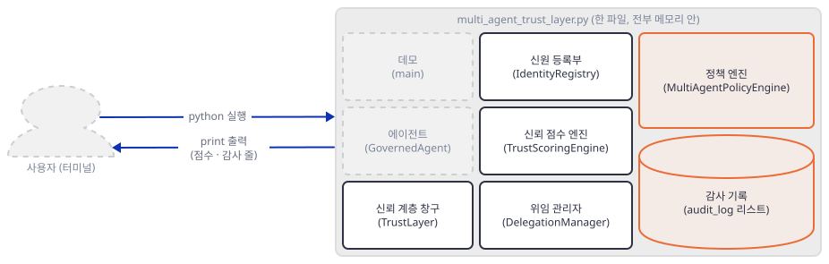

### Step 6. `GovernedAgent`와 데모 — 한 줄씩 따라가기

**목적.** 데모를 실행해 출력의 점수가 어떻게 나왔는지 따라가고, 데모가 시험하지 않는 것(위임이 실제로 막는 장면)을 직접 만들어 봅니다.

**할 일.** `GovernedAgent.execute`는 창구에 먼저 묻고, 거부면 오류 딕셔너리를, 허락이면 가짜 행동의 결과를 돌려줍니다.

`multi_agent_trust_layer.py:622-645`

```python
    def execute(self, action: str, params: Dict[str, Any]) -> Dict[str, Any]:
        """Execute an action through the trust layer"""
        
        allowed, reason = self.trust_layer.authorize_action(
            self.agent_id,
            action,
            self.current_delegation
        )
        
        if not allowed:
            return {
                "success": False,
                "error": f"Action denied: {reason}",
                "trust_score": self.trust_layer.get_trust_score(self.agent_id)
            }
        
        # Simulate action execution
        result = self._execute_action(action, params)
        
        return {
            "success": True,
            "result": result,
            "trust_score": self.trust_layer.get_trust_score(self.agent_id)
        }
```

`main`(656-790행)은 정책 셋(664-680행), 에이전트 셋(685-710행), orchestrator에서 researcher로의 위임 하나(715-725행)를 만들고 시험 넷을 돌립니다. 실행합니다.

```bash
uv run --no-project python multi_agent_trust_layer.py
```

출력의 이모지 때문에 파일이나 파이프로 돌려받으면 Windows(한국어 로캘)에서 `UnicodeEncodeError`가 날 수 있습니다. 그때는 `PYTHONUTF8=1`을 앞에 붙입니다(문제 해결). 직접 확인한 표준 출력은 다음과 같습니다(위임 번호는 매번 다릅니다).

```text
🤝 Multi-Agent Trust Layer Demo
========================================

📋 Registering agents...
✅ Registered: orchestrator-001 (Sponsor: alice@company.com)
✅ Registered: researcher-002 (Sponsor: bob@company.com)
✅ Registered: writer-003 (Sponsor: carol@company.com)

🔐 Creating delegation chain...
✅ Delegation: orchestrator-001 → researcher-002
   ID: del-40191ecc922755ce
   Scope: web_search, summarize
   Time Limit: 30 minutes

========================================
🧪 Testing Agent Actions
========================================

🤖 researcher-002: web_search (within scope)
   Result: ✅ ALLOWED
   Trust Score: 755

🤖 researcher-002: send_email (outside scope)
   Result: ❌ DENIED
   Reason: Action denied: Action 'send_email' denied for role researcher
   Trust Score: 705

🤖 writer-003: web_search (not in role)
   Result: ❌ DENIED
   Reason: Action denied: Action 'web_search' denied for role writer
   Trust Score: 650

🤖 writer-003: write_document (in role)
   Result: ✅ ALLOWED
   Trust Score: 655

========================================
📊 Final Trust Scores
========================================
   orchestrator-001: 900 (trusted)
   researcher-002: 705 (standard)
   writer-003: 655 (probation)

========================================
📋 Audit Log
========================================
   ✅ researcher-002: web_search - allowed
   ❌ researcher-002: send_email - denied
   ❌ writer-003: web_search - denied
   ✅ writer-003: write_document - allowed

✅ Demo complete!
```

점수는 researcher 750 → 755(+5, 허락) → 705(-50, 거부), writer 700 → 650(-50) → 655(+5)입니다. orchestrator는 요청이 없어 900 그대로입니다. 한 가지 짚을 것이 있습니다. 시험 2의 주석은 "outside delegation"이지만 거부 이유는 위임이 아니라 **역할 정책**입니다(`denied for role researcher`). 이 데모에서 위임은 한 번도 판정을 가르지 않습니다. 위임이 실제로 막는 장면은 이렇게 만듭니다. `check7.py`로 저장해 실행합니다.

```python
import logging
from multi_agent_trust_layer import TrustLayer, GovernedAgent

logging.disable(logging.CRITICAL)

tl = TrustLayer()
tl.policy_engine.add_role_policy("researcher", {
    "base_trust_required": 500,
    "allowed_actions": ["web_search", "read_document", "summarize", "analyze"],
    "denied_actions": ["execute_code", "send_email", "delete_file"],
})
tl.policy_engine.add_role_policy("writer", {"base_trust_required": 600,
    "allowed_actions": ["write_document", "edit_document", "summarize"], "denied_actions": ["execute_code", "web_search"]})
tl.register_agent("boss", "a@x.com", "Acme", ["orchestrator"], initial_trust=900)
tl.register_agent("res", "b@x.com", "Acme", ["researcher"], initial_trust=750)
tl.register_agent("wri", "c@x.com", "Acme", ["writer"], initial_trust=700)
did = tl.create_delegation("boss", "res", {"allowed_actions": ["web_search", "summarize"]}, "t", 30)

res = GovernedAgent("res", tl)
print("no delegation, read_document:", res.execute("read_document", {})["success"])
res.current_delegation = did
for action in ("web_search", "read_document", "summarize"):
    r = res.execute(action, {})
    print(action, r["success"], r.get("error", "").replace(did, "<did>"), r["trust_score"])

# 위임이 send_email을 허용해도 역할 정책이 먼저 막는다
did2 = tl.create_delegation("boss", "res", {"allowed_actions": ["send_email"]}, "t", 30)
res.current_delegation = did2
print("delegated send_email:", res.execute("send_email", {})["error"])

# 남의 위임 번호
wri = GovernedAgent("wri", tl)
wri.current_delegation = did
print("other agent's delegation:", wri.execute("summarize", {})["error"].replace(did, "<did>"))
# 철회
tl.delegation_manager.revoke_delegation(did, "test")
res.current_delegation = did
print("revoked:", res.execute("web_search", {})["error"].replace(did, "<did>"))
```

```bash
uv run --no-project python check7.py
```

직접 확인한 출력:

```text
no delegation, read_document: True
web_search True  760
read_document False Action denied: Action 'read_document' not allowed under delegation <did> 710
summarize True  715
delegated send_email: Action denied: Action 'send_email' denied for role researcher
other agent's delegation: Action denied: Action 'summarize' not allowed under delegation <did>
revoked: Action denied: Action 'web_search' not allowed under delegation <did>
```

역할이 허락하는 `read_document`가 위임 범위 밖이라 막히고(위임 없이는 통과), 위임이 `send_email`을 허락해도 역할이 먼저 막습니다. 남의 위임 번호도, 철회된 번호도 같은 문장으로 막힙니다. 위임은 역할 규칙을 **더 좁힐 수만** 있고 넓힐 수 없습니다.

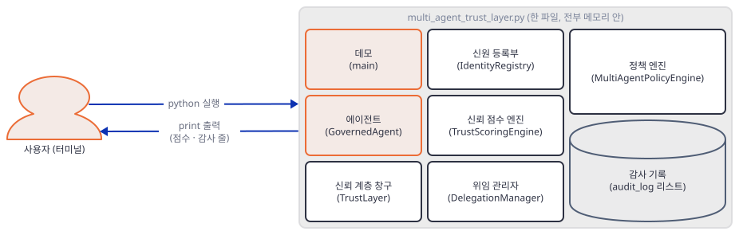

### Step 7. 코드가 하지 않는 일 — 앱 README와 대조

**목적.** 앱 README와 이름이 약속한 것 가운데 코드에 없는 것을 하나씩 확인합니다. 학습용 예시를 보안 경계로 오해하지 않기 위해서입니다.

**할 일.** 아래 표의 판정은 소스를 읽고 확인한 것이고, 표 아래 `check8.py`가 코드로 직접 보여 주는 세 가지(도메인, 토큰, 감사)에는 출력이 있습니다.

| 앱이 말하거나 이름이 약속한 것 | 코드의 실제 |
|---|---|
| README 그림의 에이전트와 창구 사이 `TLS` | 네트워크 코드가 없다. `ssl`·`tls`·소켓 관련 문자열이 파일에 없다(`grep -i -E "ssl\|tls"`가 아무것도 찾지 못함, 직접 확인) |
| "Cryptographically narrow scope", 서명된 위임 | 서명은 `sha256(...)[:16]`을 만들 뿐 검증이 없다(Step 4). `public_key`는 난수 해시다(Step 3) |
| `scope={..., "time_limit_minutes": 30}`(README 예제의 `create_delegation`) | 시간은 `scope` 안의 같은 키가 아니라 인자 `time_limit_minutes`(기본 60)로만 받는다(`multi_agent_trust_layer.py:489`, `multi_agent_trust_layer.py:500`). 예제 그대로 부르면 위임이 60분이 되고, 돌아오는 값은 위임 객체가 아니라 번호 문자열이다(직접 확인) |
| `researcher.execute_with_delegation(...)`(README 예제) | 그런 메서드가 없다. `AttributeError: 'GovernedAgent' object has no attribute 'execute_with_delegation'`(직접 확인). 실제로는 `current_delegation`을 정하고 `execute` |
| README 예제 출력 "850 → 860 (+10)" | 실제 데모는 750 → 755(+5). 앞 단계 표대로 `stayed_in_scope`는 +5다 |
| 등급별 권한(Probation은 제한 행동·추가 로깅 등) | 코드가 구분하는 등급은 suspended(전부 거부)와 restricted(거부)뿐이다. trusted·standard·probation은 규칙이 똑같다(Step 5) |
| YAML 정책, `resource_limits` | 정책은 파이썬 딕셔너리이고 `resource_limits`는 파일에 나오지 않는다(`yaml`·`resource_limits` 문자열이 파일에 없음, 직접 확인) |
| 허용 도메인, 토큰 한도 | 아래 `check8.py` |
| "Full audit trail" | 아래 `check8.py` |
| "Initial trust score based on sponsor reputation" | 보증인을 점수에 쓰는 코드가 없다. 초기 점수는 `register_agent(initial_trust=...)` 인자뿐이다(Step 3) |

`check8.py`로 저장해 실행합니다.

```python
import logging
from multi_agent_trust_layer import TrustLayer, GovernedAgent

logging.disable(logging.CRITICAL)

tl = TrustLayer()
tl.register_agent("boss", "a@x.com", "Acme", ["orchestrator"], initial_trust=900)
tl.register_agent("res", "b@x.com", "Acme", ["researcher"], initial_trust=750)
did = tl.create_delegation("boss", "res",
                           {"allowed_actions": ["web_search"], "allowed_domains": ["arxiv.org"], "max_tokens": 1},
                           "t", 30)
res = GovernedAgent("res", tl)
res.current_delegation = did

# 1) 허용 도메인: 아무 데서도 읽지 않는다
r = res.execute("web_search", {"url": "https://evil.example/x"})
print("domain:", r["success"])
# 2) 토큰 한도: tokens_used는 아무도 올리지 않는다
for _ in range(100):
    res.execute("web_search", {})
d = tl.delegation_manager.delegations[did]
print("tokens:", d.tokens_used, "of", d.scope.max_tokens, "valid:", d.is_valid())
# 3) 감사 기록 위조
tl.audit_log[0].result = "denied"
print("tampered:", tl.get_audit_log()[0]["result"], "| verify method:", hasattr(tl, "verify_audit_log"))
# 4) 감사 항목의 trust_impact
print({e.trust_impact for e in tl.audit_log})
```

**확인.**

```bash
uv run --no-project python check8.py
```

직접 확인한 출력:

```text
domain: True
tokens: 0 of 1 valid: True
tampered: denied | verify method: False
{0}
```

`allowed_domains`는 만들고 좁히기만 하지 읽는 곳이 없어 허용 도메인 밖 URL도 통과합니다. `tokens_used`는 0에서 올라가지 않아 한도 1짜리 위임이 100번을 쓰고도 유효합니다(`max_tokens`를 비교하는 곳은 `is_valid`의 161행뿐입니다). 감사 기록은 리스트라 항목을 고쳐도 알아챌 방법이 없습니다 — Day 090의 해시체인과 가장 다른 점입니다. `trust_impact`는 전부 0입니다.

이 앱은 개념을 보여 주는 예시입니다. 위의 구멍들 때문에 이 코드를 그대로 에이전트 사이의 보안 경계로 쓰면 안 됩니다.


## 요청 한 건이 흐르는 과정

데모의 첫 시험(researcher의 `web_search`)을 따라갑니다. 요청 하나가 그림 다섯 장으로 나뉘는 것은 한 장에 담으면 가로로 길어져 읽히지 않기 때문이고, 이 첫 시험의 메시지는 모두 정확히 한 장에 원래 순서대로 있습니다(`get_trust_score` 조회 포함). 그림의 위임 번호 `del-6c1f`는 자리 표시이고 실제 번호는 매번 다릅니다.

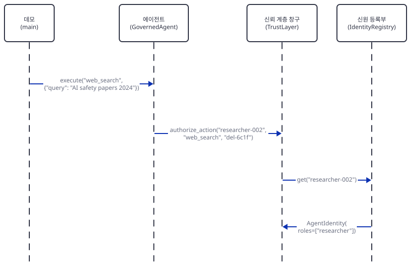

데모가 `execute("web_search", {"query": ...})`를 부르면 에이전트가 창구의 `authorize_action`에 에이전트 이름, 행동, 위임 번호를 넘깁니다. 창구는 먼저 신원 등록부에서 신원을 찾아 역할 목록(`["researcher"]`)을 얻습니다. 등록부에 없으면 여기서 `Unknown agent`로 끝납니다.

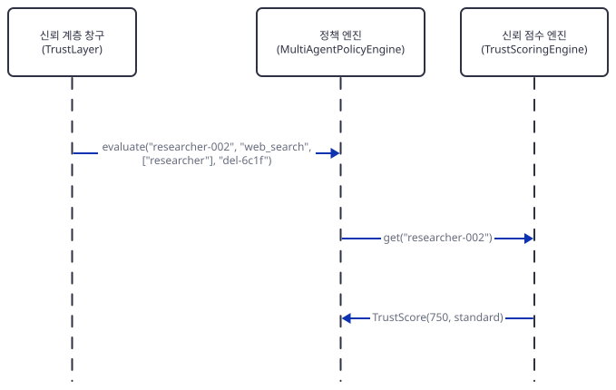

창구가 정책 엔진의 `evaluate`를 부르면, 정책 엔진은 점수 엔진에서 점수(750, standard)를 받아 정지 여부와 역할의 최소 점수를 확인합니다.

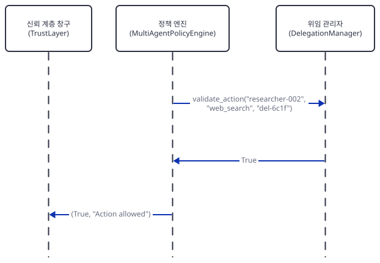

역할 규칙을 통과하고 위임 번호가 있으면 정책 엔진이 위임 관리자에게 `validate_action`을 묻습니다. 유효하면 `(True, "Action allowed")`가 창구로 돌아갑니다.

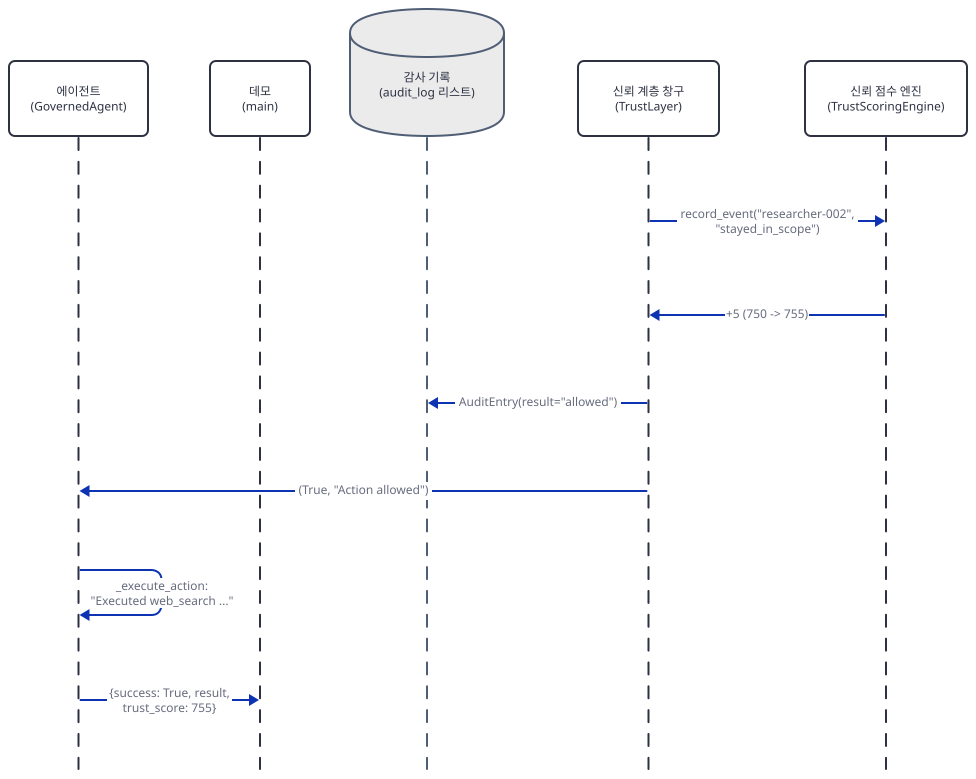

창구는 점수 엔진에 `stayed_in_scope`를 기록해 750을 755로 올리고 감사 기록에 `allowed` 한 줄을 더합니다.

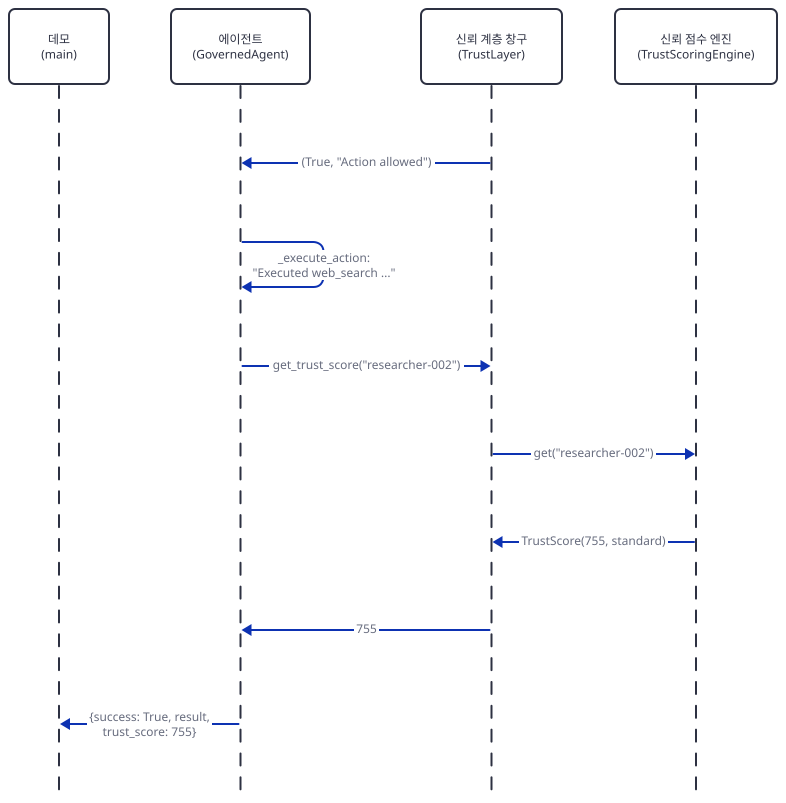

창구가 에이전트에 `(True, ...)`를 돌려주면 에이전트는 가짜 행동의 문자열을 만들고, 응답에 넣을 점수를 창구의 `get_trust_score`로 다시 물어(`multi_agent_trust_layer.py:644`) 창구가 점수 엔진에서 755를 받아 옵니다. 그 값으로 데모에 `{success: True, result, trust_score: 755}`를 돌려줍니다.

두 번째 시험(`send_email`)은 같은 길을 가다 정책 엔진에서 갈립니다. 앞 네 메시지(데모의 `execute`, 에이전트의 `authorize_action`, 신원 등록부 조회와 응답)는 첫 시험과 값만 `send_email`로 다릅니다.

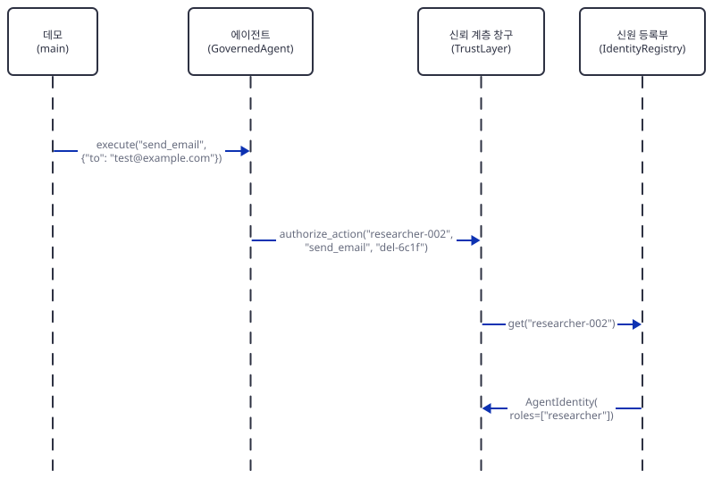

여섯 배우를 한 장에 그리면 배우 순서 720가지를 모두 재 보아도 검사를 통과하는 것이 없어(위반 0이 없고, 위반이 없는 순서는 폭이 1300px을 넘음) 이 경계에서 나눴습니다. 이어서 정책 판정입니다.

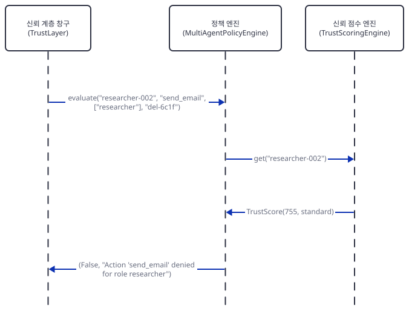

역할 규칙의 `denied_actions`에 걸려 위임 관리자는 묻지도 않고 `(False, ...)`가 돌아옵니다.

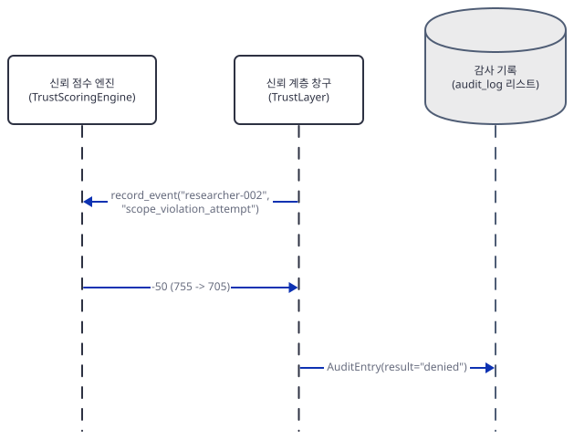

창구는 `scope_violation_attempt`로 755를 705로 깎고 `denied` 한 줄을 감사 기록에 더합니다.

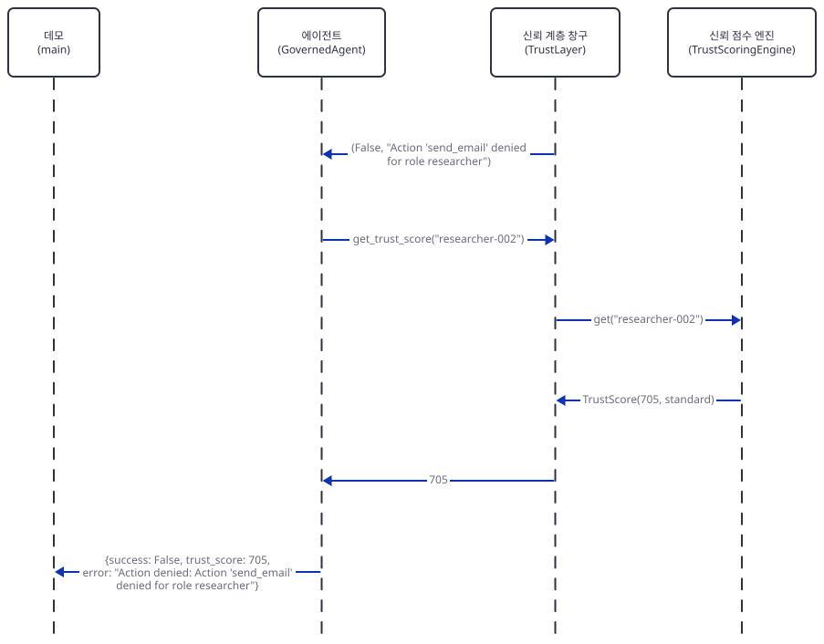

창구가 에이전트에 `(False, ...)`를 돌려주면 에이전트는 이 경로에서도 점수를 `get_trust_score`로 다시 물어(`multi_agent_trust_layer.py:635`) 705를 받고, `{success: False, trust_score: 705, error: ...}`를 데모에 돌려줍니다.

## 실행 체크리스트

- [ ] `uv venv`와 `uv pip install -r requirements.txt` 뒤 `uv run --no-project python -c "import multi_agent_trust_layer; print('import ok')"`가 통과했다
- [ ] `grep`으로 `openai`가 26행 한 줄에만 나온다는 것을 확인했다
- [ ] `check2.py`에서 `initialize(x, 0): 700`을 확인했다
- [ ] `check4.py`·`check5.py`에서 좁혀진 위임 범위(`['summarize'] ['github.com'] 50000 30 1`)와 부모 철회 뒤에도 유효한 자식을 확인했다
- [ ] `check6.py`에서 거부를 거듭하다 `suspended`가 되고 이후 모든 요청이 `Agent is suspended`로 막히는 것을 확인했다
- [ ] 데모를 돌려 최종 점수 900·705·655를 확인했다
- [ ] `check7.py`에서 위임이 `read_document`를 막는 것을 확인했다
- [ ] `check8.py`에서 허용 도메인·토큰 한도·감사 기록의 구멍을 확인했다

## 문제 해결

| 증상 | 원인 | 해결 |
|---|---|---|
| `ModuleNotFoundError: No module named 'openai'` | 26행 `from openai import OpenAI`가 파일을 읽는 순간 실행된다. 쓰지는 않지만 패키지가 있어야 한다(직접 확인) | 가상환경에서 `uv pip install -r requirements.txt` |
| 출력을 파일이나 파이프로 돌리면 `UnicodeEncodeError: 'cp949' codec can't encode character '\U0001f91d' in position 0: illegal multibyte sequence` | 데모가 이모지를 `print`하고, 한국어 Windows에서 출력이 파일·파이프로 갈 때 기본 인코딩이 cp949라 인코딩에 실패한다(Git Bash에서 `> out.txt`로 직접 확인. 터미널에 바로 찍을 때는 시험하지 못함) | `PYTHONUTF8=1`을 앞에 붙인다. 셸 문법: Git Bash·macOS·Linux `PYTHONUTF8=1 uv run --no-project python multi_agent_trust_layer.py`, PowerShell `$env:PYTHONUTF8 = "1"`(실행해 보지 못함) |
| 데모 실행 때 `DeprecationWarning: datetime.datetime.utcnow() is deprecated ...`가 여러 줄 나온다 | 코드가 `datetime.utcnow()`를 쓴다(89·159·325·326·339·580행, 그리고 `default_factory=datetime.utcnow`인 71·82행). Python 3.13.3에서 직접 확인했고, 경고일 뿐 결과에는 영향이 없다 | 무시하거나 `python -W ignore::DeprecationWarning ...`. 고치려면 `datetime.now(timezone.utc)`로 바꾼다 |
| 데모 실행 때 터미널에 `2026-... - INFO - Trust update: ...` 줄이 끼어 나온다 | 29행의 `logging.basicConfig(level=logging.INFO, ...)`가 import할 때 켜진다. 표준 오류(stderr)로 나가므로 표준 출력과는 따로다. 터미널에는 둘이 섞여 보인다(직접 확인) | `2>/dev/null`(PowerShell `2>$null`, 실행해 보지 못함)로 숨기거나 `check*.py`처럼 `logging.disable(logging.CRITICAL)` |
| `register_agent(..., initial_trust=0)`인데 점수가 700이다 | `score = initial_score or self.initial_score`(241행) — 0은 거짓이라 기본값으로 바뀐다(Step 2, 직접 확인) | 복사본에서 `initial_score if initial_score is not None else self.initial_score`로 바꾼다 |
| 같은 행동이 갑자기 `Agent is suspended`로 거부된다 | 거부될 때마다 -50이고 정지되면 +5를 받을 길이 없다(Step 5, 직접 확인) | 데모 밖에서 `trust_engine.record_event(agent_id, ..., custom_delta=...)`로 점수를 직접 올린다. 정지에서 되돌리는 장치는 코드에 없다 |
| 앱 README 예제의 `researcher.execute_with_delegation(...)`이 `AttributeError` | 그런 메서드가 없다(직접 확인) | `researcher.current_delegation = delegation_id` 후 `researcher.execute(action, params)` |

## 더 해보기

- Step 2의 `or` 버그를 복사본에서 고치고, `GovernedAgent.execute`가 성공하면 `record_task_result`를 부르게 해 보세요. 그러면 +10과 위임한 쪽의 +15가 오릅니다. 호출 위치(`execute`의 성공 분기)와 위임 번호를 어디서 얻을지를 정해야 합니다.
- `GovernedAgent.execute`에서 `params`에 URL이 있으면 위임의 `allowed_domains`로 걸러 보세요(Step 7의 `domain: True`가 `False`가 되는지). 같은 자리에서 `tokens_used`를 올려 `is_valid`의 토큰 한도가 작동하게 만들어 보세요.
- 감사 기록을 Day 090 Step 3의 방식처럼 이전 항목의 해시와 묶어, Step 7의 위조가 걸리게 만들어 보세요. 위임 철회가 자식에게 번지게 하는 것(Step 4의 `child valid: True`)도 좋은 과제입니다.

## 다음 날 예고

[Day 112 · 💲 AI Finance Agent Team](../day112-ai-finance-agent-team/README.md) — 볼륨 8 "🤝 Multi-agent Teams"의 첫날입니다. 원본 소스(`agent_teams/ai_finance_agent_team/finance_agent_team.py`, 45줄)는 agno의 `Team`에 웹 검색(`DuckDuckGoTools`)을 맡은 Web Agent와 주가·애널리스트 의견·회사 정보·뉴스를 맡은 Finance Agent(`YFinanceTools`) 둘을 멤버로 세우고, 셋 모두 `gpt-4o`를 쓰며 `AgentOS`로 서빙합니다. 오늘의 에이전트는 문자열을 돌려주는 대역이었다면 내일부터는 모델이 실제로 도구를 골라 부르는 팀을 다룹니다.
