# Day 112 · 💲 AI Finance Agent Team

> 볼륨 8 🤝 Multi-agent Teams · 난이도 ★★★ · 예상 소요 90분(앱은 45줄이지만 Step 6에서 가짜 서버와 대역 파일을 직접 저장해 터미널 둘로 돌려 봐야 해서 읽는 시간보다 손으로 돌려 보는 시간이 더 걸립니다) · API 비용 대략 질문 1건에 $0.03 안팎(`gpt-4o` 호출이 대본으로는 7번이었고 입력은 도구 결과에 따라 달라 약 7,000토큰, 출력은 약 1,500토큰으로 어림했습니다. 모델 페이지의 입력 $2.5·출력 $10(1M 토큰당, https://developers.openai.com/api/docs/models/gpt-4o, 2026-10-09 확인)을 대입한 대략치이고, 키가 없어 실제 토큰 수는 재지 못했습니다) · 원본 앱: `advanced_ai_agents/multi_agent_apps/agent_teams/ai_finance_agent_team`

## 오늘 만들 것

오늘부터 15일간 이어지는 "🤝 Multi-agent Teams" 볼륨을 엽니다. 지난 볼륨에도 에이전트가 여럿 나오는 앱은 많았습니다. agno의 `Team`은 Day 079(영화 제작, 멤버 둘)가 처음이었고 Day 081·089·109·110이 이어 썼으며, Day 108은 `Team` 없이 단계 함수가 에이전트 넷을 차례로 불렀고, Day 105는 폴더 이름(`multi_agent_apps`)과 달리 LLM `Agent`가 하나뿐이었습니다(각 날 README로 확인). 오늘의 `finance_agent_team.py`는 `Team`을 가장 작게 만나는 날입니다. 편집기 기준 45줄(마지막 줄에 개행이 없어 `wc -l`은 44)에 웹 검색 `Agent`, 주가 `Agent`, 둘을 묶는 `Team`, 팀을 서버로 올리는 AgentOS가 전부입니다. 앞 날들과 다른 점은 둘입니다. 하나는 AgentOS에 `agents=`가 아니라 `teams=[...]`를 넘긴다는 것입니다(Day 001·078은 `agents=`였고, 이 저장소에서 `AgentOS(…teams=…)`를 쓰는 파이썬 파일은 이 앱 하나입니다, 여러 줄 grep으로 확인). 다른 하나는 멤버 둘에는 `db=db`가 있는데 팀에는 `db`가 없다는 점입니다.

직접 돌려 보고 알게 된 것이 넷입니다. 첫째, `requirements.txt`를 그대로 설치하면 import 셋이 막히고, 그것을 풀어도 오늘 설치되는 agno 3.1.2에서는 `YFinanceTools(include_tools=[...])`가 `ValueError`를 내서 서버가 뜨기도 전에 죽습니다(Step 1·3). 둘째, 팀 리더의 코드에는 지시문이 한 줄도 없는데 agno가 `delegate_task_to_member` 도구 하나를 쥐여 주고, 리더·멤버 둘이 각자 `gpt-4o`를 부릅니다(Step 4·6). 셋째, 질문 한 건에 모델 호출이 일곱 번 일어났습니다(가짜 서버의 대본으로, Step 6). 넷째, 앱 README는 "Persistent storage of agent interactions using SQLite"를 기능으로 내세우지만 `agents.db`에는 표가 하나도 생기지 않고, 같은 `session_id`로 다시 물어도 앞 질문이 모델에 가지 않습니다(Step 7).

이 문서는 OpenAI·Yahoo Finance·DuckDuckGo·Agno 통계 서버에 요청을 보내지 않고, 모두 내 PC의 대역으로 확인합니다. 가짜 서버의 답은 대본이라 어떤 금융 판단의 근거도 아니고, 앱 코드와 앱 README 어디에도 투자 조언이 아니라는 고지는 없습니다(grep으로 확인). 아래는 완성된 아키텍처입니다. 화살표 하나하나가 어느 부품 사이인지는 "아키텍처 한눈에 보기"의 그림 둘이 보여 줍니다.

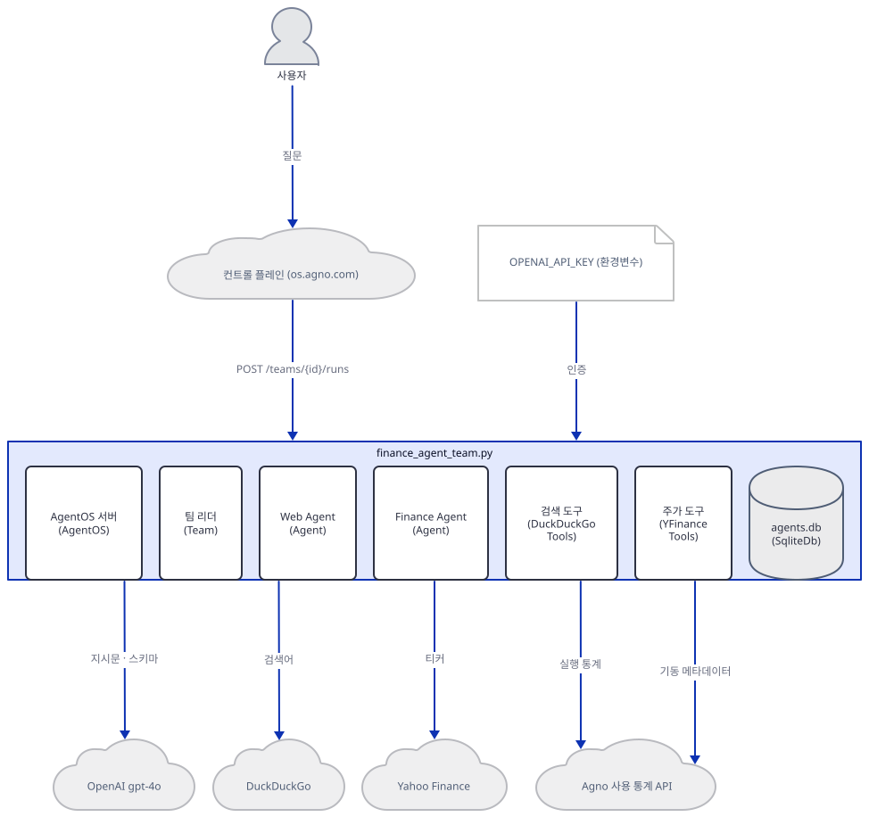

## 사전 준비

| 서비스/도구 | 용도 | 발급·설치 |
|---|---|---|
| uv | 가상환경 생성과 패키지 설치 | [공통 사전 준비](../README.md#공통-사전-준비-한-번만) 참고 |
| Python | 이 문서는 3.13.3으로 확인했다 | 공통 사전 준비와 같음 |
| OpenAI API 키 | 리더와 멤버 둘의 `gpt-4o` 호출 인증. 앱 코드는 키를 읽지 않고(`finance_agent_team.py`에 `api_key`·`environ` 없음, grep) 환경변수 `OPENAI_API_KEY`를 쓴다. 이 문서는 가짜 값 `sk-fake`와 가짜 서버로 확인한다 | https://platform.openai.com/api-keys |
| curl | Step 6의 HTTP 요청. 이 문서는 Git Bash의 `curl`로 확인했다. PowerShell 5.1에서 `curl`은 다른 명령의 별칭이라 `curl.exe`로 부른다(실행해 보지 못함) | 별도 설치 없음 |

모델 `gpt-4o`는 OpenAI 폐기 문서(https://developers.openai.com/api/docs/deprecations, 2026-10-09 확인)에서 폐기 대상 칸에 없고 다른 모델의 "대체 모델" 칸에만 나옵니다. 별칭 `gpt-4o`의 기본 스냅숏 `gpt-4o-2024-08-06`도 폐기 표에 없고, `gpt-4o-2024-05-13`만 2026-10-23에 종료됩니다(같은 원문, 2026-10-09 확인).

## 아키텍처 한눈에 보기

| 컴포넌트 | 역할 | 코드 위치 |
|---|---|---|
| 서버 (`AgentOS`) | 팀을 FastAPI 앱으로 감싸 `POST /teams/{id}/runs` 같은 경로를 열고 `uvicorn`으로 띄운다 | `advanced_ai_agents/multi_agent_apps/agent_teams/ai_finance_agent_team/finance_agent_team.py:41-45` |
| 팀 리더 (`Team`) | 멤버 명단을 보고 위임 도구로 일을 나눠 맡기고 답을 종합한다. 자기 모델이 따로 있다 | `advanced_ai_agents/multi_agent_apps/agent_teams/ai_finance_agent_team/finance_agent_team.py:33-39` |
| Web Agent (`Agent`) | 웹 검색 담당 멤버 | `advanced_ai_agents/multi_agent_apps/agent_teams/ai_finance_agent_team/finance_agent_team.py:12-20` |
| Finance Agent (`Agent`) | 주가·재무 담당 멤버. "표로 보여 줘" 지시문이 있다 | `advanced_ai_agents/multi_agent_apps/agent_teams/ai_finance_agent_team/finance_agent_team.py:22-31` |
| 검색 도구 (`DuckDuckGoTools`) | `web_search`·`search_news` 두 함수 | `advanced_ai_agents/multi_agent_apps/agent_teams/ai_finance_agent_team/finance_agent_team.py:16` |
| 주가 도구 (`YFinanceTools`) | 시세·애널리스트 추천·회사 정보·회사 뉴스 네 함수 | `advanced_ai_agents/multi_agent_apps/agent_teams/ai_finance_agent_team/finance_agent_team.py:26` |
| 저장소 (`SqliteDb`) | 멤버 둘이 `db=`로 받는 SQLite 파일 `agents.db` | `advanced_ai_agents/multi_agent_apps/agent_teams/ai_finance_agent_team/finance_agent_team.py:9-10` |

외부 호출은 모델(`gpt-4o`, 세 곳), DuckDuckGo, Yahoo Finance, Agno 사용 통계 API(서버가 뜰 때 `POST /telemetry/os` 한 번, 질문마다 멤버 둘과 팀이 각각 보내는 실행 통계 `POST /telemetry/runs` 셋 — 뒤쪽은 `AGNO_TELEMETRY=false`로 꺼집니다), 그리고 브라우저로 여는 컨트롤 플레인(`os.agno.com`)입니다. 먼저 서버가 팀을 받고, 팀이 멤버를, 멤버가 도구와 저장소를 쥐는 부분입니다.

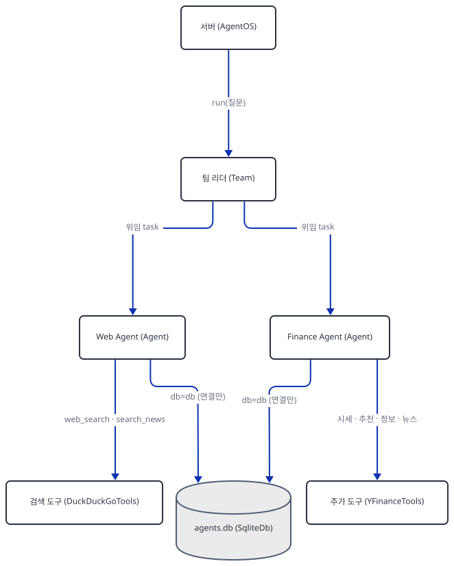

팀과 멤버, 서버가 바깥으로 나가는 호출은 이렇습니다.

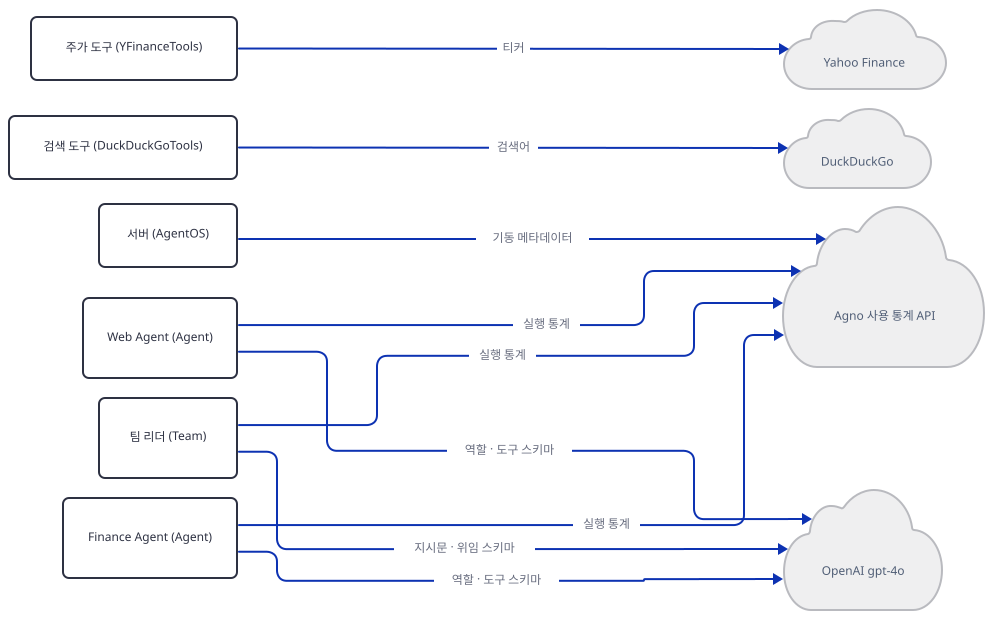

## 단계별 진행

### Step 1. 환경 만들기 — 설치만으로는 import 셋이 막힙니다

**목적.** 원본 폴더를 건드리지 않도록 작업 폴더에 복사본과 가상환경을 만들고, `requirements.txt`가 무엇을 빠뜨렸는지 봅니다.

**할 일.** `<저장소>`는 이 저장소를 받은 경로입니다.

```bash
mkdir finance-team-work
cd finance-team-work
cp <저장소>/advanced_ai_agents/multi_agent_apps/agent_teams/ai_finance_agent_team/finance_agent_team.py .
cp <저장소>/advanced_ai_agents/multi_agent_apps/agent_teams/ai_finance_agent_team/requirements.txt .
uv venv
uv pip install -r requirements.txt
```

(pip 대안: `python -m venv .venv`로 만들고 활성화한 뒤 `pip install -r requirements.txt`.) 아래 PowerShell 줄은 실행해 보지 못했습니다(이 문서를 쓴 하네스가 PowerShell 실행을 막습니다).

```powershell
mkdir finance-team-work
cd finance-team-work
Copy-Item <저장소>\advanced_ai_agents\multi_agent_apps\agent_teams\ai_finance_agent_team\finance_agent_team.py .
Copy-Item <저장소>\advanced_ai_agents\multi_agent_apps\agent_teams\ai_finance_agent_team\requirements.txt .
uv venv
uv pip install -r requirements.txt
```

이 저장소는 루트에 `pyproject.toml`이 있어 저장소 안에서 `uv run`은 루트 환경을 쓰려 하므로, 이후 `uv run`에는 모두 `--no-project`를 붙입니다.

`advanced_ai_agents/multi_agent_apps/agent_teams/ai_finance_agent_team/requirements.txt:1-5`

```text
openai
agno>=2.2.10
duckduckgo-search
yfinance
sqlalchemy
```

2026-10-09에 63개가 설치됐고 agno 3.1.2, openai 3.26.1, yfinance 1.7.0, sqlalchemy 2.1.4가 포함됩니다(직접 확인). `agno>=2.2.10`에는 상한이 없어 오늘의 최신판이 풀립니다. 설치는 되지만 앱이 쓰는 모듈 셋은 import에서 막힙니다.

**확인.**

```bash
uv run --no-project python -m py_compile finance_agent_team.py && echo compiled
uv run --no-project python -c "import agno.db.sqlite"
uv run --no-project python -c "import agno.tools.duckduckgo"
uv run --no-project python -c "import agno.os"
```

(PowerShell 5.1에는 `&&`가 없으므로 첫 줄은 `uv run --no-project python -m py_compile finance_agent_team.py; if ($?) { echo compiled }`로 씁니다. 실행해 보지 못했습니다.)

직접 확인한 출력(각 명령의 마지막 줄)입니다.

```text
compiled
ImportError: The SQLAlchemy asyncio module requires that the Python 'greenlet' library is installed.  In order to ensure this dependency is available, use the 'sqlalchemy[asyncio]' install target:  'pip install sqlalchemy[asyncio]'
ImportError: `ddgs` not installed. Please install using `pip install ddgs`
ModuleNotFoundError: No module named 'fastapi'
```

`py_compile`은 문법만 보므로 통과합니다. 빠진 것은 `greenlet`(SQLite 저장소), `ddgs`(agno가 실제로 부르는 검색 패키지, `agno/tools/websearch.py` 첫머리의 `from ddgs import DDGS`를 소스로 확인 — `requirements.txt`의 `duckduckgo-search`는 설치돼도 이 앱에서 쓰이지 않습니다), `fastapi`(서버)입니다. agno의 extra 셋이 이 셋과 `uvicorn`·`python-multipart`까지 한 번에 가져옵니다(agno 3.1.2 메타데이터로 확인).

```bash
uv pip install "agno[os,sqlite,ddg]"
uv run --no-project python -c "import agno.os, agno.db.sqlite, agno.tools.duckduckgo, agno.tools.yfinance; print('imports ok')"
```

17개가 더 설치되고(`greenlet`·`ddgs`·`fastapi`·`uvicorn`·`python-multipart` 포함, 직접 확인) 두 번째 명령은 `imports ok`를 찍습니다. 그러나 `import finance_agent_team` 자체는 아직 실패합니다. Step 3에서 이유를 봅니다.

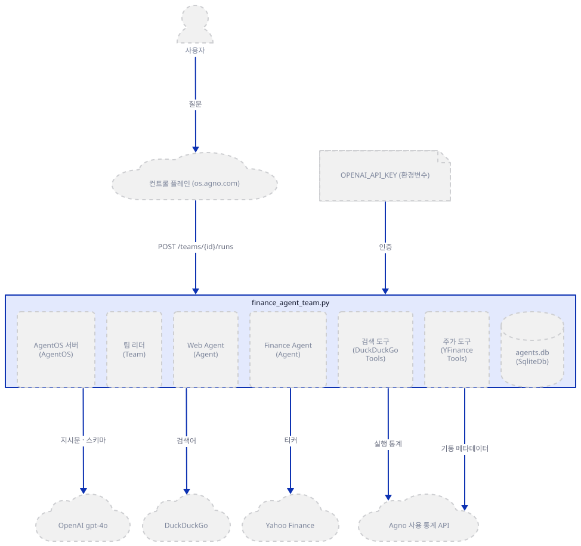

### Step 2. 저장소와 Web Agent — 만들 때는 파일도 키도 필요 없습니다

**목적.** 멤버 하나가 어떻게 만들어지는지, `role`이 무엇을 위한 것인지 봅니다.

**할 일.**

`advanced_ai_agents/multi_agent_apps/agent_teams/ai_finance_agent_team/finance_agent_team.py:9-20`

```python
# Setup database for storage
db = SqliteDb(db_file="agents.db")

web_agent = Agent(
    name="Web Agent",
    role="Search the web for information",
    model=OpenAIChat(id="gpt-4o"),
    tools=[DuckDuckGoTools()],
    db=db,
    add_history_to_context=True,
    markdown=True,
)
```

`db_file="agents.db"`는 실행한 작업 폴더 기준의 상대 경로입니다. `role`은 팀 리더가 보는 멤버 명단에 들어가고(Step 6의 요청 `#1`), 멤버 자신의 시스템 메시지에도 `<your_role>`로 들어갑니다(요청 `#2`·`#5`). `instructions`가 없는 Web Agent에게는 이것이 유일한 지시입니다. `DuckDuckGoTools()`는 인자 없이 두 함수를 켭니다.

**확인.** 이 줄들만 따로 만들어 봅니다. 키는 필요 없고, `ls`에 `agents.db`가 없다는 것이 요점입니다.

```bash
uv run --no-project python -c "
from agno.agent import Agent
from agno.models.openai import OpenAIChat
from agno.db.sqlite import SqliteDb
from agno.tools.duckduckgo import DuckDuckGoTools
db = SqliteDb(db_file='agents.db')
web = Agent(name='Web Agent', role='Search the web for information', model=OpenAIChat(id='gpt-4o'), tools=[DuckDuckGoTools()], db=db, add_history_to_context=True, markdown=True)
print(web.name, [f for t in web.tools for f in t.functions])
"
ls
```

직접 확인한 출력입니다. `ls`에는 `finance_agent_team.py`와 `requirements.txt` 등만 있습니다.

```text
Web Agent ['web_search', 'search_news']
```

`SqliteDb`는 만들 때 파일을 만들지 않습니다. 첫 질문에서 멤버 실행이 끝날 때 agno가 `agents.db`의 approvals 표를 찾느라 처음 연결하면서 파일이 생깁니다(Step 7). 표는 생기지 않습니다.

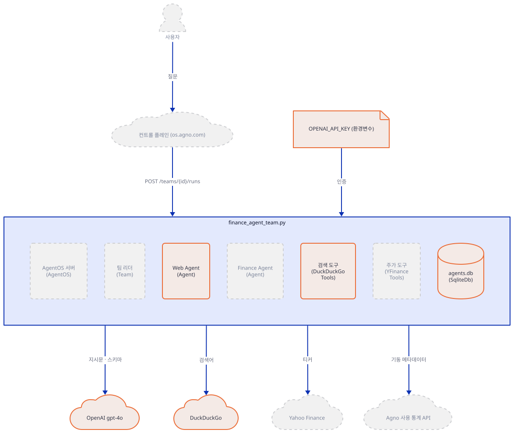

### Step 3. Finance Agent — 만들다가 죽습니다

**목적.** 앱이 뜨기 전에 죽는 이유를 찾고, 복사본에서 한 줄을 고칩니다.

**할 일.**

`advanced_ai_agents/multi_agent_apps/agent_teams/ai_finance_agent_team/finance_agent_team.py:22-31`

```python
finance_agent = Agent(
    name="Finance Agent",
    role="Get financial data",
    model=OpenAIChat(id="gpt-4o"),
    tools=[YFinanceTools(include_tools=["get_current_stock_price", "get_analyst_recommendations", "get_company_info", "get_company_news"])],
    instructions=["Always use tables to display data"],
    db=db,
    add_history_to_context=True,
    markdown=True,
)
```

Step 1의 설치 상태에서 `uv run --no-project python -c "import finance_agent_team"`를 돌리면 26행에서 이렇게 멈춥니다(직접 확인, 집합 순서라 이름 순서는 실행마다 다를 수 있습니다).

```text
ValueError: Included tool(s) not present in the toolkit: get_company_news, get_analyst_recommendations, get_company_info
```

원인은 `YFinanceTools`가 바뀐 데 있습니다. agno 3.1.2의 생성자(`agno/tools/yfinance.py`의 `__init__`)는 함수마다 `enable_*` 플래그를 두고 기본값으로 `get_current_stock_price` 하나만 켭니다. `include_tools`는 켜진 함수 가운데서 고르는 필터라서(`agno/tools/toolkit.py`의 `_check_tools_filters`), 꺼진 함수의 이름을 적으면 오류입니다. 이 앱이 쓴 `agno>=2.2.10`의 하한판 2.2.10과 2.5.2의 `yfinance.py`에는 플래그가 없고 아홉 함수가 모두 켜졌으며, 2.5.3부터 플래그가 있습니다(두 판의 소스를 직접 열어 확인). 같은 종류의 실패를 Day 089가 `FirecrawlTools`의 인자 이름에서 겪었습니다.

고치는 길은 둘입니다. `uv pip install "agno[os,sqlite,ddg]==2.5.2" greenlet`로 고정하면 원본이 그대로 import됩니다(직접 확인, 이 판의 extra는 `greenlet`을 가져오지 않아 따로 넣었습니다. 이 판은 `AgentOS(...)`를 만들 때 바로 기동 통계를 보내려 하므로 Step 4·5의 import 확인에서도 나갑니다 — 소스로 확인). 오늘은 최신판에 남아 복사본의 26행만 고칩니다. 원본 파일은 건드리지 않습니다.

```bash
uv run --no-project python -c "p='finance_agent_team.py'; s=open(p,encoding='utf-8').read(); open(p,'w',encoding='utf-8').write(s.replace('YFinanceTools(include_tools=','YFinanceTools(enable_company_info=True, enable_analyst_recommendations=True, enable_company_news=True, include_tools='))"
```

26행에 `enable_*=True` 셋이 앞에 붙고 나머지는 그대로입니다.

**확인.**

```bash
uv run --no-project python -c "
from agno.tools.yfinance import YFinanceTools
t = YFinanceTools(enable_company_info=True, enable_analyst_recommendations=True, enable_company_news=True, include_tools=['get_current_stock_price','get_analyst_recommendations','get_company_info','get_company_news'])
print(list(t.functions))
"
```

```text
['get_current_stock_price', 'get_company_info', 'get_analyst_recommendations', 'get_company_news']
```

(직접 확인.) 앱 README의 "detailed financial analysis"는 이 네 함수가 전부입니다. 재무제표나 기술 지표 함수는 켜지 않았습니다.

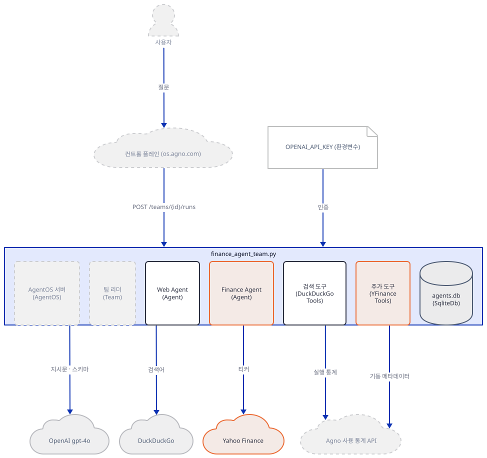

### Step 4. Team — 리더에게 지시문이 없습니다

**목적.** 지시문 없는 `Team`이 어떻게 멤버를 고르는지 봅니다.

**할 일.**

`advanced_ai_agents/multi_agent_apps/agent_teams/ai_finance_agent_team/finance_agent_team.py:33-39`

```python
agent_team = Team(
    name="Agent Team (Web+Finance)",
    model=OpenAIChat(id="gpt-4o"),
    members=[web_agent, finance_agent],
    debug_mode=True,
    markdown=True,
)
```

`mode`를 정하지 않으면 `coordinate`이고, 리더가 `delegate_task_to_member`로 멤버를 고른다는 것은 Day 079 Step 5가 이미 소스로 확인했으므로 되풀이하지 않습니다. 오늘 새로 볼 것은 이름에서 `id`가 만들어지는 방식과 `instructions`·`db`가 없다는 점입니다.

**확인.** 고친 복사본을 import합니다. `debug_mode=True`라 agno의 `DEBUG` 줄이 먼저 찍힙니다.

```bash
uv run --no-project python -c "
import finance_agent_team as f
t = f.agent_team
print(t.name, '|', [m.name for m in t.members], '| team db:', t.db, '| member db:', [type(m.db).__name__ for m in t.members])
print('mode:', t.mode, '| instructions:', t.instructions, '| model:', t.model.id)
"
```

직접 확인한 출력입니다.

```text
DEBUG   Team ID: agent-team-(web+finance)
DEBUG   Agent initialized: web-agent
DEBUG   Agent initialized: finance-agent
DEBUG   Components, Scheduler, Approval, and Service Account routers not enabled: requires a db to be provided to AgentOS
Agent Team (Web+Finance) | ['Web Agent', 'Finance Agent'] | team db: None | member db: ['SqliteDb', 'SqliteDb']
mode: TeamMode.coordinate | instructions: None | model: gpt-4o
```

팀 `id`는 이름에서 `agent-team-(web+finance)`로, 멤버 `id`는 `web-agent`·`finance-agent`로 만들어집니다. 리더가 위임할 때 쓰는 이름이 이 멤버 `id`입니다. 팀 `db`는 `None`이고, AgentOS가 `db`를 받지 않았다는 `DEBUG` 줄도 함께 나옵니다.

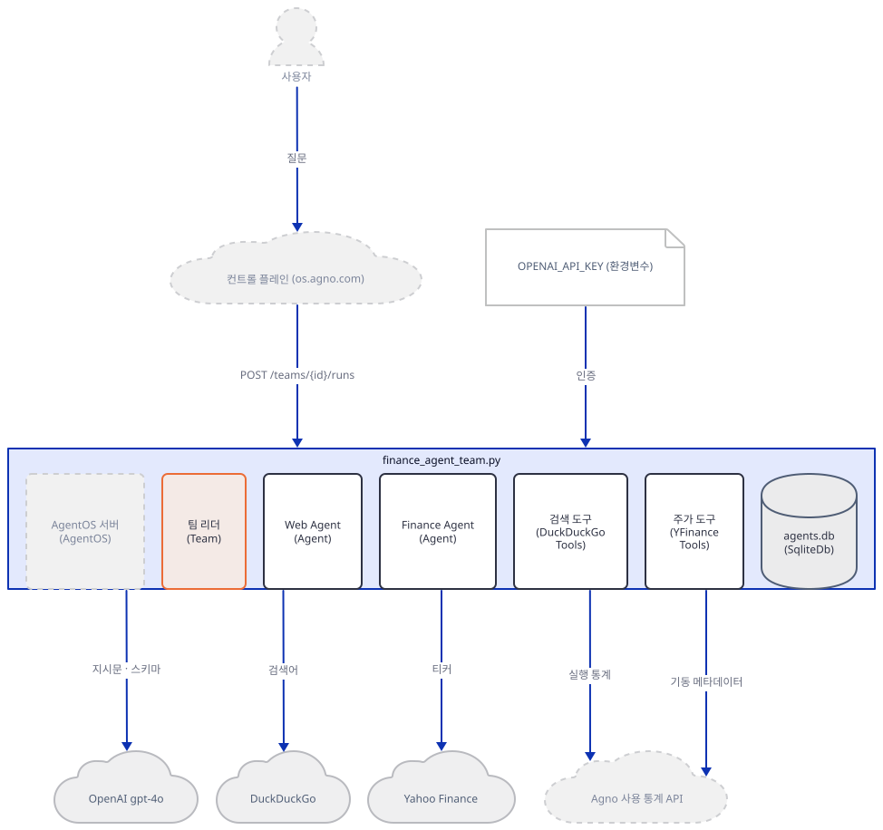

### Step 5. AgentOS — `teams=`로 올리고 `serve`로 띄웁니다

**목적.** 팀이 서버가 되는 줄과, 그 서버가 기본으로 어디에 어떻게 열리는지 봅니다.

**할 일.**

`advanced_ai_agents/multi_agent_apps/agent_teams/ai_finance_agent_team/finance_agent_team.py:41-45`

```python
agent_os = AgentOS(teams=[agent_team])
app = agent_os.get_app()

if __name__ == "__main__":
    agent_os.serve(app="finance_agent_team:app", reload=True)
```

`get_app()`은 FastAPI 앱을 만듭니다. `serve`의 나머지 인자는 기본값입니다.

**확인.**

```bash
uv run --no-project python -c "
import finance_agent_team as f, inspect
print(type(f.app).__name__)
print(inspect.signature(f.agent_os.serve))
print('telemetry:', f.agent_os.telemetry)
" | grep -v "^DEBUG"
```

(PowerShell에서는 끝의 `| grep -v "^DEBUG"` 대신 `| Select-String -NotMatch "^DEBUG"`를 쓰며, 실행해 보지 못했습니다.) 직접 확인한 출력입니다.

```text
FastAPI
(app: Union[str, fastapi.applications.FastAPI], *, host: str = 'localhost', port: int = 7777, reload: bool = False, reload_includes: Optional[List[str]] = None, reload_excludes: Optional[List[str]] = None, workers: Optional[int] = None, access_log: bool = False, **kwargs)
telemetry: True
```

세 가지를 읽습니다. 서버는 `localhost:7777`에만 열립니다(`host` 기본값이 `localhost`이고, 환경변수 `AGENT_OS_HOST`·`AGENT_OS_PORT`가 있으면 그 값이 이깁니다 — `agno/os/app.py`의 `serve`를 소스로 확인). `reload=True`이므로 코드를 고치면 서버가 다시 뜨고, 문자열 `"finance_agent_team:app"`은 모듈 이름이라 이 파일이 있는 폴더에서 돌려야 합니다. 그리고 `telemetry`는 `True`입니다. `AgentOS(teams=[agent_team])`에 `telemetry=False`가 없으므로 서버가 뜨는 순간 agno가 `POST /telemetry/os`를 보내려 하고, `AGNO_TELEMETRY=false`는 이쪽을 끄지 못합니다(Day 047 Step 5가 소스와 로컬 수신기로 확인). 이 앱에서도 `AGNO_TELEMETRY=false`를 건 채 Step 6의 대역이 같은 내용을 찍었습니다(직접 확인). 보내려는 내용은 Step 6에서 봅니다. 질문마다 가는 `POST /telemetry/runs`는 다릅니다. 환경변수 없이 질문 1건을 보내면 `finance-agent`·`web-agent`·팀 몫으로 셋이 나가고, `AGNO_TELEMETRY=false`를 걸면 0건이 됩니다(`agno.api.api.api.post_in_background`를 가로채 직접 확인). Step 6의 명령이 이 변수를 거는 까닭입니다.

독자가 앱을 띄우는 명령은 이 한 줄입니다.

```bash
uv run --no-project python finance_agent_team.py
```

배너에 `https://os.agno.com/`과 `OS running on: http://localhost:7777`이 나오고, 브라우저로 컨트롤 플레인에 접속해 이 서버에 연결합니다. 이 명령은 실제 OpenAI·Yahoo Finance·DuckDuckGo와 Agno 통계 서버로 나가므로 이 문서는 그대로 돌리지 않았습니다. 대신 같은 파일을 `AGENT_OS_PORT`로 포트만 바꾸고 모든 외부 요청을 막은 채 띄워 봤습니다. `/health`가 `{"status":"ok", ...}`를, `/teams`가 `"id":"agent-team-(web+finance)"`와 `"mode":"coordinate"`를 돌려줬습니다(직접 확인).

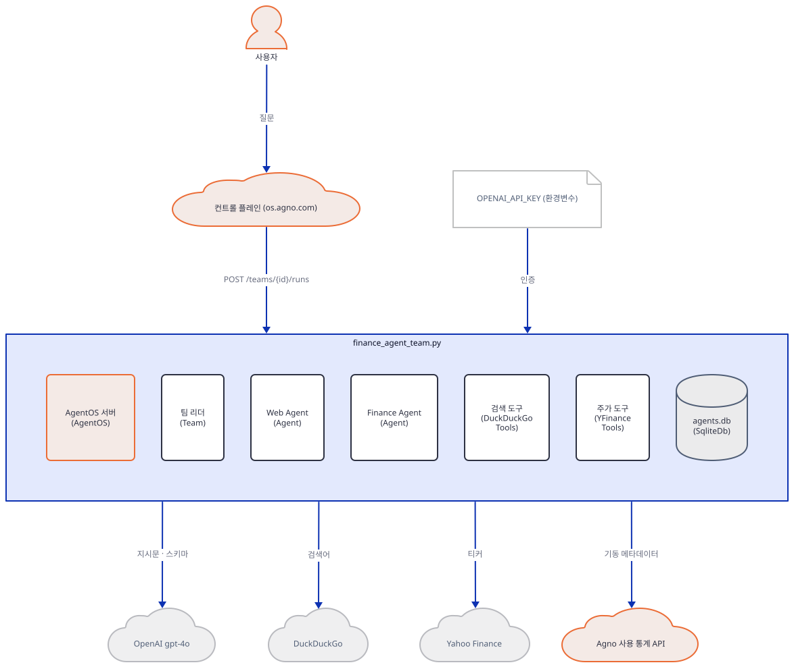

### Step 6. 가짜 서버로 질문 한 건을 끝까지 — 모델 호출 일곱 번

**목적.** 외부 서비스 없이 질문 하나가 팀을 통과하는 전 과정을 로컬에서 봅니다.

**할 일.** 파일 둘을 작업 폴더에 저장합니다. 하나는 정해진 대본대로만 답하는 가짜 OpenAI 서버입니다. 리더에게는 Finance 위임, Web 위임, 최종 답을 차례로 시키고, 멤버에게는 도구 호출 한 번과 정리 글을 시킵니다.

`fake_openai.py`

```python
# 가짜 OpenAI 서버: 요청을 한 줄씩 찍고, 정해진 대본대로만 답한다.
import json, sys
from http.server import BaseHTTPRequestHandler, HTTPServer

class Server(HTTPServer):
    allow_reuse_address = False   # Windows에서 다른 프로세스의 포트에 겹쳐 뜨지 않게

def reply(content=None, call=None):
    msg = {"role": "assistant", "content": content}
    if call:
        msg["tool_calls"] = [{"id": "call_" + call[0], "type": "function",
                              "function": {"name": call[0], "arguments": json.dumps(call[1])}}]
    return {"id": "x", "object": "chat.completion", "created": 0, "model": "gpt-4o",
            "choices": [{"index": 0, "message": msg, "finish_reason": "tool_calls" if call else "stop"}],
            "usage": {"prompt_tokens": 1, "completion_tokens": 1, "total_tokens": 2}}

class Handler(BaseHTTPRequestHandler):
    n = 0
    def log_message(self, *a): pass
    def do_POST(self):
        body = json.loads(self.rfile.read(int(self.headers["content-length"])))
        tools = [t["function"]["name"] for t in body["tools"]]
        msgs = body["messages"]
        results = sum(m["role"] == "tool" for m in msgs)       # 이 요청에 쌓인 tool 메시지 수
        who = "팀 리더" if "delegate_task_to_member" in tools else "Finance" if "get_current_stock_price" in tools else "Web"
        Handler.n += 1
        print(f"#{Handler.n} {who:7} 도구 {len(tools)}개 | roles={[m['role'] for m in msgs]} | 질문={msgs[1]['content'][:14]!r}", flush=True)
        if "delegate_task_to_member" in tools:                  # 팀 리더
            if results == 0:
                out = reply(call=("delegate_task_to_member", {"member_id": "finance-agent", "task": "AAPL 현재가와 애널리스트 추천을 표로 정리해 줘."}))
            elif results == 1:
                out = reply(call=("delegate_task_to_member", {"member_id": "web-agent", "task": "AAPL 최근 뉴스를 웹에서 찾아 줘."}))
            else:
                out = reply("(가짜 리더) 두 멤버의 보고서를 합친 답입니다.")
        elif "get_current_stock_price" in tools:                # Finance Agent
            out = reply(call=("get_current_stock_price", {"symbol": "AAPL"})) if results == 0 else reply("| 종목 | 가격 |\n|---|---|\n| AAPL | 123.4567 |")
        else:                                                   # Web Agent
            out = reply(call=("web_search", {"query": "AAPL latest news"})) if results == 0 else reply("(가짜 Web Agent) 가짜 헤드라인 하나.")
        data = json.dumps(out).encode()
        self.send_response(200); self.send_header("content-type", "application/json")
        self.send_header("content-length", str(len(data))); self.end_headers(); self.wfile.write(data)

port = int(sys.argv[1])
print("가짜 OpenAI 서버: 127.0.0.1:%d" % port, flush=True)
Server(("127.0.0.1", port), Handler).serve_forever()
```

다른 하나는 Yahoo Finance·DuckDuckGo·Agno 통계 자리를 대역으로 바꾼 뒤 고친 복사본의 `app`을 그대로 내보내는 파일입니다.

`harness.py`

```python
# 외부 세 곳(Yahoo Finance, DuckDuckGo, Agno 통계)을 로컬 대역으로 바꾼 뒤 앱의 app을 그대로 내보낸다.
import yfinance
import agno.api.os as os_api
import agno.tools.websearch as websearch

class FakeTicker:                                   # yfinance.Ticker 대역
    def __init__(self, symbol, session=None): self.symbol = symbol
    @property
    def info(self): return {"regularMarketPrice": 123.4567}
yfinance.Ticker = FakeTicker

class FakeDDGS:                                     # ddgs.DDGS 대역
    def __init__(self, *a, **k): pass
    def __enter__(self): return self
    def __exit__(self, *a): return None
    def text(self, *a, **k): return [{"title": "가짜 결과", "href": "http://localhost/x", "body": "본문"}]
websearch.DDGS = FakeDDGS

def fake_telemetry(launch):                         # Agno로 갈 POST /telemetry/os 대신 내용만 찍는다
    print("텔레메트리 전송 시도(대신 출력):", launch.data, flush=True)
os_api.log_os_telemetry = fake_telemetry

from finance_agent_team import app                  # 고친 복사본의 app (원본 아님)
```

터미널 둘을 씁니다. 포트는 비어 있는 높은 번호면 아무거나 됩니다(이 문서는 54331·54332).

```bash
# 터미널 A
uv run --no-project python fake_openai.py 54331
```

```bash
# 터미널 B
OPENAI_API_KEY=sk-fake OPENAI_BASE_URL=http://127.0.0.1:54331/v1 AGNO_TELEMETRY=false uv run --no-project python -m uvicorn harness:app --host 127.0.0.1 --port 54332
```

```powershell
# 터미널 B (PowerShell, 실행해 보지 못했습니다. 변수가 이 터미널에 남으므로 실제 키로 돌릴 때는 새 터미널을 쓰세요)
$env:OPENAI_API_KEY = "sk-fake"; $env:OPENAI_BASE_URL = "http://127.0.0.1:54331/v1"; $env:AGNO_TELEMETRY = "false"
uv run --no-project python -m uvicorn harness:app --host 127.0.0.1 --port 54332
```

서버가 뜨면 터미널 B의 로그에 `텔레메트리 전송 시도(대신 출력): {'agents': [], 'teams': ['agent-team-(web+finance)'], 'workflows': [], 'interfaces': None}`가 나옵니다. 이 앱이 Agno로 보내려는 것은 팀 `id` 하나입니다. 이제 세 번째 터미널에서 질문을 보냅니다. 팀 `id`의 `(`·`+`·`)`가 경로에 들어가므로 `%28`·`%2B`·`%29`로 인코딩하고, 컨트롤 플레인과 달리 `stream=false`로 한 번에 받습니다(스트리밍 기본값은 `Form(True)`, `agno/os/routers/teams/router.py`를 소스로 확인). 메시지는 영어로 적습니다. Git Bash의 `curl`은 한글 인자를 시스템 코드 페이지(cp949)로 보내 글자가 깨졌습니다(직접 확인).

```bash
curl -s -X POST "http://127.0.0.1:54332/teams/agent-team-%28web%2Bfinance%29/runs" -F "message=AAPL price and recent news" -F "stream=false" -F "session_id=demo" -o run1.json
```

```powershell
curl.exe -s -X POST "http://127.0.0.1:54332/teams/agent-team-%28web%2Bfinance%29/runs" -F "message=AAPL price and recent news" -F "stream=false" -F "session_id=demo" -o run1.json
```

(PowerShell 줄은 실행해 보지 못했습니다.) 응답 JSON은 길어서 필요한 필드만 찍는 `show.py`를 씁니다.

`show.py`

```python
import json, sys
d = json.load(open(sys.argv[1], encoding="utf-8"))
print("최종 답:", d["content"])
for t in d["tools"]:
    print("위임:", t["tool_args"]["member_id"], "<-", t["tool_args"]["task"])
for m in d["member_responses"]:
    print("멤버 보고:", m["agent_name"], "->", repr(m["content"]))
```

**확인.** `uv run --no-project python show.py run1.json`의 직접 확인한 출력입니다.

```text
최종 답: (가짜 리더) 두 멤버의 보고서를 합친 답입니다.
위임: finance-agent <- AAPL 현재가와 애널리스트 추천을 표로 정리해 줘.
위임: web-agent <- AAPL 최근 뉴스를 웹에서 찾아 줘.
멤버 보고: Finance Agent -> '| 종목 | 가격 |\n|---|---|\n| AAPL | 123.4567 |'
멤버 보고: Web Agent -> '(가짜 Web Agent) 가짜 헤드라인 하나.'
```

터미널 A에는 모델 호출 일곱 줄이 찍힙니다.

```text
#1 팀 리더    도구 1개 | roles=['developer', 'user'] | 질문='AAPL price and'
#2 Finance 도구 4개 | roles=['developer', 'user'] | 질문='AAPL 현재가와 애널리스'
#3 Finance 도구 4개 | roles=['developer', 'user', 'assistant', 'tool'] | 질문='AAPL 현재가와 애널리스'
#4 팀 리더    도구 1개 | roles=['developer', 'user', 'assistant', 'tool'] | 질문='AAPL price and'
#5 Web     도구 2개 | roles=['developer', 'user'] | 질문='AAPL 최근 뉴스를 웹에'
#6 Web     도구 2개 | roles=['developer', 'user', 'assistant', 'tool'] | 질문='AAPL 최근 뉴스를 웹에'
#7 팀 리더    도구 1개 | roles=['developer', 'user', 'assistant', 'tool', 'assistant', 'tool'] | 질문='AAPL price and'
```

읽는 법입니다. 리더의 도구는 `delegate_task_to_member` 하나뿐입니다. 멤버가 받는 "질문"은 사용자의 문장이 아니라 리더가 쓴 `task` 문자열입니다. Finance Agent는 도구 네 개를, Web Agent는 둘을 받습니다. 시스템 메시지는 `system`이 아니라 `developer` 역할로 갑니다. 대본이 위임을 한 번에 하나씩 하게 해서 일곱 번이고, 진짜 모델은 독립된 일은 한 턴에 함께 위임하라는 리더의 지시문(직접 확인한 첫 요청의 `developer` 메시지) 때문에 여섯 번으로 줄 수 있습니다. 몇 번일지는 진짜 모델로 확인하지 못했습니다. 이 단계의 도구 결과 `123.4567`은 `FakeTicker`가 만든 값입니다.


### Step 7. agents.db는 비어 있습니다 — 멤버의 db=db는 세션 저장에 쓰이지 않습니다

**목적.** 앱 README가 말하는 저장이 실제로 일어나는지, 같은 세션으로 다시 물으면 앞 대화가 이어지는지 봅니다.

**할 일.** Step 6의 서버를 그대로 둔 채 같은 `session_id`로 두 번째 질문을 보냅니다.

```bash
curl -s -X POST "http://127.0.0.1:54332/teams/agent-team-%28web%2Bfinance%29/runs" -F "message=What did I just ask?" -F "stream=false" -F "session_id=demo" -o run2.json
ls agents.db*
```

그리고 표가 있는지 읽기 전용으로 엽니다.

`check_db.py`

```python
import sqlite3
c = sqlite3.connect("file:agents.db?mode=ro", uri=True)
print("표:", c.execute("select name from sqlite_master where type='table'").fetchall())
```

**확인.** 첫 질문 뒤의 `ls agents.db*`는 파일 셋(`agents.db`, `agents.db-shm`, `agents.db-wal`)을 보여 줍니다. 두 번째 질문 뒤 `uv run --no-project python check_db.py`는 이렇게 찍습니다(모두 직접 확인).

```text
표: []
```

파일은 있지만 표가 없습니다. 터미널 A의 `#8`~`#14`도 Step 6과 모양이 같습니다. 두 번째 질문의 리더 요청 `#8`은 `roles=['developer', 'user']`, `질문='What did I jus'`이고 앞 질문의 흔적이 없습니다. 이유는 agno 소스에 있습니다. `agno/agent/_session.py`의 `save_session`은 "If the agent is a member of a team, do not save the session to the database"라는 주석 아래 `agent.team_id is None`일 때만 세션을 저장하고, 읽는 쪽도 같은 조건입니다(`agno/agent/_storage.py`의 `read_or_create_session`). 팀이 실행될 때 `_initialize_member`(`agno/team/_init.py`)가 멤버에 `team_id`를 붙이므로(import 직후에는 `None`) 멤버의 `db=db`는 세션 저장에 쓰이지 않고, 멤버 실행이 끝날 때 approvals 표를 찾는 데에만 닿습니다(`agno/agent/_run.py`의 실행 뒤 정리 단계에서 `update_approval_run_status(agent.db, ...)`를 부릅니다, 소스로 확인. 표가 없을 때 아무것도 만들지 않는다는 쪽은 `agents.db`에 표가 0개라는 Step 7의 출력이 보여 줍니다). 이 접근이 첫 질문 뒤 `agents.db` 파일이 생기는 까닭입니다. 팀에는 `db`가 없어 기록할 곳도 없습니다. 같은 세션으로 이어지는 대화가 필요하면 `Team(..., db=db)`만으로는 모자랍니다. 표가 생기고 멤버는 자기 앞 실행을 받지만, 팀의 `add_history_to_context` 기본값이 `False`(`agno/team/team.py`)라 리더는 앞 질문을 받지 못합니다. `Team(..., db=db, add_history_to_context=True)`가 필요합니다(리뷰어가 `db=db`만 넣은 복사본으로 확인했고, 두 값을 함께 넣은 판은 이 문서에서 돌려 보지 못했습니다).


## 요청 한 건이 흐르는 과정

컨트롤 플레인에서 질문을 보내면 리더가 멤버 둘을 차례로 부르고 종합하는 흐름을 열두 그림으로 나눠 따라갑니다. 배우가 열세 곳이고 메시지가 서른아홉이라 한 그림에 넣으면 상한(1200×1000)을 넘으므로 앱의 시간 경계, 곧 모델 호출과 도구 호출 경계에서 나눴고, 메시지는 모두 원래 순서로 정확히 한 그림에 있습니다. 첫 그림을 뺀 열한 장은 `extra-` 이름입니다. 이 시퀀스는 Step 6의 가짜 서버 대본으로 돌려 본 것이라 진짜 모델의 위임 순서와 도구 결과는 확인하지 못했습니다. 컨트롤 플레인 자리는 `curl`이 대신했습니다. Yahoo Finance와 DuckDuckGo로 가는 화살표는 소스(`agno/tools/yfinance.py`, `agno/tools/websearch.py`)로 그렸고, 이 문서에서는 대역으로 바꿔 실행했습니다.

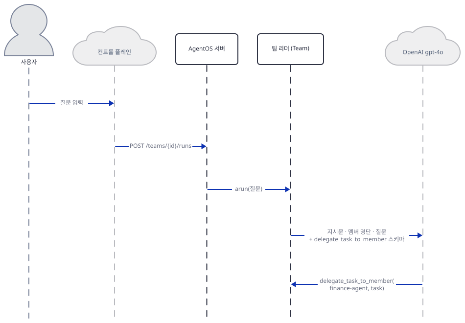

사용자가 컨트롤 플레인에 질문을 적으면 서버가 팀의 `arun`을 부르고, 리더가 지시문·멤버 명단·질문과 위임 도구 스키마를 모델에 보내 `delegate_task_to_member(finance-agent, task)`를 받습니다.

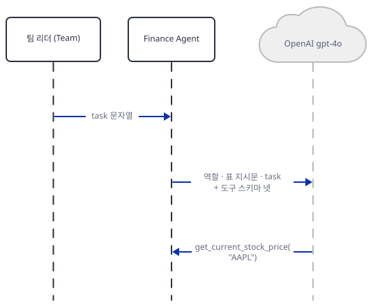

리더가 `task` 문자열만 넘깁니다. 멤버는 역할과 "표로 보여 줘" 지시문, `task`에 도구 스키마 넷을 붙여 모델에 보내고 `get_current_stock_price("AAPL")`을 요청받습니다.

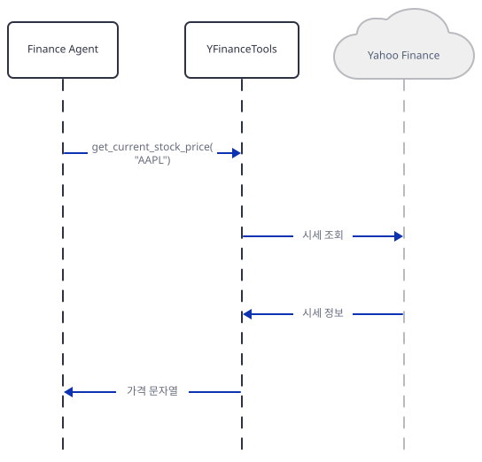

도구 함수가 Yahoo Finance에서 시세를 받아 가격 문자열(`"123.4567"`)로 돌려줍니다.

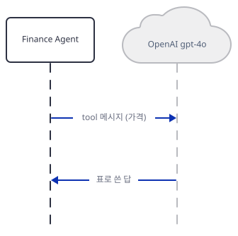

가격이 `tool` 메시지로 모델에 가고 표로 쓴 답이 돌아옵니다.

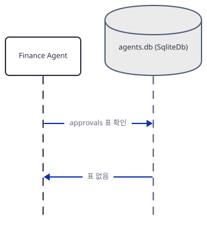

멤버 실행이 끝나면 agno가 `agents.db`에서 approvals 표를 찾고, 표가 없다는 답을 받습니다. 첫 질문 뒤 `agents.db` 파일이 생기는 자리입니다(Step 7).

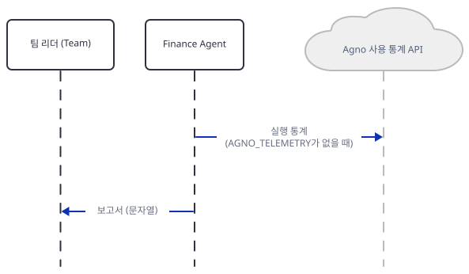

`AGNO_TELEMETRY`가 없으면 멤버가 실행 통계를 Agno로 보내고, 보고서가 리더에게 돌아갑니다.

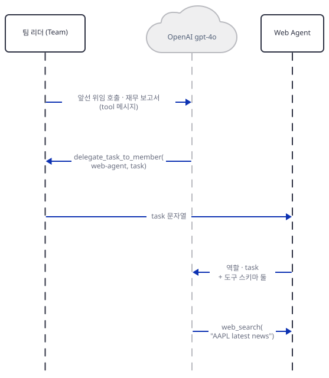

리더의 두 번째 요청에는 질문 뒤에 첫 위임 호출과 재무 보고서가 `tool` 메시지로 쌓입니다. 모델이 Web Agent를 고르고, 이 멤버가 `web_search`를 요청받습니다.

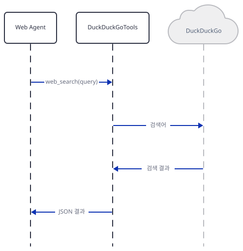

검색 도구가 DuckDuckGo에 검색어를 보내고 결과를 JSON으로 돌려받습니다.

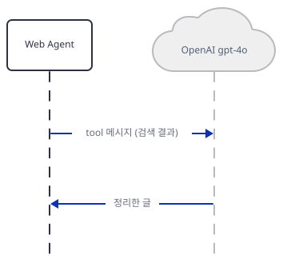

검색 JSON이 `tool` 메시지로 모델에 가고 정리한 글이 돌아옵니다.

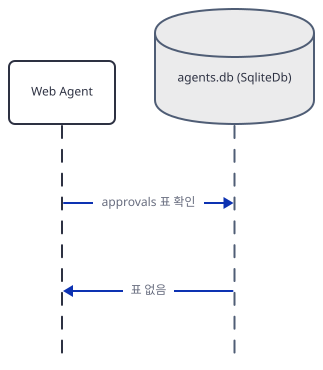

Finance Agent와 같은 확인이 한 번 더 있습니다.

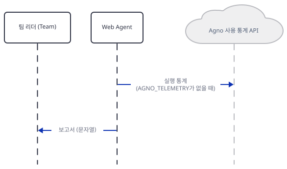

멤버가 실행 통계를 보내고 보고서가 리더에게 돌아갑니다.

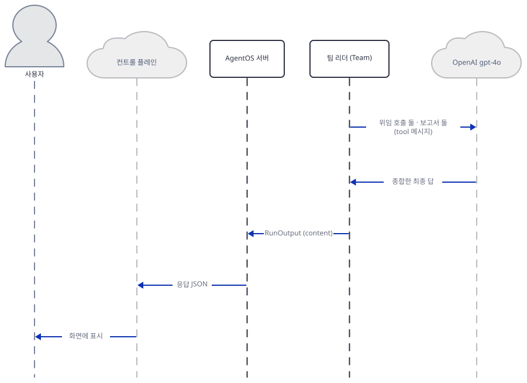

리더의 마지막 요청에는 위임 호출 둘과 보고서 둘이 쌓여 있고, 모델이 종합한 답이 서버를 거쳐 화면에 표시됩니다. 리더의 최종 답 뒤에는 팀의 실행 통계가 나갑니다. 이 과정에서 `agents.db`에 무언가를 쓰는 화살표는 없고, 표를 찾는 확인만 있다는 점이 Step 7의 내용입니다.

## 실행 체크리스트

- [ ] `uv pip install -r requirements.txt` 뒤 `uv pip install "agno[os,sqlite,ddg]"`로 `fastapi`·`greenlet`·`ddgs`를 채웠다
- [ ] 복사본 26행에 `enable_company_info=True, enable_analyst_recommendations=True, enable_company_news=True`를 더해 `ValueError` 없이 import된다
- [ ] 팀 `id`가 `agent-team-(web+finance)`, 멤버 `id`가 `web-agent`·`finance-agent`임을 `DEBUG` 줄로 봤다
- [ ] `inspect.signature(agent_os.serve)`로 `host='localhost'`, `port=7777`, `telemetry=True`를 확인했다
- [ ] 가짜 서버와 `harness.py`로 질문 한 건에 모델 호출 일곱 번이 찍히는 것을 봤다
- [ ] `agents.db`에 표가 없고 같은 `session_id`의 두 번째 질문에도 앞 대화가 없음을 확인했다
- [ ] 실제 키로 돌릴 때: `uv run --no-project python finance_agent_team.py`로 띄우고 컨트롤 플레인에 `http://localhost:7777`을 연결했다(이 문서는 하지 않음)

## 문제 해결

| 증상 | 원인 | 해결 |
|---|---|---|
| `import agno.db.sqlite`에서 `ImportError: The SQLAlchemy asyncio module requires that the Python 'greenlet' library` | `requirements.txt`의 `sqlalchemy`는 asyncio 확장에 필요한 `greenlet`을 가져오지 않는다 | `uv pip install "agno[os,sqlite,ddg]"` |
| `import agno.tools.duckduckgo`에서 ``ImportError: `ddgs` not installed`` | agno 3.1.2의 검색 도구는 `ddgs`를 import하는데 `requirements.txt`는 `duckduckgo-search`만 적었다 | 같은 명령 |
| `import agno.os`에서 `ModuleNotFoundError: No module named 'fastapi'` | 서버 계층의 `fastapi`·`uvicorn`·`python-multipart`가 빠졌다 | 같은 명령 |
| `import finance_agent_team`에서 `ValueError: Included tool(s) not present in the toolkit: ...` | agno 2.5.3 이후 `YFinanceTools`는 함수를 플래그로 켜고, `include_tools`는 켜진 것만 거른다 | 복사본 26행에 `enable_*=True` 셋을 더하거나 `agno==2.5.2`로 고정(Step 3) |
| 팀에 같은 `session_id`로 다시 물어도 앞 질문을 모른다. `agents.db`는 생겼는데 표가 없다 | 팀의 멤버는 세션을 DB에 저장하지 않고(`agno/agent/_session.py`의 `save_session`) 팀에는 `db`가 없다. 파일은 멤버 실행 뒤 approvals 표를 찾느라 생긴다 | `Team(..., db=db, add_history_to_context=True)`를 넣어 본다. `db=db`만으로는 리더가 앞 질문을 받지 못한다(더 해보기) |
| `curl`로 한글 질문을 보냈더니 `fake_openai.py`가 찍은 질문이 `ÁÖ°¡¿Í`처럼 깨져 있다 | Git Bash의 `curl`이 한글 인자를 시스템 코드 페이지(cp949)로 보냈다 | 메시지를 영어로 적는다(Step 6) |

## 더 해보기

- `advanced_ai_agents/multi_agent_apps/agent_teams/ai_finance_agent_team/finance_agent_team.py:33-39`의 `Team(...)`에 `db=db`만 넣은 복사본과 `db=db, add_history_to_context=True`를 함께 넣은 복사본으로 Step 7을 각각 다시 돌려, `agents.db`에 표가 생기는지와 두 번째 질문의 리더 요청(`#8`)의 `roles`에 앞 대화가 들어가는지 `fake_openai.py`의 출력으로 비교해 보세요.
- `from agno.team.mode import TeamMode`로 `Team(..., mode=TeamMode.route)`처럼 `mode`를 바꾸면(`agno/team/mode.py`에 `coordinate`·`route`·`broadcast`·`tasks`가 있습니다) 같은 질문에서 리더의 호출이 몇 번으로 줄어드는지 `fake_openai.py`의 대본을 모드에 맞게 고쳐 세어 보세요. 가짜 서버는 대본대로만 움직이니 진짜 모델로 해야 의미가 있습니다.
- `YFinanceTools(all=True)`로 아홉 함수를 모두 켜고, Finance Agent의 첫 요청에 실리는 도구 스키마가 4개에서 9개로 늘 때 요청 크기가 얼마나 커지는지 `fake_openai.py`에 `len(json.dumps(body))`를 찍는 줄을 더해 재 보세요.

## 다음 날 예고

[Day 113 · 👨‍🏫 AI Teaching Agent Team](../day113-ai-teaching-agent-team/README.md) — 오늘과 이름은 같은 "Agent Team"이지만 소스에 `Team(`이 한 번도 나오지 않습니다(grep으로 확인). Streamlit 화면 하나가 `Professor`·`Academic Advisor`·`Research Librarian`·`Teaching Assistant` 네 `Agent`를 따로 만들고(소스로 확인), 모델은 `gpt-4o-mini`이며 Composio로 Google Docs 문서를 만드는 도구를 씁니다.
