# Day 114 · ✨ Multimodal Design Agent Team

> 볼륨 8 🤝 Multi-agent Teams · 난이도 ★★☆ · 예상 소요 100분(앱은 264줄이지만 Step 4·5·6에서 가짜 모델 서버와 구동 스크립트를 직접 저장해 터미널 둘로 돌려 봐야 해서 읽는 시간보다 손으로 돌려 보는 시간이 더 걸립니다) · API 비용 대략 확인하지 못함(⚠ 앱이 쓰는 모델 ID `gemini-2.0-flash-exp`가 Google 공식 요금표에 없습니다. 오늘 요금표에 있는 `gemini-2.5-flash`는 유료 입력 $0.30·출력 $2.50(1M 토큰당, https://ai.google.dev/gemini-api/docs/pricing, 2026-10-09 확인)이고 무료 등급이 있습니다. 분석 유형을 셋 다 고르면 모델 요청이 3건이고 시장 조사가 검색 도구를 부를 때마다 1건씩 늘지만, 키가 없어 실제 토큰 수는 재지 못했습니다) · 원본 앱: `advanced_ai_agents/multi_agent_apps/agent_teams/multimodal_design_agent_team`

## 오늘 만들 것

디자인 화면 이미지를 올리고 분석 유형을 고른 뒤 버튼을 누르면, 에이전트 셋이 같은 이미지를 각자의 관점으로 읽고 결과 세 절을 한 화면에 써 주는 Streamlit 앱입니다. `design_agent_team.py` 한 파일(편집기 기준 264줄)에 agno의 `Agent` 셋이 있습니다. 시각 디자인, UX, 시장 조사 에이전트입니다. 앞 날들의 `Team`과 모양이 다릅니다. Day 079·Day 081·Day 110은 agno `Team`을 만들었지만, 이 앱에는 `Team`이 없습니다. 버튼 핸들러가 세 에이전트를 정해진 순서로 한 번씩 직접 부르고(Step 5), 에이전트끼리는 서로의 답을 보지 못합니다. 그래서 "팀"은 모델 하나를 공유하는 에이전트 셋을 가리킵니다. 필요한 키는 Gemini 하나입니다.

⚠ 앱이 쓰는 모델 ID `gemini-2.0-flash-exp`는 Google의 모델 목록과 폐기 일정 어디에도 없습니다. 같은 계열인 `gemini-2.0-flash`는 폐기 일정에 2026년 6월 1일 종료로 올라 있고 대체 모델은 `gemini-3.6-flash`입니다(둘 다 https://ai.google.dev/gemini-api/docs/deprecations, 2026-10-09 확인). 이 문서에는 실제 모델 서버 호출이 없어 `-exp`가 지금 오류를 내는지는 확인하지 못했습니다(Step 3). 그 밖에 짚을 점이 넷 있습니다. `requirements.txt`에는 `google-genai`와 `ddgs`가 없어 설치만으로는 import가 막히고, 대신 앱이 쓰지 않는 `google-generativeai`와 `duckduckgo-search`가 들어 있습니다(Step 1). 앱은 에이전트를 화면을 다시 그릴 때마다 새로 만듭니다(Step 3). 업로드 이미지를 `temp_파일이름`으로 저장하고 지우지 않아서, 디자인과 경쟁사 이미지의 파일 이름이 같으면 뒤의 것이 앞의 것을 덮어 모델에는 같은 그림이 두 번 갑니다(Step 4). 모델 오류는 예외가 아니라 결과 칸에 JSON 그대로 나옵니다(Step 6). 이 문서는 Gemini·DuckDuckGo·agno 통계 서버 어디에도 요청을 보내지 않고, 모델 서버를 내 PC의 가짜 서버로 대신해 돌렸습니다. 그래서 아래 분석 텍스트는 전부 가짜 서버의 고정 문장이고, 진짜 Gemini가 이 프롬프트에 어떻게 답하는지는 확인하지 못했습니다. 아래는 완성된 아키텍처입니다. 임시 파일 읽기와 통계 전송은 선이 많아져 Step 4와 Step 6에서 따로 그렸습니다.

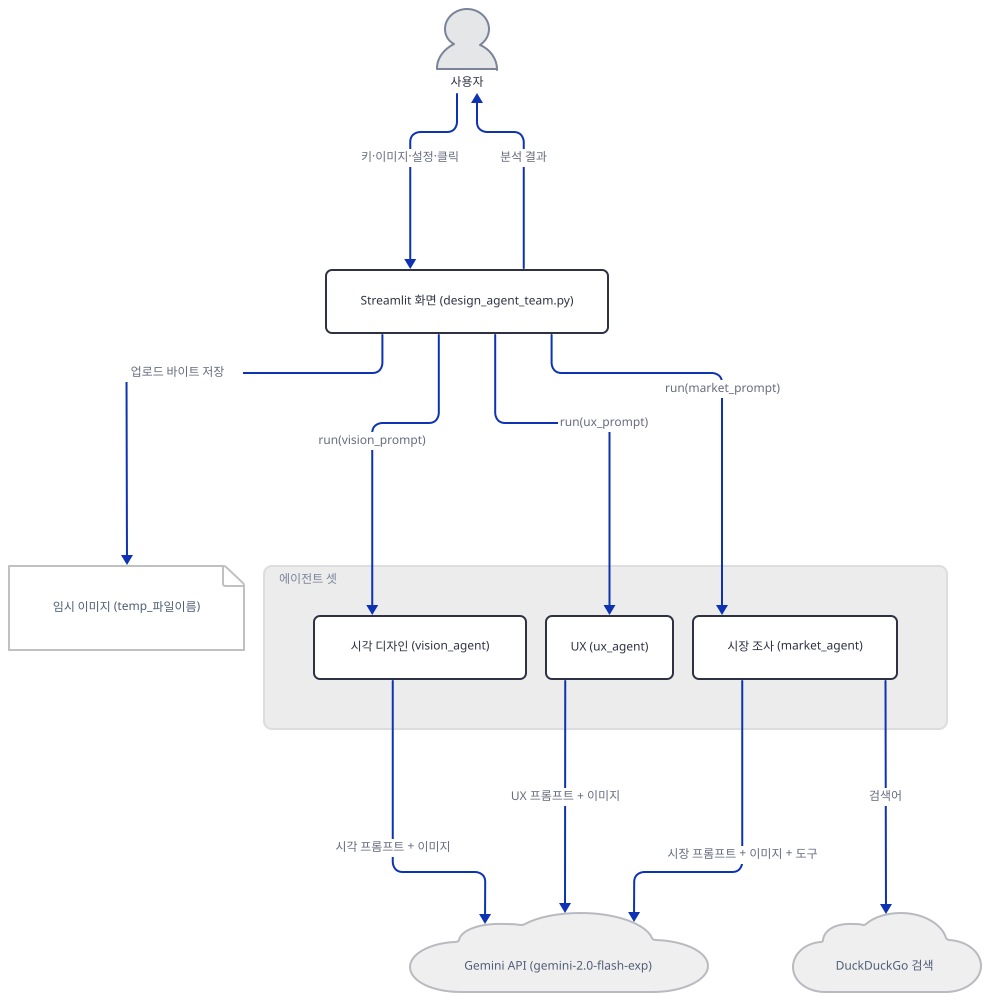

## 사전 준비

| 서비스/도구 | 용도 | 발급·설치 |
|---|---|---|
| uv | 가상환경 생성과 패키지 설치 | [공통 사전 준비](../README.md#공통-사전-준비-한-번만) 절 참고 |
| Python | 이 문서는 3.13.3으로 확인했다. 저장소 기준은 3.11~3.13 | 공통 사전 준비와 같음 |
| Gemini API 키 | 화면 사이드바의 비밀번호 칸에 붙여넣는다(환경변수가 아님, `advanced_ai_agents/multi_agent_apps/agent_teams/multimodal_design_agent_team/design_agent_team.py:76-82`). 이 문서는 키 없이 가짜 서버로 확인한다 | https://aistudio.google.com/apikey |
| 디자인 이미지 | JPG·JPEG·PNG만 올릴 수 있다(`advanced_ai_agents/multi_agent_apps/agent_teams/multimodal_design_agent_team/design_agent_team.py:110`). 이 문서의 확인은 코드로 만든 작은 PNG를 쓴다 | 직접 준비(실제 서비스 화면은 올리기 전에 민감한 정보를 가린다) |
| 인터넷 연결 | PyPI 설치. 앱을 실제로 쓸 때는 Gemini API(`generativelanguage.googleapis.com`), DuckDuckGo, agno 사용 통계 서버(`os-api.agno.com`)에 접속하고, 브라우저로 열면 Streamlit의 사용 통계도 나간다(Day 063이 확인했고 `--browser.gatherUsageStats false`로 끈다) | 별도 설치 없음 |

업로드한 이미지는 요청 본문에 바이트로 실려 Gemini API로 갑니다(Step 6, 직접 확인). Google의 Gemini API 약관(https://ai.google.dev/gemini-api/terms, 2026-10-09 확인)은 무료 등급의 입력·출력을 제품 개선에 쓰고 사람이 읽을 수 있다고 하고, 결제를 켠 프로젝트는 쓰지 않는다고 합니다. 아직 공개하지 않은 디자인은 이 점을 알고 올립니다.

## 아키텍처 한눈에 보기

| 컴포넌트 | 역할 | 코드 위치 |
|---|---|---|
| 사용자 | 키 입력, 이미지 업로드, 분석 유형·초점·맥락 선택, 버튼 클릭 | 코드 없음 (브라우저) |
| Streamlit 화면 | 사이드바 키 칸, 업로더 둘, 분석 설정, 버튼, 결과 출력 | `advanced_ai_agents/multi_agent_apps/agent_teams/multimodal_design_agent_team/design_agent_team.py:67-150`, `advanced_ai_agents/multi_agent_apps/agent_teams/multimodal_design_agent_team/design_agent_team.py:152-246` |
| 에이전트 생성 함수 (`initialize_agents`) | Gemini 모델 하나를 만들어 에이전트 셋에 나눠 준다. 화면이 다시 그려질 때마다 불린다 | `advanced_ai_agents/multi_agent_apps/agent_teams/multimodal_design_agent_team/design_agent_team.py:17-64`, `advanced_ai_agents/multi_agent_apps/agent_teams/multimodal_design_agent_team/design_agent_team.py:99-100` |
| 시각 디자인 에이전트 (`vision_agent`) | 색·글꼴·레이아웃을 읽는 지시문. 도구 없음 | `advanced_ai_agents/multi_agent_apps/agent_teams/multimodal_design_agent_team/design_agent_team.py:21-32` |
| UX 에이전트 (`ux_agent`) | 사용자 흐름·접근성을 읽는 지시문. 도구 없음 | `advanced_ai_agents/multi_agent_apps/agent_teams/multimodal_design_agent_team/design_agent_team.py:34-45` |
| 시장 조사 에이전트 (`market_agent`) | 시장·경쟁 지시문과 `DuckDuckGoTools`를 가진다 | `advanced_ai_agents/multi_agent_apps/agent_teams/multimodal_design_agent_team/design_agent_team.py:47-59` |
| 임시 이미지 (`temp_파일이름`) | 업로드 바이트를 임시 폴더에 저장한다. 어디서도 지우지 않는다 | `advanced_ai_agents/multi_agent_apps/agent_teams/multimodal_design_agent_team/design_agent_team.py:157-173` |
| Gemini API (`gemini-2.0-flash-exp`) | 세 에이전트가 모델 하나를 공유해 부른다 | `advanced_ai_agents/multi_agent_apps/agent_teams/multimodal_design_agent_team/design_agent_team.py:19` |
| DuckDuckGo 검색 | 시장 조사 에이전트의 `web_search`·`search_news`. 모델이 요청할 때만 나간다 | `advanced_ai_agents/multi_agent_apps/agent_teams/multimodal_design_agent_team/design_agent_team.py:5`, `advanced_ai_agents/multi_agent_apps/agent_teams/multimodal_design_agent_team/design_agent_team.py:49` |
| Agno 사용 통계 API | 성공한 `run`마다 agno가 익명 메타데이터를 보내려 한다 | 코드 없음 (agno 내부) |

## 단계별 진행

### Step 1. 환경 만들기 — 빠진 패키지 둘, 쓰이지 않는 패키지 둘

**목적.** 앱 폴더에 독립 가상환경을 만들고, 설치 직후 import가 막히는 곳과 그 해결을 확인합니다.

**할 일.** 저장소 루트에서 시작합니다.

```bash
cd advanced_ai_agents/multi_agent_apps/agent_teams/multimodal_design_agent_team
uv venv
uv pip install -r requirements.txt
```

(pip 대안: bash는 `python -m venv .venv && source .venv/bin/activate && pip install -r requirements.txt`입니다. PowerShell 5.1은 `&&`를 받지 않으므로 세 줄로 `python -m venv .venv`, `.venv\Scripts\Activate.ps1`, `pip install -r requirements.txt`를 차례로 씁니다. 실행해 보지 못했습니다.) 이후 `uv run`에는 모두 `--no-project`를 붙입니다. 이유는 [공통 사전 준비](../README.md#공통-사전-준비-한-번만)에 있습니다.

`advanced_ai_agents/multi_agent_apps/agent_teams/multimodal_design_agent_team/requirements.txt:1-5`

```text
google-generativeai==0.8.3
streamlit==1.41.1
agno>=2.2.10
Pillow==11.0.0
duckduckgo-search==6.3.7
```

파일 끝에 빈 줄이 하나 더 있어 편집기에서는 6줄입니다. 이 문서를 만들 때(2026-10-09) Python 3.13.3에서 패키지 86개가 깔렸고 agno 3.1.2, streamlit 1.41.1이 들어왔습니다(직접 확인). `agno>=2.2.10`에는 상한이 없어 오늘의 최신으로 풀립니다. 그런데 앱의 두 import가 막힙니다. `agno.models.google`은 `google-genai`를, `agno.tools.duckduckgo`는 `ddgs`를 요구하는데 둘 다 목록에 없습니다. 대신 `google-generativeai==0.8.3`과 `duckduckgo-search==6.3.7`이 설치되지만 앱의 import 여섯 줄이 끝난 뒤에도 둘 다 불러지지 않습니다(아래 확인). 같은 원인을 Day 008·Day 009 Step 1이 Gemini 쪽에서, Day 103 Step 1이 `ddgs` 쪽에서 다뤘습니다. `Pillow==11.0.0`도 앱이 import하지 않지만 Streamlit 1.41.1이 `pillow<12`를 요구해 어차피 설치됩니다(소스로 확인, 설치된 streamlit 메타데이터). 아래 명령으로 두 패키지를 더 설치합니다. 리포의 `requirements.txt`는 고치지 않습니다.

```bash
uv pip install google-genai ddgs
```

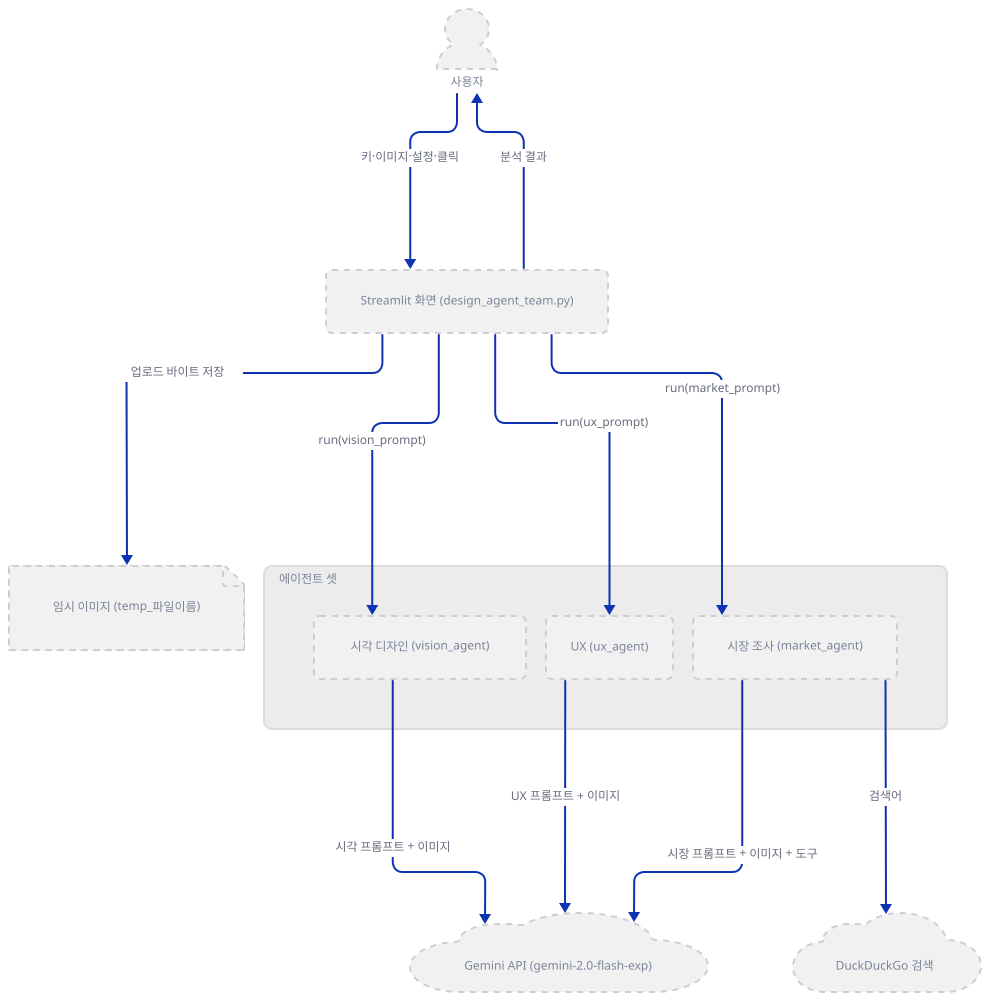

**확인.** 설치 직후와 두 패키지를 더한 뒤를 차례로 봅니다.

```bash
uv run --no-project python -c "from agno.models.google import Gemini"
uv run --no-project python -c "from agno.tools.duckduckgo import DuckDuckGoTools"
```

두 명령은 설치 직후에 각각 마지막 줄로 이렇게 끝납니다(직접 확인).

```text
ImportError: `google-genai` not installed. Please install it using `pip install google-genai`
ImportError: `ddgs` not installed. Please install using `pip install ddgs`
```

`uv pip install google-genai ddgs` 뒤에는 google-genai 2.29.0과 ddgs 9.16.0을 포함해 패키지가 6개 늘어 92개가 됐습니다(직접 확인, `tenacity`는 낮은 버전으로 바뀌었습니다). 이제 앱의 1~11행을 그대로 실행합니다.

```bash
uv run --no-project python -m py_compile design_agent_team.py && echo compiled
uv run --no-project python -c "
import sys
from agno.agent import Agent
from agno.run.agent import RunOutput
from agno.models.google import Gemini
from agno.media import Image as AgnoImage
from agno.tools.duckduckgo import DuckDuckGoTools
import streamlit as st
print('imports OK')
print('google.generativeai' in sys.modules, 'duckduckgo_search' in sys.modules, 'ddgs' in sys.modules)
"
```

직접 확인한 출력입니다. 첫 줄은 컴파일이 됐다는 뜻이고, 마지막 줄 셋은 `google.generativeai`와 `duckduckgo_search`는 불러지지 않았고 `ddgs`만 불러졌다는 뜻입니다. (Streamlit이 bare 모드 경고를 함께 출력하지만 무시해도 되어 생략했습니다.)

```text
compiled
imports OK
False False True
```

### Step 2. 사이드바 키와 화면 게이트

**목적.** 키가 없으면 화면이 어디까지 그려지는지, 키를 넣으면 무엇이 열리는지 확인합니다.

**할 일.**

`advanced_ai_agents/multi_agent_apps/agent_teams/multimodal_design_agent_team/design_agent_team.py:70-90`

```python
with st.sidebar:
    st.header("🔑 API Configuration")

    if "api_key_input" not in st.session_state:
        st.session_state.api_key_input = ""
        
    api_key = st.text_input(
        "Enter your Gemini API Key",
        value=st.session_state.api_key_input,
        type="password",
        help="Get your API key from Google AI Studio",
        key="api_key_widget"  
    )

    if api_key != st.session_state.api_key_input:
        st.session_state.api_key_input = api_key
    
    if api_key:
        st.success("API Key provided! ✅")
    else:
        st.warning("Please enter your API key to proceed")
```

키는 환경변수가 아니라 비밀번호 칸에 붙여넣고, 값은 `st.session_state.api_key_input`에 복사해 둡니다. 리런(상호작용마다 스크립트를 처음부터 다시 실행하는 것, Day 012 Step 2가 설명했습니다)에서도 칸이 비지 않게 하는 장치입니다. 본문은 이 값이 비어 있는지만 봅니다.

`advanced_ai_agents/multi_agent_apps/agent_teams/multimodal_design_agent_team/design_agent_team.py:99-102`

```python
if st.session_state.api_key_input:
    vision_agent, ux_agent, market_agent = initialize_agents(st.session_state.api_key_input)
    
    if all([vision_agent, ux_agent, market_agent]):
```

`advanced_ai_agents/multi_agent_apps/agent_teams/multimodal_design_agent_team/design_agent_team.py:247-250`

```python
    else:
        st.info("👈 Please enter your API key in the sidebar to get started")
else:
    st.info("👈 Please enter your API key in the sidebar to get started")
```

키가 없으면 사이드바의 경고와 본문의 안내 한 줄만 그려지고 업로더와 버튼은 없습니다. 게이트는 값이 비어 있지 않은지만 보므로 아무 문자열이나 통과합니다. 키가 틀렸는지는 모델을 부르는 Step 6에서야 드러납니다.

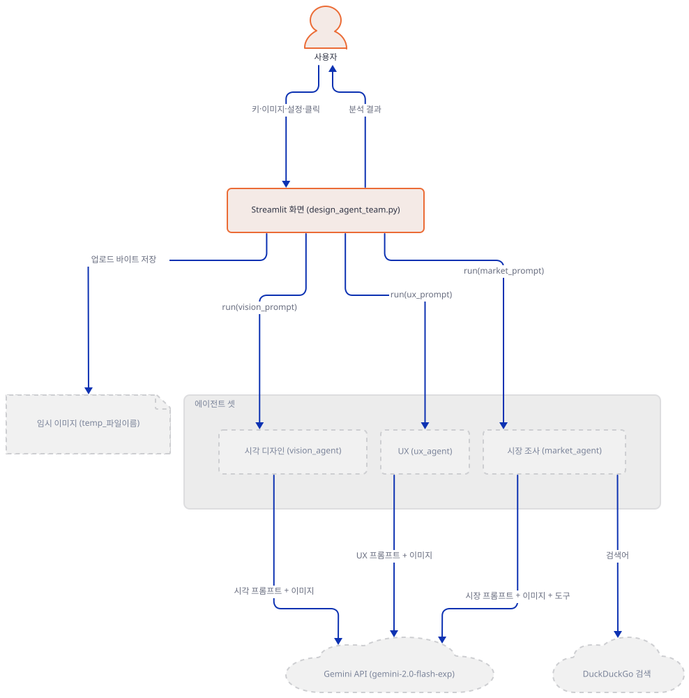

**확인.** 앱 폴더에 `check_gate.py`로 저장해 실행합니다. Streamlit이 브라우저 없이 스크립트를 실행하고 위젯을 코드로 조작하게 해 주는 `AppTest`를 씁니다.

```python
from streamlit.testing.v1 import AppTest

at = AppTest.from_file("design_agent_team.py", default_timeout=60)
at.run()
print("키 없음: 입력칸", len(at.text_input), "| 버튼", len(at.button), "| 경고", [w.value for w in at.warning])
print("         안내", [i.value for i in at.info])

at.text_input(key="api_key_widget").set_value("fake-key").run()
print("키 있음: 성공 표시", [s.value for s in at.success], "| 버튼", len(at.button))
print("         multiselect", [m.label for m in at.multiselect], "| text_area", [t.label for t in at.text_area])
print("         기본 선택", at.multiselect[0].value, at.multiselect[1].value)
print("         소제목", [h.value for h in at.header])
```

```bash
uv run --no-project python check_gate.py
```

직접 확인한 출력입니다(위젯 이름은 앱의 영어 그대로입니다).

```text
키 없음: 입력칸 1 | 버튼 0 | 경고 ['Please enter your API key to proceed']
         안내 ['👈 Please enter your API key in the sidebar to get started']
키 있음: 성공 표시 ['API Key provided! ✅'] | 버튼 1
         multiselect ['Select Analysis Types', 'Focus Areas'] | text_area ['Additional Context']
         기본 선택 ['Visual Design'] []
         소제목 ['📤 Upload Content', '🎯 Analysis Configuration', '🔑 API Configuration']
```

앱을 실제로 띄우는 명령은 이렇습니다.

```bash
uv run --no-project streamlit run design_agent_team.py --browser.gatherUsageStats false
```

직접 띄워 보면(`--server.headless true --server.address localhost --server.port 58601`을 더해) `curl http://localhost:58601/_stcore/health`가 `ok`를 돌려줬습니다(직접 확인).

### Step 3. 모델 하나, 에이전트 셋 — 매번 새로 만듭니다

**목적.** 에이전트 셋이 무엇을 공유하고 무엇이 다른지, 그리고 몇 번 만들어지는지 봅니다.

**할 일.**

`advanced_ai_agents/multi_agent_apps/agent_teams/multimodal_design_agent_team/design_agent_team.py:17-32`

```python
def initialize_agents(api_key: str) -> tuple[Agent, Agent, Agent]:
    try:
        model = Gemini(id="gemini-2.0-flash-exp", api_key=api_key)
        
        vision_agent = Agent(
            model=model,
            instructions=[
                "You are a visual analysis expert that:",
                "1. Identifies design elements, patterns, and visual hierarchy",
                "2. Analyzes color schemes, typography, and layouts",
                "3. Detects UI components and their relationships",
                "4. Evaluates visual consistency and branding",
                "Be specific and technical in your analysis"
            ],
            markdown=True
        )
```

`advanced_ai_agents/multi_agent_apps/agent_teams/multimodal_design_agent_team/design_agent_team.py:47-64`

```python
        market_agent = Agent(
            model=model,
            tools=[DuckDuckGoTools()],
            instructions=[
                "You are a market research expert that:",
                "1. Identifies market trends and competitor patterns",
                "2. Analyzes similar products and features",
                "3. Suggests market positioning and opportunities",
                "4. Provides industry-specific insights",
                "Focus on actionable market intelligence"
            ],
            markdown=True
        )
        
        return vision_agent, ux_agent, market_agent
    except Exception as e:
        st.error(f"Error initializing agents: {str(e)}")
        return None, None, None
```

모델을 한 번 만들어 셋에 모두 넘기므로 세 에이전트는 같은 `Gemini` 객체를 씁니다. 에이전트마다 다른 것은 `instructions`와 도구뿐입니다. 시각 디자인(21~32행)과 UX(34~45행)는 지시문 여섯 줄에 `markdown=True`뿐이고 도구가 없습니다. 시장 조사만 `DuckDuckGoTools()`를 쥐고, 이것이 `web_search`와 `search_news` 두 함수를 모델에 내놓습니다(소스로 확인, agno 3.1.2의 `agno/tools/duckduckgo.py`·`websearch.py`). `Team`이 아니라 평범한 `Agent` 셋을 튜플로 돌려줍니다. 에러가 나면 `st.error`를 띄우고 `None` 셋을 돌려주는데, 이 줄은 모델을 만드는 데서만 걸리고 키가 틀린 것은 걸러 주지 않습니다.

이 함수는 99~100행에서 불립니다. 키가 있으면 스크립트가 실행될 때마다 부르므로 Streamlit이 화면을 다시 그릴 때마다 에이전트가 새로 만들어집니다. 모델 ID는 19행의 `gemini-2.0-flash-exp`입니다. 폐기 문서에는 이 ID가 없고 `gemini-2.0-flash`는 2026년 6월 1일 종료로 올라 있으며(위 ⚠), Google의 모델 페이지(https://ai.google.dev/gemini-api/docs/models, 2026-10-09 확인)에도 `gemini-2.0-flash-exp`는 없고 `gemini-2.0-flash`는 "Shut down"으로 표시됩니다. 실제 호출은 하지 않아서 `-exp`가 오류를 내는지는 확인하지 못했습니다.

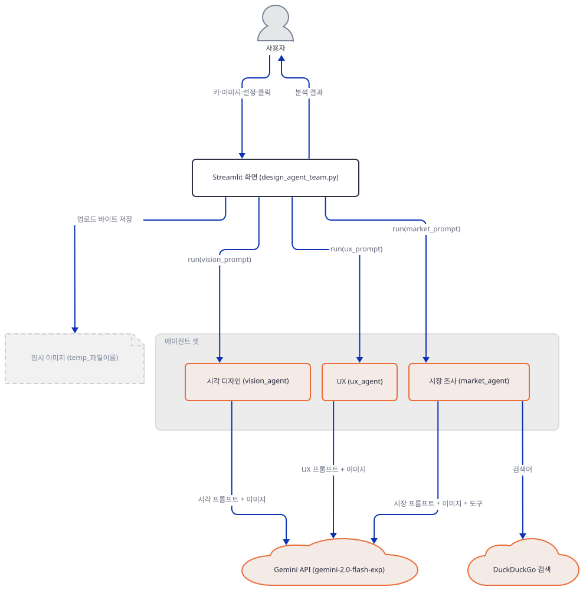

**확인.** 앱 폴더에 `check_agents.py`와 `check_reruns.py`를 저장합니다. 앞의 것은 앱 파일에서 `initialize_agents` 함수만 꺼내 실행합니다. Streamlit 화면은 돌리지 않습니다.

```python
import ast
from pathlib import Path

source = Path("design_agent_team.py").read_text(encoding="utf-8")
func = next(n for n in ast.parse(source).body if isinstance(n, ast.FunctionDef) and n.name == "initialize_agents")
ns = {}
exec("from agno.agent import Agent\nfrom agno.models.google import Gemini\n"
     "from agno.tools.duckduckgo import DuckDuckGoTools\nimport streamlit as st", ns)
exec(compile(ast.Module([func], []), "design_agent_team.py", "exec"), ns)

initialize_agents = ns["initialize_agents"]
vision, ux, market = initialize_agents("fake-key")
model = vision.model
print("모델:", type(model).__name__, model.id, "| search", model.search, "| grounding", model.grounding)
print("세 에이전트가 모델 객체를 공유:", vision.model is ux.model is market.model)
for name, a in (("vision", vision), ("ux", ux), ("market", market)):
    tools = [f for t in (a.tools or []) for f in getattr(t, "functions", {})]
    print(f"{name:7} instructions {len(a.instructions)}줄 | markdown {a.markdown} | 도구 {tools}")
print("팀 객체:", [type(x).__name__ for x in (vision, ux, market)], "| telemetry 기본값", vision.telemetry)
```

```bash
uv run --no-project python check_agents.py
```

직접 확인한 출력입니다. 지시문 여섯 줄은 `instructions` 리스트의 항목 수입니다.

```text
모델: Gemini gemini-2.0-flash-exp | search False | grounding False
세 에이전트가 모델 객체를 공유: True
vision  instructions 6줄 | markdown True | 도구 []
ux      instructions 6줄 | markdown True | 도구 []
market  instructions 6줄 | markdown True | 도구 ['web_search', 'search_news']
팀 객체: ['Agent', 'Agent', 'Agent'] | telemetry 기본값 True
```

`search`와 `grounding`이 꺼져 있어 Gemini의 내장 검색은 쓰이지 않고, 웹 검색은 `DuckDuckGoTools`로만 합니다. 이제 화면을 다시 그릴 때마다 에이전트가 몇 개 만들어지는지 셉니다.

```python
import agno.agent as agno_agent
from streamlit.testing.v1 import AppTest

created = []
original = agno_agent.Agent.__init__


def counting(self, *args, **kwargs):
    created.append(1)
    original(self, *args, **kwargs)


agno_agent.Agent.__init__ = counting

at = AppTest.from_file("design_agent_team.py", default_timeout=60)
at.run()
print("키 없이 실행:", len(created), "개 생성")
at.text_input(key="api_key_widget").set_value("fake-key").run()
print("키 입력 뒤  :", len(created), "개 생성")
at.multiselect[1].set_value(["Typography"]).run()
print("초점 선택 뒤:", len(created), "개 생성")
at.text_area[0].set_value("메모").run()
print("맥락 입력 뒤:", len(created), "개 생성")
```

```bash
uv run --no-project python check_reruns.py
```

```text
키 없이 실행: 0 개 생성
키 입력 뒤  : 3 개 생성
초점 선택 뒤: 6 개 생성
맥락 입력 뒤: 9 개 생성
```

### Step 4. 업로드와 임시 파일 — 같은 이름이면 덮어씁니다

**목적.** 업로드한 바이트가 어디에 저장되고, 모델에 무엇이 가는지 확인합니다. 이 단계에서 가짜 모델 서버와 구동 스크립트도 저장합니다.

**할 일.**

`advanced_ai_agents/multi_agent_apps/agent_teams/multimodal_design_agent_team/design_agent_team.py:107-113`

```python
        with col1:
            design_files = st.file_uploader(
                "Upload UI/UX Designs",
                type=["jpg", "jpeg", "png"],
                accept_multiple_files=True,
                key="designs"
            )
```

`advanced_ai_agents/multi_agent_apps/agent_teams/multimodal_design_agent_team/design_agent_team.py:157-177`

```python
                    def process_images(files):
                        processed_images = []
                        for file in files:
                            try:
                                temp_dir = tempfile.gettempdir()
                                temp_path = os.path.join(temp_dir, f"temp_{file.name}")
                                
                                with open(temp_path, "wb") as f:
                                    f.write(file.getvalue())
                                
                                agno_image = AgnoImage(filepath=Path(temp_path))
                                processed_images.append(agno_image)
                                
                            except Exception as e:
                                logger.error(f"Error processing image {file.name}: {str(e)}")
                                continue
                        return processed_images
                    
                    design_images = process_images(design_files)
                    competitor_images = process_images(competitor_files) if competitor_files else []
                    all_images = design_images + competitor_images
```

업로더는 둘이고 `key`가 `designs`와 `competitors`입니다. 버튼을 누르면 `process_images`가 파일마다 `tempfile.gettempdir()` 아래 `temp_파일이름`에 바이트를 쓰고 그 경로를 `AgnoImage(filepath=...)`로 감쌉니다. 이 폴더는 윈도에서는 `%TEMP%`입니다. 코드가 이 파일을 지우지 않고(앱 안에 `remove`·`unlink`가 없습니다, 소스로 확인), 이름도 사용자나 세션으로 나누지 않습니다. 같은 서버를 쓰는 두 사람이 둘 다 `home.png`를 올리면 같은 파일을 씁니다. 이미지는 리사이즈하지 않고 원본 바이트 그대로입니다(Day 008은 가로 500px로 줄여 `temp_resized_image.png`라는 고정 이름으로 저장했습니다).

디자인(175행)과 경쟁사(176행)를 먼저 모두 저장하고, 모델은 나중에 `AgnoImage`의 경로를 읽습니다. agno가 파일을 여는 때는 요청을 만들 때입니다(소스로 확인, agno 3.1.2의 `agno/utils/gemini.py` 181~199행). 그래서 두 이미지의 파일 이름이 같으면 경쟁사 쪽이 먼저 쓴 디자인 파일을 덮어쓰고, 모델은 같은 그림을 두 번 받습니다. 아래에서 이를 직접 봅니다.

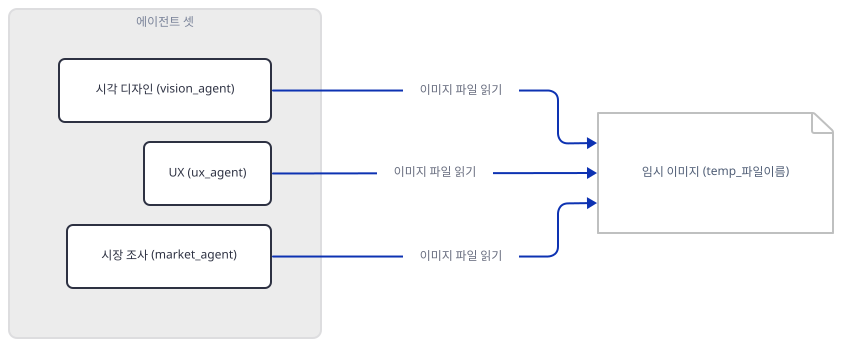

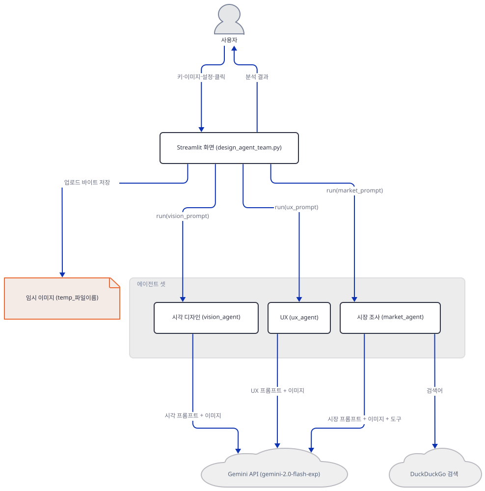

**확인.** 모델 서버가 필요하므로 앱 폴더에 가짜 Gemini 서버 `fake_gemini.py`를 저장합니다. 요청을 `requests.jsonl`에 한 줄씩 적고, 시장 조사 에이전트의 첫 요청에는 `web_search` 호출 요청으로, 나머지에는 고정 문장으로 답합니다. 키가 `bad`로 시작하면 Gemini가 잘못된 키에 주는 400 오류 모양으로 답합니다. 포트는 49152~65535에서 비어 있는 것을 고르세요(이 문서는 58538을 썼습니다). `allow_reuse_address = False`는 윈도에서 다른 프로그램의 포트에 오류 없이 겹쳐 뜨는 일을 막습니다.

```python
import base64, hashlib, json, sys
from http.server import BaseHTTPRequestHandler, HTTPServer


class Server(HTTPServer):
    allow_reuse_address = False  # Windows에서 남의 포트에 겹쳐 뜨지 않게


class Handler(BaseHTTPRequestHandler):
    def log_message(self, *args):
        pass

    def do_POST(self):
        body = json.loads(self.rfile.read(int(self.headers["content-length"])))
        key = self.headers.get("x-goog-api-key", "")
        system = "".join(p.get("text", "") for p in body.get("systemInstruction", {}).get("parts", []))
        parts = [p for c in body["contents"] for p in c["parts"]]
        images = []
        for p in parts:
            if "inlineData" in p:
                data = p["inlineData"]["data"]
                raw = base64.urlsafe_b64decode(data + "=" * (-len(data) % 4))
                images.append({"bytes": len(raw), "sha": hashlib.sha256(raw).hexdigest()[:8]})
        tools = [d["name"] for t in body.get("tools", []) for d in t["functionDeclarations"]]
        tool_result = any("functionResponse" in p for p in parts)
        record = {
            "model": self.path.split("/models/")[1].split(":")[0],
            "agent": system.splitlines()[0].lstrip("- "),
            "prompt": " ".join(next(p["text"] for p in parts if p.get("text")).split()),
            "images": images, "tools": tools, "tool_result": tool_result,
        }
        with open("requests.jsonl", "a", encoding="utf-8") as f:
            f.write(json.dumps(record, ensure_ascii=False) + "\n")
        if key.startswith("bad"):
            self.reply(400, {"error": {"code": 400, "message": "API key not valid. Please pass a valid API key.", "status": "INVALID_ARGUMENT"}})
        elif tools and not tool_result and "market research" in system:
            call = {"name": "web_search", "args": {"query": "student banking app design trends"}}
            self.reply(200, self.answer([{"functionCall": call}]))
        else:
            self.reply(200, self.answer([{"text": f"[가짜 응답] {record['agent']} / 이미지 {len(images)}장 / 도구 결과 {tool_result}"}]))

    def answer(self, parts):
        return {"candidates": [{"content": {"role": "model", "parts": parts}, "finishReason": "STOP"}],
                "usageMetadata": {"promptTokenCount": 1, "candidatesTokenCount": 1, "totalTokenCount": 2}}

    def reply(self, status, obj):
        data = json.dumps(obj).encode()
        self.send_response(status)
        self.send_header("content-type", "application/json")
        self.send_header("content-length", str(len(data)))
        self.end_headers()
        self.wfile.write(data)


Server(("127.0.0.1", int(sys.argv[1])), Handler).serve_forever()
```

다음은 구동 스크립트 `drive_app.py`입니다. `AppTest`로 앱을 돌리면서 세 가지를 대신합니다. 파일 업로더는 코드로 만든 PNG를 돌려주고, 모델 주소는 환경변수 `GOOGLE_GEMINI_BASE_URL`로 가짜 서버에 걸며, DuckDuckGo는 호출을 출력만 하는 대역으로 바꿉니다. 임시 폴더는 `tmp_demo`로 바꿔 시연 파일이 내 `%TEMP%`에 남지 않게 하고, agno 통계는 꺼 둡니다. 디자인 이미지는 빨강, 경쟁사 이미지는 파랑입니다.

```python
import io, json, os, sys, tempfile
from pathlib import Path

import agno.tools.websearch as websearch
import streamlit as st
from PIL import Image
from streamlit.testing.v1 import AppTest

port, scenario = sys.argv[1], sys.argv[2]
os.environ["AGNO_TELEMETRY"] = "false"                          # agno 통계 전송을 끈다
os.environ["GOOGLE_GEMINI_BASE_URL"] = f"http://127.0.0.1:{port}"  # 모델 서버를 내 PC로
tempfile.tempdir = str(Path("tmp_demo").resolve())                # 앱의 임시 폴더를 이 폴더로
Path(tempfile.tempdir).mkdir(exist_ok=True)
for old in Path(tempfile.tempdir).glob("temp_*"):
    old.unlink()  # 이 시연 폴더 안의 지난 파일만 지운다


def png(rgb):
    buf = io.BytesIO()
    Image.new("RGB", (64, 48), rgb).save(buf, "PNG")
    return buf.getvalue()


class Upload(io.BytesIO):
    def __init__(self, name, data):
        super().__init__(data)
        self.name = name


class FakeDDGS:  # 검색 서버로 나가지 않게 대신한다
    def __init__(self, **kwargs): pass
    def __enter__(self): return self
    def __exit__(self, *args): return False
    def text(self, **kwargs):
        print("DDGS.text:", kwargs)
        return [{"title": "가짜 결과", "href": "http://localhost/", "body": "가짜 본문"}]
    def news(self, **kwargs): return []


websearch.DDGS = FakeDDGS
SCENARIOS = {  # 이름: (디자인, 경쟁사, 분석 유형, 초점, 맥락, 키)
    "full": ([("home.png", "red")], [("rival.png", "blue")],
             ["Visual Design", "User Experience", "Market Analysis"], ["Color Scheme", "Typography"], "대학생용 은행 앱", "fake-key"),
    "same-name": ([("home.png", "red")], [("home.png", "blue")], ["Visual Design"], [], "", "fake-key"),
    "market-only": ([("home.png", "red")], [], ["Market Analysis"], [], "", "fake-key"),
    "no-types": ([("home.png", "red")], [], [], [], "", "fake-key"),
    "no-design": ([], [], ["Visual Design"], [], "", "fake-key"),
    "bad-key": ([("home.png", "red")], [], ["Visual Design"], [], "", "bad-key"),
}
designs, rivals, types, focus, context, key = SCENARIOS[scenario]
uploads = {"designs": designs, "competitors": rivals}
st.file_uploader = lambda label, key=None, **kw: [Upload(n, png(c)) for n, c in uploads[key]]
st.image = lambda *args, **kwargs: None

log = Path("requests.jsonl")
before = len(log.read_text(encoding="utf-8").splitlines()) if log.exists() else 0

at = AppTest.from_file("design_agent_team.py", default_timeout=60)
at.run()
at.text_input(key="api_key_widget").set_value(key).run()
at.multiselect[0].set_value(types)
at.multiselect[1].set_value(focus)
at.text_area[0].set_value(context).run()
at.button[0].click().run()

print("소제목:", [s.value for s in at.subheader])
for m in at.markdown[:len(at.subheader)]:
    print("본문:", m.value[:120])
print("경고:", [w.value for w in at.warning], "오류:", [e.value for e in at.error])
print("임시 폴더:", sorted(p.name for p in Path(tempfile.tempdir).iterdir()))
for line in log.read_text(encoding="utf-8").splitlines()[before:]:
    r = json.loads(line)
    print("서버:", r["agent"][:34], "| 이미지", [(i["bytes"], i["sha"]) for i in r["images"]], "| 도구", r["tools"], "| 도구 결과", r["tool_result"])
    print("     ", r["prompt"][:90])
```

터미널 하나에서 서버를 띄우고(포트는 자기 것으로), 다른 터미널에서 같은 이름 시나리오를 돌립니다.

```bash
uv run --no-project python fake_gemini.py 58538
```

```bash
uv run --no-project python drive_app.py 58538 same-name
```

직접 확인한 출력입니다. 마지막 두 줄의 이미지 항목은 `(바이트 수, 해시 앞 8자)`입니다.

```text
소제목: ['🎨 Visual Design Analysis']
본문: [가짜 응답] You are a visual analysis expert that: / 이미지 2장 / 도구 결과 False
경고: [] 오류: []
임시 폴더: ['temp_home.png']
서버: You are a visual analysis expert t | 이미지 [(137, '9b9d6f43'), (137, '9b9d6f43')] | 도구 [] | 도구 결과 False
      Analyze these designs focusing on: Additional context: Provide specific insights about vis
```

임시 폴더에는 파일이 하나뿐이고, 모델이 받은 이미지 둘은 바이트 수와 해시가 같습니다. 디자인(빨강, 136바이트)은 어디에도 가지 않았습니다. 이름이 다른 시나리오(`full`)에서는 파일이 둘이고 이미지는 `(136, '699db0be')`와 `(137, '9b9d6f43')`로 서로 다릅니다(Step 6). 또 `focusing on:` 뒤가 비어 있는 것도 보입니다. 초점을 고르지 않으면 그 자리에 빈 문자열이 들어갑니다(Step 5).

### Step 5. 분석 설정과 세 프롬프트

**목적.** 화면의 설정이 세 프롬프트에 어떻게 들어가는지, 어떤 설정이 어느 에이전트에게만 가는지 봅니다.

**할 일.**

`advanced_ai_agents/multi_agent_apps/agent_teams/multimodal_design_agent_team/design_agent_team.py:134-149`

```python
        analysis_types = st.multiselect(
            "Select Analysis Types",
            ["Visual Design", "User Experience", "Market Analysis"],
            default=["Visual Design"]
        )

        specific_elements = st.multiselect(
            "Focus Areas",
            ["Color Scheme", "Typography", "Layout", "Navigation", 
             "Interactions", "Accessibility", "Branding", "Market Fit"]
        )

        context = st.text_area(
            "Additional Context",
            placeholder="Describe your product, target audience, or specific concerns..."
        )
```

`advanced_ai_agents/multi_agent_apps/agent_teams/multimodal_design_agent_team/design_agent_team.py:180-198`

```python
                    if "Visual Design" in analysis_types and design_files:
                        with st.spinner("🎨 Analyzing visual design..."):
                            if all_images:
                                vision_prompt = f"""
                                Analyze these designs focusing on: {', '.join(specific_elements)}
                                Additional context: {context}
                                Provide specific insights about visual design elements.
                                
                                Please format your response with clear headers and bullet points.
                                Focus on concrete observations and actionable insights.
                                """
                                
                                response: RunOutput = vision_agent.run(
                                    vision_prompt,
                                    images=all_images
                                )
                                
                                st.subheader("🎨 Visual Design Analysis")
                                st.markdown(response.content)
```

분석 유형(`analysis_types`)은 어떤 에이전트를 부를지 정하고, 초점(`specific_elements`)과 맥락(`context`)은 프롬프트에 문자열로 끼워집니다. 시각 디자인 프롬프트는 `', '.join(specific_elements)`로 초점을 넣고, UX 프롬프트(204~211행)도 같습니다. 호출은 `images=all_images`로 디자인과 경쟁사 이미지를 한 리스트로 합쳐 넘깁니다. 세 에이전트가 같은 리스트를 받고, 어떤 것이 경쟁사 이미지인지 알려 주는 말은 프롬프트 어디에도 없습니다.

`advanced_ai_agents/multi_agent_apps/agent_teams/multimodal_design_agent_team/design_agent_team.py:222-240`

```python
                    if "Market Analysis" in analysis_types:
                        with st.spinner("📊 Conducting market analysis..."):
                            market_prompt = f"""
                            Analyze market positioning and trends based on these designs.
                            Context: {context}
                            Compare with competitor designs if provided.
                            Suggest market opportunities and positioning.
                            
                            Please format your response with clear headers and bullet points.
                            Focus on concrete market insights and actionable recommendations.
                            """
                            
                            response: RunOutput = market_agent.run(
                                market_prompt,
                                images=all_images
                            )
                            
                            st.subheader("📊 Market Analysis")
                            st.markdown(response.content)
```

시장 조사 프롬프트는 초점을 쓰지 않습니다. 224~232행에 `specific_elements`가 없고 맥락과 "Compare with competitor designs if provided"만 있습니다. 그리고 "Market Fit" 같은 초점 항목은 이 에이전트에게는 닿지 않습니다. 에이전트 셋은 서로의 결과를 읽지 않습니다. 각 `run`은 새 프롬프트와 이미지만 받고, 앞 에이전트의 `response`는 `st.markdown`으로 화면에 쓰이고 끝납니다. 시장 조사 쪽은 `if all_images:` 같은 검사도 없습니다.

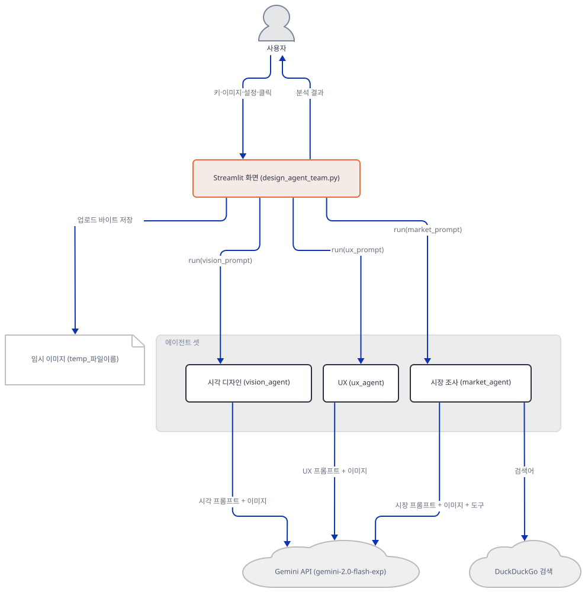

**확인.** Step 4의 서버를 그대로 두고 `full` 시나리오를 돌립니다(디자인 하나, 경쟁사 하나, 분석 유형 셋, 초점 둘, 맥락 "대학생용 은행 앱").

```bash
uv run --no-project python drive_app.py 58538 full
```

직접 확인한 출력의 서버 줄입니다. 요청 줄의 둘째 줄은 프롬프트 앞부분이고, 공백은 한 칸으로 줄였습니다.

```text
서버: You are a visual analysis expert t | 이미지 [(136, '699db0be'), (137, '9b9d6f43')] | 도구 [] | 도구 결과 False
      Analyze these designs focusing on: Color Scheme, Typography Additional context: 대학생용 은행 앱 
서버: You are a UX analysis expert that: | 이미지 [(136, '699db0be'), (137, '9b9d6f43')] | 도구 [] | 도구 결과 False
      Evaluate the user experience considering: Color Scheme, Typography Additional context: 대학생
서버: You are a market research expert t | 이미지 [(136, '699db0be'), (137, '9b9d6f43')] | 도구 ['search_news', 'web_search'] | 도구 결과 False
      Analyze market positioning and trends based on these designs. Context: 대학생용 은행 앱 Compare w
서버: You are a market research expert t | 이미지 [(136, '699db0be'), (137, '9b9d6f43')] | 도구 ['search_news', 'web_search'] | 도구 결과 True
      Analyze market positioning and trends based on these designs. Context: 대학생용 은행 앱 Compare w
```

세 에이전트가 같은 이미지 둘을 받았고, 시장 조사 프롬프트에는 초점이 없습니다(`Color Scheme, Typography`가 앞 둘에만 있습니다). 마지막 줄 둘은 같은 시장 조사 에이전트의 요청이 두 번이라는 뜻입니다. 이유는 Step 6에 있습니다.

### Step 6. 실행과 결과 — 오류도 결과 칸에 나옵니다

**목적.** 버튼 하나가 모델 요청을 몇 건 만드는지, 검색 도구가 언제 쓰이는지, 실패하면 화면에 무엇이 보이는지 확인합니다.

**할 일.**

`advanced_ai_agents/multi_agent_apps/agent_teams/multimodal_design_agent_team/design_agent_team.py:152-156`

```python
        if st.button("🚀 Run Analysis", type="primary"):
            if design_files:
                try:
                    st.header("📊 Analysis Results")
                    
```

`advanced_ai_agents/multi_agent_apps/agent_teams/multimodal_design_agent_team/design_agent_team.py:242-246`

```python
                except Exception as e:
                    logger.error(f"Error during analysis: {str(e)}")
                    st.error("An error occurred during analysis. Please check the logs for details.")
            else:
                st.warning("Please upload at least one design to analyze.")
```

`except`는 `process_images`나 `run` 호출 중 예외가 났을 때만 일반 문구를 띄웁니다. 그런데 agno의 `run()`은 모델 오류를 예외로 던지지 않고 오류 상태의 `RunOutput`을 돌려줍니다(Day 008 Step 6·Day 009 Step 5가 같은 사실을 보였습니다). 그래서 `response.content`에는 오류 JSON이 들어 있고, 앱은 그것을 정상 결과처럼 `st.markdown`에 씁니다. 분석 유형을 하나도 고르지 않아도 버튼은 눌립니다. 이때는 "Analysis Results" 제목만 보이고 아무 에이전트도 불리지 않지만, 이미지는 이미 임시 폴더에 저장됩니다(155~177행이 분석 유형 검사보다 앞입니다).

성공한 `run`마다 agno는 익명 통계를 보내려 합니다. 에이전트·모델 ID·도구 유무 같은 정보이고 이미지와 프롬프트는 들어가지 않습니다(소스로 확인, agno 3.1.2의 `agno/agent/_telemetry.py`. Day 047 Step 5가 다룬 같은 장치이며 `AGNO_TELEMETRY=false`로 끕니다). 구동 스크립트가 이를 꺼 두므로 이 문서는 전송 건수를 세지 않았습니다.

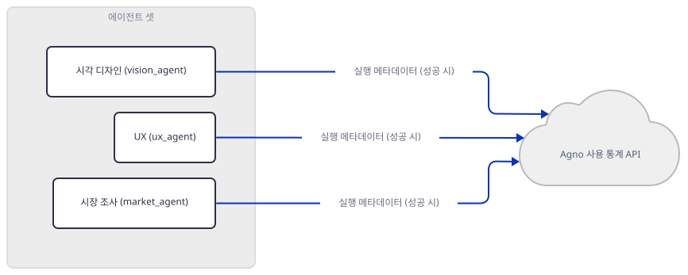

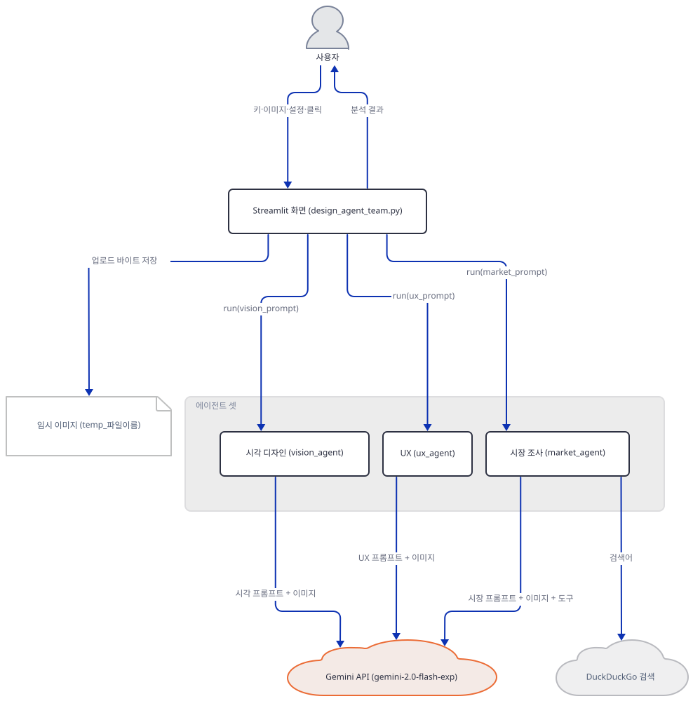

**확인.** 서버가 떠 있는 상태에서 나머지 시나리오를 차례로 돌립니다. 먼저 `full`의 앞쪽 출력입니다. 시장 조사 에이전트 요청이 두 번인 것은 가짜 서버가 첫 요청에 `web_search` 호출을 돌려줬기 때문입니다. 앱은 그 도구를 실행하고 결과를 담아 다시 요청합니다(두 번째 줄의 `도구 결과 True`). 이때 이미지도 다시 실립니다(Step 5의 마지막 두 줄이 모두 이미지 둘).

```bash
uv run --no-project python drive_app.py 58538 full
```

```text
DDGS.text: {'query': 'student banking app design trends', 'max_results': 5, 'backend': 'duckduckgo'}
소제목: ['🎨 Visual Design Analysis', '🔄 UX Analysis', '📊 Market Analysis']
본문: [가짜 응답] You are a visual analysis expert that: / 이미지 2장 / 도구 결과 False
본문: [가짜 응답] You are a UX analysis expert that: / 이미지 2장 / 도구 결과 False
본문: [가짜 응답] You are a market research expert that: / 이미지 2장 / 도구 결과 True
경고: [] 오류: []
임시 폴더: ['temp_home.png', 'temp_rival.png']
```

세 에이전트 요청 4건이 나갔고, 검색 도구는 `ddgs`의 `text(backend='duckduckgo')`로 한 번 불렸습니다(내 대역이 받은 인자입니다). 비전·UX 에이전트는 도구가 없어(`도구 []`) 검색할 수 없고 시장 조사 에이전트만 검색합니다. 진짜 모델이 검색을 몇 번 요청할지는 확인하지 못했습니다.

```bash
uv run --no-project python drive_app.py 58538 no-design
uv run --no-project python drive_app.py 58538 no-types
uv run --no-project python drive_app.py 58538 bad-key
```

직접 확인한 출력입니다. `no-design`은 디자인 없이 버튼을 누른 경우, `no-types`는 분석 유형을 모두 지운 경우, `bad-key`는 키를 `bad-key-1`로 둔 경우입니다. `bad-key`의 앞쪽 `ERROR` 줄은 agno가 터미널에 남기는 로그이고 화면에는 가지 않습니다.

```text
소제목: []
경고: ['Please upload at least one design to analyze.'] 오류: []
임시 폴더: []

소제목: []
경고: [] 오류: []
임시 폴더: ['temp_home.png']

소제목: ['🎨 Visual Design Analysis']
본문: {"error": {"code": 400, "message": "API key not valid. Please pass a valid API key.", "status": "INVALID_ARGUMENT"}}
경고: [] 오류: []
임시 폴더: ['temp_home.png']
```

세 출력을 이어 붙였습니다. 잘못된 키는 화면에 `st.error`가 아니라 소제목 아래 JSON 한 덩어리로 나오고, 소제목은 정상 결과와 똑같이 붙습니다. `no-types`에서는 아무 결과도 없는데 임시 파일은 생겼습니다.

## 요청 한 건이 흐르는 과정

키를 넣고 이미지를 올려 버튼을 누르기까지의 흐름을 먼저 봅니다. 사이드바에 키를 넣으면 스크립트가 다시 실행되고 에이전트 셋이 만들어집니다. 이 그림의 메시지는 이후 어떤 입력에서도 같은 방식으로 되풀이됩니다. 화면은 한 번의 버튼 클릭 이후를 에이전트마다 둘로 나눠 그렸습니다. 이 앱은 한 그림에 다 넣으면 선이 서로의 글자를 지나게 되는 길이여서, 요청을 보내고 답을 받기까지(`ask`)와 결과를 화면에 쓰기까지(`report`)로 끊었습니다. 모든 메시지는 한 그림에만 있고 코드의 순서 그대로입니다.

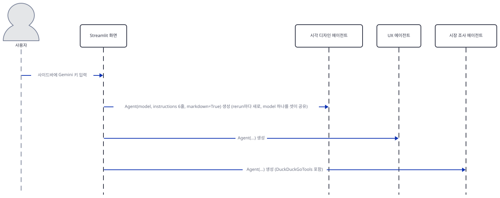

버튼을 누르면 업로드한 이미지가 먼저 임시 파일로 저장됩니다. 디자인이 모두 저장된 뒤에 경쟁사가 저장되므로, 같은 이름은 뒤의 것이 이깁니다.

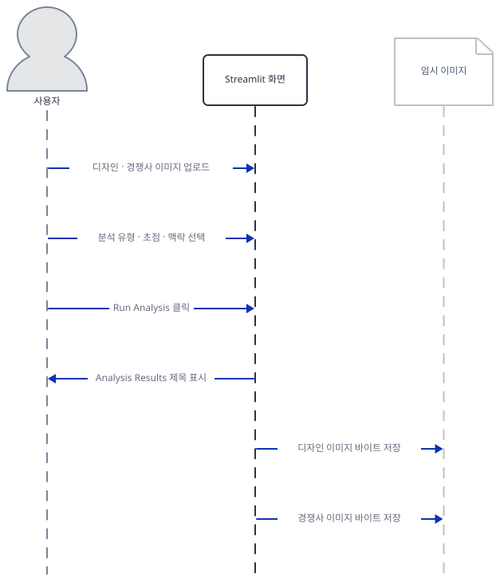

그다음 시각 디자인 에이전트가 먼저 불립니다. 에이전트는 임시 파일을 읽어 프롬프트와 이미지 바이트를 Gemini에 보내고 분석 텍스트를 받습니다.

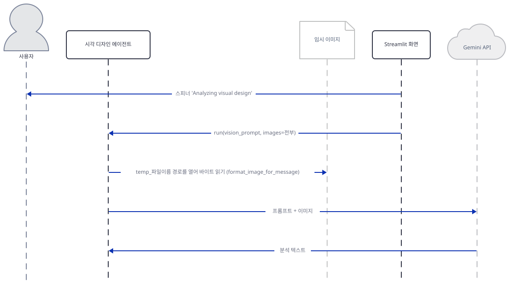

성공하면 통계 전송이 백그라운드에서 시작되고, 결과가 소제목과 함께 화면에 쓰입니다.


UX 에이전트도 같은 길입니다. 프롬프트만 다릅니다.

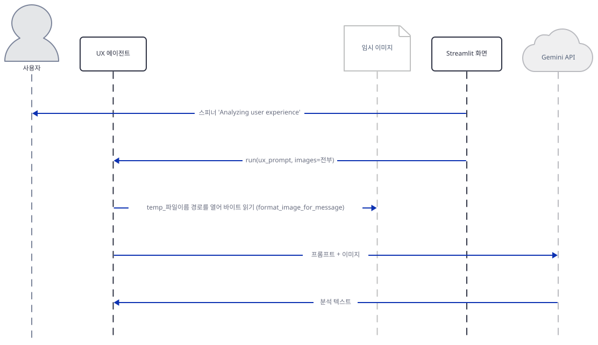

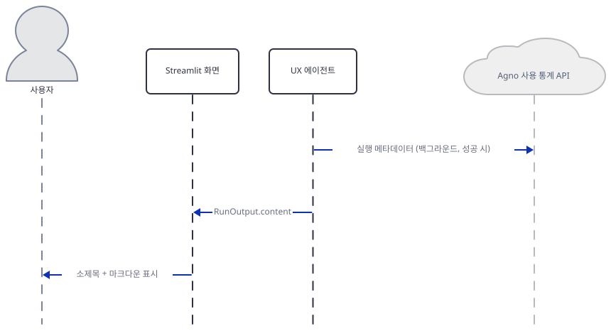

시장 조사 에이전트는 다릅니다. 첫 요청에 도구 목록이 함께 가고, 모델이 `web_search`를 요청할 수 있습니다.

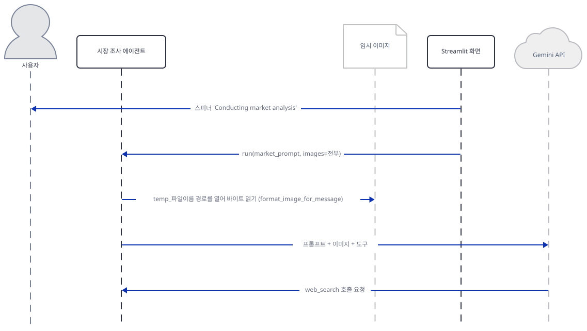

앱이 DuckDuckGo에서 결과를 받아 모델에 다시 보내면 모델이 분석 텍스트를 씁니다. 이 두 번째 요청에도 이미지가 다시 실립니다.

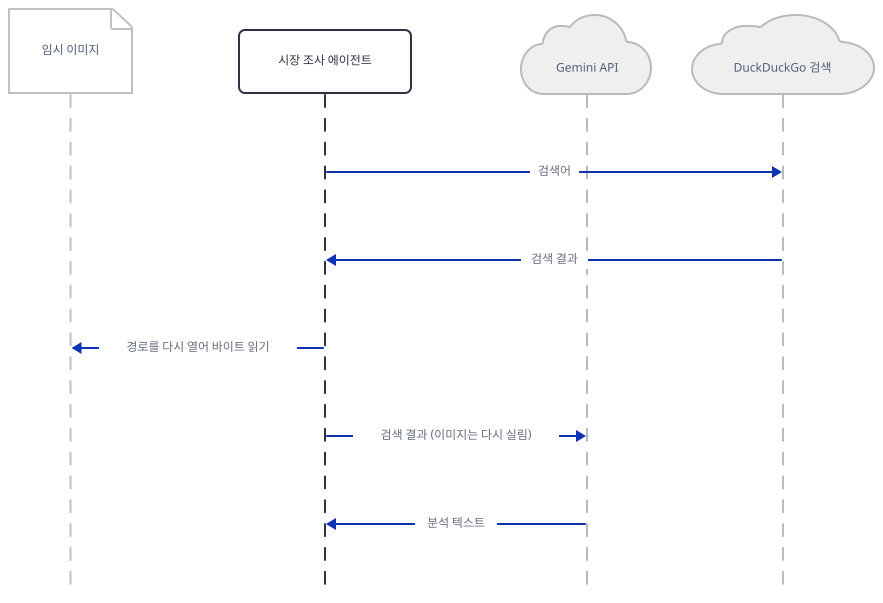

마지막으로 통계 전송과 결과 표시입니다.

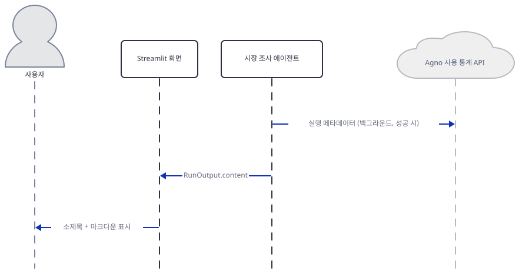

이 전체 왕복은 유효한 Gemini 키가 있어야 끝까지 이어집니다. 이 문서는 모델 서버를 가짜로 대신해 각 구간을 확인했을 뿐이고, 진짜 모델이 어떤 도구를 몇 번 부르는지는 확인하지 못했습니다.

## 실행 체크리스트

- [ ] `uv venv`와 `uv pip install -r requirements.txt` 뒤 `agno.models.google`과 `agno.tools.duckduckgo` import가 `ImportError`로 막히는 것을 확인했다
- [ ] `uv pip install google-genai ddgs` 뒤 `imports OK`를 확인했다
- [ ] `check_gate.py`로 키가 없을 때와 있을 때의 화면 차이를 확인했다
- [ ] `check_agents.py`로 세 에이전트가 모델 객체 하나를 공유하고 시장 조사만 도구가 있음을 확인했다
- [ ] `check_reruns.py`로 화면을 다시 그릴 때마다 에이전트가 셋씩 새로 만들어지는 것을 확인했다
- [ ] 서버를 내 PC의 임의의 포트에 띄우고 `drive_app.py 58538 same-name`으로 모델이 같은 이미지를 두 번 받는 것을 확인했다
- [ ] `full`로 요청 4건과 도구 호출 1회를 확인했다
- [ ] `bad-key`로 오류 JSON이 결과 칸에 나오는 것을 확인했다
- [ ] 서버를 `Ctrl+C`로 멈추고 시연 파일을 지웠다(`fake_gemini.py`·`drive_app.py`·`check_*.py`·`requests.jsonl`·`tmp_demo` 폴더)

## 문제 해결

| 증상 | 원인 | 해결 |
|---|---|---|
| `` ImportError: `google-genai` not installed. Please install it using `pip install google-genai` `` (직접 확인) | `requirements.txt`가 옛 SDK `google-generativeai==0.8.3`만 설치하는데 agno 3.1.2의 `Gemini`는 `google-genai`를 요구한다(Day 008·Day 009와 같은 원인) | `uv pip install google-genai` |
| `` ImportError: `ddgs` not installed. Please install using `pip install ddgs` `` (직접 확인) | agno 3.1.2의 `DuckDuckGoTools`는 `ddgs`를 가져오는데 requirements의 `duckduckgo-search`는 다른 모듈이다(Day 103과 같은 원인) | `uv pip install ddgs` |
| ⚠ 키가 맞는데도 결과 칸에 모델 오류가 나옴(이 문서는 실제 호출을 하지 않아 확인하지 못했다) | 앱의 모델 ID `gemini-2.0-flash-exp`(19행)가 Google의 모델 목록과 폐기 일정에 없고, 같은 계열 `gemini-2.0-flash`는 2026년 6월 1일 종료다. 이 가능성은 목록으로만 확인했다 | 19행의 `id`를 오늘 모델 목록에 있는 `gemini-2.5-flash` 등으로 바꾼다(원본은 고치지 않는다. 바꾼 모델이 이 프롬프트에서 어떻게 답하는지는 확인하지 못했다) |
| 결과 칸에 `{"error": {"code": 400, ... "API key not valid" ...}}`가 그대로 나옴 (직접 확인) | agno의 `run()`이 모델 오류를 예외로 던지지 않고 오류 상태로 돌려주어 앱의 `except`가 걸리지 않는다 | 키와 모델 ID를 확인한다. 로그에는 `Error from Gemini API: 400 INVALID_ARGUMENT`가 남는다 |
| 경쟁사 이미지가 분석에 반영된 것 같지 않고 디자인 이미지가 경쟁사 그림으로 바뀐 듯함 (직접 확인) | 두 이미지의 파일 이름이 같으면 `temp_파일이름` 하나를 덮어써서 모델이 같은 그림을 두 번 받는다 | 올리기 전에 파일 이름을 서로 다르게 바꾼다 |
| 분석 유형을 고르지 않고 버튼을 눌렀는데 아무것도 안 나옴 (직접 확인) | 유형이 비면 에이전트가 하나도 불리지 않고 "Analysis Results" 제목만 보인다 | 분석 유형을 하나 이상 고른다 |
| 시장 분석이 고른 초점(Market Fit 등)을 반영하지 않음 (직접 확인) | 시장 조사 프롬프트(224~232행)에는 초점이 들어가지 않는다 | 맥락 칸에 원하는 초점을 적는다 |
| 임시 폴더에 `temp_...png`가 쌓임 (직접 확인) | 업로드 파일을 저장만 하고 지우지 않는다 | `%TEMP%`(윈도)나 `/tmp`의 `temp_`로 시작하는 이미지를 직접 지운다 |

## 더 해보기

- `ux_prompt`에 "첫 번째 이미지는 내 디자인, 나머지는 경쟁사"라는 문장을 더하는 변경을 `advanced_ai_agents/multi_agent_apps/agent_teams/multimodal_design_agent_team/design_agent_team.py:204-211`에 시험하고, `full` 시나리오에서 서버가 받는 프롬프트가 어떻게 바뀌는지 보세요.
- `process_images`(`advanced_ai_agents/multi_agent_apps/agent_teams/multimodal_design_agent_team/design_agent_team.py:157-173`)의 파일 이름에 순번이나 해시를 붙이면 `same-name` 시나리오에서 이미지 해시 둘이 달라지는지 확인해 보세요.
- 시장 조사 프롬프트(`advanced_ai_agents/multi_agent_apps/agent_teams/multimodal_design_agent_team/design_agent_team.py:224-232`)에 `', '.join(specific_elements)`를 더해 초점이 세 에이전트 모두에 가게 해 보세요.

## 다음 날 예고

[Day 115 · 💻 Multimodal Coding Agent Team](../day115-multimodal-coding-agent-team/README.md) — 같은 agno `Agent`에 OpenAI `o3-mini`와 Gemini를 쓰고, 코드를 E2B 클라우드 샌드박스에서 실행하는 앱입니다.
