# Day 115 · 💻 Multimodal Coding Agent Team

> 볼륨 8 🤝 Multi-agent Teams · 난이도 ★★★ ⚠(앱의 두 모델이 모두 내려갔거나 내려갈 예정입니다. `gemini-2.0-flash`는 Google 사용 중단 표의 종료일 2026-06-01이 이미 지났고 모델 페이지(Last updated 2026-10-06 UTC)에는 "Shut down"으로 표시돼 있으며, `o3-mini`는 OpenAI 폐기 표에서 2026-10-23 종료로 올라 있습니다. 또 `requirements.txt`에는 `openai`와 `google-genai`가 없어 설치 그대로는 첫 임포트에서 막히고, 오늘 설치되는 e2b-code-interpreter 2.10.3에서는 `Sandbox(timeout=60)`이 TypeError를 냅니다) · 예상 소요 105분(앱은 282줄이지만 Step 4·5·6에서 가짜 서버와 확인 스크립트 셋을 직접 저장해 돌려 보고, 샌드박스는 가짜로 대신하며 시퀀스 그림 여섯 장을 따라가야 해서 읽는 시간보다 손으로 돌려 보는 시간이 더 걸립니다) · API 비용 대략 문제 1건에 $0.01~0.03(`o3-mini` 호출 2회 — 입력은 지시문과 문제로 수백 토큰이고 출력은 추론 토큰을 포함해 2,000~6,000토큰이라고 가정하고 모델 페이지의 입력 $1.10·출력 $4.40(1M 토큰당, https://developers.openai.com/api/docs/models/o3-mini, 2026-10-09 확인)을 대입한 어림이며 키가 없어 실제 토큰 수는 재지 못했습니다. 이미지를 올리면 `gemini-2.0-flash` 호출이 1회 더 있으나 종료된 모델이라 요금을 확인하지 않았고, E2B 샌드박스는 유료 서비스인데 요금도 확인하지 못했습니다) · 원본 앱: `advanced_ai_agents/multi_agent_apps/agent_teams/multimodal_coding_agent_team`

## 오늘 만들 것

코딩 문제를 이미지로 올리거나 글로 적고 버튼을 누르면, 문제를 읽고 파이썬 풀이를 쓰고 클라우드 샌드박스에서 돌려 결과를 설명해 주는 Streamlit 앱입니다. `ai_coding_agent_o3.py` 한 파일(편집기 기준 282줄)에 agno의 `Agent` 셋이 있습니다. Gemini가 이미지에서 문제를 뽑는 비전 에이전트, `o3-mini`가 풀이를 쓰는 코딩 에이전트, 역시 `o3-mini`인 실행 에이전트입니다. 이름은 "팀"이지만 이 파일에는 `Team`이 없고(Step 3에서 `grep`으로 확인), 세 에이전트를 어떤 순서로 부를지는 `main()`의 `if`와 함수 호출이 정합니다. 리더가 일을 나누는 구조가 아니라 파이썬 코드가 세 에이전트를 차례로 부르는 파이프라인입니다.

실행 에이전트는 이름과 달리 코드를 실행하지 않습니다. 코드를 돌리는 것은 E2B 샌드박스에 `run_code`를 부르는 파이썬 줄이고, 에이전트는 그 뒤에 돌아온 로그와 파일 목록을 받아 설명만 합니다(Step 7에서 요청 본문으로 확인). 샌드박스는 Day 035가 Together AI 앱에서 다룬 것과 같은 E2B 서비스입니다. 그 날 e2b-code-interpreter 1.0.3에서는 `Sandbox(...)`를 만드는 순간 가상머신이 뜨는 네트워크 호출이었습니다(Day 035 Step 4). 오늘 설치되는 2.10.3에서는 같은 모양의 호출이 `TypeError`로 끝납니다(Step 6).

이 문서는 OpenAI·Google·E2B 어디에도 요청을 보내지 않습니다. 두 모델은 내 PC의 가짜 서버로 대신하고, 샌드박스는 호출을 기록만 하는 가짜 클래스로 바꿔 돌렸습니다. 그래서 아래의 풀이와 설명은 모두 가짜 서버가 만든 고정 문장이고, 진짜 `o3-mini`가 어떤 코드를 쓰는지와 진짜 샌드박스가 코드를 어떻게 돌리는지는 확인하지 못했습니다. 아래는 완성된 아키텍처입니다. Agno 통계 전송 화살표는 선이 너무 많아져 Step 5에서 따로 그렸습니다.

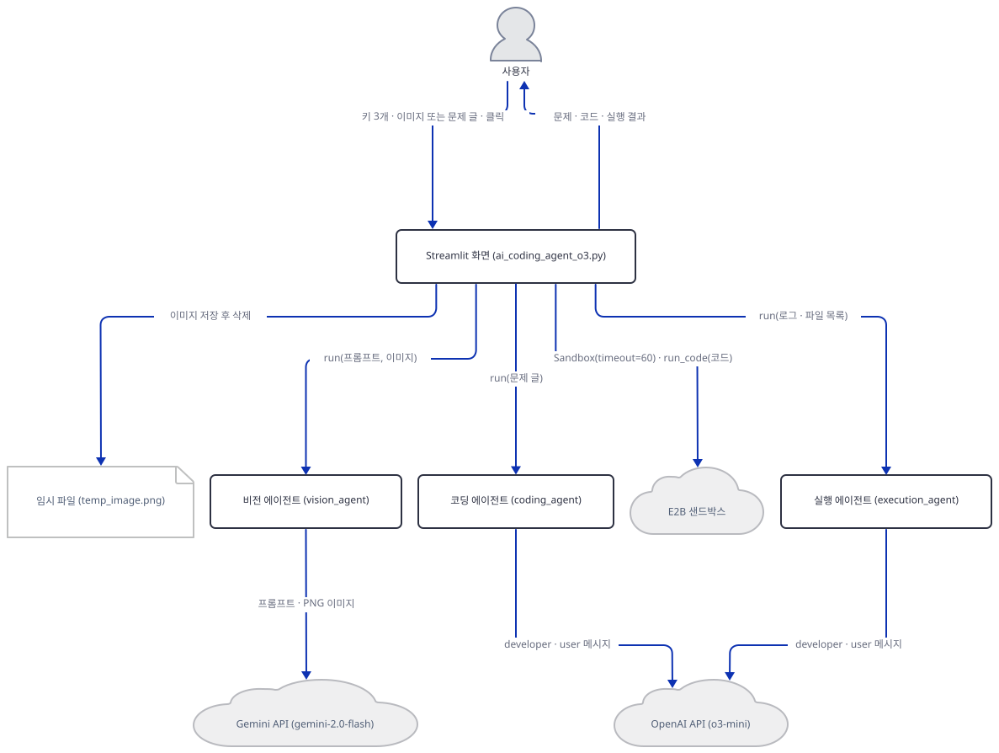

## 사전 준비

| 서비스/도구 | 용도 | 발급·설치 |
|---|---|---|
| uv | 가상환경 생성과 패키지 설치 | [공통 사전 준비](../README.md#공통-사전-준비-한-번만) 절 참고 |
| Python | 이 문서는 3.13.3으로 확인했다. 저장소 기준은 3.11~3.13 | 공통 사전 준비와 같음 |
| OpenAI API 키 | 코딩·실행 에이전트의 `o3-mini` 호출 인증. 화면 사이드바의 비밀번호 칸에 붙여넣는다(`advanced_ai_agents/multi_agent_apps/agent_teams/multimodal_coding_agent_team/ai_coding_agent_o3.py:28`). `o3-mini`는 2026-10-23 종료 예정이라 그 뒤에는 키가 맞아도 호출이 실패할 것으로 예상된다(Step 5) | https://platform.openai.com/api-keys |
| Gemini API 키 | 비전 에이전트의 `gemini-2.0-flash` 호출 인증(`advanced_ai_agents/multi_agent_apps/agent_teams/multimodal_coding_agent_team/ai_coding_agent_o3.py:31`). 이 모델의 종료일은 2026-06-01로 지났고 모델 페이지에 "Shut down"으로 표시된다. 키가 비어 있으면 이미지를 쓰지 않아도 화면이 열리지 않는다(Step 2) | https://aistudio.google.com/apikey |
| E2B API 키 | 코드를 돌릴 클라우드 샌드박스 인증(`advanced_ai_agents/multi_agent_apps/agent_teams/multimodal_coding_agent_team/ai_coding_agent_o3.py:34`). 이 문서는 키 없이, 샌드박스를 만들지 않고 확인한다 | https://e2b.dev/docs/getting-started/api-key (앱 README의 안내) |
| 인터넷 연결 | PyPI 설치. 앱을 실제로 쓸 때는 OpenAI·Google·E2B API와 agno 사용 통계 서버(`os-api.agno.com`)에 접속하고, 브라우저로 열면 Streamlit의 사용 통계도 나간다(Day 063이 확인했고 `--browser.gatherUsageStats false`로 끈다) | 별도 설치 없음 |

## 아키텍처 한눈에 보기

| 컴포넌트 | 역할 | 코드 위치 |
|---|---|---|
| 사용자 | 사이드바에 키 셋을 넣고, 이미지 또는 문제 글 중 하나를 주고 버튼을 누른다 | 코드 없음 (브라우저) |
| Streamlit 화면 (`main`) | 키 게이트, 이미지 올리기, 문제 입력창, 버튼과 세 입력 경우의 분기, 풀이 코드와 결과 출력 | `advanced_ai_agents/multi_agent_apps/agent_teams/multimodal_coding_agent_team/ai_coding_agent_o3.py:173-279` |
| 세션 상태와 사이드바 | 키 셋과 샌드박스 자리를 `st.session_state`에 두고 비밀번호 칸 셋을 그린다 | `advanced_ai_agents/multi_agent_apps/agent_teams/multimodal_coding_agent_team/ai_coding_agent_o3.py:15-36` |
| 에이전트 만들기 (`create_agents`) | 비전·코딩·실행 에이전트를 만든다. 화면이 다시 그려질 때마다 호출된다 | `advanced_ai_agents/multi_agent_apps/agent_teams/multimodal_coding_agent_team/ai_coding_agent_o3.py:38-74` |
| 비전 에이전트 (`vision_agent`) | 이미지를 받아 문제 설명 글로 바꾼다. 모델은 `gemini-2.0-flash` | `advanced_ai_agents/multi_agent_apps/agent_teams/multimodal_coding_agent_team/ai_coding_agent_o3.py:39-42`, `advanced_ai_agents/multi_agent_apps/agent_teams/multimodal_coding_agent_team/ai_coding_agent_o3.py:100-131` |
| 코딩 에이전트 (`coding_agent`) | 문제 글을 받아 마크다운 풀이를 쓴다. 모델은 `o3-mini` | `advanced_ai_agents/multi_agent_apps/agent_teams/multimodal_coding_agent_team/ai_coding_agent_o3.py:44-57` |
| 실행 에이전트 (`execution_agent`) | 샌드박스가 돌려준 로그·파일 목록(또는 오류)을 받아 설명한다. 도구가 없어 아무것도 실행하지 않는다 | `advanced_ai_agents/multi_agent_apps/agent_teams/multimodal_coding_agent_team/ai_coding_agent_o3.py:59-72`, `advanced_ai_agents/multi_agent_apps/agent_teams/multimodal_coding_agent_team/ai_coding_agent_o3.py:133-171` |
| 샌드박스 초기화 (`initialize_sandbox`) | 이전 샌드박스를 닫으려 하고 `E2B_API_KEY`를 환경변수에 쓴 뒤 `Sandbox(timeout=60)`을 만든다 | `advanced_ai_agents/multi_agent_apps/agent_teams/multimodal_coding_agent_team/ai_coding_agent_o3.py:76-88` |
| 쓰이지 않는 함수 (`run_code_in_sandbox`) | 정의만 있고 어디서도 부르지 않는다 | `advanced_ai_agents/multi_agent_apps/agent_teams/multimodal_coding_agent_team/ai_coding_agent_o3.py:90-98` |
| 임시 이미지 (`temp_image.png`) | 올린 이미지를 PNG로 저장해 Gemini에 넘긴 뒤 지운다. 작업 폴더에 생긴다 | `advanced_ai_agents/multi_agent_apps/agent_teams/multimodal_coding_agent_team/ai_coding_agent_o3.py:109-131` |
| Gemini API | 이미지와 프롬프트를 받아 문제 설명 글을 돌려준다 | `advanced_ai_agents/multi_agent_apps/agent_teams/multimodal_coding_agent_team/ai_coding_agent_o3.py:40` |
| OpenAI API (`o3-mini`) | 풀이와 결과 설명, 두 호출을 받는다 | `advanced_ai_agents/multi_agent_apps/agent_teams/multimodal_coding_agent_team/ai_coding_agent_o3.py:46`, `advanced_ai_agents/multi_agent_apps/agent_teams/multimodal_coding_agent_team/ai_coding_agent_o3.py:61` |
| E2B 클라우드 샌드박스 | 코드를 원격 가상머신에서 돌리고 로그와 파일 목록을 돌려준다 | 코드 없음 (외부 서비스) |
| Agno 사용 통계 API | 성공한 에이전트 실행마다 agno가 익명 메타데이터를 보내려 한다 | 코드 없음 (agno 내부) |

## 단계별 진행

### Step 1. 환경 만들기 — 빠진 패키지 둘

**목적.** 앱 폴더에 독립 가상환경을 만들고, `requirements.txt`만으로는 임포트가 끝나지 않는다는 사실과 설치되는 버전을 확인합니다.

**할 일.** 저장소 루트에서 시작합니다.

```bash
cd advanced_ai_agents/multi_agent_apps/agent_teams/multimodal_coding_agent_team
uv venv
uv pip install -r requirements.txt
```

(pip 대안: bash는 `python -m venv .venv && source .venv/bin/activate && pip install -r requirements.txt`입니다. PowerShell 5.1은 `&&`를 받지 않으므로 세 줄로 `python -m venv .venv`, `.venv\Scripts\Activate.ps1`, `pip install -r requirements.txt`를 차례로 씁니다. 실행해 보지 못했습니다.) 이후 `uv run`에는 모두 `--no-project`를 붙입니다. 이유는 [공통 사전 준비](../README.md#공통-사전-준비-한-번만)에 있습니다.

`advanced_ai_agents/multi_agent_apps/agent_teams/multimodal_coding_agent_team/requirements.txt:1-4`

```text
streamlit
e2b-code-interpreter
agno>=2.2.10
Pillow
```

4줄이고 마지막 줄에 개행이 없어 `wc -l`은 3으로 셉니다. 버전은 `agno`의 하한 말고는 정해져 있지 않아, 이 문서를 만들 때(2026-10-09) Python 3.13.3에서 패키지 73개가 깔렸습니다. 모델 클래스가 필요로 하는 `openai`(OpenAI 쪽)와 `google-genai`(Gemini 쪽)는 목록에 없습니다. agno의 모델 모듈이 임포트하는 순간 그 패키지를 요구하기 때문입니다(같은 원인을 `google-genai`는 Day 008·Day 009 Step 1이, `openai`는 Day 103 Step 1이 이미 다뤘습니다. 소스로 확인, agno 3.1.2의 `agno/models/openai/chat.py` 31행과 `agno/models/google/gemini.py`의 임포트 가드).

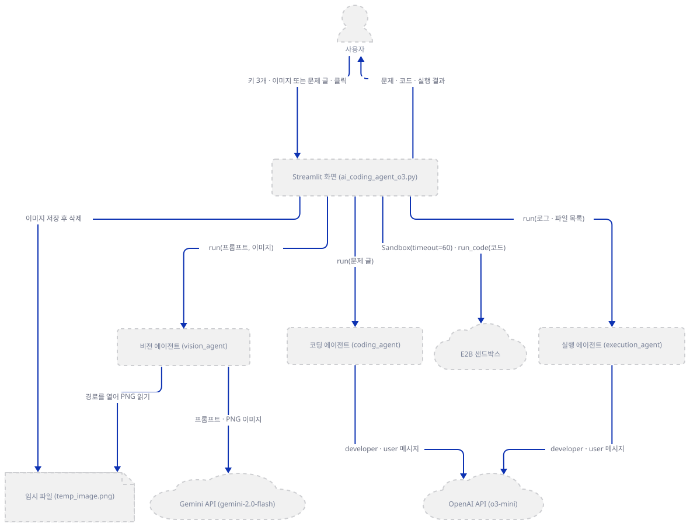

**확인.** 앱 폴더에서 실행합니다.

```bash
uv run --no-project python -c "
import sys
from importlib.metadata import version
print(sys.version.split()[0])
for name in ('agno', 'streamlit', 'e2b-code-interpreter', 'e2b', 'pillow'):
    print(name, version(name))
"
```

(여러 줄 `python -c "..."` 명령은 안쪽에 작은따옴표만 써서 PowerShell에서도 같은 형태로 쓸 수 있습니다. 실행해 보지 못했습니다.) 직접 확인한 출력(버전은 설치하는 날의 최신입니다):

```
3.13.3
agno 3.1.2
streamlit 1.65.0
e2b-code-interpreter 2.10.3
e2b 2.55.0
pillow 12.3.0
```

이제 두 모델 클래스를 임포트해 봅니다. 파이썬은 전체 추적을 찍는데 마지막 줄만 옮깁니다.

```bash
uv run --no-project python -c "from agno.models.openai import OpenAIChat"
uv run --no-project python -c "from agno.models.google import Gemini"
```

직접 확인한 출력(각각 마지막 줄):

```
ImportError: `openai` not installed. Please install using `pip install openai`
ImportError: `google-genai` not installed. Please install it using `pip install google-genai`
```

두 패키지를 더하고 앱의 1~13행 임포트를 그대로 실행합니다.

```bash
uv pip install openai google-genai
uv run --no-project python -m py_compile ai_coding_agent_o3.py && echo compiled
uv run --no-project python -c "
from importlib.metadata import version
import ast
exec(compile(ast.parse('\n'.join(open('ai_coding_agent_o3.py', encoding='utf-8').read().splitlines()[:13])), 'imports', 'exec'))
print('all imports OK')
for name in ('openai', 'google-genai'):
    print(name, version(name))
"
```

(`py_compile`은 앱 폴더에 `__pycache__`를 만듭니다. 원본 폴더를 깨끗이 두려면 앱 파일을 복사한 폴더에서 하세요.) 직접 확인한 출력:

```
compiled
all imports OK
openai 3.26.1
google-genai 2.29.0
```

여기까지는 외부로 요청이 나가지 않습니다. 임포트가 끝나도 `e2b_code_interpreter.Sandbox`는 아직 만들어지지 않았고, 이 문서는 어떤 단계에서도 만들지 않습니다.

### Step 2. 사이드바 키 셋과 게이트

**목적.** 키 셋이 모두 있어야 나머지 화면이 그려지는 구조와, 키가 어디에 저장되는지를 확인합니다.

**할 일.**

`advanced_ai_agents/multi_agent_apps/agent_teams/multimodal_coding_agent_team/ai_coding_agent_o3.py:25-36`

```python
def setup_sidebar() -> None:
    with st.sidebar:
        st.title("API Configuration")
        st.session_state.openai_key = st.text_input("OpenAI API Key", 
                                                   value=st.session_state.openai_key,
                                                   type="password")
        st.session_state.gemini_key = st.text_input("Gemini API Key", 
                                                   value=st.session_state.gemini_key,
                                                   type="password")
        st.session_state.e2b_key = st.text_input("E2B API Key",
                                                value=st.session_state.e2b_key,
                                                type="password")
```

`advanced_ai_agents/multi_agent_apps/agent_teams/multimodal_coding_agent_team/ai_coding_agent_o3.py:182-187`

```python
    # Check all required API keys
    if not (st.session_state.openai_key and 
            st.session_state.gemini_key and 
            st.session_state.e2b_key):
        st.warning("Please enter all required API keys in the sidebar.")
        return
```

키는 환경변수가 아니라 사이드바의 비밀번호 칸에 붙여넣고, 값은 `st.session_state`에 보관합니다(15~23행). 187행의 `return`이 이 아래 189~279행을 통째로 막으므로 세 칸 중 하나라도 비면 제목, 사이드바, 경고 문구만 그려집니다. 비전 키가 없으면 텍스트 입력만 쓸 때도 막힌다는 뜻입니다. 사이드바 아래의 `st.info`("Code execution timeout: 30 seconds")는 게이트보다 앞에 있어 키가 없어도 보입니다. 이 문구가 무엇을 가리키는지는 Step 6에서 봅니다.

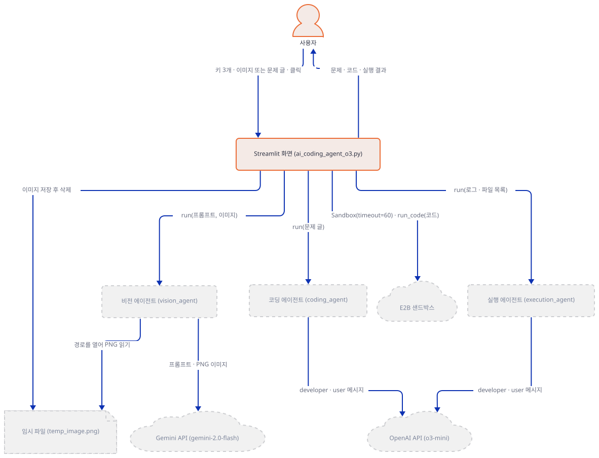

**확인.** 앱을 브라우저로 띄우는 명령은 이렇습니다.

```bash
uv run --no-project streamlit run ai_coding_agent_o3.py
```

이 문서는 브라우저 대신 `AppTest`(Streamlit이 브라우저 없이 스크립트를 실행하고 위젯을 코드로 조작하게 해 주는 도구)로 화면을 확인했습니다. 앱 폴더에 `check_agents.py`를 편집기로 만들어 Step 3까지 함께 씁니다. 먼저 내용을 훑어 두면 됩니다. 이 스크립트는 `Agent.__init__`을 감싸 만들어지는 에이전트를 모읍니다.

`check_agents.py`

```python
from agno.agent import Agent
from streamlit.testing.v1 import AppTest

built = []
original_init = Agent.__init__


def spy_init(self, *args, **kwargs):
    original_init(self, *args, **kwargs)
    built.append(self)


Agent.__init__ = spy_init
at = AppTest.from_file("ai_coding_agent_o3.py", default_timeout=60)
at.run()
print("no keys    : agents", len(built), "| sidebar boxes", len(at.sidebar.text_input), "| warning", [w.value for w in at.warning])
for i, key in enumerate(("sk-test", "gm-test", "e2b-test")):
    at.sidebar.text_input[i].set_value(key)
    at.run()
    print("after a key: agents", len(built), "| warning", [w.value for w in at.warning])
for a in built:
    m = a.model
    print(type(m).__name__, m.id, "| tools:", a.tools, "| system_prompt:", (m.system_prompt or "")[:40].strip().replace("\n", " "))
at.run()
print("one more rerun: agents", len(built))
```

```bash
uv run --no-project python check_agents.py
```

직접 확인한 출력(맨 위에 `missing ScriptRunContext!` 경고가 나오지만 `streamlit run` 없이 돌릴 때의 안내입니다). 앞 세 줄이 Step 2이고 나머지는 Step 3에서 읽습니다.

```
no keys    : agents 0 | sidebar boxes 3 | warning ['Please enter all required API keys in the sidebar.']
after a key: agents 0 | warning ['Please enter all required API keys in the sidebar.']
after a key: agents 0 | warning ['Please enter all required API keys in the sidebar.']
after a key: agents 3 | warning []
Gemini gemini-2.0-flash | tools: [] | system_prompt: 
OpenAIChat o3-mini | tools: [] | system_prompt: You are an expert Python programmer. You
OpenAIChat o3-mini | tools: [] | system_prompt: You are an expert at executing Python co
one more rerun: agents 6
```

칸은 처음부터 셋이고, 세 번째 키를 넣는 순간 비로소 에이전트 셋이 만들어집니다. (스크립트가 키를 하나 넣을 때마다 `at.sidebar.text_input[i]`를 새로 찾는 이유는, 칸의 `value=`가 세션 값에 따라 바뀌어 위젯이 다시 만들어지기 때문입니다. 한 번 얻은 목록을 계속 쓰면 앞 칸의 값이 사라집니다.) 서버로 띄워 확인하려면 `--server.address localhost`를 붙입니다. 안 붙이면 Streamlit이 시작하며 외부 IP를 알아내려고 `checkip.amazonaws.com`에 접속합니다(Day 054가 확인).

```bash
uv run --no-project streamlit run ai_coding_agent_o3.py --server.headless true --server.address localhost --server.port 53871 --browser.gatherUsageStats false
```

다른 터미널에서 `curl -s -o /dev/null -w "%{http_code}\n" http://localhost:53871`을 실행하면 직접 확인한 출력은 `200`이었고 `http://localhost:53871/_stcore/health`는 `ok`였습니다(PowerShell은 `(Invoke-WebRequest -Uri http://localhost:53871 -UseBasicParsing).StatusCode`. 실행해 보지 못했습니다). 서버는 `Ctrl+C`로 멈춥니다.

### Step 3. 에이전트 셋 — `Team`이 아니라 따로 만든 `Agent` 셋

**목적.** 에이전트 셋의 모델과 지시문이 어디에 붙는지, 도구가 있는지, 몇 번 만들어지는지를 확인합니다.

**할 일.**

`advanced_ai_agents/multi_agent_apps/agent_teams/multimodal_coding_agent_team/ai_coding_agent_o3.py:39-42`

```python
    vision_agent = Agent(
        model=Gemini(id="gemini-2.0-flash", api_key=st.session_state.gemini_key),
        markdown=True,
    )
```

`advanced_ai_agents/multi_agent_apps/agent_teams/multimodal_coding_agent_team/ai_coding_agent_o3.py:44-57`

```python
    coding_agent = Agent(
        model=OpenAIChat(
            id="o3-mini", 
            api_key=st.session_state.openai_key,
            system_prompt="""You are an expert Python programmer. You will receive coding problems similar to LeetCode questions, 
            which may include problem statements, sample inputs, and examples. Your task is to:
            1. Analyze the problem carefully and Optimally with best possible time and space complexities.
            2. Write clean, efficient Python code to solve it
            3. Include proper documentation and type hints
            4. The code will be executed in an e2b sandbox environment
            Please ensure your code is complete and handles edge cases appropriately."""
        ),
        markdown=True
    )
```

비전 에이전트는 모델 말고는 인자가 `markdown=True`뿐입니다. 코딩 에이전트의 지시문은 `Agent`가 아니라 모델인 `OpenAIChat(system_prompt=...)`에 붙습니다. 이 필드는 agno의 `Model` 기본 클래스에 있어 에러 없이 받아들여집니다(소스로 확인, agno 3.1.2의 `agno/models/base.py` 162행). 59~72행의 실행 에이전트도 같은 모양이고 지시문 내용만 다릅니다("Take the provided Python code / Execute it in the e2b sandbox"). 세 에이전트 모두 `tools=`가 없고(위 출력의 `tools: []`) 코딩·실행 에이전트는 같은 `o3-mini`에 같은 키입니다. 팀이 없다는 것은 소스에서 세어 봅니다.

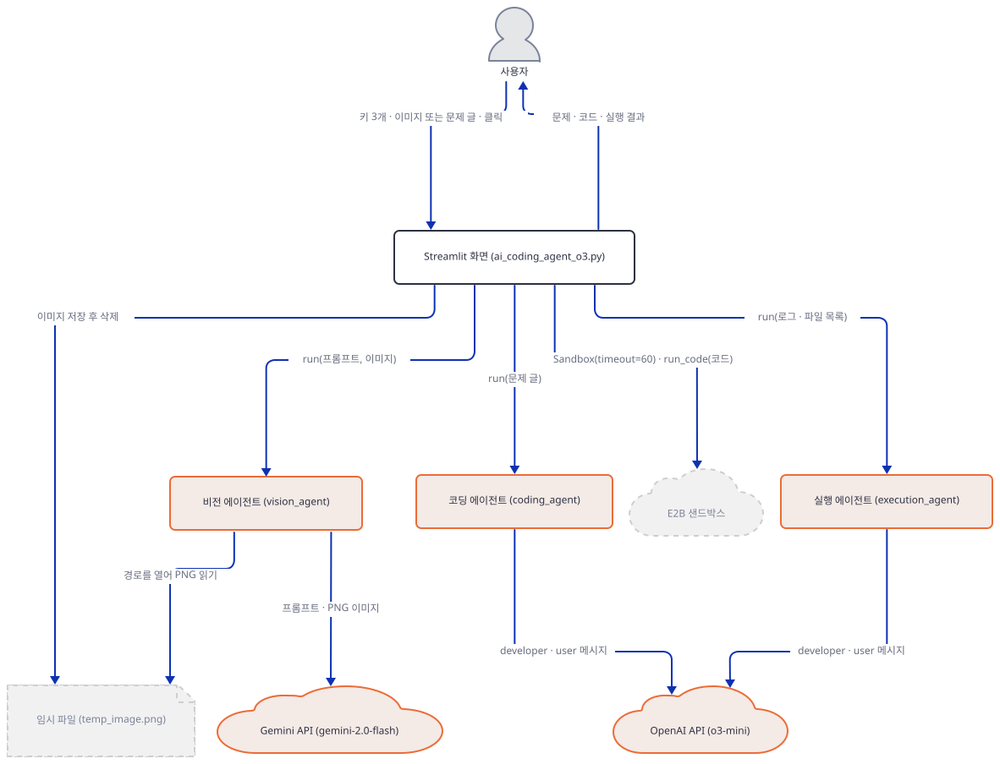

**확인.**

```bash
grep -c "Team" ai_coding_agent_o3.py
```

(PowerShell: `(Select-String -CaseSensitive "Team" ai_coding_agent_o3.py).Count`. 실행해 보지 못했습니다.) 직접 확인한 출력:

```
0
```

위 `check_agents.py` 출력의 다섯째~일곱째 줄이 모델과 지시문이고 마지막 줄이 재생성입니다. 한 번 더 그리면 에이전트 셋이 새로 만들어져 6개가 됩니다. 에이전트는 화면이 그려질 때마다 새로 만들어지고, 이 앱은 에이전트에 기억을 두지 않아 잃는 것은 없습니다. 같은 현상을 바로 앞 Day 114 Step 3이 에이전트 셋을 만드는 함수에서 다뤘습니다.

### Step 4. 이미지를 문제 글로 — Gemini와 임시 파일

**목적.** 이미지가 어디로 가는지, 임시 파일이 남는지, 비전 호출이 실패했을 때 무슨 일이 일어나는지를 가짜 서버로 확인합니다.

**할 일.** 이미지 경로는 버튼 분기의 첫 갈래입니다.

`advanced_ai_agents/multi_agent_apps/agent_teams/multimodal_coding_agent_team/ai_coding_agent_o3.py:208-228`

```python
        if uploaded_image and not user_query:
            # Process image with Gemini
            with st.spinner("Processing image..."):
                try:
                    # Save uploaded file to temporary location
                    image = Image.open(uploaded_image)
                    extracted_query = process_image_with_gemini(vision_agent, image)
                    
                    if extracted_query.startswith("Failed to process"):
                        st.error(extracted_query)
                        return
                    
                    st.info("📝 Extracted Problem:")
                    st.write(extracted_query)
                    
                    # Pass extracted query to coding agent
                    with st.spinner("Generating solution..."):
                        response: RunOutput = coding_agent.run(extracted_query)
                except Exception as e:
                    st.error(f"Error processing image: {str(e)}")
                    return
```

이미지만 있고 글이 없을 때만 이 갈래로 들어옵니다. `process_image_with_gemini`는 이미지를 RGB로 바꿔 작업 폴더의 `temp_image.png`에 저장하고, 그 경로를 agno의 `Image(filepath=...)`로 감싸 `vision_agent.run(프롬프트, images=[...])`에 넘기며, `finally`에서 파일을 지웁니다.

`advanced_ai_agents/multi_agent_apps/agent_teams/multimodal_coding_agent_team/ai_coding_agent_o3.py:108-131`

```python
    # Save image to a temporary file
    temp_path = "temp_image.png"
    try:
        # Convert to RGB if needed
        if image.mode != 'RGB':
            image = image.convert('RGB')
        image.save(temp_path, format="PNG")
        
        # Create Agno Image object
        agno_image = AgnoImage(filepath=Path(temp_path))
            
        # Pass image to Gemini
        response: RunOutput = vision_agent.run(
            prompt,
            images=[agno_image]
        )
        return response.content
    except Exception as e:
        st.error(f"Error processing image: {str(e)}")
        return "Failed to process the image. Please try again or use text input instead."
    finally:
        # Clean up temporary file
        if os.path.exists(temp_path):
            os.remove(temp_path)
```

앱은 파일 경로만 넘기고, 그 경로를 열어 PNG 바이트를 읽는 것은 agno가 Gemini 요청을 만들 때입니다(소스로 확인, agno 3.1.2의 `agno/utils/gemini.py` 181~199행과 `agno/models/google/gemini.py` 864행 근처. 그림의 `vision -> tmp` 화살표입니다). 그래서 올린 이미지 전체가 Gemini로 갑니다. `Agent.run`은 모델 오류를 예외로 던지지 않고 `status`가 `error`인 `RunOutput`에 오류 문장을 담아 돌려주는데(Day 102 Step 5가 확인한 사실이고 agno 3.1.2의 `agno/agent/_run.py`에도 `RunStatus.error`를 `content`와 함께 돌려주는 곳이 있습니다), 이 함수는 `status`를 보지 않습니다. 오류 문장이 그대로 `response.content`로 반환되고 216행의 검사는 `"Failed to process"`로 시작하는지만 보므로, 오류 문장은 "문제"가 되어 코딩 에이전트에 갑니다(Day 114 Step 6도 모델 오류가 결과 칸에 일반 글자로 나오는 같은 구조를 다뤘습니다). 함수 안의 `except`(125~127행)에 걸리는 것은 RGB 변환이나 파일 저장 같은 파이썬 예외뿐이고(`Image.open`은 이 함수 밖의 213행이라 `main()`의 `except`(226~228행)가 받습니다), 모델이 돌려준 오류 문장은 예외가 아니라 값이라 그냥 지나갑니다.

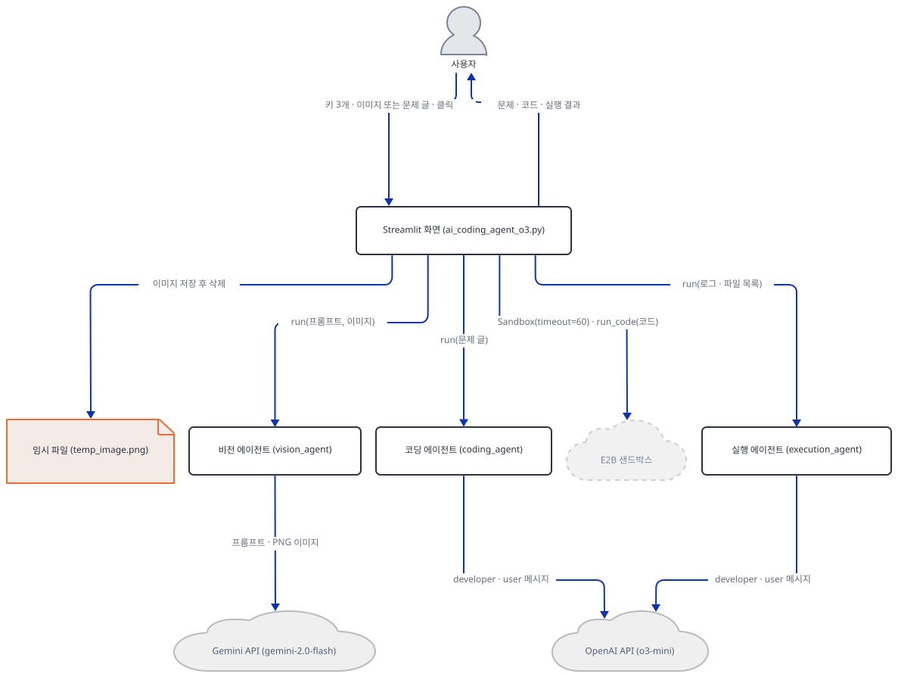

**확인.** 앱 폴더에 파일 둘을 편집기로 만듭니다. 첫째는 OpenAI와 Gemini 요청을 모두 받아 찍는 가짜 서버입니다. 응답은 고정 문장이고, 첫 인자가 포트이며 둘째 인자로 모드(`ok`·`nocode`·`gemini404`)를 고릅니다. Windows에서는 재사용 옵션이 켜져 있으면 다른 프로그램이 쓰는 포트에 오류 없이 겹쳐 뜰 수 있어 `allow_reuse_address = False`로 둡니다.

`fake_models.py`

````python
import base64
import json
import sys
from http.server import BaseHTTPRequestHandler, ThreadingHTTPServer

PORT = int(sys.argv[1])
MODE = sys.argv[2] if len(sys.argv) > 2 else "ok"  # ok | nocode | gemini404

CODE = """Here is the solution.

```python
def two_sum(nums: list[int], target: int) -> list[int]:
    seen = {}
    for i, n in enumerate(nums):
        if target - n in seen:
            return [seen[target - n], i]
        seen[n] = i
    return []

print(two_sum([2, 7, 11, 15], 9))
```

Time O(n), space O(n)."""


class Handler(BaseHTTPRequestHandler):
    def log_message(self, *args):
        pass

    def send_json(self, status, obj):
        data = json.dumps(obj).encode()
        self.send_response(status)
        self.send_header("content-type", "application/json")
        self.send_header("content-length", str(len(data)))
        self.end_headers()
        self.wfile.write(data)

    def do_POST(self):
        body = json.loads(self.rfile.read(int(self.headers["content-length"])))
        if "generateContent" in self.path:  # Gemini
            print("POST", self.path, "| top keys:", sorted(body), flush=True)
            if MODE == "gemini404":
                return self.send_json(404, {"error": {"code": 404, "message": "fake: model is no longer available", "status": "NOT_FOUND"}})
            for part in body["contents"][0]["parts"]:
                if "text" in part:
                    print("[gemini user] text:", part["text"][:60].replace("\n", " "), "...", flush=True)
                else:
                    blob = part["inlineData"]
                    raw = base64.urlsafe_b64decode(blob["data"] + "=" * (-len(blob["data"]) % 4))
                    print("[gemini user] image:", blob["mime_type"], len(raw), "bytes, starts", raw[:4], flush=True)
            return self.send_json(200, {
                "candidates": [{"content": {"role": "model", "parts": [{"text": "FAKE EXTRACTED PROBLEM: Two Sum, nums=[2,7,11,15], target=9"}]}, "finishReason": "STOP"}],
                "usageMetadata": {"promptTokenCount": 1, "candidatesTokenCount": 1, "totalTokenCount": 2},
            })
        print("POST", self.path, "| model:", body["model"], "| keys:", sorted(body), flush=True)  # OpenAI
        for m in body["messages"]:
            print(f"[{m['role']}]", m["content"], flush=True)
        coding = "expert Python programmer" in body["messages"][0]["content"]
        if coding:
            text = "Use a hash map for O(n) time. (no code block here)" if MODE == "nocode" else CODE
        else:
            text = "FAKE EXPLANATION of the results"
        self.send_json(200, {
            "id": "chatcmpl-fake", "object": "chat.completion", "created": 0, "model": body["model"],
            "choices": [{"index": 0, "finish_reason": "stop", "message": {"role": "assistant", "content": text}}],
            "usage": {"prompt_tokens": 1, "completion_tokens": 1, "total_tokens": 2},
        })


class Server(ThreadingHTTPServer):
    allow_reuse_address = False


Server(("127.0.0.1", PORT), Handler).serve_forever()
````

둘째는 앱을 `AppTest`로 한 번 돌리는 확인 스크립트입니다. OpenAI SDK는 `OPENAI_BASE_URL`, Google SDK는 `GOOGLE_GEMINI_BASE_URL` 환경변수로 주소를 바꿉니다(소스로 확인, google-genai 2.29.0의 `google/genai/_base_url.py`). 샌드박스는 호출을 기록만 하는 가짜 클래스로 바꾸고(실제 `Sandbox`는 만들지 않습니다), agno의 통계 전송 함수는 보내는 대신 모아 둡니다(agno 3.1.2의 내부 함수라 다른 버전에서는 안 먹을 수 있습니다).

`check_flow.py`

```python
import io
import os
import sys

PORT, SCENARIO = sys.argv[1], sys.argv[2]
os.environ["OPENAI_BASE_URL"] = f"http://127.0.0.1:{PORT}/v1"
os.environ["GOOGLE_GEMINI_BASE_URL"] = f"http://127.0.0.1:{PORT}"

import e2b_code_interpreter
from agno.api.api import Api
from PIL import Image, ImageDraw
from streamlit.testing.v1 import AppTest

calls, posts = [], []
Api.post_in_background = lambda self, route, payload: posts.append((route, payload["data"]["model_id"]))


class FakeFiles:
    def list(self, path):
        calls.append(("files.list", path))
        return []


class FakeExecution:
    logs = "FAKE LOGS"
    error = None


class FakeSandbox:
    """Stand-in that records calls and runs nothing. The real E2B Sandbox is never created."""

    def __init__(self, timeout=None):
        calls.append(("Sandbox()", timeout, os.environ.get("E2B_API_KEY")))
        self.files = FakeFiles()

    def set_timeout(self, seconds):
        calls.append(("set_timeout", seconds))

    def run_code(self, code):
        calls.append(("run_code", code.splitlines()[0]))
        return FakeExecution()


if SCENARIO == "e2b2":
    from e2b.sandbox.main import SandboxBase

    def real_signature_sandbox(**kwargs):
        # The real parent __init__ with the app's arguments. Binding fails before any body runs,
        # and the Sandbox constructor itself is never called.
        SandboxBase.__init__(object(), **kwargs)

    e2b_code_interpreter.Sandbox = real_signature_sandbox
else:
    e2b_code_interpreter.Sandbox = FakeSandbox


def png_bytes():
    img = Image.new("RGB", (240, 80), "white")
    ImageDraw.Draw(img).text((10, 30), "Two Sum", fill="black")
    buf = io.BytesIO()
    img.save(buf, format="PNG")
    return buf.getvalue()


def run(text="", image=False, keys=("sk-test", "gm-test", "e2b-test")):
    at = AppTest.from_file("ai_coding_agent_o3.py", default_timeout=60)
    at.run()
    for box, key in zip(at.sidebar.text_input, keys):
        box.set_value(key)
    at.run()
    if image:
        at.file_uploader[0].set_value(("problem.png", png_bytes(), "image/png"))
    if text and len(at.text_area):
        at.text_area[0].set_value(text)
    at.run()
    if len(at.button):
        at.button[0].click()
        at.run()
    print("calls:", calls)
    print("subheaders:", [s.value for s in at.subheader])
    print("markdown:", [m.value[:60] for m in at.markdown])
    print("code blocks:", len(at.code), "| error:", [e.value for e in at.error], "| warning:", [w.value for w in at.warning])
    print("telemetry:", posts)
    print("temp_image.png left behind:", os.path.exists("temp_image.png"))


if SCENARIO in ("text", "nocode", "e2b2"):
    run(text="Two Sum: return indices of two numbers adding to target")
elif SCENARIO in ("image", "gemini404"):
    run(image=True)
elif SCENARIO == "both":
    run(text="x", image=True)
elif SCENARIO == "none":
    run()
elif SCENARIO == "nokey":
    run(keys=("sk-test", "", "e2b-test"))
```

첫 터미널(앱 폴더)에서 가짜 서버를 띄웁니다. 포트는 어떤 높은 번호여도 되지만 Windows에는 운영체제가 막아 둔 구간이 있어 그 번호에는 서버가 뜨지 못합니다. 이 PC에서 61247에 `fake_models.py`를 띄우자 `PermissionError: [WinError 10013]`(액세스 권한에 의해 숨겨진 소켓에 액세스하려는 시도)으로 멈췄습니다(직접 확인). 막힌 구간은 PC마다 달라서 `netsh interface ipv4 show excludedportrange protocol=tcp`로 볼 수 있습니다(61247은 이 PC의 61196–61295 구간 안이었습니다).

```bash
uv run --no-project python fake_models.py 59303
```

둘째 터미널(앱 폴더)에서 이미지 경로를 돌립니다.

```bash
uv run --no-project python check_flow.py 59303 image
```

직접 확인한 출력:

```
calls: [('Sandbox()', 60, 'e2b-test'), ('set_timeout', 30), ('run_code', 'def two_sum(nums: list[int], target: int) -> list[int]:'), ('files.list', '/'), ('files.list', '/')]
subheaders: ['💻 Solution', '🚀 Execution Results']
markdown: ['FAKE EXTRACTED PROBLEM: Two Sum, nums=[2,7,11,15], target=9', 'FAKE EXPLANATION of the results']
code blocks: 1 | error: [] | warning: []
telemetry: [('/telemetry/runs', 'gemini-2.0-flash'), ('/telemetry/runs', 'o3-mini'), ('/telemetry/runs', 'o3-mini')]
temp_image.png left behind: False
```

`calls`의 샌드박스 줄은 Step 6·7에서 읽습니다. 지금 볼 것은 마지막 줄입니다. 임시 파일은 호출 뒤에 지워져 남지 않았습니다. 첫 터미널(가짜 서버)에는 Gemini 요청이 이렇게 찍힙니다.

```
POST /v1beta/models/gemini-2.0-flash:generateContent | top keys: ['contents', 'generationConfig', 'systemInstruction']
[gemini user] text: Analyze this image and extract any coding problem or code sn ...
[gemini user] image: image/png 914 bytes, starts b'\x89PNG'
```

요청의 모델 이름은 주소에 들어 있고(`models/gemini-2.0-flash:generateContent`), 본문에는 프롬프트 글과 PNG 바이트 914개가 인라인으로 들어갑니다. 요청 본문의 `systemInstruction`은 `markdown=True`가 붙인 안내입니다. 이제 Gemini가 404를 돌려주는 상황을 봅니다. 가짜 서버를 `Ctrl+C`로 끄고 `gemini404` 모드로 다시 띄운 뒤 같은 스크립트를 돌립니다. 이 404는 "모델이 내려갔을 때" 앱이 어떻게 반응하는지 보려고 내가 만든 가짜 응답이고, 진짜 Google이 종료된 모델에 무슨 응답을 주는지는 확인하지 못했습니다.

```bash
uv run --no-project python fake_models.py 59303 gemini404
```

```bash
uv run --no-project python check_flow.py 59303 gemini404
```

직접 확인한 출력(앞의 `ERROR` 세 줄은 agno가 찍은 로그이고 `calls`·`telemetry`는 위와 같아 `telemetry`만 옮깁니다):

```
ERROR   Error from Gemini API: 404 NOT_FOUND. {'error': {'code': 404, 'message': 'fake: model is no longer available', 'status': 'NOT_FOUND'}}
ERROR   Non-retryable model provider error: {"error": {"code": 404, "message": "fake: model is no longer available", "status": "NOT_FOUND"}}
ERROR   Error in Agent run: {"error": {"code": 404, "message": "fake: model is no longer available", "status": "NOT_FOUND"}}
subheaders: ['💻 Solution', '🚀 Execution Results']
markdown: ['{"error": {"code": 404, "message": "fake: model is no longer', 'FAKE EXPLANATION of the results']
telemetry: [('/telemetry/runs', 'o3-mini'), ('/telemetry/runs', 'o3-mini')]
```

화면에는 `st.error`가 아니라 일반 글자로 오류 JSON이 "Extracted Problem"으로 나오고, 같은 문장이 코딩 에이전트의 사용자 메시지로 갔습니다(가짜 서버 로그의 `[user] {"error": {"code": 404, ...`). 비전 호출은 실패했으므로 통계 전송은 `gemini-2.0-flash` 쪽이 빠진 둘이었습니다. 확인이 끝나면 가짜 서버를 끕니다.

### Step 5. 풀이 요청과 코드 뽑기 — `o3-mini` 요청과 통계 전송

**목적.** 코딩 에이전트로 가는 요청의 모양과, 응답에서 코드를 뽑는 방식, 그리고 agno의 통계 전송을 확인합니다.

**할 일.** 글만 있는 경우와 이미지에서 문제를 뽑은 경우 모두 `coding_agent.run(...)`으로 이어집니다(225·233행).

`advanced_ai_agents/multi_agent_apps/agent_teams/multimodal_coding_agent_team/ai_coding_agent_o3.py:242-253`

````python
        # Display and execute solution
        if 'response' in locals():
            st.divider()
            st.subheader("💻 Solution")
            
            # Extract code from markdown response
            code_blocks = response.content.split("```python")
            if len(code_blocks) > 1:
                code = code_blocks[1].split("```")[0].strip()
                
                # Display the code
                st.code(code, language="python")
````

응답이 마크다운이라는 가정에서 python 코드 펜스(백틱 셋과 `python`)를 표지로 문자열을 잘라, 첫 블록의 닫는 표시 앞까지를 코드로 씁니다(248~250행). 블록이 둘이면 둘째부터는 버려지고, 블록이 없으면 `if`가 거짓이라 풀이 제목(245행) 아래에 아무것도 나오지 않습니다. 실패에도 오류 표시가 없습니다.

성공한 `run` 하나는 agno의 익명 통계도 부릅니다. Day 047 Step 5가 다룬 두 가지 가운데 `POST /telemetry/runs`이고 `AGNO_TELEMETRY=false`로 끕니다. 에이전트 셋을 각각 실행하므로 실행 하나가 성공할 때마다 한 건씩 나갑니다(아래 출력).

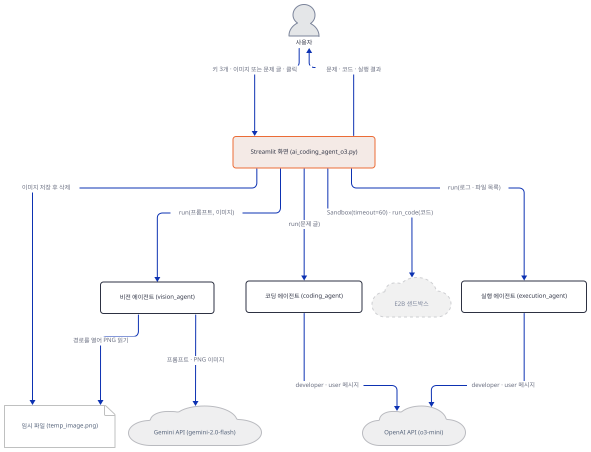

통계 전송만 따로 그리면 이렇습니다.

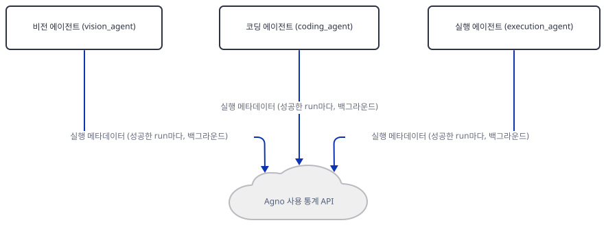

**확인.** 가짜 서버를 `ok` 모드로 띄우고 글 경로를 돌립니다.

```bash
uv run --no-project python fake_models.py 59303
```

```bash
uv run --no-project python check_flow.py 59303 text
```

직접 확인한 출력(`calls`는 Step 4와 같아 뺐습니다):

```
subheaders: ['💻 Solution', '🚀 Execution Results']
markdown: ['FAKE EXPLANATION of the results']
code blocks: 1 | error: [] | warning: []
telemetry: [('/telemetry/runs', 'o3-mini'), ('/telemetry/runs', 'o3-mini')]
temp_image.png left behind: False
```

첫 터미널(가짜 서버)에는 코딩 에이전트의 요청이 이렇게 찍힙니다(두 번째 요청은 Step 7에서 봅니다).

```
POST /v1/chat/completions | model: o3-mini | keys: ['messages', 'model']
[developer] <additional_information>
- Use markdown to format your answers.
</additional_information>

You are an expert Python programmer. You will receive coding problems similar to LeetCode questions, 
            which may include problem statements, sample inputs, and examples. Your task is to:
            1. Analyze the problem carefully and Optimally with best possible time and space complexities.
            2. Write clean, efficient Python code to solve it
            3. Include proper documentation and type hints
            4. The code will be executed in an e2b sandbox environment
            Please ensure your code is complete and handles edge cases appropriately.
[user] Two Sum: return indices of two numbers adding to target
```

읽을 것은 넷입니다. 첫째, 최상위 키는 `messages`와 `model`뿐이라 `tools`도 추론 강도 같은 인자도 없습니다. 둘째, 첫 메시지의 역할은 `system`이 아니라 `developer`입니다. agno의 `OpenAIChat`이 시스템 메시지를 그 역할로 바꿔 보냅니다(소스로 확인, agno 3.1.2의 `agno/models/openai/chat.py` 94~100행. Day 102 Step 5가 같은 사실을 3.1.1에서 확인). 셋째, 그 메시지는 `markdown=True`가 붙인 안내가 앞에 오고 그 뒤에 모델의 `system_prompt` 글이 이어집니다. 넷째, 사용자 메시지는 입력한 문제 글 그대로입니다. 그래서 가짜 서버가 `FAKE` 풀이 대신 코드 블록 없는 문장을 돌려주는 `nocode` 모드를 쓰면 화면은 이렇게 됩니다. 서버를 끄고 `nocode`로 다시 띄워 돌립니다.

```bash
uv run --no-project python fake_models.py 59303 nocode
```

```bash
uv run --no-project python check_flow.py 59303 nocode
```

직접 확인한 출력(`calls`는 비어 있어 빼고, 샌드박스를 부르지 않았다는 뜻입니다):

```
subheaders: ['💻 Solution']
markdown: []
code blocks: 0 | error: [] | warning: []
telemetry: [('/telemetry/runs', 'o3-mini')]
temp_image.png left behind: False
```

"💻 Solution" 제목만 남고 답변 글, 코드, 오류가 모두 없습니다. 모델이 쓴 설명은 어디에도 표시되지 않습니다. 진짜 `o3-mini`가 코드 블록을 항상 이 펜스로 여는지는 확인하지 못했습니다. 이 요청은 지금 종료 예정인 모델로 갑니다. OpenAI 폐기 표(https://developers.openai.com/api/docs/deprecations, 2026-10-09에 받은 원문)의 2026-04-22 "Legacy GPT model snapshots" 절에 `o3-mini`가 2026년 10월 23일 종료, 대체 `gpt-5.6-sol`로 올라 있습니다. 그 날 이후 호출이 어떤 문구로 실패하는지는 아직 볼 수 없습니다. 확인이 끝나면 서버를 끕니다.

### Step 6. 샌드박스 — 오늘 설치에서 만들어지지 않는 객체

**목적.** `Sandbox(timeout=60)`이 오늘 설치되는 패키지에서 무엇이 되는지와 두 타임아웃 숫자의 뜻을 확인하되, 샌드박스는 만들지 않습니다.

**할 일.**

`advanced_ai_agents/multi_agent_apps/agent_teams/multimodal_coding_agent_team/ai_coding_agent_o3.py:76-88`

```python
def initialize_sandbox() -> None:
    try:
        if st.session_state.sandbox:
            try:
                st.session_state.sandbox.close()
            except:
                pass
        os.environ['E2B_API_KEY'] = st.session_state.e2b_key
        # Initialize sandbox with 60 second timeout
        st.session_state.sandbox = Sandbox(timeout=60)
    except Exception as e:
        st.error(f"Failed to initialize sandbox: {str(e)}")
        st.session_state.sandbox = None
```

화면은 버튼 클릭마다 샌드박스를 새로 만듭니다(257~258행의 주석이 "Always initialize a fresh sandbox"). 이 함수는 먼저 이전 샌드박스를 `close()`로 닫으려 하고 실패는 삼키며(78~82행), 환경변수에 키를 쓴 뒤(83행) `Sandbox(timeout=60)`을 만듭니다. 이전 Day 035의 e2b 1.0.3에서는 이 호출이 곧바로 가상머신을 띄웠습니다. 오늘 설치되는 2.10.3의 클래스 설명문은 "Use the `Sandbox.create()` to create a new sandbox."라고 하고 생성자에 `:deprecated:`를 달고 있습니다(소스로 확인, e2b 2.55.0의 `e2b/sandbox_sync/main.py`). 시그니처를 버전별로 비교합니다. 생성자는 부르지 않고 `inspect`로만 봅니다.

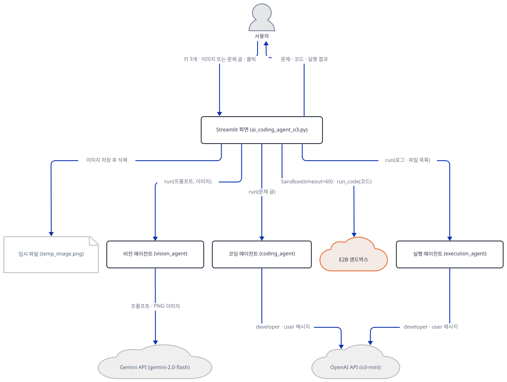

**확인.**

```bash
uv run --no-project python -c "
import inspect
from e2b_code_interpreter import Sandbox
print(inspect.signature(Sandbox.__init__))
print('close:', hasattr(Sandbox, 'close'), '| kill:', hasattr(Sandbox, 'kill'), '| create:', hasattr(Sandbox, 'create'))
"
```

직접 확인한 출력:

```
(self, **opts: Unpack[e2b.sandbox.main.SandboxOpts])
close: False | kill: True | create: True
```

생성자는 `sandbox_id`·`envd_version` 같은 내부 값을 키워드로 받을 뿐 `timeout`이 없고, `close`라는 메서드도 없습니다. 78~82행의 `close()`는 `AttributeError`를 낳아 `except`에 삼켜지므로 이전 샌드박스는 닫히지 않습니다. 같은 확인을 다른 버전에서 했습니다(각각 새 가상환경에 `e2b-code-interpreter`만 설치하고 `inspect.signature`만 봤습니다. 2.0.0은 e2b가 최신인 2.55.0으로 함께 깔렸습니다).

| e2b-code-interpreter | `Sandbox.__init__` 시그니처 | `close` |
|---|---|---|
| 1.5.2 (e2b 1.11.1) | `(self, template=None, timeout=None, metadata=None, envs=None, secure=None, api_key=None, domain=None, ...)` | 없음 |
| 2.0.0 (e2b 2.55.0) | `(self, **opts)` | 없음 |
| 2.10.3 (e2b 2.55.0) | `(self, **opts)` | 없음 |

그러면 앱의 `Sandbox(timeout=60)`은 `opts`로 들어간 `timeout`이 부모 `SandboxBase.__init__`에 전달되는 순간 실패해야 합니다. 생성자를 부르지 않고 이 실패를 재현하려고, 확인 스크립트의 `e2b2` 경로는 `Sandbox` 자리에 부모 `__init__`을 같은 인자로 부르는 함수를 끼웠습니다(인자를 맞추는 단계에서 실패하므로 본문이 실행되지 않고, 샌드박스는 만들어질 수 없습니다). 가짜 서버를 `ok`로 띄우고 돌립니다.

```bash
uv run --no-project python fake_models.py 59303
```

```bash
uv run --no-project python check_flow.py 59303 e2b2
```

직접 확인한 출력:

```
calls: []
subheaders: ['💻 Solution']
markdown: []
code blocks: 1 | error: ["Failed to initialize sandbox: SandboxBase.__init__() got an unexpected keyword argument 'timeout'"] | warning: []
telemetry: [('/telemetry/runs', 'o3-mini')]
temp_image.png left behind: False
```

풀이는 `st.code`로 보이고 그 아래에 `initialize_sandbox`의 `st.error`가 뜨며(87행), 샌드박스가 `None`이라 `if st.session_state.sandbox:`(260행)가 거짓이어서 실행도 결과 설명도 없습니다. 실행 에이전트는 한 번도 불리지 않아 통계는 코딩 에이전트의 한 건뿐입니다. 이 앱의 실행 단계는 e2b-code-interpreter 2.x에서는 항상 여기서 멈춘다는 뜻입니다. 앱 코드를 고친다면 `Sandbox.create(timeout=60)`(시그니처에 `timeout`이 있는 것은 소스로 확인했습니다. 실제 생성은 하지 않았습니다)이거나 `e2b-code-interpreter<2`로 설치하는 방법이 있습니다(더 해보기).

나머지 샌드박스 줄은 가짜 샌드박스로 돌립니다. 두 숫자의 뜻을 보려면 다음을 읽습니다.

`advanced_ai_agents/multi_agent_apps/agent_teams/multimodal_coding_agent_team/ai_coding_agent_o3.py:133-150`

```python
def execute_code_with_agent(execution_agent: Agent, code: str, sandbox: Sandbox) -> str:
    try:
        # Set timeout to 30 seconds for code execution
        sandbox.set_timeout(30)
        execution = sandbox.run_code(code)
        
        # Handle execution errors
        if execution.error:
            if "TimeoutException" in str(execution.error):
                return "⚠️ Execution Timeout: The code took too long to execute (>30 seconds). Please optimize your solution or try a smaller input."
            
            error_prompt = f"""The code execution resulted in an error:
            Error: {execution.error}
            
            Please analyze the error and provide a clear explanation of what went wrong."""
            response: RunOutput = execution_agent.run(error_prompt)
            return f"⚠️ Execution Error:\n{response.content}"
        
```

`Sandbox(timeout=60)`의 60은 샌드박스의 수명(초)이고, 137행에서 `set_timeout(30)`이 그 수명을 30초로 다시 정합니다. e2b의 문서 문자열은 `set_timeout`을 "Set the timeout of the sandbox... This method can extend or reduce the sandbox timeout set when creating the sandbox"라고 설명합니다(소스로 확인). 반면 코드를 실행하는 `run_code`의 자체 제한은 인자 `timeout`이고, 앱이 안 주면 기본값 300초(`e2b_code_interpreter/constants.py`의 `DEFAULT_TIMEOUT`)입니다. 그러니 화면의 "Code execution timeout: 30 seconds"는 실행 제한이 아니라 수명이 30초로 줄었다는 뜻에 가깝고, 코드가 30초를 넘기면 어떤 오류 문장이 나오는지는 샌드박스를 만들지 않아 확인하지 못했습니다. 141행은 오류 문자열에 `TimeoutException`이 들어 있을 때만 시간 초과 안내를 냅니다. 이 세 갈래를 가짜 샌드박스로 돌려 봅니다. 앱 폴더에 `check_paths.py`를 만듭니다.

`check_paths.py`

```python
import os
import sys

PORT = sys.argv[1]
os.environ["OPENAI_BASE_URL"] = f"http://127.0.0.1:{PORT}/v1"
os.environ["AGNO_TELEMETRY"] = "false"

import e2b_code_interpreter
from e2b_code_interpreter import Logs

import ai_coding_agent_o3 as app

print("repr of logs the execution agent would see:", str(Logs(stdout=["[0, 1]\n"], stderr=[])))
print("occurrences of run_code_in_sandbox in the file:", open("ai_coding_agent_o3.py", encoding="utf-8").read().count("run_code_in_sandbox"))

app.initialize_session_state()
app.st.session_state.openai_key = "sk-test"
app.st.session_state.gemini_key = "gm-test"
_, _, execution_agent = app.create_agents()


class Sb:
    def __init__(self, error=None, boom=None):
        self.error, self.boom = error, boom
        self.files = self

    def set_timeout(self, t):
        pass

    def list(self, p):
        return []

    def run_code(self, code):
        if self.boom:
            raise RuntimeError(self.boom)

        class E:
            logs = "L"
        E.error = self.error
        return E()


print("1) timeout error ->", app.execute_code_with_agent(execution_agent, "x", Sb(error="TimeoutException: fake")))
print("2) other error   ->", app.execute_code_with_agent(execution_agent, "x", Sb(error="NameError: fake")))
e2b_code_interpreter.Sandbox = lambda timeout=None: print("   re-init Sandbox(timeout=%s)" % timeout) or Sb()
app.Sandbox = e2b_code_interpreter.Sandbox
print("3) raised        ->", app.execute_code_with_agent(execution_agent, "x", Sb(boom="sandbox gone")))
```

가짜 서버가 `ok`로 떠 있는 채로 실행합니다.

```bash
uv run --no-project python check_paths.py 59303
```

직접 확인한 출력:

```
repr of logs the execution agent would see: Logs(stdout: ['[0, 1]\n'], stderr: [])
occurrences of run_code_in_sandbox in the file: 1
1) timeout error -> ⚠️ Execution Timeout: The code took too long to execute (>30 seconds). Please optimize your solution or try a smaller input.
2) other error   -> ⚠️ Execution Error:
FAKE EXPLANATION of the results
   re-init Sandbox(timeout=60)
3) raised        -> ⚠️ Sandbox Error: sandbox gone
```

첫 줄은 Step 7에서 읽습니다. 둘째 줄은 `run_code_in_sandbox`라는 이름이 파일 전체에 정의 줄 하나뿐이라는 뜻이고, 이 함수(90~98행)는 어디서도 불리지 않습니다. 1)은 `TimeoutException`이 있으면 모델을 부르지 않고 경고 문장을 돌려주는 경우, 2)는 다른 오류에서 실행 에이전트가 오류를 설명하는 경우(가짜 서버의 사용자 메시지는 `The code execution resulted in an error: Error: NameError: fake ...`였습니다), 3)은 `run_code`가 예외를 던지면 샌드박스를 다시 만들려 하고(`re-init` 줄) 오류 문장을 돌려주는 경우입니다. 확인이 끝나면 서버를 끕니다.

### Step 7. 실행 에이전트와 결과 화면

**목적.** 실행 에이전트가 실제로 받는 입력과 결과·파일 목록이 화면에 나오는 방식을 확인합니다.

**할 일.**

`advanced_ai_agents/multi_agent_apps/agent_teams/multimodal_coding_agent_team/ai_coding_agent_o3.py:151-164`

```python
        # Get files list safely
        try:
            files = sandbox.files.list("/")
        except:
            files = []
        
        prompt = f"""Here is the code execution result:
        Logs: {execution.logs}
        Files: {str(files)}
        
        Please provide a clear explanation of the results and any outputs."""
        
        response: RunOutput = execution_agent.run(prompt)
        return response.content
```

`advanced_ai_agents/multi_agent_apps/agent_teams/multimodal_coding_agent_team/ai_coding_agent_o3.py:266-279`

```python
                        
                        # Display execution results
                        st.divider()
                        st.subheader("🚀 Execution Results")
                        st.markdown(execution_results)
                        
                        # Try to display files if available
                        try:
                            files = st.session_state.sandbox.files.list("/")
                            if files:
                                st.markdown("📁 **Generated Files:**")
                                st.json(files)
                        except:
                            pass
```

오류가 없을 때 `execute_code_with_agent`는 파일 목록을 한 번 더 얻고(153행) 프롬프트에 `execution.logs`와 파일 목록의 문자열을 끼워 `execution_agent.run(...)`을 부릅니다. 프롬프트에 풀이 코드는 없습니다. 실행 에이전트가 설명하는 것은 로그와 파일 목록뿐이고, 지시문(63~69행)이 말하는 "Execute it in the e2b sandbox"는 이 에이전트가 할 수 없는 일입니다. 화면은 설명을 `st.markdown`으로 찍고, 274행에서 `files.list("/")`를 한 번 더 불러 파일이 있으면 `st.json`으로 보여 줍니다. 그래서 파일 목록 호출이 한 번의 실행에서 둘입니다(Step 4 출력의 `calls`에 `('files.list', '/')`가 두 번).

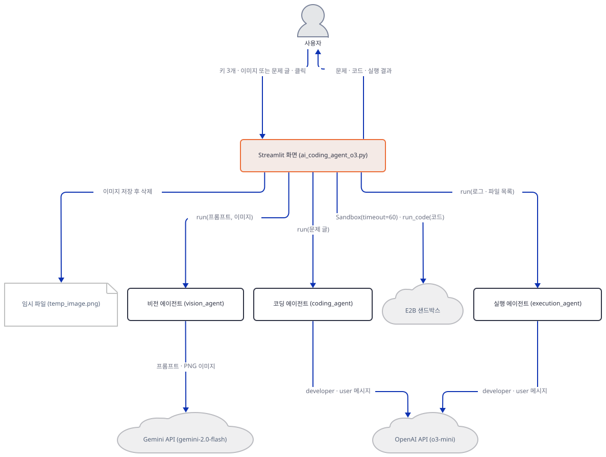

**확인.** 가짜 서버를 `ok` 모드로 다시 띄운 채로 글 경로를 다시 돌립니다. 이번에는 가짜 서버(첫 터미널)에 찍힌 실행 에이전트의 요청을 봅니다.

```bash
uv run --no-project python check_flow.py 59303 text
```

가짜 서버 쪽 출력의 두 번째 요청입니다.

```
POST /v1/chat/completions | model: o3-mini | keys: ['messages', 'model']
[developer] <additional_information>
- Use markdown to format your answers.
</additional_information>

You are an expert at executing Python code in sandbox environments.
            Your task is to:
            1. Take the provided Python code
            2. Execute it in the e2b sandbox
            3. Format and explain the results clearly
            4. Handle any execution errors gracefully
            Always ensure proper error handling and clear output formatting.
[user] Here is the code execution result:
        Logs: FAKE LOGS
        Files: []
        
        Please provide a clear explanation of the results and any outputs.
```

사용자 메시지에 풀이 코드가 없는 것이 보입니다. 진짜 `Execution.logs`는 가짜의 문자열이 아니라 `Logs(stdout: ['[0, 1]\n'], stderr: [])` 같은 객체이고 그 `str()`이 그대로 들어갑니다(Step 6의 첫 출력 줄). 입력 경우의 나머지 셋은 샌드박스와 모델을 부르지 않고 끝납니다. `both`·`none`·`nokey`를 차례로 돌립니다.

```bash
uv run --no-project python check_flow.py 59303 both
uv run --no-project python check_flow.py 59303 none
uv run --no-project python check_flow.py 59303 nokey
```

직접 확인한 출력(각각 `error`·`warning` 항목만 옮깁니다. 나머지는 `calls: []`, `subheaders: []`, `telemetry: []`입니다):

```
error: ['Please use either image upload OR text input, not both.']
warning: ['Please provide either an image or text description of your coding problem.']
warning: ['Please enter all required API keys in the sidebar.']
```

확인이 끝나면 가짜 서버를 `Ctrl+C`로 끄고 `fake_models.py`, `check_flow.py`, `check_agents.py`, `check_paths.py`, 그리고 작업 폴더에 생겼다면 `temp_image.png`를 지웁니다.

## 요청 한 건이 흐르는 과정

이미지로 문제를 올린 요청 하나를 여섯 장으로 나눠 따라갑니다. 글로 입력하면 첫 두 장의 비전 구간 전체가 빠지고 셋째 장부터 시작합니다. 앱의 실제 시간 경계에서 자른 것이고 메시지는 모두 한 장에 정확히 한 번 있습니다.

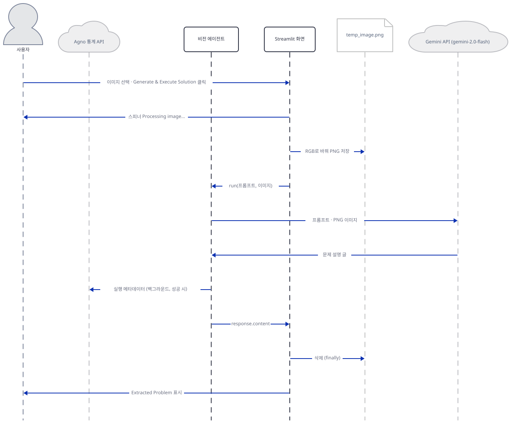

버튼 클릭이 일으킨 리런에서 이미지만 있으므로 화면은 스피너를 띄우고 이미지를 PNG로 저장해 비전 에이전트를 부릅니다. 비전 에이전트는 넘겨받은 경로를 열어 PNG 바이트를 읽습니다. 이 읽기는 agno가 Gemini 요청을 만들 때 일어납니다(Step 4).

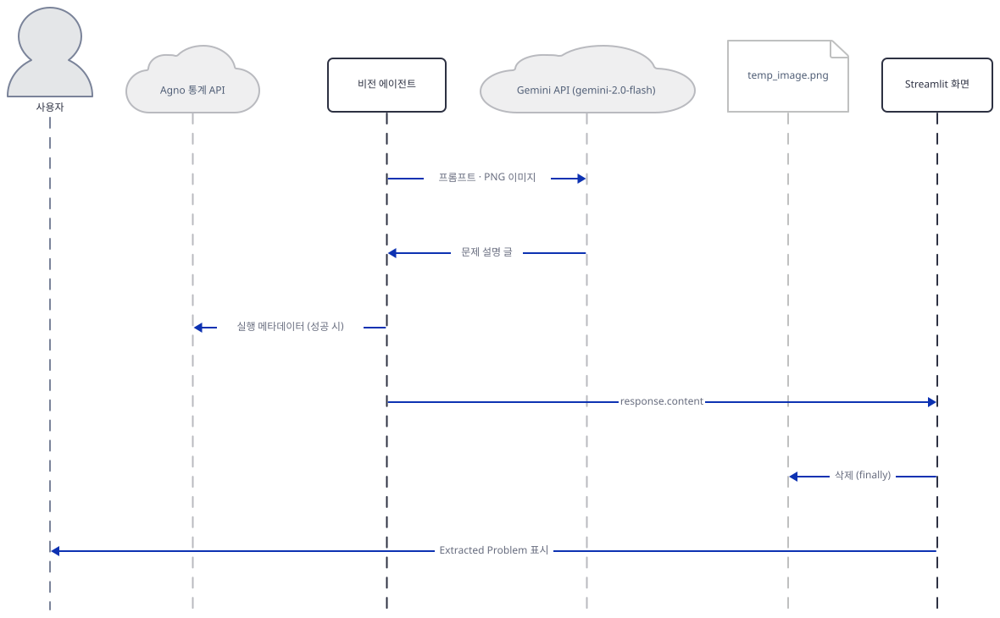

비전 에이전트가 프롬프트와 이미지를 Gemini에 보내 문제 설명 글을 받고, 성공하면 통계 전송을 큐에 넣은 뒤 글을 돌려줍니다. 화면은 임시 파일을 지우고 "Extracted Problem"으로 보여 줍니다. 실패하면 오류 문장이 같은 길로 돌아와 문제 글이 됩니다(Step 4).

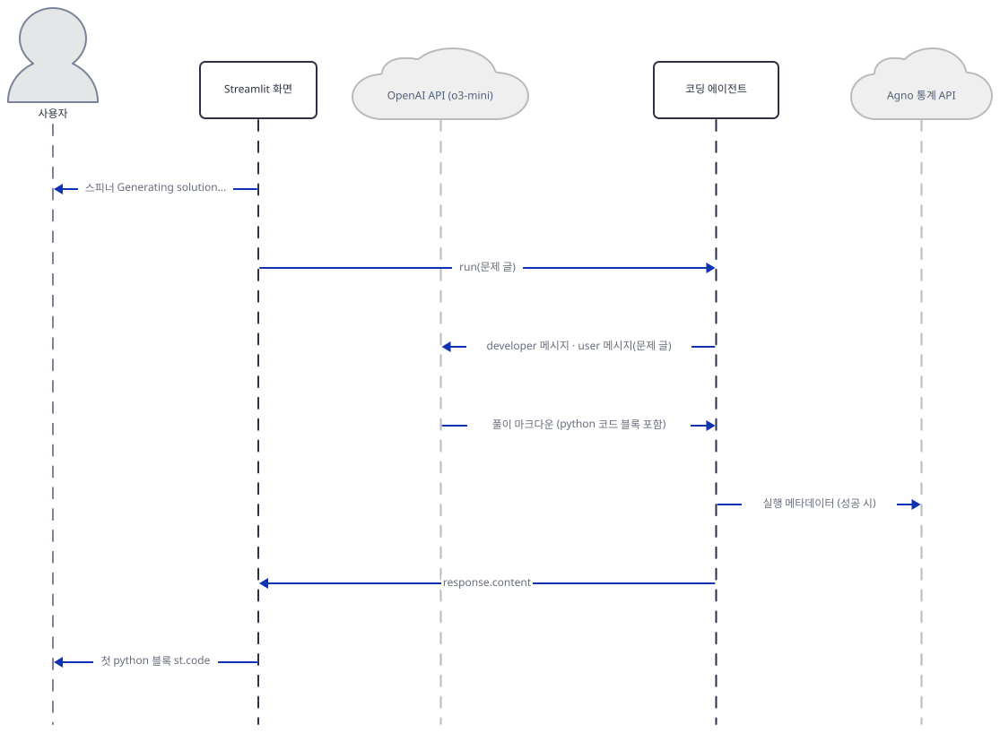

셋째 장은 글로 입력한 경우의 시작이기도 합니다. 코딩 에이전트가 `o3-mini`에 지시문과 문제를 보내 마크다운 풀이를 받고, 화면이 첫 파이썬 블록을 `st.code`로 보여 줍니다. 그림에서 OpenAI가 코딩 에이전트의 왼쪽에 있는 것은 통계 전송 화살표의 라벨이 수명선을 지나지 않게 배우 순서를 바꾼 것이고 호출 관계는 같습니다(둘째 그림과 다섯째 그림도 같은 이유로 배우 순서가 다릅니다).

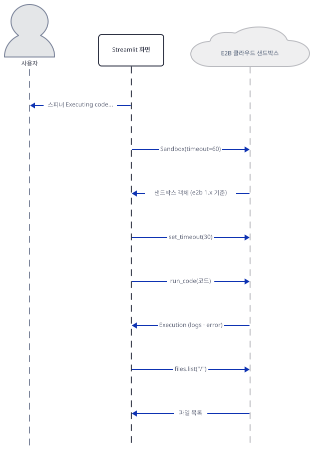

넷째 장은 `initialize_sandbox`부터 `run_code`까지입니다. 그림은 e2b 1.x에서 호출이 성공했을 때의 흐름입니다. 오늘 설치되는 2.x에서는 둘째 메시지(`Sandbox(timeout=60)`)가 TypeError로 끝나고 그 아래로는 이어지지 않습니다(Step 6).

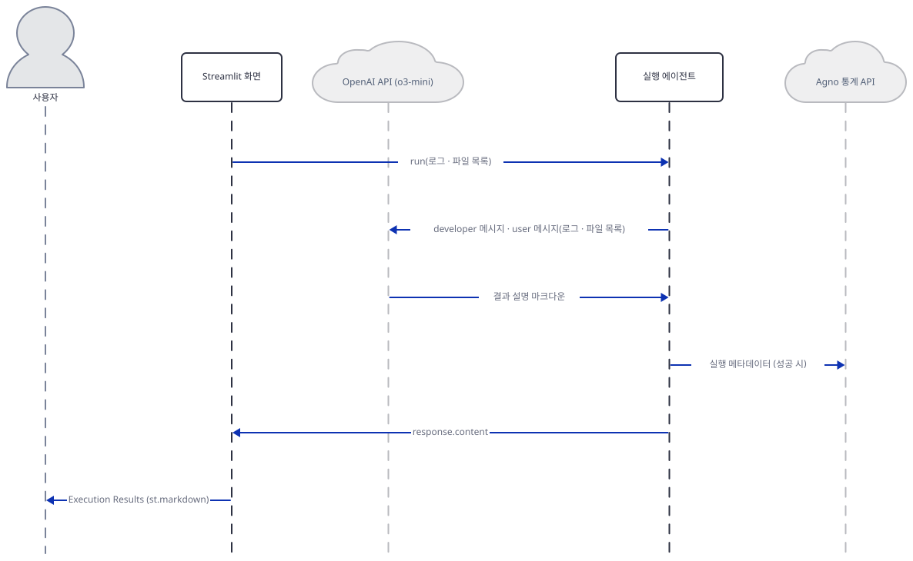

다섯째 장에서 실행 에이전트가 로그·파일 목록을 `o3-mini`에 보내 설명을 받고 화면이 그것을 "Execution Results"로 보여 줍니다.

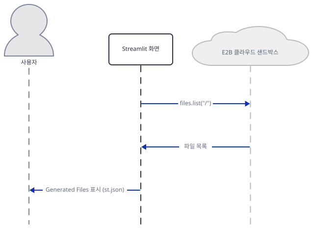

여섯째 장은 마지막 `files.list("/")`와 `st.json` 표시입니다. 이 시퀀스는 가짜 서버와 가짜 샌드박스로 직접 돌려 본 것이고, 진짜 OpenAI·Gemini 응답과 E2B 샌드박스의 실제 동작은 확인하지 못했습니다.

## 실행 체크리스트

- [ ] `uv venv`와 `uv pip install -r requirements.txt` 뒤에 `openai`·`google-genai` 임포트 오류 두 줄을 봤다
- [ ] `uv pip install openai google-genai` 뒤에 `compiled`와 `all imports OK`를 확인했다
- [ ] `AppTest`로 키 칸이 셋이고 셋을 다 채울 때만 에이전트 셋이 만들어지는 것을 봤다
- [ ] `grep -c "Team" ai_coding_agent_o3.py`가 `0`인 것을 봤다
- [ ] 가짜 서버가 Gemini 요청에서 PNG 바이트를 받고 `temp_image.png`가 남지 않는 것을 봤다
- [ ] 비전 호출이 404일 때 오류 JSON이 문제 글이 되어 코딩 에이전트로 가는 것을 봤다
- [ ] 코딩 에이전트의 요청이 `developer`·`user` 두 메시지이고 최상위 키가 `messages`와 `model`뿐인 것을 봤다
- [ ] 응답에 코드 블록이 없으면 "💻 Solution" 제목만 남는 것을 봤다
- [ ] `Sandbox.__init__` 시그니처가 `(self, **opts)`이고 `close`가 없는 것을 봤다
- [ ] 가짜 샌드박스로 `Sandbox(timeout=60)`→`set_timeout(30)`→`run_code`→`files.list`가 이 순서인 것을 봤다
- [ ] 실행 에이전트의 요청에 풀이 코드가 없는 것을 봤다
- [ ] `o3-mini`와 `gemini-2.0-flash`가 각 제공자의 폐기 표에 있는 것을 확인했다

## 문제 해결

| 증상 | 원인 | 해결 |
|---|---|---|
| 설치 직후 ``ImportError: `openai` not installed.`` 또는 ``ImportError: `google-genai` not installed.`` | `requirements.txt`에 두 패키지가 없다. agno의 모델 모듈이 임포트 순간 요구한다(직접 확인: 73개 설치 뒤 두 줄 모두 재현) | `uv pip install openai google-genai`(직접 확인: openai 3.26.1, google-genai 2.29.0) |
| 풀이 코드는 보이는데 그 아래에 `Failed to initialize sandbox: SandboxBase.__init__() got an unexpected keyword argument 'timeout'` | e2b-code-interpreter 2.x의 `Sandbox.__init__`이 `**opts`만 받아 `Sandbox(timeout=60)`이 부모 `__init__`에서 실패한다(Step 6. 부모 `__init__`을 같은 인자로 불러 직접 확인했고 생성자 자체는 부르지 않았다) | 복사본에서 `Sandbox.create(timeout=60)`로 바꾸거나 `e2b-code-interpreter<2`로 설치한다. 둘 다 실제 샌드박스를 만들어 보지 못했다 |
| 이미지를 올렸는데 "Extracted Problem"에 오류 JSON이나 `Server disconnected without sending a response.` 같은 문장이 나옴 | `Agent.run`이 모델 오류를 예외 대신 `RunOutput.content`에 담고, 앱은 `status`를 보지 않아 그 문장을 문제로 코딩 에이전트에 넘긴다(Step 4. 가짜 서버가 404를 줄 때 직접 확인) | `gemini-2.0-flash`는 Google 모델 페이지(https://ai.google.dev/gemini-api/docs/models, Last updated 2026-10-06 UTC, 2026-10-09 확인)에 "Shut down"으로 표시돼 있으니 모델 이름을 바꾼다. 표의 대체는 `gemini-3.6-flash`다(바꿔서 돌려 보지 못했다) |
| 이미지와 글을 함께 줬는데 `Please use either image upload OR text input, not both.` | 235~237행이 둘을 함께 받지 않는다(직접 확인) | 하나만 쓴다 |
| 버튼을 눌렀는데 "💻 Solution" 제목만 있고 아무것도 없음 | 응답에 python 코드 펜스가 없으면 247~253행이 통째로 건너뛰어진다(직접 확인: 코드 블록 없는 가짜 응답) | 질문에 파이썬 코드로 답하라고 적고 다시 누른다. 모델이 쓴 설명은 어디에도 표시되지 않는다 |
| 2026-10-23 이후 풀이 요청이 실패할 것으로 예상됨 | `o3-mini`가 OpenAI 폐기 표(2026-10-09 받은 원문)에 그 날 종료, 대체 `gpt-5.6-sol`로 올라 있다 | 복사본에서 46행·61행의 `id`를 바꾼다. 종료 뒤 실제 오류 문구는 아직 볼 수 없어 직접 보지 못했다 |
| 가짜 서버가 `PermissionError: [WinError 10013]`으로 멈추거나, `streamlit run`이 `Port 61247 is not available`을 냄 | 그 번호가 Windows가 막아 둔 포트 구간에 있다. 앞의 오류는 `fake_models.py`가, 뒤의 문구는 Streamlit이 낸다(직접 확인: 두 번호 모두 61196–61295 구간) | `netsh interface ipv4 show excludedportrange protocol=tcp`로 구간을 보고 밖의 번호를 쓴다(직접 확인: 53871, 59303) |
| `AppTest`를 돌릴 때 ``Please replace `use_container_width` with `width`.`` 경고 | 198행의 `st.image(..., use_container_width=True)`가 이미지를 올린 리런마다 이 경고를 낸다. 경고는 2025-12-31에 제거 예정이라고 하지만 Streamlit 1.65.0에서는 아직 동작한다(직접 확인) | 무시하거나 복사본에서 `width="stretch"`로 바꾼다 |
| `AppTest`를 돌릴 때마다 `missing ScriptRunContext!` 경고 | `streamlit run` 없이 스크립트를 돌릴 때 Streamlit이 내는 안내다(직접 확인: 이 경고가 있어도 결과는 같다) | 무시한다 |

## 더 해보기

- 복사본에서 첫 단계의 비전 호출 뒤에 `response.status`를 확인해 오류면 `st.error`로 멈추게 해 보세요. 오류 문장이 문제로 흘러가는 일이 없어집니다. `from agno.run.agent import RunOutput, RunStatus`로 가져오면 됩니다. 이 문서에서는 해 보지 않았습니다.
- 모델 이름 둘(`gemini-2.0-flash`, `o3-mini`)을 사이드바 입력이나 환경변수로 받게 바꾸고, 폐기 표의 대체 모델로 바꿔 가짜 서버가 받는 `model` 값이 바뀌는지 확인해 보세요. 이 문서에서는 해 보지 않았습니다.
- 복사본의 `initialize_sandbox`에서 `close()`를 `kill()`로 바꾸고 `Sandbox.create(timeout=60)`을 쓰게 한 뒤, 실제 E2B 키로 클릭마다 샌드박스가 하나씩 정리되는지 E2B 대시보드에서 확인해 보세요. 이 문서는 샌드박스를 만들지 않아 해 보지 못했습니다.

## 다음 날 예고

[Day 116 · 🎨 AI Game Design Agent Team](../day116-ai-game-design-agent-team/README.md) — 같은 "에이전트 팀"이라는 이름이지만 agno 대신 AutoGen의 `SwarmAgent`와 `initiate_swarm_chat`으로 게임 기획 에이전트들을 엮고 모델은 `gpt-4o-mini`를 쓰는 Streamlit 앱을 다룹니다(원본 앱 소스 기준).
