# Day 116 · 🎨 AI Game Design Agent Team

> 볼륨 8 🤝 Multi-agent Teams · 난이도 ★★★ ⚠(`requirements.txt`의 `autogen`이 오늘 0.14.1로 풀리는데 이 버전에는 앱이 3행에서 import하는 `SwarmAgent`가 없어, 설치 그대로는 첫 줄에서 `ImportError`로 멈춥니다. `autogen==0.7.3`으로 고정해야 돕니다 — Step 1) · 예상 소요 100분(앱은 290줄 단일 파일이지만 `autogen` 버전을 열네 가지로 갈아 끼워 보고, 가짜 서버와 확인 스크립트 둘을 직접 저장해 돌리고, 시퀀스 그림 아홉 장을 따라가야 해서 읽는 시간보다 손으로 돌려 보는 시간이 더 걸립니다) · API 비용 대략 요청 1건에 `gpt-4o-mini` 호출 8회, 합쳐서 약 $0.01(OpenAI 모델 페이지의 입력 $0.15·출력 $0.60(1M 토큰당, https://developers.openai.com/api/docs/models/gpt-4o-mini, 2026-10-09 확인)에, 호출당 입력 3,000토큰·출력 1,500토큰을 상한으로 가정해 대입하면 호출당 $0.00135, 8회에 $0.0108입니다. 실제 토큰 수는 키가 없어 재지 못했으니 그 근처의 어림입니다) · 원본 앱: `advanced_ai_agents/multi_agent_apps/agent_teams/ai_game_design_agent_team`

## 오늘 만들 것

게임의 분위기·장르·목표·대상·시점·멀티플레이·아트 스타일·플랫폼·개발 기간·예산·핵심 메커니즘·분위기·영감·고유 기능·상세 수준, 열다섯 칸을 채우고 "Generate Game Concept"을 누르면 에이전트 넷이 각자 한 절씩 써서 게임 기획서를 만들어 주는 Streamlit 앱입니다. `game_design_agent_team.py` 한 파일(편집기 기준 290줄)에 AG2(예전 이름 AutoGen)의 Swarm 기능으로 이은 `SwarmAgent` 넷이 있습니다. 스토리 → 게임플레이 → 비주얼 → 기술 순서이고 기술 다음은 다시 스토리입니다. 각자 먼저 2~3문장 요약을 도구 호출로 내고(사이드바에 뜹니다), 요약 넷이 모이면 한 바퀴를 돌며 본문 한 절씩을 씁니다. 화면에는 expander 넷이 남습니다.

이름은 "팀"이지만 누가 다음에 말할지는 모델이 고르지 않습니다. 요약 단계에서는 도구 함수가 `SwarmResult(agent="gameplay_agent")`처럼 다음 이름을 돌려주고, 본문 단계에서는 `register_hand_off(AFTER_WORK(...))`로 등록한 값이 정합니다. 둘 다 코드에 박혀 있어서 흐름은 고정된 한 줄 순환입니다. 같은 볼륨의 Day 115는 파이썬 코드가 에이전트를 차례로 부르는 파이프라인이었는데, 오늘은 그 차례를 AG2가 쥐고 에이전트의 함수가 다음을 가리킵니다. Day 085가 같은 API(`initiate_swarm_chat`)를 세 에이전트와 `gpt-4o`로 다뤘고, 오늘은 넷과 `gpt-4o-mini`입니다. 그 날 `max_rounds=13`이 본문 두 바퀴가 끝나는 값이었던 것처럼, 오늘은 같은 13이 넷에서 본문 한 바퀴가 정확히 끝나는 값입니다(Step 8).

이 앱은 `autogen`이라는 이름의 최신판에서는 돌지 않습니다. 앱의 import(`SwarmAgent`, `SwarmResult`, `initiate_swarm_chat`, `AFTER_WORK`, `UPDATE_SYSTEM_MESSAGE`)가 있던 버전은 0.7.3까지이고, 어디서 끊기는지는 Step 1에서 열네 버전으로 확인합니다. 이 문서는 OpenAI에 요청을 보내지 않습니다. 모델은 내 PC의 가짜 서버로 대신했고, 그래서 아래의 본문과 요약은 모두 가짜 서버가 만든 고정 문장입니다. 진짜 `gpt-4o-mini`가 어떤 기획서를 쓰는지는 확인하지 못했고, 호출 순서·횟수·화면에 남는 것은 끝까지 직접 확인했습니다. 아래는 완성된 아키텍처입니다.

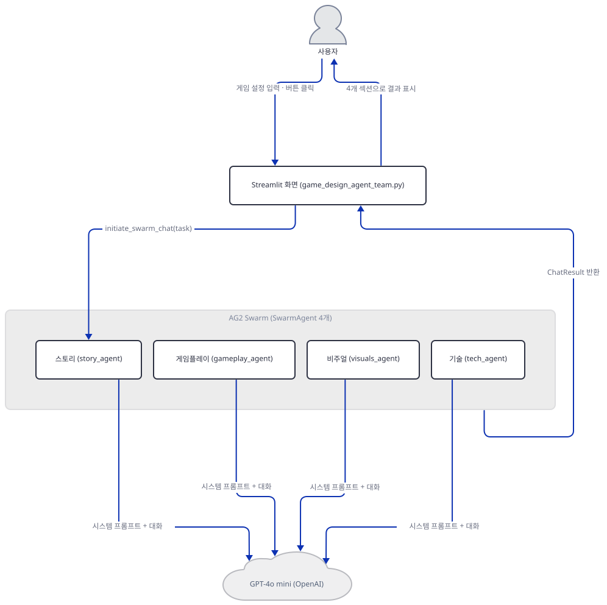

## 사전 준비

| 서비스/도구 | 용도 | 발급·설치 |
|---|---|---|
| OpenAI API 키 | 에이전트 넷의 `gpt-4o-mini` 호출 인증. 사이드바 입력창(`type="password"`)에 직접 붙여넣습니다(환경변수가 아닙니다). 이 문서의 재현은 가짜 키로 합니다 | https://platform.openai.com/ 가입 후 발급 |
| uv | 가상환경 생성과 패키지 설치 | [공통 사전 준비](../README.md#공통-사전-준비-한-번만) 절 참고 |
| `autogen==0.7.3` | 앱이 쓰는 Swarm API가 남아 있는 버전. `requirements.txt` 그대로는 0.14.1이 깔려 실패합니다 | Step 1에서 `uv pip install "autogen==0.7.3"` |
| 작업 폴더 쓰기 | AG2가 `cache_seed` 기본값 41로 요청·응답을 `.cache/41/cache.db`에 저장합니다(입력한 게임 설정 문구 포함) | 실행한 폴더에 자동 생성 — Step 7·"문제 해결" |
| 인터넷 연결 | PyPI 설치, OpenAI API 호출 | 별도 설치 없음 |

앱이 닿는 외부 서비스는 OpenAI 하나입니다. 이 앱은 agno를 쓰지 않으므로 앞 날들에서 본 agno 통계 전송도 없습니다(`import` 줄 전체가 `streamlit`과 `autogen`뿐 — 소스로 확인). 이 PC에 깔린 `autogen` 0.7.3 소스에서 `posthog`·`telemetry`를 언급하는 `.py`는 앱이 쓰지 않는 `teachability.py` 하나였습니다(grep으로 확인).

## 아키텍처 한눈에 보기

| 컴포넌트 | 역할 | 코드 위치 |
|---|---|---|
| Streamlit 화면 | 사이드바 키 입력·안내, 팀 소개, 입력 폼 열다섯 칸, 결과 expander 넷 | `advanced_ai_agents/multi_agent_apps/agent_teams/ai_game_design_agent_team/game_design_agent_team.py:16-50`, `advanced_ai_agents/multi_agent_apps/agent_teams/ai_game_design_agent_team/game_design_agent_team.py:52-88`, `advanced_ai_agents/multi_agent_apps/agent_teams/ai_game_design_agent_team/game_design_agent_team.py:275-289` |
| 세션 상태 | 마지막 결과 넷을 보관 | `advanced_ai_agents/multi_agent_apps/agent_teams/ai_game_design_agent_team/game_design_agent_team.py:12-14`, `advanced_ai_agents/multi_agent_apps/agent_teams/ai_game_design_agent_team/game_design_agent_team.py:267-273` |
| 요약 도구 함수 넷 | 요약을 `context_variables`에 저장하고 사이드바에 표시하며 다음 에이전트 이름을 돌려줌 | `advanced_ai_agents/multi_agent_apps/agent_teams/ai_game_design_agent_team/game_design_agent_team.py:128-150` |
| 역할별 시스템 메시지 | 에이전트마다 "당신은 ~입니다. 할 일은" 목록 | `advanced_ai_agents/multi_agent_apps/agent_teams/ai_game_design_agent_team/game_design_agent_team.py:152-192` |
| 시스템 프롬프트 훅 | 매 턴 요약 단계와 본문 단계를 가르고 프롬프트를 새로 조립 | `advanced_ai_agents/multi_agent_apps/agent_teams/ai_game_design_agent_team/game_design_agent_team.py:194-223` |
| SwarmAgent 넷 | 스토리·게임플레이·비주얼·기술. 각자 도구 함수 하나와 훅을 가짐 | `advanced_ai_agents/multi_agent_apps/agent_teams/ai_game_design_agent_team/game_design_agent_team.py:225-252` |
| 이관 등록과 실행 | `AFTER_WORK` 순환, `initiate_swarm_chat(max_rounds=13)` | `advanced_ai_agents/multi_agent_apps/agent_teams/ai_game_design_agent_team/game_design_agent_team.py:254-265` |
| OpenAI API | 네 에이전트의 실제 추론(`gpt-4o-mini`) | `advanced_ai_agents/multi_agent_apps/agent_teams/ai_game_design_agent_team/game_design_agent_team.py:117` |
| 디스크 캐시 | `.cache/41/cache.db`에 요청·응답 저장 | 코드 없음(`llm_config`에 `cache_seed`가 없어 AG2 기본 동작) |

## 단계별 진행

명령은 bash 기준입니다. PowerShell에서는 줄바꿈이 든 `-c "..."`가 따옴표 문제를 일으키니 같은 내용을 `.py` 파일로 저장해 `uv run --no-project python 파일.py`로 실행하고, `&&`로 이은 줄은 나눠 쓰고, `curl`은 PowerShell 5.1에서 `Invoke-WebRequest` 별칭이라 `curl.exe`를 쓰세요(PowerShell 형태는 실행해 보지 못했습니다). Windows 콘솔에서 `✨` 같은 글자를 찍는 스크립트는 `python -X utf8`로 돌립니다.

### Step 1. 환경 만들기 — `autogen`이 오늘 무엇으로 풀리는가

**목적.** `requirements.txt`를 그대로 설치하면 무엇이 깔리는지, 앱의 import가 되는지 확인하고, 되는 버전으로 고정합니다.

**할 일.**

```bash
cd advanced_ai_agents/multi_agent_apps/agent_teams/ai_game_design_agent_team
uv venv
uv pip install -r requirements.txt
```

(pip 대안: `python -m venv .venv && source .venv/bin/activate && pip install -r requirements.txt`. PowerShell 5.1에는 `&&`가 없으니 `python -m venv .venv`, `.venv\Scripts\Activate.ps1`, `pip install -r requirements.txt` 세 줄로 나눕니다. 실행해 보지 못했습니다.) 이 저장소 루트에는 `pyproject.toml`이 있어 이후 `uv run`에는 모두 `--no-project`를 붙입니다.

`advanced_ai_agents/multi_agent_apps/agent_teams/ai_game_design_agent_team/requirements.txt:1-2`

```text
streamlit==1.41.1
autogen
```

`streamlit`은 고정이고 `autogen`에는 버전이 없습니다. 이 문서를 쓰며 설치했을 때(2026-10-09) **autogen 0.14.1**과 **streamlit 1.41.1**이 받아졌고 `openai`는 깔리지 않았습니다(직접 확인). Day 085는 `pyautogen`이라는 이름이 빈 프록시 패키지(0.10.0)로 풀려 `autogen` 모듈이 아예 없던 경우였습니다. 오늘 앱이 적은 이름은 `autogen`이고, 이 이름은 모듈이 있는 0.14.1로 풀립니다. 그래서 모듈은 있는데 안에 쓸 것이 없습니다.

`advanced_ai_agents/multi_agent_apps/agent_teams/ai_game_design_agent_team/game_design_agent_team.py:1-10`

```python
import asyncio
import streamlit as st
from autogen import (
    SwarmAgent,
    SwarmResult,
    initiate_swarm_chat,
    OpenAIWrapper,
    AFTER_WORK,
    UPDATE_SYSTEM_MESSAGE
)
```

```bash
uv run --no-project python -c "
from autogen import (SwarmAgent, SwarmResult, initiate_swarm_chat, OpenAIWrapper, AFTER_WORK, UPDATE_SYSTEM_MESSAGE)
print('ALL IMPORTS OK')"
```

직접 확인한 출력(경로는 줄였습니다):

```text
ImportError: cannot import name 'SwarmAgent' from 'autogen' (...\.venv\Lib\site-packages\autogen\__init__.py)
```

Swarm API가 어느 버전까지 있는지 `autogen`의 여러 버전을 각자 새 가상환경에 설치해 같은 import와 `register_hand_off` 호출을 돌려 봤습니다(모두 직접 확인).

| `autogen` 버전 | 결과 |
|---|---|
| 0.6.1 · 0.7.3 | import 되고 `SwarmAgent(...).register_hand_off(AFTER_WORK(...))` 호출도 됨 |
| 0.7.4 | import 되지만 `AttributeError: 'SwarmAgent' object has no attribute 'register_hand_off'` |
| 0.7.6 · 0.8.0 · 0.8.7 | import 되지만 `SwarmAgent` 생성에서 `ImportError: Module 'openai' needed ...`(이 버전들은 `openai`를 같이 깔지 않음). `hasattr(SwarmAgent, "register_hand_off")`도 `False` |
| 0.9 · 0.9.9 · 0.10.0 · 0.11.0 · 0.12.0 · 0.13.4 · 0.14.0 · 0.14.1 | `ImportError: cannot import name 'SwarmAgent' from 'autogen'` |

0.7.4에서 `register_hand_off`가 인스턴스 메서드에서 사라지는 경계는 Day 085 Step 1이 `pyautogen`으로 확인한 것과 같습니다. 앱 254~257행이 인스턴스 메서드로 부르므로 0.7.3까지만 됩니다. 이 문서는 그중 가장 새 것인 0.7.3을 씁니다.

```bash
uv pip install "autogen==0.7.3"
```

`autogen` 0.7.3의 메타데이터는 `pyautogen==0.7.3`을 요구하는 얇은 패키지입니다(`importlib.metadata.requires`로 확인). 이때 `openai`도 같이 깔립니다(오늘 3.26.1).

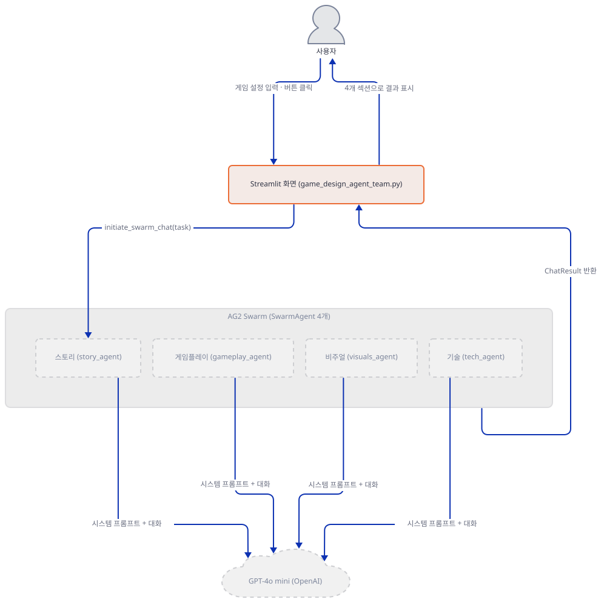

**확인.**

```bash
uv run --no-project python -W ignore -c "
from autogen import (SwarmAgent, SwarmResult, initiate_swarm_chat, OpenAIWrapper, AFTER_WORK, UPDATE_SYSTEM_MESSAGE)
print('ALL IMPORTS OK')"
uv run --no-project python -B -c "compile(open('game_design_agent_team.py', encoding='utf-8').read(), 'game_design_agent_team.py', 'exec'); print('COMPILE_OK')"
```

직접 확인한 출력:

```text
ALL IMPORTS OK
COMPILE_OK
```

### Step 2. 사이드바와 팀 소개

**목적.** 키를 어디서 받는지, 화면 윗부분과 세션 상태가 어떻게 생겼는지 봅니다.

**할 일.**

`advanced_ai_agents/multi_agent_apps/agent_teams/ai_game_design_agent_team/game_design_agent_team.py:12-50`

```python
# Initialize session state
if 'output' not in st.session_state:
    st.session_state.output = {'story': '', 'gameplay': '', 'visuals': '', 'tech': ''}

# Sidebar for API key input
st.sidebar.title("API Key")
api_key = st.sidebar.text_input("Enter your OpenAI API Key", type="password")

# Add guidance in sidebar
st.sidebar.success("""
✨ **Getting Started**

Please provide inputs and features for your dream game! Consider:
- The overall vibe and setting
- Core gameplay elements
- Target audience and platforms
- Visual style preferences
- Technical requirements

The AI agents will collaborate to develop a comprehensive game concept based on your specifications.
""")

# Main app UI
st.title("🎮 AI Game Design Agent Team")

# Add agent information below title
st.info("""
**Meet Your AI Game Design Team:**

🎭 **Story Agent** - Crafts compelling narratives and rich worlds

🎮 **Gameplay Agent** - Creates engaging mechanics and systems

🎨 **Visuals Agent** - Shapes the artistic vision and style

⚙️ **Tech Agent** - Provides technical direction and solutions
                
These agents collaborate to create a comprehensive game concept based on your inputs.
""")
```

키는 환경변수가 아니라 사이드바 입력창(18행)에서 받습니다. 13~14행은 버튼을 누르기 전에도 `st.session_state.output`의 네 키를 빈 문자열로 채워 둡니다. 21~32행의 사이드바 안내와 38~50행의 팀 소개는 화면 문구일 뿐 에이전트에 전달되지 않습니다. 소개에 나오는 에이전트는 넷이고, 앱 자체 README가 말하는 "Task Agent"는 코드에 없습니다("문제 해결").


**확인.**

```bash
uv run --no-project python -X utf8 -W ignore -c "
from streamlit.testing.v1 import AppTest
at = AppTest.from_file('game_design_agent_team.py')
at.run(timeout=60)
print('exception:', list(at.exception))
print('sidebar title:', [t.value for t in at.sidebar.title])
print('sidebar success:', len(at.sidebar.success), '| info:', len(at.info))
print('session output keys:', list(at.session_state['output'].keys()))
"
```

직접 확인한 출력(`missing ScriptRunContext` 경고 한 줄은 무시해도 됩니다):

```text
exception: []
sidebar title: ['API Key']
sidebar success: 1 | info: 1
session output keys: ['story', 'gameplay', 'visuals', 'tech']
```

### Step 3. 입력 폼 열다섯 칸

**목적.** 화면에 어떤 위젯이 있고 각각이 에이전트에게 가는 `task`의 어느 줄이 되는지 봅니다.

**할 일.**

`advanced_ai_agents/multi_agent_apps/agent_teams/ai_game_design_agent_team/game_design_agent_team.py:52-68`

```python
# User inputs
st.subheader("Game Details")
col1, col2 = st.columns(2)

with col1:
    background_vibe = st.text_input("Background Vibe", "Epic fantasy with dragons")
    game_type = st.selectbox("Game Type", ["RPG", "Action", "Adventure", "Puzzle", "Strategy", "Simulation", "Platform", "Horror"])
    target_audience = st.selectbox("Target Audience", ["Kids (7-12)", "Teens (13-17)", "Young Adults (18-25)", "Adults (26+)", "All Ages"])
    player_perspective = st.selectbox("Player Perspective", ["First Person", "Third Person", "Top Down", "Side View", "Isometric"])
    multiplayer = st.selectbox("Multiplayer Support", ["Single Player Only", "Local Co-op", "Online Multiplayer", "Both Local and Online"])

with col2:
    game_goal = st.text_input("Game Goal", "Save the kingdom from eternal winter")
    art_style = st.selectbox("Art Style", ["Realistic", "Cartoon", "Pixel Art", "Stylized", "Low Poly", "Anime", "Hand-drawn"])
    platform = st.multiselect("Target Platforms", ["PC", "Mobile", "PlayStation", "Xbox", "Nintendo Switch", "Web Browser"])
    development_time = st.slider("Development Time (months)", 1, 36, 12)
    cost = st.number_input("Budget (USD)", min_value=0, value=10000, step=5000)
```

왼쪽 컬럼은 분위기(`text_input`)·장르·대상·시점·멀티플레이(`selectbox`)이고, 오른쪽은 목표(`text_input`)·아트 스타일(`selectbox`)·플랫폼(`multiselect`)·개발 기간(`slider` 1~36개월)·예산(`number_input`)입니다. 이어서 70~88행이 핵심 메커니즘·분위기(`multiselect`), 영감·고유 기능(`text_area`), 상세 수준(`selectbox`)을 받습니다. 플랫폼·메커니즘·분위기 `multiselect`는 기본값이 없어서 비워 둔 채 눌러도 막지 않습니다. 빈 선택은 `task`에서 빈 문자열이 됩니다.


**확인.**

```bash
uv run --no-project python -X utf8 -W ignore -c "
from streamlit.testing.v1 import AppTest
at = AppTest.from_file('game_design_agent_team.py')
at.run(timeout=60)
print('text_input:', len(at.text_input), '| selectbox:', len(at.selectbox), '| multiselect:', len(at.multiselect))
print('slider:', len(at.slider), '| number_input:', len(at.number_input), '| text_area:', len(at.text_area), '| button:', len(at.button))
print('selectbox:', [s.label for s in at.selectbox])
print('multiselect:', [s.label for s in at.multiselect])
"
```

직접 확인한 출력(`text_input` 셋은 사이드바의 키 하나와 본문 둘입니다):

```text
text_input: 3 | selectbox: 6 | multiselect: 3
slider: 1 | number_input: 1 | text_area: 2 | button: 1
selectbox: ['Game Type', 'Target Audience', 'Player Perspective', 'Multiplayer Support', 'Art Style', 'Level of Detail in Response']
multiselect: ['Target Platforms', 'Core Gameplay Mechanics', 'Game Mood/Atmosphere']
```

### Step 4. 버튼, 요청 문장, 모델 설정, 요약 도구 함수

**목적.** 버튼이 입력 열다섯 칸을 `task` 하나로 합치는 과정, 모델 설정, 그리고 에이전트가 도구로 부를 요약 함수 넷을 봅니다.

**할 일.**

`advanced_ai_agents/multi_agent_apps/agent_teams/ai_game_design_agent_team/game_design_agent_team.py:91-96`

```python
if st.button("Generate Game Concept"):
    # Check if API key is provided
    if not api_key:
        st.error("Please enter your OpenAI API key.")
    else:
        with st.spinner('🤖 AI Agents are collaborating on your game concept...'):
```

키가 비어 있으면 94행에서 `st.error`로 멈추고 그 아래 코드는 돌지 않아, 네트워크 요청은 나가지 않습니다. 키가 있으면 98~115행의 f-string이 열다섯 칸을 한 문자열로 이어 `task`를 만듭니다(예산은 `${cost:,}`로 천 단위 쉼표를 붙입니다). 이어서 모델 설정과 요약을 담을 그릇입니다.

`advanced_ai_agents/multi_agent_apps/agent_teams/ai_game_design_agent_team/game_design_agent_team.py:117-125`

```python
            llm_config = {"config_list": [{"model": "gpt-4o-mini","api_key": api_key}]}

            # initialize context variables
            context_variables = {
                "story": None,
                "gameplay": None,
                "visuals": None,
                "tech": None,
            }
```

모델은 `gpt-4o-mini` 하나로, 네 에이전트가 같은 `llm_config`를 씁니다. OpenAI 폐기 표(https://developers.openai.com/api/docs/deprecations)에서 `gpt-4o-mini` 자체는 종료 예정으로 올라 있지 않았습니다(2026-10-09 확인, 같은 이름을 앞에 단 오디오·실시간·검색 미리보기 등 다른 ID만 있었습니다). 120~125행의 `context_variables`는 쓰이지 않는 변수입니다. 259~265행의 `initiate_swarm_chat(...)` 호출에 `context_variables=`가 없어서, 스웜은 빈 딕셔너리로 시작합니다(`autogen` 0.7.3의 `swarm_agent.py`에서 `context_variables or {}`로 확인). 아래 함수들이 받는 `context_variables`는 AG2가 새로 만들어 넣어 주는 별개의 딕셔너리입니다.

`advanced_ai_agents/multi_agent_apps/agent_teams/ai_game_design_agent_team/game_design_agent_team.py:128-150`

```python
            def update_story_overview(story_summary:str, context_variables:dict) -> SwarmResult:
                """Keep the summary as short as possible."""
                context_variables["story"] = story_summary
                st.sidebar.success('Story overview: ' + story_summary)
                return SwarmResult(agent="gameplay_agent", context_variables=context_variables)
                
            def update_gameplay_overview(gameplay_summary:str, context_variables:dict) -> SwarmResult:
                """Keep the summary as short as possible."""
                context_variables["gameplay"] = gameplay_summary
                st.sidebar.success('Gameplay overview: ' + gameplay_summary)
                return SwarmResult(agent="visuals_agent", context_variables=context_variables)

            def update_visuals_overview(visuals_summary:str, context_variables:dict) -> SwarmResult:
                """Keep the summary as short as possible."""
                context_variables["visuals"] = visuals_summary
                st.sidebar.success('Visuals overview: ' + visuals_summary)
                return SwarmResult(agent="tech_agent", context_variables=context_variables)

            def update_tech_overview(tech_summary:str, context_variables:dict) -> SwarmResult:
                """Keep the summary as short as possible."""
                context_variables["tech"] = tech_summary
                st.sidebar.success('Tech overview: ' + tech_summary)
                return SwarmResult(agent="story_agent", context_variables=context_variables)
```

함수 넷은 같은 모양입니다. 받은 요약을 딕셔너리에 쓰고, `st.sidebar.success`로 사이드바에 바로 보여 주고, `SwarmResult(agent=...)`로 다음 에이전트 이름을 돌려줍니다. 스토리는 게임플레이로, 게임플레이는 비주얼로, 비주얼은 기술로, 기술은 다시 스토리로 갑니다. 모델이 보는 것은 함수 이름과 요약 인자 하나뿐입니다. `context_variables` 매개변수는 모델에게 알리지 않고 AG2가 호출 때 끼워 넣습니다.

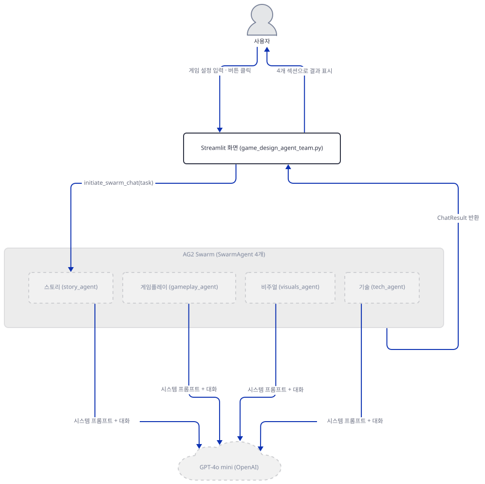

**확인.** 키 없이 버튼을 눌러 보고, 함수가 모델에게 어떤 도구 설명으로 보이는지 봅니다(`SwarmAgent` 생성까지만이고 요청은 보내지 않습니다).

```bash
uv run --no-project python -X utf8 -W ignore -c "
from streamlit.testing.v1 import AppTest
at = AppTest.from_file('game_design_agent_team.py')
at.run(timeout=60)
at.button[0].click().run(timeout=60)
print('exception:', list(at.exception))
print('error:', [e.value for e in at.error])
"
uv run --no-project python -X utf8 -W ignore -c "
import json
from autogen import SwarmAgent, SwarmResult

def update_story_overview(story_summary: str, context_variables: dict) -> SwarmResult:
    \"\"\"Keep the summary as short as possible.\"\"\"
    return SwarmResult(agent='gameplay_agent', context_variables=context_variables)

llm_config = {'config_list': [{'model': 'gpt-4o-mini', 'api_key': 'sk-fake'}]}
agent = SwarmAgent('story_agent', llm_config=llm_config, functions=update_story_overview)
print(json.dumps(agent.llm_config['tools'], indent=1))
print('SwarmResult 필드:', list(SwarmResult.model_fields))
"
```

직접 확인한 출력(AG2의 "API key ... not valid OpenAI format" 경고 줄은 생략했습니다. 가짜 키 모양 때문입니다):

```text
exception: []
error: ['Please enter your OpenAI API key.']
[
 {
  "type": "function",
  "function": {
   "description": "Keep the summary as short as possible.",
   "name": "update_story_overview",
   "parameters": {
    "type": "object",
    "properties": {
     "story_summary": {
      "type": "string",
      "description": "story_summary"
     }
    },
    "required": [
     "story_summary"
    ]
   }
  }
 }
]
SwarmResult 필드: ['values', 'agent', 'context_variables']
```

### Step 5. 역할별 시스템 메시지

**목적.** 에이전트마다 어떤 역할이 주어지는지 봅니다.

**할 일.**

`advanced_ai_agents/multi_agent_apps/agent_teams/ai_game_design_agent_team/game_design_agent_team.py:152-161`

```python
            system_messages = {
                "story_agent": """
            You are an experienced game story designer specializing in narrative design and world-building. Your task is to:
            1. Create a compelling narrative that aligns with the specified game type and target audience.
            2. Design memorable characters with clear motivations and character arcs.
            3. Develop the game's world, including its history, culture, and key locations.
            4. Plan story progression and major plot points.
            5. Integrate the narrative with the specified mood/atmosphere.
            6. Consider how the story supports the core gameplay mechanics.
                """,
```

`system_messages` 딕셔너리는 이렇게 네 키(`story_agent`·`gameplay_agent`·`visuals_agent`·`tech_agent`)를 갖습니다. 나머지 셋은 같은 모양으로 각자 역할을 여섯~일곱 항목으로 적습니다(`advanced_ai_agents/multi_agent_apps/agent_teams/ai_game_design_agent_team/game_design_agent_team.py:162-191`). 이 문자열은 `SwarmAgent`를 만들 때 넣는 것이 아니라 Step 6의 훅이 매 턴 읽어 가는 원재료입니다. 아직 에이전트 객체는 하나도 없습니다.


**확인.**

```bash
uv run --no-project python -X utf8 -c "
import ast
tree = ast.parse(open('game_design_agent_team.py', encoding='utf-8').read())
for node in ast.walk(tree):
    if isinstance(node, ast.Assign) and any(getattr(t, 'id', '') == 'system_messages' for t in node.targets):
        print('system_messages 키:', [k.value for k in node.value.keys])
"
```

직접 확인한 출력:

```text
system_messages 키: ['story_agent', 'gameplay_agent', 'visuals_agent', 'tech_agent']
```

### Step 6. 시스템 프롬프트 훅 — 요약 강제, 그다음 본문

**목적.** 이 앱의 가장 특이한 부분, 같은 에이전트가 첫 턴과 둘째 턴에 다른 일을 하게 만드는 훅을 봅니다.

**할 일.**

`advanced_ai_agents/multi_agent_apps/agent_teams/ai_game_design_agent_team/game_design_agent_team.py:194-223`

```python
            def update_system_message_func(agent: SwarmAgent, messages) -> str:
                """"""
                system_prompt = system_messages[agent.name]

                current_gen = agent.name.split("_")[0]
                if agent._context_variables.get(current_gen) is None:
                    system_prompt += f"Call the update function provided to first provide a 2-3 sentence summary of your ideas on {current_gen.upper()} based on the context provided."
                    agent.llm_config['tool_choice'] = {"type": "function", "function": {"name": f"update_{current_gen}_overview"}}
                    agent.client = OpenAIWrapper(**agent.llm_config)
                else:
                    # remove the tools to avoid the agent from using it and reduce cost
                    agent.llm_config["tools"] = None
                    agent.llm_config['tool_choice'] = None
                    agent.client = OpenAIWrapper(**agent.llm_config)
                    # the agent has given a summary, now it should generate a detailed response
                    system_prompt += f"\n\nYour task\nYou task is write the {current_gen} part of the report. Do not include any other parts. Do not use XML tags.\nStart your response with: '## {current_gen.capitalize()} Design'."    
                    
                    # Remove all messages except the first one with less cost
                    k = list(agent._oai_messages.keys())[-1]
                    agent._oai_messages[k] = agent._oai_messages[k][:1]

                system_prompt += f"\n\n\nBelow are some context for you to refer to:"
                # Add context variables to the prompt
                for k, v in agent._context_variables.items():
                    if v is not None:
                        system_prompt += f"\n{k.capitalize()} Summary:\n{v}"

                return system_prompt
            
            state_update = UPDATE_SYSTEM_MESSAGE(update_system_message_func)
```

`agent.name`에서 밑줄 앞(`"story"`)을 떼어 `current_gen`으로 씁니다. `agent._context_variables`에 그 값이 아직 `None`이면 **요약 단계**입니다. 시스템 프롬프트 끝에 "요약을 먼저 도구로 내라"를 붙이고 `tool_choice`를 `update_story_overview` 호출로 못박아, 모델이 그 함수를 부르게 강제합니다. 값이 이미 있으면 **본문 단계**입니다. `tools`와 `tool_choice`를 `None`으로 걷어 함수 호출을 막고, `## Story Design`으로 시작하는 본문을 쓰라고 지시합니다. 어느 쪽이든 이미 채워진 요약들을 `Story Summary:` 같은 줄로 프롬프트 끝에 이어 붙이고, 바뀐 `llm_config`로 `agent.client`를 새로 만듭니다. `llm_config`가 에이전트마다 따로 바뀌는 것은 `ConversableAgent`가 받은 `llm_config`를 `copy.deepcopy`하기 때문입니다(소스로 확인, `autogen` 0.7.3의 `conversable_agent.py`). 네 에이전트가 같은 딕셔너리를 넘겨도 서로의 `tools` 설정을 건드리지 않습니다.

211~213행은 "비용을 줄이려고" 에이전트의 대화 기록을 첫 메시지 하나로 자릅니다. 그런데 이 줄은 첫 본문 턴의 요청에는 효과가 없습니다. 같은 요청에서 메시지 수가 줄지 않고 계속 늘어나는 것을 Step 7의 서버 로그에서 보게 됩니다. AG2의 `generate_reply`가 `self._oai_messages[sender]` 목록을 훅을 부르기 전에 먼저 변수에 잡아 두고, 훅은 그 딕셔너리 칸을 새 리스트로 바꿔 끼우기 때문에, 이미 잡아 둔 원래 목록이 그대로 요청에 실립니다(소스로 확인). 잘린 목록이 효과를 내는 것은 에이전트가 본문 턴을 한 번 더 맡을 때뿐이고, 이것도 Step 8에서 `max_rounds=14`로 봅니다.


**확인.** 훅 함수만 파일에서 뽑아 가짜 `SwarmAgent`로 두 단계를 각각 불러 봅니다(요청은 보내지 않습니다). 아래를 `hookcheck.py`로 저장하고 앱 파일과 같은 폴더에서 실행합니다.

```python
import ast
from autogen import SwarmAgent, OpenAIWrapper

src = open("game_design_agent_team.py", encoding="utf-8").read()
tree = ast.parse(src)
fn = next(n for n in ast.walk(tree)
          if isinstance(n, ast.FunctionDef) and n.name == "update_system_message_func")
system_messages = {"story_agent": "STORY ROLE TEXT."}
exec(ast.get_source_segment(src, fn))

llm = {"config_list": [{"model": "gpt-4o-mini", "api_key": "sk-fake"}]}
agent = SwarmAgent("story_agent", llm_config=llm)
agent._context_variables = {"story": None, "gameplay": None, "visuals": None, "tech": None}

p1 = update_system_message_func(agent, [])
print("1차(story 요약 없음) tool_choice:", agent.llm_config["tool_choice"]["function"]["name"])
print(p1.strip().splitlines()[-4:])

agent._context_variables["story"] = "FAKE story summary"
agent._oai_messages["manager"] = [{"role": "user", "content": "first"}, {"role": "assistant", "content": "second"}]
p2 = update_system_message_func(agent, [])
print("2차(story 요약 있음) tools:", agent.llm_config["tools"], "| tool_choice:", agent.llm_config["tool_choice"])
print(p2.strip().splitlines()[-6:])
print("_oai_messages 길이:", len(agent._oai_messages["manager"]))
```

```bash
uv run --no-project python -X utf8 -W ignore hookcheck.py
```

직접 확인한 출력(경고 줄은 생략):

```text
1차(story 요약 없음) tool_choice: update_story_overview
['STORY ROLE TEXT.Call the update function provided to first provide a 2-3 sentence summary of your ideas on STORY based on the context provided.', '', '', 'Below are some context for you to refer to:']
2차(story 요약 있음) tools: None | tool_choice: None
["Start your response with: '## Story Design'.", '', '', 'Below are some context for you to refer to:', 'Story Summary:', 'FAKE story summary']
_oai_messages 길이: 1
```

### Step 7. 에이전트 생성, 순환 이관, 실행

**목적.** 에이전트 넷을 만들고 이관을 등록해 스웜을 돌리는 부분을 보고, 가짜 서버로 실제 호출 순서를 끝까지 따라갑니다.

**할 일.**

`advanced_ai_agents/multi_agent_apps/agent_teams/ai_game_design_agent_team/game_design_agent_team.py:226-231`

```python
            story_agent = SwarmAgent(
                "story_agent", 
                llm_config=llm_config,
                functions=update_story_overview,
                update_agent_state_before_reply=[state_update]
            )
```

나머지 셋도 같은 모양입니다(`advanced_ai_agents/multi_agent_apps/agent_teams/ai_game_design_agent_team/game_design_agent_team.py:233-252`). 각자 `functions=`로 Step 4의 함수 하나를 도구로 받고 `update_agent_state_before_reply`로 Step 6의 훅을 공유합니다.

`advanced_ai_agents/multi_agent_apps/agent_teams/ai_game_design_agent_team/game_design_agent_team.py:254-265`

```python
            story_agent.register_hand_off(AFTER_WORK(gameplay_agent))
            gameplay_agent.register_hand_off(AFTER_WORK(visuals_agent))
            visuals_agent.register_hand_off(AFTER_WORK(tech_agent))
            tech_agent.register_hand_off(AFTER_WORK(story_agent))

            result, _, _ = initiate_swarm_chat(
                initial_agent=story_agent,
                agents=[story_agent, gameplay_agent, visuals_agent, tech_agent],
                user_agent=None,
                messages=task,
                max_rounds=13,
            )
```

`register_hand_off(AFTER_WORK(...))` 네 줄이 스토리 → 게임플레이 → 비주얼 → 기술 → 스토리 순환을 만듭니다. 이 값은 도구 함수의 `SwarmResult`가 다음 에이전트를 정하지 않을 때만 쓰이는 기본값입니다. 요약 단계는 `SwarmResult`가, 본문 단계는 `AFTER_WORK`가 이관합니다. 이 네 줄을 `pass`로 바꾼 사본으로 돌려 보면 요약 넷과 스토리 본문 하나(호출 5회)만 나가고 스웜이 끝납니다. 그때 화면은 `Story Design` 칸이 빈 문자열, `Gameplay Mechanics` 칸이 `None`, `Visual and Audio Design` 칸이 빈 문자열이고, 맨 아래 칸에 스토리 본문이 들어가는 어긋난 모습이었습니다(직접 확인). 순환의 마지막 이음매가 `AFTER_WORK`에 달려 있다는 뜻입니다. `user_agent=None`이면 AG2가 임시 사용자 에이전트(`_User`)를 만들어 첫 메시지 `task`를 스토리 에이전트에게 보냅니다(`autogen` 0.7.3 `swarm_agent.py`의 `_process_initial_messages`로 확인).

가짜 서버로 이 흐름을 끝까지 돌려 봅니다. 서버는 이 문서가 재현용으로 만든 것이라 저장소에 없으니 아래 둘을 새 폴더에 저장하세요. 서버는 `/v1/chat/completions`만 흉내 내고, `tool_choice`가 함수를 가리키면 그 함수를 부르는 `tool_calls` 응답을, 아니면 시스템 프롬프트가 시킨 `## ... Design`으로 시작하는 평문을 돌려주며, 호출마다 한 줄씩 기록합니다.

```python
import json
import re
import sys
from http.server import BaseHTTPRequestHandler, HTTPServer

PORT = int(sys.argv[1])
calls = 0


class Handler(BaseHTTPRequestHandler):
    def log_message(self, *args):
        pass

    def do_POST(self):
        global calls
        calls += 1
        body = json.loads(self.rfile.read(int(self.headers["Content-Length"])))
        choice = body.get("tool_choice")
        system = next(m["content"] for m in body["messages"] if m["role"] == "system")
        if isinstance(choice, dict):
            name = choice["function"]["name"]
            args = {name.split("_")[1] + "_summary": f"fake {name} #{calls}"}
            message = {"role": "assistant", "content": None, "tool_calls": [
                {"id": f"call_{calls}", "type": "function",
                 "function": {"name": name, "arguments": json.dumps(args)}}]}
            finish = "tool_calls"
        else:
            heading = re.search(r"Start your response with: '(## \w+ Design)'", system).group(1)
            message = {"role": "assistant", "content": f"{heading} (fake body, call #{calls})"}
            finish = "stop"
        print(calls, "tool_choice:", choice["function"]["name"] if choice else None,
              "| tools:", len(body.get("tools") or []),
              "| messages:", len(body["messages"]), flush=True)
        out = {"id": f"fake-{calls}", "object": "chat.completion", "created": 0,
               "model": body["model"],
               "choices": [{"index": 0, "message": message, "finish_reason": finish}],
               "usage": {"prompt_tokens": 1, "completion_tokens": 1, "total_tokens": 2}}
        data = json.dumps(out).encode()
        self.send_response(200)
        self.send_header("Content-Type", "application/json")
        self.send_header("Content-Length", str(len(data)))
        self.end_headers()
        self.wfile.write(data)


class Server(HTTPServer):
    allow_reuse_address = False


Server(("127.0.0.1", PORT), Handler).serve_forever()
```

위를 `fake_openai.py`로, 아래를 `drive.py`로 저장합니다. `drive.py`는 앱 사본을 `AppTest`로 띄워 가짜 키를 넣고 버튼을 누릅니다. 인자로 `max_rounds`를 바꿀 수 있고(사본에서만), AG2가 찍는 대화 로그는 숨깁니다.

```python
import contextlib
import io
import sys

from streamlit.testing.v1 import AppTest

src = open("game_design_agent_team.py", encoding="utf-8").read()
if len(sys.argv) > 1:
    src = src.replace("max_rounds=13", f"max_rounds={sys.argv[1]}")
open("app_copy.py", "w", encoding="utf-8").write(src)

at = AppTest.from_file("app_copy.py")
at.run(timeout=60)
at.sidebar.text_input[0].set_value("sk-fake-123")
with contextlib.redirect_stdout(io.StringIO()):  # AG2가 찍는 대화 로그는 숨긴다
    at.button[0].click().run(timeout=180)

print("exception:", [e.value for e in at.exception])
print("sidebar:", [s.value for s in at.sidebar.success][1:])
for e in at.expander:
    print(e.label, "->", [m.value for m in e.markdown])
```

앱 폴더 아래에 새 폴더(`play`)를 만들어 두 파일과 앱 파일 `game_design_agent_team.py`의 사본을 넣고 그 안에서 실행합니다. AG2의 디스크 캐시 `.cache/`가 그 폴더에 생기게 하려는 것입니다. 앞 단계에서 만든 `.venv`는 상위 폴더에서 uv가 찾아 씁니다. 서버는 다른 터미널에 띄웁니다. 포트는 49152~65535 중에서 쓰이지 않는 것을 고르되, Windows에서는 제외 포트 범위에 걸리면 바인드가 거부됩니다("문제 해결"). 아래는 51873 예시입니다.

```bash
mkdir play
cd play
cp ../game_design_agent_team.py .
uv run --no-project python fake_openai.py 51873
```

```bash
export OPENAI_BASE_URL=http://127.0.0.1:51873/v1
uv run --no-project python -X utf8 -W ignore drive.py
```

PowerShell에서는 `$env:OPENAI_BASE_URL = "http://127.0.0.1:51873/v1"`(실행해 보지 못했습니다). 이 환경변수 없이 돌리면 가짜 키가 진짜 OpenAI 주소로 나갑니다. 반드시 먼저 거세요.

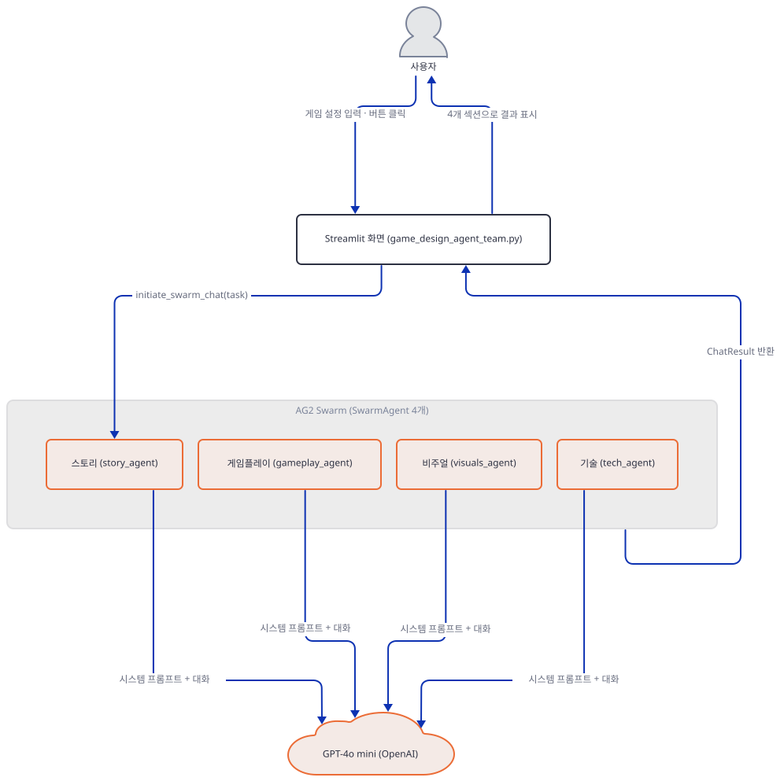

**확인.** 직접 확인한 출력. 서버 터미널의 기록은 이렇습니다.

```text
1 tool_choice: update_story_overview | tools: 1 | messages: 2
2 tool_choice: update_gameplay_overview | tools: 1 | messages: 4
3 tool_choice: update_visuals_overview | tools: 1 | messages: 6
4 tool_choice: update_tech_overview | tools: 1 | messages: 8
5 tool_choice: None | tools: 0 | messages: 10
6 tool_choice: None | tools: 0 | messages: 11
7 tool_choice: None | tools: 0 | messages: 12
8 tool_choice: None | tools: 0 | messages: 13
```

`drive.py`의 출력은 이렇습니다(`missing ScriptRunContext` 경고 한 줄은 무시해도 됩니다).

```text
exception: []
sidebar: ['Story overview: fake update_story_overview #1', 'Gameplay overview: fake update_gameplay_overview #2', 'Visuals overview: fake update_visuals_overview #3', 'Tech overview: fake update_tech_overview #4']
Story Design -> ['## Story Design (fake body, call #5)']
Gameplay Mechanics -> ['## Gameplay Design (fake body, call #6)']
Visual and Audio Design -> ['## Visuals Design (fake body, call #7)']
Technical Recommendations -> ['## Tech Design (fake body, call #8)']
```

호출은 정확히 8번입니다. 요약 넷(1~4번)이 먼저 끝난 뒤에야 본문 넷(5~8번)이 시작하고, 본문 단계에서는 `tools`가 0개입니다. 요청마다 메시지 수가 2, 4, 6, 8, 10, 11, 12, 13으로 쌓이는데, 211~213행이 기록을 첫 메시지 하나로 자른다고 했던 것과 달리 본문 호출에서도 줄지 않습니다(Step 6의 설명). 같은 폴더에서 `.cache/41/cache.db`가 생겼는지, 그 안에 무엇이 있는지도 봅니다.

```bash
uv run --no-project python -X utf8 -c "
import sqlite3
c = sqlite3.connect('.cache/41/cache.db')
print('캐시 행:', c.execute('select count(*) from Cache').fetchone()[0])
print('입력 문구가 든 행:', c.execute(\"select count(*) from Cache where key like '%Epic fantasy with dragons%'\").fetchone()[0])
"
```

```text
캐시 행: 8
입력 문구가 든 행: 8
```

`llm_config`에 `cache_seed`가 없어 AG2는 기본값 41로 디스크 캐시를 켭니다(`autogen` 0.7.3 `oai/client.py`의 `LEGACY_DEFAULT_CACHE_SEED = 41`로 확인). 호출 여덟 번이 모두 한 행씩 저장되고, 각 행의 key에 시스템 프롬프트와 대화가 통째로 들어갑니다. 그 안에 "Background Vibe: Epic fantasy with dragons" 같은 입력 문구가 있습니다. 서버를 끈 채로 `drive.py`를 같은 폴더에서 다시 돌려도 오류 없이 같은 결과가 나옵니다. 모델을 다시 부르지 않고 캐시로 답하기 때문입니다(직접 확인). 새 요청을 보고 싶으면 폴더와 서버를 새로 만드세요. 8개 행을 시스템 프롬프트로 가르면 에이전트마다 2행씩입니다(직접 확인). 아래 그림이 그 구조입니다.

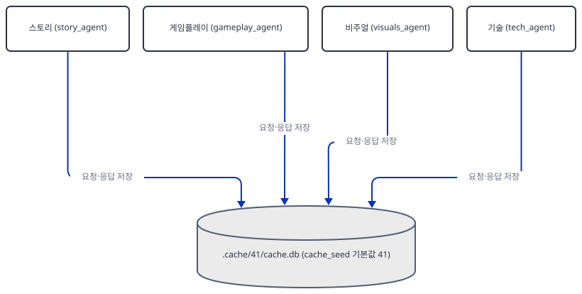

### Step 8. 결과 표시와 `max_rounds=13`

**목적.** `initiate_swarm_chat`의 결과에서 네 절을 어떻게 꺼내는지, 그리고 13이 왜 정확한 값인지 확인합니다.

**할 일.**

`advanced_ai_agents/multi_agent_apps/agent_teams/ai_game_design_agent_team/game_design_agent_team.py:267-289`

```python
            # Update session state with the individual responses
            st.session_state.output = {
                'story': result.chat_history[-4]['content'],
                'gameplay': result.chat_history[-3]['content'],
                'visuals': result.chat_history[-2]['content'],
                'tech': result.chat_history[-1]['content']
            }

        # Display success message after completion
        st.success('✨ Game concept generated successfully!')

        # Display the individual outputs in expanders
        with st.expander("Story Design"):
            st.markdown(st.session_state.output['story'])

        with st.expander("Gameplay Mechanics"):
            st.markdown(st.session_state.output['gameplay'])

        with st.expander("Visual and Audio Design"):
            st.markdown(st.session_state.output['visuals'])

        with st.expander("Technical Recommendations"):
            st.markdown(st.session_state.output['tech'])
```

`chat_history`의 **마지막 네 메시지**가 스토리·게임플레이·비주얼·기술의 본문 순서라고 가정하고 인덱스(-4~-1)로 꺼냅니다. 이 가정이 맞으려면 대화가 본문 한 바퀴의 끝에서 멈춰야 합니다. 세어 보면 시작 메시지 하나, 요약 넷이 각자 도구 호출과 실행 결과로 둘씩 여덟, 본문 넷이니 9 + 4 = 13입니다. 그래서 `max_rounds=13`은 "넉넉한 값"이 아니라 본문 한 바퀴가 끝나는 값입니다. 일반식은 본문 바퀴 수를 k라 할 때 `9 + 4k`입니다. 앱에는 `try/except`가 없어서 이 가정이 어긋나 `IndexError`가 나거나 API 요청이 실패하면 Streamlit의 오류 화면이 그대로 뜹니다(소스로 확인. 실제로 실패시켜 보지는 않았습니다).

12와 14로 바꿔 돌린 결과입니다. 사본에서만 바꿨고 매번 새 폴더와 새 서버를 썼습니다(같은 폴더를 쓰면 Step 7의 캐시가 이전 응답을 돌려줍니다). 새 폴더 `play12`에 Step 7의 파일 셋(`fake_openai.py`, `drive.py`, 앱 사본)을 넣고, 다른 터미널에서 새 포트로 서버를 띄운 뒤 `drive.py`에 인자를 줍니다(14는 `play14`에서 같은 방법으로).

```bash
mkdir ../play12
cp fake_openai.py drive.py game_design_agent_team.py ../play12/
cd ../play12
uv run --no-project python fake_openai.py 51912
```

```bash
export OPENAI_BASE_URL=http://127.0.0.1:51912/v1
uv run --no-project python -X utf8 -W ignore drive.py 12
```

```text
max_rounds=12 → 호출 7회. 화면 = (빈 문자열) / Story(#5) / Gameplay(#6) / Visuals(#7). 기술 본문이 빠지고 한 칸씩 밀림
max_rounds=13 → 호출 8회. 화면 = Story(#5) / Gameplay(#6) / Visuals(#7) / Tech(#8). 정확히 맞음
max_rounds=14 → 호출 9회. 화면 = Gameplay(#6) / Visuals(#7) / Tech(#8) / Story(#9). 한 칸씩 밀림
```

14에서는 아홉 번째 호출(스토리가 본문을 한 번 더 씀)의 메시지 수가 13이 아니라 6이었습니다. Step 6에서 말한 "잘린 기록이 효과를 내는 경우"입니다(직접 확인). 앱을 실제로 띄우는 명령은 앱 폴더에서 이렇습니다.

```bash
uv run --no-project streamlit run game_design_agent_team.py
```

확인용으로 헤드리스 실행만 해 본다면 외부 IP 조회 요청을 막으려고 `--server.address`를 함께 붙입니다(Day 060, Day 085 참고). 아래는 Streamlit 1.41.1에서 확인한 형태입니다.

```bash
uv run --no-project streamlit run game_design_agent_team.py --server.headless true --server.address localhost --server.port 8765 --browser.gatherUsageStats false
curl http://localhost:8765/_stcore/health
```

직접 확인한 출력은 `ok`였습니다. 시작 로그에는 `URL: http://localhost:8765`가 나왔습니다.


**확인.** 위 명령(`drive.py 12`, 그리고 `play14`에서 `drive.py 14`)의 기대 출력은 위의 요약 블록입니다. 12는 서버 기록이 7줄이고 expander가 `'' / #5 / #6 / #7`, 14는 9줄이고 `#6 / #7 / #8 / #9`이며 마지막 줄의 `messages`가 6입니다. 인자 없이 돌린 `max_rounds=13`(Step 7 출력)에서는 네 expander에 본문이 스토리·게임플레이·비주얼·기술 순서로 들어갔습니다. 키 없이 버튼을 누르면 Step 4의 오류 상자만 뜹니다.

## 요청 한 건이 흐르는 과정

한 번의 요청은 두 구간입니다. **요약 구간**에서는 에이전트 넷이 차례로 요약 하나씩을 내고 사이드바에 보여 주며 `SwarmResult`로 다음에게 넘깁니다. 그다음 **본문 구간**에서는 같은 순서로 한 바퀴를 돌며 본문을 쓰고 `AFTER_WORK`로 넘기다가 기술 에이전트에서 `max_rounds=13`이 다 차 `initiate_swarm_chat`이 끝납니다. 호출 8회와 그 순서는 Step 7에서 가짜 서버로 직접 확인했습니다. 에이전트 턴마다 모델 쪽 수명선이 이관 메시지의 라벨을 가로지르는 문제가 있어, 앱의 실제 시간 경계인 에이전트 턴 하나하나로 나눠 그렸습니다. 메시지는 하나도 지우지 않았고 코드 순서 그대로 아홉 장에 나뉘어 있습니다(전체를 한 장에 그리면 1871×2930으로 상한을 크게 넘었습니다).

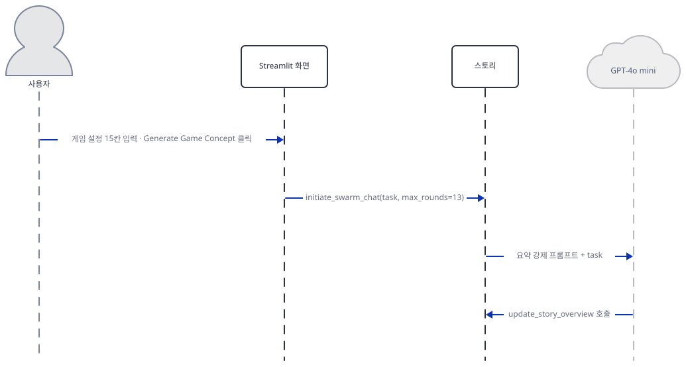

1번은 버튼 클릭부터 스토리 에이전트가 모델에서 `update_story_overview` 호출을 받기까지입니다. 화면이 `initiate_swarm_chat(task, max_rounds=13)`으로 스웜을 시작시키고, 스토리 에이전트는 훅이 만든 요약 강제 프롬프트와 `task`를 모델에 보냅니다.

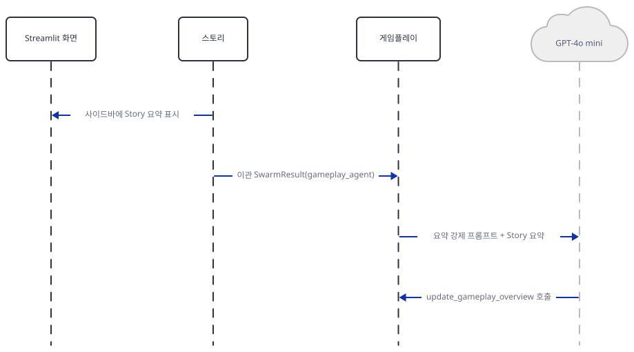 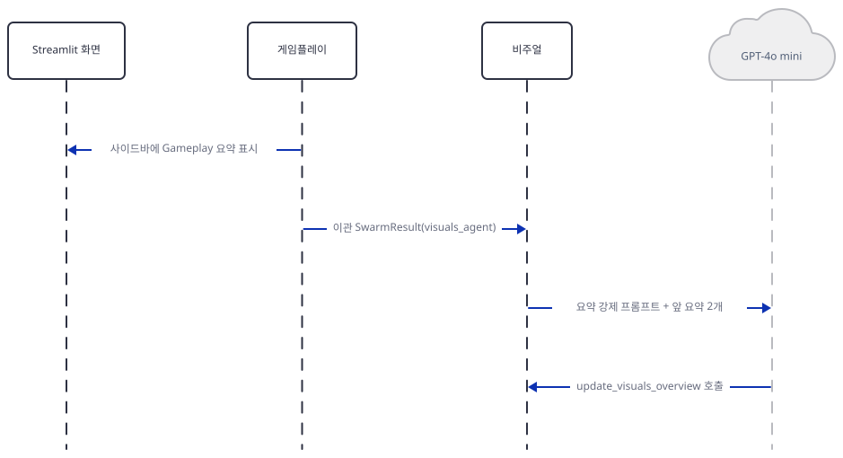 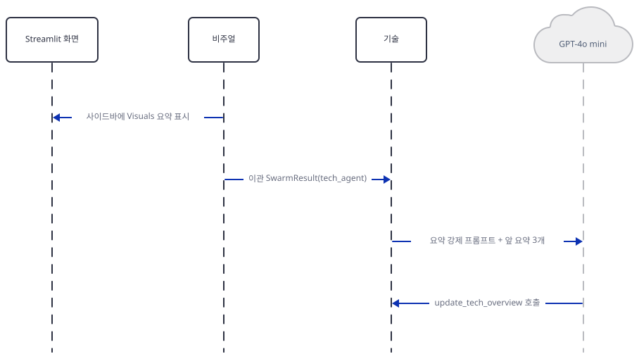

2~4번은 같은 모양입니다. 앞 에이전트의 요약이 사이드바에 뜨고, `SwarmResult`로 다음 에이전트가 열리고, 그 에이전트가 앞선 요약들을 시스템 프롬프트에 이어 붙여 모델에서 자기 요약 함수 호출을 받습니다. 이 구간의 이관은 모두 `SwarmResult`입니다.

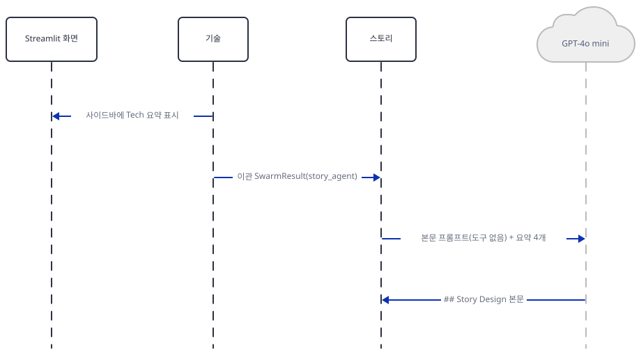 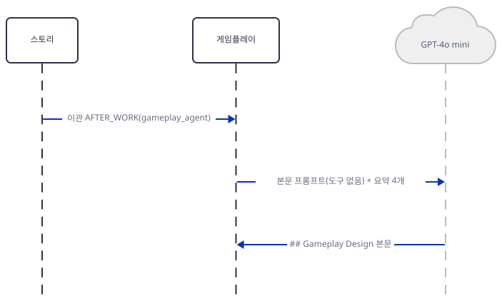 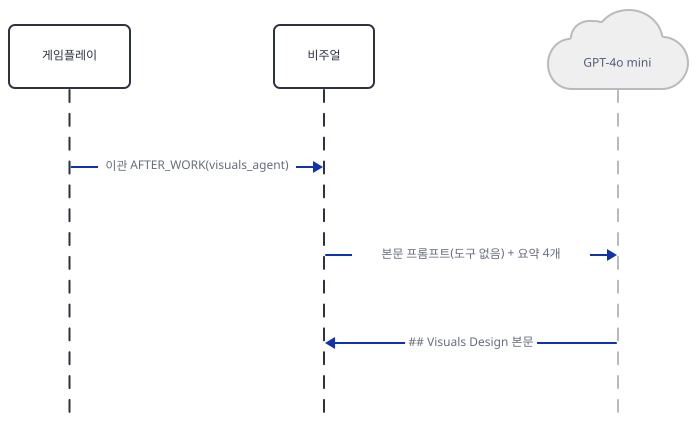 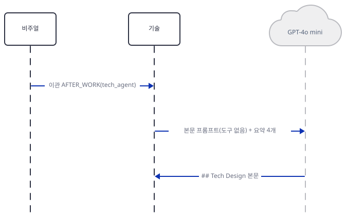

5번은 기술의 요약이 사이드바에 뜬 뒤 `SwarmResult(story_agent)`로 순환이 한 바퀴 돌아와 스토리가 본문을 쓰는 지점입니다. 이제 요약 넷이 모두 모였으므로 시스템 프롬프트에 네 요약이 다 붙고 도구는 없습니다. 6~8번은 `AFTER_WORK`로 이관되며 게임플레이·비주얼·기술이 본문을 씁니다. 함수 호출이 없으니 다음 에이전트를 Step 7에서 등록한 기본값이 정합니다.

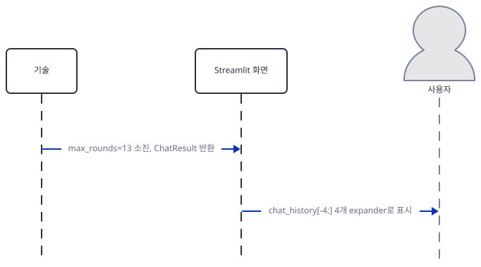

9번은 `max_rounds=13`이 다 차서 `initiate_swarm_chat`이 `ChatResult`를 돌려주고, 화면이 `chat_history[-4:]`를 expander 넷으로 보여 주는 마무리입니다. 아홉 장 모두 메시지의 존재·순서와 어떤 함수가 불리는지는 가짜 서버로 직접 확인했고, 진짜 모델이 쓰는 문장은 확인하지 못했습니다. 아래 그림들은 순서가 아니라 구조입니다. 먼저 요약 도구 함수 넷(Step 4)의 관계입니다. 에이전트가 요약 턴에 함수를 부르고, 함수가 `st.sidebar.success`로 사이드바에 요약을 쓰고, `SwarmResult`로 다음 에이전트를 정합니다(128~150행).

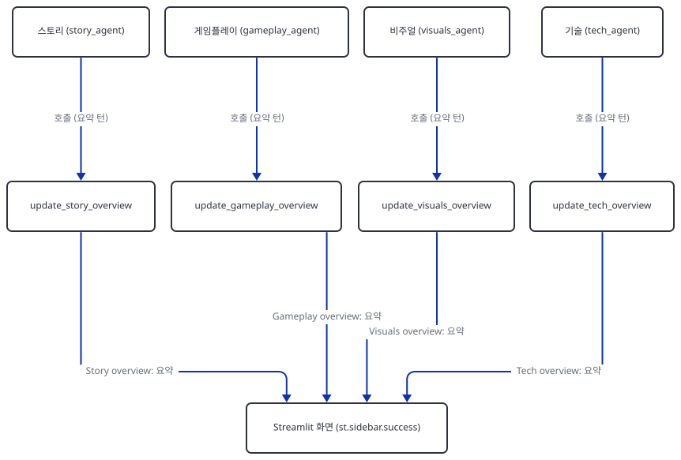

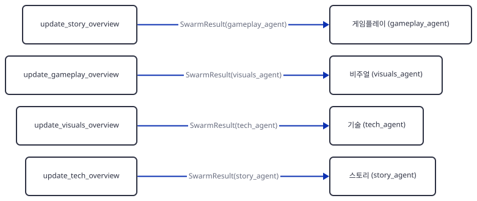

그리고 본문 구간의 순환입니다. `register_hand_off(AFTER_WORK(...))`가 만드는 고리이고, 요약 구간의 이관은 위 그림의 `SwarmResult`가 맡습니다(Step 7).

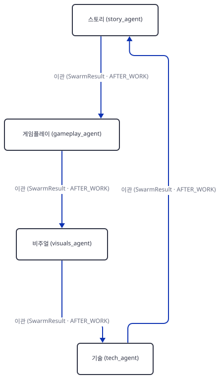

## 실행 체크리스트

- [ ] `requirements.txt`를 그대로 설치하면 `autogen` 0.14.1이 깔리고 앱의 import가 `ImportError: cannot import name 'SwarmAgent'`로 실패하는 것을 확인했다
- [ ] `autogen==0.7.3`으로 고정하면 import와 컴파일이 모두 성공하고, 0.7.4부터는 `register_hand_off`에서 막히는 것을 확인했다
- [ ] `AppTest`로 첫 화면이 예외 없이 뜨고, 위젯 수(selectbox 6·multiselect 3·text_area 2 등)가 맞는 것을 확인했다
- [ ] 키 없이 버튼을 누르면 "Please enter your OpenAI API key." 오류만 뜨는 것을 확인했다
- [ ] 훅이 요약 단계에서는 `tool_choice`를 강제하고 본문 단계에서는 `tools`를 걷어 내는 것을 `hookcheck.py`로 확인했다
- [ ] 가짜 서버로 호출 8회(요약 4 → 본문 4)와 네 expander의 순서를 확인했다
- [ ] 작업 폴더에 `.cache/41/cache.db`가 생기고 입력 문구가 저장되는 것을 확인했다
- [ ] `max_rounds`를 12·14로 바꾸면 화면이 한 칸씩 밀리고 13만 정확히 맞는 것을 확인했다
- [ ] (키가 있다면) 실제로 실행해 사이드바 요약 넷이 먼저 뜨고, 네 절의 본문이 순서대로 expander에 들어가는지 확인했다

## 문제 해결

| 증상 | 원인 | 해결 |
|---|---|---|
| 앱이 뜨자마자 `ImportError: cannot import name 'SwarmAgent' from 'autogen'`(직접 확인) | `requirements.txt`의 `autogen`에 버전이 없어 오늘 0.14.1이 깔리고, 이 버전(과 0.9 이상 여러 버전)에는 Swarm API가 없음 | `uv pip install "autogen==0.7.3"`으로 고정(리포 코드는 고치지 않음) |
| `AttributeError: 'SwarmAgent' object has no attribute 'register_hand_off'`(직접 확인, 0.7.4) | 0.7.4부터 `register_hand_off`가 인스턴스 메서드에서 빠짐(Day 085와 같은 경계) | 0.7.3 이하로 고정 |
| `ImportError: Module 'openai' needed ...`(직접 확인, 0.7.6) | 이 버전은 `openai`를 같이 설치하지 않음 | 0.7.3을 쓰면 `openai`가 함께 깔림 |
| Windows에서 `UnicodeEncodeError: 'cp949' codec can't encode character`(직접 확인) | 확인 스크립트가 `✨` 같은 글자를 cp949 콘솔에 찍음 | `python -X utf8`로 실행 |
| 앱을 돌린 폴더에 `.cache/41/cache.db`가 생기고, 같은 입력을 다시 보내면 새 요청이 안 나감(직접 확인) | `llm_config`에 `cache_seed`가 없어 AG2 기본값(41)으로 디스크 캐시가 켜짐. 입력 문구가 포함된 요청 전체가 SQLite에 남음 | `.cache/`를 지우거나 `llm_config`에 `"cache_seed": None`을 추가(리포 코드는 고치지 않으므로 "더 해보기") |
| expander 네 칸의 내용이 한 칸씩 밀리거나 비어 있음(직접 확인, `max_rounds` 12·14) | `chat_history[-4:]`는 본문 한 바퀴가 끝에 있어야 맞음. 대화 길이가 `9 + 4k`일 때만 맞음 | `max_rounds=13` 그대로 둠 |
| 앱 자체 README의 "Task Agent"와 `initiate_chat()` 설명이 코드와 다름 | 코드에는 에이전트가 넷뿐이고 `initiate_swarm_chat`을 부름(소스로 확인) | 무시해도 됨 |
| 잘못된 키나 네트워크 오류에서 Streamlit 오류 화면이 뜸 | `try/except`가 없음(소스로 확인, 실제로 실패시켜 보지는 않음) | 키를 확인. 오류를 화면에 정리하려면 직접 감싸야 함 |
| 가짜 서버가 `PermissionError: [WinError 10013]`로 죽음 | 고른 포트가 Windows의 TCP 제외 포트 범위(Hyper-V·WSL 등이 잡음)에 걸림. 이 PC는 50000~50059, 58626~58925, 60635~60734, 61196~61395 같은 범위가 제외였음(리뷰 재현 기준) | `netsh interface ipv4 show excludedportrange protocol=tcp`로 범위를 보고 그 밖의 포트를 고름 |
| `streamlit run`을 헤드리스로 띄우면 시작 중 외부 IP 조회 요청이 나갈 수 있음 | `--server.address`를 안 주면 Streamlit이 외부 IP를 알아내려 `checkip.amazonaws.com`에 요청(Day 060) | `--server.headless true --server.address localhost` 지정 |
| 확인 스크립트에서 `missing ScriptRunContext!` 경고 | `AppTest`를 Streamlit 서버 밖에서 부름 | 무시해도 됨(직접 확인) |

## 더 해보기

- 사본에서 `llm_config`에 `"cache_seed": None`을 넣고 Step 7을 다시 돌려, `.cache/`가 더는 생기지 않는지와 같은 입력에도 매번 새 요청이 나가는지 확인해 보기
- 대화 길이가 `9 + 4k`라는 식이 맞는지 `max_rounds=17`(본문 두 바퀴)로 예측한 뒤 가짜 서버로 확인해 보기. 이때 둘째 바퀴의 메시지 수가 Step 8의 14 실험처럼 줄어드는지도 보기
- 최신 `autogen`(0.14.1)에서 `from autogen.agentchat import initiate_group_chat`과 `from autogen.agentchat.group import AgentTarget`이 import되는 것은 확인했습니다. 이 앱의 4단 순환을 그쪽 API로 옮기는 설계만 해 보기(포팅은 해 보지 않았습니다)

## 다음 날 예고

[Day 117 · 🧲 AI Competitor Intelligence Agent Team](../day117-ai-competitor-intelligence-agent-team/README.md) — Perplexity(또는 Exa)로 경쟁사 주소를 찾고 Firecrawl `extract`로 정보를 뽑아, agno 에이전트(`gpt-4o`)가 보고서를 쓰는 Streamlit 앱입니다.
