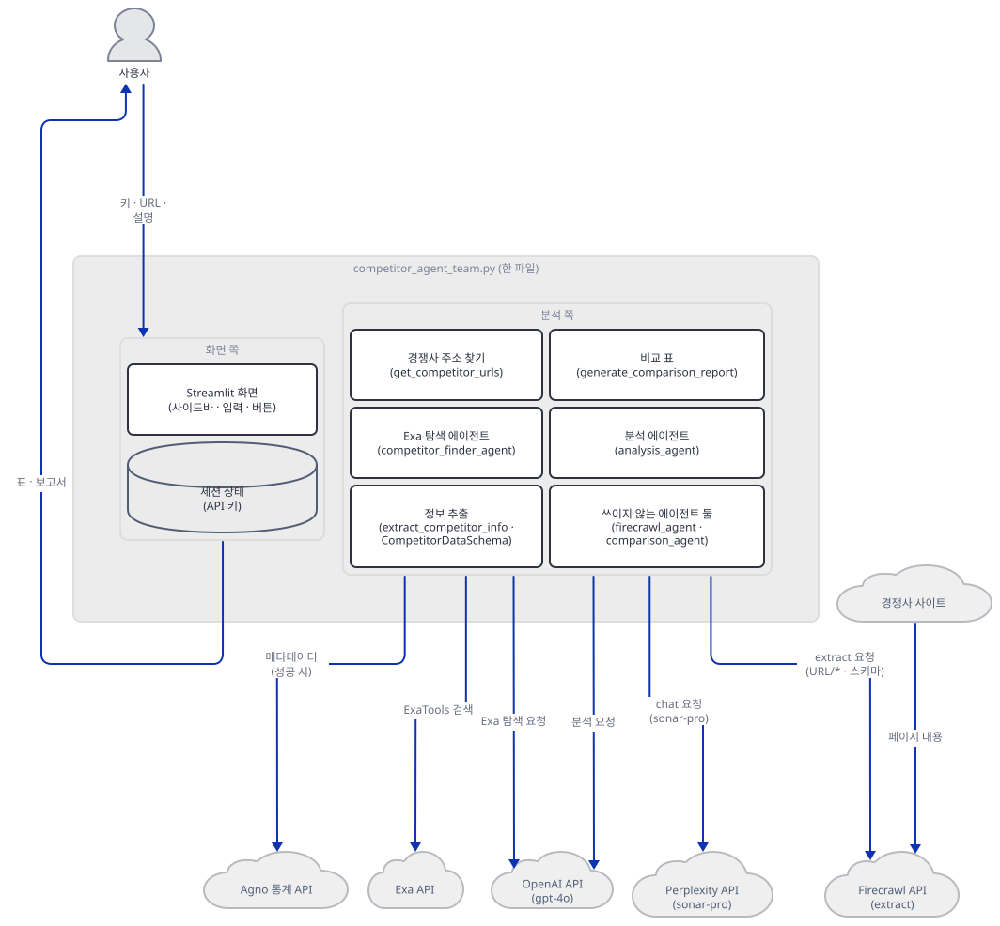
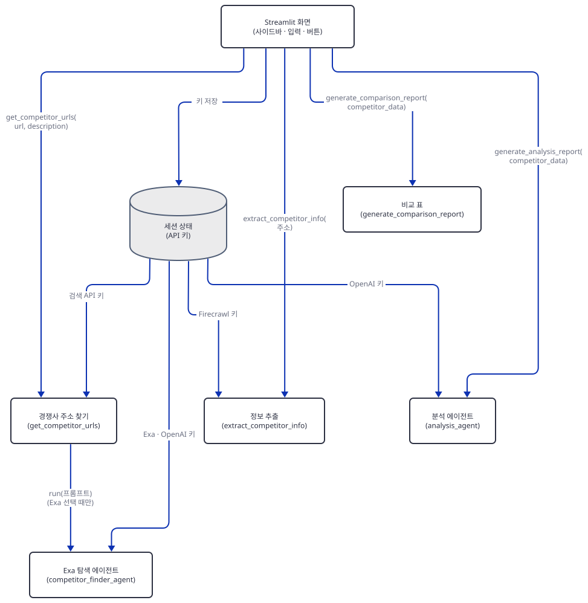
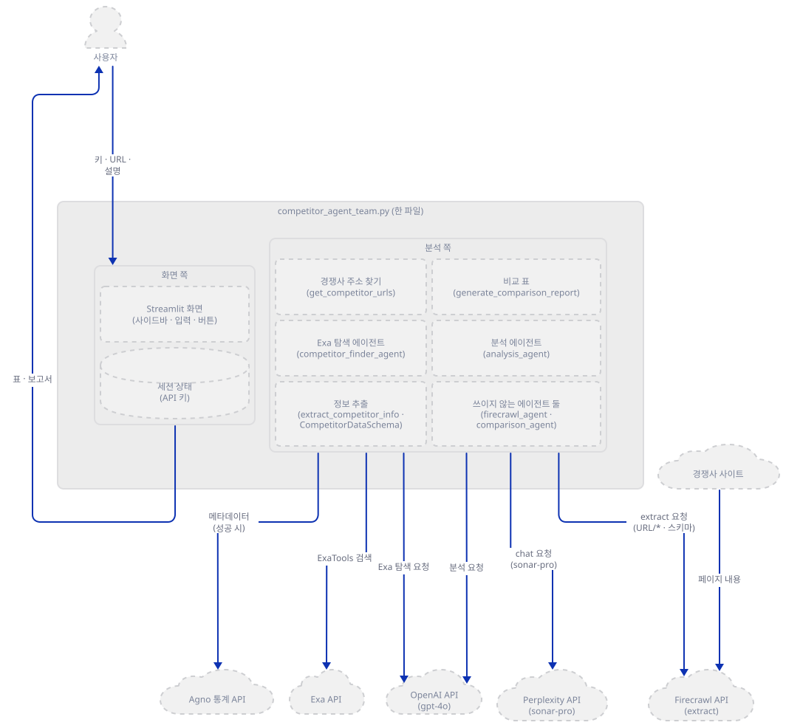
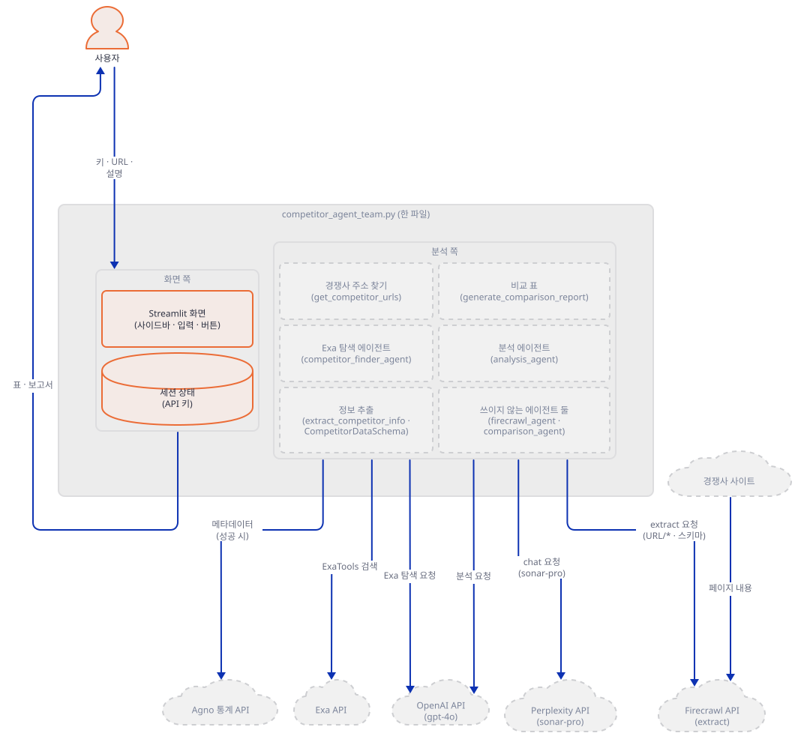
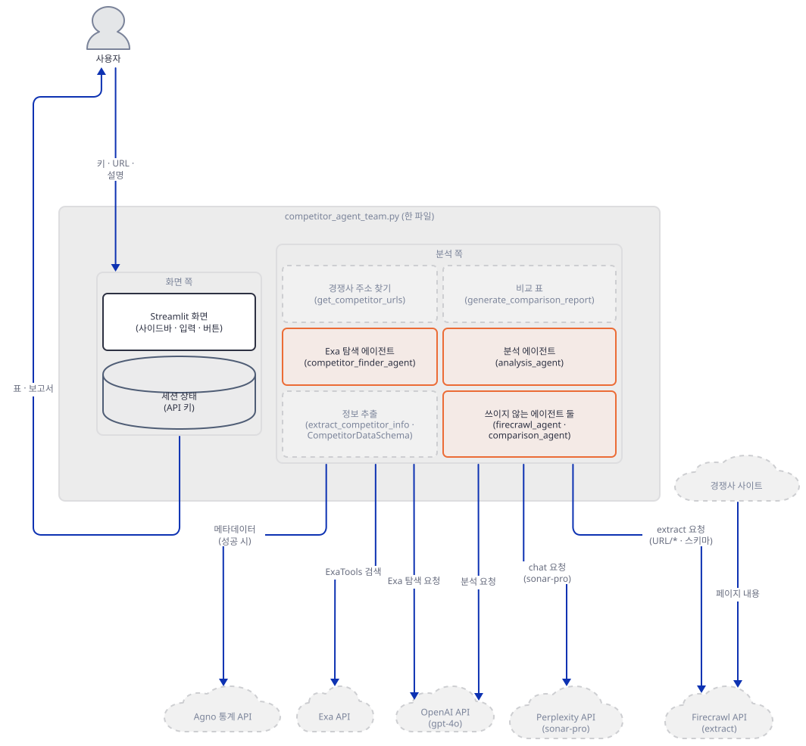
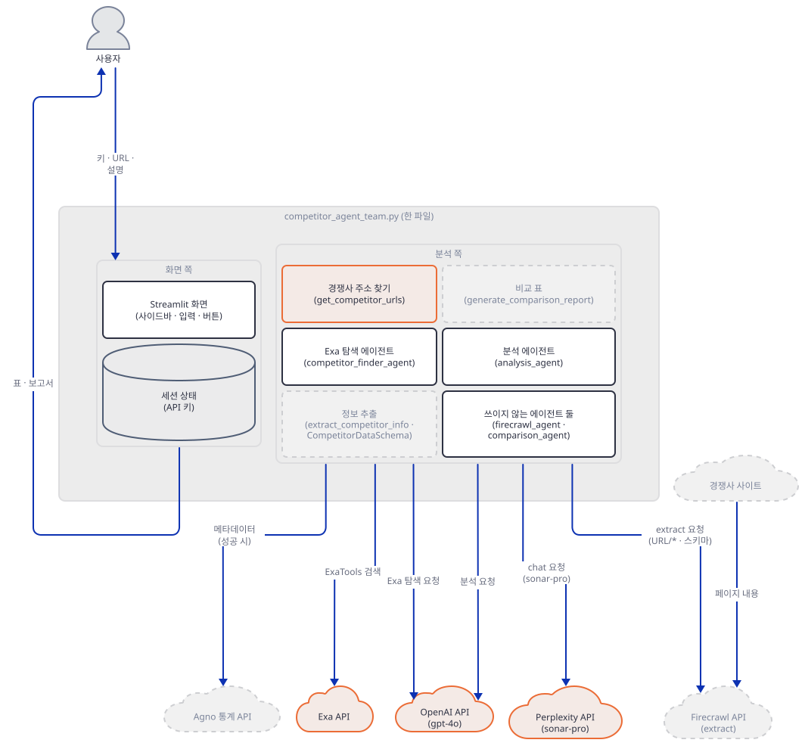
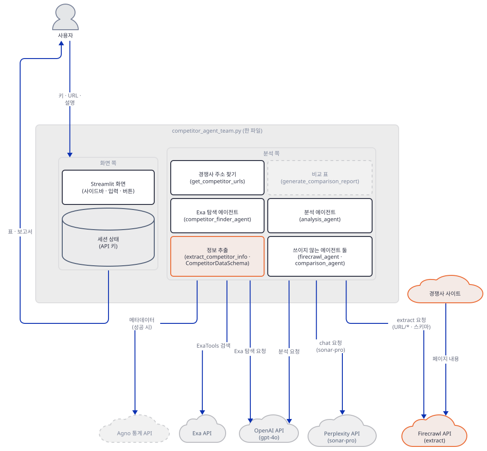
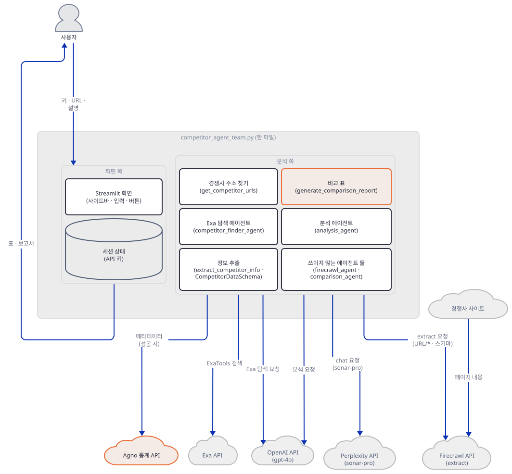
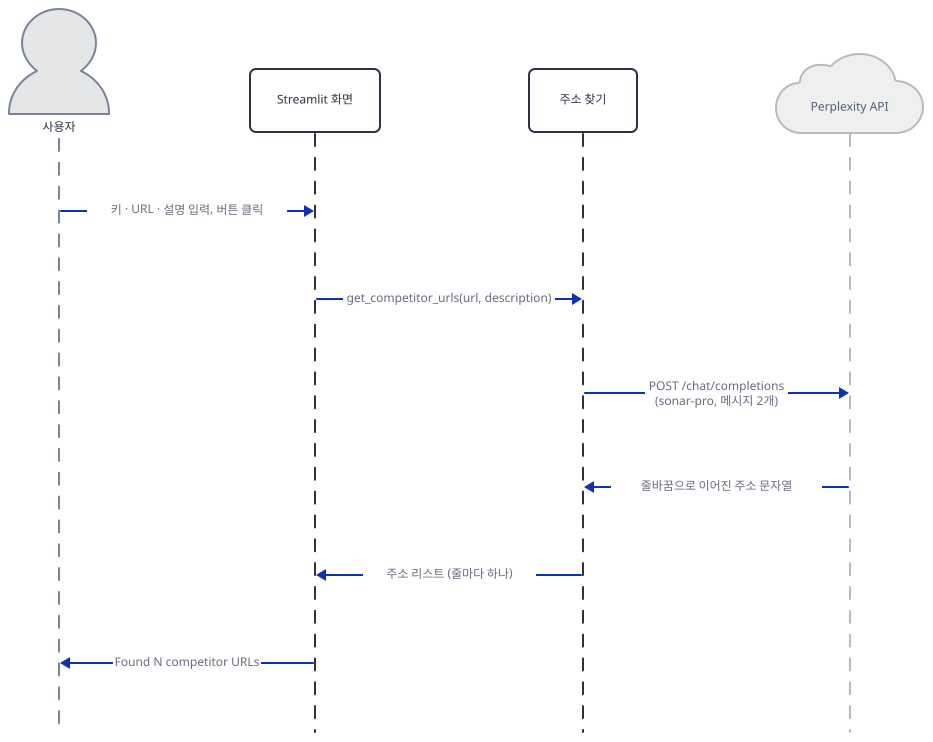
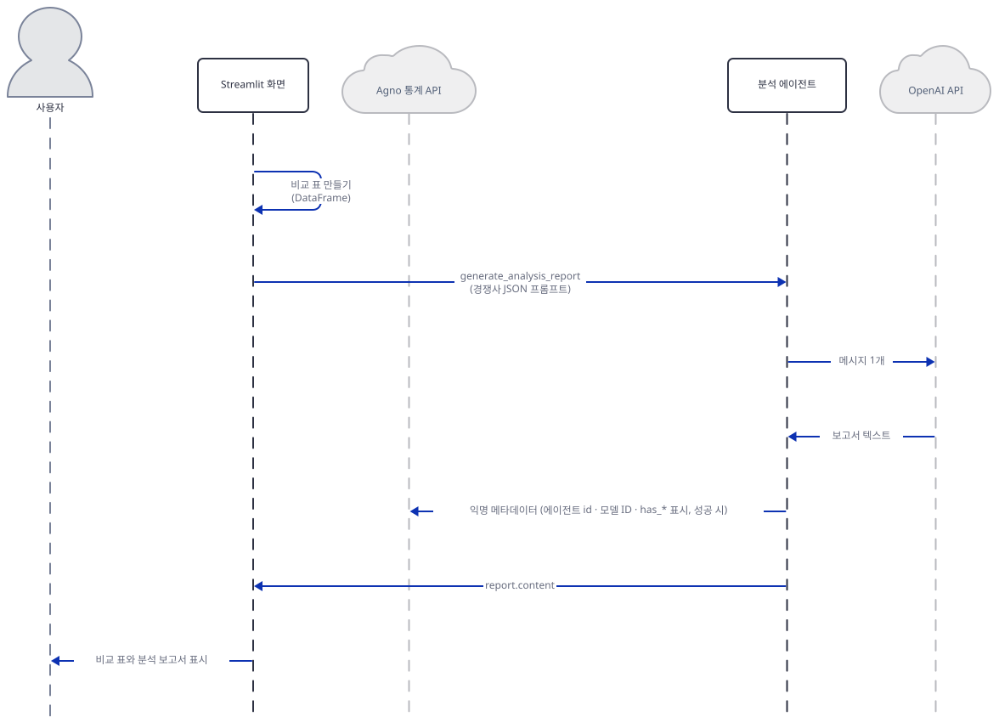

# Day 117 · 🧲 AI Competitor Intelligence Agent Team

> 볼륨 8 🤝 Multi-agent Teams · 난이도 ★★☆ · 예상 소요 120분(앱은 343줄이지만 설치부터 막히는 곳이 셋이고, Step 4에서 가짜 서버와 구동 스크립트를 직접 저장해 터미널 둘로 시나리오를 여러 번 돌려 봐야 해서 읽는 시간보다 손으로 돌려 보는 시간이 더 걸립니다) · API 비용 대략 확인하지 못함(⚠ 이 문서는 어떤 서비스도 실제로 부르지 않았고 이 앱은 오늘 그대로는 화면이 뜨기 전에 죽습니다. 추정만 적습니다. 질문 1건에 OpenAI `gpt-4o`는 입력 $2.5·출력 $10(1M 토큰당, https://developers.openai.com/api/docs/models/gpt-4o, 2026-10-05 확인)이고 경쟁사 셋의 JSON과 지시문이 입력 1,500토큰 안팎, 보고서가 `max_tokens` 제한 없는 여섯 항목 답이라 출력 1,000~1,500토큰으로 어림해 약 $0.02입니다. Perplexity `sonar-pro`는 입력 $3·출력 $15(1M 토큰당)에 요청 수수료가 검색 맥락 크기에 따라 1,000건당 $6·$10·$14이고(https://docs.perplexity.ai/getting-started/models, 2026-10-09 확인, 조회 도구의 요약이라 원문과 한 글자씩 대조하지는 못했습니다) 요청 하나가 짧아 수수료가 대부분이니 약 $0.01입니다. Firecrawl은 `extract`가 크레딧을 쓰고 한 크레딧이 15토큰이라고 문서가 적지만(https://docs.firecrawl.dev/features/extract, 같은 날 확인) 이 앱의 경쟁사 하나가 몇 토큰인지는 확인하지 못했습니다) · 원본 앱: `advanced_ai_agents/multi_agent_apps/agent_teams/ai_competitor_intelligence_agent_team`

## 오늘 만들 것

회사 URL이나 설명을 적고 버튼을 누르면 경쟁사 주소 세 개를 찾고, 주소마다 Firecrawl로 가격·기능·기술 스택·마케팅·고객 후기를 구조화해 뽑아 비교 표를 그린 뒤, `gpt-4o`가 "우리가 파고들 틈"을 보고서로 써 주는 Streamlit 앱입니다. `competitor_agent_team.py` 한 파일(편집기 기준 343줄, 마지막 줄에 개행이 없어 `wc -l`은 342)에 전부 들어 있습니다. 필요한 키는 OpenAI, Firecrawl, 그리고 주소를 찾는 서비스 하나(Perplexity 또는 Exa)입니다.

폴더 이름은 `agent_teams`이고 앱 README는 에이전트 셋(Firecrawl, Analysis, Comparison)의 "Multi-agent System"이라고 소개하지만(`advanced_ai_agents/multi_agent_apps/agent_teams/ai_competitor_intelligence_agent_team/README.md:11-14`), 코드에는 agno `Team`이 없고(`Team(`이 한 번도 나오지 않음, grep으로 확인) 에이전트 넷 가운데 실제로 `run`이 불리는 것은 분석 에이전트 하나뿐이고(Exa를 고르면 탐색 에이전트가 하나 더) 에이전트를 넷 만드는 것도 Exa를 고를 때뿐입니다. 도구를 단 `firecrawl_agent`와 `comparison_agent`는 만들어지기만 하고 어디서도 쓰이지 않습니다(Step 3). 비교 표는 모델 없이 pandas가 그립니다(Step 6). `Team`을 가장 작게 만나는 날은 이 볼륨을 연 Day 112이고, Day 114는 `Team` 없이 에이전트 셋을 버튼 핸들러가 차례로 부르는 앱이었습니다.

⚠ 오늘 `requirements.txt`를 그대로 설치하면 앱은 화면이 뜨기 전에 막힙니다. 막히는 곳이 셋이고 설치만으로는 풀리지 않는 것이 하나 더 있습니다. 첫째, `exa-py`·`ddgs`가 requirements에 없어 첫 import에서 `ImportError`가 납니다(Step 1). 둘째, 고정된 `firecrawl-py==1.9.0`에는 agno의 `FirecrawlTools`가 가져오는 `firecrawl.types`가 없고, 앱이 부르는 `extract(..., prompt=..., schema=...)`도 1.9.0은 받지 않습니다. 그래서 이 고정은 풀어야 하고 오늘은 4.50.0이 깔립니다(Step 1). 셋째, 그렇게 풀고 키 셋을 넣으면 70행 `FirecrawlTools(api_key=..., scrape=False, crawl=True, limit=5)`가 `TypeError: Toolkit.__init__() got an unexpected keyword argument 'scrape'`로 죽습니다. agno의 이 인자 이름은 `enable_scrape`·`enable_crawl`이고, 요구 하한인 2.2.10부터 3.1.0까지 열 개 버전의 소스에서 모두 그랬습니다(소스로 확인, Step 3). 앱 코드를 고치지 않는 이 시리즈의 원칙대로 이 문서는 70~75행만 `enable_*` 이름으로 바꿔 끼운 대역을 구동 스크립트에서 걸어 나머지를 돌렸습니다. 그 밖에 짚을 점이 넷 있습니다. 어떤 이유로 추출이 실패해도 화면에는 똑같이 "Failed to analyze"만 나옵니다(Step 5). Perplexity 답의 줄을 하나하나 주소로 믿어서 안내 문장이 한 줄 섞이면 그 줄로도 Firecrawl 요청이 나갑니다(Step 4). 에이전트 셋을 화면을 다시 그릴 때마다 새로 만듭니다(Step 3). Firecrawl의 `extract`는 SDK가 "유지보수 모드, 사용을 권하지 않음"이라고 경고를 다는 엔드포인트입니다(Step 5).

이 문서는 OpenAI·Perplexity·Exa·Firecrawl·DuckDuckGo·agno 통계 서버 어디에도 요청을 보내지 않았고, 서비스는 모두 내 PC의 가짜 서버나 대역으로 확인했습니다. 그래서 아래 보고서 문장과 추출 결과는 전부 가짜 서버의 고정 값이고, 진짜 서비스가 이 프롬프트에 어떻게 답하는지는 확인하지 못했습니다. 아래는 완성된 아키텍처입니다.



## 사전 준비

| 서비스/도구 | 용도 | 발급·설치 |
|---|---|---|
| uv | 가상환경 생성과 패키지 설치 | [공통 사전 준비](../README.md#공통-사전-준비-한-번만) 절 참고 |
| Python | 이 문서는 3.13.3으로 확인했다. 저장소 기준은 3.11~3.13 | 공통 사전 준비와 같음 |
| OpenAI API 키 | `gpt-4o` 호출. 화면 사이드바의 비밀번호 칸에 붙여넣는다(환경변수가 아님, `advanced_ai_agents/multi_agent_apps/agent_teams/ai_competitor_intelligence_agent_team/competitor_agent_team.py:20`) | https://platform.openai.com/api-keys |
| Firecrawl API 키 | 경쟁사 사이트 추출. 같은 사이드바의 칸(`advanced_ai_agents/multi_agent_apps/agent_teams/ai_competitor_intelligence_agent_team/competitor_agent_team.py:21`) | https://www.firecrawl.dev/app/api-keys |
| Perplexity API 키 또는 Exa API 키 | 경쟁사 주소를 찾는다. 사이드바 선택 상자에서 하나를 고르고 그 키 칸에 넣는다(`advanced_ai_agents/multi_agent_apps/agent_teams/ai_competitor_intelligence_agent_team/competitor_agent_team.py:24-41`). 기본은 Perplexity다 | Perplexity는 https://www.perplexity.ai/settings/api, Exa는 https://dashboard.exa.ai/api-keys(앱 README의 안내) |
| 인터넷 연결 | PyPI 설치. 앱을 실제로 쓸 때는 OpenAI, Perplexity(또는 Exa), Firecrawl, agno 사용 통계 서버(`os-api.agno.com`)에 접속하고 Firecrawl 서버가 경쟁사 사이트를 읽는다. 브라우저로 열면 Streamlit의 사용 통계도 나간다(Day 054가 확인했고 `--browser.gatherUsageStats false`로 끈다) | 별도 설치 없음 |

이 문서의 확인 스크립트는 한글을 출력합니다. 한국어 Windows에서 출력을 파이프나 파일로 받으면 기본 인코딩(`cp949`)이 모자랄 수 있으니 셸을 먼저 이렇게 맞춰 두세요(Day 105와 같은 처방이고, 이 문서에서 이 설정 없이 돌려 보지는 않았습니다).

```bash
export PYTHONIOENCODING=utf-8
```

```powershell
$env:PYTHONIOENCODING = "utf-8"
```

## 아키텍처 한눈에 보기

| 컴포넌트 | 역할 | 코드 위치 |
|---|---|---|
| 사용자 | 키·회사 URL·설명 입력, 검색 엔진 선택, 버튼 클릭 | 코드 없음 (브라우저) |
| Streamlit 화면 | 사이드바 키 칸과 검색 엔진 선택, 입력 두 칸, 버튼, 진행 표시, 결과 출력 | `advanced_ai_agents/multi_agent_apps/agent_teams/ai_competitor_intelligence_agent_team/competitor_agent_team.py:16-63`, `advanced_ai_agents/multi_agent_apps/agent_teams/ai_competitor_intelligence_agent_team/competitor_agent_team.py:295-343` |
| 세션 상태 | 키 셋이 모두 채워졌을 때만 저장하고, 저장된 키가 있어야 아래 도구와 에이전트가 만들어진다 | `advanced_ai_agents/multi_agent_apps/agent_teams/ai_competitor_intelligence_agent_team/competitor_agent_team.py:31-48`, `advanced_ai_agents/multi_agent_apps/agent_teams/ai_competitor_intelligence_agent_team/competitor_agent_team.py:66-68` |
| 경쟁사 주소 찾기 (`get_competitor_urls`) | 엔진에 따라 Perplexity에 `requests.post`를 보내거나 Exa 탐색 에이전트를 부른다 | `advanced_ai_agents/multi_agent_apps/agent_teams/ai_competitor_intelligence_agent_team/competitor_agent_team.py:116-176` |
| Exa 탐색 에이전트 (`competitor_finder_agent`) | Exa를 선택했을 때만 만들어진다. 도구는 `ExaTools`(`category="company"`, `num_results=3`) | `advanced_ai_agents/multi_agent_apps/agent_teams/ai_competitor_intelligence_agent_team/competitor_agent_team.py:77-94` |
| 정보 추출 (`extract_competitor_info`·`CompetitorDataSchema`) | 주소 뒤에 `/*`를 붙여 Firecrawl `extract`에 스키마와 함께 넘기고, 응답을 6칸 딕셔너리로 정리한다. 실패하면 `None` | `advanced_ai_agents/multi_agent_apps/agent_teams/ai_competitor_intelligence_agent_team/competitor_agent_team.py:178-239` |
| 비교 표 (`generate_comparison_report`) | pandas `DataFrame`으로 표를 그리고 원본 JSON을 펼침 칸에 둔다. 모델을 부르지 않는다 | `advanced_ai_agents/multi_agent_apps/agent_teams/ai_competitor_intelligence_agent_team/competitor_agent_team.py:241-269` |
| 분석 에이전트 (`analysis_agent`·`generate_analysis_report`) | 경쟁사 JSON을 프롬프트에 넣어 `gpt-4o`에 묻고 보고서를 돌려받는다 | `advanced_ai_agents/multi_agent_apps/agent_teams/ai_competitor_intelligence_agent_team/competitor_agent_team.py:103-107`, `advanced_ai_agents/multi_agent_apps/agent_teams/ai_competitor_intelligence_agent_team/competitor_agent_team.py:271-293` |
| 쓰이지 않는 에이전트 둘 (`firecrawl_agent`·`comparison_agent`) | 만들어지기만 하고 `run`이 불리지 않는다. 앞의 것만 `FirecrawlTools`·`DuckDuckGoTools`를 쥔다 | `advanced_ai_agents/multi_agent_apps/agent_teams/ai_competitor_intelligence_agent_team/competitor_agent_team.py:96-101`, `advanced_ai_agents/multi_agent_apps/agent_teams/ai_competitor_intelligence_agent_team/competitor_agent_team.py:109-114` |
| Perplexity API (`sonar-pro`) | 경쟁사 주소 세 개를 줄바꿈으로 답한다 | `advanced_ai_agents/multi_agent_apps/agent_teams/ai_competitor_intelligence_agent_team/competitor_agent_team.py:121-160` |
| Exa API | Exa 선택 때 탐색 에이전트의 도구가 부른다 | 코드 없음 (외부 서비스, 도구는 79~83행) |
| Firecrawl API (`extract`) | 경쟁사 사이트를 읽고 스키마에 맞춰 뽑는다 | `advanced_ai_agents/multi_agent_apps/agent_teams/ai_competitor_intelligence_agent_team/competitor_agent_team.py:189-210` |
| OpenAI API (`gpt-4o`) | 분석 보고서(그리고 Exa 선택 때는 탐색 에이전트)의 모델 | `advanced_ai_agents/multi_agent_apps/agent_teams/ai_competitor_intelligence_agent_team/competitor_agent_team.py:85`, `advanced_ai_agents/multi_agent_apps/agent_teams/ai_competitor_intelligence_agent_team/competitor_agent_team.py:104` |
| Agno 사용 통계 API | 성공한 `run`마다 agno가 익명 메타데이터를 보내려 한다 | 코드 없음 (agno 내부) |

첫 그림은 한 파일을 화면 쪽과 분석 쪽으로 나눠 묶었고 묶음 안의 호출은 뺐습니다. 화살표는 라벨에 적은 데이터가 가는 방향이고, 사용자 화살표 둘과 경쟁사 사이트에서 Firecrawl로 가는 화살표 하나 말고는 모두 분석 쪽에서 나가는 요청입니다. 경쟁사 사이트에서 Firecrawl로 들어가는 화살표는 앱이 아니라 Firecrawl 서버가 그 페이지를 읽는다는 뜻이고, 앱이 하는 일은 주소 문자열을 넘기는 것뿐입니다(소스로 확인). 그림에서 `쓰이지 않는 에이전트 둘`은 선이 하나도 없습니다. 어떤 부품이 어떤 부품을 부르는지는 아래 그림이 보여 줍니다. 화면이 나머지 다섯 부품을 직접 부르고, 부품끼리의 호출은 `get_competitor_urls`가 Exa 탐색 에이전트를 부르는 하나뿐입니다.



## 단계별 진행

### Step 1. 환경 만들기 — 빠진 패키지 셋과 쓸 수 없는 고정

**목적.** 앱 폴더에 독립 가상환경을 만들고, 설치 직후 import가 막히는 곳을 하나씩 풀어 앱의 import 13줄이 통과하게 합니다.

**할 일.** 저장소 루트에서 시작합니다.

```bash
cd advanced_ai_agents/multi_agent_apps/agent_teams/ai_competitor_intelligence_agent_team
uv venv
uv pip install -r requirements.txt
```

(pip 대안: bash는 `python -m venv .venv && source .venv/bin/activate && pip install -r requirements.txt`입니다. PowerShell 5.1은 `&&`를 받지 않으므로 세 줄로 `python -m venv .venv`, `.venv\Scripts\Activate.ps1`, `pip install -r requirements.txt`를 차례로 씁니다. 실행해 보지 못했습니다.) 이후 `uv run`에는 모두 `--no-project`를 붙입니다. 이유는 [공통 사전 준비](../README.md#공통-사전-준비-한-번만)에 있습니다.

`advanced_ai_agents/multi_agent_apps/agent_teams/ai_competitor_intelligence_agent_team/requirements.txt:1-4`

```text
firecrawl-py==1.9.0
duckduckgo-search==7.2.1
agno>=2.2.10
streamlit==1.41.1
```

파일 끝에 개행이 없어 편집기에서는 4줄이고 `wc -l`은 3입니다. 이 문서를 만들 때(2026-10-09) Python 3.13.3에서 패키지 71개가 깔렸고 agno 3.1.2, streamlit 1.41.1, firecrawl-py 1.9.0, duckduckgo-search 7.2.1, pandas 2.3.3이 들어왔습니다(직접 확인). `agno>=2.2.10`에는 상한이 없어 오늘의 최신으로 풀립니다. `pandas`는 requirements에 없지만 Streamlit이 끌고 옵니다(설치 결과로 확인). 앱의 import 13줄을 그대로 실행하면 막히는 곳이 차례로 나옵니다.

```bash
uv run --no-project python -c "exec('\n'.join(open('competitor_agent_team.py', encoding='utf-8').read().splitlines()[:13]))"
```

(PowerShell에서는 따옴표 처리가 달라 이 한 줄을 실행해 보지 못했습니다. 같은 파이썬 코드를 파일로 저장해 돌려도 됩니다.) 설치 직후 마지막 줄은 이렇습니다(직접 확인).

```text
ImportError: `exa_py` not installed. Please install using `pip install exa_py`
```

4행의 `ExaTools`가 `exa_py`를 요구합니다. 앱 README는 `exa-py`를 필요한 패키지로 적지만(`advanced_ai_agents/multi_agent_apps/agent_teams/ai_competitor_intelligence_agent_team/README.md:37`) `requirements.txt`에는 없습니다. 검색 엔진으로 Perplexity를 쓰더라도 4행이 먼저 import하므로 필요합니다.

```bash
uv pip install exa-py
```

`exa-py` 2.25.0과 함께 `openai` 3.26.1이 들어옵니다(직접 확인, 7개 패키지). agno의 `OpenAIChat`이 `openai`를 요구하는데 `requirements.txt`에는 `openai`도 없어서, 이 앱은 우연히 `exa-py`가 끌고 오는 `openai`에 기댑니다. 같은 누락을 Day 103 Step 1이 다뤘습니다. 다시 실행하면 다음 벽이 나옵니다.

```text
ImportError: `firecrawl-py` not installed. Please install using `pip install firecrawl-py`
```

`firecrawl-py`는 설치돼 있으니 문구가 거짓입니다. 5행의 agno `FirecrawlTools`가 `from firecrawl.types import ScrapeOptions`를 하는데 1.9.0에는 `firecrawl.types`가 없어서 `ImportError`를 이 문구로 바꿔 던집니다(소스로 확인, agno 3.1.2의 `agno/tools/firecrawl.py` 8~13행). 설치된 1.9.0에 앱의 `extract` 호출이 맞는지도 따로 확인합니다. `inspect.signature`와 `bind`로 인자를 맞춰 보기만 하므로 요청은 나가지 않습니다(Day 104 Step 5가 쓴 방법입니다). 앱 폴더에 `sig.py`를 저장합니다.

`sig.py`

```python
import inspect
from firecrawl import FirecrawlApp

sig = inspect.signature(FirecrawlApp(api_key="fc-test").extract)
print(sig)
try:
    sig.bind(["https://a.example/*"], prompt="p", schema={})
    print("bind OK")
except TypeError as e:
    print("TypeError:", e)
```

```bash
uv run --no-project python sig.py
```

직접 확인한 출력입니다.

```text
(urls: List[str], params: Optional[firecrawl.firecrawl.FirecrawlApp.ExtractParams] = None) -> Any
TypeError: got an unexpected keyword argument 'prompt'
```

1.9.0의 `extract`는 `extract(urls, params)` 모양이라 앱의 206~210행 `extract([url_pattern], prompt=..., schema=...)`를 받지 않습니다. 이 고정은 Day 105가 본 `firecrawl-py==1.9.0`(그날 앱은 `params=`로 불러 맞았습니다)과 반대로 이 앱에서는 쓸 수 없는 쪽입니다. 고정을 풀어 최신으로 올립니다.

```bash
uv pip install -U firecrawl-py
```

오늘은 4.50.0이 깔렸습니다(직접 확인). 같은 `sig.py`를 다시 돌리면 출력이 이렇게 바뀝니다. 첫 줄은 뒤가 길어 앞부분만 적습니다. 4.x의 `FirecrawlApp`은 새 `Firecrawl` 클라이언트이고 그 `extract`는 `prompt`·`schema`를 키워드 인자로 받습니다(Day 104 Step 5가 4.46.2에서 같은 구조를 봤습니다).

```text
(urls: Optional[List[str]] = None, *, prompt: Optional[str] = None, schema: Optional[Dict[str, Any]] = None, s…
bind OK
```

마지막 벽은 7행입니다.

```text
ImportError: `ddgs` not installed. Please install using `pip install ddgs`
```

requirements의 `duckduckgo-search` 7.2.1은 설치돼도 agno 3.1.2가 가져오는 모듈이 아닙니다. 앱도 그 패키지를 직접 부르지 않습니다(`duckduckgo_search`가 import된 적이 없음, `sys.modules`로 확인). Day 103 Step 1이 같은 원인을 다뤘습니다.

```bash
uv pip install ddgs
```



**확인.** 같은 import 명령이 이제 아무것도 출력하지 않고 끝납니다.

```bash
uv run --no-project python -c "exec('\n'.join(open('competitor_agent_team.py', encoding='utf-8').read().splitlines()[:13]))" && echo imports OK
uv run --no-project python -m py_compile competitor_agent_team.py && echo compiled
```

```text
imports OK
compiled
```

설치한 것은 `exa-py`(openai 포함)·`firecrawl-py` 최신·`ddgs`이고, 이 문서를 만들 때 환경에는 패키지 86개가 있었습니다(`uv pip list`로 확인). 리포의 `requirements.txt`는 고치지 않습니다.

### Step 2. 사이드바와 화면의 문 — 키 셋, 검색 엔진 선택

**목적.** 키가 없으면 화면이 어디까지 그려지는지, 검색 엔진 선택이 무엇을 바꾸는지 확인합니다.

**할 일.**

`advanced_ai_agents/multi_agent_apps/agent_teams/ai_competitor_intelligence_agent_team/competitor_agent_team.py:18-39`

```python
# Sidebar for API keys
st.sidebar.title("API Keys")
openai_api_key = st.sidebar.text_input("OpenAI API Key", type="password")
firecrawl_api_key = st.sidebar.text_input("Firecrawl API Key", type="password")

# Add search engine selection before API keys
search_engine = st.sidebar.selectbox(
    "Select Search Endpoint",
    options=["Perplexity AI - Sonar Pro", "Exa AI"],
    help="Choose which AI service to use for finding competitor URLs"
)

# Show relevant API key input based on selection
if search_engine == "Perplexity AI - Sonar Pro":
    perplexity_api_key = st.sidebar.text_input("Perplexity API Key", type="password")
    # Store API keys in session state
    if openai_api_key and firecrawl_api_key and perplexity_api_key:
        st.session_state.openai_api_key = openai_api_key
        st.session_state.firecrawl_api_key = firecrawl_api_key
        st.session_state.perplexity_api_key = perplexity_api_key
    else:
        st.sidebar.warning("Please enter all required API keys to proceed.")
```

키 입력 칸은 OpenAI·Firecrawl 둘이 먼저 오고, 선택 상자에 따라 셋째 칸이 Perplexity 키 아니면 Exa 키가 됩니다(31~32행과 40~41행). 세 키가 모두 채워졌을 때만 `st.session_state`에 저장하고, 아니면 사이드바에 경고만 띄웁니다. 40~48행은 Exa 분기로 31~39행과 같은 모양입니다. 본문의 입력은 URL 한 칸과 설명 한 칸입니다.

`advanced_ai_agents/multi_agent_apps/agent_teams/ai_competitor_intelligence_agent_team/competitor_agent_team.py:62-68`

```python
url = st.text_input("Enter your company URL :")
description = st.text_area("Enter a description of your company (if URL is not available):")

# Initialize API keys and tools
if "openai_api_key" in st.session_state and "firecrawl_api_key" in st.session_state:
    if (search_engine == "Perplexity AI - Sonar Pro" and "perplexity_api_key" in st.session_state) or \
       (search_engine == "Exa AI" and "exa_api_key" in st.session_state):
```

키가 한 번 저장되면 세션 상태에서 지워지는 곳이 없습니다. 화면 아래의 에이전트 생성(Step 3)과 버튼(Step 7)은 이 세션 상태가 있는지만 봅니다. Step 3의 확인에서 키 칸을 비워 이를 확인합니다.



**확인.** 앱 폴더에 `check_gate.py`로 저장해 실행합니다. Streamlit이 브라우저 없이 스크립트를 실행하고 위젯을 코드로 조작하게 해 주는 `AppTest`를 씁니다.

`check_gate.py`

```python
from streamlit.testing.v1 import AppTest

at = AppTest.from_file("competitor_agent_team.py", default_timeout=60)
at.run()
box = at.sidebar.selectbox[0]
print("선택지:", box.options, "| 기본:", box.value)
print("처음: 입력칸", [t.label for t in at.sidebar.text_input], "| 경고", [w.value for w in at.sidebar.warning], "| 버튼", len(at.button))
box.set_value("Exa AI").run()
print("Exa 선택 뒤 입력칸:", [t.label for t in at.sidebar.text_input])
at.sidebar.selectbox[0].set_value("Perplexity AI - Sonar Pro").run()
at.sidebar.text_input[0].set_value("sk-fake").run()
at.sidebar.text_input[1].set_value("fc-fake").run()
print("키 둘만: 경고", [w.value for w in at.sidebar.warning], "| 버튼", len(at.button))
at.sidebar.text_input[2].set_value("pp-test").run()
print("키 셋: 경고", [w.value for w in at.sidebar.warning], "| 예외", [e.message[:60] for e in at.exception])
```

```bash
uv run --no-project python check_gate.py
```

직접 확인한 출력입니다(위젯 이름은 앱의 영어 그대로입니다). 맨 위의 Streamlit 경고 줄은 `streamlit run` 없이 돌릴 때의 안내라 뺐습니다.

```text
선택지: ['Perplexity AI - Sonar Pro', 'Exa AI'] | 기본: Perplexity AI - Sonar Pro
처음: 입력칸 ['OpenAI API Key', 'Firecrawl API Key', 'Perplexity API Key'] | 경고 ['Please enter all required API keys to proceed.'] | 버튼 0
Exa 선택 뒤 입력칸: ['OpenAI API Key', 'Firecrawl API Key', 'Exa API Key']
키 둘만: 경고 ['Please enter all required API keys to proceed.'] | 버튼 0
키 셋: 경고 [] | 예외 ["Toolkit.__init__() got an unexpected keyword argument 'scrap"]
```

키가 둘뿐이면 버튼이 없습니다. 셋이 모두 차면 경고는 사라지지만 화면이 예외로 끝납니다. 마지막 줄이 Step 1 끝에서 말한 셋째 벽이고, 다음 Step에서 소스를 봅니다. 앱을 실제로 띄우는 명령은 이렇습니다.

```bash
uv run --no-project streamlit run competitor_agent_team.py --browser.gatherUsageStats false
```

키 없이 서버만 띄워 응답을 보려면 `--server.headless true --server.address localhost --server.port 54233`을 더합니다. 안 붙이면 Streamlit이 시작하며 외부 IP를 알아내려고 `checkip.amazonaws.com`에 접속합니다(Day 054와 Day 060이 확인한 사실입니다. 포트는 겹치지 않는 아무 높은 번호입니다). 직접 띄워 보면 `curl http://localhost:54233`이 200, `curl http://localhost:54233/_stcore/health`가 `ok`를 돌려줬습니다(직접 확인).

### Step 3. 도구와 에이전트 넷 — 하나만 일하고 70행에서 죽습니다

**목적.** 키가 저장된 뒤 만들어지는 도구와 에이전트가 무엇이고 어느 것이 쓰이는지, 70행이 왜 죽는지 확인합니다.

**할 일.**

`advanced_ai_agents/multi_agent_apps/agent_teams/ai_competitor_intelligence_agent_team/competitor_agent_team.py:70-75`

```python
        firecrawl_tools = FirecrawlTools(
            api_key=st.session_state.firecrawl_api_key,
            scrape=False,
            crawl=True,
            limit=5
        )
```

`FirecrawlTools`에 `scrape=False, crawl=True, limit=5`를 줍니다. 이 인자 이름은 옛 agno의 것이고, 오늘의 agno 3.1.2 생성자는 이렇습니다.

```text
['self', 'api_key', 'enable_scrape', 'enable_crawl', 'enable_mapping', 'enable_search', 'all', 'formats', 'limit', ...]
```

`scrape`·`crawl`은 없고 남는 인자는 부모 `Toolkit.__init__`으로 넘어가 거기서 `TypeError`가 납니다(소스로 확인). 하한인 2.2.10, 2.3.0, 2.5.0, 2.6.0, 2.7.0, 2.8.0, 2.9.0, 3.0.0, 3.0.11, 3.1.0의 휠을 받아 `agno/tools/firecrawl.py`를 읽어도 모두 `enable_scrape: bool = True, enable_crawl: bool = False, enable_mapping: bool = False`였습니다(소스로 확인). 그러니 requirements가 허락하는 어떤 agno에서도 70행은 죽습니다. 이 도구를 에이전트의 도구로 쓰는 앱이 Day 003입니다(Day 003 Step 4). 아래 에이전트 셋의 코드는 이렇습니다.

`advanced_ai_agents/multi_agent_apps/agent_teams/ai_competitor_intelligence_agent_team/competitor_agent_team.py:96-114`

```python
        firecrawl_agent = Agent(
            model=OpenAIChat(id="gpt-4o", api_key=st.session_state.openai_api_key),
            tools=[firecrawl_tools, DuckDuckGoTools()],
            debug_mode=True,
            markdown=True
        )

        analysis_agent = Agent(
            model=OpenAIChat(id="gpt-4o", api_key=st.session_state.openai_api_key),
            debug_mode=True,
            markdown=True
        )

        # New agent for comparing competitor data
        comparison_agent = Agent(
            model=OpenAIChat(id="gpt-4o", api_key=st.session_state.openai_api_key),
            debug_mode=True,
            markdown=True
        )
```

`firecrawl_agent`는 `FirecrawlTools`와 `DuckDuckGoTools`를 쥐고, `analysis_agent`와 `comparison_agent`는 모델뿐입니다. 셋 모두 `debug_mode=True`라서 실행하면 터미널에 프롬프트와 응답이 길게 찍힙니다(Step 7에서 봅니다). `comparison_agent`가 `run`되는 줄은 파일 어디에도 없고(`comparison_agent` 낱말이 110행 한 곳뿐, grep으로 확인) `firecrawl_agent`도 마찬가지입니다(96행 한 곳뿐). 쓰이는 것은 `analysis_agent`(276행)와, Exa를 골랐을 때의 `competitor_finder_agent`(170행)뿐입니다. 이 코드는 키가 저장된 상태라면 스크립트가 실행될 때마다 다시 지나가므로, 화면을 다시 그릴 때마다 에이전트가 셋씩 새로 만들어집니다.



**확인.** 먼저 생성자 인자를 확인합니다.

```bash
uv run --no-project python -c "
import inspect
from agno.tools.firecrawl import FirecrawlTools
try:
    FirecrawlTools(api_key='fc-test', scrape=False, crawl=True, limit=5)
except TypeError as e:
    print('TypeError:', e)
t = FirecrawlTools(api_key='fc-test', enable_scrape=False, enable_crawl=True, limit=5)
print(list(t.functions))
print([p for p in inspect.signature(FirecrawlTools.__init__).parameters][:9])
"
```

직접 확인한 출력입니다.

```text
TypeError: Toolkit.__init__() got an unexpected keyword argument 'scrape'
['crawl_website']
['self', 'api_key', 'enable_scrape', 'enable_crawl', 'enable_mapping', 'enable_search', 'all', 'formats', 'limit']
```

이름을 맞추면 `crawl_website` 도구 하나가 남습니다. 앱 폴더에 `check_agents.py`를 저장합니다. 70~75행만 `enable_*` 이름으로 바꿔 끼우고(`aft.FirecrawlTools = lambda …`) 만들어지는 `Agent`를 셉니다. 모델도 외부 서비스도 부르지 않고 생성자까지만 갑니다.

`check_agents.py`

```python
import agno.agent as aa
import agno.tools.firecrawl as aft
from streamlit.testing.v1 import AppTest

# 70~75행의 scrape=/crawl=을 agno 3.1.2가 받는 이름으로 바꿔 끼운다
Real = aft.FirecrawlTools
aft.FirecrawlTools = lambda **kw: Real(api_key=kw["api_key"], enable_scrape=kw["scrape"],
                                       enable_crawl=kw["crawl"], limit=kw["limit"])

made = []
orig = aa.Agent.__init__


def init(self, *a, **k):
    made.append([type(t).__name__ for t in (k.get("tools") or [])])
    orig(self, *a, **k)


aa.Agent.__init__ = init


def start(engine):
    made.clear()
    at = AppTest.from_file("competitor_agent_team.py", default_timeout=60)
    at.run()
    if engine == "Exa AI":
        at.sidebar.selectbox[0].set_value(engine).run()
    for i, key in enumerate(["sk-fake", "fc-fake", "search-fake"]):
        at.sidebar.text_input[i].set_value(key)
    at.run()
    return at


at = start("Perplexity AI - Sonar Pro")
print("Perplexity:", made)
before = len(made)
at.text_area[0].set_value("메모").run()
print("설명 칸을 고친 뒤 새로 생긴 에이전트:", len(made) - before)
at = start("Exa AI")
print("Exa:", made)

# 키 칸을 비워도 저장된 키는 남는다
at = start("Perplexity AI - Sonar Pro")
at.sidebar.text_input[0].set_value("").run()
print("OpenAI 칸을 비운 뒤: 버튼", len(at.button), "| 경고", [w.value for w in at.sidebar.warning], "| 저장된 키", at.session_state["openai_api_key"])
```

```bash
uv run --no-project python check_agents.py
```

직접 확인한 출력입니다. 대괄호 하나가 에이전트 하나이고 안은 그 에이전트가 쥔 도구 클래스입니다. 마지막 줄은 Step 2에서 말한 키 칸 비우기입니다.

```text
Perplexity: [['FirecrawlTools', 'DuckDuckGoTools'], [], []]
설명 칸을 고친 뒤 새로 생긴 에이전트: 3
Exa: [['ExaTools'], ['FirecrawlTools', 'DuckDuckGoTools'], [], []]
OpenAI 칸을 비운 뒤: 버튼 1 | 경고 ['Please enter all required API keys to proceed.'] | 저장된 키 sk-fake
```

Perplexity 선택에서는 에이전트 셋, Exa 선택에서는 넷(맨 앞이 탐색 에이전트)이고, 설명 칸에 글자만 바꿔도 셋이 더 만들어집니다. OpenAI 칸을 비우면 경고는 다시 뜨지만 버튼은 그대로 남고 저장된 키도 지워지지 않습니다. 이후 실행은 낡은 키로 나갑니다.

### Step 4. 경쟁사 주소 찾기 — Perplexity의 모든 줄이 주소가 됩니다

**목적.** 주소 세 개를 찾는 함수의 두 갈래를 보고, 가짜 서버로 요청 모양과 실패를 확인합니다. 이 단계에서 가짜 서버와 구동 스크립트를 저장합니다.

**할 일.**

`advanced_ai_agents/multi_agent_apps/agent_teams/ai_competitor_intelligence_agent_team/competitor_agent_team.py:116-130`

```python
        def get_competitor_urls(url: str = None, description: str = None) -> list[str]:
            if not url and not description:
                raise ValueError("Please provide either a URL or a description.")

            if search_engine == "Perplexity AI - Sonar Pro":
                perplexity_url = "https://api.perplexity.ai/chat/completions"
                
                content = "Find me 3 competitor company URLs similar to the company with "
                if url and description:
                    content += f"URL: {url} and description: {description}"
                elif url:
                    content += f"URL: {url}"
                else:
                    content += f"description: {description}"
                content += ". ONLY RESPOND WITH THE URLS, NO OTHER TEXT."
```

URL과 설명이 모두 비면 예외를 던지는데, 버튼 핸들러가 먼저 막으므로 닿지 않습니다(Step 7). Perplexity 갈래의 요청 본문과 처리는 이렇습니다.

`advanced_ai_agents/multi_agent_apps/agent_teams/ai_competitor_intelligence_agent_team/competitor_agent_team.py:132-160`

```python
                payload = {
                    "model": "sonar-pro",
                    "messages": [
                        {
                            "role": "system",
                            "content": "Be precise and only return 3 company URLs ONLY."
                        },
                        {
                            "role": "user",
                            "content": content
                        }
                    ],
                    "max_tokens": 1000,
                    "temperature": 0.2,
                }
                
                headers = {
                    "Authorization": f"Bearer {st.session_state.perplexity_api_key}",
                    "Content-Type": "application/json"
                }

                try:
                    response = requests.post(perplexity_url, json=payload, headers=headers)
                    response.raise_for_status()
                    urls = response.json()['choices'][0]['message']['content'].strip().split('\n')
                    return [url.strip() for url in urls if url.strip()]
                except Exception as e:
                    st.error(f"Error fetching competitor URLs from Perplexity: {str(e)}")
                    return []
```

모델은 `sonar-pro`, `max_tokens` 1000, `temperature` 0.2이고 시스템 메시지와 사용자 메시지 둘이 갑니다. 주소는 `requests.post(perplexity_url, json=payload, headers=headers)`로 보내며 시간 제한(`timeout`)이 없습니다. 답의 첫 후보 내용을 `strip().split('\n')`로 쪼개 비지 않은 줄을 모두 돌려줍니다. 줄이 `http`로 시작하는지도, 세 개로 자르는지도 보지 않습니다. 오류는 `st.error`로 띄우고 빈 리스트를 돌려줍니다. Perplexity 쪽 `sonar-pro`가 오늘 제공되는지는 Perplexity 모델 표에 올라 있고 폐기 안내는 읽은 범위에 없었습니다(https://docs.perplexity.ai/getting-started/models, 2026-10-09 확인, 조회 도구의 요약이고 페이지 끝 일부는 읽지 못했습니다). Exa 갈래는 다릅니다.

`advanced_ai_agents/multi_agent_apps/agent_teams/ai_competitor_intelligence_agent_team/competitor_agent_team.py:162-176`

```python
            else:  # Exa AI
                try:
                    # Use ExaTools agent to find competitor URLs
                    if url:
                        prompt = f"Find 3 competitor company URLs similar to: {url}. Return ONLY the URLs, one per line."
                    else:
                        prompt = f"Find 3 competitor company URLs matching this description: {description}. Return ONLY the URLs, one per line."
                    
                    response: RunOutput = competitor_finder_agent.run(prompt)
                    # Extract URLs from the response
                    urls = [line.strip() for line in response.content.strip().split('\n') if line.strip() and line.strip().startswith('http')]
                    return urls[:3]  # Return up to 3 URLs
                except Exception as e:
                    st.error(f"Error fetching competitor URLs from Exa: {str(e)}")
                    return []
```

탐색 에이전트에게 "URL만 한 줄에 하나씩" 시키고, 답에서 `http`로 시작하는 줄만 골라 앞 세 개를 씁니다. Perplexity 갈래에는 이런 걸러 내기가 없습니다. OpenAI 쪽 모델 `gpt-4o`는 OpenAI 폐기 문서에 그 ID로는 올라 있지 않고, 날짜가 있는 스냅샷 `gpt-4o-2024-05-13`만 2026년 10월 23일 종료입니다(https://developers.openai.com/api/docs/deprecations, 2026-10-09 확인, 조회 도구의 요약이라 원문과 한 글자씩 대조하지는 못했습니다). 앱은 `gpt-4o`라는 별칭을 씁니다.



**확인.** 앱 폴더에 가짜 서버 `fake_services.py`를 저장합니다. 한 프로세스가 네 서비스를 흉내 냅니다. 경로가 겹치지 않습니다(`/chat/completions`는 Perplexity, `/v1/chat/completions`는 OpenAI, `/v2/extract`는 Firecrawl). 받은 요청을 `requests.jsonl`에 한 줄씩 적고, 키가 `pp-bad`(Perplexity)나 `fc-bad`(Firecrawl)로 끝나면 401을 돌려줍니다. 포트는 49152~65535에서 비어 있는 것을 고르세요(이 문서는 53917을 썼습니다). `allow_reuse_address = False`는 윈도에서 다른 프로그램의 포트에 오류 없이 겹쳐 뜨는 일을 막습니다. 응답 모양과 숫자는 SDK와 앱이 읽는 필드에 맞춰 내가 지어낸 것입니다. 이름이 `fail`로 시작하는 경쟁사 주소는 Firecrawl이 실패로 답하게 했습니다.

`fake_services.py`

```python
import json, sys, threading
from http.server import BaseHTTPRequestHandler, ThreadingHTTPServer

sys.stdout.reconfigure(encoding="utf-8")


class Server(ThreadingHTTPServer):
    allow_reuse_address = False  # Windows에서 남의 포트에 겹쳐 뜨지 않게


polls = {}
jobs = {}
RIVALS = "https://rival-a.example\nhttps://rival-b.example\nhttps://fail-c.example"


def log(kind, **fields):
    with open("requests.jsonl", "a", encoding="utf-8") as f:
        f.write(json.dumps({"kind": kind, **fields}, ensure_ascii=False) + "\n")


class Handler(BaseHTTPRequestHandler):
    def log_message(self, *args):
        pass

    def reply(self, status, body):
        data = json.dumps(body).encode()
        self.send_response(status)
        self.send_header("content-type", "application/json")
        self.send_header("content-length", str(len(data)))
        self.end_headers()
        self.wfile.write(data)

    def body(self):
        return json.loads(self.rfile.read(int(self.headers.get("content-length", 0))) or b"{}")

    def do_POST(self):
        b, auth = self.body(), self.headers.get("authorization", "")
        if self.path == "/chat/completions":  # Perplexity 대역
            if auth.endswith("pp-bad"):
                return self.reply(401, {"error": "unauthorized"})
            log("perplexity", auth=auth, model=b["model"], max_tokens=b["max_tokens"], temperature=b["temperature"],
                system=b["messages"][0]["content"], user=b["messages"][1]["content"])
            content = "다음은 경쟁사 세 곳입니다:\n" + RIVALS if "chatty" in b["messages"][1]["content"] else RIVALS
            return self.reply(200, {"choices": [{"message": {"role": "assistant", "content": content}}]})
        if self.path == "/v1/chat/completions":  # OpenAI 대역
            msgs = b["messages"]
            tools = [t["function"]["name"] for t in b.get("tools", [])]
            log("openai", auth=auth, model=b["model"], roles=[m["role"] for m in msgs], tools=tools,
                system=" ".join(str(m["content"]) for m in msgs if m["role"] == "system")[:90],
                user=" ".join(str(m["content"]) for m in msgs if m["role"] == "user").replace("\n", " ")[:140],
                user_chars=sum(len(str(m["content"])) for m in msgs if m["role"] == "user"))
            if "competitor finder" in json.dumps(msgs):
                text = "https://exa-a.example\nhttps://exa-b.example\nnot a url line\nhttps://exa-c.example\nhttps://exa-d.example"
            else:
                text = "## [가짜 분석 보고서]\n1. 시장 틈새 ...\n2. 경쟁사 약점 ..."
            return self.reply(200, {"id": "x", "object": "chat.completion", "created": 0, "model": b["model"],
                "choices": [{"index": 0, "finish_reason": "stop", "message": {"role": "assistant", "content": text}}],
                "usage": {"prompt_tokens": 1, "completion_tokens": 1, "total_tokens": 2}})
        if self.path == "/v2/extract":  # Firecrawl 대역
            if auth.endswith("fc-bad"):
                return self.reply(401, {"success": False, "error": "Unauthorized: Invalid token"})
            jid = f"job-{len(jobs) + 1}"
            jobs[jid] = b["urls"][0]
            log("firecrawl-start", auth=auth, urls=b["urls"], prompt_chars=len(b.get("prompt", "")),
                schema_keys=list(b["schema"]["properties"]))
            return self.reply(200, {"success": True, "id": jid})
        self.reply(404, {"error": self.path})

    def do_GET(self):
        if self.path.startswith("/v2/extract/"):
            jid = self.path.rsplit("/", 1)[1]
            polls[jid] = polls.get(jid, 0) + 1
            url = jobs[jid]
            log("firecrawl-poll", job=jid, n=polls[jid])
            if polls[jid] < 2:
                return self.reply(200, {"success": True, "id": jid, "status": "processing"})
            if "fail" in url:
                return self.reply(200, {"success": False, "id": jid, "status": "failed", "error": "blocked"})
            name = url.split("//")[-1].split(".")[0]
            return self.reply(200, {"success": True, "id": jid, "status": "completed", "expiresAt": "2026-10-10T00:00:00Z",
                "data": {"company_name": name.upper(), "pricing": "무료 / Pro 월 $29 / 팀 월 $99 — " + "가격 설명 " * 12,
                         "key_features": [f"기능{i}" for i in range(1, 8)], "tech_stack": ["Python", "React", "Postgres", "Redis", "AWS", "Kafka"],
                         "marketing_focus": "중소기업 대상", "customer_feedback": "후기 요약"}})
        self.reply(404, {"error": self.path})


Server(("127.0.0.1", int(sys.argv[1])), Handler).serve_forever()
```

다음은 구동 스크립트 `drive_app.py`입니다. `AppTest`로 앱을 돌리면서 다섯 가지를 대신합니다.

- OpenAI는 `OPENAI_BASE_URL`로 가짜 서버에 겁니다.
- Perplexity 주소는 앱 코드에 박혀 있어 환경변수로 못 돌리므로 `requests.post`를 감싸 호스트만 바꿉니다.
- Firecrawl 주소는 생성자 인자이므로 `FirecrawlApp` 생성자를 감쌉니다.
- 70~75행은 `enable_*` 이름으로 바꿔 끼웁니다(`raw` 시나리오만 이 대역을 걸지 않습니다).
- agno 통계는 꺼 둡니다.

밖으로 나가는 이름 조회(`socket.getaddrinfo`)는 기록하고 막는 안전장치도 겁니다.

`drive_app.py`

```python
import json, os, socket, sys, warnings
from pathlib import Path

port, scenario = sys.argv[1], sys.argv[2]
FAKE = f"http://127.0.0.1:{port}"
os.environ["AGNO_TELEMETRY"] = "false"           # agno 통계 전송을 끈다
os.environ["OPENAI_BASE_URL"] = FAKE + "/v1"     # openai 패키지가 읽는 주소
sys.stdout.reconfigure(encoding="utf-8")

# 1) 바깥으로 나가는 이름 조회는 기록하고 막는다
leaks = []
real_getaddrinfo = socket.getaddrinfo


def guard(host, *a, **k):
    if host not in ("127.0.0.1", "localhost"):
        leaks.append(host)
        raise OSError(f"blocked: {host}")
    return real_getaddrinfo(host, *a, **k)


socket.getaddrinfo = guard

# 2) Perplexity 주소는 앱 코드에 박혀 있어 환경변수로 못 돌린다 -> requests.post를 감싼다
import requests
real_post = requests.post


def post(url, *a, **k):
    if url.startswith("https://api.perplexity.ai"):
        url = FAKE + url[len("https://api.perplexity.ai"):]
    return real_post(url, *a, **k)


requests.post = post

# 3) Firecrawl 주소는 생성자 인자다 -> 생성자를 감싼다
import firecrawl
RealApp = firecrawl.FirecrawlApp
firecrawl.FirecrawlApp = lambda **kw: RealApp(**{**kw, "api_url": FAKE})

# 4) 70~75행의 scrape=/crawl=을 agno 3.1.2가 받는 이름으로 바꿔 끼운다(raw 시나리오는 하지 않는다)
import agno.tools.firecrawl as aft
RealTools = aft.FirecrawlTools
if scenario != "raw":
    aft.FirecrawlTools = lambda **kw: RealTools(api_key=kw["api_key"], enable_scrape=kw["scrape"],
                                                enable_crawl=kw["crawl"], limit=kw["limit"])

# 5) 에이전트 생성과 실행을 센다
import agno.agent as aa
made, ran = [], []
orig_init, orig_run = aa.Agent.__init__, aa.Agent.run


def init(self, *a, **k):
    made.append([type(t).__name__ for t in (k.get("tools") or [])])
    orig_init(self, *a, **k)


def run(self, *a, **k):
    ran.append([type(t).__name__ for t in (self.tools or [])])
    return orig_run(self, *a, **k)


aa.Agent.__init__, aa.Agent.run = init, run
warnings.simplefilter("ignore")

from streamlit.testing.v1 import AppTest

log = Path("requests.jsonl")
log.touch()
before = len(log.read_text(encoding="utf-8").splitlines())

S = {  # 이름: (검색 엔진, 검색 키, URL, 설명)
    "raw": ("pp", "pp-test", "https://mine.example", ""),
    "perplexity": ("pp", "pp-test", "https://mine.example", "AI 회의록 요약 서비스"),
    "desc-only": ("pp", "pp-test", "", "AI 회의록 요약 서비스"),
    "exa": ("exa", "exa-test", "https://mine.example", ""),
    "bad-pp": ("pp", "pp-bad", "https://mine.example", ""),
    "no-input": ("pp", "pp-test", "", ""),
    "bad-fc": ("pp", "pp-test", "https://mine.example", ""),
    "chatty": ("pp", "pp-test", "", "chatty"),
}
engine, search_key, url, desc = S[scenario]

at = AppTest.from_file("competitor_agent_team.py", default_timeout=120)
at.run()
if engine == "exa":
    at.sidebar.selectbox[0].set_value("Exa AI").run()
inputs = at.sidebar.text_input
inputs[0].set_value("sk-fake")
inputs[1].set_value("fc-bad" if scenario == "bad-fc" else "fc-fake")
inputs[2].set_value(search_key)
at.run()
print("키 입력 뒤 예외:", [f"{e.type}: {e.message[:90]}" for e in at.exception])
print("에이전트 생성:", made)
if not at.exception:
    at.text_input[0].set_value(url)
    at.text_area[0].set_value(desc)
    at.button[0].click().run()
    print("예외:", [e.value[:90] for e in at.exception])
    print("오류:", [e.value for e in at.error])
    print("성공:", [s.value for s in at.success])
    print("write:", [m.value for m in at.markdown if m.value.startswith("Found")])
    print("소제목:", [s.value for s in at.subheader])
    for df in at.dataframe:
        for rec in df.value.to_dict("records"):
            print("행:", {k: (v[:28] + "…" if len(v) > 28 else v) for k, v in rec.items()})
    for m in at.markdown:
        if m.value.startswith("##"):
            print("보고서:", m.value[:40].replace("\n", " "))

print("에이전트 실행:", ran)
print("나간 이름 조회:", leaks)
for line in log.read_text(encoding="utf-8").splitlines()[before:]:
    r = json.loads(line)
    k = r.pop("kind")
    print("서버:", k, json.dumps(r, ensure_ascii=False)[:260])
```

터미널 하나에서 서버를 띄우고(포트는 자기 것으로), 다른 터미널에서 시나리오를 돌립니다. 이 문서의 모든 실행은 프록시 변수로 바깥을 막은 셸에서 했습니다. 독자의 셸에는 필요하지 않습니다.

```bash
uv run --no-project python fake_services.py 53917
```

```bash
uv run --no-project python drive_app.py 53917 desc-only
```

`desc-only`는 URL 없이 설명만 넣은 시나리오입니다. 출력에서 서버가 받은 첫 줄(이 문서가 직접 확인한 것, 길어서 끝을 줄였습니다)은 이렇습니다.

```text
서버: perplexity {"auth": "Bearer pp-test", "model": "sonar-pro", "max_tokens": 1000, "temperature": 0.2, "system": "Be precise and only return 3 company URLs ONLY.", "user": "Find me 3 competitor company URLs similar to the company with description: AI 회의록 요약 서비스. ONLY RESPON…
```

URL과 설명을 모두 넣으면 같은 줄이 "URL: … and description: …"으로 바뀌고(`perplexity` 시나리오), URL만 넣으면 "URL: …"만 남습니다(소스로 확인, 123~130행). 이제 실패와 어긋난 답 둘을 봅니다.

```bash
uv run --no-project python drive_app.py 53917 bad-pp
uv run --no-project python drive_app.py 53917 chatty
```

`bad-pp`는 키가 `pp-bad`여서 401을 받는 경우이고 `chatty`는 가짜 Perplexity가 "다음은 경쟁사 세 곳입니다:" 같은 안내 줄을 앞에 붙여 답하는 경우입니다. 직접 확인한 출력을 간추렸습니다.

```text
(bad-pp)
오류: ['Error fetching competitor URLs from Perplexity: 401 Client Error: Unauthorized for url: http://127.0.0.1:53917/chat/completions', 'No competitor URLs found!']
write: ['Found 0 competitor URLs']

(chatty)
write: ['Found 4 competitor URLs']
행: {'Company': '다음은 경쟁사 세 곳입니다:/* (다음은 경쟁사 세…', …}
서버: firecrawl-start {"auth": "Bearer fc-fake", "urls": ["다음은 경쟁사 세 곳입니다:/*"], …}
```

401 문장의 URL은 내 가짜 서버 주소입니다(진짜는 `api.perplexity.ai`로 나옵니다). `chatty`에서는 안내 줄이 주소 넷째가 되어 `다음은 경쟁사 세 곳입니다:/*`라는 문자열로 Firecrawl 추출 요청이 나갔고, 가짜 서버가 아무 문자열에나 값을 돌려주도록 만들어서 표에 그 줄이 한 행으로 올라왔습니다. 진짜 Firecrawl이 그런 주소를 받으면 어떻게 하는지는 확인하지 못했습니다. 요청이 나간다는 것, 화면의 개수 "Found 4"가 세 개가 아니라는 것은 확인했습니다.

### Step 5. 정보 추출 — 스키마와 `extract`, 그리고 모든 실패는 `None`

**목적.** 주소 하나가 Firecrawl 요청 하나가 되는 과정과, 응답을 6칸 딕셔너리로 정리하는 코드, 실패가 어떻게 보이는지 확인합니다.

**할 일.**

`advanced_ai_agents/multi_agent_apps/agent_teams/ai_competitor_intelligence_agent_team/competitor_agent_team.py:178-184`

```python
        class CompetitorDataSchema(BaseModel):
            company_name: str = Field(description="Name of the company")
            pricing: str = Field(description="Pricing details, tiers, and plans")
            key_features: List[str] = Field(description="Main features and capabilities of the product/service")
            tech_stack: List[str] = Field(description="Technologies, frameworks, and tools used")
            marketing_focus: str = Field(description="Main marketing angles and target audience")
            customer_feedback: str = Field(description="Customer testimonials, reviews, and feedback")
```

모델이 아닌 Firecrawl이 읽는 스키마입니다. `CompetitorDataSchema.model_json_schema()`가 `schema=`로 가고, 여섯 칸이 모두 필수입니다. 호출은 이렇습니다.

`advanced_ai_agents/multi_agent_apps/agent_teams/ai_competitor_intelligence_agent_team/competitor_agent_team.py:186-210`

```python
        def extract_competitor_info(competitor_url: str) -> Optional[dict]:
            try:
                # Initialize FirecrawlApp with API key
                app = FirecrawlApp(api_key=st.session_state.firecrawl_api_key)
                
                # Add wildcard to crawl subpages
                url_pattern = f"{competitor_url}/*"
                
                extraction_prompt = """
                Extract detailed information about the company's offerings, including:
                - Company name and basic information
                - Pricing details, plans, and tiers
                - Key features and main capabilities
                - Technology stack and technical details
                - Marketing focus and target audience
                - Customer feedback and testimonials
                
                Analyze the entire website content to provide comprehensive information for each field.
                """
                
                response = app.extract(
                    [url_pattern],
                    prompt=extraction_prompt,
                    schema=CompetitorDataSchema.model_json_schema()
                )
```

`FirecrawlApp`을 호출 때마다 새로 만들고(189행), 주소 뒤에 `/*`를 붙입니다(192행). Day 105 Step 3은 공식 문서가 `/*`를 그 도메인의 모든 URL을 크롤링해 파싱하는 실험적 기능으로 설명한다고 적었고 이 문서는 그 부분을 다시 확인하지 않았습니다. 오늘 확인한 것은 공식 문서(https://docs.firecrawl.dev/features/extract, 2026-10-09 확인, 조회 도구의 요약)가 `/extract`를 "still in Beta"라고 적고 후속으로 `/agent`를 소개한다는 점입니다. 오늘 깔리는 4.50.0 SDK는 한 걸음 더 나가서, `extract`가 유지보수 모드라 사용을 권하지 않는다는 `DeprecationWarning`을 호출 때마다 올립니다(소스로 확인, firecrawl-py 4.50.0의 `firecrawl/v2/methods/extract.py`). Streamlit 화면에는 그 경고가 보이지 않습니다. 응답은 아래에서 읽습니다.

`advanced_ai_agents/multi_agent_apps/agent_teams/ai_competitor_intelligence_agent_team/competitor_agent_team.py:212-239`

```python
                # Handle ExtractResponse object
                try:
                    if hasattr(response, 'success') and response.success:
                        if hasattr(response, 'data') and response.data:
                            extracted_info = response.data
                            
                            # Create JSON structure
                            competitor_json = {
                                "competitor_url": competitor_url,
                                "company_name": extracted_info.get('company_name', 'N/A') if isinstance(extracted_info, dict) else getattr(extracted_info, 'company_name', 'N/A'),
                                "pricing": extracted_info.get('pricing', 'N/A') if isinstance(extracted_info, dict) else getattr(extracted_info, 'pricing', 'N/A'),
                                "key_features": extracted_info.get('key_features', [])[:5] if isinstance(extracted_info, dict) and extracted_info.get('key_features') else getattr(extracted_info, 'key_features', [])[:5] if hasattr(extracted_info, 'key_features') else ['N/A'],
                                "tech_stack": extracted_info.get('tech_stack', [])[:5] if isinstance(extracted_info, dict) and extracted_info.get('tech_stack') else getattr(extracted_info, 'tech_stack', [])[:5] if hasattr(extracted_info, 'tech_stack') else ['N/A'],
                                "marketing_focus": extracted_info.get('marketing_focus', 'N/A') if isinstance(extracted_info, dict) else getattr(extracted_info, 'marketing_focus', 'N/A'),
                                "customer_feedback": extracted_info.get('customer_feedback', 'N/A') if isinstance(extracted_info, dict) else getattr(extracted_info, 'customer_feedback', 'N/A')
                            }
                            
                            return competitor_json
                        else:
                            return None
                    else:
                        return None
                        
                except Exception as response_error:
                    return None
                    
            except Exception as e:
                return None
```

`success`와 `data`가 있어야 6칸 딕셔너리를 만들고, 칸마다 딕셔너리인지 객체인지 가려 읽으며 `key_features`와 `tech_stack`은 앞 다섯 개로 자릅니다. 문제는 끝입니다. 235~239행의 두 `except Exception`이 오류를 삼키고 `None`을 돌려줍니다. 키가 틀려도, 네트워크가 끊겨도, 추출이 실패해도, SDK 버전이 안 맞아 `TypeError`가 나도 호출한 쪽에서는 똑같이 `None`입니다. Step 7의 화면 문구가 이를 "✗ Failed to analyze"로만 보여 줍니다.



**확인.** Step 4의 서버가 떠 있는 상태에서 Firecrawl 키만 틀리게 한 시나리오를 돌립니다. 키가 `fc-bad`면 가짜 서버가 401을 돌려줍니다.

```bash
uv run --no-project python drive_app.py 53917 bad-fc
```

직접 확인한 출력(간추림)입니다.

```text
오류: ['✗ Failed to analyze https://rival-a.example', '✗ Failed to analyze https://rival-b.example', '✗ Failed to analyze https://fail-c.example', 'Could not extract data from any competitor URLs']
에이전트 실행: []
```

주소 셋이 모두 같은 문구로 실패했고 401이라는 사실은 화면 어디에도 없습니다. 같은 문구는 `fail-c` 같은 정상 서버의 추출 실패에서도 나옵니다(Step 7). 분석 에이전트는 한 번도 불리지 않았습니다.

### Step 6. 비교 표와 분석 보고서 — 모델이 하는 일은 하나

**목적.** 표가 어떻게 만들어지고 잘리는지, 보고서 프롬프트에 무엇이 들어가는지 확인합니다.

**할 일.**

`advanced_ai_agents/multi_agent_apps/agent_teams/ai_competitor_intelligence_agent_team/competitor_agent_team.py:247-265`

```python
            # Prepare data for DataFrame
            table_data = []
            for competitor in competitor_data:
                row = {
                    'Company': f"{competitor.get('company_name', 'N/A')} ({competitor.get('competitor_url', 'N/A')})",
                    'Pricing': competitor.get('pricing', 'N/A')[:100] + '...' if len(competitor.get('pricing', '')) > 100 else competitor.get('pricing', 'N/A'),
                    'Key Features': ', '.join(competitor.get('key_features', [])[:3]) if competitor.get('key_features') else 'N/A',
                    'Tech Stack': ', '.join(competitor.get('tech_stack', [])[:3]) if competitor.get('tech_stack') else 'N/A',
                    'Marketing Focus': competitor.get('marketing_focus', 'N/A')[:100] + '...' if len(competitor.get('marketing_focus', '')) > 100 else competitor.get('marketing_focus', 'N/A'),
                    'Customer Feedback': competitor.get('customer_feedback', 'N/A')[:100] + '...' if len(competitor.get('customer_feedback', '')) > 100 else competitor.get('customer_feedback', 'N/A')
                }
                table_data.append(row)
            
            # Create DataFrame
            df = pd.DataFrame(table_data)
            
            # Display the table
            st.subheader("Competitor Comparison")
            st.dataframe(df, use_container_width=True)
```

표는 `competitor_data`의 딕셔너리를 칸마다 가공해 `DataFrame`으로 만듭니다. `Pricing`·`Marketing Focus`·`Customer Feedback`은 100자를 넘으면 잘라 `...`을 붙이고(252·255·256행), `Key Features`·`Tech Stack`은 앞 세 개만 쉼표로 이어 붙입니다(253·254행). 앞서 추출 단계가 이미 다섯 개로 잘랐으니 여기서 한 번 더 잘립니다. 표를 그리는 데 모델은 쓰이지 않습니다. 보고서는 이렇게 만듭니다.

`advanced_ai_agents/multi_agent_apps/agent_teams/ai_competitor_intelligence_agent_team/competitor_agent_team.py:271-293`

```python
        def generate_analysis_report(competitor_data: list):
            # Format the competitor data for the prompt
            formatted_data = json.dumps(competitor_data, indent=2)
            print("Analysis Data:", formatted_data)  # For debugging
            
            report: RunOutput = analysis_agent.run(
                f"""Analyze the following competitor data in JSON format and identify market opportunities to improve my own company:
                
                {formatted_data}

                Tasks:
                1. Identify market gaps and opportunities based on competitor offerings
                2. Analyze competitor weaknesses that we can capitalize on
                3. Recommend unique features or capabilities we should develop
                4. Suggest pricing and positioning strategies to gain competitive advantage
                5. Outline specific growth opportunities in underserved market segments
                6. Provide actionable recommendations for product development and go-to-market strategy

                Focus on finding opportunities where we can differentiate and do better than competitors.
                Highlight any unmet customer needs or pain points we can address.
                """
            )
            return report.content
```

경쟁사 딕셔너리 리스트를 `json.dumps(indent=2)`로 문자열로 만들어 프롬프트에 끼우고 터미널에도 찍습니다(274행). `json.dumps`의 기본값 때문에 한글 같은 비ASCII 글자는 유니코드 이스케이프 문자열로 바뀌어 모델에 갑니다. 실패해서 빠진 경쟁사는 JSON에 없으므로 보고서는 성공한 경쟁사만 비교합니다. 프롬프트에는 "my own company"를 가리키는 말만 있고, 사용자가 적은 URL이나 설명은 이 프롬프트에 들어가지 않습니다(소스로 확인, 277~291행에 `url`·`description` 변수가 없음). 보고서가 "우리 회사"를 알 방법이 없다는 뜻입니다. 이 호출이 모델 요청 하나입니다. 성공하면 agno가 익명 통계를 보내려 하는데, 이 장치는 Day 047 Step 5가 다룬 것과 같습니다. agno 3.1.2에서 그 데이터는 에이전트 id, 모델 제공자·이름·ID, `has_tools`·`has_memory` 같은 여러 `has_*` 표시이고 프롬프트나 응답은 들어 있지 않으며 `AGNO_TELEMETRY=false`로 끕니다(소스로 확인, `agno/agent/_telemetry.py`). 구동 스크립트가 이를 꺼 두므로 이 문서는 전송 건수를 세지 않았습니다.



**확인.** Step 7의 `perplexity` 시나리오가 표와 보고서를 모두 보여 주므로, 그 출력과 함께 봅니다. 서버가 받은 분석 요청의 `roles`와 `tools`를 보면 프롬프트 하나가 갔고 도구는 없었다는 것이 보입니다.

### Step 7. 버튼 하나로 끝까지 — 가짜 서비스 셋, 실패 하나가 섞인 경로

**목적.** 버튼 핸들러의 순서와 개수 표시, 실패 처리를 읽고, 가짜 서버로 끝까지 돌려 요청이 어디에 몇 건 나가는지 봅니다.

**할 일.**

`advanced_ai_agents/multi_agent_apps/agent_teams/ai_competitor_intelligence_agent_team/competitor_agent_team.py:295-320`

```python
        # Run analysis when the user clicks the button
        if st.button("Analyze Competitors"):
            if url or description:
                with st.spinner("Fetching competitor URLs..."):
                    competitor_urls = get_competitor_urls(url=url, description=description)
                    st.write(f"Found {len(competitor_urls)} competitor URLs")
                
                if not competitor_urls:
                    st.error("No competitor URLs found!")
                    st.stop()
                
                competitor_data = []
                successful_extractions = 0
                failed_extractions = 0
                
                for i, comp_url in enumerate(competitor_urls):
                    with st.spinner(f"Analyzing Competitor {i+1}/{len(competitor_urls)}: {comp_url}"):
                        competitor_info = extract_competitor_info(comp_url)
                        
                        if competitor_info is not None:
                            competitor_data.append(competitor_info)
                            successful_extractions += 1
                            st.success(f"✓ Successfully analyzed {comp_url}")
                        else:
                            failed_extractions += 1
                            st.error(f"✗ Failed to analyze {comp_url}")
```

버튼을 누르면 입력이 있는지 보고, 주소 찾기(스피너 문구 "Fetching competitor URLs...")를 하고 "Found N competitor URLs"를 씁니다. 주소가 없으면 `st.stop()`입니다. 이어 주소마다 스피너를 돌려 `extract_competitor_info`를 부르고, 성공하면 `✓ Successfully analyzed`, 실패하면 `✗ Failed to analyze`를 `st.success`·`st.error`로 씁니다. 주소는 순서대로 하나씩 처리하고 병렬이 아닙니다. 끝부분입니다.

`advanced_ai_agents/multi_agent_apps/agent_teams/ai_competitor_intelligence_agent_team/competitor_agent_team.py:322-343`

```python
                if competitor_data:
                    st.success(f"Successfully analyzed {successful_extractions}/{len(competitor_urls)} competitors!")
                    
                    # Generate and display comparison report
                    with st.spinner("Generating comparison table..."):
                        generate_comparison_report(competitor_data)
                    
                    # Generate and display final analysis report
                    with st.spinner("Generating analysis report..."):
                        analysis_report = generate_analysis_report(competitor_data)
                        st.subheader("Competitor Analysis Report")
                        st.markdown(analysis_report)
                    
                    st.success("Analysis complete!")
                else:
                    st.error("Could not extract data from any competitor URLs")
                    st.write("This might be due to:")
                    st.write("- API rate limits (try again in a few minutes)")
                    st.write("- Website access issues (some sites block automated access)")
                    st.write("- Invalid URLs (try with a different company description)")
            else:
                st.error("Please provide either a URL or a description.")
```

성공한 것이 하나라도 있으면 "Successfully analyzed M/N competitors!"와 표(스피너 "Generating comparison table..."), 보고서(스피너 "Generating analysis report...")를 그립니다. 하나도 없으면 원인 후보 세 줄을 적은 안내만 나오고(338~341행, 키 오류는 후보에 없습니다) 모델은 부르지 않습니다. 이 결과는 `st.session_state`에 저장되지 않아서 다른 위젯을 건드려 스크립트가 다시 실행되면 사라집니다(리런 모델은 Day 012 Step 2가 설명했습니다).


**확인.** 서버가 떠 있는 상태에서 끝까지 한 번 돌립니다. 가짜 Perplexity가 주소 셋을 돌려주고 그중 `fail-c`는 Firecrawl이 실패로 답하게 해 두었습니다.

```bash
uv run --no-project python drive_app.py 53917 perplexity
```

직접 확인한 출력을 간추렸습니다. 한글 열은 28자에서 잘랐고 서버 줄도 앞부분만 적었습니다. 이 앞에 터미널에는 `debug_mode=True`가 찍는 `DEBUG` 줄이 길게 나옵니다(프롬프트 전문, 응답, 토큰 수, `Analysis Data:`로 시작하는 JSON). 그 줄들에 키 문자열은 없었습니다(grep으로 확인).

```text
키 입력 뒤 예외: []
에이전트 생성: [['FirecrawlTools', 'DuckDuckGoTools'], [], []]
오류: ['✗ Failed to analyze https://fail-c.example']
성공: [… '✓ Successfully analyzed https://rival-a.example', '✓ Successfully analyzed https://rival-b.example', 'Successfully analyzed 2/3 competitors!', 'Analysis complete!']
write: ['Found 3 competitor URLs']
소제목: ['Competitor Comparison', 'Competitor Analysis Report']
행: {'Company': 'RIVAL-A (https://rival-a.exa…', 'Pricing': '무료 / Pro 월 $29 / 팀 월 $99 — 가…', 'Key Features': '기능1, 기능2, 기능3', 'Tech Stack': 'Python, React, Postgres', …}
행: {'Company': 'RIVAL-B (https://rival-b.exa…', …}
보고서: ## [가짜 분석 보고서] 1. 시장 틈새 ... 2. 경쟁사 약점 ..
에이전트 실행: [[]]
나간 이름 조회: []
서버: perplexity {"auth": "Bearer pp-test", "model": "sonar-pro", "max_tokens": 1000, "temperature": 0.2, …
서버: firecrawl-start {"auth": "Bearer fc-fake", "urls": ["https://rival-a.example/*"], "prompt_chars": 547, "schema_keys": ["company_name", "pricing", "key_features", "tech_stack", "marketing_focus", "customer_feedback"]}
서버: firecrawl-poll {"job": "job-1", "n": 1}
서버: firecrawl-poll {"job": "job-1", "n": 2}
… (주소마다 start 하나와 poll 둘, job-2·job-3)
서버: openai {"auth": "Bearer sk-fake", "model": "gpt-4o", "roles": ["developer", "user"], "tools": [], …
```

읽는 법입니다. 모델 요청은 한 건이고(분석), `roles`가 `developer`와 `user`인 것은 agno가 지시문 성격의 메시지를 `system`이 아니라 `developer` 역할로 보내기 때문입니다(요청 본문으로 확인). 그 내용은 터미널의 `DEBUG` 줄에 `<additional_information>`으로 나왔고 `markdown=True` 때문인지는 확인하지 못했습니다. Firecrawl에는 주소마다 시작 요청 하나와 상태 확인 둘이 갔고(SDK가 2초 간격으로 묻습니다), `에이전트 실행: [[]]`은 도구 없는 에이전트가 한 번 불렸다는 뜻이며 `firecrawl_agent`·`comparison_agent`는 불리지 않았습니다. 주소 셋 가운데 둘이 표에 올랐습니다. 이제 나머지 시나리오입니다.

```bash
uv run --no-project python drive_app.py 53917 no-input
uv run --no-project python drive_app.py 53917 exa
```

`no-input`은 URL도 설명도 비운 경우이고 `exa`는 검색 엔진을 Exa로 바꾼 경우입니다. 직접 확인한 출력(간추림)입니다.

```text
(no-input)
오류: ['Please provide either a URL or a description.']
에이전트 실행: []

(exa)
에이전트 생성: [['ExaTools'], ['FirecrawlTools', 'DuckDuckGoTools'], [], []]
에이전트 실행: [['ExaTools'], []]
write: ['Found 3 competitor URLs']
서버: openai {"auth": "Bearer sk-fake", "model": "gpt-4o", "roles": ["developer", "user"], "tools": ["exa_answer", "find_similar", "get_contents", "search_exa"], …
```

Exa 선택에서는 탐색 에이전트가 모델 요청을 먼저 보내고(도구 네 개의 정의와 함께) 그 뒤에 분석 요청이 갑니다. 가짜 모델이 도구를 부르지 않고 주소 문자열로 곧장 답하게 했으므로 Exa 서버에는 아무 요청도 가지 않았습니다. 진짜 모델이 어떤 Exa 도구를 몇 번 부를지는 확인하지 못했습니다. 가짜가 안내 줄 하나와 주소 넷을 돌려줬을 때 앱은 `http`로 시작하는 앞 셋만 썼습니다(`Found 3`, 소스로 확인한 필터와 맞음).

## 요청 한 건이 흐르는 과정

버튼을 눌러 경쟁사 주소를 얻고 정보를 뽑는 앞부분을 먼저 봅니다. 이 앱은 한 그림에 다 넣으면 이웃하지 않은 배우 사이 메시지의 라벨이 다른 배우의 수명선 위에 놓이거나 그림이 1500px을 넘어서, 앱의 실제 시간 경계인 "경쟁사 정보가 모두 모인 뒤"에서 둘로 나눴습니다. 모든 메시지는 한 그림에만 있고 코드의 순서 그대로입니다. 아래는 Perplexity를 고른 경우이고 주소 하나의 추출을 그렸습니다. 주소는 셋이라 `extract_competitor_info`부터 `6칸 딕셔너리 또는 None`까지가 주소마다 되풀이됩니다. Exa를 고르면 탐색 에이전트가 끼어듭니다(Step 7).



경쟁사 정보가 모이면 비교 표와 분석 보고서입니다. 표는 모델 없이 화면이 직접 만들고, 보고서는 분석 에이전트가 `gpt-4o`에 한 번 묻습니다. 통계 전송은 성공한 `run` 뒤에 나가고, 마지막에 화면이 표와 보고서를 씁니다. 통계 전송은 `run` 안에서 성공 뒤에 일어나므로(소스로 확인, agno 3.1.2의 `agno/agent/_run.py` 673행) `report.content`가 돌아오기 앞에 그렸습니다.



이 전체 왕복은 유효한 키 셋과 앞의 설치 문제 해결 없이는 끝까지 이어지지 않습니다. 이 문서는 서비스를 가짜로 대신해 각 구간을 확인했을 뿐이고, 진짜 서비스가 어떻게 답하는지는 확인하지 못했습니다.

## 실행 체크리스트

- [ ] `uv venv`와 `uv pip install -r requirements.txt` 뒤 앱의 import 13줄이 `exa_py` `ImportError`로 막히는 것을 확인했다
- [ ] `sig.py`로 `firecrawl-py` 1.9.0의 `extract`가 `prompt=`를 받지 않는 것을 확인했다
- [ ] `uv pip install exa-py`, `uv pip install -U firecrawl-py`, `uv pip install ddgs` 뒤 `imports OK`를 확인했다
- [ ] `check_gate.py`로 키가 없을 때와 셋 다 넣었을 때의 차이, 그리고 70행의 `TypeError`를 확인했다
- [ ] `check_agents.py`로 쓰이지 않는 에이전트와 화면을 다시 그릴 때마다 에이전트가 셋씩 새로 만들어지는 것을 확인했다
- [ ] 서버를 내 PC의 임의의 포트에 띄우고 `drive_app.py 53917 perplexity`로 요청 경로를 확인했다
- [ ] `bad-pp`·`chatty`·`bad-fc`·`no-input`·`exa`로 실패와 갈래를 확인했다
- [ ] 서버를 `Ctrl+C`로 멈추고 시연 파일을 지웠다(`fake_services.py`·`drive_app.py`·`check_gate.py`·`check_agents.py`·`sig.py`·`requests.jsonl`)

## 문제 해결

| 증상 | 원인 | 해결 |
|---|---|---|
| `` ImportError: `exa_py` not installed. Please install using `pip install exa_py` `` (직접 확인) | 4행의 `ExaTools`가 `exa_py`를 요구하는데 `requirements.txt`에 없다. Perplexity를 써도 import는 한다 | `uv pip install exa-py` |
| `` ImportError: `firecrawl-py` not installed. ``인데 `firecrawl-py`는 설치돼 있음 (직접 확인) | agno 3.1.2의 `FirecrawlTools`가 `firecrawl.types`를 가져오는데 고정된 1.9.0에는 그 모듈이 없어 문구가 어긋난다 | `uv pip install -U firecrawl-py` (오늘 4.50.0) |
| `` ImportError: `ddgs` not installed. Please install using `pip install ddgs` `` (직접 확인) | agno 3.1.2의 `DuckDuckGoTools`는 `ddgs`를 가져오는데 requirements의 `duckduckgo-search`는 다른 모듈이다(Day 103과 같은 원인) | `uv pip install ddgs` |
| 키 셋을 넣으면 화면 가운데에 `TypeError: Toolkit.__init__() got an unexpected keyword argument 'scrape'` (직접 확인) | 70행의 `FirecrawlTools(scrape=…, crawl=…)`. agno의 인자 이름은 `enable_scrape`·`enable_crawl`이다(2.2.10~3.1.0 소스로 확인) | 앱을 고치지 않고는 풀리지 않는다. 70~75행의 인자를 `enable_scrape=False, enable_crawl=True, limit=5`로 바꿔 시험한다(바꾼 앱이 진짜 서비스와 어떻게 도는지는 확인하지 못했다) |
| 추출이 모두 "✗ Failed to analyze …"로 끝남 (`bad-fc`로 직접 확인) | 키 오류·네트워크·추출 실패·SDK 인자 불일치가 235~239행에서 모두 `None`이 된다 | 터미널 로그와 키를 확인한다. 고정 `firecrawl-py==1.9.0`이면 `extract(prompt=…)`가 `TypeError`가 되어 모든 주소가 이렇게 실패하는데 이 경우는 설치된 환경으로 직접 돌려 보지는 못했다(`sig.py`로만 확인) |
| `Found 4 competitor URLs`처럼 주소가 셋보다 많고 이상한 행이 표에 섞임 (`chatty`로 직접 확인) | Perplexity 답의 비지 않은 모든 줄을 주소로 쓴다(156~157행). Exa 갈래와 달리 `http` 검사와 3개 제한이 없다 | 답에 안내 문장이 섞이지 않게 시스템 메시지를 고치거나 `http`로 걸러 내는 줄을 더한다(더 해보기) |
| `Error fetching competitor URLs from Perplexity: 401 Client Error: Unauthorized …` (직접 확인) | Perplexity 키가 틀렸다. 이 경우 Firecrawl·OpenAI에는 요청이 가지 않는다 | 키를 확인한다 |
| 보고서가 내 회사 이야기를 하지 않고 경쟁사만 비교함 (소스로 확인) | 분석 프롬프트(277~291행)에 사용자가 적은 URL·설명이 들어가지 않는다 | 프롬프트에 내 회사 설명을 더하는 변경을 시험한다(더 해보기) |
| 화면을 건드렸더니 결과가 사라짐 | 결과를 `st.session_state`에 저장하지 않아서 스크립트가 다시 실행되면 지워진다 | 버튼 뒤에 다른 위젯을 건드리지 않는다 |
| 터미널에 프롬프트 전문과 `Analysis Data:`가 길게 찍힘 (직접 확인) | 에이전트의 `debug_mode=True`(87·99·105·112행)와 274행의 `print` | 로그를 공유하기 전에 경쟁사 데이터가 들어 있는지 본다 |

## 더 해보기

- Perplexity 갈래(`advanced_ai_agents/multi_agent_apps/agent_teams/ai_competitor_intelligence_agent_team/competitor_agent_team.py:156-157`)에 `line.startswith('http')`로 거르고 `[:3]`로 자르는 조건을 Exa 갈래(`advanced_ai_agents/multi_agent_apps/agent_teams/ai_competitor_intelligence_agent_team/competitor_agent_team.py:172-173`)처럼 더해 보고, `chatty` 시나리오에서 `Found`가 3이 되는지 확인하세요.
- 분석 프롬프트(`advanced_ai_agents/multi_agent_apps/agent_teams/ai_competitor_intelligence_agent_team/competitor_agent_team.py:277-291`)에 사용자의 `url`·`description`을 넣는 변경을 시험하고, `perplexity` 시나리오에서 서버가 받는 분석 요청이 어떻게 달라지는지 보세요.
- `extract_competitor_info`의 `except`(`advanced_ai_agents/multi_agent_apps/agent_teams/ai_competitor_intelligence_agent_team/competitor_agent_team.py:235-239`)에서 오류 문장을 `st.error`로 띄우게 바꾸고 `bad-fc` 시나리오의 화면 문구가 어떻게 달라지는지 보세요.

## 다음 날 예고

[Day 118 · 👨‍💼 AI Services Agency (CrewAI)](../day118-ai-services-agency/README.md) — 제목은 "(CrewAI)"이지만 `agency.py`의 4행은 `agency_swarm`을 가져오는 앱입니다(소스로 확인). 에이전트 여럿이 역할을 나눠 맡는 쪽으로 한 걸음 더 가는 날입니다.
