# Day 118 · 👨‍💼 AI Services Agency

> 볼륨 8 🤝 Multi-agent Teams · 난이도 ★★★ ⚠(`requirements.txt` 그대로 설치하면 오늘은 첫 호출에서 앱이 `Runner execution failed`로 멈춥니다. `agency-swarm` 1.7.0이 고정해 끌어오는 `openai-agents` 0.6.4가 오늘 풀리는 `openai` 2.54.0과 맞지 않기 때문이고, `openai==2.44.0`으로 낮추면 풉니다) · 예상 소요 95분(앱은 369줄이지만 Step 4·5·6에서 가짜 서버와 확인 스크립트를 직접 저장해 터미널 둘로 돌려 보아야 해서 읽는 시간보다 손으로 돌려 보는 시간이 더 걸립니다) · API 비용 대략 프로젝트 1건에 $0.05~0.15(`gpt-4.1` 호출이 일곱 번이고 호출마다 앞 에이전트들의 대화가 입력에 쌓여 입력이 1천 토큰대에서 1만 토큰대로 늘고 출력은 에이전트당 1천 토큰쯤이라고 가정해 모델 페이지의 입력 $2·출력 $8(1M 토큰당, https://developers.openai.com/api/docs/models/gpt-4.1, 2026-10-09 확인)을 대입한 어림입니다. 키가 없어 실제 토큰 수는 재지 못했습니다) · 원본 앱: `advanced_ai_agents/multi_agent_apps/agent_teams/ai_services_agency`

## 오늘 만들 것

프로젝트 이름과 설명, 유형, 예산을 폼에 적고 버튼을 누르면 "대행사 직원" 다섯이 차례로 의견을 내서 탭 다섯 개에 보여 주는 Streamlit 앱입니다. `agency.py` 한 파일(편집기 기준 369줄)에 Agency Swarm의 `Agent` 다섯과 도구 둘, 그리고 누가 누구에게 말을 걸 수 있는지 적은 `communication_flows` 일곱 줄이 있습니다. 이 앱은 저장소 루트 `README.md`의 목록(177행)에 지금도 "AI Services Agency (CrewAI)"로 올라 있지만 CrewAI와 관계가 없습니다. `requirements.txt`와 `agency.py`에 `crewai`가 없고(grep으로 확인), 설치한 환경에도 없으며(`.venv`의 패키지 목록에서 `crew`로 시작하는 이름 0건), 4행이 `from agency_swarm import ...`입니다. Agency Swarm은 OpenAI Agents SDK 위에 얹은 프레임워크라서 설치 정보(`METADATA`)에 `openai-agents==0.6.4`가 고정 의존성으로 적혀 있습니다.

요점은 세 가지입니다. 첫째, Day 115가 "팀"이라는 이름과 달리 파이썬 코드가 에이전트를 차례로 부르는 파이프라인이라고 확인했던 것과 비슷하게, 이 앱의 다섯 호출 순서도 `main()` 안의 `get_response_sync` 다섯 줄이 정합니다. `communication_flows`는 그와 별개로 에이전트가 서로를 부를 수 있는 길을 열어 주는 선언이고, 이 길로 에이전트용 `send_message` 도구가 생깁니다(Step 3·5). 둘째, 도구가 쓰는 `self.context`는 한 `Agency` 안에서 호출 사이에 이어지는 공유 저장소입니다(Step 2·5). 셋째, 키를 입력한 순간 OpenAI의 트레이스 서버로도 실행 기록이 올라갑니다(Step 6). 이 문서는 OpenAI 어디에도 요청을 보내지 않습니다. 모델은 내 PC의 가짜 서버로 대신하고 트레이스는 프록시 차단 아래에서 확인했으며, 아래의 모델 답은 모두 가짜 서버가 만든 고정 문장입니다. 진짜 `gpt-4.1`이 어떤 분석을 쓰는지는 확인하지 못했습니다. 아래는 완성된 아키텍처입니다.

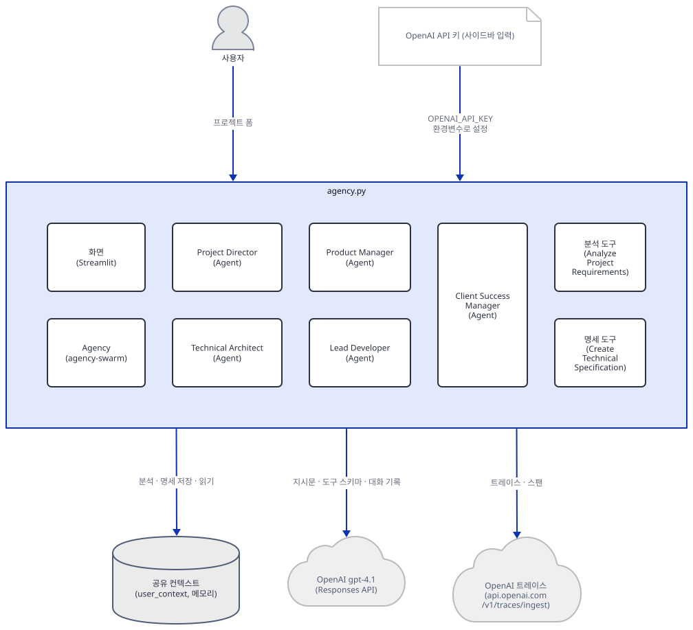

## 사전 준비

| 서비스/도구 | 용도 | 발급·설치 |
|---|---|---|
| uv | 가상환경 생성과 패키지 설치 | [공통 사전 준비](../README.md#공통-사전-준비-한-번만) 참고 |
| Python | `agency-swarm` 1.7.0이 3.12 이상을 요구한다(`METADATA`의 `Requires-Python`). 기본 Python이 3.11 이하면 `uv venv --python 3.13`처럼 버전을 지정한다. 이 문서는 3.13.3으로 확인했다 | 공통 사전 준비와 같음 |
| OpenAI API 키 | 에이전트 호출과 트레이스 전송에 쓰인다. 앱은 키를 사이드바 입력칸에서 받아 `OPENAI_API_KEY` 환경변수에 넣는다(Step 4). 이 문서는 가짜 값 `sk-fake-key`로 확인한다 | https://platform.openai.com/api-keys |

앱이 모델 이름을 적은 곳은 없습니다(`agency.py`에 `gpt`·`model=` grep 0건). 그래서 OpenAI Agents SDK의 기본값 `gpt-4.1`이 쓰입니다(`agents/models/default_models.py`의 `get_default_model`, 환경변수 `OPENAI_DEFAULT_MODEL`로 바꿀 수 있음. 요청 본문에서 `model=gpt-4.1`을 직접 확인, Step 5). `gpt-4.1`은 OpenAI 폐기 문서(https://developers.openai.com/api/docs/deprecations, 2026-10-09 확인)의 종료 목록에 없고 `gpt-4.5-preview`와 2026-03-26 종료 표의 `gpt-4-0314` 등의 대체 모델 칸("`gpt-5` or `gpt-4.1*`")에만 나옵니다.

## 아키텍처 한눈에 보기

| 컴포넌트 | 역할 | 코드 위치 |
|---|---|---|
| 화면 (Streamlit) | 사이드바 키 입력, 프로젝트 폼, 탭 다섯 개, 세션 기록 | `advanced_ai_agents/multi_agent_apps/agent_teams/ai_services_agency/agency.py:78-366` |
| 분석 도구 (`AnalyzeProjectRequirements`) | 입력값으로 고정 분석 딕셔너리를 만들어 컨텍스트에 `project_analysis`로 저장 | `advanced_ai_agents/multi_agent_apps/agent_teams/ai_services_agency/agency.py:8-39` |
| 명세 도구 (`CreateTechnicalSpecification`) | 컨텍스트에서 분석을 읽어 `technical_specification`을 저장 | `advanced_ai_agents/multi_agent_apps/agent_teams/ai_services_agency/agency.py:41-76` |
| 에이전트 다섯 (`Agent`) | Project Director·Technical Architect·Product Manager·Lead Developer·Client Success Manager. 앞 둘만 도구를 갖는다 | `advanced_ai_agents/multi_agent_apps/agent_teams/ai_services_agency/agency.py:158-227` |
| `Agency` | 다섯을 모두 진입점으로 받고 `communication_flows` 일곱 줄로 에이전트 사이의 길을 만든다 | `advanced_ai_agents/multi_agent_apps/agent_teams/ai_services_agency/agency.py:230-245` |
| 순서대로 호출 | `get_response_sync`를 다섯 번 부르고 `final_output`을 탭에 채운다 | `advanced_ai_agents/multi_agent_apps/agent_teams/ai_services_agency/agency.py:261-346` |

외부로 나가는 곳은 모델 호출(`api.openai.com`의 Responses API)과 트레이스 전송(`api.openai.com/v1/traces/ingest`) 둘이고, 둘 다 `OPENAI_API_KEY`를 씁니다. 개요 그림에 다 넣지 못한 것은 `communication_flows`가 만드는 길, 도구가 공유 컨텍스트를 거치는 길, 화면에서 진입점 다섯으로 가는 호출이고, 아래 그림 둘에 따로 그렸습니다.

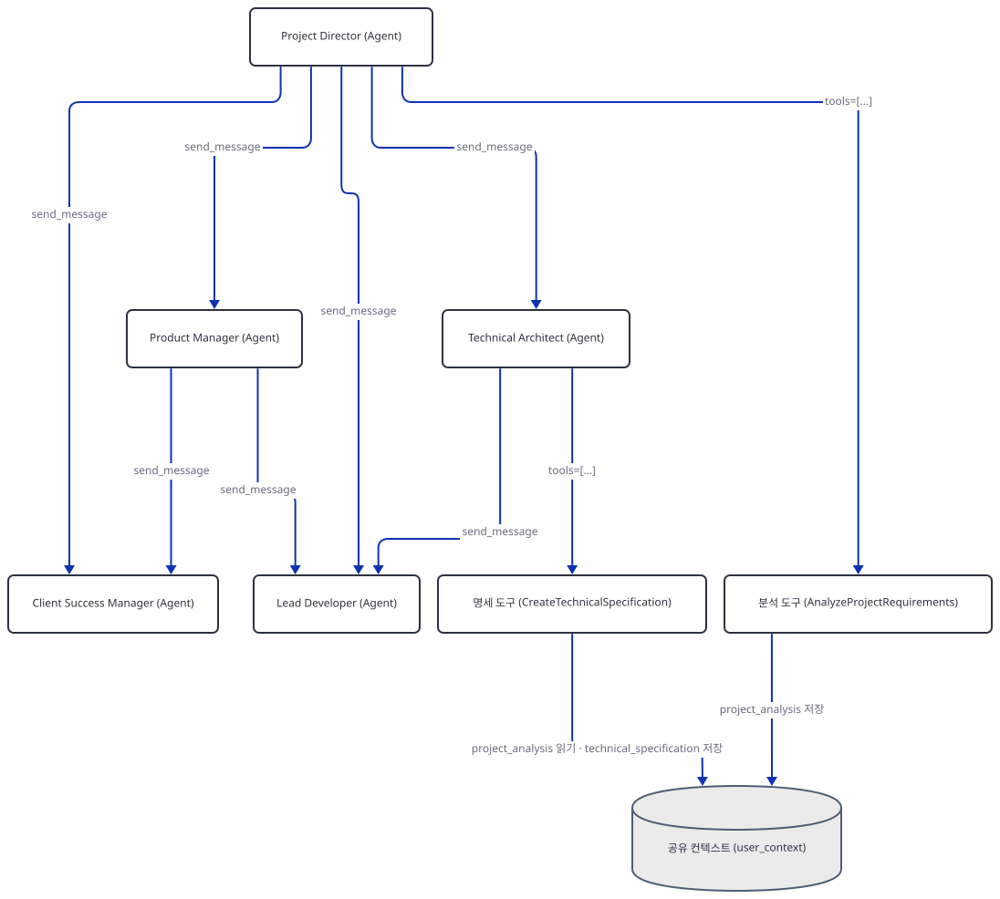

그 길을 지나는 호출의 출발점은 다른 그림입니다. 화면이 `Agency`에 `get_response_sync`를 다섯 번 부르고, 그때마다 `recipient_agent=`로 진입점 에이전트 하나를 고릅니다. 모델을 부르는 쪽은 에이전트가 아니라 `Agency`입니다.

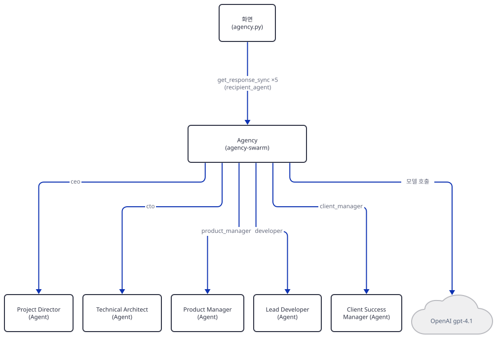

## 단계별 진행

### Step 1. 환경 만들기 — 설치는 되는데 첫 호출에서 멈춥니다

**목적.** 원본 폴더를 건드리지 않도록 작업 폴더에 복사본과 가상환경을 만들고, 설치된 조합이 실제로 도는지 봅니다.

**할 일.** `<저장소>`는 이 저장소를 받은 경로입니다.

```bash
mkdir services-agency-work
cd services-agency-work
cp <저장소>/advanced_ai_agents/multi_agent_apps/agent_teams/ai_services_agency/agency.py .
cp <저장소>/advanced_ai_agents/multi_agent_apps/agent_teams/ai_services_agency/requirements.txt .
uv venv --python 3.13
uv pip install -r requirements.txt
```

(pip 대안: `python -m venv .venv`로 만들고 활성화한 뒤 `pip install -r requirements.txt`.) 아래 PowerShell 줄은 실행해 보지 못했습니다(이 문서를 쓴 하네스가 PowerShell 실행을 막습니다).

```powershell
mkdir services-agency-work
cd services-agency-work
Copy-Item <저장소>\advanced_ai_agents\multi_agent_apps\agent_teams\ai_services_agency\agency.py .
Copy-Item <저장소>\advanced_ai_agents\multi_agent_apps\agent_teams\ai_services_agency\requirements.txt .
uv venv --python 3.13
uv pip install -r requirements.txt
```

이 저장소는 루트에 `pyproject.toml`이 있어 저장소 안에서 `uv run`은 루트 환경을 쓰려 하므로, 이후 `uv run`에는 모두 `--no-project`를 붙입니다.

`advanced_ai_agents/multi_agent_apps/agent_teams/ai_services_agency/requirements.txt:1-3`

```text
python-dotenv==1.1.1
agency-swarm==1.7.0
streamlit
```

2026-10-09에 112개가 설치됐고 `agency-swarm` 1.7.0, `openai-agents` 0.6.4, `openai` 2.54.0, `streamlit` 1.65.0이 포함됩니다(직접 확인). `agency-swarm`은 `openai-agents`를 `==0.6.4`로 못 박고 `openai`는 `>=2.2,<3`으로만 묶어 두어서 `openai`는 오늘의 최신판으로 풀립니다. `python-dotenv`는 앱 코드가 쓰지 않지만(`agency.py`에 `dotenv` grep 0건) `agency-swarm`이 이미 요구하는 패키지입니다.

**확인.**

```bash
uv run --no-project python -m py_compile agency.py && echo compiled
uv run --no-project python -c "from agents import Usage; Usage()"
```

(PowerShell 5.1에는 `&&`가 없으므로 첫 줄은 `uv run --no-project python -m py_compile agency.py; if ($?) { echo compiled }`로 씁니다. 실행해 보지 못했습니다.) `Usage()`는 토큰 사용량을 세는 SDK 객체로, 모델 호출 결과마다 만들어집니다. 직접 확인한 출력(마지막 몇 줄만 옮겼습니다. 앞에 traceback 머리가, 끝에 pydantic 안내 URL 줄이 더 있습니다)입니다.

```text
compiled
pydantic_core._pydantic_core.ValidationError: 1 validation error for InputTokensDetails
cache_write_tokens
  Field required [type=missing, input_value={'cached_tokens': 0}, input_type=dict]
```

문법은 맞아도 `openai-agents` 0.6.4가 `InputTokensDetails(cached_tokens=0)`만 넘기는데 `openai` 2.54.0의 이 모델은 `cache_write_tokens`를 필수로 요구합니다. 그래서 앱은 모델 서버에 요청을 보내기도 전에 죽습니다(가짜 서버가 요청을 한 건도 받지 못한 것을 직접 확인). 화면에는 `Error during analysis: Runner execution failed for agent Project Director`가 뜹니다. `openai`를 몇 개 버전으로 바꿔 보니 2.44.0까지는 이 호출이 통과하고 2.45.0부터 실패했습니다(직접 확인). 낮춥니다.

```bash
uv pip install "openai==2.44.0"
uv run --no-project python -c "from agents import Usage; Usage(); print('Usage() ok')"
```

```text
 - openai==2.54.0
 + openai==2.44.0
Usage() ok
```

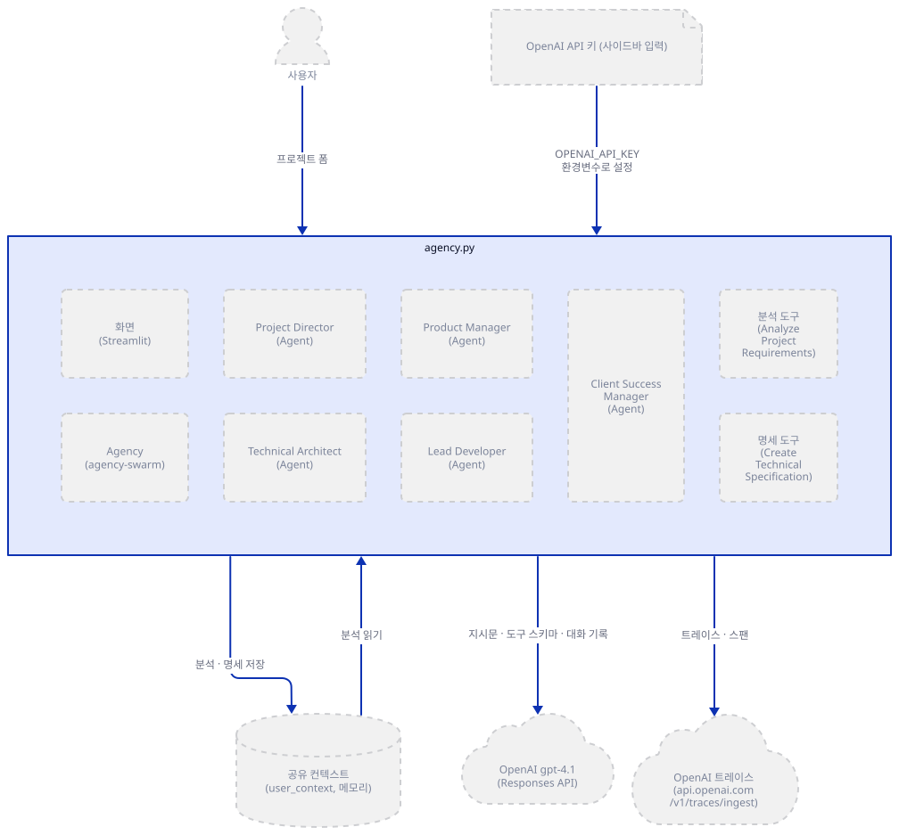

### Step 2. 도구 둘 — 이름, 설명, 공유 컨텍스트

**목적.** `BaseTool` 클래스가 모델에게 어떤 이름과 설명으로 보이는지, `self.context`가 무엇인지 봅니다.

**할 일.**

`advanced_ai_agents/multi_agent_apps/agent_teams/ai_services_agency/agency.py:19-39`

```python
    class ToolConfig:
        name = "analyze_project"
        description = "Analyzes project requirements and feasibility"
        one_call_at_a_time = True

    def run(self) -> str:
        """Analyzes project and stores results in shared state"""
        if self.context.get("project_analysis", None) is not None:
            raise ValueError("Project analysis already exists. Please proceed with technical specification.")
        
        analysis = {
            "name": self.project_name,
            "type": self.project_type,
            "complexity": "high",
            "timeline": "6 months",
            "budget_feasibility": "within range",
            "requirements": ["Scalable architecture", "Security", "API integration"]
        }
        
        self.context.set("project_analysis", analysis)
        return "Project analysis completed. Please proceed with technical specification."
```

딕셔너리의 값은 입력과 무관한 고정 문장입니다. `complexity: "high"`, `timeline: "6 months"`가 어떤 프로젝트에서도 같습니다. 모델이 이 도구에서 얻는 것은 "분석이 끝났다"는 한 줄이고, 분석 내용은 컨텍스트에 쌓입니다. 두 번째 도구는 같은 모양입니다.

`advanced_ai_agents/multi_agent_apps/agent_teams/ai_services_agency/agency.py:57-76`

```python
    class ToolConfig:
        name = "create_technical_spec"
        description = "Creates technical specifications based on project analysis"
        one_call_at_a_time = True

    def run(self) -> str:
        """Creates technical specification based on analysis"""
        project_analysis = self.context.get("project_analysis", None)
        if project_analysis is None:
            raise ValueError("Please analyze project requirements first using AnalyzeProjectRequirements tool.")
        
        spec = {
            "project_name": project_analysis["name"],
            "architecture": self.architecture_type,
            "technologies": self.core_technologies.split(","),
            "scalability": self.scalability_requirements
        }
        
        self.context.set("technical_specification", spec)
        return f"Technical specification created for {project_analysis['name']}."
```

이름을 봅시다. `ToolConfig`의 `name = "analyze_project"`는 모델에게 가지 않습니다. 어댑터가 도구 이름을 `base_tool.__name__`, 곧 클래스 이름으로 정하고(`agency_swarm`의 `tools/tool_factory_utils/base_tool_adapter.py` 25행, 소스로 확인) 설명도 클래스의 docstring이며, `ToolConfig`에서 읽는 것은 `strict`와 `one_call_at_a_time` 둘뿐입니다. 아래 스크립트를 `check_tools.py`로 저장해 도구를 모델 없이 직접 불러 봅니다. 도구의 `on_invoke_tool`은 모델이 인자를 JSON으로 넘길 때 거치는 길과 같습니다.

```python
import asyncio, json, os, sys
sys.path.insert(0, os.getcwd())
from agents import RunContextWrapper
from agency_swarm import Agent
from agency_swarm.context import MasterContext
import agency as app

holder = Agent(name="Holder", description="d", instructions="i",
               tools=[app.AnalyzeProjectRequirements, app.CreateTechnicalSpecification])
tools = {t.name: t for t in holder.tools}
print("tool names:", list(tools))
print("description:", tools["AnalyzeProjectRequirements"].description)
ctx = RunContextWrapper(context=MasterContext(thread_manager=None, agents={}, user_context={}))

def call(name, args):
    out = asyncio.run(tools[name].on_invoke_tool(ctx, json.dumps(args)))
    print(f"{name} -> {out.replace(chr(10), ' ')[:200]!r}")

ana = {"project_name": "Demo", "project_description": "d", "project_type": "Web Application", "budget_range": "$10k-$25k"}
spec = {"architecture_type": "serverless", "core_technologies": "Python, Postgres", "scalability_requirements": "low"}
call("CreateTechnicalSpecification", spec)
call("AnalyzeProjectRequirements", ana)
print("context:", ctx.context.user_context)
call("AnalyzeProjectRequirements", ana)
call("AnalyzeProjectRequirements", {**ana, "project_type": "Game"})
call("CreateTechnicalSpecification", spec)
print("spec:", ctx.context.get("technical_specification"))
```

**확인.**

```bash
uv run --no-project python check_tools.py
```

직접 확인한 출력입니다(긴 줄은 `check_tools.py`가 200자에서 자른 것입니다).

```text
tool names: ['AnalyzeProjectRequirements', 'CreateTechnicalSpecification']
description: Analyze project requirements and feasibility. This tool can only be used sequentially. Do not try to run it in parallel with other tools.
CreateTechnicalSpecification -> 'An error occurred while running the tool. Please try again. Error: Please analyze project requirements first using AnalyzeProjectRequirements tool.'
AnalyzeProjectRequirements -> 'Project analysis completed. Please proceed with technical specification.'
context: {'project_analysis': {'name': 'Demo', 'type': 'Web Application', 'complexity': 'high', 'timeline': '6 months', 'budget_feasibility': 'within range', 'requirements': ['Scalable architecture', 'Security', 'API integration']}}
AnalyzeProjectRequirements -> 'An error occurred while running the tool. Please try again. Error: Project analysis already exists. Please proceed with technical specification.'
AnalyzeProjectRequirements -> 'An error occurred while running the tool. Please try again. Error: Invalid JSON input for tool AnalyzeProjectRequirements: 1 validation error for AnalyzeProjectRequirements_args project_type   Input s'
CreateTechnicalSpecification -> 'Technical specification created for Demo.'
spec: {'project_name': 'Demo', 'architecture': 'serverless', 'technologies': ['Python', ' Postgres'], 'scalability': 'low'}
```

이름은 클래스 이름이고, 설명 끝에는 `one_call_at_a_time = True` 때문에 "순차로만 쓰라"는 문장이 붙었습니다. 도구 오류는 예외로 번지지 않고 문자열로 모델에게 돌아갑니다. 분석 전에 명세를 부르면, 분석을 두 번 부르면, `Literal`에 없는 유형(`Game`)을 넘기면 각각 `An error occurred while running the tool...` 문장이 돌아왔습니다. 명세의 `core_technologies.split(",")`는 공백을 지우지 않아 `' Postgres'`처럼 앞 공백이 남습니다.

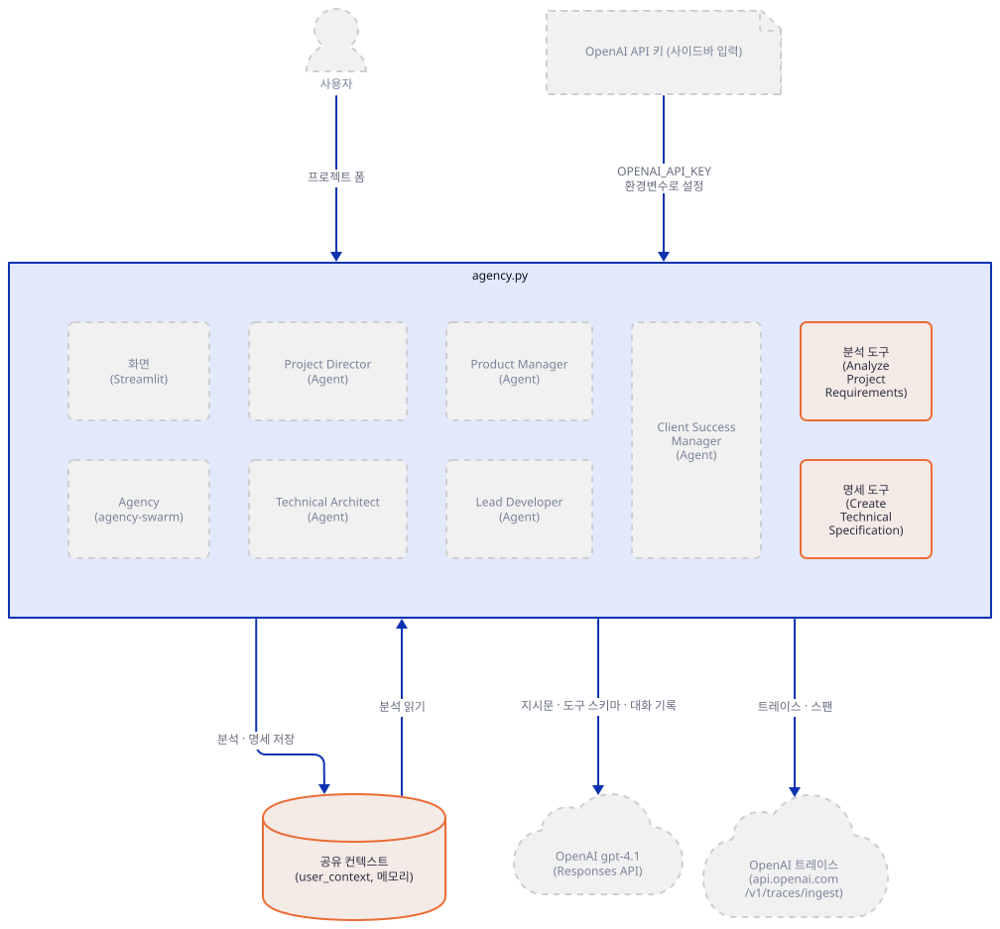

### Step 3. 에이전트 다섯과 Agency

**목적.** 에이전트마다 무엇을 받는지, `communication_flows`가 무엇을 바꾸는지 봅니다.

**할 일.**

`advanced_ai_agents/multi_agent_apps/agent_teams/ai_services_agency/agency.py:158-176`

```python
                ceo = Agent(
                    name="Project Director",
                    description="You are a CEO of multiple companies in the past and have a lot of experience in evaluating projects and making strategic decisions.",
                    instructions="""
                    You are an experienced CEO who evaluates projects. Follow these steps strictly:

                    1. FIRST, use the AnalyzeProjectRequirements tool with:
                       - project_name: The name from the project details
                       - project_description: The full project description
                       - project_type: The type of project (Web Application, Mobile App, etc)
                       - budget_range: The specified budget range

                    2. WAIT for the analysis to complete before proceeding.
                    
                    3. Review the analysis results and provide strategic recommendations.
                    """,
                    tools=[AnalyzeProjectRequirements],
                    model_settings=ModelSettings(temperature=0.7, max_tokens=25000),
                )
```

에이전트 다섯이 같은 모양이고 `temperature`만 0.7·0.5·0.4·0.3·0.6으로 다릅니다. 도구는 CEO와 CTO만 가집니다(174·193행). 에이전트에 모델 이름이 없으므로 앞에서 본 기본 모델이 모두에게 쓰입니다.

`advanced_ai_agents/multi_agent_apps/agent_teams/ai_services_agency/agency.py:229-245`

```python
                # Create agency
                agency = Agency(
                    ceo,
                    cto,
                    product_manager,
                    developer,
                    client_manager,
                    communication_flows=[
                        (ceo, cto),
                        (ceo, product_manager),
                        (ceo, developer),
                        (ceo, client_manager),
                        (cto, developer),
                        (product_manager, developer),
                        (product_manager, client_manager),
                    ],
                )
```

`Agency(ceo, cto, ...)`의 위치 인자 다섯은 모두 "진입점", 곧 바깥에서 직접 말을 걸 수 있는 에이전트입니다. 그래서 앱이 에이전트마다 `recipient_agent=`로 따로 부를 수 있습니다. `communication_flows`의 `(a, b)`는 "a가 b에게 보낼 수 있다"는 한 방향 선언입니다. 아래를 `check_agency.py`로 저장합니다. 앱의 생성자 인자를 그대로 쓰되 지시문은 짧은 문자열로 대신했습니다.

```python
import os, sys
sys.path.insert(0, os.getcwd())
from agency_swarm import Agent, Agency, ModelSettings
import agency as app

def make(name, tools=None, temp=0.5):
    return Agent(name=name, description="d", instructions="i", tools=tools or [],
                 model_settings=ModelSettings(temperature=temp, max_tokens=25000))

ceo, cto = make("Project Director", [app.AnalyzeProjectRequirements]), make("Technical Architect", [app.CreateTechnicalSpecification])
pm, dev, cm = make("Product Manager"), make("Lead Developer"), make("Client Success Manager")
agency = Agency(ceo, cto, pm, dev, cm, communication_flows=[
    (ceo, cto), (ceo, pm), (ceo, dev), (ceo, cm), (cto, dev), (pm, dev), (pm, cm)])
print("model:", ceo.model)
print("entry points:", [a.name for a in agency.entry_points])
for a, b in agency._derived_communication_flows:
    print(f"  {a.name} -> {b.name}")
print("user_context:", agency.user_context)
```

**확인.**

```bash
uv run --no-project python check_agency.py
```

직접 확인한 출력입니다.

```text
model: gpt-4.1
entry points: ['Project Director', 'Technical Architect', 'Product Manager', 'Lead Developer', 'Client Success Manager']
  Project Director -> Technical Architect
  Project Director -> Product Manager
  Project Director -> Lead Developer
  Project Director -> Client Success Manager
  Technical Architect -> Lead Developer
  Product Manager -> Lead Developer
  Product Manager -> Client Success Manager
user_context: {}
```

`user_context`가 처음에는 빈 딕셔너리인 것이 Step 2의 `self.context`가 시작하는 자리입니다. 흐름의 보낸 쪽(CEO·CTO·PM)은 모델에게 `send_message` 도구를 하나씩 받습니다. 이것은 Step 5의 요청 기록에서 봅니다. `Agency`를 만들 때 네트워크 요청은 없었습니다.

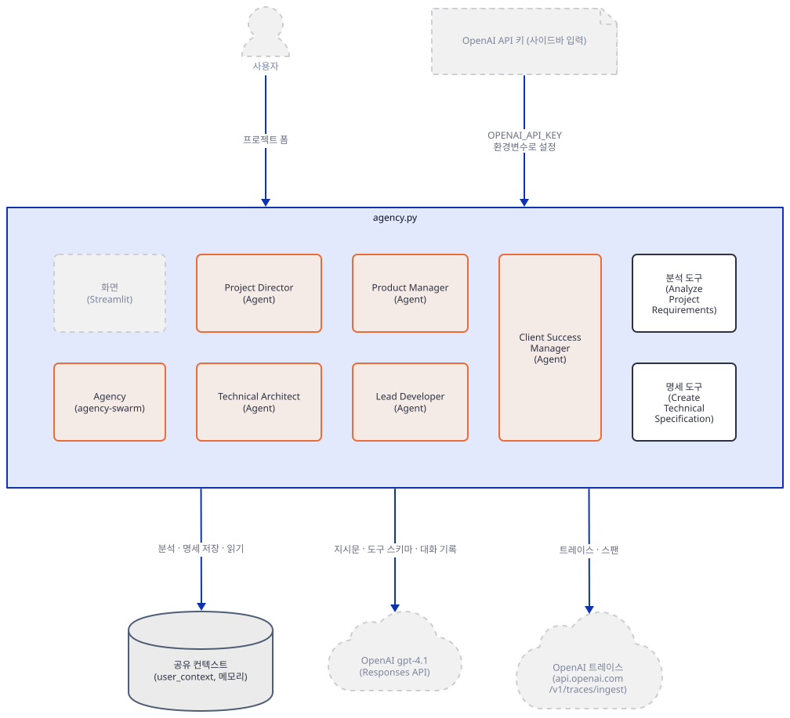

### Step 4. 화면과 키 — 키가 있어야 폼이 나타납니다

**목적.** 키 입력이 어디에 저장되는지, 폼이 언제 나타나는지 봅니다.

**할 일.**

`advanced_ai_agents/multi_agent_apps/agent_teams/ai_services_agency/agency.py:92-109`

```python
    with st.sidebar:
        st.header("🔑 API Configuration")
        openai_api_key = st.text_input(
            "OpenAI API Key",
            type="password",
            help="Enter your OpenAI API key to continue"
        )

        if openai_api_key:
            st.session_state.api_key = openai_api_key
            st.success("API Key accepted!")
        else:
            st.warning("⚠️ Please enter your OpenAI API Key to proceed")
            st.markdown("[Get your API key here](https://platform.openai.com/api-keys)")
            return
        
    # Agency Swarm v1 uses standard OPENAI_API_KEY resolution.
    os.environ["OPENAI_API_KEY"] = st.session_state.api_key
```

키가 없으면 106행의 `return`으로 `main()`이 끝나서 폼도 만들어지지 않습니다. 키가 있으면 `os.environ["OPENAI_API_KEY"]`에 넣는데, 이 환경변수는 프로세스 전체에 퍼집니다. 같은 서버에 접속한 다른 브라우저 세션이 다른 키를 입력하면 같은 환경변수를 덮어씁니다(소스로 확인, 두 세션으로는 돌려 보지 못함). 한 가지가 더 있습니다. `import agency_swarm`은 첫머리에서 `load_dotenv(override=True)`를 부릅니다(`agency_swarm/__init__.py`의 4행). `.env`는 이 호출이 일어난 파일, 곧 설치된 `agency_swarm/__init__.py`의 위치에서 위로 올라가며 찾습니다(python-dotenv의 `find_dotenv`는 스크립트 실행일 때 호출한 파일 기준이고, `python -c`일 때만 현재 폴더 기준). 그래서 `.venv`가 들어 있는 폴더와 그 위쪽에 `.env`가 있으면 셸에 넣어 둔 값보다 `.env`가 이깁니다. 아래 `check_ui.py`를 저장해 폼과 키를 `AppTest`(Streamlit의 화면 시험 도구)로 확인합니다.

```python
import os
from streamlit.testing.v1 import AppTest

at = AppTest.from_file(os.path.abspath("agency.py"), default_timeout=60).run()
print("no key:", [w.value for w in at.sidebar.warning], "form text areas:", len(at.text_area))
at.sidebar.text_input[0].set_value("sk-fake-key").run()
print("after key:", [s.value for s in at.sidebar.success], "| os.environ:", os.environ.get("OPENAI_API_KEY"))
print("text_input:", [t.label for t in at.text_input])
print("text_area:", [t.label for t in at.text_area])
print("selectbox:", [(s.label, len(s.options)) for s in at.selectbox])
print("buttons:", [b.label for b in at.button])
```

**확인.**

```bash
uv run --no-project python check_ui.py
```

직접 확인한 출력입니다.

```text
no key: ['Please enter your OpenAI API Key to proceed'] form text areas: 0
after key: ['API Key accepted!'] | os.environ: sk-fake-key
text_input: ['Project Name', 'OpenAI API Key']
text_area: ['Project Description', 'Technical Requirements (optional)', 'Special Considerations (optional)']
selectbox: [('Project Type', 6), ('Expected Timeline', 4), ('Budget Range', 4), ('Project Priority', 3)]
buttons: ['Analyze Project', 'Clear History']
```

`.env`는 다음처럼 직접 확인했습니다. 셸에 `OPENAI_API_KEY=sk-from-shell`을 두고 `.venv`가 있는 작업 폴더에 `OPENAI_API_KEY=sk-from-dotenv`가 든 `.env`를 만들면 `import agency_swarm` 뒤의 값이 `sk-from-dotenv`였고, 한 단계 위 폴더의 `.env`도 읽혔습니다. `.env`가 없으면 셸 값이 그대로였습니다. 위 실험은 `python -c`로 돌렸기 때문에 현재 폴더에서 찾은 것입니다. `.venv`와 무관한 하위 폴더에 `.env`만 두고 스크립트 파일(`import agency_swarm`을 하는 `t.py`)로 돌리면 셸 값 `sk-from-shell`이 그대로였고 같은 폴더에서 `python -c`로 돌리면 `sk-from-sub`이었습니다(직접 확인). 앱은 `streamlit run`으로 스크립트가 돌기 때문에 앞의 경우, 곧 `.venv`가 든 폴더와 그 위쪽의 `.env`만 영향을 줍니다. 제출 조건은 155행의 `if submitted and project_name and project_description:`이어서 이름과 설명이 비면 아무 일도 일어나지 않습니다.

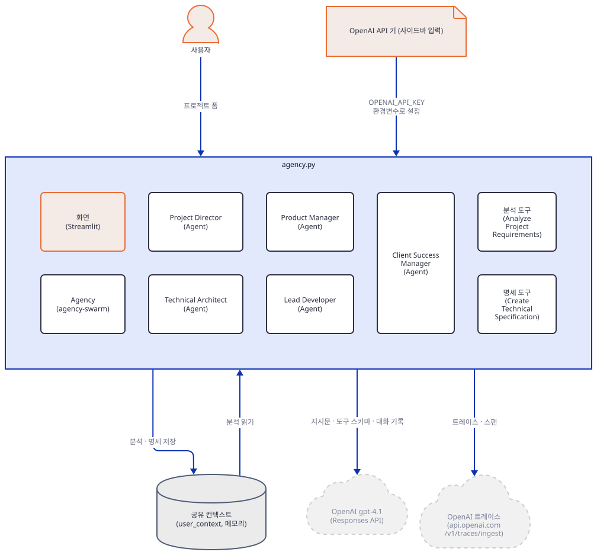

### Step 5. 순서대로 다섯 번 부르기 — 가짜 서버로 끝까지

**목적.** 제출 한 번이 모델 호출 일곱 번으로 이어지는 과정을 가짜 서버로 보고, 에이전트들이 대화 기록을 나눠 쓰는 것을 확인합니다.

**할 일.** 앱의 호출부를 봅니다.

`advanced_ai_agents/multi_agent_apps/agent_teams/ai_services_agency/agency.py:261-275`

```python
                with st.spinner("AI Services Agency is analyzing your project..."):
                    try:
                        # Get analysis from each agent using get_response_sync.
                        ceo_response = str(
                            agency.get_response_sync(
                            message=f"""Analyze this project using the AnalyzeProjectRequirements tool:
                            Project Name: {project_name}
                            Project Description: {project_description}
                            Project Type: {project_type}
                            Budget Range: {budget_range}
                            
                            Use these exact values with the tool and wait for the analysis results.""",
                            recipient_agent=ceo
                            ).final_output
                        )
```

CEO에게 보내는 메시지에는 이름·설명·유형·예산만 있고 화면에서 고른 일정(`timeline`)과 우선순위(`priority`)는 없습니다. 이 둘과 선택 입력 둘은 `project_info` 딕셔너리에만 들어가고(248~257행), 그 딕셔너리는 PM·개발자·고객 성공 담당에게 가는 메시지에서 문자열로 쓰입니다(292·300·308행).

`advanced_ai_agents/multi_agent_apps/agent_teams/ai_services_agency/agency.py:290-296`

```python
                        pm_response = str(
                            agency.get_response_sync(
                            message=f"Analyze project management aspects: {str(project_info)}",
                            recipient_agent=product_manager,
                            additional_instructions="Focus on product-market fit and roadmap development, and coordinate with technical and marketing teams."
                            ).final_output
                        )
```

`additional_instructions`는 그 호출 한 번에만 지시문 뒤에 덧붙는 문장입니다. 이제 가짜 OpenAI 서버를 `fake_openai.py`로 저장합니다. 요청마다 한 줄을 찍고, CEO와 CTO에게는 도구 호출을 한 번씩 시키며(지시문에 `experienced CEO`·`technical architect`가 있을 때), 나머지는 고정 문장을 답합니다. 예시의 포트 61407은 내 PC에서 비어 있던 값이고 다른 번호를 써도 됩니다. Windows에서는 번호에 따라 `WinError 10013`으로 열리지 않는 것이 있으니 그때는 다른 번호로 바꿉니다.

```python
import json, sys, itertools
from http.server import BaseHTTPRequestHandler, HTTPServer

PORT = int(sys.argv[1])
ids = itertools.count(1)
CALLS = {  # 지시문에 이 낱말이 있고 이번 질문 뒤에 도구 결과가 아직 없으면 도구를 부른다
    "experienced CEO": ("AnalyzeProjectRequirements", {"project_name": "Demo Shop", "project_description": "A small demo storefront", "project_type": "Web Application", "budget_range": "$25k-$50k"}),
    "technical architect": ("CreateTechnicalSpecification", {"architecture_type": "microservices", "core_technologies": "Python, FastAPI, Postgres", "scalability_requirements": "high"}),
}

def answered(items):  # 마지막 user 메시지 뒤에 도구 결과가 있는가
    last = max([k for k, i in enumerate(items) if i.get("role") == "user"] or [-1])
    return any(i.get("type") == "function_call_output" for i in items[last + 1:])

def response(model, output):
    return {"id": f"resp_{next(ids)}", "object": "response", "created_at": 0, "status": "completed", "model": model,
            "output": output, "parallel_tool_calls": True, "tool_choice": "auto", "tools": [],
            "usage": {"input_tokens": 100, "input_tokens_details": {"cached_tokens": 0, "cache_write_tokens": 0},
                      "output_tokens": 20, "output_tokens_details": {"reasoning_tokens": 0}, "total_tokens": 120}}

class Handler(BaseHTTPRequestHandler):
    def log_message(self, *a): pass
    def do_POST(self):
        body = json.loads(self.rfile.read(int(self.headers.get("Content-Length", 0))) or b"{}")
        if self.path.endswith("/responses"):
            text, items = body.get("instructions") or "", body["input"]
            names = [t.get("name") for t in body.get("tools", [])]
            call = next((v for k, v in CALLS.items() if k in text), None)
            if call and not answered(items):
                out = [{"type": "function_call", "id": f"fc_{next(ids)}", "call_id": f"call_{next(ids)}", "name": call[0],
                        "arguments": json.dumps(call[1]), "status": "completed"}]
                what = "function_call " + call[0]
            else:
                out = [{"type": "message", "id": f"msg_{next(ids)}", "role": "assistant", "status": "completed",
                        "content": [{"type": "output_text", "text": "FAKE: " + " ".join(text.split())[:40], "annotations": []}]}]
                what = "message"
            print(f"responses model={body['model']} temp={body.get('temperature')} max_out={body.get('max_output_tokens')} "
                  f"tools={names} input_items={len(items)} -> {what}", flush=True)
            payload = response(body["model"], out)
        else:
            n = len(json.loads(json.dumps(body)).get("data", []))
            print(f"{self.path} auth={self.headers.get('Authorization', '')[:10]}... items={n}", flush=True)
            payload = {"ok": True}
        data = json.dumps(payload).encode()
        self.send_response(200); self.send_header("Content-Type", "application/json")
        self.send_header("Content-Length", str(len(data))); self.end_headers(); self.wfile.write(data)

class Server(HTTPServer):
    allow_reuse_address = False

Server(("127.0.0.1", PORT), Handler).serve_forever()
```

앱을 부르는 `run_app.py`도 저장합니다. `OPENAI_BASE_URL`을 가짜 서버로 걸고 `AppTest`가 앱을 돌립니다. 키를 넣고, 이름·설명을 채우고, 폼을 제출합니다.

```python
import os, sys
port = sys.argv[1]
os.environ["OPENAI_BASE_URL"] = f"http://127.0.0.1:{port}/v1"
if len(sys.argv) > 2 and sys.argv[2] == "traces-local":  # 트레이스도 가짜 서버로
    from agents.tracing.processors import default_exporter
    default_exporter().endpoint = f"http://127.0.0.1:{port}/v1/traces/ingest"
from streamlit.testing.v1 import AppTest

at = AppTest.from_file(os.path.abspath("agency.py"), default_timeout=90).run()
at.sidebar.text_input[0].set_value("sk-fake-key").run()
next(t for t in at.text_input if t.label == "Project Name").set_value("Demo Shop")
next(t for t in at.text_area if t.label == "Project Description").set_value("A small demo storefront with a catalog and checkout.")
next(b for b in at.button if b.label == "Analyze Project").click()
at.run()
print("errors:", [e.value for e in at.error])
print("tabs:", [t.label for t in at.tabs])
for m in at.session_state.messages:
    print(" ", m["role"], str(m["content"])[:70])
import agents.tracing as tr
tr.get_trace_provider()._multi_processor.force_flush()
```

**확인.** 터미널 둘을 씁니다. 첫째 터미널에서 서버를 띄웁니다.

```bash
uv run --no-project python fake_openai.py 61407
```

둘째 터미널에서 앱을 돌립니다. 모델 호출은 `OPENAI_BASE_URL` 때문에 가짜 서버로 가지만 트레이스는 그렇지 않습니다. `run_app.py`는 트레이스 주소를 건드리지 않으므로(둘째 인자 `traces-local`이 없을 때) 그냥 돌리면 `openai-agents`의 내보내기가 가짜 키 `sk-fake-key`를 `Authorization`에 달고 프로젝트 이름이 든 도구 스팬과 함께 실제 `https://api.openai.com/v1/traces/ingest`로 POST합니다(주소는 `agents/tracing/processors.py`의 `BackendSpanExporter` 기본값이고 4xx 응답이면 `[non-fatal] Tracing client error ...` 줄을 찍고 재시도 없이 끝낸다는 것을 소스로 확인했고, 이 문서는 프록시 차단 아래에서만 돌려 실제 응답은 보지 못했습니다). 그래서 이 단계의 명령에는 트레이스를 끄는 환경변수를 반드시 붙입니다. 진짜 키로 앱을 쓸 때도 같은 전송이 나간다는 점은 Step 6에서 다룹니다.

```bash
OPENAI_AGENTS_DISABLE_TRACING=1 uv run --no-project python run_app.py 61407
```

PowerShell은 두 줄입니다(실행해 보지 못했습니다). 환경변수는 그 창의 이후 실행에도 남으므로 끝나면 지웁니다.

```powershell
$env:OPENAI_AGENTS_DISABLE_TRACING = "1"
uv run --no-project python run_app.py 61407
Remove-Item Env:OPENAI_AGENTS_DISABLE_TRACING
```

직접 확인한 첫째 터미널의 출력입니다.

```text
responses model=gpt-4.1 temp=0.7 max_out=25000 tools=['AnalyzeProjectRequirements', 'send_message'] input_items=1 -> function_call AnalyzeProjectRequirements
responses model=gpt-4.1 temp=0.7 max_out=25000 tools=['AnalyzeProjectRequirements', 'send_message'] input_items=3 -> message
responses model=gpt-4.1 temp=0.5 max_out=25000 tools=['CreateTechnicalSpecification', 'send_message'] input_items=5 -> function_call CreateTechnicalSpecification
responses model=gpt-4.1 temp=0.5 max_out=25000 tools=['CreateTechnicalSpecification', 'send_message'] input_items=7 -> message
responses model=gpt-4.1 temp=0.4 max_out=25000 tools=['send_message'] input_items=9 -> message
responses model=gpt-4.1 temp=0.3 max_out=25000 tools=[] input_items=11 -> message
responses model=gpt-4.1 temp=0.6 max_out=25000 tools=[] input_items=13 -> message
```

세 가지를 읽습니다. 첫째, 도구 목록이 에이전트마다 다릅니다. CEO·CTO는 자기 도구와 `send_message`, PM은 `send_message`만, 개발자와 고객 성공 담당은 빈 목록입니다. 흐름에서 말을 거는 쪽(CEO·CTO·PM)만 `send_message`를 받는다는 Step 3의 말이 맞습니다. 이 도구의 `recipient_agent`는 CEO의 경우 `Technical Architect`·`Product Manager`·`Lead Developer`·`Client Success Manager` 넷 중 하나로 제한됩니다(탐색 때 가짜 서버가 받은 도구 스키마에서 확인). 이 앱은 에이전트마다 직접 부르므로 가짜 서버는 `send_message`를 한 번도 부르지 않았고, 진짜 모델이 부를지는 확인하지 못했습니다. 둘째, `input_items`가 1, 3, 5, 7, 9, 11, 13으로 늘어납니다. 다섯 에이전트가 하나의 대화 기록을 나눠 써서, CTO는 CEO의 질문·도구 호출·답을, PM은 둘 다를 입력으로 받습니다. 그래서 CTO의 도구가 컨텍스트의 분석을 읽을 수 있었고(CTO의 첫 요청이 `CreateTechnicalSpecification` 호출로 이어짐), 뒤 에이전트일수록 입력이 길어져 비용도 커집니다. 셋째, `temp`와 `max_out=25000`은 `ModelSettings(temperature=..., max_tokens=25000)`가 요청에 그대로 실린 것입니다.

둘째 터미널의 출력입니다(트레이스를 껐으므로 `Tracing:` 줄이 없습니다. 모델 답은 가짜 서버의 고정 문장입니다. 맨 앞에 Streamlit의 `missing ScriptRunContext` 경고 한 줄이 먼저 찍히지만 무시해도 되고 아래에서는 뺐습니다. 트레이스를 켠 채 프록시 차단 아래에서 돌린 결과와 이 부분이 같다는 것도 확인했습니다).

```text
errors: []
tabs: ["CEO's Project Analysis", "CTO's Technical Specification", "Product Manager's Plan", "Developer's Implementation", 'Client Success Strategy']
  user {'name': 'Demo Shop', 'description': 'A small demo storefront with a c
  assistant FAKE: You are an experienced CEO who evaluates
  assistant FAKE: You are a technical architect. Follow th
  assistant FAKE: - Manage project scope and timeline givi
  assistant FAKE: - Plan technical implementation - Provid
  assistant FAKE: - Ensure client satisfaction - Manage ex
```

탭은 다섯, 세션 기록은 여섯 건(사용자 한 건과 답 다섯)이고 `errors`는 비었습니다. 한 요청이 끝날 때까지 화면은 스피너 하나로 기다립니다. 호출 일곱 번이 순차이고 스트리밍이 없기 때문입니다(소스로 확인, `get_response_stream`을 쓰지 않음).

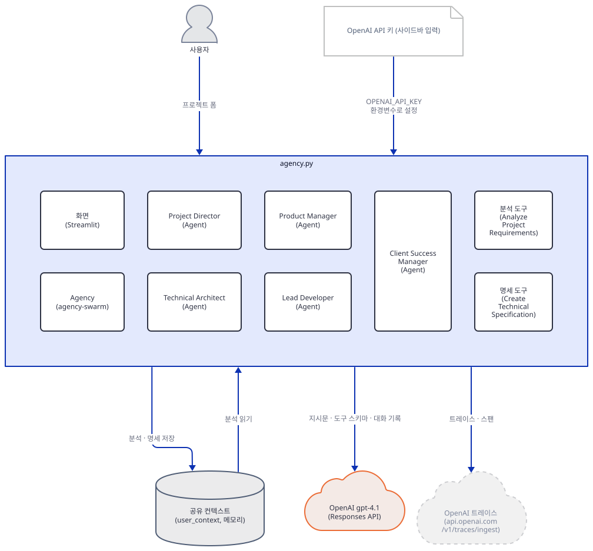

### Step 6. 트레이스와 앱 띄우기

**목적.** 키를 넣는 순간 따라붙는 외부 전송을 확인하고, 끄는 법과 실제 실행 명령을 정리합니다.

**할 일.** `openai-agents`는 기본으로 실행 기록을 OpenAI에 올립니다. 내보내는 곳의 기본 주소가 `https://api.openai.com/v1/traces/ingest`이고 인증은 `OPENAI_API_KEY`입니다(`agents/tracing/processors.py`의 `BackendSpanExporter`, 소스로 확인). 진짜 키를 넣고 앱을 쓸 때도 같은 전송이 나갑니다. 앱이 사이드바의 키를 `OPENAI_API_KEY`에 넣기 때문입니다. Step 5에서 끄지 않고 돌리면 이 주소로 가려고 합니다. 프록시 차단 아래에서 끄지 않고 돌린 실행의 끝에는 이런 줄들이 있었습니다(직접 확인. 메시지는 Windows 한국어판이 한국어로 찍은 것이고 `10061`은 연결 거부입니다. 차단이 없는 독자 PC에서는 연결이 되고 가짜 키라서 4xx 응답 줄이 나올 것이라고 소스로 읽었으며 확인하지는 못했습니다).

```text
[non-fatal] Tracing: request failed: [WinError 10061] ...
[non-fatal] Tracing: request failed: [WinError 10061] ...
[non-fatal] Tracing: request failed: [WinError 10061] ...
[non-fatal] Tracing: max retries reached, giving up on this batch.
```

세 번 시도하고(재시도는 두 번, `max_retries=3`은 시도 횟수) 포기한 것이고 앱 결과에는 영향이 없었습니다. 이제 `run_app.py`의 둘째 인자 `traces-local`로 트레이스 주소만 가짜 서버로 돌려, 무엇이 올라가는지 봅니다(첫째 터미널의 서버를 껐다 다시 띄워 로그를 비운 뒤. 이 명령은 트레이스 주소를 가짜 서버로 바꾸므로 밖으로 나가지 않습니다).

```bash
uv run --no-project python run_app.py 61407 traces-local
```

서버 출력은 이렇습니다(직접 확인한 한 예이고 모델 요청 줄은 줄였습니다).

```text
/v1/traces/ingest auth=Bearer sk-... items=1
responses ... (7줄, Step 5와 같음)
/v1/traces/ingest auth=Bearer sk-... items=18
```

이 실행에서는 처음에 한 건, 모델 요청이 모두 끝난 뒤 열여덟 건이 올라가 합계 열아홉 건이었습니다. 합계와 종류는 매번 같지만 몇 번에 나뉘어 올라가는지는 서버의 응답 속도에 달려 있습니다. 내보내기가 5초 주기로 큐를 비우는 배치(`BatchTraceProcessor`의 `schedule_delay=5.0`, 소스로 확인)이기 때문입니다. 가짜 서버가 바로 답하는 실행 여섯 번은 모두 1건과 18건이었고, 요청마다 응답을 1.2초씩 늦춘 가짜 서버로 세 번 돌리면 모두 1건·13건·5건으로 나뉘었습니다(직접 확인). 실제 모델처럼 호출이 오래 걸리면 실행 도중에 여러 번 나갑니다. 합계의 종류는 트레이스 5건(`Agency` 호출마다 하나, 이름은 `Unnamed Agency`)과 스팬 14건(에이전트 5, 모델 응답 7, 도구 2)이었고, 도구 스팬 두 개에는 프로젝트 이름 `Demo Shop`이 들어 있었습니다. 도구 인자가 그대로 올라간다는 뜻입니다. 끄려면 환경변수를 겁니다.

```bash
OPENAI_AGENTS_DISABLE_TRACING=1 uv run --no-project python run_app.py 61407 traces-local
```

새로 띄운 서버에서 이렇게 돌리면 `traces/ingest` 줄이 0건이고 `responses` 줄은 그대로 7건이었습니다(직접 확인). PowerShell 형태는 다음 두 줄에 지우는 줄을 더한 것이고 실행해 보지 못했습니다(환경변수는 창에 남아 이후 실행의 트레이스도 끄므로 지웁니다).

```powershell
$env:OPENAI_AGENTS_DISABLE_TRACING = "1"
uv run --no-project python run_app.py 61407 traces-local
Remove-Item Env:OPENAI_AGENTS_DISABLE_TRACING
```

실제 앱을 띄우는 명령은 다음과 같습니다.

```bash
uv run --no-project streamlit run agency.py
```

가짜 서버 없이 이 명령을 쓰면 키를 넣는 순간부터 실제 요청이 나갑니다. 이 문서는 확인용으로 `--server.headless true --server.address localhost`를 붙여 띄워 `/_stcore/health`가 200을 주는 것까지만 확인했고(직접 확인) 화면을 열어 폼을 채워 보지는 않았습니다. 앱이 작업 폴더에도 홈에도 파일을 만들지 않는다는 것은 위 단계를 모두 돌린 뒤 `ls`로 확인했습니다(내가 저장한 스크립트와 `.venv`, `__pycache__`뿐). 스레드를 파일에 저장하는 콜백(`load_threads_callback`·`save_threads_callback`)을 `Agency(...)`에 주지 않았으므로 대화 기록은 프로세스 메모리에만 있고, 새로 제출하면 `Agency`가 다시 만들어져 컨텍스트도 비워집니다.

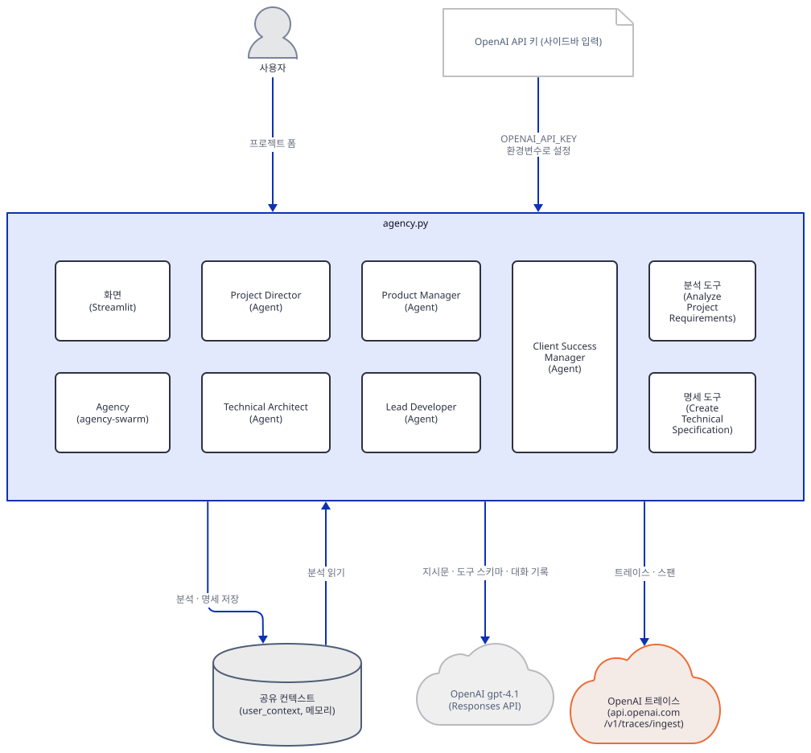

## 요청 한 건이 흐르는 과정

폼 제출 한 번이 모델 호출 일곱 번이 되는 과정입니다. 그림이 길어 다섯 장으로 나눴고 메시지는 코드 순서대로 한 장에 하나씩 있습니다. 먼저 제출부터 CEO의 답, 그리고 CTO를 부르는 줄까지입니다.

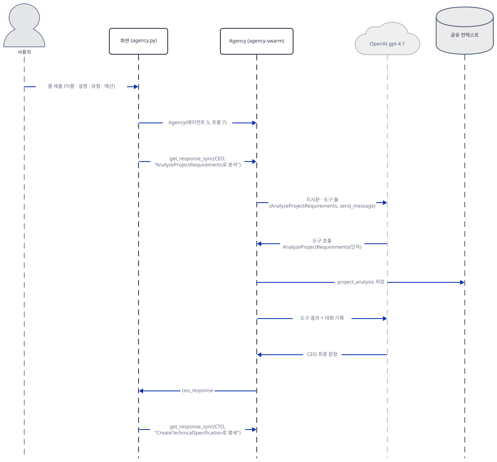

CEO의 모델 요청은 두 번입니다. 첫 요청에서 모델이 `AnalyzeProjectRequirements`를 부르면 `Agency`가 도구를 실행해 컨텍스트에 `project_analysis`를 저장하고, 결과 문자열과 기록을 실어 두 번째 요청을 보냅니다. 두 번째 응답의 문장이 `ceo_response`입니다. CTO도 같은 모양인데 도구가 컨텍스트에서 분석을 읽고 명세를 저장합니다. 이 장은 첫 줄이 위 그림의 마지막 줄을 이어받습니다.

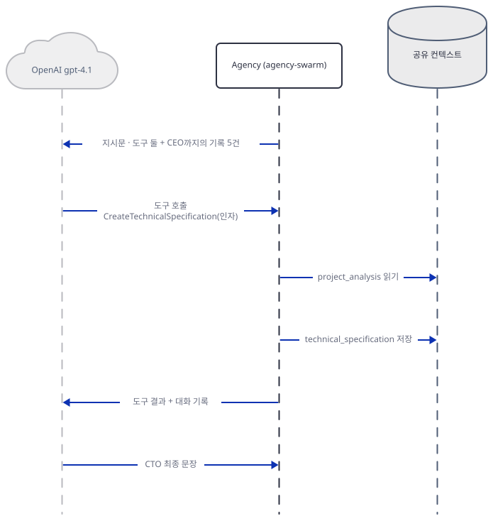

PM과 개발자는 도구를 쓰지 않아 모델 요청이 한 번씩이고 입력 항목만 9건, 11건으로 늘어납니다.

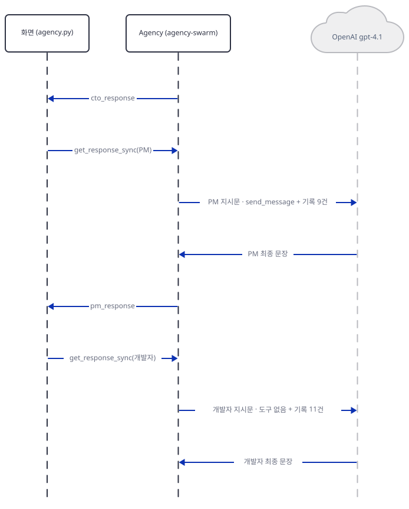

고객 성공 담당의 호출은 입력이 13건입니다.

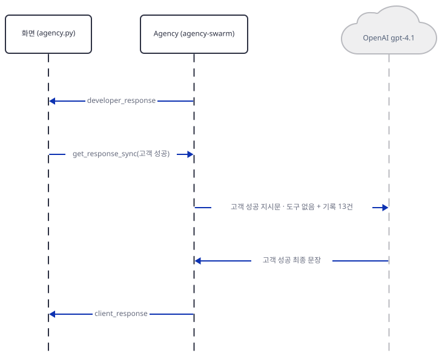

마지막으로 화면이 탭을 채웁니다. 트레이스는 호출이 진행되는 동안 배경에서 묶음으로 나가므로 이 그림의 마지막 줄은 정리를 위한 배치이고 시각의 순서는 아닙니다. 내가 돌린 실행에서는 첫 한 건이 CEO의 첫 모델 요청보다도 먼저 올라갔습니다(Step 6의 서버 출력). 느린 서버에서 이 순서가 어떻게 되는지는 확인하지 않았습니다.

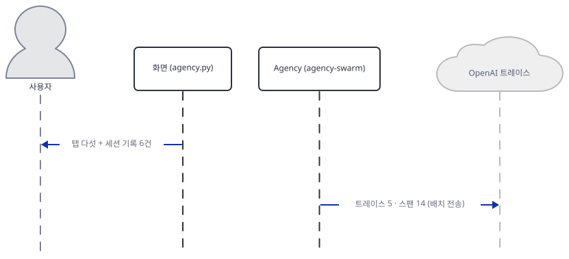

## 실행 체크리스트

- [ ] `uv pip install -r requirements.txt` 뒤 `openai==2.44.0`으로 낮췄고 `Usage() ok`가 나온다
- [ ] `check_tools.py`에서 도구 이름이 클래스 이름이고, 분석 없이 부른 명세 도구가 오류 문자열을 돌려준다
- [ ] `check_agency.py`가 진입점 다섯과 흐름 일곱 줄을 출력한다
- [ ] `check_ui.py`에서 키를 넣기 전에는 폼이 없고 넣은 뒤에 나타난다
- [ ] `run_app.py`가 탭 다섯과 세션 기록 여섯 건을 출력하고 가짜 서버가 `responses` 일곱 줄을 찍는다
- [ ] Step 5의 `run_app.py`를 `OPENAI_AGENTS_DISABLE_TRACING=1`로 돌렸고, 트레이스를 가짜 서버로 돌린 실행은 `traces/ingest`가 합계 19건이다
- [ ] 작업 폴더에 내가 저장한 파일 말고 새 파일이 없다

## 문제 해결

| 증상 | 원인 | 해결 |
|---|---|---|
| 화면에 `Error during analysis: Runner execution failed for agent Project Director`, 모델 서버(가짜 서버 포함)에는 요청이 한 건도 안 옴 | `openai` 2.45.0 이상과 `openai-agents` 0.6.4가 맞지 않아 `Usage()`에서 `ValidationError`가 난다(직접 확인, Step 1) | `uv pip install "openai==2.44.0"` |
| `[non-fatal] Tracing: request failed` 줄이 쌓임 | 트레이스를 `api.openai.com`으로 보내려다 막힘(앱 결과에는 영향 없음, 직접 확인). 막히지 않는 PC에서는 가짜 키로 실제 요청이 나간다 | 보내고 싶지 않으면 `OPENAI_AGENTS_DISABLE_TRACING=1` |
| `.env`의 값이 셸 값을 이김 | `agency_swarm` import가 `load_dotenv(override=True)`를 부름(직접 확인) | `.venv`가 있는 폴더와 그 위쪽 폴더의 `.env`를 확인 |
| 가짜 서버가 `PermissionError: [WinError 10013]`으로 안 뜸 | Windows가 막아 둔 포트 번호(58713에서 직접 봄) | 다른 포트를 쓴다 |
| 도구가 `Project analysis already exists`를 돌려줌 | 분석 도구는 한 `Agency`에서 한 번만 성공한다(Step 2에서 직접 확인) | 폼을 다시 제출해 `Agency`를 새로 만든다 |
| 키를 넣기 전에는 폼이 없음 | 106행의 `return`(직접 확인) | 사이드바에 키를 넣는다 |
| 일정·우선순위를 바꿔도 CEO의 분석이 같음 | CEO 메시지에 두 값이 없고 분석 딕셔너리도 고정값(Step 2·5) | 원본을 고치지 말고 복사본에서 266~272행의 메시지와 29~36행을 고친다 |

## 더 해보기

- 복사본에서 `send_message`를 실제로 쓰게 해 봅니다. CEO의 지시문에 "CTO에게 먼저 물어볼 것"을 넣고 가짜 서버가 `send_message`를 부르도록 바꿔, 대화 기록이 어떻게 늘어나는지 `input_items`로 비교해 보세요.
- 분석 도구의 고정 딕셔너리를 폼 입력(`timeline`·`priority`)을 쓰는 값으로 바꾸고, CEO 메시지에도 두 값을 넣어 보세요.
- `communication_flows`에 `(developer, cto)`를 더하면 개발자의 도구 목록이 어떻게 바뀌는지 `check_agency.py`와 Step 5의 서버 출력으로 확인해 보세요.

## 다음 날 예고

[Day 119 · 🧭 AG2 Adaptive Research Team](../day119-ag2-adaptive-research-team/README.md) — 같은 "에이전트 팀"이지만 AG2 프레임워크를 쓰는 앱으로, 질문을 라우터가 갈라 에이전트에게 보내는 파일 넷(`agents.py`·`app.py`·`router.py`·`tools.py`, 합계 402줄)짜리입니다. 기본 모델은 `gpt-5-nano`이고 웹 검색은 공개 SearXNG 인스턴스(`https://searxng.site/search`)로 갑니다(소스로 확인).
