# Day 119 · 🧭 AG2 Adaptive Research Team

> 볼륨 8 🤝 Multi-agent Teams · 난이도 ★★★ ⚠(`requirements.txt`의 `ag2[openai]>=0.11.0`은 오늘 1.1.2로 풀리는데 이 버전에는 앱이 import하는 `autogen` 패키지가 없어, 설치 그대로는 첫 줄에서 `ModuleNotFoundError`로 멈춥니다. `ag2[openai]<0.14`로 고정해야 돕니다 — Step 1. 또 기본 모델 `gpt-5-nano`의 날짜 붙은 버전 `gpt-5-nano-2025-08-07`이 OpenAI 폐기 표에서 2026-12-11에 내려갑니다) · 예상 소요 105분(앱은 네 파일 402줄이지만 `ag2` 버전을 열 가지로 갈아 끼워 보고, 가짜 서버와 확인 스크립트 여섯을 직접 저장해 돌리고, 시퀀스·구조 그림 일곱 장을 따라가야 해서 읽는 시간보다 손으로 돌려 보는 시간이 더 걸립니다) · API 비용 대략 요청 1건에 `gpt-5-nano` 호출 4회, 합쳐서 $0.01 이하(OpenAI 모델 페이지의 입력 $0.05·출력 $0.40(1M 토큰당, https://developers.openai.com/api/docs/models/gpt-5-nano, 2026-10-09 확인)에, 호출당 입력 2,000토큰·출력 4,000토큰(추론 토큰 포함)이라고 가정해 대입한 어림이며 키가 없어 실제 토큰 수는 재지 못했습니다) · 원본 앱: `advanced_ai_agents/multi_agent_apps/agent_teams/ag2_adaptive_research_team`

## 오늘 만들 것

PDF·텍스트 문서를 올리고 질문을 쓰고 "Run Research"를 누르면, 에이전트들이 차례로 일해서 근거가 붙은 답을 돌려주는 Streamlit 앱입니다. 네 파일(편집기 기준 `agents.py` 85줄, `app.py` 71줄, `router.py` 141줄, `tools.py` 105줄)로 이루어져 있습니다. 먼저 분류 에이전트가 질문이 "로컬 문서"로 풀릴지 "웹 검색"이 필요할지 JSON으로 답하고, 그 결과에 따라 로컬 조사 에이전트(올린 문서에서 단어가 겹치는 조각을 찾음)나 웹 조사 에이전트(공개 SearXNG 검색 결과를 읽음) 가운데 하나가 증거와 초안을 만듭니다. 그다음 검증 에이전트가 증거가 충분한지 판정하고, 종합 에이전트가 최종 답을 씁니다. 화면에는 라우팅 결정·증거·검증·최종 답 네 칸이 남습니다.

이름은 "팀"이지만 AG2의 팀 기능(`GroupChat`, Swarm 등)은 쓰지 않습니다. 네 파일에서 `AssistantAgent`와 `generate_reply`만 쓰고 그 밖의 대화 API는 없다는 것을 grep으로 확인했습니다. 차례를 정하는 것은 `router.py`의 파이썬 `if`문입니다. 같은 볼륨의 Day 116은 AG2의 Swarm이 에이전트 사이의 차례를 쥐고 에이전트의 함수가 다음을 가리키는 앱이었고, 오늘은 그 대신 파이썬 코드가 에이전트를 하나씩 부릅니다. Day 116 Step 1이 `autogen`이라는 이름의 버전 경계를 다뤘는데, 오늘은 같은 AG2에서 이름 `ag2`로 설치되는 쪽의 경계입니다.

이 앱은 `requirements.txt` 그대로는 돌지 않습니다. 어디서 끊기는지, 어떤 버전이면 도는지는 Step 1에서 직접 확인합니다. 이 문서는 OpenAI와 공개 SearXNG(`searxng.site`)에 요청을 보내지 않습니다. 모델과 검색은 내 PC의 가짜 서버로 대신했고, 그래서 아래의 증거·답은 모두 가짜 서버가 만든 고정 문장입니다. 진짜 `gpt-5-nano`가 어떤 JSON을 내는지, 진짜 SearXNG가 결과를 주는지는 확인하지 못했고, 호출 순서·횟수·길이와 코드가 어떻게 가르는지는 끝까지 직접 확인했습니다. 아래는 완성된 아키텍처입니다.

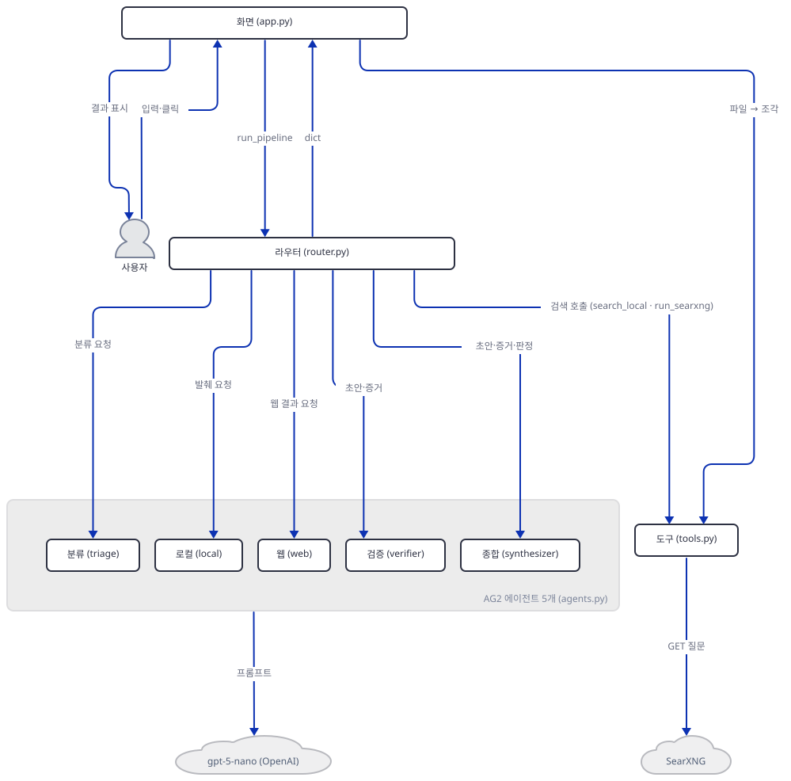

## 사전 준비

| 서비스/도구 | 용도 | 발급·설치 |
|---|---|---|
| OpenAI API 키 | 에이전트의 `gpt-5-nano` 호출 인증. 사이드바 입력창(`type="password"`)에 직접 붙여넣습니다(환경변수가 아닙니다). 이 문서의 재현은 가짜 키로 합니다 | https://platform.openai.com/ 가입 후 발급 |
| uv, Python | 가상환경 생성과 패키지 설치. 이 문서는 Python 3.13.3에서 확인했습니다 | [공통 사전 준비](../README.md#공통-사전-준비-한-번만) 절 참고 |
| `ag2[openai]<0.14` | `import autogen`이 되고 앱이 쓰는 `SearxngSearchTool`이 남아 있는 마지막 계열(0.13.4). `requirements.txt` 그대로는 1.1.2가 깔려 실패합니다 | Step 1에서 `uv pip install` |
| 인터넷 연결 | PyPI 설치, OpenAI API 호출, 공개 SearXNG 검색 | 별도 설치 없음 |

기본 모델 `gpt-5-nano`는 오늘 아직 쓸 수 있지만, OpenAI 폐기 표(https://developers.openai.com/api/docs/deprecations)에 `gpt-5-nano-2025-08-07`이 2026-12-11 제거, 대체 `gpt-5.6-luna`로 올라 있습니다(2026-10-10 원문을 `curl`로 받아 그 행을 직접 확인). 짧은 이름 `gpt-5-nano`는 표에 따로 없지만, 모델 페이지(https://developers.openai.com/api/docs/models/gpt-5-nano)가 "GPT-5 nano"를 Deprecated로 표시하고 스냅샷 목록에 `gpt-5-nano` → `gpt-5-nano-2025-08-07` 하나뿐이라, 짧은 이름도 같은 날 함께 내려가는 것으로 읽는 편이 안전합니다. 사이드바의 "Model" 칸에서 바꿀 수 있습니다. 앱이 닿는 외부 서비스는 OpenAI와 SearXNG 둘뿐이고, 이 앱은 agno를 쓰지 않으므로 앞 날들에서 본 agno 통계 전송도 없습니다(import 줄이 `autogen`·`streamlit`·`pypdf`·`os`·표준 라이브러리뿐 — 소스로 확인). `ag2` 0.13.4 소스에서 `posthog`를 언급하는 `.py`는 하나도 없었고, 앱이 쓰는 `oai/`·`agentchat/conversable_agent.py`·`agentchat/assistant_agent.py`·`tools/`에는 `telemetry`라는 글자도 없었습니다(grep으로 확인).

## 아키텍처 한눈에 보기

| 컴포넌트 | 역할 | 코드 위치 |
|---|---|---|
| Streamlit 화면 | 사이드바(키·모델·웹 토글), 파일 업로더, 질문 칸, 버튼, 결과 네 칸 | `advanced_ai_agents/multi_agent_apps/agent_teams/ag2_adaptive_research_team/app.py:1-71` |
| 문서 읽기와 조각 | PDF는 pypdf, 그 밖은 UTF-8(실패하면 latin-1)로 읽고 800단어씩 120단어 겹쳐 자름 | `advanced_ai_agents/multi_agent_apps/agent_teams/ag2_adaptive_research_team/tools.py:11-81` |
| 로컬 검색 | 질문과 조각의 영문·숫자 단어가 겹치는 수로 점수를 매겨 상위 5개 | `advanced_ai_agents/multi_agent_apps/agent_teams/ag2_adaptive_research_team/tools.py:24-29`, `advanced_ai_agents/multi_agent_apps/agent_teams/ag2_adaptive_research_team/tools.py:84-95` |
| 웹 검색 | AG2의 `SearxngSearchTool`로 공개 SearXNG를 GET | `advanced_ai_agents/multi_agent_apps/agent_teams/ag2_adaptive_research_team/tools.py:98-105` |
| 에이전트 다섯 | 분류·로컬 조사·웹 조사·검증·종합. 모두 `AssistantAgent`, 시스템 메시지만 다름 | `advanced_ai_agents/multi_agent_apps/agent_teams/ag2_adaptive_research_team/agents.py:24-78` |
| 모델 설정과 호출 | `llm_config`(모델, 키, `temperature` 0.2), `generate_reply` 한 번 | `advanced_ai_agents/multi_agent_apps/agent_teams/ag2_adaptive_research_team/agents.py:8-21`, `advanced_ai_agents/multi_agent_apps/agent_teams/ag2_adaptive_research_team/agents.py:81-85` |
| 라우터 | 에이전트를 차례로 부르고 JSON을 꺼내 경로를 정함 | `advanced_ai_agents/multi_agent_apps/agent_teams/ag2_adaptive_research_team/router.py:11-141` |
| OpenAI API | 에이전트의 실제 추론(`gpt-5-nano`) | `advanced_ai_agents/multi_agent_apps/agent_teams/ag2_adaptive_research_team/agents.py:8` |
| 공개 SearXNG | 웹 검색 결과 | `advanced_ai_agents/multi_agent_apps/agent_teams/ag2_adaptive_research_team/app.py:8` |

## 단계별 진행

명령은 bash 기준입니다. 이 문서의 재현은 저장소 밖의 스크래치 폴더에서 했고, 앱 폴더를 그 안의 `app/`으로 복사해 썼습니다. 독자도 그렇게 하면 저장소에 `.venv`나 `__pycache__`가 생기지 않습니다. `<저장소>`는 이 저장소를 받은 경로입니다. 스크래치 폴더를 만들고 안에서 시작합니다.

```bash
mkdir ag2-day119 && cd ag2-day119
cp -r <저장소>/advanced_ai_agents/multi_agent_apps/agent_teams/ag2_adaptive_research_team app
```

Windows PowerShell 5.1에서는 bash 전용 줄이 그대로 돌지 않습니다. 아래 대응은 **실행해 보지 못했습니다**(하네스가 PowerShell 실행을 막아 문서만으로 옮긴 것입니다). 가장 조심할 것은 `echo route=local > ctl.txt`입니다. PowerShell 5.1의 `>`는 파일을 UTF-16으로 저장하는데, `fake.py`는 `ctl.txt`를 UTF-8로 읽으므로 UTF-16 파일을 읽는 순간 `UnicodeDecodeError`가 나서 요청마다 응답 없이 연결이 끊깁니다(UTF-16 BOM이 붙은 파일을 `fake.py`의 `ctl()`에 읽혀 `UnicodeDecodeError: 'utf-8' codec can't decode byte 0xff`가 나는 것까지는 직접 확인했고, PowerShell에서 `>`가 UTF-16이 되는 것은 PowerShell 문서에 따랐습니다).

| bash | PowerShell 5.1 |
|---|---|
| `mkdir ag2-day119 && cd ag2-day119` | `mkdir ag2-day119` 다음 줄에 `cd ag2-day119` |
| `cp -r <저장소>/... app` | `Copy-Item -Recurse <저장소>\advanced_ai_agents\multi_agent_apps\agent_teams\ag2_adaptive_research_team app` |
| `source .venv/bin/activate` | `.venv\Scripts\Activate.ps1` |
| `echo route=local > ctl.txt` | `Set-Content -Path ctl.txt -Value "route=local" -Encoding ascii` (줄이 둘이면 `-Value "route=web","searx=fail"`) |
| `sed -i 's/A/B/' app/app.py` (Step 8, A·B는 주소) | `(Get-Content app\app.py -Encoding utf8) -replace 'https://searxng.site/search','http://127.0.0.1:52718/search' \| Set-Content app\app.py -Encoding utf8` |
| `curl http://localhost:8765/_stcore/health` | `curl.exe http://localhost:8765/_stcore/health` (`curl`은 `Invoke-WebRequest` 별칭) |
| `fake.py ... >> fake.log 2>&1`, `cat fake.log` | 터미널 1에서 리디렉션 없이 `fake.py`를 실행하고 그 터미널에 찍히는 줄을 봅니다. 또는 `Get-Content fake.log` |
| `cd app && uv run ... ; cd ..` (Step 1 확인) | 줄을 나눠 `cd app`, `uv run ...`, `cd ..` 순서로(5.1에는 `&&`가 없음) |
| `-c "..."` 여러 줄 | 따옴표 문제가 나니 같은 내용을 `.py`로 저장해 `uv run --no-project python 파일.py` |

### Step 1. 환경 만들기 — `ag2`가 오늘 무엇으로 풀리는가

**목적.** `requirements.txt`를 그대로 설치하면 무엇이 깔리는지, 앱의 import가 되는지 확인하고, 되는 버전으로 고정합니다.

**할 일.**

`advanced_ai_agents/multi_agent_apps/agent_teams/ag2_adaptive_research_team/requirements.txt:1-3`

```text
ag2[openai]>=0.11.0
streamlit>=1.33.0
pypdf>=4.2.0
```

```bash
uv venv
uv pip install -r app/requirements.txt
uv run --no-project python -c "import autogen"
```

(pip 대안: `python -m venv .venv`로 만든 뒤 활성화(bash는 `source .venv/bin/activate`, Git Bash·Windows는 `.venv/Scripts/activate`)하고 `pip install -r app/requirements.txt`. 이 저장소 루트에는 `pyproject.toml`이 있어 이후 `uv run`에는 모두 `--no-project`를 붙입니다.) 이 문서를 쓰며 설치했을 때(2026-10-09) **ag2 1.1.2**, openai 3.26.1, streamlit 1.65.0, pypdf 6.20.0이 받아졌습니다(직접 확인). 마지막 명령의 직접 확인한 출력입니다(traceback의 마지막 줄).

```text
ModuleNotFoundError: No module named 'autogen'
```

앱은 `agents.py`와 `tools.py`에서 `autogen`을 import합니다.

`advanced_ai_agents/multi_agent_apps/agent_teams/ag2_adaptive_research_team/agents.py:5-5`

```python
from autogen import AssistantAgent
```

`advanced_ai_agents/multi_agent_apps/agent_teams/ag2_adaptive_research_team/tools.py:7-8`

```python
from pypdf import PdfReader
from autogen.tools.experimental import SearxngSearchTool
```

AG2는 1.0부터 새로 쓴 프레임워크가 최상위 패키지 `ag2`가 되었고, 예전 `import autogen` 쪽(`AssistantAgent` 등)은 별도 저장소로 옮겼다고 1.1.2의 패키지 설명(`METADATA`)에 적혀 있습니다. 같은 설명은 `pip install ag2-classic`으로 옛 쪽을 설치하라고 하지만, 오늘 PyPI에서 `ag2-classic`은 404였고 `uv pip install ag2-classic`도 "no versions"로 실패했습니다(직접 확인). 그래서 `ag2` 자체의 옛 버전으로 내려가야 합니다. 버전마다 새 가상환경에 `ag2[openai]==<버전>`만 설치해 같은 두 줄을 import 해 봤습니다(모두 직접 확인).

| `ag2` 버전 | 결과 |
|---|---|
| 0.11.0 · 0.11.5 · 0.12.3 · 0.13.4 | `AssistantAgent`와 `SearxngSearchTool` 모두 import 됨 |
| 0.14.0 | `import autogen`은 되지만 `ImportError: cannot import name 'SearxngSearchTool' from 'autogen.tools.experimental'` |
| 1.0.0b0 · 1.0.0 · 1.0.6 · 1.1.0 · 1.1.2 | `ModuleNotFoundError: No module named 'autogen'` |

`SearxngSearchTool`은 0.13.4 소스에서 생성할 때 `DeprecationWarning: SearxngSearchTool is deprecated and will be removed in v0.14. Use DuckDuckGoSearchTool or TavilySearchTool instead.`를 냅니다(직접 확인). 0.14.0에서 정말 사라진 것이 위 표입니다. 그러니 0.14 미만으로 고정합니다. 최소 버전 0.11.0도 이 문서의 가짜 서버 재현(Step 7의 첫 경로)을 끝까지 통과했지만, 그때는 `openai` 3.26.1이 같이 깔렸고 0.13.4에서는 2.54.0이 깔렸습니다(직접 확인).

```bash
uv pip install "ag2[openai]<0.14" "streamlit>=1.33.0" "pypdf>=4.2.0"
```

이 줄은 같은 가상환경에서 그대로 돌려도 됩니다. 1.1.2가 깔린 가상환경에서 실행하니 `- ag2==1.1.2 + ag2==0.13.4`, `- openai==3.26.1 + openai==2.54.0`으로 내려갔고 아래 확인 두 명령이 통과했습니다(직접 확인). 이 문서의 나머지 재현은 처음부터 이 줄로 설치한 새 가상환경에서 했습니다. 앱 폴더의 `requirements.txt`는 고치지 않습니다.

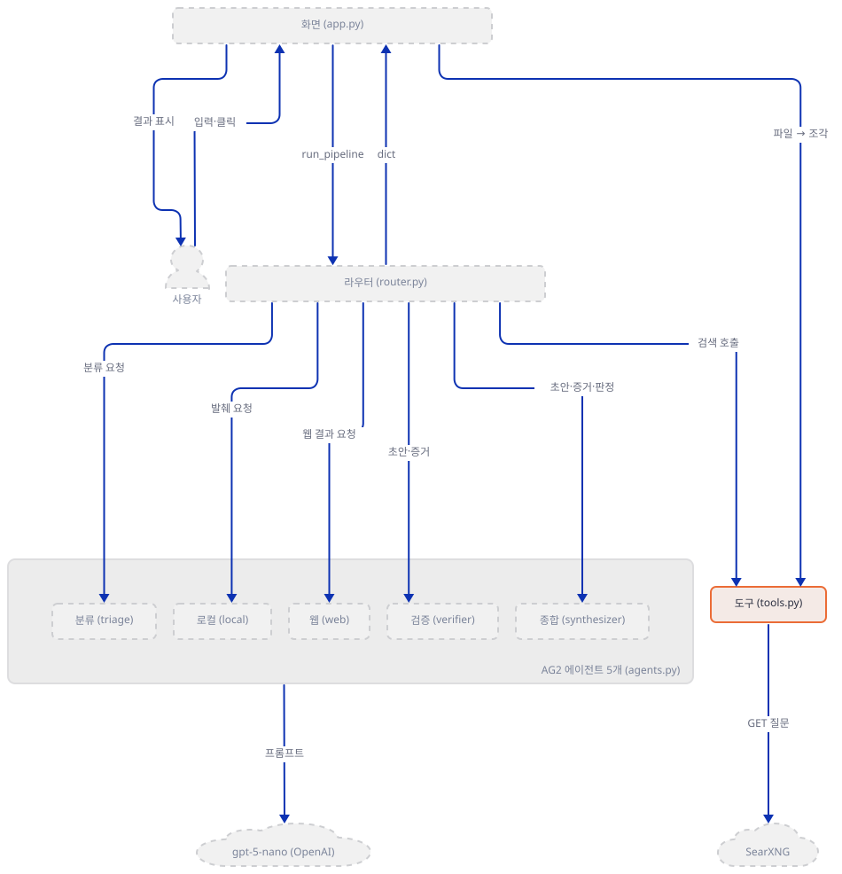

**확인.**

```bash
uv run --no-project python -W ignore -c "
import importlib.metadata as m
from autogen import AssistantAgent
from autogen.tools.experimental import SearxngSearchTool
print('ag2', m.version('ag2'), '| openai', m.version('openai'), '| IMPORT_OK')"
cd app && uv run --no-project python -B -c "
for f in ['agents','app','router','tools']:
    compile(open(f+'.py', encoding='utf-8').read(), f+'.py', 'exec')
print('COMPILE_OK')"; cd ..
```

직접 확인한 출력:

```text
ag2 0.13.4 | openai 2.54.0 | IMPORT_OK
COMPILE_OK
```

### Step 2. 화면과 입력

**목적.** 키를 어디서 받는지, 화면이 어떻게 생겼는지, 버튼이 어디서 막히는지 봅니다.

**할 일.**

`advanced_ai_agents/multi_agent_apps/agent_teams/ag2_adaptive_research_team/app.py:1-35`

```python
import os
import streamlit as st

from agents import DEFAULT_MODEL
from router import run_pipeline
from tools import build_local_index, load_documents

SEARXNG_BASE_URL = "https://searxng.site/search"


st.set_page_config(page_title="AG2 Adaptive Research Team", layout="wide")

st.title("AG2 Adaptive Research Team")
st.caption("Agent teamwork + agent-enabled routing, built with AG2")

with st.sidebar:
    st.header("API Configuration")
    api_key = st.text_input("OpenAI API Key", type="password")
    model = st.text_input("Model", value=DEFAULT_MODEL)
    web_enabled = st.toggle("Enable Web Fallback", value=True)
    st.markdown(
        "Web fallback uses a public SearxNG instance, which may be rate-limited."
    )

st.subheader("1. Upload Local Documents")
files = st.file_uploader(
    "Upload PDFs or text files",
    type=["pdf", "txt", "md"],
    accept_multiple_files=True,
)

st.subheader("2. Ask a Question")
question = st.text_area("Research question")

run_clicked = st.button("Run Research")
```

사이드바에서 키(`type="password"`)와 모델(기본값 `DEFAULT_MODEL`, 곧 `gpt-5-nano`)과 "Enable Web Fallback" 토글(기본 켬)을 받고, 본문에서 파일(pdf·txt·md, 여러 개)과 질문을 받습니다. 검색 주소 `SEARXNG_BASE_URL`(8행)은 화면에서 바꿀 수 없는 상수입니다. 앱 폴더에서 앱을 실제로 띄우는 명령은 이렇습니다.

```bash
cd app
uv run --no-project streamlit run app.py
```

확인용으로 헤드리스 실행만 해 본다면 외부 IP 조회를 막으려고 `--server.address`를 함께 붙입니다(Day 060 참고).

```bash
uv run --no-project streamlit run app.py --server.headless true --server.address localhost --server.port 8765 --browser.gatherUsageStats false
curl http://localhost:8765/_stcore/health
```

Streamlit 1.65.0에서 직접 확인한 출력은 `ok`였고 시작 로그에 `URL: http://localhost:8765`가 나왔습니다(확인할 때는 8765 대신 임의의 높은 포트를 썼습니다).

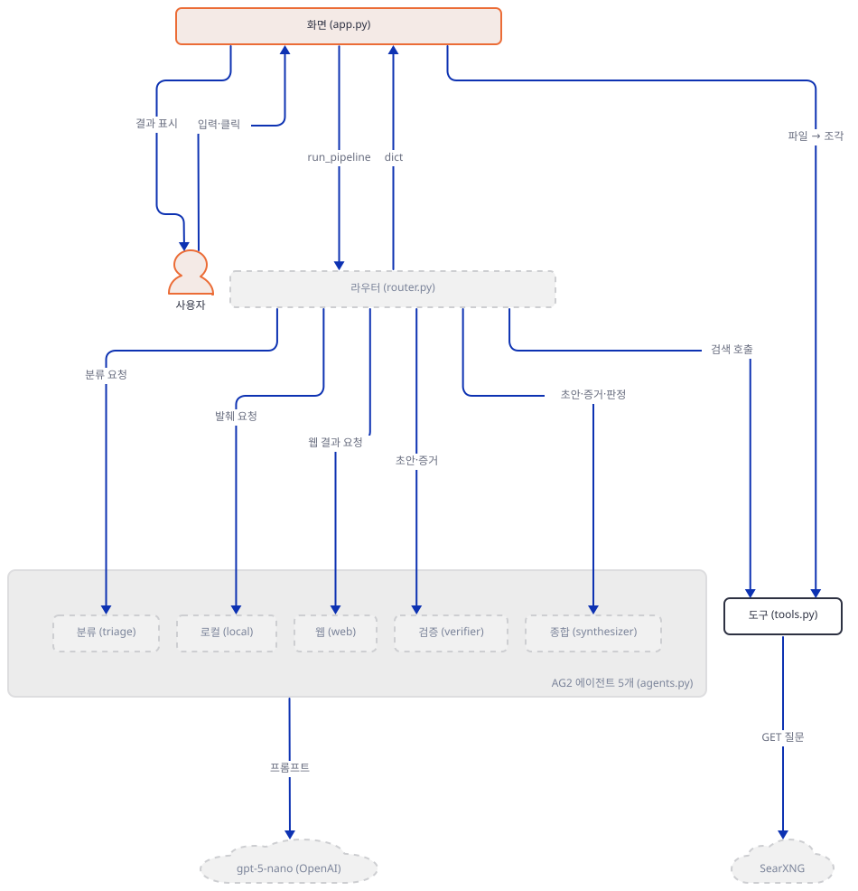

**확인.** 키 없이 버튼을 눌렀을 때와 키만 넣고 눌렀을 때를 Streamlit의 `AppTest`로 봅니다. 이 단계에서는 파이프라인까지 가지 않는 앞 네 줄만 돌립니다(전체 실행은 Step 8).

```bash
uv run --no-project python -X utf8 -B -W ignore -c "
import sys; sys.path.insert(0, 'app')
from streamlit.testing.v1 import AppTest
at = AppTest.from_file('app/app.py', default_timeout=60).run()
print('첫 화면 예외:', [e.value for e in at.exception])
print('소제목:', [s.value for s in at.subheader])
at.button[0].click().run()
print('키 없이 클릭:', [e.value for e in at.error])
at.sidebar.text_input[0].set_value('sk-fake')
at.button[0].click().run()
print('키만 넣고 클릭:', [e.value for e in at.error])"
```

직접 확인한 출력(`missing ScriptRunContext!` 경고는 `AppTest`를 서버 밖에서 부를 때 나오며 무시해도 됩니다):

```text
첫 화면 예외: []
소제목: ['1. Upload Local Documents', '2. Ask a Question']
키 없이 클릭: ['Please provide your OpenAI API key.']
키만 넣고 클릭: ['Please enter a research question.']
```

### Step 3. 문서를 조각으로 — `tools.py`

**목적.** 올린 파일이 어떻게 `Document`가 되고 조각(`Chunk`)으로 잘리는지 봅니다.

**할 일.**

`advanced_ai_agents/multi_agent_apps/agent_teams/ag2_adaptive_research_team/tools.py:11-21`

```python
@dataclass
class Document:
    name: str
    text: str


@dataclass
class Chunk:
    doc_name: str
    chunk_id: int
    text: str
```

`advanced_ai_agents/multi_agent_apps/agent_teams/ag2_adaptive_research_team/tools.py:32-81`

```python
def load_documents(uploaded_files: Iterable) -> List[Document]:
    documents: List[Document] = []

    for file in uploaded_files:
        name = file.name
        if name.lower().endswith(".pdf"):
            reader = PdfReader(file)
            pages_text = []
            for page in reader.pages:
                pages_text.append(page.extract_text() or "")
            text = _clean_text("\n".join(pages_text))
        else:
            raw = file.read()
            try:
                text = raw.decode("utf-8")
            except UnicodeDecodeError:
                text = raw.decode("latin-1")
            text = _clean_text(text)

        if text:
            documents.append(Document(name=name, text=text))

    return documents


def chunk_text(text: str, chunk_size: int = 800, overlap: int = 120) -> List[str]:
    words = text.split()
    if not words:
        return []

    chunks: List[str] = []
    start = 0
    while start < len(words):
        end = min(len(words), start + chunk_size)
        chunk = " ".join(words[start:end])
        chunks.append(chunk)
        if end == len(words):
            break
        start = max(0, end - overlap)

    return chunks


def build_local_index(documents: List[Document]) -> List[Chunk]:
    index: List[Chunk] = []
    for doc in documents:
        chunks = chunk_text(doc.text)
        for idx, chunk in enumerate(chunks, start=1):
            index.append(Chunk(doc_name=doc.name, chunk_id=idx, text=chunk))
    return index
```

PDF는 `PdfReader`로 쪽마다 글자를 뽑아 이어 붙이고, 그 밖의 파일은 UTF-8로 읽다가 실패하면 latin-1로 읽습니다. 공백은 모두 한 칸으로 줄이고, 글자가 하나도 없으면 문서로 치지 않습니다(`if text:`, 51행). 파일 확장자는 소문자로 바꿔 비교합니다(37행). 스캔한 그림뿐인 PDF는 글자가 없어 조용히 빠집니다. 직접 만든 한 쪽짜리 PDF 둘(`plan.pdf`, `PLAN2.PDF`)은 둘 다 문서가 되었고 글자가 없는 빈 쪽 PDF는 빈 목록이 되었습니다(직접 확인). 한 가지 함정이 있습니다. 한국어 텍스트를 CP949로 저장한 `.txt`는 UTF-8 읽기가 실패하지만 latin-1 읽기는 항상 성공하므로, 오류 없이 깨진 글자(`'¾ËÆÄ º£Å¸'`)가 문서가 되었습니다(직접 확인).

조각은 단어 800개씩이고 다음 조각은 120개 앞에서 시작합니다. 확인 스크립트 `chunks.py`입니다.

`chunks.py`

```python
import sys; sys.path.insert(0, "app")
from tools import chunk_text
words = " ".join(f"w{i}" for i in range(2000))
chunks = chunk_text(words)
print(len(chunks), [len(c.split()) for c in chunks], [c.split()[0] for c in chunks])
print(len(chunk_text(" ".join(["x"] * 800))), len(chunk_text(" ".join(["x"] * 801))))
```

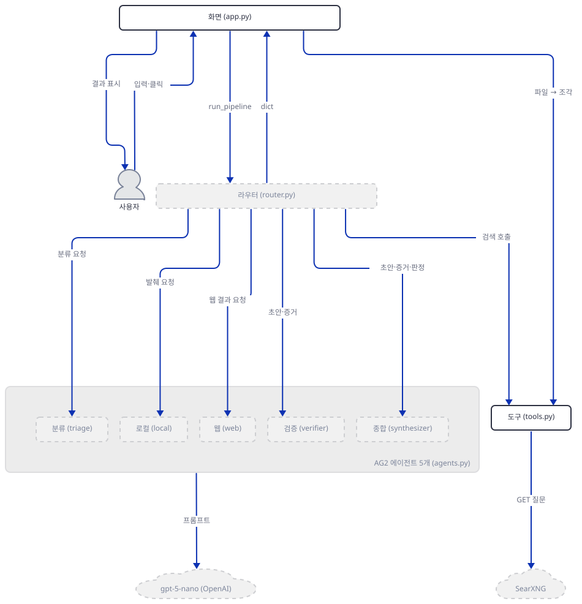

**확인.**

```bash
uv run --no-project python -B chunks.py
```

직접 확인한 출력은 이랬습니다.

```text
3 [800, 800, 640] ['w0', 'w680', 'w1360']
1 2
```

2,000단어는 조각 셋(800·800·640)이고 시작 위치는 0·680·1360입니다. 정확히 800단어면 한 조각, 801단어면 둘입니다.

### Step 4. 로컬 검색과 발췌 — 에이전트에게 가는 것은 앞 300자

**목적.** 질문과 조각을 어떻게 맞춰 보는지, 조사 에이전트가 실제로 받는 글이 무엇인지 봅니다.

**할 일.**

`advanced_ai_agents/multi_agent_apps/agent_teams/ag2_adaptive_research_team/tools.py:24-29`

```python
def _clean_text(text: str) -> str:
    return re.sub(r"\s+", " ", text).strip()


def _tokenize(text: str) -> List[str]:
    return re.findall(r"[a-zA-Z0-9]+", text.lower())
```

`advanced_ai_agents/multi_agent_apps/agent_teams/ag2_adaptive_research_team/tools.py:84-95`

```python
def search_local(query: str, index: List[Chunk], top_k: int = 5) -> List[Chunk]:
    query_tokens = set(_tokenize(query))
    scored = []
    for chunk in index:
        chunk_tokens = set(_tokenize(chunk.text))
        overlap = len(query_tokens & chunk_tokens)
        if overlap == 0:
            continue
        scored.append((overlap, chunk))

    scored.sort(key=lambda item: item[0], reverse=True)
    return [item[1] for item in scored[:top_k]]
```

`advanced_ai_agents/multi_agent_apps/agent_teams/ag2_adaptive_research_team/router.py:21-26`

```python
def _summarize_chunks(chunks: List[Chunk]) -> str:
    lines = []
    for chunk in chunks:
        snippet = chunk.text[:300].strip()
        lines.append(f"- {chunk.doc_name} [chunk {chunk.chunk_id}]: {snippet}")
    return "\n".join(lines)
```

점수는 질문 단어 집합과 조각 단어 집합의 교집합 크기이고, 겹침이 0이면 제외하며, 큰 순서로 5개를 고릅니다. 불용어를 거르지 않아서 "what is the" 같은 질문은 `the cat is on the mat`에도 맞습니다(직접 확인). 단어는 `[a-zA-Z0-9]+`로만 뽑으므로 **한글은 단어가 되지 않습니다.** 한글로만 된 질문은 단어가 하나도 없어 검색 결과가 늘 빈 목록이고, 질문에 영문·숫자가 섞이면("GPT-5 가격은?" 같은) 그 부분으로만 맞습니다. 문서가 한국어여도 한글 부분은 점수에 쓰이지 않습니다. 에이전트에게 가는 글은 조각 전체가 아니라 `chunk.text[:300]`, 곧 조각마다 앞 300자뿐입니다. 아래 스크립트의 조각은 701단어(4,906자)인데 그중 322자(줄 머리글 포함)만 갑니다. 800단어 조각이면 더 길어서 비율은 더 작아집니다. 확인 스크립트 `search.py`입니다.

`search.py`

```python
import sys; sys.path.insert(0, "app")
from tools import Document, build_local_index, search_local, _tokenize
from router import _summarize_chunks
print(_tokenize("알파가 무엇인가요? Alpha-2"))
ko = build_local_index([Document("ko.txt", "알파는 첫 번째 글자입니다.")])
print("한국어 질문 →", search_local("알파가 무엇인가요?", ko))
deep = build_local_index([Document("deep.txt", " ".join(["filler"] * 500 + ["quasar"] + ["filler"] * 200))])
hit = search_local("quasar", deep)[0]
sent = _summarize_chunks([hit])
print("조각 글자 수:", len(hit.text), "| 에이전트에 가는 글자 수:", len(sent), "| quasar 들어 있나:", "quasar" in sent)
```

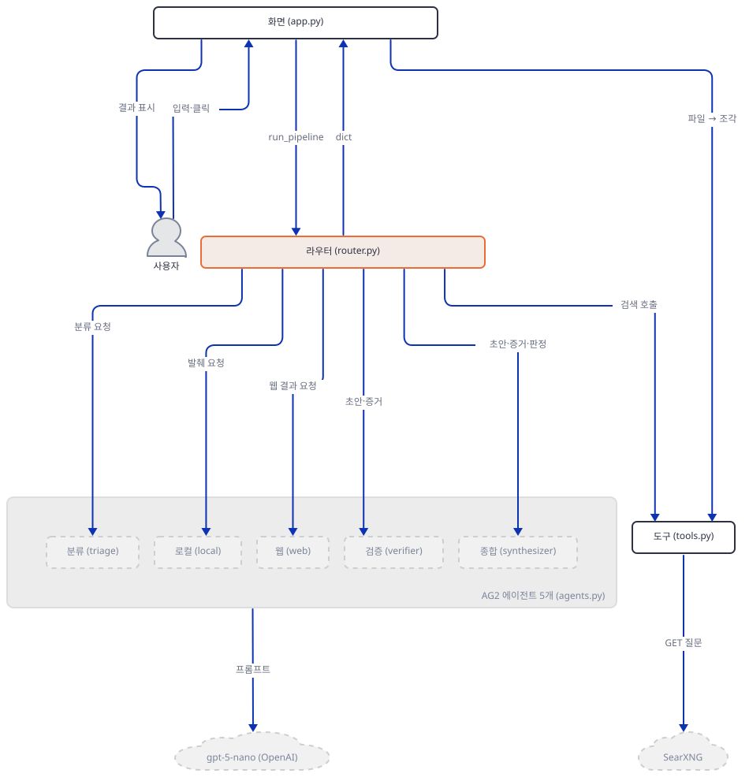

**확인.**

```bash
uv run --no-project python -B search.py
```

직접 확인한 출력:

```text
['alpha', '2']
한국어 질문 → []
조각 글자 수: 4906 | 에이전트에 가는 글자 수: 322 | quasar 들어 있나: False
```

500번째 단어 자리에 놓은 `quasar`는 점수로는 찾히지만(조각이 뽑힘) 에이전트에게는 보이지 않았습니다. 답이 문서 앞쪽에 있어야 로컬 조사가 쓸 만하다는 뜻입니다.

### Step 5. 에이전트 다섯과 모델 호출 — `agents.py`

**목적.** 다섯 에이전트가 무엇으로 다른지, 모델 호출이 어떤 요청이 되는지 봅니다. 가짜 서버로 요청 본문을 직접 봅니다.

**할 일.**

`advanced_ai_agents/multi_agent_apps/agent_teams/ag2_adaptive_research_team/agents.py:8-35`

```python
DEFAULT_MODEL = "gpt-5-nano"


def make_llm_config(api_key: str, model: str = DEFAULT_MODEL, temperature: float = 0.2) -> Dict[str, Any]:
    return {
        "config_list": [
            {
                "api_type": "openai",
                "model": model,
                "api_key": api_key,
            }
        ],
        "temperature": temperature,
    }


def build_agents(api_key: str, model: str = DEFAULT_MODEL) -> Dict[str, AssistantAgent]:
    llm_config = make_llm_config(api_key=api_key, model=model)

    triage_agent = AssistantAgent(
        name="triage_agent",
        llm_config=llm_config,
        system_message=(
            "You are a triage agent for a research team. "
            "Classify whether the question can be answered from local documents or needs web research. "
            "Respond ONLY with JSON."
        ),
    )
```

`advanced_ai_agents/multi_agent_apps/agent_teams/ag2_adaptive_research_team/agents.py:81-85`

```python
def run_agent(agent: AssistantAgent, prompt: str) -> str:
    reply = agent.generate_reply(messages=[{"role": "user", "content": prompt}])
    if isinstance(reply, dict):
        return reply.get("content", "") or ""
    return str(reply)
```

에이전트 다섯(분류 27~35행, 로컬 37~44행, 웹 46~53행, 검증 55~62행, 종합 64~70행)은 시스템 메시지만 다르고 `llm_config`는 같습니다. 대화 기능은 쓰지 않고 `generate_reply(messages=[{"role": "user", "content": prompt}])` 한 번이 호출 한 건입니다. 반환이 dict면 `content`를, 아니면 `str(reply)`를 돌려줍니다. 한 질문에 다섯 가운데 넷만 불립니다(분류·조사 하나·검증·종합). 시스템 메시지의 "Respond ONLY with JSON"은 부탁일 뿐이고 JSON을 강제하는 설정(`response_format` 등)은 없습니다. 요청 본문의 키를 가짜 서버로 봤더니 `messages`·`model`·`stream`·`temperature`뿐이었고 `temperature`는 0.2였습니다(직접 확인).

가짜 서버 `fake.py`를 저장합니다. 모델(OpenAI `chat/completions`)과 검색(`/search`)을 한 서버가 흉내 냅니다. 같은 폴더의 `ctl.txt`로 분류가 무엇이라 답할지 바꿉니다. `allow_reuse_address = False`로 이미 쓰는 포트에 겹쳐 뜨는 것을 막습니다.

`fake.py`

```python
"""가짜 OpenAI(chat completions) + SearxNG 서버. 사용법: python fake.py 포트
같은 폴더의 ctl.txt(없어도 됨)에서 route=local|web|garbage|missing, verdict=insufficient, searx=fail 을 읽는다."""
import json, sys
from http.server import BaseHTTPRequestHandler, HTTPServer
from urllib.parse import urlparse, parse_qs

def ctl():
    try:
        return dict(l.strip().split("=", 1) for l in open("ctl.txt", encoding="utf-8") if "=" in l)
    except OSError:
        return {}

def reply(system):
    c, s = ctl(), system.lower()
    if "triage agent" in s:
        r = c.get("route", "local")
        if r == "garbage": return "I think local is best."
        if r == "missing": return json.dumps({"confidence": 0.5})
        return "```json\n" + json.dumps({"route": r, "confidence": 0.9, "rationale": "FAKE"}) + "\n```"
    if "local research agent" in s:
        return json.dumps({"evidence": [{"source": "notes.txt", "summary": "FAKE-local"}], "draft_answer": "FAKE-local-draft"})
    if "web research agent" in s:
        return json.dumps({"evidence": [{"source": "http://fake.example/a", "summary": "FAKE-web"}], "draft_answer": "FAKE-web-draft"})
    if "verifier" in s:
        return json.dumps({"verdict": c.get("verdict", "sufficient"), "gaps": []})
    return "FAKE-final-answer"

class H(BaseHTTPRequestHandler):
    def log_message(self, *a): pass
    def send_json(self, code, obj):
        b = json.dumps(obj).encode()
        self.send_response(code); self.send_header("Content-Type", "application/json")
        self.send_header("Content-Length", str(len(b))); self.end_headers(); self.wfile.write(b)
    def do_GET(self):
        u = urlparse(self.path)
        print("GET ", u.path, parse_qs(u.query), flush=True)
        if ctl().get("searx") == "fail": return self.send_json(500, {})
        self.send_json(200, {"results": [{"title": "Fake A", "url": "http://fake.example/a", "content": "alpha"}]})
    def do_POST(self):
        body = json.loads(self.rfile.read(int(self.headers["Content-Length"])))
        msgs = body["messages"]
        system = " ".join(m["content"] for m in msgs if m["role"] == "system")
        print("POST", self.path, body["model"], "temperature=", body.get("temperature"), "|", system[:30], flush=True)
        text = reply(system)
        self.send_json(200, {"id": "x", "object": "chat.completion", "created": 1, "model": body["model"],
            "choices": [{"index": 0, "finish_reason": "stop", "message": {"role": "assistant", "content": text}}],
            "usage": {"prompt_tokens": 10, "completion_tokens": 5, "total_tokens": 15}})

class S(HTTPServer):
    allow_reuse_address = False

S(("127.0.0.1", int(sys.argv[1])), H).serve_forever()
```

`drive.py`는 앱의 `run_pipeline`을 직접 부릅니다. 모델 주소는 환경변수 `OPENAI_BASE_URL`로 가짜 서버에 걸고, 검색 주소는 `run_pipeline`의 인자로 넘깁니다. 이 문서의 재현에서는 다른 프로세스와 겹치지 않게 임의의 높은 포트(52718)를 썼고, 외부로 나가지 않도록 `HTTP_PROXY`·`HTTPS_PROXY`를 `http://127.0.0.1:9`로 막고 `NO_PROXY=localhost,127.0.0.1`을 걸었습니다(이 격리는 독자가 따라 할 필요 없습니다). 같은 시나리오를 소켓 연결 감사 훅(`sys.addaudithook`)을 붙여 돌려 본 별도 실행에서는 연결 대상이 가짜 서버(127.0.0.1)뿐이었습니다(직접 확인).

`drive.py`

```python
"""사용법: python drive.py 포트 docs|nodocs web|noweb"""
import json, os, sys
sys.path.insert(0, "app")   # 앱 폴더를 이 폴더 아래 app/ 으로 복사해 둔다
port, docs_mode, web = sys.argv[1], sys.argv[2], sys.argv[3] == "web"
os.environ["OPENAI_BASE_URL"] = f"http://127.0.0.1:{port}/v1"
from router import run_pipeline
from tools import Document, build_local_index
docs = [Document("notes.txt", "alpha beta gamma alpha delta " * 5)] if docs_mode == "docs" else []
r = run_pipeline(question="What is alpha?", local_chunks=build_local_index(docs), api_key="sk-fake",
                 model="gpt-5-nano", web_enabled=web, searxng_base_url=f"http://127.0.0.1:{port}/search")
print("route    =", r["route"]); print("triage   =", r["triage"]); print("evidence =", r["evidence"])
print("verifier =", r["verifier"]); print("final    =", r["final_answer"])
```

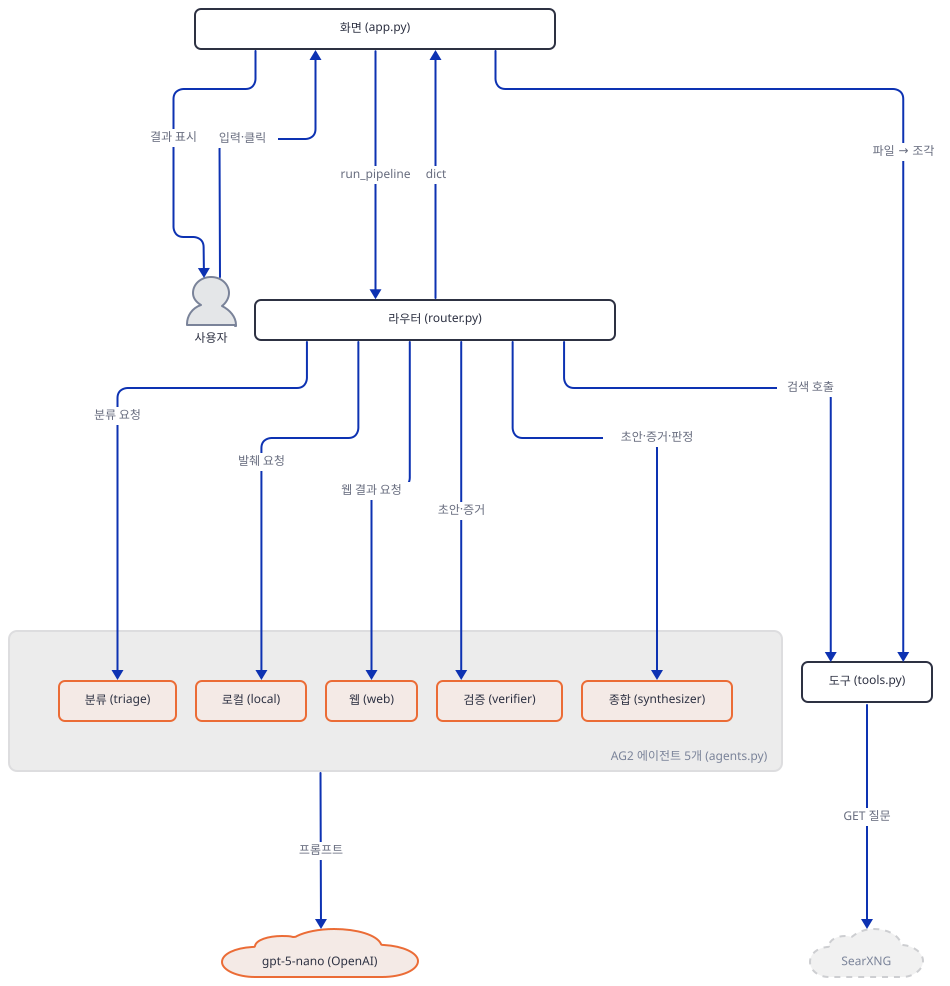

**확인.** 터미널 둘을 씁니다.

```bash
# 터미널 1
uv run --no-project python fake.py 52718 >> fake.log 2>&1
# 터미널 2 (분류가 local이라 답하게 하고 문서 있음, 웹 켬)
echo route=local > ctl.txt
uv run --no-project python -B -W ignore drive.py 52718 docs web
cat fake.log
```

직접 확인한 출력:

```text
route    = local
triage   = {'route': 'local', 'confidence': 0.9, 'rationale': 'FAKE'}
evidence = [{'source': 'notes.txt', 'summary': 'FAKE-local'}]
verifier = {'verdict': 'sufficient', 'gaps': []}
final    = FAKE-final-answer
```

가짜 서버 로그 네 줄(분류 → 로컬 조사 → 검증 → 종합 순서):

```text
POST /v1/chat/completions gpt-5-nano temperature= 0.2 | You are a triage agent for a r
POST /v1/chat/completions gpt-5-nano temperature= 0.2 | You are a local research agent
POST /v1/chat/completions gpt-5-nano temperature= 0.2 | You are a verifier. Check evid
POST /v1/chat/completions gpt-5-nano temperature= 0.2 | You are the final synthesizer.
```

`.cache/` 폴더는 작업 폴더에 생기지 않았습니다(0.11.0과 0.13.4 모두, 직접 확인). Day 116의 `autogen` 0.7.3은 `llm_config`에 `cache_seed`가 없으면 기본값 41로 디스크 캐시를 켰지만, 0.13.4는 `cache_seed`를 기본 `None`으로 읽고(`oai/client.py`의 1190행) 값이 있을 때만 `Cache.disk`를 만듭니다(같은 파일 1211행. `LEGACY_DEFAULT_CACHE_SEED = 41`은 201행에 정의만 있고 쓰이지 않음 — grep으로 확인). 같은 조건이어도 버전에 따라 캐시 동작이 다릅니다. 한 가지는 확인하지 못했습니다. 진짜 `gpt-5-nano`가 `temperature` 0.2를 받아 주는지입니다. 추론 모델 계열이 이 값을 거부하는 경우가 있다고 알려져 있지만 키가 없어 실제 요청을 보내지 못했고, OpenAI 모델 페이지에서도 이 값의 지원 여부를 찾지 못했습니다. 키가 있다면 첫 실행에서 이 줄이 오류를 내는지 보세요(문제 해결 표).

### Step 6. 웹 검색 — `SearxngSearchTool`과 조용한 빈 목록

**목적.** 웹 경로가 무엇을 요청하고, 실패하면 어떻게 되는지 봅니다.

**할 일.**

`advanced_ai_agents/multi_agent_apps/agent_teams/ag2_adaptive_research_team/tools.py:98-105`

```python
def run_searxng(query: str, base_url: str, max_results: int = 5) -> List[dict]:
    tool = SearxngSearchTool(base_url=base_url)
    results = tool(query=query, max_results=max_results)
    if isinstance(results, dict):
        return results.get("results", [])
    if isinstance(results, list):
        return results
    return []
```

`run_searxng`는 부를 때마다 `SearxngSearchTool`을 새로 만들고(그래서 위 `DeprecationWarning`이 매번 나올 수 있습니다), 결과가 dict면 `results` 키를, list면 그대로를 돌려주고 그 밖이면 빈 목록을 돌려줍니다. 도구 안쪽은 이렇습니다(`ag2` 0.13.4).

ag2 0.13.4 패키지에 들어 있는 `searxng_search.py`의 39~62행입니다.

```python
    params = {
        "q": query,
        "format": "json",
        "language": language or "en-US",
        "categories": ",".join(categories) if categories else None,
        "count": max_results,
    }
    params = {k: v for k, v in params.items() if v is not None}
    try:
        response = requests.get(base_url, params=params, timeout=10)
        response.raise_for_status()
        data = response.json()
        results = data.get("results", [])
        if not isinstance(results, list):
            return []
        # Ensure each result is a dict before returning
        typed_results: list[dict[str, Any]] = []
        for item in results:
            if isinstance(item, dict):
                typed_results.append(item)
        return typed_results
    except Exception as e:
        logger.error(f"SearxNG Search failed: {e}")
        return []
```

요청은 `GET <주소>?q=<질문>&format=json&language=en-US&count=5`이고 시간 제한 10초입니다. SearXNG가 돌려주는 `url`·`content`는 같은 파일의 `_searxng_search`(91~94행)에서 `link`·`snippet`으로 이름이 바뀝니다(`"link": item.get("url", "")`, `"snippet": item.get("content", "")`). 라우터가 `item.get('link')`·`item.get('snippet')`을 쓰는 것은 그 때문이고, 가짜 서버가 `url`·`content`를 돌려주는 것은 진짜 SearXNG와 같은 키입니다. 라우터는 이 결과를 `- 제목 | 링크 | 스니펫` 줄로 바꿔 웹 조사 에이전트 프롬프트에 붙입니다(`router.py:63-84`).

`advanced_ai_agents/multi_agent_apps/agent_teams/ag2_adaptive_research_team/router.py:63-84`

```python
    if route == "web" and web_enabled:
        search_results = run_searxng(question, base_url=searxng_base_url, max_results=5)
        formatted_results = "\n".join(
            [
                f"- {item.get('title', 'Untitled')} | {item.get('link', '')} | {item.get('snippet', '')}"
                for item in search_results
            ]
        )
        web_prompt = f"""
Question: {question}

Web results:
{formatted_results}

Return JSON with keys:
- evidence: list of {{source, summary}}
- draft_answer: string
"""
        web_raw = run_agent(agents["web"], web_prompt)
        web_json = _extract_json(web_raw)
        evidence = web_json.get("evidence", [])
        draft_answer = web_json.get("draft_answer", "")
```

오류 처리가 핵심입니다. 이 `except Exception`은 모든 실패(네트워크, 429, 500, JSON 아님)를 로그 한 줄로 바꾸고 빈 목록을 돌려줍니다. 앱은 그 사실을 화면에 알리지 않고, 웹 조사 에이전트는 `Web results:` 아래가 빈 프롬프트를 받습니다. 가짜 서버가 500을 돌려주게 해서 직접 확인했습니다. 출력에 `SearxNG Search failed: 500 Server Error ...` 한 줄이 로그로 나왔고 앱은 끝까지 갔으며, 웹 조사 에이전트가 받은 사용자 프롬프트는 `'\nQuestion: What is alpha?\n\nWeb results:\n\n\nReturn JSON with keys:\n...'`로 결과 줄이 비어 있었습니다. 모델이 이때 어떻게 답할지(근거 없이 쓸지)는 진짜 모델로 확인하지 못했습니다. 공개 인스턴스 `searxng.site`가 `format=json`을 허용하는지, 요청을 몇 번까지 받는지도 호출하지 않아 확인하지 못했습니다(앱도 사이드바에서 "may be rate-limited"라고만 알립니다).

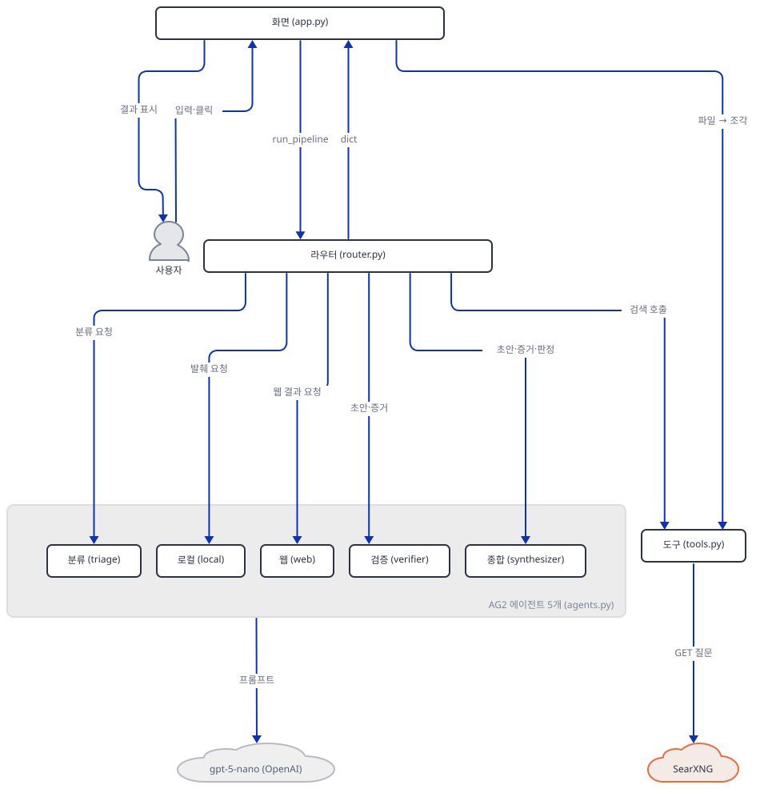

**확인.** 웹 경로를 가짜 서버로 돌립니다.

```bash
echo route=web > ctl.txt
uv run --no-project python -B -W ignore drive.py 52718 docs web
```

직접 확인한 출력은 `route = web`, `evidence = [{'source': 'http://fake.example/a', 'summary': 'FAKE-web'}]`이었고 가짜 서버 로그의 새 줄은 다섯 개였습니다.

```text
POST /v1/chat/completions gpt-5-nano temperature= 0.2 | You are a triage agent for a r
GET  /search {'q': ['What is alpha?'], 'format': ['json'], 'language': ['en-US'], 'count': ['5']}
POST /v1/chat/completions gpt-5-nano temperature= 0.2 | You are a web research agent. 
POST /v1/chat/completions gpt-5-nano temperature= 0.2 | You are a verifier. Check evid
POST /v1/chat/completions gpt-5-nano temperature= 0.2 | You are the final synthesizer.
```

로컬 경로(넷)보다 검색 GET이 하나 더 있습니다. 모델 호출은 두 경로 모두 네 번입니다.

### Step 7. 라우터 — 경로를 정하는 규칙 전부

**목적.** `run_pipeline`이 어떤 입력에서 어느 경로로 가는지, 분류의 답을 얼마나 믿는지 알아냅니다.

**할 일.**

`advanced_ai_agents/multi_agent_apps/agent_teams/ag2_adaptive_research_team/router.py:11-18`

```python
def _extract_json(text: str) -> Dict[str, Any]:
    match = re.search(r"\{.*\}", text, re.DOTALL)
    if not match:
        return {}
    try:
        return json.loads(match.group(0))
    except json.JSONDecodeError:
        return {}
```

`advanced_ai_agents/multi_agent_apps/agent_teams/ag2_adaptive_research_team/router.py:29-61`

```python
def run_pipeline(
    question: str,
    local_chunks: List[Chunk],
    api_key: str,
    model: str,
    web_enabled: bool,
    searxng_base_url: str,
) -> Dict[str, Any]:
    agents = build_agents(api_key=api_key, model=model)

    doc_summary = "No local documents provided."
    if local_chunks:
        doc_names = sorted({chunk.doc_name for chunk in local_chunks})
        doc_summary = f"Local docs: {', '.join(doc_names)} (total chunks: {len(local_chunks)})"

    triage_prompt = f"""
Question: {question}
{doc_summary}

Decide the best route. Output JSON with keys:
- route: "local" or "web"
- confidence: number 0 to 1
- rationale: short string
"""
    triage_raw = run_agent(agents["triage"], triage_prompt)
    triage = _extract_json(triage_raw)

    route = triage.get("route", "local")
    if not local_chunks and web_enabled:
        route = "web"

    evidence: List[Dict[str, Any]] = []
    draft_answer = ""
```

`_extract_json`은 응답에서 첫 `{`부터 마지막 `}`까지를 한 덩어리로 잘라 파싱합니다. 그래서 JSON이 하나뿐이면 앞뒤 설명이나 코드 펜스(백틱 세 개와 `json`)가 있어도 되지만, 중괄호가 둘 이상의 덩어리로 흩어지면 통째로 파싱이 실패해 빈 dict가 됩니다. 확인 스크립트 `extract.py`의 직접 확인한 출력입니다.

`extract.py`

```python
import sys; sys.path.insert(0, "app")
from router import _extract_json
for t in ['{"route": "web"}', '```json\n{"route": "web"}\n```', 'OK {"route": "web"} and {x}', '{"a": 1} {"b": 2}', 'no json']:
    print(repr(t), "→", _extract_json(t))
```

```text
'{"route": "web"}' → {'route': 'web'}
'```json\n{"route": "web"}\n```' → {'route': 'web'}
'OK {"route": "web"} and {x}' → {}
'{"a": 1} {"b": 2}' → {}
'no json' → {}
```

분류에게는 문서의 이름과 조각 수만 갑니다(`doc_summary`, 39~42행). 문서 내용은 한 글자도 안 갑니다. 앱 README는 "문서 범위에 따른 라우팅"이라고 쓰지만 분류가 보는 것은 파일 이름과 조각 수가 전부입니다(가짜 서버가 받은 분류 프롬프트에서 직접 확인). 경로는 이 규칙으로 정해집니다.

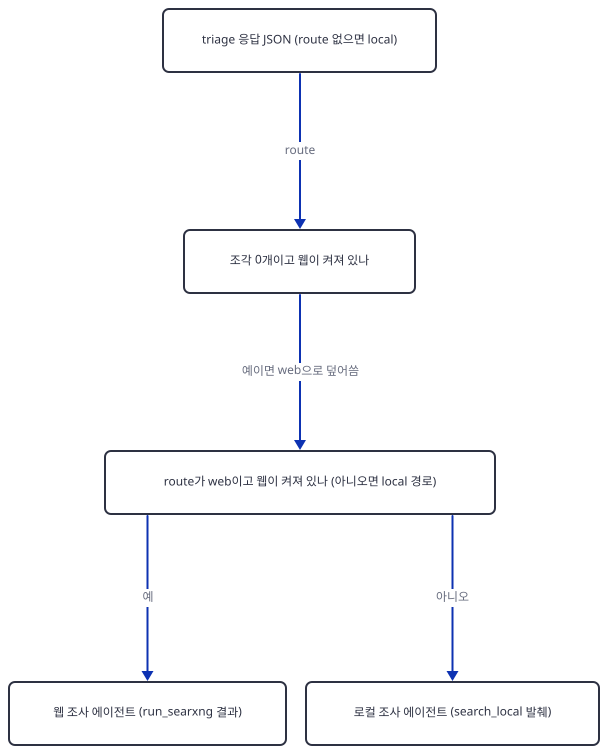

분류 응답이 JSON이 아니거나 `route` 키가 없으면 `local`이 됩니다(`triage.get("route", "local")`). 문서가 하나도 없고 웹이 켜져 있으면 분류가 뭐라 했든 `web`으로 덮어씁니다. 그다음 `route == "web" and web_enabled`일 때만 웹 경로이고, **그 밖은 전부 로컬 경로입니다.** 아래 나머지 부분(검증과 종합)입니다.

`advanced_ai_agents/multi_agent_apps/agent_teams/ag2_adaptive_research_team/router.py:103-141`

```python
    verifier_prompt = f"""
Question: {question}

Draft answer:
{draft_answer}

Evidence:
{json.dumps(evidence, indent=2)}

Return JSON with keys:
- verdict: "sufficient" or "insufficient"
- gaps: list of short strings
"""
    verifier_raw = run_agent(agents["verifier"], verifier_prompt)
    verifier = _extract_json(verifier_raw)

    synth_prompt = f"""
Question: {question}

Draft answer:
{draft_answer}

Evidence:
{json.dumps(evidence, indent=2)}

Verifier verdict:
{json.dumps(verifier, indent=2)}

Provide the final answer with clear citations to the evidence sources.
"""
    final_answer = run_agent(agents["synthesizer"], synth_prompt)

    return {
        "route": route,
        "triage": triage,
        "evidence": evidence,
        "verifier": verifier,
        "final_answer": final_answer,
    }
```

검증의 판정(`verdict`)은 종합 프롬프트에 글로 들어갈 뿐, 경로를 바꾸거나 다시 검색하거나 멈추게 하지 않습니다. 반환 dict에는 `route`가 있지만 화면은 `result["triage"]`(분류의 원래 답)만 "Routing Decision"에 보여 줍니다(Step 8).


**확인.** 가짜 서버 분류 답과 입력을 바꿔 가며 `drive.py`를 돌렸습니다. 호출 수는 가짜 서버 로그의 `POST` 줄 수입니다(직접 확인).

| 입력 (`drive.py` 인자 · `ctl.txt`) | 실제 `route` | 호출 | 화면 "Routing Decision"(분류의 답)과 같은가 |
|---|---|---|---|
| `docs web` · `route=local` | local | POST 4 | 같음 |
| `docs web` · `route=web` | web | POST 4 + GET 1 | 같음 |
| `nodocs web` · `route=local` | **web** | POST 4 + GET 1 | **다름**(분류는 local, 실제는 web) |
| `nodocs noweb` · `route=local` | local | POST 4 | 같음. 조각이 없어 발췌가 빈 로컬 조사가 돔 |
| `docs noweb` · `route=web` | **web**(라벨) | POST 4, GET 0 | 라벨만 web, 실제는 **로컬 에이전트**가 답함 |
| `docs web` · `route=garbage` | local | POST 4 | 분류 칸이 `{}` |
| `docs web` · `route=local verdict=insufficient` | local | POST 4 | 같음. 종합 프롬프트의 판정 부분만 달라지고 호출 수와 흐름은 같음 |
| `docs web` · `route=web searx=fail` | web | POST 4 + GET 1 | 같음. 검색은 실패, 앱은 끝까지 감 |

다섯째 행은 반환 dict의 `route`가 `'web'`이고 증거는 `notes.txt`(로컬 에이전트의 것)였습니다. 웹이 꺼져 있으면 분류가 web이라 해도 로컬 조사가 실행되고 `route` 값만 web으로 남습니다. 네 번째 행처럼 조각이 없는 로컬 조사는 "Document excerpts:" 아래가 빈 프롬프트를 받습니다.

### Step 8. 결과 표시와 전체 실행

**목적.** 화면이 결과를 어떻게 보여 주는지 보고, 앱 전체를 키 없이 끝까지 돌려 봅니다.

**할 일.**

`advanced_ai_agents/multi_agent_apps/agent_teams/ag2_adaptive_research_team/app.py:37-71`

```python
if run_clicked:
    if not api_key:
        st.error("Please provide your OpenAI API key.")
        st.stop()

    if not question.strip():
        st.error("Please enter a research question.")
        st.stop()

    os.environ["OPENAI_API_KEY"] = api_key

    documents = load_documents(files or [])
    local_index = build_local_index(documents)

    with st.spinner("Running the AG2 team..."):
        result = run_pipeline(
            question=question,
            local_chunks=local_index,
            api_key=api_key,
            model=model,
            web_enabled=web_enabled,
            searxng_base_url=SEARXNG_BASE_URL,
        )

    st.subheader("Routing Decision")
    st.json(result.get("triage", {}))

    st.subheader("Evidence")
    st.json(result.get("evidence", []))

    st.subheader("Verifier")
    st.json(result.get("verifier", {}))

    st.subheader("Final Answer")
    st.markdown(result.get("final_answer", ""))
```

버튼을 누르면 키와 질문을 검사하고(오류면 `st.stop()`), 입력한 키를 **프로세스 전체의 환경변수**(`os.environ["OPENAI_API_KEY"]`)에 씁니다(46행). 여러 사람이 한 서버를 쓰면 마지막 키가 모두의 환경에 남습니다(소스로 확인. 이 앱은 `api_key`를 `llm_config`에도 직접 넘기므로 이 줄이 없어도 호출은 됩니다). 이어 파일을 읽어 색인을 만들고 `run_pipeline`을 부른 다음 네 칸을 보여 줍니다. 파이프라인은 끝까지 동기로 돌고 중간 진행 표시는 스피너 하나입니다.

전체 실행을 위해 앱 사본의 검색 주소만 가짜 서버로 바꿉니다(`SEARXNG_BASE_URL`이 상수라서 사본에서만 바꿉니다. 이 사본에서 다른 줄은 같습니다).

먼저 아래를 `apptest.py`로 **작업 폴더(`app/`의 한 단계 위)에** 저장합니다. `AppTest.from_file`의 상대 경로는 그 호출이 들어 있는 파일을 기준으로 풀리므로, 다른 곳에 두면 `app/app.py`를 못 찾습니다(Streamlit 1.65.0에서 `FileNotFoundError ... Relative paths are resolved against the file that calls AppTest.from_file()`를 직접 봤습니다). 앞쪽 줄은 Step 2의 스크립트와 같고, 뒤쪽이 키와 질문을 넣어 파이프라인까지 돌리는 부분입니다.

`apptest.py`

```python
"""사용법: python apptest.py 포트   (앱 폴더 app/ 의 app.py를 AppTest로 돌린다)"""
import os, sys
from streamlit.testing.v1 import AppTest
port = sys.argv[1]
os.environ["OPENAI_BASE_URL"] = f"http://127.0.0.1:{port}/v1"
sys.path.insert(0, "app")
at = AppTest.from_file("app/app.py", default_timeout=60).run()
print("첫 화면 예외:", [e.value for e in at.exception])
print("소제목:", [s.value for s in at.subheader])
at.button[0].click().run()
print("키 없이 클릭:", [e.value for e in at.error])
at.sidebar.text_input[0].set_value("sk-fake")
at.button[0].click().run()
print("키만 넣고 클릭:", [e.value for e in at.error])
at.text_area[0].set_value("What is alpha?")
at.button[0].click().run()
print("실행 뒤 소제목:", [s.value for s in at.subheader])
print("json 칸:", [j.value for j in at.json])
print("마지막 markdown:", [m.value for m in at.markdown][-2])
```

그다음 Step 5의 `fake.py`를 띄워 둔 채(터미널 1) 터미널 2에서 앱 사본의 검색 주소만 가짜 서버로 바꾸고 실행합니다.

```bash
sed -i 's|https://searxng.site/search|http://127.0.0.1:52718/search|' app/app.py
echo route=local > ctl.txt
uv run --no-project python -X utf8 -B -W ignore apptest.py 52718
```


**확인.** `AppTest`를 서버 밖에서 부르면 출력 맨 앞에 `missing ScriptRunContext!` 경고 줄이 찍힙니다(무시해도 되고, 아래는 그 줄을 뺀 직접 확인한 출력입니다).

```text
첫 화면 예외: []
소제목: ['1. Upload Local Documents', '2. Ask a Question']
키 없이 클릭: ['Please provide your OpenAI API key.']
키만 넣고 클릭: ['Please enter a research question.']
실행 뒤 소제목: ['1. Upload Local Documents', '2. Ask a Question', 'Routing Decision', 'Evidence', 'Verifier', 'Final Answer']
json 칸: ['{"route": "local", "confidence": 0.9, "rationale": "FAKE"}', '[{"source": "http://fake.example/a", "summary": "FAKE-web"}]', '{"verdict": "sufficient", "gaps": []}']
마지막 markdown: FAKE-final-answer
```

업로드한 파일이 없어서 분류가 local이라 답해도 웹으로 갔습니다. 화면의 "Routing Decision"(첫 json 칸)은 `route: local`인데 증거는 웹(`fake.example`)에서 온 것입니다. 화면에 실제 경로(`result["route"]`)는 나오지 않습니다. 파일 업로드(`file_uploader`)는 `AppTest`가 다루지 못해 이 화면 실행에는 파일이 없고, 문서 쪽은 Step 3·4·7의 함수 호출로 확인했습니다.

## 요청 한 건이 흐르는 과정

한 번의 요청은 다섯 구간입니다. 에이전트 하나가 어디서 말하는지에 따라 앞뒤 이웃이 달라서 수명선이 다른 메시지의 라벨을 지나는 문제가 있어, 앱의 실제 시간 경계로 나눠 그렸습니다. 메시지는 하나도 지우지 않았고 코드 순서 그대로 여섯 장에 나뉘어 있습니다(웹과 로컬은 한 요청에서 둘 중 하나만 일어납니다).

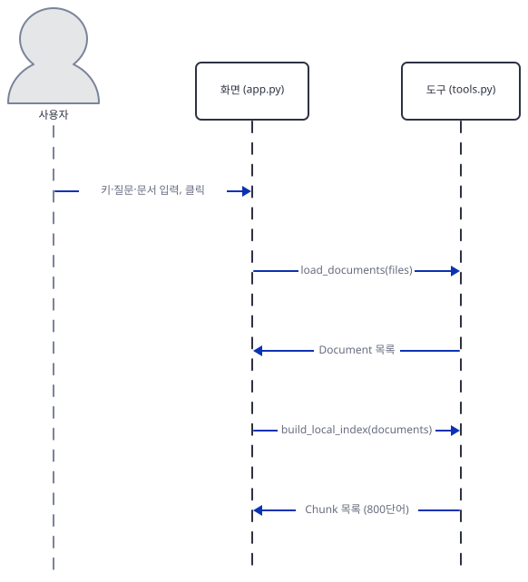

1번은 버튼 클릭부터 조각 목록이 만들어지기까지입니다(`app.py:48-49`). 문서가 없으면 두 호출은 빈 목록을 돌려줍니다.

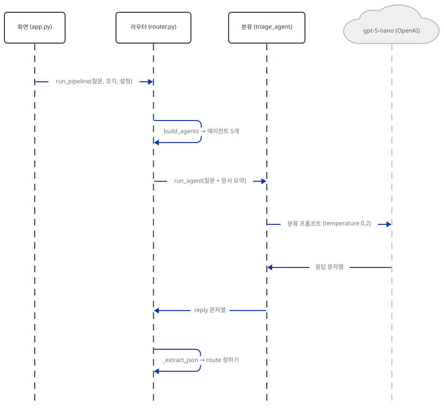

2번은 `run_pipeline`이 에이전트 다섯을 만들고(`router.py:37`) 분류에게 질문과 문서 요약을 보내 JSON을 꺼내 경로를 정하는 지점입니다. 이 구간은 항상 있고 모델 호출 한 번입니다.

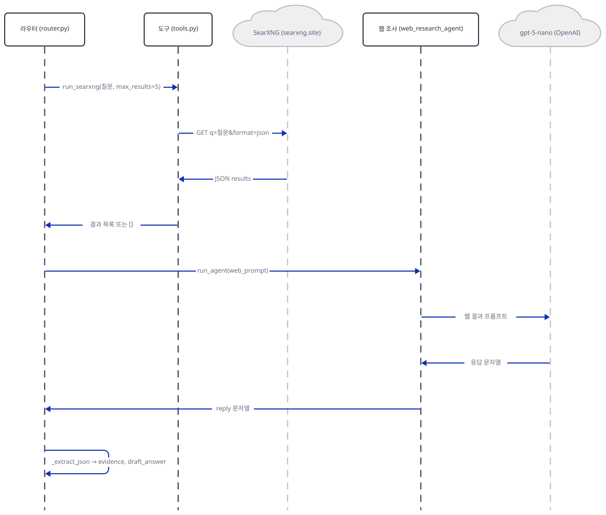

3a번은 `route == "web"`이고 웹이 켜져 있을 때입니다. 검색 한 번(실패하면 빈 목록)과 웹 조사 에이전트의 모델 호출 한 번입니다.

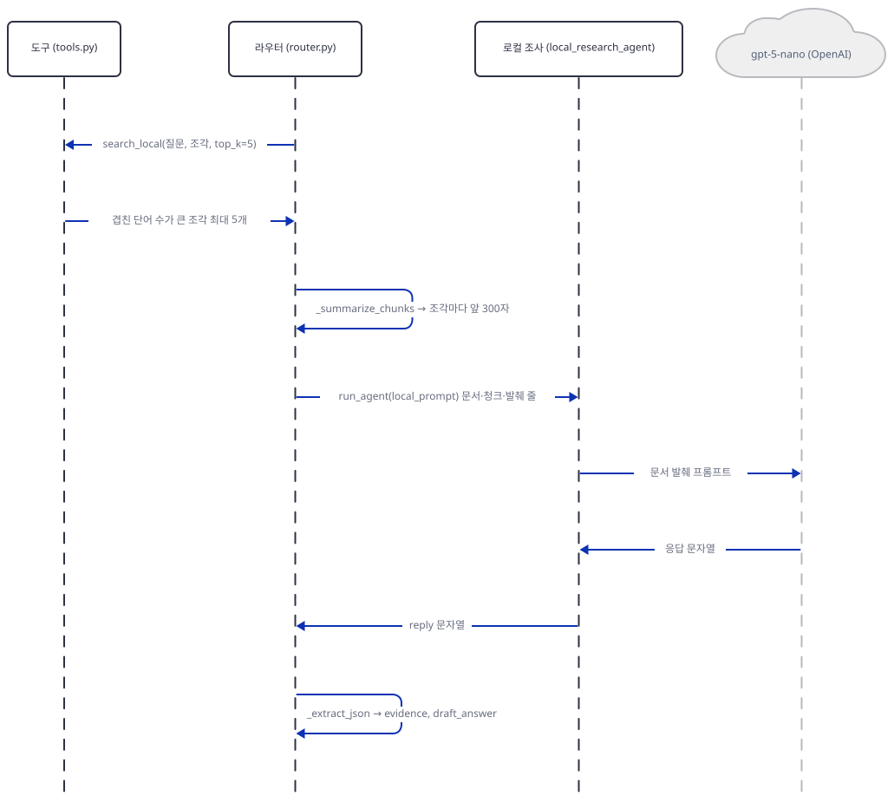

3b번은 그 밖의 모든 경우입니다. 검색은 모델 호출이 아니라 파이썬 함수이고, 조각마다 앞 300자만 에이전트에게 갑니다.

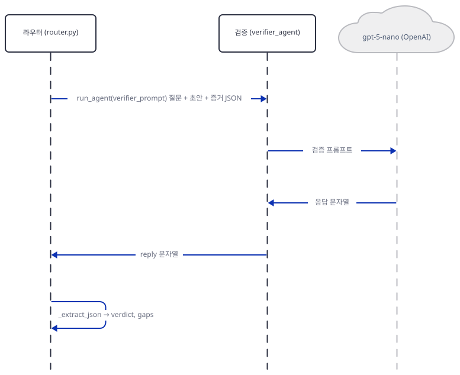

4번은 초안과 증거를 검증 에이전트에게 보내 `verdict`·`gaps`를 받는 구간입니다. 여기서 받은 판정은 흐름을 바꾸지 않습니다.

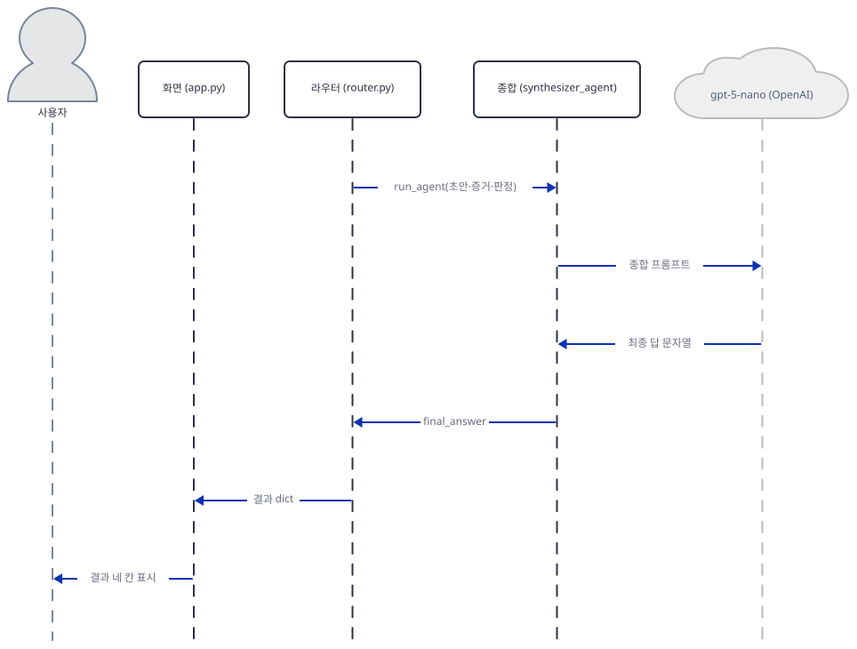

5번은 종합 에이전트가 최종 답을 쓰고 라우터가 dict를 돌려주며 화면이 네 칸을 보여 주는 마무리입니다. 모든 장의 메시지 존재와 순서, 호출 횟수는 가짜 서버로 직접 확인했고, 진짜 모델이 쓰는 문장은 확인하지 못했습니다.

## 실행 체크리스트

- [ ] `requirements.txt`를 그대로 설치하면 `ag2` 1.1.2가 깔리고 `import autogen`이 `ModuleNotFoundError`로 실패하는 것을 확인했다
- [ ] `ag2[openai]<0.14`(0.13.4)로 고정하면 `AssistantAgent`·`SearxngSearchTool` import와 네 파일 컴파일이 성공하고, 0.14.0에서는 `SearxngSearchTool`이 없는 것을 확인했다
- [ ] `AppTest`로 첫 화면이 예외 없이 뜨고, 키 없이/질문 없이 누르면 각각 오류 상자만 뜨는 것을 확인했다
- [ ] `chunks.py`로 2,000단어가 조각 셋(800·800·640)이 되는 것을 확인했다
- [ ] `search.py`로 한글로만 된 질문의 검색 결과가 빈 목록이고, 조각의 앞 300자만 에이전트에게 가는 것을 확인했다
- [ ] 가짜 서버로 로컬 경로 호출 4회(분류 → 로컬 → 검증 → 종합), `temperature` 0.2를 확인했다
- [ ] 웹 경로에서 검색 GET 한 번이 추가되고, 검색이 500이어도 앱이 끝까지 가는 것을 확인했다
- [ ] 문서 없음·웹 꺼짐·분류 오류 조합에서 "Routing Decision" 칸과 실제 경로가 어긋나는 행을 확인했다
- [ ] 작업 폴더에 `.cache/`가 생기지 않는 것을 확인했다(0.13.4는 `cache_seed` 기본값이 `None`)
- [ ] (키가 있다면) 실제로 실행해 `gpt-5-nano`가 `temperature` 0.2를 받아 주는지, 분류 JSON이 파싱되는지 확인한다

## 문제 해결

| 증상 | 원인 | 해결 |
|---|---|---|
| 앱이 뜨자마자 `ModuleNotFoundError: No module named 'autogen'`(직접 확인) | `requirements.txt`의 `ag2[openai]>=0.11.0`이 오늘 1.1.2로 풀리는데 1.0 이상에는 `autogen` 패키지가 없음 | `uv pip install "ag2[openai]<0.14"`(리포 코드는 고치지 않음) |
| `ImportError: cannot import name 'SearxngSearchTool' from 'autogen.tools.experimental'`(직접 확인, 0.14.0) | 0.14.0에서 이 도구가 빠짐(0.13.4 경고문에 "removed in v0.14") | 0.14 미만으로 고정. 오래 쓸 계획이면 `DuckDuckGoSearchTool` 등으로 옮기는 것은 "더 해보기" |
| 웹 검색이 실패해도 오류 없이 답이 나옴, 웹 조사 프롬프트의 `Web results:`가 비어 있음(직접 확인) | `SearxngSearchTool`이 모든 예외를 삼키고 `[]`를 돌려줌 | 터미널 로그의 `SearxNG Search failed: ...` 줄을 봄. 근거 없는 답이 나왔으면 의심 |
| "Routing Decision" 칸은 `local`인데 웹 근거가 나옴(직접 확인) | 문서가 없고 웹이 켜져 있으면 `route`를 `web`으로 덮어쓰는데 화면은 분류의 원래 답을 보여 줌 | `result["route"]`를 같이 확인(리포 코드는 고치지 않음). 문서를 올리면 분류 답이 그대로 쓰임 |
| 한글로만 된 질문을 하면 로컬 조사 증거가 비어 있거나 엉뚱함(직접 확인) | 단어를 `[a-zA-Z0-9]+`로만 뽑아 한글은 점수가 0, 발췌가 빈 프롬프트(영문·숫자가 섞이면 그 부분으로만 맞음) | 영문 질문을 쓰거나 `_tokenize`를 `\w+`로 바꿈(사본에서) |
| 답이 문서 뒷부분의 내용을 모름(직접 확인) | 조사 에이전트가 조각마다 앞 300자만 받음 | `router.py`의 `[:300]`을 키우는 것은 "더 해보기" |
| 한국어 `.txt`가 깨진 글자로 읽힘(직접 확인) | CP949 파일은 UTF-8 읽기가 실패하고 latin-1 읽기가 오류 없이 성공함 | 파일을 UTF-8로 저장해서 올림 |
| 첫 실행에서 `temperature` 관련 400 오류가 나는 것 같음(실제 요청으로는 확인하지 못함) | 코드가 모델과 상관없이 `temperature` 0.2를 보냄(직접 확인). 진짜 `gpt-5-nano`가 이 값을 받는지 확인하지 못함 | 오류가 나면 사본에서 `make_llm_config`의 `temperature`를 뺌 |
| 2026-12-11 이후 모델 오류 | `gpt-5-nano-2025-08-07`이 OpenAI 폐기 표에서 이 날 제거됨(원문 직접 확인) | 사이드바 "Model"에서 대체 모델로 바꿈. 표의 대체는 `gpt-5.6-luna` |
| `streamlit run`을 헤드리스로 띄우면 시작 중 외부 IP 조회 요청이 나갈 수 있음 | `--server.address`를 안 주면 Streamlit이 외부 IP를 알아내려 `checkip.amazonaws.com`에 요청(Day 060) | `--server.headless true --server.address localhost` 지정 |
| `missing ScriptRunContext!` 경고 | `AppTest`를 Streamlit 서버 밖에서 부름 | 무시해도 됨(직접 확인) |
| 앱 README와 코드가 다름 | README의 AG-UI·OpenTelemetry는 코드에 없는 선택 기능 소개이고, "문서 범위에 따른 라우팅"은 문서 이름과 조각 수만 쓰는 코드와 다름(소스로 확인) | 코드를 기준으로 봄 |

## 더 해보기

- 사본에서 `SearxngSearchTool`을 걷어 내고 같은 `run_searxng` 모양을 `DuckDuckGoSearchTool`(0.14.0 `autogen.tools.experimental`에 있음)로 바꿔 보기. 0.14에서도 도는지, 결과 키가 `title`·`link`·`snippet`으로 같은지는 확인하지 않았습니다
- `_tokenize`를 `\w+`로 바꾸고 한국어 문서·질문으로 Step 4의 `search.py`를 다시 돌려 빈 목록이 사라지는지, 단어 단위가 아닌 형태소 문제가 남는지 보기
- 검증의 `verdict`가 `insufficient`이면 웹 경로를 한 번 더 타게 하는 두 줄을 사본의 `run_pipeline`에 넣고, Step 7의 표를 다시 돌려 호출 횟수가 어떻게 바뀌는지 예측한 뒤 확인하기

## 다음 날 예고

[Day 120 · 💼 AI Recruitment Agent Team](../day120-ai-recruitment-agent-team/README.md) — agno 에이전트가 이력서 PDF를 읽고, 메일 발송 도구와 Zoom 회의 생성 도구까지 부르는 Streamlit 앱입니다.
