# Day 120 · 💼 AI Recruitment Agent Team

> 볼륨 8 🤝 Multi-agent Teams · 난이도 ★★★ · 예상 소요 145분(앱은 522줄이지만 설치부터 막히는 곳이 둘이고, Step 4에서 가짜 서버와 확인 스크립트를 직접 저장해 터미널 둘로 시나리오를 여러 번 돌려 봐야 해서 읽는 시간보다 손으로 돌려 보는 시간이 더 걸립니다) · API 비용 대략 지원자 한 명에 탈락 약 $0.007, 합격 약 $0.02(⚠ 이 문서는 어떤 서비스도 실제로 부르지 않았고 키가 없어 토큰 수를 재지 못했습니다. 모델 요청 수는 가짜 서버로 셌습니다. 탈락 쪽이 3번, 합격 쪽이 6번(분석 1, 선발 메일 2, 일정 1, 확인 메일 2)입니다. 입력은 요청 글자 수를 4로 나눠 어림해 탈락 쪽이 1,500토큰, 합격 쪽이 5,500토큰 안팎이고, 출력은 JSON과 메일 본문 몇 개라 합격 쪽 700토큰 안팎으로 어림해 모델 페이지의 입력 $2.5·출력 $10(1M 토큰당, https://developers.openai.com/api/docs/models/gpt-4o, 2026-10-09 확인)을 대입했습니다. Zoom과 Gmail은 이 앱이 쓰는 범위에서 요금을 확인하지 못했습니다) · 원본 앱: `advanced_ai_agents/multi_agent_apps/agent_teams/ai_recruitment_agent_team`

## 오늘 만들 것

PDF 이력서를 올리고 지원자 이메일을 적은 뒤 `Analyze Resume`을 누르면 `gpt-4o`가 직무 요건과 견주어 합격 여부를 JSON으로 답하고, 탈락이면 피드백 메일을 바로 보내고, 합격이면 `Proceed with Application`으로 선발 메일, Zoom 면접 일정, 확인 메일을 이어서 보내려는 Streamlit 앱입니다. 한 파일 `ai_recruitment_agent_team.py`(편집기 기준 522줄, 마지막 줄에 개행이 없어 `wc -l`은 521)에 agno `Agent`가 셋 있습니다. 이력서 분석, 메일, 일정입니다. 이름은 "팀"이지만 `Team(`은 한 번도 나오지 않고(grep으로 확인), 버튼 핸들러가 에이전트를 차례로 부르는 쪽입니다. 같은 볼륨의 Day 114도 `Team` 없이 핸들러가 에이전트 셋을 부르는 앱이었고, `Team`을 가장 작게 만나는 날은 이 볼륨을 연 Day 112입니다.

**이 앱은 바깥에 행동합니다.** 키를 넣으면 입력한 주소로 진짜 메일이 나가고(`agno`의 `EmailTools`가 `smtp.gmail.com:465`에 로그인합니다) Zoom에 진짜 회의를 만들려 합니다. 이 문서의 확인 실행은 OpenAI·Gmail SMTP·Zoom·Agno 통계 어디에도 요청을 보내지 않습니다(Step 7에서 하네스 없이 띄우는 절차만 예외이고, 거기서 무엇이 나갈 수 있는지는 그 절에 적었습니다). 모델은 내 PC의 가짜 서버로, `requests.post`와 `smtplib.SMTP_SSL`은 호출을 기록만 하는 가짜로 바꿔 돌렸고, 이력서는 직접 만든 가짜 PDF(실존 인물 없음, 주소는 예약 도메인 `.test`)만 씁니다. 그래서 아래의 모델 답과 Zoom 응답은 모두 내가 쓴 대본이고, 진짜 `gpt-4o`가 이 프롬프트에 어떻게 답하는지, 진짜 Gmail과 Zoom이 어떻게 반응하는지는 확인하지 못했습니다.

직접 돌려 보고 알게 된 것이 여섯입니다. 첫째, `requirements.txt`만 설치하면 앱의 import가 13행(`openai`)과 15·16행(`phi`)에서 막힙니다(Step 1). 둘째, 일정 에이전트는 Zoom 도구를 받지만 모델에게 도구가 하나도 전달되지 않아서 Zoom에는 요청이 가지 않고, 화면은 그래도 "Interview scheduled successfully!"라고 합니다(Step 3·6). 셋째, SMTP 로그인이 실패하거나 OpenAI 키가 틀려도 화면은 "We've sent you an email…"라고 합니다(Step 5). 넷째, 모델 답이 `json` 코드 울타리(백틱 세 개)로 감싸이면 `json.loads`가 실패해 탈락 메일 쪽으로 가고, `"selected": "false"`처럼 문자열이면 합격으로 처리됩니다(Step 4). 다섯째, 확인 메일 지시문에 `RunOutput` 객체의 전체 repr이 통째로 들어갑니다(Step 6). 여섯째, 터미널 디버그 출력에 OpenAI 키가 찍힙니다(Step 6). 앱 README는 끝 무렵의 Disclaimer에서 자동 판정을 사람이 검토하라고 하지만(`advanced_ai_agents/multi_agent_apps/agent_teams/ai_recruitment_agent_team/README.md:91-93`) 코드에는 판정과 메일 사이에 사람이 승인하는 단계가 없습니다(소스로 확인). 아래는 완성된 아키텍처입니다.

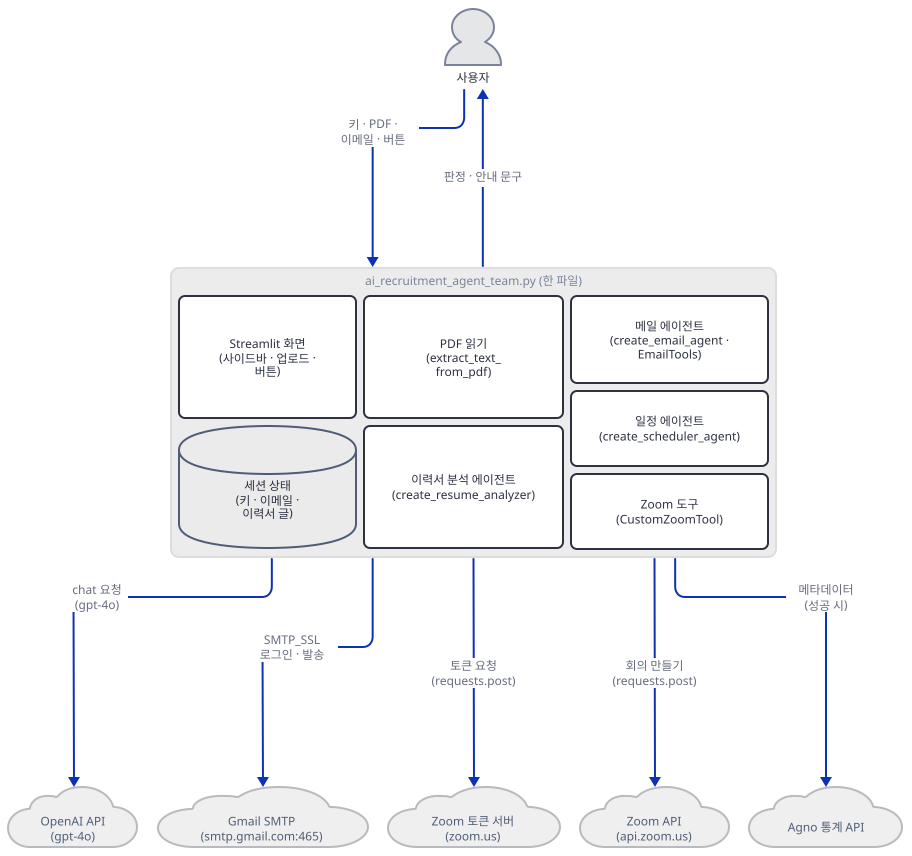

## 사전 준비

| 서비스/도구 | 용도 | 발급·설치 |
|---|---|---|
| uv | 가상환경 생성과 패키지 설치 | [공통 사전 준비](../README.md#공통-사전-준비-한-번만) 절 참고 |
| Python | 이 문서는 3.13.3으로 확인했다. 저장소 기준은 3.11~3.13 | 공통 사전 준비와 같음 |
| OpenAI API 키 | `gpt-4o` 호출. 화면 사이드바의 비밀번호 칸에 넣는다(`advanced_ai_agents/multi_agent_apps/agent_teams/ai_recruitment_agent_team/ai_recruitment_agent_team.py:327`). 이 문서는 가짜 키로 진행한다 | https://platform.openai.com/api-keys |
| Gmail 앱 비밀번호 | 메일 발송. 사이드바의 `Sender Email`과 `Email App Password`(`advanced_ai_agents/multi_agent_apps/agent_teams/ai_recruitment_agent_team/ai_recruitment_agent_team.py:336-337`). 앱 README는 새 Gmail 계정에 2단계 인증과 앱 비밀번호를 쓰라고 안내한다. 이 문서는 가짜 값으로 진행한다 | https://support.google.com/accounts/answer/185833 |
| Zoom Server-to-Server OAuth 앱 | 회의 만들기. 사이드바의 Account ID·Client ID·Client Secret 셋(`advanced_ai_agents/multi_agent_apps/agent_teams/ai_recruitment_agent_team/ai_recruitment_agent_team.py:331-333`). 앱 README가 필요한 권한(scope)을 적는다. 이 문서는 가짜 값으로 진행한다. 원본 그대로는 Zoom 요청이 가지 않는다(Step 6). 그래도 일곱 칸 문을 열려면 아무 값이나 넣어야 한다 | https://marketplace.zoom.us |
| 인터넷 연결 | PyPI 설치. 앱을 실제로 쓸 때는 OpenAI, `smtp.gmail.com`, agno 사용 통계 서버(`os-api.agno.com`)에 접속한다(`zoom.us`·`api.zoom.us`는 원본 그대로는 접속하지 않는다. Step 6). 브라우저로 열면 Streamlit 사용 통계도 나간다(Day 054가 확인했고 `--browser.gatherUsageStats false`로 끈다) | 별도 설치 없음 |

앱이 쓰는 모델 ID `gpt-4o`는 별칭이고, OpenAI 폐기 문서(https://developers.openai.com/api/docs/deprecations, 2026-10-09 확인)에서 별칭은 폐기 목록에 없으며 날짜가 붙은 `gpt-4o-2024-05-13`만 2026-10-23 종료로 올라 있습니다. 그래서 ⚠ 표시는 하지 않았습니다.

이 문서의 확인 스크립트는 한글을 출력합니다. 한국어 Windows에서 출력을 파이프나 파일로 받으면 기본 인코딩(`cp949`)이 모자랄 수 있으니 셸을 먼저 이렇게 맞춰 두세요(Day 105와 같은 처방이고, 이 설정 없이 돌려 보지는 않았습니다).

```bash
export PYTHONIOENCODING=utf-8
```

```powershell
$env:PYTHONIOENCODING = "utf-8"
```

## 아키텍처 한눈에 보기

| 컴포넌트 | 역할 | 코드 위치 |
|---|---|---|
| 사용자 | 키 일곱 칸·직무·PDF·지원자 이메일 입력, 버튼 클릭 | 코드 없음 (브라우저) |
| Streamlit 화면 | 사이드바 일곱 칸과 그것이 다 차야 열리는 문, 직무 선택, 업로드, 버튼 둘, 결과 문구 | `advanced_ai_agents/multi_agent_apps/agent_teams/ai_recruitment_agent_team/ai_recruitment_agent_team.py:318-359`, `advanced_ai_agents/multi_agent_apps/agent_teams/ai_recruitment_agent_team/ai_recruitment_agent_team.py:361-519` |
| 세션 상태 | 키·이메일·이력서 글·판정 결과를 담는 열두 칸 | `advanced_ai_agents/multi_agent_apps/agent_teams/ai_recruitment_agent_team/ai_recruitment_agent_team.py:90-99` |
| 직무 요건 (`ROLE_REQUIREMENTS`) | 직무 셋의 필요 기술 문자열. 분석 프롬프트에 그대로 들어간다 | `advanced_ai_agents/multi_agent_apps/agent_teams/ai_recruitment_agent_team/ai_recruitment_agent_team.py:58-87` |
| PDF 읽기 (`extract_text_from_pdf`) | `pypdf`로 페이지 글을 이어 붙인다 | `advanced_ai_agents/multi_agent_apps/agent_teams/ai_recruitment_agent_team/ai_recruitment_agent_team.py:178-187` |
| 이력서 분석 에이전트 (`create_resume_analyzer`·`analyze_resume`) | `gpt-4o`에 JSON 판정을 요구하고 `json.loads`로 읽는다. 도구 없음 | `advanced_ai_agents/multi_agent_apps/agent_teams/ai_recruitment_agent_team/ai_recruitment_agent_team.py:102-122`, `advanced_ai_agents/multi_agent_apps/agent_teams/ai_recruitment_agent_team/ai_recruitment_agent_team.py:190-232` |
| 메일 에이전트 (`create_email_agent`) | `EmailTools` 하나를 쥐고, 받는 사람 주소는 만들 때 박힌다. 탈락·선발·확인 메일 셋이 모두 이 에이전트다 | `advanced_ai_agents/multi_agent_apps/agent_teams/ai_recruitment_agent_team/ai_recruitment_agent_team.py:124-147`, `advanced_ai_agents/multi_agent_apps/agent_teams/ai_recruitment_agent_team/ai_recruitment_agent_team.py:235-268` |
| 일정 에이전트 (`create_scheduler_agent`·`schedule_interview`) | Zoom 도구를 쥐고 내일 11시(IST) 면접 60분을 지시받는다 | `advanced_ai_agents/multi_agent_apps/agent_teams/ai_recruitment_agent_team/ai_recruitment_agent_team.py:150-175`, `advanced_ai_agents/multi_agent_apps/agent_teams/ai_recruitment_agent_team/ai_recruitment_agent_team.py:271-315` |
| Zoom 도구 (`CustomZoomTool`) | 옛 `phi`의 `ZoomTool`을 상속해 토큰 요청만 덮어쓴다 | `advanced_ai_agents/multi_agent_apps/agent_teams/ai_recruitment_agent_team/ai_recruitment_agent_team.py:21-54` |
| OpenAI API (`gpt-4o`) | 세 에이전트의 모델 | `advanced_ai_agents/multi_agent_apps/agent_teams/ai_recruitment_agent_team/ai_recruitment_agent_team.py:110`, `advanced_ai_agents/multi_agent_apps/agent_teams/ai_recruitment_agent_team/ai_recruitment_agent_team.py:127`, `advanced_ai_agents/multi_agent_apps/agent_teams/ai_recruitment_agent_team/ai_recruitment_agent_team.py:160` |
| Gmail SMTP | `EmailTools.email_user`가 `smtp.gmail.com:465`로 로그인해 보낸다 | 코드 없음 (agno 3.1.2의 `agno/tools/email.py`, 소스로 확인) |
| Zoom 토큰 서버·Zoom API | 토큰은 24행의 주소, 회의는 `phi`의 `schedule_meeting`이 `api.zoom.us`에 만든다. 원본 그대로는 도구가 모델에게 가지 않아 두 서버 모두 불리지 않는다(Step 6) | `advanced_ai_agents/multi_agent_apps/agent_teams/ai_recruitment_agent_team/ai_recruitment_agent_team.py:24`, `advanced_ai_agents/multi_agent_apps/agent_teams/ai_recruitment_agent_team/ai_recruitment_agent_team.py:36` |
| Agno 사용 통계 API | 성공한 `run`마다 익명 메타데이터를 보내려 한다(Day 047 Step 5와 같은 통계). `AGNO_TELEMETRY=false`면 보내지 않는다 | 코드 없음 (agno 3.1.2의 `agno/agent/_run.py` 673행의 `log_agent_telemetry`와 `agno/agent/_telemetry.py`, 소스로 확인) |

첫 그림은 한 파일 안의 부품을 한 묶음에 두고 묶음 안의 호출은 뺐습니다. 화살표는 라벨에 적은 데이터가 가는 방향입니다. 부품끼리의 호출은 아래 그림에 화살표로 그렸습니다. 모든 호출이 화면에서 시작하고, 일정 에이전트가 Zoom 도구를 쥐는 화살표(`tools=[zoom_tools]`)가 이 앱에서 가장 중요한 화살표입니다. 그 뒤에 이어지는 Zoom 쪽 화살표 둘은 원본에서는 일어나지 않습니다(agno가 그 도구를 버리기 때문입니다. Step 6).

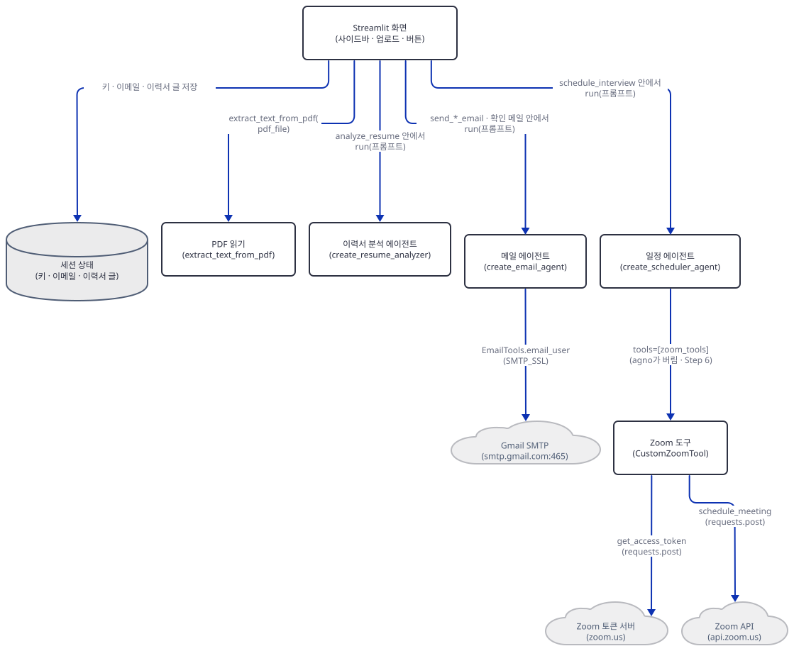

세 에이전트는 만들어질 때 세션 상태에서 키와 주소를 읽어 옵니다. 그 화살표는 위 그림이 넘치지 않도록 따로 그렸습니다. 화살표는 데이터가 가는 방향입니다.

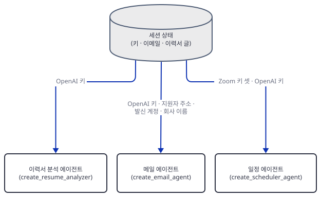

## 단계별 진행

### Step 1. 환경 만들기 — import가 막히는 곳 둘

**목적.** 저장소 밖에 작업 폴더를 만들고 앱 파일을 복사해 독립 가상환경에 설치한 뒤, 앱의 import가 어디서 막히는지 보고 풀어 줍니다. 복사해 쓰는 까닭은 `__pycache__`와 로그를 저장소 밖에 두기 위해서입니다.

**할 일.** 저장소 루트에서 시작합니다. 작업 폴더 `recruit-lab`은 저장소 밖 아무 곳에 만들어도 됩니다.

```bash
mkdir ../recruit-lab
cp advanced_ai_agents/multi_agent_apps/agent_teams/ai_recruitment_agent_team/ai_recruitment_agent_team.py ../recruit-lab/
cp advanced_ai_agents/multi_agent_apps/agent_teams/ai_recruitment_agent_team/requirements.txt ../recruit-lab/
cd ../recruit-lab
uv venv
uv pip install -r requirements.txt
```

(pip 대안: bash는 `python -m venv .venv && source .venv/bin/activate && pip install -r requirements.txt`입니다. PowerShell 5.1은 `&&`를 받지 않으므로 줄을 나눠 `python -m venv .venv`, `.venv\Scripts\Activate.ps1`, `pip install -r requirements.txt`를 차례로 씁니다. 실행해 보지 못했습니다.) 이후 `uv run`에는 모두 `--no-project`를 붙입니다. 이유는 [공통 사전 준비](../README.md#공통-사전-준비-한-번만)에 있습니다.

`advanced_ai_agents/multi_agent_apps/agent_teams/ai_recruitment_agent_team/requirements.txt:1-8`

```text
# Core dependencies
agno>=2.2.10
streamlit==1.40.2
pypdf>=4.0.0
streamlit-pdf-viewer==0.0.19
requests==2.32.3
pytz==2023.4
typing-extensions>=4.9.0
```

이 문서를 만들 때(2026-10-09) Python 3.13.3에서 패키지 72개가 깔렸고 agno 3.1.2, streamlit 1.40.2, pypdf 6.20.0, pytz 2023.4, requests 2.32.3이 들어왔습니다(직접 확인). `agno>=2.2.10`에는 상한이 없어 오늘의 최신으로 풀립니다. 12행까지 이어지는 "Optional" 두 줄(`black`·`python-dateutil`)도 같이 깔리지만 앱은 쓰지 않습니다. 앱의 import는 11~17행에 있습니다.

`advanced_ai_agents/multi_agent_apps/agent_teams/ai_recruitment_agent_team/ai_recruitment_agent_team.py:11-17`

```python
from agno.agent import Agent
from agno.run.agent import RunOutput
from agno.models.openai import OpenAIChat
from agno.tools.email import EmailTools
from phi.tools.zoom import ZoomTool
from phi.utils.log import logger
from streamlit_pdf_viewer import pdf_viewer
```

한 줄씩 실행해 막히는 곳을 보는 스크립트를 `import_check.py`로 저장합니다.

```python
# 앱의 import 줄(1~17행)을 한 줄씩 실행해 어디서 막히는지 본다.
lines = open("ai_recruitment_agent_team.py", encoding="utf-8").read().splitlines()[:17]
for n, line in enumerate(lines, 1):
    if line.startswith(("import ", "from ")):
        try:
            exec(line)
        except Exception as e:
            print(f"{n}행 {type(e).__name__}: {e}")
            print("   ->", line)
print("끝")
```

**확인.**

```bash
uv run --no-project python import_check.py
```

(PowerShell에서도 같은 줄입니다. 실행해 보지 못했습니다.) 설치 직후의 출력입니다(직접 확인).

```text
13행 ImportError: `openai` not installed. Please install using `pip install openai`
   -> from agno.models.openai import OpenAIChat
15행 ModuleNotFoundError: No module named 'phi'
   -> from phi.tools.zoom import ZoomTool
16행 ModuleNotFoundError: No module named 'phi'
   -> from phi.utils.log import logger
끝
```

`openai`가 `requirements.txt`에 없습니다. agno의 `OpenAIChat`이 `openai` 패키지를 요구하므로 13행이 막힙니다. 15·16행은 앱이 옛 `phidata` 패키지의 `phi`를 가져오는데 requirements에는 `agno`만 있어서 막힙니다. 앱 README의 "Framework: Phidata"가 이 흔적입니다. 둘을 설치합니다.

```bash
uv pip install openai
uv pip install phidata
uv run --no-project python import_check.py
```

`openai`를 깐 뒤에는 15·16행만 남고, `phidata`까지 깔면 `끝`만 나옵니다(직접 확인). 이때 openai 3.26.1과 phidata 2.7.10이 들어왔습니다. 출력이 `끝` 한 줄뿐이면 import가 다 통과했다는 뜻입니다. `import streamlit`이 `ScriptRunContext` 경고를 한 줄 찍을 수 있는데 `streamlit run` 밖에서 import해서 나오는 경고라 무시해도 됩니다.

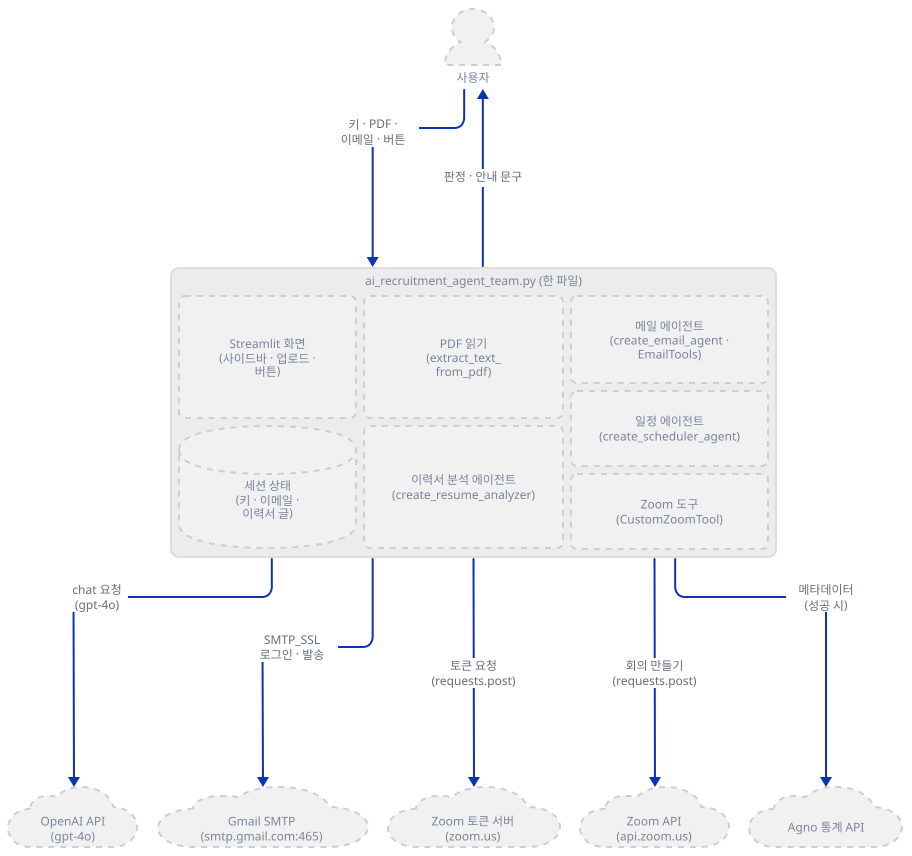

### Step 2. 화면의 문 — 일곱 칸이 다 차야 열립니다

**목적.** 사이드바 입력칸과 그것이 만드는 문을 확인합니다. 메일이나 Zoom을 쓰지 않는 탈락 경로도 일곱 칸이 다 차야 열립니다.

**할 일.** 사이드바는 322~350행에서 OpenAI 키, Zoom 셋, 발신 이메일·앱 비밀번호·회사 이름, 모두 일곱 칸을 만들고, 값이 있을 때만 세션 상태에 저장합니다. 문은 이 부분입니다.

`advanced_ai_agents/multi_agent_apps/agent_teams/ai_recruitment_agent_team/ai_recruitment_agent_team.py:347-359`

```python
        required_configs = {'OpenAI API Key': st.session_state.openai_api_key, 'Zoom Account ID': st.session_state.zoom_account_id,
                          'Zoom Client ID': st.session_state.zoom_client_id, 'Zoom Client Secret': st.session_state.zoom_client_secret,
                          'Email Sender': st.session_state.email_sender, 'Email Password': st.session_state.email_passkey,
                          'Company Name': st.session_state.company_name}

    missing_configs = [k for k, v in required_configs.items() if not v]
    if missing_configs:
        st.warning(f"Please configure the following in the sidebar: {', '.join(missing_configs)}")
        return

    if not st.session_state.openai_api_key:
        st.warning("Please enter your OpenAI API key in the sidebar to continue.")
        return
```

**확인.** `gate_check.py`로 저장해 돌립니다. 외부로 나가는 코드는 닿지 않는 구간입니다.

```python
# 키 일곱 칸이 다 채워지기 전까지 화면이 어디까지 그려지는지 본다. 외부로 나가는 코드는 닿지 않는다.
from streamlit.testing.v1 import AppTest

at = AppTest.from_file("ai_recruitment_agent_team.py", default_timeout=60)
at.run()
print("처음 입력칸:", [t.label for t in at.sidebar.text_input])
print("처음 경고  :", [w.value for w in at.warning])
print("처음 선택상자·버튼:", len(at.selectbox), len(at.button))

six = {"OpenAI API Key": "k", "Zoom Account ID": "a", "Zoom Client ID": "b",
       "Zoom Client Secret": "c", "Sender Email": "recruiter@example.test", "Company Name": "Example Co"}
for t in at.sidebar.text_input:
    if t.label in six:
        t.set_value(six[t.label])
at.run()
print("여섯 칸 뒤 경고:", [w.value for w in at.warning])
print("여섯 칸 뒤 선택상자·버튼:", len(at.selectbox), len(at.button))

for t in at.sidebar.text_input:
    if t.label == "Email App Password":
        t.set_value("pw")
at.run()
print("일곱 칸 뒤 경고:", [w.value for w in at.warning])
print("일곱 칸 뒤 선택상자·버튼:", len(at.selectbox), [b.label for b in at.button])
```

```bash
uv run --no-project python gate_check.py
```

(직접 확인)

```text
처음 입력칸: ['OpenAI API Key', 'Zoom Account ID', 'Zoom Client ID', 'Zoom Client Secret', 'Sender Email', 'Email App Password', 'Company Name']
처음 경고  : ['Please configure the following in the sidebar: OpenAI API Key, Zoom Account ID, Zoom Client ID, Zoom Client Secret, Email Sender, Email Password, Company Name']
처음 선택상자·버튼: 0 0
여섯 칸 뒤 경고: ['Please configure the following in the sidebar: Email Password']
여섯 칸 뒤 선택상자·버튼: 0 0
일곱 칸 뒤 경고: []
일곱 칸 뒤 선택상자·버튼: 1 ['📝 New Application', 'Reset Application']
```

앞 여섯 칸만 채우면 경고가 `Email Password` 하나만 남고, 일곱째가 차야 직무 선택 상자와 `📝 New Application` 버튼이 나옵니다. 경고 문구의 `Email Sender`·`Email Password`는 사이드바 라벨(`Sender Email`·`Email App Password`)과 다르게 적혀 있습니다. 칸이 하나라도 비면 `return`(355행)으로 아래 화면이 아예 그려지지 않으므로, 가짜 값이라도 일곱 칸을 다 채워야 합니다.

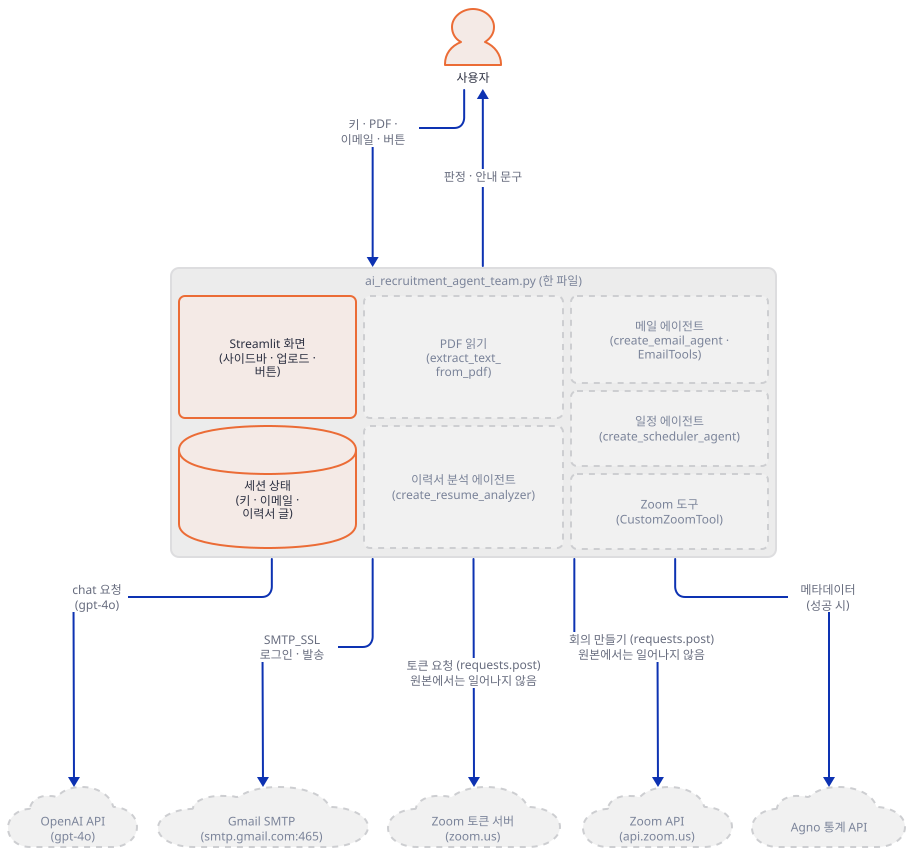

### Step 3. 에이전트 셋과 도구 — 일정 에이전트가 쥔 도구는 agno의 것이 아닙니다

**목적.** 에이전트 셋이 무엇을 쥐는지 보고, Zoom 도구가 agno가 받는 모양인지 확인합니다.

**할 일.** 메일 에이전트는 받는 사람을 만들 때 `EmailTools`에 박습니다. 모델이 `email_user(subject, body)`로 부르면 주소는 앱이 정한 값으로 나갑니다.

`advanced_ai_agents/multi_agent_apps/agent_teams/ai_recruitment_agent_team/ai_recruitment_agent_team.py:130-135`

```python
        tools=[EmailTools(
            receiver_email=st.session_state.candidate_email,
            sender_email=st.session_state.email_sender,
            sender_name=st.session_state.company_name,
            sender_passkey=st.session_state.email_passkey
        )],
```

일정 에이전트는 `CustomZoomTool`을 만들어 `tools=`에 넘깁니다.

`advanced_ai_agents/multi_agent_apps/agent_teams/ai_recruitment_agent_team/ai_recruitment_agent_team.py:150-163`

```python
def create_scheduler_agent() -> Agent:
    zoom_tools = CustomZoomTool(
        account_id=st.session_state.zoom_account_id,
        client_id=st.session_state.zoom_client_id,
        client_secret=st.session_state.zoom_client_secret
    )

    return Agent(
        name="Interview Scheduler",
        model=OpenAIChat(
            id="gpt-4o",
            api_key=st.session_state.openai_api_key
        ),
        tools=[zoom_tools],
```

이 `CustomZoomTool`은 21행에서 `phi.tools.zoom.ZoomTool`을 상속합니다. 11행이 가져오는 agno `Agent`가 도구로 받는 모양은 네 가지입니다. dict, agno의 `Toolkit`, `Function`, 호출할 수 있는 객체입니다(agno 3.1.2의 `agno/agent/_tools.py`의 `parse_tools`를 소스로 확인). 이 네 갈래에 해당하지 않는 객체는 오류도 경고도 없이 건너뜁니다.

**확인.** `tool_check.py`로 두 도구가 어느 쪽인지 봅니다.

```python
# 일정 에이전트에 넘기는 Zoom 도구가 agno가 아는 도구 모양인지 본다. 네트워크는 쓰지 않는다.
from agno.tools import Toolkit as AgnoToolkit
from agno.tools.email import EmailTools
from phi.tools.toolkit import Toolkit as PhiToolkit

src = open("ai_recruitment_agent_team.py", encoding="utf-8").read()
src = src.replace('if __name__ == "__main__":\n    main()', "")  # main()은 부르지 않는다
g = {"__name__": "app"}
exec(compile(src, "app", "exec"), g)

mail = EmailTools(receiver_email="a@example.test", sender_name="n", sender_email="s@example.test", sender_passkey="p")
zoom = g["CustomZoomTool"](account_id="a", client_id="b", client_secret="c")
for name, tool in (("EmailTools", mail), ("CustomZoomTool", zoom)):
    print(f"{name:15} agno Toolkit: {isinstance(tool, AgnoToolkit)} | phi Toolkit: {isinstance(tool, PhiToolkit)}"
          f" | callable: {callable(tool)} | dict: {isinstance(tool, dict)}")
```

```bash
uv run --no-project python tool_check.py
```

(직접 확인)

```text
EmailTools      agno Toolkit: True | phi Toolkit: False | callable: False | dict: False
CustomZoomTool  agno Toolkit: False | phi Toolkit: True | callable: False | dict: False
```

`EmailTools`는 agno의 `Toolkit`이고 `CustomZoomTool`은 `phi`의 `Toolkit`이며 호출할 수도 없습니다. 이 결과가 Step 6에서 모델 요청에 도구가 없는 모습으로 나타납니다.

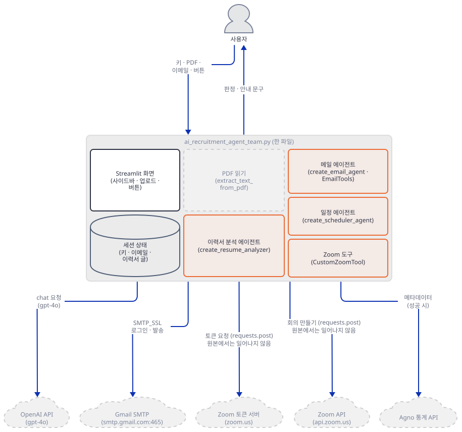

### Step 4. 가짜 서버를 세우고 이력서를 분석합니다 — 판정은 JSON 한 번에 달렸습니다

**목적.** 가짜 OpenAI 서버와 harness를 세워 앱 전체를 돌릴 수 있게 하고, 이력서 PDF가 판정이 되기까지를 봅니다.

**할 일.** 모델과 바깥으로 나가는 세 지점을 대신할 파일을 저장합니다. `make_pdfs.py`는 가짜 이력서 넷을 `resumes/`에 만듭니다. 합격감, 탈락감, 그리고 모델 답이 `json` 코드 울타리(백틱 세 개)로 감싸이는 경우(`FENCED-REPLY`)와 `selected`가 문자열 `"false"`인 경우(`STRING-FALSE`)를 흉내 내는 둘입니다.

```python
# make_pdfs.py - 가짜 이력서 PDF 넷을 손으로 만든다. 실존 인물은 없고 주소는 예약 도메인(.test)이다.
import pathlib


def make_pdf(lines, path):
    text = "BT /F1 11 Tf 50 780 Td 14 TL\n" + "\n".join(f"({l}) '" for l in lines) + "\nET"
    objs = ["<< /Type /Catalog /Pages 2 0 R >>",
            "<< /Type /Pages /Kids [3 0 R] /Count 1 >>",
            "<< /Type /Page /Parent 2 0 R /MediaBox [0 0 612 842] /Contents 4 0 R "
            "/Resources << /Font << /F1 5 0 R >> >> >>",
            f"<< /Length {len(text)} >>\nstream\n{text}\nendstream",
            "<< /Type /Font /Subtype /Type1 /BaseFont /Helvetica >>"]
    out, offs = "%PDF-1.4\n", []
    for i, o in enumerate(objs, 1):
        offs.append(len(out))
        out += f"{i} 0 obj\n{o}\nendobj\n"
    xref = len(out)
    out += f"xref\n0 {len(objs) + 1}\n0000000000 65535 f \n" + "".join(f"{o:010d} 00000 n \n" for o in offs)
    out += f"trailer\n<< /Size {len(objs) + 1} /Root 1 0 R >>\nstartxref\n{xref}\n%%EOF\n"
    pathlib.Path(path).write_bytes(out.encode("latin-1"))


pathlib.Path("resumes").mkdir(exist_ok=True)
make_pdf(["Sample Candidate A - fictional", "Email: candidate.a@example.test",
          "Skills: Python, PyTorch, TensorFlow, deep learning, RAG, LLM finetuning,",
          "prompt engineering, MLOps, model deployment, data preprocessing."], "resumes/strong.pdf")
make_pdf(["Sample Candidate B - fictional", "Email: candidate.b@example.test",
          "Skills: bouquet design, customer service, scheduling deliveries."], "resumes/weak.pdf")
make_pdf(["Sample Candidate C - fictional", "Skills: gardening. FENCED-REPLY"], "resumes/fenced.pdf")
make_pdf(["Sample Candidate D - fictional", "Skills: gardening. STRING-FALSE"], "resumes/strfalse.pdf")
```

`fake_openai.py`는 `127.0.0.1`의 한 포트에서 대본으로만 답합니다. 이력서 분석 요청(도구가 없는 요청)에는 이력서 글에 `PyTorch`가 있으면 합격 JSON을, 도구 `email_user`나 `schedule_meeting`이 실린 요청에는 그 도구를 부르라는 답을, 도구 결과가 돌아온 요청에는 마무리 문장을 줍니다. 요청마다 도구 이름·역할·마지막 메시지 글자 수를 `model.jsonl`에 남깁니다. `Authorization`이 `Bearer sk-bad-key`이면 401을 돌려줍니다.

```python
# fake_openai.py - 가짜 OpenAI 서버. 127.0.0.1 한 포트에서 대본으로만 답한다.
# 사용: python fake_openai.py <포트> <요청기록.jsonl>
import json, sys, time
from http.server import BaseHTTPRequestHandler, HTTPServer

LOG = sys.argv[2]


def text_of(m):
    c = m.get("content")
    if isinstance(c, list):
        return "".join(p.get("text", "") for p in c if isinstance(p, dict))
    return c or ""


def script(body):
    tools = [t["function"]["name"] for t in body.get("tools") or []]
    msgs = body["messages"]
    full = "\n".join(text_of(m) for m in msgs)
    last = msgs[-1]
    if "Please analyze this resume" in full:  # 이력서 분석 에이전트(도구 없음)
        resume = full.split("Resume Text:")[-1].split("Your response must be")[0]
        ok = "PyTorch" in resume
        data = {"selected": ok, "feedback": "대본 응답", "matching_skills": [],
                "missing_skills": [], "experience_level": "mid"}
        if "FENCED-REPLY" in resume:  # 모델이 ```json 울타리를 두른 경우
            return {"content": "```json\n" + json.dumps(data) + "\n```"}
        if "STRING-FALSE" in resume:  # selected가 불리언이 아니라 문자열 "false"
            data["selected"] = "false"
        return {"content": json.dumps(data)}
    if last["role"] == "tool":
        return {"content": "대본: 도구 결과를 받았습니다 -> " + text_of(last)[:120]}
    if "email_user" in tools:
        return {"tool": ("email_user", {"subject": "대본 메일", "body": "대본 메일 본문"})}
    if "schedule_meeting" in tools:
        return {"tool": ("schedule_meeting", {"topic": "Technical Interview",
                "start_time": "2026-10-10T11:00:00", "duration": 60, "timezone": "Asia/Kolkata"})}
    return {"content": "대본: 이 에이전트에는 도구가 하나도 오지 않았습니다"}


class Handler(BaseHTTPRequestHandler):
    def log_message(self, *a):
        pass

    def reply(self, code, obj):
        data = json.dumps(obj).encode()
        self.send_response(code)
        self.send_header("content-type", "application/json")
        self.send_header("content-length", str(len(data)))
        self.end_headers()
        self.wfile.write(data)

    def do_POST(self):
        body = json.loads(self.rfile.read(int(self.headers.get("content-length", 0))) or b"{}")
        rec = {"tools": [t["function"]["name"] for t in body.get("tools") or []],
               "roles": [m["role"] for m in body["messages"]],
               "last_chars": len(text_of(body["messages"][-1])),
               "last": text_of(body["messages"][-1])[:4000]}
        with open(LOG, "a", encoding="utf-8") as f:
            f.write(json.dumps(rec, ensure_ascii=False) + "\n")
        if self.headers.get("authorization") == "Bearer sk-bad-key":  # 잘못된 키 흉내
            return self.reply(401, {"error": {"message": "Incorrect API key (대본 401)", "code": "invalid_api_key"}})
        r = script(body)
        if "tool" in r:
            name, args = r["tool"]
            msg = {"role": "assistant", "content": None, "tool_calls": [{"id": "call_1", "type": "function",
                   "function": {"name": name, "arguments": json.dumps(args)}}]}
            fin = "tool_calls"
        else:
            msg, fin = {"role": "assistant", "content": r["content"]}, "stop"
        self.reply(200, {"id": "chatcmpl-fake", "object": "chat.completion", "created": int(time.time()),
                         "model": body.get("model"), "choices": [{"index": 0, "message": msg, "finish_reason": fin}],
                         "usage": {"prompt_tokens": 100, "completion_tokens": 20, "total_tokens": 120}})


class Server(HTTPServer):
    allow_reuse_address = False  # Windows에서 남의 포트에 겹쳐 뜨지 않게


Server(("127.0.0.1", int(sys.argv[1])), Handler).serve_forever()
```

`harness.py`는 앱 파일을 건드리지 않고 `requests.post`(Zoom 토큰과 회의 주소만 가짜 응답, 나머지는 막고 기록), `smtplib.SMTP_SSL`(로그인과 발송을 기록만 함), `socket.getaddrinfo`(`127.0.0.1` 밖의 이름 조회를 막고 기록)를 바꿉니다. Streamlit의 `AppTest`가 파일 업로드를 다루지 못해서 진짜 `UploadedFile` 객체를 직접 만들어 `st.file_uploader`가 돌려주게 합니다.

```python
# harness.py - 앱이 바깥으로 나가는 세 지점을 가짜로 바꾼다. 앱 파일은 건드리지 않는다.
#  1) requests.post  -> Zoom 토큰·회의 주소만 가짜 응답, 나머지는 막고 기록
#  2) smtplib.SMTP_SSL -> 로그인·발송을 기록만 함(진짜 SMTP 연결 없음)
#  3) socket.getaddrinfo -> 127.0.0.1 말고는 이름 조회를 막고 기록
import json, os, smtplib, socket

import requests
import streamlit as st

CALLS = {"post": [], "smtp": [], "dns_blocked": [], "blocked_post": []}
MODE = {"zoom": os.environ.get("FAKE_ZOOM", "ok"), "smtp": os.environ.get("FAKE_SMTP", "ok")}

_real_gai = socket.getaddrinfo


def _gai(host, *a, **k):
    if host in ("127.0.0.1", "localhost"):
        return _real_gai(host, *a, **k)
    CALLS["dns_blocked"].append(host)
    raise socket.gaierror(11001, "blocked: " + str(host))


socket.getaddrinfo = _gai


def _resp(obj, code=200):
    r = requests.Response()
    r.status_code, r._content = code, json.dumps(obj).encode()
    return r


def fake_post(url, *a, **k):
    CALLS["post"].append({"url": url, "basic_auth": bool(k.get("auth")), "data": k.get("data"),
                          "json_keys": sorted((k.get("json") or {}).keys()),
                          "bearer": "Authorization" in (k.get("headers") or {})})
    if url == "https://zoom.us/oauth/token":
        if MODE["zoom"] == "tokenfail":
            raise requests.ConnectionError("대본: 토큰 서버에 닿지 않음")
        return _resp({"access_token": "fake-token", "expires_in": 3600})
    if url == "https://api.zoom.us/v2/users/me/meetings":
        j = k["json"]
        return _resp({"id": 99999999, "topic": j["topic"], "start_time": j["start_time"], "duration": j["duration"],
                      "join_url": "https://zoom.example.test/j/99999999"}, 201)
    CALLS["blocked_post"].append(url)
    raise requests.ConnectionError("blocked: " + url)


requests.post = fake_post


class FakeSMTP_SSL:
    def __init__(self, host, port, *a, **k):
        self.rec = {"host": host, "port": port}
        CALLS["smtp"].append(self.rec)

    def __enter__(self):
        return self

    def __exit__(self, *a):
        return False

    def login(self, user, pw):
        self.rec["login_user"] = user
        if MODE["smtp"] == "authfail":
            raise smtplib.SMTPAuthenticationError(535, b"fake: bad credentials")

    def send_message(self, msg):
        self.rec.update({"to": msg["To"], "from": msg["From"], "subject": msg["Subject"]})


smtplib.SMTP_SSL = FakeSMTP_SSL


def install_uploader():
    """AppTest는 file_uploader를 못 다루므로 진짜 UploadedFile을 직접 만들어 돌려준다."""
    from streamlit.proto.Common_pb2 import FileURLs
    from streamlit.runtime.uploaded_file_manager import UploadedFile, UploadedFileRec
    path, held = os.environ["FAKE_RESUME"], {}

    def fake_uploader(*a, **k):
        if "f" not in held:
            rec = UploadedFileRec("fid1", os.path.basename(path), "application/pdf", open(path, "rb").read())
            held["f"] = UploadedFile(rec, FileURLs())
        return held["f"]

    st.file_uploader = fake_uploader
```

`wrapper.py`는 harness를 먼저 걸고 앱을 실행하고, `drive.py`는 `AppTest`로 사이드바 일곱 칸과 지원자 이메일을 채우고 버튼을 누른 뒤 화면 문구와 기록된 호출을 요약합니다. 앱이 `print`로 찍는 디버그와 agno 로그는 `app_out.log`에 모읍니다.

```python
import harness

harness.install_uploader()
exec(compile(open("ai_recruitment_agent_team.py", encoding="utf-8").read(), "ai_recruitment_agent_team.py", "exec"))
```

```python
# 사용: FAKE_RESUME=resumes/strong.pdf CAND=candidate.a@example.test ACTIONS=analyze,proceed python drive.py
import contextlib, json, os, sys

sys.path.insert(0, os.getcwd())
import harness
from streamlit.testing.v1 import AppTest

LOG = os.environ["MODEL_LOG"]
open(LOG, "w").close()  # 이번 실행의 모델 요청만 남긴다(서버는 요청마다 파일을 열어 덧붙인다)
KEYS = {"OpenAI API Key": os.environ.get("KEY", "sk-fake-test"), "Zoom Account ID": "acct-fake",
        "Zoom Client ID": "cid-fake", "Zoom Client Secret": "csec-fake",
        "Sender Email": "recruiter@example.test", "Email App Password": "fakepasskey0000fa",
        "Company Name": "Example Co"}


def show(at, tag):
    print("---", tag)
    for name, els in (("error", at.error), ("warning", at.warning), ("success", at.success), ("info", at.info)):
        if len(els):
            print(f"  {name:8}", [e.value.strip().replace("\n", " ")[:70] for e in els])
    for e in at.exception:
        print("  EXC", e.value[:200])


# 앱이 print로 찍는 디버그와 agno 로그는 app_out.log로 보내고, 아래 요약만 화면에 낸다.
applog = open("app_out.log", "w", encoding="utf-8")
with contextlib.redirect_stdout(applog), contextlib.redirect_stderr(applog):
    at = AppTest.from_file("wrapper.py", default_timeout=120)
    at.run()
    for ti in at.sidebar.text_input:
        if ti.label in KEYS:
            ti.set_value(KEYS[ti.label])
    at.run()
    for ti in at.text_input:
        if ti.label.startswith("Candidate"):
            ti.set_value(os.environ["CAND"])
    at.run()
BUTTON = {"analyze": "Analyze Resume", "proceed": "Proceed with Application"}
for act in os.environ["ACTIONS"].split(","):
    with contextlib.redirect_stdout(applog), contextlib.redirect_stderr(applog):
        next(b for b in at.button if b.label == BUTTON[act]).click()
        at.run()
    show(at, act)
print("SMTP :", json.dumps(harness.CALLS["smtp"], ensure_ascii=False))
print("POST :", json.dumps(harness.CALLS["post"], ensure_ascii=False))
print("막은 것:", harness.CALLS["blocked_post"], harness.CALLS["dns_blocked"])
print("모델 요청(도구 | 역할 | 마지막 메시지 글자 수):")
for line in open(LOG, encoding="utf-8"):
    r = json.loads(line)
    print("  ", r["tools"], r["roles"], r["last_chars"])
```

터미널 하나에서 서버를 띄웁니다. 포트는 49152~65535에서 비어 있는 것을 고르세요(나는 61877을 썼습니다). Windows에는 OS가 예약해 둔 제외 범위가 있어서, 그 안의 포트는 비어 있어도 `PermissionError: [WinError 10013]`으로 서버가 못 뜹니다. 이 문서를 처음 쓸 때 쓰던 58231도 나중에 이 범위에 들어가 있었습니다. 범위는 `netsh interface ipv4 show excludedportrange protocol=tcp`로 보고(재부팅마다 바뀔 수 있습니다), 그 안이면 다른 포트를 고르세요.

```bash
uv run --no-project python make_pdfs.py
uv run --no-project python fake_openai.py 61877 model.jsonl
```

다른 터미널에서 같은 폴더로 가서 앱이 모델 서버로 이 주소를 쓰게 하고 agno의 통계는 끕니다(`OPENAI_BASE_URL`은 OpenAI 파이썬 SDK가 읽는 환경변수입니다. agno의 익명 통계는 Day 047 Step 5가 다룬 것과 같은 통계이고, 성공한 `run` 뒤에 `agno/agent/_run.py` 673행에서 보내집니다. 이 환경변수가 그것을 끕니다).

```bash
export OPENAI_BASE_URL=http://127.0.0.1:61877/v1
export AGNO_TELEMETRY=false
```

```powershell
$env:OPENAI_BASE_URL = "http://127.0.0.1:61877/v1"
$env:AGNO_TELEMETRY = "false"
```

(PowerShell은 실행해 보지 못했습니다.) 앱 코드는 키를 환경변수가 아니라 사이드바에서 받고(`ai_recruitment_agent_team.py:111`) 모델 주소를 따로 정하지 않으므로, SDK가 이 환경변수를 읽는 것이 가짜 서버로 가는 길입니다.

**확인.** 먼저 합격감 이력서의 분석 하나입니다. `drive.py`는 시작할 때 `model.jsonl`을 비우므로 서버를 끄지 않고 시나리오를 바꿔 가며 돌릴 수 있습니다.

```bash
MODEL_LOG=model.jsonl FAKE_RESUME=resumes/strong.pdf CAND=candidate.a@example.test ACTIONS=analyze uv run --no-project python drive.py
```

```powershell
$env:MODEL_LOG = "model.jsonl"
$env:FAKE_RESUME = "resumes/strong.pdf"
$env:CAND = "candidate.a@example.test"
$env:ACTIONS = "analyze"
uv run --no-project python drive.py
```

(PowerShell은 실행해 보지 못했습니다. 이후 시나리오는 bash 줄만 적습니다. 바꿀 값은 `FAKE_RESUME`·`CAND`·`ACTIONS`이고, 실패 시나리오에서는 `FAKE_SMTP`·`KEY`·`FAKE_ZOOM`도 바뀝니다. bash의 `값=… 명령` 형태는 그 명령에만 적용되지만 PowerShell의 `$env:`는 그 세션에 남습니다. 실패 시나리오를 돌린 뒤에는 `Remove-Item Env:FAKE_SMTP, Env:KEY, Env:FAKE_ZOOM -ErrorAction SilentlyContinue`로 지우세요. 안 지우면 Step 6의 합격 시나리오가 분석부터 실패해 `Proceed with Application` 버튼이 없어 `drive.py`가 `StopIteration`으로 죽습니다(bash에서 같은 상황을 만들어 직접 확인).) 직접 확인한 출력입니다.

```text
--- analyze
  success  ['Congratulations! Your skills match our requirements.']
  info     ["Click 'Proceed with Application' to continue with the interview proces"]
SMTP : []
POST : []
막은 것: [] []
모델 요청(도구 | 역할 | 마지막 메시지 글자 수):
   [] ['developer', 'user'] 1546
```

분석 요청은 `gpt-4o`에 한 번, 도구 없이 갔고 SMTP와 Zoom 호출은 0건입니다. 요청의 마지막 메시지(1,546자)가 이 프롬프트입니다. 직무 요건과 이력서 글을 함께 넣고 JSON 모양과 평가 기준을 지시하며, 끝에 "마크다운이나 백틱 없이 JSON 객체만 돌려 달라"고 요구합니다.

`advanced_ai_agents/multi_agent_apps/agent_teams/ai_recruitment_agent_team/ai_recruitment_agent_team.py:196-217`

```python
        response: RunOutput = analyzer.run(
            f"""Please analyze this resume against the following requirements and provide your response in valid JSON format:
            Role Requirements:
            {ROLE_REQUIREMENTS[role]}
            Resume Text:
            {resume_text}
            Your response must be a valid JSON object like this:
            {{
                "selected": true/false,
                "feedback": "Detailed feedback explaining the decision",
                "matching_skills": ["skill1", "skill2"],
                "missing_skills": ["skill3", "skill4"],
                "experience_level": "junior/mid/senior"
            }}
            Evaluation criteria:
            1. Match at least 70% of required skills
            2. Consider both theoretical knowledge and practical experience
            3. Value project experience and real-world applications
            4. Consider transferable skills from similar technologies
            5. Look for evidence of continuous learning and adaptability
            Important: Return ONLY the JSON object without any markdown formatting or backticks.
            """
```

모델 답은 이렇게 읽습니다.

`advanced_ai_agents/multi_agent_apps/agent_teams/ai_recruitment_agent_team/ai_recruitment_agent_team.py:220-228`

```python
        assistant_message = next((msg.content for msg in response.messages if msg.role == 'assistant'), None)
        if not assistant_message:
            raise ValueError("No assistant message found in response.")

        result = json.loads(assistant_message.strip())
        if not isinstance(result, dict) or not all(k in result for k in ["selected", "feedback"]):
            raise ValueError("Invalid response format")

        return result["selected"], result["feedback"]
```

`json.loads`가 되고 `selected`와 `feedback` 키가 있는지만 보고, `selected`가 불리언인지는 보지 않습니다. 두 실패를 가짜 서버로 재현합니다(직접 확인).

```bash
MODEL_LOG=model.jsonl FAKE_RESUME=resumes/fenced.pdf CAND=candidate.c@example.test ACTIONS=analyze uv run --no-project python drive.py
```

```text
--- analyze
  error    ['Error processing response: Expecting value: line 1 column 1 (char 0)']
  warning  ["Unfortunately, your skills don't match our requirements."]
  info     ["We've sent you an email with detailed feedback."]
SMTP : [{"host": "smtp.gmail.com", "port": 465, "login_user": "recruiter@example.test", "to": "candidate.c@example.test", "from": "Example Co <recruiter@example.test>", "subject": "대본 메일"}]
POST : []
막은 것: [] []
모델 요청(도구 | 역할 | 마지막 메시지 글자 수):
   [] ['developer', 'user'] 1408
   ['email_user'] ['developer', 'user'] 680
   ['email_user'] ['developer', 'user', 'assistant', 'tool'] 23
```

울타리가 있는 답은 `json.loads`가 실패해 `(False, "Error analyzing resume: …")`가 되고 화면은 탈락을 알립니다. 그 오류 문장이 `feedback`이 되어 탈락 메일 지시문의 "mention specific feedback from:" 자리에 들어갔습니다. 가짜 서버가 받은 요청 기록에 그 문장이 그대로 있었습니다(직접 확인).

```bash
grep -o "Error analyzing resume[^\"\]*" model.jsonl
```

```text
Error analyzing resume: Expecting value: line 1 column 1 (char 0)
```

(PowerShell에서는 `(Select-String -Pattern 'Error analyzing resume[^"\\]*' -AllMatches model.jsonl).Matches.Value`가 일치한 부분만 냅니다. 실행해 보지 못했습니다.) 지원자는 모델이 JSON을 잘못 감쌌다는 이유로 탈락 메일을 받게 됩니다. 또 `strfalse.pdf`(`selected`가 `"false"`)는 `if is_selected:`가 문자열을 참으로 읽어 합격으로 갑니다.

```bash
MODEL_LOG=model.jsonl FAKE_RESUME=resumes/strfalse.pdf CAND=candidate.d@example.test ACTIONS=analyze uv run --no-project python drive.py
```

화면에는 `Congratulations! Your skills match our requirements.`와 `Proceed with Application` 안내가 나옵니다(직접 확인, 출력은 Step 6의 합격 경로와 같은 모양이라 줄입니다). 모델이 문자열 `"false"`를 쓸 가능성은 확인하지 못했고, 이 코드가 불리언 여부를 보지 않는다는 점을 보인 것입니다.

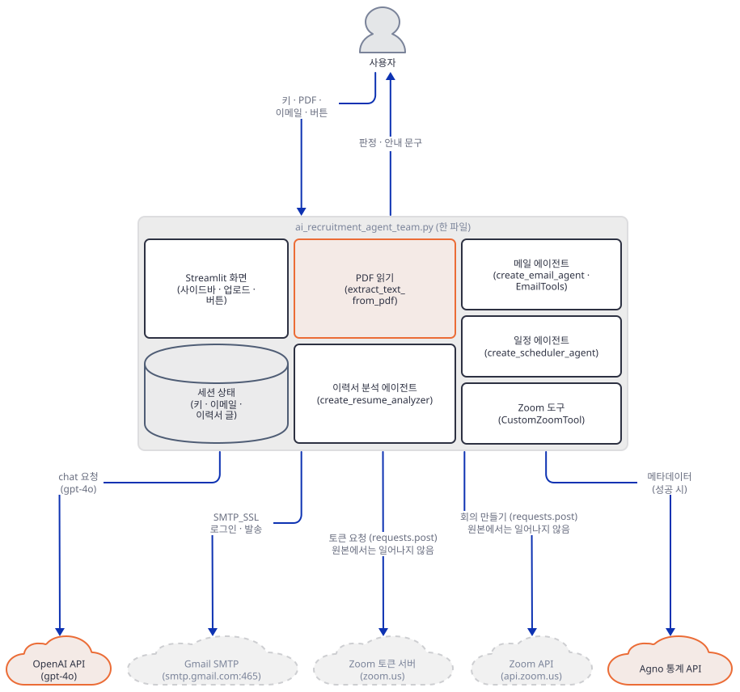

### Step 5. 탈락 경로 — 메일은 실패해도 "보냈다"고 합니다

**목적.** 탈락 판정 뒤 메일이 어떻게 나가는지 보고, 실패가 화면에 어떻게 비치는지 봅니다.

**할 일.** 탈락이면 같은 `email_agent`로 탈락 메일을 지시합니다.

`advanced_ai_agents/multi_agent_apps/agent_teams/ai_recruitment_agent_team/ai_recruitment_agent_team.py:430-451`

```python
                    if is_selected:
                        st.success("Congratulations! Your skills match our requirements.")
                        st.session_state.analysis_complete = True
                        st.session_state.is_selected = True
                        st.rerun()
                    else:
                        st.warning("Unfortunately, your skills don't match our requirements.")
                        st.write(f"Feedback: {feedback}")
                        
                        # Send rejection email
                        with st.spinner("Sending feedback email..."):
                            try:
                                send_rejection_email(
                                    email_agent=email_agent,
                                    to_email=email,
                                    role=role,
                                    feedback=feedback
                                )
                                st.info("We've sent you an email with detailed feedback.")
                            except Exception as e:
                                logger.error(f"Error sending rejection email: {e}")
                                st.error("Could not send feedback email. Please try again.")
```

`send_rejection_email`(248~268행)은 `email_agent.run(...)` 한 번이고 반환값을 쓰지 않습니다. 화면의 `st.info`는 `run`이 예외를 던지지 않으면 나옵니다.

**확인.** 탈락감 이력서입니다.

```bash
MODEL_LOG=model.jsonl FAKE_RESUME=resumes/weak.pdf CAND=candidate.b@example.test ACTIONS=analyze uv run --no-project python drive.py
```

(직접 확인)

```text
--- analyze
  warning  ["Unfortunately, your skills don't match our requirements."]
  info     ["We've sent you an email with detailed feedback."]
SMTP : [{"host": "smtp.gmail.com", "port": 465, "login_user": "recruiter@example.test", "to": "candidate.b@example.test", "from": "Example Co <recruiter@example.test>", "subject": "대본 메일"}]
POST : []
막은 것: [] []
모델 요청(도구 | 역할 | 마지막 메시지 글자 수):
   [] ['developer', 'user'] 1473
   ['email_user'] ['developer', 'user'] 620
   ['email_user'] ['developer', 'user', 'assistant', 'tool'] 23
```

모델 요청이 세 번입니다. 분석, 메일 에이전트(도구 `email_user`), 도구 결과를 실은 같은 에이전트의 두 번째 요청입니다. SMTP 기록은 한 건으로 `smtp.gmail.com:465`, 받는 사람은 내가 입력한 `candidate.b@example.test`, 보내는 사람은 `Example Co <recruiter@example.test>`입니다. 받는 사람이 모델이 아니라 앱이 정한 값임을 이 기록이 보입니다.

이제 실패 둘을 봅니다. 하나는 SMTP 로그인이 실패하는 경우입니다(`FAKE_SMTP=authfail`가 `login`에서 `SMTPAuthenticationError`를 던집니다).

```bash
FAKE_SMTP=authfail MODEL_LOG=model.jsonl FAKE_RESUME=resumes/weak.pdf CAND=candidate.b@example.test ACTIONS=analyze uv run --no-project python drive.py
```

```text
--- analyze
  warning  ["Unfortunately, your skills don't match our requirements."]
  info     ["We've sent you an email with detailed feedback."]
SMTP : [{"host": "smtp.gmail.com", "port": 465, "login_user": "recruiter@example.test"}]
POST : []
막은 것: [] []
모델 요청(도구 | 역할 | 마지막 메시지 글자 수):
   [] ['developer', 'user'] 1473
   ['email_user'] ['developer', 'user'] 620
   ['email_user'] ['developer', 'user', 'assistant', 'tool'] 38
```

SMTP 기록에는 로그인 시도만 있고 발송은 없습니다. 모델에게 돌아간 도구 결과는 38자의 `error: (535, …)` 문자열이고(마지막 줄의 38), 에이전트는 그대로 마무리 문장을 쓰고 끝나서 앱 화면은 여전히 `We've sent you an email with detailed feedback.`입니다. agno는 로그에 예외를 남기지만(`app_out.log`에서 `SMTPAuthenticationError`를 확인) `run`은 예외를 던지지 않습니다. 앱의 `except`(449~451행)는 그래서 타지 않습니다. 다른 하나는 OpenAI 키가 틀린 경우입니다(가짜 서버가 `sk-bad-key`에 401을 줍니다).

```bash
KEY=sk-bad-key MODEL_LOG=model.jsonl FAKE_RESUME=resumes/strong.pdf CAND=candidate.a@example.test ACTIONS=analyze uv run --no-project python drive.py
```

```text
--- analyze
  error    ['Error processing response: No assistant message found in response.']
  warning  ["Unfortunately, your skills don't match our requirements."]
  info     ["We've sent you an email with detailed feedback."]
SMTP : []
POST : []
막은 것: [] []
모델 요청(도구 | 역할 | 마지막 메시지 글자 수):
   [] ['developer', 'user'] 1546
   ['email_user'] ['developer', 'user'] 678
```

합격감 이력서인데도 분석 요청이 401을 받아 `No assistant message found in response.`가 되고, 앱은 이를 탈락으로 읽어 메일 요청을 또 보내고(역시 401) 화면에는 탈락 안내와 "sent"가 나옵니다. SMTP 호출은 0건이라 실제로는 아무 메일도 나가지 않았습니다. 키 오류 하나가 모든 지원자를 탈락 화면으로 보냅니다.

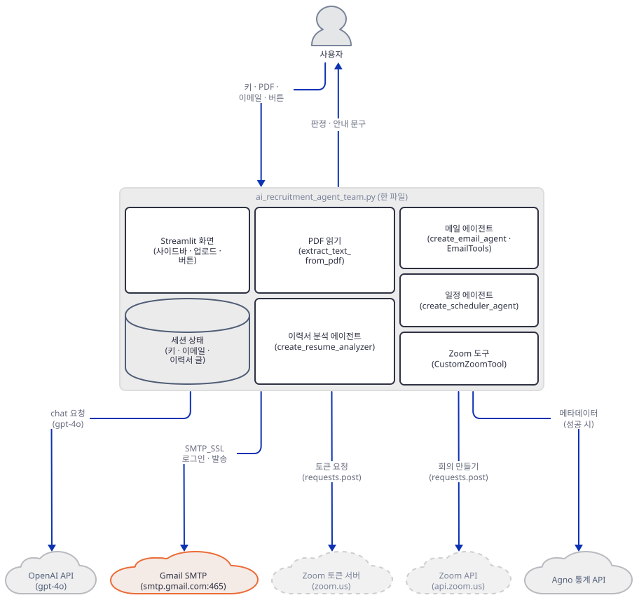

### Step 6. 합격 경로와 Zoom — 도구가 없는 일정 에이전트

**목적.** `Proceed with Application`의 세 단계(선발 메일, Zoom 일정, 확인 메일)를 끝까지 돌리고, Zoom에 요청이 갔는지 봅니다.

**할 일.** 합격 경로는 453~512행입니다. 메일 에이전트와 일정 에이전트를 새로 만들고(463·467행에서 에이전트 전체를 `print`합니다), 선발 메일, 일정, 확인 메일 순서입니다. 일정은 오늘로부터 하루 뒤 11시(IST)를 만들어 지시문에 넣습니다.

`advanced_ai_agents/multi_agent_apps/agent_teams/ai_recruitment_agent_team/ai_recruitment_agent_team.py:276-296`

```python
        # Get current time in IST
        ist_tz = pytz.timezone('Asia/Kolkata')
        current_time_ist = datetime.now(ist_tz)

        tomorrow_ist = current_time_ist + timedelta(days=1)
        interview_time = tomorrow_ist.replace(hour=11, minute=0, second=0, microsecond=0)
        formatted_time = interview_time.strftime('%Y-%m-%dT%H:%M:%S')

        meeting_response = scheduler.run(
            f"""Schedule a 60-minute technical interview with these specifications:
            - Title: '{role} Technical Interview'
            - Date: {formatted_time}
            - Timezone: IST (India Standard Time)
            - Attendee: {candidate_email}
            
            Important Notes:
            - The meeting must be between 9 AM - 5 PM IST
            - Use IST (UTC+5:30) timezone for all communications
            - Include timezone information in the meeting details
            """
        )
```

일정 에이전트의 응답 객체 `meeting_response`는 그대로 확인 메일 지시문에 f-string으로 들어갑니다.

`advanced_ai_agents/multi_agent_apps/agent_teams/ai_recruitment_agent_team/ai_recruitment_agent_team.py:298-309`

```python
        email_agent.run(
            f"""Send an interview confirmation email with these details:
            - Role: {role} position
            - Meeting Details: {meeting_response}
            
            Important:
            - Clearly specify that the time is in IST (India Standard Time)
            - Ask the candidate to join 5 minutes early
            - Include timezone conversion link if possible
            - Ask him to be confident and not so nervous and prepare well for the interview
            """
        )
```

**확인.** 합격감 이력서로 끝까지 돌리고 터미널 출력은 `app_out.log`로 나눠 봅니다.

```bash
MODEL_LOG=model.jsonl FAKE_RESUME=resumes/strong.pdf CAND=candidate.a@example.test ACTIONS=analyze,proceed uv run --no-project python drive.py
```

(직접 확인. SMTP 줄은 두 건이라 길어서 앞부분만 적습니다.)

```text
--- analyze
  success  ['Congratulations! Your skills match our requirements.']
  info     ["Click 'Proceed with Application' to continue with the interview proces"]
--- proceed
  success  ['Congratulations! Your skills match our requirements.', 'Interview scheduled successfully! Check your email for details.', '🎉 Application Successfully Processed!  Please check your email for: 1.']
  info     ["Click 'Proceed with Application' to continue with the interview proces"]
SMTP : [{"host": "smtp.gmail.com", "port": 465, "login_user": "recruiter@example.test", "to": "candidate.a@example.test", "from": "Example Co <recruiter@example.test>", "subject": "대본 메일"},  …
POST : []
막은 것: [] []
모델 요청(도구 | 역할 | 마지막 메시지 글자 수):
   [] ['developer', 'user'] 1546
   ['email_user'] ['developer', 'user'] 367
   ['email_user'] ['developer', 'user', 'assistant', 'tool'] 23
   [] ['developer', 'user'] 508
   ['email_user'] ['developer', 'user'] 6565
   ['email_user'] ['developer', 'user', 'assistant', 'tool'] 23
```

모델 요청은 모두 여섯 번입니다(분석은 합격이라 메일이 없고, `proceed` 뒤 다섯 번이 이어집니다). 선발 메일 둘, 일정 하나, 확인 메일 둘입니다. 읽을 점이 셋입니다. 하나, 일정 에이전트의 요청(네 번째, 508자)의 도구 목록이 `[]`입니다. Zoom 도구를 쥐여 줬는데 모델에게는 도구가 하나도 가지 않았습니다. `POST : []`, 즉 `requests.post`가 한 번도 불리지 않았습니다. 그런데도 `Interview scheduled successfully! Check your email for details.`가 떴습니다. 둘, 확인 메일 요청(다섯 번째)의 마지막 메시지가 6,560자 안팎입니다(실행마다 몇 글자 달라집니다). `meeting_response`가 `RunOutput`이라 f-string이 객체의 repr 전체(입력, 시스템 메시지, 메시지 목록, 지표)를 지시문에 넣었기 때문입니다. `grep -c "Meeting Details: RunOutput(run_id=" model.jsonl`이 `1`을 냈습니다(직접 확인). 셋, 터미널 쪽 기록(`app_out.log`)에서 OpenAI 키를 찾아봅니다.

```bash
grep -o "api_key='[^']*'" app_out.log
```

```text
api_key='sk-fake-test'
api_key='sk-fake-test'
```

(직접 확인. 463·467행의 `print`가 에이전트 객체를 통째로 찍을 때 모델 설정의 `api_key`가 같이 나옵니다. PowerShell에서는 `(Select-String -Pattern "api_key='[^']*'" -AllMatches app_out.log).Matches.Value`가 일치한 부분만 냅니다. 실행해 보지 못했습니다.) 에이전트 repr에 `EmailTools`의 `sender_passkey`와 Zoom 비밀은 나오지 않았습니다(같은 파일에서 `fakepasskey`·`csec-fake`·`acct-fake`를 찾아 0건이었던 것을 직접 확인).

Zoom 도구 자체는 고장이 아닙니다. `CustomZoomTool`이 토큰을 어떻게 받는지 봅니다.

`advanced_ai_agents/multi_agent_apps/agent_teams/ai_recruitment_agent_team/ai_recruitment_agent_team.py:28-49`

```python
    def get_access_token(self) -> str:
        if self.access_token and time.time() < self.token_expires_at:
            return str(self.access_token)
            
        headers = {"Content-Type": "application/x-www-form-urlencoded"}
        data = {"grant_type": "account_credentials", "account_id": self.account_id}

        try:
            response = requests.post(self.token_url, headers=headers, data=data, auth=(self.client_id, self.client_secret))
            response.raise_for_status()

            token_info = response.json()
            self.access_token = token_info["access_token"]
            expires_in = token_info["expires_in"]
            self.token_expires_at = time.time() + expires_in - 60

            self._set_parent_token(str(self.access_token))
            return str(self.access_token)

        except requests.RequestException as e:
            logger.error(f"Error fetching access token: {e}")
            return ""
```

`get_access_token`을 덮어써서 토큰을 `zoom.us/oauth/token`에 기본 인증과 `account_credentials`로 요청합니다. 부모의 `schedule_meeting`이 이 메서드를 부르므로 도구가 불릴 때 토큰이 먼저 오고, 토큰은 만료 60초 전까지 재사용합니다. 모델을 거치지 않고 도구를 직접 부르는 `zoom_check.py`로 확인합니다.

```python
import harness

src = open("ai_recruitment_agent_team.py", encoding="utf-8").read()
src = src.replace('if __name__ == "__main__":\n    main()', "")  # main()은 부르지 않는다
g = {"__name__": "app"}
exec(compile(src, "app", "exec"), g)

t = g["CustomZoomTool"](account_id="acct-fake", client_id="cid-fake", client_secret="csec-fake")
print("tool 함수:", list(t.functions))
for n in (1, 2):
    out = t.schedule_meeting("Technical Interview", "2026-10-10T11:00:00", 60, "Asia/Kolkata")
    print(f"{n}번째:", " ".join(out.split()))
for c in harness.CALLS["post"]:
    print("POST", c["url"], "| 기본 인증:", c["basic_auth"], "| 베어러:", c["bearer"], "| data:", c["data"], "| json 키:", c["json_keys"])
```

```bash
FAKE_RESUME=resumes/strong.pdf uv run --no-project python zoom_check.py
```

(직접 확인)

```text
tool 함수: ['schedule_meeting', 'get_upcoming_meetings', 'list_meetings', 'get_meeting_recordings', 'delete_meeting', 'get_meeting']
INFO     Meeting scheduled successfully. ID: 99999999                          
1번째: { "message": "Meeting scheduled successfully!", "meeting_id": 99999999, "topic": "Technical Interview", "start_time": "2026-10-10T11:00:00", "duration": 60, "join_url": "https://zoom.example.test/j/99999999" }
INFO     Meeting scheduled successfully. ID: 99999999                          
2번째: { "message": "Meeting scheduled successfully!", "meeting_id": 99999999, "topic": "Technical Interview", "start_time": "2026-10-10T11:00:00", "duration": 60, "join_url": "https://zoom.example.test/j/99999999" }
POST https://zoom.us/oauth/token | 기본 인증: True | 베어러: False | data: {'grant_type': 'account_credentials', 'account_id': 'acct-fake'} | json 키: []
POST https://api.zoom.us/v2/users/me/meetings | 기본 인증: False | 베어러: True | data: None | json 키: ['duration', 'settings', 'start_time', 'timezone', 'topic', 'type']
POST https://api.zoom.us/v2/users/me/meetings | 기본 인증: False | 베어러: True | data: None | json 키: ['duration', 'settings', 'start_time', 'timezone', 'topic', 'type']
```

토큰 요청은 한 번이고 회의 요청은 두 번입니다. 둘째 호출이 토큰을 다시 받지 않았습니다. 토큰 요청이 실패하면 도구는 예외 없이 `Failed to obtain access token` 오류 JSON을 돌려주고 호출마다 토큰을 다시 시도합니다. `harness.py`가 `FAKE_ZOOM=tokenfail`이면 토큰 요청에 연결 오류를 던집니다(직접 확인).

```bash
FAKE_ZOOM=tokenfail FAKE_RESUME=resumes/strong.pdf uv run --no-project python zoom_check.py
```

(PowerShell은 `$env:FAKE_ZOOM = "tokenfail"`을 걸고 같은 줄을 돌린 뒤 `Remove-Item Env:FAKE_ZOOM`으로 지웁니다. 실행해 보지 못했습니다.)

```text
tool 함수: ['schedule_meeting', 'get_upcoming_meetings', 'list_meetings', 'get_meeting_recordings', 'delete_meeting', 'get_meeting']
ERROR    Error fetching access token: 대본: 토큰 서버에 닿지 않음              
ERROR    Unable to obtain access token.                                        
1번째: {"error": "Failed to obtain access token"}
ERROR    Error fetching access token: 대본: 토큰 서버에 닿지 않음              
ERROR    Unable to obtain access token.                                        
2번째: {"error": "Failed to obtain access token"}
POST https://zoom.us/oauth/token | 기본 인증: True | 베어러: False | data: {'grant_type': 'account_credentials', 'account_id': 'acct-fake'} | json 키: []
POST https://zoom.us/oauth/token | 기본 인증: True | 베어러: False | data: {'grant_type': 'account_credentials', 'account_id': 'acct-fake'} | json 키: []
```

앱의 `schedule_interview`는 그 오류 문자열을 보지 않고 확인 메일로 넘어갑니다.

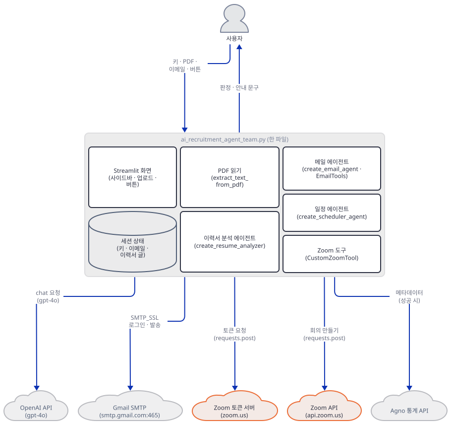

### Step 7. 한 줄만 고쳐서 Zoom까지 이어 보기, 그리고 앱 띄우기

**목적.** 일정 에이전트가 도구를 받지 못하는 원인이 도구의 모양임을 한 줄 고쳐서 확인하고, 독자가 실제로 앱을 띄우는 명령을 확인합니다. 원본 파일은 고치지 않고 작업 폴더의 복사본만 바꿉니다.

**할 일.** 호출할 수 있는 객체는 agno가 받으므로 `tools=[zoom_tools]`를 `tools=[zoom_tools.schedule_meeting]`으로 바꾼 복사본을 만듭니다(163행). 그 복사본으로 같은 시나리오를 돌립니다.

```bash
sed 's/tools=\[zoom_tools\],/tools=[zoom_tools.schedule_meeting],/' ai_recruitment_agent_team.py > fixed_app.py
sed 's/ai_recruitment_agent_team.py/fixed_app.py/' wrapper.py > wrapper_fixed.py
sed 's/wrapper.py/wrapper_fixed.py/' drive.py > drive_fixed.py
MODEL_LOG=model.jsonl FAKE_RESUME=resumes/strong.pdf CAND=candidate.a@example.test ACTIONS=analyze,proceed uv run --no-project python drive_fixed.py
```

(sed와 이 한 줄은 bash만 적습니다. PowerShell에서는 같은 치환을 편집기로 해도 됩니다.)

**확인.** 직접 확인한 출력의 끝부분입니다.

```text
POST : [{"url": "https://zoom.us/oauth/token", "basic_auth": true, "data": {"grant_type": "account_credentials", "account_id": "acct-fake"}, "json_keys": [], "bearer": false}, {"url": "https …
막은 것: [] []
모델 요청(도구 | 역할 | 마지막 메시지 글자 수):
   [] ['developer', 'user'] 1546
   ['email_user'] ['developer', 'user'] 367
   ['email_user'] ['developer', 'user', 'assistant', 'tool'] 23
   ['schedule_meeting'] ['developer', 'user'] 508
   ['schedule_meeting'] ['developer', 'user', 'assistant', 'tool'] 221
   ['email_user'] ['developer', 'user'] 10152
   ['email_user'] ['developer', 'user', 'assistant', 'tool'] 23
```

일정 에이전트 요청에 도구 `schedule_meeting`이 실렸고(네 번째), 모델이 부르자 토큰 요청과 회의 요청이 각각 한 번씩 갔고(`POST` 두 건), 확인 메일 요청이 6,560자 안팎에서 10,150자 안팎으로 커졌습니다. 도구 결과(Zoom 응답)가 `RunOutput` repr 안에 들어갔기 때문입니다. 요청의 순서는 아래 그림입니다. 바뀐 것은 이 한 줄이고, 도구 결과의 `join_url`이 확인 메일 본문에 실리는지는 모델이 어떻게 쓰느냐에 달려 있어서 확인하지 못했습니다.


마지막으로 독자가 앱을 띄우는 명령입니다. **이 명령은 하네스 없이 원본 앱을 띄웁니다. 따라서 Step 4의 터미널에서 그대로 쓰면 안 됩니다.** 가짜 서버가 아직 떠 있고 그 터미널에 `OPENAI_BASE_URL`이 남아 있으면, 화면에서 버튼을 누르는 순간 가짜 서버의 대본이 `email_user`를 부르게 하고, 그러면 `EmailTools`가 진짜 `smtp.gmail.com:465`에 접속해 사이드바의 발신 계정으로 로그인합니다. 사이드바에 진짜 Gmail 계정과 앱 비밀번호를 넣었다면 "대본 메일"이 적은 지원자 주소로 진짜 메일이 나갑니다. 가짜 값을 넣어도 Gmail로 접속·로그인 시도가 나갑니다. 이 문서는 그 위험을 이렇게 확인했습니다. 하네스 대신 업로더만 바꾼 스크립트로 원본 앱을 돌리고 `127.0.0.1` 밖으로 나가는 이름 조회와 접속을 호출 전에 막으며 기록했습니다. 가짜 서버를 켜고 `OPENAI_BASE_URL`을 건 경우에는 `smtp.gmail.com` 이름 조회가 시도되어 막혔고(직접 확인), 가짜 서버를 끄고 `OPENAI_BASE_URL` 없이 돌린 경우에는 차단 훅이 기록한 `smtp.gmail.com` 이름 조회가 0건이었습니다(직접 확인. 이 재현은 프록시로 바깥 접속을 막은 환경이라, 독자 환경에서 가짜 키 요청이 OpenAI까지 가서 어떻게 거절되는지는 확인하지 못했습니다).

그래서 순서는 이렇습니다.

1. Step 4의 가짜 서버를 `Ctrl+C`로 멈춥니다.
2. **새 터미널**을 열고 `recruit-lab`으로 가서 가짜 서버용 변수가 없는지 확인합니다. 있으면 지웁니다.
3. 사이드바의 **일곱 칸 모두**(OpenAI 키 포함)에 **진짜가 아닌 값**을 넣습니다. 일곱 칸 문을 열려면 아무 값이나 있으면 됩니다. OpenAI 키 칸에 진짜 키를 넣으면 진짜 모델이 메일 도구를 부를 수 있어서, Gmail 칸이 가짜여도 Gmail 로그인 시도가 나갑니다(로그인에 실패하면 발송은 안 되지만, 코드 경로를 읽어 안 것이고 진짜 키가 없어 실행해 보지는 않았습니다). 이 새 터미널에는 `AGNO_TELEMETRY=false`도 걸려 있지 않아서, 진짜 키로 `run`이 성공하면 agno 사용 통계도 나갑니다.

```bash
env | grep OPENAI_BASE_URL
unset OPENAI_BASE_URL
uv run --no-project streamlit run ai_recruitment_agent_team.py --server.address localhost --browser.gatherUsageStats false
```

```powershell
Get-ChildItem Env:OPENAI_BASE_URL
Remove-Item Env:OPENAI_BASE_URL
uv run --no-project streamlit run ai_recruitment_agent_team.py --server.address localhost --browser.gatherUsageStats false
```

(PowerShell 줄은 실행해 보지 못했습니다. `env | grep`은 변수가 없으면 아무것도 내지 않고, `Get-ChildItem Env:OPENAI_BASE_URL`은 없으면 오류를 냅니다. 둘 다 정상입니다.) 이 절차에서 화면의 버튼을 누르면 대본을 읽는 가짜 서버가 없으므로 메일 도구를 부르라는 답이 올 길이 없습니다. 다만 가짜 키라도 모델 요청은 진짜 OpenAI로 나갑니다(그 응답은 확인하지 못했습니다). **진짜 키를 넣어 쓸 때는 진짜 메일이 지원자 칸에 적은 주소로 나가고 진짜 Zoom 회의 요청이 시도됩니다.** 따라서 본인 소유 주소만 지원자 칸에 쓰세요. headless로 임의 포트에 띄워 `curl`로 확인했을 때 화면 주소가 200, `/_stcore/health`가 `ok`였고, 같은 명령에 `--server.headless true --server.port <포트>`를 더했습니다. 서버와 확인 스크립트가 만든 파일은 모두 `recruit-lab` 안에 있으므로 서버를 `Ctrl+C`로 멈추고 폴더를 지우면 됩니다.

## 요청 한 건이 흐르는 과정

이 앱은 한 그림에 다 넣으면 이웃하지 않은 배우 사이 메시지의 라벨이 다른 배우의 수명선 위에 놓이거나 높이가 한계를 넘어서, 앱의 실제 시간 경계에서 여러 그림으로 나눴습니다. 모든 메시지는 한 그림에만 있고 코드의 순서 그대로입니다. 사용자에게 보이는 화면 문구(성공·경고·진행 표시)도 하나씩 메시지로 그렸고, `Analyze Resume`을 누르는 순간의 기준은 코드의 버튼 핸들러입니다. 첫 그림은 키와 PDF를 넣는 앞부분입니다. 업로드하면 `pdf_viewer`가 쓸 임시 `.pdf` 파일이 `%TEMP%`에 만들어졌다가 바로 지워지고(385~392행), `Processing your resume...` 진행 표시 아래에서 PDF 글이 읽혀 `Resume processed successfully!`가 뜹니다(397~404행). 지원자 이메일은 그 아래 칸이라 마지막에 들어갑니다(407~412행). 이 모두가 버튼을 누르기 전에 끝납니다.

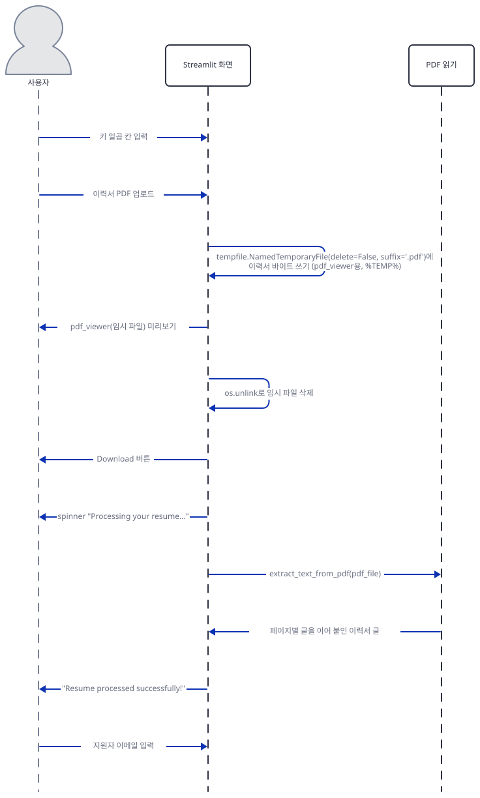

`Analyze Resume`을 누르면 진행 표시가 뜨고, 분석 에이전트가 `gpt-4o`에 한 번 묻고, 성공하면 통계 메타데이터가 나갑니다.

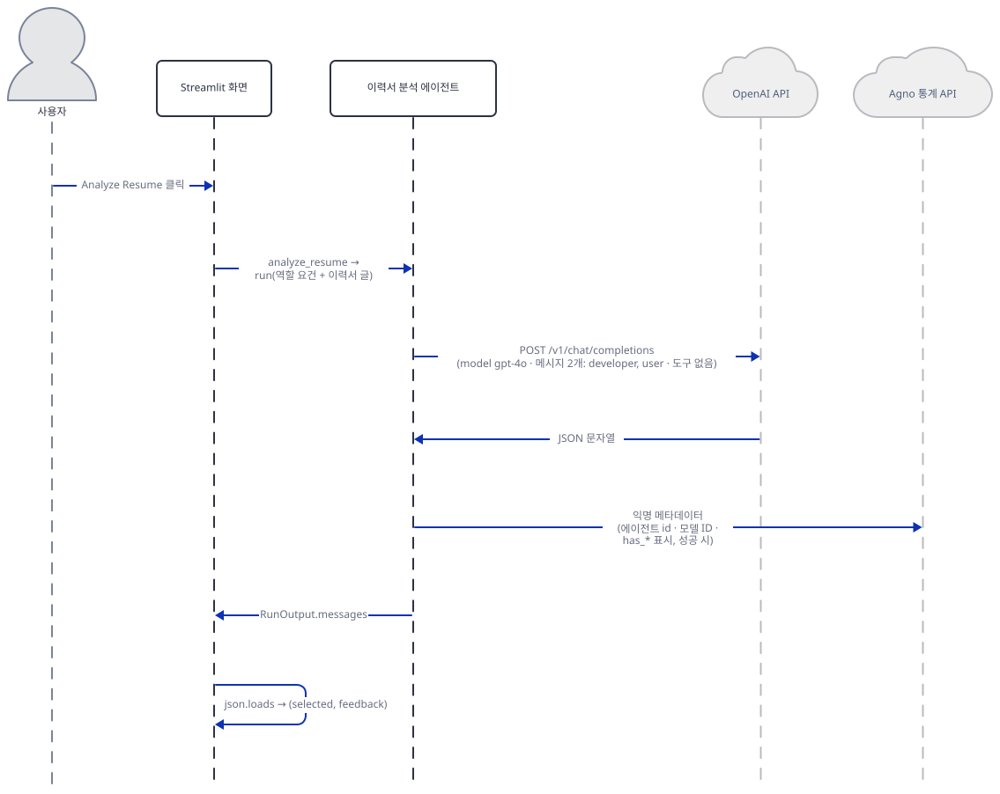

`json.loads`가 끝나면 판정이 화면에 나옵니다. 합격이면 성공 문구와, 다시 그려진 화면의 `Proceed` 안내를 따로 보여 줍니다. 탈락이면 경고와 피드백을 각각 먼저 보여 주고 메일을 보내는 진행 표시를 띄웁니다.

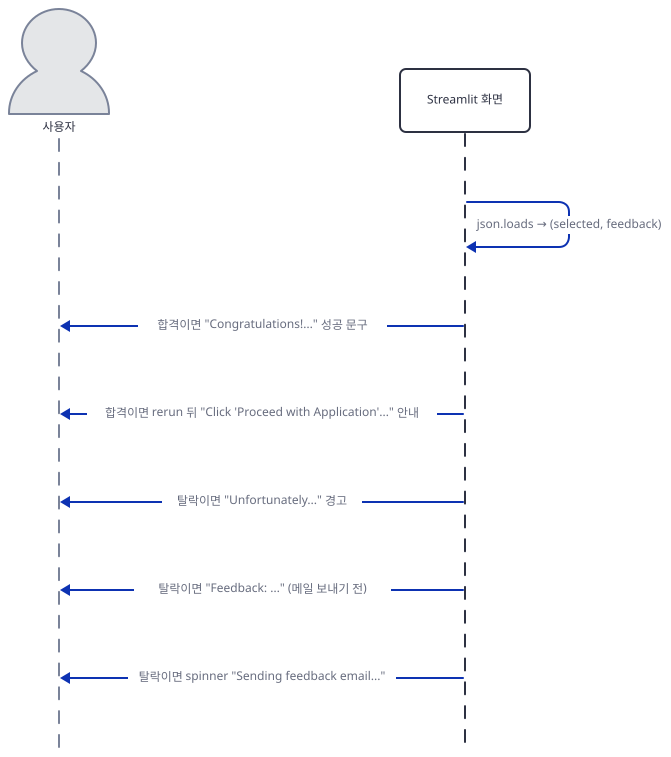

탈락이면 메일 에이전트가 두 번 묻습니다. 모델이 `email_user`를 부르면 SMTP로 로그인해 보내고, 그 결과 문자열이 두 번째 요청에 실려 마무리 문장이 옵니다. 반환값은 쓰이지 않고 화면은 안내 문구를 씁니다.


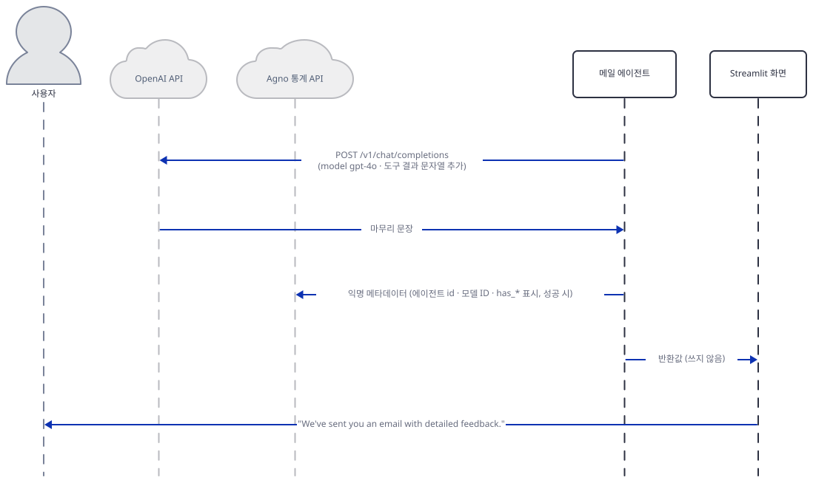

합격이면 `Proceed with Application`을 누르고, 진행 표시와 `Sending confirmation email...` 상태 표시 아래에서 선발 메일이 같은 두 갈래로 나갑니다. 메일 결과와 상관없이 `Confirmation email sent!` 표시가 뜨고, 이어서 일정 진행 표시(`Scheduling interview...`)가 뜹니다.

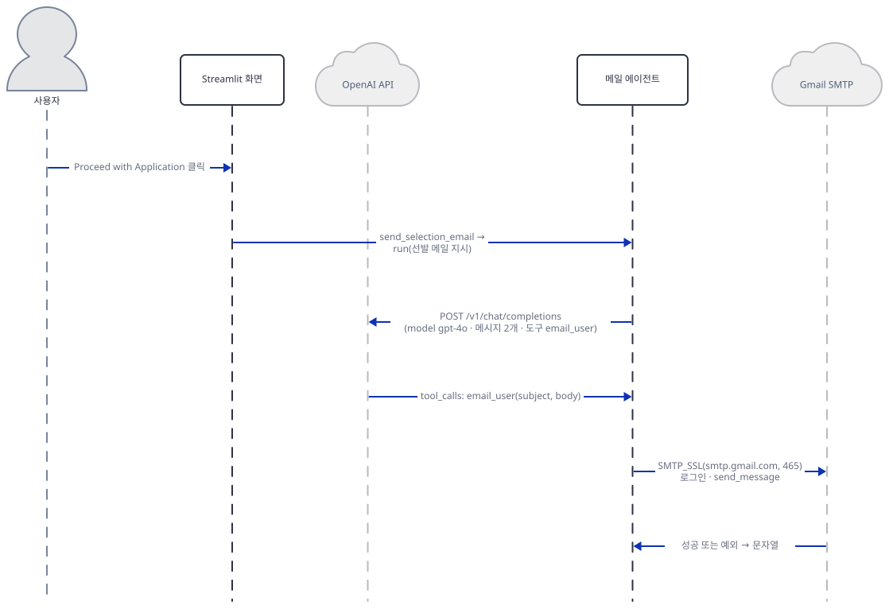

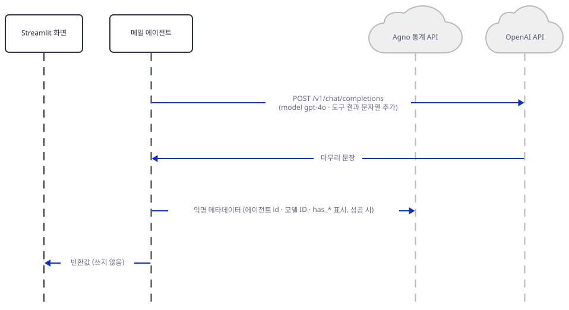

일정은 날짜를 계산해 일정 에이전트에게 한 번 묻는 것으로 끝납니다. 도구가 없으므로 모델은 일반 문장으로 답하고 Zoom은 나오지 않습니다.

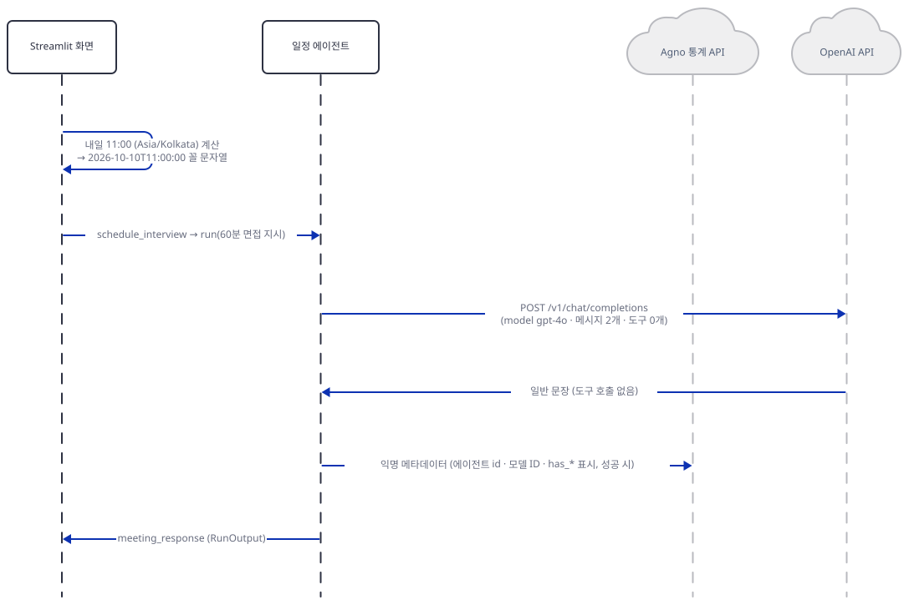

확인 메일은 `meeting_response` 전체 repr을 지시문에 담아 같은 방식으로 나가고, 화면은 `Interview scheduled successfully!`, `Interview scheduled!` 표시, 마지막 성공 문구를 차례로 씁니다.

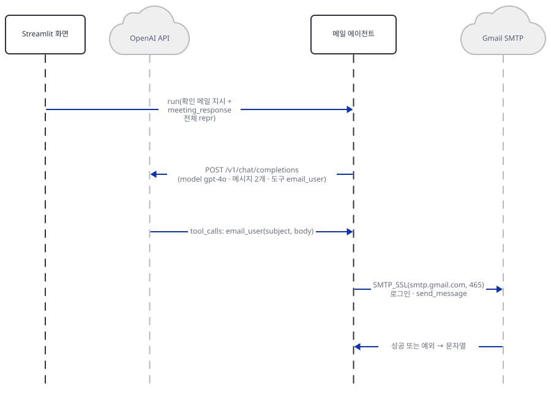

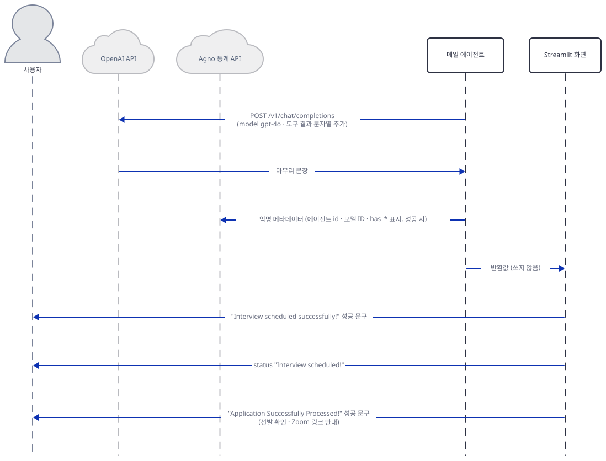

Zoom 두 서버(`zoom.us`, `api.zoom.us`)는 위 그림 어디에도 없습니다. 이 앱의 실제 경로에서는 한 번도 불리지 않기 때문입니다. 도구를 모델에게 보이게 고친 복사본에서만 Step 7의 순서(모델이 `schedule_meeting`을 부름, 도구가 토큰과 회의를 요청함)가 일어났습니다. 이 전체 왕복은 진짜 키로는 확인하지 못했습니다.

## 실행 체크리스트

- [ ] `uv venv`와 `uv pip install -r requirements.txt` 뒤 `import_check.py`가 13·15·16행에서 막히는 것을 확인했다
- [ ] `uv pip install openai`, `uv pip install phidata` 뒤 `import_check.py`가 `끝`만 출력한다
- [ ] `gate_check.py`로 여섯 칸까지는 경고가 남고 일곱 칸이 차야 화면이 열리는 것을 확인했다
- [ ] `tool_check.py`로 `CustomZoomTool`이 agno의 `Toolkit`이 아닌 것을 확인했다
- [ ] 가짜 서버를 임의의 포트에 띄우고 `ACTIONS=analyze`로 분석 요청이 도구 없이 한 번 가는 것을 확인했다
- [ ] `fenced`·`strfalse` 이력서로 JSON 판정이 허술한 두 경우를 확인했다
- [ ] `weak.pdf`로 탈락 경로를, `FAKE_SMTP=authfail`과 `KEY=sk-bad-key`로 실패해도 "sent"가 뜨는 것을 확인했다
- [ ] `ACTIONS=analyze,proceed`로 일정 에이전트의 도구 목록이 `[]`이고 `POST`가 비어 있는 것을 확인했다
- [ ] `zoom_check.py`로 토큰 한 번·회의 두 번과 `tokenfail`을 확인했다
- [ ] 앱을 띄우기 전에 가짜 서버를 멈추고 새 터미널에서 `OPENAI_BASE_URL`이 없는 것을 확인했다
- [ ] 한 줄 고친 복사본에서 `schedule_meeting`이 실리고 `POST`가 두 건 생기는 것을 확인했다
- [ ] 서버를 `Ctrl+C`로 멈추고 `recruit-lab`을 지웠다

## 문제 해결

| 증상 | 원인 | 해결 |
|---|---|---|
| `` ImportError: `openai` not installed. Please install using `pip install openai` `` (직접 확인) | agno의 `OpenAIChat`이 `openai` 패키지를 요구하는데 `requirements.txt`에 없다 | `uv pip install openai` |
| `ModuleNotFoundError: No module named 'phi'` (15·16행, 직접 확인) | 앱이 옛 `phidata`의 `phi`를 가져오는데 requirements에 없다 | `uv pip install phidata` (오늘 2.7.10) |
| 일곱 칸을 채우기 전까지 화면이 안 열리고 `Please configure the following in the sidebar: …` (직접 확인) | 347~355행이 일곱 칸 모두를 요구한다. 탈락 경로도 마찬가지다 | 가짜 값이라도 채운다 |
| 합격이라 `Interview scheduled successfully!`가 떴는데 Zoom 회의가 없음 (`POST : []`로 직접 확인) | 일정 에이전트가 쥔 `CustomZoomTool`이 agno의 `Toolkit`이 아니라 모델에게 도구가 가지 않는다 | `tools=[zoom_tools.schedule_meeting]`처럼 호출할 수 있는 객체로 넘긴다(Step 7, 복사본에서만 확인) |
| 메일이 안 갔는데 `We've sent you an email…` (`authfail`로 직접 확인) | agno의 `run`은 도구 오류를 모델에게 문자열로 돌려줄 뿐 예외를 던지지 않아 앱의 `except`가 타지 않는다 | 터미널 로그의 `SMTPAuthenticationError`와 발신 계정·앱 비밀번호를 확인한다 |
| 합격감인데 탈락 화면과 `Error processing response: No assistant message found in response.` (`KEY=sk-bad-key`로 직접 확인) | OpenAI 오류(키 오류 등)가 응답에 메시지가 없는 것으로 나타나고 앱은 이를 탈락으로 읽는다 | OpenAI 키를 확인한다 |
| `Error processing response: Expecting value: line 1 column 1 (char 0)`와 탈락 메일 (직접 확인) | 모델 답이 `json` 코드 울타리(백틱 세 개)로 감싸이면 `json.loads`가 실패한다 | 앱을 고치지 않고는 막을 수 없다. 오류 문장이 지원자에게 가는 메일의 feedback이 된다 |
| 확인 메일 지시문이 6,000자를 넘음 (직접 확인) | `meeting_response`(`RunOutput`)를 f-string에 그대로 넣어 repr 전체가 들어간다 | `meeting_response.content`만 넣도록 바꾸는 변경을 시험한다(더 해보기) |
| 터미널에 `api_key='sk-…'`가 찍힘 (직접 확인) | 463·467행의 `print`가 에이전트 객체를 통째로 찍는다 | 로그를 공유하기 전에 지운다 |
| 서버가 `PermissionError: [WinError 10013]`으로 안 뜸 (직접 확인) | Windows가 예약한 포트 제외 범위 안의 포트다. 비어 있어도 bind가 거부된다 | `netsh interface ipv4 show excludedportrange protocol=tcp`로 범위를 보고 밖의 포트를 고른다 |
| 앱을 띄워 버튼을 눌렀더니 Gmail 접속 시도가 나감 (직접 확인) | 하네스 없이 띄운 원본 앱에서 가짜 서버와 `OPENAI_BASE_URL`이 남아 대본이 `email_user`를 부른다 | 가짜 서버를 멈추고 변수를 지운 새 터미널에서 띄운다(Step 7) |
| 일정 지시문의 시간대가 서로 다름 (소스로 확인) | 일정 에이전트의 지시문은 "9 AM - 5 PM EST"(167행), 호출 지시문은 IST(273·288행)다 | 한 쪽을 맞추는 변경을 시험한다 |

## 더 해보기

- 확인 메일 지시문(`advanced_ai_agents/multi_agent_apps/agent_teams/ai_recruitment_agent_team/ai_recruitment_agent_team.py:301`)의 `{meeting_response}`를 `{meeting_response.content}`로 바꾼 복사본으로 `ACTIONS=analyze,proceed`를 돌려, 마지막 모델 요청의 글자 수가 어떻게 달라지는지 보세요.
- 판정 읽는 부분(`advanced_ai_agents/multi_agent_apps/agent_teams/ai_recruitment_agent_team/ai_recruitment_agent_team.py:224-228`)에 코드 울타리(백틱 세 개)를 걷어 내는 줄과 `selected`가 `bool`인지 보는 검사를 더하고, `fenced.pdf`와 `strfalse.pdf`의 결과가 어떻게 바뀌는지 보세요.
- 탈락·합격 판정 뒤 메일을 보내기 전에 사람이 확인하는 버튼을 하나 더하는 변경을 설계해 보세요. 어느 줄(`advanced_ai_agents/multi_agent_apps/agent_teams/ai_recruitment_agent_team/ai_recruitment_agent_team.py:439-451`)에 끼워야 `send_rejection_email`이 불리기 전에 멈출까요?

## 다음 날 예고

[Day 121 · 👨‍⚖️ AI Legal Agent Team (Cloud & Local)](../day121-ai-legal-agent-team/README.md) — 올린 법률 문서를 Qdrant 벡터 저장소에 넣고 법률 조사·계약 분석·전략을 맡은 에이전트들이 답하는 앱입니다(소스로 확인). 클라우드판과 로컬판이 따로 있습니다. 오늘 앱은 메일과 회의를 만들려 했지만, 내일 앱은 문서를 저장소에 넣고 묻는 쪽입니다.
