# Day 121 · 👨‍⚖️ AI Legal Agent Team (Cloud & Local)

> 볼륨 8 🤝 Multi-agent Teams · 난이도 ★★★ ⚠ 앱이 쓰는 `gpt-5`는 별칭이 가리키는 스냅숏 `gpt-5-2025-08-07`이 2026-12-11에 종료됩니다(OpenAI 폐기 문서, 2026-10-09 확인) · 예상 소요 130분(앱은 클라우드판 394줄(마지막 줄에 개행이 없어 `wc -l`은 393)·로컬판 270줄이지만 설치 직후 문서를 올리는 곳에서 막히고, 가짜 서버와 대역 파일을 직접 저장해 터미널 둘로 돌려 봐야 하고, 로컬판은 다섯 곳을 고치며 따라가야 해서 읽는 시간보다 손으로 돌려 보는 시간이 더 걸립니다) · API 비용 대략 분석 1회에 $0.1~0.3(대본 기준으로 `gpt-5` 호출이 "Contract Review"는 7번, "Compliance Check"는 14번이었고, 모델 페이지의 입력 $1.25·출력 $10(1M 토큰당, https://developers.openai.com/api/docs/models/gpt-5, 2026-10-09 확인)에 입력 호출당 약 4,000토큰, 출력은 추론 토큰을 포함해 호출당 약 1,000토큰을 가정한 어림입니다. 키가 없어 실제 토큰 수는 재지 못했고 추론 토큰이 얼마나 나올지는 확인하지 못했습니다. 임베딩 `text-embedding-3-small`은 $0.02, 같은 곳 확인. 로컬판은 무료) · 원본 앱: `advanced_ai_agents/multi_agent_apps/agent_teams/ai_legal_agent_team`

## 오늘 만들 것

계약서 같은 PDF 한 편을 올리고 분석 유형을 고르면, 에이전트 셋(Legal Researcher, Contract Analyst, Legal Strategist)과 이들을 이끄는 팀 리더가 문서를 읽고 "분석", "핵심 요약", "권고" 탭 셋을 채워 주는 Streamlit 앱입니다. 앞 날들에서 agno `Team`은 Day 079(영화 제작)가 처음 다뤘고, 이 볼륨의 첫날 Day 112가 멤버 둘짜리 `Team`을 AgentOS로 올렸습니다(각 날 README로 확인). 오늘은 거기에 **문서 지식 베이스**가 붙습니다. 팀 리더와 멤버 모두 `search_knowledge_base` 도구로 Qdrant에 저장된 PDF 조각을 찾아 근거로 씁니다. Qdrant를 서버로 쓰거나 `:memory:`로 대신하는 방법과 `add_content`가 사라진 일은 Day 047(Step 2·3)이 먼저 다뤘으므로 여기서는 가리키기만 합니다.

원본 폴더에는 판이 둘입니다. 클라우드판 `legal_agent_team.py`(OpenAI `gpt-5`, 임베딩 `text-embedding-3-small`, Qdrant 클라우드, DuckDuckGo)와 로컬판 `local_ai_legal_agent_team/local_legal_agent.py`(Ollama `llama3.1:8b`, 임베딩 `openhermes`, 내 PC의 Qdrant)입니다. 오늘은 **클라우드판을 중심**으로 합니다. 앱 README(`README.md`)와 `requirements.txt`가 실행 대상으로 가리키는 파일이 이쪽이고, 로컬판 폴더의 `README.md`는 0바이트 빈 파일이며, 두 판의 구조가 거의 같아서 클라우드판을 따라가면 로컬판은 달라지는 곳만 보면 되기 때문입니다(Step 8).

직접 돌려 보고 알게 된 것이 여섯입니다. 첫째, `requirements.txt`를 그대로 설치하면 import가 막힙니다(`ddgs` 빠짐, Step 1). 둘째, 그것을 풀어도 오늘 설치되는 agno 3.1.2에는 `add_content`가 없어 문서를 올리는 순간 빨간 오류 셋이 뜨고, 올린 PDF의 사본이 임시 폴더에 남습니다(Step 3). 셋째, 화면의 "Successfully connected to Qdrant!"는 연결 확인이 아니라 객체를 만들었다는 뜻입니다(Step 2). 넷째, "분석 유형"은 팀의 멤버를 정하지 않습니다. 질문 글에 이름이 들어갈 뿐이고, 버튼 한 번에 팀이 세 번 실행됩니다(Step 5·6). 다섯째, 저장소에는 문서가 쌓이기만 합니다. 같은 파일을 새 세션에서 다시 올리면 중복되고, 저장된 문서 이름은 임시 파일 이름이며, 검색은 올린 문서 전부를 가로지릅니다(Step 7). 여섯째, 로컬판은 설치 직후 다섯 곳이 연달아 막히고, 그 가운데 하나는 화면이 "처리했다"고 말하는데 저장소는 비어 있습니다(Step 8). 앱 코드와 앱 README 어디에도 법률 조언이 아니라는 고지는 없습니다(grep으로 확인). 앱 README는 "Uses GPT-4o"라고 쓰지만 코드는 `gpt-5`입니다.

이 문서는 OpenAI·Qdrant 클라우드·DuckDuckGo·Agno 통계 서버, 그리고 내 PC의 실제 Ollama와 Qdrant 어디에도 요청을 보내지 않고, 모델은 내 PC의 가짜 서버로, 벡터 저장소는 프로세스 안의 `:memory:`로 대신해 확인했습니다. 가짜 서버의 답은 대본이라 어떤 법률 판단의 근거도 아니고, 진짜 `gpt-5`나 Ollama 모델이 위임을 이렇게 하는지는 확인하지 못했습니다. 문서는 직접 만든 가짜 계약서(가상의 회사)만 썼습니다. 실제 앱에서는 올린 PDF의 모든 쪽 텍스트가 OpenAI 임베딩 서버와 Qdrant 클라우드로 가고, 질문과 검색된 조각이 `gpt-5`로 갑니다(소스로 확인). 기밀 문서를 올리기 전에 그 점을 먼저 따져 보세요. 아래는 완성된 아키텍처입니다.

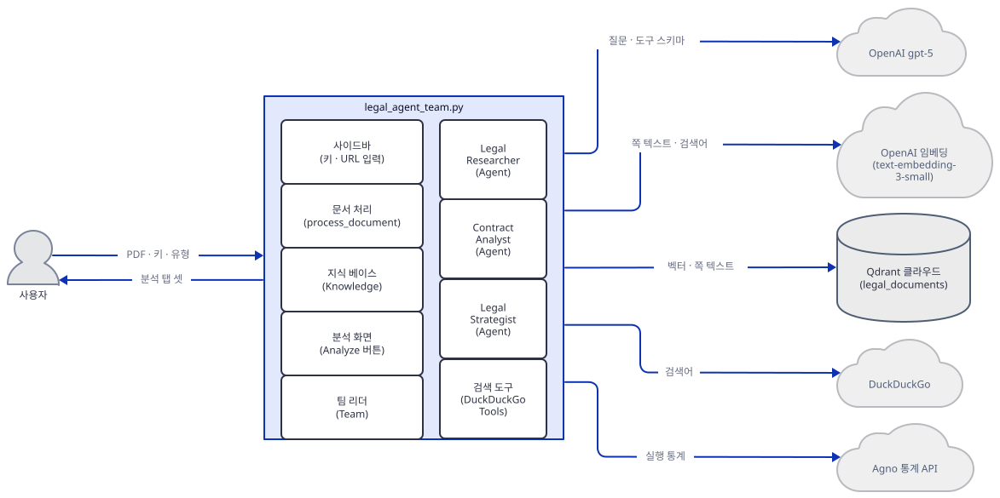

## 사전 준비

| 서비스/도구 | 용도 | 발급·설치 |
|---|---|---|
| uv | 가상환경 생성과 패키지 설치 | [공통 사전 준비](../README.md#공통-사전-준비-한-번만) 참고 |
| Python | 이 문서는 3.13.3으로 확인했다 | 공통 사전 준비와 같음 |
| OpenAI API 키 | 에이전트 넷의 `gpt-5` 호출과 `text-embedding-3-small` 임베딩. 앱은 화면의 입력란에서 키를 받아 `os.environ['OPENAI_API_KEY']`에 쓴다. 이 문서는 가짜 값 `sk-fake`와 가짜 서버로 확인한다 | https://platform.openai.com/api-keys |
| Qdrant 클라우드 | 클라우드판의 벡터 저장소. 화면에서 URL과 API 키를 모두 받는다(키가 비어 있으면 연결 객체를 만들지 않는다). 무료 등급은 1GB 메모리 노드 하나이고 카드가 필요 없다고 공식 문서에 적혀 있다(https://qdrant.tech/documentation/cloud/create-cluster/, 2026-10-09 확인). 이 문서는 쓰지 않는다 | https://cloud.qdrant.io |
| Ollama와 Qdrant 서버 | 로컬판 전용(Step 8). `llama3.1:8b`는 4.9GB, `openhermes`는 4.1GB(Ollama 라이브러리 페이지, 2026-10-09 확인). Qdrant는 `http://localhost:6333` 고정. 이 문서는 어느 쪽도 받거나 띄우지 않는다 | https://ollama.com, Docker의 `qdrant/qdrant`(Day 047 참고) |

이 문서의 확인 스크립트는 한글과 이모지를 출력합니다. 한국어 Windows에서 출력을 파이프나 파일로 받으면 Python의 기본 인코딩(`cp949`)이 모자라, bash의 `| grep "^>>"`는 `Binary file (standard input) matches` 한 줄만 내고 Step 6의 `drive.py`는 `🤖`에서 `UnicodeEncodeError`로 죽습니다(직접 확인). 셸을 먼저 이렇게 맞춰 두세요. 이 문서의 명령은 모두 이 설정을 건 상태에서 돌려 출력을 얻었습니다. PowerShell 줄은 실행해 보지 못했습니다.

```bash
export PYTHONIOENCODING=utf-8
```

```powershell
$env:PYTHONIOENCODING = "utf-8"
[Console]::OutputEncoding = [System.Text.Encoding]::UTF8
```

모델 `gpt-5`는 OpenAI 모델 페이지(https://developers.openai.com/api/docs/models/gpt-5, 2026-10-10 확인)의 Snapshots 목록에서 별칭 `gpt-5`가 스냅숏 `gpt-5-2025-08-07`을 가리키고, 그 스냅숏에 Deprecated 표시가 붙어 있습니다. 폐기 문서(https://developers.openai.com/api/docs/deprecations, 2026-10-09 확인)도 `gpt-5-2025-08-07`을 2026-12-11 종료로 올렸습니다. 별칭 이름 `gpt-5`는 폐기 표에 없고 `gpt-4-0314`·`gpt-4-1106-preview`·`gpt-4-0125-preview` 세 행의 대체 모델 칸에만 나옵니다. 그래서 머리말에 ⚠를 달았습니다. 종료된 뒤에도 쓰려면 코드의 네 곳(171·188·202·216행의 `OpenAIChat(id="gpt-5")`)을 다른 모델로 바꿔야 합니다. `text-embedding-3-small`은 폐기 표에 없고 첫 세대 임베딩 모델들의 대체 모델 칸에만 나옵니다(같은 원문).

## 아키텍처 한눈에 보기

| 컴포넌트 | 역할 | 코드 위치 |
|---|---|---|
| 사이드바 | OpenAI 키·Qdrant 키·Qdrant URL을 받고, 셋이 갖춰지면 문서 업로드 위젯을 연다 | `advanced_ai_agents/multi_agent_apps/agent_teams/ai_legal_agent_team/legal_agent_team.py:109-152` |
| 저장소 연결 (`init_qdrant`) | agno `Qdrant` 객체와 `OpenAIEmbedder`를 만든다. 만들 때는 서버에 접속하지 않는다 | `advanced_ai_agents/multi_agent_apps/agent_teams/ai_legal_agent_team/legal_agent_team.py:33-51` |
| 문서 처리 (`process_document`) | 업로드를 임시 `.pdf`로 쓰고 `Knowledge`에 넣은 뒤 임시 파일을 지운다 | `advanced_ai_agents/multi_agent_apps/agent_teams/ai_legal_agent_team/legal_agent_team.py:53-101` |
| 지식 베이스 (`Knowledge`) | PDF를 쪽 단위 조각으로 나누고 임베딩해 Qdrant에 넣고, 에이전트에게 `search_knowledge_base` 도구를 준다 | `advanced_ai_agents/multi_agent_apps/agent_teams/ai_legal_agent_team/legal_agent_team.py:78-85` |
| Legal Researcher (`Agent`) | 검색 담당 멤버. DuckDuckGo 도구와 지식 검색을 가진다 | `advanced_ai_agents/multi_agent_apps/agent_teams/ai_legal_agent_team/legal_agent_team.py:168-183` |
| Contract Analyst (`Agent`) | 계약 검토 담당 멤버. 지식 검색만 가진다 | `advanced_ai_agents/multi_agent_apps/agent_teams/ai_legal_agent_team/legal_agent_team.py:185-197` |
| Legal Strategist (`Agent`) | 전략 담당 멤버. 지식 검색만 가진다 | `advanced_ai_agents/multi_agent_apps/agent_teams/ai_legal_agent_team/legal_agent_team.py:199-211` |
| 팀 리더 (`Team`) | 멤버 명단을 보고 위임 도구로 일을 나눠 맡기고 답을 종합한다. 자기 지식 검색도 가진다 | `advanced_ai_agents/multi_agent_apps/agent_teams/ai_legal_agent_team/legal_agent_team.py:214-229` |
| 분석 화면 | 분석 유형 다섯의 질문·멤버 이름표(`analysis_configs`)와 Analyze 버튼, 결과 탭 셋 | `advanced_ai_agents/multi_agent_apps/agent_teams/ai_legal_agent_team/legal_agent_team.py:254-389` |

외부 호출은 모델(`gpt-5`, 팀 리더와 멤버 셋이 각자), OpenAI 임베딩(문서 쪽마다, 검색어마다), Qdrant 클라우드, DuckDuckGo(Legal Researcher만), 그리고 Agno 사용 통계 API입니다. 먼저 팀과 멤버, 지식 베이스가 어떻게 이어지는지입니다.

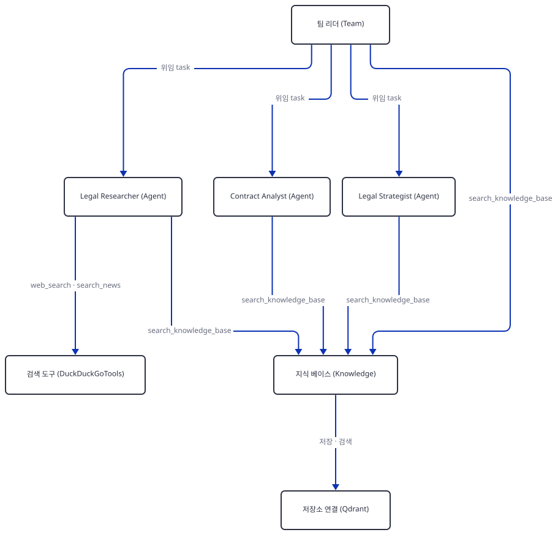

화면과 사이드바, 문서 처리가 이 구조에 어떻게 이어지는지입니다. 분석 화면은 Analyze 한 번에 팀을 세 번 `run`하고(Step 5), 문서 처리는 `Knowledge.insert`를 부르고(Step 3), 사이드바는 `init_qdrant`로 저장소 연결을 만듭니다(Step 2).

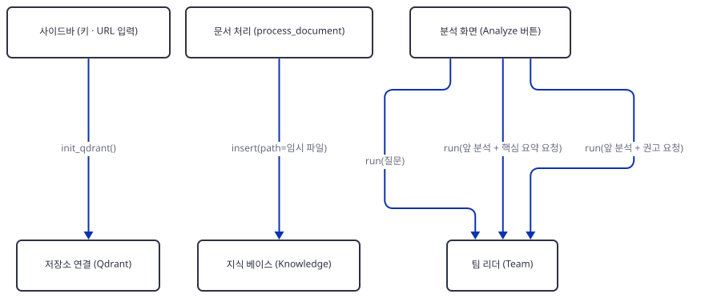

멤버와 도구, 저장소가 바깥으로 나가는 호출은 이렇습니다.

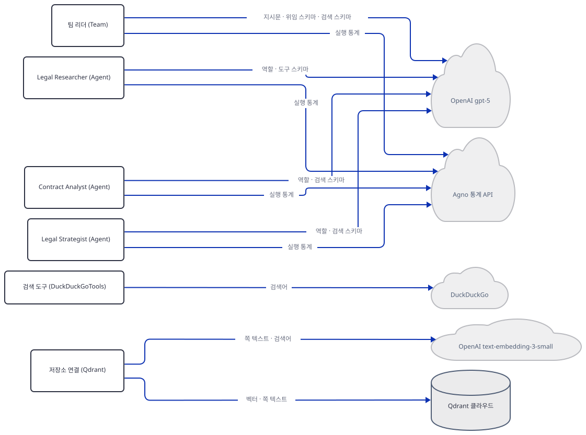

## 단계별 진행

### Step 1. 환경 만들기 — 설치만으로는 import가 막힙니다

**목적.** 원본 폴더를 건드리지 않도록 작업 폴더에 복사본과 가상환경을 만들고, `requirements.txt`가 무엇을 빠뜨렸는지 봅니다.

**할 일.** `<저장소>`는 이 저장소를 받은 경로입니다.

```bash
mkdir legal-team-work
cd legal-team-work
cp <저장소>/advanced_ai_agents/multi_agent_apps/agent_teams/ai_legal_agent_team/legal_agent_team.py .
cp <저장소>/advanced_ai_agents/multi_agent_apps/agent_teams/ai_legal_agent_team/requirements.txt .
uv venv
uv pip install -r requirements.txt
```

(pip 대안: `python -m venv .venv`로 만들고 활성화한 뒤 `pip install -r requirements.txt`.) 아래 PowerShell 줄은 실행해 보지 못했습니다.

```powershell
mkdir legal-team-work
cd legal-team-work
Copy-Item <저장소>\advanced_ai_agents\multi_agent_apps\agent_teams\ai_legal_agent_team\legal_agent_team.py .
Copy-Item <저장소>\advanced_ai_agents\multi_agent_apps\agent_teams\ai_legal_agent_team\requirements.txt .
uv venv
uv pip install -r requirements.txt
```

이 저장소는 루트에 `pyproject.toml`이 있어 저장소 안에서 `uv run`은 루트 환경을 쓰려 하므로, 이후 `uv run`에는 모두 `--no-project`를 붙입니다.

`advanced_ai_agents/multi_agent_apps/agent_teams/ai_legal_agent_team/requirements.txt:1-6`

```text
agno>=2.2.10
streamlit
qdrant-client
openai
pypdf
duckduckgo-search
```

2026-10-09에 77개가 설치됐고 agno 3.1.2, openai 3.26.1, qdrant-client 1.19.1, streamlit 1.65.0, pypdf 6.20.0, duckduckgo-search 8.1.1이 포함됩니다(직접 확인). `agno>=2.2.10`처럼 하한만 있거나 버전이 아예 없어 그날의 최신판이 풀립니다.

**확인.**

```bash
uv run --no-project python -m py_compile legal_agent_team.py && echo compiled
uv run --no-project python -c "import agno.tools.duckduckgo"
```

(PowerShell 5.1에는 `&&`가 없으므로 첫 줄은 `uv run --no-project python -m py_compile legal_agent_team.py; if ($?) { echo compiled }`로 씁니다. 실행해 보지 못했습니다.) 직접 확인한 출력(각 명령의 마지막 줄)입니다.

```text
compiled
ImportError: `ddgs` not installed. Please install using `pip install ddgs`
```

`py_compile`은 문법만 보므로 통과합니다. 앱은 `from agno.tools.duckduckgo import DuckDuckGoTools`로 시작하는데, agno의 검색 도구는 `ddgs` 패키지를 import합니다(agno 3.1.2의 `agno/tools/websearch.py`를 소스로 확인). `requirements.txt`의 `duckduckgo-search`는 설치돼도 쓰이지 않습니다. 같은 증상을 Day 112가 겪었습니다.

```bash
uv pip install ddgs
uv run --no-project python -c "import agno.tools.duckduckgo; print('ddgs ok')"
```

`ddgs 9.16.0`이 설치되고 `ddgs ok`가 찍힙니다(직접 확인). 이제 앱 파일 자체는 import됩니다.

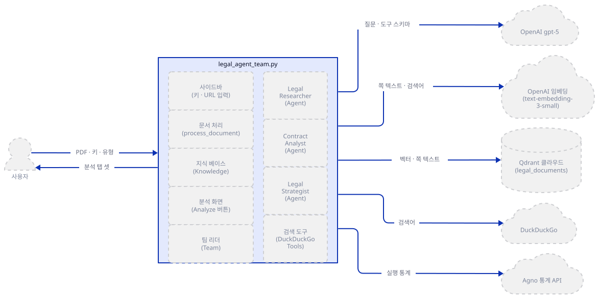

### Step 2. 키와 Qdrant 연결 — "연결됐다"는 객체를 만들었다는 뜻입니다

**목적.** 사이드바가 받는 값과, Qdrant 연결 객체를 만드는 줄이 실제로 무엇을 하는지 봅니다.

**할 일.**

`advanced_ai_agents/multi_agent_apps/agent_teams/ai_legal_agent_team/legal_agent_team.py:33-51`

```python
def init_qdrant():
    """Initialize Qdrant client with configured settings."""
    if not all([st.session_state.qdrant_api_key, st.session_state.qdrant_url]):
        return None
    try:
        # Create Agno's Qdrant instance which implements VectorDb
        vector_db = Qdrant(
            collection=COLLECTION_NAME,
            url=st.session_state.qdrant_url,
            api_key=st.session_state.qdrant_api_key,
            embedder=OpenAIEmbedder(
                id="text-embedding-3-small", 
                api_key=st.session_state.openai_api_key
            )
        )
        return vector_db
    except Exception as e:
        st.error(f"🔴 Qdrant connection failed: {str(e)}")
        return None
```

그리고 사이드바에서 URL을 받아 이 함수를 부르는 곳입니다.

`advanced_ai_agents/multi_agent_apps/agent_teams/ai_legal_agent_team/legal_agent_team.py:121-146`

```python
        qdrant_key = st.text_input(
            "Qdrant API Key",
            type="password",
            value=st.session_state.qdrant_api_key if st.session_state.qdrant_api_key else "",
            help="Enter your Qdrant API key"
        )
        if qdrant_key:
            st.session_state.qdrant_api_key = qdrant_key

        qdrant_url = st.text_input(
            "Qdrant URL",
            value=st.session_state.qdrant_url if st.session_state.qdrant_url else "",
            help="Enter your Qdrant instance URL"
        )
        if qdrant_url:
            st.session_state.qdrant_url = qdrant_url

        if all([st.session_state.qdrant_api_key, st.session_state.qdrant_url]):
            try:
                if not st.session_state.vector_db:
                    # Make sure we're initializing a QdrantClient here
                    st.session_state.vector_db = init_qdrant()
                    if st.session_state.vector_db:
                        st.success("Successfully connected to Qdrant!")
            except Exception as e:
                st.error(f"Failed to connect to Qdrant: {str(e)}")
```

세 값(OpenAI 키, Qdrant 키, URL)은 `st.session_state`에 쌓입니다. 키와 URL이 **둘 다** 비어 있지 않아야 `init_qdrant`가 객체를 만들므로(35행), 키 칸이 비면 업로드 위젯이 열리지 않습니다. 키 없이 도는 로컬 Qdrant 서버에는 아무 값이나 넣으면 열릴 것으로 보이지만 확인하지는 않았습니다. 성공 메시지(144행)는 `init_qdrant`가 예외 없이 돌아오면 찍힙니다. 그런데 agno의 `Qdrant`는 만들 때 서버에 접속하지 않습니다(agno 3.1.2의 `agno/vectordb/qdrant/qdrant.py`를 소스로 확인, `client` 속성이 처음 쓸 때 `QdrantClient`를 만듭니다).

**확인.** 아무도 듣지 않는 포트(이 문서는 59999)를 가리켜 봅니다. 이 명령은 외부로 나가지 않습니다.

```bash
uv run --no-project python -c "
from agno.vectordb.qdrant import Qdrant
from agno.knowledge.embedder.openai import OpenAIEmbedder
v = Qdrant(collection='legal_documents', url='http://127.0.0.1:59999', api_key='fake', embedder=OpenAIEmbedder(id='text-embedding-3-small', api_key='sk-fake'))
print('만들기 성공:', v.url, v.dimensions)
try:
    v.exists()
except Exception as e:
    print('exists() 실패:', type(e).__name__, str(e)[:80])
"
```

직접 확인한 출력입니다. 둘째 줄의 한국어는 Windows가 붙인 오류 문구입니다. 앞에 `UserWarning: Api key is used with an insecure connection.`이 함께 나옵니다.

```text
만들기 성공: http://127.0.0.1:59999 1536
exists() 실패: ResponseHandlingException [WinError 10061] 대상 컴퓨터에서 연결을 거부했으므로 연결하지 못했습니다
```

객체는 만들어지고 차원은 `text-embedding-3-small`의 1536으로 정해지지만, 서버에 닿는 첫 호출(`exists()`)에서야 실패합니다. 앱 화면에서도 같습니다. Step 3의 하네스에서 Qdrant 대역만 뺀 복사본으로 같은 URL을 넣으면 "Successfully connected to Qdrant!"가 먼저 뜨고 오류(`[WinError 10061] …`)는 문서를 올릴 때 나왔습니다(직접 확인). URL을 잘못 적었다면 그 지점에서야 알게 됩니다.

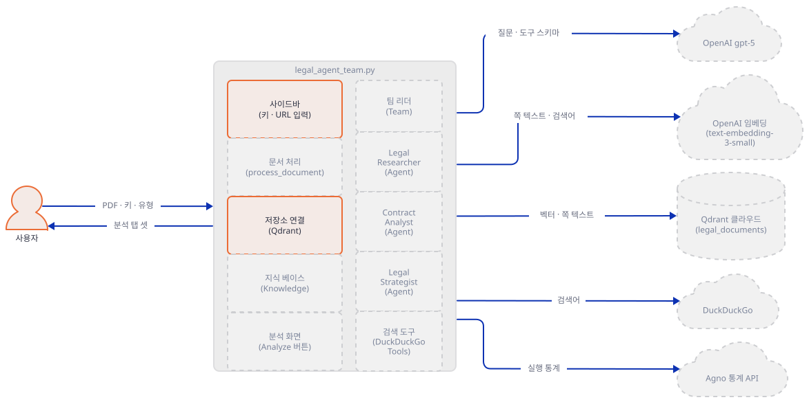

### Step 3. 문서 넣기 — `add_content`가 없어 빨간 오류 셋이 뜹니다

**목적.** PDF가 조각으로 쪼개져 Qdrant에 들어가는 길을 확인하고, 오늘의 agno에서 막히는 줄을 고칩니다. 이 단계에서 가짜 서버와 하네스를 처음 저장합니다.

**할 일.**

`advanced_ai_agents/multi_agent_apps/agent_teams/ai_legal_agent_team/legal_agent_team.py:69-97`

```python
    try:
        # Save the uploaded file to a temporary location
        with tempfile.NamedTemporaryFile(delete=False, suffix='.pdf') as temp_file:
            temp_file.write(uploaded_file.getvalue())
            temp_file_path = temp_file.name
        
        st.info("Loading and processing document...")
        
        # Create a Knowledge base with the vector_db
        knowledge_base = Knowledge(
            vector_db=vector_db
        )
        
        # Add the document to the knowledge base
        with st.spinner('📤 Loading documents into knowledge base...'):
            try:
                knowledge_base.add_content(path=temp_file_path)
                st.success("✅ Documents stored successfully!")
            except Exception as e:
                st.error(f"Error loading documents: {str(e)}")
                raise
        
        # Clean up the temporary file
        try:
            os.unlink(temp_file_path)
        except Exception:
            pass
            
        return knowledge_base
```

`os.environ['OPENAI_API_KEY']`는 이 함수 앞쪽(67행)에서 이미 써 둔 뒤입니다. 임시 파일은 `delete=False`로 만들어 `insert`가 끝난 뒤에야 지워집니다. 문서를 다루는 코드는 이것이 전부입니다. 쪼개기·임베딩·저장은 모두 `Knowledge` 안에서 일어납니다.

실제 서비스에 닿지 않고 이 줄들을 돌리려고 파일 넷을 작업 폴더에 저장합니다. 먼저 가짜 계약서를 만드는 `make_pdf.py`입니다. 라이브러리 없이 PDF를 직접 써서 가상의 회사 둘이 맺은 계약(쪽 둘)과, Step 7에서 쓸 NDA(쪽 하나)를 만듭니다.

`make_pdf.py`

```python
# 가짜 계약서 PDF(가상의 회사, 가상의 조항)를 라이브러리 없이 만든다.
CONTRACT = [
    ["SAMPLE SERVICES AGREEMENT (FICTIONAL)",
     "This agreement is between Example Widgets Co. (Provider) and Sample Client Ltd. (Client).",
     "1. Term. This agreement runs for twelve months and renews automatically unless either",
     "party gives sixty days written notice of non-renewal.",
     "2. Fees. Client pays Provider 5,000 per month, due within thirty days of invoice.",
     "Late payments accrue interest at 2 percent per month.",
     "3. Termination. Either party may terminate for material breach after fifteen days notice."],
    ["4. Liability. Provider total liability is limited to fees paid in the prior three months.",
     "Provider is not liable for indirect or consequential damages.",
     "5. Confidentiality. Each party keeps the other party information confidential for five years.",
     "6. Governing law. This agreement is governed by the laws of the State of Exampleland.",
     "7. Indemnity. Client indemnifies Provider against third party claims arising from Client data."],
]
NDA = [
    ["SAMPLE MUTUAL NDA (FICTIONAL)",
     "This agreement is between Example Labs Inc. and Another Client LLC.",
     "1. Purpose. The parties exchange confidential information to evaluate a possible partnership.",
     "2. Term. Obligations of confidentiality survive for three years after disclosure.",
     "3. Remedies. Either party may seek injunctive relief for any breach of this agreement."],
]

def write(path, pages):
    objs = []
    def add(s):
        objs.append(s)
        return len(objs)

    cat, pgs, font = add(None), add(None), add("<< /Type /Font /Subtype /Type1 /BaseFont /Helvetica >>")
    kids = []
    for lines in pages:
        body = "BT /F1 11 Tf 14 TL 50 760 Td " + " ".join("(%s) Tj T*" % l.replace("(", "").replace(")", "") for l in lines) + " ET"
        c = add("<< /Length %d >>\nstream\n%s\nendstream" % (len(body), body))
        kids.append(add("<< /Type /Page /Parent %d 0 R /MediaBox [0 0 612 792] /Contents %d 0 R /Resources << /Font << /F1 %d 0 R >> >> >>" % (pgs, c, font)))
    objs[cat - 1] = "<< /Type /Catalog /Pages %d 0 R >>" % pgs
    objs[pgs - 1] = "<< /Type /Pages /Kids [%s] /Count %d >>" % (" ".join("%d 0 R" % k for k in kids), len(kids))
    out, offs = b"%PDF-1.4\n", []
    for i, o in enumerate(objs, 1):
        offs.append(len(out))
        out += ("%d 0 obj\n%s\nendobj\n" % (i, o)).encode("latin-1")
    xref = len(out)
    out += ("xref\n0 %d\n0000000000 65535 f \n" % (len(objs) + 1)).encode() + b"".join(("%010d 00000 n \n" % o).encode() for o in offs)
    out += ("trailer\n<< /Size %d /Root %d 0 R >>\nstartxref\n%d\n%%%%EOF\n" % (len(objs) + 1, cat, xref)).encode()
    open(path, "wb").write(out)
    print(path, len(out), "bytes")

write("sample-contract.pdf", CONTRACT)
write("sample-nda.pdf", NDA)
```

모델 서버를 대신할 `fake_server.py`입니다. 임베딩은 낱말을 해시해 만든 결정적인 벡터라서 검색이 어느 정도 뜻을 갖고, 채팅은 도구를 부르는 순서만 정한 대본입니다. 대본은 Step 6에서 읽습니다. OpenAI 형식(`/v1/...`)과 Ollama 형식(`/api/...`)을 모두 받아 Step 8에서도 씁니다.

`fake_server.py`

```python
# 가짜 모델 서버 하나가 OpenAI 형식(/v1/...)과 Ollama 형식(/api/...)을 모두 받는다.
# 임베딩은 낱말 해시로 만든 벡터, 채팅은 도구를 부르는 순서만 정한 대본이다.
import hashlib, json, math, re, sys
from http.server import BaseHTTPRequestHandler, HTTPServer

class Server(HTTPServer):
    allow_reuse_address = False   # Windows에서 다른 프로세스의 포트에 겹쳐 뜨지 않게

def embed(text, dim):
    v = [0.0] * dim
    for tok in re.findall(r"[a-z0-9]+", text.lower()):
        v[int(hashlib.md5(tok.encode()).hexdigest(), 16) % dim] += 1.0
    n = math.sqrt(sum(x * x for x in v)) or 1.0
    return [x / n for x in v]

def msg(content=None, call=None):
    m = {"role": "assistant", "content": content}
    if call:
        m["tool_calls"] = [{"id": "call_%d" % N[0], "type": "function",
                            "function": {"name": call[0], "arguments": json.dumps(call[1])}}]
    return {"id": "x", "object": "chat.completion", "created": 0, "model": "fake",
            "choices": [{"index": 0, "message": m, "finish_reason": "tool_calls" if call else "stop"}],
            "usage": {"prompt_tokens": 1, "completion_tokens": 1, "total_tokens": 2}}

SLUG = {"Legal Researcher": "legal-researcher", "Contract Analyst": "contract-analyst", "Legal Strategist": "legal-strategist"}
ROLE = {"Legal research specialist": "Legal Researcher", "Contract analysis specialist": "Contract Analyst", "Legal strategy specialist": "Legal Strategist"}
N = [0]

def chat(body):
    msgs, tools = body["messages"], [t["function"]["name"] for t in body.get("tools") or []]
    dev, user = msgs[0]["content"], msgs[1]["content"]
    k = sum(m["role"] == "tool" for m in msgs)                      # 이 요청에 쌓인 tool 메시지 수
    last = next((m["content"] for m in reversed(msgs) if m["role"] == "tool"), "")
    snippet = re.sub(r"\s+", " ", last)[:110]
    if "delegate_task_to_member" in tools:                           # 팀 리더
        who = "leader"
        if "Based on this previous analysis" in user:
            out = msg("(가짜 팀 리더) 앞 분석을 요약한 답. 앞 분석의 첫머리: " + re.sub(r"\s+", " ", user.split("analysis:")[1])[:60])
        else:
            focus = [s.strip() for s in re.search(r"Focus Areas: (.*)", user).group(1).split(",")]
            if k == 0:
                out = msg(call=("search_knowledge_base", {"query": "term fees termination liability"}))
            elif k <= len(focus):
                out = msg(call=("delegate_task_to_member", {"member_id": SLUG[focus[k - 1]], "task": "Review the document for your part."}))
            else:
                out = msg("(가짜 팀 리더) 멤버 %d명의 보고를 합친 답. 마지막 보고의 첫머리: %s" % (len(focus), snippet))
    else:                                                            # 멤버
        who = next(v for r, v in ROLE.items() if r in dev)
        if k == 0:
            out = msg(call=("search_knowledge_base", {"query": "termination fees liability confidentiality"}))
        elif k == 1 and "web_search" in tools:
            out = msg(call=("web_search", {"query": "limitation of liability clause case law"}))
        else:
            out = msg("(가짜 %s) 마지막 도구 결과의 첫머리: %s" % (who, snippet))
    extra = " | 명단 %d명 | %s" % (dev.count("<member id="), re.search(r"Focus Areas: .*", user).group(0)) if who == "leader" and "Based on" not in user else ""
    print("#%d 채팅 %-16s 도구 %d개 | roles=%s | 질문=%r%s" % (N[0], who, len(tools), [m["role"] for m in msgs], user.strip()[:30], extra), flush=True)
    return out

def ollama_chat(out):                                            # OpenAI 형식 답을 Ollama 형식으로 바꾼다
    m = out["choices"][0]["message"]
    msg = {"role": "assistant", "content": m["content"] or ""}
    if m.get("tool_calls"):
        msg["tool_calls"] = [{"function": {"name": c["function"]["name"], "arguments": json.loads(c["function"]["arguments"])}} for c in m["tool_calls"]]
    return {"model": "fake", "created_at": "2026-10-09T00:00:00Z", "message": msg, "done": True, "done_reason": "stop"}

class Handler(BaseHTTPRequestHandler):
    def log_message(self, *a): pass
    def do_POST(self):
        body = json.loads(self.rfile.read(int(self.headers["content-length"])))
        N[0] += 1
        if self.path.endswith("/embeddings") or self.path == "/api/embed":
            items = body["input"] if isinstance(body["input"], list) else [body["input"]]
            dim = body.get("dimensions") or 1536
            print("#%d 임베딩 %s model=%s dimensions=%s 입력 %d개 | %r" % (N[0], self.path, body["model"], body.get("dimensions"), len(items), items[0][:30]), flush=True)
            vecs = [embed(t, dim) for t in items]
            if self.path == "/api/embed":
                out = {"model": body["model"], "embeddings": vecs}
            else:
                out = {"object": "list", "model": body["model"], "usage": {"prompt_tokens": 1, "total_tokens": 1},
                       "data": [{"object": "embedding", "index": i, "embedding": v} for i, v in enumerate(vecs)]}
        else:
            out = chat(body)
            if self.path == "/api/chat":
                out = ollama_chat(out)
        data = json.dumps(out).encode()
        self.send_response(200); self.send_header("content-type", "application/json")
        self.send_header("content-length", str(len(data))); self.end_headers(); self.wfile.write(data)

port = int(sys.argv[1])
print("가짜 모델 서버: 127.0.0.1:%d" % port, flush=True)
Server(("127.0.0.1", port), Handler).serve_forever()
```

앱 소스는 그대로 두고 업로드 위젯·Qdrant·DuckDuckGo 셋만 바꿔치는 `harness.py`입니다. 앱이 준 URL과 키는 버리고 프로세스 안 메모리 저장소를 씁니다.

`harness.py`

```python
# 앱 소스는 그대로 두고 세 곳만 대신한다: 파일 업로드 위젯, Qdrant 서버, DuckDuckGo.
import io, os, runpy
import streamlit as st
import agno.vectordb.qdrant as q

class Upload(io.BytesIO):                       # st.file_uploader가 돌려주는 객체 대역
    def __init__(self):
        self.name = os.environ.get("UPLOAD", "sample-contract.pdf")
        super().__init__(open(self.name, "rb").read())
st.file_uploader = lambda *a, **k: Upload()

if not hasattr(q.Qdrant, "is_fake"):            # 스크립트가 다시 실행돼도 한 번만 바꾼다
    class MemQdrant(q.Qdrant):                  # 앱이 준 url·api_key는 버리고 프로세스 안 메모리 저장소를 쓴다
        is_fake = True
        def __init__(self, *a, **kw):
            print(">> Qdrant 대역: url=%r api_key=%r 는 쓰지 않음" % (kw.pop("url", None), kw.pop("api_key", None)), flush=True)
            if os.environ.get("QDRANT_PATH"):   # 지정하면 폴더에 저장해 프로세스가 끝나도 남는다
                kw["path"] = os.environ["QDRANT_PATH"]
            else:
                kw["location"] = ":memory:"
            super().__init__(*a, **kw)
    q.Qdrant = MemQdrant

try:
    import agno.tools.websearch as ws           # ddgs가 없는 환경(로컬판)에서는 건너뛴다
except ImportError:
    ws = None

class FakeDDGS:                                 # ddgs.DDGS 대역
    def __init__(self, *a, **k): pass
    def __enter__(self): return self
    def __exit__(self, *a): return None
    def text(self, query, *a, **k):
        print(">> DuckDuckGo 대역: 검색어=%r" % query, flush=True)
        return [{"title": "가짜 결과", "href": "http://localhost/x", "body": "본문"}]
if ws:
    ws.DDGS = FakeDDGS

runpy.run_path(os.environ.get("APP", "legal_agent_team.py"), run_name="__main__")
```

Streamlit의 테스트 도구 `AppTest`로 화면을 조작하는 `drive.py`입니다. 사이드바 입력 셋을 채우고, 저장소와 팀을 읽어 찍고, 인자로 받은 분석 유형을 차례로 실행합니다.

`drive.py`

```python
# Streamlit의 테스트 도구(AppTest)로 화면을 사람 대신 조작한다.
import sys
from streamlit.testing.v1 import AppTest

at = AppTest.from_file("harness.py", default_timeout=120)
at.run()
at.sidebar.text_input[0].set_value("sk-fake").run()                       # OpenAI API Key
at.sidebar.text_input[1].set_value("fake-key").run()                      # Qdrant API Key
at.sidebar.text_input[2].set_value("https://qdrant.invalid:6333").run()   # Qdrant URL
print(">> 성공:", [s.value for s in at.success], "| 오류:", [e.value for e in at.error])
vdb = at.session_state["vector_db"]
points, _ = vdb.client.scroll(vdb.collection, limit=50, with_payload=True)
print(">> 저장소:", len(points), "조각 | name:", sorted({p.payload["name"] for p in points}))
if at.session_state["legal_team"] is None:                                # 문서 처리가 실패해 팀이 없으면 여기서 끝낸다
    print(">> 팀이 만들어지지 않아 여기서 끝냅니다")
    sys.exit()
for p in sorted(points, key=lambda p: p.payload["meta_data"]["page"]):
    print(">>   쪽", p.payload["meta_data"]["page"], p.payload["content"][:45])
team = at.session_state["legal_team"]
print(">> 팀:", team.name, "|", team.model.id, "|", team.mode.name, "| search_knowledge:", team.search_knowledge)
for m in team.members:
    print(">>   ", m.name, "|", m.role, "|", m.model.id, "| 도구:", [f for t in (m.tools or []) for f in t.functions], "| search_knowledge:", m.search_knowledge)
for kind in sys.argv[1:]:
    at.sidebar.selectbox[0].set_value(kind).run()
    if kind == "Custom Query":
        at.main.text_area[0].set_value("What happens if the Client pays late?").run()
    at.button[0].click().run()
    print(">> =====", kind, "| 오류:", [e.value for e in at.error])
    for m in at.main.markdown:
        print(">>  ", m.value.strip()[:150])
```

```bash
uv run --no-project python make_pdf.py
```

`sample-contract.pdf 1842 bytes`, `sample-nda.pdf 975 bytes`가 찍힙니다(직접 확인). 터미널 A에서 가짜 서버를 띄웁니다. 포트는 비어 있는 높은 번호면 됩니다. Windows가 예약해 둔 범위는 피하세요(`netsh interface ipv4 show excludedportrange protocol=tcp`로 봅니다)(이 문서는 55101).

```bash
uv run --no-project python fake_server.py 55101
```

터미널 B에서 모델 주소를 가짜 서버로 돌리고 통계를 끈 채 원본 그대로 돌립니다. `OPENAI_BASE_URL`은 OpenAI SDK가 읽는 환경변수라 앱 코드를 고치지 않아도 됩니다.

```bash
OPENAI_BASE_URL=http://127.0.0.1:55101/v1 AGNO_TELEMETRY=false uv run --no-project python drive.py 2>&1 | grep "^>>"
```

```powershell
# 실행해 보지 못했습니다. 변수가 이 터미널에 남으므로 실제 키로 돌릴 때는 새 터미널을 쓰세요
$env:OPENAI_BASE_URL = "http://127.0.0.1:55101/v1"; $env:AGNO_TELEMETRY = "false"
uv run --no-project python drive.py 2>&1 | Select-String "^>>"
```

**확인.** 직접 확인한 출력입니다. 하네스가 앱의 Qdrant URL과 키를 쓰지 않았다는 줄이 먼저 나옵니다.

```text
>> Qdrant 대역: url='https://qdrant.invalid:6333' api_key='fake-key' 는 쓰지 않음
>> 성공: ['Successfully connected to Qdrant!'] | 오류: ["Error loading documents: 'Knowledge' object has no attribute 'add_content'", "Document processing error: 'Knowledge' object has no attribute 'add_content'", "Error processing document: Error processing document: 'Knowledge' object has no attribute 'add_content'"]
>> 저장소: 0 조각 | name: []
>> 팀이 만들어지지 않아 여기서 끝냅니다
```

빨간 오류 셋이 같은 원인을 세 번 말합니다. 앱의 `except`가 안쪽에서 한 번(88행), 바깥에서 한 번(100행), 호출한 쪽에서 한 번(234행) 화면에 찍기 때문입니다. agno 3.0.5와 3.1.2의 `Knowledge`에는 `add_content`가 없고 같은 일을 `insert`가 합니다. 2.9.0에는 `add_content`가 `insert`를 부르는 폐기 예정 래퍼로 남아 있었습니다(세 판을 설치해 소스로 확인). Day 047 Step 3이 먼저 본 변화입니다. 또 하나, 이 실패 뒤 임시 폴더에 올린 PDF의 사본(`tmp*.pdf`, 1842바이트)이 지워지지 않고 남았습니다(직접 확인). 지우는 줄(93행)이 성공 경로에만 있기 때문입니다. 법률 문서를 다루는 앱에서는 눈여겨볼 점입니다.

복사본의 한 줄을 고칩니다. 원본은 건드리지 않습니다.

```bash
uv run --no-project python -c "p='legal_agent_team.py'; s=open(p,encoding='utf-8').read(); open(p,'w',encoding='utf-8').write(s.replace('knowledge_base.add_content(','knowledge_base.insert('))"
OPENAI_BASE_URL=http://127.0.0.1:55101/v1 AGNO_TELEMETRY=false uv run --no-project python drive.py 2>&1 | grep "^>>"
```

```text
>> Qdrant 대역: url='https://qdrant.invalid:6333' api_key='fake-key' 는 쓰지 않음
>> 성공: ['Successfully connected to Qdrant!', 'Documents stored successfully!', 'Document processed and team initialized!'] | 오류: []
>> 저장소: 2 조각 | name: ['tmp5djxubwf.pdf']
>>   쪽 1 SAMPLE SERVICES AGREEMENT FICTIONAL This agre
>>   쪽 2 4. Liability. Provider total liability is lim
```

PDF 두 쪽이 조각 둘이 됐습니다. 쪽마다 한 조각이고, 각 조각의 `meta_data`에 쪽 번호가 들어 있습니다. 저장된 `name`은 올린 파일 이름(`sample-contract.pdf`)이 아니라 임시 파일 이름(`tmp5djxubwf.pdf`, 실행마다 다름)입니다. 가짜 서버 로그에는 쪽마다 한 번씩 `임베딩 ... dimensions=1536`이 두 줄 찍힙니다. Qdrant에 저장된 순서는 이렇습니다.

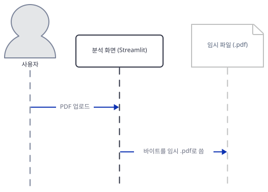

사용자가 PDF를 올리면 화면이 업로드 바이트를 임시 `.pdf`로 씁니다.

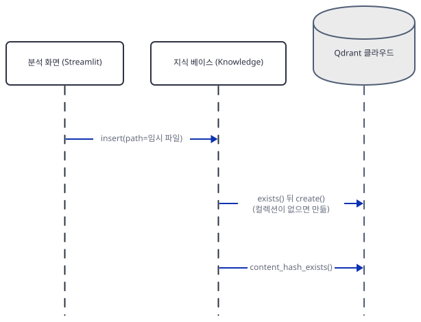

화면이 `Knowledge.insert`를 부르면 `Knowledge`가 Qdrant에 `exists`, `create`, `create` 안의 `exists`, `content_hash_exists`를 차례로 부릅니다(`Qdrant`의 메서드를 감싸 호출 순서를 직접 확인: `exists`, `create`, `exists`, `content_hash_exists`, `insert`).

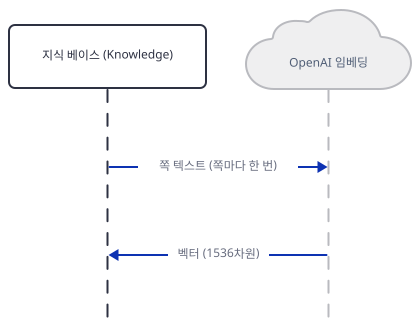

쪽 텍스트가 OpenAI 임베딩 서버로 가고 1536차원 벡터가 돌아옵니다.

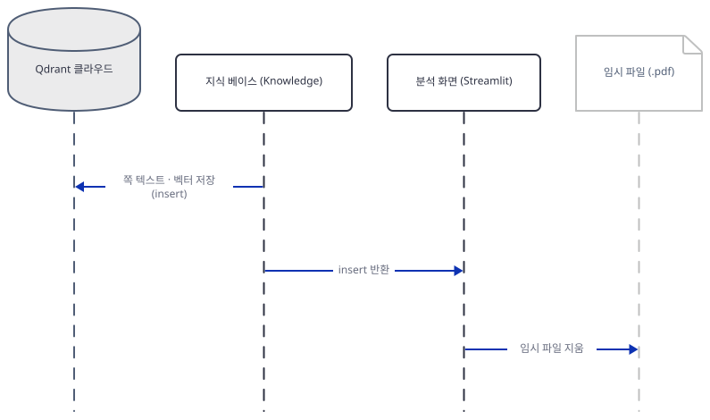

벡터와 쪽 텍스트가 Qdrant에 저장되고(`insert`), 돌아오면 화면이 "Documents stored successfully!"를 띄웁니다.

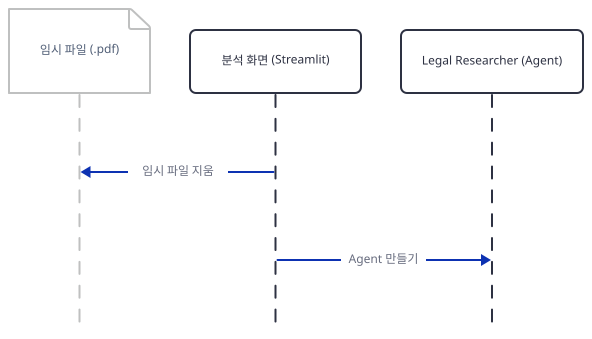

`process_document`가 임시 파일을 지우고 돌아오면 화면이 Legal Researcher를 만듭니다.

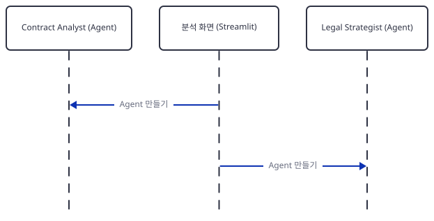

Contract Analyst와 Legal Strategist가 차례로 만들어집니다.

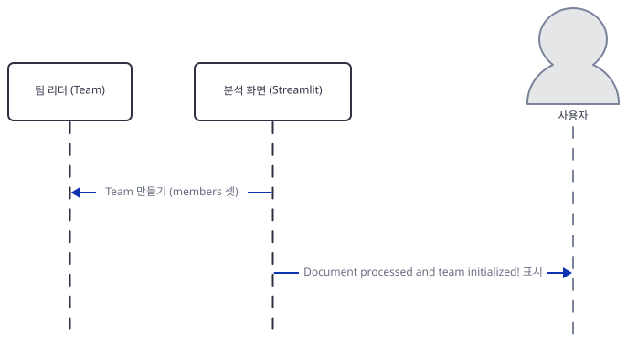

세 멤버를 `members`로 묶어 팀을 만들고 "Document processed and team initialized!"를 띄웁니다.

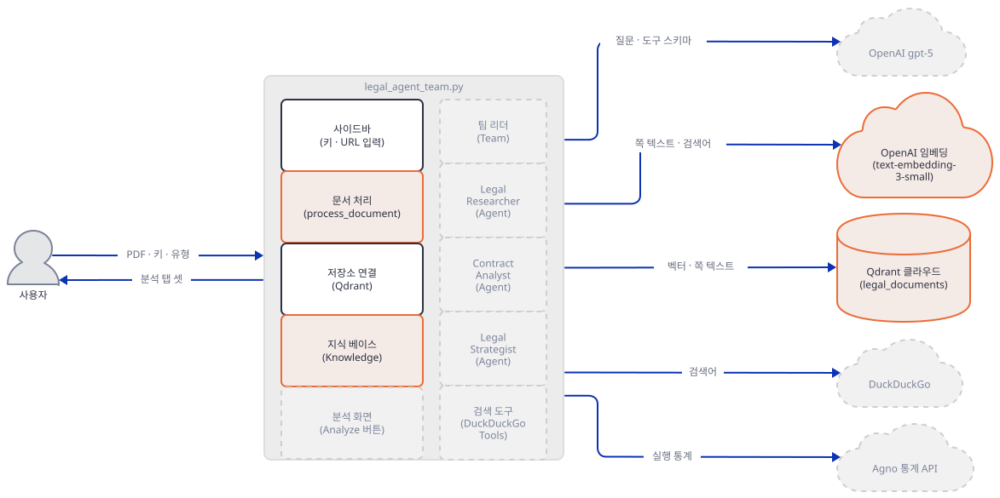

### Step 4. 에이전트 셋과 팀 리더 — 도구가 갈린다

**목적.** 멤버 셋과 팀 리더가 각자 무엇을 쥐는지 봅니다.

**할 일.**

`advanced_ai_agents/multi_agent_apps/agent_teams/ai_legal_agent_team/legal_agent_team.py:168-183`

```python
                                legal_researcher = Agent(
                                    name="Legal Researcher",
                                    role="Legal research specialist",
                                    model=OpenAIChat(id="gpt-5"),
                                    tools=[DuckDuckGoTools()],
                                    knowledge=st.session_state.knowledge_base,
                                    search_knowledge=True,
                                    instructions=[
                                        "Find and cite relevant legal cases and precedents",
                                        "Provide detailed research summaries with sources",
                                        "Reference specific sections from the uploaded document",
                                        "Always search the knowledge base for relevant information"
                                    ],
                                    debug_mode=True,
                                    markdown=True
                                )
```

Contract Analyst(185~197행)와 Legal Strategist(199~211행)는 같은 모양에 `tools`와 `debug_mode`가 없습니다. 이어서 팀 리더입니다.

`advanced_ai_agents/multi_agent_apps/agent_teams/ai_legal_agent_team/legal_agent_team.py:214-229`

```python
                                st.session_state.legal_team = Team(
                                    name="Legal Team Lead",
                                    model=OpenAIChat(id="gpt-5"),
                                    members=[legal_researcher, contract_analyst, legal_strategist],
                                    knowledge=st.session_state.knowledge_base,
                                    search_knowledge=True,
                                    instructions=[
                                        "Coordinate analysis between team members",
                                        "Provide comprehensive responses",
                                        "Ensure all recommendations are properly sourced",
                                        "Reference specific parts of the uploaded document",
                                        "Always search the knowledge base before delegating tasks"
                                    ],
                                    debug_mode=True,
                                    markdown=True
                                )
```

`mode`를 정하지 않아 `coordinate`이고, 리더가 `delegate_task_to_member`로 위임한다는 것은 Day 079 Step 5가 확인했습니다. 새로 붙는 것이 `knowledge`와 `search_knowledge=True`입니다. 리더도 멤버도 같은 `Knowledge` 객체를 받습니다. 모델은 넷 모두 `gpt-5`이고 `debug_mode=True`라 agno의 `DEBUG` 줄이 터미널에 쏟아집니다.

**확인.** Step 3의 `drive.py`가 팀을 읽어 찍은 줄입니다(직접 확인).

```text
>> 팀: Legal Team Lead | gpt-5 | coordinate | search_knowledge: True
>>    Legal Researcher | Legal research specialist | gpt-5 | 도구: ['web_search', 'search_news'] | search_knowledge: True
>>    Contract Analyst | Contract analysis specialist | gpt-5 | 도구: [] | search_knowledge: True
>>    Legal Strategist | Legal strategy specialist | gpt-5 | 도구: [] | search_knowledge: True
```

Legal Researcher만 웹 검색 두 함수를 쥡니다. 나머지 둘은 지식 검색 하나뿐입니다. 팀 리더의 첫 요청(Step 6)을 보면 도구는 `delegate_task_to_member`와 `search_knowledge_base` 둘이고, 시스템 메시지에는 멤버 셋의 명단과 "Always search the knowledge base before delegating tasks"가 들어 있습니다.

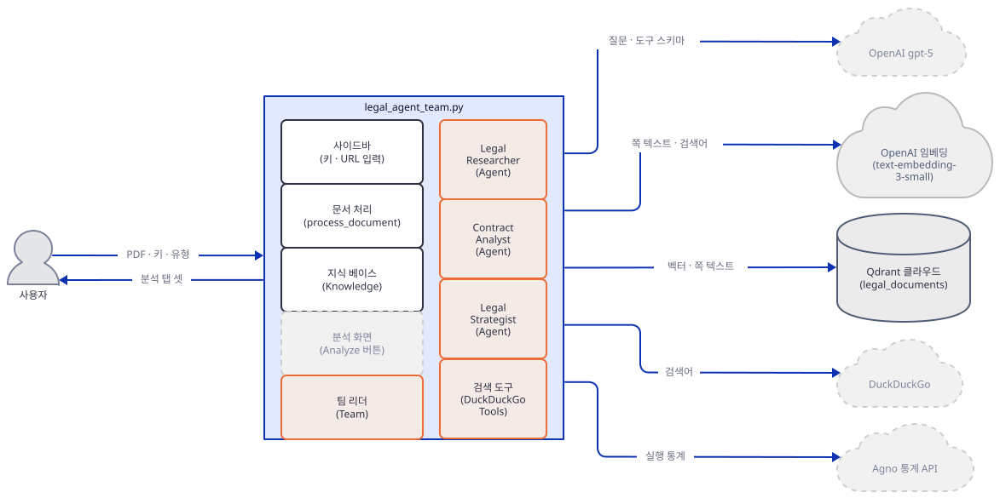

### Step 5. 분석 화면 — 분석 유형은 글자일 뿐입니다

**목적.** 다섯 가지 분석 유형이 팀의 동작을 실제로 어떻게 바꾸는지 봅니다.

**할 일.**

`advanced_ai_agents/multi_agent_apps/agent_teams/ai_legal_agent_team/legal_agent_team.py:272-298`

```python
        analysis_configs = {
            "Contract Review": {
                "query": "Review this contract and identify key terms, obligations, and potential issues.",
                "agents": ["Contract Analyst"],
                "description": "Detailed contract analysis focusing on terms and obligations"
            },
            "Legal Research": {
                "query": "Research relevant cases and precedents related to this document.",
                "agents": ["Legal Researcher"],
                "description": "Research on relevant legal cases and precedents"
            },
            "Risk Assessment": {
                "query": "Analyze potential legal risks and liabilities in this document.",
                "agents": ["Contract Analyst", "Legal Strategist"],
                "description": "Combined risk analysis and strategic assessment"
            },
            "Compliance Check": {
                "query": "Check this document for regulatory compliance issues.",
                "agents": ["Legal Researcher", "Contract Analyst", "Legal Strategist"],
                "description": "Comprehensive compliance analysis"
            },
            "Custom Query": {
                "query": None,
                "agents": ["Legal Researcher", "Contract Analyst", "Legal Strategist"],
                "description": "Custom analysis using all available agents"
            }
        }
```

`agents` 목록은 화면의 "Active Legal AI Agents" 줄(301행)과 질문 글의 "Focus Areas" 줄(328·339행), 핵심 요약·권고 요청의 "Focus on insights from"·"Provide specific recommendations from" 줄(363·379행)에만 쓰입니다. 팀을 만드는 코드(214~229행)는 유형과 상관없이 멤버 셋을 모두 넣습니다. 질문을 만드는 곳과 팀을 부르는 곳입니다.

`advanced_ai_agents/multi_agent_apps/agent_teams/ai_legal_agent_team/legal_agent_team.py:322-342`

```python
                        # Combine predefined and user queries
                        if analysis_type != "Custom Query":
                            combined_query = f"""
                            Using the uploaded document as reference:
                            
                            Primary Analysis Task: {analysis_configs[analysis_type]['query']}
                            Focus Areas: {', '.join(analysis_configs[analysis_type]['agents'])}
                            
                            Please search the knowledge base and provide specific references from the document.
                            """
                        else:
                            combined_query = f"""
                            Using the uploaded document as reference:
                            
                            {user_query}
                            
                            Please search the knowledge base and provide specific references from the document.
                            Focus Areas: {', '.join(analysis_configs[analysis_type]['agents'])}
                            """

                        response: RunOutput = st.session_state.legal_team.run(combined_query)
```

핵심 요약과 권고는 같은 `legal_team.run`을 두 번 더 부릅니다(358행과 374행). 앞 분석 글을 새 질문에 붙여 넣을 뿐 대화 기록은 이어지지 않는 별개의 실행입니다. `st.tabs` 안의 코드는 탭을 누를 때가 아니라 버튼을 누를 때 모두 실행되므로, Analyze 한 번에 팀 실행이 셋입니다.

**확인.** Step 6에서 가짜 서버 로그로 봅니다. 요점만 먼저 적으면 "Contract Review"의 리더 요청에는 멤버 명단 3명과 `Focus Areas: Contract Analyst`가 함께 들어가고, 팀 실행은 셋이며 뒤의 둘은 `roles=['developer', 'user']`로 시작합니다.

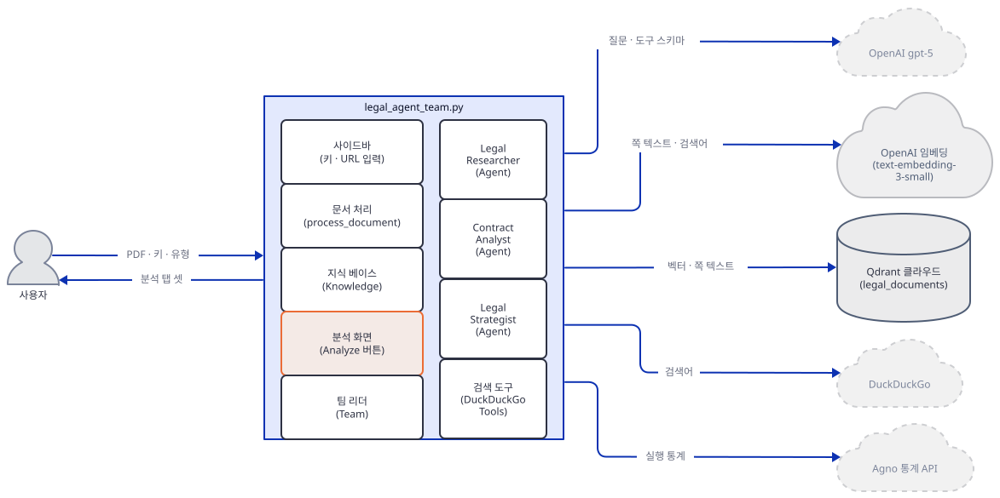

### Step 6. 가짜 서버로 분석 한 번 — 모델 호출 일곱 번

**목적.** 외부 서비스 없이 분석 한 번이 팀을 통과하는 전 과정을 로컬에서 봅니다.

**할 일.** 가짜 서버의 대본(`fake_server.py`의 `chat`)은 이렇게 움직입니다. 리더에게는 지식 검색 → `Focus Areas`에 적힌 멤버를 하나씩 위임 → 종합을, 멤버에게는 지식 검색(Legal Researcher는 이어서 웹 검색) → 보고를, 핵심 요약·권고 요청에는 곧장 답을 시킵니다. 지식 검색 결과는 대본이 아니라 앱이 Qdrant에서 찾은 조각이 그대로 돌아와, 멤버의 보고 첫머리에 실립니다. 모델 호출 번호를 처음부터 세려고 Step 3의 서버를 터미널 A에서 Ctrl+C로 멈추고 새로 띄웁니다. 터미널 B에서 돌립니다.

```bash
uv run --no-project python fake_server.py 55102
```

```bash
OPENAI_BASE_URL=http://127.0.0.1:55102/v1 AGNO_TELEMETRY=false uv run --no-project python drive.py "Contract Review" 2>&1 | grep "^>>"
```

```powershell
# 실행해 보지 못했습니다
$env:OPENAI_BASE_URL = "http://127.0.0.1:55102/v1"; $env:AGNO_TELEMETRY = "false"
uv run --no-project python drive.py "Contract Review" 2>&1 | Select-String "^>>"
```

**확인.** 직접 확인한 출력의 끝부분입니다(앞의 저장소·팀 줄은 Step 3·4와 같습니다). 멤버 보고에 실리는 검색 결과의 첫머리는 JSON 키 순서가 환경에 따라 달라 `"content"`가 먼저 나올 수 있습니다.

```text
>> ===== Contract Review | 오류: []
>>   🤖 Active Legal AI Agents: Contract Analyst
>>   ### Detailed Analysis
>>   (가짜 팀 리더) 멤버 1명의 보고를 합친 답. 마지막 보고의 첫머리: (가짜 Contract Analyst) 마지막 도구 결과의 첫머리: [ { "meta_data": { "page": 2, "linked_to": "" }, "content": "4. Liabilit
>>   ### Key Points
>>   (가짜 팀 리더) 앞 분석을 요약한 답. 앞 분석의 첫머리:  (가짜 팀 리더) 멤버 1명의 보고를 합친 답. 마지막 보고의 첫머리: (가짜 Contract Analys
>>   ### Recommendations
>>   (가짜 팀 리더) 앞 분석을 요약한 답. 앞 분석의 첫머리:  (가짜 팀 리더) 멤버 1명의 보고를 합친 답. 마지막 보고의 첫머리: (가짜 Contract Analys
```

터미널 A의 가짜 서버가 찍은 줄입니다. #1·#2는 Step 3의 문서 임베딩입니다.

```text
#3 채팅 leader           도구 2개 | roles=['developer', 'user'] | 질문='Using the uploaded document as' | 명단 3명 | Focus Areas: Contract Analyst
#4 임베딩 /v1/embeddings model=text-embedding-3-small dimensions=1536 입력 1개 | 'term fees termination liabilit'
#5 채팅 leader           도구 2개 | roles=['developer', 'user', 'assistant', 'tool'] | 질문='Using the uploaded document as' | 명단 3명 | Focus Areas: Contract Analyst
#6 채팅 Contract Analyst 도구 1개 | roles=['developer', 'user'] | 질문='Review the document for your p'
#7 임베딩 /v1/embeddings model=text-embedding-3-small dimensions=1536 입력 1개 | 'termination fees liability con'
#8 채팅 Contract Analyst 도구 1개 | roles=['developer', 'user', 'assistant', 'tool'] | 질문='Review the document for your p'
#9 채팅 leader           도구 2개 | roles=['developer', 'user', 'assistant', 'tool', 'assistant', 'tool'] | 질문='Using the uploaded document as' | 명단 3명 | Focus Areas: Contract Analyst
#10 채팅 leader           도구 2개 | roles=['developer', 'user'] | 질문='Based on this previous analysi'
#11 채팅 leader           도구 2개 | roles=['developer', 'user'] | 질문='Based on this previous analysi'
```

읽는 법입니다. 모델 호출은 일곱 번(#3·5·6·8·9·10·11)이고 임베딩이 문서 둘에 이어 검색 둘입니다. 리더가 멤버에게 넘기는 질문은 사용자의 문장이 아니라 리더가 쓴 `task`입니다. 핵심 요약(#10)과 권고(#11)는 `roles=['developer', 'user']`로 시작하는 새 실행이라 앞 대화가 없고, 앞 분석은 질문 글에 붙어 갑니다. 리더의 시스템 메시지에는 `Focus Areas`와 상관없이 멤버 셋이 모두 올라 있습니다. 같은 방식으로 "Compliance Check"를 돌리면 모델 호출 14번, 검색 임베딩 4번이 됩니다. Legal Researcher의 웹 검색은 `DuckDuckGo 대역: 검색어='limitation of liability clause case law'` 한 줄로 나타납니다(직접 확인). 진짜 모델이 위임을 몇 번에 나누고 검색을 몇 번 할지는 확인하지 못했습니다.

agno의 사용 통계도 봅니다. `AGNO_TELEMETRY=false`를 걸지 않으면 실행이 끝날 때마다 Agno 서버로 통계를 보내려 합니다. 아래 `spy.py`는 보내지 않고 내용만 찍습니다.

`spy.py`

```python
# agno가 Agno 서버로 보내려는 실행 통계를 보내지 않고 내용만 찍는다.
import runpy, sys
import agno.api.agent as aa, agno.api.team as at

def spy(label):
    def f(run=None, **k):
        print(">> 통계 전송 시도:", label, {key: run.data.get(key) for key in ("team_id", "agent_id", "model_id", "member_count", "has_knowledge")}, flush=True)
    return f
aa.create_agent_run = spy("agent"); at.create_team_run = spy("team")
sys.argv = ["drive.py"] + sys.argv[1:]
runpy.run_path("drive.py", run_name="__main__")
```

```bash
OPENAI_BASE_URL=http://127.0.0.1:55102/v1 uv run --no-project python spy.py "Contract Review" 2>&1 | grep "^>> 통계"
```

```powershell
# 실행해 보지 못했습니다. 앞에서 건 AGNO_TELEMETRY가 세션에 남아 있으면 0줄이 나오므로 먼저 지웁니다
Remove-Item Env:AGNO_TELEMETRY
$env:OPENAI_BASE_URL = "http://127.0.0.1:55102/v1"
uv run --no-project python spy.py "Contract Review" 2>&1 | Select-String "^>> 통계"
```

bash에서 앞 명령의 `AGNO_TELEMETRY=false`는 그 명령에만 걸린 것이라 이 줄에는 남지 않습니다. 같은 터미널에서 `export`로 걸어 두었다면 `unset AGNO_TELEMETRY`로 지우고 돌리세요.

직접 확인한 출력입니다. 멤버 하나와 팀의 세 실행, 모두 넷입니다. `AGNO_TELEMETRY=false`를 걸고 다시 돌리면 한 줄도 나오지 않았습니다.

```text
>> 통계 전송 시도: agent {'team_id': None, 'agent_id': 'contract-analyst', 'model_id': 'gpt-5', 'member_count': None, 'has_knowledge': True}
>> 통계 전송 시도: team {'team_id': 'legal-team-lead', 'agent_id': None, 'model_id': 'gpt-5', 'member_count': 3, 'has_knowledge': True}
>> 통계 전송 시도: team {'team_id': 'legal-team-lead', 'agent_id': None, 'model_id': 'gpt-5', 'member_count': 3, 'has_knowledge': True}
>> 통계 전송 시도: team {'team_id': 'legal-team-lead', 'agent_id': None, 'model_id': 'gpt-5', 'member_count': 3, 'has_knowledge': True}
```

보내려는 것은 식별자·모델 이름·멤버 수 같은 구성 정보이고 질문이나 문서 내용은 보이지 않았습니다. 이 앱에는 AgentOS가 없어 Day 047 Step 5가 다룬 서버 기동 통계는 없습니다.

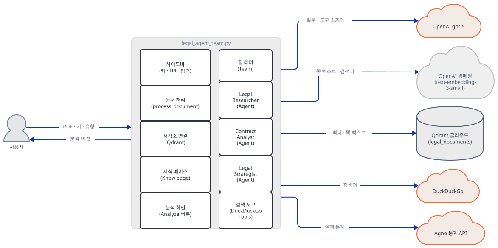

### Step 7. 저장소에 쌓이는 것 — 중복, 임시 이름, 문서 섞임

**목적.** 문서를 여러 번 올리면 저장소에 무엇이 남는지 봅니다.

**할 일.** 아래 `accumulate.py`는 같은 세션에서 계약서에 이어 NDA를 올리고, 저장된 조각과 검색 결과를 찍습니다. `harness.py`는 `QDRANT_PATH`를 주면 메모리 대신 그 폴더에 저장해 프로세스가 끝나도 남깁니다.

`accumulate.py`

```python
# 같은 세션에서 문서를 둘 올리고, 저장소에 무엇이 쌓이는지 본다.
import os
from streamlit.testing.v1 import AppTest

at = AppTest.from_file("harness.py", default_timeout=120)
at.run()
at.sidebar.text_input[0].set_value("sk-fake").run()
at.sidebar.text_input[1].set_value("fake-key").run()
at.sidebar.text_input[2].set_value("https://qdrant.invalid:6333").run()

def peek(tag):
    vdb = at.session_state["vector_db"]
    points, _ = vdb.client.scroll(vdb.collection, limit=50, with_payload=True)
    print(">>", tag, "| 조각", len(points), "| name", sorted({p.payload["name"] for p in points}),
          "| 이 세션이 처리한 파일", sorted(at.session_state["processed_files"]))

peek("계약서")
os.environ["UPLOAD"] = "sample-nda.pdf"
at.run()
peek("NDA 추가")
for hit in at.session_state["vector_db"].search("liability limited to fees", limit=2):
    print(">> 검색 결과:", hit.name, "|", hit.content[:45])
```

**확인.** 가짜 서버(55102)를 켠 채 돌립니다.

```bash
export OPENAI_BASE_URL=http://127.0.0.1:55102/v1 AGNO_TELEMETRY=false
uv run --no-project python accumulate.py 2>&1 | grep "^>>"
```

```powershell
# 실행해 보지 못했습니다
$env:OPENAI_BASE_URL = "http://127.0.0.1:55102/v1"; $env:AGNO_TELEMETRY = "false"
uv run --no-project python accumulate.py 2>&1 | Select-String "^>>"
```

이 `export`와 `$env:` 값은 터미널에 남습니다. 같은 터미널에서 실제 키와 Qdrant URL로 앱을 쓰면 요청이 가짜 서버로 가서, 가짜 서버의 해시 벡터와 PDF 쪽 텍스트가 실제 Qdrant 컬렉션에 쌓일 수 있습니다(코드 경로상 그렇다고 읽었고 실행하지는 않았습니다). 실제 키로 돌릴 때는 새 터미널을 쓰세요.

직접 확인한 출력입니다.

```text
>> Qdrant 대역: url='https://qdrant.invalid:6333' api_key='fake-key' 는 쓰지 않음
>> 계약서 | 조각 2 | name ['tmpn0z0w5l6.pdf'] | 이 세션이 처리한 파일 ['sample-contract.pdf']
>> NDA 추가 | 조각 3 | name ['tmp9nl5k2hk.pdf', 'tmpn0z0w5l6.pdf'] | 이 세션이 처리한 파일 ['sample-contract.pdf', 'sample-nda.pdf']
>> 검색 결과: tmpn0z0w5l6.pdf | 4. Liability. Provider total liability is lim
>> 검색 결과: tmp9nl5k2hk.pdf | SAMPLE MUTUAL NDA FICTIONAL This agreement is
```

두 문서의 조각이 한 컬렉션(`legal_documents`)에 섞이고, 검색은 어느 문서인지 가리지 않아 계약서의 책임 조항을 찾는 검색어에도 NDA 조각이 둘째 후보로 올라옵니다. 저장된 이름은 임시 이름뿐이라 조각이 어느 파일에서 왔는지 이름으로는 알 수 없습니다. 세션 안에서는 `processed_files`(165행)가 같은 파일 이름의 재처리를 막습니다. 그런데 이 기록은 세션 상태에만 있습니다. 폴더에 저장하는 모드로 같은 스크립트를 두 번, 별개의 프로세스로 돌려 새 세션을 흉내 냅니다.

```bash
mkdir qstore
QDRANT_PATH=qstore uv run --no-project python accumulate.py 2>&1 | grep "^>> [계N]"
QDRANT_PATH=qstore uv run --no-project python accumulate.py 2>&1 | grep "^>> [계N]"
```

```powershell
# 실행해 보지 못했습니다. 끝나면 변수를 지웁니다
mkdir qstore
$env:QDRANT_PATH = "qstore"
uv run --no-project python accumulate.py 2>&1 | Select-String "^>> [계N]"
uv run --no-project python accumulate.py 2>&1 | Select-String "^>> [계N]"
Remove-Item Env:QDRANT_PATH
```

```text
>> 계약서 | 조각 2 | name ['tmpkpc50e2i.pdf'] | 이 세션이 처리한 파일 ['sample-contract.pdf']
>> NDA 추가 | 조각 3 | name ['tmpkpc50e2i.pdf', 'tmpldaamotp.pdf'] | 이 세션이 처리한 파일 ['sample-contract.pdf', 'sample-nda.pdf']
>> 계약서 | 조각 5 | name ['tmpg_kub8kt.pdf', 'tmpkpc50e2i.pdf', 'tmpldaamotp.pdf'] | 이 세션이 처리한 파일 ['sample-contract.pdf']
>> NDA 추가 | 조각 6 | name ['tmpg_kub8kt.pdf', 'tmpkpc50e2i.pdf', 'tmpldaamotp.pdf', 'tmpt_8p_tus.pdf'] | 이 세션이 처리한 파일 ['sample-contract.pdf', 'sample-nda.pdf']
```

(직접 확인.) 둘째 프로세스는 같은 계약서를 올렸을 뿐인데 조각이 2개 늘었습니다. 임시 파일 이름이 매번 달라 내용 해시가 달라지기 때문에 같은 문서로 인식되지 않고 중복으로 쌓입니다. `insert(path=임시 파일, name=올린 파일 이름, skip_if_exists=True)`로 고친 복사본으로 같은 폴더 저장 모드를 두 번 돌려 봐도 저장된 이름만 `sample-contract.pdf`로 바뀔 뿐 조각은 2→3, 5→6으로 그대로 쌓였습니다(직접 확인). 내용 해시를 만들 때 이름에 더해 파일 경로(`str(content.path)`)가 들어가고 경로는 매번 다른 임시 파일이기 때문입니다(agno 3.1.2 `agno/knowledge/knowledge.py`의 `_build_content_hash`를 소스로 확인). 앱에는 저장소의 문서를 지우거나 고르는 기능이 없습니다. Qdrant 클라우드를 쓰면 이전 사용자의 문서가 컬렉션에 계속 남고 다음 분석의 검색 범위에 들어갑니다.


### Step 8. 로컬판 — 설치 직후 다섯 곳이 막힙니다

**목적.** 로컬판이 클라우드판과 무엇이 다르고, 왜 설치 직후 돌지 않는지 봅니다. 사용자의 실제 Ollama(11434)와 Qdrant(6333)에는 묻지 않고 가짜 서버(앞의 `fake_server.py`는 Ollama 형식도 받습니다)로 확인합니다.

**할 일.** 먼저 구조의 차이입니다. 모델은 `Ollama(id="llama3.1:8b")`, 임베딩은 `OllamaEmbedder`, 저장소는 `http://localhost:6333` 고정입니다.

`advanced_ai_agents/multi_agent_apps/agent_teams/ai_legal_agent_team/local_ai_legal_agent_team/local_legal_agent.py:20-26`

```python
def init_qdrant():
    """Initialize local Qdrant vector database"""
    return Qdrant(
        collection="legal_knowledge",
        url="http://localhost:6333", 
        embedder=OllamaEmbedder(model="openhermes")
    )
```

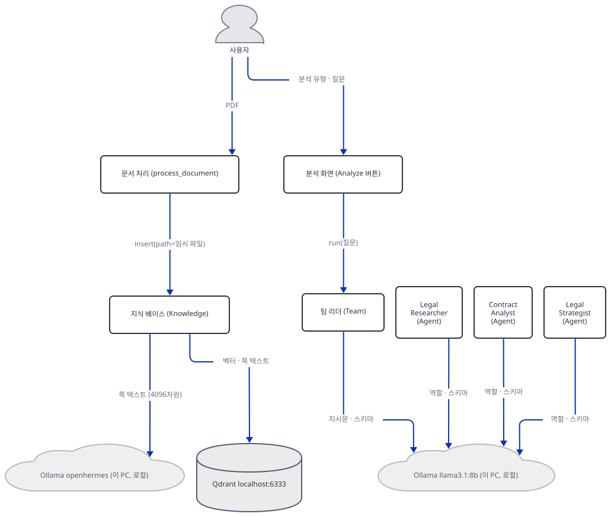

앱 코드의 나머지 차이는 소스로 읽어 이렇습니다. 키와 URL 입력란이 없고, Legal Researcher에 DuckDuckGo 도구가 없으며(77~89행), `debug_mode`가 없고, "Custom Query"가 아니어도 질문 입력란이 늘 보입니다(192~195행). 가장 큰 것은 문서를 처리하는 위치입니다. 클라우드판은 `processed_files`로 같은 파일을 한 번만 처리하는데, 로컬판은 업로드된 파일이 있는 동안 화면이 다시 그려질 때마다 처리합니다.

`advanced_ai_agents/multi_agent_apps/agent_teams/ai_legal_agent_team/local_ai_legal_agent_team/local_legal_agent.py:70-74`

```python
    if uploaded_file:
        with st.spinner("Processing document..."):
            try:
                knowledge_base = process_document(uploaded_file, st.session_state.vector_db)
                st.session_state.knowledge_base = knowledge_base
```

설치와 실행을 따라가 봅니다. 작업 폴더를 새로 만들어(`legal-local-work`) `local_legal_agent.py`·`requirements.txt`와 Step 3의 파일 넷(`make_pdf.py`·`fake_server.py`·`harness.py`)에 아래 `drive_local.py`를 두고 새 가상환경에 설치합니다.

`drive_local.py`

```python
# 로컬판 화면을 AppTest로 조작한다. 키 입력란이 없으므로 바로 문서 처리가 시작된다.
import sys
from streamlit.testing.v1 import AppTest

at = AppTest.from_file("harness.py", default_timeout=120)
at.run()
print(">> 성공:", [s.value for s in at.success], "| 오류:", [e.value for e in at.error])
if "knowledge_base" in at.session_state and at.session_state["knowledge_base"] is not None:
    vdb = at.session_state["vector_db"]
    points, _ = vdb.client.scroll(vdb.collection, limit=50, with_payload=True)
    print(">> 저장소:", len(points), "조각 | name:", sorted({p.payload["name"] for p in points}))
for kind in sys.argv[1:]:
    at.selectbox[0].set_value(kind).run()
    at.button[0].click().run()
    points, _ = vdb.client.scroll(vdb.collection, limit=50, with_payload=True)
    print(">> =====", kind, "| 오류:", [e.value for e in at.error], "| 저장소:", len(points), "조각")
```

```bash
uv venv
uv pip install -r requirements.txt
uv run --no-project python make_pdf.py
uv run --no-project python -c "import agno.models.ollama"
```

직접 확인한 결과입니다. 설치는 agno **3.0.5**, ollama 0.4.4, qdrant-client 1.12.1, streamlit 1.40.2로 끝납니다. `requirements.txt`가 `agno>=2.2.10`만 적었는데도 3.1.2가 아닌 것은 `ollama==0.4.4`가 `httpx<0.28`을 요구하고 agno 3.1.2는 `httpx>=0.28.1`을 요구해서, 해석기가 agno를 한 칸 내렸기 때문입니다(`uv pip install --dry-run`으로 `agno==3.1.2`를 함께 요구해 `incompatible` 메시지를 직접 확인). import는 첫 문제를 만납니다.

```text
ImportError: `openai` not installed. Please install using `pip install openai`
```

① agno의 `Ollama` 모델이 `openai` 패키지를 import하지만 로컬판 `requirements.txt`에는 없습니다. `uv pip install openai`로 채우면 import가 됩니다. 이제 가짜 서버(55103)를 띄우고 `OLLAMA_HOST`로 Ollama 주소를 돌립니다. 이 변수를 빼면 `ollama` 클라이언트의 기본 주소는 `127.0.0.1:11434`, 곧 내 PC의 실제 Ollama입니다(ollama 0.4.4 소스로 확인). 하네스에는 `APP` 변수로 앱 파일을 알려 줍니다.

```bash
uv run --no-project python fake_server.py 55103
```

```bash
OLLAMA_HOST=http://127.0.0.1:55103 AGNO_TELEMETRY=false APP=local_legal_agent.py uv run --no-project python drive_local.py 2>&1 | grep "^>>"
```

```powershell
# 실행해 보지 못했습니다
$env:OLLAMA_HOST = "http://127.0.0.1:55103"; $env:AGNO_TELEMETRY = "false"; $env:APP = "local_legal_agent.py"
uv run --no-project python drive_local.py 2>&1 | Select-String "^>>"
```

**확인.** 다섯 곳이 차례로 막힙니다. 고치고 다시 돌리기를 반복한 직접 확인 출력입니다.

```text
>> 성공: [] | 오류: ["Failed to connect to Qdrant: OllamaEmbedder.__init__() got an unexpected keyword argument 'model'"]
```

② 25행의 `OllamaEmbedder(model="openhermes")`가 틀렸습니다. 이 클래스의 필드 이름은 `id`이고, agno 2.2.10·2.9.0·3.0.5·3.1.2 넷 모두 같았습니다(소스로 확인). 화면은 "Qdrant에 연결하지 못했다"고 말하지만 Qdrant와는 상관없는 오류입니다. `model=`을 `id=`로 고칩니다.

```bash
uv run --no-project python -c "p='local_legal_agent.py'; s=open(p,encoding='utf-8').read(); open(p,'w',encoding='utf-8').write(s.replace('OllamaEmbedder(model=','OllamaEmbedder(id='))"
```

```text
>> Qdrant 대역: url='http://localhost:6333' api_key=None 는 쓰지 않음
>> 성공: ['Connected to local Qdrant!'] | 오류: ["Error processing document: Error processing document: 'Knowledge' object has no attribute 'add_content'"]
```

(②를 고친 뒤부터 매 실행 첫 줄에 이 `Qdrant 대역` 줄이 나옵니다. 앱이 가리킨 곳이 `http://localhost:6333`임을 보여 줍니다. 이 실행들은 팀이 없어 끝에서 아무것도 더 찍지 않고 끝납니다. 직접 확인한 종료 코드는 0이고 `Traceback`은 없었습니다.)

③ 클라우드판과 같은 `add_content`입니다. 43행을 Step 3처럼 `insert`로 고칩니다. 다음은 PDF를 읽는 단계입니다.

```text
>> Qdrant 대역: url='http://localhost:6333' api_key=None 는 쓰지 않음
>> 성공: ['Connected to local Qdrant!'] | 오류: ['Error processing document: Error processing document: `pypdf` not installed. Please install it via `pip install pypdf`.']
```

④ 로컬판 `requirements.txt`에는 `pypdf`가 없습니다. `uv pip install pypdf` 뒤의 출력이 가장 위험합니다.

```text
ERROR    Error inserting document: Failed to generate embedding: Client.embed() got an unexpected keyword argument 'dimensions'
>> Qdrant 대역: url='http://localhost:6333' api_key=None 는 쓰지 않음
>> 성공: ['Connected to local Qdrant!', '✅ Document processed and team initialized!'] | 오류: []
>> 저장소: 0 조각 | name: []
```

⑤ agno 3.0.5의 `OllamaEmbedder`는 `embed(..., dimensions=4096)`을 부르는데 `ollama==0.4.4`의 `Client.embed`에는 `dimensions` 인자가 없습니다. agno가 이 오류를 `ERROR` 로그로만 남기고 `insert`는 정상으로 돌아오므로 앱은 "✅ Document processed"를 띄우는데 저장소는 비어 있습니다. 이 상태에서 분석하면 지식 검색이 아무것도 찾지 못합니다. `dimensions`를 받는 `ollama` 0.6.3으로 올리면(`uv pip install -U ollama`, httpx도 0.28.1로 올라감) 풀립니다.

```text
>> Qdrant 대역: url='http://localhost:6333' api_key=None 는 쓰지 않음
>> 성공: ['Connected to local Qdrant!', '✅ Document processed and team initialized!'] | 오류: []
>> 저장소: 2 조각 | name: ['sample-contract.pdf']
>> ===== Contract Review | 오류: [] | 저장소: 6 조각
```

로컬판은 저장된 `name`이 올린 파일 이름 그대로입니다(임시 폴더 안에 원래 이름으로 쓰기 때문, 28~34행). 그리고 마지막 줄이 앞서 말한 재처리를 보여 줍니다. 분석 유형을 고르고(화면 다시 그림) Analyze를 누르는(다시 그림) 사이에 조각이 2개에서 6개로 늘었습니다. 상호작용마다 문서가 다시 임베딩돼 저장됩니다. 가짜 서버 로그의 `/api/embed ... dimensions=4096`이 그 횟수만큼 찍혔고, 채팅은 `roles=['system', 'user']`로 시작하는 Ollama 형식으로 갑니다(클라우드판은 `developer`). 모델 호출 구조는 Step 6과 같았습니다(직접 확인).

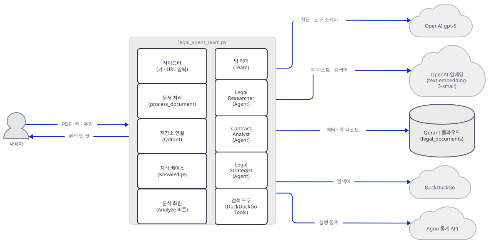

## 요청 한 건이 흐르는 과정

문서가 이미 올라간 뒤 사용자가 "Contract Review"를 골라 Analyze를 누르면 팀 실행이 셋 일어납니다. 배우가 여덟 곳이고 메시지가 서른아홉 개라 한 그림에 넣으면 선이 서로 가로질러 읽히지 않아, 모델 호출과 검색 경계에서 열네 그림으로 나눴고 메시지는 모두 원래 순서로 정확히 한 그림에 있습니다. 첫 그림을 뺀 열세 장은 `extra-` 이름입니다. 이 시퀀스는 Step 6의 가짜 서버 대본(멤버는 Contract Analyst 하나)으로 돌려 본 것이라 진짜 모델의 위임 순서는 확인하지 못했습니다. 핵심 요약과 권고에서 리더가 지식 검색을 하지 않은 것도 대본의 선택입니다. 문서 올리기 쪽 흐름은 Step 3에 그림 일곱으로 있습니다.

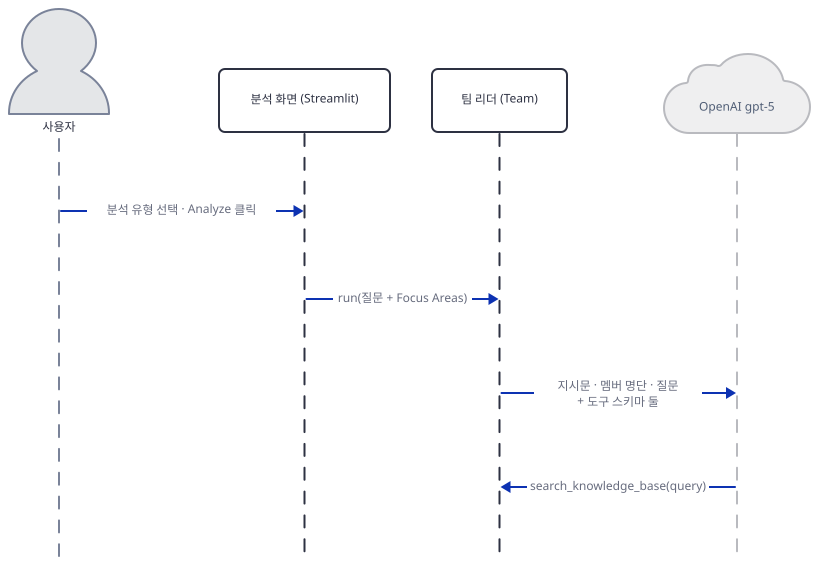

사용자가 분석 유형을 고르고(이때 화면은 다시 그려지지만 팀은 부르지 않습니다) Analyze를 누르면 화면이 질문과 `Focus Areas`를 만들어 팀의 `run`을 부르고, 리더는 지시문·멤버 명단·질문과 도구 스키마 둘을 모델에 보내 `search_knowledge_base`를 요청받습니다.

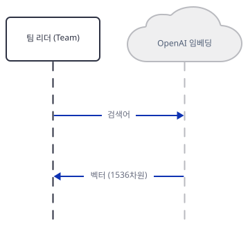

검색어가 임베딩 서버로 가 1536차원 벡터가 돌아옵니다.

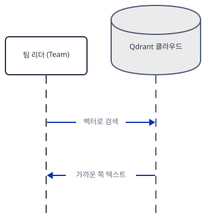

벡터로 Qdrant를 검색해 가까운 쪽 텍스트를 받습니다.

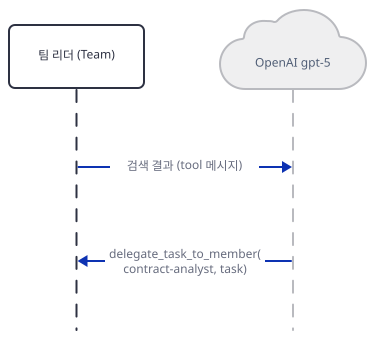

검색 결과가 `tool` 메시지로 모델에 가고, 모델은 `delegate_task_to_member(contract-analyst, task)`를 돌려줍니다.

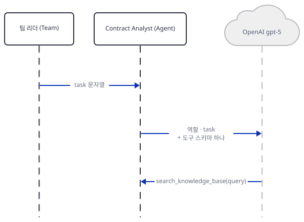

리더가 `task` 문자열만 넘깁니다. 멤버는 역할과 `task`, 도구 스키마 하나를 모델에 보내 자기 검색을 요청받습니다.

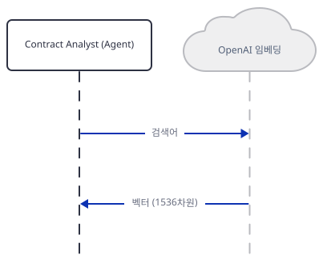

멤버도 같은 임베딩 서버로 검색어를 보냅니다.

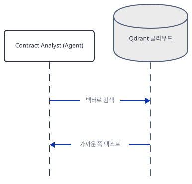

같은 컬렉션을 검색해 쪽 텍스트를 받습니다.

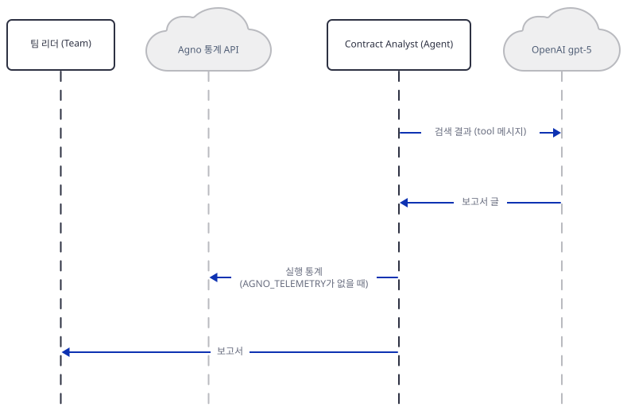

검색 결과로 모델이 보고서를 쓰고, `AGNO_TELEMETRY`가 없으면 멤버의 실행 통계가 나가며, 보고서가 리더에게 돌아갑니다.

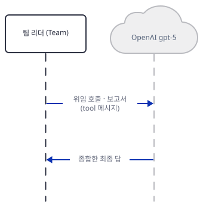

리더의 마지막 요청에는 위임 호출과 보고서가 쌓여 있고, 모델이 종합한 답이 돌아옵니다.

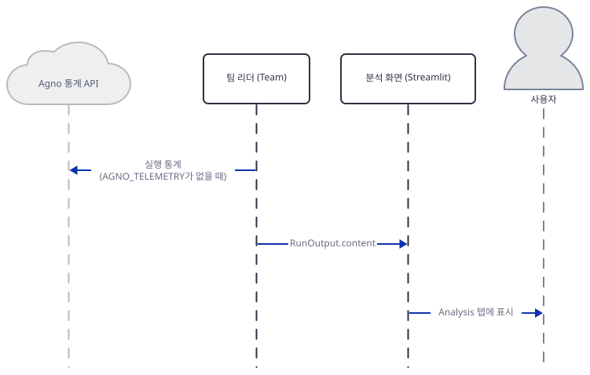

팀의 실행 통계가 나가고(환경변수가 없을 때), 결과가 "Analysis" 탭에 표시됩니다.

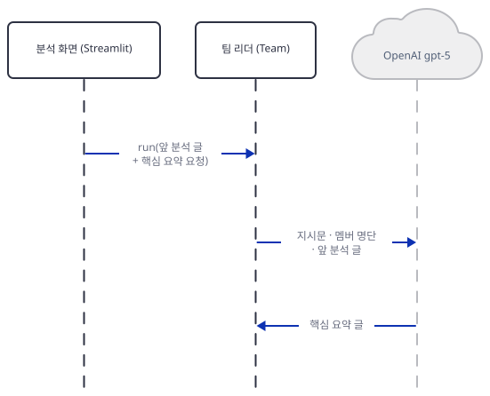

화면이 앞 분석 글을 붙인 새 질문으로 팀을 다시 실행합니다. 대화 기록은 없고 모델은 요약만 돌려줍니다.

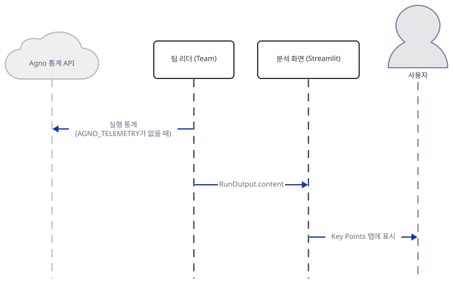

둘째 실행의 통계가 나가고 "Key Points" 탭이 채워집니다.

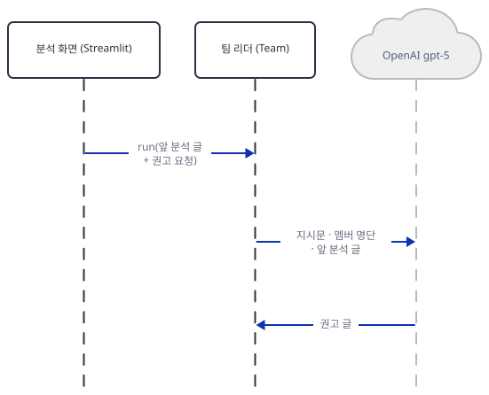

같은 방식의 셋째 실행입니다.

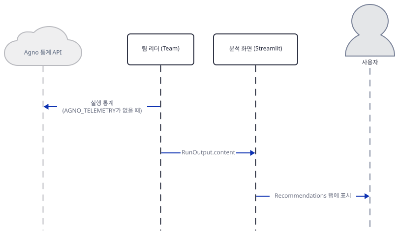

셋째 실행의 통계가 나가고 "Recommendations" 탭이 채워집니다. 이 과정에서 Qdrant에 쓰는 화살표는 없습니다. 쓰기는 문서를 올릴 때만 일어납니다.

## 실행 체크리스트

- [ ] `uv pip install -r requirements.txt` 뒤 `uv pip install ddgs`로 `agno.tools.duckduckgo`가 import된다
- [ ] 복사본에서 `knowledge_base.add_content(`를 `knowledge_base.insert(`로 고쳤다
- [ ] 아무도 듣지 않는 포트를 가리킨 `Qdrant(...)`가 만들어지고 `exists()`에서야 실패함을 봤다
- [ ] 가짜 서버와 `drive.py`로 PDF 두 쪽이 조각 둘로 저장되고 `name`이 임시 이름임을 봤다
- [ ] "Contract Review" 한 번에 모델 호출 일곱 번과 임베딩 넷(문서 둘, 검색 둘)이 찍혔다
- [ ] `accumulate.py`를 폴더 저장 모드로 두 번 돌려 조각이 2개에서 5개로 늘어남을 봤다
- [ ] 로컬판: `openai`·`pypdf`를 채우고 `model=`→`id=`, `add_content`→`insert`를 고치고 `ollama`를 올려 조각이 2개 저장됨을 봤다
- [ ] 실제 키로 돌릴 때: **새 터미널**(가짜 서버 주소를 건 변수가 없는 곳)에서 `uv run --no-project streamlit run legal_agent_team.py --server.headless true --server.address localhost --browser.gatherUsageStats false`로 띄우고 키·URL을 넣었다(이 문서는 하지 않음, 모델 호출과 Qdrant 쓰기가 일어난다)

앱을 띄우는 명령 자체는 아무것도 보내지 않지만, 브라우저로 열면 Streamlit 사용 통계가 나갑니다(Day 054가 확인했고 `--browser.gatherUsageStats false`로 끕니다). 직접 확인하니 `/_stcore/health`가 `ok`를 돌려줬고, 터미널에는 `Uvicorn server started on localhost:...`가 찍혔습니다. `~/.streamlit/credentials.toml`이 없을 때만 `Collecting usage statistics` 줄이 함께 나옵니다.

## 문제 해결

| 증상 | 원인 | 해결 |
|---|---|---|
| 앱을 열자마자 ``ImportError: `ddgs` not installed`` | agno의 검색 도구는 `ddgs`를 import하는데 `requirements.txt`는 `duckduckgo-search`만 적었다 | `uv pip install ddgs`(Step 1) |
| 문서를 올리면 빨간 오류 셋, `'Knowledge' object has no attribute 'add_content'` | agno 3.0 이후 `add_content`가 없고 `insert`가 같은 일을 한다 | 85행을 `knowledge_base.insert(path=temp_file_path)`로, 또는 `agno<3`으로 고정(Step 3) |
| 처리에 실패한 뒤에도 임시 폴더에 올린 PDF의 사본이 남아 있다 | 지우는 줄이 성공 경로에만 있다 | 임시 폴더의 `tmp*.pdf`를 직접 지운다(Step 3) |
| "Successfully connected to Qdrant!"가 떴는데 문서를 올리면 연결 거부 오류가 난다 | 성공 메시지는 객체 생성 뒤에 뜨고 접속은 첫 호출 때 한다 | URL·포트·키를 먼저 확인한다. URL에 포트가 없으면 `qdrant-client` 1.19.1이 6333을 쓴다(소스로 확인, Step 2) |
| Qdrant 키를 비워 두면 업로드 위젯이 안 나온다 | `init_qdrant`가 키와 URL이 모두 있어야 객체를 만든다 | 키 칸에 값을 넣는다. 키가 필요 없는 로컬 서버라면 아무 값이나 넣으면 열릴 것으로 보이나 확인하지 않았다. 로컬 저장소를 쓰려면 로컬판(Step 8) |
| "Contract Review"를 골랐는데도 다른 멤버가 일한다 | 분석 유형은 질문 글의 `Focus Areas`일 뿐 팀 구성을 바꾸지 않는다 | 멤버를 제한하려면 `Team(members=...)`를 유형별로 만든다(더 해보기) |
| 같은 계약서를 다시 올렸더니 같은 문장이 중복으로 나오고, 인용한 문서 이름이 `tmp…pdf`다 | 임시 파일 경로가 해시에 들어가 같은 문서로 인식되지 않고, 저장된 `name`이 임시 이름이다. `name=`과 `skip_if_exists=True`만 줘서는 조각이 줄지 않는다 | 올리기 전에 컬렉션을 비운다(Step 7) |
| 지식 검색이 다른 문서의 문장을 인용한다 | 컬렉션 하나에 모든 문서가 들어가고 검색에 문서 필터가 없다 | 문서마다 컬렉션 이름을 바꾸거나 `metadata`로 거른다(더 해보기) |
| 로컬판: "Failed to connect to Qdrant: OllamaEmbedder.__init__() got an unexpected keyword argument 'model'" | 25행의 `model=`가 틀렸다. 필드 이름은 `id` | `OllamaEmbedder(id="openhermes")`(Step 8) |
| 로컬판: ``ImportError: `openai` not installed``, ``pypdf not installed`` | 로컬판 `requirements.txt`에 둘이 없다 | `uv pip install openai pypdf` |
| 로컬판: "✅ Document processed"인데 분석이 문서를 못 찾는다. 로그에 ``Client.embed() got an unexpected keyword argument 'dimensions'`` | `ollama==0.4.4`에 `dimensions`가 없다. agno는 오류를 로그로만 남기고 계속한다 | `uv pip install -U ollama`(Step 8) |
| 로컬판: 버튼을 누를 때마다 느려지고 같은 조각이 쌓인다 | 문서 처리가 화면이 다시 그려질 때마다 돈다 | `st.session_state`에 처리한 파일 이름을 두는 클라우드판의 방식으로 감싼다(더 해보기) |
| `fake_server.py`가 `PermissionError: [WinError 10013] ...`로 죽는다. 서버가 죽은 채 `drive.py`를 돌리면 오류 없이 세 탭에 `Connection error.`만 나온다 | 고른 포트가 Windows의 TCP 제외 범위에 들어 있다(이 PC의 제외 범위 `58726-58825`에 든 포트로 서버를 띄워 재현했습니다. 범위는 PC마다 다릅니다) | 다른 포트를 고른다. 가짜 서버의 첫 줄 `가짜 모델 서버: 127.0.0.1:포트`가 찍혔는지 먼저 본다 |
| `\| grep "^>>"`가 `Binary file (standard input) matches`만 내거나 `drive.py`가 ``UnicodeEncodeError: 'cp949' codec can't encode character '\U0001f916'``로 죽는다 | 한국어 Windows에서 파이프 출력의 기본 인코딩이 `cp949`다 | 사전 준비의 `PYTHONIOENCODING=utf-8`을 건다 |
| 머리말의 ⚠: 나중에 `gpt-5` 호출이 모델 없음으로 실패한다 | `gpt-5-2025-08-07` 스냅숏이 2026-12-11에 종료된다 | 네 곳의 `OpenAIChat(id="gpt-5")`를 다른 모델로 바꾼다 |

## 더 해보기

- `advanced_ai_agents/multi_agent_apps/agent_teams/ai_legal_agent_team/legal_agent_team.py:214-229`의 `Team(...)`을 분석 유형마다 `analysis_configs`의 `agents`에 든 멤버만으로 만들도록 바꾸고, Step 6의 가짜 서버 로그에서 리더 시스템 메시지의 `<member id=` 개수가 1로 줄어드는지 세어 보세요. 위임 대본(`Focus Areas`)은 그대로 둬도 됩니다.
- `advanced_ai_agents/multi_agent_apps/agent_teams/ai_legal_agent_team/legal_agent_team.py:77-85`의 `Knowledge.insert` 호출에 이름만 줘서는 중복이 줄지 않습니다(Step 7). 해시에 임시 경로가 들어가기 때문입니다. 임시 경로 대신 고정된 경로를 쓰거나, PDF 바이트의 해시를 직접 계산해 이미 저장된 문서면 `insert`를 건너뛰는 방법을 설계하고 Step 7을 다시 돌려 조각이 늘지 않는지 확인해 보세요.
- `advanced_ai_agents/multi_agent_apps/agent_teams/ai_legal_agent_team/local_ai_legal_agent_team/local_legal_agent.py:70-74`의 `if uploaded_file:` 블록을 클라우드판의 `processed_files` 방식(`advanced_ai_agents/multi_agent_apps/agent_teams/ai_legal_agent_team/legal_agent_team.py:156-165`)으로 감싸 상호작용마다 조각이 6개로 늘던 것이 2개에 머무는지 `drive_local.py`로 확인해 보세요.

## 다음 날 예고

[Day 122 · 🎨 🍌 Multimodal UI/UX Feedback Agent Team](../day122-multimodal-uiux-feedback-agent-team/README.md) — 오늘과 달리 agno가 아니라 `google-adk`를 쓰고(`agent.py`·`tools.py`의 import로 확인), 모델은 `gemini-2.5-flash`이며 이미지 편집 도구는 `gemini-2.5-flash-image`를 부릅니다. `LlmAgent` 여럿을 `SequentialAgent`로 이어 붙이는 구조입니다.
