# Day 122 · 🎨 🍌 Multimodal UI/UX Feedback Agent Team

> 볼륨 8 🤝 Multi-agent Teams · 난이도 ★★★ ⚠ 이미지 모델 `gemini-2.5-flash-image`의 종료일을 Google 공식 문서 두 쪽이 다르게 적습니다(2026-10-02와 2027-03-15, 아래 사전 준비) · 예상 소요 100분(앱은 세 파일 834줄이지만 가짜 Gemini 서버와 요청 스크립트를 직접 저장하고, `adk web`을 고치기 전과 후로 두 번 띄워 요청을 여러 번 보내 봐야 해서 읽는 시간보다 손으로 돌려 보는 시간이 큽니다) · API 비용 대략 분석 한 건에 $0.05~0.1(⚠ 추정입니다. 이 문서는 Gemini를 한 번도 부르지 않았고 토큰을 재지 못했습니다. 모델 호출은 가짜 서버로 셌고 분석 한 건은 검색이 없으면 7번, 검색을 한 번 부르면 9번입니다. 검색이 없는 경우 글 호출 5번의 입력은 지시문 글자 수를 4로 나눠 어림해 1.5만~2.5만 토큰, 출력은 3천 토큰 안팎으로 보면 $0.3/백만과 $2.5/백만 요금표로 1센트 안팎이고, 나머지는 이미지 한 장의 출력 $0.039 입니다) · 원본 앱: `advanced_ai_agents/multi_agent_apps/agent_teams/multimodal_uiux_feedback_agent_team`

## 오늘 만들 것

랜딩 페이지 스크린샷을 올리면 에이전트 팀이 화면을 읽고 UI/UX 비평을 쓰고, 개선 계획을 세우고, 개선된 시안 이미지를 PNG 파일로 만들어 주는 Google ADK 앱입니다. 코디네이터가 요청을 셋으로 가릅니다. 인사와 질문은 안내 에이전트(`InfoAgent`), 만들어 둔 시안을 고치라는 요청은 편집 에이전트(`DesignEditor`), 새 스크린샷은 세 에이전트가 차례로 일하는 분석 파이프라인(`AnalysisPipeline`: `UICritic` → `DesignStrategist` → `VisualImplementer`)입니다. 앱은 `__init__.py`(9줄), `agent.py`(463줄), `tools.py`(362줄) 셋이고 줄 수는 `wc -l`입니다. 코디네이터가 가르고 `SequentialAgent`가 잇는 구성은 Day 095(AI Home Renovation Agent)가 같은 모양으로 다뤘고, `transfer_to_agent`로 넘기는 방식은 Day 021이, `SequentialAgent`는 Day 022가 다뤘습니다. 오늘은 그 틀 위에서 **이미지를 만드는 도구가 실제로 이미지를 만드는지**를 따라갑니다.

이 문서는 Gemini에 요청을 한 번도 보내지 않았고, `google_search`도 부르지 않았습니다. 모델은 내 PC의 가짜 서버(대본)로 대신했기 때문에 아래의 분석 글과 이미지는 모두 내가 쓴 대본이고, 진짜 Gemini가 도구 인자를 어떻게 채우는지, 진짜 이미지가 어떻게 나오는지는 확인하지 못했습니다. 그래도 도구가 호출되는 순간부터 파일이 저장되는 곳까지는 ADK가 진짜로 돌았으므로, 코드의 문제는 그대로 드러납니다. 직접 돌려 보고 알게 된 것이 여섯입니다.

1. 이미지를 만드는 두 도구는 첫 줄에서 항상 실패합니다. ADK가 인자를 Pydantic 모델로 바꿔 넘기는데 도구가 다시 `**inputs`로 풀어서(`tools.py:99`, `tools.py:233`) `argument after ** must be a mapping`이 납니다. 설치된 2.11.0과 옛 1.17.0 두 버전에서 같았습니다(Step 5).
2. 이 오류는 예외가 아니라 문자열로 돌아가고, 이미지 모델 요청은 한 번도 나가지 않습니다(Step 5).
3. 한 줄씩 고치면 PNG가 `adk web`의 아티팩트 폴더에 저장됩니다. 그 폴더는 앱 폴더 안의 `.adk/`이고, `git`이 무시하는 것은 `session.db`뿐이라 PNG는 추적 대상으로 뜹니다(Step 6).
4. 올린 스크린샷은 아티팩트로 저장되지 않아서 `reference_image`를 도구가 읽어도 못 찾고, 이미지 생성 요청에는 원본이 실리지 않습니다(Step 6).
5. 같은 스크린샷은 에이전트의 글 호출마다 다시 실립니다. 검색을 부르는 요청에서는 여섯 번입니다(Step 6).
6. 편집을 두 번 하면 버전 번호가 오르지 않고 같은 파일이 덮어써집니다(Step 7).

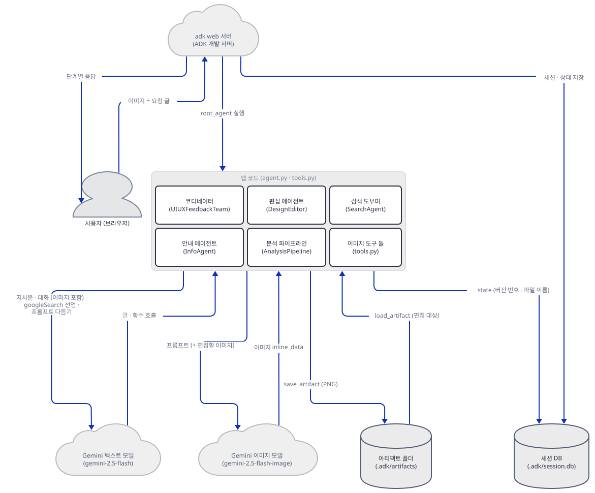

## 사전 준비

| 서비스/도구 | 용도 | 발급·설치 |
|---|---|---|
| uv | 가상환경 생성과 패키지 설치 | [공통 사전 준비](../README.md#공통-사전-준비-한-번만) 절 참고 |
| Python | 이 문서는 3.13.3으로 확인했다. 저장소 기준은 3.11~3.13 | 공통 사전 준비와 같음 |
| Gemini API 키 (`GOOGLE_API_KEY` 또는 `GEMINI_API_KEY`) | 일곱 에이전트의 `gemini-2.5-flash`와 두 도구의 `gemini-2.5-flash-image` 호출. 도구는 둘 중 하나가 없으면 바로 `ValueError`를 낸다(`advanced_ai_agents/multi_agent_apps/agent_teams/multimodal_uiux_feedback_agent_team/tools.py:92-93`, `advanced_ai_agents/multi_agent_apps/agent_teams/multimodal_uiux_feedback_agent_team/tools.py:226-227`). 이 문서는 가짜 키로 진행한다 | https://aistudio.google.com/apikey |
| 인터넷 연결 | PyPI 설치. 앱을 실제로 쓸 때는 `generativelanguage.googleapis.com`에 접속한다 | 별도 설치 없음 |

⚠ **모델 종료.** Google 공식 폐기 문서(https://ai.google.dev/gemini-api/docs/deprecations, 2026-10-10 확인)는 `gemini-2.5-flash`에 종료일이 없다고 적되, 2.5 모델 접근을 "과거에 실제로 써 본 사용자"로 제한한다는 문구가 있습니다. 이미지 모델 `gemini-2.5-flash-image`의 표에는 종료일 2027-03-15와 대체 모델 `gemini-3.1-flash-lite-image`가 적혀 있습니다. 그런데 요금 문서(https://ai.google.dev/gemini-api/docs/pricing, 같은 날 확인)의 같은 모델 절은 "2026-10-02에 종료된다"고 경고합니다. 폐기 문서의 표가 말하는 종료일은 "가장 이른 가능 날짜"입니다. 두 쪽이 어긋나는데 어느 쪽이 맞는지는 확인하지 못했습니다. 오늘이 2026-10-10이니 요금 문서가 맞다면 이미 끝났습니다. 두 문서 모두 2026-10-10에 `curl`로 받은 원문에서 해당 문구를 직접 찾아 확인했습니다. 이 문서의 가짜 서버 실습은 영향을 받지 않지만, 진짜 키로 이미지가 안 만들어지면 먼저 모델 ID를 의심하세요(문제 해결).

이 문서의 스크립트는 한글을 출력합니다. 한국어 Windows에서 출력을 파이프나 파일로 받으면 기본 인코딩이 모자랄 수 있으니 셸을 먼저 이렇게 맞춰 두세요(실행 환경에서 `PYTHONIOENCODING=utf-8`을 걸고 돌렸습니다).

```bash
export PYTHONIOENCODING=utf-8
```

```powershell
$env:PYTHONIOENCODING = "utf-8"
```

## 아키텍처 한눈에 보기

| 컴포넌트 | 역할 | 코드 위치 |
|---|---|---|
| 사용자 (브라우저) | 스크린샷과 요청 글을 올린다 | 코드 없음 |
| `adk web` 서버 | `agent_teams` 폴더를 열어 앱을 불러오고, 세션·아티팩트를 `.adk/`에 저장하고, `/run`으로 요청을 받는다 | 코드 없음 (google-adk 2.11.0 CLI, 직접 확인) |
| 코디네이터 (`root_agent`) | 요청을 `transfer_to_agent`로 셋 중 하나에 넘긴다 | `advanced_ai_agents/multi_agent_apps/agent_teams/multimodal_uiux_feedback_agent_team/agent.py:414-458` |
| 안내 에이전트 (`info_agent`) | 인사·일반 질문에 두세 문장으로 답한다 | `advanced_ai_agents/multi_agent_apps/agent_teams/multimodal_uiux_feedback_agent_team/agent.py:27-47` |
| 편집 에이전트 (`design_editor`) | 만든 시안을 `edit_landing_page_image`로 고친다 | `advanced_ai_agents/multi_agent_apps/agent_teams/multimodal_uiux_feedback_agent_team/agent.py:54-93` |
| 분석 파이프라인 (`analysis_pipeline`) | `ui_critic`, `design_strategist`, `visual_implementer`를 목록 순서로 실행한다 | `advanced_ai_agents/multi_agent_apps/agent_teams/multimodal_uiux_feedback_agent_team/agent.py:100-214`, `advanced_ai_agents/multi_agent_apps/agent_teams/multimodal_uiux_feedback_agent_team/agent.py:217-293`, `advanced_ai_agents/multi_agent_apps/agent_teams/multimodal_uiux_feedback_agent_team/agent.py:296-407` |
| 검색 도우미 (`search_agent`) | `google_search`만 가진 에이전트. 비평가와 전략가가 `AgentTool`로 부른다 | `advanced_ai_agents/multi_agent_apps/agent_teams/multimodal_uiux_feedback_agent_team/agent.py:14-20` |
| 이미지 도구 둘 | `edit_landing_page_image`(시안 편집), `generate_improved_landing_page`(개선 시안 생성) | `advanced_ai_agents/multi_agent_apps/agent_teams/multimodal_uiux_feedback_agent_team/tools.py:85-212`, `advanced_ai_agents/multi_agent_apps/agent_teams/multimodal_uiux_feedback_agent_team/tools.py:219-355` |
| 버전 도우미 셋 | 자산 이름별 버전 번호와 파일 이름을 세션 상태에 적는다 | `advanced_ai_agents/multi_agent_apps/agent_teams/multimodal_uiux_feedback_agent_team/tools.py:18-39` |
| Gemini 텍스트 모델 | 일곱 에이전트와 프롬프트 다듬기 (`gemini-2.5-flash`) | `advanced_ai_agents/multi_agent_apps/agent_teams/multimodal_uiux_feedback_agent_team/agent.py:16`, `advanced_ai_agents/multi_agent_apps/agent_teams/multimodal_uiux_feedback_agent_team/agent.py:29`, `advanced_ai_agents/multi_agent_apps/agent_teams/multimodal_uiux_feedback_agent_team/agent.py:56`, `advanced_ai_agents/multi_agent_apps/agent_teams/multimodal_uiux_feedback_agent_team/agent.py:102`, `advanced_ai_agents/multi_agent_apps/agent_teams/multimodal_uiux_feedback_agent_team/agent.py:219`, `advanced_ai_agents/multi_agent_apps/agent_teams/multimodal_uiux_feedback_agent_team/agent.py:298`, `advanced_ai_agents/multi_agent_apps/agent_teams/multimodal_uiux_feedback_agent_team/agent.py:416`, `advanced_ai_agents/multi_agent_apps/agent_teams/multimodal_uiux_feedback_agent_team/tools.py:281` |
| Gemini 이미지 모델 | 두 도구가 이미지를 받는 모델 (`gemini-2.5-flash-image`) | `advanced_ai_agents/multi_agent_apps/agent_teams/multimodal_uiux_feedback_agent_team/tools.py:111`, `advanced_ai_agents/multi_agent_apps/agent_teams/multimodal_uiux_feedback_agent_team/tools.py:287` |
| 세션 DB · 아티팩트 폴더 | `.adk/session.db`, `.adk/artifacts/` (앱 폴더 안) | 코드 없음 (google-adk, 직접 확인) |

첫 그림은 앱 코드를 한 묶음에 두고 묶음 안의 호출은 뺐습니다. 화살표는 라벨에 적은 데이터가 가는 방향입니다. 앱 안의 호출은 아래 그림에 화살표로 그렸습니다. 파이프라인이 세 에이전트를 번호 순서로 부르는 호출은 이 그림에 넣지 않았고 아래 요청 시퀀스(`sequence`, `extra-plan`)가 `AnalysisPipeline` 배우로 그립니다.

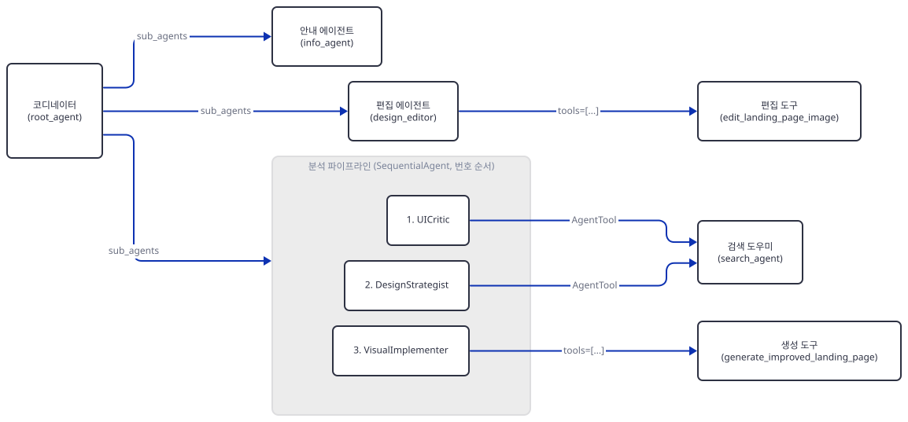

## 단계별 진행

### Step 1. 환경 만들기

**목적.** 저장소 밖에 작업 폴더를 만들고 앱 폴더를 복사해 독립 가상환경에 설치합니다. 복사해 쓰는 까닭은 `adk web`이 앱 폴더 안에 `.adk/`를 만들기 때문입니다(Step 5).

**할 일.** 저장소 루트에서 시작합니다. `adk web`은 폴더 안의 하위 폴더를 앱으로 읽으니 `agent_teams`라는 이름의 폴더를 한 번 더 둡니다.

```bash
mkdir -p ../uiux-lab/agent_teams
cp -r advanced_ai_agents/multi_agent_apps/agent_teams/multimodal_uiux_feedback_agent_team ../uiux-lab/agent_teams/
cd ../uiux-lab
uv venv --python 3.13
uv pip install -r agent_teams/multimodal_uiux_feedback_agent_team/requirements.txt
```

```powershell
New-Item -ItemType Directory -Force ..\uiux-lab\agent_teams
Copy-Item -Recurse advanced_ai_agents\multi_agent_apps\agent_teams\multimodal_uiux_feedback_agent_team ..\uiux-lab\agent_teams\
Set-Location ..\uiux-lab
uv venv --python 3.13
uv pip install -r agent_teams\multimodal_uiux_feedback_agent_team\requirements.txt
```

(PowerShell 줄은 실행해 보지 못했습니다. pip 대안은 `python -m venv .venv`로 만들고 활성화한 뒤 `pip install -r …/requirements.txt`입니다.) 이후 `uv run`에는 모두 `--no-project`를 붙입니다. 이유는 [공통 사전 준비](../README.md#공통-사전-준비-한-번만)에 있습니다.

`advanced_ai_agents/multi_agent_apps/agent_teams/multimodal_uiux_feedback_agent_team/requirements.txt:1-3`

```text
google-adk
python-dotenv
pydantic
```

세 줄 모두 버전이 없어서 오늘 풀리는 버전이 곧 내 환경입니다. 앱은 `tools.py:9`에서 `load_dotenv()`를 부르는데, 이 함수는 호출한 파일 위쪽 폴더로 `.env`를 찾아 올라갑니다. 작업 폴더와 그 위쪽에 `.env`가 없는지 한 번 보세요.

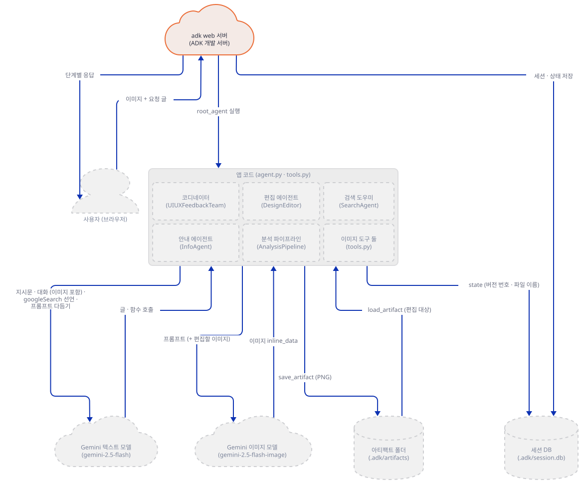

**확인.** 설치된 버전과 `adk` 명령을 봅니다.

```bash
uv run --no-project python -c "import importlib.metadata as m; print('google-adk', m.version('google-adk')); print('google-genai', m.version('google-genai'))"
uv run --no-project adk --version
```

기대 출력(오늘 기준):

```text
google-adk 2.11.0
google-genai 2.29.0
adk, version 2.11.0
```

### Step 2. 팀 구조 읽기 (`agent.py`)

**목적.** 키 없이 앱을 불러와 에이전트 트리를 찍어 보고, 코디네이터가 무엇을 아이로 갖는지 확인합니다.

**할 일.** `tree.py`로 저장하고 돌립니다. 앱은 키가 없어도 import됩니다. 도구가 키를 확인하는 것은 호출될 때입니다.

```python
import sys
sys.path.insert(0, "agent_teams")
from multimodal_uiux_feedback_agent_team import root_agent


def walk(agent, depth=0):
    tools = [getattr(t, "name", None) or t.__name__ for t in (getattr(agent, "tools", None) or [])]
    print("  " * depth + f"{type(agent).__name__} {agent.name} model={getattr(agent, 'model', None)} tools={tools}")
    for sub in agent.sub_agents:
        walk(sub, depth + 1)


walk(root_agent)
```

코디네이터의 아이와 파이프라인 정의는 이렇습니다.

`advanced_ai_agents/multi_agent_apps/agent_teams/multimodal_uiux_feedback_agent_team/agent.py:399-407`

```python
analysis_pipeline = SequentialAgent(
    name="AnalysisPipeline",
    description="Full UI/UX analysis pipeline: Image Analysis → Design Strategy → Visual Implementation",
    sub_agents=[
        ui_critic,
        design_strategist,
        visual_implementer,
    ],
)
```

`advanced_ai_agents/multi_agent_apps/agent_teams/multimodal_uiux_feedback_agent_team/agent.py:453-458`

```python
    sub_agents=[
        info_agent,
        design_editor,
        analysis_pipeline,
    ],
)
```

코디네이터의 지시문(`agent.py:418-452`)은 이미지가 보이면 무조건 `AnalysisPipeline`으로 넘기라고 합니다. `transfer_to_agent`는 앱이 쓰지 않았고 ADK가 부모-자식 관계를 보고 자동으로 더하는 도구입니다(Day 021이 확인한 규칙). 어느 에이전트의 요청에 실제로 붙는지는 Step 6의 가짜 서버 로그에서 봅니다. 파이프라인은 목록 순서로 일합니다.

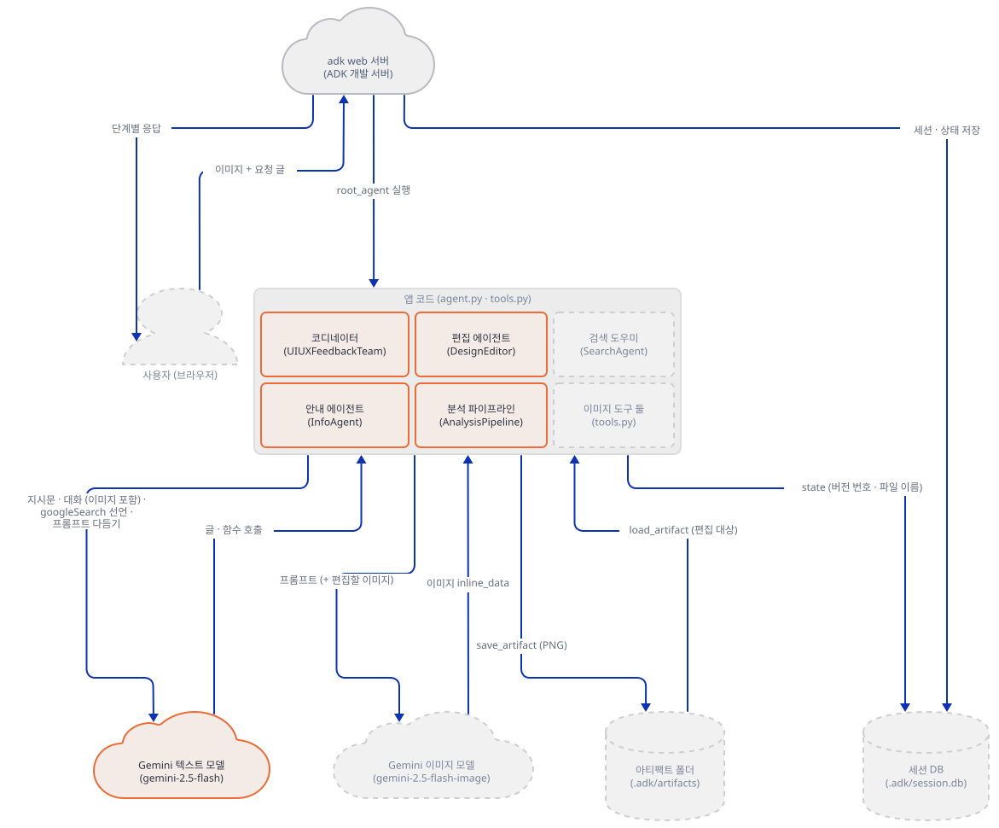

**확인.**

```bash
uv run --no-project python tree.py
```

기대 출력:

```text
LlmAgent UIUXFeedbackTeam model=gemini-2.5-flash tools=[]
  LlmAgent InfoAgent model=gemini-2.5-flash tools=[]
  LlmAgent DesignEditor model=gemini-2.5-flash tools=['edit_landing_page_image']
  SequentialAgent AnalysisPipeline model=None tools=[]
    LlmAgent UICritic model=gemini-2.5-flash tools=['SearchAgent']
    LlmAgent DesignStrategist model=gemini-2.5-flash tools=['SearchAgent']
    LlmAgent VisualImplementer model=gemini-2.5-flash tools=['generate_improved_landing_page']
```

`SequentialAgent`는 모델이 없는 순서 에이전트입니다. 파이썬을 `-W default`로 돌리면 `agent.py:399`에서 `SequentialAgent is deprecated in favor of Workflow and will be removed in a future version. Workflow cannot yet be used as an LlmAgent sub-agent.`라는 경고가 나옵니다(Day 022가 2.9.2에서 본 것과 같은 경고입니다). 후속 `Workflow`를 `LlmAgent`의 하위 에이전트로 쓰지 못한다고 하니 지금 구조를 바로 옮길 수는 없습니다.

### Step 3. 검색 도우미

**목적.** 비평가와 전략가가 쓰는 `google_search`가 어떤 모양으로 붙는지 확인합니다.

**할 일.** `google_search`는 Gemini에 내장된 검색 도구입니다. 이런 내장 도구를 가진 에이전트를 다른 에이전트의 도구로 쓰려면 `AgentTool`로 감쌉니다.

`advanced_ai_agents/multi_agent_apps/agent_teams/multimodal_uiux_feedback_agent_team/agent.py:14-20`

```python
search_agent = LlmAgent(
    name="SearchAgent",
    model="gemini-2.5-flash",
    description="Searches for UI/UX best practices, design trends, and accessibility guidelines",
    instruction="Use google_search to find current UI/UX trends, design principles, WCAG guidelines, and industry best practices. Be concise and cite authoritative sources.",
    tools=[google_search],
)
```

비평가와 전략가는 같은 `search_agent` 하나를 `tools=[AgentTool(search_agent)]`로 씁니다(`agent.py:213`, `agent.py:292`). 검색 호출은 지시문이 강제하지 않으니 모델이 필요하다고 판단할 때만 일어납니다. 검색은 Google 서버 쪽에서 돌고, 이 앱은 요청에 내장 도구 선언만 싣습니다(Step 5의 요청에는 `research`라는 낱말을 넣었습니다. 가짜 대본은 대화에 이 낱말이 있을 때만 비평가가 검색 도우미를 부르게 짰고, 가짜 서버 출력에 `SearchAgent … ['googleSearch']` 줄이 찍힙니다).

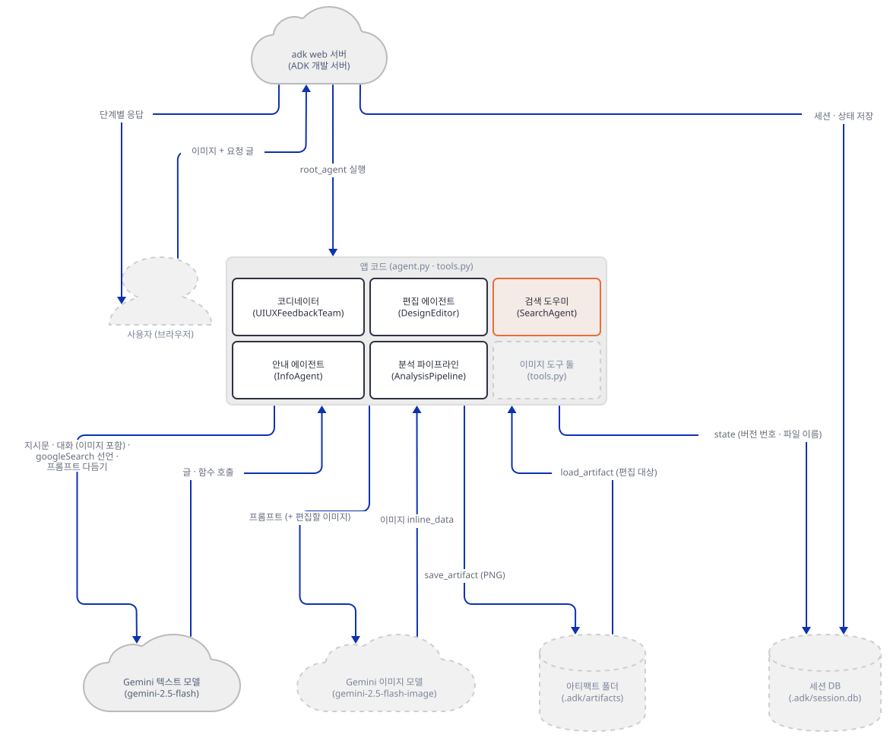

**확인.** `step3.py`로 저장하고 돌립니다.

```python
import sys
sys.path.insert(0, "agent_teams")
from multimodal_uiux_feedback_agent_team.agent import search_agent, ui_critic, design_strategist

print("search_agent.tools:", [getattr(t, "name", None) or type(t).__name__ for t in search_agent.tools])
for a in (ui_critic, design_strategist):
    t = a.tools[0]
    print(a.name, "->", type(t).__name__, "wraps", t.agent.name, "| same object:", t.agent is search_agent)
```

```bash
uv run --no-project python step3.py
```

기대 출력:

```text
search_agent.tools: ['google_search']
UICritic -> AgentTool wraps SearchAgent | same object: True
DesignStrategist -> AgentTool wraps SearchAgent | same object: True
```

### Step 4. 이미지 도구 읽기 (`tools.py`)

**목적.** 두 도구가 무엇을 받고, 어떤 모델을 부르고, 결과를 어디에 적는지 읽습니다.

**할 일.** 도구는 인자를 낱개로 받지 않고 Pydantic 모델 하나(`inputs`)로 받습니다(Day 095 Step 6이 같은 방식의 도구를 다뤘습니다). 편집 도구의 앞부분은 이렇습니다.

`advanced_ai_agents/multi_agent_apps/agent_teams/multimodal_uiux_feedback_agent_team/tools.py:92-99`

```python
    if "GEMINI_API_KEY" not in os.environ and "GOOGLE_API_KEY" not in os.environ:
        raise ValueError("GEMINI_API_KEY or GOOGLE_API_KEY environment variable not set.")

    logger.info("Starting landing page image editing")

    try:
        client = genai.Client()
        inputs = EditLandingPageInput(**inputs)
```

키 확인은 `try` 밖이라 키가 없으면 문자열이 아니라 예외가 나갑니다. 도구는 `genai.Client()`를 인자 없이 만듭니다. 그래서 키와 주소를 환경변수(`GOOGLE_API_KEY`, `GOOGLE_GEMINI_BASE_URL`)로 받는데, 뒤의 변수는 google-genai의 `_base_url.py`가 읽는 것을 소스로 확인했고 Step 5가 이것으로 가짜 서버를 겁니다. 이미지 모델 ID는 `tools.py:111`과 `tools.py:287`의 `"gemini-2.5-flash-image"`이고, 요청 설정은 이미지와 글을 모두 받겠다는 `response_modalities=["IMAGE", "TEXT"]`입니다(`tools.py:139-144`). 생성 도구는 이미지 요청 앞에 `gemini-2.5-flash`로 프롬프트를 한 번 다듬습니다(`tools.py:280-285`). 앱 README는 시각 구현 에이전트가 "Gemini 2.5 Flash"로 이미지를 만든다고 하지만, 이미지는 `gemini-2.5-flash-image`가 만듭니다.

생성 도구는 프롬프트에 `tool_context.state.get("latest_analysis", "")`(`tools.py:247`)를 넣고 전략가 지시문도 "Read from state: latest_analysis"(`agent.py:222`)라고 하지만, `agent.py`에는 `output_key=`가 한 줄도 없고(검색으로 확인) 이 키를 쓰는 곳도 없습니다. 그래서 다듬기 프롬프트에는 늘 "No previous analysis available"(`tools.py:256`)이 들어갑니다. Day 095도 같은 모양의 "Read from state"를 문제 해결에 적었습니다.

결과는 버전 번호가 붙은 파일 이름으로 아티팩트에 저장하고(`save_artifact`), 번호와 이름을 세션 상태에 적습니다.

`advanced_ai_agents/multi_agent_apps/agent_teams/multimodal_uiux_feedback_agent_team/tools.py:26-34`

```python
def update_asset_version(tool_context: ToolContext, asset_name: str, version: int, filename: str) -> None:
    """Update the version tracking for an asset."""
    if "asset_versions" not in tool_context.state:
        tool_context.state["asset_versions"] = {}
    if "asset_filenames" not in tool_context.state:
        tool_context.state["asset_filenames"] = {}

    tool_context.state["asset_versions"][asset_name] = version
    tool_context.state["asset_filenames"][asset_name] = filename
```

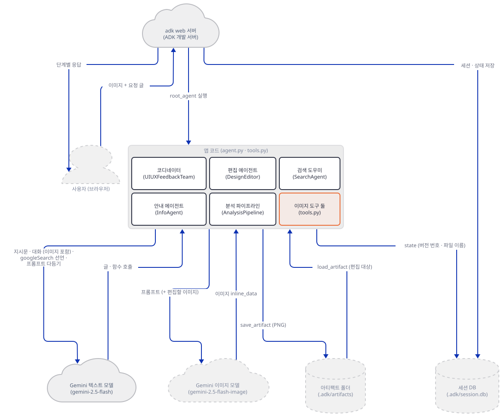

**확인.** `step4.py`로 저장하고, 키 없이 편집 도구를 ADK의 `FunctionTool`을 거쳐 부릅니다.

```python
import asyncio
import sys

sys.path.insert(0, "agent_teams")
from google.adk.tools import FunctionTool
from multimodal_uiux_feedback_agent_team.tools import edit_landing_page_image

tool = FunctionTool(edit_landing_page_image)
args = {"inputs": {"artifact_filename": "landing_page_improved_v1.png", "prompt": "make the CTA bigger"}}
try:
    print(asyncio.run(tool.run_async(args=args, tool_context=None)))
except Exception as e:
    print(type(e).__name__ + ":", e)
```

```bash
unset GOOGLE_API_KEY GEMINI_API_KEY
uv run --no-project python step4.py
```

```powershell
Remove-Item Env:GOOGLE_API_KEY, Env:GEMINI_API_KEY -ErrorAction SilentlyContinue
uv run --no-project python step4.py
```

기대 출력:

```text
ValueError: GEMINI_API_KEY or GOOGLE_API_KEY environment variable not set.
```

### Step 5. 가짜 Gemini와 `adk web`으로 분석 한 건 — 도구가 실패한다

**목적.** 진짜 Gemini 없이도 ADK 실행기가 앱을 끝까지 돌게 하고, 분석 요청 한 건이 이미지 도구에서 어떻게 되는지 봅니다.

**할 일.** 내 PC에서만 도는 가짜 Gemini와 요청 보내는 스크립트를 저장합니다. 가짜 서버는 시스템 지시문의 첫 문장으로 어느 에이전트의 호출인지 가려 대본을 돌려주고, 요청마다 한 줄을 찍습니다. 같은 포트가 이미 쓰이고 있으면 켜지 않고 실패하도록 `allow_reuse_address = False`로 두었습니다. 포트는 비어 있는 높은 번호면 됩니다(이 문서는 53417과 53418).

`fake_gemini.py`:

```python
"""내 PC에서만 도는 가짜 Gemini. 진짜 모델이 아니라 아래 대본을 돌려준다."""
import base64, json, struct, sys, zlib
from http.server import BaseHTTPRequestHandler, ThreadingHTTPServer

PORT = int(sys.argv[1])


def png(w, h, rgb):
    raw = b"".join(b"\x00" + bytes(rgb) * w for _ in range(h))
    def chunk(t, d):
        return struct.pack(">I", len(d)) + t + d + struct.pack(">I", zlib.crc32(t + d) & 0xFFFFFFFF)
    return (b"\x89PNG\r\n\x1a\n" + chunk(b"IHDR", struct.pack(">IIBBBBB", w, h, 8, 2, 0, 0, 0))
            + chunk(b"IDAT", zlib.compress(raw)) + chunk(b"IEND", b""))


IMAGE = base64.b64encode(png(64, 40, (255, 107, 53))).decode()
WHO = [("You are the Coordinator", "Coordinator"), ("You are the Info Agent", "InfoAgent"),
       ("You refine existing landing page designs", "DesignEditor"),
       ("You are a Senior UI/UX Designer", "UICritic"), ("You are a Design Strategist", "DesignStrategist"),
       ("Read conversation history to extract", "VisualImplementer"), ("Use google_search", "SearchAgent")]


def call(name, **args):
    return [{"functionCall": {"name": name, "args": args}}]


def script(agent, model, contents):
    text = json.dumps(contents)
    answered = any("functionResponse" in p for p in contents[-1].get("parts", []))
    if "image" in model:
        return [{"text": "(가짜 이미지 모델)"}, {"inlineData": {"mimeType": "image/png", "data": IMAGE}}]
    if agent == "?":  # 시스템 지시문이 없는 호출 = 생성 도구의 프롬프트 다듬기
        return [{"text": "다듬은 프롬프트(가짜): 주황 CTA #FF6B35"}]
    if agent == "Coordinator":
        last = [p["text"] for p in contents[-1]["parts"] if "text" in p]
        if "bigger" in " ".join(last):
            return call("transfer_to_agent", agent_name="DesignEditor")
        if "inlineData" in text:
            return call("transfer_to_agent", agent_name="AnalysisPipeline")
        return call("transfer_to_agent", agent_name="InfoAgent")
    if agent == "UICritic":
        if "research" in text and "functionResponse" not in text:
            return call("SearchAgent", request="WCAG AA 본문 대비")
        return [{"text": "분석(가짜). ANALYSIS COMPLETE"}]
    if agent == "SearchAgent":
        return [{"text": "WCAG AA는 본문 4.5:1 (가짜 검색 요약)"}]
    if agent == "DesignStrategist":
        return [{"text": "개선 계획(가짜). DESIGN PLAN COMPLETE"}]
    if agent == "VisualImplementer":
        if answered:
            return [{"text": "개선 요약(가짜)"}]
        return call("generate_improved_landing_page", inputs={
            "prompt": "주황 CTA #FF6B35, H1 48px", "aspect_ratio": "16:9",
            "asset_name": "landing_page_improved", "reference_image": "original_landing_page.png"})
    if agent == "DesignEditor":
        if answered:
            return [{"text": "CTA를 키웠습니다(가짜)"}]
        return call("edit_landing_page_image", inputs={
            "artifact_filename": "landing_page_improved_v1.png", "prompt": "CTA 버튼을 20% 키우기",
            "asset_name": "landing_page_improved"})
    return [{"text": "안녕하세요(가짜 InfoAgent)"}]


class Handler(BaseHTTPRequestHandler):
    def log_message(self, *a):
        pass

    def do_POST(self):
        body = json.loads(self.rfile.read(int(self.headers["content-length"])))
        model = self.path.split("/models/")[1].split(":")[0]
        stream = ":streamGenerateContent" in self.path
        system = " ".join(p.get("text", "") for p in (body.get("systemInstruction") or {}).get("parts", []))
        agent = next((n for k, n in WHO if k in system), "?")
        contents = body["contents"]
        parts = script(agent, model, contents)
        images = sum(1 for c in contents for p in c["parts"] if "inlineData" in p)
        tools = [d["name"] for t in body.get("tools", []) for d in t.get("functionDeclarations", [])]
        builtin = [k for t in body.get("tools", []) for k in t if k != "functionDeclarations"]
        print(f"{agent:17} {model:23} stream={stream!s:5} 이미지파트={images} 도구={tools}{builtin} -> "
              f"{[next(iter(p)) for p in parts]}", flush=True)
        reply = lambda ps: {"candidates": [{"content": {"role": "model", "parts": ps}, "finishReason": "STOP"}]}
        if stream:
            data = b"".join(b"data: " + json.dumps(reply([p])).encode() + b"\r\n\r\n" for p in parts)
        else:
            data = json.dumps(reply(parts)).encode()
        self.send_response(200)
        self.send_header("content-type", "text/event-stream" if stream else "application/json")
        self.send_header("content-length", str(len(data)))
        self.end_headers()
        self.wfile.write(data)


class Server(ThreadingHTTPServer):
    allow_reuse_address = False


print("가짜 Gemini:", PORT, flush=True)
Server(("127.0.0.1", PORT), Handler).serve_forever()
```

`client.py`(브라우저 화면이 보내는 것과 같은 모양의 메시지를 `/run`으로 보냅니다. 화면은 열어 보지 않았습니다. 인자는 포트, 세션 이름, 글, 그리고 `image`를 붙이면 1×1 PNG 한 장을 올린 것으로 칩니다):

```python
"""adk web의 /run 으로 요청 한 건을 보내고 이벤트를 한 줄씩 찍는다."""
import json, sys, urllib.request

APP = "multimodal_uiux_feedback_agent_team"
BASE = "http://127.0.0.1:" + sys.argv[1]
SESSION = sys.argv[2]
TEXT = sys.argv[3]
WITH_IMAGE = len(sys.argv) > 4 and sys.argv[4] == "image"   # 1x1 PNG 한 장을 업로드로 붙인다
PIXEL = "iVBORw0KGgoAAAANSUhEUgAAAAEAAAABCAYAAAAfFcSJAAAADUlEQVR42mP8z8BQDwAEhQGAhKmMIQAAAABJRU5ErkJggg=="


def post(path, body):
    req = urllib.request.Request(BASE + path, json.dumps(body).encode(), {"content-type": "application/json"})
    return json.loads(urllib.request.urlopen(req).read())


try:
    post(f"/apps/{APP}/users/u1/sessions/{SESSION}", {})
except Exception:
    pass  # 이미 있는 세션이면 그대로 이어 쓴다
parts = [{"text": TEXT}]
if WITH_IMAGE:
    parts.append({"inlineData": {"mimeType": "image/png", "data": PIXEL}})
events = post("/run", {"app_name": APP, "user_id": "u1", "session_id": SESSION,
                       "new_message": {"role": "user", "parts": parts}})
for e in events:
    for p in (e.get("content") or {}).get("parts", []):
        if "functionCall" in p:
            what = "호출 " + p["functionCall"]["name"]
        elif "functionResponse" in p:
            what = "응답 " + json.dumps(p["functionResponse"]["response"], ensure_ascii=False)[:260]
        else:
            what = "글   " + p.get("text", "")[:40]
        print(f"{e['author']:17} {what}")
    if e.get("actions", {}).get("artifactDelta"):
        print(f"{'':17} 아티팩트 {e['actions']['artifactDelta']}")
```

터미널 둘이 필요합니다. 첫 터미널에서 가짜 서버를 띄웁니다.

```bash
uv run --no-project python fake_gemini.py 53417
```

둘째 터미널에서 키와 주소를 환경변수로 걸고 `adk web`을 띄웁니다. 앱 폴더가 아니라 한 단계 위 `agent_teams`에서 띄웁니다(앱 README도 `agent_teams`에서 `adk web`을 돌리라고 합니다). 원본 저장소의 `agent_teams`에서 직접 띄우면 목록에 ADK 앱이 네 개 뜹니다(`ai_sales_intelligence_agent_team`, `ai_seo_audit_team`, `ai_vc_due_diligence_agent_team`, 이 앱. 직접 확인). 그래서 이 문서는 복사한 폴더에서 돌립니다.

```bash
export GOOGLE_API_KEY=fake-key
export GOOGLE_GEMINI_BASE_URL=http://127.0.0.1:53417
cd agent_teams
uv run --no-project adk web --host 127.0.0.1 --port 53418 --no-reload
```

```powershell
$env:GOOGLE_API_KEY = "fake-key"
$env:GOOGLE_GEMINI_BASE_URL = "http://127.0.0.1:53417"
Set-Location agent_teams
uv run --no-project adk web --host 127.0.0.1 --port 53418 --no-reload
```

(PowerShell 줄은 실행해 보지 못했습니다.) 첫 실행에는 "텔레메트리를 켜겠냐"는 질문이 나옵니다. 질문 글은 기본값이 꺼짐이라고 하지만 프롬프트는 `[Y/n]`이니 `n`이라고 답하세요. 내 실행은 입력이 막힌 환경이라 질문만 나오고 넘어갔고, 홈에 파일이 생기지 않았습니다. 이 주소(`127.0.0.1`)는 내 PC 밖에서 안 보입니다. 셋째 터미널에서(`uiux-lab` 폴더, 가상환경은 `uv run`이 찾습니다) 스크린샷을 올린 분석 요청을 보냅니다. 글에 `research`를 넣은 것은 가짜 대본이 이 낱말을 보고 검색 경로(Step 3)를 한 번 돌게 하려는 것입니다.

```bash
uv run --no-project python client.py 53418 s1 "Please research WCAG and review my landing page" image
```

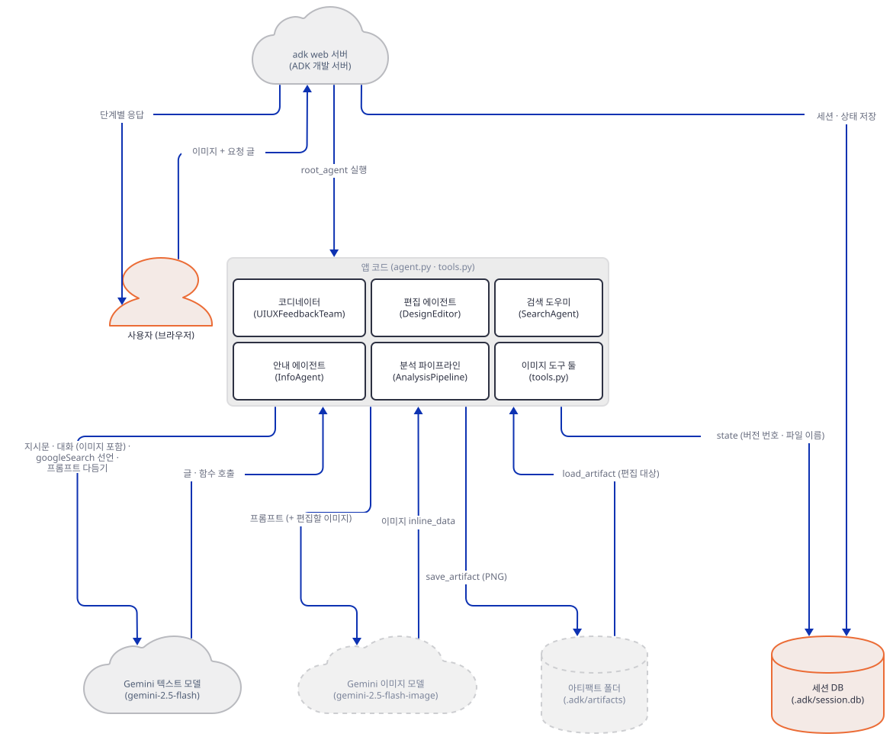

**확인.** 요청 스크립트 출력입니다. 두 도구가 있는 `VisualImplementer`의 함수 응답을 보세요.

```text
UIUXFeedbackTeam  호출 transfer_to_agent
UIUXFeedbackTeam  응답 {"result": null}
UICritic          호출 SearchAgent
UICritic          응답 {"result": "WCAG AA는 본문 4.5:1 (가짜 검색 요약)"}
UICritic          글   분석(가짜). ANALYSIS COMPLETE
DesignStrategist  글   개선 계획(가짜). DESIGN PLAN COMPLETE
VisualImplementer 호출 generate_improved_landing_page
VisualImplementer 응답 {"result": "An error occurred while generating the improved landing page: multimodal_uiux_feedback_agent_team.tools.GenerateImprovedLandingPageInput() argument after ** must be a mapping, not GenerateImprovedLandingPageInput"}
VisualImplementer 글   개선 요약(가짜)
```

가짜 서버 터미널에는 요청이 일곱 줄만 찍혔고(코디네이터 1, 비평가 2, 검색 도우미 1, 전략가 1, 시각 구현 2) `gemini-2.5-flash-image` 줄은 한 줄도 없습니다. 검색 도우미 줄은 이렇게 `googleSearch` 내장 도구 선언만 싣고 나갑니다.

```text
SearchAgent       gemini-2.5-flash        stream=False 이미지파트=0 도구=[]['googleSearch'] -> ['text']
```

이미지 요청이 없는 까닭은 도구가 `**inputs`에서 죽었기 때문입니다. ADK의 `FunctionTool`이 JSON 인자를 먼저 Pydantic 모델로 바꾸기 때문에(google-adk 1.17.0과 2.11.0 모두 소스에서 `_preprocess_args`로 확인하고, 두 버전에서 `FunctionTool`로 도구를 직접 불러 같은 오류를 봤습니다) 모델이 이미 들어 있는 `inputs`를 `**`로 다시 풀 수 없는 것입니다. 마지막 줄의 "개선 요약"은 내 대본이 오류와 상관없이 말한 것입니다. 진짜 Gemini가 이 오류 문장을 보고 어떻게 말할지는 확인하지 못했습니다.

앱 폴더 안에 `.adk/session.db`가 생겼습니다.

```bash
find agent_teams -name ".adk" -o -name "*.db"
```

```powershell
Get-ChildItem -Recurse -Force agent_teams -Include .adk,session.db | Select-Object -ExpandProperty FullName
```

(PowerShell 줄은 실행해 보지 못했습니다.)

```text
agent_teams/multimodal_uiux_feedback_agent_team/.adk
agent_teams/multimodal_uiux_feedback_agent_team/.adk/session.db
```

### Step 6. 한 줄 고치기 — 이미지가 `.adk/artifacts`에 저장된다

**목적.** `**inputs`를 고쳐 이미지 경로가 끝까지 도는 것을 보고, 파일이 어디에 저장되는지와 무엇이 Gemini로 가는지 확인합니다.

**할 일.** 복사본의 `tools.py`에서 두 줄을 고칩니다. Pydantic의 `model_validate`는 딕셔너리도 모델 인스턴스도 받습니다.

```diff
-        inputs = EditLandingPageInput(**inputs)
+        inputs = EditLandingPageInput.model_validate(inputs)
...
-        inputs = GenerateImprovedLandingPageInput(**inputs)
+        inputs = GenerateImprovedLandingPageInput.model_validate(inputs)
```

편집기로 위 diff의 두 줄을 고치거나, 어느 셸에서나 같은 파이썬 한 줄로 고칩니다(바이트를 바꾸므로 줄바꿈과 이모지가 그대로입니다).

```bash
uv run --no-project python -c "import pathlib; p = pathlib.Path('agent_teams/multimodal_uiux_feedback_agent_team/tools.py'); p.write_bytes(p.read_bytes().replace(b'EditLandingPageInput(**inputs)', b'EditLandingPageInput.model_validate(inputs)').replace(b'GenerateImprovedLandingPageInput(**inputs)', b'GenerateImprovedLandingPageInput.model_validate(inputs)'))"
```

(PowerShell에서도 같은 줄을 쓰되 그 셸에서는 실행해 보지 못했습니다.)

Day 095의 앱은 같은 자리를 `isinstance(inputs, dict)`일 때만 풀어서 이 오류가 나지 않습니다(`advanced_ai_agents/multi_agent_apps/ai_home_renovation_agent/tools.py:138-140`). 두 날의 앱이 다르게 도는 까닭이 이것입니다.

`adk web`은 `--no-reload`로 띄웠으니 둘째 터미널에서 멈추고(`Ctrl+C`) 같은 명령으로 다시 띄웁니다. 그다음 새 세션으로 같은 요청을 보냅니다.

```bash
uv run --no-project python client.py 53418 s2 "Please research WCAG and review my landing page" image
```

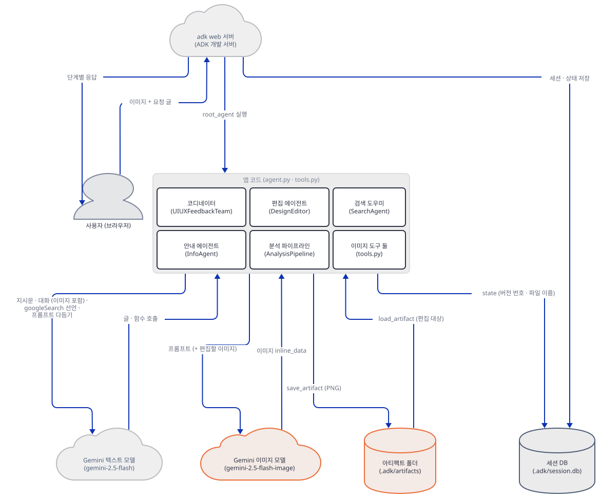

**확인.** 함수 응답이 이제 성공이고, 이벤트에 아티팩트 번호가 붙습니다. 앞의 줄(코디네이터·검색·비평가·전략가)은 Step 5와 같아서 `…`로 줄였습니다.

```text
…
VisualImplementer 호출 generate_improved_landing_page
VisualImplementer 응답 {"result": "✅ **Improved landing page generated successfully!**\n\nSaved as: **landing_page_improved_v1.png** (version 1 of landing_page_improved)\n\nThis design incorporates all the recommended UI/UX improvements."}
                  아티팩트 {'landing_page_improved_v1.png': 0}
VisualImplementer 글   개선 요약(가짜)
```

가짜 서버는 이 요청에 아홉 줄을 찍었습니다. 가운데 두 줄(`?`로 찍힌 것)이 도구 안의 호출이고 나머지 일곱은 에이전트의 호출입니다. 코디네이터·안내·편집 에이전트의 요청에는 `transfer_to_agent` 선언이 붙지만 파이프라인 안의 세 에이전트에는 붙지 않았습니다(Step 7 로그의 `DesignEditor` 줄 포함, 직접 확인).

```text
Coordinator       gemini-2.5-flash        stream=False 이미지파트=1 도구=['transfer_to_agent'][] -> ['functionCall']
UICritic          gemini-2.5-flash        stream=False 이미지파트=1 도구=['SearchAgent'][] -> ['functionCall']
SearchAgent       gemini-2.5-flash        stream=False 이미지파트=0 도구=[]['googleSearch'] -> ['text']
UICritic          gemini-2.5-flash        stream=False 이미지파트=1 도구=['SearchAgent'][] -> ['text']
DesignStrategist  gemini-2.5-flash        stream=False 이미지파트=1 도구=['SearchAgent'][] -> ['text']
VisualImplementer gemini-2.5-flash        stream=False 이미지파트=1 도구=['generate_improved_landing_page'][] -> ['functionCall']
?                 gemini-2.5-flash        stream=False 이미지파트=0 도구=[][] -> ['text']
?                 gemini-2.5-flash-image  stream=True  이미지파트=0 도구=[][] -> ['text', 'inlineData']
VisualImplementer gemini-2.5-flash        stream=False 이미지파트=1 도구=['generate_improved_landing_page'][] -> ['text']
```

여기서 세 가지가 보입니다. 첫째, 올린 스크린샷은 글 호출 여섯 번(코디네이터, 비평가 둘, 전략가, 시각 구현 둘)에 매번 실립니다. 검색 도우미와 도구 안의 두 호출에는 실리지 않습니다. 둘째, 마지막에서 둘째 줄인 이미지 모델 요청은 스트리밍이고 `이미지파트=0`입니다. 도구는 `reference_image`로 원본을 읽으려 했고(`tools.py:238-244`) `adk web` 로그에 `WARNING - tools.py:50 - Landing page image not found: original_landing_page.png`가 프롬프트 다듬기 로그(`tools.py:285`)보다 먼저 찍혔습니다. `adk web`은 올린 파일을 아티팩트로 저장하지 않아서 읽을 것이 없고(소스 확인: `SaveFilesAsArtifactsPlugin`은 `plugins/`에 정의만 있고 CLI가 등록하지 않습니다) 이미지는 글 프롬프트만으로 만들어집니다. 셋째, 저장된 PNG는 이 경로에 있습니다.

```bash
find agent_teams -path "*s2/artifacts*" -type f
```

```powershell
Get-ChildItem -Recurse -File -Force agent_teams | Where-Object { $_.FullName -like "*s2*artifacts*" } | Select-Object -ExpandProperty FullName
```

(PowerShell 줄은 실행해 보지 못했습니다.)

```text
agent_teams/multimodal_uiux_feedback_agent_team/.adk/artifacts/apps/multimodal_uiux_feedback_agent_team/users/u1/sessions/s2/artifacts/landing_page_improved_v1.png/versions/0/landing_page_improved_v1.png
agent_teams/multimodal_uiux_feedback_agent_team/.adk/artifacts/apps/multimodal_uiux_feedback_agent_team/users/u1/sessions/s2/artifacts/landing_page_improved_v1.png/versions/0/metadata.json
```

원본 저장소의 앱 폴더에서 그대로 돌렸다면 이 `.adk/` 전체가 저장소 안에 생깁니다. `.gitignore`의 `*.db`가 `session.db`는 가리지만 `.png`와 `metadata.json`은 가리지 않는다는 것을 `git check-ignore`로 확인했습니다(PNG 경로에 대해 무시 규칙 없음).

### Step 7. 편집, 버전 번호, 진짜 키로 쓸 때

**목적.** 편집 요청이 저장된 시안을 읽어 새 버전을 만드는지, 버전 번호가 정말 오르는지 확인합니다.

**할 일.** 같은 세션 `s2`에 편집 요청을 두 번 보냅니다. 코디네이터는 내 대본이 `bigger`라는 글을 보고 `DesignEditor`로 넘기고, 편집 에이전트는 `landing_page_improved_v1.png`를 `load_artifact`로 읽어 이미지 모델에 보냅니다(이번에는 가짜 서버가 `이미지파트=1`을 찍습니다). 두 번 모두 대본이 같은 v1 파일 이름을 넘기도록 짰다는 점은 알아 두세요. 아래 현상은 이 대본과 상관없이 버전 계산이 하는 일입니다.

```bash
uv run --no-project python client.py 53418 s2 "Make the CTA bigger"
uv run --no-project python client.py 53418 s2 "Make the CTA bigger"
```


**확인.** 두 번의 응답은 모두 `landing_page_improved_v2.png`(version 2)라고 말하고, 아티팩트 번호는 처음 `0`, 두 번째 `1`입니다.

```text
DesignEditor      응답 {"result": "✅ **Landing page edited successfully!**\n\nSaved as: **landing_page_improved_v2.png** (version 2 of landing_page_improved)\n\nThe landing page has been improved ...
                  아티팩트 {'landing_page_improved_v2.png': 0}
...
                  아티팩트 {'landing_page_improved_v2.png': 1}
```

두 번째 편집이 v3가 아니라 같은 v2의 두 번째 개정(revision)으로 저장된 것입니다. 세션 상태를 보면 이유가 나옵니다.

```bash
curl -s http://127.0.0.1:53418/apps/multimodal_uiux_feedback_agent_team/users/u1/sessions/s2
```

```powershell
curl.exe -s http://127.0.0.1:53418/apps/multimodal_uiux_feedback_agent_team/users/u1/sessions/s2
```

(PowerShell 줄은 실행해 보지 못했습니다.) 응답은 한 줄 JSON이고 그 안의 `"state"` 값은 이렇습니다(줄바꿈은 읽기 쉽게 내가 넣었고 키 다섯 개 전부입니다).

```text
{"last_edited_landing_page": "landing_page_improved_v2.png",
 "current_asset_name": "landing_page_improved",
 "asset_versions": {"landing_page_improved": 1},
 "asset_filenames": {"landing_page_improved": "landing_page_improved_v1.png"},
 "last_generated_landing_page": "landing_page_improved_v1.png"}
```

`asset_versions`가 1에서 오르지 않았습니다. `update_asset_version`(Step 4의 발췌)은 처음 한 번만 딕셔너리를 상태에 새로 넣고, 그 뒤에는 상태에서 꺼낸 딕셔너리 안쪽을 고치기만 하는데, ADK의 `State.__setitem__`이 키를 대입할 때만 변경(`_delta`)을 적기 때문입니다(google-adk의 `sessions/state.py`, 102~109행, 소스로 확인). 이벤트도 같았습니다. 첫 요청의 이벤트에는 `asset_versions`가 실렸고 편집 요청의 이벤트에는 `last_edited_landing_page`와 `current_asset_name`만 실렸습니다. 편집 도구가 쓰는 이름은 `asset_versions`에서 계산되므로(`tools.py:157-158`) 세션 상태가 1에 머무르는 한 편집은 계속 v2를 덮어씁니다.

진짜 키로 쓸 때 알아 둘 것은 둘입니다. 하나는 이 문서의 가짜 서버가 확인하지 못한 부분으로, 이미지 모델이 실제로 `parts[0]`에 이미지를 담아 주는지(`tools.py:174`는 첫 파트만 봅니다)입니다. 다른 하나는 위 ⚠ 모델 종료입니다. 오류는 도구가 문자열로 돌려주므로 이미지가 안 나와도 파이프라인은 멈추지 않습니다.

## 요청 한 건이 흐르는 과정

분석 요청 한 건은 Step 6의 고친 판으로 그렸습니다(원본 그대로는 `extra-load`의 첫 메시지 직후 도구가 실패해서, 그 그림의 나머지와 그 뒤 그림의 호출·저장은 일어나지 않습니다). 검색 호출은 이 요청에서 일어나지 않는 경우로 그렸습니다(Step 5·6의 요청은 검색을 한 번 부릅니다). 메시지는 모두 코드 순서대로 한 그림에 들어 있고, 배우가 많아 시간 경계에서 일곱 그림으로 나눴습니다. 코디네이터가 `transfer_to_agent`로 이관하는 대상은 `AnalysisPipeline`이고, 세 에이전트를 차례로 부르는 것은 `SequentialAgent`인 이 파이프라인입니다(google-adk 2.11.0의 `sequential_agent.py`가 `sub_agents`를 `for`로 돌며 `run_async`를 부르는 것을 소스로 확인).

1. 사용자가 이미지와 글을 `/run`으로 보내고, 코디네이터가 `AnalysisPipeline`으로 넘기고, 파이프라인이 1단계 비평가를 부르고, 비평가가 분석 글을 씁니다.

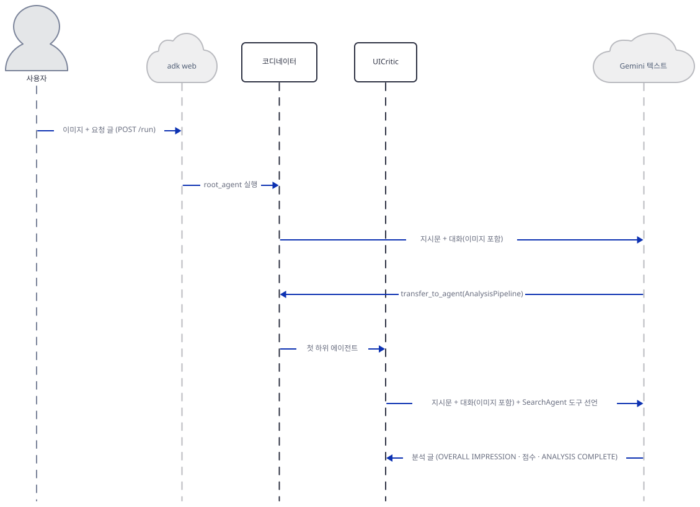

2. 파이프라인이 2단계 전략가와 3단계 시각 구현을 차례로 부르고, 시각 구현이 도구 호출을 받습니다.

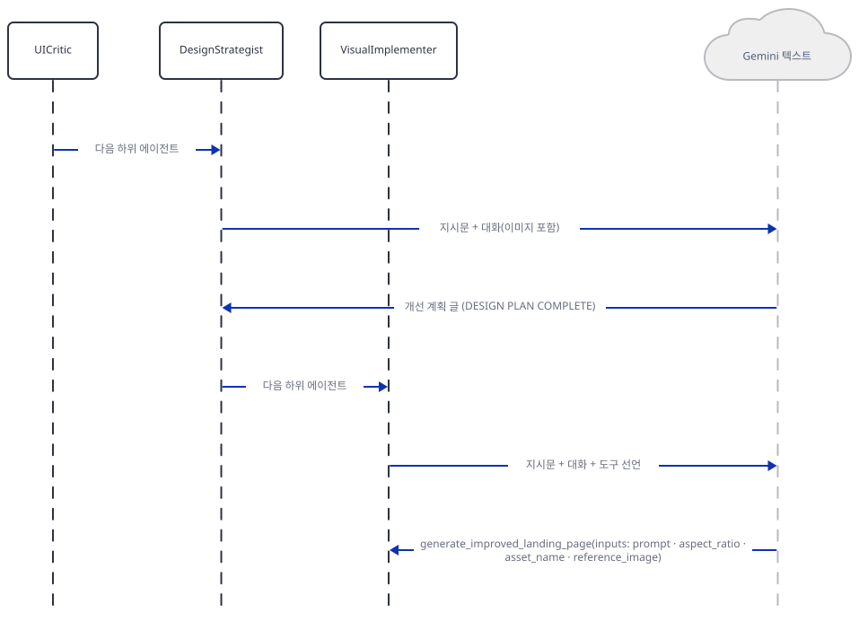

3. 도구가 `reference_image`의 원본을 아티팩트에서 읽으려 하지만 없습니다.

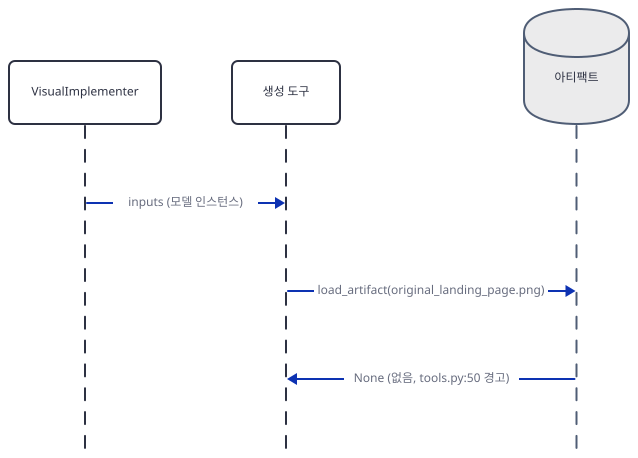

4. 도구가 프롬프트를 `gemini-2.5-flash`로 한 번 다듬습니다.

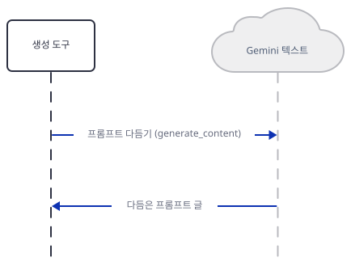

5. 다듬은 글을 `gemini-2.5-flash-image`에 스트리밍으로 보내 이미지를 받습니다.

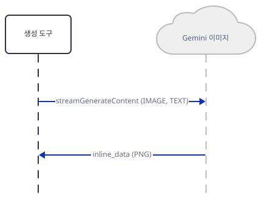

6. 도구가 PNG를 아티팩트로 저장하고 상태를 적고, 안내 문자열을 돌려줍니다.

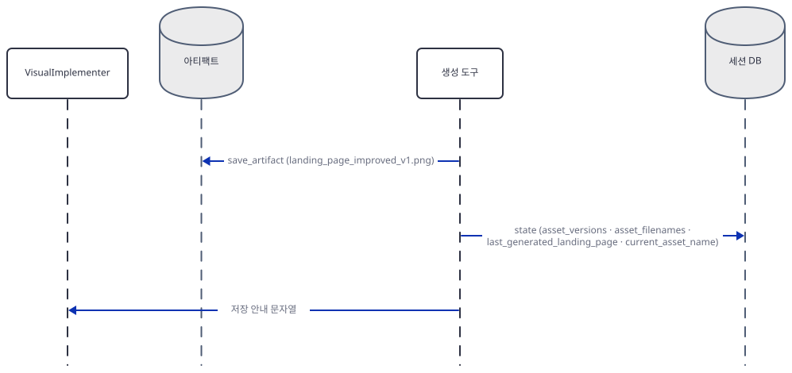

7. 시각 구현이 함수 응답을 보고 요약을 쓰고, `adk web`이 이벤트 목록을 사용자에게 돌려줍니다.

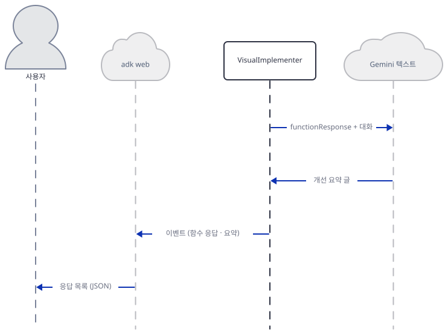

## 실행 체크리스트

- [ ] 작업 폴더에 `agent_teams/multimodal_uiux_feedback_agent_team` 복사본이 있고 `adk --version`이 나온다
- [ ] `tree.py`가 코디네이터 아래 셋과 파이프라인 아래 셋을 찍는다
- [ ] 키 없이 `step4.py`가 `ValueError`를 낸다
- [ ] 가짜 서버와 `adk web`을 루프백 주소의 높은 번호 포트로 띄웠다
- [ ] 원본 그대로 분석 요청을 보내면 도구 응답에 `argument after ** must be a mapping`이 나오고 가짜 서버에 `gemini-2.5-flash-image` 줄이 없다
- [ ] 두 줄을 고친 뒤 `.adk/artifacts/…/landing_page_improved_v1.png`가 생긴다
- [ ] 이미지 모델 요청의 `이미지파트`가 분석 요청에서는 0이고, 검색 도우미 요청에 `['googleSearch']`가 실린다
- [ ] 편집을 두 번 보내면 같은 v2 파일의 개정 번호만 오르는 것을 봤다
- [ ] 끝나고 가짜 서버와 `adk web`을 모두 멈췄고, 원본 폴더에 `.adk/`가 없다

## 문제 해결

| 증상 | 원인 | 해결 |
|---|---|---|
| 도구 응답이 `An error occurred while …: …() argument after ** must be a mapping, not …` | ADK가 `inputs`를 이미 Pydantic 모델로 바꿔 넘기는데 도구가 `**inputs`로 다시 푼다(`tools.py:99`, `tools.py:233`) | `Model.model_validate(inputs)`로 바꾼다(Step 6) |
| 도구 응답은 오류인데 에이전트가 이어서 글을 씀 | 도구가 예외를 문자열로 돌려주고(`tools.py:210-212`) 에이전트는 계속 진행한다. 이 문서의 가짜 모델은 "개선 요약(가짜)"이라고 답했다 | 진짜 모델이 어떻게 말할지는 확인하지 못했다. 도구 응답 줄과 `.adk/artifacts` 파일 유무로 판단한다 |
| 가짜 서버나 `adk web`이 `PermissionError: [WinError 10013] 액세스 권한에 의해 숨겨진 소켓에 액세스를 시도했습니다`로 죽음 | Windows가 막아 둔 제외 포트 대역의 포트를 골랐다(이 PC에서 58731로 재현했고, `netsh int ipv4 show excludedportrange protocol=tcp`에 58726~58825가 있었다) | 그 명령으로 제외 대역을 보고 대역 밖의 높은 포트를 고른다 |
| 키 없이 `adk web` 요청이 HTTP 500 | 모델 호출 전에 `ValueError: No API key was provided. …` (확인함) | 키를 환경변수로 건 셸에서 `adk web`을 띄운다 |
| 도구를 직접 부르면 `ValueError: GEMINI_API_KEY or GOOGLE_API_KEY environment variable not set.` | 키 확인이 `try` 밖(`tools.py:92-93`) | 둘 중 하나를 설정한다 |
| 편집을 거듭해도 버전이 v2에서 안 오르고 아티팩트 개정만 오름 | 상태 안의 딕셔너리를 안쪽만 고쳐서 세션에 기록되지 않음(`tools.py:33-34`) | `tool_context.state["asset_versions"] = {...새 딕셔너리...}`처럼 키를 새로 대입한다(더 해보기) |
| 원본 앱 폴더에 `.adk/artifacts/…png`가 untracked로 뜸 | `adk web`이 앱 폴더 안에 저장하고 `.gitignore`는 `*.db`만 가림 | 복사한 폴더에서 돌린다 |
| `agent_teams`에서 `adk web`을 띄우니 앱이 네 개 보임 | 폴더 안의 ADK 앱을 모두 목록에 올린다 | 복사한 폴더에서 돌리고, 다른 앱을 선택하지 않는다 |
| 서버 로그에 `can transfer between agents but has no context_cache_config` 경고 | `transfer_to_agent` 때마다 시스템 지시문이 바뀌어 캐시를 못 쓴다는 ADK의 안내(확인함) | 동작에는 영향이 없다 |
| 진짜 키에서 이미지가 안 나옴 | 모델 종료일 불일치(위 ⚠), 또는 2.5 모델 접근 제한 | 폐기 문서의 대체 모델 ID로 `tools.py:111`·`tools.py:287`을 바꿔 시험한다. 이 문서는 시험하지 못했다 |

## 더 해보기

- 업로드한 스크린샷이 `reference_image`로 쓰이게 하세요. `SaveFilesAsArtifactsPlugin`을 `adk web`의 `--extra_plugins`로 등록하면 올린 파일이 아티팩트가 된다는 것이 `plugins/save_files_as_artifacts_plugin.py`에서 읽히지만 이 문서는 시험하지 못했습니다. 이미지 모델 요청의 `이미지파트`가 1이 되는지가 확인 기준입니다.
- `update_asset_version`을 고쳐 편집을 두 번 하면 `v2`, `v3`가 되게 하세요. `asset_versions`를 읽어 복사하고 새 딕셔너리를 대입하는 방식이 하나의 방법입니다. 확인 기준은 `state`의 `asset_versions`가 2가 되는 것입니다.
- 코디네이터의 지시문(`agent.py:418-452`)이 "이미지가 보이면 항상 분석 파이프라인"이라고 정해 둡니다. 이미 시안이 있는 세션에서 이미지를 또 올리면 어디로 가는지, 가짜 서버 대본을 바꿔 가며 정해 보세요.

## 다음 날 예고

[Day 123 · 🏠 AI Real Estate Agent Team](../day123-ai-real-estate-agent-team/README.md) — 오늘과 달리 Gemini(`gemini-2.5-flash`)와 Firecrawl을 쓰는 판과 로컬 Ollama(`gpt-oss:20b`)를 쓰는 판이 한 폴더에 있는 부동산 팀 앱입니다(두 판 모두 소스의 모델 줄로 확인).
