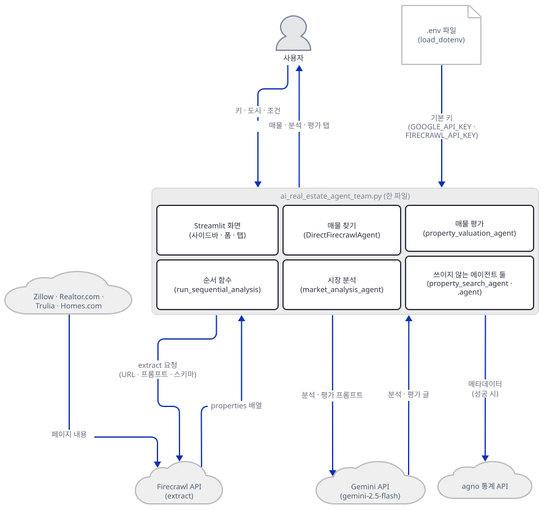
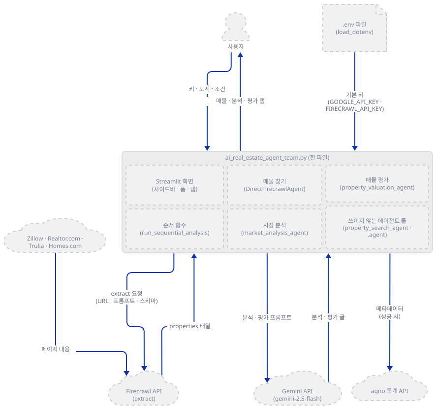
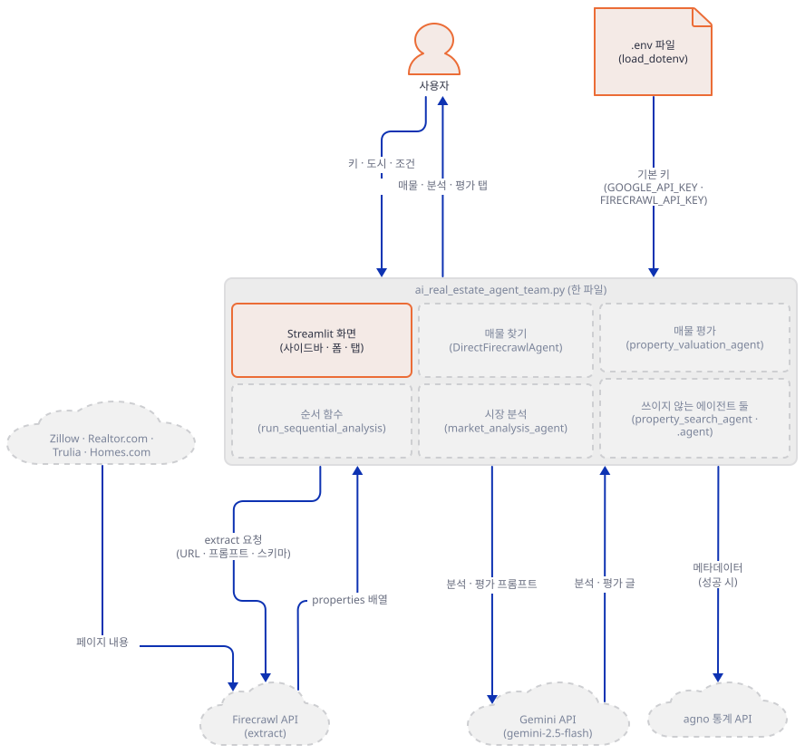
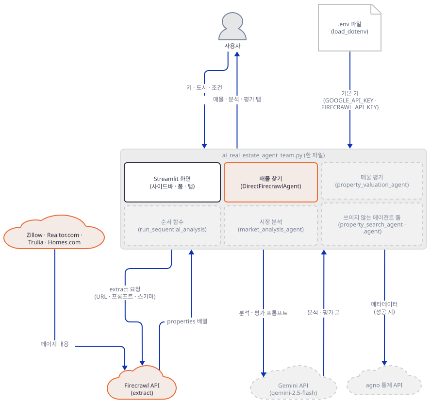
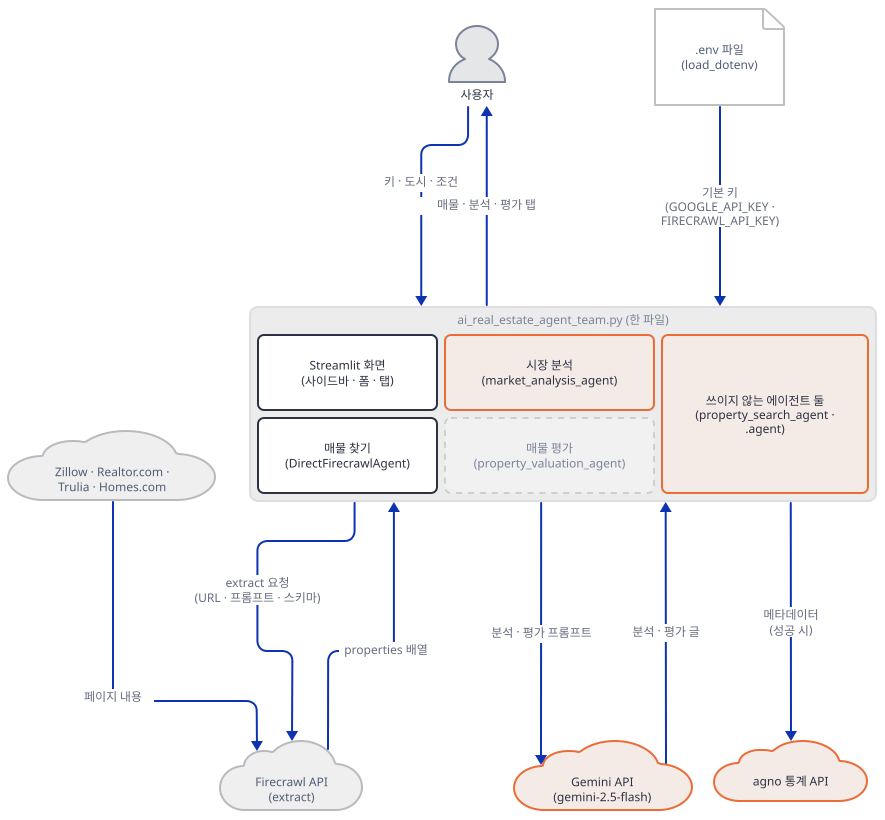
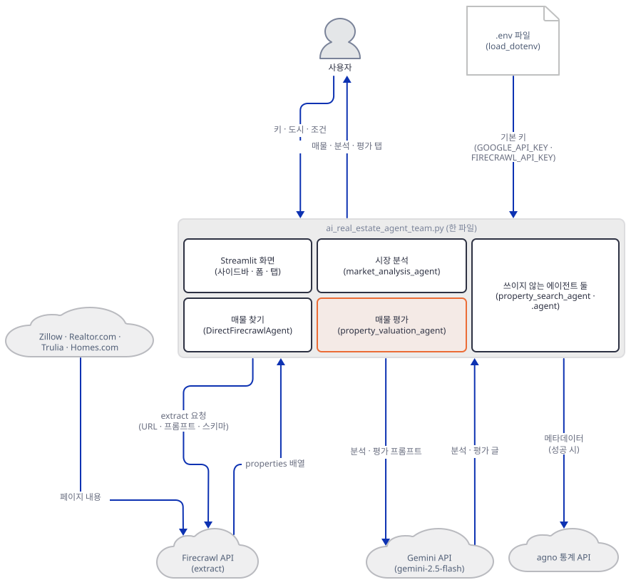
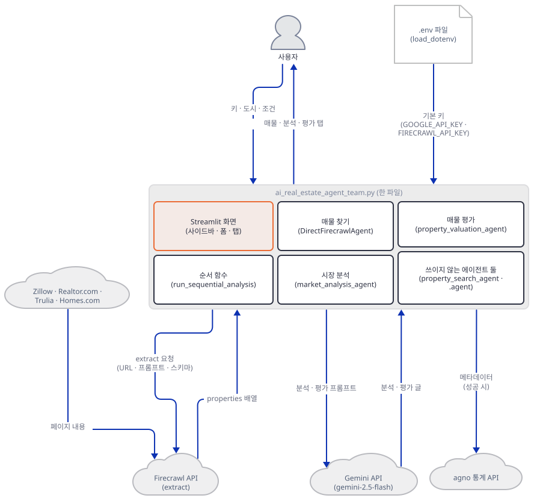
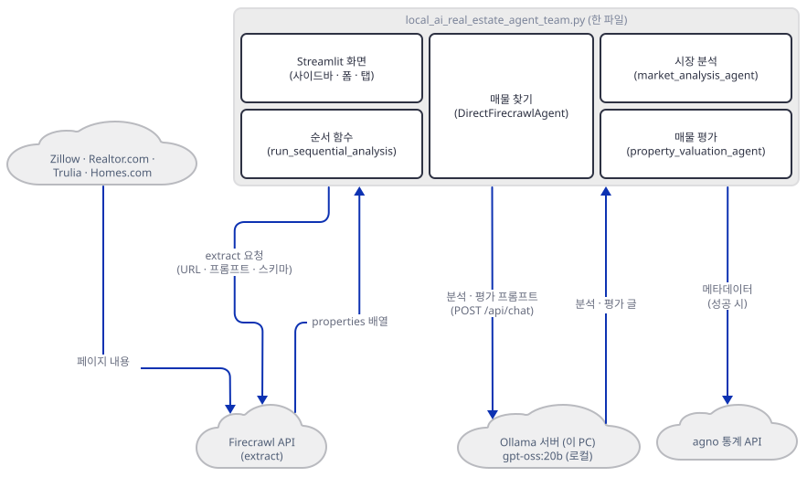
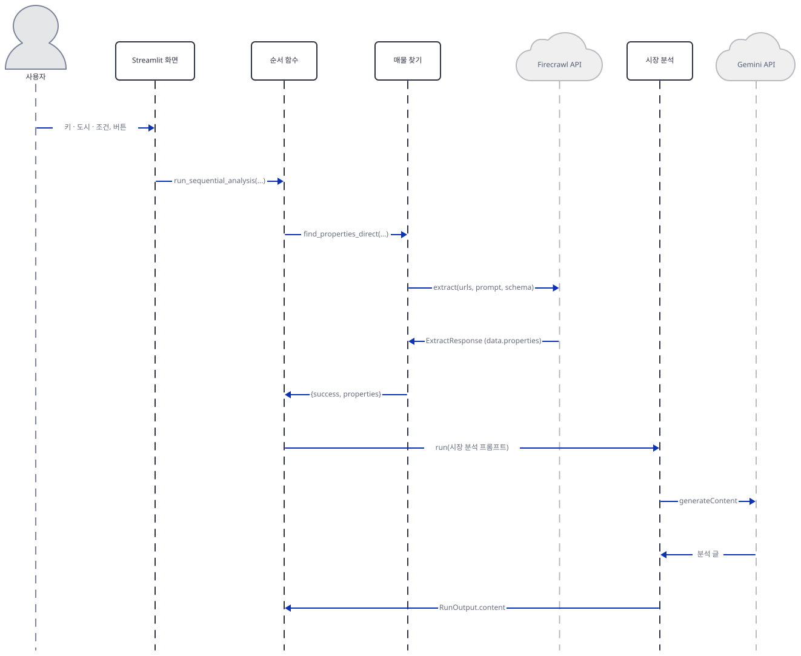
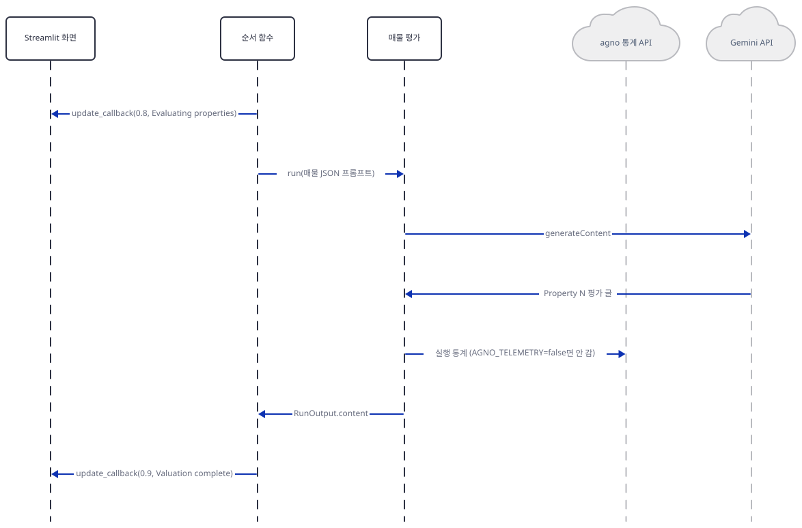

# Day 123 · 🏠 AI Real Estate Agent Team

> 볼륨 8 🤝 Multi-agent Teams · 난이도 ★★☆ ⚠ · 예상 소요 110분(앱은 편집기 기준 837줄이지만 Step 3·4에서 가짜 서버와 확인 스크립트를 직접 저장해 터미널 둘로 돌려 보고, 실패 시나리오를 따로 돌리는 시간이 읽는 시간보다 더 듭니다) · API 비용 대략 1회에 Gemini 약 $0.01 안팎에 Firecrawl 크레딧(Gemini는 `gemini-2.5-flash`의 입력 $0.30·출력 $2.50(1M 토큰당, https://ai.google.dev/gemini-api/docs/pricing, 2026-10-10 확인)을 매물 20건 기준 입력 약 2천·출력 약 2천 5백 토큰으로 어림한 값이고 생각 토큰은 넣지 못했으며, 같은 페이지가 무료 등급을 적습니다. Firecrawl 요금 페이지(https://www.firecrawl.dev/pricing, 2026-10-10)는 무료 월 1,000 크레딧을 적지만 `extract`의 크레딧 단가는 적지 않고, 문서는 "토큰 기준, 1 크레딧 = 15 토큰, 내용에 따라 달라짐"이라고만 적어 1회 비용은 확인하지 못했습니다. 키가 없어 어느 쪽도 실제로 부르지 않았습니다. 로컬판은 Gemini 대신 Ollama라 모델 비용이 없지만 Firecrawl는 그대로 듭니다) · 원본 앱: `advanced_ai_agents/multi_agent_apps/agent_teams/ai_real_estate_agent_team`

## 오늘 만들 것

도시와 예산·방 수 같은 조건을 적고 버튼을 누르면, Firecrawl가 Zillow·Realtor.com 같은 부동산 사이트에서 매물을 구조화해 뽑아 오고, Gemini 에이전트 둘이 시장 분석과 매물별 평가를 써 주는 Streamlit 앱입니다. 오늘은 `ai_real_estate_agent_team.py` 한 파일(편집기 기준 837줄, 마지막 줄에 개행이 없어 `wc -l`은 836)을 따라 만듭니다. 같은 폴더에 Gemini 대신 Ollama를 쓰는 `local_ai_real_estate_agent_team.py`(편집기 기준 828줄)가 있고, 두 파일은 모델 호출 몇 곳과 화면 몇 곳만 다릅니다(Step 7).

클라우드판을 중심으로 합니다. 앱 README가 실행 방법에서 먼저 소개하는 쪽이고(`advanced_ai_agents/multi_agent_apps/agent_teams/ai_real_estate_agent_team/README.md:64`), 필요한 것이 키 둘뿐이라 따라 하기 쉽고, 모델 서버를 가짜로 세우기도 쉽기 때문입니다. 로컬판은 모델 하나(`gpt-oss:20b`)가 디스크 14GB(Ollama 라이브러리 페이지, 2026-10-10 확인)라 이 문서는 받지 않았습니다.

이 앱은 "에이전트 팀"을 내세우지만 코드에 agno `Team`이 없고(`Team(`이 한 번도 나오지 않음, grep으로 확인) 에이전트에도 도구가 없습니다. 에이전트 셋을 만드는 것은 맞지만 `run`이 불리는 것은 둘(시장 분석, 매물 평가)뿐입니다. 이름이 "매물 검색 에이전트"인 셋째는 만들어지기만 하고, 매물은 모델이 아니라 Firecrawl SDK 호출 하나가 찾아 옵니다(Step 3·4). `Team`을 가장 작게 만난 날은 Day 112이고, 오늘은 Day 117과 마찬가지로 `Team`이 없고, 순서 함수가 에이전트를 차례로 부릅니다.

직접 돌려 보고 알게 된 것이 다섯입니다. 첫째, `requirements.txt`를 설치하면 Gemini 모델 클래스가 쓰는 `google-genai`가 빠져 있어 앱이 첫 import에서 죽고, 안 쓰는 패키지 셋(`openai`·`requests`·`googlesearch-python`)이 들어 있습니다(Step 1). 둘째, `firecrawl-py>=1.9.0`의 하한인 1.9.0은 앱이 부르는 `extract(..., prompt=..., schema=...)`를 받지 않습니다. 오늘은 4.50.0이 깔려 받습니다(Step 3). 셋째, 주/도를 비우면(화면은 "optional"이라고 합니다) 사이트 주소가 `san-francisco-`나 `//San_Francisco`처럼 깨집니다(Step 3). 넷째, 모델 호출이 실패해도 화면에는 빨간 오류 대신 오류 JSON 문자열이 분석 탭에 그대로 실립니다(Step 5). 다섯째, 앱 README는 "Downloadable analysis reports"를 기능으로 적지만(`advanced_ai_agents/multi_agent_apps/agent_teams/ai_real_estate_agent_team/README.md:43`) 클라우드판 화면에는 내려받기 버튼이 없습니다(Step 6).

⚠ 이 문서는 Gemini·Firecrawl·부동산 사이트·Google 어디에도 요청을 보내지 않았습니다. 앱 안의 두 서비스는 내 PC의 가짜 서버로 돌렸으므로 아래의 매물·분석 문장은 모두 가짜 서버가 만든 값이고, 진짜 Firecrawl가 이 사이트들에서 매물을 제대로 뽑아 오는지, 진짜 `gemini-2.5-flash`가 어떤 글을 쓰는지는 확인하지 못했습니다. 앱이 사이트를 직접 읽는 코드는 없고(소스로 확인, `requests`나 `googlesearch`를 쓰는 줄이 없음) 사이트를 읽는 것은 Firecrawl 서버입니다. 사이트마다 자동 수집을 허용하는지는 확인하지 못했으니 실제로 쓰기 전에 각 사이트의 이용 약관을 직접 확인하세요. 아래는 완성된 아키텍처입니다.



## 사전 준비

| 서비스/도구 | 용도 | 발급·설치 |
|---|---|---|
| uv | 가상환경 생성과 패키지 설치 | [공통 사전 준비](../README.md#공통-사전-준비-한-번만) 절 참고 |
| Python | 이 문서는 3.12.10으로 확인했다. 저장소 기준은 3.11~3.13 | 공통 사전 준비와 같음 |
| Google AI API 키 | `gemini-2.5-flash` 호출. 사이드바 비밀번호 칸에 붙여넣거나 환경변수 `GOOGLE_API_KEY`에 둔다(`advanced_ai_agents/multi_agent_apps/agent_teams/ai_real_estate_agent_team/ai_real_estate_agent_team.py:18`). 이 문서는 키 없이 진행한다 | https://aistudio.google.com/app/apikey |
| Firecrawl API 키 | 매물 추출. 같은 사이드바의 칸 또는 환경변수 `FIRECRAWL_API_KEY`(`advanced_ai_agents/multi_agent_apps/agent_teams/ai_real_estate_agent_team/ai_real_estate_agent_team.py:19`) | https://firecrawl.dev |
| 인터넷 연결 | PyPI 설치. 앱을 실제로 쓸 때는 Gemini API, Firecrawl API, agno 사용 통계 서버(`os-api.agno.com`)에 접속하고, Firecrawl 서버가 부동산 사이트를 읽는다. 브라우저로 열면 Streamlit의 사용 통계도 나간다(`--browser.gatherUsageStats false`로 끈다) | 별도 설치 없음 |
| 모델 서버 가짜 | 이 문서의 확인 스크립트가 쓴다. 파이썬 표준 라이브러리만 쓰고 Step 3에서 저장한다 | 별도 설치 없음 |

이 문서의 확인 스크립트는 한글을 출력합니다. 한국어 Windows에서 출력을 파이프나 파일로 받으면 기본 인코딩(`cp949`)이 모자랄 수 있으니 셸을 먼저 이렇게 맞춰 두세요(Day 117과 같은 처방이고, 이 문서에서는 설정을 켠 채로만 돌렸습니다).

```bash
export PYTHONIOENCODING=utf-8
```

```powershell
$env:PYTHONIOENCODING = "utf-8"
```

## 아키텍처 한눈에 보기

| 컴포넌트 | 역할 | 코드 위치 |
|---|---|---|
| 화면과 제출 처리 (`main`) | 사이드바(키·사이트 선택), 조건 폼, 입력 검사, 진행 막대 | `advanced_ai_agents/multi_agent_apps/agent_teams/ai_real_estate_agent_team/ai_real_estate_agent_team.py:586-834` |
| 스키마 (`PropertyDetails`·`PropertyListing`) | Firecrawl에 넘기는 추출 스키마 | `advanced_ai_agents/multi_agent_apps/agent_teams/ai_real_estate_agent_team/ai_real_estate_agent_team.py:22-38` |
| 매물 찾기 (`DirectFirecrawlAgent`) | 사이트 주소 만들기, Firecrawl `extract` 호출, 응답 풀기 | `advanced_ai_agents/multi_agent_apps/agent_teams/ai_real_estate_agent_team/ai_real_estate_agent_team.py:40-172` |
| 에이전트 셋 만들기 (`create_sequential_agents`) | 검색·시장 분석·평가 에이전트의 지시문 | `advanced_ai_agents/multi_agent_apps/agent_teams/ai_real_estate_agent_team/ai_real_estate_agent_team.py:174-251` |
| 순서 함수 (`run_sequential_analysis`) | 매물 찾기 → 시장 분석 → 평가를 차례로 부르고 결과 dict를 만듦 | `advanced_ai_agents/multi_agent_apps/agent_teams/ai_real_estate_agent_team/ai_real_estate_agent_team.py:253-456` |
| 평가 글 자르기 (`extract_property_valuation`) | 평가 글에서 매물별 조각 찾기 | `advanced_ai_agents/multi_agent_apps/agent_teams/ai_real_estate_agent_team/ai_real_estate_agent_team.py:458-488` |
| 결과 화면 (`display_properties_professionally`) | 지표 셋, 탭 셋, 매물 카드 | `advanced_ai_agents/multi_agent_apps/agent_teams/ai_real_estate_agent_team/ai_real_estate_agent_team.py:490-584` |
| 로컬판 | 모델만 Ollama로 바꾼 같은 구조 | `advanced_ai_agents/multi_agent_apps/agent_teams/ai_real_estate_agent_team/local_ai_real_estate_agent_team.py:1-828` |
| 의존성 | 클라우드판 8줄 | `advanced_ai_agents/multi_agent_apps/agent_teams/ai_real_estate_agent_team/requirements.txt:1-8` |

## 단계별 진행

### Step 1. 환경 만들기 — 빠진 패키지와 안 쓰는 패키지

**목적.** 앱 폴더에 독립 가상환경을 만들고 import가 통과하게 합니다.

**할 일.** 저장소 루트에서 시작합니다.

```bash
cd advanced_ai_agents/multi_agent_apps/agent_teams/ai_real_estate_agent_team
uv venv
uv pip install -r requirements.txt
```

(pip 대안: bash는 `python -m venv .venv && source .venv/bin/activate && pip install -r requirements.txt`입니다. PowerShell 5.1은 `&&`를 받지 않으므로 세 줄로 `python -m venv .venv`, `.venv\Scripts\Activate.ps1`, `pip install -r requirements.txt`를 차례로 씁니다. 실행해 보지 못했습니다.) 이후 `uv run`에는 모두 `--no-project`를 붙입니다. 이유는 [공통 사전 준비](../README.md#공통-사전-준비-한-번만)에 있습니다.

`advanced_ai_agents/multi_agent_apps/agent_teams/ai_real_estate_agent_team/requirements.txt:1-8`

```text
streamlit>=1.28.0
agno>=2.2.10
openai>=1.0.0
firecrawl-py>=1.9.0
pydantic>=2.7.0
python-dotenv>=1.0.0
requests>=2.31.0
googlesearch-python>=1.2.3
```

이 문서를 만들 때(2026-10-10) Python 3.12.10에서 패키지 81개가 깔렸고 agno 3.1.2, streamlit 1.65.0, firecrawl-py 4.50.0, googlesearch-python 1.3.0, openai 3.27.0이 들어왔습니다(직접 확인). `agno>=2.2.10`·`firecrawl-py>=1.9.0`에는 상한이 없어 오늘의 최신으로 풀립니다. 앱의 import는 12줄이고 `openai`·`requests`·`googlesearch`를 쓰는 줄은 두 파일 어디에도 없어서(grep으로 확인), 세 패키지는 설치만 되고 쓰이지 않습니다. 앱 README의 필요 패키지 목록(`advanced_ai_agents/multi_agent_apps/agent_teams/ai_real_estate_agent_team/README.md:50-54`)에도 이 셋은 없지만 `google-genai`도 없습니다. 앱을 import해 봅니다.

```bash
uv run --no-project python -c "import ai_real_estate_agent_team"
```

마지막 줄은 이렇습니다(직접 확인).

```text
ImportError: `google-genai` not installed. Please install it using `pip install google-genai`
```

8행의 `from agno.models.google import Gemini`가 `google-genai`를 요구합니다. 로컬판도 같은 자리에서 막힙니다. `uv run --no-project python -c "import local_ai_real_estate_agent_team"`의 마지막 줄은 이렇습니다(직접 확인).

```text
ImportError: `ollama` not installed. Please install using `pip install ollama`
```

둘 다 설치합니다.

```bash
uv pip install google-genai ollama
uv run --no-project python -c "import ai_real_estate_agent_team, local_ai_real_estate_agent_team; print('import ok')"
```



**확인.** 마지막 명령이 `import ok`를 찍습니다(직접 확인). `google-genai` 2.29.0과 `ollama` 0.6.3이 깔렸습니다. 오늘 중심은 클라우드판이니 `ollama`는 Step 7에서만 쓰입니다.

### Step 2. 화면과 키 — 환경변수에 쓰지만 쓰이지 않는 곳

**목적.** 키 둘과 검색할 사이트를 받는 사이드바, 조건 폼, 제출 검사를 읽고 앱을 띄웁니다.

**할 일.** 14~19행이 `.env`를 읽어 기본 키를 정합니다(`load_dotenv`는 `.env`를 현재 폴더에서 위로 찾아 올라갑니다).

`advanced_ai_agents/multi_agent_apps/agent_teams/ai_real_estate_agent_team/ai_real_estate_agent_team.py:14-19`

```python
# Load environment variables
load_dotenv()

# API keys - must be set in environment variables
DEFAULT_GOOGLE_API_KEY = os.getenv("GOOGLE_API_KEY")
DEFAULT_FIRECRAWL_API_KEY = os.getenv("FIRECRAWL_API_KEY")
```

사이드바는 두 키 칸을 비밀번호 입력으로 받고, 값이 있으면 `os.environ`에도 씁니다.

`advanced_ai_agents/multi_agent_apps/agent_teams/ai_real_estate_agent_team/ai_real_estate_agent_team.py:603-621`

```python
        with st.expander("🔑 API Keys", expanded=True):
            google_key = st.text_input(
                "Google AI API Key", 
                value=DEFAULT_GOOGLE_API_KEY, 
                type="password",
                help="Get your API key from https://aistudio.google.com/app/apikey",
                placeholder="AIza..."
            )
            firecrawl_key = st.text_input(
                "Firecrawl API Key", 
                value=DEFAULT_FIRECRAWL_API_KEY, 
                type="password",
                help="Get your API key from https://firecrawl.dev",
                placeholder="fc_..."
            )
            
            # Update environment variables
            if google_key: os.environ["GOOGLE_API_KEY"] = google_key
            if firecrawl_key: os.environ["FIRECRAWL_API_KEY"] = firecrawl_key
```

그런데 이 환경변수 쓰기는 쓰이지 않습니다. 키는 800~808행에서 `firecrawl_api_key=`·`google_api_key=` 인자로 순서 함수에 그대로 넘어가고, 모델(`Gemini(id=..., api_key=...)`)과 Firecrawl 클라이언트(`FirecrawlApp(api_key=...)`)도 인자로 받기 때문입니다(소스로 확인). 사이트 선택은 체크박스 넷이고 기본으로 Zillow와 Realtor.com이 켜집니다.

`advanced_ai_agents/multi_agent_apps/agent_teams/ai_real_estate_agent_team/ai_real_estate_agent_team.py:624-632`

```python
        with st.expander("🌐 Search Sources", expanded=True):
            st.markdown("**Select real estate websites to search:**")
            available_websites = ["Zillow", "Realtor.com", "Trulia", "Homes.com"]
            selected_websites = [site for site in available_websites if st.checkbox(site, value=site in ["Zillow", "Realtor.com"])]
            
            if selected_websites:
                st.markdown(f'✅ {len(selected_websites)} sources selected</div>', unsafe_allow_html=True)
            else:
                st.markdown('<div class="status-error">⚠️ Please select at least one website</div>', unsafe_allow_html=True)
```

폼은 도시·주/도·가격 범위·유형·방·욕실·최소 면적·특징에 더해 "Timeline"과 "Urgency" 선택 상자를 받는데, 이 둘은 713~722행에서 값을 받기만 하고 `user_criteria`에도 프롬프트에도 들어가지 않습니다(`timeline`·`urgency`가 나오는 줄이 이 두 선언뿐임, grep으로 확인).

`advanced_ai_agents/multi_agent_apps/agent_teams/ai_real_estate_agent_team/ai_real_estate_agent_team.py:713-722`

```python
            timeline = st.selectbox(
                "⏰ Timeline",
                ["Flexible", "1-3 months", "3-6 months", "6+ months"],
                help="When do you plan to buy?"
            )
            urgency = st.selectbox(
                "🚨 Urgency",
                ["Not urgent", "Somewhat urgent", "Very urgent"],
                help="How urgent is your purchase?"
            )
```

제출하면 키 둘·도시·사이트가 모두 있는지 보고, 모자라면 안내문을 찍고 끝냅니다.

`advanced_ai_agents/multi_agent_apps/agent_teams/ai_real_estate_agent_team/ai_real_estate_agent_team.py:742-760`

```python
    if submitted:
        # Validate all required inputs
        missing_items = []
        if not google_key:
            missing_items.append("Google AI API Key")
        if not firecrawl_key:
            missing_items.append("Firecrawl API Key")
        if not city:
            missing_items.append("City")
        if not selected_websites:
            missing_items.append("At least one website selection")
        
        if missing_items:
            st.markdown(f"""
            <div class="status-error" style="text-align: center; margin: 2rem 0;">
                ⚠️ Please provide: {', '.join(missing_items)}
            </div>
            """, unsafe_allow_html=True)
            return
```

안내문의 `status-error` 클래스는 이 파일 어디에도 스타일 정의가 없습니다(`<style`이 0건, grep으로 확인). 화면에서는 가운데 정렬된 평범한 글로 보일 것이라고 짐작하지만 브라우저로는 확인하지 못했습니다. 로컬판은 같은 검사를 `st.error`로 합니다(소스로 확인, Step 7).



**확인.** 앱을 띄웁니다. 두 번째 줄의 주소는 확인용으로 `localhost`에만 열고 사용 통계를 끕니다.

```bash
export AGNO_TELEMETRY=false
uv run --no-project streamlit run ai_real_estate_agent_team.py --server.headless true --server.address localhost --server.port 54733 --browser.gatherUsageStats false
```

```powershell
$env:AGNO_TELEMETRY = "false"
uv run --no-project streamlit run ai_real_estate_agent_team.py --server.headless true --server.address localhost --server.port 54733 --browser.gatherUsageStats false
```

(PowerShell 줄은 실행해 보지 못했습니다.) 다른 터미널에서 `curl http://localhost:54733/_stcore/health`가 `ok`를 냅니다(직접 확인). `--browser.gatherUsageStats false`를 빼고 `~/.streamlit/credentials.toml`이 없을 때는 시작 로그에 "Collecting usage statistics" 줄이 나옵니다(직접 확인, Day 103이 같은 조건을 적었습니다). 평소에 쓸 때는 `--server.headless true`와 포트를 빼고 `uv run --no-project streamlit run ai_real_estate_agent_team.py`만 쓰면 됩니다. 확인이 끝나면 Ctrl+C로 멈춥니다. `AGNO_TELEMETRY=false`는 agno의 익명 사용 통계를 끄는 설정입니다. 이 통계의 내용과 시점은 Day 047 Step 5가 다뤘고 agno 3.1.2에서의 항목은 Day 117 Step 6이 적었으니 여기서는 되풀이하지 않습니다.

### Step 3. 매물 찾기 — 주소 넷과 `extract` 한 번

**목적.** `DirectFirecrawlAgent`가 사이트 주소를 만들고 Firecrawl `extract`를 한 번 부르는 과정을, 가짜 Firecrawl로 성공·실패 네 경우까지 돌려 봅니다.

**할 일.** 먼저 주소를 만드는 부분입니다. 도시는 공백을 `-`(Trulia는 `_`)로 바꾸고 주/도는 대문자(Homes.com은 소문자)로 붙이며, 고른 사이트만 남깁니다.

`advanced_ai_agents/multi_agent_apps/agent_teams/ai_real_estate_agent_team/ai_real_estate_agent_team.py:51-73`

```python
    def find_properties_direct(self, city: str, state: str, user_criteria: dict, selected_websites: list) -> dict:
        """Direct Firecrawl integration for property search"""
        city_formatted = city.replace(' ', '-').lower()
        state_upper = state.upper() if state else ''
        
        # Create URLs for selected websites
        state_lower = state.lower() if state else ''
        city_trulia = city.replace(' ', '_')  # Trulia uses underscores for spaces
        search_urls = {
            "Zillow": f"https://www.zillow.com/homes/for_sale/{city_formatted}-{state_upper}/",
            "Realtor.com": f"https://www.realtor.com/realestateandhomes-search/{city_formatted}_{state_upper}/pg-1",
            "Trulia": f"https://www.trulia.com/{state_upper}/{city_trulia}/",
            "Homes.com": f"https://www.homes.com/homes-for-sale/{city_formatted}-{state_lower}/"
        }
        
        # Filter URLs based on selected websites
        urls_to_search = [url for site, url in search_urls.items() if site in selected_websites]
        
        print(f"Selected websites: {selected_websites}")
        print(f"URLs to search: {urls_to_search}")
        
        if not urls_to_search:
            return {"error": "No websites selected"}
```

주/도를 비우면(화면은 "optional"이라고 합니다, 660~664행) `state_upper`가 빈 문자열이라 주소 끝이 비어 깨집니다. 아래 스크립트가 실제 모양을 보여 줍니다. 다음은 프롬프트(76~113행, 영어 지시문)를 만들어 `extract`를 부르는 줄입니다.

`advanced_ai_agents/multi_agent_apps/agent_teams/ai_real_estate_agent_team/ai_real_estate_agent_team.py:115-122`

```python
        try:
            # Direct Firecrawl call - using correct API format
            print(f"Calling Firecrawl with {len(urls_to_search)} URLs")
            raw_response = self.firecrawl.extract(
                urls_to_search,
                prompt=prompt,
                schema=PropertyListing.model_json_schema()
            )
```

SDK 4.50.0의 `extract`는 `urls`와 `prompt`·`schema`를 받고, 안에서 `POST /v2/extract`로 작업을 맡긴 뒤 `GET /v2/extract/<id>`로 완료를 확인해 `ExtractResponse`를 돌려줍니다(소스로 확인, `firecrawl/v2/methods/extract.py`). 이 SDK는 `extract`를 부를 때 "extract 엔드포인트는 유지보수 모드이고 사용을 권하지 않는다"는 `DeprecationWarning`을 내고(같은 파일), Firecrawl 문서의 추출기 선택 안내는 `/extract` 대신 `/agent`를 권합니다(https://docs.firecrawl.dev/developer-guides/usage-guides/choosing-the-data-extractor, 2026-10-10 확인). 하한 1.9.0은 어떤지 따로 확인했습니다(직접 확인). 1.9.0에서 `FirecrawlApp.extract`의 시그니처는 `(self, urls, params=None)`이라 앱의 호출 모양과 맞지 않고, 인자를 묶어 보면 `TypeError: got an unexpected keyword argument 'prompt'`가 납니다. 오늘 설치되는 4.50.0은 같은 인자가 묶입니다(직접 확인). Day 104는 4.46.2의 `extract`가 `params=`를 받지 않아 막혔다고 적었고 Day 117 Step 1은 1.9.0 고정이 풀려야 한다고 적었으니, 이 앱은 하한을 올려야 하는 앱이 아니라 오늘 마침 맞는 앱입니다. 응답은 두 갈래로 풉니다.

`advanced_ai_agents/multi_agent_apps/agent_teams/ai_real_estate_agent_team/ai_real_estate_agent_team.py:126-139`

```python
            if hasattr(raw_response, 'success') and raw_response.success:
                # Handle Firecrawl response object
                properties = raw_response.data.get('properties', []) if hasattr(raw_response, 'data') else []
                total_count = raw_response.data.get('total_count', 0) if hasattr(raw_response, 'data') else 0
                print(f"Response data keys: {list(raw_response.data.keys()) if hasattr(raw_response, 'data') else 'No data'}")
            elif isinstance(raw_response, dict) and raw_response.get('success'):
                # Handle dictionary response
                properties = raw_response['data'].get('properties', [])
                total_count = raw_response['data'].get('total_count', 0)
                print(f"Response data keys: {list(raw_response['data'].keys())}")
            else:
                properties = []
                total_count = 0
                print(f"Response failed or unexpected format: {type(raw_response)}")
```

SDK 응답은 객체이고 `data`는 딕셔너리라 첫 갈래(`hasattr(raw_response, 'success')`)를 탑니다(직접 확인). 매물 하나의 모양은 스키마가 정하는데, `Optional[str] = Field(description=...)`에는 기본값이 없어 열한 개 필드가 모두 필수(null 허용)로 나갑니다.

`advanced_ai_agents/multi_agent_apps/agent_teams/ai_real_estate_agent_team/ai_real_estate_agent_team.py:22-33`

```python
class PropertyDetails(BaseModel):
    address: str = Field(description="Full property address")
    price: Optional[str] = Field(description="Property price")
    bedrooms: Optional[str] = Field(description="Number of bedrooms")
    bathrooms: Optional[str] = Field(description="Number of bathrooms")
    square_feet: Optional[str] = Field(description="Square footage")
    property_type: Optional[str] = Field(description="Type of property")
    description: Optional[str] = Field(description="Property description")
    features: Optional[List[str]] = Field(description="Property features")
    images: Optional[List[str]] = Field(description="Property image URLs")
    agent_contact: Optional[str] = Field(description="Agent contact information")
    listing_url: Optional[str] = Field(description="Original listing URL")
```

가짜 서버와 확인 스크립트를 저장합니다. 앱 폴더 안에 `lab/` 폴더를 만들고 세 파일을 둡니다. 가짜 서버는 Gemini의 `generateContent`, Firecrawl의 `/v2/extract`, Ollama의 `/api/chat`에 같은 가짜 값으로 답하고 요청을 모두 기록합니다. 포트는 49152~65535에서 하나 고릅니다(아래는 55291).

`lab/fake_services.py`

```python
"""가짜 Gemini + 가짜 Firecrawl + 가짜 Ollama. 요청을 모두 기록한다. 사용: python lab/fake_services.py <포트>"""
import json
import sys
from http.server import BaseHTTPRequestHandler, HTTPServer

LOG = []
MODE = {"v": "ok"}  # ok | empty | 401 | llm400
PROPS = [
    {"address": "100 Example Street, Sampleville, CA", "price": "$850,000", "bedrooms": "3",
     "bathrooms": "2", "square_feet": "1,450", "property_type": "House",
     "description": "Fake listing one.", "listing_url": "https://example.invalid/listing/1",
     "agent_contact": "Fake Agent 555-0100"},
    {"address": "200 Placeholder Ave #4, Sampleville, CA", "price": "$1,200,000", "bedrooms": "2",
     "bathrooms": "2", "square_feet": "1,100", "property_type": "Condo",
     "description": "Fake listing two.", "listing_url": "https://example.invalid/listing/2",
     "agent_contact": "Fake Agent 555-0101"},
]


def llm_text(body):
    if "PROPERTIES TO EVALUATE" in json.dumps(body):
        return "\n\n".join(
            f"**Property {i}: {p['address']}**\n• Value: Fair price - fake\n"
            f"• Investment Potential: Medium - fake\n• Recommendation: fake advice {i}"
            for i, p in enumerate(PROPS, 1))
    return "• Market condition: fake balanced market\n• Key neighborhoods: fake\n• Investment outlook: fake"


class H(BaseHTTPRequestHandler):
    def _send(self, obj, code=200):
        b = json.dumps(obj).encode()
        self.send_response(code)
        self.send_header("Content-Type", "application/json")
        self.send_header("Content-Length", str(len(b)))
        self.end_headers()
        self.wfile.write(b)

    def do_GET(self):
        if self.path == "/_log":
            return self._send(LOG)
        if self.path.startswith("/_mode/"):
            MODE["v"] = self.path.split("/")[-1]
            return self._send({"mode": MODE["v"]})
        LOG.append({"method": "GET", "path": self.path})
        if self.path.startswith("/v2/extract/"):
            props = [] if MODE["v"] == "empty" else PROPS
            return self._send({"success": True, "id": "job1", "status": "completed",
                               "data": {"properties": props, "total_count": len(props),
                                        "source_website": "Fake"}})
        self._send({"error": "not found"}, 404)

    def do_POST(self):
        n = int(self.headers.get("Content-Length", 0))
        body = json.loads(self.rfile.read(n) or b"{}")
        LOG.append({"method": "POST", "path": self.path, "body": body})
        if self.path.startswith("/v2/extract"):  # Firecrawl
            if MODE["v"] == "401":
                return self._send({"success": False, "error": "Unauthorized: Invalid token"}, 401)
            return self._send({"success": True, "id": "job1"})
        if ":generateContent" in self.path:  # Gemini
            if MODE["v"] == "llm400":
                return self._send({"error": {"code": 400, "message": "API key not valid.",
                                             "status": "INVALID_ARGUMENT"}}, 400)
            return self._send({
                "candidates": [{"content": {"role": "model", "parts": [{"text": llm_text(body)}]},
                                "finishReason": "STOP", "index": 0}],
                "usageMetadata": {"promptTokenCount": 10, "candidatesTokenCount": 10,
                                  "totalTokenCount": 20}})
        if self.path == "/api/chat":  # Ollama
            return self._send({"model": "gpt-oss:20b", "created_at": "2026-01-01T00:00:00Z",
                               "message": {"role": "assistant", "content": llm_text(body)},
                               "done": True, "done_reason": "stop"})
        self._send({"error": "not found"}, 404)

    def log_message(self, *args):
        pass


class Server(HTTPServer):
    allow_reuse_address = False


Server(("127.0.0.1", int(sys.argv[1])), H).serve_forever()
```

Firecrawl SDK에는 주소를 바꾸는 환경변수가 없고(`api_url`은 생성자 인자의 기본값, 소스로 확인) 앱은 `FirecrawlApp(api_key=...)`만 부르므로, 아래 스크립트는 앱을 import하기 전에 `firecrawl.FirecrawlApp`을 `api_url`이 가짜 서버인 것으로 바꿔 둡니다. 앱 파일은 건드리지 않습니다.

`lab/scenarios.py`

```python
"""DirectFirecrawlAgent를 화면 없이 부른다. 사용: python lab/scenarios.py <포트>"""
import functools
import json
import os
import sys
import urllib.request

import firecrawl

port = sys.argv[1]
firecrawl.FirecrawlApp = functools.partial(firecrawl.Firecrawl, api_url=f"http://127.0.0.1:{port}")
sys.path.insert(0, os.path.dirname(os.path.dirname(os.path.abspath(__file__))))
import ai_real_estate_agent_team as app


def mode(m):
    urllib.request.urlopen(f"http://127.0.0.1:{port}/_mode/{m}").read()


agent = app.DirectFirecrawlAgent("fc-fake", "fake-google")
crit = {"budget_range": "$1 - $2"}
sites4 = ["Zillow", "Realtor.com", "Trulia", "Homes.com"]

print("--- 네 사이트, 주/도 비움 ---")
mode("ok")
r = agent.find_properties_direct("San Francisco", "", crit, sites4)
print({k: (len(v) if k == "properties" else v) for k, v in r.items()})
log = json.load(urllib.request.urlopen(f"http://127.0.0.1:{port}/_log"))
print([x for x in log if x["path"] == "/v2/extract"][-1]["body"]["urls"])
print("--- 사이트를 하나도 안 고름 ---")
print(agent.find_properties_direct("X", "CA", crit, []))
print("--- 매물 0건 ---")
mode("empty")
print(agent.find_properties_direct("X", "CA", crit, ["Zillow"])["error"][:48])
print("--- 키 거부(401) ---")
mode("401")
print(agent.find_properties_direct("X", "CA", crit, ["Zillow"]))
mode("ok")

print("--- 평가 글에서 2번 매물을 못 찾을 때 ---")
print(app.extract_property_valuation("**Property 1: A**\n• Value: fake", 2, "9 Nowhere Rd"))
```

터미널 A에서 서버를 띄우고 터미널 B에서 스크립트를 돌립니다.

```bash
uv run --no-project python lab/fake_services.py 55291
```

```bash
export AGNO_TELEMETRY=false
uv run --no-project python lab/scenarios.py 55291
```

```powershell
$env:AGNO_TELEMETRY = "false"
uv run --no-project python lab/scenarios.py 55291
```

(PowerShell 줄은 실행해 보지 못했습니다.) 앱이 찍는 `print` 줄(`Selected websites: ...`, `Raw Firecrawl Response: ...` 등)이 먼저 쏟아지고, 스크립트 출력은 이렇습니다(직접 확인).

```text
--- 네 사이트, 주/도 비움 ---
{'success': True, 'properties': 2, 'total_count': 2, 'source_websites': ['Zillow', 'Realtor.com', 'Trulia', 'Homes.com']}
['https://www.zillow.com/homes/for_sale/san-francisco-/', 'https://www.realtor.com/realestateandhomes-search/san-francisco_/pg-1', 'https://www.trulia.com//San_Francisco/', 'https://www.homes.com/homes-for-sale/san-francisco-/']
--- 사이트를 하나도 안 고름 ---
{'error': 'No websites selected'}
--- 매물 0건 ---
No properties extracted despite finding 0 listin
--- 키 거부(401) ---
{'error': 'Firecrawl extraction failed: Unauthorized: Failed to extract. Unauthorized: Invalid token - No additional error details provided.'}
```

주소 넷이 `extract`의 `urls` 인자로만 나가는 문자열이고 앱은 그 사이트에 접속하지 않습니다(가짜 서버 기록의 `urls`로 확인). 네 사이트를 모두 골랐을 때 한 번의 호출에 주소가 넷 들어갑니다. 주/도를 비운 결과 Zillow·Realtor.com·Homes.com 주소는 끝이 `-`나 `_`로 끊기고 Trulia는 `//`가 생깁니다. 이 주소들이 실제 사이트에서 어떻게 풀리는지는 확인하지 못했습니다. 매물 0건은 "No properties extracted despite finding 0 listings."로 시작하는 긴 안내문이고, 키 거부는 SDK가 던진 예외 문장이 `Firecrawl extraction failed:` 뒤에 붙습니다. 이 두 실패는 모델을 부르기 전에 `run_sequential_analysis`가 문자열을 돌려주고 끝납니다(소스로 확인, 276~281행). 401 문장은 가짜 서버가 보낸 것이라 진짜 서버의 문장은 다를 수 있습니다.



**확인.** 가짜 서버의 기록(`GET /_log`)에서 `POST /v2/extract` 뒤에 `GET /v2/extract/job1`이 따라붙고, 첫 요청 본문의 키가 `urls`·`prompt`·`schema`·`origin`입니다(직접 확인). 서버는 `Ctrl+C`로 멈추지 말고 다음 Step에서 계속 씁니다.

### Step 4. 에이전트 셋과 시장 분석 — 셋을 만들고 둘만 부릅니다

**목적.** 지시문만 다른 에이전트 셋이 어떻게 만들어지는지, 시장 분석 프롬프트에 무엇이 들어가는지 봅니다.

**할 일.** 순서 함수는 먼저 모델 하나를 만들고 에이전트 셋을 만든 뒤, `DirectFirecrawlAgent`도 따로 만듭니다.

`advanced_ai_agents/multi_agent_apps/agent_teams/ai_real_estate_agent_team/ai_real_estate_agent_team.py:256-274`

```python
    # Initialize agents
    llm = Gemini(id="gemini-2.5-flash", api_key=google_api_key)
    property_search_agent, market_analysis_agent, property_valuation_agent = create_sequential_agents(llm, user_criteria)
    
    # Step 1: Property Search with Direct Firecrawl Integration
    update_callback(0.2, "Searching properties...", "🔍 Property Search Agent: Finding properties...")
    
    direct_agent = DirectFirecrawlAgent(
        firecrawl_api_key=firecrawl_api_key,
        google_api_key=google_api_key,
        model_id="gemini-2.5-flash"
    )
    
    properties_data = direct_agent.find_properties_direct(
        city=city,
        state=state,
        user_criteria=user_criteria,
        selected_websites=selected_websites
    )
```

`DirectFirecrawlAgent.__init__`(43~49행)도 `Agent`를 하나 만들어 `self.agent`에 담지만, 이 파일 어디서도 `self.agent`를 쓰지 않습니다(소스로 확인). 셋 가운데 `property_search_agent`(177행)도 `run`이 불리지 않습니다. `.run(`이 나오는 줄은 302행과 357행 둘뿐입니다(grep으로 확인). 에이전트에는 `tools=`가 없으니 모두 지시문과 프롬프트만으로 글을 씁니다. 시장 분석 호출은 이렇습니다.

`advanced_ai_agents/multi_agent_apps/agent_teams/ai_real_estate_agent_team/ai_real_estate_agent_team.py:285-305`

```python
    # Step 2: Market Analysis
    update_callback(0.5, "Analyzing market...", "📊 Market Analysis Agent: Analyzing market trends...")
    
    market_analysis_prompt = f"""
    Provide CONCISE market analysis for these properties:
    
    PROPERTIES: {len(properties)} properties in {city}, {state}
    BUDGET: {user_criteria.get('budget_range', 'Any')}
    
    Give BRIEF insights on:
    • Market condition (buyer's/seller's market)
    • Key neighborhoods where properties are located
    • Investment outlook (2-3 bullet points max)
    
    Keep each section under 100 words. Use bullet points.
    """
    
    market_result: RunOutput = market_analysis_agent.run(market_analysis_prompt)
    market_analysis = market_result.content
    
    update_callback(0.7, "Market analysis complete", "✅ Market analysis completed")
```

프롬프트에는 매물 건수와 도시·주/도, 예산만 들어가고 매물 내용은 하나도 들어가지 않습니다. 그런데 프롬프트는 "Key neighborhoods where properties are located"를 쓰라고 시킵니다. 가짜 서버가 받은 요청 본문이 이 문장 그대로였으니(직접 확인) 모델은 매물 주소를 모르고 동네를 쓰게 됩니다. 이 문서는 진짜 모델의 답은 보지 못했습니다.

모델 주소는 `google-genai`가 `GOOGLE_GEMINI_BASE_URL` 환경변수를 읽어 정합니다(소스로 확인, google-genai 2.29.0의 `google/genai/_base_url.py`). 그래서 앱 코드를 고치지 않고 가짜 서버로 보낼 수 있습니다. 모델 이름은 `gemini-2.5-flash`이고 Google의 폐기 안내 페이지는 이 ID에 종료일이 없다고 적습니다(https://ai.google.dev/gemini-api/docs/deprecations, 2026-10-10 확인, 같은 이름의 `-preview-*`·`-lite-preview-*` 등 변형 일곱 개에는 종료일이 있지만 이 앱의 ID는 아님). 화면 하나를 끝까지 돌립니다. 확인 스크립트를 저장합니다.

`lab/run_app.py`

```python
"""앱 화면을 AppTest로 돌린다. Firecrawl 주소만 가짜로 돌린다(SDK에 주소 환경변수가 없다).
사용: python lab/run_app.py <앱 파일> <포트>"""
import functools
import os
import sys

import firecrawl

app_file, port = os.path.abspath(sys.argv[1]), sys.argv[2]
firecrawl.FirecrawlApp = functools.partial(firecrawl.Firecrawl, api_url=f"http://127.0.0.1:{port}")

from streamlit.testing.v1 import AppTest

at = AppTest.from_file(app_file, default_timeout=90).run()
for t in at.text_input:
    if "Google" in t.label:
        t.set_value("fake-google-key")
    elif "Firecrawl" in t.label:
        t.set_value("fc-fake-key")
    elif "City" in t.label:
        t.set_value("Sampleville")
    elif "State" in t.label:
        t.set_value("CA")
at.button[0].click().run()
print("exceptions:", [e.value for e in at.exception])
print("errors:", [e.value for e in at.error])
print("metrics:", [(m.label, m.value) for m in at.metric])
print("subheaders:", [s.value for s in at.subheader])
print("tabs:", [t.label for t in at.tabs])
print("download buttons:", [d.proto.label for d in at.get("download_button")])
print("captions:", [c.value for c in at.caption])
```

```bash
export AGNO_TELEMETRY=false
export GOOGLE_GEMINI_BASE_URL=http://127.0.0.1:55291
uv run --no-project python lab/run_app.py ai_real_estate_agent_team.py 55291
```

```powershell
$env:AGNO_TELEMETRY = "false"
$env:GOOGLE_GEMINI_BASE_URL = "http://127.0.0.1:55291"
uv run --no-project python lab/run_app.py ai_real_estate_agent_team.py 55291
```

(PowerShell 줄은 실행해 보지 못했습니다.) 이 스크립트는 Streamlit의 `AppTest`로 화면을 띄운 것처럼 입력을 채우고 버튼을 눌러, 서버를 따로 띄우지 않고 앱의 제출 처리까지 돌립니다. 결과는 Step 6에서 봅니다. 출력 사이에 Streamlit의 `ScriptRunContext` 경고가 한 줄 섞일 수 있고 무시해도 됩니다(직접 확인). 가짜 서버 기록에는 `POST /v1beta/models/gemini-2.5-flash:generateContent`가 둘 있고 첫째가 위 시장 분석 프롬프트입니다(직접 확인). 환경변수 `GOOGLE_API_KEY`가 없어도 앱은 화면의 칸에서 받은 가짜 키를 인자로 넘기므로 모델 객체가 만들어집니다.



**확인.** 가짜 서버 기록에서 `generateContent` 요청의 본문에 `contents`·`systemInstruction`·`generationConfig` 키가 있고, `systemInstruction`이 "You are a market analysis expert"로 시작합니다(직접 확인). 지시문은 `systemInstruction`으로, 프롬프트는 `contents`로 갑니다. 이 시점부터 성공한 `run`마다 agno가 익명 통계를 보내려 하지만 이 문서는 `AGNO_TELEMETRY=false`로 껐고 전송 건수는 세지 않았습니다.

### Step 5. 매물 평가 — 필드 여섯과 `**Property N` 자르기

**목적.** 평가 프롬프트에 무엇이 들어가고, 모델 글에서 매물별 조각을 어떻게 잘라 내는지, 모델이 실패하면 무엇이 남는지 봅니다.

**할 일.** 모델에 보내기 전에 매물마다 필드 여섯만 추려 번호를 붙입니다. 설명·연락처·URL·특징은 평가 프롬프트에 들어가지 않습니다.

`advanced_ai_agents/multi_agent_apps/agent_teams/ai_real_estate_agent_team/ai_real_estate_agent_team.py:310-333`

```python
    # Create detailed property list for valuation
    properties_for_valuation = []
    for i, prop in enumerate(properties, 1):
        if isinstance(prop, dict):
            prop_data = {
                'number': i,
                'address': prop.get('address', 'Address not available'),
                'price': prop.get('price', 'Price not available'),
                'property_type': prop.get('property_type', 'Type not available'),
                'bedrooms': prop.get('bedrooms', 'Not specified'),
                'bathrooms': prop.get('bathrooms', 'Not specified'),
                'square_feet': prop.get('square_feet', 'Not specified')
            }
        else:
            prop_data = {
                'number': i,
                'address': getattr(prop, 'address', 'Address not available'),
                'price': getattr(prop, 'price', 'Price not available'),
                'property_type': getattr(prop, 'property_type', 'Type not available'),
                'bedrooms': getattr(prop, 'bedrooms', 'Not specified'),
                'bathrooms': getattr(prop, 'bathrooms', 'Not specified'),
                'square_feet': getattr(prop, 'square_feet', 'Not specified')
            }
        properties_for_valuation.append(prop_data)
```

이 JSON(335~355행의 프롬프트에 끼워짐)이 가짜 서버가 받은 평가 요청의 `PROPERTIES TO EVALUATE` 아래에 그대로 있었습니다(직접 확인). 모델은 각 매물을 `**Property [NUMBER]: [ADDRESS]**`로 시작하는 불릿 셋으로 쓰도록 시켜집니다. 화면은 이 글을 `**Property`로 쪼개 매물 번호와 맞는 조각을 찾습니다.

`advanced_ai_agents/multi_agent_apps/agent_teams/ai_real_estate_agent_team/ai_real_estate_agent_team.py:463-473`

```python
    # Split by property sections - look for the formatted property headers
    sections = property_valuations.split('**Property')
    
    # Look for the specific property number
    for section in sections:
        if section.strip().startswith(f"{property_number}:"):
            # Add back the "**Property" prefix and clean up
            clean_section = f"**Property{section}".strip()
            # Remove any extra asterisks at the end
            clean_section = clean_section.replace('**', '**').replace('***', '**')
            return clean_section
```

번호가 맞는 조각이 없으면 `Property N`이나 `#N`이 들어 있는 문단, 그다음엔 주소 앞 세 낱말이 들어 있는 문단을 찾고, 그래도 없으면 "Individual assessment not available" 안내를 돌려줍니다. 앞 두 단계가 느슨해서 엉뚱한 문단이 걸릴 수 있다는 점은 읽기만 했습니다. 마지막 안내는 직접 돌려 봤습니다(`lab/scenarios.py`의 마지막 줄).

```text
--- 평가 글에서 2번 매물을 못 찾을 때 ---
**Property 2 Analysis**
• Analysis: Individual assessment not available
• Recommendation: Review general market analysis in the Market Analysis tab
```

모델 호출이 실패하면 어떻게 될까요. 가짜 서버가 `generateContent`에 Google 오류 모양의 400을 돌려주는 모드(`llm400`)로 같은 화면을 돌렸습니다. 가짜 서버가 보낸 문장이라 진짜 오류 문구는 다를 수 있습니다. 확인 스크립트를 저장합니다.

`lab/llm_down.py`

```python
"""모델이 실패하면 화면에 무엇이 남는지 본다. 사용: python lab/llm_down.py <앱 파일> <포트>"""
import functools
import os
import sys
import urllib.request

import firecrawl

app_file, port = os.path.abspath(sys.argv[1]), sys.argv[2]
firecrawl.FirecrawlApp = functools.partial(firecrawl.Firecrawl, api_url=f"http://127.0.0.1:{port}")
urllib.request.urlopen(f"http://127.0.0.1:{port}/_mode/llm400").read()

from streamlit.testing.v1 import AppTest

at = AppTest.from_file(app_file, default_timeout=90).run()
for t in at.text_input:
    if "Google" in t.label:
        t.set_value("fake-google-key")
    elif "Firecrawl" in t.label:
        t.set_value("fc-fake-key")
    elif "City" in t.label:
        t.set_value("Sampleville")
at.button[0].click().run()
print("exceptions:", [e.value for e in at.exception])
print("errors:", [e.value for e in at.error])
print("tabs:", [t.label for t in at.tabs])
print("info:", [i.value for i in at.info])
print("captions:", [c.value for c in at.caption])
for tab in at.tabs:
    print(tab.label, "->", [m.value.replace("\n", " ")[:90] for m in tab.markdown][:4])
```

터미널 B에서 돌립니다(서버는 터미널 A에서 계속 돌고 있습니다).

```bash
export AGNO_TELEMETRY=false
export GOOGLE_GEMINI_BASE_URL=http://127.0.0.1:55291
uv run --no-project python lab/llm_down.py ai_real_estate_agent_team.py 55291
```

```powershell
$env:AGNO_TELEMETRY = "false"
$env:GOOGLE_GEMINI_BASE_URL = "http://127.0.0.1:55291"
uv run --no-project python lab/llm_down.py ai_real_estate_agent_team.py 55291
```

(PowerShell 줄은 실행해 보지 못했습니다.) 터미널에 `ERROR   Error from Gemini API: 400 INVALID_ARGUMENT...`가 두 번씩(시장 분석, 평가) 찍히고 스크립트는 이렇게 끝납니다(직접 확인).

```text
exceptions: []
errors: []
tabs: ['🏠 Properties', '📊 Market Analysis', '💰 Valuations']
📊 Market Analysis -> ['{"error": {"code": 400, "message": "API key not valid.", "status": "INVALID_ARGUMENT"}}']
💰 Valuations -> ['{"error": {"code": 400, "message": "API key not valid.", "status": "INVALID_ARGUMENT"}}']
```

agno가 모델 오류를 예외로 올리지 않고 오류 JSON을 `RunOutput.content`에 담아 돌려주므로(302·357행이 그 값을 그대로 씁니다) 앱은 오류로 알지 못합니다. 화면에는 `st.error`가 없고 "Analysis completed" 문구와 함께 분석 탭 둘에 오류 JSON이 글로 실립니다. 매물 카드의 평가 칸에는 위 안내문이 들어갑니다. 그래서 키가 틀렸을 때 가장 먼저 볼 곳은 터미널입니다.



**확인.** `lab/llm_down.py`의 출력에 `exceptions: []`와 `errors: []`가 있고 분석 탭 둘에 `"API key not valid."`가 보입니다(직접 확인). 실패 모드를 되돌립니다. 서버는 `curl http://127.0.0.1:55291/_mode/ok`로 정상 모드로 돌아갑니다.

### Step 6. 결과 화면 — 지표 셋, 탭 셋, 그리고 합치지 않은 보고서

**목적.** 결과 dict가 화면이 되는 과정과, 만들어 두고 쓰지 않는 보고서를 확인합니다.

**할 일.** 순서 함수는 마지막에 매물 카드용 문자열(`properties_display`)과 보고서(`final_synthesis`)를 만들고 dict에 `markdown_synthesis`로 담습니다(362~456행). 클라우드판 화면은 이 키를 읽지 않습니다. `markdown_synthesis`는 클라우드 파일에서 454행 한 곳에만 나오고, 로컬판에서는 809행의 내려받기 버튼이 씁니다(grep으로 확인). 그래서 클라우드판에서는 보고서 문자열이 만들어지고 버려집니다. 화면은 dict의 넷만 씁니다. 평균 가격은 가격 문자열에서 숫자만 골라 정수로 바꿔 평균을 냅니다.

`advanced_ai_agents/multi_agent_apps/agent_teams/ai_real_estate_agent_team/ai_real_estate_agent_team.py:498-510`

```python
        # Calculate average price
        prices = []
        for p in properties:
            price_str = p.get('price', '') if isinstance(p, dict) else getattr(p, 'price', '')
            if price_str and price_str != 'Price not available':
                try:
                    price_num = ''.join(filter(str.isdigit, str(price_str)))
                    if price_num:
                        prices.append(int(price_num))
                except:
                    pass
        avg_price = f"${sum(prices) // len(prices):,}" if prices else "N/A"
        st.metric("Average Price", avg_price)
```

`'$1.2M'`처럼 약어로 적힌 가격은 `isdigit`로 걸러 `12`가 되어 평균이 크게 틀어집니다(직접 확인, 아래). 가짜 서버는 `$850,000` 꼴만 돌려주므로 실제 사이트에서 이런 문자열이 오는지는 확인하지 못했습니다.

```bash
uv run --no-project python -c "print(''.join(filter(str.isdigit, '\$1.2M')))"
```

```text
12
```

(셸에서 `$`를 풀지 않게 막은 `\$`는 bash 기준입니다. PowerShell에서는 실행해 보지 못했습니다.) 탭은 셋이고 `st.tabs`는 매물 카드, 시장 분석, 평가 글을 각각 보입니다(520행). 이제 Step 4의 `lab/run_app.py`를 다시 돌린 결과(직접 확인)를 봅니다.

```text
exceptions: []
errors: []
metrics: [('Properties Found', '2'), ('Average Price', '$1,025,000'), ('Most Common Type', 'House'), ('Price', '$850,000'), ('Price', '$1,200,000')]
subheaders: ['#1 🏠 100 Example Street, Sampleville, CA', '#2 🏠 200 Placeholder Ave #4, Sampleville, CA', '📊 Market Analysis', '💰 Investment Analysis']
tabs: ['🏠 Properties', '📊 Market Analysis', '💰 Valuations']
download buttons: []
captions: ['Find Your Dream Home with Specialized AI Agents', 'Analysis completed in 0.6s']
```

지표 셋(매물 수, 평균 가격, 가장 많은 유형), 탭 셋, 매물 카드 둘이 나오고 `download buttons`는 비어 있습니다. 앱 README가 내세우는 "Downloadable analysis reports"(`advanced_ai_agents/multi_agent_apps/agent_teams/ai_real_estate_agent_team/README.md:43`)는 클라우드판에서 확인되지 않았습니다. 이 확인 전체에서 가짜 서버가 받은 요청은 `POST /v2/extract` 하나(뒤에 `GET`이 하나), `generateContent` 둘이었습니다(직접 확인). 매물 사이트·Gemini·Firecrawl의 실제 주소로는 한 건도 가지 않았습니다.



**확인.** `lab/run_app.py`의 출력이 위와 같고, 가짜 서버 기록의 요청이 위 세 종류뿐입니다.

### Step 7. 로컬판 — 모델 자리만 Ollama로

**목적.** 같은 파일 구조에서 모델이 Gemini에서 Ollama로 바뀌는 곳과, 그 바람에 달라지는 화면을 봅니다.

**할 일.** 두 파일의 차이는 `diff`로 보면 모델 몇 줄과 화면 몇 곳입니다(소스로 확인).

| 위치 | 클라우드판 | 로컬판 |
|---|---|---|
| import | `from agno.models.google import Gemini` | `from agno.models.ollama import Ollama`(`advanced_ai_agents/multi_agent_apps/agent_teams/ai_real_estate_agent_team/local_ai_real_estate_agent_team.py:8`) |
| 에이전트 모델 | `Gemini(id=..., api_key=...)` | `Ollama(id=model_id)`(`advanced_ai_agents/multi_agent_apps/agent_teams/ai_real_estate_agent_team/local_ai_real_estate_agent_team.py:44`), 순서 함수는 `Ollama(id="gpt-oss:20b")`(`advanced_ai_agents/multi_agent_apps/agent_teams/ai_real_estate_agent_team/local_ai_real_estate_agent_team.py:256`) |
| 필요한 키 | Google 키 + Firecrawl 키 | Firecrawl 키만 |
| 제출 검사의 오류 표시 | HTML 상자 | `st.error` |
| 결과 아래 | 지표·탭만 | `st.markdown(final_result)`와 내려받기 버튼 |

로컬판은 주소를 정하는 인자가 없습니다. `Ollama(id=...)`는 호스트를 받지 않고 `ollama` 클라이언트가 환경변수 `OLLAMA_HOST`를 읽습니다(소스로 확인, ollama 0.6.3의 `ollama/_client.py`). 안 정하면 이 PC의 11434에 있는 Ollama에 묻습니다. 이 문서는 사용자의 실제 Ollama에는 묻지 않고, `OLLAMA_HOST`를 가짜 서버로 돌려 확인했습니다. 결과 아래 부분은 이렇게 되어 있습니다.

`advanced_ai_agents/multi_agent_apps/agent_teams/ai_real_estate_agent_team/local_ai_real_estate_agent_team.py:796-819`

```python
            if isinstance(final_result, dict):
                # Use the new professional display
                display_properties_professionally(
                    final_result['properties'],
                    final_result['market_analysis'],
                    final_result['property_valuations'],
                    final_result['total_properties']
                )

            st.markdown("### 🏠 Comprehensive Real Estate Analysis")
            st.markdown(final_result)
            
            # Download button with better styling
            download_content = final_result['markdown_synthesis'] if isinstance(final_result, dict) else final_result
            
            col1, col2, col3 = st.columns([1, 2, 1])
            with col2:
                st.download_button(
                    label="📄 Download Full Report",
                    data=download_content,
                    file_name="property_analysis_report.md",
                    mime="text/markdown",
                    use_container_width=True
                )
```

`final_result`는 dict이므로 `else`가 없는 `st.markdown(final_result)`가 항상 불려, 결과 dict 전체의 문자열 표현이 "Comprehensive Real Estate Analysis" 제목 아래에 그대로 찍힙니다(직접 확인, 아래). 클라우드판은 이 부분이 `else:` 안에 있어 dict일 때는 안 불립니다(`advanced_ai_agents/multi_agent_apps/agent_teams/ai_real_estate_agent_team/ai_real_estate_agent_team.py:813-824`). 가짜 Ollama로 로컬판을 돌립니다.

```bash
export AGNO_TELEMETRY=false
export OLLAMA_HOST=127.0.0.1:55291
uv run --no-project python lab/run_app.py local_ai_real_estate_agent_team.py 55291
```

```powershell
$env:AGNO_TELEMETRY = "false"
$env:OLLAMA_HOST = "127.0.0.1:55291"
uv run --no-project python lab/run_app.py local_ai_real_estate_agent_team.py 55291
```

(PowerShell 줄은 실행해 보지 못했습니다.) 출력은 클라우드판과 같은데 `download buttons: ['📄 Download Full Report']`가 생기고 캡션이 `Find Your Dream Home with Local Ollama AI Agents`입니다(직접 확인). 가짜 서버에는 `POST /api/chat`이 둘(모델 `gpt-oss:20b`, `stream: False`) 들어왔습니다. Ollama가 꺼져 있을 때는(같은 스크립트를 `OLLAMA_HOST=127.0.0.1:55299`처럼 아무도 안 듣는 곳으로 돌렸습니다) 터미널에 `ERROR   Error in Agent run: Failed to connect to Ollama. Please check that Ollama is downloaded, running and accessible. https://ollama.com/download`가 두 번 찍히고 스크립트는 예외 없이 끝나고 결과 탭도 그려집니다(탭 안의 글은 보지 않았습니다, 직접 확인). 앱 README는 로컬판을 "Completely local processing"이라 하지만(`advanced_ai_agents/multi_agent_apps/agent_teams/ai_real_estate_agent_team/README.md:212`) 매물 추출은 로컬판도 Firecrawl 서버를 거치고(위 표의 키 행), 그 서버가 사이트를 읽습니다.



**확인.** 위 그림처럼 로컬판에서 클라우드 호출로 남는 것은 Firecrawl뿐이고 모델 화살표만 이 PC의 Ollama를 가리킵니다. 가짜 서버 기록에서 `/api/chat` 둘과 `/v2/extract` 하나를 확인했습니다(직접 확인). 실제 `gpt-oss:20b`로 돌려 보지는 않았습니다.

## 요청 한 건이 흐르는 과정



버튼을 누르면 `main`이 `run_sequential_analysis`를 부르고, 순서 함수가 `find_properties_direct`에 넘겨 Firecrawl `extract`가 돌아올 때까지 기다립니다. 실패하면 문자열을 돌려주고 끝납니다(그림에 없는 갈래). 성공하면 매물 건수만 담은 프롬프트로 시장 분석 에이전트를 부르고 Gemini가 글을 돌려줍니다. 시퀀스는 여기까지가 한 장이고 나머지는 같은 시점에서 이어집니다.



평가 에이전트는 매물 JSON 프롬프트로 한 번 더 Gemini를 부르고, 순서 함수는 결과를 dict로 `main`에 돌려주며, 화면이 지표와 탭을 그립니다. 성공한 에이전트 호출마다 agno 통계 전송이 따라붙지만 그림에서는 뺐습니다(Step 4). 순서는 모두 직렬이라 모델 호출 둘과 Firecrawl 호출 하나가 서로를 기다립니다.

## 실행 체크리스트

- [ ] `uv pip install -r requirements.txt` 뒤 `google-genai`(로컬판은 `ollama`도)를 따로 설치했다
- [ ] `uv run --no-project python -c "import ai_real_estate_agent_team"`가 통과한다
- [ ] 앱이 `localhost`에 뜨고 `/_stcore/health`가 `ok`다
- [ ] 가짜 서버를 띄우고 `lab/scenarios.py`의 네 장면(주/도 비움, 사이트 없음, 0건, 401)이 위와 같이 나온다
- [ ] `lab/run_app.py`가 매물 둘과 지표 셋, 탭 셋을 낸다
- [ ] `lab/llm_down.py`로 모델 실패 시 분석 탭에 오류 JSON이 실리는 것을 봤다
- [ ] 로컬판을 가짜 Ollama로 돌려 `/api/chat` 둘을 확인했다
- [ ] 실제 키로 쓰기 전에 각 부동산 사이트의 이용 약관을 확인했다
- [ ] 띄운 서버가 모두 멈췄고 포트가 비었다(`netstat -ano | grep :55291`)

## 문제 해결

| 증상 | 원인 | 해결 |
|---|---|---|
| ``ImportError: `google-genai` not installed. Please install it using `pip install google-genai` `` | `requirements.txt`에 `google-genai`가 없다(8행의 `agno.models.google`이 요구) | `uv pip install google-genai` |
| ``ImportError: `ollama` not installed. Please install using `pip install ollama` `` | 로컬판은 `ollama` 패키지가 필요한데 목록에 없다 | `uv pip install ollama` |
| 하한 `firecrawl-py==1.9.0`에서 `TypeError: got an unexpected keyword argument 'prompt'` | 1.9.0의 `extract(urls, params=None)`이 앱의 호출 모양을 받지 않는다 | 4.x로 올린다. 오늘의 최신(4.50.0)은 같은 호출이 맞는다 |
| `Please provide: Google AI API Key, Firecrawl API Key, City` | 키·도시·사이트가 비었다. 클라우드판은 스타일 없는 HTML 상자, 로컬판은 `st.error`로 보인다 | 사이드바 칸과 도시를 채운다 |
| `Firecrawl extraction failed: ...` | 키가 틀렸거나 서비스가 거부했다. 앱은 예외 문장을 그대로 붙인다 | Firecrawl 키와 크레딧을 확인한다 |
| `No properties extracted despite finding 0 listings.`로 시작하는 긴 안내 | `extract`가 빈 배열을 돌려줬다. 안내문이 사이트 구조 변경·차단 같은 원인을 나열한다 | 사이트를 바꾸고 조건을 넓힌다. 진짜 서버에서 어느 원인인지는 확인하지 못했다 |
| 분석 탭에 `{"error": {...}}` 같은 JSON이 글로 보이고 오류 표시는 없다 | 모델 호출이 실패해도 agno가 오류 문자열을 내용으로 돌려준다 | 터미널의 `ERROR` 줄에서 원인(키·한도)을 본다 |
| 로컬판에서 분석이 비거나 오류 JSON이 보이고 터미널에 `Failed to connect to Ollama` | Ollama 서버가 안 떠 있거나 `OLLAMA_HOST`가 다른 곳을 가리킨다 | `ollama serve`와 `ollama pull gpt-oss:20b`를 확인한다(14GB) |
| 주/도를 비웠더니 사이트 주소 끝이 `-`·`_`·`//`로 깨진다 | 주소 조립이 빈 문자열을 처리하지 않는다 | 주/도를 적는다 |
| 로컬판 결과 아래에 `{'properties': [...` 같은 긴 문자열이 보인다 | `st.markdown(final_result)`에 `else`가 없어 dict 표현이 찍힌다 | 앱을 고치지 않고 무시하거나 복사본에서 `else` 안으로 옮겨 본다 |
| "Average Price"가 이상하게 작거나 크다 | `'$1.2M'`처럼 약어 가격에서 숫자만 모아 `12`가 된다 | 가격이 `$850,000` 꼴인 결과만 믿는다 |
| 클라우드판에 "Download Full Report"가 없다 | 내려받기 버튼은 로컬판에만 있다 | 로컬판을 쓰거나 복사본에 버튼을 옮긴다 |

## 더 해보기

- 복사본의 `lab/scenarios.py`에서 주/도를 비운 호출 전에 `DirectFirecrawlAgent`가 만든 주소만 찍게 줄여 보고, 주소 조립을 빈 문자열에 안전하게 고치는 방법을 생각해 봅니다(원본 앱은 고치지 않습니다).
- 시장 분석 프롬프트(`advanced_ai_agents/multi_agent_apps/agent_teams/ai_real_estate_agent_team/ai_real_estate_agent_team.py:288-300`)에 매물 주소 목록을 넣으면 "Key neighborhoods" 지시가 의미를 얻는지 가짜 서버가 받는 요청 본문으로 비교해 봅니다.
- 모델 오류가 화면에 오류 JSON으로 실리는 것을, 복사본에서 `RunOutput`의 오류 필드를 보고 `st.error`로 올리게 바꿔 `lab/llm_down.py`로 확인해 봅니다.

## 다음 날 예고

[Day 124 · 🌏 AI Travel Planner Agent Team](../day124-ai-travel-planner-agent-team/README.md) — 오늘은 파이썬 파일 하나였지만 내일 앱은 `backend/`(Python)와 `client/`(Next.js 프런트엔드) 두 폴더로 나뉘고 파일이 수십 개입니다. 요청 경로 하나(여행 계획 요청이 백엔드 팀을 거쳐 응답이 되는 흐름)만 따라가며 에이전트 팀이 서버 뒤로 들어가는 모양을 봅니다.
