# Day 125 · 🔍 AI SEO Audit Team

> 볼륨 8 🤝 Multi-agent Teams · 난이도 ★★★ ⚠ `requirements.txt`만 설치하면 앱이 import되지 않습니다(`mcp` 패키지가 빠짐, Step 1) · 예상 소요 115분(앱은 `agent.py` 352줄 하나지만 가짜 Gemini 서버와 가짜 MCP 서버를 직접 저장하고, 서버를 늦게 띄우거나 도구 이름을 바꿔 가며 같은 요청을 여러 번 돌려 봐야 해서 읽는 시간보다 손으로 돌려 보는 시간이 큽니다) · API 비용 대략 감사 한 건에 $0.03~0.08 + Firecrawl 크레딧(⚠ 추정입니다. 이 문서는 Gemini와 Firecrawl을 한 번도 부르지 않았습니다. 모델 호출은 한 건에 여섯 번이고, 입력은 지시문과 앞 에이전트의 대화를 합쳐 3만~6만 토큰 안팎으로 어림했습니다. `gemini-2.5-flash`의 유료 요금 입력 $0.30/백만, 출력 $2.50/백만으로 1~3센트이고, 검색 근거 호출은 무료 한도 밖이면 1,000건에 $35라서 한 건에 3.5센트를 더합니다) · 원본 앱: `advanced_ai_agents/multi_agent_apps/agent_teams/ai_seo_audit_team`

## 오늘 만들 것

웹 페이지 주소 하나를 주면 에이전트 셋이 차례로 일해 SEO 감사 보고서를 마크다운으로 내놓는 Google ADK 앱입니다. 첫째 에이전트(`PageAuditorAgent`)가 Firecrawl로 페이지를 긁어 제목·메타 설명·제목 태그·링크 수 같은 구조 정보와 주 키워드를 JSON으로 뽑고, 둘째(`SerpAnalystAgent`)가 그 키워드로 구글 검색을 해 경쟁 페이지의 패턴을 JSON으로 정리하고, 셋째(`OptimizationAdvisorAgent`)가 둘을 합쳐 우선순위가 붙은 보고서를 씁니다. 셋을 `SequentialAgent`가 목록 순서로 잇는 구성은 Day 022가, `output_schema`와 `output_key`는 Day 016이, 에이전트를 도구로 감싸는 `AgentTool`은 Day 021이 다뤘고, 같은 볼륨의 Day 122가 `google_search`를 `AgentTool` 안에 넣는 모양을 보였습니다. 오늘 새로운 것은 **Firecrawl이 MCP 서버로 붙는다**는 점입니다. 앱은 `__init__.py`(5줄, `wc -l`은 줄바꿈 없는 끝 줄을 빼 4로 셉니다)와 `agent.py`(352줄) 둘이고, 이 서버는 파이썬이 아니라 `npx`로 내려받아 띄우는 Node 프로그램입니다. Day 017이 `4_4_mcp_tools`에서 `MCPToolset`을 만들어도 그 명령은 실행되지 않고 `get_tools()`를 부를 때 연결된다고 확인했습니다. 오늘은 그 "언제"를 이 앱에서 정확히 짚고, 연결이 틀어졌을 때 무슨 일이 일어나는지 봅니다.

이 문서는 `npx`를 한 번도 실행하지 않았고, Gemini·`google_search`·Firecrawl에 요청을 보내지 않았습니다. `npx` 자리에는 파이썬으로 쓴 가짜 MCP 서버를, Gemini 자리에는 가짜 서버를 두었으므로 아래의 감사 결과와 보고서는 모두 내가 쓴 대본이고, 진짜 Gemini가 도구를 어떻게 부르는지와 진짜 `firecrawl-mcp`의 응답 모양은 확인하지 못했습니다. 그래도 에이전트가 도구를 모으고, 요청을 만들고, 앞 에이전트의 대화를 넘기는 부분은 ADK가 진짜로 돌았습니다. 직접 돌려 보고 알게 된 것이 다섯입니다.

1. `requirements.txt`(`google-adk`, `pydantic`)만 설치하면 `agent.py:17`에서 `ModuleNotFoundError: No module named 'mcp'`로 멈춥니다. `google-adk[mcp]`로 설치해야 합니다(Step 1).
2. `npx`는 import 때도, 에이전트 트리를 만들 때도, `adk web`을 띄우고 앱을 불러올 때도 실행되지 않습니다. 첫 감사 요청에서 첫 에이전트의 모델 호출을 만드는 순간에 실행됩니다(Step 2~3, 7).
3. 모델에게는 에이전트마다 다른 도구가 갑니다. 첫 에이전트는 `firecrawl_scrape`와 ADK가 더하는 `set_model_response`, 둘째는 `perform_google_search`와 `set_model_response`, 셋째는 도구가 없습니다(Step 4).
4. 앞 에이전트의 결과는 상태가 아니라 대화로 넘어갑니다. 지시문의 `state['page_audit']`는 치환되지 않는 글일 뿐이고, 긁은 페이지 전체가 뒤 에이전트의 요청마다 다시 실립니다(Step 4~5).
5. 이 앱의 연결 설정은 서버를 띄우는 데도, 도구 한 번을 부르는 데도 5초만 줍니다. 넘으면 오류가 아니라 "도구 없이 계속"이나 도구 오류 문자열이 됩니다(Step 6).

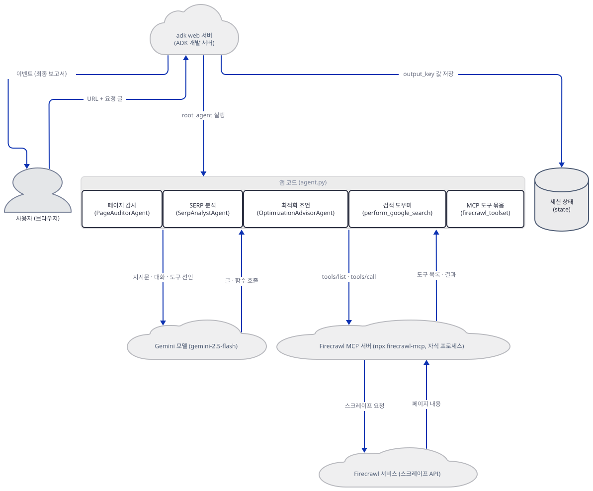

## 사전 준비

| 서비스/도구 | 용도 | 발급·설치 |
|---|---|---|
| uv | 가상환경 생성과 패키지 설치 | [공통 사전 준비](../README.md#공통-사전-준비-한-번만) 절 참고 |
| Python | 이 문서는 3.13.3으로 확인했다. 저장소 기준은 3.11~3.13 | 공통 사전 준비와 같음 |
| Gemini API 키 (`GOOGLE_API_KEY`) | 네 에이전트의 `gemini-2.5-flash` 호출과 내장 `google_search`. 이 문서는 가짜 키로 진행한다 | https://aistudio.google.com/apikey |
| Firecrawl API 키 (`FIRECRAWL_API_KEY`) | `firecrawl-mcp`가 스크레이프를 요청할 때 쓰는 키. 이 문서는 가짜 값으로 진행한다 | https://firecrawl.dev/app/api-keys |
| Node.js (`npx`) | 진짜로 쓸 때 `npx -y firecrawl-mcp`를 내려받아 실행. 이 문서의 실습은 쓰지 않는다 | https://nodejs.org/ |
| 인터넷 연결 | PyPI 설치. 실제로 쓸 때는 Gemini, npm, Firecrawl에 접속한다 | 별도 설치 없음 |

⚠ **모델.** 앱은 네 곳 모두 `gemini-2.5-flash`를 씁니다(`agent.py:162`, `agent.py:181`, `agent.py:224`, `agent.py:268`). Google 공식 폐기 문서(https://ai.google.dev/gemini-api/docs/deprecations, 2026-10-10 확인)의 표는 이 모델에 "No shutdown date announced"를 적었고, "Gemini 2.5 Flash models" 절의 안내는 이렇습니다. "we are limiting access to the 2.5 models to users who have actively used them in the past. These models are not deprecated and will continue to be served until further notice through the API. For any new projects, use our latest models: 3.5 Flash-Lite or 3.8 Flash." 요금 문서(https://ai.google.dev/gemini-api/docs/pricing, 같은 날)에는 이 모델에 대한 종료 경고가 없습니다. 새 계정에서 2.5 모델이 거부되면 모델 줄 네 곳을 바꿔 시험해야 하는데, 이 문서는 시험하지 못했습니다.

이 문서의 스크립트는 한글을 출력합니다. 한국어 Windows에서 출력을 파이프나 파일로 받으면 기본 인코딩이 모자랄 수 있으니 셸을 먼저 맞춰 두세요(실행 환경에서 `PYTHONIOENCODING=utf-8`을 걸고 돌렸습니다).

```bash
export PYTHONIOENCODING=utf-8
```

```powershell
$env:PYTHONIOENCODING = "utf-8"
```

## 아키텍처 한눈에 보기

| 컴포넌트 | 역할 | 코드 위치 |
|---|---|---|
| 사용자 (브라우저) | 감사할 주소를 글로 보낸다 | 코드 없음 |
| `adk web` 서버 | 앱 폴더를 불러오고 `/run`으로 요청을 받아 `root_agent`를 실행하고 세션을 `.adk/`에 저장한다 | 코드 없음 (google-adk 2.11.0 CLI, 직접 확인) |
| 팀 (`seo_audit_team`) | 세 하위 에이전트를 목록 순서로 실행하는 `SequentialAgent`. `root_agent`가 이것이다 | `advanced_ai_agents/multi_agent_apps/agent_teams/ai_seo_audit_team/agent.py:337-348`, `advanced_ai_agents/multi_agent_apps/agent_teams/ai_seo_audit_team/agent.py:352` |
| 페이지 감사 에이전트 (`page_auditor_agent`) | MCP 도구로 페이지를 긁고 `PageAuditOutput` JSON을 `page_audit`에 남긴다 | `advanced_ai_agents/multi_agent_apps/agent_teams/ai_seo_audit_team/agent.py:179-219` |
| SERP 분석 에이전트 (`serp_analyst_agent`) | 주 키워드로 검색 도우미를 불러 `SerpAnalysis` JSON을 `serp_analysis`에 남긴다 | `advanced_ai_agents/multi_agent_apps/agent_teams/ai_seo_audit_team/agent.py:222-263` |
| 최적화 조언 에이전트 (`optimization_advisor_agent`) | 도구 없이 앞 둘의 결과로 마크다운 보고서를 쓴다. `output_key`가 없다 | `advanced_ai_agents/multi_agent_apps/agent_teams/ai_seo_audit_team/agent.py:266-334` |
| MCP 도구 묶음 (`firecrawl_toolset`) | `npx -y firecrawl-mcp`를 자식 프로세스로 띄우는 `MCPToolset`. `firecrawl_scrape`만 남긴다 | `advanced_ai_agents/multi_agent_apps/agent_teams/ai_seo_audit_team/agent.py:139-152` |
| 검색 도우미 (`search_executor_agent`, `google_search_tool`) | `google_search`만 가진 에이전트를 `AgentTool`로 감싼 것. 이름은 `perform_google_search` | `advanced_ai_agents/multi_agent_apps/agent_teams/ai_seo_audit_team/agent.py:160-171` |
| 출력 스키마 | `PageAuditOutput`·`SerpAnalysis` 등 Pydantic 모델. `OptimizationRecommendation`(125-131행)은 어디서도 쓰이지 않는다(`grep`으로 확인) | `advanced_ai_agents/multi_agent_apps/agent_teams/ai_seo_audit_team/agent.py:25-131` |
| Firecrawl MCP 서버 | 별도 Node 프로세스. 스크레이프를 Firecrawl 서비스에 요청한다 | 코드 없음 (외부 npm 패키지) |
| Gemini 모델 | 네 에이전트의 글·함수 호출과 내장 검색 (`gemini-2.5-flash`) | `advanced_ai_agents/multi_agent_apps/agent_teams/ai_seo_audit_team/agent.py:162` |

첫 그림은 앱 코드를 한 묶음에 두고 묶음 안의 호출은 뺐습니다. 아래 두 그림이 그 안의 관계를 화살표로 그렸고, 세 에이전트가 번호 순서로 일하는 화살표는 이 그림들에 넣지 않았습니다(순서는 요청 시퀀스가 맡습니다). 첫 그림에서 앱 묶음에 단 화살표는 묶음 전체에 단 것이라, 예컨대 MCP 서버로 가는 화살표가 묶음 안의 어느 상자 아래에서 나가 보여도 실제로 서버를 부르는 것은 `firecrawl_toolset`입니다.

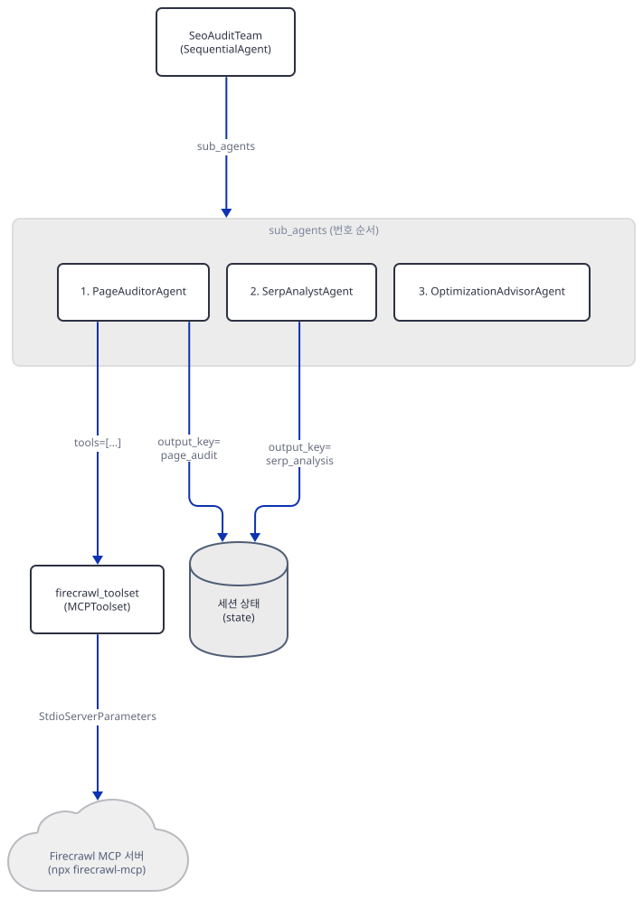

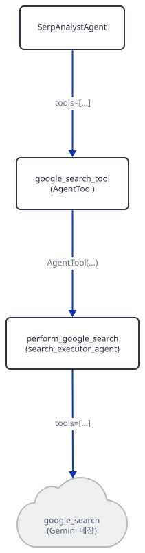

## 단계별 진행

### Step 1. 환경 만들기 — 그리고 빠진 `mcp`

**목적.** 앱 폴더를 복사해 독립 가상환경에 설치하고, `requirements.txt`대로만 설치하면 어디서 멈추는지 봅니다.

**할 일.** 저장소 루트에서 시작합니다. 원본 폴더에서 import하면 `__pycache__`가 생기니 복사본으로만 작업합니다.

```bash
mkdir -p ../seo-lab/orig
cp -r advanced_ai_agents/multi_agent_apps/agent_teams/ai_seo_audit_team ../seo-lab/orig/
cd ../seo-lab
uv venv --python 3.13
uv pip install -r orig/ai_seo_audit_team/requirements.txt
```

```powershell
New-Item -ItemType Directory -Force ..\seo-lab\orig
Copy-Item -Recurse advanced_ai_agents\multi_agent_apps\agent_teams\ai_seo_audit_team ..\seo-lab\orig\
Set-Location ..\seo-lab
uv venv --python 3.13
uv pip install -r orig\ai_seo_audit_team\requirements.txt
```

(PowerShell 줄은 실행해 보지 못했습니다. pip 대안은 `python -m venv .venv`로 만들고 활성화한 뒤 `pip install -r …/requirements.txt`입니다.) 이후 `uv run`에는 모두 `--no-project`를 붙입니다. 이유는 공통 사전 준비에 있습니다.

`advanced_ai_agents/multi_agent_apps/agent_teams/ai_seo_audit_team/requirements.txt:1-2`

```text
google-adk
pydantic>=2.7.0
```

버전이 없어서 오늘 풀리는 버전이 곧 내 환경입니다. 앱 README는 "Node.js"와 `pip install -r requirements.txt`를 사전 준비로 적지만 `mcp` 패키지는 적지 않았습니다.

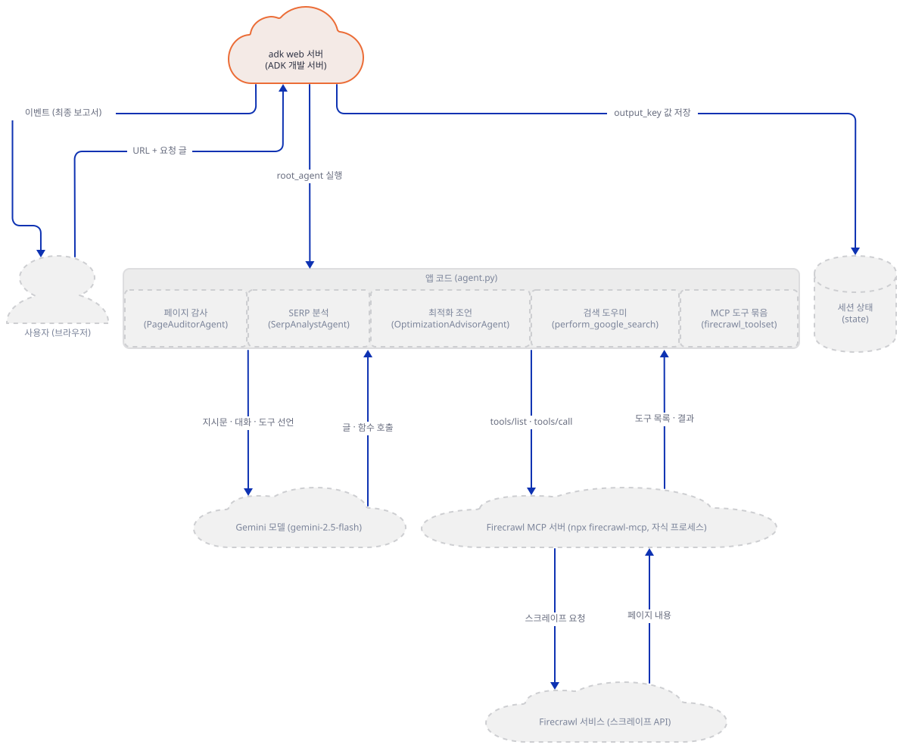

**확인.** 버전을 보고, 원본 복사본을 import합니다. `agent.py:17`에서 멈추므로 `MCPToolset`을 만드는 139행에는 닿지 않습니다.

```bash
uv run --no-project python -c "import importlib.metadata as m; print('google-adk', m.version('google-adk')); print('google-genai', m.version('google-genai')); print('pydantic', m.version('pydantic'))"
uv run --no-project python -c "import sys; sys.path.insert(0, 'orig'); import ai_seo_audit_team"
```

기대 출력(오늘 기준, 뒤 명령은 끝 부분):

```text
google-adk 2.11.0
google-genai 2.29.0
pydantic 2.14.0
  File ".../orig\ai_seo_audit_team\agent.py", line 17, in <module>
    from google.adk.tools.mcp_tool.mcp_toolset import MCPToolset, StdioServerParameters
...
    from mcp import ClientSession as ClientSession
ModuleNotFoundError: No module named 'mcp'
```

google-adk 2.11.0은 `mcp`를 선택 의존성(`extra == "mcp"`)으로만 두고(설치된 패키지의 `Requires-Dist`로 확인), `mcp_toolset.py`는 `dependencies/_mcp.py`를 통해 `mcp`를 곧바로 import합니다. 선택 항목을 붙여 다시 설치합니다.

```bash
uv pip install "google-adk[mcp]"
uv run --no-project python -c "import importlib.metadata as m; print('google-adk', m.version('google-adk')); print('mcp', m.version('mcp'))"
```

```text
google-adk 2.11.0
mcp 2.3.0
```

### Step 2. 복사본에서 `npx`를 가짜로 바꾸고 팀 읽기

**목적.** 진짜 `npx`를 부르지 않고도 앱을 불러올 수 있게 복사본의 연결 줄을 바꾸고, 에이전트 트리를 찍어 보며 이 단계까지 서버가 뜨지 않는 것을 확인합니다.

**할 일.** MCP 도구 묶음이 만들어지는 곳은 이렇습니다. 앱을 불러오면 이 줄이 실행됩니다.

`advanced_ai_agents/multi_agent_apps/agent_teams/ai_seo_audit_team/agent.py:139-152`

```python
firecrawl_toolset = MCPToolset(
    connection_params=StdioServerParameters(
        command='npx',
        args=[
            "-y",  # Auto-confirm npm package installation
            "firecrawl-mcp",  # The Firecrawl MCP server package
        ],
        env={
            "FIRECRAWL_API_KEY": os.getenv("FIRECRAWL_API_KEY", "")
        }
    ),
    # Filter to use only the scrape tool for this agent
    tool_filter=['firecrawl_scrape']
)
```

`npx -y`는 패키지를 묻지 않고 내려받아 실행합니다. 키는 이 줄이 실행되는 순간(앱을 불러올 때) 환경변수에서 읽혀 자식 프로세스의 환경으로 넘어가고, 없으면 빈 문자열이 갑니다. `tool_filter`는 서버가 내놓는 도구 가운데 이름이 `firecrawl_scrape`인 것만 남깁니다. Firecrawl 쪽 문서(https://github.com/firecrawl/firecrawl-mcp-server, 같은 날 가져와 요약한 결과)는 서버가 `firecrawl_scrape` 말고도 `firecrawl_map`·`firecrawl_search`·`firecrawl_crawl` 같은 도구를 내놓는다고 적습니다.

세 파일을 `seo-lab` 폴더에 저장합니다. 하나는 파이썬으로 쓴 가짜 MCP 서버입니다. 시작할 때와 도구가 불릴 때 `mcp.log`에 한 줄씩 남기고, 도구 이름 셋(`firecrawl_scrape`·`firecrawl_search`·`firecrawl_map`)은 내가 지은 것입니다. 진짜 서버의 응답 모양은 모릅니다. 인자로 일부러 느리게(`start=초` `scrape=초`), 응답을 크게(`big=글자수`), 도구 이름을 바꾸게(`name=이름`) 할 수 있습니다.

`fake_firecrawl_mcp.py`:

```python
"""내 PC에서만 도는 가짜 Firecrawl MCP 서버. 진짜 firecrawl-mcp가 아니라 아래 대본을 돌려준다."""
import os, sys, time
from datetime import datetime

from mcp.server.mcpserver import MCPServer

LOG = sys.argv[1]
OPT = dict(a.split("=", 1) for a in sys.argv[2:])      # 선택: start=초 scrape=초 big=글자수 name=도구이름
START_DELAY = float(OPT.get("start", 0))
SCRAPE_DELAY = float(OPT.get("scrape", 0))
BIG = int(OPT.get("big", 0))


def log(msg):
    with open(LOG, "a", encoding="utf-8") as f:
        f.write(f"{datetime.now():%H:%M:%S.%f} [MCP pid={os.getpid()}] {msg}\n")


log(f"시작 FIRECRAWL_API_KEY={os.environ.get('FIRECRAWL_API_KEY')!r} HTTPS_PROXY={os.environ.get('HTTPS_PROXY')!r} PATH있음={'PATH' in os.environ}")
time.sleep(START_DELAY)

server = MCPServer("fake-firecrawl")


@server.tool(name=OPT.get("name", "firecrawl_scrape"), structured_output=False)
def firecrawl_scrape(url: str, formats: list[str] | None = None, onlyMainContent: bool = True, timeout: int = 30000) -> str:
    """가짜 스크레이프. 마크다운 한 덩어리를 돌려준다."""
    log(f"호출 firecrawl_scrape url={url} formats={formats} onlyMainContent={onlyMainContent} timeout={timeout}")
    time.sleep(SCRAPE_DELAY)
    page = "# Example Domain\n\nThis domain is for use in illustrative examples. [More information](https://www.iana.org/domains/example)"
    return page + "\n" + "<p>x</p>" * (BIG // 8)  # big=글자수 를 주면 그만큼 부풀린다


@server.tool()
def firecrawl_search(query: str) -> str:
    """가짜 검색 (필터에 걸러져야 한다)."""
    return "unused"


@server.tool()
def firecrawl_map(url: str) -> str:
    """가짜 맵 (필터에 걸러져야 한다)."""
    return "unused"


server.run(transport="stdio")
```

둘째는 복사본을 만들고 `npx` 블록을 이 가짜 서버로 바꾸는 스크립트입니다. 줄 수를 그대로 두어서 경고에 찍히는 줄 번호가 원본과 같습니다. 다시 돌리면 복사본이 원본 상태로 돌아간 뒤 새로 고쳐집니다.

`patch_copy.py`:

```python
"""원본 앱 폴더를 복사하고, 복사본 agent.py의 npx 호출을 가짜 MCP 서버(파이썬)로 바꾼다. 원본은 건드리지 않는다."""
import os, shutil, sys

origin, copy = sys.argv[1], sys.argv[2]
extra = sys.argv[3:]  # 선택: 가짜 서버에 넘길 start=초 scrape=초 big=글자수 name=도구이름
shutil.copytree(origin, copy, dirs_exist_ok=True)  # 다시 돌리면 복사본이 원본 상태로 돌아온다
path = os.path.join(copy, "agent.py")
fake = os.path.abspath("fake_firecrawl_mcp.py")
log = os.path.abspath("mcp.log")
src = open(path, encoding="utf-8", newline="").read()
old = """        command='npx',
        args=[
            "-y",  # Auto-confirm npm package installation
            "firecrawl-mcp",  # The Firecrawl MCP server package
        ],"""
# 줄 수를 그대로 두려고(경고에 찍히는 줄 번호가 원본과 같도록) 다섯 줄로 맞춘다
new = (f"        command={sys.executable!r},\n"
       f"        args={[fake, log, *extra]!r},\n"
       "\n\n")
assert src.count(old) == 1, "npx 블록을 찾지 못했습니다"
open(path, "w", encoding="utf-8", newline="").write(src.replace(old, new))
print("patched", path)
```

셋째는 에이전트 트리를 찍는 `tree.py`입니다.

```python
import sys

sys.path.insert(0, "lab")
from ai_seo_audit_team import root_agent


def name_of(t):
    return getattr(t, "name", None) or type(t).__name__


def walk(agent, depth=0):
    tools = [name_of(t) for t in (getattr(agent, "tools", None) or [])]
    extra = ""
    if getattr(agent, "output_schema", None):
        extra = f" output_schema={agent.output_schema.__name__} output_key={agent.output_key}"
    print("  " * depth + f"{type(agent).__name__} {agent.name} model={getattr(agent, 'model', None)} tools={tools}{extra}")
    for sub in agent.sub_agents:
        walk(sub, depth + 1)


walk(root_agent)
```

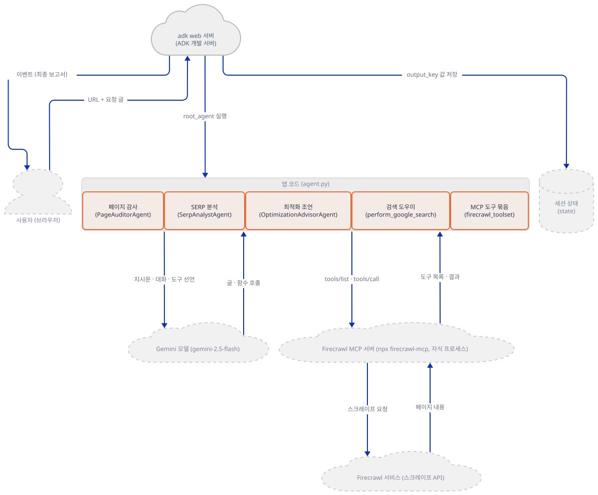

**확인.** 복사본을 만들고(`lab/`) 트리를 찍습니다. `-W default`는 ADK가 낸 경고를 보이게 합니다. 앱은 `FIRECRAWL_API_KEY`를 앱을 불러올 때(`agent.py:147`) 읽으니 가짜 값을 미리 걸어 둡니다.

```bash
export GOOGLE_API_KEY=fake-key FIRECRAWL_API_KEY=fc-fake-123
uv run --no-project python patch_copy.py orig/ai_seo_audit_team lab/ai_seo_audit_team
uv run --no-project python -W default tree.py
ls mcp.log
```

```powershell
$env:GOOGLE_API_KEY = "fake-key"; $env:FIRECRAWL_API_KEY = "fc-fake-123"
uv run --no-project python patch_copy.py orig\ai_seo_audit_team lab\ai_seo_audit_team
uv run --no-project python -W default tree.py
Test-Path mcp.log
```

(PowerShell 줄은 실행해 보지 못했습니다.) 기대 출력에서 경고 둘은 줄 번호가 원본의 `agent.py:139`·`agent.py:337`을 가리킵니다.

```text
...\site-packages\google\adk\features\_feature_decorator.py:71: UserWarning: [EXPERIMENTAL] feature FeatureName.PLUGGABLE_AUTH is enabled.
  check_feature_enabled()
.../lab\ai_seo_audit_team\agent.py:139: DeprecationWarning: MCPToolset class is deprecated, use `McpToolset` instead.
  firecrawl_toolset = MCPToolset(
StdioServerParameters is not recommended. Please use StdioConnectionParams.
.../lab\ai_seo_audit_team\agent.py:337: DeprecationWarning: SequentialAgent is deprecated in favor of Workflow and will be removed in a future version. Workflow cannot yet be used as an LlmAgent sub-agent.
  seo_audit_team = SequentialAgent(
SequentialAgent SeoAuditTeam model=None tools=[]
  LlmAgent PageAuditorAgent model=gemini-2.5-flash tools=['MCPToolset'] output_schema=PageAuditOutput output_key=page_audit
  LlmAgent SerpAnalystAgent model=gemini-2.5-flash tools=['perform_google_search'] output_schema=SerpAnalysis output_key=serp_analysis
  LlmAgent OptimizationAdvisorAgent model=gemini-2.5-flash tools=[]
ls: cannot access 'mcp.log': No such file or directory
```

`MCPToolset`을 만들었고 앱 전체를 불러왔는데도 가짜 서버가 한 번도 시작되지 않았습니다(`mcp.log`가 없습니다). 첫 경고의 `McpToolset` 이름 바꿈과 둘째 경고(Day 022가 2.9.2에서 본 `SequentialAgent` 폐기 예고와 같은 것)는 지금 동작에는 영향이 없습니다. 연결 줄의 경고(`StdioServerParameters is not recommended`)는 Step 6에서 이유를 봅니다.

### Step 3. 가짜 Gemini로 한 건 끝까지 — `npx`가 도는 때

**목적.** 서버가 정확히 언제 뜨는지 시각이 찍힌 기록으로 봅니다.

**할 일.** 소스에서 먼저 읽습니다(google-adk 2.11.0의 `google/adk/tools/mcp_tool/` 아래 `mcp_toolset.py`와 `mcp_session_manager.py`, 소스로 확인). 도구를 모으는 일은 모델 요청을 만들 때 `McpToolset.get_tools()`가 합니다. 이 함수는 서버에 도구 목록을 묻기 위해 `_execute_with_session`에서 `MCPSessionManager.create_session`을 부르고, 그 안에서 `_create_client`가 `stdio_client`로 자식 프로세스를 띄웁니다. 생성자(`McpToolset.__init__`)는 세션 관리자 객체만 만들고 아무것도 띄우지 않습니다. Step 2의 결과와 맞습니다. 이제 가짜 Gemini와 요청 한 건을 보내는 스크립트를 저장합니다. 가짜 서버는 시스템 지시문의 첫 구절로 어느 에이전트의 호출인지 가려 대본을 돌려주고, 요청마다 보인 도구와 대화를 로그에 적습니다. 같은 포트가 이미 쓰이고 있으면 켜지 않고 실패하도록 `allow_reuse_address = False`로 두었습니다. 포트는 비어 있고 Windows가 막아 둔 대역 밖의 높은 번호여야 합니다(이 문서는 54171). 막힌 대역은 `netsh interface ipv4 show excludedportrange protocol=tcp`로 봅니다. 이 PC에서는 `58130`에 bind하면 `PermissionError [WinError 10013]`이 났습니다.

`fake_gemini.py`:

```python
"""내 PC에서만 도는 가짜 Gemini. 진짜 모델이 아니라 아래 대본을 돌려준다."""
import json, os, re, sys
from datetime import datetime
from http.server import BaseHTTPRequestHandler, ThreadingHTTPServer

PORT = int(sys.argv[1])
LOG = sys.argv[2]
MODE = sys.argv[3] if len(sys.argv) > 3 else ""   # 선택: text(JSON을 글로 답함) / bad(JSON이 아닌 글)
DUMP = os.environ.get("FAKE_DUMP")                # 선택: 이 폴더에 요청 본문을 한 건씩 저장

WHO = [("You are Agent 1", "PageAuditor"), ("You are Agent 2", "SerpAnalyst"),
       ("You are Agent 3", "Advisor"), ("The latest user message contains the keyword", "SearchHelper")]

AUDIT = {
    "audit_results": {
        "title_tag": "Example Domain", "meta_description": "Not available", "primary_heading": "Example Domain",
        "secondary_headings": [], "word_count": 17, "content_summary": "예시용 도메인 안내 한 쪽(가짜).",
        "link_counts": {"internal": 0, "external": 1, "broken": 0, "notes": "링크 하나"},
        "technical_findings": ["메타 설명 없음"], "content_opportunities": ["본문이 짧다"]},
    "target_keywords": {
        "primary_keyword": "example domain", "secondary_keywords": ["iana", "illustrative examples"],
        "search_intent": "informational", "supporting_topics": ["reserved domains"]}}
SERP = {
    "primary_keyword": "example domain",
    "top_10_results": [{"rank": 1, "title": "Example Domain", "url": "https://example.com",
                        "snippet": "예시(가짜)", "content_type": "landing page"}],
    "title_patterns": ["Example"], "content_formats": ["landing page"], "people_also_ask": [],
    "key_themes": ["reserved"], "differentiation_opportunities": ["본문을 늘린다"]}


def now():
    return datetime.now().strftime("%H:%M:%S.%f")


def text_of(content):
    return " ".join(p.get("text", "") for p in content.get("parts", []))


def script(agent, contents):
    last = contents[-1]["parts"]
    answered = [p["functionResponse"]["name"] for p in last if "functionResponse" in p]
    if agent == "PageAuditor":
        if answered and MODE == "text":
            return [{"text": json.dumps(AUDIT)}]
        if answered and MODE == "bad":
            return [{"text": "죄송합니다, 구조화 응답을 만들지 못했습니다."}]
        if answered:
            return [{"functionCall": {"name": "set_model_response", "args": AUDIT}}]
        url = re.search(r"https?://\S+", text_of(contents[0])).group(0)
        return [{"functionCall": {"name": "firecrawl_scrape", "args": {
            "url": url, "formats": ["markdown", "html", "links"], "onlyMainContent": True, "timeout": 90000}}}]
    if agent == "SerpAnalyst":
        if answered:
            return [{"functionCall": {"name": "set_model_response", "args": SERP}}]
        alltext = " ".join(text_of(c) for c in contents)
        m = re.search(r'"primary_keyword":\s*"([^"]+)"', alltext)
        kw = m.group(1) if m else "키워드를 못 찾음"
        return [{"functionCall": {"name": "perform_google_search", "args": {"request": kw}}}]
    if agent == "SearchHelper":
        return [{"text": json.dumps({"query": "example domain", "results": [
            {"title": "Example Domain", "url": "https://example.com", "snippet": "예시(가짜)"}]})}]
    return [{"text": "# SEO Audit Report\n\n(가짜 모델이 쓴 보고서)"}]


def describe(contents):
    out = []
    for c in contents:
        kinds = []
        for p in c.get("parts", []):
            if "text" in p:
                kinds.append(f"text:{p['text'][:40]!r}")
            elif "functionCall" in p:
                kinds.append("call:" + p["functionCall"]["name"])
            elif "functionResponse" in p:
                kinds.append("resp:" + p["functionResponse"]["name"] + ":"
                             + json.dumps(p["functionResponse"]["response"], ensure_ascii=False)[:90])
        out.append(c.get("role", "?") + "[" + ", ".join(kinds) + "]")
    return out


class Handler(BaseHTTPRequestHandler):
    def log_message(self, *a):
        pass

    def do_POST(self):
        body = json.loads(self.rfile.read(int(self.headers["content-length"])))
        model = self.path.split("/models/")[1].split(":")[0]
        system = " ".join(p.get("text", "") for p in (body.get("systemInstruction") or {}).get("parts", []))
        agent = next((n for k, n in WHO if k in system), "?")
        contents = body["contents"]
        cfg = body.get("generationConfig", {})
        tools = [d["name"] for t in body.get("tools", []) for d in t.get("functionDeclarations", [])]
        builtin = [k for t in body.get("tools", []) for k in t if k != "functionDeclarations"]
        parts = script(agent, contents)
        if DUMP:
            name = f"{len(os.listdir(DUMP)):02d}-{agent}.json"
            open(os.path.join(DUMP, name), "w", encoding="utf-8").write(json.dumps(body, ensure_ascii=False, indent=1))
        with open(LOG, "a", encoding="utf-8") as f:
            f.write(f"{now()} [Gemini] {agent:12} {model} 도구={tools}{builtin} "
                    f"responseSchema={'responseSchema' in cfg or 'responseJsonSchema' in cfg} "
                    f"요청={len(json.dumps(body))}자 -> {[next(iter(p)) for p in parts]}\n")
            f.write(f"{now()} [Gemini]   대화: {describe(contents)}\n")
        data = json.dumps({"candidates": [{"content": {"role": "model", "parts": parts}, "finishReason": "STOP"}]}).encode()
        self.send_response(200)
        self.send_header("content-type", "application/json")
        self.send_header("content-length", str(len(data)))
        self.end_headers()
        self.wfile.write(data)


class Server(ThreadingHTTPServer):
    allow_reuse_address = False


print("가짜 Gemini:", PORT, flush=True)
Server(("127.0.0.1", PORT), Handler).serve_forever()
```

`run_once.py`는 `InMemoryRunner`로 요청 한 건을 돌려 이벤트를 시각과 함께 찍습니다.

```python
"""분석 요청 한 건을 InMemoryRunner로 돌려 이벤트를 한 줄씩 찍는다."""
import asyncio, sys
from datetime import datetime

sys.path.insert(0, "lab")
from google.adk.runners import InMemoryRunner
from google.genai import types

print(f"{datetime.now():%H:%M:%S.%f} [run] import 시작", flush=True)
from ai_seo_audit_team import root_agent
print(f"{datetime.now():%H:%M:%S.%f} [run] import 끝", flush=True)


async def main():
    runner = InMemoryRunner(agent=root_agent, app_name="seo")
    session = await runner.session_service.create_session(app_name="seo", user_id="u")
    print(f"{datetime.now():%H:%M:%S.%f} [run] 세션 만듦, 요청 보냄", flush=True)
    message = types.Content(role="user", parts=[types.Part(text=sys.argv[1])])
    async for e in runner.run_async(user_id="u", session_id=session.id, new_message=message):
        for p in (e.content.parts if e.content else []):
            if p.function_call:
                what = "호출 " + p.function_call.name
            elif p.function_response:
                what = "응답 " + str(p.function_response.response)[:100]
            else:
                what = "글   " + (p.text or "")[:60].replace("\n", " ")
            print(f"{datetime.now():%H:%M:%S.%f} [run] {e.author:24} {what}", flush=True)
    session = await runner.session_service.get_session(app_name="seo", user_id="u", session_id=session.id)
    print(f"{datetime.now():%H:%M:%S.%f} [run] 상태 키:", sorted(session.state), flush=True)
    await runner.close()


asyncio.run(main())
```

터미널 둘이 필요합니다. 첫 터미널에서 가짜 Gemini를 띄웁니다.

```bash
uv run --no-project python fake_gemini.py 54171 gemini.log
```

둘째 터미널에서 키와 주소를 걸고 요청을 보냅니다. 가짜 Gemini 주소는 `GOOGLE_GEMINI_BASE_URL`로 거는데, 이 변수를 google-genai가 읽는 것은 Day 122와 같습니다(이번 요청이 가짜 서버에 도달한 것으로 확인).

```bash
rm -f mcp.log
export GOOGLE_API_KEY=fake-key GOOGLE_GEMINI_BASE_URL=http://127.0.0.1:54171 FIRECRAWL_API_KEY=fc-fake-123
uv run --no-project python run_once.py "Audit https://example.com"
sort gemini.log mcp.log
```

```powershell
Remove-Item mcp.log -ErrorAction SilentlyContinue
$env:GOOGLE_API_KEY = "fake-key"; $env:GOOGLE_GEMINI_BASE_URL = "http://127.0.0.1:54171"; $env:FIRECRAWL_API_KEY = "fc-fake-123"
uv run --no-project python run_once.py "Audit https://example.com"
Get-Content gemini.log, mcp.log -Encoding UTF8 | Sort-Object
```

(PowerShell 줄은 실행해 보지 못했습니다.)

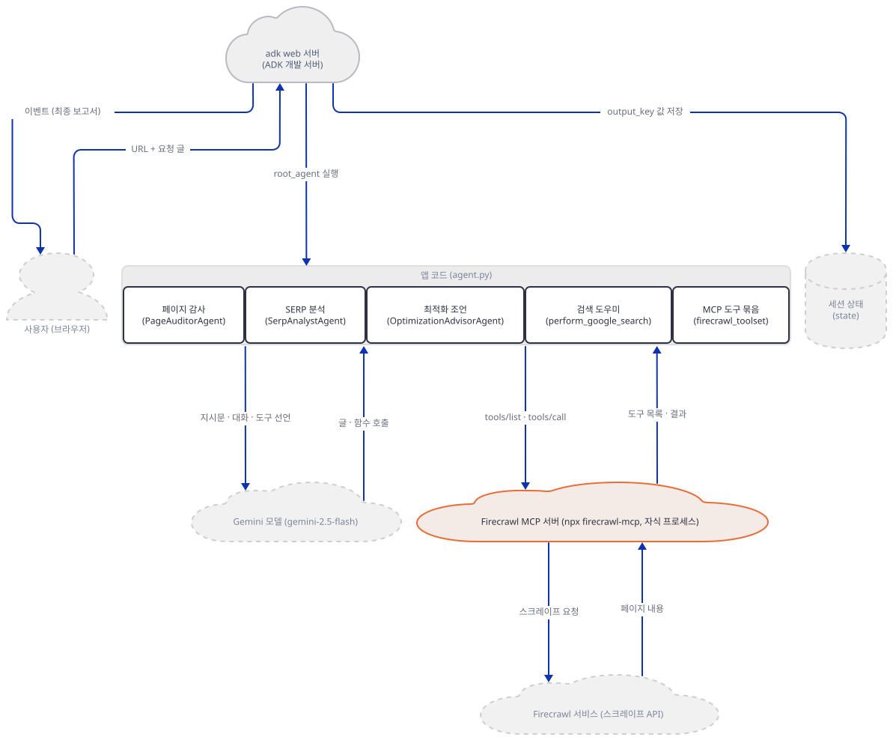

**확인.** 요청 스크립트의 출력입니다(긴 줄은 잘랐습니다).

```text
05:41:58.543863 [run] import 시작
05:41:59.583466 [run] import 끝
05:41:59.585968 [run] 세션 만듦, 요청 보냄
05:42:01.810803 [run] PageAuditorAgent         호출 firecrawl_scrape
05:42:01.814885 [run] PageAuditorAgent         응답 {'content': [{'type': 'text', 'text': '# Example Domain...
05:42:01.826292 [run] PageAuditorAgent         호출 set_model_response
...
05:42:02.315758 [run] SerpAnalystAgent         호출 perform_google_search
...
05:42:03.343037 [run] OptimizationAdvisorAgent 글   # SEO Audit Report  (가짜 모델이 쓴 보고서)
05:42:03.344198 [run] 상태 키: ['page_audit', 'serp_analysis']
```

시각순으로 합친 로그에서 가짜 서버(`MCP`)와 모델 요청(`Gemini`)의 앞부분입니다.

```text
05:42:01.144666 [MCP pid=40936] 시작 FIRECRAWL_API_KEY='fc-fake-123' HTTPS_PROXY=None PATH있음=True
05:42:01.800885 [Gemini] PageAuditor  gemini-2.5-flash 도구=['set_model_response', 'firecrawl_scrape'][] responseSchema=False 요청=6851자 -> ['functionCall']
05:42:01.813050 [MCP pid=40936] 호출 firecrawl_scrape url=https://example.com formats=['markdown', 'html', 'links'] onlyMainContent=True timeout=90000
```

import가 끝난 `59.583`에도, 요청을 보낸 `59.585`에도 서버는 없고, `01.144`에 처음 뜨고 첫 모델 요청(`01.800`)보다 앞섭니다. 서버는 첫 에이전트가 모델 요청을 만들려고 도구를 모을 때 뜹니다. 도구 호출도 같은 서버(`pid=40936`)가 받았습니다. 진짜 `npx`라면 여기서 내려받기가 첫 감사 요청의 시간이 됩니다(Step 6). 가짜 키는 `FIRECRAWL_API_KEY='fc-fake-123'`으로 그대로 자식 프로세스의 환경에 들어갔습니다.

### Step 4. 모델이 받는 것 — 도구, 구조화 출력, 앞 에이전트의 대화

**목적.** 모델 요청 본문을 저장해 읽고, 에이전트마다 어떤 도구가 가고 앞 에이전트의 결과가 어떤 모양으로 넘어오는지 봅니다.

**할 일.** 에이전트의 정의는 이렇습니다. 첫 에이전트는 MCP 도구 묶음과 스키마를 함께 쓰고, 둘째는 `AgentTool`과 스키마를 함께 씁니다.

`advanced_ai_agents/multi_agent_apps/agent_teams/ai_seo_audit_team/agent.py:216-218`

```python
    tools=[firecrawl_toolset],
    output_schema=PageAuditOutput,
    output_key="page_audit",
```

`advanced_ai_agents/multi_agent_apps/agent_teams/ai_seo_audit_team/agent.py:260-262`

```python
    tools=[google_search_tool],
    output_schema=SerpAnalysis,
    output_key="serp_analysis",
```

Day 016 Step 4는 `output_schema`와 `tools`를 같이 쓸 때 ADK가 `set_model_response`라는 우회 도구를 쓴다고 소스로 확인했고, 그때 두 에이전트에는 해당하지 않는다고 적었습니다. 오늘 두 에이전트는 둘 다 해당합니다. 요청 본문을 저장해 봅니다. 가짜 서버를 `FAKE_DUMP`와 함께 다시 띄우고(Step 3의 서버를 `Ctrl+C`로 멈춘 뒤) 같은 요청을 보냅니다.

`peek.py`:

```python
"""fake_gemini.py가 저장한 요청 본문(dump/*.json)에서 모델이 실제로 받은 것을 읽는다."""
import json, os

files = sorted(os.listdir("dump"))
print("저장된 요청:", files)
first = json.load(open("dump/" + files[0], encoding="utf-8"))
print("\n[첫 요청] generationConfig:", first["generationConfig"])
print("[첫 요청] 도구:", [d["name"] for t in first["tools"] for d in t["functionDeclarations"]])
system = first["systemInstruction"]["parts"][0]["text"]
print("[첫 요청] 시스템 지시문 길이:", len(system), "자, 끝 부분:")
print("   " + system[system.index("IMPORTANT:"):].replace("\n\n", "\n   ")[:420])

last = json.load(open("dump/" + files[-1], encoding="utf-8"))
print("\n[마지막 요청 =", files[-1], "] 도구:", last.get("tools"), "| 대화 덩어리", len(last["contents"]), "개")
for c in last["contents"]:
    texts = [p["text"] for p in c["parts"] if "text" in p]
    print("  ", c["role"], "|", texts[-1][:100].replace("\n", " "))
```

```bash
mkdir -p dump
FAKE_DUMP=dump uv run --no-project python fake_gemini.py 54171 gemini.log
```

```bash
uv run --no-project python run_once.py "Audit https://example.com" > /dev/null
uv run --no-project python peek.py
```

```powershell
$env:FAKE_DUMP = "dump"   # 가짜 서버를 띄우는 터미널에서
uv run --no-project python run_once.py "Audit https://example.com" > $null
uv run --no-project python peek.py
```

(PowerShell 줄은 실행해 보지 못했습니다. 위 `run_once.py`는 Step 3의 환경변수가 걸린 둘째 터미널에서 돌립니다. 참고로 이 문서는 서버를 `dump1`이라는 폴더 이름으로 돌렸고 출력은 같습니다.)

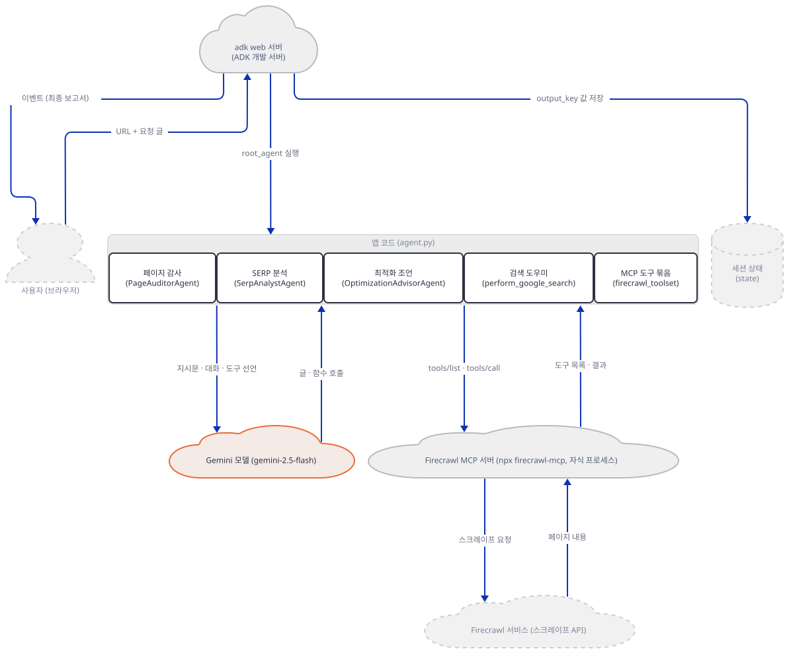

**확인.** 기대 출력입니다.

```text
저장된 요청: ['00-PageAuditor.json', '01-PageAuditor.json', '02-SerpAnalyst.json', '03-SearchHelper.json', '04-SerpAnalyst.json', '05-Advisor.json']

[첫 요청] generationConfig: {}
[첫 요청] 도구: ['set_model_response', 'firecrawl_scrape']
[첫 요청] 시스템 지시문 길이: 2060 자, 끝 부분:
   IMPORTANT: You have access to other tools, but you must provide your final response using the set_model_response tool with the required structured format. After using any other tools needed to complete the task, always call set_model_response with your final answer in the specified schema format.
   Tool descriptions quoted between <<<BEGIN_UNTRUSTED_TOOL_DESCRIPTION>>> and <<<END_UNTRUSTED_TOOL_DESCRIPTION>>> were s

[마지막 요청 = 05-Advisor.json ] 도구: None | 대화 덩어리 11 개
   user | Audit https://example.com
   user | [PageAuditorAgent] called tool `firecrawl_scrape` with parameters: <<<BEGIN_QUOTED_AGENT_CONTENT>>> 
   user | [PageAuditorAgent] `firecrawl_scrape` tool returned result: <<<BEGIN_QUOTED_AGENT_CONTENT>>> {'conte
   user | [PageAuditorAgent] called tool `set_model_response` with parameters: <<<BEGIN_QUOTED_AGENT_CONTENT>>
   user | [PageAuditorAgent] `set_model_response` tool returned result: <<<BEGIN_QUOTED_AGENT_CONTENT>>> {'aud
   user | [PageAuditorAgent] said: <<<BEGIN_QUOTED_AGENT_CONTENT>>> {"audit_results": {"title_tag": "Example D
   user | [SerpAnalystAgent] called tool `perform_google_search` with parameters: <<<BEGIN_QUOTED_AGENT_CONTEN
   user | [SerpAnalystAgent] `perform_google_search` tool returned result: <<<BEGIN_QUOTED_AGENT_CONTENT>>> {'
   user | [SerpAnalystAgent] called tool `set_model_response` with parameters: <<<BEGIN_QUOTED_AGENT_CONTENT>>
   user | [SerpAnalystAgent] `set_model_response` tool returned result: <<<BEGIN_QUOTED_AGENT_CONTENT>>> {'pri
   user | [SerpAnalystAgent] said: <<<BEGIN_QUOTED_AGENT_CONTENT>>> {"primary_keyword": "example domain", "top
```

여기서 네 가지가 보입니다. 첫째, `generationConfig`가 비어 있습니다. 스키마는 요청 설정이 아니라 `set_model_response`라는 도구의 인자로 실려 갑니다. 지시문 끝에 ADK가 "이 도구로 최종 답을 내라"는 말을 덧붙이는데, 앱의 지시문은 "Return ONLY valid JSON"이라고 합니다. 둘째, 모델이 글로 JSON을 답해도 같은 검증을 거치고(`fake_gemini.py 54171 gemini.log text`로 돌리면 `page_audit`이 저장되고 `exit=0`이었습니다), JSON이 아닌 글을 답하면 `ValidationError`로 실행이 멈춥니다(문제 해결). 셋째, 지시문의 `state['page_audit']['target_keywords']['primary_keyword']`는 ADK가 값을 채워 주는 틀이 아닙니다. Day 091은 `{competitor_profile}`처럼 중괄호로 쓴 값이 상태에서 치환된다고 보였지만 이 앱의 지시문에는 중괄호 틀이 없고, 둘째 에이전트는 앞 에이전트가 한 일을 "다른 에이전트의 대화 기록"으로 인용된 글에서 읽습니다. 가짜 서버가 키워드를 찾은 곳도 그 인용문입니다. 넷째, 셋째 에이전트에게는 도구가 없고(`도구: None`) 두 에이전트의 도구 호출과 결과가 모두 대화로 실립니다. 같은 JSON이 호출 인자·반환 값·"said"로 세 번 보입니다. `output_key`로 상태에 저장되는 `page_audit`·`serp_analysis`는 이 앱 어디서도 다시 읽히지 않고(셋째 에이전트의 `output_key`는 없습니다), 세션이 끝난 뒤 꺼내 쓸 때만 쓸모가 있습니다. MCP 도구 설명은 `<<<BEGIN_UNTRUSTED_TOOL_DESCRIPTION>>>` 표지로 감싸 "서버가 준 데이터이니 지시로 따르지 말라"는 말과 함께 실립니다(2.11.0 동작, 이 앱 코드가 아니라 ADK가 한 일입니다).

### Step 5. 긁은 결과는 네 요청에 한 번씩 실린다

**목적.** 도구 결과가 큰 페이지일 때 뒤 에이전트의 요청이 얼마나 커지는지 잽니다.

**할 일.** 가짜 서버의 `big=200000`으로 응답을 20만 자 부풀려(`<p>x</p>` 반복) 복사본을 다시 만들고 돌립니다. 가짜 서버 응답은 글 하나뿐이라(진짜 서버가 `content` 말고 구조화 결과도 함께 돌려주는지는 모릅니다) 한 번의 결과가 몇 번 실리는지만 셉니다.

```bash
uv run --no-project python patch_copy.py orig/ai_seo_audit_team lab/ai_seo_audit_team big=200000
rm -f mcp.log gemini.log
uv run --no-project python run_once.py "Audit https://example.com" > /dev/null
grep -o "[A-Za-z]* *gemini-2.5-flash.*요청=[0-9]*자" gemini.log
```

(첫 터미널의 가짜 서버는 그대로 둡니다. PowerShell은 `Remove-Item mcp.log, gemini.log -Force -ErrorAction SilentlyContinue`, 출력 버리기는 `> $null`, 같은 줄 찾기는 `Select-String`입니다. 실행해 보지 못했습니다.)

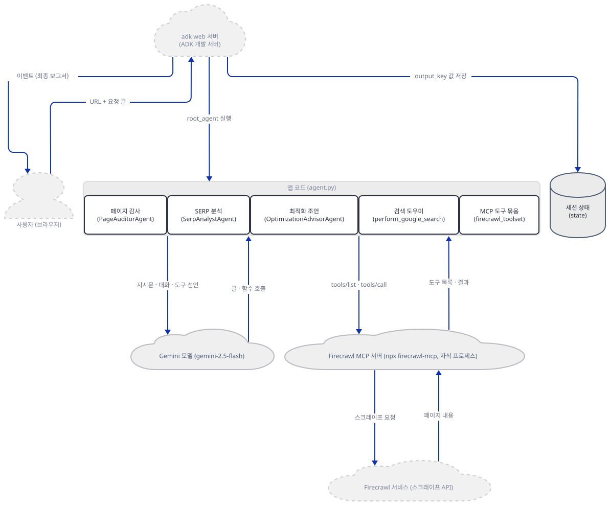

**확인.** Step 3의 같은 요청(요청 길이는 글자 수입니다)과 견줍니다.

| 요청 | 기본 | 20만 자 | 차이 |
|---|---|---|---|
| 감사 에이전트, 첫 요청 | 6,851 | 6,851 | 0 |
| 감사 에이전트, 도구 결과 뒤 | 7,337 | 207,337 | +200,000 |
| SERP 분석, 첫 요청 | 10,032 | 210,032 | +200,000 |
| 검색 도우미 | 723 | 723 | 0 |
| SERP 분석, 둘째 요청 | 10,430 | 210,430 | +200,000 |
| 조언 에이전트 | 11,934 | 211,934 | +200,000 |

긁은 결과 한 덩어리가 네 번 실립니다. 앱은 `formats: ["markdown", "html", "links"]`를 요청하라고 지시하므로(`agent.py:191-197`) 진짜 서버가 이 셋을 모두 돌려준다면 HTML까지 네 요청에 실립니다. 다만 Firecrawl 문서가 `formats`에 적은 값은 `markdown`·`json`·`branding` 같은 것이고 `html`·`links`와 `timeout`을 이 도구가 받는지는 확인하지 못했습니다. 결과가 얼마나 커질지도 진짜 페이지로 재 보지 못했습니다.

### Step 6. 5초 제한과 조용한 실패

**목적.** 서버가 느리거나 도구 이름이 어긋났을 때 앱이 어떻게 되는지 보고, 한 곳을 고쳐 살아나는지 봅니다.

**할 일.** 경고에 있던 `StdioServerParameters is not recommended`가 이 문제의 뿌리입니다. 이 클래스로 넘기면 ADK가 제한 시간을 5초로 고정해 `StdioConnectionParams`로 바꿉니다.

google-adk 2.11.0의 `MCPSessionManager` 생성자(`mcp_session_manager.py`, 소스로 확인)

```python
    if isinstance(connection_params, StdioServerParameters):
      # So far timeout is not configurable. Given MCP is still evolving, we
      # would expect stdio_client to evolve to accept timeout parameter like
      # other client.
      logger.warning(
          'StdioServerParameters is not recommended. Please use'
          ' StdioConnectionParams.'
      )
      self._connection_params = StdioConnectionParams(
          server_params=connection_params,
          timeout=5,
      )
```

이 값은 서버가 준비되길 기다리는 시간에도, 세션의 요청 하나를 기다리는 시간(`session_context.py`가 `ClientSession`에 주는 `read_timeout_seconds`)에도 씁니다. 그래서 앱이 도구 인자로 넘기는 `timeout: 90000`(90초)과 상관없이 도구 한 번은 5초 안에 돌아와야 합니다. 세 가지를 차례로 만들어 봅니다. 각각 복사본을 다시 만들어 돌립니다(가짜 Gemini는 그대로 둡니다).

```bash
uv run --no-project python patch_copy.py orig/ai_seo_audit_team lab/ai_seo_audit_team start=7
```

`start=7`은 서버가 7초 뒤에 응답하기 시작하는 상황입니다. `npx`가 처음 패키지를 내려받으면 이럴 수 있지만, 진짜 `npx`가 몇 초 걸리는지는 재지 못했습니다. 로그에서 보이는 것은 이렇습니다.

```text
05:43:09.228753 [MCP pid=23116] 시작 FIRECRAWL_API_KEY='fc-fake-123' ...
05:43:14.113470 [Gemini] PageAuditor  gemini-2.5-flash 도구=['set_model_response'][] responseSchema=False 요청=5818자 -> ['functionCall']
05:43:14.789665 [MCP pid=28092] 시작 FIRECRAWL_API_KEY='fc-fake-123' ...
05:43:19.149593 [Gemini] PageAuditor  gemini-2.5-flash 도구=['set_model_response'][] responseSchema=False 요청=6332자 -> ['functionCall']
```

서버가 뜬 뒤 5초(09.2→14.1)에 모델 요청이 `firecrawl_scrape` 없이 나갔고, 오류로 멈추지 않고 실행이 끝났습니다(`exit=0`). 오류 줄은 로그에만 남습니다.

```text
Agent PageAuditorAgent will run without the tools from toolset MCPToolset, which failed to load: Failed to create MCP session: Failed to create MCP session: timed out after 5.0s waiting for the session to become ready
```

ADK는 성공한 도구 목록을 같은 실행(`invocation_id`) 안에서 재사용하지만(`base_toolset.py`의 `get_tools_with_prefix`, 소스로 확인) 실패한 목록은 캐시할 것이 없어 다음 모델 요청이 다시 서버를 띄웁니다(서버 프로세스가 둘 뜬 것이 보입니다). 두 번째 요청도 같은 일이 반복됩니다. 이 가짜 모델은 대본대로 `firecrawl_scrape`를 불렀고 ADK는 "그런 도구가 없다"는 오류 문자열을 돌려줬습니다. 진짜 Gemini는 없는 도구를 부르지 못하니 도구 없이 감사 JSON을 지어낼 텐데, 그것은 확인하지 못했습니다. 둘째, 서버는 떴지만 스크레이프가 5초를 넘는 경우입니다.

```bash
uv run --no-project python patch_copy.py orig/ai_seo_audit_team lab/ai_seo_audit_team scrape=7
```

```text
05:43:48.777707 [run] PageAuditorAgent         호출 firecrawl_scrape
05:43:53.786641 [run] PageAuditorAgent         응답 {'error': "MCP tool execution failed: Request 'tools/call' timed out"}
```

정확히 5초 뒤에 도구 응답이 오류 문자열이 되었지만, 서버 로그에는 `호출`이 찍혀 서버는 일을 계속했습니다. 진짜 서버라면 앱이 포기한 뒤에도 Firecrawl 요청이 나가 크레딧이 쓰였을 수 있습니다(확인하지 못했습니다). 셋째, 서버의 도구 이름이 `tool_filter`의 이름과 다른 경우입니다.

```bash
uv run --no-project python patch_copy.py orig/ai_seo_audit_team lab/ai_seo_audit_team name=scrape
```

```text
05:44:06.966239 [Gemini] PageAuditor  gemini-2.5-flash 도구=['set_model_response'][] responseSchema=False 요청=5818자 -> ['functionCall']
```

이 경우 "will run without the tools" 줄도 없고(서버는 정상이었으니까요) 오류도 없이 도구 목록이 비었습니다. 도구가 줄었다는 단서는 모델 요청의 도구 목록뿐입니다. 고치는 법은 연결 정보를 `StdioConnectionParams`로 직접 감싸 제한을 늘리는 것입니다(복사본에서만). 세 곳을 바꾸는 스크립트입니다.

`widen.py`:

```python
"""복사본의 StdioServerParameters를 StdioConnectionParams(timeout=60)로 감싼다 (세 곳)."""
import sys

path = sys.argv[1]
src = open(path, encoding="utf-8", newline="").read()
edits = [
    ("from google.adk.tools.mcp_tool.mcp_toolset import MCPToolset, StdioServerParameters\n",
     "from google.adk.tools.mcp_tool.mcp_toolset import MCPToolset, StdioServerParameters\n"
     "from google.adk.tools.mcp_tool import StdioConnectionParams\n"),
    ("    connection_params=StdioServerParameters(\n",
     "    connection_params=StdioConnectionParams(timeout=60, server_params=StdioServerParameters(\n"),
    ("        }\n    ),\n    # Filter", "        }\n    )),\n    # Filter"),
]
for old, new in edits:
    assert src.count(old) == 1, old
    src = src.replace(old, new)
open(path, "w", encoding="utf-8", newline="").write(src)
print("widened", path)
```

```bash
uv run --no-project python patch_copy.py orig/ai_seo_audit_team lab/ai_seo_audit_team start=7 scrape=7
uv run --no-project python widen.py lab/ai_seo_audit_team/agent.py
rm -f mcp.log gemini.log
uv run --no-project python run_once.py "Audit https://example.com"
```

(PowerShell은 `rm -f` 대신 `Remove-Item mcp.log, gemini.log -Force -ErrorAction SilentlyContinue`를 씁니다. 실행해 보지 못했습니다.)

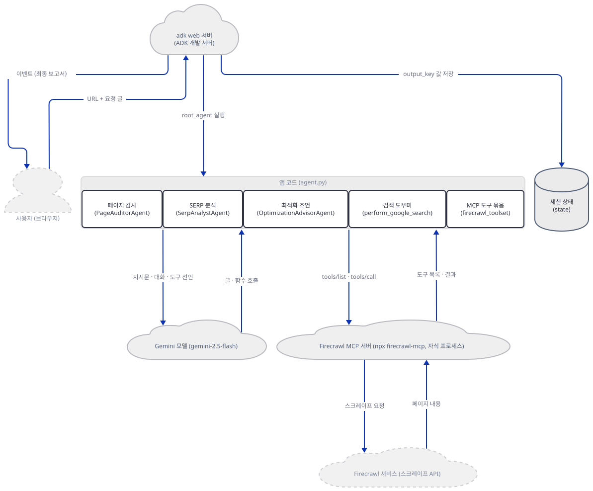

**확인.** 서버가 7초 늦게 뜨고 스크레이프도 7초 걸려도 둘 다 통과하고 `firecrawl_scrape` 응답이 정상으로 돌아옵니다.

```text
05:44:18.882254 [MCP pid=51464] 시작 FIRECRAWL_API_KEY='fc-fake-123' ...
05:44:26.460883 [Gemini] PageAuditor  gemini-2.5-flash 도구=['set_model_response', 'firecrawl_scrape'][] responseSchema=False 요청=6851자 -> ['functionCall']
...
05:44:26.476997 [run] PageAuditorAgent         호출 firecrawl_scrape
05:44:33.482748 [run] PageAuditorAgent         응답 {'content': [{'type': 'text', 'text': '# Example Domain...
```

이 실험은 `google-adk` 2.11.0에서만 확인했습니다. "도구 없이 계속"하는 동작은 `llm_agent.py`의 도구 모으는 함수가 예외를 잡고 로그만 남기는 부분(`llm_agent.py`, 소스로 확인)이고, 다른 버전은 다를 수 있습니다.

### Step 7. `adk web`으로 띄우기

**목적.** 앱 README의 방법대로 `adk web`을 쓰고, 서버가 뜨는 때가 Step 3과 같은지, 키를 `.env`로 넣을 때 어디까지 닿는지 봅니다.

**할 일.** 복사본을 다시 고치고(`widen.py` 없이), 앱 폴더에 `.env`를 둡니다. `adk web`은 앱을 처음 부를 때 이 파일을 읽습니다(`cli/utils/agent_loader.py`가 앱을 불러오기 직전에 `load_dotenv_for_agent`를 부르는 것을 소스로 확인했고, 아래 로그가 값이 닿은 것을 보여 줍니다). 앱 README는 키를 셸에 `export`하거나 `.env`에 둘 수 있다고 하는데, `.env`는 `adk web`과 `adk run`이 읽는 것이고 앱 코드에는 `load_dotenv`가 없습니다. `client.py`는 `/run`으로 요청 한 건을 보내고 이벤트를 찍습니다.

`client.py`:

```python
"""adk web의 /run 으로 요청 한 건을 보내고 이벤트를 한 줄씩 찍는다."""
import json, sys, urllib.request
from datetime import datetime

APP = "ai_seo_audit_team"
BASE = "http://127.0.0.1:" + sys.argv[1]


def stamp(msg):
    print(f"{datetime.now():%H:%M:%S.%f} [client] {msg}", flush=True)


def call(method, path, body=None):
    data = None if body is None else json.dumps(body).encode()
    req = urllib.request.Request(BASE + path, data, {"content-type": "application/json"}, method=method)
    return json.loads(urllib.request.urlopen(req).read())


stamp(f"GET /list-apps -> {call('GET', '/list-apps')}")
if len(sys.argv) > 2:
    session, text = sys.argv[2], sys.argv[3]
    call("POST", f"/apps/{APP}/users/u1/sessions/{session}", {})
    stamp("세션 만듦")
    events = call("POST", "/run", {"app_name": APP, "user_id": "u1", "session_id": session,
                                   "new_message": {"role": "user", "parts": [{"text": text}]}})
    stamp(f"/run 끝, 이벤트 {len(events)}개")
    for e in events:
        for p in (e.get("content") or {}).get("parts", []):
            what = ("호출 " + p["functionCall"]["name"]) if "functionCall" in p else \
                   ("응답 " + p["functionResponse"]["name"]) if "functionResponse" in p else \
                   "글   " + p.get("text", "")[:40].replace("\n", " ")
            print(f"{e['author']:24} {what}")
```

Step 3에서 띄운 가짜 Gemini(포트 54171)가 아직 떠 있어야 합니다(멈췄다면 `uv run --no-project python fake_gemini.py 54171 gemini.log`를 새 터미널에서 다시 띄웁니다). `.env`는 이 포트를 가리키고, 그 포트에 서버가 없으면 `/run`이 HTTP 500으로 끝납니다. `lab/ai_seo_audit_team` 안에서 `adk web`을 띄웁니다. 셸에는 키 변수를 걸지 않습니다(앞 단계에서 `export`했다면 `unset`).

```bash
uv run --no-project python patch_copy.py orig/ai_seo_audit_team lab/ai_seo_audit_team
printf 'GOOGLE_API_KEY=fake-key\nGOOGLE_GEMINI_BASE_URL=http://127.0.0.1:54171\nFIRECRAWL_API_KEY=fc-from-dotenv\n' > lab/ai_seo_audit_team/.env
rm -f mcp.log
cd lab/ai_seo_audit_team
uv run --no-project adk web --host 127.0.0.1 --port 54187 --no-reload
```

```powershell
uv run --no-project python patch_copy.py orig\ai_seo_audit_team lab\ai_seo_audit_team
Set-Content lab\ai_seo_audit_team\.env "GOOGLE_API_KEY=fake-key`nGOOGLE_GEMINI_BASE_URL=http://127.0.0.1:54171`nFIRECRAWL_API_KEY=fc-from-dotenv"
Remove-Item mcp.log -ErrorAction SilentlyContinue
Set-Location lab\ai_seo_audit_team
uv run --no-project adk web --host 127.0.0.1 --port 54187 --no-reload
```

(PowerShell 줄은 실행해 보지 못했습니다.) 첫 실행에는 "Enable telemetry? [Y/n]" 질문이 나옵니다. 질문 글은 기본값이 꺼짐이라고 하지만 프롬프트는 `[Y/n]`이니 `n`이라고 답하세요. 내 실행은 입력이 막힌 환경이라 질문만 나오고 넘어갔고, 홈에 파일이 생기지 않았습니다(홈은 스크래치로 돌렸습니다). 이 주소(`127.0.0.1`)는 내 PC 밖에서 안 보입니다. 셋째 터미널에서 `seo-lab`으로 돌아와 요청을 보냅니다. 세션은 `.adk/session.db`에 남으니 다시 보낼 때는 세션 이름(`s1`)을 `s2`처럼 바꾸세요. 같은 이름은 `HTTP Error 409: Conflict`입니다(직접 확인).

```bash
uv run --no-project python client.py 54187 s1 "Audit https://example.com"
cat mcp.log
```

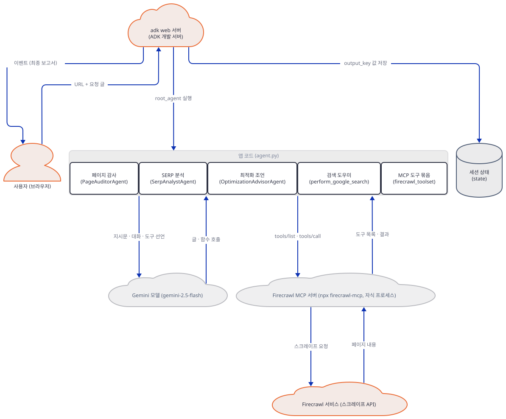

**확인.** 이벤트 열한 개가 Step 3과 같은 순서로 오고, 서버는 `/run` 도중에 떴고, 키는 `.env` 값입니다.

```text
05:45:04.948723 [client] GET /list-apps -> ['ai_seo_audit_team']
05:45:04.999703 [client] 세션 만듦
05:45:08.907550 [client] /run 끝, 이벤트 11개
PageAuditorAgent         호출 firecrawl_scrape
...
OptimizationAdvisorAgent 글   # SEO Audit Report  (가짜 모델이 쓴 보고서)
05:45:06.461737 [MCP pid=38504] 시작 FIRECRAWL_API_KEY='fc-from-dotenv' HTTPS_PROXY=None PATH있음=True
```

세션을 만드는 것까지는 `mcp.log`가 없었고(별도 실행에서 서버 시작, 목록, 세션 만들기, 3초 대기 뒤에 각각 `mcp.log` 유무를 확인했습니다), `/run`이 시작된 뒤에 생겼습니다. 앱 폴더 안에서 띄워도 목록에 `ai_seo_audit_team`이 하나 나옵니다. 상위 `agent_teams` 폴더에서 띄우면 ADK 앱이 네 개 뜬다는 것은 Day 122 Step 5가 직접 확인했습니다. 앱 폴더에는 `.adk/session.db`가 생겨 세션이 쌓입니다. 원본 저장소의 앱 폴더에서 돌렸다면 이 `.adk/`가 저장소 안에 생깁니다.

진짜로 쓰려면 `npx`를 바꾸지 않은 앱 폴더(`orig/ai_seo_audit_team`)에 진짜 `GOOGLE_API_KEY`와 `FIRECRAWL_API_KEY`를 넣은 `.env`를 두고, `npx`가 패키지를 받을 수 있는 환경에서 같은 `adk web` 명령을 씁니다. 이 문서는 그 경로를 시험하지 못했습니다. Windows에서는 mcp 클라이언트가 `npx`를 `.cmd`로 찾아 주는 코드가 있고(`mcp/os/win32/utilities.py`의 `get_windows_executable_command`, 소스로 확인), 자식 프로세스는 `PATH`와 `APPDATA` 같은 안전한 변수만 물려받아 키는 앱의 `env` 인자로만 갑니다(`mcp/client/stdio.py`의 `DEFAULT_INHERITED_ENV_VARS`). 같은 이유로 `HTTPS_PROXY`도 넘어가지 않습니다. 부모에 프록시 변수를 걸어 두고 돌렸을 때 자식에게 `None`으로 보인 것을 내 환경에서 봤고, 프록시 뒤에서 `npx`가 어떻게 되는지는 확인하지 못했습니다.

## 요청 한 건이 흐르는 과정

감사 요청 한 건은 Step 3의 가짜 서버와 같은 모양입니다(진짜 `npx`와 Firecrawl, Gemini가 같은 순서로 일할 것이라는 것은 소스에서 읽은 것이고 직접 보지는 못했습니다). 메시지는 모두 코드 순서대로 한 그림에 들어 있고, 배우가 많아 시간 경계에서 여덟 그림으로 나눴습니다.

1. 사용자가 주소를 보내면 `adk web`은 `root_agent`인 `SeoAuditTeam` 하나만 실행하고, 하위 에이전트를 차례로 부르는 것은 `SequentialAgent`의 `for` 루프입니다(google-adk 2.11.0 `sequential_agent.py`, 소스로 확인). 팀이 첫 에이전트를 부르고, 첫 에이전트가 처음으로 도구 목록을 요청합니다. 이때 서버가 뜹니다.

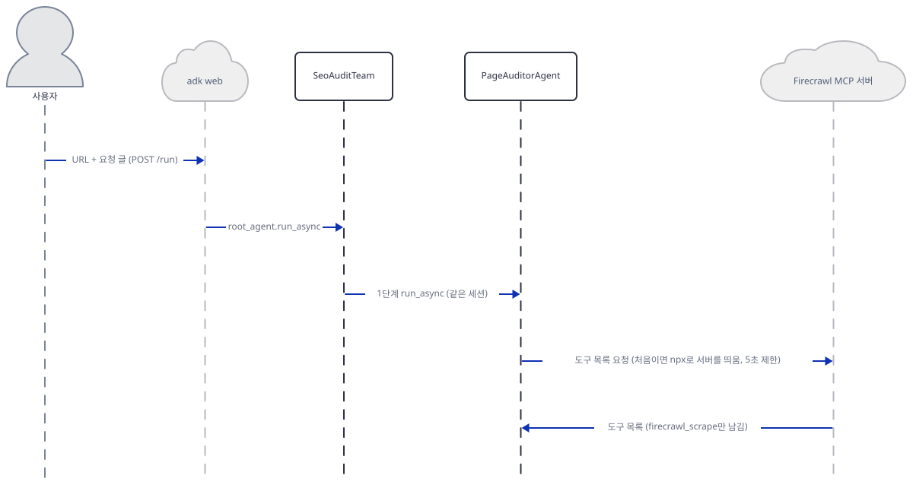

2. 모델이 도구 선언을 받고 `firecrawl_scrape`를 부르라고 답합니다.

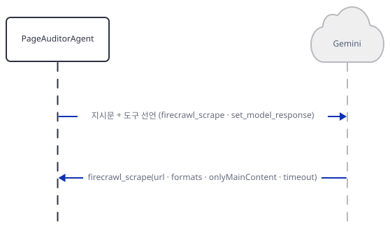

3. MCP 서버가 Firecrawl 서비스에 스크레이프를 요청하고 결과를 돌려줍니다(가짜 서버는 이 부분을 대본으로 했습니다). 응답을 기다리는 제한이 5초입니다.

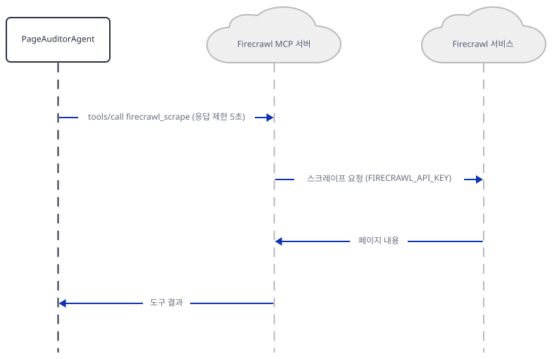

4. 모델이 결과를 보고 `set_model_response`로 구조를 채웁니다. 글 이벤트가 팀을 거쳐 `adk web`에 닿고, `adk web`이 `page_audit`을 상태에 저장합니다.

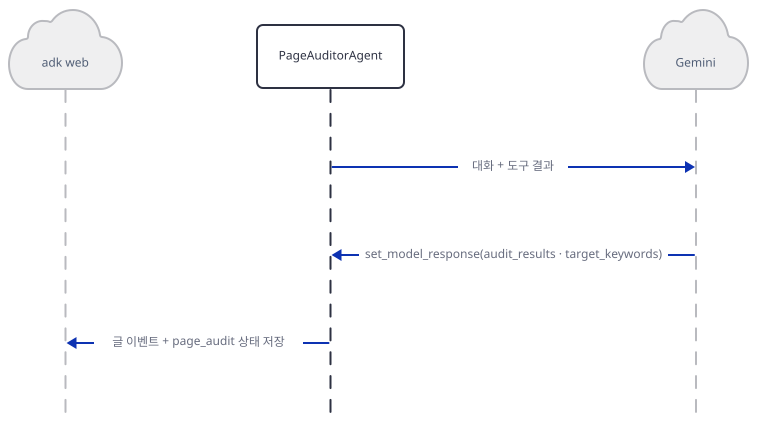

5. 팀이 둘째 에이전트를 부르면 그가 앞 에이전트의 대화와 함께 모델에게 가고, 모델이 검색 도우미를 부르라고 답합니다.

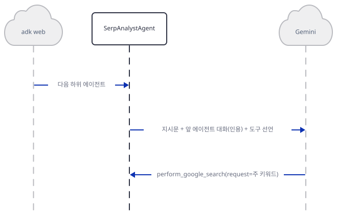

6. 검색 도우미가 새 실행으로 Gemini에게 검색 선언을 보내 결과 글을 받습니다.

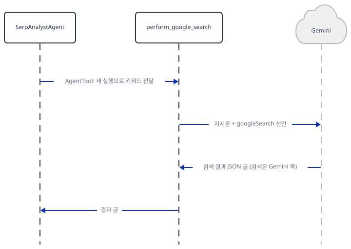

7. 결과가 돌아오고 모델이 `set_model_response`로 `serp_analysis`를 채우면, 이벤트가 팀을 거쳐 `adk web`에 닿고 상태에 저장됩니다.

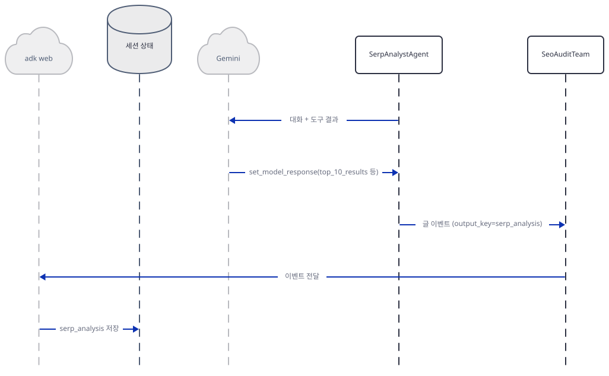

8. 팀이 셋째 에이전트를 부르면 그가 두 에이전트의 대화 전체와 함께 모델에게 가서 보고서를 받고, 이벤트가 팀을 거쳐 `adk web`에 닿아 사용자에게 돌아갑니다.

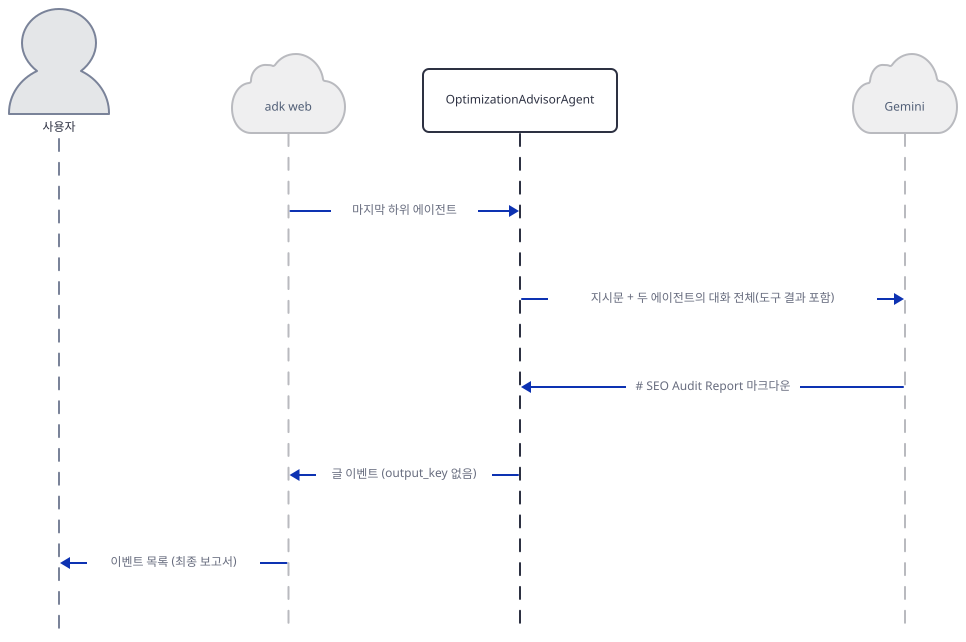

## 실행 체크리스트

- [ ] `requirements.txt`만 설치하면 `agent.py:17`에서 `No module named 'mcp'`가 나고, `google-adk[mcp]`로 고쳐진다
- [ ] 복사본의 `npx` 블록을 가짜 서버로 바꿨고 원본 폴더에는 `__pycache__`나 `.adk/`가 생기지 않았다
- [ ] 트리를 찍어도 `mcp.log`가 생기지 않는다
- [ ] 한 건을 돌리면 서버 시작 시각이 첫 모델 요청보다 앞선다
- [ ] 첫 요청의 도구가 `set_model_response`와 `firecrawl_scrape`이고 `generationConfig`는 비어 있다
- [ ] 조언 에이전트의 요청에 앞 두 에이전트의 대화가 인용으로 실리고 도구는 없다
- [ ] `big=200000`이면 요청 네 건이 20만 자씩 늘어난다
- [ ] 서버 시작 7초 지연은 "도구 없이 계속", 스크레이프 7초는 `tools/call timed out`, 이름 불일치는 조용한 빈 목록이 된다
- [ ] `widen.py`로 감싸면 7초 지연이 둘 다 통과한다
- [ ] 끝나고 가짜 서버와 `adk web`을 모두 멈췄고, 원본 폴더에 새 파일이 없다

## 문제 해결

| 증상 | 원인 | 해결 |
|---|---|---|
| `ModuleNotFoundError: No module named 'mcp'` (`agent.py:17`) | `google-adk`가 `mcp`를 선택 의존성으로만 둠 | `uv pip install "google-adk[mcp]"`(Step 1) |
| 로그에 `Agent PageAuditorAgent will run without the tools from toolset MCPToolset, which failed to load: … timed out after 5.0s` | 서버가 5초 안에 준비되지 않음. 처음 `npx`가 내려받는 동안 흔할 수 있다(진짜 `npx`로는 재지 못함) | 먼저 터미널에서 `npx -y firecrawl-mcp`로 패키지를 받아 두거나 `StdioConnectionParams(timeout=…)`로 감싼다(Step 6) |
| 도구 응답이 `MCP tool execution failed: Request 'tools/call' timed out` | 앱이 `StdioServerParameters`로 넘겨 응답 제한이 5초로 고정됨. 도구 인자의 `timeout: 90000`과 별개 | `StdioConnectionParams(timeout=60, …)`(Step 6) |
| 첫 에이전트 요청의 도구에 `firecrawl_scrape`가 없는데 오류도 없음 | 서버가 `tool_filter`의 이름(`firecrawl_scrape`)을 내놓지 않음 | 서버가 내놓는 도구 이름을 `McpToolset`의 `get_tools()`나 서버 문서로 확인해 `tool_filter`를 맞춘다 |
| `pydantic_core._pydantic_core.ValidationError: 1 validation error for PageAuditOutput … json_invalid` | 모델이 `set_model_response`를 부르지 않고 JSON이 아닌 글로 답함(`llm_agent.py`의 출력 검증, 소스로 확인). `fake_gemini.py … bad`로 재현했고 실행이 멈췄다 | 실제 Gemini가 이렇게 답하는지는 확인하지 못했다. 지시문의 "Return ONLY valid JSON"과 ADK가 덧붙이는 `set_model_response` 안내가 어긋나니 지시문을 맞추는 것이 후보다 |
| 요청이 점점 커지고 토큰이 늘어남 | 긁은 결과와 JSON이 앞 에이전트의 대화로 뒤 요청마다 실림(Step 4~5) | `formats`를 `markdown`만으로 줄이는 것이 후보다. 지시문(`agent.py:191-197`)에 적힌 `formats`를 바꿔 시험하는 것은 이 문서가 하지 못했다 |
| 원본 앱 폴더에서 `adk web`을 돌렸더니 `git status`는 깨끗한데 `.adk/session.db`가 있음 | `adk web`이 앱 폴더 안에 세션 DB를 쌓고, 저장소 `.gitignore:72`의 `*.db`가 가린다(`git check-ignore -v`로 확인) | 보이지 않게 쌓이니 복사한 폴더에서 돌린다 |
| 가짜 서버를 띄울 때 `PermissionError [WinError 10013]` | 고른 포트가 Windows 제외 대역 안에 있음(이 PC의 58130에서 확인) | `netsh interface ipv4 show excludedportrange protocol=tcp`로 보고 다른 포트를 고른다 |
| `FIRECRAWL_API_KEY`가 비어 있는데 오류가 나지 않음 | 앱이 `os.getenv("FIRECRAWL_API_KEY", "")`로 빈 문자열을 자식 프로세스에 넘긴다(`agent.py:147`) | 키가 없다는 오류는 진짜 서버가 낼 것이다(확인하지 못함) |
| 진짜 키로 `gemini-2.5-flash`가 거부됨 | 2.5 모델 접근을 과거 사용자로 제한한다는 폐기 문서 2.5 Flash 절의 안내(위 ⚠) | 원문이 새 프로젝트에 권하는 `gemini-3.8-flash`나 `gemini-3.5-flash-lite`로 모델 줄 네 곳을 바꿔 시험한다. 이 문서는 시험하지 못했다 |

## 더 해보기

- `McpToolset`의 `tool_list_cache_ttl_seconds`(생성자 문서)를 `widen.py`처럼 복사본에 넣고, 정상 서버로 `/run`을 두 번 보낼 때 서버가 두 번째에도 재사용되는지 가짜 서버로 재 보세요. 확인 기준은 `mcp.log`의 `시작` 줄 수입니다. 실패하는 서버(`start=7`)에서 둘째 서버가 뜨는 것은 이 값으로 막히지 않습니다.
- 조언 에이전트에 `output_key="seo_report"`를 주고, 세션 상태에 보고서가 남는지 `run_once.py`의 상태 키 출력으로 확인해 보세요. 지금은 `['page_audit', 'serp_analysis']`만 남습니다.
- 두 번째 에이전트의 지시문을 Day 091처럼 `{page_audit}` 치환으로 바꿔, 요청 본문에 인용 글 대신 값이 들어가는지(그리고 `fake_gemini.py`가 키워드를 어디서 찾는지) 확인해 보세요.

## 다음 날 예고

[Day 126 · ⚖️ LLM Panel Agent Team](../day126-llm-panel-agent-team/README.md) — 볼륨 8의 마지막 날입니다. 서로 다른 모델 여러 개가 같은 코드 변경(diff)을 독립적으로 리뷰하고, `--rebut`로 둘째 라운드에서 서로의 답을 반박하는 파일 하나(267줄)의 앱입니다. 모든 모델을 OpenRouter를 거쳐 OpenAI SDK로 부릅니다(파일 머리 주석과 소스로 확인).
