# Day 126 · ⚖️ LLM Panel Agent Team

> 볼륨 8 🤝 Multi-agent Teams · 난이도 ★★☆ · 예상 소요 80분(앱은 267줄이지만, 가짜 서버를 직접 저장해 터미널 둘로 두 라운드를 돌리고 서버 쪽 기록과 대조하는 시간이 읽는 시간보다 큽니다) · API 비용 대략 $0.03 이하(앱 README가 같은 샘플을 세 모델로 두 라운드 돌려 적은 청구액 $0.0274를 옮긴 것입니다. 이 문서는 키가 없어 가짜 서버로만 돌렸으므로 실제 청구액은 재지 못했습니다) · 원본 앱: `advanced_ai_agents/multi_agent_apps/agent_teams/llm_panel_agent_team`

## 오늘 만들 것

오늘로 15일짜리 "🤝 Multi-agent Teams" 볼륨이 끝납니다. 앞 열네 날의 `requirements.txt`(Day 124는 `backend/pyproject.toml`)를 grep하면 agno가 아홉 날, autogen이 Day 116, agency-swarm이 Day 118, AG2가 Day 119, google-adk가 Day 122와 125에 들어 있습니다. 오늘 `requirements.txt`는 `openai>=1.50.0` 한 줄뿐이고, 팀을 만들어 주는 프레임워크가 없습니다. 파이썬 파일 하나가 스레드 풀로 모델 셋에게 같은 질문을 동시에 보내고(1라운드), `--rebut`를 주면 각 모델에게 나머지 모델의 답을 "Reviewer A, B"로 이름을 지우고 모델마다 따로 섞어 보여 준 뒤, 모델들의 입장(UPHOLD·REJECT·CONCEDE·MISSED)을 문제 제기별로 묶어 표로 냅니다. Day 112의 팀 리더는 역할이 다른 멤버에게 일을 위임했지만(그 날 README로 확인), 여기에는 리더도 역할 분담도 없습니다. 같은 일을 서로 모르게 하는 독립 검토자들이 있을 뿐입니다. 파일 머리 주석도 투표기가 아니라고 밝힙니다. 패널은 후보 결함을 내고, 코드와 대조하는 일은 사람이 합니다.

직접 돌려 알게 된 것이 넷입니다. 첫째, 오늘 설치되는 openai는 3.27.0이지만 앱의 호출(`timeout`, `extra_body`, `usage.cost` 읽기)은 그대로 돕니다(Step 3). 둘째, 접속 주소가 `main()` 안에 박혀 있어 `OPENAI_BASE_URL`로는 돌릴 수 없으므로 복사본의 한 줄만 바꿔 가짜 서버로 보냅니다(Step 3·4). 셋째, 2라운드 프롬프트는 1라운드의 약 2.3배이고 Reviewer 순서는 모델마다, 실행마다 다릅니다(Step 5). 넷째, 한국어 Windows(cp949)에서는 답에 em dash 하나만 있어도 답을 이미 받은 뒤 죽습니다. 출력이 파이프나 파일이면 `print`에서 죽어 `panel.md`가 아예 안 생기고, `PYTHONIOENCODING`만 고치면 파일 쓰기에서 죽어 0바이트 `panel.md`가 남습니다. 콘솔 창에서는 뒤쪽 경우가 됩니다(문제 해결).

이 문서는 OpenRouter와 어느 모델 제공자에도 요청을 보내지 않습니다. 가짜 서버의 답은 대본이라 코드 리뷰의 근거가 아닙니다. 아래는 완성된 아키텍처입니다.

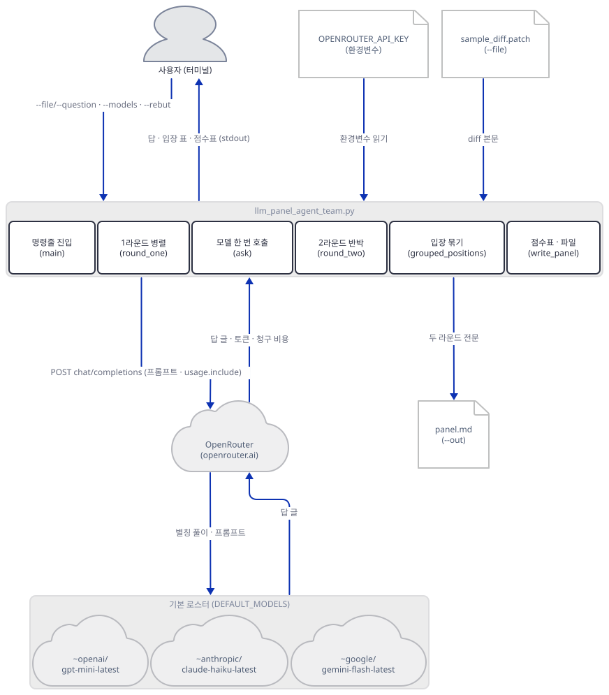

## 사전 준비

| 서비스/도구 | 용도 | 발급·설치 |
|---|---|---|
| uv | 가상환경 생성과 패키지 설치 | [공통 사전 준비](../README.md#공통-사전-준비-한-번만) 참고 |
| Python | 이 문서는 3.13.3으로 확인했다. 앱 README는 3.10 이상이라고 적는다 | 공통 사전 준비와 같음 |
| OpenRouter API 키 | 실제로 쓸 때만 필요하다. 앱은 `OPENROUTER_API_KEY` 환경변수를 읽는다. 이 문서는 가짜 값 `sk-fake`와 가짜 서버로 확인한다 | https://openrouter.ai/keys |
| 터미널 둘 | 하나는 가짜 서버, 하나는 앱 | 별도 설치 없음 |

기본 모델 셋(`~openai/gpt-mini-latest`·`~anthropic/claude-haiku-latest`·`~google/gemini-flash-latest`)은 버전이 아니라 OpenRouter의 "가장 새 모델" 별칭이라 제공자의 폐기 표에 올라 있을 수 없습니다. 별칭 규칙은 OpenRouter 문서(https://openrouter.ai/docs/guides/routing/routers/latest-resolution, 2026-10-10 확인)의 "slugs always resolve to the newest concrete model in a given family"입니다. 2026-10-10에 각 별칭의 OpenRouter 모델 페이지(`https://openrouter.ai/~openai/gpt-mini-latest` 등)를 내려받아 보니 `targetSlug`가 순서대로 `openai/gpt-5.4-mini`, `anthropic/claude-haiku-5.5`, `google/gemini-3.8-flash`였습니다. 별칭이라 가리키는 모델은 언제든 바뀝니다. 이 셋을 제공자 원문에서 확인한 결과(모두 2026-10-10)는 이렇습니다. Anthropic 폐기 문서(https://platform.claude.com/docs/en/about-claude/model-deprecations)에서 `claude-haiku-5-5`는 Active이고 종료 하한이 "Not sooner than October 7, 2027"입니다. OpenAI 폐기 문서(https://developers.openai.com/api/docs/deprecations)에는 `gpt-5.4-mini` 항목이 없고, 대화용 "mini" 가운데 올라 있는 것은 날짜가 붙은 스냅숏 `gpt-5-mini-2025-08-07`(2026-12-11 종료)뿐이라 `--models`로 그것을 고정해 쓸 때만 걸립니다. Google 폐기 문서(https://ai.google.dev/gemini-api/docs/deprecations)에서 `gemini-3.8-flash`는 "No shutdown date announced"입니다. 별칭을 고른 까닭도 같은 표에 보입니다. 옛 id `claude-haiku-4-5-20251001`은 아직 Active이지만 종료 하한이 "Not sooner than October 15, 2026"로 적혀 있고 `claude-haiku-5-5`가 따로 올라 있습니다. 같은 문서는 공개 모델의 종료 전에 최소 60일 공지를 준다고 하므로(Notifications 절) 당장 깨지지는 않지만, 고정 id는 언젠가 이 표를 따라 끝납니다. 그래서 ⚠ 경고는 달지 않습니다.

## 아키텍처 한눈에 보기

| 컴포넌트 | 역할 | 코드 위치 |
|---|---|---|
| 진입 (`main`) | 인자 읽기, 키 확인, 클라이언트와 프롬프트 만들기, 두 라운드와 출력 순서 정하기 | `advanced_ai_agents/multi_agent_apps/agent_teams/llm_panel_agent_team/llm_panel_agent_team.py:227-263` |
| 로스터·프롬프트 상수 | `DEFAULT_MODELS`, `REVIEW_TASK`, `REBUT_INSTRUCTIONS` | `advanced_ai_agents/multi_agent_apps/agent_teams/llm_panel_agent_team/llm_panel_agent_team.py:35-77` |
| 결과 상자 (`Answer`) | 모델 하나의 상태·글·시간·토큰·비용, 2라운드의 `rebuttal`·`positions`·`letters` | `advanced_ai_agents/multi_agent_apps/agent_teams/llm_panel_agent_team/llm_panel_agent_team.py:96-107` |
| 한 번 호출 (`ask`) | 모델 하나에 프롬프트 하나. 실패는 던지지 않고 `error` 행으로 돌려줌 | `advanced_ai_agents/multi_agent_apps/agent_teams/llm_panel_agent_team/llm_panel_agent_team.py:110-135` |
| 1라운드 (`round_one`) | 스레드 풀로 모델 전부에 동시에 묻고 도착하는 대로 출력 | `advanced_ai_agents/multi_agent_apps/agent_teams/llm_panel_agent_team/llm_panel_agent_team.py:138-147` |
| 2라운드 (`round_two`) | 남의 답을 이름 없이 섞어 보여 주고 반박을 받음 | `advanced_ai_agents/multi_agent_apps/agent_teams/llm_panel_agent_team/llm_panel_agent_team.py:150-174` |
| 입장 읽기 (`parse_positions`) | 반박 글에서 (라벨, 참조) 쌍을 정규식으로 뽑음 | `advanced_ai_agents/multi_agent_apps/agent_teams/llm_panel_agent_team/llm_panel_agent_team.py:79-93` |
| 입장 묶기 (`grouped_positions`) | 문제 제기별로 묶고 CONTESTED 표시 | `advanced_ai_agents/multi_agent_apps/agent_teams/llm_panel_agent_team/llm_panel_agent_team.py:177-200` |
| 점수표 (`scoreboard`) | 모델별 상태·시간·토큰·비용 표 | `advanced_ai_agents/multi_agent_apps/agent_teams/llm_panel_agent_team/llm_panel_agent_team.py:203-211` |
| 파일 쓰기 (`write_panel`) | 점수표·입장 표·두 라운드 전문을 `panel.md`로 | `advanced_ai_agents/multi_agent_apps/agent_teams/llm_panel_agent_team/llm_panel_agent_team.py:214-224` |
| OpenRouter | OpenAI SDK의 `base_url`이 가리키는 곳 하나. 모델 셋이 그 뒤에 있다 | `advanced_ai_agents/multi_agent_apps/agent_teams/llm_panel_agent_team/llm_panel_agent_team.py:243` |

앱이 바깥으로 여는 연결은 `ask` 안의 `client.chat.completions.create` 한 곳이고, 앱 코드에는 `requests`·`urlopen`·`socket`·`httpx`가 없습니다(Step 1의 grep으로 확인). agno를 쓰지 않으므로 Day 047의 익명 사용 통계는 이 앱과 상관이 없습니다. 아래 두 그림은 함수 사이의 호출입니다. 먼저 `main`이 누구를 부르는지입니다.

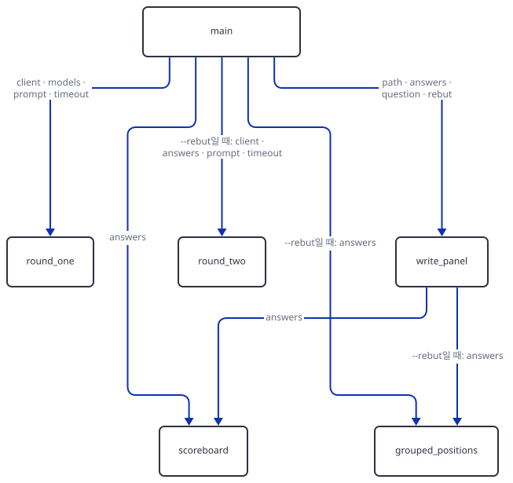

그리고 두 라운드가 `ask`와 OpenRouter를 어떻게 공유하는지입니다.

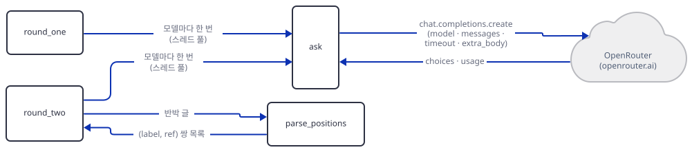

## 단계별 진행

### Step 1. 환경 만들기 — 프레임워크가 없으니 설치는 14개로 끝납니다

**목적.** 원본을 건드리지 않도록 작업 폴더에 복사본과 가상환경을 만들고, 이 앱이 실제로 무엇에 기대는지 봅니다.

**할 일.** `<저장소>`는 이 저장소를 받은 경로입니다.

```bash
mkdir panel-work
cd panel-work
cp <저장소>/advanced_ai_agents/multi_agent_apps/agent_teams/llm_panel_agent_team/llm_panel_agent_team.py .
cp <저장소>/advanced_ai_agents/multi_agent_apps/agent_teams/llm_panel_agent_team/requirements.txt .
cp <저장소>/advanced_ai_agents/multi_agent_apps/agent_teams/llm_panel_agent_team/sample_diff.patch .
uv venv
uv pip install -r requirements.txt
```

(pip 대안: `python -m venv .venv`로 만들고 활성화한 뒤 `pip install -r requirements.txt`.) 아래 PowerShell 줄은 실행해 보지 못했습니다(이 문서를 쓴 하네스가 PowerShell 실행을 막습니다).

```powershell
mkdir panel-work
cd panel-work
Copy-Item <저장소>\advanced_ai_agents\multi_agent_apps\agent_teams\llm_panel_agent_team\llm_panel_agent_team.py .
Copy-Item <저장소>\advanced_ai_agents\multi_agent_apps\agent_teams\llm_panel_agent_team\requirements.txt .
Copy-Item <저장소>\advanced_ai_agents\multi_agent_apps\agent_teams\llm_panel_agent_team\sample_diff.patch .
uv venv
uv pip install -r requirements.txt
```

이 저장소는 루트에 `pyproject.toml`이 있어 저장소 안에서 `uv run`은 루트 환경을 쓰려 하므로, 이후 `uv run`에는 모두 `--no-project`를 붙입니다. 파일 맨 위의 가져오기는 이렇습니다.

`advanced_ai_agents/multi_agent_apps/agent_teams/llm_panel_agent_team/llm_panel_agent_team.py:23-33`

```python
import argparse
import os
import random
import re
import string
import sys
import time
from concurrent.futures import ThreadPoolExecutor, as_completed
from dataclasses import dataclass, field

from openai import OpenAI
```

표준 라이브러리 아홉 줄과 `openai` 하나입니다. `requirements.txt`가 `openai>=1.50.0`뿐인 것과 맞습니다.

**확인.**

```bash
uv run --no-project python -m py_compile llm_panel_agent_team.py && echo compiled
grep -nE "requests|urlopen|socket|httpx" llm_panel_agent_team.py
uv run --no-project python llm_panel_agent_team.py --question hi
uv run --no-project python llm_panel_agent_team.py
```

(PowerShell 5.1에는 `&&`가 없으므로 첫 줄은 `uv run --no-project python -m py_compile llm_panel_agent_team.py; if ($?) { echo compiled }`로, 둘째 줄은 `Select-String -Pattern "requests|urlopen|socket|httpx" llm_panel_agent_team.py`로 씁니다. 실행해 보지 못했습니다. 셋째 줄은 `OPENROUTER_API_KEY`가 설정돼 있지 않은 셸에서 돌립니다.)

직접 확인한 결과입니다. 2026-10-10에 14개가 설치됐고 openai 3.27.0, pydantic 2.14.0, httpx2 2.13.1이 들어 있었습니다. `grep`은 아무것도 찍지 않습니다.

```text
compiled
set OPENROUTER_API_KEY (https://openrouter.ai/keys)
usage: llm_panel_agent_team.py [-h] (--question QUESTION | --file FILE)
                               [--models MODELS] [--rebut] [--timeout TIMEOUT]
                               [--out OUT]
llm_panel_agent_team.py: error: one of the arguments --question --file is required
```

키가 없으면 `sys.exit` 문구와 종료 코드 1, 질문도 파일도 없으면 argparse 오류와 종료 코드 2입니다. 키 검사는 인자를 읽은 뒤, 파일을 열기 전에 일어납니다(소스로 확인, 240-242행).

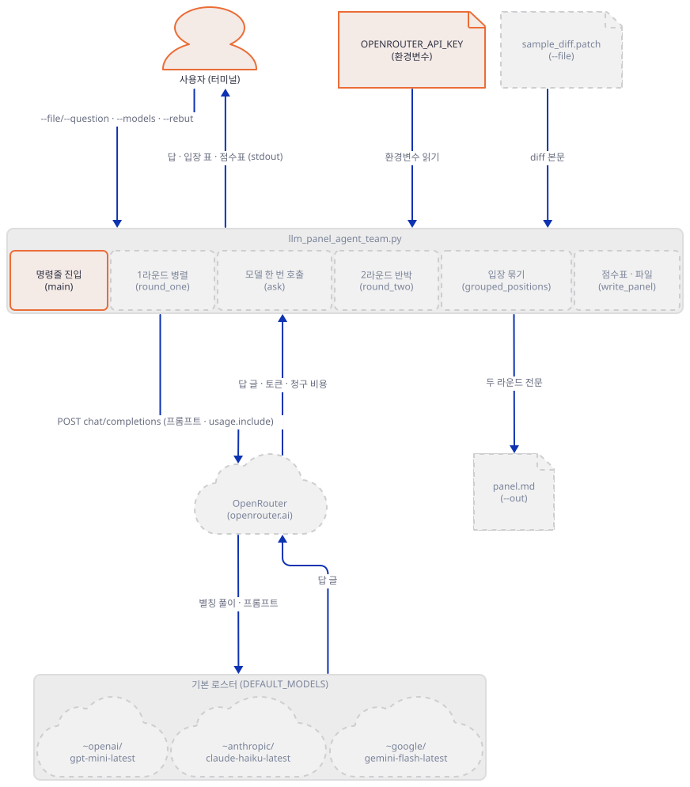

### Step 2. 로스터와 프롬프트 — 모델 이름이 아니라 별칭입니다

**목적.** 누구에게 무엇을 묻는지 정하는 상수 세 개와, `main()`이 질문을 프롬프트로 만드는 부분을 봅니다.

**할 일.**

`advanced_ai_agents/multi_agent_apps/agent_teams/llm_panel_agent_team/llm_panel_agent_team.py:35-53`

```python
# One cheap model per vendor, named by OpenRouter's rolling aliases rather than by a
# version. A pinned id (`openai/gpt-5.4-mini`) is the version that was current the day this
# was written, and providers retire versions: the pin would fail for whoever clones this
# months from now, before they ever saw the panel work. Each `-latest` alias "always
# redirects to the latest model in the family", so a default roster keeps resolving. Pin a
# version with --models when you want a run to be reproducible instead of current.
DEFAULT_MODELS = [
    "~openai/gpt-mini-latest",
    "~anthropic/claude-haiku-latest",
    "~google/gemini-flash-latest",
]

MODEL_CATALOG = "https://openrouter.ai/models"

REVIEW_TASK = (
    "Review the following change. Report defects only, as a numbered list, each with the "
    "file and line it is in and one sentence on why it is wrong. If the change needs no "
    "comment at all, say so.\n\n"
)
```

파일 머리 주석이 이유를 설명합니다. 고정 id는 만든 날의 버전이고 제공자가 버전을 거두면 처음 쓰는 사람이 패널이 도는 것을 보기도 전에 실패합니다. 그래서 `~제공자/계열-latest` 별칭을 씁니다. 별칭은 `main()`의 이 부분에서 쉼표로 쪼개져 `--models`가 없으면 그대로 쓰입니다.

`advanced_ai_agents/multi_agent_apps/agent_teams/llm_panel_agent_team/llm_panel_agent_team.py:245-253`

```python
    if a.file:
        with open(a.file) as f:
            material = f.read()
        prompt = REVIEW_TASK + f"```\n{material}\n```"
        question = f"Review `{a.file}`"
    else:
        prompt = question = a.question

    models = [m.strip() for m in a.models.split(",") if m.strip()]
```

`--file`이면 파일 내용을 백틱 세 개짜리 코드 울타리로 감싸 `REVIEW_TASK` 뒤에 붙이고, `--question`이면 질문이 곧 프롬프트입니다. 같은 `prompt` 하나가 1라운드의 모든 모델에게 갑니다.

**확인.** 아래를 `show_prompt.py`로 저장해 실행합니다. 가져오기만으로는 어디에도 연결하지 않습니다.

```python
import llm_panel_agent_team as m

print(m.DEFAULT_MODELS)
prompt = m.REVIEW_TASK + "```\n" + open("sample_diff.patch").read() + "\n```"
print(len(prompt))
```

```bash
uv run --no-project python show_prompt.py
```

직접 확인한 출력입니다. `sample_diff.patch`는 1,282바이트이고 프롬프트는 1,482자입니다.

```text
['~openai/gpt-mini-latest', '~anthropic/claude-haiku-latest', '~google/gemini-flash-latest']
1482
```

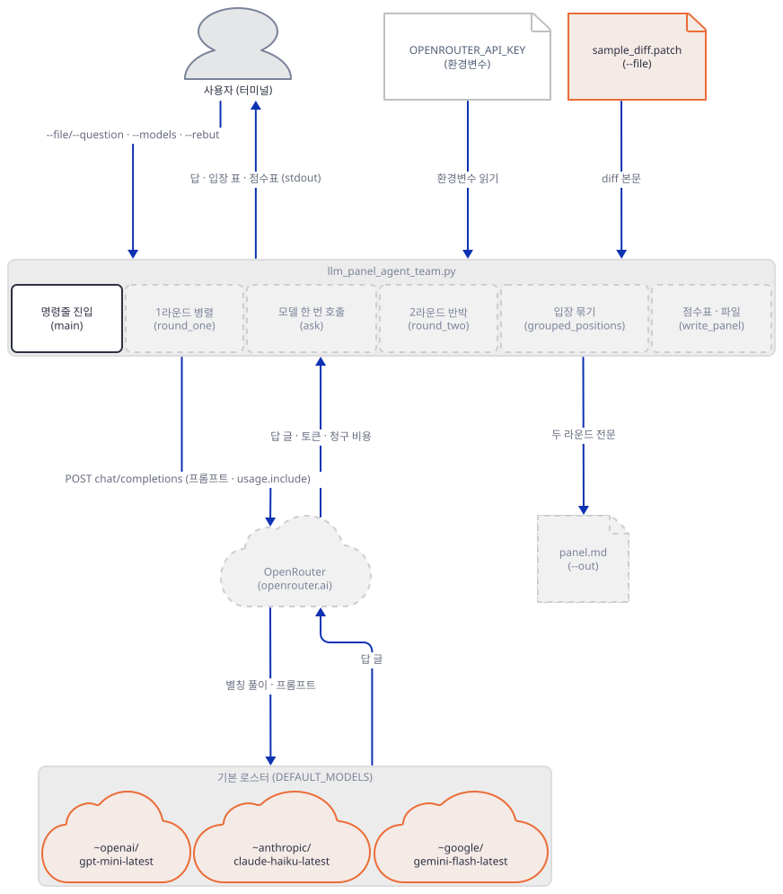

### Step 3. 한 번 호출과 가짜 서버 — 실패는 던지지 않고 행이 됩니다

**목적.** 모델 하나를 한 번 부르는 `ask`를 보고, 같은 주소 모양의 가짜 OpenRouter를 localhost에 세웁니다.

**할 일.**

`advanced_ai_agents/multi_agent_apps/agent_teams/llm_panel_agent_team/llm_panel_agent_team.py:110-135`

```python
def ask(client: OpenAI, model: str, prompt: str, timeout: float) -> Answer:
    """One model, one prompt. A failure is reported in the row, never raised: one judge's
    outage must not take the panel down after the others have been paid for."""
    t0 = time.time()
    try:
        r = client.chat.completions.create(
            model=model,
            messages=[{"role": "user", "content": prompt}],
            timeout=timeout,
            extra_body={"usage": {"include": True}},   # OpenRouter returns the billed cost
        )
        text = (r.choices[0].message.content or "").strip()
        if not text:
            return Answer(model, "error", f"empty answer (finish_reason={r.choices[0].finish_reason})",
                          time.time() - t0)
        u = r.usage
        return Answer(model, "ok", text, time.time() - t0,
                      getattr(u, "prompt_tokens", 0) or 0, getattr(u, "completion_tokens", 0) or 0,
                      float(getattr(u, "cost", 0.0) or 0.0))
    except Exception as e:  # reported, not swallowed: the row says what happened
        msg = f"{type(e).__name__}: {e}"
        if getattr(e, "status_code", None) in (400, 404) and "model" in str(e).lower():
            # The one failure a reader hits before they have seen the tool work at all:
            # say where the current ids live rather than leaving them with a raw 404.
            msg += f"\n  -> `{model}` is not a model id OpenRouter serves. Pick a current one from {MODEL_CATALOG}."
        return Answer(model, "error", msg, time.time() - t0)
```

세 가지를 봅니다. `timeout`은 호출마다 적용되고, `extra_body={"usage": {"include": True}}`는 OpenRouter에 청구 비용을 응답에 넣어 달라고 요청하는 부분입니다(앱 주석은 이렇게 설명하지만, OpenRouter의 사용량 집계 문서(https://openrouter.ai/docs/cookbook/administration/usage-accounting, 2026-10-10 확인)는 `usage: { include: true }`가 폐기돼 효과가 없고 전체 사용량이 응답마다 항상 들어간다고 적습니다. 그러니 이 인자는 지금 덧붙임일 뿐이고 `cost`는 인자 없이도 올 것이지만, 실제 OpenRouter는 호출하지 않았으므로 응답에서 확인하지는 못했습니다). 마지막으로 모든 예외가 `Answer(..., "error", ...)`가 되어 돌아가므로, 한 모델의 장애가 나머지의 결과를 버리지 않습니다. 400이나 404이고 메시지에 `model`이 들어 있으면 카탈로그 주소를 덧붙입니다.

가짜 서버를 `fake_openrouter.py`로 저장합니다. 첫 두 라운드에서 모델 셋 각각의 대본 답을 돌려주고, 요청이 올 때마다 모델·라운드·프롬프트 길이·2라운드에서 본 다른 답들의 순서·프롬프트에 제공자 이름이 있는지를 stderr에 한 줄 JSON으로 적습니다. 아는 별칭이 아니면 400 `is not a valid model ID`를 돌려줍니다. 환경변수 `FAKE_PROSE`(그 모델의 반박을 라벨 없는 산문으로)와 `FAKE_DASH`(그 모델의 1라운드 답에 em dash)는 문제 해결에서 씁니다.

```python
"""Fake OpenRouter: scripted answers for the three default panel aliases, on localhost."""
import json, os, re, sys, time
from http.server import BaseHTTPRequestHandler, ThreadingHTTPServer

ROUND1 = {
    "gpt-mini": [  # 5 findings
        "`orders.py:12` -- `total > threshold` drops orders that sit exactly on a tier.",
        "`orders.py:12` -- `reversed(tiers)` assumes ascending input.",
        "`orders.py:19` -- `except Exception` returns `[]` and hides a malformed file.",
        "`orders.py:19` -- `seen=[]` is a mutable default shared across calls.",
        "`orders.py:28` -- `recent()` now excludes `ts == cutoff`.",
    ],
    "claude-haiku": [
        "**orders.py, line 17**: `seen=[]` is a mutable default argument.",
        "**orders.py, line 11**: `>` replaced `>=`, a boundary regression.",
        "**orders.py, line 21**: bare `except Exception` swallows errors.",
    ],
    "gemini-flash": [
        "`orders.py`, line 13: `total > threshold` should stay inclusive.",
        "`orders.py`, line 18: mutable default `seen=[]`.",
    ],
}
SLOW = {"gpt-mini": 0.2, "claude-haiku": 0.5, "gemini-flash": 1.5}
TAG = {"gpt-mini": "#1", "claude-haiku": "#2", "gemini-flash": "#3"}   # fingerprint, not a vendor name

def role(model):
    return next((r for r in ROUND1 if r in model), None)

def round1(r):
    if os.environ.get("FAKE_DASH") == r:   # an em dash: models write them all the time
        return f"1. `orders.py:12` — `total > threshold` drops orders on a tier.\n\n(scripted answer {TAG[r]})"
    return "\n".join(f"{i}. {t}" for i, t in enumerate(ROUND1[r], 1)) + f"\n\n(scripted answer {TAG[r]})"

def round2(r, prompt):
    blocks = re.findall(r"### Reviewer ([A-Z])\n(.*?)(?=\n\n### Reviewer |\Z)", prompt, re.S)
    L = {x: l for l, body in blocks for x in ROUND1 if f"scripted answer {TAG[x]}" in body}
    if os.environ.get("FAKE_PROSE") == r:
        return "I agree with most of what the others wrote and disagree with the rest."
    g, h, p = L.get("gemini-flash"), L.get("claude-haiku"), L.get("gpt-mini")
    if r == "gpt-mini":
        return (f"UPHOLD: {h}3 -- the broad except hides a malformed file.\n"
                f"1. **MISSED: {g}1 / {g}2** -- both are real; I checked lines 13 and 18.")
    if r == "claude-haiku":
        return (f"* **MISSED: {p}5** -- `ts == cutoff` is excluded now.\n"
                f"REJECT: {p}2 -- ascending input is what DISCOUNT_TIERS is.\n"
                f"UPHOLD: {g}1 -- the boundary change is a defect.")
    return (f"REJECT: {h}3 -- the catch block logs a warning, it is not silent.\n"
            f"REJECT: {p}5 -- a float timestamp never equals the cutoff.\n"
            f"REJECT: {h}3 -- (again) same reason.\nCONCEDE: C1 -- no such reviewer.\n"
            f"UPHOLD: {h}2 -- the boundary change is a defect.")

class H(BaseHTTPRequestHandler):
    def log_message(self, *a): pass
    def do_POST(self):
        t0 = time.time()
        body = json.loads(self.rfile.read(int(self.headers["Content-Length"])))
        model, prompt = body["model"], body["messages"][0]["content"]
        r = role(model)
        rd = 2 if "Reviews from the other reviewers follow" in prompt else 1
        order = re.findall(r"scripted answer (#\d)", prompt.split("Reviews from the other reviewers follow.")[-1]) if rd == 2 else []
        print(json.dumps({"path": self.path, "auth": self.headers.get("Authorization", "")[:12] + "...",
                          "model": model, "round": rd, "prompt_chars": len(prompt),
                          "usage_extra": body.get("usage"), "t_in": round(t0 % 1000, 2),
                          "order_seen": order,
                          "vendor_names_in_prompt": bool(re.search(r"gpt|claude|gemini|openai|anthropic|google", prompt, re.I))}),
              file=sys.stderr, flush=True)
        if r is None:
            out, code = {"error": {"message": f"{model} is not a valid model ID", "code": 400}}, 400
        else:
            time.sleep(SLOW[r])
            text = round1(r) if rd == 1 else round2(r, prompt)
            pt, ct = len(prompt) // 4, len(text) // 4
            out = {"id": "fake", "object": "chat.completion", "created": 0, "model": "fake-concrete-" + r,
                   "choices": [{"index": 0, "finish_reason": "stop", "message": {"role": "assistant", "content": text}}],
                   "usage": {"prompt_tokens": pt, "completion_tokens": ct, "total_tokens": pt + ct,
                             "cost": round((pt + 4 * ct) * 1e-6, 6)}}
            code = 200
        data = json.dumps(out).encode()
        self.send_response(code); self.send_header("Content-Type", "application/json")
        self.send_header("Content-Length", str(len(data))); self.end_headers(); self.wfile.write(data)

class S(ThreadingHTTPServer):
    allow_reuse_address = False
    daemon_threads = True

S(("127.0.0.1", int(sys.argv[1])), H).serve_forever()
```

포트는 49152~65535에서 비어 있는 것을 고르되, Windows가 예약해 둔 대역(`netsh int ipv4 show excludedportrange protocol=tcp`로 봅니다)은 피합니다. 이 문서는 51877을 씁니다. `allow_reuse_address = False`이므로 이미 쓰는 포트에 겹쳐 뜨지 않고 오류로 끝납니다(Windows의 `OSError: [WinError 10048]`, 직접 확인). 터미널 하나에서 서버를 띄웁니다.

```bash
uv run --no-project python fake_openrouter.py 51877 2> server.log
```

Windows PowerShell 5.1의 `2>`는 네이티브 프로그램의 stderr를 UTF-16으로 감싸 써서 `show_log.py`의 `json.loads`가 깨질 수 있으므로, PowerShell에서는 `cmd`에 맡깁니다(실행해 보지 못했습니다).

```powershell
cmd /c "uv run --no-project python fake_openrouter.py 51877 2> server.log"
```

**확인.** 다른 터미널에서 `try_ask.py`를 저장해 실행합니다. 앱의 `ask`를 가져와 내 클라이언트로 부르는 것이라 앱 파일은 그대로입니다.

```python
from openai import OpenAI
import llm_panel_agent_team as m

c = OpenAI(base_url="http://127.0.0.1:51877/api/v1", api_key="sk-fake")
a = m.ask(c, "~openai/gpt-mini-latest", "Say hi to the panel, please.", 30)
print(a.status, a.tokens_in, a.tokens_out, a.cost)
b = m.ask(c, "openai/not-a-model", "Say hi to the panel, please.", 30)
print(b.status)
print(b.text)
```

```bash
uv run --no-project python try_ask.py
```

직접 확인한 출력입니다(첫 줄의 `0.000387`은 가짜 서버가 계산한 값이고, `cost`가 `float`로 읽힌다는 것만 뜻이 있습니다).

```text
ok 7 95 0.000387
error
BadRequestError: Error code: 400 - {'error': {'message': 'openai/not-a-model is not a valid model ID', 'code': 400}}
  -> `openai/not-a-model` is not a model id OpenRouter serves. Pick a current one from https://openrouter.ai/models.
```

(`try_ask.py`는 `main`도 키도 패치도 거치지 않고 `ask`만 부르지만, 단계 그림은 한 번 드러난 노드를 다시 흐리지 않는 규칙이라 그 넷은 평상으로 둡니다.)

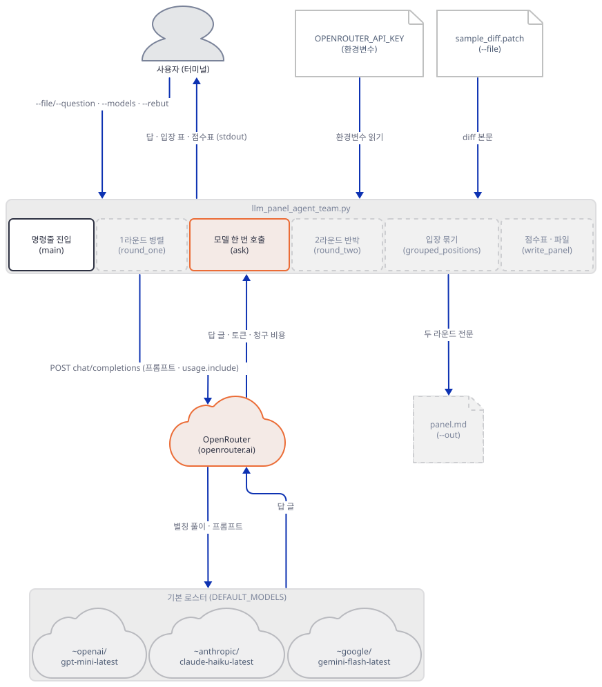

### Step 4. 1라운드 — 동시에 보내고 도착하는 대로 찍습니다

**목적.** `main`을 가짜 서버로 돌려 보내는 방법과, 1라운드가 정말 병렬이며 출력 순서와 표 순서가 다르다는 것을 봅니다.

**할 일.** 접속 주소는 `main()` 안에 있습니다.

`advanced_ai_agents/multi_agent_apps/agent_teams/llm_panel_agent_team/llm_panel_agent_team.py:240-243`

```python
    key = os.environ.get("OPENROUTER_API_KEY")
    if not key:
        sys.exit("set OPENROUTER_API_KEY (https://openrouter.ai/keys)")
    client = OpenAI(base_url="https://openrouter.ai/api/v1", api_key=key)
```

`base_url`을 인자로 직접 넘기므로 `OPENAI_BASE_URL` 환경변수는 이기지 못합니다(직접 확인: 환경변수를 `http://127.0.0.1:1/v1`로 줘도 이 생성자는 `https://openrouter.ai/api/v1/`을 가리켰고, 인자 없이 만든 클라이언트만 환경변수를 따라갔습니다). 그래서 복사본의 한 줄만 바꿉니다.

```bash
sed 's#https://openrouter.ai/api/v1#http://127.0.0.1:51877/api/v1#' llm_panel_agent_team.py > panel_local.py
diff llm_panel_agent_team.py panel_local.py
```

```powershell
(Get-Content llm_panel_agent_team.py) -replace 'https://openrouter.ai/api/v1','http://127.0.0.1:51877/api/v1' | Set-Content -Encoding utf8 panel_local.py
```

(PowerShell 줄은 실행해 보지 못했습니다. `diff`는 줄 하나만 다르다고 말해야 합니다.) 이제 1라운드 코드입니다.

`advanced_ai_agents/multi_agent_apps/agent_teams/llm_panel_agent_team/llm_panel_agent_team.py:138-147`

```python
def round_one(client, models, prompt, timeout) -> list[Answer]:
    print(f"round 1: asking {len(models)} models in parallel\n", flush=True)
    answers = {}
    with ThreadPoolExecutor(len(models)) as ex:
        futures = {ex.submit(ask, client, m, prompt, timeout): m for m in models}
        for f in as_completed(futures):
            a = f.result()
            answers[a.model] = a
            print(f"## {a.model}  ({a.status}, {a.seconds:.1f}s)\n\n{a.text}\n", flush=True)
    return [answers[m] for m in models]
```

이 실행은 점수표와 `panel.md`까지 거치므로 그림에는 `scoreboard`·`write_panel`·`panel.md`가 함께 드러납니다(코드는 Step 7). `as_completed`는 끝난 순서로 결과를 주므로 `print`는 도착 순서이고, 반환 목록은 `models`의 순서입니다. 일부러 가장 느린 모델을 맨 앞에 두고 돌립니다.

**확인.**

```bash
OPENROUTER_API_KEY=sk-fake uv run --no-project python panel_local.py --file sample_diff.patch --models "~google/gemini-flash-latest,~anthropic/claude-haiku-latest,~openai/gpt-mini-latest"
```

```powershell
$env:OPENROUTER_API_KEY = "sk-fake"
uv run --no-project python panel_local.py --file sample_diff.patch --models "~google/gemini-flash-latest,~anthropic/claude-haiku-latest,~openai/gpt-mini-latest"
```

직접 확인한 출력의 제목 줄과 표입니다. 출력은 gpt(0.3초), haiku(0.6초), gemini(1.6초) 순이고 표는 내가 준 순서입니다.

```text
round 1: asking 3 models in parallel

## ~openai/gpt-mini-latest  (ok, 0.3s)
## ~anthropic/claude-haiku-latest  (ok, 0.6s)
## ~google/gemini-flash-latest  (ok, 1.6s)

| model | status | time | tokens in/out | cost |
|---|---|---|---|---|
| ~google/gemini-flash-latest | ok | 1.6s | 370/35 | $0.0005 |
| ~anthropic/claude-haiku-latest | ok | 0.6s | 370/56 | $0.0006 |
| ~openai/gpt-mini-latest | ok | 0.3s | 370/95 | $0.0008 |
| **total** | | | | **$0.0019** |

full panel written to panel.md
```

서버 쪽 기록은 `server.log`에 한 줄 JSON으로 쌓입니다. 아래를 `show_log.py`로 저장해, 마지막 N줄에서 모델·라운드·프롬프트 길이·본 순서·제공자 이름 여부·도착 시각만 뽑습니다.

```python
import json
import sys

count = int(sys.argv[1]) if len(sys.argv) > 1 else 6
for line in open("server.log").readlines()[-count:]:
    d = json.loads(line)
    print(d["model"], d["round"], d["prompt_chars"], d["order_seen"], d["vendor_names_in_prompt"], d["t_in"])
```

```bash
uv run --no-project python show_log.py 3
```

마지막 세 줄은 요청 셋의 도착 시각 `t_in`이 717.18~717.21로 0.03초 안에 모여 있고 `prompt_chars`가 모두 1482입니다. 같은 프롬프트가 동시에 간 것입니다.

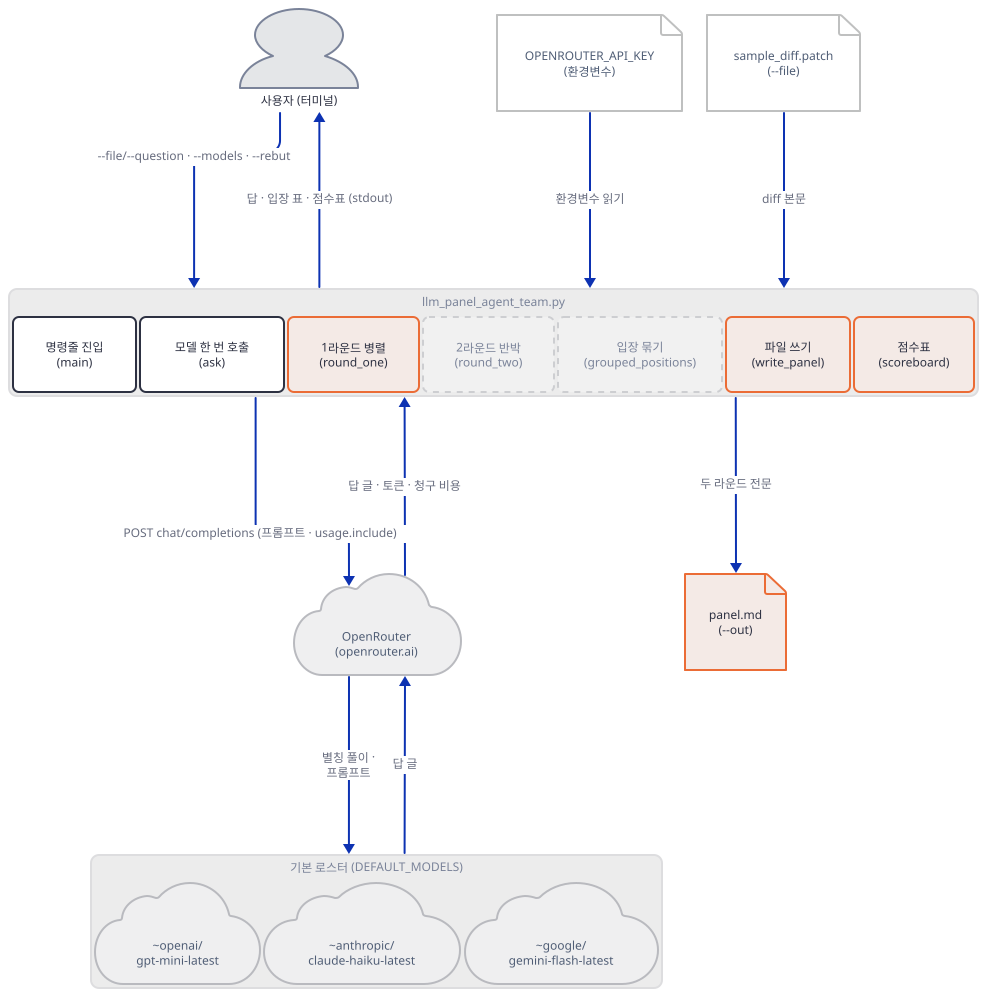

### Step 5. 2라운드 — 이름을 지우고 모델마다 따로 섞습니다

**목적.** `--rebut`가 모델마다 어떤 프롬프트를 만드는지, 익명화와 섞기가 서버 쪽에서 실제로 보이는지 확인합니다.

**할 일.**

`advanced_ai_agents/multi_agent_apps/agent_teams/llm_panel_agent_team/llm_panel_agent_team.py:150-174`

```python
def round_two(client, answers, prompt, timeout) -> None:
    ok = [a for a in answers if a.status == "ok"]
    if len(ok) < 2:
        print("rebuttal round skipped: it needs at least two answers to argue about\n")
        return
    print(f"round 2: {len(ok)} models read each other's findings, anonymised\n", flush=True)

    def one(me: Answer):
        # A fresh shuffle per model: if the letters or their order were fixed, position
        # alone would tell a model which rival wrote which review.
        others = [o for o in ok if o is not me]
        random.shuffle(others)
        letters = {o.model: L for o, L in zip(others, string.ascii_uppercase)}
        me.letters = {L: m for m, L in letters.items()}   # letter -> model, for grouping
        blocks = "\n\n".join(f"### Reviewer {letters[o.model]}\n{o.text}" for o in others)
        p = f"{prompt}\n\n---\n\nYour own review was:\n\n{me.text}\n\n---\n\n{REBUT_INSTRUCTIONS}{blocks}"
        me.rebuttal = ask(client, me.model, p, timeout)
        if me.rebuttal.status == "ok":
            me.positions = parse_positions(me.rebuttal.text)

    with ThreadPoolExecutor(len(ok)) as ex:
        list(ex.map(one, ok))
    for a in ok:
        r = a.rebuttal
        print(f"## {a.model} rebuts  ({r.status}, {r.seconds:.1f}s)\n\n{r.text}\n", flush=True)
```

2라운드에 들어오는 모델은 1라운드에서 `ok`였던 것뿐이고, 둘 미만이면 건너뜁니다(151-154행). 모델마다 `others`를 따로 섞고 A, B, C…를 붙이며, 그 글자 대 모델의 대응은 `me.letters`에 남깁니다. 프롬프트는 원래 질문, "너의 리뷰", `REBUT_INSTRUCTIONS`, 남의 리뷰 순입니다. 지시문의 핵심은 규칙 둘입니다.

`advanced_ai_agents/multi_agent_apps/agent_teams/llm_panel_agent_team/llm_panel_agent_team.py:71-75`

```python
    "Two rules that matter more than agreeing:\n"
    "1. Do NOT concede merely because someone disagreed with you. Concede only when you can "
    "point at what proves you wrong. A correct finding stays correct when it is unpopular.\n"
    "2. Do NOT invent agreement. If a finding is unverifiable from what you have, say so "
    "instead of endorsing it.\n\n"
```

**확인.**

```bash
OPENROUTER_API_KEY=sk-fake uv run --no-project python panel_local.py --file sample_diff.patch --rebut
```

(PowerShell은 Step 4처럼 `$env:OPENROUTER_API_KEY = "sk-fake"`를 먼저 둡니다. 이하 같습니다.)

`show_log.py 6`으로 `server.log`의 마지막 여섯 줄(1라운드 셋과 2라운드 셋)을 봅니다. 직접 확인한 출력입니다. `order_seen`은 가짜 서버의 대본 답에 붙은 번호(`#1` gpt, `#2` haiku, `#3` gemini)로 모델이 받은 Reviewer 순서입니다.

```text
~anthropic/claude-haiku-latest 1 1482 [] False 720.16
~google/gemini-flash-latest 1 1482 [] False 720.16
~openai/gpt-mini-latest 1 1482 [] False 720.16
~openai/gpt-mini-latest 2 3446 ['#2', '#3'] False 721.67
~anthropic/claude-haiku-latest 2 3446 ['#1', '#3'] False 721.67
~google/gemini-flash-latest 2 3446 ['#2', '#1'] False 721.67
```

다섯째 열 `False`는 프롬프트에 `gpt`·`claude`·`gemini`·`openai`·`anthropic`·`google`이 한 번도 나오지 않았다는 뜻입니다. 2라운드 프롬프트는 1,482자에서 3,446자로 약 2.3배가 됐고, 비용 열이 그만큼 불어납니다. 순서는 실행마다 다릅니다. 여섯 번 더 돌린 기록에서 모델마다 `['#1', '#3']`·`['#3', '#1']`처럼 갈렸고 같은 조합이 두 번 나온 날도 있었습니다. 2라운드 요청의 `t_in`이 721.67로 1라운드(720.16)보다 1.51초 늦은 것은 가장 느린 모델의 1라운드 응답(1.6초)을 기다린 값이고, 라운드 사이에는 이런 장벽이 있습니다.

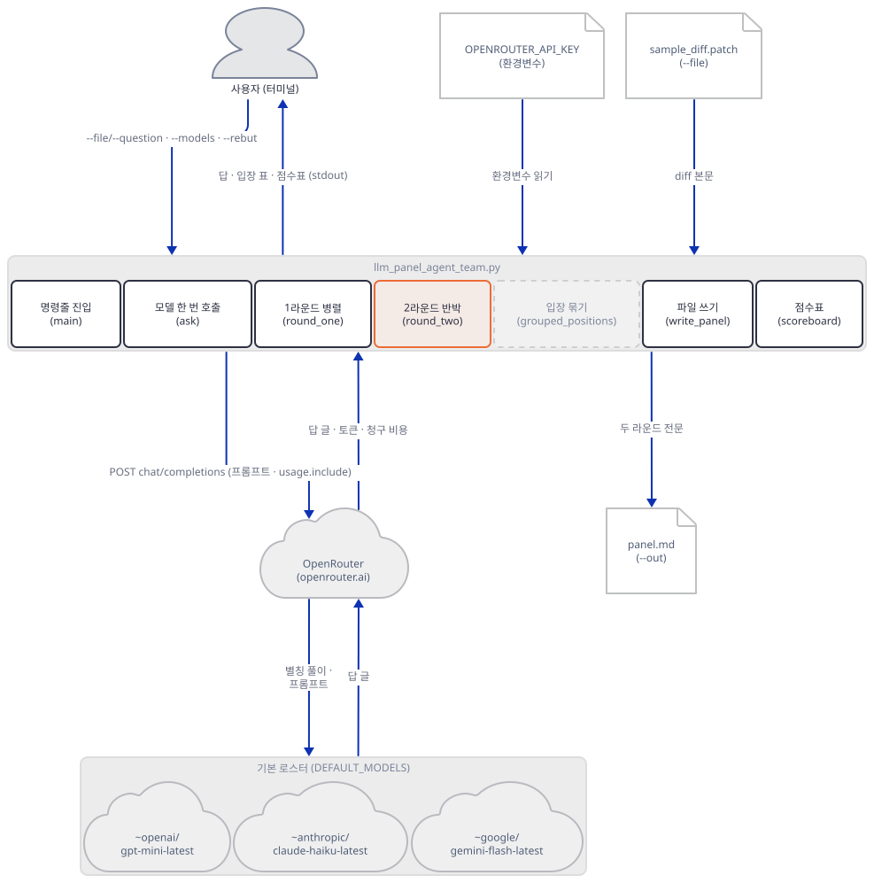

### Step 6. 입장 읽기와 묶기 — 라벨로 시작하는 줄만 입장입니다

**목적.** 반박 글에서 입장을 뽑는 정규식과, 그것을 문제 제기별로 묶고 CONTESTED를 붙이는 규칙을 봅니다.

**할 일.**

`advanced_ai_agents/multi_agent_apps/agent_teams/llm_panel_agent_team/llm_panel_agent_team.py:84-93`

```python
POSITION = re.compile(r"^[\s>*\-\d.)]*\**\s*(UPHOLD|REJECT|CONCEDE|MISSED)\b\**\s*:?(.*)$", re.M)
REFERENCE = re.compile(r"\b([A-Z]\d+)\b")


def parse_positions(text: str) -> list:
    """(label, reference) for every finding each position line argues about."""
    out = []
    for label, rest in POSITION.findall(text):
        out += [(label, ref) for ref in REFERENCE.findall(rest)]
    return out
```

입장은 줄이 네 라벨 중 하나로 열릴 때만 인정되고, 그 줄의 모든 `A1`·`B7` 꼴 참조가 대상이 됩니다.

`advanced_ai_agents/multi_agent_apps/agent_teams/llm_panel_agent_team/llm_panel_agent_team.py:177-200`

```python
def grouped_positions(answers) -> list[str]:
    """Round two, regrouped by the finding argued about instead of by who spoke."""
    rows = {}   # (author model, finding number) -> [(label, by model)]
    for a in answers:
        for lab, ref in a.positions:
            author = a.letters.get(ref[0])
            if author is None:
                continue          # a letter that was not in this model's packet
            row = rows.setdefault((author, int(ref[1:])), [])
            if (lab, a.model) not in row:   # one model arguing a finding twice is one position
                row.append((lab, a.model))
    # A rebuttal that arrived but parsed to nothing is reported, not dropped: otherwise a
    # model whose formatting the parser missed looks exactly like a model that stayed quiet.
    unparsed = [a.model for a in answers if a.rebuttal and a.rebuttal.status == "ok" and not a.positions]
    note = ([f"_No position could be read from the rebuttal of: {', '.join(unparsed)}. "
             "Their round-two text is still in full above._"] if unparsed else [])
    if not rows:
        return ["_No position cited a finding reference, so there is nothing to group._", *note]
    out = ["| finding | positions | contested |", "|---|---|---|"]
    for (author, n), ps in sorted(rows.items()):
        labels = {lab for lab, _ in ps}
        contested = "CONTESTED" if labels & {"REJECT"} and labels & {"UPHOLD", "MISSED"} else ""
        out.append(f"| {author} #{n} | " + "; ".join(f"{lab} ({by})" for lab, by in ps) + f" | {contested} |")
    return out + ([""] + note if note else [])
```

묶는 키는 `(문제를 낸 모델, 번호)`입니다. 이 모델의 packet에 없는 글자(`ref[0]`)는 버리고(183-184행), 한 모델이 같은 문제를 같은 라벨로 두 번 말하면 한 번만 셉니다(186-187행). 걸러내는 키가 `(라벨, 모델)`이라 같은 모델이 같은 문제에 UPHOLD와 REJECT를 함께 내면 둘 다 남습니다. CONTESTED는 REJECT가 있고 UPHOLD나 MISSED도 있을 때만입니다(198행). CONCEDE는 어느 쪽에도 안 셉니다. 반박이 와도 입장이 하나도 안 읽힌 모델은 이름을 대어 알립니다(190-192행).

**확인.** `parse_cases.py`로 저장해 실행합니다.

```python
import llm_panel_agent_team as m

cases = [
    "UPHOLD: B7 -- x",
    "* **UPHOLD: A1** -- x",
    "1. UPHOLD: Reviewer A1 / Reviewer B3 -- x",
    "**REJECT** B2 -- x",
    "I UPHOLD: B3 -- mid-sentence",
    "uphold: B3 -- lowercase",
    "### REJECT: A2",
    "UPHOLD: A1-A3",
]
for c in cases:
    print(repr(c), "->", m.parse_positions(c))
```

```bash
uv run --no-project python parse_cases.py
```

직접 확인한 출력입니다. 마크다운 굵게·목록·`Reviewer` 접두는 통과하고, 줄 중간의 라벨·소문자·제목(`###`)은 입장으로 읽히지 않으며, 범위 `A1-A3`은 `A2`를 빠뜨립니다.

```text
'UPHOLD: B7 -- x' -> [('UPHOLD', 'B7')]
'* **UPHOLD: A1** -- x' -> [('UPHOLD', 'A1')]
'1. UPHOLD: Reviewer A1 / Reviewer B3 -- x' -> [('UPHOLD', 'A1'), ('UPHOLD', 'B3')]
'**REJECT** B2 -- x' -> [('REJECT', 'B2')]
'I UPHOLD: B3 -- mid-sentence' -> []
'uphold: B3 -- lowercase' -> []
'### REJECT: A2' -> []
'UPHOLD: A1-A3' -> [('UPHOLD', 'A1'), ('UPHOLD', 'A3')]
```

Step 5의 실행이 낸 입장 표는 이렇습니다(직접 확인). 가짜 서버의 gemini 대본은 같은 문제를 두 번 REJECT하고 없는 Reviewer `C`를 CONCEDE하는데, 표에서는 한 번이고 `C`는 사라집니다. 문제 둘이 CONTESTED입니다.

```text
| finding | positions | contested |
|---|---|---|
| ~anthropic/claude-haiku-latest #2 | UPHOLD (~google/gemini-flash-latest) |  |
| ~anthropic/claude-haiku-latest #3 | UPHOLD (~openai/gpt-mini-latest); REJECT (~google/gemini-flash-latest) | CONTESTED |
| ~google/gemini-flash-latest #1 | MISSED (~openai/gpt-mini-latest); UPHOLD (~anthropic/claude-haiku-latest) |  |
| ~google/gemini-flash-latest #2 | MISSED (~openai/gpt-mini-latest) |  |
| ~openai/gpt-mini-latest #2 | REJECT (~anthropic/claude-haiku-latest) |  |
| ~openai/gpt-mini-latest #5 | MISSED (~anthropic/claude-haiku-latest); REJECT (~google/gemini-flash-latest) | CONTESTED |
```

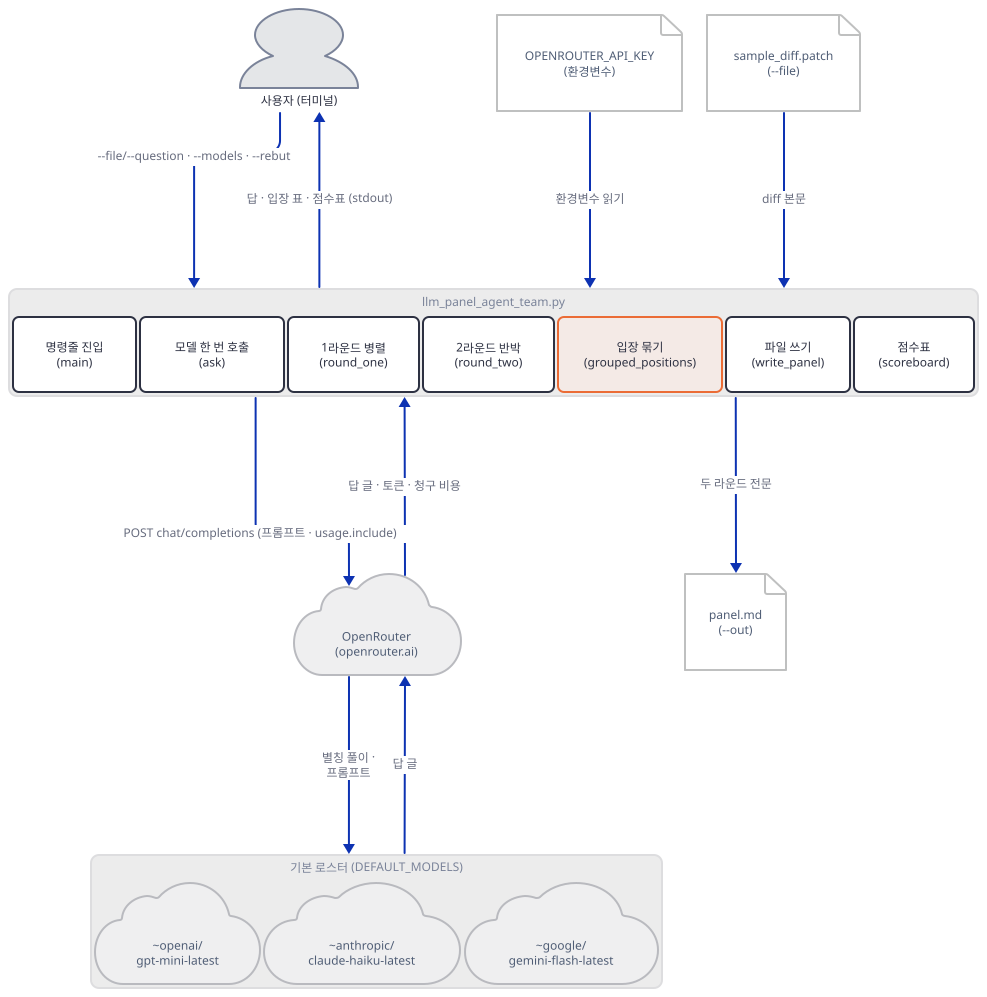

### Step 7. 점수표·panel.md·종료 코드 — 실패가 있으면 끝에서 알립니다

**목적.** 결과를 표와 파일로 남기고, 한 모델이 실패했을 때 어떻게 끝나는지 봅니다.

**할 일.**

`advanced_ai_agents/multi_agent_apps/agent_teams/llm_panel_agent_team/llm_panel_agent_team.py:203-224`

```python
def scoreboard(answers) -> list[str]:
    out = ["| model | status | time | tokens in/out | cost |", "|---|---|---|---|---|"]
    for a in answers:
        ti, to, c = a.tokens_in, a.tokens_out, a.cost
        if a.rebuttal:
            ti += a.rebuttal.tokens_in; to += a.rebuttal.tokens_out; c += a.rebuttal.cost
        out.append(f"| {a.model} | {a.status} | {a.seconds:.1f}s | {ti:,}/{to:,} | ${c:.4f} |")
    out.append(f"| **total** | | | | **${sum(a.cost + (a.rebuttal.cost if a.rebuttal else 0) for a in answers):.4f}** |")
    return out


def write_panel(path, answers, question, rebut):
    lines = ["# Panel", "", *scoreboard(answers), ""]
    if rebut:
        lines += ["## Positions by finding", "", *grouped_positions(answers), ""]
    lines += ["## Question", "", question, ""]
    for a in answers:
        lines += ["---", "", f"## {a.model}  ({a.status}, {a.seconds:.1f}s)", "", a.text, ""]
        if a.rebuttal:
            lines += [f"### {a.model} in the rebuttal round  ({a.rebuttal.status})", "", a.rebuttal.text, ""]
    with open(path, "w") as f:
        f.write("\n".join(lines))
```

비용은 응답의 `usage.cost`를 더한 것이고 1·2라운드가 한 줄로 합쳐집니다. 파일에는 점수표, 입장 표, 질문, 모델별 1·2라운드 전문이 차례로 들어갑니다. 끝부분입니다.

`advanced_ai_agents/multi_agent_apps/agent_teams/llm_panel_agent_team/llm_panel_agent_team.py:255-263`

```python
    if a.rebut:
        round_two(client, answers, prompt, a.timeout)
        print("## Positions by finding\n\n" + "\n".join(grouped_positions(answers)) + "\n")
    print("\n".join(scoreboard(answers)))
    write_panel(a.out, answers, question, a.rebut)
    print(f"\nfull panel written to {a.out}")
    failed = [x.model for x in answers if x.status != "ok"]
    if failed:
        sys.exit(f"{len(failed)} of {len(answers)} models did not answer: {', '.join(failed)}")
```

패널 파일은 실패가 있어도 먼저 쓰고, 그 뒤에 실패한 모델이 있으면 문구와 함께 종료 코드 1로 끝납니다.

**확인.** 존재하지 않는 id 하나를 넣어 돌립니다.

```bash
OPENROUTER_API_KEY=sk-fake uv run --no-project python panel_local.py --file sample_diff.patch --rebut --models "~openai/gpt-mini-latest,~anthropic/claude-haiku-latest,~google/gemini-flash-latest,openai/gpt-5.4-mini-retired-example" --out panel_err.md
echo $?
```

(PowerShell은 `$env:OPENROUTER_API_KEY = "sk-fake"`를 먼저 두고, 종료 코드는 `$?`가 아니라 `$LASTEXITCODE`로 봅니다. 실행해 보지 못했습니다.)

직접 확인한 결과입니다. 표에는 `error` 행이 있고(`0/0` 토큰, `$0.0000`), 2라운드는 남은 셋이 진행했으며, 마지막에 문구와 종료 코드가 나옵니다. `panel_err.md`에도 같은 행과 오류 전문이 있습니다.

```text
| openai/gpt-5.4-mini-retired-example | error | 0.1s | 0/0 | $0.0000 |
| **total** | | | | **$0.0049** |

full panel written to panel_err.md
1 of 4 models did not answer: openai/gpt-5.4-mini-retired-example
1
```

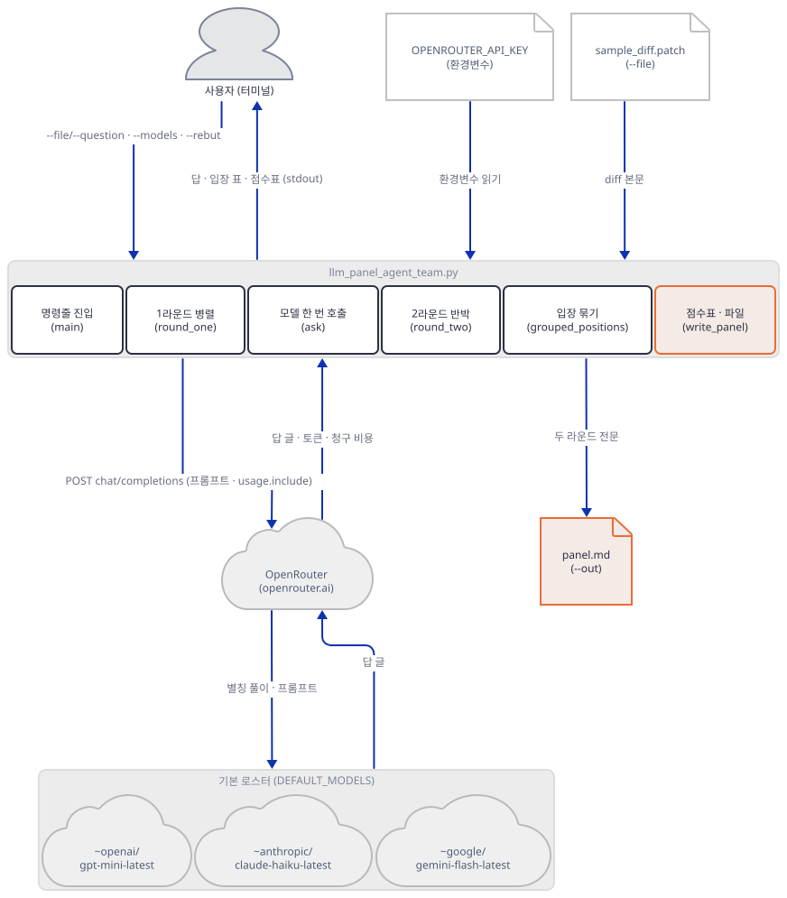

## 요청 한 건이 흐르는 과정

`python llm_panel_agent_team.py --file sample_diff.patch --rebut` 한 번의 흐름입니다. 먼저 `main`이 키를 읽고 패치 파일을 엽니다. 키가 없으면 여기서 끝납니다.

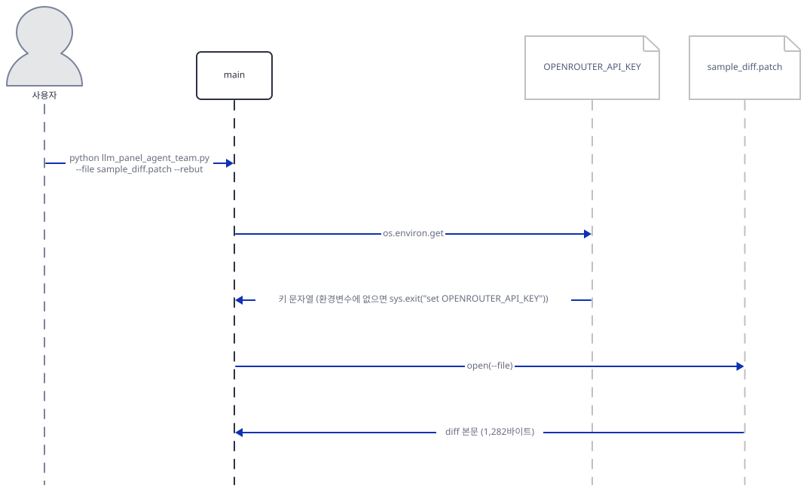

1라운드입니다. 모델마다 스레드가 `ask`를 부르고, 각각이 OpenRouter에 같은 프롬프트를 보냅니다.

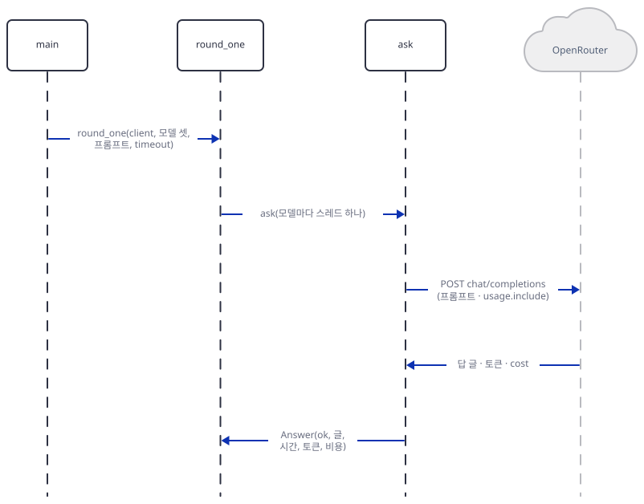

답이 오는 대로 `round_one`이 사용자에게 찍고, 끝나면 모델 순서의 목록을 `main`에 돌려줍니다.

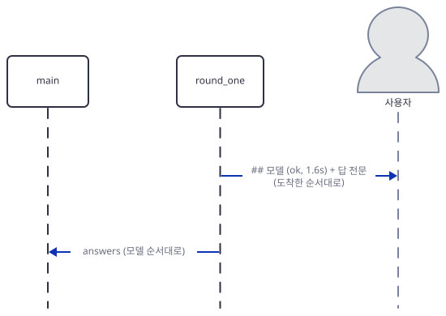

2라운드는 같은 `ask`를 다른 프롬프트로 부릅니다. 모델마다 내 답과 섞은 남의 답을 보냅니다.

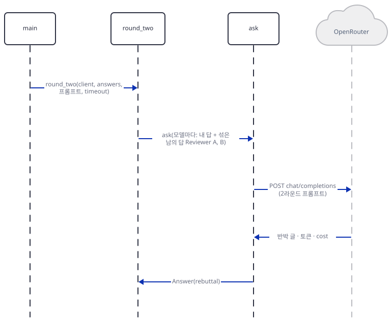

받은 반박 글은 `parse_positions`가 읽고, 끝난 뒤 `round_two`가 반박 전문을 찍고 돌아갑니다.

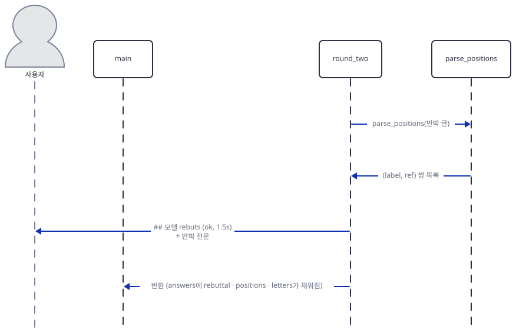

그다음 `main`이 입장 표와 점수표를 찍습니다.

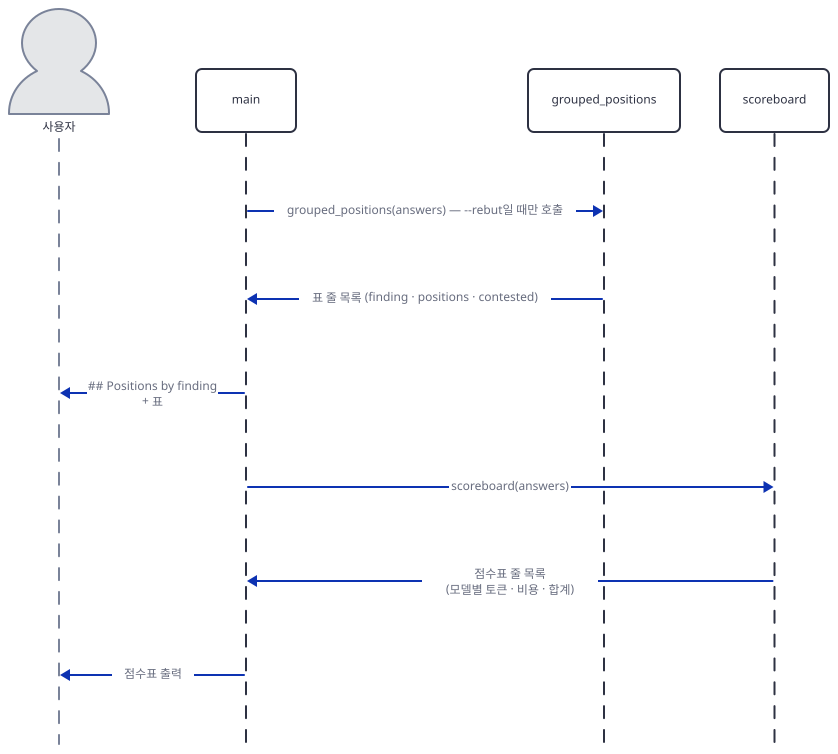

마지막으로 `write_panel`이 파일을 씁니다. 파일을 쓰는 중에 점수표와 입장 표를 다시 만들기 때문에 같은 함수가 한 번 더 불립니다.

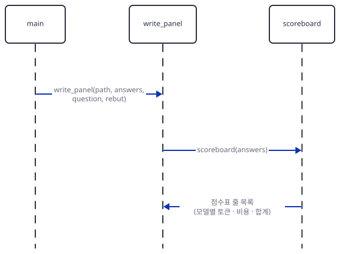

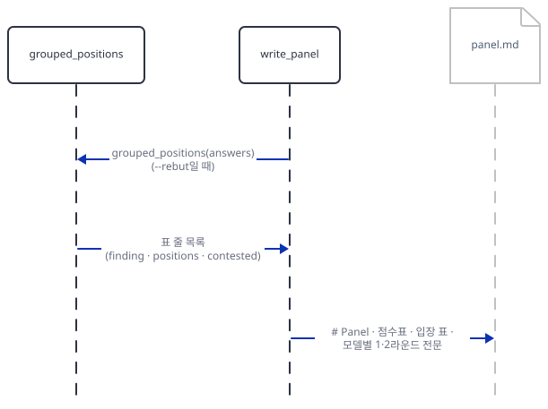

실패한 모델이 없으면 완료 문구로, 있으면 오류 문구와 종료 코드 1로 끝납니다.

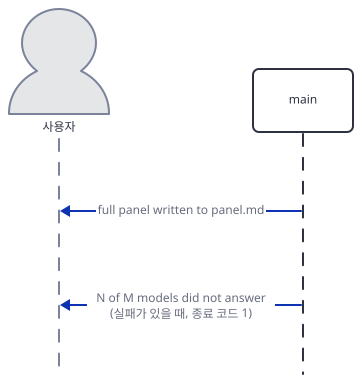

## 실행 체크리스트

- [ ] `uv pip install -r requirements.txt`로 14개가 설치됐다
- [ ] 키 없이 돌리면 `set OPENROUTER_API_KEY` 문구와 종료 코드 1이다
- [ ] `fake_openrouter.py`가 `allow_reuse_address = False`로 비어 있는 포트에 떠 있다
- [ ] 복사본과 원본의 `diff`가 243행 한 줄만 보인다
- [ ] 1라운드 출력은 끝난 순서이고 표는 `--models` 순서다
- [ ] 서버 기록에서 1라운드 `prompt_chars`가 모두 같고 `t_in`이 0.03초 안에 모여 있다
- [ ] 2라운드의 `order_seen`이 모델마다 다르고 다섯째 열이 모두 `False`다
- [ ] 입장 표에 CONTESTED가 보이고, 없는 Reviewer 글자는 표에서 사라졌다
- [ ] 없는 모델 id가 `error` 행이 되고 종료 코드 1이다

## 문제 해결

| 증상 | 원인 | 해결 |
|---|---|---|
| `set OPENROUTER_API_KEY (https://openrouter.ai/keys)`와 종료 코드 1 | 환경변수가 없음. 인자 검사 뒤, 파일을 열기 전에 확인한다 | 실제 사용은 발급한 키, 이 문서의 가짜 서버는 `sk-fake` |
| `one of the arguments --question --file is required`, 종료 코드 2 | 질문도 파일도 주지 않음 | 둘 중 하나를 준다. 둘 다 주면 argparse가 거부한다 |
| 모델 행마다 `APIConnectionError: Connection error.`가 약 7초 뒤에 뜨고 `3 of 3 models did not answer` | 가짜 서버가 떠 있지 않거나 `sed`로 바꾼 포트가 서버와 다름 | 서버 터미널과 `panel_local.py`의 포트를 맞춘다 |
| `OSError: [WinError 10048]` | 그 포트를 다른 프로그램이 이미 씀. `allow_reuse_address = False`이니 겹쳐 뜨지 않고 오류로 끝나는 것이 정상 | 49152~65535에서 다른 포트를 고른다 |
| `OSError: [WinError 10013]` | 고른 포트가 Windows가 예약한 제외 대역 안에 있음 | `netsh int ipv4 show excludedportrange protocol=tcp`로 대역을 보고 밖의 포트를 고른다 |
| `... is not a valid model ID`와 `-> ... is not a model id OpenRouter serves` | 모델 id가 틀렸거나 거둬짐. 앱이 카탈로그 주소를 덧붙인 것 | https://openrouter.ai/models에서 현재 id를 고른다. 그 모델 행만 `error`이고 나머지는 끝까지 간다 |
| 한국어 Windows에서 답을 받은 뒤 `UnicodeEncodeError: 'cp949' codec can't encode character '\u2014'`, 종료 코드 1 | 답의 em dash를 로캘 인코딩(cp949)으로 쓰지 못함. 출력이 파이프나 파일이면 `round_one`의 `print`에서 죽어 `panel.md`가 없다. 가짜 서버를 `FAKE_DASH=gpt-mini`로 띄워 재현했다. PowerShell·cmd 콘솔 창에서는 CPython 3.6 이상이 콘솔에 UTF-8로 쓰므로(PEP 528) `print`는 통과하고 `write_panel`의 `open(path, "w")`(224행 `f.write`)에서 같은 오류가 나 0바이트 `panel.md`가 남을 것이다(콘솔 창은 열 수 없어 실행해 보지 못했다) | `python -X utf8`나 `PYTHONUTF8=1`은 두 경우 모두 고친다. 출력만 고치려고 `PYTHONIOENCODING=utf-8`을 주면 `write_panel`에서 죽어 0바이트 `panel.md`가 남는다(직접 확인) |
| `rebuttal round skipped: it needs at least two answers to argue about` 뒤에 `No position cited a finding reference...` | `--rebut`인데 답한 모델이 하나 이하. 종료 코드는 0 | 모델을 둘 이상 준다 |
| `No position could be read from the rebuttal of: <모델>` | 반박이 라벨 없는 산문이라 입장이 하나도 안 읽힘. `FAKE_PROSE=gemini-flash`로 재현 | 전문은 `panel.md`와 출력에 있으니 직접 읽는다 |
| 같은 모델을 `--models`에 두 번 줬는데 호출은 4건이고 점수표 두 줄이 같고, 2라운드 프롬프트에 리뷰어 글이 없음 | 결과를 모델 id로 모아(`answers[a.model]`) 두 줄이 같은 객체이고, 2라운드의 `others`가 비어 버림 | 같은 id를 두 번 주지 않는다 |

## 더 해보기

- 출력 인코딩을 앱 쪽에서 고쳐 봅니다. 복사본의 `write_panel`에서 `open(path, "w")`를 `open(path, "w", encoding="utf-8")`로, `main`의 `ap.parse_args()` 다음 줄에 `sys.stdout.reconfigure(encoding="utf-8")`를 더합니다. 이 문서는 이렇게 고친 복사본이 `FAKE_DASH` 서버에서 종료 코드 0으로 끝나고 `panel.md`에 em dash가 들어가는 것을 확인했습니다.
- 라벨 읽기를 넓혀 봅니다. `advanced_ai_agents/multi_agent_apps/agent_teams/llm_panel_agent_team/llm_panel_agent_team.py:84`의 `POSITION`이 `###`와 소문자를 못 읽는 것을 Step 6의 `parse_cases.py`로 보였습니다. 정규식과 `advanced_ai_agents/multi_agent_apps/agent_teams/llm_panel_agent_team/llm_panel_agent_team.py:85`의 `REFERENCE`를 손봐 `A1-A3` 같은 범위를 펼치고, 사례가 모두 기대대로 나오는지 확인하세요. 같은 모델이 같은 문제에 UPHOLD와 REJECT를 함께 내면 그 모델 혼자 CONTESTED를 만드는 것도 `grouped_positions`에 입장을 직접 넣어 보세요.
- 같은 모델 id가 두 번 들어오면 거부하거나, `answers`를 id가 아니라 위치로 모으도록 `round_one`을 고쳐 봅니다. 문제 해결의 마지막 줄 증상이 사라져야 합니다. 그다음 `--models`에 고정 id를 줘 별칭 대신 재현 가능한 패널을 만들어 보세요.

## 다음 날 예고

[Day 127 · 📑 Notion MCP Agent](../day127-notion-mcp-agent/README.md) — 볼륨 9 "♾️ MCP AI Agents"의 첫날입니다. 원본 앱 `notion_mcp_agent.py`(124줄, 마지막 줄에 개행이 없어 `wc -l`은 123)는 agno의 `Agent`에 `MCPTools`를 붙이고 `mcp`의 `StdioServerParameters`로 Notion 쪽 MCP 서버와 이야기하도록 되어 있습니다(소스의 import로 확인). 이 볼륨의 앱들이 MCP를 어떻게 쓰는지는 내일부터 소스로 확인합니다.
